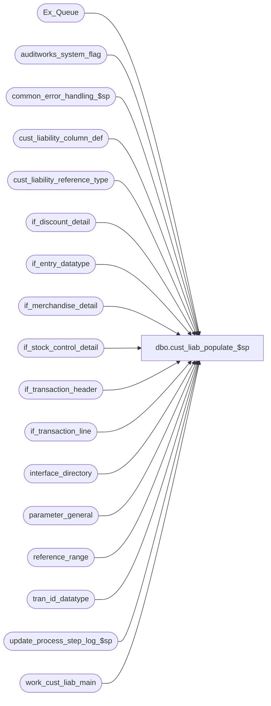

# dbo.cust_liab_populate_$sp

**Database:** auditworks  
**Server:** bedrockdb01  

## Architecture Diagram



## Table Dependencies

| Referenced Table |
|---|
| Ex_Queue |
| auditworks_system_flag |
| common_error_handling_$sp |
| cust_liability_column_def |
| cust_liability_reference_type |
| if_discount_detail |
| if_entry_datatype |
| if_merchandise_detail |
| if_stock_control_detail |
| if_transaction_header |
| if_transaction_line |
| interface_directory |
| parameter_general |
| reference_range |
| tran_id_datatype |
| update_process_step_log_$sp |
| work_cust_liab_main |

## Stored Procedure Code

```sql
create proc dbo.cust_liab_populate_$sp 
@process_id             binary(16),
@user_id		int,
@function_no		smallint,
@transaction_id		tran_id_datatype,
@store_no		int,
@transaction_date	smalldatetime,
@inserted_rows		int OUTPUT,
@errmsg			nvarchar(2000) OUTPUT,
@log_error_flag		tinyint = 0,  -- 1 if called by smartload
@edit_process_no 	tinyint = 1,
@min_serial_no		numeric(14,0),
@max_serial_no		numeric(14,0)

AS 

/*
**  Name: cust_liab_populate_$sp
**  Description: Called by cust_liability_edit_$sp.
**               Populates work_cust_liab_main and sets the tracking_id
**               and key_store_no based on tables cust_liability_type
**               and cust_liability_reference_type.
**               The edit calls this proc twice, with the second call being via cust_liability_revalidate_$sp.
**  Note: At present, the CL logic only exists in the main SA db, and edit stream 1 posts customer liability txns for all streams.

	Can use same version for 5.0 and 5.1

HISTORY:
Date      Name          Defect#  Description
Feb24,15  Paul         T-105255  Handle multi-stream trickle when also using the trickle audit configuration
Jun05,13  Vicci          144184  For location_store_no update (location_update_flag), handle factor -1 (removal/nullification) and give source store precedence over fulfillment store for reservation and transfer out (171 and 40) actions.
May03,13  Vicci          143592  Support option of logging last scheduled payment date to expiry date.
Aug03,12  Vicci          137378  Ensure that @inserted_rows is returned even when there are only vouchers treated as discounts in the batch (otherwise revalidate won't run).
Feb06,12  Paul           132404  If deleting trans, avoid rejecting when tran is void and ref no is null (treat like void line)
Dec07,11  Vicci          131674  If the line to which the discount is applied is void don't count its amount;  
                                 Avoid flags set by discounts being multiplied by number of lines to which discount is applied.
                                 Ensure coupon-style discounts whose # to be tracked is provided in a reference-type / reference# attachment
                                 are also included.
Nov22,10  Vicci          122171  Log units for gift-card orders.
Nov02,10  Vicci          122171  Support receiving reference_type / reference_no in an attachment, since for certain
                                 types of transaction lines (gift card order deliveries for example), 2 reference_no apply.
Sep21,10  Paul         1-45QZZV  When a tran contains only voided discount lines that apply to CL, flag as 50 and skip,
					removed references to obsolete function 11 (CL conversion).
Aug04,10  Vicci        119571    Only post reference type whose C/L tracking definition is active to C/L;  log date_4.
Apr08,09  Vicci        109078    Log sku_id to work_cust_liab_main and work_cust_liab_detail_hist in order to support
Jun06,08  Paul          87777    apply 1-3Y5VOA to SA5
Dec14,07  Paul          95609    Flag transactions containing only void lines as posted
Oct31,07  Paul          86842    apply 96978 to SA5
Apr11,07  Paul          DV-1356  Use coalesce and case commands to avoid data overflow
Mar26,07  Phu           84682    Discount for GLC are not posted due incorrect outer join done by D#77931, port 80127.
Oct25,06  Phu           77931    Fix outer join for SQL 2005 Mode 90.
Oct02,06  Paul          77922    populate transaction_no, transaction_series in work_cust_liab_main, apply 77740 to SA5
Sep02,05  Paul          DV-1312  apply 42197 to SA5
Apr28,05  David         DV-1202  Handle header-level stock control attachment.
          Paul                   expand transaction_id to use tran_id_datatype
Jan06,05  Paul          DV-1191  add locking hints
Oct14,04  David         DV-1146  Use user_id. apply 42750 to SA5
Sep02,04  David         DV-1129  Handle line_object_type 23 (PLU subtotal discounts)
Apr23,04  Maryams       DV-1071  Receive @process_id
Jun04,08  Paul          1-3Y5VOA use process_id in where clause, added nolock hints
Jan14,08  Paul          96978    Flag transactions containing only void lines as posted,
              Ignore void lines when reference_no is null (don't reject and don't post)
Nov15,06 Vicci         80127    Recognize header-level C/L Issuance expiry date attachment.
Sep27,06  Vicci         77740    Include voided transactions if I/F wants voids
Dec16,04  Daphna        46166    Add ISNULL to so.display_def_id for reassignment_flag
Oct14,04  David         42750    Add check to so.display_def_id to WHERE clause.
Sep30,04  Daphna        42197    use original tracking_id for CL conversion (stored in if_transaction_header.tender_total)
Jul15,04  Vicci         29561    Handle line_object_type 23 (PLU subtotal discounts)
Oct27,03  David         17189   Performance enhancements
Mar13,03  David         6683     If ref_no null, set validation_id to be 97 instead of 1097.
Oct18,02  David         1-G1KTR  Set unformatted_reference_no.
Oct16,02  David         1-G1761  Use line_sequence in addition to interface_control_flag to know if tran line is
                                 an IN or OUT. In case of archived tran mod interface_control_flag is 10 for both.
Jul26,02  David         1-E24RE  Set ref_no_too_long_flag
May10,02  Daphna        1-BMK21  Progress Monitor for @function_no 4,5,11 and truncate
				 instead of deleting if in conversion.
Dec13,01  David C       AW-8415  R3 customer liability. 

*/

DECLARE 
	@check_stream			tinyint,
	@cursor_open			tinyint,
	@errno				int,
	@if_entry_no			if_entry_datatype,
	@interface_voided_transactions  tinyint,
	@message_id			int,
	@object_name			nvarchar(255),
	@operation_name			nvarchar(100),
	@process_name			nvarchar(100),
	@process_no 			smallint,
	@retry				int,
	@rows				int,
	@source_process_no		smallint,
	@trickle_polling_flag		tinyint,
	@work_sum			int


SELECT @process_no = 228,
       @process_name = 'cust_liab_populate_$sp',
       @message_id = 201068,
       @inserted_rows = 0,
       @source_process_no = @function_no,
       @cursor_open = 0,
       @check_stream = 0;

SELECT @errmsg = 'Failed to read table parameter_general. ',
         @object_name = 'parameter_general',
         @operation_name = 'SELECT';
SELECT @trickle_polling_flag = ISNULL(trickle_polling_flag,0)
  FROM parameter_general;

IF @function_no IN (4,5)
  BEGIN
   SELECT @source_process_no = 1; /* because source_process_no = 1 in if_tran_header for both edit phase 1 and 2 */

   IF @trickle_polling_flag >= 2 -- trickle audit
     SELECT @check_stream = 1;
  END;

SELECT @interface_voided_transactions = interface_voided_transactions
  FROM interface_directory
 WHERE interface_id = 28
SELECT @errno = @@error
IF @errno !=0 
BEGIN
  SELECT @errmsg='Failed to determine if voided vouchers should feed C/L',
	@object_name = 'interface_directory',
	@operation_name = 'SELECT'
  GOTO error
END

IF @interface_voided_transactions IS NULL
  SELECT @interface_voided_transactions = 0

DELETE work_cust_liab_main
 WHERE process_id = @process_id
SELECT @errno = @@error
IF @errno !=0 
BEGIN
  SELECT @errmsg='Failed to delete work_cust_liab_main',
         @object_name = 'work_cust_liab_main',
         @operation_name = 'DELETE'
  GOTO error
END

IF @source_process_no = 1 AND @trickle_polling_flag >= 2
  BEGIN
   /* lock a row to prevent simultaneous population by multiple trickle edit streams and edit phase 2. */
   BEGIN TRANSACTION;
    -- using datetime column from an existing flag for locking purposes
   UPDATE auditworks_system_flag
     SET flag_datetime_value = getdate()
    WHERE flag_name = 'last_trickle_stream_updated';
  END;

-- Populate work table

-- Populate layaway/order-style discount lines.
-- Done separately in order to obtain the merch/fee line object to which the discount was applied (as line_object and discount line object as discount_line_object ) and its upc if any
INSERT work_cust_liab_main (
  	process_id, 
	function_no, 
	if_entry_no,
	line_id,
	line_action,
	line_object,
	line_object_type,
	store_no,
	key_store_no,
	original_key_store_no,
	default_issuing_store_no,
	default_issuance_date,
	amount,
	interface_control_flag,
	tracking_id,
	reference_no_datatype,
	reference_no_length,
	ref_no_too_long_flag,
	reference_range_lookup,
	rejected_status,
	rejected_validation_id,
	transaction_id,
	transaction_no,
	transaction_series,
	transaction_category,
	transaction_date,
	entry_date_time,
	transaction_void_flag,
	upc_no,
	upc_lookup_division,
	units,
	liability_amount,
	receivable_amount,
	amount_3,
	amount_4,
	amount_5,
	amount_6,
	amount_7,
	amount_8,
	amount_9,
	amount_10,
	stocked_amount,
	stocked_flag,
	stocked_stolen_flag,
	issued_flag,
	stolen_from_cust_flag,
	forfeited_flag,
	amount_outstanding,
	units_outstanding,
	units_2,
	units_3,
	units_4,
	units_5,
	unit_amount_flag,
	reference_type,
	reference_no,
	original_reference_no,
	unformatted_reference_no,
	employee_no,
	reversal_flag,
	cust_update_flag,
	reassignment_flag,
	expiry_days,
	discount_line_object,
	sku_id,
	fulfillment_store_no,
	location_update_flag )
   SELECT
	@process_id, 
	h.source_process_no, --needed in cust_liability_history - tran mod 100 and 102
	h.if_entry_no,
	tl.line_id,
	MAX((1 - 
	  CASE WHEN (@source_process_no IN (30,35,40) AND tl.reference_no IS NULL AND h.transaction_void_flag BETWEEN 1 AND 7) THEN 1
	  ELSE SIGN(tl.line_void_flag + tla.line_void_flag) END) * tl.line_action), -- will be zero for void lines
	tla.line_object,
	MAX(tl.line_object_type),
	h.store_no,
	CASE WHEN clrt.unique_by_store_key = 1 THEN COALESCE(so.other_store_no, so.originating_store_no, h.store_no)
	 ELSE -1
	END, --key_store_no
        CASE WHEN clrt.unique_by_store_key = 1 THEN COALESCE(so.originating_store_no, h.store_no)
	 ELSE -1
	END, --original_key_store_no
	COALESCE(so.other_store_no, so.originating_store_no, h.store_no), --default_issuing_store
	IsNull(so.count_date, h.transaction_date), --default_issuance_date
	(1 - SIGN(tl.line_void_flag + tla.line_void_flag)) * td.pos_discount_amount * tl.voiding_reversal_flag,
	x.key_2, 
	IsNull(sign(sign(employee_no)+1) * employee_tracking_id, (1-sign(abs(transaction_category-242)))
	 * IsNull(import_tracking_id, default_tracking_id) 
	 + sign(abs(transaction_category-242)) * default_tracking_id), --tracking_id
	clrt.reference_no_datatype,
	clrt.reference_no_length,
	MAX( 1- SIGN( SIGN(clrt.reference_no_length - ISNULL(LEN(tl.reference_no),0)) + 1) ), --ref_no_too_long_flag
	clrt.reference_range_lookup,
	Sign( 1-IsNull(sign(LEN(tl.reference_no  )),0) + ((1-abs(IsNull(sign(so.pos_identifier_type-100),1))) 
	   * (1-IsNull(sign(LEN(so.pos_identifier)),0))) ), --rejected_status
	Sign( 1-IsNull(sign(LEN(tl.reference_no  )),0) + ((1-abs(IsNull(sign(so.pos_identifier_type-100),1))) 
	   * (1-IsNull(sign(LEN(so.pos_identifier)),0))) ) * 97, --rejected_validation_id --6683
	h.transaction_id,
	h.transaction_no,
	h.transaction_series,
	h.transaction_category, 
	h.transaction_date,	
	h.entry_date_time,
	h.transaction_void_flag,
	md.upc_no, 
	md.upc_lookup_division,
	0, -- no units
	SUM((1 - SIGN(tl.line_void_flag + tla.line_void_flag)) * (ABS((SIGN(ABS(1 - cld.column_no)) - 1)))  * ABS(SIGN(ABS(cld.unit_amount_flag-1))-1) * td.pos_discount_amount * cld.factor * tl.voiding_reversal_flag),
	SUM((1 - SIGN(tl.line_void_flag + tla.line_void_flag)) * (ABS((SIGN(ABS(2 - cld.column_no)) - 1)))  * ABS(SIGN(ABS(cld.unit_amount_flag-1))-1) * td.pos_discount_amount * cld.factor * tl.voiding_reversal_flag), -- receivable_amount
	SUM((1 - SIGN(tl.line_void_flag + tla.line_void_flag)) * (ABS((SIGN(ABS(3 - cld.column_no)) - 1)))  * ABS(SIGN(ABS(cld.unit_amount_flag-1))-1) * td.pos_discount_amount * cld.factor * tl.voiding_reversal_flag), -- amount_3
	SUM((1 - SIGN(tl.line_void_flag + tla.line_void_flag)) * (ABS((SIGN(ABS(4 - cld.column_no)) - 1))) * ABS(SIGN(ABS(cld.unit_amount_flag-1))-1) * td.pos_discount_amount * cld.factor * tl.voiding_reversal_flag), -- amount_4
	SUM((1 - SIGN(tl.line_void_flag + tla.line_void_flag)) * (ABS((SIGN(ABS(5 - cld.column_no)) - 1)))  * ABS(SIGN(ABS(cld.unit_amount_flag-1))-1) * td.pos_discount_amount * cld.factor * tl.voiding_reversal_flag), -- amount_5
	SUM((1 - SIGN(tl.line_void_flag + tla.line_void_flag)) * (ABS((SIGN(ABS(6 - cld.column_no)) - 1)))  * ABS(SIGN(ABS(cld.unit_amount_flag-1))-1) * td.pos_discount_amount * cld.factor * tl.voiding_reversal_flag), -- amount_6
	SUM((1 - SIGN(tl.line_void_flag + tla.line_void_flag)) * (ABS((SIGN(ABS(7 - cld.column_no)) - 1)))  * ABS(SIGN(ABS(cld.unit_amount_flag-1))-1) * td.pos_discount_amount * cld.factor * tl.voiding_reversal_flag), -- amount_7
	SUM((1 - SIGN(tl.line_void_flag + tla.line_void_flag)) * (ABS((SIGN(ABS(8 - cld.column_no)) - 1)))  * ABS(SIGN(ABS(cld.unit_amount_flag-1))-1) * td.pos_discount_amount * cld.factor * tl.voiding_reversal_flag), -- amount_8
	SUM((1 - SIGN(tl.line_void_flag + tla.line_void_flag)) * (ABS((SIGN(ABS(9 - cld.column_no)) - 1))) * ABS(SIGN(ABS(cld.unit_amount_flag-1))-1) * td.pos_discount_amount * cld.factor * tl.voiding_reversal_flag), -- amount_9
	SUM((1 - SIGN(tl.line_void_flag + tla.line_void_flag)) * (ABS((SIGN(ABS(10 - cld.column_no)) - 1))) * ABS(SIGN(ABS(cld.unit_amount_flag-1))-1) * td.pos_discount_amount * cld.factor * tl.voiding_reversal_flag), -- amount_10
	SUM((1 - SIGN(tl.line_void_flag + tla.line_void_flag)) * (ABS((SIGN(ABS(11 - cld.column_no)) - 1))) * ABS(SIGN(ABS(cld.unit_amount_flag-1))-1) * td.pos_discount_amount * cld.factor * tl.voiding_reversal_flag), -- stocked_amount
	SIGN(SUM((1 - SIGN(tl.line_void_flag + tla.line_void_flag)) * (ABS((SIGN(ABS(1 - cld.column_no)) - 1))) * ABS(ABS(SIGN(cld.unit_amount_flag-2)) -1) * cld.factor * tl.voiding_reversal_flag * SIGN(tl.line_sequence) * ((SIGN(ABS(x.key_2 - 20))*2 -1)) )), -- stocked_flag
	SIGN(SUM((1 - SIGN(tl.line_void_flag + tla.line_void_flag)) * (ABS((SIGN(ABS(2 - cld.column_no)) - 1))) * ABS(ABS(SIGN(cld.unit_amount_flag-2)) -1) * cld.factor * tl.voiding_reversal_flag * SIGN(tl.line_sequence) * ((SIGN(ABS(x.key_2 - 20))*2 -1)) )), -- stocked_stolen_flag	
	SIGN(SUM((1 - SIGN(tl.line_void_flag + tla.line_void_flag)) * (ABS((SIGN(ABS(3 - cld.column_no)) - 1))) * ABS(ABS(SIGN(cld.unit_amount_flag-2)) -1) * cld.factor * tl.voiding_reversal_flag * SIGN(tl.line_sequence) * ((SIGN(ABS(x.key_2 - 20))*2 -1)) )), -- issued_flag
	SIGN(SUM((1 - SIGN(tl.line_void_flag + tla.line_void_flag)) * (ABS((SIGN(ABS(4 - cld.column_no)) - 1))) * ABS(ABS(SIGN(cld.unit_amount_flag-2)) -1) * cld.factor * tl.voiding_reversal_flag * SIGN(tl.line_sequence) * ((SIGN(ABS(x.key_2 - 20))*2 -1)) )), -- stolen_from_cust_flag	
	SIGN(SUM((1 - SIGN(tl.line_void_flag + tla.line_void_flag)) * (ABS((SIGN(ABS(5 - cld.column_no)) - 1))) * ABS(ABS(SIGN(cld.unit_amount_flag-2)) -1) * cld.factor * tl.voiding_reversal_flag * SIGN(tl.line_sequence) * ((SIGN(ABS(x.key_2 - 20))*2 -1)) )), -- forfeited_flag	
	SUM((1 - SIGN(tl.line_void_flag + tla.line_void_flag)) * (ABS((SIGN(ABS(1 - cld.column_no)) - 1))) * ABS(SIGN(cld.unit_amount_flag)-1) * (td.pos_discount_amount) * cld.factor * tl.voiding_reversal_flag ), -- amount_outstanding
	0, 0, 0, 0, 0, --no need for units to be calculated since they are zero for discounts
	MIN(unit_amount_flag),
	tl.reference_type,
	SUBSTRING( RIGHT('00000000000000000000' + IsNull(so.pos_identifier,tl.reference_no), clrt.reference_no_length) 
	         + RIGHT('00000000000000000000' + tl.reference_no, clrt.reference_no_length), --2 part string
	         (abs(IsNull(sign(so.pos_identifier_type-100),1)) * clrt.reference_no_length) + 1,  --starting position
	         clrt.reference_no_length), --string length, end of SUBSTRING
	RIGHT('00000000000000000000' + tl.reference_no, clrt.reference_no_length), --original_reference_no
	MAX(tl.reference_no),
	h.employee_no,
	1 - sign( abs(x.key_2 - 20) * (tl.voiding_reversal_flag + 1) 
	 * (sign(tl.line_sequence)+1) ), --reversal_flag
	MAX((1 - SIGN(tl.line_void_flag + tla.line_void_flag)) * Sign( (1-sign(abs(cld.unit_amount_flag-2))) + (1-sign(abs(cld.unit_amount_flag-3))) ) 
	 * ( 1-sign(abs(cld.column_no-3)) )), --cust_update_flag
	SIGN( (1 - SIGN(tl.line_void_flag + tla.line_void_flag)) * IsNull(sign(so.other_store_no+1), 0) + (1-abs(IsNull(sign(so.pos_identifier_type-100),1))) )
         * SIGN( 1-ABS(sign(ISNULL(so.display_def_id,0)-29)) + 1-ABS(sign(ISNULL(so.display_def_id,0)-30)) ), --reassignment_flag, other_store_no can be 0
	MAX((1 - SIGN(tl.line_void_flag + tla.line_void_flag)) * IsNull(so.units,0)), --expiry_days
	MAX(tl.line_object),
	md.sku_id,
	MAX(COALESCE(CASE WHEN tl.line_action  IN (40, 171) THEN md.source_store_no ELSE NULL END, md.fulfillment_store_no, md.source_store_no, CASE WHEN cld.unit_amount_flag = 3 AND cld.column_no = 4 THEN COALESCE(so.other_store_no, h.store_no) ELSE NULL END)),
	MAX(CASE WHEN cld.unit_amount_flag = 3 AND cld.column_no = 4 THEN CASE WHEN cld.factor >= 0 THEN 1 ELSE cld.factor END ELSE 0 END) --location_update_flag
   FROM Ex_Queue x
        INNER JOIN if_transaction_header h WITH (NOLOCK) ON (h.if_entry_no = x.key_1)
        INNER JOIN if_transaction_line tl WITH (NOLOCK) ON (h.if_entry_no = tl.if_entry_no)  
        INNER JOIN if_discount_detail td WITH (NOLOCK) ON (h.if_entry_no = td.if_entry_no AND td.applied_by_line_id = tl.line_id)
        INNER JOIN if_transaction_line tla WITH (NOLOCK) ON (td.if_entry_no = tla.if_entry_no AND td.line_id = tla.line_id 
               AND tl.reference_type = tla.reference_type)  --so that coupons that have their own reference-type don't get tracked via this statement since its join to disc detail would cause their issued flag to be multiplied
        INNER JOIN cust_liability_reference_type clrt WITH (NOLOCK) ON (tl.reference_type  = clrt.reference_type AND clrt.reference_type_active_flag = 1)
        INNER JOIN cust_liability_column_def cld WITH (NOLOCK) ON (tl.line_object_type = cld.line_object_type AND tl.line_action = cld.line_action AND cld.reference_type = clrt.reference_type)
        LEFT JOIN if_merchandise_detail md WITH (NOLOCK) ON (tla.if_entry_no = md.if_entry_no AND tla.line_id = md.line_id)
        LEFT JOIN if_stock_control_detail so WITH (NOLOCK) ON (tla.if_entry_no = so.if_entry_no AND tla.line_id = so.line_id AND so.display_def_id BETWEEN 29 AND 32)
  WHERE x.queue_id = 28
    AND serial_no BETWEEN @min_serial_no AND @max_serial_no
    AND x.key_2  < 49 -- not posted yet
    AND h.date_reject_id = 0
    AND (h.source_process_no = @source_process_no OR (h.source_process_no = 102 AND @source_process_no = 100))
--    AND (@check_stream = 0 OR (@check_stream = 1 AND h.edit_stream_no = @edit_process_no))
    AND (h.transaction_id = @transaction_id OR @transaction_id IS NULL)
    AND (h.store_no = @store_no OR @store_no IS NULL)
    AND (h.transaction_date = @transaction_date OR @transaction_date IS NULL)
    AND tl.line_object_type IN (16, 17, 18, 19, 22, 23)
  GROUP BY h.source_process_no,
	h.if_entry_no,
	tl.line_id,
	tla.line_object,
	h.store_no,
	CASE WHEN clrt.unique_by_store_key = 1 THEN COALESCE(so.other_store_no, so.originating_store_no, h.store_no)
	 ELSE -1
	END, --key_store_no
        CASE WHEN clrt.unique_by_store_key = 1 THEN COALESCE(so.originating_store_no, h.store_no)
	 ELSE -1
	END, --original_key_store_no
	COALESCE(so.other_store_no, so.originating_store_no, h.store_no), --default_issuing_store
	IsNull(so.count_date, h.transaction_date), --default_issuance_date
	(1 - SIGN(tl.line_void_flag + tla.line_void_flag)) * td.pos_discount_amount * tl.voiding_reversal_flag,
	x.key_2, 
	IsNull(sign(sign(employee_no)+1) * employee_tracking_id, (1-sign(abs(transaction_category-242)))
	 * IsNull(import_tracking_id, default_tracking_id) 
	 + sign(abs(transaction_category-242)) * default_tracking_id), --tracking_id
	tl.reference_type,
	clrt.reference_no_datatype,
	clrt.reference_no_length,
	clrt.reference_range_lookup,
	Sign( 1-IsNull(sign(LEN(tl.reference_no  )),0) + ((1-abs(IsNull(sign(so.pos_identifier_type-100),1))) 
	   * (1-IsNull(sign(LEN(so.pos_identifier)),0))) ), --rejected_status
	Sign( 1-IsNull(sign(LEN(tl.reference_no  )),0) + ((1-abs(IsNull(sign(so.pos_identifier_type-100),1))) 
	   * (1-IsNull(sign(LEN(so.pos_identifier)),0))) ) * 97, --rejected_validation_id --6683
	h.transaction_id,
	h.transaction_no,
	h.transaction_series,
	h.transaction_category,
	h.transaction_date,	
	h.entry_date_time,
	h.transaction_void_flag,
	md.upc_no,
	md.upc_lookup_division,
	SUBSTRING( RIGHT('00000000000000000000' + IsNull(so.pos_identifier,tl.reference_no), clrt.reference_no_length) 
	         + RIGHT('00000000000000000000' + tl.reference_no, clrt.reference_no_length), --2 part string
	         (abs(IsNull(sign(so.pos_identifier_type-100),1)) * clrt.reference_no_length) + 1,  --starting position
	         clrt.reference_no_length), --string length, end of SUBSTRING
	RIGHT('00000000000000000000' + tl.reference_no, clrt.reference_no_length), --original_reference_no
	h.employee_no,
	1 - sign( abs(x.key_2 - 20) * (tl.voiding_reversal_flag + 1) 
	 * (sign(tl.line_sequence)+1) ), --reversal_flag
	SIGN( (1 - SIGN(tl.line_void_flag + tla.line_void_flag)) * IsNull(sign(so.other_store_no+1), 0) + (1-abs(IsNull(sign(so.pos_identifier_type-100),1))) )
         * SIGN( 1-ABS(sign(ISNULL(so.display_def_id,0)-29)) + 1-ABS(sign(ISNULL(so.display_def_id,0)-30)) ), --reassignment_flag, other_store_no can be 0
         md.sku_id  
SELECT @errno = @@error, @inserted_rows = @inserted_rows + @@rowcount
IF @errno <> 0
BEGIN
  SELECT @errmsg = 'Failed to INSERT discounts by merch/fee into work_cust_liab_main',
         @object_name = 'work_cust_liab_main',
         @operation_name = 'INSERT'
  GOTO error
END


INSERT work_cust_liab_main (
	process_id, 
	function_no, 
	if_entry_no,
	line_id,
	line_action,
	line_object,
	line_object_type,
	store_no,
	key_store_no,
	original_key_store_no,
	default_issuing_store_no,
	default_issuance_date,
	amount,
	interface_control_flag,
	tracking_id,
	reference_no_datatype,
	reference_no_length,
	ref_no_too_long_flag,
	reference_range_lookup,
	rejected_status,
	rejected_validation_id,
	transaction_id,
	transaction_no,
	transaction_series,
	transaction_category,
	transaction_date,
	entry_date_time,
	transaction_void_flag,
	upc_no,
	upc_lookup_division,
	units,
	liability_amount,
	receivable_amount,
	amount_3,
	amount_4,
	amount_5,
	amount_6,
	amount_7,
	amount_8,
	amount_9,
	amount_10,
	stocked_amount,
	stocked_flag,
	stocked_stolen_flag,
	issued_flag,
	stolen_from_cust_flag,
	forfeited_flag,
	amount_outstanding,
	units_outstanding,
	units_2,
	units_3,
	units_4,
	units_5,
	unit_amount_flag,
	reference_type,
	reference_no,
	original_reference_no,
	unformatted_reference_no,
	employee_no,
	reversal_flag,
	cust_update_flag,
	reassignment_flag,
	expiry_days,
	sku_id,
	fulfillment_store_no,
	location_update_flag,
	date_4,
	expiry_date)
 SELECT
	@process_id, 
	h.source_process_no, --needed in cust_liability_history - tran mod 100 and 102
	h.if_entry_no,
	tl.line_id,
	MAX((1 - 
	  CASE WHEN (@source_process_no IN (30,35,40) AND tl.reference_no IS NULL AND h.transaction_void_flag BETWEEN 1 AND 7) THEN 1
	  ELSE tl.line_void_flag END) * tl.line_action), -- will be zero for void lines
	MAX(tl.line_object),
	MAX(tl.line_object_type),
	h.store_no,
	CASE WHEN clrt.unique_by_store_key = 1 THEN COALESCE(so.other_store_no, so.originating_store_no, h.store_no)
	 ELSE -1
	END, --key_store_no
        CASE WHEN clrt.unique_by_store_key = 1 THEN COALESCE(so.originating_store_no, h.store_no)
	 ELSE -1
	END, --original_key_store_no
	COALESCE(so.other_store_no, so.originating_store_no, h.store_no), --default_issuing_store
	IsNull(so.count_date, h.transaction_date), --default_issuance_date
	(1 - tl.line_void_flag) * tl.gross_line_amount * voiding_reversal_flag,
	x.key_2, 
	IsNull(sign(sign(employee_no)+1) * employee_tracking_id, (1-sign(abs(transaction_category-242)))
	 * IsNull(import_tracking_id, default_tracking_id) 
	 + sign(abs(transaction_category-242)) * default_tracking_id), --tracking_id
	clrt.reference_no_datatype,
	clrt.reference_no_length,
	MAX( 1- SIGN( SIGN(clrt.reference_no_length - ISNULL(LEN(tl.reference_no),0)) + 1) ), --ref_no_too_long_flag
	clrt.reference_range_lookup,
	Sign( 1-IsNull(sign(LEN(tl.reference_no  )),0) + ((1-abs(IsNull(sign(so.pos_identifier_type-100),1))) 
	   * (1-IsNull(sign(LEN(so.pos_identifier)),0))) ), --rejected_status
	Sign( 1-IsNull(sign(LEN(tl.reference_no  )),0) + ((1-abs(IsNull(sign(so.pos_identifier_type-100),1))) 
	   * (1-IsNull(sign(LEN(so.pos_identifier)),0))) ) * 97, --rejected_validation_id --6683
	h.transaction_id,
	h.transaction_no,
	h.transaction_series, 
	h.transaction_category, 
	h.transaction_date,	
	h.entry_date_time,
	h.transaction_void_flag,  
	md.upc_no, 
	md.upc_lookup_division,
	(1 - tl.line_void_flag) * ISNULL(md.units, CASE WHEN tl.line_object_type = 4 THEN CASE WHEN x.key_2 = 20 THEN -1 ELSE 1 END ELSE 0 END) * voiding_reversal_flag,
	SUM((1 - tl.line_void_flag) * ((ABS((SIGN(ABS(1 - cld.column_no)) - 1)))  * ABS(SIGN(ABS(cld.unit_amount_flag-1))-1) * tl.gross_line_amount * cld.factor * voiding_reversal_flag)), -- note:  logged at gross not at net since gift cert sold at a discount would be redeemed at face value
	SUM((1 - tl.line_void_flag) * ((ABS((SIGN(ABS(2 - cld.column_no)) - 1)))  * ABS(SIGN(ABS(cld.unit_amount_flag-1))-1) * tl.gross_line_amount * cld.factor * voiding_reversal_flag)), -- receivable_amount
	SUM((1 - tl.line_void_flag) * ((ABS((SIGN(ABS(3 - cld.column_no)) - 1)))  * ABS(SIGN(ABS(cld.unit_amount_flag-1))-1) * tl.gross_line_amount * cld.factor * voiding_reversal_flag)), -- amount_3
	SUM((1 - tl.line_void_flag) * ((ABS((SIGN(ABS(4 - cld.column_no)) - 1)))  * ABS(SIGN(ABS(cld.unit_amount_flag-1))-1) * tl.gross_line_amount * cld.factor * voiding_reversal_flag)), -- amount_4
	SUM((1 - tl.line_void_flag) * ((ABS((SIGN(ABS(5 - cld.column_no)) - 1)))  * ABS(SIGN(ABS(cld.unit_amount_flag-1))-1) * tl.gross_line_amount * cld.factor * voiding_reversal_flag)), -- amount_5
	SUM((1 - tl.line_void_flag) * ((ABS((SIGN(ABS(6 - cld.column_no)) - 1)))  * ABS(SIGN(ABS(cld.unit_amount_flag-1))-1) * tl.gross_line_amount * cld.factor * voiding_reversal_flag)), -- amount_6
	SUM((1 - tl.line_void_flag) * ((ABS((SIGN(ABS(7 - cld.column_no)) - 1)))  * ABS(SIGN(ABS(cld.unit_amount_flag-1))-1) * tl.gross_line_amount * cld.factor * voiding_reversal_flag)), -- amount_7
	SUM((1 - tl.line_void_flag) * ((ABS((SIGN(ABS(8 - cld.column_no)) - 1)))  * ABS(SIGN(ABS(cld.unit_amount_flag-1))-1) * tl.gross_line_amount * cld.factor * voiding_reversal_flag)), -- amount_8
	SUM((1 - tl.line_void_flag) * ((ABS((SIGN(ABS(9 - cld.column_no)) - 1)))  * ABS(SIGN(ABS(cld.unit_amount_flag-1))-1) * tl.gross_line_amount * cld.factor * voiding_reversal_flag)), -- amount_9
	SUM((1 - tl.line_void_flag) * ((ABS((SIGN(ABS(10 - cld.column_no)) - 1))) * ABS(SIGN(ABS(cld.unit_amount_flag-1))-1) * tl.gross_line_amount * cld.factor * voiding_reversal_flag)), -- amount_10
	SUM((1 - tl.line_void_flag) * ((ABS((SIGN(ABS(11 - cld.column_no)) - 1))) * ABS(SIGN(ABS(cld.unit_amount_flag-1))-1) * tl.gross_line_amount * cld.factor * voiding_reversal_flag)), -- stocked_amount
	SIGN(SUM((1 - tl.line_void_flag) * ((ABS((SIGN(ABS(1 - cld.column_no)) - 1))) * ABS(ABS(SIGN(cld.unit_amount_flag-2)) -1) * cld.factor * voiding_reversal_flag * SIGN(tl.line_sequence) * ((SIGN(ABS(x.key_2 - 20))*2 -1)) ))), -- stocked_flag
	SIGN(SUM((1 - tl.line_void_flag) * ((ABS((SIGN(ABS(2 - cld.column_no)) - 1))) * ABS(ABS(SIGN(cld.unit_amount_flag-2)) -1) * cld.factor * voiding_reversal_flag * SIGN(tl.line_sequence) * ((SIGN(ABS(x.key_2 - 20))*2 -1)) ))), -- stocked_stolen_flag	
	SIGN(SUM((1 - tl.line_void_flag) * ((ABS((SIGN(ABS(3 - cld.column_no)) - 1))) * ABS(ABS(SIGN(cld.unit_amount_flag-2)) -1) * cld.factor * voiding_reversal_flag * SIGN(tl.line_sequence) * ((SIGN(ABS(x.key_2 - 20))*2 -1)) ))), -- issued_flag
	SIGN(SUM((1 - tl.line_void_flag) * ((ABS((SIGN(ABS(4 - cld.column_no)) - 1))) * ABS(ABS(SIGN(cld.unit_amount_flag-2)) -1) * cld.factor * voiding_reversal_flag * SIGN(tl.line_sequence) * ((SIGN(ABS(x.key_2 - 20))*2 -1)) ))), -- stolen_from_cust_flag	
	SIGN(SUM((1 - tl.line_void_flag) * ((ABS((SIGN(ABS(5 - cld.column_no)) - 1))) * ABS(ABS(SIGN(cld.unit_amount_flag-2)) -1) * cld.factor * voiding_reversal_flag * SIGN(tl.line_sequence) * ((SIGN(ABS(x.key_2 - 20))*2 -1)) ))), -- forfeited_flag	
	SUM((1 - tl.line_void_flag) * ((ABS((SIGN(ABS(1 - cld.column_no)) - 1))) * ABS(SIGN(cld.unit_amount_flag)-1) * (tl.gross_line_amount) * cld.factor * voiding_reversal_flag )), -- amount_outstanding
	SUM((1 - tl.line_void_flag) * ((ABS((SIGN(ABS(1 - cld.column_no)) - 1))) * ABS(SIGN(cld.unit_amount_flag)-1) * cld.factor * voiding_reversal_flag * ISNULL(md.units, CASE WHEN tl.line_object_type = 4 THEN 1 ELSE 0 END * ((SIGN(ABS(x.key_2 - 20))*2) - 1)))), -- units_outstanding
	SUM((1 - tl.line_void_flag) * ((ABS((SIGN(ABS(2 - cld.column_no)) - 1))) * ABS(SIGN(cld.unit_amount_flag)-1) * cld.factor * voiding_reversal_flag * ISNULL(md.units, CASE WHEN tl.line_object_type = 4 THEN 1 ELSE 0 END * ((SIGN(ABS(x.key_2 - 20))*2) - 1)))), -- units_2
	SUM((1 - tl.line_void_flag) * ((ABS((SIGN(ABS(3 - cld.column_no)) - 1))) * ABS(SIGN(cld.unit_amount_flag)-1) * cld.factor * voiding_reversal_flag * ISNULL(md.units, CASE WHEN tl.line_object_type = 4 THEN 1 ELSE 0 END * ((SIGN(ABS(x.key_2 - 20))*2) - 1)))), -- units_3
	SUM((1 - tl.line_void_flag) * ((ABS((SIGN(ABS(4 - cld.column_no)) - 1))) * ABS(SIGN(cld.unit_amount_flag)-1) * cld.factor * voiding_reversal_flag * ISNULL(md.units, CASE WHEN tl.line_object_type = 4 THEN 1 ELSE 0 END * ((SIGN(ABS(x.key_2 - 20))*2) - 1)))), -- units_4
	SUM((1 - tl.line_void_flag) * ((ABS((SIGN(ABS(5 - cld.column_no)) - 1))) * ABS(SIGN(cld.unit_amount_flag)-1) * cld.factor * voiding_reversal_flag * ISNULL(md.units, CASE WHEN tl.line_object_type = 4 THEN 1 ELSE 0 END * ((SIGN(ABS(x.key_2 - 20))*2) - 1)))), -- units_5
	MIN(unit_amount_flag),
	tl.reference_type,
	SUBSTRING( RIGHT('00000000000000000000' + IsNull(so.pos_identifier,tl.reference_no), clrt.reference_no_length) 
	         + RIGHT('00000000000000000000' + tl.reference_no, clrt.reference_no_length), --2 part string
	         (abs(IsNull(sign(so.pos_identifier_type-100),1)) * clrt.reference_no_length) + 1,  --starting position
	         clrt.reference_no_length), --string length, end of SUBSTRING
	RIGHT('00000000000000000000' + tl.reference_no, clrt.reference_no_length), --original_reference_no
	MAX(tl.reference_no),
	h.employee_no,
	1 - sign( abs(x.key_2 - 20) * (tl.voiding_reversal_flag + 1) 
	 * (sign(tl.line_sequence)+1) ), --reversal_flag
	MAX((1 - tl.line_void_flag) * ((Sign( (1-sign(abs(cld.unit_amount_flag-2))) + (1-sign(abs(cld.unit_amount_flag-3))) ) 
	 * ( 1-sign(abs(cld.column_no-3)) )))), --cust_update_flag
	(1 - tl.line_void_flag) * (Sign( IsNull(sign(so.other_store_no+1), 0) + (1-abs(IsNull(sign(so.pos_identifier_type-100),1))) )
         * SIGN( 1-ABS(sign(ISNULL(so.display_def_id,0)-29)) + 1-ABS(sign(ISNULL(so.display_def_id,0)-30)) )), --reassignment_flag, other_store_no can be 0
	MAX((1 - tl.line_void_flag) * IsNull(so.units,0)), --expiry_days
	md.sku_id,
 	MAX(COALESCE(CASE WHEN tl.line_action IN (40, 171) THEN md.source_store_no ELSE NULL END, md.fulfillment_store_no, md.source_store_no, CASE WHEN cld.unit_amount_flag = 3 AND cld.column_no = 4 THEN COALESCE(so.other_store_no, h.store_no) ELSE NULL END)),
	MAX(CASE WHEN cld.unit_amount_flag = 3 AND cld.column_no = 4 THEN CASE WHEN cld.factor >= 0 THEN 1 ELSE cld.factor END ELSE 0 END), --location_update_flag
	MAX(CASE WHEN cld.unit_amount_flag = 4 AND cld.column_no = 4 AND tl.line_void_flag = 0 AND h.transaction_void_flag = 0 AND x.key_2 <> 20 THEN COALESCE(so.count_date, h.transaction_date) ELSE NULL END), --date_4
	MAX(CASE WHEN cld.unit_amount_flag = 4 AND cld.column_no = 3 AND tl.line_void_flag = 0 AND h.transaction_void_flag = 0 AND x.key_2 <> 20 THEN lsp.count_date ELSE NULL END) --expiry_date
   FROM Ex_Queue x
        INNER JOIN if_transaction_header h WITH (NOLOCK) ON (h.if_entry_no = x.key_1)
        INNER JOIN if_transaction_line tl WITH (NOLOCK) ON (h.if_entry_no = tl.if_entry_no)
        INNER JOIN cust_liability_reference_type clrt WITH (NOLOCK) ON (tl.reference_type  = clrt.reference_type AND clrt.reference_type_active_flag = 1)
        INNER JOIN cust_liability_column_def cld WITH (NOLOCK) ON (cld.reference_type = clrt.reference_type
                                                 AND tl.line_object_type = cld.line_object_type
                                                                   AND tl.line_action = cld.line_action)
        LEFT JOIN if_merchandise_detail md WITH (NOLOCK) ON ((tl.if_entry_no = md.if_entry_no AND tl.line_id = md.line_id))
        LEFT JOIN if_stock_control_detail lsp WITH (NOLOCK) ON (tl.if_entry_no = lsp.if_entry_no AND tl.line_id = lsp.line_id AND lsp.display_def_id = 69)
        LEFT JOIN if_stock_control_detail so WITH (NOLOCK) ON ((tl.if_entry_no = so.if_entry_no AND tl.line_id = so.line_id)
                                                               AND so.display_def_id BETWEEN 29 AND 32
             AND (tl.line_void_flag = 0 
                                                        OR (@interface_voided_transactions = 1 
                                                           AND (Sign( 1-IsNull(sign(LEN(tl.reference_no  )),0) + ((1-abs(IsNull(sign(so.pos_identifier_type-100),1))) 
                                                                      * (1-IsNull(sign(LEN(so.pos_identifier)),0))) )=0) 
                      AND ( 1- SIGN( SIGN(clrt.reference_no_length - ISNULL(LEN(tl.reference_no),0)) + 1) ) = 0
         ))
                                  )
  WHERE x.queue_id = 28
    AND serial_no BETWEEN @min_serial_no AND @max_serial_no
    AND x.key_2  < 49 -- not posted yet
    AND h.date_reject_id = 0
    AND (h.source_process_no = @source_process_no OR (h.source_process_no = 102 AND @source_process_no = 100))
--    AND (@check_stream = 0 OR (@check_stream = 1 AND h.edit_stream_no = @edit_process_no))
    AND (h.transaction_id = @transaction_id OR @transaction_id IS NULL)
    AND (h.store_no = @store_no OR @store_no IS NULL)
    AND (h.transaction_date = @transaction_date OR @transaction_date IS NULL)
    AND (tl.line_object_type NOT IN (16, 17, 18, 19, 22, 23)  --already handled separately above
         OR NOT EXISTS (SELECT 1 FROM work_cust_liab_main w   --or not already done above because bears a different reference-type from the lines to which it was applied
                         WHERE w.process_id = @process_id
                           AND w.if_entry_no = h.if_entry_no
                           AND w.line_id = tl.line_id))
  GROUP BY h.source_process_no,
	h.if_entry_no,
	tl.line_id,
	h.store_no,
	CASE WHEN clrt.unique_by_store_key = 1 THEN COALESCE(so.other_store_no, so.originating_store_no, h.store_no)
	 ELSE -1
	END, --key_store_no
        CASE WHEN clrt.unique_by_store_key = 1 THEN COALESCE(so.originating_store_no, h.store_no)
	 ELSE -1
	END, --original_key_store_no
	COALESCE(so.other_store_no, so.originating_store_no, h.store_no), --default_issuing_store
	IsNull(so.count_date, h.transaction_date), --default_issuance_date
	(1 - tl.line_void_flag) * tl.gross_line_amount * voiding_reversal_flag,
	x.key_2, 
	IsNull(sign(sign(employee_no)+1) * employee_tracking_id, (1-sign(abs(transaction_category-242)))
	 * IsNull(import_tracking_id, default_tracking_id) 
	 + sign(abs(transaction_category-242)) * default_tracking_id), --tracking_id
	clrt.reference_no_datatype,
	clrt.reference_no_length,
	clrt.reference_range_lookup,
	Sign( 1-IsNull(sign(LEN(tl.reference_no  )),0) + ((1-abs(IsNull(sign(so.pos_identifier_type-100),1))) 
	   * (1-IsNull(sign(LEN(so.pos_identifier)),0))) ), --rejected_status
	Sign( 1-IsNull(sign(LEN(tl.reference_no  )),0) + ((1-abs(IsNull(sign(so.pos_identifier_type-100),1))) 
	   * (1-IsNull(sign(LEN(so.pos_identifier)),0))) ) * 97, --rejected_validation_id --6683
	h.transaction_id, 
	h.transaction_no,
	h.transaction_series,
	h.transaction_category,
	h.transaction_date,	
	h.entry_date_time,
	h.transaction_void_flag,
	md.upc_no,
	md.upc_lookup_division,
	(1 - tl.line_void_flag) * ISNULL(md.units, CASE WHEN tl.line_object_type = 4 THEN CASE WHEN x.key_2 = 20 THEN -1 ELSE 1 END ELSE 0 END) * voiding_reversal_flag,
	tl.reference_type,
	SUBSTRING( RIGHT('00000000000000000000' + IsNull(so.pos_identifier,tl.reference_no), clrt.reference_no_length) 
	         + RIGHT('00000000000000000000' + tl.reference_no, clrt.reference_no_length), --2 part string
	         (abs(IsNull(sign(so.pos_identifier_type-100),1)) * clrt.reference_no_length) + 1,  --starting position
	 clrt.reference_no_length), --string length, end of SUBSTRING
	RIGHT('00000000000000000000' + tl.reference_no, clrt.reference_no_length), --original_reference_no
	h.employee_no,
	1 - sign( abs(x.key_2 - 20) * (tl.voiding_reversal_flag + 1) 
	 * (sign(tl.line_sequence)+1) ), --reversal_flag
	(1 - tl.line_void_flag) * (Sign( IsNull(sign(so.other_store_no+1), 0) + (1-abs(IsNull(sign(so.pos_identifier_type-100),1))) )
         * SIGN( 1-ABS(sign(ISNULL(so.display_def_id,0)-29)) + 1-ABS(sign(ISNULL(so.display_def_id,0)-30)) )), --reassignment_flag, other_store_no can be 0
        md.sku_id
SELECT @errno = @@error, @inserted_rows = @inserted_rows + @@rowcount
IF @errno <> 0
BEGIN
  SELECT @errmsg = 'Failed to INSERT into work_cust_liab_main',
         @object_name = 'work_cust_liab_main',
         @operation_name = 'INSERT'
  GOTO error
END

--122171  Handle gift card order fulfillments or coupon# tracking
INSERT work_cust_liab_main (
	process_id, 
	function_no, 
	if_entry_no,
	line_id,
	line_action,
	line_object,
	line_object_type,
	store_no,
	key_store_no,
	original_key_store_no,
	default_issuing_store_no,
	default_issuance_date,
	amount,
	interface_control_flag,
	tracking_id,
	reference_no_datatype,
	reference_no_length,
	ref_no_too_long_flag,
	reference_range_lookup,
	rejected_status,
	rejected_validation_id,
	transaction_id,
	transaction_no,
	transaction_series,
	transaction_category,
	transaction_date,
	entry_date_time,
	transaction_void_flag,
	upc_no,
	upc_lookup_division,
	units,
	liability_amount,
	receivable_amount,
	amount_3,
	amount_4,
	amount_5,
	amount_6,
	amount_7,
	amount_8,
	amount_9,
	amount_10,
	stocked_amount,
	stocked_flag,
	stocked_stolen_flag,
	issued_flag,
	stolen_from_cust_flag,
	forfeited_flag,
	amount_outstanding,
	units_outstanding,
	units_2,
	units_3,
	units_4,
	units_5,
	unit_amount_flag,
	reference_type,
	reference_no,
	original_reference_no,
	unformatted_reference_no,
	employee_no,
	reversal_flag,
	cust_update_flag,
	reassignment_flag,
	expiry_days,
	sku_id,
	fulfillment_store_no,
	location_update_flag,
	date_4 )
 SELECT
	@process_id, 
	h.source_process_no, --needed in cust_liability_history - tran mod 100 and 102
	h.if_entry_no,
	tl.line_id,
	MAX((1 - 
	  CASE WHEN (@source_process_no IN (30,35,40) AND tl.reference_no IS NULL AND h.transaction_void_flag BETWEEN 1 AND 7) THEN 1
	  ELSE tl.line_void_flag END) * tl.line_action), -- will be zero for void lines
	MAX(tl.line_object),
	MAX(tl.line_object_type),
	h.store_no,
	CASE WHEN clrt.unique_by_store_key = 1 THEN COALESCE(so.other_store_no, so.originating_store_no, h.store_no)
	 ELSE -1
	END, --key_store_no
        CASE WHEN clrt.unique_by_store_key = 1 THEN COALESCE(so.originating_store_no, h.store_no)
	 ELSE -1
	END, --original_key_store_no
	COALESCE(so.other_store_no, so.originating_store_no, h.store_no), --default_issuing_store
	IsNull(so.count_date, h.transaction_date), --default_issuance_date
	(1 - tl.line_void_flag) * tl.gross_line_amount * voiding_reversal_flag,
	x.key_2, 
	IsNull(sign(sign(employee_no)+1) * employee_tracking_id, (1-sign(abs(transaction_category-242)))
	 * IsNull(import_tracking_id, default_tracking_id) 
	 + sign(abs(transaction_category-242)) * default_tracking_id), --tracking_id
	clrt.reference_no_datatype,
	clrt.reference_no_length,
	MAX( 1- SIGN( SIGN(clrt.reference_no_length - ISNULL(LEN(doc.pos_identifier),0)) + 1) ), --ref_no_too_long_flag
	clrt.reference_range_lookup,
	0, --rejected_status
	0, --rejected_validation_id --6683
	h.transaction_id,
	h.transaction_no,
	h.transaction_series, 
	h.transaction_category, 
	h.transaction_date,	
	h.entry_date_time,
	h.transaction_void_flag,  
	md.upc_no, 
	md.upc_lookup_division,
	(1 - tl.line_void_flag) * ISNULL(md.units, CASE WHEN tl.line_object_type = 4 THEN CASE WHEN x.key_2 = 20 THEN -1 ELSE 1 END ELSE 0 END) * voiding_reversal_flag,
	SUM((1 - tl.line_void_flag) * ((ABS((SIGN(ABS(1 - cld.column_no)) - 1)))  * ABS(SIGN(ABS(cld.unit_amount_flag-1))-1) * tl.gross_line_amount * cld.factor * voiding_reversal_flag)), -- note:  logged at gross not at net since gift cert sold at a discount would be redeemed at face value
	SUM((1 - tl.line_void_flag) * ((ABS((SIGN(ABS(2 - cld.column_no)) - 1)))  * ABS(SIGN(ABS(cld.unit_amount_flag-1))-1) * tl.gross_line_amount * cld.factor * voiding_reversal_flag)), -- receivable_amount
	SUM((1 - tl.line_void_flag) * ((ABS((SIGN(ABS(3 - cld.column_no)) - 1)))  * ABS(SIGN(ABS(cld.unit_amount_flag-1))-1) * tl.gross_line_amount * cld.factor * voiding_reversal_flag)), -- amount_3
	SUM((1 - tl.line_void_flag) * ((ABS((SIGN(ABS(4 - cld.column_no)) - 1)))  * ABS(SIGN(ABS(cld.unit_amount_flag-1))-1) * tl.gross_line_amount * cld.factor * voiding_reversal_flag)), -- amount_4
	SUM((1 - tl.line_void_flag) * ((ABS((SIGN(ABS(5 - cld.column_no)) - 1)))  * ABS(SIGN(ABS(cld.unit_amount_flag-1))-1) * tl.gross_line_amount * cld.factor * voiding_reversal_flag)), -- amount_5
	SUM((1 - tl.line_void_flag) * ((ABS((SIGN(ABS(6 - cld.column_no)) - 1)))  * ABS(SIGN(ABS(cld.unit_amount_flag-1))-1) * tl.gross_line_amount * cld.factor * voiding_reversal_flag)), -- amount_6
	SUM((1 - tl.line_void_flag) * ((ABS((SIGN(ABS(7 - cld.column_no)) - 1)))  * ABS(SIGN(ABS(cld.unit_amount_flag-1))-1) * tl.gross_line_amount * cld.factor * voiding_reversal_flag)), -- amount_7
	SUM((1 - tl.line_void_flag) * ((ABS((SIGN(ABS(8 - cld.column_no)) - 1)))  * ABS(SIGN(ABS(cld.unit_amount_flag-1))-1) * tl.gross_line_amount * cld.factor * voiding_reversal_flag)), -- amount_8
	SUM((1 - tl.line_void_flag) * ((ABS((SIGN(ABS(9 - cld.column_no)) - 1)))  * ABS(SIGN(ABS(cld.unit_amount_flag-1))-1) * tl.gross_line_amount * cld.factor * voiding_reversal_flag)), -- amount_9
	SUM((1 - tl.line_void_flag) * ((ABS((SIGN(ABS(10 - cld.column_no)) - 1))) * ABS(SIGN(ABS(cld.unit_amount_flag-1))-1) * tl.gross_line_amount * cld.factor * voiding_reversal_flag)), -- amount_10
	SUM((1 - tl.line_void_flag) * ((ABS((SIGN(ABS(11 - cld.column_no)) - 1))) * ABS(SIGN(ABS(cld.unit_amount_flag-1))-1) * tl.gross_line_amount * cld.factor * voiding_reversal_flag)), -- stocked_amount
	SIGN(SUM((1 - tl.line_void_flag) * ((ABS((SIGN(ABS(1 - cld.column_no)) - 1))) * ABS(ABS(SIGN(cld.unit_amount_flag-2)) -1) * cld.factor * voiding_reversal_flag * SIGN(tl.line_sequence) * ((SIGN(ABS(x.key_2 - 20))*2 -1)) ))), -- stocked_flag
	SIGN(SUM((1 - tl.line_void_flag) * ((ABS((SIGN(ABS(2 - cld.column_no)) - 1))) * ABS(ABS(SIGN(cld.unit_amount_flag-2)) -1) * cld.factor * voiding_reversal_flag * SIGN(tl.line_sequence) * ((SIGN(ABS(x.key_2 - 20))*2 -1)) ))), -- stocked_stolen_flag	
	SIGN(SUM((1 - tl.line_void_flag) * ((ABS((SIGN(ABS(3 - cld.column_no)) - 1))) * ABS(ABS(SIGN(cld.unit_amount_flag-2)) -1) * cld.factor * voiding_reversal_flag * SIGN(tl.line_sequence) * ((SIGN(ABS(x.key_2 - 20))*2 -1)) ))), -- issued_flag
	SIGN(SUM((1 - tl.line_void_flag) * ((ABS((SIGN(ABS(4 - cld.column_no)) - 1))) * ABS(ABS(SIGN(cld.unit_amount_flag-2)) -1) * cld.factor * voiding_reversal_flag * SIGN(tl.line_sequence) * ((SIGN(ABS(x.key_2 - 20))*2 -1)) ))), -- stolen_from_cust_flag	
	SIGN(SUM((1 - tl.line_void_flag) * ((ABS((SIGN(ABS(5 - cld.column_no)) - 1))) * ABS(ABS(SIGN(cld.unit_amount_flag-2)) -1) * cld.factor * voiding_reversal_flag * SIGN(tl.line_sequence) * ((SIGN(ABS(x.key_2 - 20))*2 -1)) ))), -- forfeited_flag	
	SUM((1 - tl.line_void_flag) * ((ABS((SIGN(ABS(1 - cld.column_no)) - 1))) * ABS(SIGN(cld.unit_amount_flag)-1) * (tl.gross_line_amount) * cld.factor * voiding_reversal_flag )), -- amount_outstanding
	SUM((1 - tl.line_void_flag) * ((ABS((SIGN(ABS(1 - cld.column_no)) - 1))) * ABS(SIGN(cld.unit_amount_flag)-1) * cld.factor * voiding_reversal_flag * ISNULL(md.units, CASE WHEN tl.line_object_type = 4 THEN 1 ELSE 0 END * ((SIGN(ABS(x.key_2 - 20))*2) - 1)))), -- units_outstanding
	SUM((1 - tl.line_void_flag) * ((ABS((SIGN(ABS(2 - cld.column_no)) - 1))) * ABS(SIGN(cld.unit_amount_flag)-1) * cld.factor * voiding_reversal_flag * ISNULL(md.units, CASE WHEN tl.line_object_type = 4 THEN 1 ELSE 0 END * ((SIGN(ABS(x.key_2 - 20))*2) - 1)))), -- units_2
	SUM((1 - tl.line_void_flag) * ((ABS((SIGN(ABS(3 - cld.column_no)) - 1))) * ABS(SIGN(cld.unit_amount_flag)-1) * cld.factor * voiding_reversal_flag * ISNULL(md.units, CASE WHEN tl.line_object_type = 4 THEN 1 ELSE 0 END * ((SIGN(ABS(x.key_2 - 20))*2) - 1)))), -- units_3
	SUM((1 - tl.line_void_flag) * ((ABS((SIGN(ABS(4 - cld.column_no)) - 1))) * ABS(SIGN(cld.unit_amount_flag)-1) * cld.factor * voiding_reversal_flag * ISNULL(md.units, CASE WHEN tl.line_object_type = 4 THEN 1 ELSE 0 END * ((SIGN(ABS(x.key_2 - 20))*2) - 1)))), -- units_4
	SUM((1 - tl.line_void_flag) * ((ABS((SIGN(ABS(5 - cld.column_no)) - 1))) * ABS(SIGN(cld.unit_amount_flag)-1) * cld.factor * voiding_reversal_flag * ISNULL(md.units, CASE WHEN tl.line_object_type = 4 THEN 1 ELSE 0 END * ((SIGN(ABS(x.key_2 - 20))*2) - 1)))), -- units_5
	MIN(unit_amount_flag),
	doc.pos_identifier_type,
	RIGHT('00000000000000000000' + doc.pos_identifier, clrt.reference_no_length), --reference_no
	RIGHT('00000000000000000000' + doc.pos_identifier, clrt.reference_no_length), --original_reference_no
	MAX(doc.pos_identifier),
	h.employee_no,
	1 - sign( abs(x.key_2 - 20) * (tl.voiding_reversal_flag + 1) 
	 * (sign(tl.line_sequence)+1) ), --reversal_flag
	MAX((1 - tl.line_void_flag) * ((Sign( (1-sign(abs(cld.unit_amount_flag-2))) + (1-sign(abs(cld.unit_amount_flag-3))) ) 
	 * ( 1-sign(abs(cld.column_no-3)) )))), --cust_update_flag
	0, --reassignment_flag
	MAX((1 - tl.line_void_flag) * IsNull(so.units,0)), --expiry_days
	md.sku_id,
	MAX(COALESCE(CASE WHEN tl.line_action  IN (40, 171) THEN md.source_store_no ELSE NULL END, md.fulfillment_store_no, md.source_store_no, CASE WHEN cld.unit_amount_flag = 3 AND cld.column_no = 4 THEN COALESCE(so.other_store_no, h.store_no) ELSE NULL END)),
	MAX(CASE WHEN cld.unit_amount_flag = 3 AND cld.column_no = 4 THEN CASE WHEN cld.factor >= 0 THEN 1 ELSE cld.factor END ELSE 0 END), --location_update_flag
	MAX(CASE WHEN cld.unit_amount_flag = 4 AND cld.column_no = 4 AND tl.line_void_flag = 0 AND h.transaction_void_flag = 0 AND x.key_2 <> 20 THEN COALESCE(so.count_date, h.transaction_date) ELSE NULL END) --date_4
   FROM Ex_Queue x
        INNER JOIN if_transaction_header h WITH (NOLOCK) 
           ON h.if_entry_no = x.key_1
        INNER JOIN if_transaction_line tl WITH (NOLOCK) 
           ON h.if_entry_no = tl.if_entry_no
        INNER JOIN if_stock_control_detail doc WITH (NOLOCK) 
           ON tl.if_entry_no = doc.if_entry_no 
          AND tl.line_id = doc.line_id
          AND doc.display_def_id = 53
          AND LEN(doc.pos_identifier) > 0
          AND LEN(doc.pos_identifier_type) > 0
        INNER JOIN cust_liability_reference_type clrt WITH (NOLOCK) 
           ON doc.pos_identifier_type  = clrt.reference_type 
          AND clrt.reference_type_active_flag = 1
        INNER JOIN cust_liability_column_def cld WITH (NOLOCK) 
           ON cld.reference_type = clrt.reference_type
          AND tl.line_object_type = cld.line_object_type
          AND tl.line_action = cld.line_action
         LEFT JOIN if_merchandise_detail md WITH (NOLOCK) 
           ON tl.if_entry_no = md.if_entry_no 
          AND tl.line_id = md.line_id
         LEFT JOIN if_stock_control_detail so WITH (NOLOCK) 
           ON tl.if_entry_no = so.if_entry_no AND tl.line_id = so.line_id
          AND so.display_def_id = 31
  WHERE x.queue_id = 28
    AND serial_no BETWEEN @min_serial_no AND @max_serial_no
 AND x.key_2  < 49 -- not posted yet
    AND h.date_reject_id = 0
    AND (h.source_process_no = @source_process_no OR (h.source_process_no = 102 AND @source_process_no = 100))
--    AND (@check_stream = 0 OR (@check_stream = 1 AND h.edit_stream_no = @edit_process_no))
    AND (h.transaction_id = @transaction_id OR @transaction_id IS NULL)
    AND (h.store_no = @store_no OR @store_no IS NULL)
    AND (h.transaction_date = @transaction_date OR @transaction_date IS NULL)
  GROUP BY h.source_process_no,
	h.if_entry_no,
	tl.line_id,
	h.store_no,
	CASE WHEN clrt.unique_by_store_key = 1 THEN COALESCE(so.other_store_no, so.originating_store_no, h.store_no)
	 ELSE -1
	END, --key_store_no
        CASE WHEN clrt.unique_by_store_key = 1 THEN COALESCE(so.originating_store_no, h.store_no)
	 ELSE -1
	END, --original_key_store_no
	COALESCE(so.other_store_no, so.originating_store_no, h.store_no), --default_issuing_store
	IsNull(so.count_date, h.transaction_date), --default_issuance_date
	(1 - tl.line_void_flag) * tl.gross_line_amount * voiding_reversal_flag,
	x.key_2, 
	IsNull(sign(sign(employee_no)+1) * employee_tracking_id, (1-sign(abs(transaction_category-242)))
	 * IsNull(import_tracking_id, default_tracking_id) 
	 + sign(abs(transaction_category-242)) * default_tracking_id), --tracking_id
	clrt.reference_no_datatype,
	clrt.reference_no_length,
	clrt.reference_range_lookup,
	h.transaction_id, 
	h.transaction_no,
	h.transaction_series,
	h.transaction_category,
	h.transaction_date,	
	h.entry_date_time,
	h.transaction_void_flag,
	md.upc_no,
	md.upc_lookup_division,
	(1 - tl.line_void_flag) * ISNULL(md.units, CASE WHEN tl.line_object_type = 4 THEN CASE WHEN x.key_2 = 20 THEN -1 ELSE 1 END ELSE 0 END) * voiding_reversal_flag,
	doc.pos_identifier_type,
	RIGHT('00000000000000000000' + doc.pos_identifier, clrt.reference_no_length),  --reference_no
	RIGHT('00000000000000000000' + doc.pos_identifier, clrt.reference_no_length), --original_reference_no
	h.employee_no,
	1 - sign( abs(x.key_2 - 20) * (tl.voiding_reversal_flag + 1) 
	 * (sign(tl.line_sequence)+1) ), --reversal_flag
        md.sku_id
SELECT @errno = @@error, @inserted_rows = @inserted_rows + @@rowcount
IF @errno <> 0
BEGIN
  SELECT @errmsg = 'Failed to INSERT alternate reference-type / reference-no into work_cust_liab_main',
         @object_name = 'work_cust_liab_main',
         @operation_name = 'INSERT'
  GOTO error
END

IF @inserted_rows > 0
BEGIN
  -- If a header level stock control attachment exists with display_def_id = 31, then modify expiry_days

  UPDATE work_cust_liab_main
   SET expiry_days = CASE COALESCE(s.units, 0) 
	    	     WHEN 0 THEN w.expiry_days
	    	     ELSE s.units
		     END,
       default_issuance_date = COALESCE(s.count_date, w.default_issuance_date),
       default_issuing_store_no = COALESCE(s.originating_store_no, w.default_issuing_store_no),
       key_store_no = CASE w.key_store_no WHEN -1 THEN -1
          	      ELSE COALESCE(s.originating_store_no, w.key_store_no)
   		      END,
       date_4 = CASE WHEN w.date_4 IS NOT NULL THEN COALESCE(s.count_date, w.date_4) ELSE NULL END 
  FROM work_cust_liab_main w, if_stock_control_detail s WITH (NOLOCK)
 WHERE w.process_id = @process_id
   AND w.if_entry_no = s.if_entry_no
   AND s.line_id = 0
   AND s.display_def_id = 31
   AND (s.count_date IS NOT NULL
        OR IsNull(s.units, 0) > 0
        OR s.originating_store_no IS NOT NULL)
   AND NOT EXISTS (SELECT 1
                     FROM if_stock_control_detail s2 WITH (NOLOCK)
                    WHERE w.if_entry_no = s2.if_entry_no
                      AND w.line_id = s2.line_id
                      AND s2.display_def_id = 31)
  SELECT @errno = @@error
  IF @errno <> 0
  BEGIN
	  SELECT @errmsg = 'Failed to determine expiry date, effective date, store from header level C/L Load or Issuance stock_control attachment',
	         @object_name = 'work_cust_liab_main',
	         @operation_name = 'UPDATE'
	  GOTO error
  END

END -- if @inserted_rows > 0

IF @source_process_no = 1 AND @trickle_polling_flag >= 2
  COMMIT TRANSACTION;

IF @function_no IN (4,5)  -- increment completed workload
BEGIN
  EXEC update_process_step_log_$sp @function_no,  @edit_process_no, 21
  SELECT @errno = @@error
  IF @errno <> 0
  BEGIN 
    SELECT @errmsg = 'first increment of completed workload for step_no = 21',
       @operation_name = 'EXECUTE',
           @object_name = 'update_process_step_log_$sp'
    GOTO error      
  END  
END
  


IF @inserted_rows > 0
BEGIN
  -- Search for any transactions that contain customer liability lines with line_void_flag = 1
  -- If there are no other non-void customer liability rows in the transaction then flag as 50 (posted)

  DECLARE void_line_crsr CURSOR FAST_FORWARD
  FOR
  SELECT if_entry_no, SUM(line_action)
  FROM work_cust_liab_main WITH (NOLOCK)
  WHERE process_id = @process_id
  GROUP BY if_entry_no
  HAVING SUM(line_action) = 0 -- no non-void CL lines exist in transaction (should be rare)

  OPEN void_line_crsr

  SELECT @errno = @@error
  IF @errno !=0 
  BEGIN
    SELECT @errmsg = 'Failed to open cursor void_line_crsr',
          @object_name = 'void_line_crsr',
          @operation_name = 'OPEN'
    GOTO error
  END

  SELECT @cursor_open = 1

  FETCH void_line_crsr
   INTO @if_entry_no, @work_sum

  WHILE (@@fetch_status = 0)
  BEGIN
	  UPDATE Ex_Queue
	    SET key_2 = 50
	   WHERE key_1 = @if_entry_no
	     AND queue_id = 28

	  SELECT @errno = @@error
	  IF @errno <> 0
	  BEGIN
		SELECT @errmsg = 'Failed to flag voided transaction',
			@object_name = 'Ex_Queue',
			@operation_name = 'UPDATE'
		GOTO error
	  END

     FETCH void_line_crsr
      INTO @if_entry_no, @work_sum  

  END  /* WHILE @@fetch_status = 0 */

  CLOSE void_line_crsr
  DEALLOCATE void_line_crsr
  SELECT @cursor_open = 0

  -- Remove any transaction lines with line_void_flag = 1 and a null reference number so that they will not be 
  -- validated nor posted to customer liability
  -- Also remove any voided discount lines that were inserted above to retain existing posting functionality

  DELETE work_cust_liab_main
  WHERE process_id = @process_id
    AND line_action = 0 -- indicates that line_void_flag = 1
    AND ((rejected_status = 1 AND rejected_validation_id = 97) -- reference_no is null
         OR (discount_line_object IS NOT NULL)                )

  SELECT @errno = @@error
  IF @errno <> 0
  BEGIN
	SELECT @errmsg = 'Failed to remove void lines',
		@object_name = 'work_cust_liab_main',
		@operation_name = 'DELETE'
	GOTO error
  END

  /* Set the issuing info in case of re-issuance */
  UPDATE work_cust_liab_main
   SET issuing_store_no = default_issuing_store_no,
       date_issued = default_issuance_date
   WHERE issued_flag = 1
     AND process_id = @process_id

  SELECT @errno = @@error
  IF @errno !=0 
  BEGIN
	  SELECT @errmsg='Failed to update issuing_store_no and date_issued in work_cust_liab_main.',
	         @object_name = 'work_cust_liab_main',
	         @operation_name = 'UPDATE'
	  GOTO error
  END

  /* Set the issuing_store_no in case of reassignment */
  UPDATE work_cust_liab_main
   SET issuing_store_no = default_issuing_store_no
   WHERE reassignment_flag = 1
     AND process_id = @process_id

  SELECT @errno = @@error
  IF @errno !=0 
  BEGIN
	  SELECT @errmsg='Failed to update issuing_store_no in work_cust_liab_main.',
	         @object_name = 'work_cust_liab_main',
	         @operation_name = 'UPDATE'
	  GOTO error
  END

  /* set tracking_id using reference_range */

  UPDATE work_cust_liab_main
     SET tracking_id = r.tracking_id
    FROM work_cust_liab_main w, reference_range r
   WHERE w.reference_type = r.reference_type
     AND w.reference_no >= from_reference_no
     AND w.reference_no <= to_reference_no
     AND w.reference_range_lookup = 1
     AND w.process_id = @process_id

  SELECT @errno = @@error
  IF @errno !=0 
  BEGIN
    SELECT @errmsg='Failed to get tracking_id from reference_range table',
           @object_name = 'work_cust_liab_main',
           @operation_name = 'UPDATE'
     GOTO error
  END

END -- If @inserted_rows > 0

IF @function_no IN (4,5)  -- increment completed workload
BEGIN
  EXEC update_process_step_log_$sp @function_no,  @edit_process_no, 21
  SELECT @errno = @@error
  IF @errno <> 0
  BEGIN 
    SELECT @errmsg = 'second increment of completed workload for step_no = 21',
           @operation_name = 'EXECUTE',
           @object_name = 'update_process_step_log_$sp'
    GOTO error      
 END
END


RETURN

	
error:  SET ROWCOUNT 0


	IF @cursor_open = 1
	BEGIN
		CLOSE void_line_crsr
		DEALLOCATE void_line_crsr
	END

	EXEC common_error_handling_$sp @process_no, @errno, @errmsg, 0, @message_id, 
	@process_name, @object_name, @operation_name, @log_error_flag, @edit_process_no,
	0, null, 0, null, null, null, null, null, null, 0, @process_id, @user_id
	

	RETURN
```

