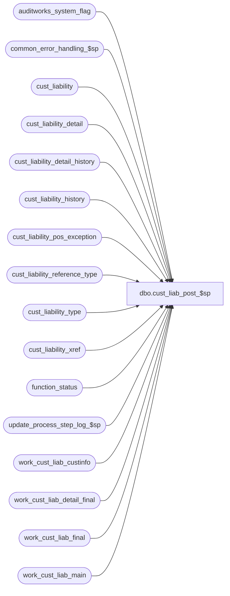

# dbo.cust_liab_post_$sp

**Database:** auditworks  
**Server:** bedrockdb01  

## Architecture Diagram



## Table Dependencies

| Referenced Table |
|---|
| auditworks_system_flag |
| common_error_handling_$sp |
| cust_liability |
| cust_liability_detail |
| cust_liability_detail_history |
| cust_liability_history |
| cust_liability_pos_exception |
| cust_liability_reference_type |
| cust_liability_type |
| cust_liability_xref |
| function_status |
| update_process_step_log_$sp |
| work_cust_liab_custinfo |
| work_cust_liab_detail_final |
| work_cust_liab_final |
| work_cust_liab_main |

## Stored Procedure Code

```sql
create proc dbo.cust_liab_post_$sp 
@process_id             binary(16),
@user_id		int,
@function_no		smallint,
@errmsg			nvarchar(255) OUTPUT,
@log_error_flag		tinyint = 0,  -- 1 if called by smartload
@edit_process_no 	tinyint = 1

AS
 /*
**  Name: cust_liab_post_$sp
**  Description: Updates the Customer Liability tables.
**  Called by cust_liability_edit_$sp.
**               

Please ensure that the proc script contains the following at the top in order to support scaleout:
SET ANSI_NULLS ON
SET ANSI_WARNINGS ON

HISTORY:
Date      Name          Defect#  Description
Jun06,13  Vicci          144184  For location_store_no update, handle factor -1 (removal/nullification).
May24,13  Vicci          144184  Since when order item reservations are done only the net merchandise is given in the transaction, not the discounts, 
                                 update the location_store_no of the discount associated with the item too.
May03,13  Vicci          143592  Support option to set expiry date based on last scheduled payment date.
Feb18,13  Vicci          141913  Ensure that when POS amounts are adjusted their status is too, 
                                 instead of waiting for cust_liab_pos_update_$sp to correct it, 3
                                 since the latter doesn't run until Phase2 and since it leaves behind forced-synch warnings
                                 when really the transaction simply originated for S/A mass processing actions
                                 or imports.  Also, in 2007, when the code was changed to update the POS amounts for C/L actions,
                                 the concept of partial-synch (status only synch with no amount change) applicable to voucher invalidations
                                 was forgotten (inconsistency with synch code), so reinstate it, but don't apply it to house accounts (which
                                 continue to allow payments and returns against stopped lines of credit).
Feb06,13  Vicci          141239  Relocate work table reassignment_flag and issued flag/date updates to be outside begin-trans.
Jan22,13  Paul           141239  add nolock hints on work tables. Use auditworks_system_flag update to force concurrent processing
                                 to be sequential, i.e. wait during the final insert/update to customer liability tables
Oct28,10  Vicci          122141  Handle corrupt import (i.e. one with > 32767 entries for same reference number)
Sep22,10  Paul         1-45QZZV  removed index hints for performance
Sep09,10  Paul           119817  Only turn on XACT_ABORT if using scaleout (needed to update cross-server views),
					also log a message to smartload log to facilitate investigation
Aug16,10  Vicci     REFIX_74996  Don't set issued flag upon increase unless not already set.
Aug04,10  Vicci          119571  Do not leave behind orphaned detail entries upon reference number reassignment;  post date_4.
Apr08,09  Vicci          109078  Log sku_id to cust_liability_detail and cust_liability_detail_hist in order to support
                                 transaction auto-completion from order lookup.
Apr14,09  Paul           108944  support cross-server views for scaleout
Jul15,08  Vicci          103149  Uplift 103138:  Avoid dup key on insert if attempting to reassign to pre-existing reference no and validations 94, 95, 96 are off.
Aug23,07  Paul          DV-1363  apply 91183 to SA5
Apr04.07  Daphna        DV-1360  apply 1-3KOS7N to SA5
Nov15,06  Phu             80127  When an expiry date is set on the transaction but there is no
                                 default expiry days set for the reference type in general, 
                                 ensure the expiry date from the transaction is applied to the
                                 reference number in question.
Oct25,06  Phu             77931  Fix outer join for SQL 2005 Mode 90.
Oct06,06  Paul            77922  populate transaction_no and transaction_series in cust_liability_history.apply defect 74996.
Jul26,06  Tim		  69753  apply 1-3AXW64 to SA5
Sep06,05  Paul          DV-1312  apply 1-1AEKAS to SA5
Jan06,05  Paul          DV-1191  Add locking hints
Oct14,04  David         DV-1146  Use user_id.
Sep02,04  David         DV-1129  apply 29561 to SA5
Apr23,04  Maryam       DV-1071  Receive @process_id and pass it to the common_error_handling_$sp.				 

Jul15,08  Vicci          103138  Avoid dup key on insert if attempting to reassign to pre-existing reference no and validations 94, 95, 96 are off.
Aug23,07  Paul            91183  Take MIN(date_issued) as issuing_date to better handle history load when GC were
				 reloaded (added to balance on card) at the store and reload looks like the original issuance.
Feb20.07  Daphna       1-3KOS7N  allow SA-sourced processing rule changes to update POS amount cols
Jul19,06  Vicci		  74996  If an add-update is CREATING the voucher set the issued flag.
May02,06  Daphna        1-3AXW64 do not update issuing date when updating an issued voucher
May24,05  David         1-1AEKAS Allow flags to increment and decrement instead of going to only 0 or 1.
Oct14,04  David           42750  Fixed join to cust_liability_pos_exception when doing reassignments.
Jul15,04  Vicci           29561  Handle line_object_type 23 (PLU subtotal discounts)
Jul07,03  Vicci         1-MNJ3X  Avoid arithmetic overflow when pos_status is negative as 
			/ 11061  a result of validations having been turned off and garbage
				 having thus been allowed to flow through.  Instead, treat
				 flag >= 1 as 1, flag <=0 as 0.
Mar17,03  Winnie	6744     Correct index hint
Feb21,03  Winnie        6207     Create index on work table to increase performance.
Feb18,03  Vicci		6117	 Set last_client_activity_date
Jan30,03  Winnie 	5801     Populate employee no to work_cust_liab_detail_final for lookup purpose.
Nov11,02  David         1-FMIDX  Set assumed completion date even if receivable amount was 0 before.
                     This handles the case when a layaway is recorded AND paid off in the same batch.
Sep10,02  David         1-F889L  Update location_store_no for all markdown line_object_type.
May10,02  Daphna/Vicci  1-BMK21  Progress Monitor for functions 4,5,11, and relocation of 
                                 synch upon AW insert from trigger to actual insert and 
                                 truncate instead of delete if in Conversion, index hint on 
                                 cust info, update of statistics if from conversion, 
                                 and relocate reassignment cascade from trigger to this procedure.
Apr01,02  David         1-BMK21  Add flags to cust_liability_history; update location_store_no
Feb11,02  David/Daphna  AW-8415  R3 customer liability.

*/
  
DECLARE 
	@errno	    			int,
	@key_store_no			int,
	@message_id			int,
	@modified_date			datetime,
	@object_name			nvarchar(255),
	@operation_name			nvarchar(100),
	@process_name			nvarchar(100),
	@process_no 			smallint,
	@reassignment_count		int,
	@reference_no			nvarchar(20),
	@reference_type			tinyint,
	@rows				int,
	@scaleout_flag			int,
	@trace_msg			nvarchar(255)


SELECT @modified_date = getdate(),
       @process_no = 228,
       @process_name = 'cust_liab_post_$sp',
       @message_id = 201068,
       @rows = 0

SELECT @scaleout_flag = CONVERT(int,flag_numeric_value)
  FROM auditworks_system_flag
 WHERE flag_name = 'scaleout_flag'

SELECT @errno = @@error
IF @errno != 0
  BEGIN
    SELECT @errmsg = 'Failed to select scaleout_flag from auditworks_system_flag',
           @object_name = 'auditworks_system_flag',
          @operation_name = 'SELECT'
    GOTO error
  END

IF @function_no <> 11
BEGIN
  DELETE work_cust_liab_final
  WHERE process_id  = @process_id

  SELECT @errno = @@error
  IF @errno !=0 
  BEGIN
    SELECT @errmsg='Failed to delete table work_cust_liab_final',
           @object_name = 'work_cust_liab_final',
           @operation_name = 'DELETE'
    GOTO error
  END

  DELETE work_cust_liab_detail_final
   WHERE process_id  = @process_id

  SELECT @errno = @@error
  IF @errno !=0 
  BEGIN
    SELECT @errmsg='Failed to delete table work_cust_liab_detail_final',
           @object_name = 'work_cust_liab_detail_final',
           @operation_name = 'DELETE'
    GOTO error
  END
END

-- removed conversion logic from SA5

/* Set last_client_activity_date where client activity is defined as transactions of a
   category other than the C/L mass-processing categories, but including imports.  
 Note that the default_issuance_date is actually the transaction_date overriden by
   the stock-control date;  its name only references issuances since that is the purpose
   for which the field was first introduced */
UPDATE work_cust_liab_main
   SET last_client_activity_date = default_issuance_date
 WHERE process_id  = @process_id
   AND transaction_category NOT IN (241, 243, 244, 245, 246, 247, 248, 249)
   AND (default_issuance_date > last_client_activity_date
   	OR last_client_activity_date IS NULL) 
   AND rejected_status = 0 

SELECT @errno = @@error
  IF @errno !=0 
  BEGIN
    SELECT @errmsg='Failed to set last client activity date',
           @object_name = 'work_cust_liab_main',
           @operation_name = 'UPDATE'
    GOTO error
  END

/* Sum all the amounts in current batch */
INSERT INTO work_cust_liab_final (
	process_id,
	reference_no,
	reference_type,
	key_store_no,
	default_issuing_store_no,
	default_issuing_date,
	issuing_store_no,
	issuing_date,
	tracking_id, 
	liability_amount,
	updated_liability_amount,
	receivable_amount,
	updated_receivable_amount,
	amount_3,
	amount_4,
	amount_5,
	amount_6,
	amount_7,
	amount_8,
	amount_9,
	amount_10,
	stocked_amount,
	stocked_flag,
	stocked_stolen_flag,
	issued_flag,
	stolen_from_cust_flag,
	forfeited_flag,
	max_transaction_date,
	existing_entry,
	assumed_completion_date,
	reopen_date,
	title,
	first_name,
	last_name,
	address_1,
	address_2,
	city,
	county,
	state,
	country,
	post_code,
	telephone_no1,
	telephone_no2,
	customer_no,
	pos_tax_jurisdiction_code,
	fax,
	email_address,
	expiry_days,
	reassignment_flag,
	employee_no,
	last_client_activity_date,
	date_4,
	expiry_date)
SELECT 
	@process_id, 
	w.reference_no,
	w.reference_type,
	w.key_store_no,
	MAX(default_issuing_store_no),
	MAX(default_issuance_date),
	MAX(issuing_store_no),
	MIN(date_issued), -- take earliest issue date when loading history
	MAX(w.tracking_id), 
	SUM(liability_amount  * ( 1 - (SIGN(ABS(transaction_void_flag-8)) * SIGN(transaction_void_flag)) )),
	SUM(liability_amount * ( 1 - (SIGN(ABS(transaction_void_flag-8)) * SIGN(transaction_void_flag)) )) 
	+ SUM(liability_amount_in * ( 1 - (SIGN(ABS(transaction_void_flag-8)) * SIGN(transaction_void_flag)) )),
	SUM(receivable_amount * ( 1 - (SIGN(ABS(transaction_void_flag-8)) * SIGN(transaction_void_flag)) )),
	SUM(receivable_amount * ( 1 - (SIGN(ABS(transaction_void_flag-8)) * SIGN(transaction_void_flag)) )) 
	+ SUM(receivable_amount_in * ( 1 - (SIGN(ABS(transaction_void_flag-8)) * SIGN(transaction_void_flag)) )),
	SUM(amount_3  * ( 1 - (SIGN(ABS(transaction_void_flag-8)) * SIGN(transaction_void_flag)) )),
	SUM(amount_4  * ( 1 - (SIGN(ABS(transaction_void_flag-8)) * SIGN(transaction_void_flag)) )),
	SUM(amount_5  * ( 1 - (SIGN(ABS(transaction_void_flag-8)) * SIGN(transaction_void_flag)) )),
	SUM(amount_6  * ( 1 - (SIGN(ABS(transaction_void_flag-8)) * SIGN(transaction_void_flag)) )),
	SUM(amount_7  * ( 1 - (SIGN(ABS(transaction_void_flag-8)) * SIGN(transaction_void_flag)) )),
	SUM(amount_8  * ( 1 - (SIGN(ABS(transaction_void_flag-8)) * SIGN(transaction_void_flag)) )),
	SUM(amount_9  * ( 1 - (SIGN(ABS(transaction_void_flag-8)) * SIGN(transaction_void_flag)) )),
	SUM(amount_10 * ( 1 - (SIGN(ABS(transaction_void_flag-8)) * SIGN(transaction_void_flag)) )),
	SUM(stocked_amount * ( 1 - (SIGN(ABS(transaction_void_flag-8)) * SIGN(transaction_void_flag)) )),
	CASE WHEN ABS(SUM(stocked_flag * ( 1 - (SIGN(ABS(transaction_void_flag-8)) * SIGN(transaction_void_flag)) ))) > 32766 THEN 9999 ELSE SUM(stocked_flag * ( 1 - (SIGN(ABS(transaction_void_flag-8)) * SIGN(transaction_void_flag)) )) END,
	CASE WHEN ABS(SUM(stocked_stolen_flag * ( 1 - (SIGN(ABS(transaction_void_flag-8)) * SIGN(transaction_void_flag)) ))) > 32766 THEN 9999 ELSE SUM(stocked_stolen_flag * ( 1 - (SIGN(ABS(transaction_void_flag-8)) * SIGN(transaction_void_flag)) )) END,
	CASE WHEN ABS(SUM(issued_flag * ( 1 - (SIGN(ABS(transaction_void_flag-8)) * SIGN(transaction_void_flag)) ))) > 32766 THEN 9999 ELSE SUM(issued_flag * ( 1 - (SIGN(ABS(transaction_void_flag-8)) * SIGN(transaction_void_flag)) )) END,
	CASE WHEN ABS(SUM(stolen_from_cust_flag * ( 1 - (SIGN(ABS(transaction_void_flag-8)) * SIGN(transaction_void_flag)) ))) > 32766 THEN 9999 ELSE SUM(stolen_from_cust_flag * ( 1 - (SIGN(ABS(transaction_void_flag-8)) * SIGN(transaction_void_flag)) )) END,
	CASE WHEN ABS(SUM(forfeited_flag * ( 1 - (SIGN(ABS(transaction_void_flag-8)) * SIGN(transaction_void_flag)) ))) > 32766 THEN 9999 ELSE SUM(forfeited_flag * ( 1 - (SIGN(ABS(transaction_void_flag-8)) * SIGN(transaction_void_flag)) )) END,
	MAX(transaction_date),
	MAX(IsNull(existing_entry,0)),
	MAX(assumed_completion_date),
	MAX(reopen_date),
	MAX(c.title),
	MAX(c.first_name),
	MAX(c.last_name),
	MAX(c.address_1),
	MAX(c.address_2),
	MAX(c.city),
	MAX(c.county),
	MAX(c.state),
	MAX(c.country),
	MAX(c.post_code),
	MAX(c.telephone_no1),
	MAX(c.telephone_no2),
	MAX(c.customer_no),
	MAX(c.pos_tax_jurisdiction_code),
	MAX(c.fax),
	MAX(c.email_address),
	MAX(IsNull(w.expiry_days, 0)) + ( (1 - sign(abs(MAX(IsNull(w.expiry_days, 0))))) * MAX(IsNull(t.expiry_days, 0))),
	MAX(reassignment_flag),
	MAX(w.employee_no),
	MAX(w.last_client_activity_date),
	MAX(w.date_4),
	MAX(w.expiry_date)
  FROM work_cust_liab_main w WITH (NOLOCK)
       INNER JOIN cust_liability_type t WITH (NOLOCK)
              ON (w.reference_type = t.reference_type AND w.tracking_id = t.tracking_id)
       LEFT JOIN work_cust_liab_custinfo c WITH (INDEX = work_cust_liab_custinfo_x0 NOLOCK)
              ON (w.reference_type = c.reference_type AND w.reference_no = c.reference_no
                  AND w.key_store_no = c.key_store_no AND w.process_id = c.process_id)
 WHERE w.process_id  = @process_id
   AND w.rejected_status = 0 
 GROUP BY w.reference_no, 
	w.reference_type, 
	w.key_store_no

SELECT @errno = @@error
IF @errno !=0 
BEGIN
   SELECT @errmsg='Failed to INSERT INTO work_cust_liab_final',
          @object_name = 'work_cust_liab_final',
          @operation_name = 'INSERT'
   GOTO error
END

/* ASSUMED COMPLETION SECTION need to support as-of reporting:
   Set a assumed_completion_date if the receivable has gone to zero */
IF EXISTS (SELECT 1
	     FROM cust_liability_reference_type WITH (NOLOCK)
	    WHERE history_cleanup_criteria IN (2, 4))
BEGIN
  UPDATE work_cust_liab_final
     SET assumed_completion_date = max_transaction_date
    FROM work_cust_liab_final wf, cust_liability_reference_type ct WITH (NOLOCK)
   WHERE wf.reference_type = ct.reference_type
     AND wf.updated_receivable_amount = 0 -- 1-FMIDX
     AND wf.updated_liability_amount <> 0 --i.e. only final payments not cancellations
     AND ct.history_cleanup_criteria IN (2, 4) -- i.e. based on receivable going to 0
     AND wf.process_id = @process_id
  
  SELECT @errno = @@error
IF @errno !=0 
  BEGIN
    SELECT @errmsg='Failed to update work_cust_liab_final for assumed completion',
          @object_name = 'work_cust_liab_final',
          @operation_name = 'UPDATE'
    GOTO error
  END

  /* Handle if a completion transaction had been voided and is now unvoided */
  UPDATE work_cust_liab_final
     SET reopen_date = NULL --
    FROM work_cust_liab_final wf, cust_liability_reference_type ct WITH (NOLOCK)
   WHERE wf.reference_type = ct.reference_type
     AND wf.receivable_amount <> 0
     AND wf.updated_receivable_amount = 0
     AND wf.reopen_date = wf.max_transaction_date
     AND ct.history_cleanup_criteria IN (2, 4) -- i.e. based on receivable going to 0
    AND wf.process_id = @process_id

  SELECT @errno = @@error
  IF @errno !=0 
  BEGIN
     SELECT @errmsg='Failed to set reopen date back to null',
          @object_name = 'work_cust_liab_final',
          @operation_name = 'UPDATE'
     GOTO error
  END

  -- Set the reopen_date if the receivable amount is no longer zero
  UPDATE work_cust_liab_final
     SET reopen_date = max_transaction_date
    FROM work_cust_liab_final wf, cust_liability_reference_type ct WITH (NOLOCK)
   WHERE wf.reference_type = ct.reference_type
     AND wf.assumed_completion_date IS NOT NULL AND wf.receivable_amount != 0
     AND wf.updated_receivable_amount != 0
     AND ct.history_cleanup_criteria IN (2, 4) -- i.e. based on receivable going to 0
     AND wf.process_id = @process_id

  SELECT @errno = @@error
  IF @errno !=0 
  BEGIN
    SELECT @errmsg='Failed to update work_cust_liab_final to reverse assumed completion',
          @object_name = 'work_cust_liab_final',
          @operation_name = 'UPDATE'
    GOTO error
  END 
END -- if assume completion applies

INSERT INTO work_cust_liab_detail_final (
        process_id, 
	reference_no,
	reference_type,
	key_store_no,
	line_object, --line object or discounted line object 
	upc_no,
	upc_lookup_division,
	location_store_no,
	location_no,
	amount_outstanding,
	units_outstanding,	
	units_2,
	units_3,
	units_4,
	units_5,
	existing_detail,
	discount_line_object, --line object of the discount line or null
	line_object_type,
	sku_id )
SELECT  @process_id,
	reference_no,
	reference_type,
	key_store_no,
	line_object, 
	upc_no,
	upc_lookup_division,
	CASE WHEN upc_no IS NOT NULL 
	     THEN MAX(location_update_flag * COALESCE(fulfillment_store_no, issuing_store_no, default_issuing_store_no)) 
	     ELSE NULL END, --negative location_store_no implies that it needs wiping out (e.g. no-stock), 0 implies "don't touch";  Note fulfillment_store can be source etc see pop
	null,
	SUM(amount_outstanding),
	SUM(units_outstanding),
	SUM(units_2),
	SUM(units_3),
	SUM(units_4),
	SUM(units_5),
	MAX(IsNull(existing_detail,0)),
	discount_line_object,
	line_object_type,
	sku_id
  FROM work_cust_liab_main WITH (NOLOCK)
 WHERE rejected_status = 0 
   AND (unit_amount_flag = 0 OR location_update_flag <> 0)
   AND transaction_void_flag IN (0,8)
   AND process_id  = @process_id
 GROUP BY reference_no, reference_type, key_store_no, 
          line_object, upc_no, upc_lookup_division, discount_line_object, line_object_type, sku_id
	
SELECT @errno = @@error
IF @errno !=0 
BEGIN
   SELECT @errmsg='Failed to INSERT INTO work_cust_liab_detail_final',
          @object_name = 'work_cust_liab_detail_final',
          @operation_name = 'INSERT'
   GOTO error
END

/*  Doesn't make sense to overlay it if config didn't say to set it... location of merch can be unknown for ES orders for example
UPDATE work_cust_liab_detail_final
   SET location_store_no = IsNull(wf.issuing_store_no,wf.default_issuing_store_no)
  FROM work_cust_liab_final wf WITH (NOLOCK), work_cust_liab_detail_final wd
 WHERE wd.process_id = @process_id
   AND wf.process_id = wd.process_id
   AND wf.reference_no = wd.reference_no
   AND wf.reference_type = wd.reference_type
   AND wf.key_store_no = wd.key_store_no
   AND wd.location_store_no IS NULL --
   AND wd.line_object_type IN (1,16,17,18,19,22,23)   
SELECT @errno = @@error
IF @errno !=0 
BEGIN
   SELECT @errmsg='Failed to set the location_store_no',
          @object_name = 'work_cust_liab_detail_final',
          @operation_name = 'UPDATE'
   GOTO error
END
*/

-- reference_no can be renumbered if the store no is being closed
-- or there's a change in POS systems.

UPDATE work_cust_liab_main
   SET reassignment_flag = 0
FROM work_cust_liab_main wm
 WHERE reassignment_flag = 1
   AND rejected_status = 0
   AND process_id = @process_id
   AND EXISTS (SELECT 1 					--In case validations 94, 95, 96 not turned on.
   FROM cust_liability b WITH (NOLOCK)
	WHERE wm.reference_type = b.reference_type
	  AND wm.reference_no = b.reference_no
	  AND wm.key_store_no = b.key_store_no)
SELECT @errno = @@error
IF @errno !=0 
BEGIN
  SELECT @errmsg='Failed to disable reassignment if it would result in duplicate reference numbers',
        @object_name = 'work_cust_liab_main',
         @operation_name = 'UPDATE'
  GOTO error
END

  -- do not update issuing date when re-issuing a voucher - defect 69753
UPDATE work_cust_liab_final
   SET issuing_date = cl.date_issued
  FROM work_cust_liab_final wf, cust_liability cl WITH (NOLOCK)
 WHERE wf.reference_type = cl.reference_type
   AND wf.reference_no = cl.reference_no
   AND wf.key_store_no = cl.key_store_no
   AND wf.process_id = @process_id
   AND wf.existing_entry >= 1
   AND cl.issued_flag > 0  
SELECT @errno = @@error
IF @errno !=0 
BEGIN
  SELECT @errmsg='Failed to set issuing_date = NULL',
         @object_name = 'work_cust_liab_final',
         @operation_name = 'UPDATE'
  GOTO error
END

 -- Defect 74996:
 -- if doing an add-value on a voucher that was not previously issued mark it as issued
 -- despite the fact that the column definition for add-values indicates that they should
 -- generally not touch the issued flag.

UPDATE work_cust_liab_final
   SET issued_flag = 1
 WHERE process_id = @process_id
   AND issued_flag = 0
   AND liability_amount > 0
   AND existing_entry = 0
SELECT @errno = @@error
IF @errno !=0 
BEGIN
  SELECT @errmsg='Failed to set issued_flag = 1',
         @object_name = 'work_cust_liab_final',
         @operation_name = 'UPDATE'
  GOTO error
END

IF @function_no IN (4,5,11)
BEGIN
  EXEC update_process_step_log_$sp @function_no,  @edit_process_no, 23
  SELECT @errno = @@error
  IF @errno <> 0
  BEGIN 
    SELECT @errmsg = 'first increment of completed workload for step_no = 23',
           @operation_name = 'EXECUTE',
           @object_name = 'update_process_step_log_$sp'
    GOTO error      
  END    
END

IF @scaleout_flag = 1
	BEGIN
	 IF @function_no <= 5
	   BEGIN
	    SELECT @trace_msg = NCHAR(13) + NCHAR(10) + ':LOG &&: Edit CL Post sets XACT_ABORT ON : ' + CONVERT(nchar, getdate(), 8)
	    PRINT @trace_msg
	   END
	 SET XACT_ABORT ON
	END

BEGIN TRANSACTION

INSERT INTO cust_liability_detail (
	reference_type,
	reference_no,
	key_store_no,
	line_object,
	upc_no,
	upc_lookup_division,
	location_store_no,
	location_no,
	amount_outstanding,
	units_outstanding,
	units_2,
	units_3,
	units_4,
	units_5,
	discount_line_object,
	sku_id)
SELECT 
	reference_type,
	reference_no,
	key_store_no,
	line_object,
	upc_no,
	upc_lookup_division,
	CASE WHEN location_store_no < 1 THEN NULL ELSE location_store_no END,  --negative implies request to remove (e.g. no-stock), 0 implies not configured to update location store (typically because unknown or payment in a another store, etc)
	location_no,
	amount_outstanding,
	units_outstanding,
	units_2,
	units_3,
	units_4,
	units_5,
	discount_line_object,
	sku_id
FROM work_cust_liab_detail_final WITH (NOLOCK)
WHERE process_id = @process_id
  AND existing_detail = 0  
 SELECT @errno = @@error
 IF @errno !=0 
 BEGIN
   SELECT @errmsg='Failed to insert into cust_liability_detail',
          @object_name = 'cust_liability_detail',
          @operation_name = 'INSERT'
   GOTO error
 END


INSERT INTO cust_liability_history (
	reference_type, 
	reference_no,
	key_store_no, 
	transaction_date,
	store_no,
	process_no, 
	process_key, -- set to transaction_id
	transaction_no,
	transaction_series,
	posting_date,
	transaction_category,
	entry_date_time,
	transaction_void_flag,
	interface_control_flag,
	liability_amount,
	receivable_amount,
	amount_3,
	amount_4,
	amount_5,
	amount_6,
	amount_7,
	amount_8,
	amount_9,
	amount_10,
	stocked_amount,
	stocked_flag, 
	stocked_stolen_flag, 
	issued_flag, 
	stolen_from_cust_flag, 
	forfeited_flag )
SELECT  w.reference_type, 
	w.reference_no,
	key_store_no, 
	transaction_date,
	store_no,
	function_no, 
	transaction_id,
	transaction_no,
	transaction_series,
	@modified_date,
	transaction_category,
	entry_date_time,
	transaction_void_flag,
	interface_control_flag,	
	sum(liability_amount),
	sum(receivable_amount),
	sum(amount_3),
	sum(amount_4),
	sum(amount_5),
	sum(amount_6),
	sum(amount_7),
	sum(amount_8),
	sum(amount_9),
	sum(amount_10),
	sum(stocked_amount),
	CASE WHEN ABS(sum(stocked_flag)) > 32766 THEN 9999 ELSE sum(stocked_flag) END, 
	CASE WHEN ABS(sum(stocked_stolen_flag)) > 32766 THEN 9999 ELSE sum(stocked_stolen_flag) END, 
	CASE WHEN ABS(sum(issued_flag)) > 32766 THEN 9999 ELSE sum(issued_flag) END, 
	CASE WHEN ABS(sum(stolen_from_cust_flag)) > 32766 THEN 9999 ELSE sum(stolen_from_cust_flag) END, 
	CASE WHEN ABS(sum(forfeited_flag)) > 32766 THEN 9999 ELSE sum(forfeited_flag) END
 FROM work_cust_liab_main w WITH (NOLOCK)
WHERE w.rejected_status = 0 
  AND w.process_id = @process_id
GROUP BY w.reference_type, 
	w.reference_no,
	w.key_store_no, 
	w.transaction_date,
	w.store_no,
	w.function_no, 
	w.transaction_id,
	w.transaction_no,
	w.transaction_series,
	w.transaction_category,
	w.entry_date_time,
	w.transaction_void_flag,
	w.interface_control_flag

 SELECT @errno = @@error
 IF @errno !=0 
 BEGIN
   SELECT @errmsg='Failed to insert into cust_liability_history',
          @object_name = 'cust_liability_history',
          @operation_name = 'INSERT'
   GOTO error
 END
   

INSERT INTO cust_liability_detail_history (
	reference_type, 
	reference_no,
	key_store_no, 
	line_object,
	upc_no,
	upc_lookup_division,
	location_store_no,
	location_no,
	transaction_date,
	process_no, 
	process_key,
	posting_date,
	transaction_category,
	entry_date_time,
	transaction_void_flag,
	interface_control_flag,
	amount_outstanding,
	units_outstanding,
	units_2,
	units_3,
	units_4,
	units_5,
	discount_line_object,
	sku_id)
 SELECT w.reference_type, 
	w.reference_no,
	key_store_no, 
	line_object,
	upc_no,
	upc_lookup_division,
	CASE WHEN w.upc_no IS NOT NULL 
	     THEN CASE WHEN MAX(w.location_update_flag * COALESCE(w.fulfillment_store_no, w.issuing_store_no, w.default_issuing_store_no)) < 1 
	               THEN NULL 
	               ELSE MAX(w.location_update_flag * COALESCE(w.fulfillment_store_no, w.issuing_store_no, w.default_issuing_store_no)) END 
	     ELSE NULL END, --negative location_store_no implies that it needs wiping out (e.g. no-stock), 0 implies "don't touch";  Note fulfillment_store can be source etc see pop
	null,
	transaction_date,
	function_no, 
	transaction_id,
	@modified_date,
	transaction_category,
	entry_date_time,
	transaction_void_flag,
	interface_control_flag,	
	sum(amount_outstanding),
	sum(units_outstanding),
	sum(units_2),
	sum(units_3),
	sum(units_4),
	sum(units_5),
	w.discount_line_object,
	w.sku_id
 FROM work_cust_liab_main w WITH (NOLOCK), cust_liability_reference_type clrt WITH (NOLOCK)
WHERE w.rejected_status = 0 
  AND w.process_id = @process_id
  AND w.reference_type = clrt.reference_type
  AND clrt.track_detail_flag = 1
  AND (unit_amount_flag = 0 OR location_update_flag <> 0)
GROUP BY w.reference_type, 
	w.reference_no,
	w.key_store_no, 
	w.line_object,
	w.upc_no,
	w.upc_lookup_division,
	w.transaction_date,
	w.function_no, 
	w.transaction_id,
	w.transaction_category,
	w.entry_date_time,
	w.transaction_void_flag,
	w.interface_control_flag,
	w.discount_line_object,
	w.sku_id
 SELECT @errno = @@error
 IF @errno !=0 
 BEGIN
   SELECT @errmsg='Failed to insert into cust_liab_detail_history',
          @object_name = 'cust_liab_detail_history',
          @operation_name = 'INSERT'
   GOTO error
 END

  -- Allow lookup on old reference_no/key_store_no
INSERT INTO cust_liability_xref(
       	reference_type, 
	old_reference_no, 
	old_key_store_no, 
	new_reference_no, 
	new_key_store_no, 
	renumber_datetime)
SELECT  w.reference_type, 
	w.original_reference_no,
	w.original_key_store_no,
        w.reference_no,
        w.key_store_no,
        getdate()
  FROM  work_cust_liab_main w WITH (NOLOCK)
 WHERE  w.reassignment_flag = 1
   AND  w.rejected_status = 0
   AND  w.process_id = @process_id
SELECT @errno = @@error, @reassignment_count = @@rowcount
IF @errno != 0 
BEGIN
  SELECT @errmsg = 'allow lookup on old reference_no, key_store_no',
         @object_name = 'cust_liability_xref',
         @operation_name = 'INSERT'
  GOTO error
END

/* Prevent possible deadlocks when updating the customer liability tables by updating a shared system flag 
   Note:  this update is deferred to this point in the begin-trans insert the previously inserted rows 
          would never be used by another process and because we want each process to wait the shortest amount
          of time possible */ 
UPDATE auditworks_system_flag
   SET flag_numeric_value = 1
 WHERE flag_name = 'voucher_last_modified'
SELECT @errno = @@error
IF @errno != 0 
BEGIN
  SELECT @errmsg = 'Set flag to force concurrent processes to run sequentially',
         @object_name = 'auditworks_system_flag',
         @operation_name = 'UPDATE'
  GOTO error
END

IF @reassignment_count > 0  --extremely rare

BEGIN      
  UPDATE cust_liability
     SET issuing_store_no = ISNULL(w.issuing_store_no,c.issuing_store_no),
         reference_no     = w.reference_no,
         key_store_no     = w.key_store_no
    FROM work_cust_liab_main w WITH (NOLOCK), cust_liability c
   WHERE w.reference_type = c.reference_type
     AND w.original_reference_no = c.reference_no
     AND w.original_key_store_no = c.key_store_no
     AND w.reassignment_flag = 1
     AND w.rejected_status = 0
     AND w.process_id = @process_id
  SELECT @errno = @@error
  IF @errno !=0 
  BEGIN
     SELECT @errmsg='Failed to update cust_liability in case of reassignment',
            @object_name = 'cust_liability',
            @operation_name = 'UPDATE'
     GOTO error
  END

  UPDATE cust_liability_detail
     SET reference_no = w.reference_no,
         key_store_no = w.key_store_no,
         location_store_no = CASE WHEN c.location_store_no = c.key_store_no THEN COALESCE(w.fulfillment_store_no, w.issuing_store_no,c.location_store_no) ELSE c.location_store_no END
    --reassign non-null location_store_no if issuing_store_no has changed
    FROM work_cust_liab_main w WITH (NOLOCK), cust_liability_detail c
   WHERE w.reference_type = c.reference_type
     AND w.original_reference_no = c.reference_no
     AND w.original_key_store_no = c.key_store_no
     AND w.reassignment_flag = 1
     AND w.rejected_status = 0
     AND w.process_id = @process_id
  SELECT @errno = @@error
  IF @errno != 0 
  BEGIN
    SELECT @errmsg = 'set reference_no, key_store_no, location_store_no',
           @object_name = 'cust_liability_detail',
           @operation_name = 'UPDATE'
    GOTO error
  END

  UPDATE cust_liability_history
     SET reference_no = w.reference_no,
         key_store_no = w.key_store_no
    FROM work_cust_liab_main w WITH (NOLOCK), cust_liability_history c
   WHERE w.reference_type = c.reference_type
     AND w.original_reference_no = c.reference_no
     AND w.original_key_store_no = c.key_store_no
     AND w.reassignment_flag = 1
     AND w.rejected_status = 0
     AND w.process_id = @process_id
  SELECT @errno = @@error
  IF @errno != 0 
  BEGIN
    SELECT @errmsg = 'set reference_no, key_store_no',
           @object_name = 'cust_liability_history',
           @operation_name = 'UPDATE'
    GOTO error
  END

  UPDATE cust_liability_detail_history
     SET reference_no = w.reference_no,
         key_store_no = w.key_store_no,
         location_store_no = CASE WHEN c.location_store_no = c.key_store_no THEN COALESCE(w.fulfillment_store_no, w.issuing_store_no,c.location_store_no) ELSE c.location_store_no END
    --reassign location_store_no if issuing_store_no has changed and where upc_no not null 
    FROM work_cust_liab_main w WITH (NOLOCK), cust_liability_detail_history c
   WHERE w.reference_type = c.reference_type
     AND w.original_reference_no = c.reference_no
     AND w.original_key_store_no = c.key_store_no
     AND w.reassignment_flag = 1
     AND w.rejected_status = 0
     AND w.process_id = @process_id
  SELECT @errno = @@error
  IF @errno != 0 
  BEGIN
    SELECT @errmsg = 'set reference_no, key_store_no, location_store_no',
           @object_name = 'cust_liability_detail_history',
           @operation_name = 'UPDATE'
    GOTO error
  END

  UPDATE cust_liability_pos_exception
     SET reference_no = w.reference_no,
         key_store_no = w.key_store_no
    FROM work_cust_liab_main w WITH (NOLOCK), cust_liability_pos_exception c
   WHERE w.reference_type = c.reference_type
     AND w.original_reference_no = c.reference_no
     AND w.original_key_store_no = c.key_store_no
     AND w.reassignment_flag = 1
     AND w.rejected_status = 0
     AND w.process_id = @process_id
  SELECT @errno = @@error
  IF @errno != 0 
  BEGIN
    SELECT @errmsg = 'set reference_no, key_store_no',
           @object_name = 'cust_liability_pos_exception',
           @operation_name = 'UPDATE'
    GOTO error
  END

END --if @reassignment_count > 0

UPDATE cust_liability_detail  
   SET location_store_no = 
	   CASE WHEN wf.location_store_no < 0 THEN NULL
	        ELSE CASE WHEN wf.location_store_no = 0 OR wf.location_store_no IS NULL 
	                  THEN cld.location_store_no 
	                  ELSE wf.location_store_no END END,  --negative implies request to remove (e.g. no-stock), 0 implies not configured to update location store (typically because unknown or payment in a another store, etc)
       amount_outstanding = cld.amount_outstanding + wf.amount_outstanding,
       units_outstanding  = cld.units_outstanding  + wf.units_outstanding,
       units_2 = cld.units_2 + wf.units_2,
       units_3 = cld.units_3 + wf.units_3,
       units_4 = cld.units_4 + wf.units_4,
       units_5 = cld.units_5 + wf.units_5
  FROM work_cust_liab_detail_final wf WITH (NOLOCK), cust_liability_detail cld
 WHERE wf.reference_type = cld.reference_type
   AND wf.reference_no = cld.reference_no
   AND wf.key_store_no = cld.key_store_no
   AND wf.line_object = cld.line_object
   AND ISNULL(wf.upc_no,0) = ISNULL(cld.upc_no,0)
   AND (wf.upc_lookup_division = cld.upc_lookup_division
       OR (wf.upc_lookup_division IS NULL AND cld.upc_lookup_division IS NULL))
   AND wf.process_id = @process_id
   AND wf.existing_detail = 1
   AND IsNull(wf.discount_line_object, -1) = IsNull(cld.discount_line_object, -1)  
 SELECT @errno = @@error
 IF @errno !=0 
 BEGIN
   SELECT @errmsg='Failed to update cust_liability_detail',
          @object_name = 'cust_liability_detail',
          @operation_name = 'UPDATE'
   GOTO error
 END

--144184:  When reservations are done, only the net merchandise is given in the transaction, not the disc, but the disc need to be assigned to the right location too.
UPDATE cust_liability_detail  
   SET location_store_no = CASE WHEN wf.location_store_no < 0 THEN NULL
			        ELSE CASE WHEN wf.location_store_no = 0 OR wf.location_store_no IS NULL 
			                  THEN cld.location_store_no 
			                  ELSE wf.location_store_no END END
  FROM work_cust_liab_detail_final wf WITH (NOLOCK), cust_liability_detail cld
 WHERE wf.reference_type = cld.reference_type
   AND wf.reference_no = cld.reference_no
   AND wf.key_store_no = cld.key_store_no
   AND wf.line_object = cld.line_object
   AND ISNULL(wf.upc_no,0) = ISNULL(cld.upc_no,0)
   AND (wf.upc_lookup_division = cld.upc_lookup_division
       OR (wf.upc_lookup_division IS NULL AND cld.upc_lookup_division IS NULL))
   AND wf.process_id = @process_id
   AND wf.existing_detail = 1
   AND wf.location_store_no IS NOT NULL
   AND wf.discount_line_object IS NULL		--merch line
   AND cld.discount_line_object IS NOT NULL	--disc line
   AND COALESCE(cld.location_store_no, -1) <> COALESCE(CASE WHEN wf.location_store_no < 0 
   							    THEN NULL
   							    ELSE CASE WHEN wf.location_store_no = 0 OR wf.location_store_no IS NULL 
	 						              THEN cld.location_store_no 
					        	              ELSE wf.location_store_no END END, -1)

 SELECT @errno = @@error
 IF @errno !=0 
 BEGIN
   SELECT @errmsg='Failed to set reserved location for discounts associated with item',
          @object_name = 'cust_liability_detail',
          @operation_name = 'UPDATE'
   GOTO error
 END
 
UPDATE cust_liability
   SET 	date_issued = IsNull(wf.issuing_date, cl.date_issued),
	issuing_store_no = IsNull(wf.issuing_store_no, cl.issuing_store_no),
	tracking_id = wf.tracking_id,
	liability_amount  = cl.liability_amount  + wf.liability_amount,
	receivable_amount = cl.receivable_amount + wf.receivable_amount,
	amount_3 = cl.amount_3  + wf.amount_3,
	amount_4  = cl.amount_4  + wf.amount_4,
	amount_5  = cl.amount_5  + wf.amount_5,
	amount_6  = cl.amount_6 + wf.amount_6,
	amount_7  = cl.amount_7  + wf.amount_7,
	amount_8  = cl.amount_8  + wf.amount_8,
	amount_9  = cl.amount_9  + wf.amount_9,
	amount_10 = cl.amount_10 + wf.amount_10,
	stocked_amount = cl.stocked_amount + wf.stocked_amount,
	stocked_flag          = cl.stocked_flag + wf.stocked_flag,
	stocked_stolen_flag   = cl.stocked_stolen_flag + wf.stocked_stolen_flag,
	issued_flag           = cl.issued_flag + CASE WHEN cl.issued_flag = 0 AND wf.issued_flag = 0 AND wf.liability_amount > 0 THEN 1 ELSE wf.issued_flag END,
	stolen_from_cust_flag = cl.stolen_from_cust_flag + wf.stolen_from_cust_flag,
	forfeited_flag        = cl.forfeited_flag + wf.forfeited_flag,
	last_modified_by_aw = @modified_date,
	assumed_completion_date = wf.assumed_completion_date,
	reopen_date = wf.reopen_date,
	title = ISNULL(wf.title,cl.title),
	first_name = ISNULL(wf.first_name,cl.first_name),
	last_name  = ISNULL(wf.last_name,cl.last_name),
	address_1  = ISNULL(wf.address_1,cl.address_1),
	address_2  = ISNULL(wf.address_2,cl.address_2),
	city  = ISNULL(wf.city,cl.city),
	county  = ISNULL(wf.county,cl.county),
	state  = ISNULL(wf.state,cl.state),
	country = ISNULL(wf.country,cl.country),  
	post_code = ISNULL(wf.post_code,cl.post_code),
	telephone_no1 = ISNULL(wf.telephone_no1,cl.telephone_no1),
	telephone_no2 = ISNULL(wf.telephone_no2,cl.telephone_no2),
	customer_no  = ISNULL(wf.customer_no,cl.customer_no),
	pos_tax_jurisdiction_code  = ISNULL(wf.pos_tax_jurisdiction_code,cl.pos_tax_jurisdiction_code),
	fax  = ISNULL(wf.fax,cl.fax),
	email_address = ISNULL(wf.email_address,cl.email_address),
	expiry_date = CASE IsNull(wf.expiry_days, 0) 
	              WHEN 0 THEN
	                   COALESCE(wf.expiry_date, cl.expiry_date)
	              ELSE IsNull(dateadd(dd,wf.expiry_days,wf.issuing_date), cl.expiry_date)
	              END,
	employee_no = ISNULL(wf.employee_no,cl.employee_no),
	last_client_activity_date = wf.last_client_activity_date,
	date_4 = CASE WHEN wf.date_4 > cl.date_4 OR cl.date_4 IS NULL THEN wf.date_4 ELSE cl.date_4 END 
 FROM work_cust_liab_final wf WITH (NOLOCK), cust_liability cl
WHERE wf.reference_type = cl.reference_type
  AND wf.reference_no = cl.reference_no
  AND wf.key_store_no = cl.key_store_no
  AND wf.process_id = @process_id
  AND wf.existing_entry >= 1

SELECT @errno = @@error
IF @errno !=0 
BEGIN
   SELECT @errmsg='Failed to update cust_liability',
          @object_name = 'cust_liability',
          @operation_name = 'UPDATE'
   GOTO error
END

-- for SA sourced txns re processing rules (eg promos), update POS amount columns 
--Do not touch pos amounts in the case of invalidations, just the status. This is known as a partial synch and
--is done so that the original value of the stolen doc can be seen during voucher inquiries
UPDATE cust_liability
   SET pos_amount_1 = CASE WHEN COALESCE(rt.partially_synch_invalid_doc, CASE WHEN cl.reference_type = 3 THEN 0 ELSE 1 END) = 1 
                                AND cl.pos_status in (20, 40, 50) AND SIGN(cl.forfeited_flag + cl.stolen_from_cust_flag + cl.stocked_stolen_flag) < 1  --was invalid and no longer is, for a partial-synch-invalids style ref-type where the pos amount won't have reflected S/A changes.
                           THEN --overlay
			   	ISNULL(cl.liability_amount * (1 - sign(abs(pos_amount_1_source_column_no -1)))
				   + cl.receivable_amount * (1 - sign(abs(pos_amount_1_source_column_no -2)))
	  			   + cl.amount_3 * (1 - sign(abs(pos_amount_1_source_column_no -3)))
				   + cl.amount_4 * (1 - sign(abs(pos_amount_1_source_column_no -4)))
				   + cl.amount_5 * (1 - sign(abs(pos_amount_1_source_column_no -5)))
				   + cl.amount_6 * (1 - sign(abs(pos_amount_1_source_column_no -6)))
				   + cl.amount_7 * (1 - sign(abs(pos_amount_1_source_column_no -7)))
				   + cl.amount_8 * (1 - sign(abs(pos_amount_1_source_column_no -8)))
				   + cl.amount_9 * (1 - sign(abs(pos_amount_1_source_column_no -9)))
				   + cl.amount_10 * (1 - sign(abs(pos_amount_1_source_column_no -10)))
	 		           + cl.stocked_amount * (1 - sign(abs(pos_amount_1_source_column_no -11))),0)                           
   			   ELSE --adjust
   		      cl.pos_amount_1 
                      + CASE WHEN COALESCE(rt.partially_synch_invalid_doc, CASE WHEN cl.reference_type = 3 THEN 0 ELSE 1 END) = 1 
                                  AND SIGN(cl.forfeited_flag + cl.stolen_from_cust_flag + cl.stocked_stolen_flag) = 1 
                             THEN 0
                             ELSE (
                        (ISNULL(wf.liability_amount * (1 - sign(abs(pos_amount_1_source_column_no -1)))
			+ wf.receivable_amount * (1 - sign(abs(pos_amount_1_source_column_no -2)))
			+ wf.amount_3 * (1 - sign(abs(pos_amount_1_source_column_no -3)))
			+ wf.amount_4 * (1 - sign(abs(pos_amount_1_source_column_no -4)))
			+ wf.amount_5 * (1 - sign(abs(pos_amount_1_source_column_no -5)))
			+ wf.amount_6 * (1 - sign(abs(pos_amount_1_source_column_no -6)))
			+ wf.amount_7 * (1 - sign(abs(pos_amount_1_source_column_no -7)))
			+ wf.amount_8 * (1 - sign(abs(pos_amount_1_source_column_no -8)))
			+ wf.amount_9 * (1 - sign(abs(pos_amount_1_source_column_no -9)))
			+ wf.amount_10 * (1 - sign(abs(pos_amount_1_source_column_no -10)))
 		     + wf.stocked_amount * (1 - sign(abs(pos_amount_1_source_column_no -11))),0))) END END , 
         pos_amount_2 = CASE WHEN COALESCE(rt.partially_synch_invalid_doc, CASE WHEN cl.reference_type = 3 THEN 0 ELSE 1 END) = 1 
                                AND cl.pos_status in (20, 40, 50) AND SIGN(cl.forfeited_flag + cl.stolen_from_cust_flag + cl.stocked_stolen_flag) < 1  --was invalid and no longer is, for a partial-synch-invalids style ref-type where the pos amount won't have reflected S/A changes.
                           THEN --overlay
			   	ISNULL(cl.liability_amount * (1 - sign(abs(pos_amount_2_source_column_no -1)))
				   + cl.receivable_amount * (1 - sign(abs(pos_amount_2_source_column_no -2)))
	  			   + cl.amount_3 * (1 - sign(abs(pos_amount_2_source_column_no -3)))
				   + cl.amount_4 * (1 - sign(abs(pos_amount_2_source_column_no -4)))
				   + cl.amount_5 * (1 - sign(abs(pos_amount_2_source_column_no -5)))
				   + cl.amount_6 * (1 - sign(abs(pos_amount_2_source_column_no -6)))
				   + cl.amount_7 * (1 - sign(abs(pos_amount_2_source_column_no -7)))
				   + cl.amount_8 * (1 - sign(abs(pos_amount_2_source_column_no -8)))
				   + cl.amount_9 * (1 - sign(abs(pos_amount_2_source_column_no -9)))
				   + cl.amount_10 * (1 - sign(abs(pos_amount_2_source_column_no -10)))
	 		           + cl.stocked_amount * (1 - sign(abs(pos_amount_2_source_column_no -11))),0)                           
   			   ELSE --adjust
   			  cl.pos_amount_2 
                        + CASE WHEN COALESCE(rt.partially_synch_invalid_doc, CASE WHEN cl.reference_type = 3 THEN 0 ELSE 1 END) = 1 
                                  AND SIGN(cl.forfeited_flag + cl.stolen_from_cust_flag + cl.stocked_stolen_flag) = 1 
                             THEN 0
                             ELSE (
                        (ISNULL(wf.liability_amount * (1 - sign(abs(pos_amount_2_source_column_no -1)))
			+ wf.receivable_amount * (1 - sign(abs(pos_amount_2_source_column_no -2)))
			+ wf.amount_3 * (1 - sign(abs(pos_amount_2_source_column_no -3)))
			+ wf.amount_4 * (1 - sign(abs(pos_amount_2_source_column_no -4)))
			+ wf.amount_5 * (1 - sign(abs(pos_amount_2_source_column_no -5)))
			+ wf.amount_6 * (1 - sign(abs(pos_amount_2_source_column_no -6)))
			+ wf.amount_7 * (1 - sign(abs(pos_amount_2_source_column_no -7)))
			+ wf.amount_8 * (1 - sign(abs(pos_amount_2_source_column_no -8)))
			+ wf.amount_9 * (1 - sign(abs(pos_amount_2_source_column_no -9)))
			+ wf.amount_10 * (1 - sign(abs(pos_amount_2_source_column_no -10)))
			+ wf.stocked_amount * (1 - sign(abs(pos_amount_2_source_column_no -11))),0))) END END, 
         pos_amount_3 = CASE WHEN COALESCE(rt.partially_synch_invalid_doc, CASE WHEN cl.reference_type = 3 THEN 0 ELSE 1 END) = 1 
                                AND cl.pos_status in (20, 40, 50) AND SIGN(cl.forfeited_flag + cl.stolen_from_cust_flag + cl.stocked_stolen_flag) < 1  --was invalid and no longer is, for a partial-synch-invalids style ref-type where the pos amount won't have reflected S/A changes.
                           THEN --overlay
			   	ISNULL(cl.liability_amount * (1 - sign(abs(pos_amount_3_source_column_no -1)))
				   + cl.receivable_amount * (1 - sign(abs(pos_amount_3_source_column_no -2)))
	  			   + cl.amount_3 * (1 - sign(abs(pos_amount_3_source_column_no -3)))
				   + cl.amount_4 * (1 - sign(abs(pos_amount_3_source_column_no -4)))
				   + cl.amount_5 * (1 - sign(abs(pos_amount_3_source_column_no -5)))
				   + cl.amount_6 * (1 - sign(abs(pos_amount_3_source_column_no -6)))
				   + cl.amount_7 * (1 - sign(abs(pos_amount_3_source_column_no -7)))
				   + cl.amount_8 * (1 - sign(abs(pos_amount_3_source_column_no -8)))
				   + cl.amount_9 * (1 - sign(abs(pos_amount_3_source_column_no -9)))
				   + cl.amount_10 * (1 - sign(abs(pos_amount_3_source_column_no -10)))
	 		           + cl.stocked_amount * (1 - sign(abs(pos_amount_3_source_column_no -11))),0)                           
   			   ELSE --adjust
   			cl.pos_amount_3
                        + CASE WHEN COALESCE(rt.partially_synch_invalid_doc, CASE WHEN cl.reference_type = 3 THEN 0 ELSE 1 END) = 1 
                                  AND SIGN(cl.forfeited_flag + cl.stolen_from_cust_flag + cl.stocked_stolen_flag) = 1 
                             THEN 0
                             ELSE (
                        (ISNULL(wf.liability_amount * (1 - sign(abs(pos_amount_3_source_column_no -1)))
			+ wf.receivable_amount * (1 - sign(abs(pos_amount_3_source_column_no -2)))
			+ wf.amount_3 * (1 - sign(abs(pos_amount_3_source_column_no -3)))
			+ wf.amount_4 * (1 - sign(abs(pos_amount_3_source_column_no -4)))
			+ wf.amount_5 * (1 - sign(abs(pos_amount_3_source_column_no -5)))
			+ wf.amount_6 * (1 - sign(abs(pos_amount_3_source_column_no -6)))
			+ wf.amount_7 * (1 - sign(abs(pos_amount_3_source_column_no -7)))
			+ wf.amount_8 * (1 - sign(abs(pos_amount_3_source_column_no -8)))
			+ wf.amount_9 * (1 - sign(abs(pos_amount_3_source_column_no -9)))
			+ wf.amount_10 * (1 - sign(abs(pos_amount_3_source_column_no -10)))
			+ wf.stocked_amount * (1 - sign(abs(pos_amount_3_source_column_no -11))),0))) END END,
         pos_status =  --141913:  OK to overlay (as opposed to adjust, as is done to amounts) so long as status is not being downgraded from valid to stocked.
             sign(rt.pos_lookup) * 
			(ISNULL(((1 - sign(1-sign(cl.forfeited_flag))) * 50) +
			       (ABS((1 - sign(1-sign(cl.forfeited_flag)))-1) * (1 - sign(1-sign(cl.stolen_from_cust_flag))) * 40) +
			       (ABS((1 - sign(1-sign(cl.forfeited_flag)))-1) * ABS((1 - sign(1-sign(cl.stolen_from_cust_flag)))-1) * 
			        (1 - sign(1-sign(cl.issued_flag))) * 30) + 
			       (ABS((1 - sign(1-sign(cl.forfeited_flag)))-1) * ABS((1 - sign(1-sign(cl.stolen_from_cust_flag)))-1) * 
			        ABS((1 - sign(1-sign(cl.issued_flag)))-1) * (1 - sign(1-sign(cl.stocked_stolen_flag))) * 20) + 
			       (ABS((1 - sign(1-sign(cl.forfeited_flag)))-1) * ABS((1 - sign(1-sign(cl.stolen_from_cust_flag)))-1) * 
			        ABS((1 - sign(1-sign(cl.issued_flag)))-1) * ABS((1 - sign(1-sign(cl.stocked_stolen_flag)))-1) * 
			        (1 - sign(1-sign(cl.stocked_flag))) * CASE WHEN cl.pos_status = 30 THEN 30 ELSE 10 END) + 
			       (ABS((1 - sign(1-sign(cl.forfeited_flag)))-1) * ABS((1 - sign(1-sign(cl.stolen_from_cust_flag)))-1) * 
			        ABS((1 - sign(1-sign(cl.issued_flag)))-1) * ABS((1 - sign(1-sign(cl.stocked_stolen_flag)))-1) * 
			        ABS((1 - sign(1-sign(cl.stocked_flag)))-1) * 30),0) * 
			SIGN((1 - sign(1-sign(cl.forfeited_flag))) + (1 - sign(1-sign(cl.stolen_from_cust_flag))) + (1 - sign(1-sign(cl.issued_flag))) +
		             (1 - sign(1-sign(cl.stocked_stolen_flag))) + (1 - sign(1-sign(cl.stocked_flag))))
		        ) --note: (1 - sign(1-sign(flag))) is used to handle situation where validations are turned off
FROM cust_liability cl, work_cust_liab_final wf WITH (NOLOCK), work_cust_liab_main wm WITH (NOLOCK), 
     cust_liability_reference_type rt WITH (NOLOCK)
WHERE wf.reference_type = cl.reference_type
  AND wf.reference_no = cl.reference_no
  AND wf.key_store_no = cl.key_store_no
  AND wf.process_id = @process_id
  AND cl.last_modified_by_pos IS NOT NULL  --- null case is overlaid in update trigger
  AND wf.existing_entry >= 1
  AND wf.reference_type = rt.reference_type     
  AND rt.pos_lookup <> 0
  AND wf.reference_type = wm.reference_type
  AND wf.reference_no = wm.reference_no
  AND wf.key_store_no = wm.key_store_no
  AND wf.process_id = wm.process_id
  AND wm.transaction_category BETWEEN 241 AND 249  

SELECT @errno = @@error
IF @errno !=0 
BEGIN
   SELECT @errmsg='Failed to update cust_liability pos amounts',
          @object_name = 'cust_liability',
          @operation_name = 'UPDATE'
   GOTO error
END


INSERT INTO cust_liability (
	reference_no,
	reference_type,
	key_store_no,
	date_issued,
	issuing_store_no,
	tracking_id, 
	liability_amount,
	receivable_amount,
	amount_3,
	amount_4,
	amount_5,
	amount_6,
	amount_7,
	amount_8,
	amount_9,
	amount_10,
	stocked_amount,
	stocked_flag,
	stocked_stolen_flag,
	issued_flag,
	stolen_from_cust_flag,
	forfeited_flag,
	last_modified_by_aw,
	title,
	first_name,
	last_name,
	address_1,
	address_2,
	city,
	county,
	state,
	country,
	post_code,
	telephone_no1,
	telephone_no2,
	customer_no,
	pos_tax_jurisdiction_code,
	fax,
	email_address,
	expiry_date,
	assumed_completion_date,
	reopen_date,
	employee_no,
	pos_status,
	pos_amount_1, 
        pos_amount_2, 
        pos_amount_3,
	last_synched,
	last_client_activity_date,
	date_4 )
SELECT 
	f.reference_no,
	f.reference_type,
	f.key_store_no,
	IsNull(f.issuing_date,f.default_issuing_date),
	IsNull(f.issuing_store_no,f.default_issuing_store_no),
	f.tracking_id, 
	f.liability_amount,
	f.receivable_amount,
	f.amount_3,
	f.amount_4,
	f.amount_5,
	f.amount_6,
	f.amount_7,
	f.amount_8,
	f.amount_9,
	f.amount_10,
	f.stocked_amount,
	f.stocked_flag,
	f.stocked_stolen_flag,
	f.issued_flag,
	f.stolen_from_cust_flag,
	f.forfeited_flag,
	@modified_date, -- last_modified_by_aw,
	title,
	first_name,
	last_name,
	address_1,
	address_2,
	city,
	county,
	state,
	country,
	post_code,
	telephone_no1,
	telephone_no2,
	customer_no,
	pos_tax_jurisdiction_code,
	fax,
	email_address,
	CASE IsNull(f.expiry_days, 0) 
	 WHEN 0 THEN
	      f.expiry_date
	    ELSE DATEADD(dd,f.expiry_days,f.issuing_date)
	END,
	f.assumed_completion_date,
	f.reopen_date,
	f.employee_no,
	pos_status =  sign(rt.pos_lookup) * 
			(
			ISNULL(((1 - sign(1-sign(forfeited_flag))) * 50) +
			       (ABS((1 - sign(1-sign(forfeited_flag)))-1) * (1 - sign(1-sign(stolen_from_cust_flag))) * 40) +
			       (ABS((1 - sign(1-sign(forfeited_flag)))-1) * ABS((1 - sign(1-sign(stolen_from_cust_flag)))-1) * 
			        (1 - sign(1-sign(issued_flag))) * 30) + 
			       (ABS((1 - sign(1-sign(forfeited_flag)))-1) * ABS((1 - sign(1-sign(stolen_from_cust_flag)))-1) * 
			        ABS((1 - sign(1-sign(issued_flag)))-1) * (1 - sign(1-sign(stocked_stolen_flag))) * 20) + 
			       (ABS((1 - sign(1-sign(forfeited_flag)))-1) * ABS((1 - sign(1-sign(stolen_from_cust_flag)))-1) * 
			        ABS((1 - sign(1-sign(issued_flag)))-1) * ABS((1 - sign(1-sign(stocked_stolen_flag)))-1) * 
			        (1 - sign(1-sign(stocked_flag))) * 10) + 
			       (ABS((1 - sign(1-sign(forfeited_flag)))-1) * ABS((1 - sign(1-sign(stolen_from_cust_flag)))-1) * 
			        ABS((1 - sign(1-sign(issued_flag)))-1) * ABS((1 - sign(1-sign(stocked_stolen_flag)))-1) * 
			        ABS((1 - sign(1-sign(stocked_flag)))-1) * 30),0) * 
			SIGN((1 - sign(1-sign(forfeited_flag))) + (1 - sign(1-sign(stolen_from_cust_flag))) + (1 - sign(1-sign(issued_flag))) +
		             (1 - sign(1-sign(stocked_stolen_flag))) + (1 - sign(1-sign(stocked_flag))))
		        ), --note: (1 - sign(1-sign(flag))) is used to handle situation where validations are turned off
	 pos_amount_1 = sign(rt.pos_lookup) * (ISNULL(liability_amount * (1 - sign(abs(pos_amount_1_source_column_no -1)))
			+ receivable_amount * (1 - sign(abs(pos_amount_1_source_column_no -2)))
			+ amount_3 * (1 - sign(abs(pos_amount_1_source_column_no -3)))
			+ amount_4 * (1 - sign(abs(pos_amount_1_source_column_no -4)))
			+ amount_5 * (1 - sign(abs(pos_amount_1_source_column_no -5)))
			+ amount_6 * (1 - sign(abs(pos_amount_1_source_column_no -6)))
			+ amount_7 * (1 - sign(abs(pos_amount_1_source_column_no -7)))
			+ amount_8 * (1 - sign(abs(pos_amount_1_source_column_no -8)))
			+ amount_9 * (1 - sign(abs(pos_amount_1_source_column_no -9)))
			+ amount_10 * (1 - sign(abs(pos_amount_1_source_column_no -10)))
 		     + stocked_amount * (1 - sign(abs(pos_amount_1_source_column_no -11))),0)), 
         pos_amount_2 = sign(rt.pos_lookup) * (ISNULL(liability_amount * (1 - sign(abs(pos_amount_2_source_column_no -1)))
			+ receivable_amount * (1 - sign(abs(pos_amount_2_source_column_no -2)))
			+ amount_3 * (1 - sign(abs(pos_amount_2_source_column_no -3)))
			+ amount_4 * (1 - sign(abs(pos_amount_2_source_column_no -4)))
			+ amount_5 * (1 - sign(abs(pos_amount_2_source_column_no -5)))
			+ amount_6 * (1 - sign(abs(pos_amount_2_source_column_no -6)))
			+ amount_7 * (1 - sign(abs(pos_amount_2_source_column_no -7)))
			+ amount_8 * (1 - sign(abs(pos_amount_2_source_column_no -8)))
			+ amount_9 * (1 - sign(abs(pos_amount_2_source_column_no -9)))
			+ amount_10 * (1 - sign(abs(pos_amount_2_source_column_no -10)))
			+ stocked_amount * (1 - sign(abs(pos_amount_2_source_column_no -11))),0)), 
		         pos_amount_3 = sign(rt.pos_lookup) * (ISNULL(liability_amount * (1 - sign(abs(pos_amount_3_source_column_no -1)))
			+ receivable_amount * (1 - sign(abs(pos_amount_3_source_column_no -2)))
			+ amount_3 * (1 - sign(abs(pos_amount_3_source_column_no -3)))
			+ amount_4 * (1 - sign(abs(pos_amount_3_source_column_no -4)))
			+ amount_5 * (1 - sign(abs(pos_amount_3_source_column_no -5)))
			+ amount_6 * (1 - sign(abs(pos_amount_3_source_column_no -6)))
			+ amount_7 * (1 - sign(abs(pos_amount_3_source_column_no -7)))
			+ amount_8 * (1 - sign(abs(pos_amount_3_source_column_no -8)))
			+ amount_9 * (1 - sign(abs(pos_amount_3_source_column_no -9)))
			+ amount_10 * (1 - sign(abs(pos_amount_3_source_column_no -10)))
			+ stocked_amount * (1 - sign(abs(pos_amount_3_source_column_no -11))),0)),
	last_synched = @modified_date,
	f.last_client_activity_date,
	f.date_4
 FROM work_cust_liab_final f WITH (NOLOCK), cust_liability_reference_type rt WITH (NOLOCK)
WHERE f.process_id = @process_id
  AND f.existing_entry = 0 
  AND (f.reassignment_flag = 0 OR (1 - sign(1-sign(f.issued_flag))) = 1 OR (1 - sign(1-sign(f.stocked_flag))) = 1) 
  --do not insert reassignment of non existing reference_no
  AND f.reference_type = rt.reference_type
	
SELECT @errno = @@error
IF @errno !=0 
BEGIN
 SELECT @errmsg='Failed to insert into cust_liability',
        @object_name = 'cust_liability',
        @operation_name = 'INSERT'
 GOTO error
END

UPDATE function_status
   SET status = 10
 WHERE process_id = @process_id
   AND function_no = @process_no

SELECT @errno = @@error
IF @errno !=0
BEGIN
  SELECT @errmsg='Cannot set status = 10',
         @object_name = 'function_status',
         @operation_name = 'UPDATE'
  GOTO error
END

COMMIT TRANSACTION

IF @scaleout_flag = 1
BEGIN
	 SET XACT_ABORT OFF
	 IF @function_no <= 5
	   BEGIN
	    SELECT @trace_msg = NCHAR(13) + NCHAR(10) + ':LOG &&: Edit CL Post sets XACT_ABORT OFF : ' + CONVERT(nchar, getdate(), 8)
	    PRINT @trace_msg
	   END
END

IF @function_no IN (4, 5, 11)
BEGIN
  EXEC update_process_step_log_$sp @function_no,  @edit_process_no, 23
  SELECT @errno = @@error
  IF @errno <> 0
  BEGIN 
    SELECT @errmsg = 'second increment of completed workload for step_no = 23',
           @operation_name = 'EXECUTE',
           @object_name = 'update_process_step_log_$sp'
    GOTO error      
  END    
END

RETURN

error:  
	IF @scaleout_flag = 1
	  SET XACT_ABORT OFF

	EXEC common_error_handling_$sp @process_no, @errno, @errmsg, 0, @message_id, 
	@process_name, @object_name, @operation_name, @log_error_flag, @edit_process_no,
	0, null, 0, null, null, null, null, null, null, 0, @process_id, @user_id
	RETURN
```

