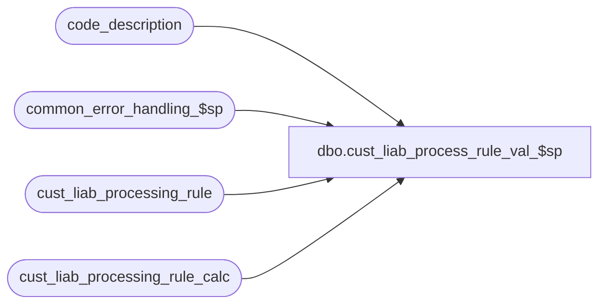

# dbo.cust_liab_process_rule_val_$sp

**Database:** auditworks  
**Server:** bedrockdb01  

## Architecture Diagram



## Table Dependencies

| Referenced Table |
|---|
| code_description |
| common_error_handling_$sp |
| cust_liab_processing_rule |
| cust_liab_processing_rule_calc |

## Stored Procedure Code

```sql
create proc dbo.cust_liab_process_rule_val_$sp @process_id    binary(16),
@user_id       int,
@errmsg        nvarchar(255) OUTPUT,
@ui_rule_id    nvarchar(3) = NULL  --passed when called by UI to validate a single rule

AS

/*
    Proc Name : cust_liab_process_rule_val_$sp
    Desc      : Called by the UI to validate whether or not the user-defined processing rule conditions/calculations are valid.
  
HISTORY :
 
Date     Name         Defect Desc
Jan04,11 Paul         105313 Use unicode datatypes
Aug23,10 Vicci        119571 Indicate age/inactivity criteria not used by setting to -1.
Aug03,10 Vicci        119571 Author
*/

DECLARE
  @cursor_open			tinyint,  
  @day_after_last_check_date    smalldatetime,
  @errno                        int,
  @errno2                       int,
  @process_no                   smallint, 
  @last_check_date              smalldatetime,
  @object_name                  nvarchar(255),
  @process_name                 nvarchar(100),
  @operation_name               nvarchar(100),
  @message_id			int,
  @today_date			smalldatetime,
  @today_day			smallint,
  @last_day_month		smallint,
  @last_day			smallint,
  @diff_day			smallint,
  @rule_id			nvarchar(3),
  @age_selection_criteria	smallint,
  @inactivity_selection_criteria smallint,
  @transaction_category		tinyint,
  @reference_type		tinyint,
  @call_clean_up 		tinyint,
  @rows				int,
--119571
  @balance_adjustment_type	smallint,    
  @sql_command_select 		nvarchar(3000),
  @sql_command_cond 		nvarchar(3000),
  @sql_command_calc		nvarchar(3000),
  @sql_command			nvarchar(3000),
  @work_table_created		tinyint,
  @parenthesis_prefix	      nvarchar(20),
  @cl_column_name	      nvarchar(255),
  @constant_value               money,
  @constant_date_string		nvarchar(255),
  @parenthesis_suffix	      nvarchar(20),
  @operator		      nvarchar(3),
  @unit_amount_flag		tinyint,
  @prior_date_string		nvarchar(255),
  @prior_date_operator		nvarchar(3),
  @prior_parenthesis_suffix	nvarchar(20),
  @first_fetch			tinyint,
  @input_id      		numeric(12,0)
/*
balance_adjustment_type:
 1= %Inc
-1= %Dec
 2= $Inc
-2= $Dec
 9= User-defined
*/

                           
  SELECT @today_date       = CONVERT(smalldatetime, CONVERT(nchar(8),getdate(),112)),
         @process_no       = 241, 
         @process_name     = 'cust_liab_process_rule_val_$sp',
         @message_id       = 201068,
         @call_clean_up    = 0,
         @work_table_created = 0 
   
    CREATE TABLE #work_cust_liab_ref_list(
    input_id numeric(12,0) not null,
    row_no numeric(12,0) identity not null ,
    reference_type tinyint not null,
    reference_no nvarchar(20) not null,
    key_store_no int not null,
    action_amount money not null,
    outstanding_amount money null,
    issuing_store_no int null,
    date_issued smalldatetime null,
    replacement_reference_no nvarchar(20) null,
    title nvarchar(10) null,
    first_name nvarchar(20) null,
    last_name nvarchar(40) null,
    address_1 nvarchar(40) null,
    address_2 nvarchar(40) null,
    city nvarchar(40) null,
    county nvarchar(40) null,
    state nvarchar(40) null,
    country nvarchar(40) null,
    post_code nvarchar(20) null,
    telephone_no1 nvarchar(16) null,
    telephone_no2 nvarchar(16) null,
    customer_no numeric(20,0) null,
    pos_tax_jurisdiction_code nvarchar(20) null,
    fax nvarchar(16) null,
    email_address nvarchar(50) null,
    employee_no int null,
    destination_store_no int null,
    action_date smalldatetime null,
    upc_no numeric(14,0) null,
    pos_identifier nvarchar(20) null,
    units float null,
    expiry_days smallint null)
    SELECT @errno = @@error, @work_table_created = 1
    IF @errno != 0 
      BEGIN
        SELECT @errmsg = 'Failed to create temp table #work_cust_liab_ref_list',
               @object_name = '#work_cust_liab_ref_list',
               @operation_name = 'CREATE'
        GOTO error
      END

  DECLARE cust_liab_proc_rule_calc_val_crsr CURSOR FAST_FORWARD
      FOR
  SELECT r.rule_id,
         r.reference_type,
         COALESCE(r.age_selection_criteria, -1),
         COALESCE(r.inactivity_selection_criteria, -1),
         r.transaction_category
    FROM cust_liab_processing_rule r
   WHERE (r.rule_id = @ui_rule_id OR @ui_rule_id IS NULL) AND
         r.balance_adjustment_type = 9
    
  --force select not to return anything by using reference_type = -1
  SELECT @sql_command_select = 'INSERT #work_cust_liab_ref_list(input_id,reference_type,reference_no,key_store_no,action_amount,issuing_store_no,title,first_name,last_name,address_1,address_2,city,county,state,country,post_code,telephone_no1,telephone_no2,customer_no,pos_tax_jurisdiction_code,fax,email_address,employee_no,date_issued) SELECT @input_id,reference_type,reference_no,key_store_no,liability_amount,issuing_store_no,title,first_name,last_name,address_1,address_2,city,county,state,country,post_code,telephone_no1,telephone_no2,customer_no,pos_tax_jurisdiction_code,fax,email_address,employee_no,date_issued FROM cust_liability WHERE reference_type = -1 AND reference_type = @reference_type AND date_issued < DATEADD(dd, @age_selection_criteria * -1, @today_date)  AND (last_client_activity_date < DATEADD(dd, @inactivity_selection_criteria * -1, @today_date) OR last_client_activity_date IS NULL) '      
  SELECT @errno = @@error
  IF @errno != 0
  BEGIN
    SELECT @errmsg         = 'Failed to create variable to hold insert statement for #work_cust_liab_ref_list',
           @object_name    = '@sql_command_select',
           @operation_name = 'SELECT'
    GOTO error
  END
               
  OPEN cust_liab_proc_rule_calc_val_crsr
  SELECT @errno = @@error
  IF @errno != 0
  BEGIN
    SELECT @errmsg         = 'Failed to open cust_liab_proc_rule_calc_val_crsr on cust_liab_processing_rule',
           @object_name    = 'store_list_cursor',
           @operation_name = 'OPEN'
    GOTO error
  END

  SELECT @cursor_open = 1

  WHILE 1=1
  BEGIN
    FETCH cust_liab_proc_rule_calc_val_crsr 
     INTO @rule_id,
          @reference_type,
          @age_selection_criteria,
          @inactivity_selection_criteria,
          @transaction_category

    IF @@fetch_status <> 0
      BREAK

    --PRINT 'Validating rule_id: ' + @rule_id
        
    SELECT @input_id = 0
           
    TRUNCATE TABLE #work_cust_liab_ref_list
    SELECT @errno = @@error
    IF @errno != 0
    BEGIN
      SELECT @errmsg         = 'Failed to initialize temp table #work_cust_liab_ref_list',
             @object_name    = '#work_cust_liab_ref_list',
             @operation_name = 'TRUNCATE'
      GOTO error
    END

    DECLARE cust_liab_proc_rule_cond_val_crsr CURSOR FAST_FORWARD
    FOR
    SELECT COALESCE(p.parenthesis_prefix, '') parenthesis_prefix, 
           p.unit_amount_flag,
	   c.code_system_descr, --cl_column_name
           p.constant_value,
           CASE WHEN p.constant_date IS NOT NULL THEN '''' + CONVERT(nvarchar, p.constant_date, 101) + '''' ELSE NULL END constant_date_string,
           COALESCE(p.parenthesis_suffix, '') parenthesis_suffix,
           COALESCE(p.operator, '') operator
      FROM cust_liab_processing_rule_calc p
           LEFT OUTER JOIN code_description c 
             ON c.code_type= 247
            AND p.unit_amount_flag * 100 + p.column_no = c.code 
            AND c.code_system_descr IS NOT NULL
            AND COALESCE(LTRIM(RTRIM(c.code_system_descr)), '') <> ''
     WHERE p.rule_id = @rule_id
       AND p.adjustment_line_type = 'CONDITION'
     ORDER BY p.adjustment_line_sequence
    SELECT @errno = @@error
    IF @errno != 0
    BEGIN
      SELECT @errmsg         = 'Failed to declare cursor to retrieve soft conditions for processing rule',
             @object_name    = 'cust_liab_proc_rule_cond_val_crsr',
             @operation_name = 'DECLARE'
        GOTO error
    END
    
    OPEN cust_liab_proc_rule_cond_val_crsr
    SELECT @cursor_open = 2, 
      	   @prior_date_string = NULL, @prior_date_operator = NULL, 
      	   @prior_parenthesis_suffix = NULL,
      	   @sql_command_cond = NULL, @first_fetch = 1 
    
     FETCH cust_liab_proc_rule_cond_val_crsr
      INTO @parenthesis_prefix,
           @unit_amount_flag,
           @cl_column_name,
           @constant_value,
           @constant_date_string,
           @parenthesis_suffix,
           @operator
     SELECT @errno = @@error
     IF @errno != 0
     BEGIN
       SELECT @errmsg         = 'Failed to retrieve soft conditions for processing rule',
              @object_name    = 'cust_liab_proc_rule_cond_val_crsr',
              @operation_name = 'FETCH'
       GOTO error
     END

     SELECT @sql_command_cond = @sql_command_select    
     
     WHILE @@fetch_status = 0 
     BEGIN       
       IF @first_fetch = 1 
         SELECT @sql_command_cond = @sql_command_cond + ' AND (', 
                @first_fetch = 0

       --PRINT 'Validating conditions for rule_id: ' + @rule_id + ' ' + @sql_command_cond
       
       SELECT @sql_command_cond = @sql_command_cond + @parenthesis_prefix 
        
       IF ((@constant_date_string IS NULL AND @unit_amount_flag <> 4 OR @unit_amount_flag <> 4) OR @operator NOT IN ('-', '+') OR @operator IS NULL) 
           AND @prior_date_operator IS NULL
       BEGIN
         SELECT @sql_command_cond =  @sql_command_cond + COALESCE(@cl_column_name, CONVERT(nvarchar,@constant_value), @constant_date_string) + @parenthesis_suffix + ' ' + @operator + ' '
       END
       ELSE
       BEGIN
         IF @prior_date_operator IS NOT NULL
           SELECT @prior_date_operator = NULL,
            	  @sql_command_cond =  @sql_command_cond + @parenthesis_suffix + ' ' + @operator + ' '
         ELSE
         BEGIN
           SELECT @prior_date_operator = @operator,
                  @prior_date_string = COALESCE(@cl_column_name, @constant_date_string),
                  @prior_parenthesis_suffix = @parenthesis_suffix
         END
       END

       FETCH cust_liab_proc_rule_cond_val_crsr
        INTO @parenthesis_prefix,
             @unit_amount_flag,
             @cl_column_name,
             @constant_value,
             @constant_date_string,
             @parenthesis_suffix,
             @operator
       SELECT @errno = @@error
       IF @errno != 0
       BEGIN
         SELECT @errmsg         = 'Failed to retrieve soft conditions for processing rule at end of loop',
                @object_name    = 'cust_liab_proc_rule_cond_val_crsr',
                @operation_name = 'FETCH'
         GOTO error
       END
        
       IF @prior_date_operator = '+'
       BEGIN
         SELECT @sql_command_cond = @sql_command_cond + ' DATEADD(dd, ' + convert(nvarchar, @constant_value) + ', ' + @prior_date_string + ') '
                               + @prior_parenthesis_suffix,
                @prior_parenthesis_suffix = NULL,
                @prior_date_string = NULL
       END
       ELSE
       BEGIN
         IF @prior_date_operator = '-'
         BEGIN
           IF @constant_date_string IS NOT NULL OR @unit_amount_flag = 4
           BEGIN
             SELECT @sql_command_cond = @sql_command_cond + ' DATEDIFF(dd, ' + COALESCE(@constant_date_string, @cl_column_name) + ', ' + @prior_date_string + ') '
                                    + @prior_parenthesis_suffix,
                    @prior_parenthesis_suffix = NULL,
                    @prior_date_string = NULL
           END
           ELSE
           BEGIN
             SELECT @sql_command_cond = @sql_command_cond + ' DATEADD(dd, ' + convert(nvarchar, @constant_value * -1) + ', ' + @prior_date_string + ') '
                         	       + @prior_parenthesis_suffix,
                    @prior_parenthesis_suffix = NULL,
                    @prior_date_string = NULL

           END
         END
       END

  END  --WHILE @@fetch_status = 0 for cust_liab_proc_rule_cond_val_crsr

     IF @cursor_open = 2
     BEGIN
       CLOSE cust_liab_proc_rule_cond_val_crsr
       DEALLOCATE cust_liab_proc_rule_cond_val_crsr
       SELECT @cursor_open = 1
     END
      
     IF @first_fetch = 0  --i.e. conditions were found
       SELECT  @sql_command_cond = @sql_command_cond + ')'
        
     SELECT @sql_command_cond = @sql_command_cond + ' SELECT @errno = @@error'

     --PRINT 'Done with conditions for rule_id:  ' + @rule_id + ' ' + @sql_command_cond
     EXEC sp_executesql @sql_command_cond, N'@errno int OUT, @input_id numeric(12,0), @reference_type tinyint, @age_selection_criteria smallint, @today_date smalldatetime, @inactivity_selection_criteria smallint', @errno OUT, @input_id, @reference_type, @age_selection_criteria, @today_date, @inactivity_selection_criteria 
     SELECT @errno2 = @@error
     IF @errno = 0 
       SELECT @errno = @errno2
     IF @errno <> 0
     BEGIN
       --PRINT @sql_command_cond  
       SELECT @errmsg = 'Failed to find list of reference numbers to be auto-adjusted via dynamic SQL for rule_id ' + @rule_id,
 	      @object_name = '#work_cust_liab_ref_list',
              @operation_name = 'INSERT'
       GOTO error
     END

--Validate adjustment start
    DECLARE cust_liab_proc_rule_adj_val_crsr CURSOR FAST_FORWARD
    FOR
    SELECT COALESCE(p.parenthesis_prefix, '') parenthesis_prefix, 
           p.unit_amount_flag,
	   c.code_system_descr, --cl_column_name
           p.constant_value,
           CASE WHEN p.constant_date IS NOT NULL THEN '''' + CONVERT(nvarchar, p.constant_date, 101) + '''' ELSE NULL END constant_date_string,
           COALESCE(p.parenthesis_suffix, '') parenthesis_suffix,
           COALESCE(p.operator, '') operator
      FROM cust_liab_processing_rule_calc p
           LEFT OUTER JOIN code_description c 
             ON c.code_type= 247
            AND p.unit_amount_flag * 100 + p.column_no = c.code 
            AND c.code_system_descr IS NOT NULL
            AND COALESCE(LTRIM(RTRIM(c.code_system_descr)), '') <> ''
     WHERE p.rule_id = @rule_id
       AND p.adjustment_line_type = 'ADJUSTMENT'
     ORDER BY p.adjustment_line_sequence
    SELECT @errno = @@error
    IF @errno != 0
    BEGIN
      SELECT @errmsg         = 'Failed to declare cursor to retrieve soft conditions for processing rule',
             @object_name    = 'cust_liab_proc_rule_adj_val_crsr',
             @operation_name = 'DECLARE'
      GOTO error
    END
    
    OPEN cust_liab_proc_rule_adj_val_crsr
    SELECT @cursor_open = 3, 
      	   @prior_date_string = NULL, @prior_date_operator = NULL, @prior_parenthesis_suffix = NULL,
      	   @sql_command_calc = NULL, @first_fetch = 1 
    
    FETCH cust_liab_proc_rule_adj_val_crsr
     INTO @parenthesis_prefix,
          @unit_amount_flag,
          @cl_column_name,
          @constant_value,
          @constant_date_string,
          @parenthesis_suffix,
          @operator
    SELECT @errno = @@error
    IF @errno != 0
    BEGIN
      SELECT @errmsg         = 'Failed to retrieve soft conditions for processing rule',
             @object_name    = 'cust_liab_proc_rule_adj_val_crsr',
             @operation_name = 'FETCH'
      GOTO error
    END

    SELECT @sql_command_calc = 'UPDATE #work_cust_liab_ref_list SET outstanding_amount = IsNull(cl.liability_amount, 0), action_amount = '

    WHILE @@fetch_status = 0 
    BEGIN      
      IF @first_fetch = 1 
        SELECT @sql_command_calc = @sql_command_calc + '(', 
               @first_fetch = 0

      SELECT @sql_command_calc = @sql_command_calc + @parenthesis_prefix 

      --PRINT 'Validating adjustments for rule_id: ' + @rule_id + ' ' + @sql_command_calc
              
      IF @cl_column_name IS NOT NULL AND @cl_column_name NOT LIKE '%.%' AND @cl_column_name NOT LIKE '%getdate()%'
      BEGIN
        SELECT @cl_column_name = 'cl.'+ @cl_column_name
      END
        
      IF ((@constant_date_string IS NULL AND @unit_amount_flag <> 4) OR @operator NOT IN ('-', '+')) 
           AND @prior_date_operator IS NULL
      BEGIN
        SELECT @sql_command_calc =  @sql_command_calc + COALESCE(@cl_column_name, CONVERT(nvarchar,@constant_value), @constant_date_string) + @parenthesis_suffix + ' ' + @operator + ' '
      END
      ELSE
      BEGIN
        IF @prior_date_operator IS NOT NULL
          SELECT @prior_date_operator = NULL,
            	 @sql_command_calc =  @sql_command_calc + @parenthesis_suffix + ' ' + @operator + ' '
        ELSE
        BEGIN
          SELECT @prior_date_operator = @operator,
                 @prior_date_string = COALESCE(@cl_column_name, @constant_date_string),
                 @prior_parenthesis_suffix = @parenthesis_suffix
        END
      END
    
      FETCH cust_liab_proc_rule_adj_val_crsr
       INTO @parenthesis_prefix,
            @unit_amount_flag,
            @cl_column_name,
            @constant_value,
            @constant_date_string,
            @parenthesis_suffix,
            @operator
      SELECT @errno = @@error
      IF @errno != 0
      BEGIN
        SELECT @errmsg         = 'Failed to retrieve soft conditions for processing rule at end of loop',
               @object_name    = 'cust_liab_proc_rule_adj_val_crsr',
               @operation_name = 'FETCH'
        GOTO error
      END
        
      IF @prior_date_operator = '+'
      BEGIN
        SELECT @sql_command_calc = @sql_command_calc + ' DATEADD(dd, ' + convert(nvarchar, @constant_value) + ', ' + @prior_date_string + ') '
                              + @prior_parenthesis_suffix,
               @prior_parenthesis_suffix = NULL,
               @prior_date_string = NULL
      END
      ELSE
      BEGIN
        IF @prior_date_operator = '-'
        BEGIN
          IF @constant_date_string IS NOT NULL OR @unit_amount_flag = 4
          BEGIN
            SELECT @sql_command_calc = @sql_command_calc + ' DATEDIFF(dd, ' + COALESCE(@constant_date_string, @cl_column_name) + ', ' + @prior_date_string + ') '
                                  + @prior_parenthesis_suffix,
                   @prior_parenthesis_suffix = NULL,
                   @prior_date_string = NULL
          END
          ELSE
          BEGIN
            SELECT @sql_command_calc = @sql_command_calc + ' DATEADD(dd, ' + convert(nvarchar, @constant_value * -1) + ', ' + @prior_date_string + ') '
                         	  + @prior_parenthesis_suffix,
                   @prior_parenthesis_suffix = NULL,
                   @prior_date_string = NULL

          END
        END
      END

    END  --WHILE @@fetch_status = 0 for cust_liab_proc_rule_adj_val_crsr

    IF @cursor_open = 3
    BEGIN
      CLOSE cust_liab_proc_rule_adj_val_crsr
      DEALLOCATE cust_liab_proc_rule_adj_val_crsr
      SELECT @cursor_open = 1
    END
      
    IF @first_fetch = 0  --i.e. adjustments were found
      SELECT @sql_command_calc = @sql_command_calc + ')'
    ELSE 
      SELECT @sql_command_calc = @sql_command_calc + '0'
        
    SELECT @sql_command_calc = @sql_command_calc + ' FROM #work_cust_liab_ref_list rf LEFT OUTER JOIN cust_liability cl ON rf.reference_type = cl.reference_type AND rf.reference_no = cl.reference_no AND rf.key_store_no = cl.key_store_no SELECT @errno = @@error'

    --PRINT 'Done with validating adjustments for rule_id:  ' + @rule_id + ' ' + @sql_command_calc
    EXEC sp_executesql @sql_command_calc, N'@errno int OUT, @today_date smalldatetime', @errno OUT, @today_date
    SELECT @errno2 = @@error
    IF @errno = 0 
      SELECT @errno = @errno2
    IF @errno <> 0
    BEGIN
      --PRINT @sql_command_calc  
      SELECT @errmsg = 'Failed to find action amount reference numbers to be auto-adjusted via dynamic SQL',
	     @object_name = '#work_cust_liab_ref_list',
             @operation_name = 'UPDATE'
      GOTO error
    END

--Validate adjustment end
   END --WHILE 1=1 
     
   IF @cursor_open >= 1
   BEGIN
     CLOSE cust_liab_proc_rule_calc_val_crsr
     DEALLOCATE cust_liab_proc_rule_calc_val_crsr
   END   

  IF @work_table_created = 1 
    DROP TABLE #work_cust_liab_ref_list 
    
  RETURN

error:
  IF @work_table_created = 1 
    DROP TABLE #work_cust_liab_ref_list 

  IF @cursor_open >= 1
  BEGIN
    
    IF @cursor_open = 3
    BEGIN
      CLOSE cust_liab_proc_rule_adj_val_crsr
      DEALLOCATE cust_liab_proc_rule_adj_val_crsr
    END

 IF @cursor_open = 2
    BEGIN
      CLOSE cust_liab_proc_rule_cond_val_crsr
      DEALLOCATE cust_liab_proc_rule_cond_val_crsr
    END

    CLOSE cust_liab_proc_rule_calc_val_crsr
    DEALLOCATE cust_liab_proc_rule_calc_val_crsr

  END
 
  EXEC common_error_handling_$sp @process_no, @errno, @errmsg, 0, @message_id, @process_name,
       @object_name, @operation_name, 1, 1, 0, null, 0, null, null, null, null, null, null,
       0, @process_id, @user_id
  
  RETURN
```

