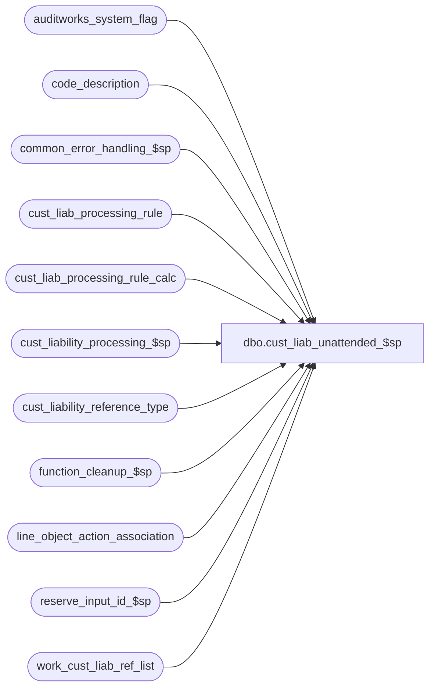

# dbo.cust_liab_unattended_$sp

**Database:** auditworks  
**Server:** bedrockdb01  

## Architecture Diagram



## Table Dependencies

| Referenced Table |
|---|
| auditworks_system_flag |
| code_description |
| common_error_handling_$sp |
| cust_liab_processing_rule |
| cust_liab_processing_rule_calc |
| cust_liability_processing_$sp |
| cust_liability_reference_type |
| function_cleanup_$sp |
| line_object_action_association |
| reserve_input_id_$sp |
| work_cust_liab_ref_list |

## Stored Procedure Code

```sql
create proc dbo.cust_liab_unattended_$sp @process_id    binary(16),
@user_id       int,
@errmsg        nvarchar(255) OUTPUT,
@input_id      numeric(12,0) OUTPUT,
@ui_rule_id    nvarchar(3) = NULL,  --passed when called by UI to execute single rule of a type which does not require manual reference number selection and which is NOT marked for unattended execution
@preview       tinyint = 0,	   --passed when called by the UI to provide the user the opportunity of view the selected reference numbers prior to proceeding.
@sample_size   tinyint = NULL	   --if null then execute actual run, if not null (only allow if @preview = 1) then only include X reference numbers in sample.
AS

/*
    Proc Name : cust_liab_unattended_$sp
    Desc      : This procedure applies balance adjustment policy to liabilities of 
                the age and type specified once a month on the day specified.
                Called by edit_phase2_$sp with @ui_rule_id = NULL.
                Called by the UI with @ui_rule_id set in which case the work table is populated 
                and the input id returned, then it is up to the UI to call cust_liability_processing_$sp again 
                with the @input_id returned and a status of 1 if @preview = 1 or this proc will do it automatically otherwise.
  
HISTORY :
 
Date     Name         Defect Desc
Nov16,11 Vicci        161164 Allow sample size to be passed.
Aug20,10 Vicci        119571 Set unused age/last-activity restrictions to -1;  ensure NULLs are handled in <> and not in verifications.
Aug19,10 Vicci        119571 Don't set last unattended check date if proc was executed by UI;  correct call to function cleanup.
Aug04,10 Vicci        119571 Only look at active rules;  handle soft-coded processing rule conditions;  support
                             being called by the UI;  only look at rules for active reference-types.
Aug03,05 David       DV-1294 Expand last_name to nvarchar(40).
Jan06,05 Paul        DV-1191 added locking hints
Sep23,04 David       DV-1146 Use user_id instead of user_name.
May13,04 David       DV-1071 Do not use Calendar table.
May05,04 Maryam      DV-1071 Receive @process_id and @user_name and pass it to the sub procs
Jun03,03 Maryam       9246   Make sure function_status gets cleaned up.
Mar27,03 Maryam       6248   Author
*/

DECLARE
  @cursor_open			tinyint,  
  @day_after_last_check_date    smalldatetime,
  @errno                        int,
  @errno2                       int,
  @process_no                   smallint, 
  @last_check_date              smalldatetime,
  @object_name                  nvarchar(255),
  @process_name                 nvarchar(100),
  @operation_name               nvarchar(100),
  @message_id			int,
  @today_date			smalldatetime,
  @today_day			smallint,
  @last_day_month		smallint,
  @last_day			smallint,
  @diff_day			smallint,
  @rule_id			nvarchar(3),
  @age_selection_criteria	smallint,
  @inactivity_selection_criteria smallint,
  @transaction_category		tinyint,
  @reference_type		tinyint,
  @call_clean_up 		tinyint,
  @rows				int,
--119571
  @balance_adjustment_type	smallint,    
  @sql_command_select 		nvarchar(4000),
  @sql_command_cond 		nvarchar(4000),
  @sql_command_calc		nvarchar(4000),
  @sql_command			nvarchar(4000),
  @work_table_created		tinyint,
  @parenthesis_prefix	      nvarchar(20),
  @cl_column_name	      nvarchar(255),
  @constant_value               money,
  @constant_date_string		nvarchar(255),
  @parenthesis_suffix	      nvarchar(20),
  @operator		      nvarchar(3),
  @unit_amount_flag		tinyint,
  @prior_date_string		nvarchar(255),
  @prior_date_operator		nvarchar(3),
  @prior_parenthesis_suffix	nvarchar(20),
  @first_fetch			tinyint
/*
balance_adjustment_type:
 1= %Inc
-1= %Dec
 2= $Inc
-2= $Dec
 9= User-defined
*/

                           
  SELECT @today_date       = CONVERT(smalldatetime, CONVERT(nchar(8),getdate(),112)),
         @process_no = 241, 
         @process_name     = 'cust_liab_unattended_$sp',
         @message_id       = 201068,
         @call_clean_up    = 0,
         @work_table_created = 0 

IF @preview = 0
  SELECT @sample_size = null
  
IF @ui_rule_id IS NULL  --i.e. this is an unattended execution by Edit  
BEGIN
   /* check when the last unattended C/L processing check occurred based 
   on auditworks_system_flag and set an @last_check_date variable accordingly */
  SELECT @last_check_date = flag_datetime_value
    FROM auditworks_system_flag
   WHERE flag_name = 'last_unattended_cl_check_date'       
  SELECT @errno = @@error,
         @rows = @@rowcount
  IF @errno <> 0
    BEGIN
      SELECT @errmsg = 'Failed to select flag_datetime_value.',
             @object_name = 'auditworks_system_flag',
             @operation_name = 'SELECT'
      GOTO error
    END
   
   IF @rows = 0
     BEGIN
       INSERT INTO auditworks_system_flag(
                   flag_name,
                   flag_comment) 
            VALUES ('last_unattended_cl_check_date',
                    'Used to to keep track of the last time the edit checked to see if an Unattended C/L posting needed to be run.')
       IF @errno <> 0
       BEGIN
         SELECT @errmsg = 'Failed to insert into auditworks_system_flag.',
                @object_name = 'auditworks_system_flag',
                @operation_name = 'INSERT'
         GOTO error
       END
    
     END  --  @rows = 0
     
   /*If its last occurrence was today it will return */
   IF @last_check_date = @today_date
     RETURN


   /* If @last_check_date is null, set the variable to yesterday's date. */
   
     IF @last_check_date IS NULL /* then */
       SELECT @last_check_date = DATEADD(dd, -1, @today_date)
         
     SELECT   @day_after_last_check_date = DATEADD(dd, 1, @last_check_date)
     SELECT @today_day = datepart(dd, @today_date),
	    @last_day  = datepart(dd, @day_after_last_check_date),
	    @diff_day  = datediff(dd, @last_check_date, @today_date)

  -- Get last day of the month. If the difference between Feb 28th and March 1st 
  -- of the current year is 2 days, then it is a leap year, so the last day is 29.
     IF MONTH(@last_check_date) IN (1,3,5,7,8,10,12)
       SELECT @last_day_month = 31
     ELSE 
       IF MONTH(@last_check_date) IN (4,6,9,11)
         SELECT @last_day_month = 30
       ELSE 
         IF datediff (dd, CONVERT(smalldatetime, '02/28/' + CONVERT(nvarchar,YEAR(@last_check_date))),
          CONVERT(smalldatetime, '03/01/' + CONVERT(nvarchar,YEAR(@last_check_date)))) = 2
           SELECT @last_day_month = 29
         ELSE  
           SELECT @last_day_month = 28
     
     DECLARE unattended_crsr CURSOR FAST_FORWARD
      FOR
      SELECT r.rule_id,
             r.reference_type,
             COALESCE(r.age_selection_criteria, -1), 
             COALESCE(r.inactivity_selection_criteria,-1),
             r.transaction_category,
             r.balance_adjustment_type  --119571
        FROM cust_liab_processing_rule r
             INNER JOIN cust_liability_reference_type c
                ON r.reference_type = c.reference_type
               AND c.reference_type_active_flag = 1
       WHERE r.processing_activation_type = 0
         AND r.rule_active_flag = 1 --119571
         AND (r.last_processing_date IS NULL OR r.last_processing_date < @today_date)
         AND r.processing_day IS NOT NULL --
         AND (   (@today_day >= @last_day AND r.processing_day between @last_day AND @today_day)
              OR (@today_day < @last_day AND (   (r.processing_day between @last_day AND @last_day + @diff_day +1)
                                              OR (r.processing_day <= @today_day) 
                                             ) 
                 )
              OR (r.processing_day IN (29,30,31) AND @today_day >= @last_day_month)
             )
END --IF @ui_rule_id IS NULL
ELSE
BEGIN
     DECLARE unattended_crsr CURSOR FAST_FORWARD
      FOR
      SELECT r.rule_id,
             r.reference_type,
             COALESCE(r.age_selection_criteria, -1), 
             COALESCE(r.inactivity_selection_criteria,-1),
             r.transaction_category,
             r.balance_adjustment_type  --119571
        FROM cust_liab_processing_rule r
             INNER JOIN cust_liability_reference_type c
                ON r.reference_type = c.reference_type
               AND c.reference_type_active_flag = 1
             INNER JOIN line_object_action_association x
                ON r.transaction_category = x.transaction_category
               AND r.line_object_offset = x.line_object
               AND r.line_action_offset = x.line_action
               AND x.reference_type = 0 
       WHERE r.rule_id = @ui_rule_id
         AND COALESCE(r.processing_activation_type, -1) <> 0  --i.e. not unattended
         AND r.rule_active_flag = 1 --119571
         AND ( (r.balance_adjustment_type = 9 AND EXISTS (SELECT 1 FROM cust_liab_processing_rule_calc c WHERE c.rule_id = @ui_rule_id AND c.adjustment_line_type = 'CONDITION'))
              OR r.age_selection_criteria > 0
              OR r.inactivity_selection_criteria > 0 )
         AND r.transaction_category IN (241, 246, 248, 249)
END --ELSE of IF @ui_rule_id IS NULL         

    CREATE TABLE #work_cust_liab_ref_list(
    input_id numeric(12,0) not null,
    row_no numeric(12,0) identity not null ,
    reference_type tinyint not null,
    reference_no nvarchar(20) not null,
    key_store_no int not null,
    action_amount money not null,
    issuing_store_no int null,
    date_issued smalldatetime null,
    replacement_reference_no nvarchar(20) null,
    title nvarchar(10) null,
    first_name nvarchar(20) null,
    last_name nvarchar(40) null,
    address_1 nvarchar(40) null,
    address_2 nvarchar(40) null,
    city nvarchar(40) null,
    county nvarchar(40) null,
    state nvarchar(40) null,
    country nvarchar(40) null,
    post_code nvarchar(20) null,
    telephone_no1 nvarchar(16) null,
    telephone_no2 nvarchar(16) null,
    customer_no numeric(20,0) null,
    pos_tax_jurisdiction_code nvarchar(20) null,
    fax nvarchar(16) null,
    email_address nvarchar(50) null,
    employee_no int null,
    destination_store_no int null,
    action_date smalldatetime null,
    upc_no numeric(14,0) null,
    pos_identifier nvarchar(20) null,
    units float null,
    expiry_days smallint null)
    SELECT @errno = @@error, @work_table_created = 1
    IF @errno != 0 
      BEGIN
        SELECT @errmsg = 'Failed to create temp table #work_cust_liab_ref_list',
               @object_name = '#work_cust_liab_ref_list',
               @operation_name = 'CREATE'
        GOTO error
      END
 
    IF @sample_size IS NOT NULL
      SELECT @sql_command_select = 'SET rowcount ' + convert(nvarchar, @sample_size) + ' INSERT '
    ELSE
      SELECT @sql_command_select = 'INSERT '
      
    SELECT @sql_command_select = @sql_command_select + '#work_cust_liab_ref_list(input_id,reference_type,reference_no,key_store_no,action_amount,issuing_store_no,title,first_name,last_name,address_1,address_2,city,county,state,country,post_code,telephone_no1,telephone_no2,customer_no,pos_tax_jurisdiction_code,fax,email_address,employee_no,date_issued) SELECT @input_id,reference_type,reference_no,key_store_no,liability_amount,issuing_store_no,title,first_name,last_name,address_1,address_2,city,county,state,country,post_code,telephone_no1,telephone_no2,customer_no,pos_tax_jurisdiction_code,fax,email_address,employee_no,date_issued FROM cust_liability WHERE reference_type = @reference_type AND date_issued < DATEADD(dd, @age_selection_criteria * -1, @today_date)  AND (last_client_activity_date < DATEADD(dd, @inactivity_selection_criteria * -1, @today_date) OR last_client_activity_date IS NULL) '      
    SELECT @errno = @@error
    IF @errno != 0
    BEGIN
     SELECT @errmsg         = 'Failed to create variable to hold insert statement for #work_cust_liab_ref_list',
             @object_name    = '@sql_command_select',
             @operation_name = 'SELECT'
      GOTO error
    END
               
    OPEN unattended_crsr

     SELECT @errno = @@error
     IF @errno != 0
       BEGIN
         SELECT @errmsg         = 'Failed to open unattended_crsr on cust_liab_processing_rule',
                @object_name    = 'store_list_cursor',
                @operation_name = 'OPEN'
         GOTO error
       END

     SELECT @cursor_open = 1

     WHILE 1=1
     BEGIN

     FETCH unattended_crsr 
      INTO @rule_id,
           @reference_type,
           @age_selection_criteria,
           @inactivity_selection_criteria,
           @transaction_category,
           @balance_adjustment_type  --119571

    IF @@fetch_status <> 0
      BREAK
    
    EXEC reserve_input_id_$sp @process_id, @user_id, @rule_id, @input_id OUTPUT, @errmsg OUTPUT

    SELECT @errno = @@error
    IF @errno != 0
      BEGIN
        IF @errmsg IS NULL /* then */
          SELECT @errmsg = 'Failed to execute stored proc reserve_input_id_$sp.'
        SELECT @object_name = 'reserve_input_id_$sp',
               @operation_name = 'EXECUTE',
               @call_clean_up = 1
        GOTO error
      END
       
    SELECT @call_clean_up = 1

    TRUNCATE TABLE #work_cust_liab_ref_list  --119571
    SELECT @errno = @@error
    IF @errno != 0
    BEGIN
      SELECT @errmsg         = 'Failed to initialize temp table #work_cust_liab_ref_list',
             @object_name    = '#work_cust_liab_ref_list',
             @operation_name = 'TRUNCATE'
      GOTO error
    END

    --119571
    IF @balance_adjustment_type <> 9 OR @balance_adjustment_type IS NULL 
      SELECT @sql_command = @sql_command_select + ' AND liability_amount > 0 SELECT @errno = @@error'
    ELSE
    BEGIN

      DECLARE unattended_soft_condition_crsr CURSOR FAST_FORWARD
      FOR
      SELECT COALESCE(p.parenthesis_prefix, '') parenthesis_prefix, 
             p.unit_amount_flag,
	     c.code_system_descr, --cl_column_name
             p.constant_value,
             CASE WHEN p.constant_date IS NOT NULL THEN '''' + CONVERT(nvarchar, p.constant_date, 101) + '''' ELSE NULL END constant_date_string,
             COALESCE(p.parenthesis_suffix, '') parenthesis_suffix,
             COALESCE(p.operator, '') operator
        FROM cust_liab_processing_rule_calc p
             LEFT OUTER JOIN code_description c 
               ON c.code_type= 247
              AND p.unit_amount_flag * 100 + p.column_no = c.code 
              AND c.code_system_descr IS NOT NULL
              AND COALESCE(LTRIM(RTRIM(c.code_system_descr)), '') <> ''
       WHERE p.rule_id = @rule_id
         AND p.adjustment_line_type = 'CONDITION'
       ORDER BY p.adjustment_line_sequence
      SELECT @errno = @@error
      IF @errno != 0
      BEGIN
        SELECT @errmsg         = 'Failed to declare cursor to retrieve soft conditions for processing rule',
               @object_name    = 'unattended_soft_condition_crsr',
               @operation_name = 'DECLARE'
        GOTO error
      END
    
      OPEN unattended_soft_condition_crsr
      SELECT @cursor_open = 2, 
      	     @prior_date_string = NULL, @prior_date_operator = NULL, @prior_parenthesis_suffix = NULL,
      	     @sql_command = NULL, @first_fetch = 1 
    
      FETCH unattended_soft_condition_crsr
       INTO @parenthesis_prefix,
            @unit_amount_flag,
            @cl_column_name,
            @constant_value,
            @constant_date_string,
            @parenthesis_suffix,
            @operator
      SELECT @errno = @@error
      IF @errno != 0
      BEGIN
        SELECT @errmsg         = 'Failed to retrieve soft conditions for processing rule',
               @object_name    = 'unattended_soft_condition_crsr',
               @operation_name = 'FETCH'
        GOTO error
      END

      SELECT @sql_command = @sql_command_select    

      WHILE @@fetch_status = 0 
      BEGIN 
      
        IF @first_fetch = 1 
          SELECT @sql_command = @sql_command + ' AND (', 
                 @first_fetch = 0

        SELECT @sql_command = @sql_command + @parenthesis_prefix 
        
        IF ((@constant_date_string IS NULL AND (@unit_amount_flag <> 4 OR @unit_amount_flag IS NULL)) OR @operator NOT IN ('-', '+') OR @operator IS NULL) 
           AND @prior_date_operator IS NULL
        BEGIN
          SELECT @sql_command =  @sql_command + COALESCE(@cl_column_name, CONVERT(nvarchar,@constant_value), @constant_date_string) + @parenthesis_suffix + ' ' + @operator + ' '
        END
        ELSE
        BEGIN
          IF @prior_date_operator IS NOT NULL
            SELECT @prior_date_operator = NULL,
            	   @sql_command =  @sql_command + @parenthesis_suffix + ' ' + @operator + ' '
          ELSE
          BEGIN
            SELECT @prior_date_operator = @operator,
                   @prior_date_string = COALESCE(@cl_column_name, @constant_date_string),
                   @prior_parenthesis_suffix = @parenthesis_suffix
          END
        END
    
        FETCH unattended_soft_condition_crsr
         INTO @parenthesis_prefix,
              @unit_amount_flag,
              @cl_column_name,
              @constant_value,
              @constant_date_string,
              @parenthesis_suffix,
              @operator
        SELECT @errno = @@error
        IF @errno != 0
        BEGIN
          SELECT @errmsg         = 'Failed to retrieve soft conditions for processing rule at end of loop',
                 @object_name    = 'unattended_soft_condition_crsr',
                 @operation_name = 'FETCH'
          GOTO error
        END
        
        IF @prior_date_operator = '+'
        BEGIN
          SELECT @sql_command = @sql_command + ' DATEADD(dd, ' + convert(nvarchar, @constant_value) + ', ' + @prior_date_string + ') '
                         	+ @prior_parenthesis_suffix,
                 @prior_parenthesis_suffix = NULL,
                 @prior_date_string = NULL
        END
        ELSE
        BEGIN
          IF @prior_date_operator = '-'
          BEGIN
            IF @constant_date_string IS NOT NULL OR @unit_amount_flag = 4
            BEGIN
              SELECT @sql_command = @sql_command + ' DATEDIFF(dd, ' + COALESCE(@constant_date_string, @cl_column_name) + ', ' + @prior_date_string + ') '
                                    + @prior_parenthesis_suffix,
                     @prior_parenthesis_suffix = NULL,
                     @prior_date_string = NULL
            END
            ELSE
            BEGIN
                 SELECT @sql_command = @sql_command + ' DATEADD(dd, ' + convert(nvarchar, @constant_value * -1) + ', ' + @prior_date_string + ') '
                         	       + @prior_parenthesis_suffix,
                 @prior_parenthesis_suffix = NULL,
                 @prior_date_string = NULL

            END
          END
        END

      END  --WHILE @@fetch_status = 0 for unattended_soft_condition_crsr

      IF @cursor_open = 2
      BEGIN
        CLOSE unattended_soft_condition_crsr
        DEALLOCATE unattended_soft_condition_crsr
        SELECT @cursor_open = 1
      END
      
      IF @first_fetch = 0  --i.e. conditions were found
        SELECT  @sql_command = @sql_command + ')'
        
      SELECT @sql_command = @sql_command + ' SELECT @errno = @@error'
    END  --ELSE IF @balance_adjustment_type <> 9 (9=Soft calc)

    IF @sample_size IS NOT NULL
      SELECT @sql_command = @sql_command + ' SET rowcount 0 '
      
--    PRINT ':LOG Tracing:  ' + @sql_command
    EXEC sp_executesql @sql_command, N'@errno int OUT, @input_id numeric(12,0), @reference_type tinyint, @age_selection_criteria smallint, @today_date smalldatetime, @inactivity_selection_criteria smallint', @errno OUT, @input_id, @reference_type, @age_selection_criteria, @today_date, @inactivity_selection_criteria 
    SELECT @errno2 = @@error
    IF @errno = 0 
      SELECT @errno = @errno2
    IF @errno <> 0
    BEGIN
      PRINT @sql_command  
      SELECT @errmsg = 'Failed to find list of reference numbers to be auto-adjusted via dynamic SQL for rule_id ' + @rule_id,
	     @object_name = '#work_cust_liab_ref_list',
             @operation_name = 'INSERT'
      GOTO error
    END

    DELETE work_cust_liab_ref_list 
     WHERE input_id = @input_id

    SELECT @errno = @@error
    IF @errno != 0 
     BEGIN
       SELECT @errmsg = 'Failed to delete from work_cust_liab_ref_list ',
              @object_name = 'work_cust_liab_ref_list',
              @operation_name = 'DELETE'
     GOTO error
     END
     
    INSERT work_cust_liab_ref_list (
           input_id,
           row_no,
           reference_type,
           reference_no, key_store_no,
           action_amount,
           issuing_store_no,
           replacement_reference_no,
           title,
           first_name,
           last_name,
           address_1,
           address_2,
           city,
           county,
           state,
           country,
           post_code,
           telephone_no1,
           telephone_no2,
           customer_no,
           pos_tax_jurisdiction_code,
           fax,
           email_address,
           employee_no,
           date_issued)
    SELECT input_id,
           row_no - 1, /* since row_no must start with 0 */
           reference_type,
           reference_no, 
           key_store_no,
           action_amount,
           issuing_store_no,
           replacement_reference_no,
           title,
           first_name,
           last_name,
           address_1,
           address_2,
           city,
           county,
           state,
           country,
           post_code,
           telephone_no1,
           telephone_no2,
           customer_no,
           pos_tax_jurisdiction_code,
           fax,
           email_address,
           employee_no,
           date_issued  
      FROM #work_cust_liab_ref_list WITH (NOLOCK)
      
    SELECT @errno = @@error
    IF @errno != 0
      BEGIN
        SELECT @errmsg         = 'Failed to insert work_cust_liab_ref_list',
               @object_name    = 'work_cust_liab_ref_list',
               @operation_name = 'INSERT'
        GOTO error
      END      
    -- passing -2 Input Id reserved
    EXEC cust_liability_processing_$sp @process_id, @user_id, @input_id, -2, null, null, null, @errmsg OUTPUT, null, @today_date

    SELECT @errno = @@error
    IF @errno != 0 	
      BEGIN
        IF @errmsg IS NULL /* then */ 
          SELECT @errmsg = 'Failed to execute stored proc cust_liability_processing_$sp (-2).'
      
        SELECT @object_name = 'cust_liability_processing_$sp',
               @operation_name = 'EXECUTE',
               @call_clean_up = 1 
        GOTO error
      END
   
    IF @preview = 0 
    BEGIN   
      -- Passing 1 = Input data available for Edit
      EXEC cust_liability_processing_$sp @process_id, @user_id, @input_id, 1, null, null, null, @errmsg OUTPUT, null, @today_date
      SELECT @errno = @@error
      IF @errno != 0 	
      BEGIN
        IF @errmsg IS NULL /* then */ 
          SELECT @errmsg = 'Failed to execute stored proc cust_liability_processing_$sp (1).'
      
        SELECT @object_name = 'cust_liability_processing_$sp',
               @operation_name = 'EXECUTE',
               @call_clean_up = 1
        GOTO error
      END

      SELECT @call_clean_up = 0
    END  --IF @preview = 0, i.e. if this is an unattended run or a UI run with no preview requested.  
    
    END --WHILE 1=1 
     
    IF @cursor_open >= 1
    BEGIN
      CLOSE unattended_crsr
     DEALLOCATE unattended_crsr
    END   
    
    IF @ui_rule_id IS NULL 
    BEGIN
      UPDATE auditworks_system_flag
         SET flag_datetime_value = @today_date
       WHERE flag_name = 'last_unattended_cl_check_date'
      SELECT @errno = @@error
      IF @errno <> 0
      BEGIN
        SELECT @errmsg = 'Failed to set last_unattended_cl_check_date.',
               @object_name = 'auditworks_system_flag',
               @operation_name = 'UDPATE'
        GOTO error
      END
    END

    IF @work_table_created = 1 
      DROP TABLE #work_cust_liab_ref_list 

  RETURN

error:
  IF @work_table_created = 1 
    DROP TABLE #work_cust_liab_ref_list 

  IF @cursor_open >= 1
  BEGIN
    CLOSE unattended_crsr
    DEALLOCATE unattended_crsr
    
    IF @cursor_open = 2
    BEGIN
      CLOSE unattended_soft_condition_crsr
     DEALLOCATE unattended_soft_condition_crsr
    END
  END

  IF @call_clean_up = 1
    EXEC function_cleanup_$sp @process_id, @user_id, @transaction_category, @errmsg OUTPUT

 
  EXEC common_error_handling_$sp @process_no, @errno, @errmsg, 0, @message_id, @process_name,
       @object_name, @operation_name, 1, 1, 0, null, 0, null, null, null, null, null, null,
       0, @process_id, @user_id
  
  RETURN
```

