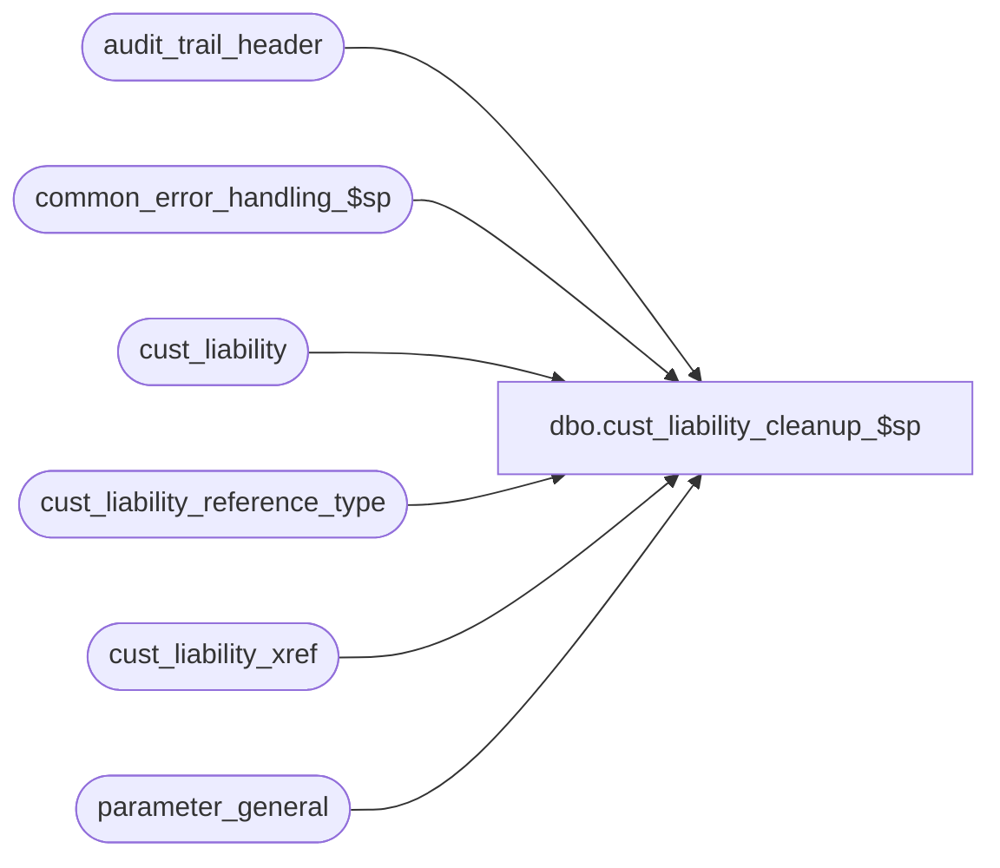

# dbo.cust_liability_cleanup_$sp

**Database:** auditworks  
**Server:** bedrockdb01  

## Architecture Diagram



## Table Dependencies

| Referenced Table |
|---|
| audit_trail_header |
| common_error_handling_$sp |
| cust_liability |
| cust_liability_reference_type |
| cust_liability_xref |
| parameter_general |

## Stored Procedure Code

```sql
CREATE proc [dbo].[cust_liability_cleanup_$sp] 
AS


/* Proc name:   cust_liability_cleanup_$sp
** Description:
**              This function is executed as part of dayend_housekeeping_$sp. 
**              It removes old liability from all the liability tables.
**              Based on customer_liability_cleanup_$sp.
HISTORY
DATE     NAME           DEFECT#  DESC
Sep13,17 Sean/Terri   DAOM-2874  Added the cleanup code for history cleanup criteria option 5 ("abs( sign(abs" logic)
Dec13,04 David          DV-1191  Improve performance by adding hints.
Mar03,03 Maryam         6478     Handle function no 250.
Feb20,02 Daphna/David   AW-8415  Include Service Desk txns in cleanup of audit_trail

*/

DECLARE
	@audit_trail_days	smallint,
	@criteria		smallint,
	@cutoffdate		smalldatetime,
	@cursor_open		tinyint,
	@errmsg			nvarchar(255),
	@errno			int,
	@glc_postable_used	tinyint,
	@history_days		smallint,
	@lastdate		smalldatetime,
	@message_id		int,
	@object_name		nvarchar(255),
	@operation_name		nvarchar(100),
	@process_name		nvarchar(100),
	@process_no 		smallint,
	@reference_type		tinyint,
	@rows			int


SELECT @audit_trail_days = audit_trail_days
  FROM parameter_general

 SELECT @errno=@@error
 IF @errno != 0
 BEGIN
   SELECT @errmsg = 'Failed to get audit_trail_days',
          @object_name = 'parameter_general',
          @operation_name = 'SELECT'
   GOTO error
 END

SELECT 	@process_no = 16,
	@message_id = 201068,
	@process_name = 'cust_liability_cleanup_$sp'


DECLARE ref_type_crsr CURSOR FAST_FORWARD
    FOR
 SELECT reference_type, history_days, history_cleanup_criteria
   FROM cust_liability_reference_type 
   
OPEN ref_type_crsr

 SELECT @errno=@@error
 IF @errno != 0
 BEGIN
   SELECT @errmsg = 'Failed to open cursor ref_type_crsr',
          @object_name = 'ref_type_crsr',
          @operation_name = 'OPEN'
   GOTO error
 END

SELECT @cursor_open = 1

WHILE 1=1 
BEGIN
  
  FETCH ref_type_crsr
   INTO @reference_type, @history_days, @criteria

  IF @@fetch_status != 0 BREAK
  
  SELECT @cutoffdate = dateadd(dd, @history_days * -1, getdate())

  -- cleanup cust_liability; cust_liability_$trD will cascade delete to other cust liability tables
  DELETE cust_liability
   WHERE reference_type = @reference_type
     AND last_modified_by_aw < @cutoffdate
     AND ((stocked_flag - stocked_stolen_flag) = 0 OR issued_flag = 1)
     AND ( (  abs( sign(abs(1-@criteria)) -1 )  *  ( 1- sign(abs(liability_amount))  ) * 
                                                   ( 1- sign(abs(receivable_amount)) )                     )
         + (  abs( sign(abs(2-@criteria)) -1 )  *  ( 1- sign(abs(liability_amount * receivable_amount)) )  )
         + (  abs( sign(abs(3-@criteria)) -1 )  *  ( 1- sign(abs(liability_amount)   ) )                   )
         + (  abs( sign(abs(4-@criteria)) -1 )  *  ( 1- sign(abs(receivable_amount)  ) )                   )
         + (  abs( sign(abs(5-@criteria)) -1 )  *  ( 1- sign(abs(liability_amount))  ) * 
                                                   ( 1- sign(abs(receivable_amount)) )                     )
         ) = 1

   SELECT @errno=@@error
   IF @errno != 0
   BEGIN
     SELECT @errmsg = 'Failed to cleanup cust_liability table',
            @object_name = 'cust_liability',
            @operation_name = 'DELETE'
     GOTO error
   END


  IF @history_days < @audit_trail_days
   SELECT @history_days = @audit_trail_days
  
  SELECT @cutoffdate = dateadd(dd, @history_days * -1, getdate())

  -- cleanup audit_trail_header
  -- def 8415 include function_no = 250 (Voucher Service)
  DELETE audit_trail_header
   WHERE entry_date <= @cutoffdate
     AND function_no BETWEEN 241 AND 250 
     AND reference_type = @reference_type

   SELECT @errno=@@error
   IF @errno != 0
   BEGIN
     SELECT @errmsg = 'Failed to cleanup audit_trail_header',
            @object_name = 'audit_trail_header',
            @operation_name = 'DELETE'
     GOTO error
   END

  -- cleanup cust_liability_xref
  DELETE cust_liability_xref
   WHERE renumber_datetime <= @cutoffdate
     AND reference_type = @reference_type

   SELECT @errno=@@error
   IF @errno != 0
   BEGIN
     SELECT @errmsg = 'Failed to cleanup cust_liability_xref',
            @object_name = 'cust_liability_xref',
            @operation_name = 'DELETE'
     GOTO error
   END
  
END -- WHILE 1=1

CLOSE ref_type_crsr
DEALLOCATE ref_type_crsr
 

RETURN

error:

	IF @cursor_open=1
	BEGIN
		CLOSE ref_type_crsr
		DEALLOCATE ref_type_crsr
	END
	
	EXEC common_error_handling_$sp @process_no, @errno, @errmsg, 0, @message_id, 
	@process_name, @object_name, @operation_name, 1

	RETURN
```

