# dbo.cust_liability_edit_$sp_10052010

**Database:** auditworks  
**Server:** bedrockdb01  

## Architecture Diagram

```mermaid
flowchart LR
    SP["dbo.cust_liability_edit_$sp_10052010"]
    Ex_Queue(["Ex_Queue"]) --> SP
    ORG_CHN(["ORG_CHN"]) --> SP
    auditworks_system_flag(["auditworks_system_flag"]) --> SP
    common_error_handling__sp(["common_error_handling_$sp"]) --> SP
    cust_liab_clean_date__sp(["cust_liab_clean_date_$sp"]) --> SP
    cust_liab_custinfo__sp(["cust_liab_custinfo_$sp"]) --> SP
    cust_liab_populate__sp(["cust_liab_populate_$sp"]) --> SP
    cust_liab_pos_update__sp(["cust_liab_pos_update_$sp"]) --> SP
    cust_liab_post__sp(["cust_liab_post_$sp"]) --> SP
    cust_liab_reject__sp(["cust_liab_reject_$sp"]) --> SP
    cust_liab_summary__sp(["cust_liab_summary_$sp"]) --> SP
    cust_liab_validate__sp(["cust_liab_validate_$sp"]) --> SP
    cust_liability(["cust_liability"]) --> SP
    cust_liability_detail(["cust_liability_detail"]) --> SP
    cust_liability_revalidate__sp(["cust_liability_revalidate_$sp"]) --> SP
    function_status(["function_status"]) --> SP
    get_max_serial_no__sp(["get_max_serial_no_$sp"]) --> SP
    if_interface_control_deadlock(["if_interface_control_deadlock"]) --> SP
    if_rejection_applicability(["if_rejection_applicability"]) --> SP
    if_rejection_reason(["if_rejection_reason"]) --> SP
    if_rejection_rule(["if_rejection_rule"]) --> SP
    interface_directory(["interface_directory"]) --> SP
    interface_status(["interface_status"]) --> SP
    parameter_general(["parameter_general"]) --> SP
    process_log(["process_log"]) --> SP
    process_step_log(["process_step_log"]) --> SP
    tran_id_datatype(["tran_id_datatype"]) --> SP
    update_process_step_log__sp(["update_process_step_log_$sp"]) --> SP
    work_control_interfaces(["work_control_interfaces"]) --> SP
    work_cust_detail_in(["work_cust_detail_in"]) --> SP
    work_cust_liab_custinfo(["work_cust_liab_custinfo"]) --> SP
    work_cust_liab_detail_final(["work_cust_liab_detail_final"]) --> SP
    work_cust_liab_final(["work_cust_liab_final"]) --> SP
    work_cust_liab_in(["work_cust_liab_in"]) --> SP
    work_cust_liab_main(["work_cust_liab_main"]) --> SP
    work_interface_control(["work_interface_control"]) --> SP
```



## Table Dependencies

| Referenced Table |
|---|
| Ex_Queue |
| ORG_CHN |
| auditworks_system_flag |
| common_error_handling_$sp |
| cust_liab_clean_date_$sp |
| cust_liab_custinfo_$sp |
| cust_liab_populate_$sp |
| cust_liab_pos_update_$sp |
| cust_liab_post_$sp |
| cust_liab_reject_$sp |
| cust_liab_summary_$sp |
| cust_liab_validate_$sp |
| cust_liability |
| cust_liability_detail |
| cust_liability_revalidate_$sp |
| function_status |
| get_max_serial_no_$sp |
| if_interface_control_deadlock |
| if_rejection_applicability |
| if_rejection_reason |
| if_rejection_rule |
| interface_directory |
| interface_status |
| parameter_general |
| process_log |
| process_step_log |
| tran_id_datatype |
| update_process_step_log_$sp |
| work_control_interfaces |
| work_cust_detail_in |
| work_cust_liab_custinfo |
| work_cust_liab_detail_final |
| work_cust_liab_final |
| work_cust_liab_in |
| work_cust_liab_main |
| work_interface_control |

## Stored Procedure Code

```sql
create proc [dbo].[cust_liability_edit_$sp_10052010] 

 @process_id                    binary(16),
 @current_user_id               int,
 @function_no			smallint 	= NULL,
 @transaction_id		tran_id_datatype = NULL,
 @store_no			int 		= NULL,
 @transaction_date		smalldatetime 	= NULL,
 @errmsg			varchar(255) OUTPUT,
 @log_error_flag		tinyint = 0,  -- 1 if called by smartload
 @edit_process_no 		tinyint = 1,
 @allow_saving_if_rejects	tinyint = 0, -- can be 1 when passed in from modify_interface_$sp
 @glc_timestamp			float = NULL -- used to update the number of rows processed

 AS

/* Proc name:   cust_liability_edit_$sp
** Description:
**	This function calls all necessary procs for R3 customer liability.
**	This is called from the edit, modify_interface_$sp, move and delete functions,
**	Parameters received are 
**	Either @function_no and @transaction_id,
**	Or @function_no, @store_no and @transaction_date,
**	Or only @function_no (when called from Revalidation [78], Conversion [11] OR Edit, phase1 [4], phase2 [5]).
** Function Status: 	 0 - Not started 
			10 - cust_liab_post_$sp done
			20 - cust_liab_summary_$sp done
			30 - cust_liab_reject_$sp done
			40 - updated Ex_Queue and interface_status tables

   Must script with set ansi_nulls on and set ansi_warnings on

HISTORY
DATE     NAME        DEFECT#  DESC
Feb04,10 Paul         115308  avoid updating glc_export_used when not needed (avoids updating audit trail)
Jun10,09 Vicci        109078  Don't call revalidate if called from Edit Phase 1 because of order auto-completion 
                              (as opposed to because of trickle audit)
Apr14,09  Paul        108944  corrected error trap, support cross-server views for scaleout
Apr04.07 Daphna      DV-1360  apply 83497   ensure than cust liab posting called by tran add for transl_err_validation (fn 112) is treated like 
                               transaction_add (fn 150) for pre-validation
Apr04.06 Daphna      DV-1360  apply 68317  use if_rejection_applicability to determine which validations to perform 
                              (remove references to interface_directory_lookup)
Sep06,05 Paul        DV-1312  apply 44713, 43734 to SA5
May25,05 Paul        DV-1254  use the new values of VCHR_CNFG_TYPE
Apr28,05 Paul        DV-1234  expand transaction_id to use tran_id_datatype
Jan06,05 Paul        DV-1191  Add locking hints
Sep23,04 David       DV-1146  Remove code for conversion.
                              Change logic for recovery now that process_id will be unique.
May17,04 David       DV-1071  Use ORG_CHN table instead of store_salesaudit
Apr26,04 Maryam      DV-1071  Receive @process_id and pass it to the sub procs.
Nov22,04 Daphna        44713  Use IF EXISTS to determine glc_export_used, auditworks_cleandate_used
Nov03,04 Daphna        43734  Remove clause re min/max_serial_no in update of Ex_Queue to 50 
                              to allow update when cleanup of previous failure (prevent double posting)    
Mar05,04 Winnie        24003  Do not call cust_liability_revalidate_$sp if mass delete
Feb13,04 Maryam        23537  make sure @rejects_exist = 1 when reference_no is missing and customer_liablity_check = 0 
                              because you can not track customer liability if there is no reference no
Nov07,03 David         17761  Make sure process_id is set in if_rejection_reason when doing mass-delete.
Oct27,03 David         17189  Revalidation not being done by store/date anymore. Changed batching method.
Sep15,03 ShuZ        1-G7A5F  Remove all references to the interface_directory '... _check' 
                              fields from stored procedures/triggers and replace with usage 
                              of if_rejection_applicability table.
Jun30,03 David   10794/10935  Set existing detail when allow_saving_if_rejects = 9
Feb17,03 Vicci          6117  Set last_client_activity_date
Feb04,03 Winnie         5843  Do not prevent moving if reversals generate i/f rejects.
Dec20,02 Winnie	     1-FXRSE  Do not allow to save archive transaction if if-reject exists.
Nov07,02 David       1-FXRSE  Let tranx be saved if coming from archived transation modification.
Sep27,02 David       1-FKYLN  Use allow_saving_if_rejects to decide whether to let a tranx be saved.
Jun27,02 David       1-DW0JH  Let modified tranx be saved when tranx was if-rejected before.
Jun10,02 Daphna      1-CYE1P  Set Voucher Export to run when glc_postable_used = 2	 
May10,02 Daphna      1-BMK21  Process step log only when called by Edit and Edit Phase 2,
                              and Conversion,  truncate tables for conversion.
                              Update process_id in if_rejection_reason for mass-delete.
Feb11,02 David C     AW-8415  Version with code.
Dec04,01 David C     1-9ATXP  Add process_id as in param AND new error handling.
Aug07,01 David C        8470  Set default for input parameters to NULL
Aug03,01 David C        8462  Foundation for R3 Customer Liability

*/

DECLARE
@batch_size					int,
@customer_liability_check			tinyint,
@errno						int,
@exec_again					tinyint, 
@expected_workload				int,
@glc_export_used				tinyint,
@glc_postable_used				tinyint,
@inserted_rows					int,
@interface_voided_transactions			tinyint,
@lock_by_spid					int,
@max_serial_no					numeric(14,0),
@message_id					int,
@memo1						varchar(50),
@memo2						varchar(50),
@min_serial_no					numeric(14,0),
@object_name					varchar(255),
@operation_name					varchar(100),
@process_name					varchar(100),
@process_no 					smallint,
@rejects_exist					int,
@retry						int,
@rowcount					int,
@rows						int,
@status						tinyint,
@tran_count					int,
@update_timing					smallint,
@use_function_no				smallint,
@use_process_id					int,
@use_store_no					int,
@use_transaction_date				smalldatetime,
@use_transaction_id				tran_id_datatype,
@user_id					int

SELECT @user_id = @current_user_id,
       @use_function_no = 0,
       @status = 0,
       @rows = 0,
       @exec_again = 0,
       @process_no = 228, 
       @process_name = 'cust_liability_edit_$sp',
       @message_id = 201068,
       @memo1 = '',
       @memo2 = '',
       @expected_workload = 0,
       @rejects_exist = 0,
       @customer_liability_check = 0,
       @batch_size = 7500,
       @tran_count = 0,
       @min_serial_no = 0,
       @max_serial_no = 0

SELECT @update_timing = update_timing,
--       @customer_liability_check = customer_liability_check,
       @interface_voided_transactions = interface_voided_transactions
  FROM interface_directory
 WHERE interface_id = 28 

 SELECT @errno = @@error
 IF @errno !=0 
 BEGIN
   SELECT @errmsg = 'Failed to get update_timing from interface_directory',
          @object_name = 'interface_directory',
          @operation_name = 'SELECT'
    GOTO error
 END 
 
IF EXISTS ( SELECT ia.interface_id
                FROM if_rejection_rule ir, if_rejection_applicability ia
               WHERE ir.if_rejection_reason = 100  -- customer liability validation
                 AND ISNULL(ir.active_rejection_rule,1) = 1 
                 AND ir.if_rejection_reason = ia.if_reject_reason)
   SELECT @customer_liability_check   = 1 
 

IF IsNull(@update_timing,0) = 0
  RETURN

IF @transaction_id IS NULL AND @function_no > 5 
AND @function_no != 78 --revalidation
AND (@store_no IS NULL OR @transaction_date IS NULL)
BEGIN
  SELECT @errmsg = 'manual functions must pass transaction_id OR store_no/transaction_date',
         @errno = 201510, 
         @message_id = 201510
  GOTO error
END


SELECT @glc_postable_used = glc_postable_used
  FROM parameter_general  

-- determine if any stores are online
SELECT @glc_export_used = 0
IF EXISTS(SELECT 1
          FROM ORG_CHN
          WHERE VCHR_CNFG_TYPE = 'RMT')
  SELECT @glc_export_used = 1

UPDATE auditworks_system_flag
   SET flag_numeric_value = @glc_export_used
 WHERE flag_name = 'auditworks_cleandate_used'
   
SELECT @errno = @@error
IF @errno != 0
BEGIN
  SELECT @errmsg = 'SET auditworks_cleandate_used FROM ORG_CHN',
         @object_name = 'auditworks_system_flag',
         @operation_name = 'UPDATE'
  GOTO error
END

-- determine if any stores are offline
SELECT @glc_export_used = 0
IF EXISTS(SELECT 1
          FROM ORG_CHN
          WHERE VCHR_CNFG_TYPE != 'RMT')
  SELECT @glc_export_used = 1

-- turn on parameter if not already on

UPDATE parameter_general
   SET glc_export_used = @glc_export_used
 WHERE glc_export_used != @glc_export_used OR glc_export_used IS NULL

SELECT @errno = @@error
IF @errno != 0
BEGIN
  SELECT @errmsg = 'SET glc_export_used FROM ORG_CHN',
         @object_name = 'parameter_general',
         @operation_name = 'UPDATE'
  GOTO error
END
  
/* If entry exists in function_status for 228:

A: If coming from function_cleanup_$sp, 
     then roll_forward using function_status.process_id.

B: If current process is Edit and original function_no was also Edit,
     then roll_forward using function_status.process_id and 
     then process current process_id.  

C: If current process is Edit and original function_no was Manual (except 99),
     then process current process_id.  

D: If current process is Manual (except 99) and original function_no was Edit,
     then process current process_id.  

E: If current process is Manual (except 99) and original function_no was Manual,
     then process current process_id.  

*/

--The following will return a row for scenario A and B.
SELECT @status = status,
	@user_id = user_id,
	@use_function_no = date_reject_id,
	@use_transaction_id = transaction_id,
	@use_store_no = store_no,
	@use_transaction_date = transaction_date,
	@use_process_id = process_id
  FROM function_status
 WHERE function_no = @process_no
   AND ( (date_reject_id IN (4,5) AND @function_no IN (4,5))
       OR process_id = @process_id ) -- process_id = @process_id only if coming from function_cleanup_$sp.

IF @function_no <> 99 -- scenario A 
BEGIN

  IF @use_function_no IN (4,5) -- scenario B
  BEGIN 
    SELECT @exec_again = 1

    UPDATE function_status
       SET lock_flag = 1, 
           lock_by_spid = @process_id, 
           lock_by_user_id = @current_user_id
     WHERE process_id  = @use_process_id
       AND function_no = @process_no

    SELECT @errno = @@error
    IF @errno !=0 
    BEGIN
      SELECT @errmsg = 'Failed to lock row for already existing function_status',
             @object_name = 'function_status',
             @operation_name = 'UPDATE '
      GOTO error
    END          
  END
  ELSE -- @use_function_no NOT in (4,5)
  BEGIN -- scenario C, D and E

    INSERT function_status (
	user_id,
	process_id,
	function_no,
	status,
	entry_date,
	transaction_id,
	store_no,
	transaction_date,
	date_reject_id ) -- represents calling function_no (edit, manual functions etc)
    VALUES (
	@user_id,
	@process_id,
	@process_no,
	@status,
	getdate(),
	@transaction_id,
	@store_no,
	@transaction_date,
	@function_no )

    SELECT @errno = @@error
    IF @errno !=0 
    BEGIN
      SELECT @errmsg = 'Failed to insert into function_status',
             @object_name = 'function_status',
             @operation_name = 'INSERT'
      GOTO error
    END 

    SELECT @use_transaction_id   = @transaction_id,
           @use_store_no         = @store_no,
           @use_transaction_date = @transaction_date,
           @use_function_no      = @function_no,
           @use_process_id       = @process_id,
           @status               = 0
  
  END -- IF @use_function_no IN (4,5)

END -- IF @function_no <> 99


IF @function_no IN (4,5) -- edit phase 1, 2
BEGIN 
  SELECT @expected_workload = 1  
 
   -- to initialize step log
  EXEC update_process_step_log_$sp @function_no, @edit_process_no, 0, @expected_workload, 0
  SELECT @errno = @@error
  IF @errno <> 0
  BEGIN 
    SELECT @errmsg = 'Initialize step log for Cust Liability Edit',
           @operation_name = 'EXECUTE',
           @object_name = 'update_process_step_log_$sp'
     GOTO error      
  END
END  -- @function_no in (4,5)


start_process:

WHILE 1 = 1
BEGIN
  SELECT @inserted_rows = 0

  IF @status = 0
  BEGIN

    UPDATE process_step_log
       SET process_step_no = 21,
           process_step_start_time = getdate()
     WHERE process_no = @function_no
       AND stream_no =  @edit_process_no

    SELECT @errno = @@error
    IF @errno <> 0
    BEGIN 
      SELECT @errmsg = 'SET process_step_no = 21',
             @operation_name = 'UPDATE',
             @object_name = 'process_step_log'
      GOTO error     
    END   

    -- 17189
    SELECT @min_serial_no = MIN(serial_no)
      FROM Ex_Queue
     WHERE queue_id = 28
       AND key_2  < 49 -- interface_control_flag
       AND serial_no > @max_serial_no

	SELECT @errno = @@error
	IF @errno != 0
	  BEGIN
	   SELECT @errmsg = 'Unable to select from Ex_Queue',
	          @object_name = 'Ex_Queue',
	          @operation_name = 'SELECT'
	   GOTO error
	  END

    IF @min_serial_no IS NULL 
      BREAK

    -- If mass-delete, make sure all transactions are in the same batch.
    IF @use_function_no = 40 
      SELECT @batch_size = 99999999

    EXEC get_max_serial_no_$sp 28, @min_serial_no, @batch_size, @max_serial_no OUTPUT

	SELECT @errno = @@error
	IF @errno != 0
	  BEGIN
	   SELECT @errmsg = 'Unable to exec get_max_serial_no_$sp',
	          @object_name = 'get_max_serial_no_$sp',
	          @operation_name = 'EXECUTE'
	   GOTO error
	  END

    IF @max_serial_no = 0
      BREAK

    EXEC cust_liab_populate_$sp @use_process_id, @user_id, @use_function_no, @use_transaction_id, @use_store_no, @use_transaction_date,
      @inserted_rows OUTPUT, @errmsg OUTPUT, @log_error_flag, @edit_process_no,
                              @min_serial_no, @max_serial_no

    SELECT @errno = @@error
    IF @errno != 0
    BEGIN
      IF @errmsg IS NULL 
        SELECT @errmsg = 'Failed to execute cust_liab_populate_$sp.'
    
      SELECT @object_name = 'cust_liab_populate_$sp',
             @operation_name = 'EXECUTE'
      GOTO error
    END
  END --IF @status = 0

  SELECT @tran_count = @tran_count + @inserted_rows

  IF @inserted_rows >= 1 OR @status > 0 -- if there were rows populated or recovering from halted process (status > 0)
  BEGIN
    -- required for cross-server cl views (scaleout) if any work to do
    SET XACT_ABORT ON  

    IF @status = 0 
    BEGIN
      /* validate entries */
      SELECT @rejects_exist = 0 --initialize

      IF @customer_liability_check > 0 AND @allow_saving_if_rejects != 9
      BEGIN
        UPDATE process_step_log
           SET process_step_no = 22,
               process_step_start_time = getdate()
         WHERE process_no = @function_no
           AND stream_no =  @edit_process_no

        SELECT @errno = @@error
        IF @errno <> 0
        BEGIN 
          SELECT @errmsg = 'SET process_step_no = 22',
                 @operation_name = 'UPDATE',
                 @object_name = 'process_step_log'
          GOTO error      
        END

        EXEC cust_liab_validate_$sp @use_process_id, @user_id, @use_function_no, @use_transaction_id, @errmsg OUTPUT, 
                                    @rejects_exist OUTPUT, @log_error_flag, @edit_process_no

        SELECT @errno = @@error
        IF @errno != 0
        BEGIN
          IF @errmsg IS NULL 
            SELECT @errmsg = 'Failed to execute cust_liab_validate_$sp.'
        
          SELECT @object_name = 'cust_liab_validate_$sp',
                 @operation_name = 'EXECUTE'
          GOTO error
        END        
      END

      --Defect 10794: Since we do not validate on a Move Out, need to set existing flags manually.
      IF @customer_liability_check = 0 OR @interface_voided_transactions = 1 OR @allow_saving_if_rejects = 9
      BEGIN
        UPDATE work_cust_liab_main
           SET existing_entry = 1, last_client_activity_date = c.last_client_activity_date
          FROM cust_liability c, work_cust_liab_main w WITH (NOLOCK)
         WHERE c.reference_type = w.reference_type
           AND c.reference_no = w.reference_no
           AND c.key_store_no = w.key_store_no
           AND w.process_id = @use_process_id
           AND w.rejected_status = 0
           AND w.existing_entry IS NULL 

        SELECT @errno = @@error
        IF @errno != 0
        BEGIN
          SELECT @errmsg = 'Failed to update existing_entry in work_cust_liab_main',
                 @object_name = 'work_cust_liab_main',
                 @operation_name = 'UPDATE'
          GOTO error
        END

        UPDATE work_cust_liab_main
           SET existing_detail = 1
          FROM cust_liability_detail c, work_cust_liab_main w
         WHERE c.reference_type = w.reference_type
           AND c.reference_no = w.reference_no
           AND c.key_store_no = w.key_store_no
           AND c.line_object = w.line_object
           AND ISNULL(c.upc_no,-1) = ISNULL(w.upc_no,-1)
           AND (c.upc_lookup_division = w.upc_lookup_division 
		   OR (c.upc_lookup_division IS NULL AND w.upc_lookup_division IS NULL))
           AND ISNULL(c.discount_line_object,-1) = ISNULL(w.discount_line_object,-1)
           AND w.process_id = @use_process_id
           AND w.rejected_status = 0
           AND w.unit_amount_flag = 0 
           AND w.existing_entry = 1
           AND w.existing_detail IS NULL 
 
        SELECT @errno = @@error
        IF @errno != 0
        BEGIN
          SELECT @errmsg = 'Failed to update existing_detail in work_cust_liab_main',
                 @object_name = 'work_cust_liab_main',
    @operation_name = 'UPDATE'
          GOTO error
        END  
 --Have to set @rejects_exist in case rejected_validation_id was set in c_l_populate
      
      IF EXISTS (SELECT 1 FROM work_cust_liab_main WITH (NOLOCK)
                  WHERE process_id = @use_process_id
                    AND rejected_status > 0)
        SELECT @rejects_exist = 1
        
      END -- @customer_liability_check = 0 @interface_voided_transactions = 1

      IF @use_function_no != 40 OR @rejects_exist = 0 --Do not post anything if mass deleting will be prevented.
      BEGIN
      UPDATE process_step_log
         SET process_step_no = 5,
             process_step_start_time = getdate()
       WHERE process_no = @function_no
         AND stream_no =  @edit_process_no
      SELECT @errno = @@error
      IF @errno <> 0
      BEGIN 
        SELECT @errmsg = 'SET process_step_no = 5',
               @operation_name = 'UPDATE',
               @object_name = 'process_step_log'
        GOTO error      
      END

      /* update customer information*/
      EXEC cust_liab_custinfo_$sp @use_process_id, @user_id, @use_function_no, @errmsg OUTPUT, 
                                  @log_error_flag, @edit_process_no

      SELECT @errno = @@error
      IF @errno != 0
      BEGIN
        IF @errmsg IS NULL 
          SELECT @errmsg = 'Failed to execute cust_liab_custinfo_$sp.'
        
        SELECT @object_name = 'cust_liab_custinfo_$sp',
               @operation_name = 'EXECUTE'
        GOTO error
      END
      
      UPDATE process_step_log
         SET process_step_no = 23,
             process_step_start_time = getdate()
       WHERE process_no = @function_no
         AND stream_no =  @edit_process_no
      SELECT @errno = @@error
      IF @errno <> 0
      BEGIN 
        SELECT @errmsg = 'SET process_step_no = 23',
               @operation_name = 'UPDATE',
               @object_name = 'process_step_log'
        GOTO error      
      END

      EXEC cust_liab_post_$sp @use_process_id, @user_id, @use_function_no, @errmsg OUTPUT, 
                              @log_error_flag, @edit_process_no

      SELECT @errno = @@error
      IF @errno != 0
      BEGIN
        IF @errmsg IS NULL 
 SELECT @errmsg = 'Failed to execute cust_liab_post_$sp.'
        
        SELECT @object_name = 'cust_liab_post_$sp',
               @operation_name = 'EXECUTE'
        GOTO error
      END
      END --IF @use_function_no != 40 OR @rejects_exist = 0
      
      SELECT @status = 10
    END --@status = 0

    IF @status = 10
    BEGIN

      IF @use_function_no != 40 OR @rejects_exist = 0 --Do not post anything if mass deleting will be prevented.
      BEGIN
      UPDATE process_step_log
         SET process_step_no = 67,
             process_step_start_time = getdate()
       WHERE process_no = @function_no
         AND stream_no =  @edit_process_no
      SELECT @errno = @@error
      IF @errno <> 0
      BEGIN 
        SELECT @errmsg = 'SET process_step_no = 67',
               @operation_name = 'UPDATE',
               @object_name = 'process_step_log'
        GOTO error      
      END

      /* Summary */
      EXEC cust_liab_summary_$sp @use_process_id, @user_id, @use_function_no, @errmsg OUTPUT,
                         @log_error_flag, @edit_process_no


      SELECT @errno = @@error
      IF @errno != 0
      BEGIN
        IF @errmsg IS NULL 
          SELECT @errmsg = 'Failed to execute cust_liab_summary_$sp.'
        
        SELECT @object_name = 'cust_liab_summary_$sp',
               @operation_name = 'EXECUTE'
        GOTO error
      END
      END --IF @use_function_no != 40 OR @rejects_exist = 0

      SELECT @status = 20
    END --IF @status = 10

    /* Create rejections */
    IF @status = 20
    BEGIN
      IF @rejects_exist > 0
      BEGIN
        UPDATE process_step_log
           SET process_step_no = 24,
               process_step_start_time = getdate()
         WHERE process_no = @function_no
           AND stream_no =  @edit_process_no
        SELECT @errno = @@error
        IF @errno <> 0
        BEGIN 
          SELECT @errmsg = 'SET process_step_no = 24',
                 @operation_name = 'UPDATE',
                 @object_name = 'process_step_log'
          GOTO error      
        END
    
        EXEC cust_liab_reject_$sp @use_process_id, @user_id, @errmsg OUTPUT, @log_error_flag, 
                     @edit_process_no, @use_function_no

        SELECT @errno = @@error
        IF @errno != 0
        BEGIN
          IF @errmsg IS NULL 
            SELECT @errmsg = 'Failed to execute cust_liab_reject_$sp.'
          
          SELECT @object_name = 'cust_liab_reject_$sp',
                 @operation_name = 'EXECUTE'
          GOTO error
        END
      END
      ELSE --no rejects
        BEGIN
          UPDATE function_status
             SET status = 30
           WHERE process_id = @use_process_id
             AND function_no = @process_no

          SELECT @errno = @@error
          IF @errno !=0
          BEGIN
            SELECT @errmsg='Cannot set status = 30',
                   @object_name = 'function_status',
                   @operation_name = 'UPDATE'
            GOTO error
          END
        END --if rejects exist
        
      SELECT @status = 30
    END --IF @status = 20

    IF @status = 30
    BEGIN
    
    BEGIN TRANSACTION

    /* simulate table lock on if_interface_control
     - reduces deadlocking with interface posting programs */
    UPDATE if_interface_control_deadlock
       SET function_no = 228,
           status_date = getdate()

    SELECT @errno = @@error
    IF @errno !=0
    BEGIN
      SELECT @errmsg='Cannot update if_interface_control_deadlock',
             @object_name = 'if_interface_control_deadlock',
             @operation_name = 'UPDATE'
      GOTO error
    END

    /* flag if_interface_control trans as processed */
    UPDATE Ex_Queue
       SET key_2 = 50,
           key_10 = getdate()
      FROM Ex_Queue x, work_cust_liab_main w WITH (NOLOCK)
     WHERE x.queue_id = 28
       AND x.key_1 = w.if_entry_no
       AND w.process_id = @use_process_id

    SELECT @errno = @@error
    IF @errno !=0
    BEGIN
     SELECT @errmsg='Cannot update if_interface_control with posted status',
             @object_name = 'if_interface_control',
             @operation_name = 'UPDATE'
      GOTO error
 END

    /* update last retrieval date for all interfaces affected */
    UPDATE interface_status
       SET last_retrieval_datetime = getdate()
     WHERE interface_id = 28

    SELECT @errno = @@error
    IF @errno !=0
    BEGIN
      SELECT @errmsg='Cannot update interface_status to indicate process completed.',
             @object_name = 'interface_status',
             @operation_name = 'UPDATE'
      GOTO error
    END

    UPDATE function_status
       SET status = 40
     WHERE process_id = @use_process_id
       AND function_no = @process_no

    SELECT @errno = @@error
    IF @errno !=0
    BEGIN
      SELECT @errmsg='Cannot set status = 40',
             @object_name = 'function_status',
             @operation_name = 'UPDATE'
      GOTO error
    END

    COMMIT TRANSACTION

    END --IF @status = 30
          
  END  /* IF @inserted_rows > 1 */    
  -- ELSE set step_log = completed
  SELECT @status = 0
  
END  /* WHILE 1 = 1 */    

UPDATE process_log
   SET transaction_count = @tran_count
 WHERE process_timestamp = @glc_timestamp
   AND process_no = 15

 SELECT @errno = @@error
 IF @errno !=0 
 BEGIN
   SELECT @errmsg='Failed to update process_log tran_count',
          @object_name = 'process_log',
          @operation_name = 'UPDATE'
   GOTO error
 END


/* cleanup work tables */        
DELETE work_cust_liab_final
 WHERE process_id = @use_process_id
 
 SELECT @errno = @@error
IF @errno !=0 
 BEGIN
   SELECT @errmsg='Failed to delete work_cust_liab_final',
          @object_name = 'work_cust_liab_final',
          @operation_name = 'DELETE'
   GOTO error
 END

DELETE work_cust_liab_detail_final
 WHERE process_id = @use_process_id
 
 SELECT @errno = @@error
 IF @errno !=0 
 BEGIN
   SELECT @errmsg='Failed to delete work_cust_liab_detail_final',
          @object_name = 'work_cust_liab_detail_final',
          @operation_name = 'DELETE'
   GOTO error
 END

DELETE work_cust_liab_custinfo
 WHERE process_id = @use_process_id
 
 SELECT @errno = @@error
 IF @errno !=0 
 BEGIN
   SELECT @errmsg='Failed to delete work_cust_liab_custinfo',
          @object_name = 'work_cust_liab_custinfo',
          @operation_name = 'DELETE'
   GOTO error
 END

DELETE work_cust_liab_in
 WHERE process_id = @use_process_id
 
 SELECT @errno = @@error
 IF @errno !=0 
 BEGIN
   SELECT @errmsg='Failed to delete work_cust_liab_in',
          @object_name = 'work_cust_liab_in',
          @operation_name = 'DELETE'
   GOTO error
 END

DELETE work_cust_detail_in
 WHERE process_id = @use_process_id
 
 SELECT @errno = @@error
 IF @errno !=0 
 BEGIN
   SELECT @errmsg='Failed to delete work_cust_detail_in',
          @object_name = 'work_cust_detail_in',
          @operation_name = 'DELETE'
   GOTO error
 END

--cust_liability_revalidate_$sp has its own function_status
DELETE function_status
 WHERE function_no = @process_no
   AND process_id = @use_process_id

SELECT @errno = @@error
IF @errno !=0
BEGIN
  SELECT @errmsg = 'Failed to delete function_status',
         @object_name = 'function_status',
         @operation_name = 'DELETE'
  GOTO error
END

IF @exec_again = 1
BEGIN
  SELECT @exec_again = 0,
         @status = 0,
         @user_id = @current_user_id

  INSERT function_status (
	user_id,
	process_id,
	function_no,
	status,
	entry_date,
	transaction_id,
	store_no,
	transaction_date,
	date_reject_id -- represents calling function_no (edit, manual functions etc)
		)
     VALUES (
	@user_id,
	@process_id,
	@process_no,
	@status,
	getdate(),
	@transaction_id,
	@store_no,
	@transaction_date,
	@function_no )

  SELECT @errno = @@error
  IF @errno !=0 
  BEGIN
    SELECT @errmsg='Failed to insert into function_status',
        @object_name = 'function_status',
           @operation_name = 'INSERT'
    GOTO error
  END 

  SELECT @use_transaction_id = @transaction_id,
	@use_store_no = @store_no,
	@use_transaction_date = @transaction_date,
	@use_function_no = @function_no,
	@use_process_id = @process_id
  
  GOTO start_process
END --IF @exec_again = 1


/* Revalidate the rejected transactions in case rejects were caused by 
   transactions being in other batches */
IF @function_no = 5 OR (@function_no = 4 AND (SELECT ISNULL(trickle_polling_flag,0) FROM parameter_general) >= 2) -- i.e. only revalidate if edit
BEGIN
  
  SELECT @expected_workload = 4
  EXEC update_process_step_log_$sp @function_no,  @edit_process_no, 68, @expected_workload, 0
  SELECT @errno = @@error
  IF @errno <> 0
  BEGIN 
    SELECT @errmsg = 'to insert new step 68 with expected workload',
           @operation_name = 'EXECUTE',
           @object_name = 'update_process_step_log_$sp'
    GOTO error      
  END

  EXEC cust_liability_revalidate_$sp @process_id, @user_id, @function_no, @log_error_flag, @edit_process_no

  SELECT @errno = @@error
  IF @errno != 0
  BEGIN
    SELECT @errmsg = 'Failed to execute stored proc cust_liability_revalidate_$sp.',
           @object_name = 'cust_liability_revalidate_$sp',
           @operation_name = 'EXECUTE'
    GOTO error
  END
END

/* If coming from edit phase 2 then re-synch POS and AW amounts */

IF @function_no = 5 AND @glc_postable_used > 0 -- edit_phase2_$sp AND voucher on same server
BEGIN
  IF @glc_postable_used = 1 -- same server
  BEGIN
    SELECT @expected_workload = 1
    EXEC update_process_step_log_$sp @function_no,  @edit_process_no, 33, @expected_workload,0

    SELECT @errno = @@error
    IF @errno <> 0
    BEGIN 
      SELECT @errmsg = 'update step_no = 33',
             @operation_name = 'EXECUTE',
             @object_name = 'update_process_step_log_$sp'
      GOTO error      
    END
 
    EXEC cust_liab_clean_date_$sp @process_id, @user_id, @function_no, @log_error_flag, @errmsg OUTPUT 

    SELECT @errno = @@error
    IF @errno !=0 
    BEGIN
      SELECT @errmsg='determine clean date for synch',
             @object_name = 'cust_liab_clean_date_$sp',	
             @operation_name = 'EXECUTE'           
      GOTO error
    END
  
    EXEC cust_liab_pos_update_$sp @process_id, @user_id, @function_no, @edit_process_no, @process_no, @log_error_flag, @errmsg OUTPUT

    SELECT @errno = @@error
    IF @errno != 0
    BEGIN
      SELECT @errmsg = 'Failed to execute stored proc cust_liab_pos_update_$sp.',
             @object_name = 'cust_liab_pos_update_$sp',
             @operation_name = 'EXECUTE'
      GOTO error
    END
  END -- same server  
  
  -- DEF 1-CYE1P: turn on export to voucher server 
  IF @glc_postable_used = 2  -- separate server
  BEGIN
    UPDATE interface_status
       SET immediate_posting_requested = 1
    WHERE interface_id = 30

    SELECT @errno = @@error
    IF @errno != 0
    BEGIN
      SELECT @errmsg = 'SET immediate_posting_requested = 1',
             @object_name = 'interface_status',
             @operation_name = 'UPDATE'
      GOTO error
    END       
  END -- separate server
END -- re-synch

/* If pre-validation then return message_id */
  -- include function 112 verify transl error
IF @function_no IN (35,40,100,102,110,112, 150,154) AND @rejects_exist <> 0
BEGIN
  -- If mass-delete, set process_id in if_rejection_reason to indicate 
  -- function_cleanup_$sp which if_rejects to cleanup.
  IF @function_no = 40
  BEGIN 
    UPDATE if_rejection_reason
       SET process_id = @process_id
      FROM work_cust_liab_main w WITH (NOLOCK), if_rejection_reason r
     WHERE w.transaction_id = r.transaction_id
       AND w.line_id = r.line_id
       AND CONVERT(varchar,w.rejected_validation_id) = r.memo1
       AND if_reject_reason = 100
       AND w.rejected_validation_id != 0
       AND w.function_no IN (40, 78) 
       AND w.process_id = @process_id

    SELECT @errno = @@error
    IF @errno != 0
    BEGIN
      SELECT @errmsg = 'Failed to set process_id',
             @object_name = 'if_rejection_reason',
    @operation_name = 'UPDATE'
      GOTO error
    END
 END -- end if mass delete

  DELETE work_cust_liab_main
   WHERE process_id = @process_id
 
   SELECT @errno = @@error
   IF @errno !=0 
   BEGIN
     SELECT @errmsg='Failed to delete work_cust_liab_main',
            @object_name = 'work_cust_liab_main',
            @operation_name = 'DELETE'
     GOTO error
   END
   
  -- transaction_add_$sp uses this work table to update interface_control
  UPDATE work_control_interfaces
     SET interface_control_flag = 99
   WHERE process_id = @process_id
     AND interface_id = 28

   SELECT @errno = @@error
   IF @errno !=0 
   BEGIN
     SELECT @errmsg='Failed to update work_control_interfaces',
            @object_name = 'work_control_interfaces',
            @operation_name = 'UPDATE'
     GOTO error
   END

  -- If transaction is being if-rejected then prevent it from being saved EXCEPT
  -- if function_no is Transaction Add OR transaction was SA rejected OR already IF rejected before.
  IF @function_no NOT IN (150) AND @allow_saving_if_rejects = 0 -- 1-FKYLN, 1-FXRSE
  AND NOT EXISTS (SELECT 1 FROM work_interface_control
		   WHERE process_id = @process_id
		     AND original_transaction_id = @use_transaction_id
		     AND interface_id = 28
		     AND interface_status_flag = 99)
  BEGIN 
    SELECT @errno = 201648,
           @message_id = 201648,
      @errmsg = 'Customer Liability failed validation'
    GOTO error 
  END 
END  -- if pre-validate

IF @function_no != 78 --if revalidating do not init work table. Mass delete need the table
BEGIN
  DELETE work_cust_liab_main
   WHERE process_id = @process_id
 
   SELECT @errno = @@error
   IF @errno !=0 
   BEGIN
     SELECT @errmsg='Failed to delete work_cust_liab_main',
            @object_name = 'work_cust_liab_main',
            @operation_name = 'DELETE'
     GOTO error
   END
END

   -- step = completed 
   EXEC update_process_step_log_$sp @function_no,  @edit_process_no, 99
   SELECT @errno = @@error
   IF @errno <> 0
   BEGIN 
     SELECT @errmsg = 'update step_no = 99',
            @operation_name = 'EXECUTE',
            @object_name = 'update_process_step_log_$sp'
     GOTO error      
   END

RETURN


error:  

	SET ROWCOUNT 0

	EXEC common_error_handling_$sp @process_no, @errno, @errmsg, 0, @message_id, 
	@process_name, @object_name, @operation_name, @log_error_flag, @edit_process_no,0,null,0,
	@memo1,@memo2, null, null, null, null, 0, null, null

	RETURN
```

