# dbo.cust_liability_edit_$sp_1222

**Database:** auditworks  
**Server:** bedrockdb01  

## Architecture Diagram

```mermaid
flowchart LR
    SP["dbo.cust_liability_edit_$sp_1222"]
    Ex_Queue(["Ex_Queue"]) --> SP
    auditworks_parameter(["auditworks_parameter"]) --> SP
    auditworks_system_flag(["auditworks_system_flag"]) --> SP
    common_error_handling__sp(["common_error_handling_$sp"]) --> SP
    cust_liab_clean_date__sp(["cust_liab_clean_date_$sp"]) --> SP
    cust_liab_custinfo__sp(["cust_liab_custinfo_$sp"]) --> SP
    cust_liab_populate__sp(["cust_liab_populate_$sp"]) --> SP
    cust_liab_pos_update__sp(["cust_liab_pos_update_$sp"]) --> SP
    cust_liab_post__sp(["cust_liab_post_$sp"]) --> SP
    cust_liab_reject__sp(["cust_liab_reject_$sp"]) --> SP
    cust_liab_summary__sp(["cust_liab_summary_$sp"]) --> SP
    cust_liab_validate__sp(["cust_liab_validate_$sp"]) --> SP
    cust_liability(["cust_liability"]) --> SP
    cust_liability_detail(["cust_liability_detail"]) --> SP
    cust_liability_revalidate__sp(["cust_liability_revalidate_$sp"]) --> SP
    function_status(["function_status"]) --> SP
    if_interface_control(["if_interface_control"]) --> SP
    if_interface_control_deadlock(["if_interface_control_deadlock"]) --> SP
    if_rejection_reason(["if_rejection_reason"]) --> SP
    if_transaction_header(["if_transaction_header"]) --> SP
    interface_directory(["interface_directory"]) --> SP
    interface_status(["interface_status"]) --> SP
    parameter_general(["parameter_general"]) --> SP
    process_step_log(["process_step_log"]) --> SP
    store_salesaudit(["store_salesaudit"]) --> SP
    update_process_step_log__sp(["update_process_step_log_$sp"]) --> SP
    work_control_interfaces(["work_control_interfaces"]) --> SP
    work_cust_detail_in(["work_cust_detail_in"]) --> SP
    work_cust_liab_custinfo(["work_cust_liab_custinfo"]) --> SP
    work_cust_liab_detail_final(["work_cust_liab_detail_final"]) --> SP
    work_cust_liab_final(["work_cust_liab_final"]) --> SP
    work_cust_liab_in(["work_cust_liab_in"]) --> SP
    work_cust_liab_main(["work_cust_liab_main"]) --> SP
    work_interface_control(["work_interface_control"]) --> SP
    work_temp_queue(["work_temp_queue"]) --> SP
```



## Table Dependencies

| Referenced Table |
|---|
| Ex_Queue |
| auditworks_parameter |
| auditworks_system_flag |
| common_error_handling_$sp |
| cust_liab_clean_date_$sp |
| cust_liab_custinfo_$sp |
| cust_liab_populate_$sp |
| cust_liab_pos_update_$sp |
| cust_liab_post_$sp |
| cust_liab_reject_$sp |
| cust_liab_summary_$sp |
| cust_liab_validate_$sp |
| cust_liability |
| cust_liability_detail |
| cust_liability_revalidate_$sp |
| function_status |
| if_interface_control |
| if_interface_control_deadlock |
| if_rejection_reason |
| if_transaction_header |
| interface_directory |
| interface_status |
| parameter_general |
| process_step_log |
| store_salesaudit |
| update_process_step_log_$sp |
| work_control_interfaces |
| work_cust_detail_in |
| work_cust_liab_custinfo |
| work_cust_liab_detail_final |
| work_cust_liab_final |
| work_cust_liab_in |
| work_cust_liab_main |
| work_interface_control |
| work_temp_queue |

## Stored Procedure Code

```sql
create proc dbo.cust_liability_edit_$sp_1222 
 @function_no			smallint 	= NULL,
 @transaction_id		numeric(12,0) 	= NULL,
 @store_no			int 		= NULL,
 @transaction_date		smalldatetime 	= NULL,
 @process_id			int		= NULL,
 @errmsg			varchar(255) OUTPUT,
 @log_error_flag		tinyint = 0,  -- 1 if called by smartload
 @edit_process_no 		tinyint = 1,
 @allow_saving_if_rejects	tinyint = 0 -- can be 1 when passed in from modify_interface_$sp

 AS

/* Proc name:   cust_liability_edit_$sp
** Description:
**	This function calls all necessary procs for R3 customer liability.
**	This is called from the edit, modify_interface_$sp, move and delete functions,
        And conversion from pre-R3
**	Parameters received are 
**	Either @function_no and @transaction_id,
**	Or @function_no, @store_no and @transaction_date,
**	Or only @function_no (when called from Conversion [11] OR Edit, phase1 [4], phase2 [5]).
** Function Status: 	 0 - Not started 
			10 - cust_liab_post_$sp done
			20 - cust_liab_summary_$sp done
			30 - cust_liab_reject_$sp done
			40 - updated Ex_Queue and interface_status tables

HISTORY
DATE     NAME        DEFECT#  DESC
Feb17,03 Vicci       6117     Set last_client_activity_date
Feb04,03 Winnie 	5843  Do not prevent moving if reversals generate i/f rejects.
Dec20,02 Winnie	     1-FXRSE  Do not allow to save archive transaction if if-reject exists.
Nov07,02 David       1-FXRSE  Let tranx be saved if coming from archived transation modification.
Sep27,02 David       1-FKYLN  Use allow_saving_if_rejects to decide whether to let a tranx be saved.
Jun27,02 David       1-DW0JH  Let modified tranx be saved when tranx was if-rejected before.
Jun10,02 Daphna      1-CYE1P  Set Voucher Export to run when glc_postable_used = 2	 
May10,02 Daphna      1-BMK21  Process step log only when called by Edit and Edit Phase 2,
                              and Conversion,  truncate tables for conversion.
                              Update process_id in if_rejection_reason for mass-delete.
Feb11,02 David C     AW-8415  Version with code.
Dec04,01 David C     1-9ATXP  Add process_id as in param AND new error handling.
Aug07,01 David C        8470  Set default for input parameters to NULL
Aug03,01 David C        8462  Foundation for R3 Customer Liability

*/

DECLARE 
@batch_count					int,
@batch_size					int,
@customer_liability_check			tinyint,
@errno						int,
@exec_again					tinyint, 
@expected_workload				int,
@glc_postable_used				tinyint,
@inserted_rows					int,
@interface_voided_transactions			bit,
@lock_by_spid					int,
@message_id					int,
@memo1						varchar(50),
@memo2						varchar(50),
@object_name					varchar(255),
@operation_name					varchar(100),
@process_name					varchar(100),
@process_no 					smallint,
@rejects_exist					int,
@retry						int,
@rowcount					int,
@rows						int,
@status						tinyint,
@update_timing					smallint,
@use_function_no				smallint,
@use_process_id					int,
@use_store_no					int,
@use_transaction_date				smalldatetime,
@use_transaction_id				numeric(12,0),
@user_name					varchar(25)
--@trace_msg					varchar(255)


SELECT @user_name = suser_sname(),
       @status = 0,
       @rows = 0,
       @exec_again = 0,
       @process_no = 228, 
       @process_name = 'cust_liability_edit_$sp',
       @message_id = 201068,
       @memo1 = '',
       @memo2 = '',
       @batch_count = 0,
       @expected_workload = 0,
       @rejects_exist = 0
     
SELECT @update_timing = update_timing,
       @customer_liability_check = customer_liability_check,
       @interface_voided_transactions = interface_voided_transactions
  FROM interface_directory
 WHERE interface_id = 28

 SELECT @errno = @@error
 IF @errno !=0 
 BEGIN
   SELECT @errmsg = 'Failed to get update_timing and customer_liability_check from interface_directory',
          @object_name = 'interface_directory',
          @operation_name = 'SELECT'
    GOTO error
 END 

IF IsNull(@update_timing,0) = 0 and @function_no <> 11
  RETURN

IF @transaction_id IS NULL AND @function_no > 5 
AND @function_no != 11 --conversion
AND (@store_no IS NULL OR @transaction_date IS NULL)
BEGIN
  SELECT @errmsg = 'manual functions must pass transaction_id OR store_no/transaction_date',
         @errno = 201510, 
         @message_id = 201510
  GOTO error
END

IF @process_id IS NULL 
  SELECT @process_id = @@spid

SELECT @batch_size = convert(integer,ISNULL(par_value,'2000'))
  FROM auditworks_parameter
 WHERE par_name = 'transactions_per_batch'


SELECT @errno = @@error
IF @errno !=0 
BEGIN
  SELECT @errmsg='Failed to get batch_size from auditworks_parameter.',
         @object_name = 'auditworks_parameter',
         @operation_name = 'SELECT'
  GOTO error
END 

SELECT @glc_postable_used = glc_postable_used
  FROM parameter_general  

-- determine if any stores are offline
UPDATE parameter_general
   SET glc_export_used = (SELECT 1 - MIN(1 - SIGN ( 2 - interstore_export_region))
                         FROM store_salesaudit)

SELECT @errno = @@error
IF @errno != 0
BEGIN
  SELECT @errmsg = 'SET glc_export_used FROM store_salesaudit',
         @object_name = 'parameter_general',
         @operation_name = 'UPDATE'
  GOTO error
END

-- determine if any stores are online
UPDATE auditworks_system_flag
   SET flag_numeric_value = ( SELECT MAX(1 - SIGN ( 2 - interstore_export_region))
                              FROM store_salesaudit )
 WHERE flag_name = 'auditworks_cleandate_used'
   
SELECT @errno = @@error
IF @errno != 0
BEGIN
  SELECT @errmsg = 'SET auditworks_cleandate_used  FROM store_salesaudit',
         @object_name = 'auditworks_system_flag',
         @operation_name = 'UPDATE'
  GOTO error
END
  
/* function_status scenarios:
A: process_id does not exist in function_status, coming from manual function.

B: process_id does not exist in function_status, coming from Edit and no entry 
   for other Edit in function_status for 228.
C: process_id does not exist in function_status, coming from Edit and Exists
   other entry for Edit in function_status for 228.
D: process_id exists in function_status, coming from Edit and original function_no
   (date_reject_id) also Edit.
E: process_id exists in function_status and original function_no Not the Edit.

F: process_id exists in function_status, original function_no is Edit but 
   Not coming from Edit.
G: coming from function_cleanup_$sp only if original function_no is NOT Edit.
   process_id WILL exist in function_status.
*/
IF EXISTS (SELECT 1 FROM function_status
            WHERE function_no = @process_no
              AND process_id = @process_id )
BEGIN --spid exists
  SELECT @status = status,
	@lock_by_spid = lock_by_spid,
	@user_name = user_name,
	@use_function_no = date_reject_id,
	@use_transaction_id = transaction_id,
	@use_store_no = store_no,
	@use_transaction_date = transaction_date,
	@use_process_id = process_id
   FROM function_status
  WHERE function_no = @process_no
    AND process_id = @process_id   

  SELECT @errno = @@error
  IF @errno !=0 
  BEGIN
    SELECT @errmsg = 'Failed to select entry with same process_id',
           @object_name = 'function_status',
           @operation_name = 'SELECT'
    GOTO error
  END 

  --Scenario G: only need to process entry in function_status
  IF @function_no != 99 
    SELECT @exec_again = 1

  IF @use_function_no IN (4,5) AND @function_no NOT IN (4,5)
  BEGIN --scenario F
    SELECT @memo1 = 'the Edit',
           @memo2 = 'Edit Phase2.'
           
    SELECT @errmsg = 'Previous posting failed in ' + @memo1 + '. Please run ' + @memo2,
           @errno = 201651, 
           @message_id = 201651
    GOTO error
  END

  IF @use_function_no = 11 AND @function_no != 11
  BEGIN 
    SELECT @memo1 = 'the Conversion',
           @memo2 = 'util_cust_liab_conversion_$sp.'

    SELECT @errmsg = 'Previous posting failed in ' + @memo1 + '. Please run ' + @memo2,
           @errno = 201651, 
           @message_id = 201651
    GOTO error
  END
  --ELSE scenario D and E 
END --spid IN function_status
ELSE --spid NOT in function_status
BEGIN
  IF @function_no IN (4,5,11)
    AND EXISTS (SELECT 1 FROM function_status
                WHERE function_no = @process_no
                  AND date_reject_id IN (4,5,11) )
  BEGIN --scenario C
     SELECT @exec_again = 1
       
     SELECT @status = status,
		@user_name = user_name,
		@use_function_no = date_reject_id,
		@use_transaction_id = transaction_id,
		@use_store_no = store_no,
		@use_transaction_date = transaction_date,
		@use_process_id = process_id
       FROM function_status
      WHERE function_no = @process_no
        AND date_reject_id IN (4,5,11) 

	SELECT @errno = @@error
	IF @errno !=0 
	BEGIN
	  SELECT @errmsg = 'Failed to select when original function_no is Edit',
	         @object_name = 'function_status',
	         @operation_name = 'SELECT '
	  GOTO error
	END          

     UPDATE function_status
        SET lock_flag = 1, lock_by_spid = @@spid, lock_by_user = suser_sname()
      WHERE user_name = @user_name
        AND process_id = @use_process_id
        AND function_no = @process_no

	SELECT @errno = @@error
	IF @errno !=0 
	BEGIN
	  SELECT @errmsg = 'Failed to lock row for already existing function_status',
	         @object_name = 'function_status',
	         @operation_name = 'UPDATE '
	  GOTO error
	END          

  END -- scenario C
  ELSE
  BEGIN --scenario A and B
    INSERT function_status (
		user_name,
		process_id,
		function_no,
		status,
		entry_date,
		transaction_id,
		store_no,
		transaction_date,
		date_reject_id ) -- represents calling function_no (edit, manual functions etc)
    VALUES (
		@user_name,
		@process_id,
		@process_no,
		@status,
		getdate(),
		@transaction_id,
		@store_no,
		@transaction_date,
		@function_no )

    SELECT @errno = @@error
    IF @errno !=0 
    BEGIN
      SELECT @errmsg='Failed to insert into function_status',
	         @object_name = 'function_status',
	         @operation_name = 'INSERT'
	  GOTO error
    END 

    SELECT @use_transaction_id = @transaction_id,
		@use_store_no = @store_no,
		@use_transaction_date = @transaction_date,
		@use_function_no = @function_no,
		@use_process_id = @process_id,
		@exec_again = 0,
		@status = 0
  END
END --else not in function_status

IF @function_no IN (4,5,11) -- edit phase 1, 2, conversion
BEGIN 
  /* calculate how many batches of entries will be processed 
   expected workload = no batches x total steps in all procs (11)
   populate = 2 steps 
   validate = 2 steps
   cust info = 2 steps 
   post = 2 steps
   summarize = 2 steps
   rejects  =  1 step
   
   */
    
  SELECT @batch_count = CEILING( COUNT(x.key_1) / @batch_size )
    FROM Ex_Queue x, if_transaction_header h
   WHERE x.queue_id = 28
     AND x.key_2  < 49 -- interface_control_flag
     AND h.date_reject_id = 0
     AND h.if_entry_no = x.key_1
     AND (h.source_process_no = @function_no 
          OR (h.source_process_no = 102 AND @function_no = 100))
     AND (h.transaction_id = @transaction_id 
          OR @transaction_id IS NULL)
     AND (h.store_no = @store_no 
          OR @store_no IS NULL)
     AND (h.transaction_date = @transaction_date 
          OR @transaction_date IS NULL)
  SELECT @errno = @@error
  IF @errno <> 0
  BEGIN 
    SELECT @errmsg = 'calculate total number of batches to process',
            @operation_name = 'SELECT',
            @object_name = 'Ex_Queue, if_transaction_header'
    GOTO error       
  END

  SELECT @expected_workload = @batch_count * 11  /* see calculation above*/ 
  
   -- to initialize step log

  EXEC update_process_step_log_$sp @function_no, @edit_process_no, 0, @expected_workload, 0
  SELECT @errno = @@error
  IF @errno <> 0
  BEGIN 
SELECT @errmsg = 'Initialize step log for Cust Liability Edit',
           @operation_name = 'EXECUTE',
           @object_name = 'update_process_step_log_$sp'
     GOTO error      
  END
END  -- @function_no in (4,5,11)

start_process:

SELECT @inserted_rows = @batch_size
  
WHILE @inserted_rows = @batch_size
BEGIN

  SELECT @inserted_rows = 1

  IF @status = 0
  BEGIN

    UPDATE process_step_log
       SET process_step_no = 21,
           process_step_start_time = getdate()
     WHERE process_no = @function_no
       AND stream_no =  @edit_process_no
    SELECT @errno = @@error
    IF @errno <> 0
    BEGIN 
      SELECT @errmsg = 'SET process_step_no = 21',
             @operation_name = 'UPDATE',
             @object_name = 'process_step_log'
      GOTO error      
    END   
    
    EXEC cust_liab_populate_$sp @batch_size, @use_function_no, @use_transaction_id, @use_store_no, @use_transaction_date,
                              @use_process_id, @inserted_rows OUTPUT, @errmsg OUTPUT, @log_error_flag, @edit_process_no

    SELECT @errno = @@error
    IF @errno != 0
    BEGIN
      IF @errmsg IS NULL 
        SELECT @errmsg = 'Failed to execute cust_liab_populate_$sp.'
    
      SELECT @object_name = 'cust_liab_populate_$sp',
             @operation_name = 'EXECUTE'
      GOTO error
    END
    
--    SELECT @trace_msg = ':LOG && after cust_liab_populate_$sp: ' + CONVERT(char, getdate(), 8)
--    PRINT @trace_msg

--    SELECT @trace_msg = ':LOG && @inserted_rows= ' + convert(char,@inserted_rows)
--    PRINT @trace_msg
        
  END --IF @status = 0

  IF @inserted_rows >= 1 
  BEGIN
    IF @status = 0 
    BEGIN
      /* validate entries */
      SELECT @rejects_exist = 0 --initialize
      
      IF @customer_liability_check > 0 AND @allow_saving_if_rejects != 9
      BEGIN
        UPDATE process_step_log
           SET process_step_no = 22,
               process_step_start_time = getdate()
         WHERE process_no = @function_no
           AND stream_no =  @edit_process_no
        SELECT @errno = @@error
        IF @errno <> 0
        BEGIN 
          SELECT @errmsg = 'SET process_step_no = 22',
                 @operation_name = 'UPDATE',
                 @object_name = 'process_step_log'
          GOTO error      
        END

        EXEC cust_liab_validate_$sp @use_function_no, @use_transaction_id, @use_process_id, @errmsg OUTPUT, 
                                    @rejects_exist OUTPUT, @log_error_flag, @edit_process_no

        SELECT @errno = @@error
        IF @errno != 0
        BEGIN
          IF @errmsg IS NULL 
            SELECT @errmsg = 'Failed to execute cust_liab_validate_$sp.'
        
          SELECT @object_name = 'cust_liab_validate_$sp',
                 @operation_name = 'EXECUTE'
          GOTO error
        END
        
--    SELECT @trace_msg = ':LOG && dbo.cust_liability_edit_$sp: after cust_liab_validate_$sp: ' + CONVERT(char, getdate(), 8)
--    PRINT @trace_msg
        
      END

      IF @customer_liability_check = 0 OR @interface_voided_transactions = 1
      BEGIN
        UPDATE work_cust_liab_main
           SET existing_entry = 1, last_client_activity_date = c.last_client_activity_date
          FROM cust_liability c, work_cust_liab_main w
         WHERE c.reference_type = w.reference_type
           AND c.reference_no = w.reference_no
           AND c.key_store_no = w.key_store_no
           AND w.process_id = @use_process_id
           AND w.rejected_status = 0
           AND w.existing_entry IS NULL 

        SELECT @errno = @@error
        IF @errno != 0
        BEGIN
          SELECT @errmsg = 'Failed to update existing_entry in work_cust_liab_main',
                 @object_name = 'work_cust_liab_main',
                 @operation_name = 'UPDATE'
          GOTO error
        END

        UPDATE work_cust_liab_main
           SET existing_detail = 1
          FROM cust_liability_detail c, work_cust_liab_main w
         WHERE c.reference_type = w.reference_type
           AND c.reference_no = w.reference_no
           AND c.key_store_no = w.key_store_no
           AND c.line_object = w.line_object
           AND ISNULL(c.upc_no,-1) = ISNULL(w.upc_no,-1)
           AND (c.upc_lookup_division = w.upc_lookup_division 
                OR (c.upc_lookup_division IS NULL AND w.upc_lookup_division IS NULL))
           AND ISNULL(c.discount_line_object,-1) = ISNULL(w.discount_line_object,-1)
           AND w.process_id = @use_process_id
           AND w.rejected_status = 0
           AND w.unit_amount_flag = 0 
           AND w.existing_entry = 1
           AND w.existing_detail IS NULL 
 
        SELECT @errno = @@error
        IF @errno != 0
        BEGIN
          SELECT @errmsg = 'Failed to update existing_detail in work_cust_liab_main',
                 @object_name = 'work_cust_liab_main',
                 @operation_name = 'UPDATE'
          GOTO error
        END  
      END -- @customer_liability_check = 0 @interface_voided_transactions = 1

      UPDATE process_step_log
         SET process_step_no = 5,
             process_step_start_time = getdate()
       WHERE process_no = @function_no
         AND stream_no =  @edit_process_no
      SELECT @errno = @@error
      IF @errno <> 0
      BEGIN 
        SELECT @errmsg = 'SET process_step_no = 5',
               @operation_name = 'UPDATE',
               @object_name = 'process_step_log'
        GOTO error      
      END

      /* update customer information*/
      EXEC cust_liab_custinfo_$sp @use_function_no, @use_process_id, @errmsg OUTPUT, 
                                  @log_error_flag, @edit_process_no

      SELECT @errno = @@error
      IF @errno != 0
      BEGIN
        IF @errmsg IS NULL 
          SELECT @errmsg = 'Failed to execute cust_liab_custinfo_$sp.'
        
        SELECT @object_name = 'cust_liab_custinfo_$sp',
               @operation_name = 'EXECUTE'
        GOTO error
      END

--    SELECT @trace_msg = ':LOG && dbo.cust_liability_edit_$sp: after cust_liab_custinfo_$sp: ' + CONVERT(char, getdate(), 8)
--    PRINT @trace_msg

      
      UPDATE process_step_log
         SET process_step_no = 23,
             process_step_start_time = getdate()
       WHERE process_no = @function_no
         AND stream_no =  @edit_process_no
      SELECT @errno = @@error
      IF @errno <> 0
      BEGIN 
        SELECT @errmsg = 'SET process_step_no = 23',
               @operation_name = 'UPDATE',
               @object_name = 'process_step_log'
        GOTO error      
      END
      
      EXEC cust_liab_post_$sp @use_function_no, @use_process_id, @errmsg OUTPUT, 
                              @log_error_flag, @edit_process_no

      SELECT @errno = @@error
      IF @errno != 0
      BEGIN
        IF @errmsg IS NULL 
          SELECT @errmsg = 'Failed to execute cust_liab_post_$sp.'
        
        SELECT @object_name = 'cust_liab_post_$sp',
               @operation_name = 'EXECUTE'
        GOTO error
      END

--    SELECT @trace_msg = ':LOG && dbo.cust_liability_edit_$sp: after cust_liab_post_$sp: ' + CONVERT(char, getdate(), 8)
--    PRINT @trace_msg


      SELECT @status = 10
    END --@status = 0

    IF @status = 10
    BEGIN
    
      UPDATE process_step_log
         SET process_step_no = 67,
             process_step_start_time = getdate()
       WHERE process_no = @function_no
         AND stream_no =  @edit_process_no
      SELECT @errno = @@error
      IF @errno <> 0
      BEGIN 
        SELECT @errmsg = 'SET process_step_no = 67',
               @operation_name = 'UPDATE',
               @object_name = 'process_step_log'
        GOTO error      
      END

      /* Summary */
      EXEC cust_liab_summary_$sp @use_function_no, @use_process_id, @errmsg OUTPUT,
                         @log_error_flag, @edit_process_no


      SELECT @errno = @@error
      IF @errno != 0
      BEGIN
        IF @errmsg IS NULL 
          SELECT @errmsg = 'Failed to execute cust_liab_summary_$sp.'
        
        SELECT @object_name = 'cust_liab_summary_$sp',
               @operation_name = 'EXECUTE'
        GOTO error
      END

--    SELECT @trace_msg = ':LOG && dbo.cust_liability_edit_$sp: after cust_liab_summary_$sp: ' + CONVERT(char, getdate(), 8)
--    PRINT @trace_msg


      SELECT @status = 20
    END --IF @status = 10

    /* Create rejections */
    IF @status = 20
    BEGIN
      IF @rejects_exist > 0
      BEGIN
        UPDATE process_step_log
           SET process_step_no = 24,
               process_step_start_time = getdate()
         WHERE process_no = @function_no
           AND stream_no =  @edit_process_no
        SELECT @errno = @@error
        IF @errno <> 0
        BEGIN 
          SELECT @errmsg = 'SET process_step_no = 24',
                 @operation_name = 'UPDATE',
                 @object_name = 'process_step_log'
          GOTO error      
        END
    
        EXEC cust_liab_reject_$sp @use_process_id, @errmsg OUTPUT, @log_error_flag, 
                     @edit_process_no, @use_function_no

        SELECT @errno = @@error
        IF @errno != 0
        BEGIN
          IF @errmsg IS NULL 
            SELECT @errmsg = 'Failed to execute cust_liab_reject_$sp.'
          
          SELECT @object_name = 'cust_liab_reject_$sp',
                 @operation_name = 'EXECUTE'
          GOTO error
        END

--    SELECT @trace_msg = ':LOG && dbo.cust_liability_edit_$sp: after cust_liab_rejects_$sp: ' + CONVERT(char, getdate(), 8)
--    PRINT @trace_msg

      END
      ELSE --no rejects
        BEGIN
          UPDATE function_status
             SET status = 30
           WHERE user_name = @user_name
             AND process_id = @use_process_id
             AND function_no = @process_no

          SELECT @errno = @@error
          IF @errno !=0
          BEGIN
            SELECT @errmsg='Cannot set status = 30',
                   @object_name = 'function_status',
                   @operation_name = 'UPDATE'
            GOTO error
          END
        END --if rejects exist
        
      SELECT @status = 30
    END --IF @status = 20

    IF @status = 30
    BEGIN
    
    BEGIN TRANSACTION

    /* simulate table lock on if_interface_control
     - reduces deadlocking with interface posting programs */
    UPDATE if_interface_control_deadlock
       SET function_no = 228,
           status_date = getdate()

    SELECT @errno = @@error
    IF @errno !=0
    BEGIN
      SELECT @errmsg='Cannot update if_interface_control_deadlock',
             @object_name = 'if_interface_control_deadlock',
             @operation_name = 'UPDATE'
      GOTO error
    END

    /* flag if_interface_control trans as processed */
    UPDATE if_interface_control
       SET interface_control_flag = 50,
           interface_posting_date = getdate()
      FROM work_temp_queue t, if_interface_control i
     WHERE t.if_entry_no = i.if_entry_no
       AND i.interface_id = 28
       AND t.process_id = @use_process_id

    SELECT @errno = @@error, @rows = @@rowcount
    IF @errno !=0
    BEGIN
      SELECT @errmsg='Cannot update if_interface_control with posted status',
             @object_name = 'if_interface_control',
             @operation_name = 'UPDATE'
      GOTO error
    END

    /* update last retrieval date for all interfaces affected */
    UPDATE interface_status
       SET last_retrieval_datetime = getdate()
     WHERE interface_id = 28

    SELECT @errno = @@error
    IF @errno !=0
    BEGIN
      SELECT @errmsg='Cannot update interface_status to indicate process completed.',
             @object_name = 'interface_status',
             @operation_name = 'UPDATE'
      GOTO error
    END

    UPDATE function_status
       SET status = 40
     WHERE user_name = @user_name
       AND process_id = @use_process_id
       AND function_no = @process_no

    SELECT @errno = @@error
    IF @errno !=0
    BEGIN
      SELECT @errmsg='Cannot set status = 40',
             @object_name = 'function_status',
             @operation_name = 'UPDATE'
      GOTO error
    END

    COMMIT TRANSACTION

    END --IF @status = 30
          
  END  /* IF @inserted_rows > 1 */    
  -- ELSE set step_log = completed
  SELECT @status = 0
  
END  /* WHILE @inserted_rows =  @batch_size */    

/* cleanup work tables */        
IF @function_no <> 11
BEGIN
DELETE work_cust_liab_final
 WHERE process_id = @use_process_id
 
 SELECT @errno = @@error
 IF @errno !=0 
 BEGIN
   SELECT @errmsg='Failed to delete work_cust_liab_final',
          @object_name = 'work_cust_liab_final',
          @operation_name = 'DELETE'
   GOTO error
 END

DELETE work_cust_liab_detail_final
 WHERE process_id = @use_process_id
 
 SELECT @errno = @@error
 IF @errno !=0 
 BEGIN
   SELECT @errmsg='Failed to delete work_cust_liab_detail_final',
          @object_name = 'work_cust_liab_detail_final',
          @operation_name = 'DELETE'
   GOTO error
 END

DELETE work_cust_liab_custinfo
 WHERE process_id = @use_process_id
 
 SELECT @errno = @@error
 IF @errno !=0 
 BEGIN
   SELECT @errmsg='Failed to delete work_cust_liab_custinfo',
          @object_name = 'work_cust_liab_custinfo',
          @operation_name = 'DELETE'
   GOTO error
 END

DELETE work_cust_liab_in
 WHERE process_id = @use_process_id
 
 SELECT @errno = @@error
 IF @errno !=0 
 BEGIN
   SELECT @errmsg='Failed to delete work_cust_liab_in',
          @object_name = 'work_cust_liab_in',
          @operation_name = 'DELETE'
   GOTO error
 END

DELETE work_cust_detail_in
 WHERE process_id = @use_process_id
 
 SELECT @errno = @@error
 IF @errno !=0 
 BEGIN
   SELECT @errmsg='Failed to delete work_cust_detail_in',
          @object_name = 'work_cust_detail_in',
          @operation_name = 'DELETE'
   GOTO error
 END
END  --if not conversion
ELSE --conversion
BEGIN
TRUNCATE TABLE work_cust_liab_final
 
 SELECT @errno = @@error
 IF @errno !=0 
 BEGIN
   SELECT @errmsg='Failed to truncate work_cust_liab_final',
          @object_name = 'work_cust_liab_final',
          @operation_name = 'TRUNCATE'
   GOTO error
 END

TRUNCATE TABLE work_cust_liab_detail_final
 
 SELECT @errno = @@error
 IF @errno !=0 
 BEGIN
   SELECT @errmsg='Failed to truncate work_cust_liab_detail_final',
          @object_name = 'work_cust_liab_detail_final',
          @operation_name = 'TRUNCATE'
   GOTO error
 END

TRUNCATE TABLE work_cust_liab_custinfo
 
 SELECT @errno = @@error
 IF @errno !=0 
 BEGIN
   SELECT @errmsg='Failed to truncate work_cust_liab_custinfo',
          @object_name = 'work_cust_liab_custinfo',
          @operation_name = 'TRUNCATE'
   GOTO error
 END

TRUNCATE TABLE work_cust_liab_in
 
 SELECT @errno = @@error
 IF @errno !=0 
 BEGIN
   SELECT @errmsg='Failed to truncate work_cust_liab_in',
          @object_name = 'work_cust_liab_in',
          @operation_name = 'TRUNCATE'
   GOTO error
 END

TRUNCATE TABLE work_cust_detail_in
 
 SELECT @errno = @@error
 IF @errno !=0 
 BEGIN
   SELECT @errmsg='Failed to truncate work_cust_detail_in',
          @object_name = 'work_cust_detail_in',
          @operation_name = 'TRUNCATE'
   GOTO error
 END

END --conversion

--cust_liability_revalidate_$sp has its own function_status
DELETE function_status
 WHERE user_name = @user_name
   AND function_no = @process_no
   AND process_id = @use_process_id

SELECT @errno = @@error
IF @errno !=0
BEGIN
  SELECT @errmsg = 'Failed to delete function_status',
         @object_name = 'function_status',
         @operation_name = 'DELETE'
  GOTO error
END

IF @exec_again = 1
BEGIN
  SELECT @exec_again = 0,
         @status = 0,
         @user_name = suser_sname()

  INSERT function_status (
	user_name,
	process_id,
	function_no,
	status,
	entry_date,
	transaction_id,
	store_no,
	transaction_date,
	date_reject_id -- represents calling function_no (edit, manual functions etc)
		)
     VALUES (
	@user_name,
	@process_id,
	@process_no,
	@status,
	getdate(),
	@transaction_id,
	@store_no,
	@transaction_date,
	@function_no )

  SELECT @errno = @@error
  IF @errno !=0 
  BEGIN
    SELECT @errmsg='Failed to insert into function_status',
           @object_name = 'function_status',
           @operation_name = 'INSERT'
    GOTO error
  END 

  SELECT @use_transaction_id = @transaction_id,
	@use_store_no = @store_no,
	@use_transaction_date = @transaction_date,
	@use_function_no = @function_no,
	@use_process_id = @process_id
  
  GOTO start_process
END --IF @exec_again = 1


/* Revalidate the rejected transactions in case rejects were caused by 
   transactions being in other batches */
IF @function_no IN (4,5,40) -- i.e. only revalidate if doing multiple trnx e.g. edit, mass-delete.
BEGIN
  
  SELECT @expected_workload = 4
  EXEC update_process_step_log_$sp @function_no,  @edit_process_no, 68, @expected_workload, 0
  SELECT @errno = @@error
  IF @errno <> 0
  BEGIN 
    SELECT @errmsg = 'to insert new step 68 with expected workload',
           @operation_name = 'EXECUTE',
           @object_name = 'update_process_step_log_$sp'
    GOTO error      
  END

  EXEC cust_liability_revalidate_$sp @function_no, @process_id, @log_error_flag, @edit_process_no

  SELECT @errno = @@error
  IF @errno != 0
  BEGIN
    SELECT @errmsg = 'Failed to execute stored proc cust_liability_revalidate_$sp.',
           @object_name = 'cust_liability_revalidate_$sp',
           @operation_name = 'EXECUTE'
    GOTO error
  END

--    SELECT @trace_msg = ':LOG && dbo.cust_liability_edit_$sp: after cust_liab_revalidate_$sp: ' + CONVERT(char, getdate(), 8)
--    PRINT @trace_msg


END


/* If coming from edit phase 2 then re-synch POS and AW amounts */

IF @function_no = 5 AND @glc_postable_used > 0 -- edit_phase2_$sp AND voucher on same server
BEGIN
  IF @glc_postable_used = 1 -- same server
  BEGIN
    SELECT @expected_workload = 1
    EXEC update_process_step_log_$sp @function_no,  @edit_process_no, 33, @expected_workload,0
    SELECT @errno = @@error
    IF @errno <> 0
    BEGIN 
      SELECT @errmsg = 'update step_no = 33',
             @operation_name = 'EXECUTE',
             @object_name = 'update_process_step_log_$sp'
      GOTO error      
    END
 
    EXEC cust_liab_clean_date_$sp @function_no, @log_error_flag, @errmsg OUTPUT 

    SELECT @errno = @@error
    IF @errno !=0 
    BEGIN
      SELECT @errmsg='determine clean date for synch',
             @object_name = 'cust_liab_clean_date_$sp',	
             @operation_name = 'EXECUTE'           
      GOTO error
    END
  
    EXEC cust_liab_pos_update_$sp @function_no, @edit_process_no, @process_no, @log_error_flag, @errmsg OUTPUT

    SELECT @errno = @@error
    IF @errno != 0
    BEGIN
      SELECT @errmsg = 'Failed to execute stored proc cust_liab_pos_update_$sp.',
             @object_name = 'cust_liab_pos_update_$sp',
             @operation_name = 'EXECUTE'
      GOTO error
    END

--    SELECT @trace_msg = ':LOG && dbo.cust_liability_edit_$sp: after cust_liab_pos_update_$sp: ' + CONVERT(char, getdate(), 8)
--    PRINT @trace_msg

  END  -- same server  
  
  -- DEF 1-CYE1P: turn on export to voucher server 
  IF @glc_postable_used = 2  -- separate server
  BEGIN
    UPDATE interface_status
       SET immediate_posting_requested = 1
    WHERE interface_id = 30

    SELECT @errno = @@error
    IF @errno != 0
    BEGIN
      SELECT @errmsg = 'SET immediate_posting_requested = 1',
             @object_name = 'interface_status',
             @operation_name = 'UPDATE'
      GOTO error
    END       
  END -- separate server
END -- re-synch

/* If pre-validation then return message_id */
IF @function_no IN (35,40,100,102,110,150,154) AND @rejects_exist <> 0
BEGIN

  -- If mass-delete, set process_id in if_rejection_reason to indicate 
  -- function_cleanup_$sp which if_rejects to cleanup.
  IF @function_no = 40
  BEGIN 
    UPDATE if_rejection_reason
       SET process_id = @process_id
      FROM work_cust_liab_main w, if_rejection_reason r
     WHERE w.transaction_id = r.transaction_id
       AND w.line_id = r.line_id
       AND convert(varchar,w.rejected_validation_id) = r.memo1
       AND if_reject_reason = 100
       AND w.rejected_validation_id != 0
       AND w.function_no = 40
       AND w.process_id = @process_id

    SELECT @errno = @@error
    IF @errno != 0
    BEGIN
      SELECT @errmsg = 'Failed to set process_id',
             @object_name = 'if_rejection_reason',
             @operation_name = 'UPDATE'
      GOTO error
    END
  END -- end if mass delete

  DELETE work_cust_liab_main
   WHERE process_id = @process_id
 
   SELECT @errno = @@error
   IF @errno !=0 
   BEGIN
     SELECT @errmsg='Failed to delete work_cust_liab_main',
            @object_name = 'work_cust_liab_main',
            @operation_name = 'DELETE'
     GOTO error
   END
   
  BEGIN TRANSACTION
           
  -- transaction_add_$sp uses this work table to update interface_control
  UPDATE work_control_interfaces
     SET interface_control_flag = 99
   WHERE process_id = @process_id
     AND interface_id = 28

  COMMIT 

  -- If transaction is being if-rejected then prevent it from being saved EXCEPT
  -- if function_no is Transaction Add OR transaction was SA rejected OR already IF rejected before.
  IF @function_no NOT IN (150) AND @allow_saving_if_rejects = 0 -- 1-FKYLN, 1-FXRSE
  AND NOT EXISTS (SELECT 1 FROM work_interface_control
		   WHERE process_id = @process_id
		     AND original_transaction_id = @use_transaction_id
		     AND interface_id = 28
		     AND interface_status_flag = 99)
  BEGIN 
    SELECT @errno = 201648,
           @message_id = 201648,
           @errmsg = 'Customer Liability failed validation'
    GOTO error 
  END 
END  -- if pre-validate

IF @function_no != 78 --if revalidating do not init work table. Mass delete need the table
BEGIN
  DELETE work_cust_liab_main
   WHERE process_id = @process_id
 
   SELECT @errno = @@error
   IF @errno !=0 
   BEGIN
     SELECT @errmsg='Failed to delete work_cust_liab_main',
            @object_name = 'work_cust_liab_main',
            @operation_name = 'DELETE'
     GOTO error
   END
END

   -- step = completed 
   EXEC update_process_step_log_$sp @function_no,  @edit_process_no, 99
   SELECT @errno = @@error
   IF @errno <> 0
   BEGIN 
     SELECT @errmsg = 'update step_no = 99',
            @operation_name = 'EXECUTE',
            @object_name = 'update_process_step_log_$sp'
     GOTO error      
   END

RETURN


error:  

	SET ROWCOUNT 0

	EXEC common_error_handling_$sp @process_no, @errno, @errmsg, 0, @message_id, 
	@process_name, @object_name, @operation_name, @log_error_flag, @edit_process_no,0,null,0,@memo1,@memo2

	RETURN
```

