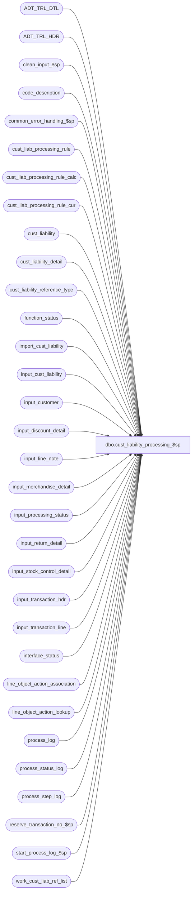

# dbo.cust_liability_processing_$sp

**Database:** auditworks  
**Server:** bedrockdb01  

## Architecture Diagram



## Table Dependencies

| Referenced Table |
|---|
| ADT_TRL_DTL |
| ADT_TRL_HDR |
| clean_input_$sp |
| code_description |
| common_error_handling_$sp |
| cust_liab_processing_rule |
| cust_liab_processing_rule_calc |
| cust_liab_processing_rule_cur |
| cust_liability |
| cust_liability_detail |
| cust_liability_reference_type |
| function_status |
| import_cust_liability |
| input_cust_liability |
| input_customer |
| input_discount_detail |
| input_line_note |
| input_merchandise_detail |
| input_processing_status |
| input_return_detail |
| input_stock_control_detail |
| input_transaction_hdr |
| input_transaction_line |
| interface_status |
| line_object_action_association |
| line_object_action_lookup |
| process_log |
| process_status_log |
| process_step_log |
| reserve_transaction_no_$sp |
| start_process_log_$sp |
| work_cust_liab_ref_list |

## Stored Procedure Code

```sql
create proc dbo.cust_liability_processing_$sp   @process_id                   binary(16) = @@spid,
  @user_id			int = NULL,
  @input_id			numeric(12,0), 
  @status			smallint, 
  @replacement_reference_no	nvarchar(20) = NULL,  -- generally used for replacement doc issuance following theft;  applies to the OFFSET line.
  @next_reference_no		nvarchar(20) = NULL, 
  @destination_store_no		int = NULL,  -- used for stock transfers and outstanding reference reassignment
  @errmsg			nvarchar(2000)	OUTPUT,
  @balance_adjustment_amount    money = NULL,
  @today_date			smalldatetime = NULL,
  @currency_code		nvarchar(3) = NULL 
  
AS

/* Name: cust_liability_processing_$sp
   Desc: This procedure populates the input tables with transaction information 
         generated based on the work_cust_liab_ref_list table and the 
         requirements defined in the cust_liab_processing_rule table 
         for the rule found in the input_processing_status table.
         Possible @status values are:    
         -2 = Input ID reserved, 
         -1 = Input Table load requested, 
          0 = Input Table load in progress, 
          1 = Input data available for Edit
         Called by cust_liab_reference_gen_$sp, cust_liability_import_$sp, Front-End.

HISTORY:
Date     Name         Defect#  Desc
Feb27,15 Phu            84780  Allow users to renumber single or multiple reference numbers.
Oct22,14 Vicci      TFS-71445  When adjusting issuance date to end of day for auto-completion requests, 
                               avoid error 517 "Adding a value to a 'smalldatetime' column caused an overflow" when 2079 date is adjusted.
Jan28,14 Vicci         146826  Set pos_identifier_type to 1 if it is null since column not nullable in input_merchandise_detail.
Nov14,13 Vicci         148175  Clean up input_cust_liability since otherwise the ES data gets double posted if the call for 1 rule id succeeds but 
                               a subsequent one or a later code-line fails.  Set transaction count.
Sep30,13 Vicci         146826  Take pos_identifier_type into account, and support SQL 2012.
Jul09,12 Vicci         136734  If client erroneously sends us a destination store for a rule for which destination stores are not relevant, ignore it,
                               since logging to the other_store_no overrides the issuing store and since the other_store_no field is not displayed
                               for regular load/issuance import rules their mistake is not obvious to the customer.
Nov15,11 Vicci         131164  Handle new balance_adjustment_types
Nov19,10 Vicci         122171  Handle receipt of serial_no (real serial_no or gift card number).
Nov04,10 Vicci    REFIX116604  When checking if time portion of issued date is set, include the hour!
Oct25,10 Vicci         121781  Additional fix to set last_updated_by_system.
  			       Avoid deadlocking on interface_status update;  avoid triggering cust_liab_processing_rule trigger unecessarily;
			       relocate audit-trail and process log outside begin-tran;  reorder events within begin-tran to put hot tables last.
Aug20,10 Vicci         119571  Add work_cust_liab_ref_list.input_id = @input_id condition where missing.
Aug20,10 Vicci         119571  Ensure NULLs are handled in <> and not in verifications.
Aug02,10 Vicci         119571  Support soft coded calculations.
Jul29,10 Paul          119854  If units is null, then default to 1 in input_merchandise_detail.
Mar18,10 Paul          117947  Uplifted 116604 to SA5, code reviewed
Oct02,09 Vicci         109078  Uplifted 109078, 1-401BYE to SA5
Jul07,08 Paul           87777  corrected case statements to match SA4.1, uplifted 102656
Apr12,07 Paul         DV-1356  allow default to null on @destination_store_no when called by gui
Mar07,07 Paul         DV-1335  log @rule_id to ADT_TRL_DTL for use by SA5 gui, apply 80127 to SA5
Sep05,06 Tim          DV-1342  Uplift 73485 to SA5
Mar20,06 David        DV-1332  Add defaults to process_id and user_id. Log reference_type to adt_trl_hdr.
Sep06,05 Paul         DV-1312  apply 29561 to SA5
May16,05 David        DV-1202  Set display_def_id based on transaction_category, Rename from_line_id to line_id.
Jan06,05 Paul         DV-1191  added locking hints
Sep23,04 David        DV-1146  Use user_id.
Sep02,04 David        DV-1129  Handle line_object_type 23 (PLU subtotal discounts)
Jul15,04 Sab	      DV-1071  Changed the logic to log to the new audit trail tables.

Mar18,10 Vicci         116604  For auto-completion without timestamps set the date given to 23:59:00 not 23:59:59 since date_issued
			       datatype is smalldatetime and otherwise the database rounds up to the next date.
Oct02,09 Vicci         109078  In the case of auto-completion requests where the shipment/cancellation date is provided instead
                               of the current system date being used, if the date given is midnight change it to 23:59:59 in order
                               to avoid logical trading date handling moving it to the prior date and in order to ensure that the
                               shipment is timestamped later that the order placement.
Sep28,09 Vicci         109078  Log reference number to auto-completion requested line.
Jun29,09 Vicci       1-401BYE  Allow a negative liability balance to be increased (for example to bring it back up to zero) and
                               return correct action (i.e. adjustment) amount.
Apr03,09 Vicci	       109078  Enterprise Selling integration: support special date-issued, originating/fulfillment
                               store handling when line_object_offset -5 = AutoComplete from order# present;  receive @currency_code
                               in order to ensure that in a multi-currency environment a rule store with the appropriate currency is
                               used without requiring multiple rules to be defined.
Jul21,08 Paul/Vicci  102764  If any customer rows exist, then insert all customer rows even if null (N/A to SA5)
Jul07,08 Paul          102656  trap dup insert to process_step_log
Nov16,06 Vicci		80127  Insert to stock control attachment not checking for presence of expiry days
Jun14,06 Vicci          73485  Only delete function status for function being completed
Feb02,06 David          66991  Set display_def_id based on transaction_category
Jul15,04 Vicci          29561  Handle line_object_type 23 (PLU subtotal discounts)
Jun03,03 Maryam          9246  Call reserve_transaction_no_$sp.
Mar27,03 Maryam          6248  Handle Balance adjustment and refine usage of store_tran_no
Nov25,02 David C         5207  Format reference_no when inserting into audit_trail
Sep10,02 Paul S       1-F97LW  corrected error traps, captitalized commands
Jul05,02 David C      1-DW0JH  Add progress monitor
May13,02 David C      1-BMK21  increase rule_id_description to nvarchar(255); insert input_customer;
Feb15,02 David C      AW-8415  Author

*/

   
DECLARE
 @audit_descr			nvarchar(255),
 @next_tran_no			int,
 @cashier_no			int,
 @ENTRY_ID			uniqueidentifier,
 @errno				int,
 @errno2                        int,
 @file_name			nvarchar(255),
 @force_balance			int,
 @line_action			tinyint, 
 @line_action_offset		tinyint, 
 @line_action_balance		tinyint, 
 @line_object			smallint, 
 @line_object_offset		smallint, 
 @line_object_balance		smallint, 
 @object_lookup_required	tinyint, 
 @message_id			int,
 @max_tran_no			int,
 @no_of_tran			int,
 @object_name			nvarchar(255),
 @operation_name		nvarchar(100),
 @process_name			nvarchar(100),
 @process_no			smallint,
 @process_start_datetime	datetime,
 @process_timestamp		float,
 @reference_no_length		tinyint,
 @reference_no_qty_per_trans	numeric(5,0), 
 @reference_no_datatype		nchar(1), 
 @reference_type		tinyint,
 @register_no			smallint,
 @rows				int,
 @rule_id			nvarchar(3),
 @rule_id_description		nvarchar(255),
 @store_no			int,
 @transaction_series		nchar(1),
 @transaction_category		smallint,
 @processing_activation_type    smallint,
 @balance_exclusion_column_no   tinyint, 
 @balance_adjustment_type       smallint,
 @balance_pct_amount            float,
--119571
  @sql_command			nvarchar(4000),
  @parenthesis_prefix	        nvarchar(20),
  @cl_column_name	        nvarchar(255),
  @constant_value               money,
  @constant_date_string		nvarchar(255),
 @parenthesis_suffix	        nvarchar(20),
  @operator		        nvarchar(3),
  @unit_amount_flag		tinyint,
  @prior_date_string		nvarchar(255),
  @prior_date_operator		nvarchar(3),
  @prior_parenthesis_suffix	nvarchar(20),
  @first_fetch			tinyint,
  @cursor_open			tinyint,
  @cur_reference_no		nvarchar(20),
  @additional_ref_type_count	int,
  @errmsg2			nvarchar(2000),
  @transaction_count		int,
  @max_line_id			numeric(5,0);

/*
balance_adjustment_type (code_description code_type 190):
 1= %Inc
-1= %Dec not neg
-5= %Dec
 2= $Inc
-2= $Dec not neg
-4= %Dec
-3= Clear flag
 3= Set flag
 4= Ref info update
 9= User-defined
*/

SELECT @process_name = 'cust_liability_processing_$sp',
       @message_id = 201068,
       @balance_pct_amount = 1,
       @today_date = ISNULL(@today_date, CONVERT(smalldatetime, CONVERT(nchar(8),getdate(),112))),
       @cursor_open = 0,
       @operation_name = 'SELECT';

BEGIN TRY

SELECT @errmsg = 'Failed to select from input_processing_status. ',
       @object_name = 'input_processing_status';
SELECT @process_no = process_no,
       @process_start_datetime = process_start_datetime,
       @rule_id = processing_message
  FROM input_processing_status
 WHERE input_id = @input_id;
SELECT @rows = @@rowcount;

IF @rows = 0
BEGIN
  SELECT @errno = 201650,
         @errmsg = 'Invalid input_id (' + convert(nvarchar, @input_id) + ') not found in input_processing_status. ',
         @process_no = ISNULL(@process_no, 228);
  GOTO business_rule_error;
END;

SELECT @errmsg = 'Failed to select from cust_liab_processing_rule. ',
       @object_name = 'cust_liab_processing_rule';
SELECT  @store_no = store_no, 
	@register_no = register_no, 
	@cashier_no = cashier_no, 
	@transaction_series = 'C', 
	@reference_type = reference_type, 
	@line_object = line_object, 
	@line_action = line_action, 
	@line_object_offset = line_object_offset, 
	@line_action_offset = line_action_offset, 
	@line_object_balance = line_object_balance, 
	@line_action_balance = line_action_balance, 
	@object_lookup_required = (1-ISNULL(SIGN(line_object), 0)), 
	@reference_no_qty_per_trans = reference_no_qty_per_trans, 
	@transaction_category = transaction_category, 
	@rule_id_description = rule_id_description,
	@force_balance = ISNULL(SIGN(line_object_balance), 0),
	@balance_adjustment_type = balance_adjustment_type,
	@balance_adjustment_amount = ISNULL (@balance_adjustment_amount, balance_adjustment_amount),
        @balance_exclusion_column_no = balance_exclusion_column_no,
        @processing_activation_type = processing_activation_type,
        @cur_reference_no = next_reference_no
  FROM cust_liab_processing_rule
 WHERE rule_id = @rule_id; 
SELECT @rows = @@rowcount;

IF @rows = 0
BEGIN
  SELECT @errno = 201649,
         @errmsg = 'rule_id not found in cust_liab_processing_rule. ';
  GOTO business_rule_error;
END

SELECT @errmsg = 'Failed to select currency-specific store from cust_liab_processing_rule_cur. ',
       @object_name = 'cust_liab_processing_rule_cur';
SELECT @store_no = store_no
  FROM cust_liab_processing_rule_cur
 WHERE rule_id = @rule_id
   AND currency_code = @currency_code;

SELECT @errmsg = 'Failed to determine reference type datatype. ',
       @object_name = 'cust_liability_reference_type';
SELECT @reference_no_datatype = reference_no_datatype,
       @reference_no_length = reference_no_length
  FROM cust_liability_reference_type
 WHERE reference_type = @reference_type;
 
SELECT @errmsg = 'Failed to determine workload. ',
       @object_name = 'work_cust_liab_ref_list',
       @operation_name = 'SELECT';
SELECT @transaction_count = COUNT(1)
  FROM work_cust_liab_ref_list w WITH (NOLOCK)
 WHERE w.input_id = @input_id;

IF @status < 1
BEGIN
  SELECT @errmsg = 'Failed to execute stored proc clean_input_$sp. ', 
         @object_name = 'clean_input_$sp',
   @operation_name = 'EXECUTE';
  EXEC clean_input_$sp @process_id, @user_id, @input_id, @errmsg OUTPUT;  
  
  SELECT @errmsg = 'Failed to set status = 1 in function_status. ',
         @object_name = 'function_status',
         @operation_name = 'UPDATE'; 
  UPDATE function_status
     SET status = 1
   WHERE process_id = @process_id
     AND function_no = @transaction_category 
     AND status != 1;

  SELECT @no_of_tran = 0;
  
  -- calculate number of transaction numbers from work table
  SELECT @errmsg = 'Failed to get max(COALESCE(trans_row_no,row_no)) from work_cust_liab_ref_list. ',
         @object_name = 'work_cust_liab_ref_list',
         @operation_name = 'SELECT';
  SELECT @no_of_tran = CONVERT(int,ISNULL(MAX(COALESCE(trans_row_no,row_no))/@reference_no_qty_per_trans,0)) + 1
    FROM work_cust_liab_ref_list WITH (NOLOCK)
   WHERE input_id = @input_id;

  SELECT @errmsg = 'Failed to execute reserve_transaction_no_$sp. ',
         @object_name = 'reserve_transaction_no_$sp',
         @operation_name = 'EXECUTE';
  EXEC reserve_transaction_no_$sp @process_id, @user_id, @process_no, @store_no, @register_no, @transaction_series,
                                  @no_of_tran, @max_tran_no OUTPUT, @next_tran_no OUTPUT,  @errmsg OUTPUT; 
    
  IF @balance_adjustment_type = 9  --119571 (soft coded adjustment)
  BEGIN
    SELECT @errmsg         = 'Failed to define cursor to retrieve soft conditions for processing rule ' + @rule_id + '. ',
           @object_name    = 'unattended_soft_adjustment_crsr',
           @operation_name = 'DECLARE';
    DECLARE unattended_soft_adjustment_crsr CURSOR FAST_FORWARD
    FOR
    SELECT COALESCE(p.parenthesis_prefix, '') parenthesis_prefix, 
           p.unit_amount_flag,
	   c.code_system_descr, --cl_column_name
           p.constant_value,
           CASE WHEN p.constant_date IS NOT NULL THEN '''' + CONVERT(nvarchar, p.constant_date, 101) + '''' ELSE NULL END constant_date_string,
           COALESCE(p.parenthesis_suffix, '') parenthesis_suffix,
           COALESCE(p.operator, '') operator
      FROM cust_liab_processing_rule_calc p
           LEFT OUTER JOIN code_description c 
             ON c.code_type= 247
            AND p.unit_amount_flag * 100 + p.column_no = c.code 
            AND c.code_system_descr IS NOT NULL
            AND COALESCE(LTRIM(RTRIM(c.code_system_descr)), '') <> ''
     WHERE p.rule_id = @rule_id
       AND p.adjustment_line_type = 'ADJUSTMENT'
     ORDER BY p.adjustment_line_sequence;
    
    SELECT @operation_name = 'OPEN';
    OPEN unattended_soft_adjustment_crsr;
    SELECT @cursor_open = 1, 
      	   @prior_date_string = NULL, @prior_date_operator = NULL, @prior_parenthesis_suffix = NULL,
      	   @sql_command = NULL, @first_fetch = 1;
    
    SELECT @operation_name = 'FETCH';
    FETCH unattended_soft_adjustment_crsr
     INTO @parenthesis_prefix,
          @unit_amount_flag,
          @cl_column_name,
          @constant_value,
          @constant_date_string,
          @parenthesis_suffix,
          @operator;

    SELECT @sql_command = 'UPDATE work_cust_liab_ref_list SET outstanding_amount = IsNull(cl.liability_amount, 0), action_amount = ';

    WHILE @@fetch_status = 0 
    BEGIN      
      IF @first_fetch = 1 
        SELECT @sql_command = @sql_command + '(', 
               @first_fetch = 0;

      SELECT @sql_command = @sql_command + @parenthesis_prefix;
        
      IF @cl_column_name IS NOT NULL AND @cl_column_name NOT LIKE '%.%' AND @cl_column_name NOT LIKE '%getdate()%'
      BEGIN
        SELECT @cl_column_name = 'cl.'+ @cl_column_name;
      END;
        
      IF ((@constant_date_string IS NULL AND (@unit_amount_flag <> 4 OR @unit_amount_flag IS NULL)) OR @operator NOT IN ('-', '+') OR @operator IS NULL) 
           AND @prior_date_operator IS NULL
      BEGIN
        SELECT @sql_command =  @sql_command + COALESCE(@cl_column_name, CONVERT(nvarchar,@constant_value), @constant_date_string) + @parenthesis_suffix + ' ' + @operator + ' ';
      END;
      ELSE
      BEGIN
    IF @prior_date_operator IS NOT NULL
          SELECT @prior_date_operator = NULL,
                 @sql_command =  @sql_command + @parenthesis_suffix + ' ' + @operator + ' ';
        ELSE
        BEGIN
          SELECT @prior_date_operator = @operator,
                 @prior_date_string = COALESCE(@cl_column_name, @constant_date_string),
                 @prior_parenthesis_suffix = @parenthesis_suffix;
        END;
      END;
      SELECT @errmsg         = 'Failed to fetch again cursor to retrieve soft conditions for processing rule ' + @rule_id + '. ',
             @object_name    = 'unattended_soft_adjustment_crsr',
             @operation_name = 'FETCH';
      FETCH unattended_soft_adjustment_crsr
       INTO @parenthesis_prefix,
            @unit_amount_flag,
            @cl_column_name,
            @constant_value,
            @constant_date_string,
            @parenthesis_suffix,
            @operator;
        
      IF @prior_date_operator = '+'
      BEGIN
        SELECT @sql_command = @sql_command + ' DATEADD(dd, ' + convert(nvarchar, @constant_value) + ', ' + @prior_date_string + ') '
                              + @prior_parenthesis_suffix,
               @prior_parenthesis_suffix = NULL,
               @prior_date_string = NULL;
      END;
      ELSE
      BEGIN
        IF @prior_date_operator = '-'
        BEGIN
          IF @constant_date_string IS NOT NULL OR @unit_amount_flag = 4
          BEGIN
            SELECT @sql_command = @sql_command + ' DATEDIFF(dd, ' + COALESCE(@constant_date_string, @cl_column_name) + ', ' + @prior_date_string + ') '
                                  + @prior_parenthesis_suffix,
                   @prior_parenthesis_suffix = NULL,
                   @prior_date_string = NULL;
          END;
          ELSE
          BEGIN
            SELECT @sql_command = @sql_command + ' DATEADD(dd, ' + convert(nvarchar, @constant_value * -1) + ', ' + @prior_date_string + ') '
                         	  + @prior_parenthesis_suffix,
                   @prior_parenthesis_suffix = NULL,
                   @prior_date_string = NULL;
          END;
        END;
      END;

    END;  --WHILE @@fetch_status = 0 for unattended_soft_adjustment_crsr

    IF @cursor_open = 1
    BEGIN
      SELECT @errmsg         = 'Failed to close and deallocate cursor to retrieve soft conditions for processing rule ' + @rule_id + '. ',
             @object_name    = 'unattended_soft_adjustment_crsr',
             @operation_name = 'CLOSE';
      CLOSE unattended_soft_adjustment_crsr;
      SELECT @operation_name = 'DEALLOCATE';
      DEALLOCATE unattended_soft_adjustment_crsr;
      SELECT @cursor_open = 0;
    END;
      
    IF @first_fetch = 0  --i.e. adjustments were found
      SELECT @sql_command = @sql_command + ')';
    ELSE 
      SELECT @sql_command = @sql_command + '0';
        
    SELECT @sql_command = @sql_command + ' FROM work_cust_liab_ref_list rf LEFT OUTER JOIN cust_liability cl ON rf.reference_type = cl.reference_type AND rf.reference_no = cl.reference_no AND rf.key_store_no = cl.key_store_no WHERE rf.input_id = @input_id SELECT @errno = @@error';

--    PRINT ':LOG Tracing:  ' + @sql_command
    SELECT @errmsg = 'Failed to find action amount reference numbers to be auto-adjusted via dynamic SQL. ',
	   @object_name = 'work_cust_liab_ref_list',
           @operation_name = 'UPDATE';
    EXEC sp_executesql @sql_command, N'@errno int OUT, @today_date smalldatetime, @input_id numeric(12,0)', @errno OUT, @today_date, @input_id;
    IF @errno <> 0 
      GOTO general_error;
    ELSE
      SELECT @sql_command = NULL;
  END;  --IF @balance_adjustment_type = 9
  ELSE
  BEGIN
    IF @transaction_category = 241 
    BEGIN
      IF ABS(@balance_adjustment_type) = 1 OR @balance_adjustment_type = -5	--percent
      BEGIN
        SELECT @balance_pct_amount = @balance_adjustment_amount / 100,
               @balance_adjustment_amount = NULL; 
      END;
     
      IF @balance_exclusion_column_no IS NOT NULL /* then */
      BEGIN
        SELECT @errmsg = 'Failed to set outstanding_amount and action_amount from cust_liability. ',
               @object_name = 'work_cust_liab_ref_list',
               @operation_name = 'UPDATE';
        UPDATE work_cust_liab_ref_list
           SET outstanding_amount = IsNull(cl.liability_amount, 0), 
               action_amount = IsNull(abs(cl.liability_amount + 
               (amount_3 * (1 - abs(sign(@balance_exclusion_column_no - 3))) ) +
               (amount_4 * (1 - abs(sign(@balance_exclusion_column_no - 4))) ) +
               (amount_5 * (1 - abs(sign(@balance_exclusion_column_no - 5))) ) +
               (amount_6 * (1 - abs(sign(@balance_exclusion_column_no - 6))) ) +
               (amount_7 * (1 - abs(sign(@balance_exclusion_column_no - 7))) ) +
               (amount_8 * (1 - abs(sign(@balance_exclusion_column_no - 8))) ) +
               (amount_9 * (1 - abs(sign(@balance_exclusion_column_no - 9))) ) +
               (amount_10 * (1 - abs(sign(@balance_exclusion_column_no - 10))) )), 0)
          FROM work_cust_liab_ref_list rf
               LEFT OUTER JOIN cust_liability cl
		 ON rf.reference_type = cl.reference_type
             	AND rf.reference_no = cl.reference_no
                AND rf.key_store_no = cl.key_store_no
         WHERE input_id = @input_id;
      END; /* IF @balance_exclusion_column_no IS NOT NULL */
      ELSE
      BEGIN
        SELECT @errmsg = 'Failed to set outstanding_amount from cust_liability (required since action amount modified in multi-UI update scenario). ',
               @object_name = 'work_cust_liab_ref_list',
               @operation_name = 'UPDATE'; 
        UPDATE work_cust_liab_ref_list
           SET outstanding_amount = IsNull(cl.liability_amount, 0),
               action_amount = CASE WHEN IsNull(cl.liability_amount, 0) < 0 AND @balance_adjustment_type in (-1,-2) 
                                    THEN 0 
                                    ELSE IsNull(abs(cl.liability_amount), 0) 
                               END 
          FROM work_cust_liab_ref_list rf
               LEFT OUTER JOIN cust_liability cl
		 ON rf.reference_type = cl.reference_type
                AND rf.reference_no = cl.reference_no
                AND rf.key_store_no = cl.key_store_no
         WHERE input_id = @input_id;
      END; /* ELSE of IF @balance_exclusion_column_no IS NOT NULL */
        
      SELECT @errmsg = 'Failed to set balance adjustment amount. ',
             @object_name = 'work_cust_liab_ref_list',
             @operation_name = 'UPDATE';
      UPDATE work_cust_liab_ref_list
         SET action_amount = CASE WHEN Sign(ISNULL(abs(outstanding_amount), action_amount) + 	--outstanding amount
        				          sign(@balance_adjustment_type) 
        				          * ROUND (ISNULL(@balance_adjustment_amount, action_amount) 
        				                   * @balance_pct_amount,2) --amount being posted 
				           ) >= 0  --i.e. the adjustment amount would cause a positive or zero balance
				       OR @balance_adjustment_type NOT IN (-1, -2)
				  THEN ROUND((ISNULL(@balance_adjustment_amount, action_amount) 
				              * @balance_pct_amount),2)  --adjustment amount 
				  ELSE ISNULL(abs(outstanding_amount), action_amount) --outstanding amount, if the adjustment amount would cause a negative balance
				  END
      WHERE input_id = @input_id
        AND action_amount <> 0 OR @balance_adjustment_type NOT IN (-1,-2);
    END; --IF @transaction_category = 241
  END;  --ELSE of IF @balance_adjustment_type = 9
    
  IF @transaction_category = 241
  BEGIN
    SELECT @errmsg = 'Failed to insert into input_transaction_line (@status < 1). ',
           @object_name = 'input_transaction_line',
           @operation_name = 'INSERT';
    INSERT INTO input_transaction_line (
  	   input_id, 
  	   store_no, 
  	   register_no, 
  	   entry_date_time, 
  	   transaction_series, 
  	   transaction_no, 
  	   line_id, 
  	   line_object, 
  	   line_action, 
  	   gross_line_amount, 
  	   reference_no)
    SELECT @input_id, 
  	   @store_no, 
  	   @register_no, 
  	   @process_start_datetime, 
  	   @transaction_series, 
  	   (@next_tran_no + CONVERT(int, COALESCE(w.trans_row_no, w.row_no)/@reference_no_qty_per_trans))-
               (1-(SIGN( 1 + SIGN( @max_tran_no - @next_tran_no + CONVERT(int, w.row_no/@reference_no_qty_per_trans))))) * @max_tran_no,
  	   1, 
  	   @line_object_offset, 
  	   @line_action_offset, 
           SUM(w.action_amount),
   	   @replacement_reference_no
      FROM work_cust_liab_ref_list w WITH (NOLOCK)
     WHERE w.input_id = @input_id
       AND (ISNULL(w.outstanding_amount, action_amount) > 0  --note:  oustanding_amount is always set for trans cat 241 (balance adjustments) so this is weird.
              OR (w.outstanding_amount <= 0 AND @balance_adjustment_type IN (1,2))
              OR @balance_adjustment_type = 9  --119571 (soft coded adjustment)
              OR @balance_adjustment_type in (3, -3, 4)
              OR (@balance_adjustment_type in (-4, -5) AND w.action_amount <> 0))
     GROUP BY (@next_tran_no + CONVERT(int, COALESCE(w.trans_row_no, w.row_no)/@reference_no_qty_per_trans))-
           (1-(SIGN( 1 + SIGN( @max_tran_no - @next_tran_no + CONVERT(int, w.row_no/@reference_no_qty_per_trans))))) * @max_tran_no;
  END;  --IF @transaction_category = 241
  ELSE 
  BEGIN
    IF @line_object_offset = -5
    BEGIN
      SELECT @errmsg = 'Failed to to reset time to 23:59:00 (end of day) instead of midnight for auto-completion requests. ',
             @object_name = 'work_cust_liab_ref_list',
             @operation_name = 'UPDATE';
      UPDATE work_cust_liab_ref_list
         SET date_issued = dateadd(mi, -1, dateadd(dd, 1, convert(datetime, date_issued))) --minute not second since datatype is smalldatetime.
       WHERE input_id = @input_id 
         AND datepart(hh, date_issued) = 0 AND datepart(mi, date_issued) = 0 AND datepart(ss, date_issued)= 0;
    END;  --IF @line_object_offset = -5

    SELECT @errmsg = 'Failed to insert into input_transaction_line (@status < 1). ',
           @object_name = 'input_transaction_line',
           @operation_name = 'INSERT';
    INSERT INTO input_transaction_line (
  	   input_id, 
  	   store_no, 
   	   register_no, 
  	   entry_date_time, 
  	   transaction_series, 
  	   transaction_no, 
  	   line_id, 
  	   line_object, 
  	   line_action, 
  	   gross_line_amount, 
  	   reference_no,
  	   lookup_pos_code)
    SELECT @input_id, 
  	   @store_no, 
  	   @register_no, 
  	   CASE WHEN @line_object_offset = -5 THEN COALESCE(date_issued, @process_start_datetime) ELSE @process_start_datetime END, 
  	   @transaction_series, 
  	   (@next_tran_no + CONVERT(int, COALESCE(trans_row_no,row_no)/@reference_no_qty_per_trans))-
               (1-(SIGN( 1 + SIGN( @max_tran_no - @next_tran_no + CONVERT(int, COALESCE(trans_row_no,row_no)/@reference_no_qty_per_trans))))) * @max_tran_no, 
  	   1, 
  	   @line_object_offset, 
  	   @line_action_offset, 
  	   SUM(action_amount),  --liability_amount or stocked_amount depending on trans category
  	   CASE WHEN @line_object_offset = -5 THEN w.reference_no ELSE @replacement_reference_no END,
  	   'rule_id=' + @rule_id
      FROM work_cust_liab_ref_list w WITH (NOLOCK)
     WHERE w.input_id = @input_id
     GROUP BY (@next_tran_no + CONVERT(int, COALESCE(trans_row_no,row_no)/@reference_no_qty_per_trans))-
               (1-(SIGN( 1 + SIGN( @max_tran_no - @next_tran_no + CONVERT(int, COALESCE(trans_row_no,row_no)/@reference_no_qty_per_trans))))) * @max_tran_no,
                CASE WHEN @line_object_offset = -5 THEN COALESCE(date_issued, @process_start_datetime) ELSE @process_start_datetime END,
                w.reference_type,
 CASE WHEN @line_object_offset = -5 THEN w.reference_no ELSE @replacement_reference_no END;
  END; -- ELSE of IF @transaction_category = 241
  
  SELECT @errmsg = 'Failed to insert into input_transaction_hdr (@status < 1). ',
         @object_name = 'input_transaction_hdr',
         @operation_name = 'INSERT';
  INSERT INTO input_transaction_hdr (
  	input_id, 
  	store_no, 
  	register_no, 
  	entry_date_time, 
  	transaction_series, 
  	transaction_no, 
  	cashier_no, 
  	transaction_category  )
  SELECT
  	@input_id, 
  	@store_no, 
  	@register_no, 
  	entry_date_time, 
  	@transaction_series, 
  	transaction_no, 
  	@cashier_no, 
  	@transaction_category
    FROM input_transaction_line WITH (NOLOCK)
  WHERE input_id = @input_id 
     AND line_id = 1;

  IF @object_lookup_required = 0 
  BEGIN
    IF @transaction_category = 241 
    BEGIN  
      SELECT @errmsg = 'Failed to insert into input_transaction_line (@object_lookup_required=0). ',
             @object_name = 'input_transaction_line',
             @operation_name = 'INSERT';
      INSERT INTO input_transaction_line (
    	     input_id, 
    	     store_no, 
    	     register_no, 
    	     entry_date_time, 
    	     transaction_series, 
    	     transaction_no, 
    	     line_id, 
    	     line_object, 
    	     line_action, 
    	     gross_line_amount, 
    	     reference_no)
      SELECT 
    	     @input_id, 
    	     @store_no, 
    	     @register_no, 
    	     @process_start_datetime, 
    	     @transaction_series, 
    	     (@next_tran_no + CONVERT(int, COALESCE(trans_row_no,row_no)/@reference_no_qty_per_trans))-
             (1-(SIGN( 1 + SIGN( @max_tran_no - @next_tran_no + CONVERT(int, COALESCE(trans_row_no,row_no)/@reference_no_qty_per_trans))))) * @max_tran_no, 
    	     2 + COALESCE(line_row_no, row_no - CONVERT(int, row_no/@reference_no_qty_per_trans) * @reference_no_qty_per_trans), 
    	     @line_object, 
    	     @line_action, 
             w.action_amount,
    	     reference_no
        FROM work_cust_liab_ref_list w WITH (NOLOCK)
       WHERE input_id = @input_id
         AND (ISNULL(w.outstanding_amount, action_amount) > 0
              OR (w.outstanding_amount <= 0 AND @balance_adjustment_type IN (1,2))
              OR @balance_adjustment_type = 9  --119571 (soft coded adjustment)
              OR @balance_adjustment_type in (3, -3, 4)
              OR (@balance_adjustment_type in (-4, -5) AND w.action_amount <> 0)
             );
    END;
    ELSE --@transaction_category <> 241
    BEGIN
      SELECT @errmsg = 'Failed to insert into input_transaction_line (@object_lookup_required=0). ',
             @object_name = 'input_transaction_line',
             @operation_name = 'INSERT';
      INSERT INTO input_transaction_line (
      	     input_id, 
    	     store_no, 
    	     register_no, 
    	     entry_date_time, 
    	     transaction_series, 
    	     transaction_no, 
    	     line_id, 
    	     line_object, 
    	     line_action, 
    	     gross_line_amount, 
    	     reference_no,
    	     lookup_pos_code )
      SELECT 
    	     @input_id, 
    	     @store_no, 
    	     @register_no, 
    	     CASE WHEN @line_object_offset = -5 THEN COALESCE(date_issued, @process_start_datetime) ELSE @process_start_datetime END, 
    	     @transaction_series, 
    	     (@next_tran_no + CONVERT(int, COALESCE(trans_row_no,row_no)/@reference_no_qty_per_trans))-
    	     (1-(SIGN( 1 + SIGN( @max_tran_no - @next_tran_no + CONVERT(int, COALESCE(trans_row_no,row_no)/@reference_no_qty_per_trans))))) * @max_tran_no, 
    	     2 + COALESCE(line_row_no,row_no - CONVERT(int, row_no/@reference_no_qty_per_trans) * @reference_no_qty_per_trans), 
    	     @line_object, 
    	     @line_action, 
    	     action_amount, 
    	     reference_no,
             'rule_id=' + @rule_id
        FROM work_cust_liab_ref_list WITH (NOLOCK)
       WHERE input_id = @input_id;

      IF @transaction_category = 242 AND @line_action in (90, 142)  --import AND order fulfillment
      BEGIN
        SELECT @errmsg = 'Failed to log additional reference numbers. ',
               @object_name = 'input_stock_control_detail',
               @operation_name = 'INSERT';
        INSERT INTO input_stock_control_detail (
    	       input_id, 
    	       store_no, 
    	       register_no, 
    	       entry_date_time, 
    	       transaction_series, 
    	       transaction_no, 
    	       line_id,
    	       initiated_by_host, 
    	       pos_identifier_type,
    	       pos_identifier,
    	       display_def_id)
        SELECT @input_id, 
               @store_no, 
               @register_no, 
               CASE WHEN @line_object_offset = -5 THEN COALESCE(date_issued, @process_start_datetime) ELSE @process_start_datetime END, 
               @transaction_series, 
               (@next_tran_no + CONVERT(int, COALESCE(trans_row_no,row_no)/@reference_no_qty_per_trans))-
	               (1-(SIGN( 1 + SIGN( @max_tran_no - @next_tran_no + CONVERT(int, COALESCE(trans_row_no,row_no)/@reference_no_qty_per_trans))))) * @max_tran_no, 
               2 + COALESCE(line_row_no, row_no - CONVERT(int, row_no/@reference_no_qty_per_trans) * @reference_no_qty_per_trans), 
               1, -- initiated_by_host
               x.reference_type,
               w.serial_no, 
               53 -- reference document display_def_id
          FROM work_cust_liab_ref_list w WITH (NOLOCK)
               LEFT OUTER JOIN line_object_action_lookup lkp WITH (NOLOCK)
                 ON lkp.lookup_line_object = @line_object
                AND lkp.line_action = @line_action
                AND lkp.lookup_code_type = 1
                AND lkp.lookup_pos_code = CASE WHEN COALESCE(w.upc_no, 0) <> 0 
                                               THEN CONVERT(nvarchar(20), w.upc_no) 
                                               ELSE w.pos_identifier END 
               INNER JOIN (SELECT line_object, max(reference_type) reference_type
                             FROM line_object_action_association WITH (NOLOCK)
                            WHERE line_object_type in (1, 2, 4) 
                 	      AND line_action IN (1, 11, 24)
                 	      AND reference_type > 0
                 	    GROUP BY line_object) x
                  ON lkp.line_object = COALESCE(x.line_object, @line_object)
         WHERE w.input_id = @input_id 
           AND w.serial_no IS NOT NULL;
        SELECT @additional_ref_type_count = @@rowcount;

        SELECT @errmsg = 'Failed to log serial numbers. ',
               @object_name = 'input_line_note',
               @operation_name = 'INSERT';
        INSERT INTO input_line_note (
    	       input_id, 
    	       store_no, 
    	       register_no, 
    	       entry_date_time, 
    	       transaction_series, 
    	       transaction_no, 
    	       line_id,
    	       note_type,
    	       line_note)
        SELECT @input_id, 
               @store_no, 
               @register_no, 
               CASE WHEN @line_object_offset = -5 THEN COALESCE(date_issued, @process_start_datetime) ELSE @process_start_datetime END, 
               @transaction_series, 
               (@next_tran_no + CONVERT(int, COALESCE(w.trans_row_no,w.row_no)/@reference_no_qty_per_trans))-
	               (1-(SIGN( 1 + SIGN( @max_tran_no - @next_tran_no + CONVERT(int, COALESCE(w.trans_row_no,w.row_no)/@reference_no_qty_per_trans))))) * @max_tran_no, 
   2 + COALESCE(w.line_row_no, w.row_no - CONVERT(int, w.row_no/@reference_no_qty_per_trans) * @reference_no_qty_per_trans), 
               9011,
               serial_no
          FROM work_cust_liab_ref_list w WITH (NOLOCK)
         WHERE w.input_id = @input_id 
           AND w.serial_no IS NOT NULL
           AND (@additional_ref_type_count < 1
      OR NOT EXISTS (SELECT 1
                                 FROM input_stock_control_detail i
                                WHERE i.input_id = @input_id
                                  AND i.display_def_id = 53
                                  AND i.transaction_no = (@next_tran_no + CONVERT(int, COALESCE(w.trans_row_no,row_no)/@reference_no_qty_per_trans))-
			               (1-(SIGN( 1 + SIGN( @max_tran_no - @next_tran_no + CONVERT(int, COALESCE(w.trans_row_no,row_no)/@reference_no_qty_per_trans))))) * @max_tran_no
			          AND i.line_id = 2 + COALESCE(w.line_row_no, w.row_no - CONVERT(int, w.row_no/@reference_no_qty_per_trans) * @reference_no_qty_per_trans)   )    );
      END; --IF @transaction_category = 242
    END; -- @transaction_category <> 241
    
    IF @line_object_offset <> -5 --auto-complete from order item lookup
    BEGIN
      SELECT @errmsg = 'Failed to determine if any customer information given. ',
             @object_name = 'work_cust_liab_ref_list',
             @operation_name = 'SELECT';
      IF EXISTS (SELECT 1
                   FROM work_cust_liab_ref_list
                  WHERE input_id = @input_id
                    AND (title IS NOT NULL 
 	               OR first_name IS NOT NULL 
	               OR last_name IS NOT NULL 
	               OR address_1 IS NOT NULL 
	               OR address_2 IS NOT NULL 
	               OR city IS NOT NULL 
	               OR county IS NOT NULL 
	               OR state IS NOT NULL 
	               OR country IS NOT NULL 
	               OR post_code IS NOT NULL 
	               OR telephone_no1 IS NOT NULL 
	               OR telephone_no2 IS NOT NULL 
	               OR customer_no IS NOT NULL 
	               OR pos_tax_jurisdiction_code IS NOT NULL 
	               OR fax IS NOT NULL 
	               OR email_address IS NOT NULL))
      BEGIN 
        SELECT @errmsg = 'Failed to populate input_customer with information given (@object_lookup_required=0). ',
               @object_name = 'input_customer',
               @operation_name = 'INSERT';
        INSERT INTO input_customer(
		input_id,
		store_no,
		register_no,
		entry_date_time,
		transaction_series,
		transaction_no,
		line_id,
		customer_role,
		title,
		first_name,
		last_name,
		address_1,
		address_2,
		city,
		county,
		state,
		country,
		post_code,
		telephone_no1,
		telephone_no2,
		customer_no,
		pos_tax_jurisdiction_code,
		fax,
		email_address)    
        SELECT  @input_id,
        	@store_no,
		@register_no,
		@process_start_datetime,
		@transaction_series,
    		(@next_tran_no + CONVERT(int, COALESCE(trans_row_no,row_no)/@reference_no_qty_per_trans))-
                (1-(SIGN( 1 + SIGN( @max_tran_no - @next_tran_no + CONVERT(int, COALESCE(trans_row_no,row_no)/@reference_no_qty_per_trans))))) * @max_tran_no, 
	    	2 + COALESCE(line_row_no, row_no - CONVERT(int, row_no/@reference_no_qty_per_trans) * @reference_no_qty_per_trans), 
		4,  --Customer Liability Customer
		title,
		first_name,
		last_name,
		address_1,
		address_2,
		city,
		county,
		state,
		country,
		post_code,
		telephone_no1,
		telephone_no2,
		CASE customer_no WHEN -1 THEN NULL ELSE customer_no END,
		pos_tax_jurisdiction_code,
		fax,
		email_address
          FROM work_cust_liab_ref_list WITH (NOLOCK)
         WHERE input_id = @input_id;
      END;

      SELECT @errmsg = 'Failed to insert into input_stock_control_detail (@object_lookup_required=0). ',
             @object_name = 'input_stock_control_detail',
             @operation_name = 'INSERT';
      INSERT INTO input_stock_control_detail (
          input_id, 
             store_no, 
             register_no, 
             entry_date_time, 
             transaction_series, 
             transaction_no, 
             line_id,
             initiated_by_host, 
             originating_store_no,
             other_store_no, 
             count_date,
             pos_identifier_type,
            pos_identifier,
             display_def_id,
             units)
      SELECT @input_id, 
             @store_no, 
             @register_no, 
             @process_start_datetime, 
             @transaction_series, 
             (@next_tran_no + CONVERT(int, COALESCE(trans_row_no,row_no)/@reference_no_qty_per_trans))-
             (1-(SIGN( 1 + SIGN( @max_tran_no - @next_tran_no + CONVERT(int, COALESCE(trans_row_no,row_no)/@reference_no_qty_per_trans))))) * @max_tran_no, 
             2 + COALESCE(line_row_no, row_no - CONVERT(int, row_no/@reference_no_qty_per_trans) * @reference_no_qty_per_trans), 
             1, -- initiated_by_host
             issuing_store_no,
             CASE WHEN @transaction_category IN (245, 244) THEN ISNULL(destination_store_no, @destination_store_no) ELSE NULL END, 
             action_date,
             SIGN(LEN(replacement_reference_no)) * 100,  --100 means replacement reference_no
             replacement_reference_no, -- used by Reassignment function
             CASE WHEN @transaction_category = 245                THEN 29 -- Reassignment
                  WHEN @transaction_category = 244                THEN 30 -- Document Transfer
                  WHEN @transaction_category IN (242,247)         THEN 31 -- Load or Issuance
                  WHEN @transaction_category IN (243,246,248,249) THEN 32 -- Stocking, Invalidation or Write-off 
                  ELSE NULL
             END, -- display_def_id
             expiry_days
        FROM work_cust_liab_ref_list WITH (NOLOCK)
       WHERE input_id = @input_id 
         AND ( ((key_store_no != -1 OR @transaction_category = 242) AND issuing_store_no IS NOT NULL) 
             OR @destination_store_no IS NOT NULL OR destination_store_no IS NOT NULL --
             OR action_date IS NOT NULL OR replacement_reference_no IS NOT NULL --
             OR (@transaction_category = 247 AND IsNull(expiry_days, 0) > 0));
    END;  --IF @line_object_offset <> -5 --auto-complete from order item lookup    

    SELECT @errmsg = 'Failed to insert into input_merchandise_detail with load details. ',
           @object_name = 'input_merchandise_detail',
           @operation_name = 'INSERT';
    INSERT INTO input_merchandise_detail ( 
           input_id, 
           store_no, 
           register_no, 
           entry_date_time, 
           transaction_series, 
           transaction_no, 
           line_id,  
           upc_no, 
           pos_identifier,
           units, 
           salesperson, 
           originating_store_no,
           source_store_no,
           fulfillment_store_no,
           pos_identifier_type   )
    SELECT @input_id, 
           @store_no, 
           @register_no, 
           CASE WHEN @line_object_offset = -5 THEN COALESCE(date_issued, @process_start_datetime) ELSE @process_start_datetime END, 
           @transaction_series, 
           (@next_tran_no + CONVERT(int, COALESCE(trans_row_no,row_no)/@reference_no_qty_per_trans))-
           (1-(SIGN( 1 + SIGN( @max_tran_no - @next_tran_no + CONVERT(int, COALESCE(trans_row_no,row_no)/@reference_no_qty_per_trans))))) * @max_tran_no, 
           2 + COALESCE(line_row_no, row_no - CONVERT(int, row_no/@reference_no_qty_per_trans) * @reference_no_qty_per_trans), 
           COALESCE(upc_no, 0), 
           COALESCE(pos_identifier, '0'),
           COALESCE(units,1), 
           @cashier_no, 
           CASE WHEN @line_object_offset <> -5 OR @line_action IN (101, 102, 7, 8) THEN issuing_store_no ELSE NULL END,  --note:  OK-transl_auto_complete order will overlay this with cl.issuing_store_no
           CASE WHEN @line_object_offset = -5 AND @line_action NOT IN (101, 102, 7, 8) THEN issuing_store_no ELSE NULL END,
           CASE WHEN @line_object_offset = -5 AND @line_action NOT IN (101, 102, 7, 8) THEN issuing_store_no ELSE NULL END,
           COALESCE(pos_identifier_type, 1)
      FROM work_cust_liab_ref_list WITH (NOLOCK)
     WHERE input_id = @input_id 
       AND (upc_no IS NOT NULL OR pos_identifier IS NOT NULL);
  END --IF @object_lookup_required = 0 
  ELSE
  BEGIN 
    SELECT @errmsg = 'Failed to create temp table #input_line. ',
           @object_name = '#input_line',
           @operation_name = 'CREATE';
    CREATE TABLE #input_line (
 	   input_row_no 			numeric(14,0) identity not null, 
 	   transaction_no			int		not null, 
 	   line_object_type		tinyint		not null,
 	   line_object			smallint	not null, 
 	   line_action			tinyint		not null, 
 	   gross_line_amount		money		not null, 
 	   reference_no			nvarchar(20)	not null, 
 	   applied_to_line_object		smallint	null,
 	   discount_factor			smallint	not null,
 	   upc_no				numeric(18,0)	null, 
 	   units				real		not null, 
 	   issuing_store_no		int		not null, 
 	   date_issued			smalldatetime	not null, 
 	   line_id				numeric (5,0)	null, 
 	   key_store_no			int		not null, 
 	   pos_tax_jurisdiction_code 	nvarchar(20)	null,
 	   destination_store_no		int		null,
 	   location_no			int		null,
 	   action_date			smalldatetime	null,
 	   reference_row_no		numeric(12,0)	not null  );

    SELECT @errmsg = 'Failed to insert #input_line. ',
           @object_name = '#input_line',
           @operation_name = 'INSERT';
    INSERT INTO #input_line (
 	   transaction_no, 
 	   line_object_type,
 	   line_object, 
 	   line_action, 
 	   gross_line_amount, 
 	   reference_no, 
 	   applied_to_line_object,
 	   discount_factor,
 	   upc_no, 
 	   units, 
 	   issuing_store_no, 
 	   date_issued, 
 	   key_store_no, 
 	   pos_tax_jurisdiction_code,
 	   destination_store_no,
 	   location_no,
 	   action_date,
 	   reference_row_no  )
    SELECT (@next_tran_no + CONVERT(int, COALESCE(trans_row_no,row_no)/@reference_no_qty_per_trans))-
           (1-(SIGN( 1 + SIGN( @max_tran_no - @next_tran_no + CONVERT(int, COALESCE(trans_row_no,row_no)/@reference_no_qty_per_trans))))) * @max_tran_no, 
 	   MAX(l.line_object_type),
 	   ISNULL(c.discount_line_object, c.line_object), 
 	   MIN(l.line_action), 
 	   SUM(c.amount_outstanding),
 	   w.reference_no,  
 	   c.line_object,
 	   ISNULL(SIGN(c.discount_line_object) * -1, 1), -- -1 if discount, 1 if not
 	   c.upc_no, 
 	   SUM(c.units_outstanding), 
 	   w.issuing_store_no, 
 	   w.date_issued, 
 	   w.key_store_no, 
 	   w.pos_tax_jurisdiction_code,
 	   w.destination_store_no,
 	   c.location_no,
 	   w.action_date,
 	   w.row_no * @force_balance
      FROM work_cust_liab_ref_list w WITH (NOLOCK), 
           cust_liability_detail c, 
           line_object_action_association l
     WHERE w.input_id = @input_id 
       AND w.reference_type = c.reference_type 
       AND w.reference_no = c.reference_no 
       AND w.key_store_no = c.key_store_no 
       AND w.reference_type = l.reference_type 
       AND ISNULL(c.discount_line_object, c.line_object) = l.line_object 
       AND l.transaction_category = @transaction_category 
       AND (c.units_outstanding != 0 OR c.amount_outstanding != 0) 
     GROUP BY (@next_tran_no + CONVERT(int, COALESCE(trans_row_no,row_no)/@reference_no_qty_per_trans))-
           (1-(SIGN( 1 + SIGN( @max_tran_no - @next_tran_no + CONVERT(int, COALESCE(trans_row_no,row_no)/@reference_no_qty_per_trans))))) * @max_tran_no, 
           ISNULL(c.discount_line_object, c.line_object), 
           w.reference_no,  
           c.line_object,
           ISNULL(SIGN(c.discount_line_object) * -1, 1), -- -1 if discount, 1 if not
           c.upc_no, 
           w.issuing_store_no, 
        w.date_issued, 
           w.key_store_no, 
           w.pos_tax_jurisdiction_code,
           w.destination_store_no,
           c.location_no,
           w.action_date,
           w.row_no * @force_balance
      ORDER BY 	(@next_tran_no + CONVERT(int, COALESCE(w.trans_row_no,w.row_no)/@reference_no_qty_per_trans))-
           (1-(SIGN( 1 + SIGN( @max_tran_no - @next_tran_no + CONVERT(int, COALESCE(w.trans_row_no,w.row_no)/@reference_no_qty_per_trans))))) * @max_tran_no, 
           w.reference_no, w.key_store_no, c.line_object, c.upc_no, 
           ISNULL(c.discount_line_object, c.line_object);

    -- Arrange for each transaction to begin with line 2 (line 1 is the offset line), plus
    -- skip a line-id for force-balancing if applicable
    SELECT @errmsg = 'Failed to select into #input_line_adj. ',
           @object_name = '#input_line_adj',
           @operation_name = 'SELECT';
    SELECT transaction_no, MIN(input_row_no) + MIN(reference_row_no) AS line_adj
      INTO #input_line_adj
      FROM #input_line WITH (NOLOCK)
     GROUP BY transaction_no;

    SELECT @errmsg = 'Failed update line_id in #input_line. ',
           @object_name = '#input_line',
           @operation_name = 'UPDATE';
    UPDATE #input_line
       SET line_id = i.input_row_no + 2  + i.reference_row_no - a.line_adj
      FROM #input_line i, #input_line_adj a WITH (NOLOCK)
     WHERE i.transaction_no = a.transaction_no;

    IF @force_balance = 1 
    BEGIN
      SELECT @errmsg = 'Failed select into #cl_force_balance. ',
             @object_name = '#cl_force_balance',
             @operation_name = 'CREATE';
      SELECT i.transaction_no, w.reference_no, w.key_store_no, w.issuing_store_no, 
       	     w.date_issued, 
     	     w.pos_tax_jurisdiction_code,
     	     w.destination_store_no,
     	     w.action_date,
  	     i.reference_row_no,
 	     MAX(i.line_id) AS line_id, 
       	     SUM(i.gross_line_amount) AS detail_amount, w.action_amount
        INTO #cl_force_balance
        FROM #input_line i, work_cust_liab_ref_list w WITH (NOLOCK)
       WHERE w.input_id = @input_id 
         AND w.row_no = i.reference_row_no
       GROUP BY i.transaction_no, w.reference_no, w.key_store_no, w.issuing_store_no, 
             w.date_issued, w.action_amount,
             w.pos_tax_jurisdiction_code,
             w.destination_store_no,
             w.action_date,
             i.reference_row_no
      HAVING SUM(i.gross_line_amount) != w.action_amount;

      SELECT @errmsg = 'Failed populate #input_line from #cl_force_balance. ',
             @object_name = '#input_line',
             @operation_name = 'INSERT';
      INSERT INTO #input_line (
     	     transaction_no, 
     	     line_object_type,
     	     line_object, 
     	     line_action, 
     	     gross_line_amount, 
     	     reference_no, 
     	     applied_to_line_object,
     	     discount_factor,
     	     upc_no, 
     	     units, 
     	     issuing_store_no, 
     	     date_issued, 
     	     key_store_no, 
     	     pos_tax_jurisdiction_code,
     	     destination_store_no,
     	     action_date,
     	     reference_row_no,
     	     line_id  )
      SELECT w.transaction_no,        
     	     20,
     	     @line_object_balance,
     	     @line_action_balance,
     	     w.detail_amount - w.action_amount,
     	     w.reference_no,
     	     @line_object_balance,
     	     1,
     	     NULL,
     	     0,
     	     w.issuing_store_no,
     	     w.date_issued,
     	     w.key_store_no,
     	     w.pos_tax_jurisdiction_code,
     	     w.destination_store_no,
     	     w.action_date,
     	     w.reference_row_no,
     	     w.line_id + 1
        FROM #cl_force_balance w WITH (NOLOCK);   
      END; -- @force_balance = 1 
     
      SELECT @errmsg = 'Failed to insert into input_transaction_line (@object_lookup_required != 0). ',
	     @object_name = 'input_transaction_line';
      INSERT INTO input_transaction_line (
     	     input_id, 
     	     store_no, 
     	     register_no, 
     	     entry_date_time, 
     	     transaction_series, 
     	     transaction_no, 
     	     line_id, 
 	     line_object, 
     	     line_action, 
     	     gross_line_amount, 
     	     reference_no   )
   SELECT @input_id, 
     	     @store_no, 
     	     @register_no, 
     	     @process_start_datetime, 
     	     @transaction_series, 
     	     transaction_no, 
     	     line_id, 
     	     line_object, 
     	     line_action, 
     	     gross_line_amount * discount_factor, 
     	     reference_no
        FROM #input_line WITH (NOLOCK);

      SELECT @errmsg = 'Failed to insert into input_discount_detail. ',
             @object_name = 'input_discount_detail';
      INSERT INTO input_discount_detail ( 
     	     input_id, 
     	     store_no, 
     	     register_no, 
     	     entry_date_time, 
     	     transaction_series, 
     	     transaction_no, 
     	     line_id,  
     	     pos_discount_amount,
     	     applied_by_line_id )
      SELECT @input_id, 
     	     @store_no, 
     	     @register_no, 
     	     @process_start_datetime, 
     	     @transaction_series, 
     	     i.transaction_no, 
     	     i.line_id, 
     	     d.gross_line_amount * -1,
     	     d.line_id
       FROM #input_line d WITH (NOLOCK), #input_line i WITH (NOLOCK)
      WHERE d.line_object_type IN (16, 17, 18, 19, 22, 23) 
        AND d.transaction_no = i.transaction_no
        AND d.applied_to_line_object = i.line_object
        AND d.upc_no = i.upc_no;
      
      SELECT @errmsg = 'Failed to insert into input_merchandise_detail. ',
             @object_name = 'input_merchandise_detail';
      INSERT INTO input_merchandise_detail ( 
     	     input_id, 
     	     store_no, 
     	     register_no, 
     	     entry_date_time, 
     	     transaction_series, 
     	     transaction_no, 
     	     line_id,  
     	     upc_no, 
     	     units, 
     	     salesperson, 
     	     originating_store_no   )
     	     --originating store needed so that merchandising knows to 
     	     --release inventory from reserved status in correct store.
      SELECT @input_id, 
     	     @store_no, 
     	     @register_no, 
     	     @process_start_datetime, 
     	     @transaction_series, 
     	     transaction_no, 
     	     line_id, 
     	     upc_no, 
     	     COALESCE(units,1), 
     	     @cashier_no, 
     	     issuing_store_no
        FROM #input_line WITH (NOLOCK)
       WHERE upc_no IS NOT NULL --
         AND line_object_type NOT IN (16, 17, 18, 19, 22, 23);

      SELECT @errmsg = 'Failed to insert into input_stock_control_detail. ',
             @object_name = 'input_stock_control_detail';
      INSERT INTO input_stock_control_detail (
             input_id, 
             store_no, 
             register_no, 
             entry_date_time, 
             transaction_series, 
             transaction_no, 
             line_id, 
             initiated_by_host, 
             originating_store_no,
             other_store_no, 
             location_no,
             count_date,
             display_def_id,
             pos_identifier ) 
      SELECT @input_id, 
	     @store_no, 
             @register_no, 
             @process_start_datetime, 
             @transaction_series, 
             transaction_no, 
             line_id, 
             1, -- initiated_by_host
             issuing_store_no,
             CASE WHEN @transaction_category IN (245, 244) THEN ISNULL(destination_store_no, @destination_store_no) ELSE NULL END, 
             location_no,
             action_date,
             CASE WHEN @transaction_category = 245                THEN 29 -- Reassignment
                  WHEN @transaction_category = 244                THEN 30 -- Document Transfer
                  WHEN @transaction_category IN (242,247)         THEN 31 -- Load or Issuance
                  WHEN @transaction_category IN (243,246,248,249) THEN 32 -- Stocking, Invalidation or Write-off 
                  ELSE NULL
     END, -- display_def_id
             '0'
        FROM #input_line WITH (NOLOCK)
       WHERE ((key_store_no != -1 OR @transaction_category = 242) AND issuing_store_no IS NOT NULL) 
          OR @destination_store_no IS NOT NULL OR destination_store_no IS NOT NULL OR action_date IS NOT NULL;  
              --needed to handle key-store scenarios for ALL rows not just merchandise

      SELECT @errmsg = 'Failed to insert into input_return_detail. ',
             @object_name = 'input_return_detail';
      INSERT INTO input_return_detail (
             input_id, 
             store_no, 
             register_no, 
   entry_date_time, 
             transaction_series, 
             transaction_no, 
             line_id, 
             return_from_store, 
             return_from_date     )
      SELECT @input_id, 
             @store_no, 
             @register_no, 
             @process_start_datetime, 
             @transaction_series, 
             transaction_no, 
             line_id, 
             issuing_store_no, 
             date_issued
        FROM #input_line WITH (NOLOCK)
       WHERE line_object_type IN (1, 2, 5, 7) 
         AND (issuing_store_no IS NOT NULL OR date_issued IS NOT NULL);      --needed to make Tax Tracking work 
    END; -- ELSE of IF @object_lookup_required = 0


    IF @status = -1
      SELECT @status = 1;
  END; --IF @status < 1

  IF @status = 1
  BEGIN 
    IF @replacement_reference_no IS NOT NULL AND len(LTRIM(RTRIM(@replacement_reference_no))) > 0 /* then */
    BEGIN
      SELECT @errmsg = 'Failed to update reference_no in input_transaction_line. ',
             @object_name = 'input_transaction_line',
             @operation_name = 'UPDATE';
      UPDATE input_transaction_line 
         SET reference_no = @replacement_reference_no 
       WHERE input_id = @input_id 
         AND line_id = 1;
    END;
    ELSE
-- attempt to set renumbered reference numbers that were entered by users
    BEGIN
      SELECT @errmsg = 'Failed to retrieve max line_id. ',
             @object_name = 'input_transaction_line',
             @operation_name = 'SELECT';
      SELECT @max_line_id = MAX(line_id)
      FROM input_transaction_line
      WHERE input_id = @input_id;

      IF @transaction_category = 249
         AND EXISTS (SELECT 1 FROM line_object_action_association 
                              WHERE transaction_category = 249
                              AND line_object = @line_object_offset
                              AND line_action = @line_action_offset
                              AND reference_type > 0 )
      BEGIN
        SELECT @errmsg = 'Failed to create line object, line action offsets in input_transaction_line. ',
               @object_name = 'input_transaction_line',
               @operation_name = 'INSERT';
        INSERT INTO input_transaction_line (
          input_id,
          store_no,
          register_no,
          entry_date_time,
          transaction_series,
          transaction_no,
          line_id,
          line_object,
          line_action,
          gross_line_amount,
          line_object_lookup_flag,
          line_amount_divider,
          pos_discount_amount,
          gross_line_amount_sign,
          line_void_flag,
          voiding_reversal_flag,
          attachment_qty,
          line_object_adjustment,
          reference_no,
          lookup_pos_code,
          pos_description_token_list,
          invalid_reference_no )
        SELECT
          @input_id,
          l.store_no,
          l.register_no,
          l.entry_date_time,
          l.transaction_series,
          l.transaction_no,
          l.line_id + @max_line_id,
          @line_object_offset,
          @line_action_offset,
          l.gross_line_amount,
          l.line_object_lookup_flag,
          l.line_amount_divider,
          l.pos_discount_amount,
          l.gross_line_amount_sign,
          l.line_void_flag,
          l.voiding_reversal_flag,
          l.attachment_qty,
          l.line_object_adjustment,
          s.pos_identifier, -- renumbered ref #
          l.lookup_pos_code,
          l.pos_description_token_list,
          l.invalid_reference_no
        FROM input_transaction_line l, input_stock_control_detail s
        WHERE l.input_id = @input_id
        AND l.input_id = s.input_id
        AND l.line_id > 1
        AND l.store_no = s.store_no
        AND l.register_no = s.register_no
        AND l.entry_date_time = s.entry_date_time
        AND l.transaction_series = s.transaction_series
        AND l.transaction_no = s.transaction_no
        AND l.line_id = s.line_id
        AND l.line_object = @line_object
        AND l.line_action = @line_action
        AND s.display_def_id = 32;

        SELECT @errmsg = 'Failed to set pos_identifier, pos_identifier_type to null. ',
               @object_name = 'input_stock_control_detail',
               @operation_name = 'UPDATE';
        UPDATE input_stock_control_detail
        set pos_identifier = null, pos_identifier_type = null
        WHERE input_id = @input_id
        AND line_id > 1
        AND display_def_id = 32;

        SELECT @errmsg = 'Failed to create line object, line action offsets in input_stock_control_detail. ',
               @object_name = 'input_stock_control_detail',
               @operation_name = 'INSERT';
        INSERT INTO input_stock_control_detail (
          input_id, 
          store_no, 
          register_no, 
          entry_date_time, 
          transaction_series, 
          transaction_no, 
          line_id,
          initiated_by_host,
          units,
          originating_store_no,
          count_date,
          display_def_id )
        SELECT
          @input_id, 
          store_no, 
          register_no, 
          entry_date_time, 
          transaction_series, 
          transaction_no, 
          line_id + @max_line_id,
          initiated_by_host,
          units,
          originating_store_no,
          count_date,
          display_def_id
        FROM input_stock_control_detail
        WHERE input_id = @input_id
        AND line_id > 1
        AND display_def_id = 32;

        SELECT @errmsg = 'Failed to create line object, line action offsets in input_customer. ',
               @object_name = 'input_customer',
               @operation_name = 'INSERT';
        INSERT INTO input_customer(
		input_id,
		store_no,
		register_no,
		entry_date_time,
		transaction_series,
		transaction_no,
		line_id,
		customer_role,
		title,
		first_name,
		last_name,
		address_1,
		address_2,
		city,
		county,
		state,
		country,
		post_code,
		telephone_no1,
		telephone_no2,
		customer_no,
		pos_tax_jurisdiction_code,
		fax,
		email_address)
        SELECT  c.input_id,
		c.store_no,
		c.register_no,
		c.entry_date_time,
		c.transaction_series,
		c.transaction_no,
		c.line_id + @max_line_id,
		c.customer_role,
		c.title,
		c.first_name,
		c.last_name,
		c.address_1,
		c.address_2,
		c.city,
		c.county,
		c.state,
		c.country,
		c.post_code,
		c.telephone_no1,
		c.telephone_no2,
		c.customer_no,
		c.pos_tax_jurisdiction_code,
		c.fax,
		c.email_address
        FROM input_stock_control_detail s, input_customer c
        WHERE s.input_id = @input_id
        AND s.line_id > 1
        AND s.display_def_id = 32
        AND s.input_id = c.input_id
        AND s.line_id = c.line_id;

        SELECT @errmsg = 'Failed to delete input_transaction_line for line_id 1. ',
               @object_name = 'input_transaction_line',
               @operation_name = 'DELETE';
        DELETE FROM input_transaction_line
        WHERE input_id = @input_id
        AND line_id = 1;

      END; -- IF @transaction_category = 249 AND EXISTS

    END; -- else of IF @replacement_reference_no IS NOT NULL

  SELECT @ENTRY_ID = NEWID();

  SELECT @errmsg = 'Failed to select cust_liab_processing_rule. ',
	 @object_name = 'cust_liab_processing_rule',
	 @operation_name = 'SELECT';
  SELECT @rule_id_description = rule_id_description
    FROM cust_liab_processing_rule
   WHERE rule_id = @rule_id;

  SELECT @errmsg = 'Failed to insert into ADT_TRL_HDR. ',
	 @object_name = 'ADT_TRL_HDR',
	 @operation_name = 'INSERT';
  INSERT ADT_TRL_HDR (
	 ENTRY_ID,
	 ENTRY_DATE_TIME,
	 USER_ID,
	 APP_ID,
	 ROOT_TBL_NAME,
	 ROOT_TBL_KEY,
	 ROOT_TBL_KEY_RSRC_NAME,
	 ROOT_TBL_KEY_RSRC_PRMS,
	 FNCTN_NUM,
	 ADT_CMNT)
  SELECT @ENTRY_ID,
	 getdate(),
	 ISNULL(@user_id,-1),
	 300,
	'input_processing_status',
	 CONVERT(nvarchar, @input_id),
	 'TK_DESC',
	 @rule_id_description,
	 @process_no,
	 CONVERT(nvarchar, reference_type)
    FROM cust_liab_processing_rule
   WHERE rule_id = @rule_id;

  SELECT @errmsg = 'Failed to insert into ADT_TRL_DTL re:PROCESS_START_DATETIME. ',
	 @object_name = 'ADT_TRL_DTL';
  INSERT ADT_TRL_DTL (
	 ENTRY_ID,
	 TBL_NAME,
	 TBL_KEY,
	 TBL_KEY_RSRC_NAME,	
	 TBL_KEY_RSRC_PRMS,
	 ACTN_CODE,
	 CLMN_NAME,
	 NEW_VAL)
  SELECT @ENTRY_ID,
	'input_processing_status', 
	 CONVERT(nvarchar, @input_id), 
	 'TK_DESC',
	 @rule_id_description,
	 'A',
	 'PROCESS_START_DATETIME',
	 CONVERT(nvarchar, @process_start_datetime);

  SELECT @errmsg = 'Failed to select from code_description. ',
	 @object_name = 'code_description',
	 @operation_name = 'SELECT';
  SELECT @audit_descr = code_display_descr 
    FROM code_description
   WHERE code_type = 31 
     AND code = @process_no;

  SELECT @errmsg = 'failed to insert into ADT_TRL_DTL re:PROCESS_NO. ',
	 @operation_name = 'INSERT',
	 @object_name = 'ADT_TRL_DTL'
  INSERT ADT_TRL_DTL (
	 ENTRY_ID,
	 TBL_NAME,
	 TBL_KEY,
	 TBL_KEY_RSRC_NAME,	
	 TBL_KEY_RSRC_PRMS,
	 ACTN_CODE,
	 CLMN_NAME,
	 NEW_VAL)
  SELECT @ENTRY_ID,
	'input_processing_status', 
	 CONVERT(nvarchar, @input_id), 
	 'TK_DESC',
	 @rule_id_description,
	 'A',
	 'PROCESS_NO',
	 @audit_descr;

  SELECT @errmsg = 'failed to insert into ADT_TRL_DTL re:PROCESSING_MESSAGE. ';
  INSERT ADT_TRL_DTL (
	 ENTRY_ID,
	 TBL_NAME,
	 TBL_KEY,
	 TBL_KEY_RSRC_NAME,	
	 TBL_KEY_RSRC_PRMS,
	 ACTN_CODE,
	 CLMN_NAME,
	 OLD_VAL,
	 NEW_VAL)
  SELECT @ENTRY_ID,
	'input_processing_status', 
	 CONVERT(nvarchar, @input_id), 
	 'TK_DESC',
	 @rule_id_description,
	 'A',
	 'PROCESSING_MESSAGE',
	 @rule_id,
	 @rule_id_description;
  
  SELECT @errmsg = 'Failed to select code_type 245 from code_description. ',
         @object_name = 'code_description',
         @operation_name = 'SELECT';
  SELECT @audit_descr = code_display_descr 
    FROM code_description
   WHERE code_type = 245
     AND code = @status;

  SELECT @errmsg = 'failed to insert into ADT_TRL_DTL re:STATUS. ';
  INSERT ADT_TRL_DTL (
	 ENTRY_ID,
	 TBL_NAME,
	 TBL_KEY,
	 TBL_KEY_RSRC_NAME,	
	 TBL_KEY_RSRC_PRMS,
	 ACTN_CODE,
	 CLMN_NAME,
	 NEW_VAL)
  SELECT @ENTRY_ID,
	'input_processing_status', 
	 CONVERT(nvarchar, @input_id), 
	 'TK_DESC',
	 @rule_id_description,
	 'A',
	 'STATUS',
	 @audit_descr;

  SELECT @errmsg = 'failed to insert into ADT_TRL_DTL re:REFERENCE_NO. ';
  INSERT ADT_TRL_DTL (
	 ENTRY_ID,
	 TBL_NAME,
	 TBL_KEY,
	 TBL_KEY_RSRC_NAME,	
	 TBL_KEY_RSRC_PRMS,
	 ACTN_CODE,
	 CLMN_NAME,
	 OLD_VAL,
	 NEW_VAL)
  SELECT @ENTRY_ID,
	'input_processing_status', 
	 CONVERT(nvarchar, @input_id), 
	 'TK_DESC',
	 @rule_id_description,
	 'A',
	 'REFERENCE_NO',
	 CONVERT(nvarchar, key_store_no),
	 RIGHT('00000000000000000000' + reference_no, @reference_no_length)
     FROM work_cust_liab_ref_list WITH (NOLOCK)
    WHERE input_id = @input_id;

  BEGIN TRANSACTION;

  IF @next_reference_no IS NOT NULL /* then */
  BEGIN

    IF @reference_no_datatype = 'N'
    BEGIN
      IF (CONVERT(numeric(20,0),@next_reference_no) > CONVERT(numeric(20,0), @cur_reference_no) OR @cur_reference_no IS NULL)
      BEGIN
        SELECT @errmsg = 'Failed to update numeric next_reference_no in cust_liability_processing_rule. ',
               @object_name = 'cust_liability_processing_rule',
               @operation_name = 'UPDATE';
        UPDATE cust_liab_processing_rule 
           SET next_reference_no = @next_reference_no, last_updated_by_system = 1 
         WHERE rule_id = @rule_id 
           AND (CONVERT(numeric(20,0),@next_reference_no) > CONVERT(numeric(20,0), next_reference_no) 
                OR next_reference_no IS NULL);
      END;  --IF next ref no changed
    END; --IF @reference_no_datatype = 'N'
    ELSE
    BEGIN
      IF (@next_reference_no > @cur_reference_no OR @cur_reference_no IS NULL)
      BEGIN
        SELECT @errmsg = 'Failed to update alpha next_reference_no in cust_liability_processing_rule. ',
               @object_name = 'cust_liability_processing_rule',
               @operation_name = 'UPDATE';
        UPDATE cust_liab_processing_rule 
           SET next_reference_no = @next_reference_no, last_updated_by_system = 1 
         WHERE rule_id = @rule_id 
           AND (@next_reference_no > next_reference_no OR next_reference_no IS NULL);
      END;  --IF next alpha ref no changed
    END; --@reference_no_datatype != 'N'
  END; --@next_reference_no IS NOT NULL.

  SELECT @errmsg = 'Failed to delete from work_cust_liab_ref_list. ',
         @object_name = 'work_cust_liab_ref_list',
         @operation_name = 'DELETE';
  DELETE work_cust_liab_ref_list 
   WHERE input_id = @input_id;

  SELECT @errmsg = 'Failed to set last_processing_date. ',
         @object_name = 'cust_liab_processing_rule',
         @operation_name = 'UPDATE';
  UPDATE cust_liab_processing_rule
     SET last_processing_date = @today_date, last_updated_by_system = 1 
   WHERE rule_id = @rule_id;

  SELECT @errmsg = 'Failed to update last_posting_datetime in interface_status. ',
	 @object_name = 'interface_status',
	 @operation_name = 'UPDATE';
  UPDATE interface_status 
     SET last_posting_datetime = @process_start_datetime, 
         immediate_posting_requested = 1 
   WHERE interface_id = 29;

  SELECT @errmsg = 'Failed to delete from function_status. ',
         @object_name = 'function_status',
         @operation_name = 'DELETE'
  DELETE function_status 
   WHERE process_id =  @process_id
     AND function_no = @transaction_category; --defect 73485      

  SELECT @errmsg = 'Failed to update status from input_processing_status. ',
         @object_name = 'input_processing_status',
         @operation_name = 'UPDATE';
  UPDATE input_processing_status
     SET status = @status
   WHERE input_id = @input_id
     AND status != @status;

  SELECT @errmsg = 'Failed to remove processed import-from-input requests for rule id. ',
         @object_name = 'input_import_status',
         @operation_name = 'DELETE';
  DELETE input_cust_liability 
   WHERE rule_id = @rule_id
     AND import_batch_id IN (SELECT import_batch_id FROM import_cust_liability cl WHERE cl.rule_id = @rule_id);
  
  SELECT @errmsg = 'Failed to prepare some rows for the request an ascii file backup of the import table rows for rule id. ',
         @object_name = 'import_cust_liability',
         @operation_name = 'UPDATE';
  UPDATE import_cust_liability
     SET export_flag = 2
   WHERE rule_id = @rule_id
     AND import_batch_id IS NOT NULL
     AND COALESCE(export_flag, 0) <> 2;
    
  COMMIT TRANSACTION;

  SELECT @file_name = CONVERT(nvarchar,@input_id);

  SELECT @errmsg = 'Failed to execute stored proc start_process_log_$sp. ',
         @object_name = 'start_process_log_$sp',
         @operation_name = 'EXECUTE';
  EXEC start_process_log_$sp @process_no, @process_timestamp OUTPUT, @errmsg OUTPUT, 1, @process_start_datetime, @file_name;
  --note this will be ended by the Edit post later on (via transl_processing_status)
     
  SELECT @errmsg = 'Failed to set workload. ',
         @object_name = 'process_log',
         @operation_name = 'UPDATE';
  UPDATE process_log
     SET transaction_count = @transaction_count
   WHERE process_no = @process_no
     AND process_start_time = @process_start_datetime
     AND file_name = @file_name;
     
  -- Progress monitor - defect 1-DW0JH
  SELECT @errmsg = 'Failed to increment expected workload. ',
         @object_name = 'process_status_log',
         @operation_name = 'UPDATE';
  UPDATE process_status_log
     SET expected_workload = expected_workload + 1
   WHERE process_no = @process_no;
  SELECT @rows = @@rowcount;
   
  IF @rows = 0 
  BEGIN
    SELECT @errmsg = 'Failed to insert 1st entry in process_status_log for current process_no. ',
           @object_name = 'process_status_log',
           @operation_name = 'INSERT'; 
    INSERT INTO process_status_log (
   	   process_no, 
   	   process_start_time, 
   	   expected_workload, 
   	   completed_workload, 
   	   completed_flag,
   	   abort_requested, 
   	   transaction_qty )
    VALUES (@process_no,
           @process_start_datetime,
           1,
           0,
           0,
           0,
           0);
  END; -- if new entry in process_status_log
  ELSE
  BEGIN
    SELECT @errmsg = 'Failed to set completed_flag and process_start_time. ',
           @object_name = 'process_status_log',
           @operation_name = 'UPDATE';
    UPDATE process_status_log
       SET completed_flag = 0,
           process_start_time = @process_start_datetime
     WHERE process_no = @process_no
       AND completed_flag = 1;
  END; -- existing entry

  SELECT @errmsg = 'Failed to insert entry for current process_no/input_id. ',
         @object_name = 'process_step_log',
         @operation_name = 'INSERT';
  BEGIN TRY
    INSERT INTO process_step_log (
           process_no, 
           stream_no,
           process_step_no,
           process_step_start_time,
           expected_workload, 
           completed_workload )
    VALUES (@process_no,
     @input_id,
           0,
          @process_start_datetime,
           1,
           0); 
   END TRY
   BEGIN CATCH
     SELECT @errno = ERROR_NUMBER();
     IF @errno != 2601
       GOTO general_error;
   END CATCH;
END; -- @status = 1

RETURN;
general_error:
  SELECT @errno = ERROR_NUMBER();
  SELECT @errmsg2 = @process_name + ':  ' + COALESCE(@errmsg, '') + ERROR_MESSAGE() + ' Line: ' + CONVERT(nvarchar, ERROR_LINE());
  SELECT @errmsg = @errmsg2;  
  IF lower(@errmsg) like '%dynamic%' AND @sql_command IS NOT NULL 
  BEGIN
    PRINT @sql_command;
  END;
  EXEC common_error_handling_$sp @process_no, @errno, @errmsg2, 0, @message_id, @process_name, @object_name, @operation_name, 
                                 1, 1, 0, null, 0, null, null, null, null, null, null, 0, @process_id, @user_id;  
RETURN;

business_rule_error:
  SELECT @message_id = @errno;
  SELECT @errmsg2 = @process_name + ':  ' + COALESCE(@errmsg, '');
  SELECT @errmsg = @errmsg2;
  EXEC common_error_handling_$sp @process_no, @errno, @errmsg2, 0, @message_id, @process_name, @object_name, @operation_name, 
                                 1, 1, 0, null, 0, null, null, null, null, null, null, 0, @process_id, @user_id;
RETURN;

END TRY

BEGIN CATCH
  SELECT @errno = ERROR_NUMBER();
  IF @errmsg2 IS NULL
  BEGIN
    SELECT @errmsg2 = @process_name + ':  ' + COALESCE(@errmsg, '') + ERROR_MESSAGE() + ' Line: ' + CONVERT(nvarchar, ERROR_LINE());
  END;
  SELECT @errmsg = @errmsg2;  
  
  IF lower(@errmsg) like '%dynamic%' AND @sql_command IS NOT NULL 
  BEGIN
    PRINT @sql_command;
  END;

  
  IF @cursor_open = 1
  BEGIN
    CLOSE unattended_soft_adjustment_crsr;
    DEALLOCATE unattended_soft_adjustment_crsr;
    SELECT @cursor_open = 0;
  END;
  
  IF @status < 1
    EXEC clean_input_$sp @process_id, @user_id, @input_id, @errmsg OUTPUT;

  EXEC common_error_handling_$sp @process_no, @errno, @errmsg2, 0, @message_id, @process_name, @object_name, @operation_name, 
                                 1, 1, 0, null, 0, null, null, null, null, null, null, 0, @process_id, @user_id;
  
  RETURN;
END CATCH;

error:

	
	RETURN
```

