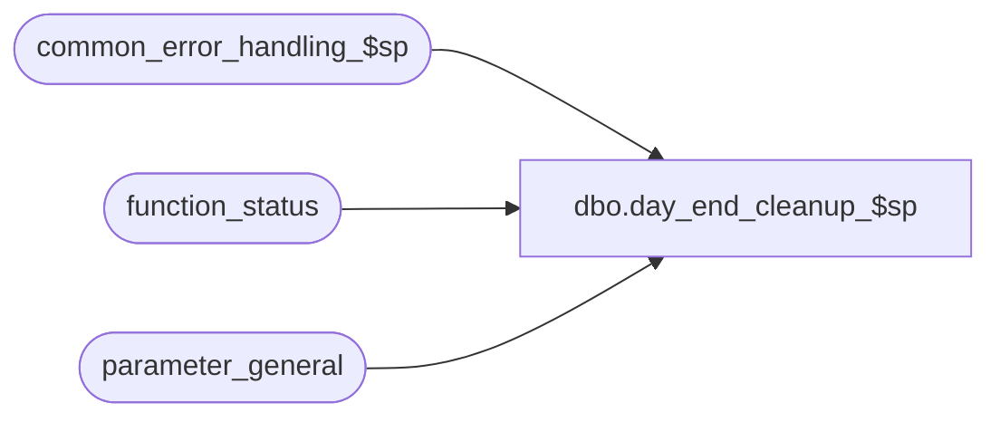

# dbo.day_end_cleanup_$sp

**Database:** auditworks  
**Server:** bedrockdb01  

## Architecture Diagram



## Table Dependencies

| Referenced Table |
|---|
| common_error_handling_$sp |
| function_status |
| parameter_general |

## Stored Procedure Code

```sql
create proc dbo.day_end_cleanup_$sp 
@process_id                       binary(16),
@dayend_in_progress               tinyint OUTPUT,
@halted_process                   tinyint = 0, /* 1 = called from halted process screen */
@immediate_dayend_requested       tinyint = 0

-- function_cleanup_$sp call --> @dayend_in_progress = 1, @halted_process = 1, @immediate_dayend_requested = 0
-- dayend_populate_$sp call  --> @dayend_in_progress = 1, @halted_process = 0, @immediate_dayend_requested = 0

AS

DECLARE
  @cleanup_flag            tinyint,
  @context_info		   varbinary(128),
  @cursor_open             tinyint,
  @errmsg                  nvarchar(255),
  @errno                   int,
  @function_name	   nvarchar(255),
  @function_no             tinyint,
  @message_id              int,
  @object_name             nvarchar(255),
  @operation_name          nvarchar(100),
  @process_name            nvarchar(100),
  @halted_process_id       binary(16),
  @rows                    int,
  @logged_in_flag          int

/* PROC NAME: day_end_cleanup_$sp
   DESC: Description: Determines whether there are any dayends in progress.
         If not, then clean up records left by previously aborted dayend(s).
         Called by day_end_populate_$sp and function_cleanup_$sp. 

HISTORY
Date     Name           Def#  Desc
Jan04,11 Paul         105313  Use unicode datatypes
Oct25,06 Phu           77931  Fix outer join for SQL 2005 Mode 90.
Dec13,04 David       DV-1191  Improve performance by adding hints.
Oct07,04 David       DV-1146  Pass null to user_id in common_error_handling_$sp.
                      /42301  Check context_info instead of login-name since users assigned to run  
                              smartload processes are user-defined in Smartload Var table maintenance.
May05,04 Maryam      DV-1071  Receive @process_id and pass it to the common_error_handling_$sp
Jan06,04 Phu           15801  Call common_error_handling_$sp.
Jul20,01 Henry          8286  Modify cleanup logic to work correctly with multi-stream dayend.
                              Replaces Defects 7493 in Oracle.
Mar01,00 Phu            5900  Change @@sqlstatus > 0 to @@fetch_status <> 0 for MS SQL compatibility

*/

SELECT @cursor_open = 0,
       @dayend_in_progress = 0, --Set this to a 0 and if there is a dayend running, it will be set back to a 1
       @function_name = 'auditworks_dayend%',
       @function_no = 18,
       @message_id = 201068,
       @process_name = 'day_end_cleanup_$sp'

/* use temp table to avoid cursor problems with delete */
CREATE TABLE #dayend_processes
(process_id binary(16) null, 
 function_no tinyint null, 
 spid int null 
)

SELECT @errno = @@error
IF @errno !=0 
  BEGIN
    SELECT @errmsg= 'Failed to build temp table #dayend_processes',
           @object_name = '#dayend_processes',
           @operation_name = 'CREATE'
    GOTO error
  END

INSERT INTO #dayend_processes
SELECT process_id, function_no, spid
FROM function_status LEFT JOIN master..sysprocesses ON (process_id = spid)
WHERE function_no IN (16, 18) -- 16 = Dayend Housekeeping; 18 = Dayend Posting

SELECT @errno = @@error,
       @rows = @@rowcount
IF @errno !=0 
  BEGIN
    SELECT @errmsg= 'Failed to select from function_status',
           @object_name = 'function_status',
           @operation_name = 'SELECT'
    GOTO error
  END

IF @rows = 0
  RETURN

DECLARE cleanup_crsr CURSOR FAST_FORWARD
    FOR  
 SELECT process_id, function_no, spid
   FROM #dayend_processes

OPEN cleanup_crsr

SELECT @errno = @@error, @cursor_open = 1
IF @errno !=0 
  BEGIN
    SELECT @errmsg='Failed to open cursor cleanup_crsr on #dayend_processes',
           @object_name = 'cleanup_crsr',
           @operation_name = 'OPEN_CURSOR'
    GOTO error
  END

WHILE 1 = 1
 BEGIN

  FETCH cleanup_crsr INTO
    @halted_process_id,
    @function_no,
    @logged_in_flag

  IF @@fetch_status <> 0	-- no more data
    BREAK

  SELECT @cleanup_flag = 0

  IF @logged_in_flag IS NULL OR @halted_process_id = @process_id -- no longer logged on or logged on with the same spid
    SELECT @cleanup_flag = 1
  ELSE
    BEGIN -- check whether a different user or function is now logged on with same spid

     SELECT @context_info = context_info
     FROM master..sysprocesses
     WHERE spid = @halted_process_id

     IF convert(nvarchar, @context_info) not like @function_name
       SELECT @cleanup_flag = 1
    END

  IF @cleanup_flag = 1
    BEGIN
      DELETE function_status
       WHERE process_id = @halted_process_id
         AND function_no = @function_no

      SELECT @errno = @@error
      IF @errno !=0 
        BEGIN
          SELECT @errmsg = 'Unable to delete function_status',
                 @object_name = 'function_status',
                 @operation_name = 'DELETE'
          GOTO error
        END
    END
  ELSE
    SELECT @dayend_in_progress = 1

 END /* While 1=1 */

CLOSE cleanup_crsr
DEALLOCATE cleanup_crsr

IF @dayend_in_progress = 0
  BEGIN
    UPDATE parameter_general
       SET dayend_in_progress = 0

    SELECT @errno = @@error
    IF @errno != 0
     BEGIN
       SELECT @errmsg = 'Failed to update parameter_general',
              @object_name = 'parameter_general',
              @operation_name = 'UPDATE'
       GOTO error
     END
  END

RETURN

error:
  IF @cursor_open = 1 
    BEGIN
      CLOSE cleanup_crsr
      DEALLOCATE cleanup_crsr
    END

  EXEC common_error_handling_$sp @function_no, @errno, @errmsg, 0, @message_id, 
       @process_name, @object_name, @operation_name, 1, 1, 0, null, 0, null, null, null,
       null, null, null, 0, @process_id, null 

  RETURN
```

