# dbo.day_end_post_audit_$sp

**Database:** auditworks  
**Server:** bedrockdb01  

## Architecture Diagram

```mermaid
flowchart LR
    SP["dbo.day_end_post_audit_$sp"]
    CLNDR_PRD(["CLNDR_PRD"]) --> SP
    CRDM_PRMTRS(["CRDM_PRMTRS"]) --> SP
    Ex_Queue(["Ex_Queue"]) --> SP
    audit_status(["audit_status"]) --> SP
    auditworks_parameter(["auditworks_parameter"]) --> SP
    authorization_detail(["authorization_detail"]) --> SP
    check_abort_requested__sp(["check_abort_requested_$sp"]) --> SP
    common_error_handling__sp(["common_error_handling_$sp"]) --> SP
    customer(["customer"]) --> SP
    customer_detail(["customer_detail"]) --> SP
    dayend_status(["dayend_status"]) --> SP
    dayend_workload(["dayend_workload"]) --> SP
    delete_if_details__sp(["delete_if_details_$sp"]) --> SP
    discount_detail(["discount_detail"]) --> SP
    end_process_log__sp(["end_process_log_$sp"]) --> SP
    export_elp_schedule_g(["export_elp_schedule_g"]) --> SP
    export_format(["export_format"]) --> SP
    if_authorization_detail(["if_authorization_detail"]) --> SP
    if_customer(["if_customer"]) --> SP
    if_customer_detail(["if_customer_detail"]) --> SP
    if_discount_detail(["if_discount_detail"]) --> SP
    if_interface_control_deadlock(["if_interface_control_deadlock"]) --> SP
    if_line_note(["if_line_note"]) --> SP
    if_merchandise_detail(["if_merchandise_detail"]) --> SP
    if_payroll_detail(["if_payroll_detail"]) --> SP
    if_post_void_detail(["if_post_void_detail"]) --> SP
    if_return_detail(["if_return_detail"]) --> SP
    if_special_order_detail(["if_special_order_detail"]) --> SP
    if_stock_control_detail(["if_stock_control_detail"]) --> SP
    if_tax_detail(["if_tax_detail"]) --> SP
    if_tax_override_detail(["if_tax_override_detail"]) --> SP
    if_transaction_header(["if_transaction_header"]) --> SP
    if_transaction_line(["if_transaction_line"]) --> SP
    if_transaction_line_link(["if_transaction_line_link"]) --> SP
    interface_control(["interface_control"]) --> SP
    interface_directory(["interface_directory"]) --> SP
    interface_status(["interface_status"]) --> SP
    line_note(["line_note"]) --> SP
    merchandise_detail(["merchandise_detail"]) --> SP
    parameter_general(["parameter_general"]) --> SP
    payroll_detail(["payroll_detail"]) --> SP
    post_void_detail(["post_void_detail"]) --> SP
    return_detail(["return_detail"]) --> SP
    smartload_var(["smartload_var"]) --> SP
    special_order_detail(["special_order_detail"]) --> SP
    start_process_log__sp(["start_process_log_$sp"]) --> SP
    stock_control_detail(["stock_control_detail"]) --> SP
    store_audit_status(["store_audit_status"]) --> SP
    store_audit_status_deadlock(["store_audit_status_deadlock"]) --> SP
    tax_detail(["tax_detail"]) --> SP
    tax_override_detail(["tax_override_detail"]) --> SP
    transaction_header(["transaction_header"]) --> SP
    transaction_line(["transaction_line"]) --> SP
    transaction_line_link(["transaction_line_link"]) --> SP
    update_process_step_log__sp(["update_process_step_log_$sp"]) --> SP
    work_delete_detail(["work_delete_detail"]) --> SP
```



## Table Dependencies

| Referenced Table |
|---|
| CLNDR_PRD |
| CRDM_PRMTRS |
| Ex_Queue |
| audit_status |
| auditworks_parameter |
| authorization_detail |
| check_abort_requested_$sp |
| common_error_handling_$sp |
| customer |
| customer_detail |
| dayend_status |
| dayend_workload |
| delete_if_details_$sp |
| discount_detail |
| end_process_log_$sp |
| export_elp_schedule_g |
| export_format |
| if_authorization_detail |
| if_customer |
| if_customer_detail |
| if_discount_detail |
| if_interface_control_deadlock |
| if_line_note |
| if_merchandise_detail |
| if_payroll_detail |
| if_post_void_detail |
| if_return_detail |
| if_special_order_detail |
| if_stock_control_detail |
| if_tax_detail |
| if_tax_override_detail |
| if_transaction_header |
| if_transaction_line |
| if_transaction_line_link |
| interface_control |
| interface_directory |
| interface_status |
| line_note |
| merchandise_detail |
| parameter_general |
| payroll_detail |
| post_void_detail |
| return_detail |
| smartload_var |
| special_order_detail |
| start_process_log_$sp |
| stock_control_detail |
| store_audit_status |
| store_audit_status_deadlock |
| tax_detail |
| tax_override_detail |
| transaction_header |
| transaction_line |
| transaction_line_link |
| update_process_step_log_$sp |
| work_delete_detail |

## Stored Procedure Code

```sql
CREATE proc [dbo].[day_end_post_audit_$sp]   @process_id                           binary(16),
  @dayend_process_id 			tinyint = NULL,
  @errmsg 				nvarchar(255) OUTPUT,
  @excluded_dayend_from_time            int = 0,
  @excluded_dayend_to_time              int = 0

AS

/* Proc name:   day_end_post_audit_$sp
** Desc:	Post to the interface tables from the active transaction
** 		tables where interface_status_flag = 2 (post audit interfaces) or interface is 12 (Tax) with ascii export flag > 0
** 		Called from day_end_posting_$sp.

  NOTE: this version is compatible with SA5.0 and SA5.1 . Export to ELP is obsolete and doesn't need to be converted to unicode.

HISTORY
Date     Name		Def# Desc
Nov20,17 Kiri	   DAOM-2815 Store number not being updated correctly on IF rejected trans
Jul04,14 Vicci     TFS-74694 Log cost.
Mar05,14 Vicci         61711 Add tax_detail.applied_by_line_id
Jul08,13 Vicci        139695 Add unit_of_measure logging.
Feb15,13 Paul         141811 populate customer_modified_flag in if_transaction_header to match edit
May31,11 Vicci        127475 Update interface status for avalara tax master import request in order for immediate_posting_requested to get set.
Apr20,11 Paul         125553 make one shared proc for SA5.0 and SA5.1
Mar03,11 Vicci        125553 If tax tracking export is active but applicability_method is > 1 then still post tax transactions with an update
                             timing of Edit to interface tables too (even though they have no interface_control entries).
Dec16,10 Vicci        120654 If tax tracking export is active then post tax transactions with an update timing of Edit
			     to interface tables too.
Dec14,10 Vicci        120654 Add tax_item_group_id, originating_date, fulfillment_store_no, above_threshold_flag fields.
Jul21,09 Vicci        109078 Add track_tax field to copy.
May05,09 Vicci        110063 Put back truncation of #work_dayend_header lost on DV-1191
Nov06,06 Paul          74790 read CRDM_PRMTRS to get CLNDR_ID
Apr29,05 Maryam      DV-1202 insert into if_transaction_line_link. Rename from_line_id to line_id.
				expand transaction_id to use tran_id_datatype (Paul)
Dec13,04 David       DV-1191 Improve performance by adding hints.
Oct07,04 David       DV-1146 Handle new column user_id, added columns to inserts.
Aug09,04 Maryam      DV-1071 hard code region_code and division_code.
Jul09,04 ShuZ        DV-1071 Expand user_name to nvarchar(50)
Jun28,05 ShuZ        DV-1071 Add without_receipt_flag when populating return_detail tables.
May12,04 David       DV-1071 Use new Calendar table.
May07,04 Maryam      DV-1071 Receive @process_id and @user_name and pass it to check_abort_requested_$sp
Nov17,03 Phu           15801 Populate sku_id, reason, imrd, style_reference_id, display_def_id
Sep18,03 Maryam        13686 Pass two new parameters for excluded dayend time and call
                             check_abort_requested_$sp to check whether abort has been requested either by the system or user. 
Apr24,03 Paul        1-KO2HY populate till_no
Dec19,02 Phu            5327 Retrieve gl_effect
Jul23,02 Paul        1-E7L7M populate key_11 in Ex_Queue with entry_date_time
May08,02 Winnie	     1-C2Q5L Add abort logic to dayend.
Apr25,02 Phu         1-C9P5S Create entry in if_tax_detail
Mar05,02 Paul        1-AWYZP remove obsolete loss prevention logic
Nov30,01 Phu            8931 Progress monitor and error handling
Sep24,01 ShuZ           8288 Add an originating_store_no to the stock_control_detail table for use
                              when head-office(or another store) enters a transacion on behalf of
                              another store
May28,01 Winnie	        8019 Log pos_deptclass and upc_lookup_division to if_stock_control_detail table
May16,01 Shapoor    	7813 Add column originating_store_no to merchandise* tables to attribute 
		              the sale/return to the store where the sale originated.
May11,01 David C        7811 Add transaction_id to if_transaction_header
Mar09,01 David M	7559 Added dayend_process_id column to dayend_status table so that the
				recovery is correctly done in a multi-stream environment.   
Feb22,01 DavidM		7391 Add pos_identifier and pos_identifier_type fields to if_stock_control_detail table.
Jan26,01 Winnie 	7221 set the day_end_posting_date in store_audit_status
Oct03,00 Maryam         6782 Modify to log customer.pos_tax_jurisdiction_code, fax, and email_address.
Sep18,00 Maryam         6725 Changed the dayend order.(Post-Audit IF will be posted prior to subledger.)
Sep12,00 Shapoor        6663 Facilitate Multi Stream Dayend.
May25,00 John G		5864 Change '= NULL' to 'IS NULL' where applicable to mirror Oracle.
Mar01,00 Phu		5900 Change @@fetch_status > 0 to @@fetch_status <> 0 for MS SQL compatibility
Jul16,99 Paul		5028 Batch by a single store date and minimize locking
Mar23,99 Paul		4353 Call lp module
Aug07,98 Daphna
         Phu		Author

*/


DECLARE
	@basic_sa_prefix		nchar(3),
	@current_date 			smalldatetime,
	@cursor_open 			bit,
	@date_reject_id			tinyint,
	@dayend_status			tinyint,
	@errno 				int,
	@elpg_flag 			bit,
	@expected_status		smallint,
	@message_id			int,
	@object_name			nvarchar(255),
	@operation_name			nvarchar(100),
	@process_name			nvarchar(100),
	@process_log_entry 		bit,
	@process_no 			smallint,
	@process_start_time		datetime,
	@process_timestamp 		float,
	@rows 				int,
	@sa_company_no			nchar(2),
	@sales_date 			smalldatetime,
	@store_no 			int,
	@transaction_count 		int,
	/* the zero filler variables are only used by the obsolete export to Eastborn LP; no need to use unicode */
	@zero_filler_3			nchar(3),
	@zero_filler_8			nchar(8),
	@zero_filler_10			nchar(10),
	@abort_flag			tinyint,
	@clndr_id			binary(16),
	@lvl_week			binary(16),
	@tax_export			tinyint

IF @dayend_process_id IS NULL  
  RETURN

SELECT @expected_status = 301,
	@process_no = 21,
	@process_start_time = getdate(),
	@message_id = 201068,
	@process_name = 'day_end_post_audit_$sp',
	@abort_flag = 0


/* check for previously aborted batch */
SELECT @store_no = store_no,
       @sales_date = sales_date,
       @date_reject_id = date_reject_id,
       @dayend_status = dayend_status
  FROM dayend_status WITH (NOLOCK)
 WHERE process_no = @process_no
   AND dayend_process_id = @dayend_process_id

SELECT @errno = @@error,
	@rows = @@rowcount
IF @errno <> 0
  BEGIN
 SELECT @errmsg = 'Failed to select from dayend_status',
	    @object_name = 'dayend_status',
	    @operation_name = 'SELECT'
    GOTO error
  END

IF @rows = 0
BEGIN
  INSERT INTO dayend_status(
           dayend_process_id,
           process_no,
           store_no,
           sales_date,
           date_reject_id,
           dayend_status)
   VALUES (@dayend_process_id,
           @process_no,
           0, -- store_no
           GETDATE(),
           0, -- date_reject_id
           0) -- dayend_status
  
    SELECT @errno = @@error
    IF @errno <> 0
      BEGIN
        SELECT @errmsg = 'Failed to insert into dayend_status',
	       @object_name = 'dayend_status',
	       @operation_name = 'INSERT'
        GOTO error
      END

    SELECT @dayend_status = 0,
           @date_reject_id = 0
END
  
IF @dayend_status = 1 AND @date_reject_id = 0 /* cleanup previously aborted batch */
BEGIN
  DELETE work_delete_detail
   WHERE process_id = @process_id

   SELECT @errno = @@error
   IF @errno <> 0
     BEGIN
      SELECT @errmsg = 'Failed to delete work_delete_detail (1)',
	     @object_name = 'work_delete_detail',
	     @operation_name = 'DELETE'
      GOTO error
     END

   INSERT work_delete_detail (process_id, transaction_id)
   SELECT @process_id, if_entry_no
     FROM if_transaction_header WITH (NOLOCK)
    WHERE transaction_date = @sales_date
      AND store_no = @store_no
      AND source_process_no = @process_no

   SELECT @errno = @@error
   IF @errno <> 0
     BEGIN
      SELECT @errmsg = 'Failed to insert work_delete_detail',
	     @object_name = 'work_delete_detail',
	     @operation_name = 'INSERT'
     GOTO error
     END

   EXEC delete_if_details_$sp @process_id, null, 0

   SELECT @errno = @@error
   IF @errno <> 0
     BEGIN
       SELECT @errmsg = 'Failed to exec stored proc delete_if_details_$sp',
	      @object_name = 'delete_if_details_$sp',
	      @operation_name = 'EXECUTE'
      GOTO error
     END

   DELETE work_delete_detail
    WHERE process_id = @process_id

   SELECT @errno = @@error
   IF @errno <> 0
     BEGIN
      SELECT @errmsg = 'Failed to delete work_delete_detail (2)',
	     @object_name = 'work_delete_detail',
	     @operation_name = 'DELETE'
      GOTO error
   END

   UPDATE dayend_status
      SET dayend_status = 0
    WHERE process_no = @process_no
      AND dayend_process_id = @dayend_process_id
      
   SELECT @errno = @@error
   IF @errno <> 0
     BEGIN
      SELECT @errmsg = 'Failed to update dayend_status (cleanup)',
	     @object_name = 'dayend_status',
	     @operation_name = 'UPDATE'
      GOTO error
     END

END /* If @dayend_status = 1 */


CREATE TABLE #exp_elpg (
	yyyymmdd 			nchar(8) 	not null,
	store_no 			nchar(3) 	not null,
	register_no 			nchar(8) 	not null,
	cashier_no 			nchar(8) 	not null,
	sales_date 			nchar(8) 	not null,
	division_code 			nchar(3) 	not null,
	region_code 			nchar(3) 	not null,
	structure_code 			nchar(3) 	not null,
	balancing_method 		nchar(1) 	not null,
	media_short_ch 			nchar(10) 	not null,
	media_short_sign 		nchar(1) 	not null,
	media_short 			int 		not null )
SELECT @errno = @@error
IF @errno <> 0
  BEGIN
	SELECT @errmsg = 'Unable to create table #exp_elpg',
	       @object_name = '#exp_elpg',
	       @operation_name = 'CREATE'
	GOTO error
  END

CREATE TABLE #work_dayend_header (
	transaction_id			numeric(14,0) not null, -- tran_id_datatype
	if_entry_no			numeric(14,0) not null, -- if_entry_datatype
	transaction_date		smalldatetime not null,
	entry_date_time			datetime not null )
SELECT @errno = @@error
IF @errno <> 0
  BEGIN
	SELECT @errmsg = 'Unable to create table #work_dayend_header',
	       @object_name = '#work_dayend_header',
	       @operation_name = 'CREATE'
	GOTO error
  END

CREATE TABLE #work_tran_dayend (
	store_no 			int 		not null,
	transaction_date		smalldatetime	not null,
	register_no 			smallint 	not null,
	transaction_no			int		not null,
	transaction_series		nchar(1)		not null,
	entry_date_time			datetime	not null,
	transaction_id			numeric(14,0)	not null ) -- tran_id_datatype
SELECT @errno = @@error
IF @errno <> 0
  BEGIN
	SELECT @errmsg = 'Unable to create table #work_tran_dayend',
	       @object_name = '#work_tran_dayend',
	       @operation_name = 'CREATE'
	GOTO error
  END

/* Use temp table to reduce locking on dayend_workload */
CREATE TABLE #store_status_temp (
	store_no 			int 		not null,
	sales_date 			smalldatetime 	not null,
	date_reject_id 			tinyint 	not null)
SELECT @errno = @@error
IF @errno <> 0 
BEGIN
  SELECT @errmsg = 'Failed to create temp table.',
         @object_name = '#store_status_temp',
         @operation_name = 'CREATE'
  GOTO error  
END

IF EXISTS (SELECT 1 
             FROM interface_directory d
                  INNER JOIN export_format f
                     ON d.interface_id = f.interface_id
                    AND d.ascii_export = f.export_format
                    AND f.export_procedure_name = 'avalara_tax_master_request_$sp'
            WHERE d.interface_id = 12
              AND d.update_timing > 0)  
--implies tax transactions are not exported, only a tax-master import request is being exported.                                  
BEGIN
  UPDATE interface_status
     SET posting_in_progress = 2,
         last_posting_datetime = getdate()
   WHERE interface_id = 12
  SELECT @errno = @@error
  IF @errno != 0
  BEGIN
    SELECT @errmsg = 'Unable to update interface_status to kick off avalara tax master import request',
 	   @object_name = 'interface_status',
 	   @operation_name = 'UPDATE'
    GOTO error
  END
END

INSERT INTO #store_status_temp
 SELECT store_no,
	sales_date,
	date_reject_id
  FROM dayend_workload WITH (NOLOCK)
 WHERE dayend_process_id = @dayend_process_id
   AND store_audit_status = @expected_status

SELECT @errno = @@error,
	@transaction_count = @@rowcount
IF @errno <> 0
  BEGIN
	SELECT @errmsg = 'Unable to build temp table #store_status_temp',
	       @object_name = '#store_status_temp',
	       @operation_name = 'SELECT'
    GOTO error
  END

IF @transaction_count = 0
  RETURN

SELECT	@current_date = getdate(),
	@cursor_open = 0,
	@errmsg = NULL,
	@process_log_entry = 0,
	@process_timestamp = 0,
	@transaction_count = 0,
	@zero_filler_3 = '000',
	@zero_filler_8 = '00000000',
	@zero_filler_10 = '0000000000'

SELECT @sa_company_no = RIGHT ('00' + LTRIM (STR (sa_company_no)), 2)
  FROM parameter_general
SELECT @errno = @@error
IF @errno <> 0
  BEGIN
	SELECT @errmsg = 'Unable to select from parameter_general',
	       @object_name = 'parameter_general',
	       @operation_name = 'SELECT'
	GOTO error
  END

SELECT @basic_sa_prefix = ISNULL(var_value,'xxx')
FROM smartload_var
WHERE ict_name = 'dayend.ict'
  AND var_name = 'sa_pfx'
SELECT @errno = @@error
IF @errno <> 0
  BEGIN
	SELECT @errmsg = 'Unable to select from smartload_var',
	       @object_name = 'smartload_var',
	       @operation_name = 'SELECT'
	GOTO error
  END


IF EXISTS (SELECT interface_id
	     FROM interface_directory 
	    WHERE interface_id = 20
	      AND update_timing = 2
	      AND ascii_export = 1)
  SELECT @elpg_flag = 1
ELSE
  SELECT @elpg_flag = 0


IF EXISTS (SELECT 1
 	     FROM interface_directory d
 	          INNER JOIN export_format f
                     ON d.interface_id = f.interface_id
                    AND d.ascii_export = f.export_format
                    AND f.export_procedure_name <> 'avalara_tax_master_request_$sp'  --implies tax transactions are not exported, only a tax-master import request is being exported. 
	    WHERE d.interface_id = 12  --Tax
	      AND d.update_timing > 0  --note:  must be 6 for Avalara export since it uses tax_detail
	      AND d.ascii_export > 0)
  SELECT @tax_export = 1
ELSE
  SELECT @tax_export = 0

IF @tax_export = 1 AND NOT EXISTS (SELECT * FROM interface_directory WHERE interface_id = 12 AND applicability_method IN (0, 1))
  SELECT @tax_export = 2  --implies interface_control is not populated.
                                        
SELECT @clndr_id = PRMTR_VAL_BIN
  FROM CRDM_PRMTRS
 WHERE PRMTR_NAME = 'GL_PSTNG_CLNDR_ID'
SELECT @errno = @@error, @rows = @@rowcount
IF @rows = 0 AND @errno = 0
  SELECT @errno = 201612
IF @errno <> 0
  BEGIN
    SELECT @errmsg = 'Unable to select calendar id',
           @object_name = 'CRDM_PRMTRS',
           @operation_name = 'SELECT'
    GOTO error
  END

SELECT @lvl_week = par_bin_value
  FROM auditworks_parameter
 WHERE par_name = 'clndr_lvl_week'

  SELECT @errno = @@error
  IF @errno <> 0
  BEGIN
    SELECT @errmsg = 'Unable to select week level type id',
           @object_name = 'auditworks_parameter',
           @operation_name = 'SELECT'
    GOTO error
  END


DECLARE store_crsr CURSOR FAST_FORWARD
    FOR
 SELECT	store_no,
	sales_date,
	date_reject_id
   FROM #store_status_temp WITH (NOLOCK)

OPEN store_crsr
SELECT @errno = @@error
IF @errno <> 0
  BEGIN
	SELECT @errmsg = 'Unable to open cursor store_crsr',
	       @object_name = 'store_crsr',
	       @operation_name = 'OPEN'
	GOTO error
  END

SELECT @cursor_open = 1

WHILE 1 = 1
BEGIN
	FETCH store_crsr INTO
		@store_no,
		@sales_date,
		@date_reject_id

	IF @@fetch_status <> 0
		BREAK
 
        EXEC check_abort_requested_$sp @dayend_process_id, @process_id, @process_no,
 @excluded_dayend_from_time, @excluded_dayend_to_time, @errmsg OUTPUT
        
        SELECT @errno = @@error
    IF @errno != 0 
          BEGIN
            IF @errmsg IS NULL
              SELECT @errmsg = 'Failed to execute stored procedure check_abort_requested_$sp'
            SELECT @object_name = 'check_abort_requested_$sp',
                   @operation_name = 'EXECUTE'
            GOTO error
          END

	IF @elpg_flag = 1
	  BEGIN
	    TRUNCATE TABLE #exp_elpg
	    SELECT @errno = @@error
	    IF @errno <> 0
	      BEGIN
		SELECT @errmsg = 'Unable to truncate table #exp_elpg',
		    @object_name = '#exp_elpg',
		    @operation_name = 'TRUNCATE'
		GOTO error
	      END

	    INSERT #exp_elpg (
		yyyymmdd,
		store_no,
		register_no,
		cashier_no,
		sales_date,
		division_code,
		region_code,
		structure_code,
		balancing_method,
		media_short_ch,
		media_short_sign,
		media_short)
	    SELECT
		SUBSTRING   (CONVERT (nchar(10), DATEADD(ss, -1, c.END_DATE_TIME), 102), 1, 4) 
		+ SUBSTRING (CONVERT (nchar(10), DATEADD(ss, -1, c.END_DATE_TIME), 102), 6, 2) 
		+ SUBSTRING (CONVERT (nchar(10), DATEADD(ss, -1, c.END_DATE_TIME), 102), 9, 2),
		RIGHT (@zero_filler_3 + LTRIM (STR (ast.store_no, 3)), 3),
		RIGHT (@zero_filler_8 + LTRIM (STR (ast.register_no, 8)), 8),
		@zero_filler_8,
		CONVERT (nchar(8), ast.sales_date, 1),
		'001', -- division_code
		'001', --region_code
		@zero_filler_3,
		'R',
		RIGHT (@zero_filler_10 + CONVERT (nvarchar(10),
		      (CONVERT (NUMERIC(9,2), ABS (SUM (ISNULL(ast.media_short,0) ))))), 10),
		' ',
		CONVERT (INT, SUM (ISNULL (ast.media_short, 0) * 100))
	    FROM audit_status ast,
		CLNDR_PRD c
	    WHERE ast.sales_date = @sales_date
	      AND ast.date_reject_id = @date_reject_id
	      AND ast.store_no = @store_no
	      AND c.CLNDR_ID          = @clndr_id
	      AND c.CLNDR_LVL_TYPE_ID = @lvl_week
	      AND ast.sales_date >= c.STRT_DATE_TIME 
	      AND ast.sales_date  < c.END_DATE_TIME
	    GROUP BY
		SUBSTRING   (CONVERT (nchar(10), DATEADD(ss, -1, c.END_DATE_TIME), 102), 1, 4) 
		+ SUBSTRING (CONVERT (nchar(10), DATEADD(ss, -1, c.END_DATE_TIME), 102), 6, 2) 
		+ SUBSTRING (CONVERT (nchar(10), DATEADD(ss, -1, c.END_DATE_TIME), 102), 9, 2),
		RIGHT (@zero_filler_3 + LTRIM (STR (ast.store_no, 3)), 3),
		RIGHT (@zero_filler_8 + LTRIM (STR (ast.register_no, 8)), 8),
		CONVERT (nchar(8), ast.sales_date, 1)

	    SELECT @errno= @@error,
		@rows = @@rowcount
	    IF @errno <> 0
	      BEGIN
		SELECT @errmsg = 'Unable to insert into table export_elp_schedule_g',
		       @object_name = '#exp_elpg',
		       @operation_name = 'INSERT'
		GOTO error
	      END	

	    IF @rows > 0
	      BEGIN
		UPDATE #exp_elpg 
		SET media_short_sign = '-'
		WHERE media_short < 0

		SELECT @errno = @@error
		IF @errno <> 0
		  BEGIN
			SELECT @errmsg = 'Unable to update table #exp_elpg',
			       @object_name = '#exp_elpg',
			       @operation_name = 'UPDATE'
			GOTO error
		  END	
	      END
	  END /* if @elpg_flag = 1 */

/* get list of transactions to be interfaced.
    Interface_control ( set by edit ) determines whether void transactions are included. */

	INSERT INTO #work_tran_dayend
	SELECT DISTINCT
		th.store_no,
		th.transaction_date,
		th.register_no,
		th.transaction_no,
		th.transaction_series,
		th.entry_date_time,
		th.transaction_id
	  FROM transaction_header th WITH (NOLOCK),
		interface_control ic WITH (NOLOCK)
	 WHERE transaction_date = @sales_date
	   AND store_no = @store_no
	   AND date_reject_id = @date_reject_id
	   AND th.transaction_id = ic.transaction_id
	   AND (ic.interface_status_flag = 2
	        OR (ic.interface_id = 12 AND @tax_export = 1))
        UNION
	SELECT DISTINCT
		th.store_no,
		th.transaction_date,
		th.register_no,
		th.transaction_no,
		th.transaction_series,
		th.entry_date_time,
		th.transaction_id
	  FROM transaction_header th WITH (NOLOCK),
	       tax_detail td WITH (NOLOCK)
	 WHERE @tax_export = 2
	   AND th.transaction_date = @sales_date
	   AND th.store_no = @store_no
	   AND th.date_reject_id = @date_reject_id
	   AND th.transaction_id = td.transaction_id

	SELECT @errno = @@error,
	       @rows = @@rowcount
	IF @errno <> 0
	  BEGIN
		SELECT @errmsg = 'Unable to insert #work_tran_dayend',
		       @object_name = '#work_tran_dayend',
		       @operation_name = 'SELECT'
		GOTO error
	  END

	IF @rows = 0
	  BEGIN
	    BEGIN TRAN
		IF @elpg_flag = 1
		  BEGIN
			INSERT export_elp_schedule_g (
				yyyymmdd,
				company_no,
				store_no,
				register_no,
				cashier_no,
				sales_date,
				division_code,
				region_code,
				structure_code,
				balancing_method,
				media_short_ch,
				media_short_sign,
				basic_sa_prefix,
				media_short)
			SELECT
				yyyymmdd,
				@sa_company_no,
				store_no,
				register_no,
				cashier_no,
				sales_date,
				division_code,
				region_code,
				structure_code,
				balancing_method,
				media_short_ch,
				media_short_sign,
				@basic_sa_prefix,
				media_short
			FROM #exp_elpg WITH (NOLOCK)

			SELECT @errno = @@error,
				@rows = @@rowcount
			IF @errno <> 0
			  BEGIN
				SELECT @errmsg = 'Unable to insert into table export_elp_schedule_g',
				       @object_name = 'export_elp_schedule_g',
				       @operation_name = 'INSERT'
				GOTO error
			  END

			IF @process_log_entry = 0 AND @rows >= 1
			  BEGIN
			    EXEC start_process_log_$sp @process_no, @process_timestamp OUTPUT,
				@errmsg OUTPUT, @dayend_process_id, @process_start_time

			    SELECT @errno = @@error
			    IF @errno <> 0
			      BEGIN
				SELECT @object_name = 'start_process_log_$sp',
				       @operation_name = 'EXECUTE'
				IF @errmsg IS NULL  
				  SELECT @errmsg = 'Unable to execute start_process_log_$sp'
				 GOTO error
			      END

			    SELECT @process_log_entry = 1
			  END /* if @process_log_entry = 0 */

		  END /* if @elpg_flag = 1 */

		UPDATE store_audit_status_deadlock
		SET function_no = 18,
			status_date = getdate()

		SELECT @errno = @@error
		IF @errno <> 0
		  BEGIN
			SELECT @errmsg = 'Unable to update store_audit_status_deadlock',
			       @object_name = 'store_audit_status_deadlock',
			       @operation_name = 'UPDATE'
			GOTO error
		  END

		UPDATE audit_status
		  SET audit_status = 310,
		      status_date = @current_date
		 WHERE store_no = @store_no
		   AND sales_date = @sales_date
		   AND date_reject_id = @date_reject_id

		SELECT @errno = @@error
		IF @errno <> 0
		  BEGIN
			SELECT @errmsg = 'Unable to set audit_status to 310 from 301',
			       @object_name = 'audit_status',
			       @operation_name = 'UPDATE'
			GOTO error
		  END

		UPDATE store_audit_status
		   SET  store_audit_status = 310,
		        store_status_date = @current_date,
		        day_end_posting_date = @current_date 
		 WHERE store_no = @store_no
		   AND sales_date = @sales_date
		   AND date_reject_id = @date_reject_id

		SELECT @errno = @@error
		IF @errno <> 0
		  BEGIN
			SELECT @errmsg = 'Unable to set store_audit_status to 310 from 301',
			       @object_name = 'store_audit_status',
			       @operation_name = 'UPDATE'
			GOTO error
		  END

		UPDATE dayend_workload
		   SET store_audit_status = 310
		 WHERE dayend_process_id = @dayend_process_id
		   AND store_no = @store_no
		   AND sales_date = @sales_date
		   AND date_reject_id = @date_reject_id

		SELECT @errno = @@error
		IF @errno <> 0
		  BEGIN
			SELECT @errmsg = 'Unable to set store_audit_status to 310 in dayend_workload',
			       @object_name = 'dayend_workload',
			       @operation_name = 'UPDATE'
			GOTO error
		  END

	    COMMIT TRAN
	  END
	ELSE
	  BEGIN
		IF @process_log_entry = 0
		  BEGIN
		    EXEC start_process_log_$sp @process_no, @process_timestamp OUTPUT,
			@errmsg OUTPUT, @dayend_process_id, @process_start_time

		    SELECT @errno = @@error
		    IF @errno <> 0
		      BEGIN
			SELECT @object_name = 'start_process_log_$sp',
			    @operation_name = 'EXECUTE'
			IF @errmsg IS NULL  
			  SELECT @errmsg = 'Unable to execute start_process_log_$sp'
			  GOTO error
		      END

		    SELECT @process_log_entry = 1
		  END /* if @process_log_entry = 0 */

		UPDATE dayend_status
		   SET dayend_status  = 1,
		       store_no       = @store_no,
		       sales_date     = @sales_date,
		       date_reject_id = @date_reject_id
		 WHERE process_no = @process_no
		   AND dayend_process_id = @dayend_process_id
		   
		SELECT @errno = @@error
		IF @errno <> 0
		  BEGIN
		   SELECT @errmsg = 'Failed to update dayend_status (1)',
			  @object_name = 'dayend_status',
			  @operation_name = 'UPDATE'
		   GOTO error
		  END

		INSERT if_transaction_header (
			store_no,
			register_no,
			transaction_date,
			date_reject_id,
			transaction_series,
			transaction_no,
			entry_date_time,
			cashier_no,
			transaction_category,
			tender_total,
			transaction_void_flag,
			customer_info_exists,
			exception_flag,
			deposit_declaration_flag,
			closeout_flag,
			media_count_flag,
			customer_modified_flag,
			tax_override_flag,
			pos_tax_jurisdiction,
			edit_timestamp,
			source_process_no,
			updated_by_user_id,
			in_use_timestamp,
			last_modified_date_time,
			employee_no,
			transaction_remark,
			transaction_id,
			till_no )
		SELECT
			th.store_no,
			th.register_no,
			th.transaction_date,
			th.date_reject_id,
			th.transaction_series,
			th.transaction_no,
			th.entry_date_time,
			cashier_no,
			transaction_category,
			tender_total,
			transaction_void_flag,
			customer_info_exists,
			exception_flag,
			deposit_declaration_flag,
			closeout_flag,
			media_count_flag,
			th.customer_modified_flag,
			tax_override_flag,
			pos_tax_jurisdiction,
			@process_timestamp,
			@process_no,
			updated_by_user_id,
			in_use_timestamp,
			last_modified_date_time,
			employee_no,
			transaction_remark,
			th.transaction_id,
			th.till_no
		FROM 	#work_tran_dayend wt WITH (NOLOCK),
			transaction_header th WITH (NOLOCK)
		WHERE wt.transaction_id = th.transaction_id

		SELECT  @transaction_count = @transaction_count + @@rowcount,
			@errno = @@error
		IF @errno <> 0
		  BEGIN
			SELECT @errmsg = 'Unable to insert if_transaction_header',
			       @object_name = 'if_transaction_header',
			       @operation_name = 'INSERT'
			GOTO error
		  END

	/* Determine if_entry_no's just inserted. */

		INSERT #work_dayend_header (
			transaction_id,
			if_entry_no,
			transaction_date,
			entry_date_time )
		SELECT 
			wt.transaction_id,
			ih.if_entry_no,
			wt.transaction_date,
			ih.entry_date_time
		  FROM #work_tran_dayend wt WITH (NOLOCK), if_transaction_header ih WITH (NOLOCK)
		 WHERE wt.store_no = ih.store_no
		   AND wt.transaction_date = ih.transaction_date
		   AND wt.register_no = ih.register_no
		   AND wt.transaction_no = ih.transaction_no
		   AND wt.transaction_series = ih.transaction_series
		   AND wt.entry_date_time = ih.entry_date_time
		   AND @process_timestamp = ih.edit_timestamp

		SELECT @errno = @@error
		IF @errno <> 0
		  BEGIN
			SELECT @errmsg = 'Unable to insert #work_dayend_header',
			       @object_name = '#work_dayend_header',
			       @operation_name = 'INSERT'
			GOTO error
		  END

		INSERT if_authorization_detail (
			if_entry_no,
			line_id,
			card_type,
			authorization_no,
			expiry_date,
			swipe_indicator,
			approval_message,
			license_no,
			pos_state_code,
			other_id_type,
			other_id,
			deferred_billing_date,
			deferred_billing_plan,
			signature,
			customer_signature_obtained,
			offline_flag )
		SELECT
			if_entry_no,
			line_id,
			card_type,
			authorization_no,
			expiry_date,
			swipe_indicator,
			approval_message,
			license_no,
			pos_state_code,
			other_id_type,
			other_id,
			deferred_billing_date,
			deferred_billing_plan,
			signature,
			customer_signature_obtained,
			offline_flag
		   FROM #work_dayend_header ih WITH (NOLOCK), authorization_detail ad WITH (NOLOCK)
		  WHERE ih.transaction_id = ad.transaction_id

		SELECT @errno = @@error
		IF @errno <> 0
		  BEGIN
			SELECT @errmsg = 'Unable to insert if_authorization_detail',
			       @object_name = 'if_authorization_detail',
			       @operation_name = 'INSERT'
			GOTO error
		  END

		INSERT if_customer (
			if_entry_no,
			line_id,
			customer_role,
			title,
			first_name,
			last_name,
			address_1,
			address_2,
			city,
			county,
			state,
			country,
			post_code,
			telephone_no1,
			telephone_no2,
			customer_no,
			pos_tax_jurisdiction_code, 
			fax,
			email_address,
			more_info_flag )
		SELECT
			if_entry_no,
			line_id,
			customer_role,
			title,
			first_name,
			last_name,
			address_1,
			address_2,
			city,
			county,
			state,
			country,
			post_code,
			telephone_no1,
			telephone_no2,
			customer_no,
			pos_tax_jurisdiction_code, 
			fax,
			email_address,
			more_info_flag 
		   FROM #work_dayend_header ih WITH (NOLOCK), customer cu WITH (NOLOCK)
		  WHERE ih.transaction_id = cu.transaction_id

		SELECT @errno = @@error
		IF @errno <> 0
		  BEGIN
			SELECT @errmsg = 'Unable to insert if_customer',
			       @object_name = 'if_customer',
			       @operation_name = 'INSERT'
			GOTO error
		  END

		INSERT if_customer_detail (
			if_entry_no,
			line_id,
			customer_role,
			customer_info_type,
			customer_info )
		SELECT
			if_entry_no,
			line_id,
			customer_role,
			customer_info_type,
			customer_info
		   FROM #work_dayend_header ih WITH (NOLOCK), customer_detail cd WITH (NOLOCK)
		  WHERE ih.transaction_id = cd.transaction_id

		SELECT @errno = @@error
		IF @errno <> 0
		  BEGIN
			SELECT @errmsg = 'Unable to insert if_customer_detail',
			    @object_name = 'if_customer_detail',
			       @operation_name = 'INSERT'
			GOTO error
		  END

		INSERT if_discount_detail (
			if_entry_no,
			line_id,
			applied_by_line_id,
			pos_discount_level,
			pos_discount_type,
			pos_discount_amount,
			applied_flag,
			pos_discount_serial_no )
		SELECT
			if_entry_no,
			line_id,
			applied_by_line_id,
			pos_discount_level,
			pos_discount_type,
			pos_discount_amount,
			applied_flag,
			pos_discount_serial_no
		   FROM #work_dayend_header ih WITH (NOLOCK), discount_detail dd WITH (NOLOCK)
		  WHERE ih.transaction_id = dd.transaction_id

		SELECT @errno = @@error
		IF @errno <> 0
		  BEGIN
			SELECT @errmsg = 'Unable to insert if_discount_detail',
			       @object_name = 'if_discount_detail',
			       @operation_name = 'INSERT'
			GOTO error
		  END

		INSERT if_line_note (
			if_entry_no,
			line_id,
			note_type,
			line_note )
		SELECT 
			if_entry_no,
			line_id,
			note_type,
			line_note 
		   FROM #work_dayend_header ih WITH (NOLOCK), line_note ln WITH (NOLOCK)
		  WHERE ih.transaction_id = ln.transaction_id

		SELECT @errno = @@error
		IF @errno <> 0
		  BEGIN
			SELECT @errmsg = 'Unable to insert if_line_note',
			       @object_name = 'if_line_note',
			       @operation_name = 'INSERT'
			GOTO error
		  END

		INSERT if_merchandise_detail (
			if_entry_no,
			line_id,
			merchandise_category,
			upc_lookup_division,
			upc_no,
			units,
			salesperson,
			salesperson2,
			sku_id,
			style_reference_id,
			class_code,
			subclass_code,
			price_override,
			pos_iplu_missing,
			upc_on_file_flag,
			pos_deptclass,
			ticket_price,
			sold_at_price,
			plu_price,
			scanned,
			pos_identifier,
			pos_identifier_type,
			originating_store_no,
			source_store_no,
			fulfillment_store_no,
			cost )
		SELECT
			if_entry_no,
			line_id,
			merchandise_category,
			upc_lookup_division,
			upc_no,
			units,
			salesperson,
			salesperson2,
			sku_id,
			style_reference_id,
			class_code,
			subclass_code,
			price_override,
			pos_iplu_missing,
			upc_on_file_flag,
			pos_deptclass,
			ticket_price,
			sold_at_price,
			plu_price,
			scanned,
			pos_identifier,
			pos_identifier_type,
			originating_store_no,
			source_store_no,
			fulfillment_store_no,
			md.cost
		   FROM #work_dayend_header ih WITH (NOLOCK), merchandise_detail md WITH (NOLOCK)
		  WHERE ih.transaction_id = md.transaction_id

		SELECT @errno = @@error
		IF @errno <> 0
		  BEGIN
			SELECT @errmsg = 'Unable to insert if_merchandise_detail',
			       @object_name = 'if_merchandise_detail',
			       @operation_name = 'INSERT'
			GOTO error
		  END

		INSERT if_payroll_detail (
			if_entry_no,
			line_id,
			employee_no,
			payroll_date,
			employee_payroll_id,
			employee_type,
			payroll_entry_type )
		SELECT
			if_entry_no,
			line_id,
			employee_no,
			payroll_date,
			employee_payroll_id,
			employee_type,
			payroll_entry_type
		   FROM #work_dayend_header ih WITH (NOLOCK), payroll_detail pd WITH (NOLOCK)
		  WHERE ih.transaction_id = pd.transaction_id

		SELECT @errno = @@error
		IF @errno <> 0
		  BEGIN
			SELECT @errmsg = 'Unable to insert if_payroll_detail',
			       @object_name = 'if_payroll_detail',
			       @operation_name = 'INSERT'
			GOTO error
		 END

		INSERT if_post_void_detail (
			if_entry_no,
			line_id,
			post_voided_register,
			post_voided_trans_no,
			post_void_successful,
			post_void_reason_code )
		SELECT
			if_entry_no,
			line_id,
			post_voided_register,
			post_voided_trans_no,
			post_void_successful,
			post_void_reason_code
		   FROM #work_dayend_header ih WITH (NOLOCK), post_void_detail pv WITH (NOLOCK)
		  WHERE ih.transaction_id = pv.transaction_id

		SELECT @errno = @@error
		IF @errno <> 0
		  BEGIN
			SELECT @errmsg = 'Unable to insert if_post_void_detail',
			       @object_name = 'if_post_void_detail',
			       @operation_name = 'INSERT'
			GOTO error
		  END

		INSERT if_return_detail (
			if_entry_no,
			line_id,
			return_reason_message,
			return_reason_code,
			mdse_disposition_code,
			via_warehouse_flag,
			original_salesperson,
			original_salesperson2,
			return_from_store,
			return_from_reg,
			return_from_date,
			return_from_transno,
			without_receipt_flag )
		SELECT
			if_entry_no,
			line_id,
			return_reason_message,
			return_reason_code,
			mdse_disposition_code,
			via_warehouse_flag,
			original_salesperson,
			original_salesperson2,
			return_from_store,
			return_from_reg,
			return_from_date,
			return_from_transno,
			without_receipt_flag
		   FROM #work_dayend_header ih WITH (NOLOCK), return_detail rd WITH (NOLOCK)
		  WHERE ih.transaction_id = rd.transaction_id

		SELECT @errno = @@error
		IF @errno <> 0
		  BEGIN
			SELECT @errmsg = 'Unable to insert if_return_detail',
			       @object_name = 'if_return_detail',
			       @operation_name = 'INSERT'
			GOTO error
		  END

		INSERT if_special_order_detail (
			if_entry_no,
			line_id,
			units,
			salesperson,
			merchandise_description,
			expecting_delivery_on,
			color_description,
			size_description,
			width_description,
			vendor_name,
			vendor_style_description,
			spo_class_description,
			vendor_no )
		SELECT
			if_entry_no,
			line_id,
			units,
			salesperson,
			merchandise_description,
			expecting_delivery_on,
			color_description,
			size_description,
			width_description,
			vendor_name,
			vendor_style_description,
			spo_class_description,
			vendor_no
		   FROM #work_dayend_header ih WITH (NOLOCK), special_order_detail sd WITH (NOLOCK)
		  WHERE ih.transaction_id = sd.transaction_id

		SELECT @errno = @@error
		IF @errno <> 0
		  BEGIN
			SELECT @errmsg = 'Unable to insert if_special_order_detail',
			       @object_name = 'if_special_order_detail',
			       @operation_name = 'INSERT'
			GOTO error
		  END

		INSERT if_stock_control_detail (
			if_entry_no,
			line_id,
			upc_no,
			merchandise_key,
			initiated_by_host,
			units,
			other_store_no,
			location_no,
			vendor_no,
			count_date,
			pos_identifier,
			pos_identifier_type,
			pos_deptclass,
			upc_lookup_division,
			originating_store_no,
			display_def_id,
			sku_id,
			reason,
			imrd,
			style_reference_id,
			store_on_file_flag)
		SELECT
			if_entry_no,
			line_id,
			upc_no,
			merchandise_key,
			initiated_by_host,
			units,
			other_store_no,
			location_no,
			vendor_no,
			count_date,
			pos_identifier,
			pos_identifier_type,
			pos_deptclass,
			upc_lookup_division,
			originating_store_no,
			display_def_id,
			sku_id,
			reason,
			imrd,
			style_reference_id,
			store_on_file_flag
		   FROM #work_dayend_header ih WITH (NOLOCK), stock_control_detail sc WITH (NOLOCK)
		  WHERE ih.transaction_id = sc.transaction_id

		SELECT @errno = @@error
		IF @errno <> 0
		  BEGIN
			SELECT @errmsg = 'Unable to insert if_stock_control_detail',
			       @object_name = 'if_stock_control_detail',
			       @operation_name = 'INSERT'
			GOTO error
		  END

		INSERT if_transaction_line (
			if_entry_no,
			line_id,
			line_sequence,
			line_object_type,
			line_object,
			line_action,
			gross_line_amount,
			pos_discount_amount,
			db_cr_none,
			attachment_qty,
			exception_flag,
			interface_rejection_flag,
			line_void_flag,
			voiding_reversal_flag,
			edit_timestamp,
			reference_type,
			reference_no,
			unit_of_measure )
		SELECT
			if_entry_no,
			line_id,
			line_sequence,
			line_object_type,
			line_object,
			line_action,
			gross_line_amount,
			pos_discount_amount,
			db_cr_none,
			attachment_qty,
			exception_flag,
			interface_rejection_flag,
			line_void_flag,
			voiding_reversal_flag,
			edit_timestamp,
			reference_type,
			reference_no,
			tl.unit_of_measure
		   FROM #work_dayend_header ih WITH (NOLOCK), transaction_line tl WITH (NOLOCK)
		  WHERE ih.transaction_id = tl.transaction_id

		SELECT @errno = @@error
		IF @errno <> 0
		  BEGIN
			SELECT @errmsg = 'Unable to insert if_transaction_line',
			       @object_name = 'if_transaction_line',
			       @operation_name = 'INSERT'
			GOTO error
		  END

		INSERT if_tax_override_detail (
			if_entry_no,
			line_id,
			tax_level,
			tax_category,
			taxable,
			exception_tax_jurisdiction,
			tax_exempt_no )
		SELECT
			if_entry_no,
			line_id,
			tax_level,
			tax_category,
			taxable,
			exception_tax_jurisdiction,
			tax_exempt_no
		   FROM #work_dayend_header ih WITH (NOLOCK), tax_override_detail tod WITH (NOLOCK)
		  WHERE ih.transaction_id = tod.transaction_id

		SELECT @errno = @@error
		IF @errno <> 0
		  BEGIN
			SELECT @errmsg = 'Unable to insert if_tax_override_detail',
			       @object_name = 'if_tax_override_detail',
			       @operation_name = 'INSERT'
			GOTO error
		  END

		INSERT if_tax_detail (
			if_entry_no,
			line_id,
			tax_level,
			tax_jurisdiction,
			tax_category,
			tax_rate_code,
			taxable_amount,
			tax_amount,
			combined_rate,
			nontaxable_amount,
			tax_amount_expected,
			tax_on_tax_level,
			tax_on_combined_rate,
			line_object_type,
			tax_strip_flag,
			gl_effect,
			track_tax,
			tax_item_group_id,
			originating_date,
			fulfillment_store_no,  --store from which transfer of ownership passed to client
			above_threshold_flag,
			applied_by_line_id,
			max_applied_by_line_id  )
		SELECT
			if_entry_no,
			line_id,
			tax_level,
			tax_jurisdiction,
			tax_category,
			tax_rate_code,
			taxable_amount,
			tax_amount,
			combined_rate,
			nontaxable_amount,
			tax_amount_expected,
			tax_on_tax_level,
			tax_on_combined_rate,
			line_object_type,
			tax_strip_flag,
			gl_effect,
			td.track_tax,
			td.tax_item_group_id,
			td.originating_date,
			td.fulfillment_store_no,  --store from which transfer of ownership passed to client
			td.above_threshold_flag,
			td.applied_by_line_id,
			td.max_applied_by_line_id
		FROM #work_dayend_header ih WITH (NOLOCK), tax_detail td WITH (NOLOCK)
		WHERE ih.transaction_id = td.transaction_id

		SELECT @errno = @@error
		IF @errno <> 0
		  BEGIN
			SELECT @errmsg = 'Unable to insert if_tax_detail',
			       @object_name = 'if_tax_detail',
			       @operation_name = 'INSERT'
			GOTO error
		  END

		INSERT if_transaction_line_link (
			if_entry_no,
			line_id,
			linked_line_id)
		SELECT
			if_entry_no,
			line_id,
			linked_line_id
		   FROM #work_dayend_header ih WITH (NOLOCK), transaction_line_link lk WITH (NOLOCK)
		  WHERE ih.transaction_id = lk.transaction_id

		SELECT @errno = @@error
		IF @errno <> 0
		  BEGIN
			SELECT @errmsg = 'Unable to insert if_transaction_line_link',
			       @object_name = 'if_transaction_line_link',
			       @operation_name = 'INSERT'
			GOTO error
		 END

		BEGIN TRAN

		IF @elpg_flag = 1
		  BEGIN
			INSERT export_elp_schedule_g (
				yyyymmdd,
				company_no,
				store_no,
				register_no,
				cashier_no,
				sales_date,
				division_code,
				region_code,
				structure_code,
				balancing_method,
				media_short_ch,
				media_short_sign,
				basic_sa_prefix,
				media_short)
			SELECT
				yyyymmdd,
				@sa_company_no,
				store_no,
				register_no,
				cashier_no,
				sales_date,
				division_code,
				region_code,
				structure_code,
				balancing_method,
				media_short_ch,
				media_short_sign,
				@basic_sa_prefix,
				media_short
			FROM #exp_elpg WITH (NOLOCK)
			SELECT @errno = @@error
			IF @errno <> 0
			  BEGIN
				SELECT @errmsg = 'Unable to insert into table export_elp_schedule_g',
				       @object_name = 'export_elp_schedule_g',
				       @operation_name = 'INSERT'
				GOTO error
			  END
		  END /* if @elpg_flag = 1 */

		UPDATE dayend_status
		   SET dayend_status = 0
		 WHERE process_no = @process_no
		   AND dayend_process_id = @dayend_process_id
		   
		SELECT @errno = @@error
		IF @errno <> 0
		  BEGIN
		   SELECT @errmsg = 'Failed to update dayend_status (0)',
			  @object_name = 'dayend_status',
			  @operation_name = 'UPDATE'
		   GOTO error
		  END 

		UPDATE store_audit_status_deadlock
		SET function_no = 18,
			status_date = getdate()

		SELECT @errno = @@error
		IF @errno <> 0
		  BEGIN
			SELECT @errmsg = 'Unable to update store_audit_status_deadlock',
			       @object_name = 'store_audit_status_deadlock',
			  @operation_name = 'UPDATE'
			GOTO error
		  END

		UPDATE audit_status
		   SET audit_status = 310,
		       status_date = @current_date
		 WHERE store_no = @store_no
		   AND sales_date = @sales_date
		   AND date_reject_id = @date_reject_id

		SELECT @errno = @@error
		IF @errno <> 0
		  BEGIN
			SELECT @errmsg = 'Unable to set audit_status to 310 from 301',
			       @object_name = 'audit_status',
			       @operation_name = 'UPDATE'
			GOTO error
		  END

		UPDATE store_audit_status
		   SET store_audit_status = 310,
		     store_status_date = @current_date,
		       day_end_posting_date = @current_date
		 WHERE store_no = @store_no
		   AND sales_date = @sales_date
		   AND date_reject_id = @date_reject_id

		SELECT @errno = @@error
		IF @errno <> 0
		  BEGIN
			SELECT @errmsg = 'Unable to set store_audit_status to 310 from 301',
			       @object_name = 'store_audit_status',
			       @operation_name = 'UPDATE'
			GOTO error
		  END

		UPDATE dayend_workload
		   SET store_audit_status = 310
		 WHERE dayend_process_id = @dayend_process_id
		   AND store_no = @store_no
		   AND sales_date = @sales_date
		   AND date_reject_id = @date_reject_id

		SELECT @errno = @@error
		IF @errno <> 0
		  BEGIN
			SELECT @errmsg = 'Unable to set store_audit_status to 310 in dayend_workload',
			       @object_name = 'dayend_workload',
			       @operation_name = 'UPDATE'
			GOTO error
		  END


/* simulate table lock on if_interface_control
   - reduces deadlocking with interface posting and edit_interfaces_$sp */

		UPDATE if_interface_control_deadlock
		 SET function_no = @process_no,
			status_date = getdate()

		SELECT @errno = @@error
		IF @errno <> 0
		  BEGIN
			SELECT @errmsg = 'Unable to update if_interface_control_deadlock',
			       @object_name = 'if_interface_control_deadlock',
			       @operation_name = 'UPDATE'
			GOTO error
		  END

/* Create entry in Ex_Queue */

		INSERT Ex_Queue (
			queue_id, -- interface_id
	    		key_1, --if_entry_no
			key_2, --interface_control_flag
			key_9, -- effective_date
			key_10, -- interface_posting_date
			key_11) -- entry_date_time
		SELECT ic.interface_id,
			wh.if_entry_no,
			10,
			wh.transaction_date,
			getdate(),
			wh.entry_date_time
		  FROM #work_dayend_header wh WITH (NOLOCK), interface_control ic WITH (NOLOCK)
		 WHERE wh.transaction_id = ic.transaction_id
		   AND (ic.interface_status_flag = 2
 	                OR (ic.interface_id = 12 AND @tax_export = 1))
 	       UNION
	        SELECT 12,
		       wh.if_entry_no,
		       10,
		       wh.transaction_date,
		       getdate(),
		       wh.entry_date_time
		  FROM #work_dayend_header wh WITH (NOLOCK)
	         WHERE @tax_export = 2
	           AND EXISTS ( SELECT 1 
	                          FROM tax_detail td WITH (NOLOCK)
	                         WHERE wh.transaction_id = td.transaction_id ) 
		SELECT @errno = @@error
		IF @errno <> 0
		BEGIN
		  SELECT @errmsg = 'Unable to insert Ex_Queue',
			 @object_name = 'Ex_Queue',
			 @operation_name = 'INSERT'
	          GOTO error
		END

		UPDATE interface_status
		 SET posting_in_progress = 1,
		     last_posting_datetime = getdate()
		 FROM interface_directory id, interface_status s
		WHERE (id.update_timing = 2 OR (id.interface_id = 12 AND @tax_export >= 1))
		 AND id.interface_id = s.interface_id

		SELECT @errno = @@error
		IF @errno <> 0
		  BEGIN
			SELECT @errmsg = 'Unable to update interface_status',
			       @object_name = 'interface_status',
			       @operation_name = 'UPDATE'
			GOTO error
		  END

		COMMIT TRAN

		TRUNCATE TABLE #work_dayend_header
		SELECT @errno = @@error
		IF @errno <> 0
		  BEGIN
			SELECT @errmsg = 'Unable to truncate table #work_dayend_header',
			       @object_name = '#work_dayend_header',
			       @operation_name = 'TRUNCATE'
			GOTO error
		  END

	  END /* else of if @rows = 0 */

	TRUNCATE TABLE #work_tran_dayend

	SELECT @errno = @@error
	IF @errno <> 0
	  BEGIN
		SELECT @errmsg = 'Unable to TRUNCATE temp table #work_tran_dayend',
		       @object_name = '#work_tran_dayend',
		       @operation_name = 'TRUNCATE'
		GOTO error
	  END

	BEGIN TRAN
	EXEC update_process_step_log_$sp 18, @dayend_process_id, 35, NULL, NULL, NULL    
        SELECT @errno = @@error
	IF @errno != 0
	  BEGIN
	    SELECT @errmsg = 'Failed to execute stored proc update_process_step_log_$sp for step 35',
		   @object_name = 'update_process_step_log_$sp',
		   @operation_name = 'EXECUTE'
	   GOTO error
	  END
	COMMIT

END /* while 1 = 1 */

CLOSE store_crsr
DEALLOCATE store_crsr
SELECT @cursor_open = 0

/* set flags to indicate that postaudit interfaces are complete */

UPDATE interface_status
   SET posting_in_progress = 2,
       last_posting_datetime = getdate()
  FROM interface_directory id, interface_status s
 WHERE (id.update_timing = 2 OR (id.interface_id = 12 AND @tax_export >= 1))
   AND id.interface_id = s.interface_id
SELECT @errno = @@error
IF @errno != 0
  BEGIN
   SELECT @errmsg = 'Unable to update interface_status (2)',
	  @object_name = 'interface_status',
	  @operation_name = 'UPDATE'
   GOTO error
  END

IF @process_log_entry = 1
BEGIN
  EXEC end_process_log_$sp @process_no, @process_timestamp, @transaction_count
  SELECT @errno = @@error
  IF @errno != 0
    BEGIN
      SELECT @errmsg = 'Unable to execute stored procedure end_process_log_$sp',
	     @object_name = 'end_process_log_$sp',
	   @operation_name = 'EXECUTE'
      GOTO error
  END
END

RETURN

error:

	EXEC common_error_handling_$sp @process_no, @errno, @errmsg, @abort_flag, @message_id, 
	@process_name, @object_name, @operation_name, 1, @dayend_process_id, @process_log_entry, 
	@process_timestamp, @transaction_count
	RETURN
```

