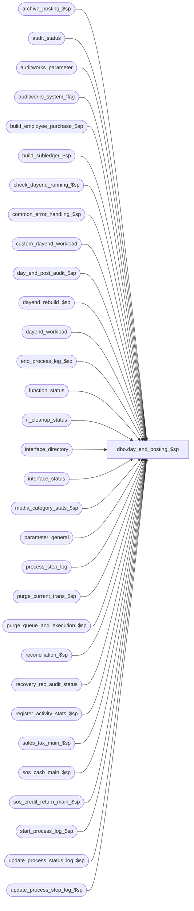

# dbo.day_end_posting_$sp

**Database:** auditworks  
**Server:** bedrockdb01  

## Architecture Diagram



## Table Dependencies

| Referenced Table |
|---|
| archive_posting_$sp |
| audit_status |
| auditworks_parameter |
| auditworks_system_flag |
| build_employee_purchase_$sp |
| build_subledger_$sp |
| check_dayend_running_$sp |
| common_error_handling_$sp |
| custom_dayend_workload |
| day_end_post_audit_$sp |
| dayend_rebuild_$sp |
| dayend_workload |
| end_process_log_$sp |
| function_status |
| if_cleanup_status |
| interface_directory |
| interface_status |
| media_category_stats_$sp |
| parameter_general |
| process_step_log |
| purge_current_trans_$sp |
| purge_queue_and_execution_$sp |
| reconciliation_$sp |
| recovery_rec_audit_status |
| register_activity_stats_$sp |
| sales_tax_main_$sp |
| sos_cash_main_$sp |
| sos_credit_return_main_$sp |
| start_process_log_$sp |
| update_process_status_log_$sp |
| update_process_step_log_$sp |

## Stored Procedure Code

```sql
CREATE proc [dbo].[day_end_posting_$sp] 
( @dayend_process_id 		tinyint = NULL )

AS

/* 
PROC NAME: day_end_posting_$sp
     DESC: Nightly-run day end main procedure which calls
 	   sub_procedures to move transactions from accepted store-date
 	   to interface and archive tables and remove from the active transaction tables.
 	   Called from smartload script dayend.ict in ICT_DAYENDxx

HISTORY
Date     Name         Def# Desc
May01,15 Phu        120170 Avoid deadlock when selecting from audit_status.
Jan30,14 Paul       148739 Use try .. catch, use set nocount on, ported 138282 from Oracle.
                    138282 Multistream dayend purge: allow streams > 1 to call purge_current_trans_$sp.
Dec01,11 Vicci      131496 Correct custom dayend workload insert to occur if export_format is greater than 1 too (not just 1);
                           Also, update interface status for custom interfaces so as to cause immediate_posting_requested to be set if auto_set_posting_request is on.
Oct10,10 Vicci      121621 Don't set dayend completion datetime if dayend is about to loop around for another batch of store/dates.
Jun16,10 Paul     1-44YOPF Attempt to clean up any halted media rec 70 entries for those store-dates that the dayend is
			   currently processing. Those halts may have occurred due to the dayend having locked the store-dates.
May25,10 Vicci      117359 Correct expected work-load logged to process step log for step 44 (rebuild requests).
Feb23,10 Paul       116195 Log only start and end of waiting period (if any) to smartload log
Jan13,09 Paul       107351 set ansi_warnings on to support scaleout
Jan22,08 Paul        94350 Uplift 1-3UWW8X to SA5
Sep17,07 Phu         91846 Remove unnecessary wait.
Feb01,07 Paul        82449 Log successful completion to auditworks_system_flag
Nov22,05 Paul      DV-1324 don't run dayend if period_end_only was requested in gui
Oct07,04 David     DV-1146 use user_id.
May07,04 Maryam    DV-1071 Pass @process_id to the sub procs.
Nov15,07 Phu      1-3UWW8X Remove unnecessary wait.
Sep19,03 Maryam      13686 Add system abort logic to dayend.
May08,02 Winnie    1-C2Q5L Add abort logic to dayend.
Apr23,02 Phu       1-CKO55 Set completed_workload, expected_workload, completed_flag to 1 when D.E. finishes.
                           Continue to run next proc if there is a warning error
Mar05,02 Paul      1-AWYZP remove obsolete loss prevention logic
Nov30,01 Phu          8931 Progress monitor and error handling
Jul20,01 Henry        8286 Modify cleanup logic to work correctly with multi-stream dayend.
			   Replaces Defects 7493 and 8285 in Oracle.
May14,01 Maryam       7444 Call dayend_rebuild_$sp procedure.
Mar09,01 DavidM       7554 Re-sequence the order of the dayend.  The purging of the current
                           and archive transactions will now be called separately from the
                           smartload via the dayend_housekeeping_$sp procedure.
Mar08,01 Phu          7501 Use system function to retrieve user name
Jan30,01 Paul         7272 changed log message for compatibility with new smartload
Oct06,00 Paul         6820 Ensure @transaction_count is not null
Sep18,00 Maryam       6725 Modified dayend to execute Post-Audit IF posting prior to
			    Tax posting and Tax posting Prior to Subledger Posting.
Sep12,00 Shapoor      6663 Facilitate Multi Stream Dayend.
Jul13,00 Maryam       4743 Log the process# 18 into the process_log. 
Jan11,00 Paul         5789 Remove @@transtate logic
Jan05,00 Phu          5779 Add description/trace when each proc of dayend begins
Jun23,99 Sab          4796 Add logic to cleanup posted if tables using Ex_Queue
Jun23,99 Vicci de T   4947 add dayend_date to custom_dayend_workload 
Jun07,99 Daphna F     4807 to complete fix for defect 4531
May07,99 Daphna F     4531 remove old architecture LP module
Apr20,99 Mat C        4460 Don't verify process_error_log for error_code = 201612
Mar24,99 Paul S       4352 Add module for data feed to LP Db (new architecture)
May19,98 Daphna F     n/a  Add old architecture LP module
Apr28,98 Phu	      n/a  Author version 1.13 Multi-stream

*/

DECLARE
	@abort_flag				tinyint,
	@ascii_export				tinyint,
	@current_date_time			datetime,
	@current_db_name				varchar(25),
	@activity_minute_interval			smallint,
	@current_stream_running			int,
	@current_stream_name			varbinary(128),
	@cursor_open				tinyint,
	@dayend_date				datetime,
	@dayend_in_progress			tinyint,
	@db_id					int,
	@errmsg 					nvarchar(2000),
	@errmsg2					nvarchar(2000),
	@errmsg3					nvarchar(2000),
	@errline					int,
	@errno					int,
	@excluded_dayend_from_time			int,
	@excluded_dayend_to_time			int,
	@function_no 				tinyint,
	@interface_id 				tinyint,
	@message_id				int,
	@object_name				nvarchar(255),
	@operation_name				nvarchar(100),
	@process_log_entry 			tinyint,
	@loop_counter				int,
	@other_streams_running			int,
	@process_name				nvarchar(100),
	@process_no 				smallint, 
	@period_end_only				int,
	@process_timestamp 			float,
	@process_id				binary(16),
	@recover_process_id			int,
	@rec_process_id				numeric(12,0),
	@row_count				int,
	@sleep_counter				int,
	@smartview_cleanup			tinyint,
	@step_no					int,
	@stream_running				tinyint,
	@total_store_dates			int,
	@trace_msg				nvarchar(255),
	@transaction_count 			numeric(12,0),
	@truncate_flag				tinyint,
	@update_timing 				smallint,
	@user_id					int,
	@user_name 				varchar(50),
	@immediate_dayend_requested		tinyint;
      
IF @dayend_process_id IS NULL /* then */
  RETURN;

SET NOCOUNT ON;

-- required for scaleout environment
SET ANSI_NULLS ON;
SET ANSI_WARNINGS ON;

SELECT	@user_name = suser_sname(),
	@process_id = @@spid,
	@current_stream_running = 0,
	@stream_running = 0,
	@other_streams_running = 0,
	@function_no = 18,
	@message_id = 201068,
	@process_name = 'day_end_posting_$sp',
	@process_no = 18,
	@transaction_count = 0,
	@abort_flag = 0,
	@period_end_only = 0,
	@loop_counter = 0,
	@sleep_counter = 0,
	@user_id = -1,
	@current_db_name = db_name();

BEGIN TRY

   SELECT @errmsg = 'Failed to read period_end_only flag',
             @object_name = 'auditworks_system_flag',
             @operation_name = 'SELECT';
SELECT @period_end_only = CONVERT(int,flag_numeric_value)
  FROM auditworks_system_flag
 WHERE flag_name = 'period_end_only';

IF @period_end_only = 1
  RETURN; -- avoid running dayend if user requested only period end

WAITFOR DELAY '0:0:15'; -- allow 15 second delay for multistream dayend to start all streams

--Check to see if any dayend for the current stream is running.
--This also does a SET CONTEXT_INFO
    SELECT @errmsg = 'Unable to execute procedure check_dayend_running_$sp',
            @object_name = 'check_dayend_running_$sp',
	   @operation_name = 'EXECUTE';
EXEC check_dayend_running_$sp @process_id, @dayend_process_id, 1, @current_stream_running OUTPUT;  

SELECT @trace_msg = ':LOG => @current_stream_running: ' + CONVERT(CHAR, @current_stream_running, 1) + ' ' + @user_name;
PRINT @trace_msg;

IF @current_stream_running = 1
  BEGIN
    SELECT @trace_msg = ':LOG EXECWARN: Aborting because previous dayend is still running for this stream. ' + CONVERT(CHAR, getdate(), 8);
    PRINT @trace_msg;
    RETURN;
  END;

SELECT @trace_msg = ':LOG => day_end_posting_$sp begins at: ' + CONVERT(CHAR, getdate(), 8);
PRINT @trace_msg;

SELECT @truncate_flag = 1; -- always 1 since dayend runs only in background

SELECT @current_date_time = getdate(), @step_no = 0;

   SELECT @errmsg = 'Failed to execute stored proc update_process_step_log_$sp to initialize process_step_log',
          @object_name = 'update_process_step_log_$sp',
	  @operation_name = 'EXECUTE';
EXEC update_process_step_log_$sp @process_no, @dayend_process_id, @step_no, @total_store_dates, 0, @current_date_time;

-- The following block is only executed by STREAM 1

IF @dayend_process_id = 1
BEGIN
        SELECT @errmsg = 'Unable to update function_status',
	       @object_name = 'function_status',
	       @operation_name = 'UPDATE';
    UPDATE function_status
       SET process_id = @process_id
     WHERE function_no = @function_no;

-- Purge transactions from interface tables that have already been posted by all applicable 
-- interfaces (interface_control_flag = 50)

SELECT @smartview_cleanup = smartview_cleanup
  FROM if_cleanup_status;
	
IF @smartview_cleanup = 0
  BEGIN
    SELECT @trace_msg = ':LOG ==> purge_queue_and_execution_$sp begins at: ' + CONVERT(CHAR, getdate(), 8);
     PRINT @trace_msg;

    SELECT @current_date_time = getdate(), @step_no = 71;
        
    EXEC update_process_step_log_$sp @process_no, @dayend_process_id, @step_no, 1, 0, @current_date_time;

    BEGIN TRY
      EXEC purge_queue_and_execution_$sp @process_id;
    END TRY
    BEGIN CATCH;
	SELECT @errno = ERROR_NUMBER();
	    IF @errno != 0 AND @errno != 201613
	    BEGIN
	      SELECT @errmsg = 'Failed to execute stored procedure purge_queue_and_execution_$sp',
	              @object_name = 'purge_queue_and_execution_$sp',
		     @operation_name = 'EXECUTE';
	      GOTO business_error;
	    END;
    END CATCH;
  END; -- IF @smartview_cleanup = 0

  END; --IF @dayend_process_id = 1

--Log entry to process log
      SELECT @errmsg = 'Failed to execute start_process_log_$sp.',
            @object_name = 'start_process_log_$sp',
	   @operation_name = 'EXECUTE';
EXEC start_process_log_$sp @process_no, @process_timestamp OUTPUT,
	@errmsg3 OUTPUT, @dayend_process_id;

SELECT @process_log_entry = 1;

    SELECT @errmsg = 'Failed to select from audit_status.',
	   @object_name = 'audit_status',
	   @operation_name = 'SELECT';
SELECT @transaction_count = SUM (valid_qty)
  FROM audit_status WITH (NOLOCK)
 WHERE audit_status >= 300
   AND audit_status <= 399; 

	SELECT @errmsg = 'Unable to select activity_minute_interval from parameter_general',
	       @object_name = 'parameter_general';
SELECT @activity_minute_interval = activity_minute_interval,
       @immediate_dayend_requested = immediate_dayend_requested
  FROM parameter_general;

	SELECT @errmsg = 'Unable to select count from dayend_workload',
	       @object_name = 'dayend_workload';
SELECT @total_store_dates = COUNT(dayend_process_id)
FROM dayend_workload
WHERE dayend_process_id = @dayend_process_id;

    SELECT @errmsg = 'Failed to select excluded_dayend_from_time from auditworks_parameter',
           @object_name = 'excluded_dayend_from_time';
SELECT @excluded_dayend_from_time = CONVERT(int, par_value)
  FROM auditworks_parameter
 WHERE par_name = 'excluded_dayend_from_time';

    SELECT @errmsg = 'Failed to select excluded_dayend_to_time from auditworks_parameter',
           @object_name = 'excluded_dayend_to_time';
SELECT @excluded_dayend_to_time = CONVERT(int, par_value)
  FROM auditworks_parameter
 WHERE par_name = 'excluded_dayend_to_time';

-- Set status from 301 to 310 : Post transactions to post-audit interfaces
SELECT @trace_msg = ':LOG ==> day_end_post_audit_$sp begins at: ' + CONVERT(CHAR, getdate(), 8);
PRINT @trace_msg;

SELECT @current_date_time = getdate(), @step_no = 35;

   SELECT @errmsg = 'Failed to execute stored proc update_process_step_log_$sp for step ' + CONVERT(varchar, @step_no),
           @object_name = 'update_process_step_log_$sp',
	  @operation_name = 'EXECUTE';
EXEC update_process_step_log_$sp @process_no, @dayend_process_id, @step_no, @total_store_dates, NULL, @current_date_time;

    SELECT @errmsg = 'Failed to execute stored procedure day_end_post_audit_$sp',
            @object_name = 'day_end_post_audit_$sp',
	   @operation_name = 'EXECUTE';
EXEC day_end_post_audit_$sp @process_id, @dayend_process_id, @errmsg3 OUTPUT , @excluded_dayend_from_time, @excluded_dayend_to_time;

     SELECT @errmsg = 'Failed to execute stored proc update_process_status_log_$sp',
           @object_name = 'update_process_status_log_$sp',
	  @operation_name = 'EXECUTE';
EXEC update_process_status_log_$sp @process_no, NULL, NULL;

-- Set status from 310 to 320 : Sales Tax Posting 
SELECT @trace_msg = ':LOG ==> sales_tax_main_$sp begins at: ' + CONVERT(CHAR, getdate(), 8);
PRINT @trace_msg;

SELECT @current_date_time = getdate(), @step_no = 36;

     SELECT @errmsg = 'Failed to execute stored proc update_process_step_log_$sp for step ' + CONVERT(varchar, @step_no),
           @object_name = 'update_process_step_log_$sp',
	  @operation_name = 'EXECUTE';
EXEC update_process_step_log_$sp @process_no, @dayend_process_id, @step_no, @total_store_dates, NULL, @current_date_time

     SELECT @errmsg = 'Failed to execute stored procedure sales_tax_main_$sp',
           @object_name = 'sales_tax_main_$sp',
	  @operation_name = 'EXECUTE';
EXEC sales_tax_main_$sp @process_id, @dayend_process_id, @errmsg3 OUTPUT,0, @excluded_dayend_from_time, @excluded_dayend_to_time;


     SELECT @errmsg = 'Failed to execute stored proc update_process_status_log_$sp',
        @object_name = 'update_process_status_log_$sp',
        @operation_name = 'EXECUTE';
EXEC update_process_status_log_$sp @process_no, NULL, NULL;


-- Set status from 320 to 305 : Subledger Posting
SELECT @trace_msg = ':LOG ==> build_subledger_$sp begins at: ' + CONVERT(CHAR, getdate(), 8);
PRINT @trace_msg;

SELECT @current_date_time = getdate(), @step_no = 37;

     SELECT @errmsg = 'Failed to execute stored proc update_process_step_log_$sp for step ' + CONVERT(varchar, @step_no),
           @object_name = 'update_process_step_log_$sp',
	  @operation_name = 'EXECUTE';
EXEC update_process_step_log_$sp @process_no, @dayend_process_id, @step_no, @total_store_dates, NULL, @current_date_time;

      SELECT @errmsg = 'Failed to execute stored procedure build_subledger_$sp',
            @object_name = 'build_subledger_$sp',
	   @operation_name = 'EXECUTE';
EXEC build_subledger_$sp @process_id, @truncate_flag, @dayend_process_id, @errmsg3 OUTPUT,0, @excluded_dayend_from_time, @excluded_dayend_to_time;

     SELECT @errmsg = 'Failed to execute stored proc update_process_status_log_$sp',
           @object_name = 'update_process_status_log_$sp',
	  @operation_name = 'EXECUTE';
EXEC update_process_status_log_$sp @process_no, NULL, NULL;


-- Set status from 305 to 330 : Employee Purchase Posting
SELECT @trace_msg = ':LOG ==> build_employee_purchase_$sp begins at: ' + CONVERT(CHAR, getdate(), 8);
PRINT @trace_msg;

SELECT @current_date_time = getdate(), @step_no = 38;

     SELECT @errmsg = 'Failed to execute stored proc update_process_step_log_$sp for step ' + CONVERT(varchar, @step_no),
           @object_name = 'update_process_step_log_$sp',
	  @operation_name = 'EXECUTE';
EXEC update_process_step_log_$sp @process_no, @dayend_process_id, @step_no, @total_store_dates, NULL, @current_date_time

      SELECT @errmsg = 'Failed to execute stored procedure build_employee_purchase_$sp',
             @object_name = 'build_employee_purchase_$sp',
             @operation_name = 'EXECUTE';
EXEC build_employee_purchase_$sp @process_id, @truncate_flag, @dayend_process_id, @errmsg3 OUTPUT, @excluded_dayend_from_time, @excluded_dayend_to_time;

     SELECT @errmsg = 'Failed to execute stored proc update_process_status_log_$sp',
           @object_name = 'update_process_status_log_$sp',
	  @operation_name = 'EXECUTE';
EXEC update_process_status_log_$sp @process_no, NULL, NULL;


-- Set status from 330 to 335 : Media Category Statistics Posting
SELECT @trace_msg = ':LOG ==> media_category_stats_$sp begins at: ' + CONVERT(CHAR, getdate(), 8);
PRINT @trace_msg;

SELECT @current_date_time = getdate(), @step_no = 39;

     SELECT @errmsg = 'Failed to execute stored proc update_process_step_log_$sp for step ' + CONVERT(varchar, @step_no),
           @object_name = 'update_process_step_log_$sp',
	  @operation_name = 'EXECUTE';
EXEC update_process_step_log_$sp @process_no, @dayend_process_id, @step_no, @total_store_dates, NULL, @current_date_time


      SELECT @errmsg = 'Failed to execute stored procedure media_category_stats_$sp',
            @object_name = 'media_category_stats_$sp',
	   @operation_name = 'EXECUTE';
EXEC media_category_stats_$sp @process_id, @truncate_flag, @dayend_process_id, @errmsg3 OUTPUT, @excluded_dayend_from_time, @excluded_dayend_to_time;

     SELECT @errmsg = 'Failed to execute stored proc update_process_status_log_$sp',
           @object_name = 'update_process_status_log_$sp',
	  @operation_name = 'EXECUTE';
EXEC update_process_status_log_$sp @process_no, NULL, NULL;


-- Set status from 335 to 340 : SOS Cash Posting
SELECT @trace_msg = ':LOG ==> sos_cash_main_$sp begins at: ' + CONVERT(CHAR, getdate(), 8);
PRINT @trace_msg;

SELECT @current_date_time = getdate(), @step_no = 40;

     SELECT @errmsg = 'Failed to execute stored proc update_process_step_log_$sp for step ' + CONVERT(varchar, @step_no),
           @object_name = 'update_process_step_log_$sp',
	  @operation_name = 'EXECUTE';
EXEC update_process_step_log_$sp @process_no, @dayend_process_id, @step_no, @total_store_dates, NULL, @current_date_time;

      SELECT @errmsg = 'Failed to execute stored procedure sos_cash_main_$sp',
           @object_name = 'sos_cash_main_$sp',
           @operation_name = 'EXECUTE';
EXEC sos_cash_main_$sp @process_id, @dayend_process_id, @errmsg3 OUTPUT, @excluded_dayend_from_time, @excluded_dayend_to_time;

     SELECT @errmsg = 'Failed to execute stored proc update_process_status_log_$sp',
           @object_name = 'update_process_status_log_$sp',
	  @operation_name = 'EXECUTE';
EXEC update_process_status_log_$sp @process_no, NULL, NULL;


-- Set status from 340 to 350 : SOS Credit Return Posting
SELECT @trace_msg = ':LOG ==> sos_credit_return_main_$sp begins at: ' + CONVERT(CHAR, getdate(), 8);
PRINT @trace_msg;

SELECT @current_date_time = getdate(), @step_no = 41;

     SELECT @errmsg = 'Failed to execute stored proc update_process_step_log_$sp for step ' + CONVERT(varchar, @step_no),
           @object_name = 'update_process_step_log_$sp',
	  @operation_name = 'EXECUTE';
EXEC update_process_step_log_$sp @process_no, @dayend_process_id, @step_no, @total_store_dates, NULL, @current_date_time;

      SELECT @errmsg = 'Failed to execute stored procedure sos_credit_return_main_$sp',
            @object_name = 'sos_credit_return_main_$sp',
	   @operation_name = 'EXECUTE';
EXEC sos_credit_return_main_$sp @process_id, @dayend_process_id, @errmsg3 OUTPUT, @excluded_dayend_from_time, @excluded_dayend_to_time;

     SELECT @errmsg = 'Failed to execute stored proc update_process_status_log_$sp',
           @object_name = 'update_process_status_log_$sp',
	  @operation_name = 'EXECUTE';
EXEC update_process_status_log_$sp @process_no, NULL, NULL;


-- Set status from 350 to 355 : Register Activity Statistics Posting
SELECT @trace_msg = ':LOG ==> register_activity_stats_$sp begins at: ' + CONVERT(CHAR, getdate(), 8);
PRINT @trace_msg;

SELECT @current_date_time = getdate(), @step_no = 42;

      SELECT @errmsg = 'Failed to execute stored proc update_process_step_log_$sp for step ' + CONVERT(varchar, @step_no),
            @object_name = 'update_process_step_log_$sp',
	   @operation_name = 'EXECUTE';
EXEC update_process_step_log_$sp @process_no, @dayend_process_id, @step_no, @total_store_dates, NULL, @current_date_time;

      SELECT @errmsg = 'Failed to execute stored procedure register_activity_stats_$sp',
            @object_name = 'register_activity_stats_$sp',
	   @operation_name = 'EXECUTE';
EXEC register_activity_stats_$sp @process_id, @dayend_process_id, @errmsg3 OUTPUT, @excluded_dayend_from_time, @excluded_dayend_to_time;

      SELECT @errmsg = 'Failed to execute stored proc update_process_status_log_$sp',
            @object_name = 'update_process_status_log_$sp',
	   @operation_name = 'EXECUTE';
EXEC update_process_status_log_$sp @process_no, NULL, NULL;


SELECT @interface_id = 22;  --Register Activity Stats

   SELECT @errmsg = 'Unable to select interface_id = 22 from interface_directory.',
	  @object_name = 'interface_directory',
	  @operation_name = 'SELECT';
SELECT @update_timing = update_timing,
       @ascii_export = ascii_export
  FROM interface_directory
 WHERE interface_id = @interface_id;

SELECT @dayend_date = getdate(),
	@row_count = 0;

IF @ascii_export = 1 AND @update_timing > 0  AND @activity_minute_interval = 60
  BEGIN 
	SELECT @trace_msg = ':LOG ==> populate table custom_dayend_workload (1) begins at: ' + CONVERT(CHAR, getdate(), 8);
	PRINT @trace_msg;

	    SELECT @errmsg = 'Failed to insert into custom_dayend_workload (1)',
		   @object_name = 'custom_dayend_workload',
		   @operation_name = 'INSERT';
	INSERT custom_dayend_workload (
		interface_id,
		store_no,
		sales_date,
		register_no,
		dayend_date )
	SELECT
		@interface_id,
		a.store_no,
		a.sales_date,
		a.register_no,
                @dayend_date
	FROM dayend_workload d, audit_status a
	WHERE d.dayend_process_id = @dayend_process_id
	AND d.store_audit_status = 355
	AND d.store_audit_status = a.audit_status
	AND d.store_no = a.store_no
	AND d.sales_date = a.sales_date
	AND NOT EXISTS (SELECT 1
			FROM custom_dayend_workload
			WHERE interface_id = @interface_id
			AND store_no = d.store_no
			AND sales_date = d.sales_date );

	SELECT @row_count = @@rowcount;

  END; -- IF @ascii_export = 1 AND @update_timing > 0  AND @activity_minute_interval = 60

/* Standardized custom_dayend control : set flag for those store_date whose status = 355 */

SELECT @trace_msg = ':LOG ==> populate table custom_dayend_workload (2) begins at: ' + CONVERT(CHAR, getdate(), 8);
PRINT @trace_msg;

   SELECT @errmsg = 'Failed to insert into custom_dayend_workload (2)',
	 @object_name = 'custom_dayend_workload',
	 @operation_name = 'INSERT';
INSERT custom_dayend_workload (
	interface_id,
	store_no,
	sales_date,
	register_no,
        dayend_date )
SELECT id.interface_id, a.store_no, a.sales_date, a.register_no, @dayend_date 
  FROM interface_directory id, dayend_workload dw, audit_status a
 WHERE id.interface_id > 49
   AND id.update_timing = 3  --Day-End update
   AND id.ascii_export >= 1
   AND dw.store_no = a.store_no
   AND dw.sales_date = a.sales_date
   AND dw.store_audit_status = a.audit_status
   AND dw.store_audit_status = 355
   AND NOT EXISTS ( SELECT 1 FROM custom_dayend_workload c
                            WHERE c.interface_id = id.interface_id
                              AND c.store_no = dw.store_no
                              AND c.sales_date = dw.sales_date);

SELECT @row_count = @row_count + @@rowcount;

IF @row_count > 0 --i.e. custom dayend workload entries were made
BEGIN 
  IF NOT EXISTS (SELECT 1 FROM dayend_workload WHERE store_audit_status < 355)  --i.e. if other streams are finished too
   BEGIN 
       SELECT @errmsg = 'Failed to mark dayend as finished feeding interface and it having data available for it.',
    	     @object_name = 'interface_status',
	     @operation_name = 'UPDATE';
    UPDATE interface_status
       SET last_posting_datetime = @dayend_date, --will cause immediate_posting_requested to be set if auto_set_posting_request is on
           posting_in_progress = 2		
     WHERE interface_id IN (SELECT id.interface_id
                              FROM interface_directory id
                             WHERE id.interface_id > 49
    		               AND id.update_timing = 3  --Day-End update
			       AND id.ascii_export >= 1);

   END;
  ELSE
   BEGIN
       SELECT @errmsg = 'Failed to mark interface as having data available for it.',
    	     @object_name = 'interface_status',
	     @operation_name = 'UPDATE';
    UPDATE interface_status
       SET last_posting_datetime = @dayend_date	--will cause immediate_posting_requested to be set if auto_set_posting_request is on in trickle-style
     WHERE interface_id IN (SELECT id.interface_id
                              FROM interface_directory id
                             WHERE id.interface_id > 49
  		               AND id.update_timing = 3  --Day-End update
			       AND id.ascii_export >= 1);
   END;			     
END;  --IF @row_count > 0, i.e. custom dayend workload entries were made                   

  /*  Attempt to clean up any remaining halted media rec 70 entries for those store-dates that the dayend is
      currently processing. Those halts may have occurred due to the dayend having locked the store-dates
      while the edit was trying to add additional transactions to them (timing scenarios).
      The intent is to minimize the chance of having any remaining halted media rec in the morning since 
      dayend often finishes after edit phase2 has attempted media rec recovery.
      Must do this before archive_posting_$sp because that proc clears out table dayend_workload. */


  /* cursor for recovering halted media rec (function 70) for the edit and other functions
     that halted due to store-dates having been previously locked by dayend. */


  IF @dayend_process_id = 1 -- THEN
    BEGIN
	       SELECT @errmsg = 'Failed to open cursor recover_media_rec_crsr',
	  	      @object_name = 'recover_media_rec_crsr',
		      @operation_name = 'OPEN';

	DECLARE recover_media_rec_crsr CURSOR FAST_FORWARD
	FOR
	SELECT DISTINCT r.rec_process_id, r.process_id
	  FROM recovery_rec_audit_status r
	 WHERE r.posting_date_time IS NOT NULL  --to avoid recovering ancient issues
           AND (r.rec_process_id NOT IN (SELECT rec_process_id
                                        FROM function_status
                                       WHERE function_no = 70)
                OR COALESCE(r.locked_by_edit, 0) <> 0)
           AND r.posting_date_time < DATEADD(mi,-10,getdate()) -- exclude entries from last 10 min (safety)
	  AND EXISTS( SELECT 1 FROM dayend_workload d
	  	WHERE r.store_no = d.store_no
	  	  AND r.transaction_date = d.sales_date);

	OPEN recover_media_rec_crsr;
	SELECT @cursor_open = 1;

	WHILE 3=3
	BEGIN
	  FETCH recover_media_rec_crsr INTO
	      @rec_process_id, @recover_process_id;

	  IF @@fetch_status <> 0
	    BREAK;

	  SELECT @loop_counter = @loop_counter + 1;
	  IF @loop_counter = 1
	    BEGIN
	     SELECT @trace_msg = ':LOG ==> Dayend Media Rec Recovery begins at: ' + CONVERT(CHAR, getdate(), 8);
	     PRINT @trace_msg;
	    END;

	         SELECT @errmsg = 'Failed to recover rec_process_id = ' + CONVERT(varchar, @rec_process_id),
	                @object_name = 'reconciliation_$sp',
	                @operation_name = 'EXECUTE';
	  EXEC reconciliation_$sp 70, @recover_process_id, @rec_process_id,
	          40, @errmsg3 OUTPUT, @user_id;
              
	END; -- WHILE 3=3 	
     
	CLOSE recover_media_rec_crsr;
	DEALLOCATE recover_media_rec_crsr;
	SELECT @cursor_open = 0;

  END; -- If @dayend_process_id = 1 (media rec)

                           
-- Set status from 355 to 400 :  Posting from Current to Archive tables
SELECT @trace_msg = ':LOG ==> archive_posting_$sp begins at: ' + CONVERT(CHAR, getdate(), 8);
PRINT @trace_msg;

SELECT @current_date_time = getdate(), @step_no = 43;

      SELECT @errmsg = 'Failed to execute stored proc update_process_step_log_$sp for step ' + CONVERT(varchar, @step_no),
            @object_name = 'update_process_step_log_$sp',
	   @operation_name = 'EXECUTE';
EXEC update_process_step_log_$sp @process_no, @dayend_process_id, @step_no, @total_store_dates, NULL, @current_date_time;

      SELECT @errmsg = 'Failed to execute stored procedure archive_posting_$sp',
            @object_name = 'archive_posting_$sp',
	   @operation_name = 'EXECUTE';
EXEC archive_posting_$sp @process_id, @truncate_flag, @dayend_process_id, @errmsg3 OUTPUT, @excluded_dayend_from_time, @excluded_dayend_to_time;

     SELECT @errmsg = 'Failed to execute stored proc update_process_status_log_$sp',
           @object_name = 'update_process_status_log_$sp',
	  @operation_name = 'EXECUTE';
EXEC update_process_status_log_$sp @process_no, NULL, NULL;


IF @dayend_process_id = 1
BEGIN
  SELECT @trace_msg = ':LOG ==> dayend_rebuild_$sp begins at: ' + CONVERT(CHAR, getdate(), 8);
  PRINT @trace_msg;

  SELECT @current_date_time = getdate(), @step_no = 44;

      SELECT @errmsg = 'Failed to execute stored proc update_process_step_log_$sp for step ' + CONVERT(varchar, @step_no),
            @object_name = 'update_process_step_log_$sp',
	   @operation_name = 'EXECUTE';
  EXEC update_process_step_log_$sp @process_no, @dayend_process_id, @step_no, NULL, NULL, @current_date_time;

      SELECT @errmsg = 'Failed to execute stored procedure dayend_rebuild_$sp',
            @object_name = 'dayend_rebuild_$sp',
	   @operation_name = 'EXECUTE';
  EXEC dayend_rebuild_$sp @process_id, @truncate_flag, @dayend_process_id, @errmsg3 OUTPUT;

      SELECT @errmsg = 'Failed to execute stored proc update_process_status_log_$sp',
            @object_name = 'update_process_status_log_$sp',
	   @operation_name = 'EXECUTE';
  EXEC update_process_status_log_$sp @process_no, 1, 1, 1;

END; -- IF @dayend_process_id = 1


IF @dayend_process_id > 1
  BEGIN
        SELECT @errmsg = 'Failed to delete process_step_log',
	       @object_name = 'process_step_log',
	       @operation_name = 'DELETE';
    DELETE FROM process_step_log
    WHERE process_no = @process_no
      AND stream_no = @dayend_process_id;

      SELECT @errmsg = 'Failed to execute stored procedure end_process_log_$sp',
             @object_name = 'end_process_log_$sp',
	     @operation_name = 'EXECUTE';
    EXEC end_process_log_$sp @process_no, @process_timestamp, @transaction_count, @dayend_process_id;

    SELECT @trace_msg = ':LOG ==> day_end_posting_$sp For Stream ' + CONVERT(varchar(3),@dayend_process_id)
           + 'Completed Normally: ' + CONVERT(CHAR, getdate(), 8);
    PRINT @trace_msg;

    /* Multistream purge: Cleanup expired trans for current stream. Dayend Housekeeping handles purge for stream 1. */

    SELECT @trace_msg = ':LOG => Dayend Purge For Stream ' + CONVERT(varchar(3),@dayend_process_id) + ' started at '
        + CONVERT(CHAR, getdate(), 8);
    PRINT @trace_msg;

      SELECT @errmsg = 'Failed to execute SET CONTEXT_INFO',
             @object_name = 'SET CONTEXT_INFO',
	     @operation_name = 'EXECUTE';
    SELECT @current_stream_name = CONVERT(varbinary(128), 'auditworks_purge' + CONVERT(varchar, @dayend_process_id));

      /* turn off dayend posting in progress indicator to allow stream 1 posting to avoid waiting for purge on other streams */
    SET CONTEXT_INFO @current_stream_name;

      /* check for dayend purge still running for current stream on a different spid (long running dayend) */

    SELECT @errmsg         = 'Failed to select from master..sysprocesses',
         @object_name    = 'master..sysprocesses',
         @operation_name = 'SELECT';

    SELECT @db_id = dbid -- dbid of current db
      FROM master..sysprocesses
     WHERE spid = @@spid;

    /* check for dayend purge still running for current stream on a different spid (long running dayend) in same db */

    IF EXISTS (SELECT 1
		 FROM master..sysprocesses
		WHERE context_info = @current_stream_name
		  AND spid <> @@spid
		  AND dbid = @db_id
		  AND db_name(dbid) = @current_db_name)
	SELECT @stream_running = 1;


      SELECT @errmsg = 'Failed to execute purge_current_trans_$sp',
             @object_name = 'purge_current_trans_$sp',
	     @operation_name = 'EXECUTE';

    IF @stream_running = 0 -- THEN
      BEGIN
	  EXEC start_process_log_$sp 16, @process_timestamp, @errmsg, @dayend_process_id;

	  EXEC purge_current_trans_$sp @dayend_process_id, @process_timestamp;
      END;
    ELSE
      BEGIN	  /* If a previous multistream purge is still running for this stream due to a long-running dayend,
	      then avoid possible delete contention by not starting another purge for this stream now.
	      The next dayend for this stream will resume the multistream purge. */
         SELECT @trace_msg = ':LOG => WARNING: A previous dayend purge is still running. :  ' + CONVERT(CHAR, getdate(), 8);
         PRINT @trace_msg;

         RETURN;
      END;

    -- All streams except Stream 1 EXIT at this point.
    RETURN;
  END;  -- IF @dayend_process_id > 1


/* The following logic is executed only by Stream 1.
   Stream 1 will loop and wait until all other streams have finished dayend posting before starting housekeeping.
*/

SELECT @errmsg = 'Unable to execute procedure check_dayend_running_$sp for other streams',
               @object_name = 'check_dayend_running_$sp',
               @operation_name = 'EXECUTE';

WHILE 1 = 1
  BEGIN

    SELECT @other_streams_running = 0;

    --Check to see if dayend for any other stream(s) is still running.

    EXEC check_dayend_running_$sp @process_id, @dayend_process_id, 2, @other_streams_running OUTPUT;

    IF @other_streams_running = 0
      BREAK;

    SELECT @sleep_counter = @sleep_counter + 1;

    IF @sleep_counter = 1
      BEGIN
	SELECT @trace_msg = ':LOG ==> Start of wait for other streams in DAYEND POSTING : ' + CONVERT(CHAR, getdate(), 8);
	PRINT @trace_msg;
      END; 

    WAITFOR DELAY '0:03:00'; -- 180 seconds sleep cycle

  END; -- WHILE 1=1

  IF @sleep_counter > 0
    BEGIN
	SELECT @trace_msg = ':LOG ==> End of wait for other streams in DAYEND POSTING : ' + CONVERT(CHAR, getdate(), 8);
	PRINT @trace_msg;
    END;

--Process Log and smartload qlog entry for stream 1

IF @process_log_entry = 1
BEGIN
      SELECT @errmsg = 'Unable to execute procedure end_process_log_$sp',
             @object_name = 'end_process_log_$sp',
	     @operation_name = 'EXECUTE';
  EXEC end_process_log_$sp @process_no, @process_timestamp, @transaction_count;
END;

SELECT @trace_msg = ':LOG => Dayend Posting For Stream 1 Completed Normally. ' + CONVERT(CHAR, getdate(), 8);
PRINT @trace_msg;

IF @dayend_process_id = 1 AND @immediate_dayend_requested <> 9  --i.e. not about to loop around for the next batch of store/dates
BEGIN
    SELECT @errmsg = 'Unable to update auditworks_system_flag',
           @object_name = 'auditworks_system_flag',
           @operation_name = 'UPDATE';
  UPDATE auditworks_system_flag
     SET flag_datetime_value = getdate()
   WHERE flag_name = 'day_end_completed_date';
END;

--function_status row will get removed by dayend_housekeeping_$sp.

RETURN;


business_error:   /* Business Rule handler. */

	SELECT @errmsg2 = @errmsg;

	/* Could include similar cleanup code to system error trap when needed (example is from move_store_$sp).
	   However, could also exclude the cleanup code here since the outer system error catch should fire again after the exec below. */

	EXEC common_error_handling_$sp @process_no, @errno, @errmsg, @abort_flag, @message_id, 
	  @process_name, @object_name, @operation_name, 1, @dayend_process_id, @process_log_entry, 
	  @process_timestamp, @transaction_count;
	  /* Note: when the exec above raises an error, that action also fires the system error trap (below) */
	RETURN;
END TRY

BEGIN CATCH; -- trap system errors
    /* common error handling. Appending proc name here because a rollback could occur if called within a transaction. */

        SELECT @errno = ERROR_NUMBER(),
		@errline = ERROR_LINE();

        SELECT @errmsg = CONVERT(nvarchar, @errno) + ':' + @process_name + ':' + CONVERT(nvarchar, @errline) + ':'
               + COALESCE(@errmsg, ' ') + ':' + ERROR_MESSAGE();

	 /* this condition will only be true when raise error in traps above fire this general catch */
	IF @errmsg2 IS NOT NULL
	  SELECT @errmsg = @errmsg2;

	IF @cursor_open = 1
	  BEGIN
	   CLOSE recover_media_rec_crsr
	   DEALLOCATE recover_media_rec_crsr
	  END;

	EXEC common_error_handling_$sp @process_no, @errno, @errmsg, @abort_flag, @message_id, 
	  @process_name, @object_name, @operation_name, 1, @dayend_process_id, @process_log_entry, 
	  @process_timestamp, @transaction_count;

	RETURN;
END CATCH;
```

