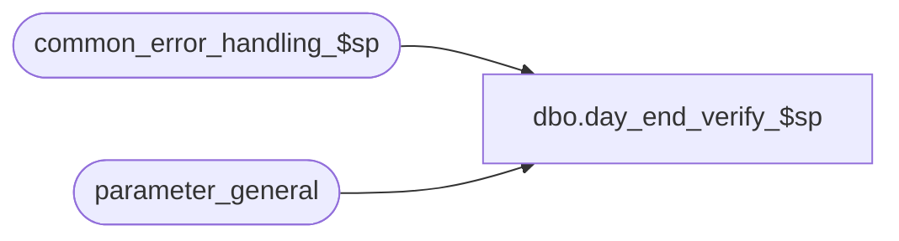

# dbo.day_end_verify_$sp

**Database:** auditworks  
**Server:** bedrockdb01  

## Architecture Diagram



## Table Dependencies

| Referenced Table |
|---|
| common_error_handling_$sp |
| parameter_general |

## Stored Procedure Code

```sql
create proc dbo.day_end_verify_$sp 
 @process_id                   binary(16),
 @user_id                      int


   AS

/* Proc name:   day_end_verify_$sp
   Description: Verify whether the dayend is currently running or previously aborted.
                Dayend handles the cleanup of function_status.
                Called by Power Builder.

HISTORY
Date     Name          Def# Desc
Jan04,11 Paul        105313 Use unicode datatypes
Oct07,04 David      DV-1146 Use user_id
                     /42301 Check context_info instead of login-name since users assigned to run  
                            smartload processes are user-defined in Smartload Var table maintenance.
Apr22,04 Maryam     DV-1071 Receive @process_id and pass it to common_error_handling_$sp
Apr19,02 ShuZ       1-CD0IX Standardize  R3.5 Common error handling
Aug09,01 Paul          8476 allow for delay between requesting dayend and start of dayend 
Mar28,01 Paul          7502 Look only for login names
Jul10,97 Phu                author

*/

DECLARE
	@database_name				nvarchar(30),
	@dayend_in_progress 			tinyint,
	@errmsg 				nvarchar(255),
	@errno 					int,
	@immediate_dayend_requested		tinyint,
	@process_running			tinyint,
        @object_name                   		nvarchar(255),
        @process_name                  		nvarchar(100),
        @operation_name                		nvarchar(100),
        @message_id				int	

SELECT @process_running = 0,
       @process_name = 'day_end_verify_$sp',
       @message_id = 201068

SELECT @dayend_in_progress = dayend_in_progress,
	@immediate_dayend_requested = immediate_dayend_requested
  FROM parameter_general

SELECT @errno = @@error
IF @errno <> 0
  BEGIN
    SELECT @errmsg         = 'Failed to select from parameter_general',
           @object_name    = 'parameter_general',
           @operation_name = 'SELECT'
    GOTO error
  END

IF @dayend_in_progress = 1
  BEGIN -- check for aborted dayend(s)
	SELECT @process_running = 0
	SELECT @database_name = db_name() -- current database

	IF EXISTS (SELECT 1
	             FROM master..sysprocesses
	            WHERE db_name(dbid) = @database_name
	              AND convert(nvarchar, context_info) LIKE 'auditworks_dayend%')
	  SELECT @process_running = 1

	SELECT @errno = @@error
	IF @errno <> 0 
	  BEGIN
	    SELECT @errmsg         = 'Failed to select from master..sysprocesses.',
	           @object_name    = 'master..sysprocesses',
	           @operation_name = 'SELECT'
	    GOTO error
	  END

	IF @process_running <= 0
          BEGIN
	   SELECT @errno = 201579,
                  @message_id = 201579,   	   
		  @errmsg = 'Warning: previous day end needs to re-run'
	   GOTO error
	  END

  END -- If @dayend_in_progress = 1

IF @immediate_dayend_requested > 0 OR @process_running >= 1
  BEGIN
   SELECT @errno = 201539,
          @message_id = 201539,   
	  @errmsg = 'Day end is currently in progress'
   GOTO error
  END

RETURN


error:   /* Common error handler */

  EXEC common_error_handling_$sp 36, @errno, @errmsg, 0, @message_id, @process_name,
       @object_name, @operation_name, 1, 1, 0, null, 0, null, null, null, null, null,
       null, 0, @process_id, @user_id

  RETURN
```

