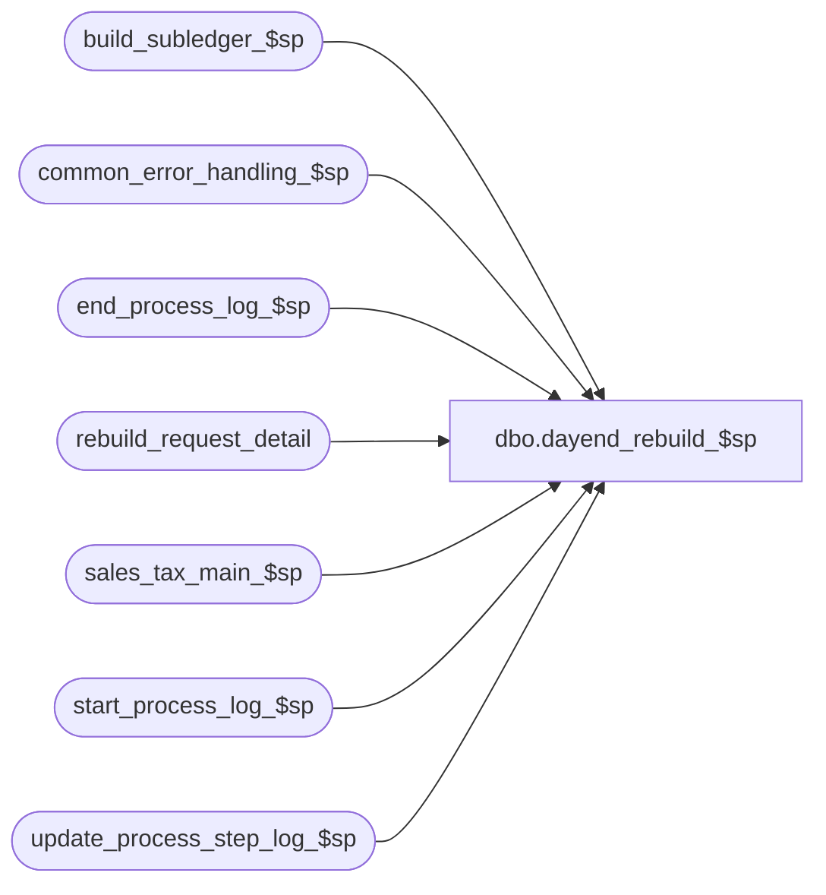

# dbo.dayend_rebuild_$sp

**Database:** auditworks  
**Server:** bedrockdb01  

## Architecture Diagram



## Table Dependencies

| Referenced Table |
|---|
| build_subledger_$sp |
| common_error_handling_$sp |
| end_process_log_$sp |
| rebuild_request_detail |
| sales_tax_main_$sp |
| start_process_log_$sp |
| update_process_step_log_$sp |

## Stored Procedure Code

```sql
create proc dbo.dayend_rebuild_$sp 
  @process_id				binary(16),
  @truncate_flag 				tinyint = 0,                       
  @dayend_process_id 			tinyint = NULL,
  @errmsg 				varchar(2000) OUTPUT

AS

/* Proc name:   dayend_rebuild_$sp

Description:This procedure determines whether there are any rows in rebuild_request with a
            rebuild_type of 1 = Tax, or 2 = Subledger Tax, or 3 = media rec, and if so, will execute 
            sales_tax_main_$sp or build_subledger_$Sp.
	    Called from day_end_posting_$sp 
           
History: 
Date            Name              Def   Desc
Aug26,14        Paul            74509   use try .. catch to support error trapping in lower level procs
Nov15,11        Paul         1-47SQDP   avoid possible arithmetic overflow on @subledger_count and @media_rec_count
					when > 255 rebuild requests are outstanding
May25,10        Vicci          117359   Correct process step logging
Sep09,2005      Paul          DV-1312   update history block
May09,2005      Maryam        DV-1202   Properly pass the parameters to sales_tax_main_$sp.
Oct07,2004      David         DV-1146   Remove user name.
Sep20,2004      David         DV-1146   Pass null to user_id in sales_tax_main_$sp.
Sep09,2004      David         DV-1120   apply 30348 to SA5
May10,2004      Maryam        DV-1071   Receive @process_id and pass it to the sub procs
Jun07,2004      Daphna        30348     change declaration of @tax_count to INTEGER to prevent arithmetic overflow error
Sep18,2003      Maryam        13686     Do not check for error no 201635 as it is handled in common error handling proc. 
May30,2003      Winnie          9250    Media Reconciliation enhancements.
May08,2002      Winnie       1-C2Q5L    Add abort logic to dayend.
Nov30,2001      Phu             8931    Error handling
14/05/2001      Maryam          7444    author
*/


	

DECLARE
	@errmsg2					nvarchar(2000),
	@errline					int,
	@errno 					int,
	@message_id				int,
	@object_name				nvarchar(255),
	@operation_name				nvarchar(100),
	@process_name				nvarchar(100),
	@process_log_entry 			tinyint,
	@process_no 				smallint,
	@process_timestamp 			float,
	@transaction_count 			numeric(12,0),
	@tax_count				int,
	@trace_msg				nvarchar(255),
	@subledger_count				int,
	@abort_flag				tinyint,
	@media_rec_count				int,
	@temp_count				int;
         
SELECT
	@process_log_entry = 0,
	@process_no = 160,
	@process_timestamp = 0,
	@transaction_count = 0,
	@tax_count = 0,
	@subledger_count = 0,
	@message_id = 201068,
	@process_name = 'dayend_rebuild_$sp',
	@abort_flag = 0,
	@temp_count = 0;

BEGIN TRY	

IF @process_log_entry = 0		-- Begin process log  
  BEGIN
	SELECT @object_name = 'start_process_log_$sp',
	       @operation_name = 'EXECUTE',
	       @errmsg = 'Unable to execute start_process_log_$sp';
    EXEC start_process_log_$sp @process_no, @process_timestamp OUTPUT, @errmsg OUTPUT;    

    SELECT @process_log_entry = 1;
  END;

  SELECT @errmsg = 'Failed to select from rebuild_request_detail table.',
	   @object_name = 'rebuild_request_detail',
	   @operation_name = 'SELECT'; 
SELECT @tax_count = COUNT(request_id)
  FROM rebuild_request_detail
 WHERE rebuild_type = 1
   AND request_status = 10;
      
IF @tax_count > 0
  BEGIN     
    SELECT @trace_msg = ':LOG => sales_tax_main_$sp (rebuild) begins at: ' + CONVERT(nchar, getdate(), 8);
    PRINT @trace_msg;

    SELECT @temp_count = @transaction_count + @tax_count;

      SELECT @errmsg = 'Failed to execute stored proc update_process_step_log_$sp for step 44 tax rebuild',
	     @object_name = 'update_process_step_log_$sp',
	     @operation_name = 'EXECUTE';
    EXEC update_process_step_log_$sp 18, @dayend_process_id, 44, @temp_count, @transaction_count, NULL; 

    SELECT @transaction_count = @tax_count + @subledger_count + @media_rec_count;

       SELECT @errmsg = 'Failed to execute stored procedure sales_tax_main_$sp',
              @object_name = 'sales_tax_main_$sp';
    EXEC sales_tax_main_$sp @process_id, @dayend_process_id, @errmsg OUTPUT, 1;
  END; -- If @tax_count > 0

  SELECT @errmsg = 'Unabled to select from rebuild_request_detail table.',
	   @object_name = 'rebuild_request_detail',
	   @operation_name = 'SELECT';
SELECT @subledger_count = COUNT(request_id)
  FROM rebuild_request_detail
 WHERE rebuild_type = 2
   AND request_status = 10;
      
IF @subledger_count > 0 
 BEGIN
    SELECT @trace_msg = ':LOG => build_subledger_$sp (rebuild) begins at: ' + CONVERT(nchar, getdate(), 8);
    PRINT @trace_msg; 

    SELECT @temp_count = @transaction_count + @subledger_count;

      SELECT @errmsg = 'Failed to execute stored proc update_process_step_log_$sp for step 44 subledger tax rebuild',
	     @object_name = 'update_process_step_log_$sp',
	     @operation_name = 'EXECUTE';
    EXEC update_process_step_log_$sp 18, @dayend_process_id, 44, @temp_count , @transaction_count, NULL; 

    SELECT @transaction_count = @tax_count + @subledger_count + @media_rec_count;

      SELECT @errmsg = 'Failed to execute stored procedure build_subledger_$sp',
             @object_name = 'build_subledger_$sp';
    EXEC build_subledger_$sp @process_id, @truncate_flag, @dayend_process_id, @errmsg OUTPUT, 2;
 END; -- If @subledger_count > 0

  SELECT @errmsg = 'Failed to select from rebuild_request_detail table for media rec count',
	   @object_name = 'rebuild_request_detail',
	   @operation_name = 'SELECT';
SELECT @media_rec_count = COUNT(request_id)
  FROM rebuild_request_detail
 WHERE rebuild_type = 3
   AND request_status = 10;
      
IF @media_rec_count > 0 
  BEGIN
    SELECT @trace_msg = ':LOG => build_subledger_$sp (rebuild media rec) begins at: ' + CONVERT(nchar, getdate(), 8);
    PRINT @trace_msg; 

    SELECT @temp_count = @transaction_count + @media_rec_count;

      SELECT @errmsg = 'Failed to execute stored proc update_process_step_log_$sp for step 44 subledger media-rec rebuild',
	     @object_name = 'update_process_step_log_$sp',
	     @operation_name = 'EXECUTE';
    EXEC update_process_step_log_$sp 18, @dayend_process_id, 44, @temp_count, @transaction_count, NULL;

    SELECT @transaction_count = @tax_count + @subledger_count + @media_rec_count;

        SELECT @errmsg = 'Failed to execute stored procedure build_subledger_$sp for medic rec',
               @object_name = 'build_subledger_$sp',
	      @operation_name = 'EXECUTE';
    EXEC build_subledger_$sp @process_id, @truncate_flag, @dayend_process_id, @errmsg OUTPUT, 3;
  END; -- If @media_rec_count > 0

SELECT @transaction_count = @tax_count + @subledger_count + @media_rec_count;

  SELECT @errmsg = 'Failed to execute stored proc update_process_step_log_$sp for step 44',
	  @object_name = 'update_process_step_log_$sp',
	  @operation_name = 'EXECUTE';
EXEC update_process_step_log_$sp 18, @dayend_process_id, 44, @transaction_count, @transaction_count, NULL;

IF @process_log_entry = 1
BEGIN
    SELECT @errmsg = 'Unable to execute stored procedure end_process_log_$sp',
             @object_name = 'end_process_log_$sp',
	     @operation_name = 'EXECUTE';
  EXEC end_process_log_$sp @process_no, @process_timestamp, @transaction_count;
END;
     
RETURN;


business_error:   /* Business Rule handler. */

	SELECT @errmsg2 = @errmsg;

	EXEC common_error_handling_$sp @process_no, @errno, @errmsg, @abort_flag, @message_id, 
	@process_name, @object_name, @operation_name, 1, @dayend_process_id, @process_log_entry, 
	@process_timestamp, @transaction_count;
	  /* Note: when the exec above raises an error, that action also fires the system error trap (below) */
	RETURN;
END TRY

BEGIN CATCH; -- trap system errors
    /* common error handling. Appending proc name here because a rollback could occur if called within a transaction. */

        SELECT @errno = ERROR_NUMBER(),
		@errline = ERROR_LINE();

        SELECT @errmsg = CONVERT(nvarchar, @errno) + ':' + @process_name + ':' + CONVERT(nvarchar, @errline) + ':'
               + COALESCE(@errmsg, ' ') + ':' + ERROR_MESSAGE();

	 /* this condition will only be true when raise error in traps above fire this general catch */
	IF @errmsg2 IS NOT NULL
	  SELECT @errmsg = @errmsg2;

	EXEC common_error_handling_$sp @process_no, @errno, @errmsg, @abort_flag, @message_id, 
	@process_name, @object_name, @operation_name, 1, @dayend_process_id, @process_log_entry, 
	@process_timestamp, @transaction_count;

	RETURN;
END CATCH;
```

