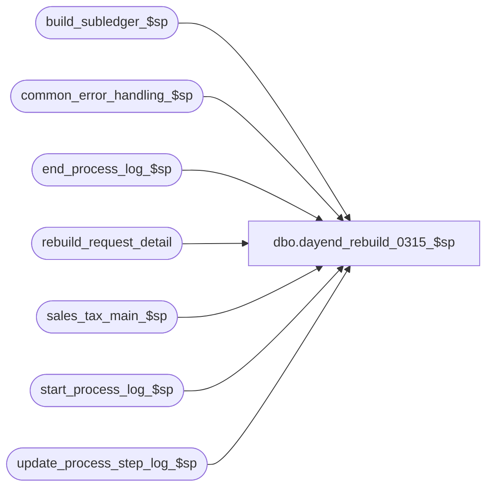

# dbo.dayend_rebuild_0315_$sp

**Database:** auditworks  
**Server:** bedrockdb01  

## Architecture Diagram



## Table Dependencies

| Referenced Table |
|---|
| build_subledger_$sp |
| common_error_handling_$sp |
| end_process_log_$sp |
| rebuild_request_detail |
| sales_tax_main_$sp |
| start_process_log_$sp |
| update_process_step_log_$sp |

## Stored Procedure Code

```sql
create proc dbo.dayend_rebuild_0315_$sp 

  @truncate_flag 			tinyint = 0,                       
  @dayend_process_id 			tinyint = NULL,
  @errmsg 				varchar(255) OUTPUT

AS

/* Proc name:   dayend_rebuild_$sp

Description:This procedure determines whether there are any rows in rebuild_request with a
            rebuild_type of 1 = Tax or 2 = Subledger Tax and if so will execute 
            sales_tax_main_$sp or build_subledger_$Sp.
	    Called from day_end_posting_$sp 

           
History: 
Date	 	Name		Def	Desc
May08,2002      Winnie	      1-C2Q5L   Add abort logic to dayend.
Nov30,2001	Phu		8931	Error handling
14/05/2001      Maryam          7444    author
*/


	

DECLARE
	@errno 					int,
	@message_id				int,
	@object_name				varchar(255),
	@operation_name				varchar(100),
	@process_name				varchar(100),
        @process_log_entry 			tinyint,
	@process_no 				smallint,
	@process_timestamp 			float,
	@transaction_count 			numeric(12,0),
        @tax_count				tinyint,
        @trace_msg				varchar(255),
        @subledger_count			tinyint,
        @abort_flag				tinyint
         
SELECT
	@process_log_entry = 0,
	@process_no = 160,
	@process_timestamp = 0,
	@transaction_count = 0,
	@tax_count = 0,
	@subledger_count = 0,
	@message_id = 201068,
	@process_name = 'dayend_rebuild_$sp',
	@abort_flag = 0
	

IF @process_log_entry = 0		-- Begin process log  
  BEGIN
    EXEC start_process_log_$sp @process_no, @process_timestamp OUTPUT, @errmsg OUTPUT     

    SELECT @errno = @@error
    IF @errno <> 0
      BEGIN 
	SELECT @object_name = 'start_process_log_$sp',
	       @operation_name = 'EXECUTE'
        IF @errmsg is NULL
       SELECT @errmsg = 'Unable to execute start_process_log_$sp'
          GOTO error	
      END	
	
    SELECT @process_log_entry = 1
  END
  
SELECT @tax_count = COUNT(request_id)
  FROM rebuild_request_detail
 WHERE rebuild_type = 1
   AND request_status = 10
      
SELECT @errno = @@error
IF @errno != 0
  BEGIN
    SELECT @errmsg = 'Failed to select from rebuild_request_detail table.',
	   @object_name = 'rebuild_request_detail',
	   @operation_name = 'SELECT'
    GOTO error
  END
            
IF @tax_count > 0
  BEGIN     
    SELECT @trace_msg = ':LOG => sales_tax_main_$sp (rebuild) begins at: ' + CONVERT(CHAR, getdate(), 8)
    PRINT @trace_msg
    
    EXEC sales_tax_main_$sp @dayend_process_id, @errmsg OUTPUT, 1

    SELECT @errno = @@error
    IF @errno != 0 
      BEGIN
       IF @errno = 201635
         SELECT @errmsg = 'Function aborted by user request',
                @message_id = 201635,
                @abort_flag = 1
       ELSE
         IF @errmsg IS NULL
       SELECT @errmsg = 'Failed to execute stored procedure sales_tax_main_$sp'
         SELECT @object_name = 'sales_tax_main_$sp',
	        @operation_name = 'EXECUTE'
       GOTO error
      END
  END
                     
SELECT @subledger_count = COUNT(request_id)
  FROM rebuild_request_detail
 WHERE rebuild_type = 2
   AND request_status = 10
      
SELECT @errno = @@error
IF @errno != 0
  BEGIN
    SELECT @errmsg = 'Unabled to select from rebuild_request_detail table.',
	   @object_name = 'rebuild_request_detail',
	   @operation_name = 'SELECT'
    GOTO error
  END

IF @subledger_count > 0 
  BEGIN
    SELECT @trace_msg = ':LOG => build_subledger_$sp (rebuild) begins at: ' + CONVERT(CHAR, getdate(), 8)
    PRINT @trace_msg 
    
    EXEC build_subledger_$sp @truncate_flag, @dayend_process_id, @errmsg OUTPUT, 1
     
    SELECT @errno = @@error 
    IF @errno != 0 
      BEGIN
       IF @errno = 201635
         SELECT @errmsg = 'Function aborted by user request',
                @message_id = 201635,
                @abort_flag = 1
       ELSE
        IF @errmsg IS NULL
        SELECT @errmsg = 'Failed to execute stored procedure build_subledger_$sp'
        SELECT @object_name = 'build_subledger_$sp',
	       @operation_name = 'EXECUTE'
       GOTO error
      END
END

EXEC update_process_step_log_$sp 18, @dayend_process_id, 44, NULL, NULL, NULL  SELECT @errno = @@error
IF @errno != 0
  BEGIN
   SELECT @errmsg = 'Failed to execute stored proc update_process_step_log_$sp for step 44',
	  @object_name = 'update_process_step_log_$sp',
	  @operation_name = 'EXECUTE'
   GOTO error
  END

SELECT @transaction_count = @tax_count + @subledger_count

IF @process_log_entry = 1
BEGIN
  EXEC end_process_log_$sp @process_no, @process_timestamp, @transaction_count
  SELECT @errno = @@error
  IF @errno != 0
    BEGIN
      SELECT @errmsg = 'Unable to execute stored procedure end_process_log_$sp',
             @object_name = 'end_process_log_$sp',
	     @operation_name = 'EXECUTE'
      GOTO error
  END
END
     
RETURN  

error:

	EXEC common_error_handling_$sp @process_no, @errno, @errmsg, @abort_flag, @message_id, 
	@process_name, @object_name, @operation_name, 1, @dayend_process_id, @process_log_entry, 
	@process_timestamp, @transaction_count 
	RETURN
```

