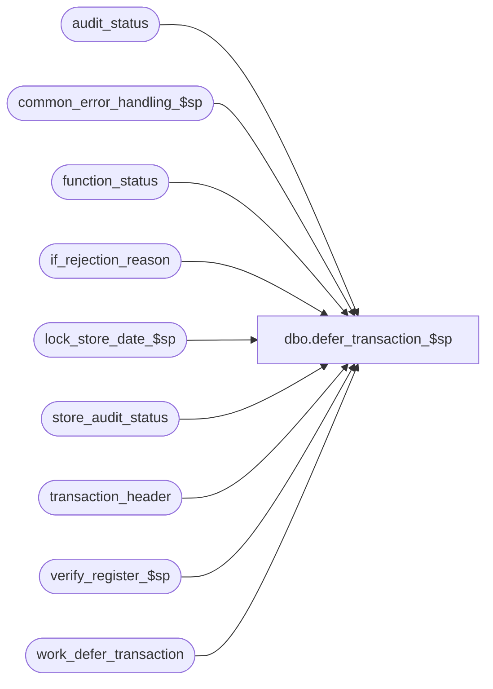

# dbo.defer_transaction_$sp

**Database:** auditworks  
**Server:** bedrockdb01  

## Architecture Diagram



## Table Dependencies

| Referenced Table |
|---|
| audit_status |
| common_error_handling_$sp |
| function_status |
| if_rejection_reason |
| lock_store_date_$sp |
| store_audit_status |
| transaction_header |
| verify_register_$sp |
| work_defer_transaction |

## Stored Procedure Code

```sql
create proc dbo.defer_transaction_$sp 
@process_id	binary(16),
@user_id	int,
@status		tinyint,
@reverse_flag	smallint, /* 1 = reverse deferred transactions */
@errmsg		nvarchar(255) OUTPUT

AS


/* 
PROC NAME: defer_transaction_$sp
     DESC: Will defer all transactions in the table work_defer_transaction
     	   populated by PowerBuilder. If reverse_flag = 1, will set deferred flag back
	   to 0 in if_rejection_reason and recount if_reject_qty for audit_status
           Called by Powerbuilder. 
HISTORY:
Date     Name         Def# descr
Jan04,11 Paul       105313 Use unicode datatypes
Sep27,04 David     DV-1146 Use user_id
Apr22,04 Maryam    DV-1071 change the datatype of @process_id to be binary(16) and pass it to the sub procs.
Jan17,03 ShuZ      1-HZ3U2 Change double quote to single quote
Apr19,02 ShuZ      1-CD0IX Standardize  R3.5 Common error handling
Apr24,00 Daphna       6093 reorganize logic so that no work done if store not locked     
Mar16,99 Vicci          ?? last modified
Jan09,97 Seb           n/a author
*/


DECLARE
  @cursor_open		bit,
  @date_reject_id	tinyint,
  @error_code		int,
  @errno		int,
  @function_no		tinyint,
  @if_reject_qty	smallint,
  @register_no		smallint,
  @skipped_stores	tinyint,
  @store_no		int,
  @transaction_date	smalldatetime,
  @object_name          nvarchar(255),
  @process_name         nvarchar(100),
  @operation_name       nvarchar(100),
  @message_id		int

SELECT @cursor_open = 0,
       @function_no = 120,
       @skipped_stores = 0,
       @process_name = 'defer_transaction_$sp',
       @message_id = 201068       


SELECT DISTINCT store_no, register_no, transaction_date, date_reject_id
  INTO #audit_status_temp
  FROM work_defer_transaction 
 WHERE process_id = @process_id

SELECT @errno = @@error
IF @errno != 0
BEGIN
  SELECT @errmsg         = 'Failed to INSERT INTO #audit_status_temp',
         @object_name    = '#audit_status_temp',
         @operation_name = 'INSERT'
  GOTO error
END

DECLARE audit_status_cursor cursor
FOR  
SELECT store_no,
       register_no,
       transaction_date,
       date_reject_id
  FROM #audit_status_temp

OPEN audit_status_cursor

SELECT @errno = @@error, @cursor_open = 1
IF @errno !=0 
BEGIN
  SELECT @errmsg = 'Failed to open cursor audit_status_cursor.',
         @object_name = 'audit_status_cursor',
         @operation_name = 'OPEN'
  GOTO error
END

IF @status = 3 /* need to unlock store-date */
BEGIN
  SELECT @store_no = store_no,
         @transaction_date = transaction_date,
         @date_reject_id = date_reject_id
    FROM function_status
   WHERE process_id = @process_id
     AND user_id = @user_id
     AND function_no = @function_no

  SELECT @errno = @@error
  IF @errno != 0
  BEGIN
    SELECT @errmsg = 'Failed to read from function_status.',
           @object_name = 'function_status',
           @operation_name = 'SELECT'
    GOTO error
  END

  UPDATE store_audit_status
     SET update_in_progress = 0
   WHERE sales_date = @transaction_date
     AND store_no = @store_no
     AND date_reject_id = @date_reject_id
     AND update_in_progress != 0

  SELECT @errno = @@error
  IF @errno != 0
  BEGIN
    SELECT @errmsg = 'Failed to UPDATE store_audit_status.',
           @object_name = 'store_audit_status',
           @operation_name = 'UPDATE'
    GOTO error
  END

  SELECT @status = 1
END

     
WHILE 1=1
BEGIN
  FETCH audit_status_cursor INTO
	@store_no,
	@register_no,
	@transaction_date,
	@date_reject_id

  IF @@fetch_status <> 0	/* no more data */
    BREAK

  IF @status = 1  
  BEGIN
    BEGIN TRANSACTION

    EXEC lock_store_date_$sp @process_id, @user_id, @store_no, @transaction_date, @date_reject_id,
		120, @error_code OUTPUT
 
    SELECT @errno = @@error
    IF @errno != 0
    BEGIN
      IF @errmsg IS NULL /* then */
       SELECT @errmsg = 'Failed to execute lock_store_date_$sp.'
      SELECT @object_name = 'lock_store_date_$sp',
             @operation_name = 'EXECUTE'
      GOTO error
    END

    IF @error_code != 0  -- could not lock store/date
    BEGIN
      SELECT @errno = @error_code, @errmsg = 'Failed to lock store/date'
 
      SELECT @skipped_stores = 1
 
      DELETE FROM work_defer_transaction
       WHERE process_id = @process_id
         AND store_no = @store_no
         AND transaction_date = @transaction_date
         AND register_no = @register_no
         AND date_reject_id = @date_reject_id

      SELECT @errno = @@error
      IF @errno != 0
      BEGIN
        SELECT @errmsg = 'Failed to DELETE work_defer_transaction.',
               @object_name = 'work_defer_transaction',
               @operation_name = 'DELETE'
        GOTO error
      END
    
      CONTINUE /* skip to next store/date/reg */
  
    END /* @error_code != 0: could not lock store  */
  
    SELECT @status = 2

    UPDATE function_status
       SET status = @status,
       	   transaction_date = @transaction_date,
	   register_no = @register_no,
	   date_reject_id = @date_reject_id
     WHERE process_id = @process_id
       AND user_id = @user_id
       AND function_no = @function_no

    SELECT @errno = @@error
    IF @errno != 0
    BEGIN
      SELECT @errmsg = 'Failed to update function_status = 2.',
             @object_name = 'function_status',
             @operation_name = 'UPDATE'
      GOTO error
    END

    COMMIT

  END /* IF @status = 1 */
  
  IF @status = 2  -- store/date is locked 
  BEGIN
    BEGIN TRANSACTION

    IF @reverse_flag = 0
    BEGIN
      UPDATE if_rejection_reason
         SET deferred = 1
        FROM work_defer_transaction wd, if_rejection_reason ir
       WHERE wd.process_id = @process_id
         AND wd.transaction_id = ir.transaction_id
         AND wd.line_id = ir.line_id
         AND if_rejection_reason = if_reject_reason
         AND store_no = @store_no
         AND transaction_date = @transaction_date
         AND register_no = @register_no
         AND date_reject_id = @date_reject_id

      SELECT @errno = @@error
      IF @errno != 0
      BEGIN
        SELECT @errmsg = 'Failed to update if_rejection_reason: deferred = 1.',
               @object_name = 'if_rejection_reason',
               @operation_name = 'UPDATE'
        GOTO error
      END
    END
    ELSE  /* @reverse_flag != 0 */
    BEGIN
      UPDATE if_rejection_reason
         SET deferred = 0
        FROM work_defer_transaction wd, if_rejection_reason ir
       WHERE wd.process_id = @process_id
         AND wd.transaction_id = ir.transaction_id
         AND wd.line_id = ir.line_id
         AND if_rejection_reason = if_reject_reason
         AND store_no = @store_no
         AND transaction_date = @transaction_date
         AND register_no = @register_no
         AND date_reject_id = @date_reject_id

      SELECT @errno = @@error
      IF @errno != 0
      BEGIN
        SELECT @errmsg = 'Failed to update if_rejection_reason: deferred = 0.',
               @object_name = 'if_rejection_reason',
               @operation_name = 'UPDATE'
        GOTO error
      END

      UPDATE transaction_header
         SET if_rejection_flag = 1
        FROM work_defer_transaction wd, transaction_header th
       WHERE wd.process_id = @process_id
         AND wd.transaction_id = th.transaction_id
         AND if_rejection_flag = 0
         AND wd.store_no = @store_no
         AND wd.transaction_date = @transaction_date
         AND wd.register_no = @register_no
         AND wd.date_reject_id = @date_reject_id
	

      SELECT @errno = @@error
      IF @errno != 0
      BEGIN
        SELECT @errmsg = 'Failed to update transaction_header.',
      @object_name = 'transaction_header',
               @operation_name = 'UPDATE'
        GOTO error
      END
    END  /* IF @reverse_flag = 0*/

    SELECT @if_reject_qty = ISNULL(COUNT(DISTINCT ir.transaction_id),0)
      FROM transaction_header th, if_rejection_reason ir
     WHERE transaction_date = @transaction_date
       AND store_no = @store_no
       AND register_no = @register_no
       AND date_reject_id = @date_reject_id
       AND th.transaction_id = ir.transaction_id
       AND if_rejection_flag = 1
       AND deferred = 0

    SELECT @errno = @@error
    IF @errno != 0
    BEGIN
        SELECT @errmsg = 'Failed to select count if_rejects..',
               @object_name = 'if_rejection_reason',
               @operation_name = 'SELECT'
        GOTO error
    END
  
    UPDATE audit_status
       SET if_reject_qty = @if_reject_qty,
	   audit_status = 100
     WHERE sales_date = @transaction_date
       AND store_no = @store_no
       AND register_no = @register_no
       AND date_reject_id = @date_reject_id

    SELECT @errno = @@error
    IF @errno != 0
    BEGIN
        SELECT @errmsg = 'Failed to UPDATE audit_status if_reject_qty.',
               @object_name = 'audit_status',
               @operation_name = 'UPDATE'
        GOTO error
    END

    EXEC verify_register_$sp @process_id, @user_id, @store_no, @register_no, @transaction_date, 
					@date_reject_id, @errmsg OUTPUT

    SELECT @errno = @@error
    IF @errno != 0
    BEGIN
	IF @errmsg IS NULL /* then */
        SELECT @errmsg = 'Failed to EXECUTE stored procedure verify_register_$sp.'
	SELECT @object_name = 'verify_register_$sp',
               @operation_name = 'EXEC'
	GOTO error
    END

    DELETE FROM work_defer_transaction
     WHERE process_id = @process_id
       AND store_no = @store_no
       AND transaction_date = @transaction_date
       AND register_no = @register_no
       AND date_reject_id = @date_reject_id

    SELECT @errno = @@error
    IF @errno != 0
    BEGIN
      SELECT @errmsg = 'Failed to DELETE work_defer_transaction.',
             @object_name = 'work_defer_transaction',
             @operation_name = 'DELETE'
      GOTO error
    END

    SELECT @status = 3
 
    UPDATE function_status
       SET status = @status
     WHERE process_id = @process_id
       AND user_id = @user_id
       AND function_no = @function_no

    SELECT @errno = @@error
    IF @errno != 0
    BEGIN
      SELECT @errmsg = 'Failed to update function_status = 3.',
             @object_name = 'function_status',
             @operation_name = 'UPDATE'
      GOTO error
    END
  
    COMMIT TRANSACTION
    
  END /* IF @status = 2  -- store/date is locked  */  
  
  IF @status = 3 /* update competed */
  BEGIN
    
    BEGIN TRANSACTION
        
    UPDATE store_audit_status
       SET update_in_progress = 0
     WHERE sales_date = @transaction_date
       AND store_no = @store_no
       AND date_reject_id = @date_reject_id

    SELECT @errno = @@error
    IF @errno != 0
    BEGIN
      SELECT @errmsg = 'Failed to unlock (UPDATE) store_audit_status.',
             @object_name = 'store_audit_status',
             @operation_name = 'UPDATE'
      GOTO error
    END
    
    SELECT @status = 4
 
    UPDATE function_status
       SET status = @status
     WHERE process_id = @process_id
       AND user_id = @user_id
       AND function_no = @function_no

    SELECT @errno = @@error
    IF @errno != 0
    BEGIN
      SELECT @errmsg = 'Failed to update function_status = 4.',
             @object_name = 'function_status',
             @operation_name = 'UPDATE'
      GOTO error
    END

    COMMIT TRANSACTION
    
  END /* IF @status = 3  -- update completed  */

  IF @status = 4 /* store/date unlocked */
  BEGIN
  
    SELECT @status = 1
 
    UPDATE function_status
       SET status = @status
     WHERE process_id = @process_id
       AND user_id = @user_id
       AND function_no = @function_no

    SELECT @errno = @@error
    IF @errno != 0
    BEGIN
      SELECT @errmsg = 'Failed to reset function_status = 1.',
             @object_name = 'function_status',
             @operation_name = 'UPDATE'
      GOTO error
    END
    
  END /* @status = 4: store/date unlocked */
    
END /* WHILE 1=1 */
CLOSE audit_status_cursor
DEALLOCATE audit_status_cursor
SELECT @cursor_open = 0 

DELETE FROM function_status
 WHERE process_id = @process_id
   AND user_id = @user_id
   AND function_no = @function_no

SELECT @errno = @@error
IF @errno != 0
BEGIN
  SELECT @errmsg = 'Failed to DELETE on function_status.',
         @object_name = 'function_status',
         @operation_name = 'DELETE'
  GOTO error
END

IF @skipped_stores = 1
BEGIN
  SELECT @errno = 201574,
         @message_id = 201574,
	@errmsg = 'Could not process all transactions. Some store-dates were in use.'
  GOTO error
END

RETURN

error:   /* Common error handler. */

  IF @cursor_open != 0
  BEGIN
    CLOSE audit_status_cursor
    DEALLOCATE audit_status_cursor
  END

  DELETE FROM work_defer_transaction
  WHERE process_id = @process_id
                
  EXEC common_error_handling_$sp @function_no, @errno, @errmsg, 0, @message_id, 
                                 @process_name, @object_name, @operation_name, 1,
                                 1, 0, null, 0, null, null, null, null, null,
                                 null, 0, @process_id, @user_id
	
  RETURN
```

