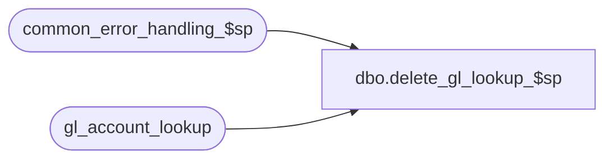

# dbo.delete_gl_lookup_$sp

**Database:** auditworks  
**Server:** bedrockdb01  

## Architecture Diagram



## Table Dependencies

| Referenced Table |
|---|
| common_error_handling_$sp |
| gl_account_lookup |

## Stored Procedure Code

```sql
create proc dbo.delete_gl_lookup_$sp @old_card_type nchar(1)

AS
/* Proc Name: delete_gl_lookup_$sp
   Desc: Deletes from gl_account_lookup. This procedure is used by all configurations of SA and is needed as a workaround
    to distributed transaction restrictions in mssql under a scaleout configuration. In that configuration,
    gl_account_lookup on the peripheral server is a view to the gl_account_lookup table in the tm db on the consolidated server.
    Called by triggers that are fired by the change of underlying master tables, e.g. card_type_$trU.
    
HISTORY:
Date     Name		Def# Desc
Jan04,11 Paul         105313 Use unicode datatypes
May18,05 Paul        DV-1254 author

*/

DECLARE
	@edit_process_no		tinyint,
	@errno				int,
	@object_name			nvarchar(255),
	@process_name			nvarchar(100),
	@operation_name			nvarchar(100),
	@message_id			int,
	@errmsg				nvarchar(255)
	
	
SELECT  @process_name = 'delete_gl_lookup_$sp',
        @message_id = 201068

DELETE FROM gl_account_lookup
 WHERE card_type = @old_card_type

SELECT @errno = @@error
IF @errno != 0
 BEGIN
  SELECT @errmsg = 'Failed to DELETE on gl_account_lookup',
         @object_name = 'gl_account_lookup',
         @operation_name = 'DELETE'
  GOTO error
 END

RETURN

error:
	EXEC common_error_handling_$sp 0, @errno, @errmsg, 0, @message_id, 
	@process_name, @object_name, @operation_name, 1, 1

	RETURN
```

