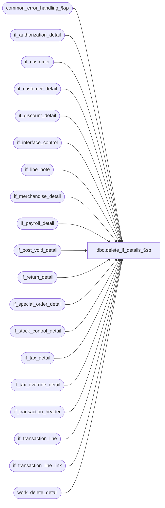

# dbo.delete_if_details_$sp

**Database:** auditworks  
**Server:** bedrockdb01  

## Architecture Diagram



## Table Dependencies

| Referenced Table |
|---|
| common_error_handling_$sp |
| if_authorization_detail |
| if_customer |
| if_customer_detail |
| if_discount_detail |
| if_interface_control |
| if_line_note |
| if_merchandise_detail |
| if_payroll_detail |
| if_post_void_detail |
| if_return_detail |
| if_special_order_detail |
| if_stock_control_detail |
| if_tax_detail |
| if_tax_override_detail |
| if_transaction_header |
| if_transaction_line |
| if_transaction_line_link |
| work_delete_detail |

## Stored Procedure Code

```sql
create proc dbo.delete_if_details_$sp 
@process_id     binary(16),
@user_id        int,
@commit_flag 	tinyint = 0,    /* used in ORA ,not used in SYB */
@process_no     smallint = 36,
@edit_process_no tinyint = 1

AS

/*
PROC NAME: delete_if_details_$sp
     DESC: deletes from all interface detail tables from work_delete_detail
           where process_id = @process_id
  HISTORY:
Date     Name            Defect Desc
Jan04,11 Paul            105313 Use unicode datatypes
Mar15,05 Maryam         DV-1202 delete if_transaction_line_link
Dec13,04 David          DV-1191 Improve performance by adding hints.
Sep20,04 David          DV-1146 Handle new column user_id.
Jul09,04 Maryam         DV-1071 Change @process_id from int to binary(16) and pass to common_error_handling_$sp.
Apr25,02 Phu            1-C9P5S Delete transactions in if_tax_detail table
Nov26,01 Winnie         1-969YY Add logic for R3 error handling
Jul16,99 Daphna            5026 author

 */

DECLARE @errno			int,
        @errmsg			nvarchar(255),
	@object_name		nvarchar(255),
	@process_name		nvarchar(100),
	@operation_name		nvarchar(100),
	@message_id		int
	
SELECT @process_name = 'delete_if_details_$sp',
       @message_id = 201068


DELETE if_authorization_detail
  FROM if_authorization_detail d, work_delete_detail w WITH (NOLOCK)
 WHERE d.if_entry_no = w.transaction_id
   AND w.process_id = @process_id

SELECT @errno = @@error
IF @errno != 0
BEGIN
	SELECT @errmsg = 'Unable to delete if_authorization_detail',
               @object_name = 'if_authorization_detail',
               @operation_name = 'DELETE'	
	GOTO error
END

DELETE if_customer
  FROM if_customer d, work_delete_detail w WITH (NOLOCK)
 WHERE d.if_entry_no = w.transaction_id
   AND w.process_id = @process_id

SELECT @errno = @@error
IF @errno != 0
  BEGIN
	SELECT @errmsg = 'Unable to delete if_customer',
               @object_name = 'if_customer',
               @operation_name = 'DELETE'		
	GOTO error
  END

DELETE if_customer_detail
  FROM if_customer_detail d, work_delete_detail w WITH (NOLOCK)
 WHERE d.if_entry_no = w.transaction_id
   AND w.process_id = @process_id

SELECT @errno = @@error
IF @errno != 0
  BEGIN
	SELECT @errmsg = 'Unable to delete if_customer_detail',
               @object_name = 'if_customer_detail',
               @operation_name = 'DELETE'			
	GOTO error
  END

DELETE if_discount_detail
  FROM if_discount_detail d, work_delete_detail w WITH (NOLOCK)
 WHERE d.if_entry_no = w.transaction_id
   AND w.process_id = @process_id

SELECT @errno = @@error
IF @errno != 0
  BEGIN
	SELECT @errmsg = 'Unable to delete if_discount_detail',
               @object_name = 'if_discount_detail',
               @operation_name = 'DELETE'			
	GOTO error
  END

DELETE if_line_note
  FROM if_line_note d, work_delete_detail w WITH (NOLOCK)
 WHERE d.if_entry_no = w.transaction_id
   AND w.process_id = @process_id

SELECT @errno = @@error
IF @errno != 0
  BEGIN
	SELECT @errmsg = 'Unable to delete if_line_note',
               @object_name = 'if_line_note',
               @operation_name = 'DELETE'	
	GOTO error
  END

DELETE if_merchandise_detail
  FROM if_merchandise_detail d, work_delete_detail w WITH (NOLOCK)
 WHERE d.if_entry_no = w.transaction_id
   AND w.process_id = @process_id

SELECT @errno = @@error
IF @errno != 0
  BEGIN
	SELECT @errmsg = 'Unable to delete if_merchandise_detail',
               @object_name = 'if_merchandise_detail',
               @operation_name = 'DELETE'	
	GOTO error
  END

DELETE if_payroll_detail
  FROM if_payroll_detail d, work_delete_detail w WITH (NOLOCK)
 WHERE d.if_entry_no = w.transaction_id
   AND w.process_id = @process_id

SELECT @errno = @@error
IF @errno != 0
  BEGIN
	SELECT @errmsg = 'Unable to delete if_payroll_detail',
               @object_name = 'if_payroll_detail',
               @operation_name = 'DELETE'	
	GOTO error
  END

DELETE if_post_void_detail
  FROM if_post_void_detail d, work_delete_detail w WITH (NOLOCK)
 WHERE d.if_entry_no = w.transaction_id
   AND w.process_id = @process_id

SELECT @errno = @@error
IF @errno != 0
  BEGIN
	SELECT @errmsg = 'Unable to delete if_post_void_detail',
               @object_name = 'if_post_void_detail',
               @operation_name = 'DELETE'	
	GOTO error
  END

DELETE if_return_detail
  FROM if_return_detail d, work_delete_detail w WITH (NOLOCK)
 WHERE d.if_entry_no = w.transaction_id
   AND w.process_id = @process_id

SELECT @errno = @@error
IF @errno != 0
  BEGIN
	SELECT @errmsg = 'Unable to delete if_return_detail',
               @object_name = 'if_return_detail',
               @operation_name = 'DELETE'	
	GOTO error
  END

DELETE if_special_order_detail
  FROM if_special_order_detail d, work_delete_detail w WITH (NOLOCK)
 WHERE d.if_entry_no = w.transaction_id
   AND w.process_id = @process_id

SELECT @errno = @@error
IF @errno != 0
  BEGIN
	SELECT @errmsg = 'Unable to delete if_special_order_detail',
               @object_name = 'if_special_order_detail',
               @operation_name = 'DELETE'	
	GOTO error
  END

DELETE if_stock_control_detail
  FROM if_stock_control_detail d, work_delete_detail w WITH (NOLOCK)
 WHERE d.if_entry_no = w.transaction_id
   AND w.process_id = @process_id

SELECT @errno = @@error
IF @errno != 0
  BEGIN
	SELECT @errmsg = 'Unable to delete if_stock_control_detail',
               @object_name = 'if_stock_control_detail',
               @operation_name = 'DELETE'	
	GOTO error
  END

DELETE if_tax_override_detail
  FROM if_tax_override_detail d, work_delete_detail w WITH (NOLOCK)
 WHERE d.if_entry_no = w.transaction_id
   AND w.process_id = @process_id

SELECT @errno = @@error
IF @errno != 0
  BEGIN
	SELECT @errmsg = 'Unable to delete if_tax_override_detail',
               @object_name = 'if_tax_override_detail',
               @operation_name = 'DELETE'	
	GOTO error
  END

DELETE if_transaction_line_link
  FROM if_transaction_line_link lk, work_delete_detail w WITH (NOLOCK)
 WHERE lk.if_entry_no = w.transaction_id
   AND w.process_id = @process_id

SELECT @errno = @@error
IF @errno != 0
  BEGIN
	SELECT @errmsg = 'Unable to delete if_transaction_line_link',
               @object_name = 'if_transaction_line_link',
               @operation_name = 'DELETE'	
	GOTO error
  END
  
DELETE if_transaction_line
  FROM if_transaction_line d, work_delete_detail w WITH (NOLOCK)
 WHERE d.if_entry_no = w.transaction_id
   AND w.process_id = @process_id

SELECT @errno = @@error
IF @errno != 0
  BEGIN
	SELECT @errmsg = 'Unable to delete if_transaction_line',
               @object_name = 'if_transaction_line',
               @operation_name = 'DELETE'	
	GOTO error
  END

DELETE if_interface_control
  FROM if_interface_control d, work_delete_detail w WITH (NOLOCK)
 WHERE d.if_entry_no = w.transaction_id
   AND w.process_id = @process_id

SELECT @errno = @@error
IF @errno != 0
  BEGIN
	SELECT @errmsg = 'Unable to delete if_interface_control',
               @object_name = 'if_interface_control',
               @operation_name = 'DELETE'	
	GOTO error
  END

DELETE if_tax_detail
  FROM if_tax_detail d, work_delete_detail w WITH (NOLOCK)
 WHERE d.if_entry_no = w.transaction_id
   AND w.process_id = @process_id

SELECT @errno = @@error
IF @errno != 0
  BEGIN
	SELECT @errmsg = 'Unable to delete if_tax_detail',
               @object_name = 'if_tax_detail',
               @operation_name = 'DELETE'	
	GOTO error
  END

DELETE if_transaction_header
  FROM if_transaction_header d, work_delete_detail w WITH (NOLOCK)
 WHERE d.if_entry_no = w.transaction_id
   AND w.process_id = @process_id

SELECT @errno = @@error
IF @errno != 0
  BEGIN
	SELECT @errmsg = 'Unable to delete if_transaction_header',
               @object_name = 'if_transaction_header',
               @operation_name = 'DELETE'	
	GOTO error
  END

DELETE work_delete_detail
 WHERE process_id = @process_id

SELECT @errno = @@error
IF @errno != 0
BEGIN
	SELECT @errmsg = 'Unable to delete work_delete_detail' ,
               @object_name = 'work_delete_detail',
               @operation_name = 'DELETE'	
	GOTO error
END
 
RETURN

error:
	EXEC common_error_handling_$sp @process_no, @errno, @errmsg, 0, @message_id, 
	@process_name, @object_name, @operation_name, 1, @edit_process_no, 0, null, 0,
	null, null, null, null, null, null, 0, @process_id, @user_id 
	 
	RETURN
```

