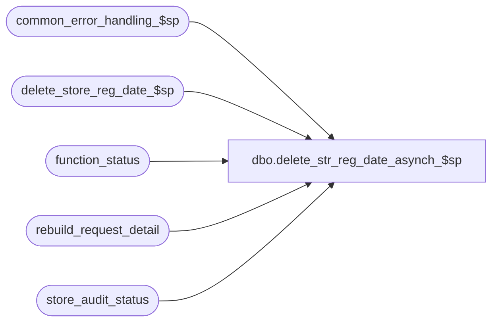

# dbo.delete_str_reg_date_asynch_$sp

**Database:** auditworks  
**Server:** bedrockdb01  

## Architecture Diagram



## Table Dependencies

| Referenced Table |
|---|
| common_error_handling_$sp |
| delete_store_reg_date_$sp |
| function_status |
| rebuild_request_detail |
| store_audit_status |

## Stored Procedure Code

```sql
create proc dbo.delete_str_reg_date_asynch_$sp @recover_process_id binary(16) = NULL
AS

/*
PROCNAME: delete_str_reg_date_asynch_$sp
    Desc: Mass delete transactions in background (asynchonously) for one or many valid/invalid store-date-reg.
   	  Called by mass_auto_revalidate and function_cleanup_$sp (to avoid conflict client_info is used).
   	  Steps first done by UI:
   	    -create function status entry with function 33 and status 0=held
   	    -lock store dates to be deleted with function 33
   	    -log a rebuild_request entry of type 5
   	    -set the function_status.rec_process_id to the rebuild_request.request_id
   	    -log the store dates to be deleted in the rebuild_request_detail
   	    -release the function status entry to the mass_auto_revalidate by setting its status to 1=released
   	  Steps then done by back end:
   	    -mark function status as in progress by changing its status to 2
   	    -recover any halted process for function 40 for its processs id
   	    -for each entry in rebuild_request_detail
   	     --call the delete store reg date  (changing the lock from 33 to 40 to 0)
   	     --set the rebuild request status to 20=complete
   	    -remove the function status entry when done.

HISTORY:
Date     Name          Defect# Desc
----------------------------------------------------------------------------
Feb24,16 Vicci          DAOM-1 Differentiate between recovery of status 1 function 40 and new function 40.
Feb19,16 Vicci          DAOM-1 Author.
*/

DECLARE 
	@process_id		binary(16),
	@user_id		int,
	@status			tinyint,
	@request_id		numeric(12,0),
	@store_no		int,
	@register_no            smallint,
	@date_reject_id		tinyint,
	@transaction_date	smalldatetime,
	@del_srd_status		tinyint,
	@cursor_open		tinyint,
	@errmsg			nvarchar(2000),
	@errmsg2		nvarchar(2000), 
	@errno			int,
	@message_id		int,
	@object_name		nvarchar(255),
	@operation_name		nvarchar(100),
	@function_no		tinyint,
	@process_name		nvarchar(100),
	@prior_context_info	varbinary(128),
	@function_name	        varbinary(128),
        @db_id                  int
        
 SELECT @function_no = 33, -- mass delete transactions for multiple store/reg/dates request
	@cursor_open = 0,
	@process_name = 'delete_str_reg_date_asynch_$sp',
	@message_id = 201068,
	@operation_name = 'SELECT';

BEGIN TRY
	
SELECT @function_name = convert(varbinary(128), @process_name)

SELECT @errmsg = 'Unable to select from master..sysprocesses.  ',
       @object_name = 'sysprocesses'
SELECT @db_id = dbid,
       @prior_context_info = context_info
  FROM master..sysprocesses
 WHERE spid = @@spid
   AND db_name(dbid) = db_name();
   
SELECT @errmsg = 'Failed to set context information.',
       @object_name = 'sysprocesses',
       @operation_name = 'SET';
SET CONTEXT_INFO @function_name;

/* check for mass delete already being run by function cleanup */
SELECT @errmsg = 'Failed to determine if function already running.',
       @object_name = 'sysprocesses',
       @operation_name = 'SELECT';
IF EXISTS (SELECT 1
             FROM master..sysprocesses
            WHERE context_info = @function_name
              AND spid <> @@spid
              AND db_name(dbid) = db_name())
BEGIN
  SELECT @message_id = 201682,
         @errno = 201682,
         @object_name = @process_name,
         @errmsg = 'The stored procedure ' + @process_name + ' is already running. Attempt to perform multiple concurrent executions denied. ';
  GOTO general_error;
END

SELECT @errmsg = 'Failed to handle cursor mass_delete_request_crsr.',
       @object_name = 'mass_delete_request_crsr',
       @operation_name = 'DECLARE';
DECLARE mass_delete_request_crsr CURSOR FAST_FORWARD
    FOR
 SELECT r.user_id, r.process_id, r.status, r.rec_process_id
   FROM function_status r WITH (NOLOCK)
  WHERE r.function_no = 33
    AND r.status > 0  --i.e. status > "held by UI because not finished listing stores yet", i.e. "released to backend"
    AND (r.process_id = @recover_process_id OR @recover_process_id IS NULL);

SELECT @operation_name = 'OPEN';
OPEN mass_delete_request_crsr;
SELECT @cursor_open = 1;

SELECT @operation_name = 'FETCH';
FETCH mass_delete_request_crsr
 INTO @user_id, @process_id, @status, @request_id;

WHILE @@fetch_status = 0 
BEGIN
  SELECT @errmsg = 'Unable to mark background mass deletion request as being in progress.  ',
         @object_name = 'function_status',
         @operation_name = 'UPDATE';
  UPDATE function_status
     SET status = 2		--request processing begun
   WHERE process_id = @process_id
     AND user_id = @user_id
     AND function_no = @function_no
     AND status = 1;

  SELECT @errmsg = 'Failed to handle cursor mass_del_srd_crsr.  ',
         @object_name = 'mass_del_srd_crsr',
         @operation_name = 'DECLARE';
  DECLARE mass_del_srd_crsr CURSOR FAST_FORWARD
      FOR
   SELECT DISTINCT r.store_no, COALESCE(r.register_no, -1) register_no, r.transaction_date, r.date_reject_id,
         CASE WHEN f.status = 1 THEN 0 ELSE COALESCE(f.status, 1) END  --to differentiate between recovery of status 1 and new delete
     FROM rebuild_request_detail r
          LEFT OUTER JOIN function_status f
            ON f.process_id = @process_id
           AND f.function_no = 40  --mass delete single srd
           AND f.store_no = r.store_no
           AND f.transaction_date = r.transaction_date
           AND f.date_reject_id = r.date_reject_id
           AND COALESCE(r.register_no, -1) = f.register_no
          INNER JOIN store_audit_status sas
             ON r.store_no = sas.store_no
            AND r.transaction_date = sas.sales_date
            AND r.date_reject_id = sas.date_reject_id
            AND sas.trickle_in_progress_flag = 0
    WHERE r.request_id = @request_id
      AND r.rebuild_type = 5 --mass delete transactions
      AND r.request_status = 10  --i.e. outstanding
    ORDER BY CASE WHEN f.status = 1 THEN 0 ELSE COALESCE(f.status, 1) END;  --i.e. do recovery of prior failed srd before new ones since process_id is reused.

  SELECT @operation_name = 'OPEN';
  OPEN mass_del_srd_crsr;

  SELECT @cursor_open = 2

  SELECT @operation_name = 'FETCH';
  FETCH mass_del_srd_crsr
   INTO @store_no, @register_no, @transaction_date, @date_reject_id, @del_srd_status;
  
  WHILE @@fetch_status = 0 
  BEGIN
    SELECT @errmsg = 'Unable to execute procedure delete_store_reg_date_$sp.  ',
           @object_name = 'delete_store_reg_date_$sp',
           @operation_name = 'EXEC';
    EXEC delete_store_reg_date_$sp @process_id, @user_id, @store_no, @transaction_date, @date_reject_id, @register_no, @del_srd_status, @errmsg output;

    SELECT @errmsg = 'Unable to mark mass deletion request as complete.  ',
           @object_name = 'rebuild_request_detail',
           @operation_name = 'UPDATE';
    UPDATE rebuild_request_detail
       SET request_status = 20  --i.e. complete
     WHERE request_id = @request_id
       AND rebuild_type = 5 --mass delete transactions
       AND store_no = @store_no
       AND register_no = @register_no
       AND transaction_date = @transaction_date
       AND date_reject_id = @date_reject_id;

    SELECT @errmsg = 'Failed to handle cursor mass_del_srd_crsr (2).  ',
           @object_name = 'mass_del_srd_crsr',
           @operation_name = 'FETCH';
    FETCH mass_del_srd_crsr
     INTO @store_no, @register_no, @transaction_date, @date_reject_id, @del_srd_status;
  END; --WHILE not end of mass_del_srd_crsr

  SELECT @errmsg = 'Failed to handle cursor mass_del_srd_crsr (3).  ',
         @object_name = 'mass_del_srd_crsr',
         @operation_name = 'CLOSE';
  CLOSE mass_del_srd_crsr;
  SELECT @operation_name = 'DEALLOCATE';
  DEALLOCATE mass_del_srd_crsr;
  SELECT @cursor_open = 1;

  --Safety precaution in case rebuild_request_detail rows no longer exist
  --Normally delete_store_reg_date_$sp will have changed the lock from 33 to 40 then unlocked the store itself
  SELECT @errmsg = 'Unable to unlock store_audit_status for lost rebuild_request_details. ',
         @object_name = 'store_audit_status',
         @operation_name = 'UPDATE';
  UPDATE store_audit_status
     SET update_in_progress = 0
   WHERE process_id = @process_id
     AND update_in_progress = @function_no
     AND store_audit_status > 5		--needed since otherwise has no index to use
     AND store_audit_status < 400
     AND NOT EXISTS (SELECT 1 FROM rebuild_request_detail r 
                      WHERE r.request_id = @request_id 
                        AND r.rebuild_type = 5  --mass background deletion request
                        AND r.request_status < 20 --don't delete if status less than 20=complete
                        AND r.store_no = store_audit_status.store_no
 AND r.transaction_date = store_audit_status.sales_date
                        AND r.date_reject_id = store_audit_status.date_reject_id);  
  
  SELECT @errmsg = 'Unable to remove finished background mass transaction deletion requests. ',
         @object_name = 'function_status',
         @operation_name = 'DELETE';
  DELETE function_status
   WHERE process_id = @process_id
     AND function_no = @function_no
     AND NOT EXISTS (SELECT 1 FROM rebuild_request_detail WHERE request_id = @request_id AND request_status < 20);  --don't delete if status less than 20=complete
	
  SELECT @errmsg = 'Failed to handle cursor mass_delete_request_crsr. (2)',
         @object_name = 'mass_delete_request_crsr',
         @operation_name = 'FETCH';
  FETCH mass_delete_request_crsr
   INTO @user_id, @process_id, @status, @request_id;
END; --WHILE not end of mass_delete_request_crsr

SELECT @errmsg = 'Failed to handle cursor mass_delete_request_crsr. (3)',
       @object_name = 'mass_delete_request_crsr',
       @operation_name = 'CLOSE';
CLOSE mass_delete_request_crsr;
SELECT @operation_name = 'DEALLOCATE';
DEALLOCATE mass_delete_request_crsr;
SELECT @cursor_open = 0;

SELECT @errmsg = 'Failed to return context information to original state.',
       @object_name = 'sysprocesses',
       @operation_name = 'SET';
SET CONTEXT_INFO @prior_context_info;
RETURN;

general_error:
  SELECT @errno = ERROR_NUMBER(),
         @errmsg2 = @process_name + ':  ' + COALESCE(@errmsg, '') + ' Line: ' + CONVERT(nvarchar, ERROR_LINE()) + ', ' + ERROR_MESSAGE() ;

  SELECT @errmsg = 'Failed to return context information to original state following general error',
         @object_name = 'sysprocesses',
         @operation_name = 'SET';
  SET CONTEXT_INFO @prior_context_info;

  IF @cursor_open = 2
  BEGIN
    SELECT @errmsg = 'Failed to handle cursor mass_del_srd_crsr following general error',
           @object_name = 'mass_del_srd_crsr',
           @operation_name = 'CLOSE';
    CLOSE mass_del_srd_crsr;
    DEALLOCATE mass_del_srd_crsr;
    SELECT @cursor_open = 1;
  END;

  IF @cursor_open = 1
  BEGIN
    SELECT @errmsg = 'Failed to handle cursor mass_delete_request_crsr following general error',
           @object_name = 'mass_delete_request_crsr',
           @operation_name = 'CLOSE';
    CLOSE mass_delete_request_crsr;
    DEALLOCATE mass_delete_request_crsr;
    SELECT @cursor_open = 0;
  END;

  EXEC common_error_handling_$sp @function_no, @errno, @errmsg2, 0, @message_id, @process_name, @object_name, @operation_name, 
                                 0, 1, 0, null, 0, null, null, null, null, null, null, 0, @process_id, @user_id;

  RETURN;

END TRY

BEGIN CATCH
  SELECT @errno = ERROR_NUMBER();
  IF @errmsg2 IS NULL
  BEGIN
    SELECT @errmsg2 = @process_name + ':  ' + COALESCE(@errmsg, '') + ' Line: ' + CONVERT(nvarchar, ERROR_LINE()) + ', ' + ERROR_MESSAGE();
  END;
  SELECT @errmsg = @errmsg2;  

  SET CONTEXT_INFO @prior_context_info;

  IF @cursor_open = 2
  BEGIN
    CLOSE mass_del_srd_crsr;
    DEALLOCATE mass_del_srd_crsr;
    SELECT @cursor_open = 1;
  END;

  IF @cursor_open = 1
  BEGIN
    CLOSE mass_delete_request_crsr;
    DEALLOCATE mass_delete_request_crsr;
    SELECT @cursor_open = 0;
  END;

  EXEC common_error_handling_$sp @function_no, @errno, @errmsg, 0, @message_id, @process_name, @object_name, @operation_name, 
                                 0, 1, 0, null, 0, null, null, null, null, null, null, 0, @process_id, @user_id;
  
  RETURN;
END CATCH;
```

