# dbo.delete_transaction_$sp

**Database:** auditworks  
**Server:** bedrockdb01  

## Architecture Diagram

```mermaid
flowchart LR
    SP["dbo.delete_transaction_$sp"]
    ADT_TRL_DTL(["ADT_TRL_DTL"]) --> SP
    ADT_TRL_HDR(["ADT_TRL_HDR"]) --> SP
    ADT_TRL_QRY(["ADT_TRL_QRY"]) --> SP
    Ex_Queue(["Ex_Queue"]) --> SP
    ORG_CHN(["ORG_CHN"]) --> SP
    ORG_CHN_APLCTN_USG(["ORG_CHN_APLCTN_USG"]) --> SP
    T_ID(["T_ID"]) --> SP
    archive_adjustment(["archive_adjustment"]) --> SP
    audit_status(["audit_status"]) --> SP
    auditworks_system_flag(["auditworks_system_flag"]) --> SP
    calculate_timestamp__sp(["calculate_timestamp_$sp"]) --> SP
    clear_work_tables_del__sp(["clear_work_tables_del_$sp"]) --> SP
    common_error_handling__sp(["common_error_handling_$sp"]) --> SP
    dbo_convdate(["dbo.convdate"]) --> SP
    create_if_details__sp(["create_if_details_$sp"]) --> SP
    cust_liability_edit__sp(["cust_liability_edit_$sp"]) --> SP
    delete_details__sp(["delete_details_$sp"]) --> SP
    exception_reason(["exception_reason"]) --> SP
    function_status(["function_status"]) --> SP
    if_entry_datatype(["if_entry_datatype"]) --> SP
    if_rejection_reason(["if_rejection_reason"]) --> SP
    if_transaction_header(["if_transaction_header"]) --> SP
    interface_control(["interface_control"]) --> SP
    missing_transactions_exec__sp(["missing_transactions_exec_$sp"]) --> SP
    rec_manual__sp(["rec_manual_$sp"]) --> SP
    sa_rejection_reason(["sa_rejection_reason"]) --> SP
    store_audit_status(["store_audit_status"]) --> SP
    tran_id_datatype(["tran_id_datatype"]) --> SP
    transaction_header(["transaction_header"]) --> SP
    transaction_line(["transaction_line"]) --> SP
    translate_error(["translate_error"]) --> SP
    trno(["trno"]) --> SP
    verify_dw_store_status__sp(["verify_dw_store_status_$sp"]) --> SP
    verify_register__sp(["verify_register_$sp"]) --> SP
    verify_store_status__sp(["verify_store_status_$sp"]) --> SP
    work_delete_detail(["work_delete_detail"]) --> SP
    work_if_header(["work_if_header"]) --> SP
    work_interfaces(["work_interfaces"]) --> SP
```



## Table Dependencies

| Referenced Table |
|---|
| ADT_TRL_DTL |
| ADT_TRL_HDR |
| ADT_TRL_QRY |
| Ex_Queue |
| ORG_CHN |
| ORG_CHN_APLCTN_USG |
| T_ID |
| archive_adjustment |
| audit_status |
| auditworks_system_flag |
| calculate_timestamp_$sp |
| clear_work_tables_del_$sp |
| common_error_handling_$sp |
| dbo.convdate |
| create_if_details_$sp |
| cust_liability_edit_$sp |
| delete_details_$sp |
| exception_reason |
| function_status |
| if_entry_datatype |
| if_rejection_reason |
| if_transaction_header |
| interface_control |
| missing_transactions_exec_$sp |
| rec_manual_$sp |
| sa_rejection_reason |
| store_audit_status |
| tran_id_datatype |
| transaction_header |
| transaction_line |
| translate_error |
| trno |
| verify_dw_store_status_$sp |
| verify_register_$sp |
| verify_store_status_$sp |
| work_delete_detail |
| work_if_header |
| work_interfaces |

## Stored Procedure Code

```sql
create proc dbo.delete_transaction_$sp 
 (@process_id 			binary(16),
  @user_id			int,
  @transaction_id 		tran_id_datatype,
  @ENTRY_ID			T_ID,
  @status 			tinyint 		= 1,
  @errmsg 			nvarchar(255) 		OUTPUT )
 
AS

/* 
PROC NAME: delete_transaction_$sp
     DESC: Deletes a single transaction.
  	   Called by frontend and function_cleanup_$sp. 

  NOTE:  This unicode version is suitable for both SA5.0 and SA5.1 .
         Strings that store numerics don't need to be unicode. Neither does @transaction_series (used to build audit trail).

HISTORY
Date     Name        Defect# Desc
Feb15,13 Paul         141811 populate customer_modified_flag in if_transaction_header to match edit
Dec12,12 Vicci        140387 Correct 81764's attempt to apply 76394 to SA5, by not taking parent register into consideration anymore 
                             since this is already done in missing_transactions_exec_$sp.
Jan18,12 Vicci        132439 Remove references to CRDM user-defined string datatypes from S/A since CRDM is not changing them to support unicode.
Apr18,11 Paul         126275 avoid deadlocks and improve performance when deleting translate_error and tran details
Feb11,11 Paul         105977 Uplift SA5 fixes to SA5.1 unicode
Feb03,11 Paul         124575 avoid possible 2627 error on insert to ADT_TRL_HDR,
				 bump function_status after audit trail insert (to improve error recovery)
Jan11,11 Paul       1-45SGPK call verify_dw_store_status_$sp after calling verify_register_$sp
Feb08,10 Vicci        115831 Don't set parent register's status to deleted when child's last transaction is deleted but
                             parent still has transaction. Compare workstation ID to ID not to NUM.
Mar08,07 Phu/Paul      76082 Avoid error 266 in n-tier, improve recovery logic
Jan16,07 Paul          81764 apply 76394 to SA5, remove reference to old store view
Jul19,06 Tim         DV-1340 Uplift Defect 73021 to SA5
Oct07,05 Paul          60703 default @status to 1, handle invalid register group, set nocount on for performance
Jun07,05 Sab	     DV-1254 Call new procedure verify_dw_store_status_$sp
Apr28,05 Paul        DV-1234 expand transaction_id to use tran_id_datatype
Jan18,05 Sab	     DV-1191 Scaleout mod for transaction_range. Use view dw_transaction_range to update consolidated server.
Nov19,04 Maryam      DV-1167 Check the active flag for ORG_CHN_WRKSTN.
Sep28,04 David       DV-1146 Use user_id
Aug30,04 Maryam/Paul DV-1120 Use convdate function for dates when logging the audit trail,use query key 301, avoid count.
Jul30,04 Maryam/David DV-1071 Use ORG_CHN_WRKSTN instead of register table, ORG_CHN instead of store tables,
				remove the default of the receiving variables.pass @process_id to the sub procs.
Apr07,04 Sab	     DV-1068 remove status = 2 and changed the status of 1 to change to 3 instead of 2, variable @legacy_media_rec_active
Sep05,06 Vicci         76394 removed missing and transaction range logic instead allowing
                             it to be assessed in missing_transactions_exec_$sp
			     Previously was using @assigned_register_group even if deleting a 
			     transaction_series which was not controlled by assigned register.
Jun02,06 Vicci         73021 when deleting an invalid register it will not be found in
                             the register master so set @assigned_register_group to register
                             of the transaction being deleted, also adjust audit trail description
                             and audit_status.audit_status setting accordingly.
Jul22,03 Paul          11627 read tran_series_sequential outside if to handle recovery
Jun13,03 Paul        1-KX549 call new media rec, call verify_register_$sp, remove username from call to verify_store_status_$sp
Apr24,03 Paul        1-KO2HY populate till_no
Jan30,03 Winnie	        5815 update audit_trail_detail when deleting a promotion transaction.
Sep12,02 HenryW	     1-F80JU To reset counted_media_amount (POS Counts) properly when last trxn is deleted.
Sep09,02 HenryW	     1-F419H Removed code that reset counted_media_amount (POS Counts) when S/A reject is deleted.
Jul26,02 Paul        1-E7L7M populate key_11 in Ex_Queue with entry_date_time
Jun03,02 Paul        1-CD0IX Change errno to 201617
APR19,02 Daphna      1-CE89X pass @bal_cashier_no in call to media_reconciliation	
MAR26,02 Daphna      1-BWTI2 correct condition for insert to if_interface_control for IF <> 28
MAR26,02 Daphna      1-BWTI1 fixed by 1-BWTI2
Mar14,02 Henry       1-A8XPT Cleanup from translate_error
Jan30,02 David C     1-9DI2T Lay foundation for archive transaction modification.
Dec04,01 David C     1-9ATXP Verify if deletion will cause I/F rejects for R3 customer liability
                             - also change code for new error handling.
Oct19,01 Daphna         8629 Call missing_transactions_exec_$sp for all cases 
                             Separate status 3 into 3 and 4 parts, rename status 4 as 5
Aug03,01 David C        8462 Call cust_liability_edit_$sp for R3 customer liability
Jul25,01 David C        8413 Add transaction_id to if_transaction_header
Jun19,01 Winnie	        8154 Remove first/last_transaction_no column from audit_status
May29,01 Paul           8029 remove hold logic
May25,01 DavidM/Winnie  7589 Missing transactions by transaction series Version 1.0 (missing handling).
Apr26,01 Bayani D       7641 Fixed issue with POS Counted in Media Rec. Whenever a trxn is 
			     deleted POS Counted becomes 0 generating a Short/Over amount. 
			     Pos Counted should not become 0. Also fixes 7644. Issue on Float 
			     Change in Media Rec. Whenever a trxn is added involving working
			     fund, then the same trxn is deleted, the float change amount 
			     does not return to its original value.   
Apr05,01 David M        7447 correctly calculate petty cash when cashier/store balancing,
			     improve efficiency by calling create_if_details_$sp.
Apr04,01 Phu            7501 Use system function to retrieve user name
Feb12,01 David M    7079 Recalculate count & over/short for store when 1 txn is deleted.
			     Also pass media_rec_tran_id to function_status for rollback purposes.
Jan30,01 Henry          6765 Calculate missing trxns for the assigned register grouping (consolidated registers).
Dec04,00 Phu            7011 Calculate drawer discrepancy for current transaction date and next transaction date
Sep21,00 Maryam         6763 Correct MS SQL error 8120 tl.line_action is invalid in the SELECT list
Jun08,00 Vicci          6410 Replaced call to glc_$sp with call to Glc_$sp
May25,00 John G         5864 Change '= NULL' to 'IS NULL' where applicable to mirror Oracle
Feb04,00 Daphna F       4671 include line_action 56 (balance forward) in defn of petty cash transaction
Jan11,00 Daphna F       5794 Delete entry from petty_cash_reconciliation and recalculate 
			     discrepancy/float amounts (ORA 5041)
Nov30,99 Daphna F       5652 Pass parameter transaction_id = -6 in call to media rec to 
			     force recalculation of all amounts. Pass function_no to media_rec to prevent
			     early unlocking of store. Remove condition of bypass_media_rec = 1 on unlock.
Jul23,99 Daphna         5026 added call to delete_details_$sp instead of deleting
			     transaction_header and setting off delete trigger	
Jun07,99 Louise M.      4526 Added code to disallow delete during trickle edit.
Feb18,99 Paul S.	
Jul17,97 Phu             N/A Author version 1.17
*/			

DECLARE
	@audit_status 			smallint,
	@audit_status_new 		smallint,
	@cashier_no	 		int,
	@count_flag			tinyint,
	@current_date 			smalldatetime,
	@date_reject_id 		tinyint,
	@dep_declaration_flag		tinyint,
	@defer_flag			tinyint,
	@edit_progress_flag 		tinyint,
	@edit_timestamp			float,
	@effective_date			smalldatetime,
	@entry_date_time 		datetime,
	@error_code 			int,
	@errno				int,
	@exception_flag 		tinyint,
	@exchange_flag			tinyint,
	@function_no 			tinyint,
	@if_entry_no			if_entry_datatype,
	@if_rejection_flag 		tinyint,
	@in_out_both_flag		tinyint,
	@media_rec_tran_id	        tran_id_datatype,
	@message_id			int,
	@object_name			nvarchar(255),
	@operation_name			nvarchar(100),
	@process_name			nvarchar(100),
	@rec_process_id			numeric(12,0),
	@recovery_flag			tinyint,
	@register_no 			smallint,
	@reversal_needed		tinyint,
	@sa_rejection_flag 		tinyint,
	@scaleout_flag			int,
	@sep				nchar(1),
	@source_process_no		tinyint,
	@store_no 			int,
	@till_no			smallint,
	@transaction_category		tinyint,
	@transaction_date 		smalldatetime,
	@transaction_no 		trno,
	@transaction_series 		nchar(1),
	@transaction_void_flag 		smallint,
	@translate_error_qty		numeric(12,0),
	@trickle_in_progress_flag	tinyint,
	@update_in_progress 		smallint,
	@rows				int,
	@ORG_CHN_NAME			nvarchar(50),
	@PRNT_WRKSTN_ID                 binary(16),
	@TBL_KEY			nvarchar(255),
	@TBL_KEY_RSRC_NAME		nvarchar(255),
	@TBL_KEY_RSRC_PRMS		nvarchar(255)


SET NOCOUNT ON

SELECT  @current_date = getdate(),
	@function_no = 35,
	@source_process_no = 35,
	@trickle_in_progress_flag = 0,
	@process_name = 'delete_transaction_$sp',
	@message_id = 201068,
	@in_out_both_flag = 2,
	@recovery_flag = 1,
	@rec_process_id = NULL,
	@reversal_needed = 0,
	@sep = nchar(12), -- audit trail seperator
	@audit_status_new = 902


IF @status = 1 -- called by front end
  SELECT @recovery_flag = 0

SELECT @scaleout_flag = CONVERT(int,flag_numeric_value)
  FROM auditworks_system_flag
 WHERE flag_name = 'scaleout_flag'

SELECT @rows = @@rowcount, @errno = @@error
IF @errno != 0
  BEGIN
    SELECT @errmsg = 'Failed to select scaleout_flag from auditworks_system_flag',
           @object_name = 'auditworks_system_flag',
          @operation_name = 'SELECT'
    GOTO error
  END

IF @rows = 0
  BEGIN
    SELECT @errmsg = 'Invalid setup. Missing scaleout_flag.',
	   @object_name = 'auditworks_system_flag',
	   @operation_name = 'SELECT'
    GOTO error
  END

SELECT
	@date_reject_id = date_reject_id,
	@cashier_no = cashier_no,
	@edit_progress_flag = edit_progress_flag,
	@entry_date_time = entry_date_time,
	@exception_flag = exception_flag,
	@if_rejection_flag = if_rejection_flag,
	@register_no = register_no,
	@sa_rejection_flag = sa_rejection_flag,
	@store_no = store_no,
	@transaction_date = transaction_date,
	@transaction_no = transaction_no,
	@transaction_series = transaction_series,
	@transaction_void_flag = transaction_void_flag,
	@transaction_category = transaction_category,
	@till_no = till_no
  FROM transaction_header
 WHERE transaction_id = @transaction_id

SELECT @errno = @@error,
	@rows = @@rowcount
IF @errno <> 0
  BEGIN
   SELECT @errmsg = 'Unable to select from transaction_header',
               @object_name = 'transaction_header',
               @operation_name = 'SELECT'
   GOTO error
  END

IF @rows = 0
  BEGIN
   SELECT @sa_rejection_flag = 0 -- default value for rollforward since value unknown after deleting tran
   IF @status < 5
     BEGIN -- safety code but should not happen since tran should still exist
      DELETE function_status
       WHERE process_id = @process_id
         AND function_no = @function_no
         AND transaction_id = @transaction_id

      SET NOCOUNT OFF
      RETURN
     END
  END

IF NOT EXISTS (
	SELECT 1
	  FROM ORG_CHN_APLCTN_USG u, ORG_CHN c
	 WHERE c.ORG_CHN_NUM = @store_no
	   AND c.ACTV = 1
	   AND c.ORG_CHN_NUM = u.ORG_CHN_NUM
	   AND u.VLDTY = 1
	   AND u.APLCTN_ID = 300)
  SELECT @audit_status_new = 904 -- deleted invalid store

IF @status = 1  
BEGIN
  SELECT @trickle_in_progress_flag = ISNULL(trickle_in_progress_flag,0)
    FROM transaction_header t, store_audit_status s
   WHERE t.transaction_id = @transaction_id
     AND s.store_no = t.store_no
     AND s.sales_date = t.transaction_date
     AND s.date_reject_id = t.date_reject_id
     
  IF @trickle_in_progress_flag = 1   
   BEGIN
     SELECT @errmsg = 'Cannot DELETE a transaction from a store that is trickling in. Must wait for end of day phase2 of edit to run before proceeding.',
	   @errno = 201617,
	   @message_id = 201617
     GOTO error
   END

  UPDATE audit_status
    SET audit_status = 100
   WHERE store_no = @store_no
     AND sales_date = @transaction_date
     AND date_reject_id = @date_reject_id
     AND register_no = @register_no
     AND audit_status = 200

  SELECT @errno = @@error
  IF @errno <> 0
    BEGIN
     SELECT @errmsg = 'Unable to UPDATE audit_status to 100',
            @object_name = 'audit_status',
         @operation_name = 'UPDATE'
     GOTO error
    END

END -- If @status = 1

IF @status >= 5 -- only possible during recovery
  BEGIN -- tran detail may already have been deleted
    SELECT
	@store_no = store_no,
	@transaction_date = transaction_date,
	@register_no = register_no,
	@date_reject_id = date_reject_id,
	@transaction_series = transaction_series,
	@media_rec_tran_id = to_store_no,
	@ENTRY_ID = ENTRY_ID
    FROM function_status
   WHERE process_id = @process_id
     AND function_no = @function_no
     AND transaction_id = @transaction_id
  END
ELSE
  BEGIN
  /* exclude deleted promotions (transaction category 242) from promotional analysis report by flagging (in audit trail)
   all transactions for each promotion that was deleted 
   This code is missing */

    SELECT @audit_status = audit_status
      FROM audit_status
     WHERE store_no = @store_no
       AND sales_date = @transaction_date
       AND date_reject_id = @date_reject_id
       AND register_no = @register_no
    SELECT @errno = @@error
    IF @errno <> 0
      BEGIN
	SELECT @errmsg = 'Unable to select from audit_status',
               @object_name = 'audit_status',
               @operation_name = 'SELECT'
	GOTO error
      END

 
    IF @audit_status IS NULL OR @edit_progress_flag = 101
      BEGIN
	DELETE function_status
	 WHERE process_id = @process_id
	   AND function_no = @function_no
	   AND transaction_id = @transaction_id
        SELECT @errno = @@error
        IF @errno <> 0
          BEGIN
            SELECT @errmsg = 'Unable to delete from function_status (101).',
               @object_name = 'function_status',
               @operation_name = 'DELETE'
            GOTO error
          END

        SET NOCOUNT OFF
	RETURN
      END

    IF @audit_status >= 300 AND @audit_status < 900
    BEGIN
 	SELECT @errno = 201551, 
 	       @message_id = 201551,
 	       @errmsg = 'Store-register-date is accepted or completed -cannot proceed'
	GOTO error
    END

  END /* else of if @status >= 5 */

IF @recovery_flag = 1
  BEGIN -- read from function_status since not passed in due to frontend limitations
   SELECT @rec_process_id = rec_process_id,
	   @ENTRY_ID = ENTRY_ID
     FROM function_status
    WHERE process_id = @process_id
      AND function_no = @function_no

  END -- If @recovery_flag = 1

IF @status = 1
BEGIN
  IF @sa_rejection_flag = 0
  BEGIN
    EXEC calculate_timestamp_$sp @edit_timestamp OUTPUT

    EXEC clear_work_tables_del_$sp @process_id, @user_id, @function_no

    SELECT @errno = @@error
    IF @errno != 0
    BEGIN
      SELECT @errmsg = 'Failed to execute stored procedure clear_work_tables_del_$sp (1)',
	 @object_name = 'clear_work_tables_del_$sp',
	 @operation_name = 'EXECUTE'
      GOTO error
    END

    INSERT work_interfaces (
		process_id,
		transaction_id,
		interface_id,
		interface_status_flag )
    SELECT @process_id,
		ic.transaction_id,  
		interface_id,
		0
      FROM interface_control ic
     WHERE ic.transaction_id = @transaction_id
       AND interface_status_flag = 1

  /* Create if interface reversals */

    INSERT work_if_header (
	process_id,
	transaction_id,
	effective_date,
	entry_date_time )
    SELECT DISTINCT -- one row
	@process_id,
	transaction_id,
	@transaction_date,
	@entry_date_time
      FROM work_interfaces
    WHERE process_id = @process_id

    SELECT @errno = @@error,
           @reversal_needed = @@rowcount
    IF @errno <> 0
      BEGIN
	SELECT @errmsg = 'Unable to insert work_if_header',
               @object_name = 'work_if_header',
               @operation_name = 'INSERT'
	GOTO error
      END

    IF @reversal_needed = 1
    BEGIN
      INSERT if_transaction_header (
		store_no,
		register_no,
		transaction_date,
		date_reject_id,
		transaction_series,
		transaction_no,
		entry_date_time,
		cashier_no,
		transaction_category,
		tender_total,
		transaction_void_flag,
		customer_info_exists,
		exception_flag,
		deposit_declaration_flag,
		closeout_flag,
		media_count_flag,
		customer_modified_flag,
		tax_override_flag,
		pos_tax_jurisdiction,
		source_process_no,
		edit_timestamp,
		updated_by_user_id,
		in_use_timestamp,
		last_modified_date_time,
		employee_no,
		transaction_remark,
		transaction_id,
		till_no )
      SELECT	store_no,
		register_no,
		transaction_date,
		date_reject_id,
		transaction_series,
		transaction_no,
		entry_date_time,
		cashier_no,
		transaction_category,
		tender_total * -1,
		transaction_void_flag,
		customer_info_exists,
		exception_flag,
		deposit_declaration_flag,
		closeout_flag,
		media_count_flag,
		customer_modified_flag,
		tax_override_flag,
		pos_tax_jurisdiction,
		@source_process_no,
		@edit_timestamp,
		updated_by_user_id,
		in_use_timestamp,
		last_modified_date_time,
		employee_no,
		transaction_remark,
		@transaction_id,
		till_no
	 FROM transaction_header
	WHERE transaction_id = @transaction_id

        SELECT @if_entry_no = @@identity, @errno = @@error
        IF @errno <> 0
        BEGIN
	  SELECT @errmsg = 'Unable to insert if_transaction_header',
                 @object_name = 'if_transaction_header',
                 @operation_name = 'INSERT'
	  GOTO error
        END

	/* Create reversals in the if detail tables */
         
	EXEC create_if_details_$sp @process_id, @user_id, @transaction_id, @if_entry_no, -1, @errmsg OUTPUT

	SELECT @errno = @@error
	IF @errno <> 0
	BEGIN
	  IF @errmsg IS NULL /* then */
	    SELECT @errmsg = 'Unable to execute procedure create_if_details_$sp'
	  SELECT @object_name = 'create_if_details_$sp',
	         @operation_name = 'EXECUTE'
	  GOTO error
	END

	SELECT @effective_date = @transaction_date

	SELECT @effective_date = av_transaction_date
	  FROM archive_adjustment
	 WHERE adjustment_transaction_id = @transaction_id
  
	  SELECT @errno = @@error
	  IF @errno != 0
	  BEGIN
	    SELECT @errmsg = 'Failed to select av_transaction_date',
	           @object_name = 'archive_adjustment',
	           @operation_name = 'SELECT'
	    GOTO error
	  END

	IF @effective_date IS NULL /* then */
	  SELECT @effective_date = @transaction_date

	/* R3 customer liability - if cust_liability fails validation then rollback. 
	   FE to show validation_id failed and clean if_rejection_reason table */  

	IF EXISTS (SELECT 1
                     FROM work_interfaces
                    WHERE interface_id = 28
                      AND process_id = @process_id
                      AND transaction_id = @transaction_id )
        BEGIN
          BEGIN TRANSACTION

          INSERT Ex_Queue (
		queue_id, -- interface_id
    		key_1, --if_entry_no
		key_2, --interface_control_flag
		key_9, -- effective_date
		key_10, -- interface_posting_date
		key_11) -- entry_date_time
          SELECT interface_id,
		@if_entry_no,
		20,
		@effective_date,
		getdate(),
		@entry_date_time
            FROM work_interfaces
           WHERE interface_id = 28
             AND process_id = @process_id
             AND transaction_id = @transaction_id

          SELECT @errno = @@error
        IF @errno != 0
         BEGIN
            SELECT @errmsg = 'Failed to insert Ex_Queue (interface 28)',
            @object_name = 'Ex_Queue',
            @operation_name = 'INSERT'
            GOTO error
          END

          DELETE work_interfaces -- delete now to avoid any chance of double posting
           WHERE interface_id = 28
             AND process_id = @process_id
             AND transaction_id = @transaction_id

          SELECT @errno = @@error
          IF @errno != 0
          BEGIN
            SELECT @errmsg = 'Failed to delete work_control_interfaces',
                   @object_name = 'work_control_interfaces',
                   @operation_name = 'DELETE'
            GOTO error
          END

          COMMIT TRAN
    
          -- Returns error 201648 if validations fails.
          EXEC cust_liability_edit_$sp  
               @process_id = @process_id,
               @current_user_id = @user_id,
               @function_no = @function_no, 
               @transaction_id = @transaction_id,
               @errmsg = @errmsg OUTPUT 
               
          SELECT @errno = @@error
          IF @errno != 0
          BEGIN
            IF @errno = 201648
              SELECT @message_id = 201648
            IF @errmsg IS NULL /* then */
              SELECT @errmsg = 'Deletion will cause invalid R3 customer liability.'
            SELECT @object_name = 'cust_liability_edit_$sp',
                   @operation_name = 'EXECUTE'
            GOTO error
          END

	END -- IF exists interface_id = 28

    END  /* If @reversal_needed = 1 */
  END -- IF @sa_rejection_flag = 0

  BEGIN TRAN

  IF @reversal_needed = 1
  BEGIN
    -- Moved BEGIN TRAN to avoid error 226; cust_liability_edit_$sp used to create #temp_queue table

        INSERT Ex_Queue (
		queue_id, -- interface_id
    		key_1, --if_entry_no
		key_2, --interface_control_flag
		key_9, -- effective_date
		key_10, -- interface_posting_date
		key_11) -- entry_date_time
        SELECT interface_id,
		@if_entry_no,
		20,
		@effective_date,
		getdate(),
		@entry_date_time
          FROM work_interfaces
         WHERE process_id = @process_id
           AND transaction_id = @transaction_id

        SELECT @errno = @@error
        IF @errno <> 0
        BEGIN
          SELECT @errmsg = 'Unable to insert Ex_Queue',
                 @object_name = 'Ex_Queue',
                 @operation_name = 'INSERT'
          GOTO error
        END

  END /* If @reversal_needed = 1 */

  SELECT @status = 3 -- skip to 3 since old glc posting removed

  UPDATE function_status
   SET status = @status
   WHERE process_id = @process_id
     AND transaction_id = @transaction_id
     AND function_no = @function_no

  SELECT @errno = @@error
  IF @errno <> 0
    BEGIN
      SELECT @errmsg = 'Unable to set function_status to 3',
             @object_name = 'function_status',
             @operation_name = 'UPDATE'
      GOTO error
    END

  COMMIT
  END /* if @status = 1 */

/* ROLLFORWARD logic starts here */

IF @status = 3
BEGIN
  SELECT @TBL_KEY = CONVERT(nvarchar, @transaction_id),
	@TBL_KEY_RSRC_NAME = 'TK_STOR_TRAN_DATE_REGI_DATE_REJE_ID_TRAN_NO_TRAN_SERI_ENTR_DATE_TIME',
	@ENTRY_ID = NEWID()

  SELECT @ORG_CHN_NAME = ORG_CHN_NAME
    FROM ORG_CHN
   WHERE ORG_CHN_NUM = @store_no

  SELECT @errno = @@error
  IF @errno <> 0
    BEGIN
      SELECT @errmsg = 'Unable to get store name.',
@object_name = 'ORG_CHN',
             @operation_name = 'SELECT'
      GOTO error
    END

  SELECT @TBL_KEY_RSRC_PRMS = CONVERT(nvarchar, @store_no)  + ' - ' + ISNULL(@ORG_CHN_NAME,CONVERT(nvarchar, @store_no)) + @sep + 
			dbo.convdate(@transaction_date) + @sep + 
			CONVERT(nvarchar, @register_no) + @sep + 
			CONVERT(nvarchar, @date_reject_id) + @sep +  
			CONVERT(nvarchar, @transaction_no) + @sep + 
			@transaction_series + @sep + 
			dbo.convdate(@entry_date_time)

  BEGIN TRAN
 INSERT ADT_TRL_HDR (
	ENTRY_ID,
	ENTRY_DATE_TIME,
	USER_ID,
	APP_ID,
	ROOT_TBL_NAME,
	ROOT_TBL_KEY,
	ROOT_TBL_KEY_RSRC_NAME,
	ROOT_TBL_KEY_RSRC_PRMS,
	FNCTN_NUM,
	ADT_CMNT)
  VALUES(@ENTRY_ID,
	getdate(),
	@user_id,
	300,
	'TRANSACTION',
	@TBL_KEY,
	@TBL_KEY_RSRC_NAME,
	@TBL_KEY_RSRC_PRMS,
	35,
	NULL)

    SELECT @errno = @@error
    IF @errno <> 0
    BEGIN
      SELECT @errmsg = 'Unable to insert audit trail header.',
             @object_name = 'ADT_TRL_HDR',
             @operation_name = 'INSERT'
      GOTO error
    END

  INSERT ADT_TRL_DTL (
	ENTRY_ID,
	TBL_NAME,
	TBL_KEY,
	TBL_KEY_RSRC_NAME,
	TBL_KEY_RSRC_PRMS,
	ACTN_CODE )
  VALUES (
	@ENTRY_ID,
	'TRANSACTION_HEADER',
	@TBL_KEY,
	@TBL_KEY_RSRC_NAME,
	@TBL_KEY_RSRC_PRMS,
	'D')

    SELECT @errno = @@error
    IF @errno <> 0
    BEGIN
      SELECT @errmsg = 'Unable to insert audit trail detail.',
        @object_name = 'ADT_TRL_DTL',
             @operation_name = 'INSERT'
      GOTO error
    END

  INSERT ADT_TRL_QRY (
	ENTRY_ID,
	QRY_KEY_NUM,
	KEY_PART_VAL_1,
	KEY_PART_VAL_2,
	KEY_PART_VAL_3,
	KEY_PART_VAL_4,
	KEY_PART_VAL_5,
	KEY_PART_VAL_6,
	KEY_PART_VAL_7,
	KEY_PART_VAL_8)
  VALUES(
	@ENTRY_ID,
	301,
	CONVERT(nvarchar, @store_no),
	CONVERT(nvarchar, @register_no),	
	dbo.convdate(@transaction_date),
	CONVERT(nvarchar, @till_no),
	CONVERT(nvarchar, @transaction_no),
	@transaction_series,
	CONVERT(nvarchar, @cashier_no),
	CONVERT(nvarchar, @transaction_id))

    SELECT @errno = @@error
    IF @errno <> 0
    BEGIN
      SELECT @errmsg = 'Unable to insert audit trail query (query key #1).',
             @object_name = 'ADT_TRL_QRY',
             @operation_name = 'INSERT'
      GOTO error
    END

  COMMIT

  SELECT @status = 4

  UPDATE function_status
     SET status = @status,
	 ENTRY_ID = @ENTRY_ID
   WHERE process_id = @process_id
     AND transaction_id = @transaction_id
     AND function_no = @function_no

  SELECT @errno = @@error
  IF @errno <> 0
  BEGIN
    SELECT @errmsg = 'Failed to UPDATE function_status for @status = 4',
           @object_name = 'function_status',
           @operation_name = 'UPDATE'
    GOTO error
  END

END  -- If @status = 3

IF @status = 4
BEGIN
  SELECT @defer_flag = MIN(CONVERT(tinyint,deferred))
    FROM if_rejection_reason
   WHERE transaction_id = @transaction_id

  IF @defer_flag IS NULL /* then */
    SELECT @defer_flag = 0

  DELETE work_delete_detail
   WHERE process_id = @process_id
       
  SELECT @errno = @@error
  IF @errno <> 0
  BEGIN
    SELECT @errmsg = 'Unable to delete work_delete_detail',
           @object_name = 'work_delete_detail',
           @operation_name = 'DELETE'
    GOTO error
  END 
	
  INSERT work_delete_detail (process_id, transaction_id)
  SELECT @process_id, @transaction_id 

  SELECT @errno = @@error
  IF @errno <> 0
  BEGIN
    SELECT @errmsg = 'Unable to populate work_delete_detail (2)',
           @object_name = 'work_delete_detail',
           @operation_name = 'INSERT'
    GOTO error
  END

    /* defect 7079, if the transaction has line-actions 245 to 247, reset the @media_rec_tran_id,
       otherwise set @media_rec_tran_id to -1. */

  SELECT @exchange_flag = SIGN(SUM(1 - ABS(SIGN(line_action - 245)))),
         @count_flag = SIGN(SUM(1 - ABS(SIGN(line_action - 246)))),
         @dep_declaration_flag = SIGN(SUM(1 - ABS(SIGN(line_action - 247))))
    FROM transaction_line
   WHERE transaction_id = @transaction_id
      
  SELECT @errno = @@error
  IF @errno != 0
  BEGIN
    SELECT @errmsg = 'Failed to select from transaction_line',
           @object_name = 'transaction_line',
           @operation_name = 'SELECT'
    GOTO error  
  END 

  IF (@exchange_flag = 0 AND @count_flag = 0 AND @dep_declaration_flag = 0) -- txn is none of these 
      SELECT @media_rec_tran_id = -1
  ELSE
  BEGIN  -- txn is exchange, count or dep decl
 IF @exchange_flag = 1
      SELECT @media_rec_tran_id = -2 
    ELSE  
    BEGIN  -- @exchange_flag != 1
      IF @dep_declaration_flag = 1
        SELECT @media_rec_tran_id = -4
      IF @count_flag = 1
         SELECT @media_rec_tran_id = -7
    END  -- @exchange_flag != 1
  END  -- txn is exchange, count or dep decl

  -- { Def 1-A8XPT. Cleanup from translate_error table.

  DELETE translate_error
   WHERE transaction_id = @transaction_id
     AND store_no = @store_no
     AND register_no = @register_no
     AND transaction_date = @transaction_date
   
  SELECT @errno = @@error
  IF @errno != 0
    BEGIN
	SELECT @errmsg = 'Unable to delete translate_error',
	       @object_name = 'translate_error',
	       @operation_name = 'DELETE'
	GOTO error
    END

  --  Recalculate remaining translate_error quantity.
  
  SELECT @translate_error_qty = COUNT(translate_error_id)
    FROM translate_error
   WHERE store_no = @store_no
     AND register_no = @register_no
     AND transaction_date = @transaction_date

  SELECT @errno = @@error
  IF @errno != 0
  BEGIN
    SELECT @errmsg = 'Failed to calculate translate_error_qty',
           @object_name = 'audit_status',
           @operation_name = 'UPDATE'
    GOTO error  
  END 

  /* def : Minimize contention and deadlocking by updating audit_status before deleting the tran details  */

  BEGIN TRAN

  DELETE exception_reason
   WHERE transaction_id = @transaction_id
   
  SELECT @errno = @@error
  IF @errno != 0
    BEGIN
	SELECT @errmsg = 'Unable to delete exception_reason',
	       @object_name = 'exception_reason',
	       @operation_name = 'DELETE'
	GOTO error
    END

  DELETE if_rejection_reason
   WHERE transaction_id = @transaction_id
   
  SELECT @errno = @@error
  IF @errno != 0
    BEGIN
	SELECT @errmsg = 'Unable to delete if_rejection_reason',
	       @object_name = 'if_rejection_reason',
	       @operation_name = 'DELETE'
	GOTO error
    END

  DELETE sa_rejection_reason
   WHERE transaction_id = @transaction_id
   
  SELECT @errno = @@error
  IF @errno != 0
    BEGIN
	SELECT @errmsg = 'Unable to delete sa_rejection_reason',
	       @object_name = 'sa_rejection_reason',
	       @operation_name = 'DELETE'
	GOTO error
    END

  UPDATE audit_status
     SET sa_reject_qty = sa_reject_qty - CONVERT (smallint, @sa_rejection_flag),
         if_reject_qty = if_reject_qty - CONVERT (smallint, @if_rejection_flag) + @defer_flag,
         exception_qty = exception_qty - CONVERT (smallint, @exception_flag),
         translate_error_qty = @translate_error_qty, 	-- Def 1-A8XPT
         valid_qty = valid_qty + (SIGN (@sa_rejection_flag) - 1),
         status_set_by_user_id = @user_id,
         status_date = @current_date
   WHERE store_no = @store_no
     AND register_no = @register_no
     AND date_reject_id = @date_reject_id
     AND sales_date = @transaction_date

  SELECT @errno = @@error
  IF @errno != 0
  BEGIN
    SELECT @errmsg = 'Failed to update audit_status for reject qty',
           @object_name = 'audit_status',
           @operation_name = 'UPDATE'
    GOTO error  
  END 

  SELECT @status = 5

  UPDATE function_status
     SET status = @status,
         to_store_no = @media_rec_tran_id
   WHERE process_id = @process_id
     AND transaction_id = @transaction_id
     AND function_no = @function_no

  SELECT @errno = @@error
  IF @errno <> 0
  BEGIN
    SELECT @errmsg = 'Failed to UPDATE function_status for @status = 5',
           @object_name = 'function_status',
           @operation_name = 'UPDATE'
    GOTO error
  END

  COMMIT TRAN  
END  -- If @status = 4
  
IF @status = 5
BEGIN
  /* tran detail now needs to be deleted but does not need to be done inside a begin tran
     since this delete is part of the rollforward logic */

  EXEC delete_details_$sp @process_id = @process_id, @user_id = @user_id, @process_no = 35

  SELECT @errno = @@error
  IF @errno <> 0
  BEGIN
    SELECT @errmsg = 'Unable to execute delete_details_$sp'
    SELECT @object_name = 'delete_details_$sp',
   @operation_name = 'EXECUTE'
    GOTO error
  END

  EXEC missing_transactions_exec_$sp @process_id, @user_id, @store_no, @transaction_date, 
    				      @register_no, @date_reject_id, @errmsg OUTPUT, 
    				        0, --all_series false
                                        @function_no, @transaction_series,
                                        0, --log_error_flag, 
                                        1, --edit_process_no, 
                                        0  --all_registers false
  SELECT @errno = @@error
  IF @errno <> 0
  BEGIN
    SELECT @errmsg = 'Failed to EXEC missing_transactions_exec_$sp'
    SELECT @object_name = 'missing_transactions_exec_$sp',
           @operation_name = 'EXECUTE'
    GOTO error
  END  

  IF @sa_rejection_flag = 0
    BEGIN -- recalc new media rec
     /* @in_out_both_flag will always be 2 if rollforward and tran already deleted but does no harm */

     EXEC rec_manual_$sp @function_no, @process_id, @rec_process_id, 2, @errmsg OUTPUT, @recovery_flag,
       @user_id, @ENTRY_ID, @transaction_id
       
     SELECT @errno = @@error
     IF @errno != 0
       BEGIN
        IF (@errmsg IS NULL OR @errmsg = '')
		SELECT @errmsg = 'Failed to execute rec_manual_$sp'
    SELECT @object_name = 'rec_manual_$sp',
		@operation_name = 'EXECUTE'
        GOTO error
       END
    END -- If @sa_rejection_flag = 0

  BEGIN TRANSACTION

  IF NOT EXISTS(SELECT 1
	      FROM transaction_header th 
	     WHERE th.store_no = @store_no
	       AND th.date_reject_id = @date_reject_id
	       AND th.transaction_date = @transaction_date
	       AND th.register_no = @register_no)

  BEGIN  -- no remaining transactions in S/R/D
    UPDATE audit_status
      SET audit_status = @audit_status_new,
          translate_error_qty = 0,
          translate_error_verified = 0, -- Def 1-A8XPT.
          status_set_by_user_id = @user_id,
          status_date = @current_date
    WHERE store_no = @store_no
      AND register_no = @register_no
      AND sales_date = @transaction_date
      AND date_reject_id = @date_reject_id

    SELECT @errno = @@error
    IF @errno != 0
    BEGIN
      SELECT @errmsg = 'Failed to update audit_status for audit_status = 902',
             @object_name = 'audit_status',
             @operation_name = 'UPDATE'
      GOTO error  
    END 

    EXEC verify_store_status_$sp @process_id, NULL, @store_no, @transaction_date, @date_reject_id, @errmsg OUTPUT

    SELECT @errno = @@error
    IF @errno != 0
    BEGIN
      IF @errmsg IS NULL /* then */
        SELECT @errmsg = 'Failed to execute stored procedure verify_store_status_$sp'
      SELECT @object_name = 'verify_store_status_$sp',
             @operation_name = 'EXECUTE'
      GOTO error
    END
  END  -- no remaining transactions in S/R/D

  SELECT @status = 6
  
  UPDATE function_status
     SET status = @status
   WHERE process_id = @process_id
     AND transaction_id = @transaction_id
     AND function_no = @function_no

  SELECT @errno = @@error
  IF @errno <> 0
  BEGIN
    SELECT @errmsg = 'Failed to UPDATE function_status for @status = 6',
           @object_name = 'function_status',
           @operation_name = 'UPDATE'
    GOTO error
  END

  COMMIT TRAN

END -- if @status = 5

IF @status = 6
BEGIN
  EXEC clear_work_tables_del_$sp @process_id, @user_id, @function_no

  SELECT @errno = @@error
  IF @errno != 0
    BEGIN
     SELECT @errmsg = 'Failed to execute stored procedure clear_work_tables_del_$sp (2)',
	 @object_name = 'clear_work_tables_del_$sp',
	 @operation_name = 'EXECUTE'
     GOTO error
    END

  EXEC verify_register_$sp @process_id, @user_id, @store_no, @register_no, @transaction_date, @date_reject_id, @errmsg OUTPUT, 3

  SELECT @errno = @@error
IF @errno != 0
      BEGIN
        IF (@errmsg IS NULL OR @errmsg = '')
          SELECT @errmsg = 'Failed to execute stored procedure verify_register_$sp'
	SELECT @object_name = 'verify_register_$sp',
	       @operation_name = 'EXECUTE'
        GOTO error
      END

  EXEC verify_dw_store_status_$sp @process_id, NULL, @store_no, @transaction_date, @errmsg OUTPUT

  SELECT @errno = @@error
  IF @errno != 0
   BEGIN
  IF @errmsg IS NULL /* then */
	SELECT @errmsg = 'Failed to execute stored procedure verify_store_status_$sp'
   SELECT @object_name = 'verify_store_status_$sp', @operation_name = 'EXECUTE'
     GOTO error
   END

  DELETE function_status
   WHERE process_id = @process_id
     AND function_no = @function_no
     AND transaction_id = @transaction_id

  SELECT @errno = @@error
  IF @errno <> 0
  BEGIN
    SELECT @errmsg = 'Failed to DELETE function_status',
           @object_name = 'function_status',
           @operation_name = 'DELETE'
    GOTO error
  END

END /* if @status = 6 */

SET NOCOUNT OFF
RETURN

error:   /* Common error handler */

	SET NOCOUNT OFF

	EXEC common_error_handling_$sp @function_no, @errno, @errmsg, 0, @message_id, 
	@process_name, @object_name, @operation_name, 0, 1, 0, null, 0, null, null, null, null, null,
        null, 0, @process_id, @user_id
       
	RETURN
```

