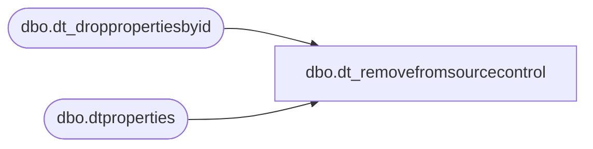

# dbo.dt_removefromsourcecontrol

**Database:** auditworks  
**Server:** bedrockdb01  

## Architecture Diagram



## Table Dependencies

| Referenced Table |
|---|
| dbo.dt_droppropertiesbyid |
| dbo.dtproperties |

## Stored Procedure Code

```sql
create procedure dbo.dt_removefromsourcecontrol

as

    set nocount on

    declare @iPropertyObjectId int
    select @iPropertyObjectId = (select objectid from dbo.dtproperties where property = 'VCSProjectID')

    exec dbo.dt_droppropertiesbyid @iPropertyObjectId, null

    /* -1 is returned by dt_droppopertiesbyid */
    if @@error <> 0 and @@error <> -1 return 1

    return 0
```

