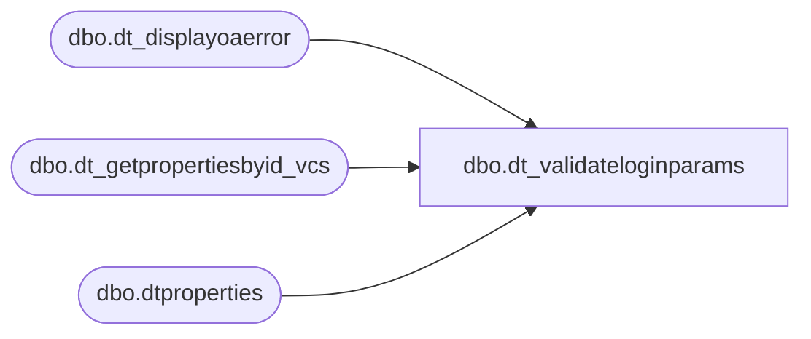

# dbo.dt_validateloginparams

**Database:** auditworks  
**Server:** bedrockdb01  

## Architecture Diagram



## Table Dependencies

| Referenced Table |
|---|
| dbo.dt_displayoaerror |
| dbo.dt_getpropertiesbyid_vcs |
| dbo.dtproperties |

## Stored Procedure Code

```sql
create proc dbo.dt_validateloginparams
    @vchLoginName  varchar(255),
    @vchPassword   varchar(255)
as

set nocount on

declare @iReturn int
declare @iObjectId int
select @iObjectId =0

declare @VSSGUID varchar(100)
select @VSSGUID = 'SQLVersionControl.VCS_SQL'

    declare @iPropertyObjectId int
    select @iPropertyObjectId = (select objectid from dbo.dtproperties where property = 'VCSProjectID')

    declare @vchSourceSafeINI varchar(255)
    exec dbo.dt_getpropertiesbyid_vcs @iPropertyObjectId, 'VCSSourceSafeINI', @vchSourceSafeINI OUT

    exec @iReturn = master.dbo.sp_OACreate @VSSGUID, @iObjectId OUT
    if @iReturn <> 0 GOTO E_OAError

    exec @iReturn = master.dbo.sp_OAMethod @iObjectId,
											'ValidateLoginParams',
											NULL,
											@sSourceSafeINI = @vchSourceSafeINI,
											@sLoginName = @vchLoginName,
											@sPassword = @vchPassword
    if @iReturn <> 0 GOTO E_OAError

CleanUp:
    return

E_OAError:
    exec dbo.dt_displayoaerror @iObjectId, @iReturn
    GOTO CleanUp
```

