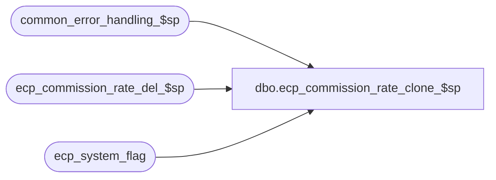

# dbo.ecp_commission_rate_clone_$sp

**Database:** auditworks  
**Server:** bedrockdb01  

## Architecture Diagram



## Table Dependencies

| Referenced Table |
|---|
| common_error_handling_$sp |
| ecp_commission_rate_del_$sp |
| ecp_system_flag |

## Stored Procedure Code

```sql
create proc [dbo].[ecp_commission_rate_clone_$sp] @clone_column	  nvarchar(30), --valid values are employee_commission_code, employee_transaction_role, item_commission_code, store_commission_code, transaction_commission_code
@source_code      nvarchar(20), --NO quotes
@dest_code_list nvarchar(3000), -- quoted, comma-delimited list
@replace_existing_configuration tinyint = 0, --0=Replace existing commission rate configuration for destination (if any) with that of source commission code;  1=Append source commission code's rate configuration to existing configuration for destination if any.
@process_id int = null
AS
/* 
Proc Name: ecp_commission_rate_clone_$sp 
Desc:   Called by front end.
        Applies the employee_commission_rate_def table entries for one commission code to another.

HISTORY:  
Date     Name           Def#    Desc
Apr14,11 Paul          126153   Use unicode datatypes
Apr18,08 Vicci          98558   Remove item_commission_code reference which had been hard-code for testing.
Feb27,08 Vicci          98558   Author
*/

SET NOCOUNT ON
DECLARE @errmsg                      nvarchar(255),
        @errno                       int,
        @errno2			     int,
        @message_id                  int,
        @object_name                 nvarchar(255),
        @operation_name              nvarchar(100),
        @process_name                nvarchar(100),
        @process_no                  int,
        @stream_no                   tinyint,
        @user_name                   nvarchar(30),
        @position		     smallint,
        @sql_command 	             nvarchar(3000),
        @issue			     tinyint,
        @dest_code		     nvarchar(20),
        @all			     nvarchar(3000)
  
SELECT @errno = 0,
       @message_id = 201068,
       @object_name = 'Unknown',
       @operation_name = 'Unknown',
       @process_name = 'ecp_commission_rate_clone_$sp',
       @process_no = 0,
       @stream_no = 1,
       @user_name = suser_sname(),
       @issue = 0,
       @all = '''-1'''

IF IsNull(@dest_code_list, '') = '' 
BEGIN
  SELECT @object_name = '@dest_code_list',
         @errmsg = 'Cannot proceed:  the @dest_code_list input parameter is invalid.',
         @operation_name = 'SELECT'
  GOTO error
END
IF IsNull(@source_code, '') = '' 
BEGIN
  SELECT @object_name = '@source_code',
         @errmsg = 'Cannot proceed:  the @source_code input parameter is invalid.',
         @operation_name = 'SELECT'
  GOTO error
END
--SELECT 'Test, @clone_column:  ', @clone_column
IF IsNull(@clone_column, '') NOT IN ('employee_commission_code', 'employee_transaction_role', 'item_commission_code', 'store_commission_code', 'transaction_commission_code') 
BEGIN
  SELECT @object_name = '@clone_column',
         @errmsg = 'Cannot proceed:  the @clone_column input parameter is invalid.',
         @operation_name = 'SELECT'
  GOTO error
END

--SELECT 'Test, @source_code:  ', @source_code
SELECT @sql_command = 'IF @source_code in (' + @dest_code_list + ') SELECT @issue = 1 SELECT @errno = @@error'
--SELECT 'Test', @sql_command  PRINT @sql_command
EXEC sp_executesql @sql_command, N'@source_code nvarchar(20), @issue tinyint OUT, @errno int OUT', @source_code, @issue OUT, @errno OUT   
SELECT @errno2 = @@error
IF @errno <> 0 OR @errno2 <> 0
BEGIN
  PRINT @sql_command
  IF @errno2 <> 0 SELECT @errno = @errno2
  SELECT @errmsg = 'Failed to check if source and destination overlap via dynamic SQL',
         @object_name = '@issue',
         @operation_name = 'SELECT'
  GOTO error
END
IF @issue = 1
BEGIN
  SELECT @errmsg = 'Cannot proceed:  the clone source and destination overlap',
         @object_name = '@dest_code_list',
         @operation_name = 'SELECT'
   GOTO error
END    

IF EXISTS (SELECT 1 
             FROM ecp_system_flag
            WHERE flag_name = 'ecp_rebuild_commission_rate' AND flag_numeric_value = 1)
BEGIN
  SELECT @errmsg = 'Recent configuration changes have not yet been processed.  Please try again later.',
      @message_id = 202018,
         @errno = 202018,
         @object_name = 'ecp_system_flag',
@operation_name = 'SELECT'
  GOTO error
END

IF @replace_existing_configuration = 1
BEGIN
  EXEC ecp_commission_rate_del_$sp @clone_column, @dest_code_list, @process_id  --note this should do an if-exists from employee_commission_rate first
  SELECT @errno = @@error
  IF @errno != 0 
  BEGIN
    IF @errmsg IS NULL /* then */
      SELECT @errmsg = 'Failed to remove pre-existing rate configuration of destination prior to cloning'
    SELECT @object_name = 'ecp_remove_comm_rate_$sp',
           @operation_name = 'EXECUTE'
    GOTO error
  END
  SELECT @sql_command = '
       UPDATE employee_commission_rate_def 
          SET ' + @clone_column + '= ' + @clone_column + ' + '','''''' + @dest_code + ''''''''
        WHERE employee_ecp_rate_id IN (SELECT DISTINCT employee_ecp_rate_id
                                           FROM employee_commission_rate_dtl
                                          WHERE ' + @clone_column + ' = @source_code)
          AND ' + @clone_column + ' <> @all'

END  --IF @replace_existing_configuration = 1
ELSE
BEGIN
SELECT @sql_command = '
       UPDATE employee_commission_rate_def 
          SET ' + @clone_column + '= ' + @clone_column + ' + '','''''' + @dest_code + ''''''''
        WHERE employee_ecp_rate_id IN (SELECT DISTINCT employee_ecp_rate_id
                                           FROM employee_commission_rate_dtl
                                          WHERE ' + @clone_column + ' = @source_code)
          AND employee_ecp_rate_id NOT IN (SELECT DISTINCT employee_ecp_rate_id
                                               FROM employee_commission_rate_dtl
                                               WHERE ' + @clone_column + ' = @dest_code) 
          AND ' + @clone_column + ' <> @all'
--SELECT 'Test update of employee commission rate def for source to include dest @sql_command:  ', @sql_command
END
--Remove quotes from comma delimited list
SELECT @position = CHARINDEX('''', @dest_code_list)
WHILE @position > 0
BEGIN
  SELECT @dest_code_list = stuff(@dest_code_list, CHARINDEX('''', @dest_code_list), 1, '')  
  SELECT @position = CHARINDEX('''', @dest_code_list)
END

SELECT @position = CHARINDEX(',', @dest_code_list)
WHILE @position > 0
BEGIN
  SELECT @dest_code = ltrim(rtrim(substring(@dest_code_list, 1, @position - 1)))
  --SELECT 'Test, @dest_code: ', @dest_code, @source_code
  EXEC sp_executesql @sql_command, N'@source_code nvarchar(20), @dest_code nvarchar(20), @all nvarchar(3000), @errno int OUT', @source_code, @dest_code, @all, @errno OUT   
  SELECT @errno2 = @@error
  IF @errno <> 0 OR @errno2 <> 0
  BEGIN
    PRINT @sql_command
    IF @errno2 <> 0 SELECT @errno = @errno2
    SELECT @errmsg = 'Update source commission rate definition to include ' + @dest_code + ' from list failed.',
           @object_name = 'employee_commission_rate_def',
           @operation_name = 'UPDATE'
    GOTO error
  END

  SELECT @dest_code_list = substring(@dest_code_list, @position + 1, 4000)
  SELECT @position = CHARINDEX(',', @dest_code_list)
END

SELECT @dest_code = (ltrim(rtrim(@dest_code_list)))
--SELECT 'Test, last @dest_code: ', @dest_code
EXEC sp_executesql @sql_command, N'@source_code nvarchar(20), @dest_code nvarchar(20), @all nvarchar(3000), @errno int OUT', @source_code, @dest_code, @all, @errno OUT   
SELECT @errno2 = @@error
IF @errno <> 0 OR @errno2 <> 0
BEGIN
  PRINT @sql_command
  IF @errno2 <> 0 SELECT @errno = @errno2
  SELECT @errmsg = 'Update source commission rate definition to include ' + @dest_code + ' failed.',
         @object_name = 'employee_commission_rate_def',
         @operation_name = 'UPDATE'
  GOTO error
END


RETURN

error:

  EXEC common_error_handling_$sp @process_no, @errno, @errmsg, 0, @message_id, @process_name, @object_name, @operation_name, 1, @stream_no

  RETURN
```

