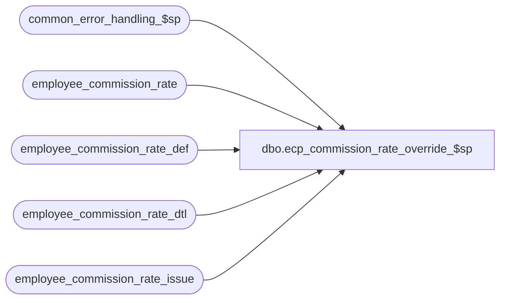

# dbo.ecp_commission_rate_override_$sp

**Database:** auditworks  
**Server:** bedrockdb01  

## Architecture Diagram



## Table Dependencies

| Referenced Table |
|---|
| common_error_handling_$sp |
| employee_commission_rate |
| employee_commission_rate_def |
| employee_commission_rate_dtl |
| employee_commission_rate_issue |

## Stored Procedure Code

```sql
create proc [dbo].[ecp_commission_rate_override_$sp] AS
/* 
Proc Name: ecp_commission_rate_override_$sp 
Desc:   Called by ecp_definition_explosion_$sp.
        Resolves any conflicting commission rate configuration definition entries
        resulting from the explosion of the employee_commission_rate_def table maintained
        by the user into the employee_commission_rate table used by the ecp postings.
        Assumes explosion code has been run first to populate the employee_commission_rate_dtl table.
        If conflicting configuration rows are not justified by an override sequence_no, then they
        will be logged as issues.
        

HISTORY:  
Date     Name           Def#    Desc
Apr14,11 Paul          126153   Use unicode datatypes
Oct27,08 Vicci         105964   Log comma-delimited list of conflicting ecp_rate_id as the issue description
Feb21,08 Vicci          98558   Author.  Order conflicting rows and replace them accordingly.
*/

SET NOCOUNT ON
DECLARE @employee_commission_code    nvarchar(20), 
        @employee_transaction_role   nvarchar(20), 
        @item_commission_code        nvarchar(20), 
        @store_commission_code       nvarchar(20), 
        @transaction_commission_code nvarchar(20), 
        @tier_accumulation_basis_flag     smallint,
        @issue_no                    int,
        @prior_issue_no		     int,
        @issue_desc	 	     nvarchar(2000),
        @cursor_open                 tinyint,
        @errmsg                      nvarchar(255),
        @errno                       int,
        @message_id                  int,
        @object_name                 nvarchar(255),
        @operation_name              nvarchar(100),
        @process_name                nvarchar(100),
        @process_no                  int,
        @stream_no                   tinyint,
        @user_name                   nvarchar(30),
        @max_effective_to_date	     datetime,
        @effective_to_date_low	     datetime,
        @min_effective_from_date     datetime,
        @first_fetch		     tinyint,
        @ecr_id_i		     numeric(12,0),
        @as_of_datetime 	     datetime,
        @tier_accumulation_basis_i     	smallint,
        @employee_ecp_rate_id_i 	numeric(12,0),
        @effective_from_date_i          datetime,
        @commission_rate_i              numeric(7,4),
        @commission_amount_per_item_i   money,
        @effective_to_date_i            datetime,
        @prior_sequence_no		int,
        @employee_ecp_rate_id 		numeric(12,0),
        @tier_accumulation_basis      	smallint,
        @effective_from_date          	datetime,
        @commission_rate              	numeric(7,4),
        @commission_amount_per_item   	money,
        @effective_to_date          	datetime,
        @sequence_no 			int

SELECT @errno = 0,
       @message_id = 201068,
       @object_name = 'Unknown',
       @operation_name = 'Unknown',
       @process_name = 'ecp_commission_rate_override_$sp',
       @process_no = 282,
       @stream_no = 1,
       @issue_no = 0, 
       @cursor_open = 0

CREATE TABLE #multi_rate_list( as_of_datetime datetime null,
       employee_commission_code nvarchar(20) not null,
       employee_transaction_role nvarchar(20) not null,
       item_commission_code nvarchar(20) not null,
       store_commission_code nvarchar(20) not null,
       transaction_commission_code nvarchar(20) not null,
       tier_accumulation_basis_flag tinyint not null)

CREATE TABLE #rate_issue_list( issue_no int not null,
       employee_commission_code nvarchar(20) not null,
       employee_transaction_role nvarchar(20) not null,
       item_commission_code nvarchar(20) not null,
       store_commission_code nvarchar(20) not null,
       transaction_commission_code nvarchar(20) not null,
       tier_accumulation_basis_flag tinyint not null,
       effective_from_date datetime not null,
       effective_to_date datetime null)

DECLARE as_of_date_cursor CURSOR FAST_FORWARD
    FOR 
 SELECT q.as_of_date
   FROM (SELECT DISTINCT effective_from_date as_of_date
           FROM employee_commission_rate_def
         UNION
         SELECT DISTINCT dateadd(ss, -1, dateadd(dd, 1, CONVERT(datetime, CONVERT(nvarchar,effective_to_date,101)))) as_of_date
     FROM employee_commission_rate_def) q
  ORDER BY IsNull(q.as_of_date, '01/01/3000')

OPEN as_of_date_cursor
SELECT @cursor_open = 1

FETCH as_of_date_cursor
 INTO @as_of_datetime

WHILE @@fetch_status = 0 
BEGIN
  --TEST
  --select 'Test0, as of date', @as_of_datetime
  --END TEST
  INSERT into #multi_rate_list( 
         as_of_datetime,
         employee_commission_code,
         employee_transaction_role,
         item_commission_code,
         store_commission_code,
         transaction_commission_code,
         tier_accumulation_basis_flag)
  SELECT @as_of_datetime,
         employee_commission_code, 
         employee_transaction_role, 
         item_commission_code, 
         store_commission_code, 
         transaction_commission_code, 
         CASE WHEN sign(tier_accumulation_basis) > 0 THEN 1 ELSE 0 END
    FROM employee_commission_rate_dtl
   WHERE (effective_from_date <= @as_of_datetime OR @as_of_datetime IS NULL)
     AND (effective_to_date >= @as_of_datetime
          OR effective_to_date IS NULL)
   GROUP BY employee_commission_code, 
         employee_transaction_role, 
         item_commission_code, 
         store_commission_code, 
         transaction_commission_code, 
         CASE WHEN sign(tier_accumulation_basis) > 0 THEN 1 ELSE 0 END
  HAVING COUNT(*) > 1

  FETCH as_of_date_cursor
   INTO @as_of_datetime
END -- while not end of as_of_date_cursor

CLOSE as_of_date_cursor
DEALLOCATE as_of_date_cursor 
SELECT @cursor_open = 0

TRUNCATE TABLE employee_commission_rate
SELECT @errno = @@error
IF @errno <> 0
BEGIN
  SELECT @errmsg = 'Unable to clean up employee_commission_rate table in preparation for rebuild',
         @object_name = 'employee_commission_rate',
         @operation_name = 'TRUNCATE'
  GOTO error
END

--select 'Test0, start time', getdate(), convert(nvarchar, getdate(), 108)

DECLARE multi_rate_cursor CURSOR FAST_FORWARD
    FOR 
 SELECT DISTINCT 
        employee_commission_code, 
        employee_transaction_role, 
        item_commission_code, 
        store_commission_code, 
        transaction_commission_code, 
        tier_accumulation_basis_flag
   FROM #multi_rate_list

OPEN multi_rate_cursor
SELECT @cursor_open = 2

FETCH multi_rate_cursor 
 INTO @employee_commission_code, 
      @employee_transaction_role, 
      @item_commission_code, 
      @store_commission_code, 
      @transaction_commission_code, 
      @tier_accumulation_basis_flag

WHILE @@fetch_status = 0 
BEGIN
--TEST
--select 'Test1, multi_rate_cursor', @employee_commission_code, @employee_transaction_role, @item_commission_code, @store_commission_code, @transaction_commission_code, @tier_accumulation_basis_flag
--END TEST

  SELECT @ecr_id_i = NULL,
         @employee_ecp_rate_id_i = null,
       	 @tier_accumulation_basis_i = null,
       	 @effective_from_date_i = null,
         @commission_rate_i = null,
         @commission_amount_per_item_i = null,
         @effective_to_date_i = null,
         @issue_no = @issue_no + 1

  DECLARE override_rate_cursor CURSOR FAST_FORWARD
      FOR 
   SELECT employee_ecp_rate_id,
       	  tier_accumulation_basis,
       	  effective_from_date,
          commission_rate,
          commission_amount_per_item,
          effective_to_date,
          sequence_no
     FROM employee_commission_rate_dtl
    WHERE employee_commission_code = @employee_commission_code
      AND employee_transaction_role = @employee_transaction_role
      AND item_commission_code = @item_commission_code
      AND store_commission_code = @store_commission_code
      AND transaction_commission_code = @transaction_commission_code
      AND CASE WHEN sign(tier_accumulation_basis) > 0 THEN 1 ELSE 0 END = @tier_accumulation_basis_flag
    ORDER BY sequence_no,
          effective_from_date,
          effective_to_date

  OPEN override_rate_cursor
  SELECT @cursor_open = 3

  FETCH override_rate_cursor
   INTO @employee_ecp_rate_id,
       	@tier_accumulation_basis,
       	@effective_from_date,
        @commission_rate,
        @commission_amount_per_item,
        @effective_to_date,
        @sequence_no
        
  SELECT @max_effective_to_date = @effective_to_date,
         @min_effective_from_date = @effective_from_date,
         @first_fetch = 1
  
  WHILE @@fetch_status = 0 
  BEGIN   

--TEST
--select 'Test1,		override_rate_cursor, id/from/to', @employee_ecp_rate_id, @effective_from_date, @effective_to_date
--END TEST

    IF @first_fetch = 1
       OR @effective_from_date > @max_effective_to_date  --no overlap
       OR @effective_to_date < @min_effective_from_date --no overlap
    BEGIN
--TEST
--select 'Test1,		this is first fetch or no overlap'
--END TEST    
      INSERT into employee_commission_rate(
             employee_ecp_rate_id,
             employee_commission_code,
             employee_transaction_role,
             item_commission_code,
             store_commission_code,
             transaction_commission_code,
             tier_accumulation_basis,
             effective_from_date,
             commission_rate,
             commission_amount_per_item,
             effective_to_date)
      VALUES (@employee_ecp_rate_id,
             @employee_commission_code,
             @employee_transaction_role,
             @item_commission_code,
             @store_commission_code,
             @transaction_commission_code,
             @tier_accumulation_basis,
             @effective_from_date,
             @commission_rate,
             @commission_amount_per_item,
             @effective_to_date)
      SELECT @errno = @@error
      IF @errno <> 0
      BEGIN
        SELECT @errmsg = 'Unable to log first multi-rate record to employee commission rate',
               @object_name = 'employee_commission_rate',
               @operation_name = 'INSERT'
        GOTO error
      END
    END  --IF first fetch or no overlap
    ELSE
    BEGIN
      SELECT @ecr_id_i = NULL
      IF @effective_from_date >= @min_effective_from_date
      BEGIN
        SELECT @effective_from_date_i = effective_from_date,
               @effective_to_date_i = effective_to_date,
               @employee_ecp_rate_id_i = employee_ecp_rate_id,
               @tier_accumulation_basis_i = tier_accumulation_basis,
               @commission_rate_i = commission_rate,
               @commission_amount_per_item_i = commission_amount_per_item,
               @ecr_id_i = ecr_id
          FROM employee_commission_rate
         WHERE employee_commission_code = @employee_commission_code 
           AND employee_transaction_role = @employee_transaction_role 
           AND item_commission_code = @item_commission_code 
           AND store_commission_code = @store_commission_code 
           AND transaction_commission_code = @transaction_commission_code 
	   AND CASE WHEN sign(tier_accumulation_basis) > 0 THEN 1 ELSE 0 END = @tier_accumulation_basis_flag
	   AND effective_from_date <= @effective_from_date
	   AND (effective_to_date >= @effective_from_date OR effective_to_date IS NULL)
        SELECT @errno = @@error
        IF @errno <> 0
        BEGIN
          SELECT @errmsg = 'Unable to find employee commission rate row to update',
                 @object_name = 'employee_commission_rate',
                 @operation_name = 'SELECT'
          GOTO error
        END

        IF @ecr_id_i IS NOT NULL
        BEGIN
	  IF (@effective_to_date <= @effective_to_date_i OR @effective_to_date_i IS NULL)
            SELECT @effective_to_date_low = @effective_to_date
          ELSE 
            SELECT @effective_to_date_low = @effective_to_date_i

          IF @effective_from_date = @effective_from_date_i
          BEGIN
            UPDATE employee_commission_rate
               SET tier_accumulation_basis = @tier_accumulation_basis,
                   commission_rate = @commission_rate,
                   commission_amount_per_item = @commission_amount_per_item,
                   effective_to_date = @effective_to_date_low,
                   employee_ecp_rate_id = @employee_ecp_rate_id
             WHERE ecr_id = @ecr_id_i
            SELECT @errno = @@error
            IF @errno <> 0
            BEGIN
              SELECT @errmsg = 'Unable to overrid employee commission rate',
                     @object_name = 'employee_commission_rate',
                     @operation_name = 'UPDATE'
              GOTO error 
            END
          END  --if row to update has same from date
          ELSE
          BEGIN
            UPDATE employee_commission_rate
               SET effective_to_date = dateadd(ss, -1, @effective_from_date)
             WHERE ecr_id = @ecr_id_i
            SELECT @errno = @@error
            IF @errno <> 0
            BEGIN
              SELECT @errmsg = 'Unable to override employee commission rate effective to date',
                     @object_name = 'employee_commission_rate',
                     @operation_name = 'UPDATE'
              GOTO error 
            END

            INSERT into employee_commission_rate(
                   employee_ecp_rate_id,
                   employee_commission_code,
                   employee_transaction_role,
                   item_commission_code,
                   store_commission_code,
                   transaction_commission_code,
                   tier_accumulation_basis,
                   effective_from_date,
                   commission_rate,
                   commission_amount_per_item,
                   effective_to_date)
            VALUES (@employee_ecp_rate_id,
                    @employee_commission_code,
                    @employee_transaction_role,
                    @item_commission_code,
                    @store_commission_code,
                    @transaction_commission_code,
                    @tier_accumulation_basis,
                    @effective_from_date,
                    @commission_rate,
                    @commission_amount_per_item,
                    @effective_to_date_low)
            SELECT @errno = @@error
            IF @errno <> 0
            BEGIN
              SELECT @errmsg = 'Unable to log split employee commission rate',
                     @object_name = 'employee_commission_rate',
                     @operation_name = 'INSERT'
              GOTO error 
            END
          END  --ELSE of IF row to update has same from date
          IF @effective_to_date < @effective_to_date_i OR (@effective_to_date_i IS NULL AND @effective_to_date IS NOT NULL)
          BEGIN
            INSERT into employee_commission_rate(
                   employee_ecp_rate_id,
                   employee_commission_code,
                   employee_transaction_role,
                   item_commission_code,
                   store_commission_code,
                   transaction_commission_code,
                   tier_accumulation_basis,
                   effective_from_date,
                   commission_rate,
                   commission_amount_per_item,
                   effective_to_date)
            VALUES (@employee_ecp_rate_id_i,
                    @employee_commission_code,
                    @employee_transaction_role,
                    @item_commission_code,
                    @store_commission_code,
                    @transaction_commission_code,
                    @tier_accumulation_basis_i,
                    dateadd(ss, 1, @effective_to_date),
                    @commission_rate_i,
                    @commission_amount_per_item_i,
                    @effective_to_date_i)   
            SELECT @errno = @@error
            IF @errno <> 0
            BEGIN
              SELECT @errmsg = 'Unable to log another split employee commission rate',
                     @object_name = 'employee_commission_rate',
                     @operation_name = 'INSERT'
              GOTO error 
            END
          END  --if replacement rate expires earlier
        END  --if there is a row to update
      END  --IF @effective_from_date >= @min_effective_from_date
      ELSE
      BEGIN
        INSERT into employee_commission_rate(
               employee_ecp_rate_id,
               employee_commission_code,
               employee_transaction_role,
               item_commission_code,
               store_commission_code,
               transaction_commission_code,
               tier_accumulation_basis,
               effective_from_date,
               commission_rate,
               commission_amount_per_item,
               effective_to_date)
        VALUES (@employee_ecp_rate_id,
                @employee_commission_code,
                @employee_transaction_role,
                @item_commission_code,
                @store_commission_code,
                @transaction_commission_code,
                @tier_accumulation_basis,
                @effective_from_date,
                @commission_rate,
                @commission_amount_per_item,
                dateadd(ss, -1, @min_effective_from_date))
         SELECT @errno = @@error
         IF @errno <> 0
         BEGIN
           SELECT @errmsg = 'Unable to log earliest rate',
                  @object_name = 'employee_commission_rate',
                  @operation_name = 'INSERT'
           GOTO error 
         END
      END  --ELSE of IF @effective_from_date >= @min_effective_from_date
      
      IF @ecr_id_i IS NULL 
         OR (@ecr_id_i IS NOT NULL AND (@effective_to_date > @effective_to_date_i 
                                        OR (@effective_to_date IS NULL AND @effective_to_date_i IS NOT NULL)))
      BEGIN
        SELECT @ecr_id_i = NULL
        IF @effective_to_date <= @max_effective_to_date OR @max_effective_to_date IS NULL
        BEGIN
          SELECT @effective_from_date_i = effective_from_date,
                 @effective_to_date_i = effective_to_date,
                 @employee_ecp_rate_id_i = employee_ecp_rate_id,
                 @tier_accumulation_basis_i = tier_accumulation_basis,
                 @commission_rate_i = commission_rate,
                 @commission_amount_per_item_i = commission_amount_per_item,
                 @ecr_id_i = ecr_id
            FROM employee_commission_rate
           WHERE employee_commission_code = @employee_commission_code 
             AND employee_transaction_role = @employee_transaction_role 
             AND item_commission_code = @item_commission_code 
             AND store_commission_code = @store_commission_code 
             AND transaction_commission_code = @transaction_commission_code 
	     AND CASE WHEN sign(tier_accumulation_basis) > 0 THEN 1 ELSE 0 END = @tier_accumulation_basis_flag
	     AND (effective_from_date <= @effective_to_date OR @effective_to_date IS NULL)
	     AND (effective_to_date >= @effective_to_date OR effective_to_date IS NULL)
          SELECT @errno = @@error
          IF @errno <> 0
          BEGIN
            SELECT @errmsg = 'Unable to find row to update',
                   @object_name = 'employee_commission_rate',
                   @operation_name = 'SELECT'
            GOTO error 
          END

	END --IF @effective_to_date <= @max_effective_to_date OR @max_effective_to_date IS NULL
        IF @ecr_id_i IS NOT NULL
        BEGIN
          UPDATE employee_commission_rate
             SET tier_accumulation_basis = @tier_accumulation_basis,
                 commission_rate = @commission_rate,
 commission_amount_per_item = @commission_amount_per_item,
                 effective_to_date = @effective_to_date,
                 employee_ecp_rate_id = @employee_ecp_rate_id
           WHERE ecr_id = @ecr_id_i
          SELECT @errno = @@error
          IF @errno <> 0
          BEGIN
            SELECT @errmsg = 'Unable to override rate',
                   @object_name = 'employee_commission_rate',
                   @operation_name = 'UPDATE'
            GOTO error 
          END

          IF @effective_to_date_i <> @effective_to_date 
            OR (@effective_to_date_i IS NULL AND @effective_to_date IS NOT NULL)
          BEGIN
            INSERT into employee_commission_rate(
                   employee_ecp_rate_id,
                   employee_commission_code,
                   employee_transaction_role,
                   item_commission_code,
                   store_commission_code,
                   transaction_commission_code,
                   tier_accumulation_basis,
                   effective_from_date,
                   commission_rate,
                   commission_amount_per_item,
                   effective_to_date)
            VALUES (@employee_ecp_rate_id_i,
                   @employee_commission_code,
                   @employee_transaction_role,
                   @item_commission_code,
                   @store_commission_code,
                   @transaction_commission_code,
                   @tier_accumulation_basis_i,
                   dateadd(ss, 1, @effective_to_date),
                   @commission_rate_i,
                   @commission_amount_per_item_i,
                   @effective_to_date_i)
            SELECT @errno = @@error
            IF @errno <> 0
            BEGIN
              SELECT @errmsg = 'Unable to split rate row',
                     @object_name = 'employee_commission_rate',
                     @operation_name = 'INSERT'
              GOTO error 
            END
          END  --If row containing @effective_to_date that is being updated expires later
        END  --if a row containing @effective_to_date found to be updated
        ELSE
        BEGIN
            INSERT into employee_commission_rate(
                   employee_ecp_rate_id,
                   employee_commission_code,
                   employee_transaction_role,
                   item_commission_code,
                   store_commission_code,
                   transaction_commission_code,
                   tier_accumulation_basis,
                   effective_from_date,
                   commission_rate,
                   commission_amount_per_item,
                   effective_to_date)
           VALUES (@employee_ecp_rate_id,
                   @employee_commission_code,
                   @employee_transaction_role,
                   @item_commission_code,
                   @store_commission_code,
                   @transaction_commission_code,
                   @tier_accumulation_basis,
                   dateadd(ss, 1, @max_effective_to_date),
                   @commission_rate,
                   @commission_amount_per_item,
                   @effective_to_date) 
            SELECT @errno = @@error
            IF @errno <> 0
            BEGIN
              SELECT @errmsg = 'Unable mark rate as being an issue',
                     @object_name = 'employee_commission_rate',
                     @operation_name = 'INSERT'
              GOTO error 
            END
        END --ELSE of if a row containing @effective_to_date found to be updated
      END  --if no row with from date updated or new row expires later than row updated

--TEST
--select 'Test1,		this is overlap of', @prior_sequence_no, @sequence_no
--END TEST    

      IF @prior_sequence_no = @sequence_no
      BEGIN
        INSERT into #rate_issue_list( 
               issue_no,
               employee_commission_code,
       employee_transaction_role,
               item_commission_code,
               store_commission_code,
               transaction_commission_code,
               tier_accumulation_basis_flag,
               effective_from_date,
               effective_to_date)
        VALUES (@issue_no,
               @employee_commission_code, 
               @employee_transaction_role, 
               @item_commission_code,
               @store_commission_code,
               @transaction_commission_code, 
               @tier_accumulation_basis_flag,
               @effective_from_date,
               @effective_to_date)
        SELECT @errno = @@error
        IF @errno <> 0
        BEGIN
          SELECT @errmsg = 'Unable to mark rate as issue',
                 @object_name = '#rate_issue_list',
                 @operation_name = 'INSERT'
          GOTO error 
        END
      END --if overlay not requested by user setting sequence number
    END  --ELSE of IF first fetch or no overlap

    IF @effective_to_date > @max_effective_to_date OR @effective_to_date IS NULL
      SELECT @max_effective_to_date = @effective_to_date

    IF @effective_from_date < @min_effective_from_date
      SELECT @min_effective_from_date = @effective_from_date

    SELECT @prior_sequence_no = @sequence_no

    FETCH override_rate_cursor
     INTO @employee_ecp_rate_id,
       	  @tier_accumulation_basis,
       	  @effective_from_date,
          @commission_rate,
          @commission_amount_per_item,
          @effective_to_date,
          @sequence_no
   SELECT @first_fetch = 0
  END -- while not end of override_rate_cursor

  CLOSE override_rate_cursor
  DEALLOCATE override_rate_cursor 
  SELECT @cursor_open = 2

  FETCH multi_rate_cursor
   INTO @employee_commission_code, 
        @employee_transaction_role, 
        @item_commission_code, 
        @store_commission_code, 
        @transaction_commission_code, 
        @tier_accumulation_basis_flag
END -- while not end of multi_rate_cursor

CLOSE multi_rate_cursor
DEALLOCATE multi_rate_cursor 
SELECT @cursor_open = 0
--TEST
--select 'Test0, end time', getdate(), convert(nvarchar, getdate(), 108)
--select 'Test2, employee_commission_rate'
--select 'Test2, employee_commission_rate', * from employee_commission_rate
--END TEST
INSERT into employee_commission_rate(
       employee_ecp_rate_id,
       employee_commission_code,
       employee_transaction_role,
       item_commission_code,
       store_commission_code,
       transaction_commission_code,
       tier_accumulation_basis,
       effective_from_date,
       commission_rate,
       commission_amount_per_item,
       effective_to_date)
SELECT d.employee_ecp_rate_id,
       d.employee_commission_code,
       d.employee_transaction_role,
       d.item_commission_code,
       d.store_commission_code,
       d.transaction_commission_code,
       d.tier_accumulation_basis,
       d.effective_from_date,
       d.commission_rate,
       d.commission_amount_per_item,
       d.effective_to_date
  FROM employee_commission_rate_dtl d
 WHERE 1 NOT IN (SELECT 1
                   FROM #multi_rate_list i
                  WHERE i.employee_commission_code = d.employee_commission_code 
                    AND i.employee_transaction_role = d.employee_transaction_role
                    AND i.item_commission_code = d.item_commission_code 
                    AND i.store_commission_code = d.store_commission_code 
                    AND i.transaction_commission_code = d.transaction_commission_code
                    AND i.tier_accumulation_basis_flag = CASE WHEN sign(d.tier_accumulation_basis) > 0 THEN 1 ELSE 0 END)

--TEST
--select 'Test0, employee_commission_rate rowcount'
--select 'Test0, employee_commission_rate rowcount', count(*) from employee_commission_rate
--select 'Test2, #multi_rate_list'
--select 'Test2, #multi_rate_list', * FROM #multi_rate_list
--select 'Test2, #rate_issue_list'
--select 'Test2, #rate_issue_list', * FROM #rate_issue_list
--END TEST

TRUNCATE TABLE employee_commission_rate_issue
SELECT @errno = @@error
IF @errno <> 0
BEGIN
  SELECT @errmsg = 'Unable to cleanup commission rate issues',
   @object_name = 'employee_commission_rate_issue',
         @operation_name = 'TRUNCATE'
  GOTO error
END

INSERT into employee_commission_rate_issue(
       issue_no,
       employee_commission_code,
       employee_transaction_role,
       item_commission_code,
       store_commission_code,
       transaction_commission_code,
       employee_ecp_rate_id,
       effective_from_date,
       effective_to_date,
       tier_accumulation_basis,
       commission_rate,
       commission_amount_per_item)
SELECT DISTINCT i.issue_no, 
       i.employee_commission_code,
       i.employee_transaction_role,
       i.item_commission_code,
       i.store_commission_code,
       i.transaction_commission_code,
       d.employee_ecp_rate_id,
       d.effective_from_date,
       d.effective_to_date,         
       d.tier_accumulation_basis,
       d.commission_rate,
       d.commission_amount_per_item
  FROM #rate_issue_list i, employee_commission_rate_dtl d
 WHERE i.employee_commission_code = d.employee_commission_code  
   AND i.employee_transaction_role = d.employee_transaction_role  
   AND i.item_commission_code = d.item_commission_code  
   AND i.store_commission_code = d.store_commission_code 
   AND i.transaction_commission_code = d.transaction_commission_code   
   AND i.tier_accumulation_basis_flag = CASE WHEN sign(d.tier_accumulation_basis) > 0 THEN 1 ELSE 0 END  
   AND ((d.effective_from_date <= i.effective_from_date
         AND (d.effective_to_date >= i.effective_from_date OR d.effective_to_date IS NULL))
        OR
        ((d.effective_from_date <= i.effective_to_date OR i.effective_to_date IS NULL)
          AND (d.effective_to_date >= i.effective_from_date OR d.effective_to_date IS NULL)) )
SELECT @errno = @@error
IF @errno <> 0
BEGIN
  SELECT @errmsg = 'Unable to list commission rate issues',
         @object_name = 'employee_commission_rate_issue',
         @operation_name = 'INSERT'
  GOTO error
END

--select 'Test0, employee_commission_rate_issue rowcount'
--select 'Test0, employee_commission_rate_issue rowcount', count(*) from employee_commission_rate_issue

DROP TABLE #multi_rate_list
SELECT @errno = @@error
IF @errno <> 0
BEGIN
  SELECT @errmsg = 'Unable to remove temporary multiple-rate list',
         @object_name = '#multi_rate_list',
         @operation_name = 'DROP'
  GOTO error
END
DROP TABLE #rate_issue_list
SELECT @errno = @@error
IF @errno <> 0
BEGIN
  SELECT @errmsg = 'Unable to remove temporary issue list',
         @object_name = '#rate_issue_list',
         @operation_name = 'DROP'
  GOTO error
END

DECLARE issue_cursor CURSOR FAST_FORWARD
    FOR
 SELECT DISTINCT issue_no, employee_ecp_rate_id
   FROM employee_commission_rate_issue
  ORDER BY issue_no

OPEN issue_cursor
SELECT @cursor_open = 4,
       @issue_no = null, @employee_ecp_rate_id = null, @prior_issue_no = null, @issue_desc = ''

FETCH issue_cursor
 INTO @issue_no, @employee_ecp_rate_id

WHILE @@fetch_status = 0 
BEGIN
  IF @prior_issue_no = @issue_no
    SELECT @issue_desc = @issue_desc + ',' + convert(nvarchar, @employee_ecp_rate_id)
  ELSE
    SELECT @issue_desc = convert(nvarchar, @employee_ecp_rate_id), @prior_issue_no = @issue_no
  
  FETCH issue_cursor
   INTO @issue_no, @employee_ecp_rate_id

  IF @@fetch_status <> 0 OR @issue_no <> @prior_issue_no
  BEGIN
    UPDATE employee_commission_rate_issue
       SET issue_desc = @issue_desc
     WHERE issue_no = @prior_issue_no
     SELECT @errno = @@error
     IF @errno <> 0
     BEGIN
       SELECT @errmsg = 'Unable to add conflicting rate id list as description of issue',
              @object_name = 'employee_commission_rate_issue',
              @operation_name = 'UPDATE'
       GOTO error
     END

    SELECT @issue_desc = ''
  END
END /* while not end of issue_cursor */

CLOSE issue_cursor
DEALLOCATE issue_cursor 
SELECT @cursor_open = 0


RETURN

error:
  IF @cursor_open = 1
  BEGIN
    CLOSE as_of_date_cursor
    DEALLOCATE as_of_date_cursor 
    SELECT @cursor_open = 0
  END

  IF @cursor_open = 3
  BEGIN
    CLOSE override_rate_cursor
    DEALLOCATE override_rate_cursor 
    SELECT @cursor_open = 2
  END

  IF @cursor_open = 2
  BEGIN
    CLOSE multi_rate_cursor
    DEALLOCATE multi_rate_cursor 
    SELECT @cursor_open = 0
  END
  
  IF @cursor_open = 4
  BEGIN 
    CLOSE issue_cursor
    DEALLOCATE issue_cursor 
    SELECT @cursor_open = 0
  END

  EXEC common_error_handling_$sp @process_no, @errno, @errmsg, 0, @message_id, @process_name, @object_name, @operation_name, 1, @stream_no

  RETURN
```

