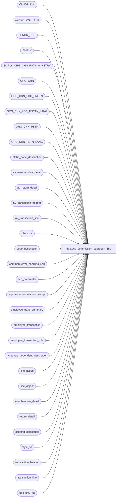

# dbo.ecp_commission_subreport_$sp

**Database:** auditworks  
**Server:** bedrockdb01  

## Architecture Diagram



## Table Dependencies

| Referenced Table |
|---|
| CLNDR_LVL |
| CLNDR_LVL_TYPE |
| CLNDR_PRD |
| EMPLY |
| EMPLY_ORG_CHN_PSTN_A_HSTRY |
| ORG_CHN |
| ORG_CHN_LOC_FNCTN |
| ORG_CHN_LOC_FNCTN_LANG |
| ORG_CHN_PSTN |
| ORG_CHN_PSTN_LANG |
| alpha_code_description |
| av_merchandise_detail |
| av_return_detail |
| av_transaction_header |
| av_transaction_line |
| class_sa |
| code_description |
| common_error_handling_$sp |
| ecp_parameter |
| ecp_trace_commission_subrpt |
| employee_trans_summary |
| employee_transaction |
| employee_transaction_role |
| language_dependent_description |
| line_action |
| line_object |
| merchandise_detail |
| return_detail |
| scoping_salesaudit |
| style_sa |
| transaction_header |
| transaction_line |
| upc_only_sa |

## Stored Procedure Code

```sql
CREATE proc [dbo].[ecp_commission_subreport_$sp]   @drill_down_column nvarchar(30) = null,  --if not specified assumes lvl1_net_amt (examples: lvl1_commission_amt, lvl1_sale_amt, lvl1_rtn_amt, lvl1_net_amt, etc)
  @select_from_date datetime = null,  --for drill-downs, set the from/to same as that of the original report selection criteria
                                      --all periods with at least 1 date falling between the range selected are included
  @select_to_date datetime = null,    --for drill-downs, set the from/to same as that of the original report selection criteria
  @empl_calendar_level_list nvarchar(4000) = null,  --for drill-downs, set same as that of the original report selection criteria
  @select_transaction_role_list nvarchar(4000) = null,  --from drill-down row
  @select_store_list nvarchar(4000) = null,  --from drill-down row transaction store unless -9999 in which case from report input parameters
  @select_store_from int = null, 
  @select_store_to int = null, 
  @select_employee_list nvarchar(4000) = null, --from drill-down row
  @select_employee_from int = null,
  @select_employee_to int = null,
  @select_selling_area_list nvarchar(4000) = null, --from drill-down row primary_selling_area_no_dtl unless -9999 in which case from input parameters
  @select_selling_area_from int = null,
  @select_selling_area_to int = null,
  @select_primary_position_list nvarchar(4000) = null, --from drill-down row
  @select_trans_commission_code nvarchar(20) = null, --from drill-down row
  @select_commission_rate nvarchar(255) = null, --from drill-down row
  @select_item_commission_code nvarchar(20) = null, --from drill-down row
  @language_id smallint = null,  --if not specified defaults to 1033 i.e. English
  @user_name nvarchar(30) = null,
  @other_store_flag tinyint = 0,
  @other_selling_area_flag tinyint = 0
AS
/* 
Proc Name: ecp_commission_subreport_$sp 
Desc:   Retrieves transactions for ECP Employee Commission Report drill-down.

HISTORY:  
Date     Name           Def#    Desc
Mar23,15 Vicci       TFS-92911  Handle employees with selling area -1.
Mar18,15 Vicci     TFS-111538   If a drill-down of '..' is passed as the @select_transaction_role_list, this indicates that the user has erroneously 
                                attempted to drill down on the Sale or Return amount of a line bearing only commission adjustments from a commission 
                                report formatted with Include Transaction Role deselected (unchecked), so return no data (i.e. treat as null) rather
                                than raising an invalid @select_transaction_role_list error.
May09,14 Vicci      TFS-72556   Correct alias used for language_dependent_description association with line_action to be aldd instead of al since al alias already used by av_transaction_line reference.
Apr01,13 Vicci         140907	Handle multi-language
Sep08,08 Vicci         104576   Replace upc_sa join with join to underlying views.
Sep02,08 Vicci         104510   Correct join to upc_sa
Aug12,08 Vicci         103077   Home Store / Selling area effective date support.
Feb08,08 Vicci          97975   Set errno not just message_id when raising business rule error
Dec12,07 Vicci          95521   Replace double-quoted identifier usage with single quote
Nov26,07 Vicci          95521   Integrate with CRDM properly.            
Nov07,07 Vicci          94751   Add trace;  Fix retrieval to support commission reports where lowest calendar level not included in the report.
Oct03,07 Vicci          85597   Instead of receiving store -9999 receive @other_store_flag
Aug23,07 Vicci          85597   Treat store -9999 as an "other than home-store" drill down.
Jul04,07 Vicci          85597   Return message if prior version of transaction applies, if entry is an inter-summary-id 
                                reversal, or if entry has since been reassigned.
Jul02,07 Vicci          85597   Include transactions with current_flag = 2 (reversal went to different summary-id) in drill down.
Jul02,07 Vicci          85597   Handle invalid selling area and/or primary position being passed in.
Jun28,07 Vicci          85597   Return store_no from transaction header not from employee trans summary so that it is 
                                right in the case of returns from another store.
May30,07 Vicci          85597   Add missing order-by clause to ad-hoc calendar period selection
May08,07 Vicci          85597   Remove reference to primary position of employee_transaction_role
Mar16,07 Vicci		85597	Author
*/
/*
DECLARE 
  @drill_down_column nvarchar(30),
  @select_from_date datetime, @select_to_date datetime, @empl_calendar_level_list nvarchar(4000),
  @select_transaction_role_list nvarchar(4000),
  @select_store_list nvarchar(4000), @select_store_from int, @select_store_to int,
  @select_employee_list nvarchar(4000), @select_employee_from int, @select_employee_to int,
  @select_selling_area_list nvarchar(4000), @select_selling_area_from int, @select_selling_area_to int,
  @select_primary_position_list nvarchar(4000),
   @select_trans_commission_code nvarchar(20),
   @select_commission_rate nvarchar(255),
   @select_item_commission_code nvarchar(20),
 @language_id smallint, @user_name nvarchar(30)

select @select_primary_position_list = "'A', 'B', 'C'"
exec ecp_commission_subreport_$sp   
  @drill_down_column,
  @select_from_date, @select_to_date, @empl_calendar_level_list, 
  @select_transaction_role_list,
  @select_store_list, @select_store_from, @select_store_to,
  @select_employee_list, @select_employee_from, @select_employee_to,
  @select_selling_area_list, @select_selling_area_from, @select_selling_area_to,
  @select_primary_position_list,
   @select_trans_commission_code,
   @select_commission_rate,
   @select_item_commission_code,
 @language_id, @user_name
*/

--TODO:  multi-language
--TODO:  audit groups
--TODO:  include commission adjustment amounts
--TEST

SET NOCOUNT ON
DECLARE
  @ecp_clndr_id			binary(16),
  @employee_count		int,
  @from_date 			datetime,
  @calendar_level_count		int,
  @lowest_calendar_level	int,
  @lowest_calendar_level_id	binary(16),
  @one_hundred			money,
  @empl_transaction_role_count  int, 
  @errmsg                       nvarchar(255),
  @errno                        int,
  @function_name	        varbinary(128),
  @highest_calendar_level	int,
  @highest_calendar_level_id	binary(16),
  @message_id                   int,
  @position_count		int,
  @process_name                 nvarchar(100),
  @process_no                   int,
  @object_name                  nvarchar(255),
  @operation_name               nvarchar(100),
  @position 			int,
  @rows				int,
  @select_calendar_level 	int,
  @select_calendar_level_id 	binary(16),
  @select_calendar_level_seq    tinyint,
  @selling_area_count		int,
  @store_count			int,
  @stream_no                    tinyint,
  @to_date 			datetime,
  @sql_command 			nvarchar(4000),
  @exclude_home_store           tinyint,       --if drilling down on the "other stores" row set to true
  @trace_log		        tinyint,
  @SINCEREASSIGNED_desc		nvarchar(255),
  @SEEPRIORVERSION_desc		nvarchar(255),
  @REVERSAL_desc		nvarchar(255)
  
SELECT @trace_log = 1
IF @trace_log = 1
BEGIN
if not exists (select * from dbo.sysobjects where id = Object_id('dbo.ecp_trace_commission_subrpt') and type in ('U','S'))
begin
  create table dbo.ecp_trace_commission_subrpt (
  execution_datetime datetime default getdate() not null,
  drill_down_column nvarchar(30) null,
  select_from_date datetime null,
  select_to_date datetime null,
  empl_calendar_level_list nvarchar(4000) null,
  select_transaction_role_list nvarchar(4000) null,
  select_store_list nvarchar(4000) null,
  select_store_from int null, 
  select_store_to int null, 
  select_employee_list nvarchar(4000) null, 
  select_employee_from int null,
  select_employee_to int null,
  select_selling_area_list nvarchar(4000) null, 
  select_selling_area_from int null,
  select_selling_area_to int null,
  select_primary_position_list nvarchar(4000) null, 
  select_trans_commission_code nvarchar(20) null, 
  select_commission_rate nvarchar(255) null, 
  select_item_commission_code nvarchar(20) null, 
  language_id smallint null, 
  user_name nvarchar(30) null,
  other_store_flag tinyint null,
  other_selling_area_flag tinyint null
)
end
else
BEGIN
    DELETE ecp_trace_commission_subrpt
     WHERE execution_datetime < dateadd(dd, -4, getdate())
END
INSERT into ecp_trace_commission_subrpt(
       drill_down_column,
       select_from_date,
       select_to_date,
       empl_calendar_level_list,
       select_transaction_role_list,
       select_store_list,
       select_store_from,
       select_store_to,
       select_employee_list,
       select_employee_from,
       select_employee_to,
       select_selling_area_list,
       select_selling_area_from,
       select_selling_area_to,
       select_primary_position_list,
       select_trans_commission_code,
       select_commission_rate,
       select_item_commission_code,
       language_id,
       user_name,
       other_store_flag,
       other_selling_area_flag)
VALUES ( @drill_down_column,
  @select_from_date, 
  @select_to_date, 
  @empl_calendar_level_list,  
  @select_transaction_role_list,
  @select_store_list,
  @select_store_from,
  @select_store_to,
  @select_employee_list,
  @select_employee_from,
  @select_employee_to,
  @select_selling_area_list,
  @select_selling_area_from,
  @select_selling_area_to,
  @select_primary_position_list, 
  @select_trans_commission_code, 
  @select_commission_rate, 
  @select_item_commission_code, 
 @language_id, 
  @user_name,
  @other_store_flag,
  @other_selling_area_flag)
END  --IF @trace_log = 1

SELECT @employee_count = 0, 
       @errno = 0,
       @function_name = convert(varbinary(128), 'ecp_commission_subreport_$sp'),
       @message_id = 201068,
       @one_hundred = 100,
       @operation_name = 'Unknown',
       @position_count = 0,
       @process_name = 'ecp_commission_subreport_$sp',
       @process_no = 36, --unknown
       @selling_area_count = 0,
       @store_count = 0, 
       @stream_no = 1,
       @exclude_home_store = 0

IF @other_store_flag = 1    
  SELECT @exclude_home_store = 1
IF @user_name IS NULL
  SELECT @user_name = suser_sname()
       
SET CONTEXT_INFO @function_name

IF @language_id IS NULL 
  SELECT @language_id = 1033
  
IF @drill_down_column IS NULL
  SELECT @drill_down_column = 'lvl1_net_amt'

IF substring(@drill_down_column, 4, 1) < 1 OR substring(@drill_down_column, 4, 1) > 8
BEGIN
  SELECT @message_id = 201684,
         @errno = 201684,
         @errmsg = 'Invalid drill-down-column passed',
         @object_name = '@drill_down_column',
         @operation_name = 'SELECT'
  GOTO error
END
ELSE
  SELECT @select_calendar_level_seq = convert(tinyint, substring(@drill_down_column, 4, 1))

SELECT @drill_down_column = substring(@drill_down_column, 6, 255)

SELECT @SINCEREASSIGNED_desc = l.display_description
  FROM scoping_salesaudit s
       INNER JOIN language_dependent_description l
          ON s.resource_id = l.resource_id
         AND l.language_id = @language_id
  WHERE s.tag = 'TRANSLATION' and s.selection_criteria_key = 'SINCE REASSIGNED'
SELECT @errno = @@error, @SINCEREASSIGNED_desc = COALESCE(@SINCEREASSIGNED_desc, 'SINCE REASSIGNED')
IF @errno <> 0
BEGIN
  SELECT @errmsg = 'Failed to determine language based description for @SINCEREASSIGNED_desc',
         @object_name = 'language_dependent_description',
         @operation_name = 'SELECT'
  GOTO error
END
SELECT @SEEPRIORVERSION_desc = l.display_description
  FROM scoping_salesaudit s
       INNER JOIN language_dependent_description l
          ON s.resource_id = l.resource_id
         AND l.language_id = @language_id
  WHERE s.tag = 'TRANSLATION' and s.selection_criteria_key = 'SEE PRIOR VERSION'
SELECT @errno = @@error, @SEEPRIORVERSION_desc = COALESCE(@SEEPRIORVERSION_desc, 'SEE PRIOR VERSION')
IF @errno <> 0
BEGIN
  SELECT @errmsg = 'Failed to determine language based description for @SEEPRIORVERSION_desc',
         @object_name = 'language_dependent_description',
         @operation_name = 'SELECT'
  GOTO error
END
SELECT @REVERSAL_desc = l.display_description
  FROM scoping_salesaudit s
       INNER JOIN language_dependent_description l
 ON s.resource_id = l.resource_id
         AND l.language_id = @language_id
  WHERE s.tag = 'TRANSLATION' and s.selection_criteria_key = 'REVERSAL'
SELECT @errno = @@error, @REVERSAL_desc = COALESCE(@REVERSAL_desc, 'REVERSAL')
IF @errno <> 0
BEGIN
  SELECT @errmsg = 'Failed to determine language based description for @REVERSAL_desc',
         @object_name = 'language_dependent_description',
         @operation_name = 'SELECT'
  GOTO error
END

CREATE TABLE #select_primary_position(primary_position nvarchar(4) not null)
SELECT @errno = @@error
IF @errno <> 0
BEGIN
  SELECT @errmsg = 'Failed to create temp table to hold list of selected positions',
         @object_name = '#select_primary_position',
         @operation_name = 'CREATE'
  GOTO error
END

IF @select_primary_position_list IS NOT NULL
BEGIN
  SELECT @position = CHARINDEX('''', @select_primary_position_list)
  WHILE @position > 0
  BEGIN
    SELECT @select_primary_position_list = stuff(@select_primary_position_list, charindex('''', @select_primary_position_list), 1, '')  
    SELECT @position = CHARINDEX('''', @select_primary_position_list)
  END

  SELECT @position = CHARINDEX(',', @select_primary_position_list)
  WHILE @position > 0
  BEGIN
    INSERT into #select_primary_position(primary_position)
    VALUES (ltrim(rtrim(substring(@select_primary_position_list, 1, @position - 1))))
    SELECT @select_primary_position_list = substring(@select_primary_position_list, @position + 1, 4000)
    SELECT @position = CHARINDEX(',', @select_primary_position_list)
  END
  INSERT into #select_primary_position(primary_position)
  VALUES (ltrim(rtrim(@select_primary_position_list)))

  SELECT @position_count = count(*)
    FROM #select_primary_position
  
  IF @position_count < 1
  BEGIN
    SELECT @message_id = 201684,
           @errno = 201684,
           @errmsg = 'Invalid primary position list passed',
           @object_name = '#select_primary_position',
           @operation_name = 'INSERT'
    GOTO error
  END
END
ELSE
BEGIN
  INSERT #select_primary_position(primary_position)
  VALUES('-1')
END

CREATE TABLE #select_selling_area(selling_area_no int not null)
SELECT @errno = @@error
IF @errno <> 0
BEGIN
  SELECT @errmsg = 'Failed to create temp table to hold list of selected selling areas',
         @object_name = '#select_selling_area',
 @operation_name = 'CREATE'
  GOTO error
END

IF @select_selling_area_list IS NOT NULL
BEGIN
  SELECT @position = CHARINDEX(',', @select_selling_area_list)
  WHILE @position > 0
  BEGIN
    INSERT into #select_selling_area(selling_area_no)
    VALUES (convert(int, substring(@select_selling_area_list, 1, @position - 1)))
    SELECT @select_selling_area_list = substring(@select_selling_area_list, @position + 1, 4000)
    SELECT @position = CHARINDEX(',', @select_selling_area_list)
  END
  INSERT into #select_selling_area(selling_area_no)
  VALUES (convert(int, @select_selling_area_list))

  SELECT @selling_area_count = count(*)
    FROM #select_selling_area
  
  IF @selling_area_count < 1
  BEGIN
    SELECT @message_id = 201684,
           @errno = 201684,
           @errmsg = 'Invalid selling area list passed',
           @object_name = '#select_selling_area',
           @operation_name = 'INSERT'
    GOTO error
  END
END
ELSE
BEGIN
  INSERT #select_selling_area(selling_area_no)
  VALUES(-1)
END

IF @select_selling_area_from IS NULL
  SELECT @select_selling_area_from = -1

IF @select_selling_area_to IS NULL
  SELECT @select_selling_area_to = 2147483647

CREATE TABLE #select_employee(employee_no int not null)
SELECT @errno = @@error
IF @errno <> 0
BEGIN
  SELECT @errmsg = 'Failed to create temp table to hold list of selected employees',
         @object_name = '#select_employee',
         @operation_name = 'CREATE'
  GOTO error
END

IF @select_transaction_role_list = '''..'''
  SELECT @select_transaction_role_list = NULL
  
IF @select_employee_list IS NOT NULL
BEGIN
  SELECT @sql_command = '
  INSERT #select_employee(employee_no)
  SELECT EMPLY_NUM
    FROM EMPLY
   WHERE EMPLY_NUM IN (' + @select_employee_list + ')
  SELECT @employee_count = @@rowcount'

  EXEC sp_executesql @sql_command, N'@employee_count int OUT', @employee_count OUT        
  
  IF @employee_count < 1
  BEGIN
    SELECT @message_id = 201684,
  @errno = 201684, 
           @errmsg = 'Invalid employee list passed',
           @object_name = 'EMPLY',
           @operation_name = 'SELECT'
    GOTO error
  END
END
ELSE
BEGIN
  INSERT #select_employee(employee_no)
  VALUES(-1)
END

IF @select_employee_from IS NULL
  SELECT @select_employee_from = 0

IF @select_employee_to IS NULL
  SELECT @select_employee_to = 2147483647

CREATE TABLE #select_store(store_no int not null)
SELECT @errno = @@error
IF @errno <> 0
BEGIN
  SELECT @errmsg = 'Failed to create temp table to hold list of selected stores',
@object_name = '#select_store',
      @operation_name = 'CREATE'
GOTO error
END

IF @select_store_list IS NOT NULL
BEGIN
  SELECT @sql_command = '
  INSERT #select_store(store_no)
  SELECT ORG_CHN_NUM
    FROM ORG_CHN
   WHERE ORG_CHN_NUM IN (' + @select_store_list + ')
  SELECT @store_count = @@rowcount'

  EXEC sp_executesql @sql_command, N'@store_count int OUT', @store_count OUT  
  
  IF @store_count < 1
  BEGIN
    SELECT @message_id = 201684,
           @errno = 201684, 
           @errmsg = 'Invalid store list passed',
           @object_name = 'ORG_CHN',
           @operation_name = 'SELECT'
    GOTO error
  END
END
ELSE
BEGIN
  INSERT #select_store(store_no)
  VALUES(-1)
END

IF @select_store_from IS NULL
  SELECT @select_store_from = 0

IF @select_store_to IS NULL
  SELECT @select_store_to = 2147483647
  
CREATE TABLE #select_transaction_role(employee_transaction_role nvarchar(20) not null)
SELECT @errno = @@error
IF @errno <> 0
BEGIN
SELECT @errmsg = 'Failed to create temp table to hold list of selected transaction roles',
         @object_name = '#select_transaction_role',
         @operation_name = 'CREATE'
  GOTO error
END

IF @select_transaction_role_list IS NULL
BEGIN
  INSERT #select_transaction_role(employee_transaction_role)
  SELECT employee_transaction_role
    FROM employee_transaction_role
   WHERE track_in_commission_flag = 1
  SELECT @errno = @@error, @empl_transaction_role_count = @@rowcount
  IF @errno <> 0
  BEGIN
    SELECT @errmsg = 'Unable to build list of employee transaction roles to include',
   @object_name = '#select_transaction_role',
           @operation_name = 'INSERT'
    GOTO error
  END
END
ELSE
BEGIN
  SELECT @sql_command = '
  INSERT #select_transaction_role(employee_transaction_role)
  SELECT employee_transaction_role
    FROM employee_transaction_role
   WHERE track_in_commission_flag = 1
     AND employee_transaction_role IN (' + @select_transaction_role_list + ')
  SELECT @empl_transaction_role_count = @@rowcount'

  EXEC sp_executesql @sql_command, N'@empl_transaction_role_count int OUT', @empl_transaction_role_count OUT        
END

IF @empl_transaction_role_count < 1
BEGIN
  SELECT @message_id = 201684,
         @errno = 201684, 
         @errmsg = 'Invalid employee transaction role list passed',
         @object_name = 'employee_transaction_role',
         @operation_name = 'SELECT'
  GOTO error
END

CREATE TABLE #select_calendar_level(
 sequence_no numeric(2,0) identity not null,
 CLNDR_LVL_TYPE_ID binary(16) NOT NULL, 
 calendar_level smallint NOT NULL, 
 CLNDR_LVL_SEQ smallint NOT NULL)
SELECT @errno = @@error
IF @errno <> 0
BEGIN
  SELECT @errmsg = 'Failed to create temp table to hold list of selected calendar levels',
         @object_name = '#select_calendar_level',
         @operation_name = 'CREATE'
  GOTO error
END

SELECT @ecp_clndr_id = par_bin_value
  FROM ecp_parameter p
 WHERE par_name = 'ecp_dflt_clndr_id'  
SELECT @errno = @@error
IF @errno <> 0
BEGIN
  SELECT @errmsg = 'Unable to which calendar to use',
         @object_name = 'ecp_parameter',
         @operation_name = 'SELECT'
  GOTO error
END

IF @empl_calendar_level_list IS NULL
BEGIN
  INSERT into #select_calendar_level(CLNDR_LVL_TYPE_ID, calendar_level, CLNDR_LVL_SEQ)
  SELECT clt.CLNDR_LVL_TYPE_ID, clt.CLNDR_LVL_TYPE_IDNTY, clt.CLNDR_LVL_SEQ 
    FROM CLNDR_LVL_TYPE clt
         INNER JOIN CLNDR_LVL cl
            ON clt.CLNDR_LVL_TYPE_ID = cl.CLNDR_LVL_TYPE_ID
           AND cl.CLNDR_ID = @ecp_clndr_id
  ORDER BY clt.CLNDR_LVL_SEQ DESC
  SELECT @errno = @@error, @calendar_level_count = @@rowcount
  IF @errno <> 0
  BEGIN
    SELECT @errmsg = 'Unable to build list of calendar levels to use',
           @object_name = '#select_calendar_level',
           @operation_name = 'INSERT'
    GOTO error
  END
END
ELSE --of IF @empl_calendar_level_list IS NULL
BEGIN
  SELECT @sql_command = '
  INSERT into #select_calendar_level(CLNDR_LVL_TYPE_ID, calendar_level, CLNDR_LVL_SEQ)
  SELECT clt.CLNDR_LVL_TYPE_ID, clt.CLNDR_LVL_TYPE_IDNTY, clt.CLNDR_LVL_SEQ 
    FROM CLNDR_LVL_TYPE clt
   WHERE clt.CLNDR_LVL_TYPE_IDNTY IN (' + @empl_calendar_level_list + ')
   ORDER BY clt.CLNDR_LVL_SEQ DESC
  SELECT @calendar_level_count = @@rowcount'

  EXEC sp_executesql @sql_command, N'@calendar_level_count int OUT', @calendar_level_count OUT        
  SELECT @errno = @@error
  IF @errno <> 0
  BEGIN
  SELECT @errmsg = 'Unable to select retrieval_in_progress from interface_status',
         @object_name = 'interface_status',
         @operation_name = 'SELECT'
  GOTO error
  END
END

IF EXISTS (SELECT 1 
             FROM #select_calendar_level
            WHERE CLNDR_LVL_TYPE_ID NOT IN (SELECT CLNDR_LVL_TYPE_ID
                                              FROM CLNDR_LVL
    WHERE CLNDR_ID = @ecp_clndr_id))
BEGIN
  SELECT @message_id = 201684,
         @errno = 201684, 
         @errmsg = 'Invalid calendar level list passed',
         @object_name = 'CLNDR_LVL',
         @operation_name = 'SELECT'
  GOTO error
END

SELECT @lowest_calendar_level = calendar_level,
       @lowest_calendar_level_id = CLNDR_LVL_TYPE_ID
  FROM #select_calendar_level
 WHERE CLNDR_LVL_SEQ = (SELECT MAX(CLNDR_LVL_SEQ)
			  FROM #select_calendar_level)
SELECT @errno = @@error
IF @errno <> 0
BEGIN
  SELECT @errmsg = 'Unable to which calendar level was the lowest requested',
         @object_name = 'CLNDR_LVL_TYPE',
         @operation_name = 'SELECT'
  GOTO error
END

SELECT @select_calendar_level = calendar_level,
       @select_calendar_level_id = CLNDR_LVL_TYPE_ID
  FROM #select_calendar_level
 WHERE sequence_no = @select_calendar_level_seq
SELECT @errno = @@error
IF @errno <> 0
BEGIN
  SELECT @errmsg = 'Unable to which calendar level was selected for drilldown',
         @object_name = '#select_calendar_level',
         @operation_name = 'SELECT'
  GOTO error
END


/* Verify that the From/To Date selected is a period-start / period-end date for the 
   lowest calendar level selected, and if not extend the date-range selected to 
   include a full period */
IF @select_from_date IS NULL
BEGIN
  IF @select_to_date IS NOT NULL
    SELECT @select_from_date = @select_to_date
  ELSE
    SELECT @select_from_date = getdate()
END

IF @select_to_date IS NULL
  SELECT @select_to_date = getdate()
  
SELECT @to_date = dateadd(ss, -1, cp.END_DATE_TIME), @from_date = cp.STRT_DATE_TIME
  FROM CLNDR_PRD cp
 WHERE @select_to_date >= cp.STRT_DATE_TIME
   AND @select_to_date < cp.END_DATE_TIME
   AND cp.CLNDR_ID = @ecp_clndr_id
   AND cp.CLNDR_LVL_TYPE_ID = @lowest_calendar_level_id
SELECT @errno = @@error
IF @errno <> 0
BEGIN
  SELECT @errmsg = 'Failed to determing period start/end dates of latest date selected',
         @object_name = 'CLNDR_PRD',
         @operation_name = 'SELECT'
  GOTO error
END

IF @to_date > @select_to_date
  SELECT @select_to_date = @to_date
  
IF @from_date < @select_from_date
  SELECT @select_from_date = @from_date
ELSE
BEGIN
  SELECT @select_from_date = cp.STRT_DATE_TIME
    FROM CLNDR_PRD cp
   WHERE @select_from_date >= cp.STRT_DATE_TIME
     AND @select_from_date < cp.END_DATE_TIME
     AND cp.CLNDR_ID = @ecp_clndr_id
     AND cp.CLNDR_LVL_TYPE_ID = @lowest_calendar_level_id
  SELECT @errno = @@error
  IF @errno <> 0
  BEGIN
    SELECT @errmsg = 'Failed to determing period start date of earliest date selected',
           @object_name = 'CLNDR_PRD',
           @operation_name = 'SELECT'
    GOTO error
  END
END

IF @calendar_level_count > 1 
BEGIN
  SELECT @highest_calendar_level = calendar_level,
         @highest_calendar_level_id = CLNDR_LVL_TYPE_ID
    FROM #select_calendar_level
   WHERE CLNDR_LVL_SEQ = (SELECT MIN(CLNDR_LVL_SEQ)
          	            FROM #select_calendar_level)
  SELECT @errno = @@error
  IF @errno <> 0
  BEGIN
    SELECT @errmsg = 'Unable to which calendar level was the highest requested',
           @object_name = 'CLNDR_LVL_TYPE',
           @operation_name = 'SELECT'
    GOTO error
  END
  
  SELECT @to_date = dateadd(ss, -1, cp.END_DATE_TIME)
    FROM CLNDR_PRD cp
   WHERE @select_to_date >= cp.STRT_DATE_TIME
     AND @select_to_date < cp.END_DATE_TIME
     AND cp.CLNDR_ID = @ecp_clndr_id
     AND cp.CLNDR_LVL_TYPE_ID = @highest_calendar_level_id
 SELECT @errno = @@error
  IF @errno <> 0
  BEGIN
    SELECT @errmsg = 'Failed to determing period end date of highest calendar level selected including latest date selected',
           @object_name = 'CLNDR_PRD',
           @operation_name = 'SELECT'
    GOTO error
  END
END
ELSE 
  SELECT @to_date = @select_to_date

IF @lowest_calendar_level <> @select_calendar_level
BEGIN
  SELECT @from_date = cp.STRT_DATE_TIME
    FROM CLNDR_PRD cp
   WHERE @select_from_date >= cp.STRT_DATE_TIME
     AND @select_from_date < cp.END_DATE_TIME
     AND cp.CLNDR_ID = @ecp_clndr_id
     AND cp.CLNDR_LVL_TYPE_ID = @select_calendar_level_id
 SELECT @errno = @@error
  IF @errno <> 0
  BEGIN
    SELECT @errmsg = 'Failed to determing period start date of calendar level selected including earliest date selected',
           @object_name = 'CLNDR_PRD',
           @operation_name = 'SELECT'
    GOTO error
  END
END

IF @from_date < @select_from_date
  SELECT @select_from_date = @from_date

SELECT @lowest_calendar_level = CLNDR_LVL_TYPE_IDNTY, 
       @lowest_calendar_level_id = CLNDR_LVL_TYPE_ID
  FROM CLNDR_LVL_TYPE
WHERE CLNDR_LVL_SEQ = (SELECT MAX(CLNDR_LVL_SEQ)
			  FROM CLNDR_LVL_TYPE
			 WHERE CLNDR_LVL_TYPE_ID
			    IN (SELECT DISTINCT CLNDR_LVL_TYPE_ID
                                  FROM CLNDR_LVL
                                  WHERE CLNDR_ID = @ecp_clndr_id))
   AND CLNDR_LVL_TYPE_ID
    IN (SELECT DISTINCT CLNDR_LVL_TYPE_ID
          FROM CLNDR_LVL
         WHERE CLNDR_ID = @ecp_clndr_id)
SELECT @errno = @@error
IF @errno <> 0
BEGIN
  SELECT @errmsg = 'Unable to which calendar level was used for employee transaction logging',
         @object_name = 'CLNDR_LVL_TYPE',
         @operation_name = 'SELECT'
  GOTO error
END

SELECT em.PRMY_ORG_CHN_NUM home_store_no,
       IsNull(emh.ORG_CHN_NAME, '') + ' (' + IsNull(convert(nvarchar, em.PRMY_ORG_CHN_NUM), '') + ')' home_store_name,
  --ets.primary_selling_area_no primary_selling_area_no,
       COALESCE(fl.FNCTN_DESC, f.FNCTN_DESC, '')  + ' (' + IsNull(convert(nvarchar, ets.primary_selling_area_no), '')  + ')' primary_selling_area_desc, 
       --ets.primary_position primary_position,
       COALESCE(ocpl.PSTN_DESC, ocp.PSTN_DESC, IsNull(ets.primary_position, '')) primary_position_desc,
       --ets.employee_no,
       IsNull((IsNull(em.LAST_NAME, '') + Substring(', ', 1, sign(datalength(em.LAST_NAME) * datalength(em.FRST_NAME)) * 2)  + IsNull(em.FRST_NAME, '')), '') + ' (' + convert(nvarchar, ets.employee_no) + ')' employee_name, 
       --ets.calendar_level,
--ets.employee_transaction_role employee_transaction_role,
       COALESCE(emtrl.display_description, emtr.employee_transaction_role_desc, ets.employee_transaction_role) employee_transaction_role_desc,
       et.transaction_date as transaction_date,
       COALESCE(h.store_no, ah.store_no, ets.transaction_store_no) transaction_store_no,
       IsNull(oc.ORG_CHN_NAME, '') + ' (' + IsNull(convert(nvarchar,COALESCE(h.store_no, ah.store_no, ets.transaction_store_no)), '') + ')'  store_name,
       COALESCE(h.entry_date_time, ah.entry_date_time) as entry_date_time,
       COALESCE(h.transaction_no, ah.transaction_no) as transaction_no,
       COALESCE(h.transaction_series, ah.transaction_series) + CASE WHEN et.reversal_flag = 1 THEN ' ' + @REVERSAL_desc ELSE '' END + CASE WHEN et.reassigned_flag  = 1 THEN ' ' + @SINCEREASSIGNED_desc ELSE '' END + CASE WHEN et.current_flag = 2 THEN ' ' + @SEEPRIORVERSION_desc ELSE '' END as transaction_series,
       COALESCE(h.register_no, ah.register_no) as register_no,
       convert(nvarchar, ets.commission_rate) + '%' + 
                  CASE WHEN ets.commission_amount_per_item <> 0
                       THEN ' + ' + convert(nvarchar, ets.commission_amount_per_item)
                       ELSE ''
                       END commission_rate,
       CASE WHEN u.upc_no IS NOT NULL THEN c.class_description + ' (' + convert(nvarchar,c.class_code) + ')' ELSE COALESCE(ol.display_description, o.line_object_description) END as class, 
       COALESCE(aldd.display_description, a.line_action_display_descr) as line_action_description, 
       COALESCE(m.units, am.units) * CASE WHEN IsNull(et.reversal_flag, 0) = 1 THEN -1 ELSE 1 END as units,
       COALESCE((l.gross_line_amount - l.pos_discount_amount)*l.voiding_reversal_flag,(al.gross_line_amount - al.pos_discount_amount)*al.voiding_reversal_flag) * CASE WHEN IsNull(et.reversal_flag, 0) = 1 THEN -1 ELSE 1 END  as net_extended_amt, 
       CASE WHEN COALESCE(l.gross_line_amount*l.voiding_reversal_flag, al.gross_line_amount*al.voiding_reversal_flag) <> 0
       THEN @one_hundred * COALESCE((l.pos_discount_amount * l.voiding_reversal_flag), (al.pos_discount_amount * al.voiding_reversal_flag))
                 / COALESCE(l.gross_line_amount*l.voiding_reversal_flag, al.gross_line_amount*al.voiding_reversal_flag)
            ELSE NULL 
            END as discount_rate, 
       ROUND((COALESCE((l.gross_line_amount - l.pos_discount_amount)*l.voiding_reversal_flag,
                       (al.gross_line_amount - al.pos_discount_amount)*al.voiding_reversal_flag
 )
              * ets.commission_rate / @one_hundred) 
            + 
  (IsNull(COALESCE(m.units, am.units), 1) * ets.commission_amount_per_item)
            , 2) * CASE WHEN IsNull(et.reversal_flag, 0) = 1 THEN -1 ELSE 1 END commission_amt, 
       CASE WHEN u.upc_no IS NOT NULL THEN ss.style_long_description + IsNull(' ' + ss.style_code, '') + ' (' + convert(nvarchar, u.upc_no) + ')' ELSE NULL END as item, 
       COALESCE(rcl.display_description, rc.code_display_descr) return_reason,
       CASE WHEN IsNull(tcc.system_code, 'S') = 'S' THEN 1 ELSE -1 END as amount_sign,       
       h.transaction_id,
       ah.av_transaction_id
  FROM employee_trans_summary ets
       INNER JOIN #select_transaction_role tr
          ON ets.employee_transaction_role = tr.employee_transaction_role
       INNER JOIN #select_store s
          ON ets.transaction_store_no = s.store_no
          OR @store_count = 0
       INNER JOIN #select_employee e
          ON ets.employee_no = e.employee_no
          OR @employee_count = 0
       INNER JOIN #select_selling_area sa
          ON ets.primary_selling_area_no = sa.selling_area_no
          OR @selling_area_count = 0
       INNER JOIN #select_primary_position p
          ON ets.primary_position = p.primary_position
          OR @position_count = 0
       LEFT OUTER JOIN alpha_code_description tcc
          ON ets.transaction_commission_code = tcc.code
         AND tcc.code_type  = 14
         AND tcc.code_status = 'U'
       LEFT OUTER JOIN ORG_CHN_PSTN ocp
          ON ets.primary_position = ocp.PSTN_CODE
       LEFT OUTER JOIN ORG_CHN_PSTN_LANG ocpl
          ON ocp.PSTN_CODE = ocpl.PSTN_CODE
         AND ocpl.LANG_ID = @language_id
       LEFT OUTER JOIN EMPLY em
          ON ets.employee_no = em.EMPLY_NUM
       LEFT OUTER JOIN ORG_CHN emh
          ON em.PRMY_ORG_CHN_NUM = emh.ORG_CHN_NUM
       LEFT OUTER JOIN CLNDR_LVL_TYPE cllt
          ON ets.calendar_level = cllt.CLNDR_LVL_TYPE_IDNTY
       LEFT OUTER JOIN employee_transaction_role emtr
          ON ets.employee_transaction_role = emtr.employee_transaction_role
       LEFT OUTER JOIN language_dependent_description emtrl
          ON emtr.resource_id = emtrl.resource_id
         AND emtrl.language_id = @language_id
       INNER JOIN employee_transaction et
          ON IsNull(ets.source_empl_trans_summary_id, ets.empl_trans_summary_id) = et.empl_trans_summary_id
         AND et.current_flag <> 0
        LEFT OUTER JOIN transaction_header h
          ON et.transaction_id = h.transaction_id
        LEFT OUTER JOIN transaction_line l
          ON et.transaction_id = l.transaction_id
         AND et.line_id = l.line_id
        LEFT OUTER JOIN merchandise_detail m
          ON et.transaction_id = m.transaction_id
         AND et.line_id = m.line_id
        LEFT OUTER JOIN return_detail r
          ON et.transaction_id = r.transaction_id
         AND et.line_id = r.line_id
        LEFT OUTER JOIN return_detail hr
          ON et.transaction_id = hr.transaction_id
         AND hr.line_id = 0
        LEFT OUTER JOIN av_transaction_header ah
          ON et.transaction_id = ah.av_transaction_id
        LEFT OUTER JOIN av_transaction_line al
          ON et.transaction_id = al.av_transaction_id
         AND et.line_id = al.line_id
        LEFT OUTER JOIN av_merchandise_detail am
          ON et.transaction_id = am.av_transaction_id
         AND et.line_id = am.line_id
        LEFT OUTER JOIN av_return_detail ar
          ON et.transaction_id = ar.av_transaction_id
         AND et.line_id = ar.line_id
        LEFT OUTER JOIN av_return_detail ahr
          ON et.transaction_id = ahr.av_transaction_id
         AND ahr.line_id = 0
        LEFT OUTER JOIN ORG_CHN oc
          ON COALESCE(h.store_no, ah.store_no, ets.transaction_store_no) = oc.ORG_CHN_NUM
        LEFT OUTER JOIN ORG_CHN_LOC_FNCTN f
          ON ets.primary_selling_area_no = f.FNCTN_NUM
        LEFT OUTER JOIN ORG_CHN_LOC_FNCTN_LANG fl
          ON f.FNCTN_NUM = fl.FNCTN_NUM
         AND fl.LANG_ID = @language_id
       INNER JOIN line_object o
          ON COALESCE(l.line_object, al.line_object) = o.line_object
        LEFT OUTER JOIN language_dependent_description ol
          ON o.resource_id = ol.resource_id
         AND ol.language_id = @language_id
       INNER JOIN line_action a					
          ON COALESCE(l.line_action, al.line_action) = a.line_action
        LEFT OUTER JOIN language_dependent_description aldd 
          ON a.resource_id = aldd.resource_id
         AND aldd.language_id = @language_id
        LEFT OUTER JOIN code_description rc
          ON COALESCE(r.return_reason_code, ar.return_reason_code) = rc.code
         AND rc.code_type = 4
        LEFT OUTER JOIN language_dependent_description rcl
          ON rc.resource_id = rcl.resource_id
         AND rcl.language_id = @language_id
        LEFT OUTER JOIN upc_only_sa u
          ON COALESCE(m.upc_no, am.upc_no) = u.upc_no
         AND COALESCE(m.upc_lookup_division, am.upc_lookup_division) = u.upc_lookup_division
        LEFT OUTER JOIN style_sa ss
          ON ss.style_reference_id = u.style_reference_id
         AND ss.upc_lookup_division = u.upc_lookup_division
        LEFT OUTER JOIN class_sa c
          ON c.class_code = ss.class_code
         AND c.upc_lookup_division = ss.upc_lookup_division
        LEFT OUTER JOIN EMPLY_ORG_CHN_PSTN_A_HSTRY ep
          ON ets.employee_no = ep.EMPLY_NUM
         AND getdate() >= ep.EFCTV_DATE
         AND (getdate() < ep.EXPRTN_DATE OR ep.EXPRTN_DATE IS NULL)
	 AND PRMRY_LOC_A = 1
 WHERE ets.pay_period_end_datetime >= @select_from_date
   AND ets.pay_period_end_datetime <= @select_to_date
   AND ets.calendar_level = @lowest_calendar_level
   AND ets.transaction_store_no >= @select_store_from
   AND ets.transaction_store_no <= @select_store_to
   AND ets.employee_no >= @select_employee_from
   AND ets.employee_no <= @select_employee_to
   AND ets.primary_selling_area_no >= @select_selling_area_from
   AND ets.primary_selling_area_no <= @select_selling_area_to
   AND (ets.transaction_store_no <> em.PRMY_ORG_CHN_NUM OR @exclude_home_store = 0)
   AND (ets.primary_selling_area_no <> ep.PRMRY_DISP_FNCTN_NUM OR @other_selling_area_flag = 0)
--   AND ets.source_allocation_type IS NULL    
   AND (@select_commission_rate IS NULL
        OR @select_commission_rate = 
        convert(nvarchar, ets.commission_rate) + '%' + 
                  CASE WHEN ets.commission_amount_per_item <> 0
                       THEN ' + ' + convert(nvarchar, ets.commission_amount_per_item)
                       ELSE ''
                       END)
   AND (@select_item_commission_code IS NULL 
        OR @select_item_commission_code = ets.item_commission_code)
   AND ( ( (@select_trans_commission_code IS NULL OR @select_trans_commission_code = 'S') 
         AND IsNull(tcc.system_code, 'S') = 'S' 
           AND @drill_down_column in ('sale_amt', 'net_amt', 'commission_amt')
         )
         OR 
         ( (@select_trans_commission_code IS NULL OR @select_trans_commission_code = 'R') 
           AND IsNull(tcc.system_code, 'S') = 'R' 
           AND @drill_down_column in ('rtn_amt', 'net_amt', 'commission_amt')
         )
       )
 ORDER BY em.PRMY_ORG_CHN_NUM,
       IsNull(emh.ORG_CHN_NAME, '') + ' (' + IsNull(convert(nvarchar, em.PRMY_ORG_CHN_NUM), '') + ')',
       COALESCE(fl.FNCTN_DESC, f.FNCTN_DESC, '')  + ' (' + IsNull(convert(nvarchar, ets.primary_selling_area_no), '')  + ')', 
       IsNull(ocp.PSTN_DESC, IsNull(ets.primary_position, '')),
       IsNull((IsNull(em.LAST_NAME, '') + Substring(', ', 1, sign(datalength(em.LAST_NAME) * datalength(em.FRST_NAME)) * 2)  + IsNull(em.FRST_NAME, '')), '') + ' (' + convert(nvarchar, ets.employee_no) + ')', 
       et.transaction_date,
       COALESCE(h.store_no, ah.store_no, ets.transaction_store_no),
       IsNull(oc.ORG_CHN_NAME, '') + ' (' + IsNull(convert(nvarchar,COALESCE(h.store_no, ah.store_no, ets.transaction_store_no)), '') + ')',
       COALESCE(h.entry_date_time, ah.entry_date_time),
       COALESCE(h.transaction_no, ah.transaction_no),
       COALESCE(h.transaction_series, ah.transaction_series),
       COALESCE(h.register_no, ah.register_no),
       IsNull(emtr.employee_transaction_role_desc, ets.employee_transaction_role),
       convert(nvarchar, ets.commission_rate) + '%' + 
                  CASE WHEN ets.commission_amount_per_item <> 0
                       THEN ' + ' + convert(nvarchar, ets.commission_amount_per_item)
                       ELSE ''
                       END
SELECT @errno = @@error, @rows = @@rowcount
IF @errno <> 0
BEGIN
  SELECT @errmsg = 'Failed to retrieve commission report drill-down amounts',
         @object_name = 'employee_transaction',
         @operation_name = 'SELECT'
  GOTO error
END

IF @rows = 0
  SELECT convert(int, null) home_store_no,
       convert(nvarchar, null) home_store_name,
       convert(nvarchar, null) primary_selling_area_desc, 
       convert(nvarchar, null) primary_position_desc,
       convert(nvarchar, null) employee_name, 
       convert(int, null) employee_transaction_role_desc,
       convert(smalldatetime, null) transaction_date,
       convert(int, null) transaction_store_no,
       convert(nvarchar, null) store_name,
       convert(datetime, null) entry_date_time,
       convert(int, null) transaction_no,
       convert(nvarchar, null) transaction_series,
       convert(smallint, null) register_no,
       convert(nvarchar, null) commission_rate,
       convert(nvarchar, null)  class, 
       convert(nvarchar, null) line_action_description, 
       convert(nvarchar, null) units,
 convert(money, null) net_extended_amt, 
       convert(nvarchar, null) discount_rate, 
       convert(nvarchar, null) item, 
       convert(nvarchar, null) return_reason,
       convert(int, null) amount_sign,       
       convert(numeric(12,0), null)transaction_id,
       convert(numeric(12,0), null) av_transaction_id

DROP TABLE #select_calendar_level
DROP TABLE #select_employee
DROP TABLE #select_store
DROP TABLE #select_selling_area
DROP TABLE #select_primary_position

SELECT @function_name = convert(varbinary(128), 'Unknown')
SET CONTEXT_INFO @function_name
RETURN

error:
  SELECT @function_name = convert(varbinary(128), 'Unknown')
  SET CONTEXT_INFO @function_name

  EXEC common_error_handling_$sp @process_no, @errno, @errmsg, 0, @message_id, @process_name, @object_name, @operation_name, 1, @stream_no

  RETURN
```

