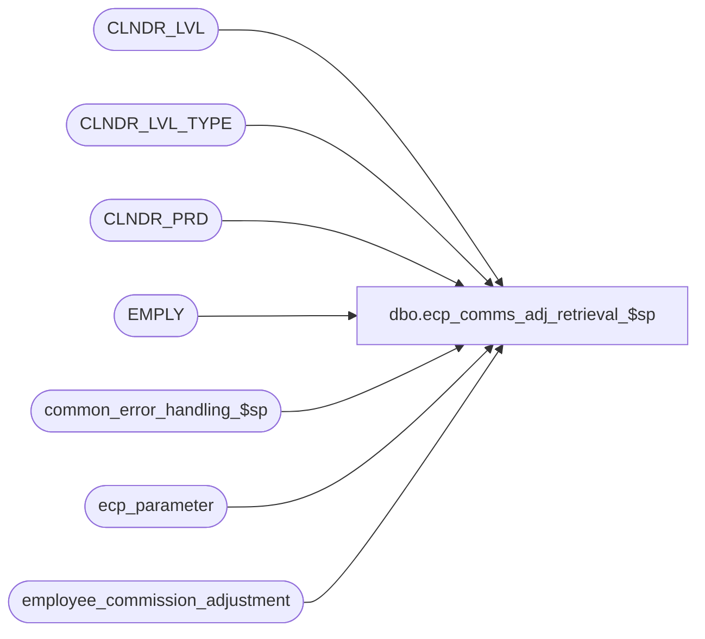

# dbo.ecp_comms_adj_retrieval_$sp

**Database:** auditworks  
**Server:** bedrockdb01  

## Architecture Diagram



## Table Dependencies

| Referenced Table |
|---|
| CLNDR_LVL |
| CLNDR_LVL_TYPE |
| CLNDR_PRD |
| EMPLY |
| common_error_handling_$sp |
| ecp_parameter |
| employee_commission_adjustment |

## Stored Procedure Code

```sql
create proc [dbo].[ecp_comms_adj_retrieval_$sp]   @employee_list 		nvarchar(3000),
  @pay_period_end_datetime	datetime
AS 
/* 
Proc Name: ecp_comms_adj_retrieval_$sp 
Desc:   Called by UI to retrieve list of commission adjustments.

HISTORY:  
Date     Name           Def#    Desc
Apr14,11 Paul          126153   Use unicode datatypes
Feb08,08 Vicci          97975   Set errno not just message_id when raising business rule error
Apr02,07 Vicci		85597	Author
*/

SET NOCOUNT ON
DECLARE
  @errmsg                       nvarchar(255),
  @errno                        int,
  @message_id                   int,
  @object_name                  nvarchar(255),
  @operation_name               nvarchar(100),
  @process_name                 nvarchar(100),
  @process_no                   int,
  @rows				int,
  @stream_no                    tinyint,
  @employee_count		int,
  @sql_command 			nvarchar(3000),
  @entry_datetime 		datetime,
  @ecp_clndr_id			binary(16),
  @lowest_calendar_level	int,
  @lowest_calendar_level_id	binary(16),
  @last_export_release_datetime datetime,
  @next_pay_period_datetime	datetime,
  @current_pay_period_datetime	datetime

SELECT @message_id = 201068,
       @operation_name = 'Unknown',
       @process_name = 'ecp_comms_adj_retrieval_$sp',
       @process_no = 282,
       @stream_no = 1,
       @employee_count = 0,
       @entry_datetime = getdate(),
       @next_pay_period_datetime = null

CREATE TABLE #select_employee(
       employee_no int not null,
       employee_name nvarchar(100) null)
SELECT @errno = @@error
IF @errno <> 0
BEGIN
  SELECT @errmsg = 'Failed to create temp table to hold list of selected employees',
         @object_name = '#select_employee',
         @operation_name = 'CREATE'
  GOTO error
END

IF @employee_list IS NOT NULL AND @employee_list <> ''
BEGIN
  SELECT @sql_command = '
  INSERT #select_employee(employee_no, employee_name)
  SELECT EMPLY_NUM, IsNull((IsNull(em.LAST_NAME, '''') + Substring('', '', 1, sign(datalength(em.LAST_NAME) * datalength(em.FRST_NAME)) * 2)  + IsNull(em.FRST_NAME, '''')), '''') + '' ('' + convert(nvarchar, em.EMPLY_NUM) + '')'' 
    FROM EMPLY em
   WHERE EMPLY_NUM IN (' + @employee_list + ')
  SELECT @employee_count = @@rowcount'

  EXEC sp_executesql @sql_command, N'@employee_count int OUT', @employee_count OUT        
  
  IF @employee_count < 1
  BEGIN
    SELECT @message_id = 201684,
           @errno = 201684,
           @errmsg = 'Invalid employee list passed',
           @object_name = 'EMPLY',
           @operation_name = 'SELECT'
    GOTO error
  END
END

SELECT @ecp_clndr_id = par_bin_value
  FROM ecp_parameter p
 WHERE par_name = 'ecp_dflt_clndr_id'  
SELECT @errno = @@error
IF @errno <> 0
BEGIN
  SELECT @errmsg = 'Unable to which calendar to use',
         @object_name = 'ecp_parameter',
         @operation_name = 'SELECT'
  GOTO error
END

SELECT @lowest_calendar_level = CLNDR_LVL_TYPE_IDNTY, 
       @lowest_calendar_level_id = CLNDR_LVL_TYPE_ID
  FROM CLNDR_LVL_TYPE
 WHERE CLNDR_LVL_SEQ = (SELECT MAX(CLNDR_LVL_SEQ)
			  FROM CLNDR_LVL_TYPE
			 WHERE CLNDR_LVL_TYPE_ID
			    IN (SELECT DISTINCT CLNDR_LVL_TYPE_ID
                                  FROM CLNDR_LVL
                                  WHERE CLNDR_ID = @ecp_clndr_id))
   AND CLNDR_LVL_TYPE_ID
    IN (SELECT DISTINCT CLNDR_LVL_TYPE_ID
          FROM CLNDR_LVL
         WHERE CLNDR_ID = @ecp_clndr_id)
SELECT @errno = @@error
IF @errno <> 0
BEGIN
  SELECT @errmsg = 'Unable to which calendar level to use for employee transaction logging',
         @object_name = 'CLNDR_LVL_TYPE',
         @operation_name = 'SELECT'
  GOTO error
END
   
SELECT @pay_period_end_datetime = dateadd(ss, -1, MIN(cp.END_DATE_TIME))
  FROM CLNDR_PRD cp
 WHERE cp.STRT_DATE_TIME <= @pay_period_end_datetime
   AND cp.END_DATE_TIME > @pay_period_end_datetime
   AND cp.CLNDR_ID = @ecp_clndr_id
   AND cp.CLNDR_LVL_TYPE_ID = @lowest_calendar_level_id
SELECT @errno = @@error, @rows = @@rowcount
IF @errno <> 0
BEGIN
  SELECT @errmsg = 'Unable to determine whether the payperiod end date/time passed in is a valid unexported pay period end date',
         @object_name = 'CLNDR_PRD',
@operation_name = 'SELECT'
  GOTO error
END
IF @rows < 1
BEGIN
  SELECT @message_id = 201684,
         @errno = 201684,
         @object_name = @process_name,
         @errmsg = 'Invalid Argument(s) passed to the stored procedure ' + @process_name + '. Unable to proceed.'
  GOTO error
END

IF @employee_list IS NOT NULL AND @employee_list <> ''
BEGIN
  SELECT w.employee_name, 
         a.entry_datetime, a.adjustment_description, a.commission_adj_amount, 
         a.auto_rev_pay_pd_end_datetime, adjustment_comment, 
         IsNull(sign(auto_commission_adj_id), 0) auto_adjustment_flag, user_id,
         commission_adj_id
  FROM #select_employee w
       INNER JOIN employee_commission_adjustment a
          ON w.employee_no = a.employee_no
         AND a.pay_period_end_datetime = @pay_period_end_datetime
  ORDER BY w.employee_name, a.entry_datetime, a.adjustment_description
END
ELSE
  SELECT IsNull((IsNull(em.LAST_NAME, '') + Substring(', ', 1, sign(datalength(em.LAST_NAME) * datalength(em.FRST_NAME)) * 2)  + IsNull(em.FRST_NAME, '')), '') + ' (' + convert(nvarchar, em.EMPLY_NUM) + ')' employee_name, 
         a.entry_datetime, a.adjustment_description, a.commission_adj_amount, 
         a.auto_rev_pay_pd_end_datetime, adjustment_comment, 
         IsNull(sign(auto_commission_adj_id), 0) auto_adjustment_flag, user_id,
         commission_adj_id
  FROM employee_commission_adjustment a
       INNER JOIN EMPLY em
          ON a.employee_no = em.EMPLY_NUM
 WHERE a.pay_period_end_datetime = @pay_period_end_datetime
  ORDER BY employee_name, a.entry_datetime, a.adjustment_description
DROP TABLE #select_employee
RETURN

error:
  EXEC common_error_handling_$sp @process_no, @errno, @errmsg, 0, @message_id, @process_name, @object_name, @operation_name, 1, @stream_no
  RETURN
```

