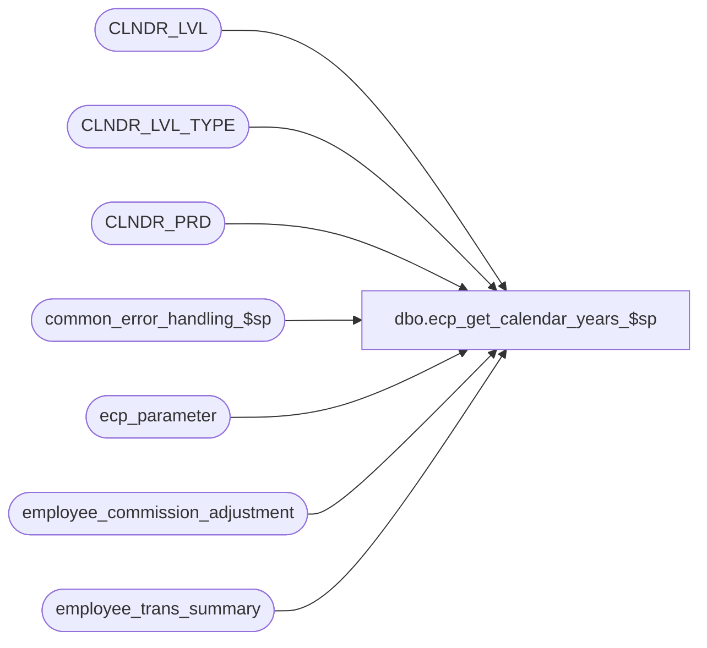

# dbo.ecp_get_calendar_years_$sp

**Database:** auditworks  
**Server:** bedrockdb01  

## Architecture Diagram



## Table Dependencies

| Referenced Table |
|---|
| CLNDR_LVL |
| CLNDR_LVL_TYPE |
| CLNDR_PRD |
| common_error_handling_$sp |
| ecp_parameter |
| employee_commission_adjustment |
| employee_trans_summary |

## Stored Procedure Code

```sql
create proc [dbo].[ecp_get_calendar_years_$sp] @availability_type nvarchar(20) = 'ALL' --valid options are ALL = all dates whether or not data is available, ECP-EC = dates for which Commission data is available, ECP-EP dates for which Productivity data is available
AS 

/* 
Proc Name: ecp_get_calendar_years_$sp 
Desc:   Called by ECP Report Query Forms to obtain list of valid available (data exists in ECP) and unavailable dates within
        the ECP calendar.

HISTORY:  
Date     Name           Def#    Desc
Apr14,11 Paul          126153   Use unicode datatypes
Aug19,08 Vicci        103967    Return only years available at lowest calendar level.
May26,08 Vicci        101234    Author

*/

SET NOCOUNT ON
DECLARE
  @ecp_clndr_id			binary(16),
  @current_year			int,
  @errmsg                       nvarchar(255),
  @errno                        int,
  @message_id                   int,
  @object_name                  nvarchar(255),
  @operation_name               nvarchar(100),
  @process_name                 nvarchar(100),
  @process_no                   int,
  @rows				int,
  @stream_no                    tinyint,
  @lowest_calendar_level 	int


SELECT @message_id = 201068,
       @operation_name = 'Unknown',
       @process_name = 'ecp_get_calendar_years_$sp',
       @process_no = 282,
       @stream_no = 1

SELECT @ecp_clndr_id = par_bin_value
  FROM ecp_parameter p
 WHERE par_name = 'ecp_dflt_clndr_id'  
SELECT @errno = @@error
IF @errno <> 0
BEGIN
  SELECT @errmsg = 'Unable to which calendar to use',
         @object_name = 'ecp_parameter',
         @operation_name = 'SELECT'
  GOTO error
END

SELECT @lowest_calendar_level = CLNDR_LVL_TYPE_IDNTY
  FROM CLNDR_LVL_TYPE
 WHERE CLNDR_LVL_SEQ = (SELECT MAX(CLNDR_LVL_SEQ)
			  FROM CLNDR_LVL_TYPE
			 WHERE CLNDR_LVL_TYPE_ID
			    IN (SELECT DISTINCT CLNDR_LVL_TYPE_ID
                                  FROM CLNDR_LVL
                                  WHERE CLNDR_ID = @ecp_clndr_id))
   AND CLNDR_LVL_TYPE_ID
    IN (SELECT DISTINCT CLNDR_LVL_TYPE_ID
          FROM CLNDR_LVL
         WHERE CLNDR_ID = @ecp_clndr_id)
SELECT @errno = @@error
IF @errno <> 0
BEGIN
  SELECT @errmsg = 'Unable to which calendar level to use for employee transaction logging',
         @object_name = 'CLNDR_LVL_TYPE',
         @operation_name = 'SELECT'
  GOTO error
END

SELECT @current_year = datepart(yyyy, getdate())
SELECT @errno = @@error
IF @errno <> 0
BEGIN
  SELECT @errmsg = 'Unable to default year to current year',
         @object_name = 'getdate()',
         @operation_name = 'SELECT'
  GOTO error
END

SELECT q.year_no
  FROM (
SELECT DISTINCT datepart(yyyy, dateadd(ss, -1, cp.END_DATE_TIME)) year_no
  FROM CLNDR_PRD cp
 WHERE cp.CLNDR_ID = @ecp_clndr_id
   AND datepart(yyyy, dateadd(ss, -1, cp.END_DATE_TIME)) <= @current_year) q 
 WHERE (@availability_type = 'ALL'
        OR (@availability_type = 'ECP-EC' AND q.year_no IN (SELECT DISTINCT datepart(yyyy, dateadd(ss, 1, ets.pay_period_end_datetime))
                                                                   FROM employee_trans_summary ets
                                                                   WHERE (ets.calendar_level = @lowest_calendar_level OR @lowest_calendar_level IS NULL)
                                                                  UNION 
                                                                 SELECT DISTINCT datepart(yyyy, dateadd(ss, 1, eca.pay_period_end_datetime))
                                                                   FROM employee_commission_adjustment eca) )
        OR (@availability_type = 'ECP-EP' AND q.year_no IN (SELECT DISTINCT datepart(yyyy, dateadd(ss, 1, ets.period_end_datetime))
                                                                   FROM employee_trans_summary ets
                                                                   WHERE (ets.calendar_level = @lowest_calendar_level OR @lowest_calendar_level IS NULL)
            UNION 
                                                                 SELECT DISTINCT datepart(yyyy, dateadd(ss, 1, ehs.period_end_datetime))
                                                                   FROM employee_trans_summary ehs
                                                                   WHERE (ehs.calendar_level = @lowest_calendar_level OR @lowest_calendar_level IS NULL))))
   ORDER BY q.year_no DESC 
SET NOCOUNT OFF
RETURN

error:
  EXEC common_error_handling_$sp @process_no, @errno, @errmsg, 0, @message_id, @process_name, @object_name, @operation_name, 1, @stream_no
  RETURN


dbo,get_tax_jurisdiction,-- =============================================
-- Author:		<Author,,Name>
-- Create date: <Create Date,,>
-- Description:	<Description,,>
-- =============================================

-- =============================================================================================================
-- Name: [dbo].[get_tax_jurisdiction]
--
-- Description:	Gets tax jurisdiction id.  Primarily used by Quick Launch
--
--
-- Output: N/A
--
-- Dependencies: 
--
-- Revision History
--		Name:			Date:			Comments:
--		Dillon Schemmer	08/27/2019		Created SP
--		Paul Beckman	01/13/2020		Updated tj.pos_tax_jurisdiction_code to tj.tax_jurisdiction_id
--
-- exec get_tax_jurisdiction sss --<< STORE NUMBER
-- =============================================================================================================

CREATE PROCEDURE [dbo].[get_tax_jurisdiction] @StoreNumber int
AS
BEGIN
SET NOCOUNT ON 
SELECT tj.tax_jurisdiction_id
FROM ORG_CHN s,
	tax_rate t,
	tax_level l,
	line_object o,
	store_sa st,
	tax_jurisdiction tj
WHERE s.TAX_JRSDCTN_CODE = t.tax_jurisdiction
AND s.ORG_CHN_NUM = st.store_no
AND l.line_object = o.line_object
AND l.tax_level = t.tax_level
AND t.tax_jurisdiction = tj.tax_jurisdiction
AND t.effective_until_date IS NULL
AND t.tax_rate_code = 1
AND s.ORG_CHN_NUM IN (@StoreNumber)
GROUP BY s.ORG_CHN_NUM,st.country_code,st.state_code,t.tax_jurisdiction,tj.tax_jurisdiction_id,t.tax_rate_id,o.line_object_description,t.tax_rate_code_description
ORDER BY 1
END
```

