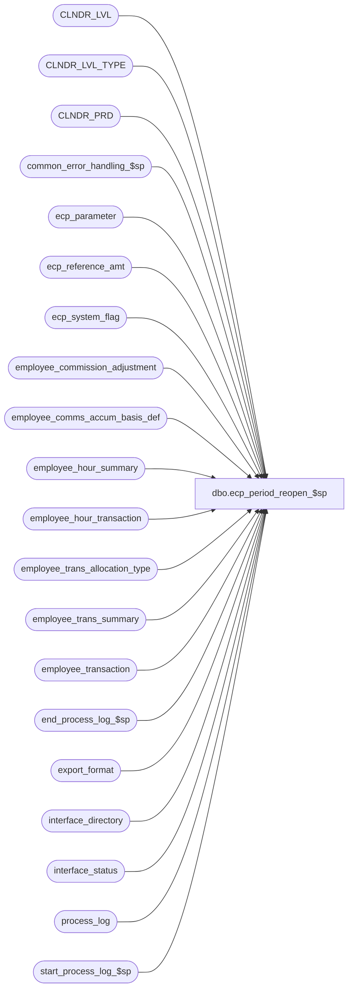

# dbo.ecp_period_reopen_$sp

**Database:** auditworks  
**Server:** bedrockdb01  

## Architecture Diagram



## Table Dependencies

| Referenced Table |
|---|
| CLNDR_LVL |
| CLNDR_LVL_TYPE |
| CLNDR_PRD |
| common_error_handling_$sp |
| ecp_parameter |
| ecp_reference_amt |
| ecp_system_flag |
| employee_commission_adjustment |
| employee_comms_accum_basis_def |
| employee_hour_summary |
| employee_hour_transaction |
| employee_trans_allocation_type |
| employee_trans_summary |
| employee_transaction |
| end_process_log_$sp |
| export_format |
| interface_directory |
| interface_status |
| process_log |
| start_process_log_$sp |

## Stored Procedure Code

```sql
create proc [dbo].[ecp_period_reopen_$sp] 
@user_id int = NULL,
@process_id binary(16) = NULL
AS
/* 
Proc Name: ecp_period_reopen_$sp 
Desc:   Re-opens the last pay-period closed (even if already exported) by removing any automated adjustments for
        this pay-period and by merging any sales or payroll hour information for the  
        closed period which posted to the next period back into the period to be reopened.

HISTORY:  
Date     Name           Def#    Desc
Jul06,12 Vicci         136784   When looking up summary id in ehs do join correctly 
                                i.e. based on relationship_set_id = relationship_set_id not relationship_set_id = sellling area
Apr14,11 Paul          126153   Use unicode datatypes
Nov27,08 Vicci         104484   Reverse reference-amount auto adjustments as well.
Oct31,08 Vicci         106094   Support home-store and relationship-set and traffic count.
Dec05,07 Vicci          95521   Author
*/

--TODO:  audit-trail

SET NOCOUNT ON
DECLARE
  @prior_period_close_reset_date datetime,
  @allocation_type		nvarchar(20),
  @reallocation_type_list	nvarchar(3000),
  @reallocate_amt		tinyint,
  @reallocate_hour		tinyint,
  @ets_created 			tinyint,
  @ehs_created 			tinyint,
  @interface_id 		tinyint,
  @allocation_request		tinyint,
  @sa_company_no		int,
  @current_rows                 int,
  @current_close_rows           int,
  @current_export_rows           int,
  @batch_size                   int,
  @current_db_name              nvarchar(30),
  @cursor_open			tinyint,
  @db_id                        int,
  @ecp_clndr_id			binary(16),
  @live_date			datetime,
  @lowest_calendar_level	int,
  @lowest_calendar_level_id	binary(16),
  @errmsg                       nvarchar(255),
  @errno                        int,
  @function_name	        varbinary(128),
  @posting_function_name        varbinary(128),
  @last_posting_datetime        datetime,
  @message_id                   int,
  @object_name                  nvarchar(255),
  @operation_name               nvarchar(100),
  @pay_period_close_date	datetime,
  @pay_period_close_reset_date  datetime,
  @process_log_entry            tinyint,
  @process_name 		nvarchar(100),
  @posting_process_name 	nvarchar(100),
  @process_no                   int,
  @process_timestamp            float,
  @process_start_time           datetime,
  @retrieval_in_progress        tinyint,
  @rows                         int,
  @merge_rows                   int,
  @stream_no                    tinyint,
  @transaction_count            int,
  @user_name                    nvarchar(30),
  @END_DATE_TIME		datetime,
  @cutoff_datetime		datetime,
  @CLNDR_LVL_TYPE_ID		binary(16),
  @pay_period_close_outstanding tinyint,
  @trace_msg			nvarchar(255),
  @pay_period_reopen_status	smallint

 
SELECT @interface_id = 44,
       @current_db_name = db_name(),
       @function_name = convert(varbinary(128), 'ecp_period_reopen_$sp'),
       @posting_function_name = convert(varbinary(128), 'ecp_posting_$sp'),
       @message_id = 201068,
       @operation_name = 'Unknown',
       @process_name = 'ecp_period_reopen_$sp',
       @posting_process_name = 'ecp_posting_$sp',
       @process_no = 285,
       @process_start_time = getdate(),
       @stream_no = 1,
       @user_name = suser_sname(),       
       @process_log_entry = 0,
       @transaction_count = 0,
       @pay_period_close_outstanding = 0,
       @pay_period_reopen_status = 0

SET CONTEXT_INFO @function_name

SELECT @pay_period_reopen_status = IsNull(c.flag_numeric_value, 0),
       @pay_period_close_date = c.flag_datetime_value  --note, stored with time of 23:59:59 
  FROM ecp_system_flag c
 WHERE flag_name = 'ecp_payperiod_reopen_status'  
SELECT @errno = @@error, @rows = @@rowcount
IF @errno <> 0
BEGIN
  SELECT @errmsg = 'Unable to determine whether another pay-period reopen request is already outstanding',
     @object_name = 'ecp_system_flag',
         @operation_name = 'SELECT'
  GOTO error
END
IF @rows < 1
BEGIN
  INSERT INTO ecp_system_flag(flag_name, flag_comment)
  VALUES('ecp_payperiod_reopen_status', 'flag_datetime_value set by system to indicate that pay-period which is being re-opened;  flag_numeric_value is set to 1 by user indicating re-open requested, higher number by system to indicate progress and null when done to indicate completion')
  SELECT @errno = @@error
  IF @errno <> 0
  BEGIN
    SELECT @errmsg = 'Unable to create entry to indicate the status of a period-reopening request',
           @object_name = 'ecp_system_flag',
           @operation_name = 'INSERT'
  GOTO error
  END
  SELECT @pay_period_reopen_status = 0, @pay_period_close_date = NULL
END

IF @pay_period_reopen_status = 0  --not called by ecp_posting_$sp
BEGIN
  UPDATE interface_status
     SET hold_datetime = @process_start_time
   WHERE interface_id = @interface_id
  SELECT @errno = @@error
  IF @errno <> 0
  BEGIN
    SELECT @errmsg = 'Unable to place ECP interface on hold',
           @object_name = 'interface_status',
           @operation_name = 'UPDATE'
    GOTO error
  END

  SELECT @retrieval_in_progress = retrieval_in_progress,
         @last_posting_datetime = last_posting_datetime
    FROM interface_status
   WHERE interface_id = @interface_id
  SELECT @errno = @@error
  IF @errno <> 0
  BEGIN
    SELECT @errmsg = 'Unable to select retrieval_in_progress from interface_status',
           @object_name = 'interface_status',
           @operation_name = 'SELECT'
    GOTO error
  END

  IF @retrieval_in_progress <> 0
  BEGIN
    SELECT @db_id = dbid
    FROM master..sysprocesses
    WHERE spid = @@spid

    SELECT @errno = @@error
    IF @errno != 0
    BEGIN
      SELECT @errmsg = 'Unable to select from master..sysprocesses',
             @object_name = 'master..sysprocesses',
             @operation_name = 'SELECT'
      GOTO error
    END

    IF EXISTS (SELECT 1
                 FROM master..sysprocesses
                WHERE (context_info = @posting_function_name)
                  AND spid <> @@spid
                  AND dbid = @db_id
                  AND db_name(dbid) = @current_db_name)
    BEGIN
      SELECT @message_id = 201682,
             @errno = 201682,
             @object_name = @process_name,
             @errmsg = 'The stored procedure ' + @posting_process_name + ' is currently running. Please verify.'
      GOTO error
    END
  
    IF EXISTS (SELECT 1
                 FROM master..sysprocesses
                WHERE (context_info = @function_name)
                  AND spid <> @@spid
                  AND dbid = @db_id
                  AND db_name(dbid) = @current_db_name)
    BEGIN
      SELECT @message_id = 201682,
             @errno = 201682,
             @object_name = @process_name,
             @errmsg = 'The stored procedure ' + @process_name + ' is currently running. Please verify.'
      GOTO error
    END
  END

  UPDATE interface_status
     SET retrieval_in_progress = 1, 
         last_retrieval_datetime = @process_start_time
   WHERE interface_id = @interface_id
  SELECT @errno = @@error
  IF @errno <> 0
  BEGIN
    SELECT @errmsg = 'Unable to set retrieval_in_progress in interface_status',
           @object_name = 'interface_status',
           @operation_name = 'UPDATE'
    GOTO error
  END

  IF @process_log_entry = 0
  BEGIN
    EXEC start_process_log_$sp @process_no, @process_timestamp OUTPUT, @errmsg OUTPUT
    SELECT @errno = @@error
    IF @errno <> 0
    BEGIN
      SELECT @errmsg = @errmsg + ' Unable to execute start_process_log_$sp',
             @object_name = 'start_process_log_$sp',
             @operation_name = 'EXECUTE'
      GOTO error  
    END
    SELECT @process_log_entry = 1
  END
END  --IF @pay_period_reopen_status = 0  --not called by ecp_posting_$sp

CREATE TABLE #ets(
       new_empl_trans_summary_id numeric(12,0) null,
       empl_trans_summary_id numeric(12,0) not null,
       calendar_level smallint not null,
       period_end_datetime datetime not null,
       pay_period_end_datetime datetime not null,
       employee_no int not null,
       primary_position nvarchar(4) not null, 
       primary_selling_area_no int not null,
       employee_transaction_role nvarchar(20) not null,
       transaction_store_no int not null,
       transaction_commission_code nvarchar(20) not null, 
       employee_commission_code nvarchar(20) not null, 
       item_commission_code nvarchar(20) not null, 
       store_commission_code nvarchar(20) not null,
       transaction_net_amount money not null, 
       transaction_discount_amount money not null,  
       transaction_units numeric(15,4) not null,
       transaction_quantity money not null,  
       transaction_quantity_adj money not null, 
       tier_id numeric(5,0) null,  
       commission_rate numeric(7,4) null,
       commission_amount_per_item money null,
       source_allocation_type nvarchar(20) null, 
       source_empl_trans_summary_id numeric(12,0) null,
       transaction_quantity_adj_mdsfe money null,
       home_store_no int null,
       relationship_set_id numeric(12,0) null)
SELECT @errno = @@error
IF @errno <> 0
BEGIN
  SELECT @errmsg = 'Unable to create table to hold list of any entries for the period to be re-opened were posted to the next period',
         @object_name = '#ets',
         @operation_name = 'CREATE TABLE'
  GOTO error
END
ELSE
  SELECT @ets_created = 1

CREATE TABLE #ehs(
       new_empl_hour_summary_id numeric(12,0) null,
       empl_hour_summary_id numeric(12,0) not null,
       calendar_level smallint not null,
       period_end_datetime datetime not null,
       pay_period_end_datetime datetime not null,
       employee_no int not null,
       primary_position nvarchar(4) not null,
       primary_selling_area_no int not null, 
       store_no int not null,
       payroll_entry_hour_type smallint null,
       payroll_entry_position nvarchar(4) not null, 
       payroll_entry_selling_area_no int null,
       productive_selling_hours money not null,
       productive_non_selling_hours money not null,
       non_productive_hours money not null,
       home_store_no int null,
       relationship_set_id numeric(12,0) null,
       attributed_traffic_count money null)
SELECT @errno = @@error
IF @errno <> 0
BEGIN
  SELECT @errmsg = 'Unable to create table to hold list of any payroll hours for the period to be re-opened were posted to the next period',
         @object_name = '#ehs',
         @operation_name = 'CREATE TABLE'
  GOTO error
END
ELSE
  SELECT @ehs_created = 1
  
SELECT @ecp_clndr_id = par_bin_value
  FROM ecp_parameter p
 WHERE par_name = 'ecp_dflt_clndr_id'  
SELECT @errno = @@error
IF @errno <> 0
BEGIN
  SELECT @errmsg = 'Unable to which calendar to use',
         @object_name = 'ecp_parameter',
         @operation_name = 'SELECT'
  GOTO error
END

SELECT @lowest_calendar_level = CLNDR_LVL_TYPE_IDNTY, 
       @lowest_calendar_level_id = CLNDR_LVL_TYPE_ID
  FROM CLNDR_LVL_TYPE
 WHERE CLNDR_LVL_SEQ = (SELECT MAX(CLNDR_LVL_SEQ)
			  FROM CLNDR_LVL_TYPE
			 WHERE CLNDR_LVL_TYPE_ID
			    IN (SELECT DISTINCT CLNDR_LVL_TYPE_ID
                                  FROM CLNDR_LVL
                                  WHERE CLNDR_ID = @ecp_clndr_id))
   AND CLNDR_LVL_TYPE_ID
    IN (SELECT DISTINCT CLNDR_LVL_TYPE_ID
          FROM CLNDR_LVL
         WHERE CLNDR_ID = @ecp_clndr_id)
SELECT @errno = @@error
IF @errno <> 0
BEGIN
  SELECT @errmsg = 'Unable to determine which lowest calendar level',
         @object_name = 'CLNDR_LVL_TYPE',
         @operation_name = 'SELECT'
  GOTO error
END

IF @pay_period_reopen_status <= 1  --not yet begun
  BEGIN
  SELECT @pay_period_close_date = c.flag_datetime_value,  --note, stored with time of 23:59:59
         @pay_period_close_outstanding = c.flag_numeric_value
    FROM ecp_system_flag c
   WHERE flag_name = 'ecp_payperiod_close_datetime'  
  SELECT @errno = @@error, @rows = @@rowcount
  IF @errno <> 0
  BEGIN
    SELECT @errmsg = 'Unable to determine last pay-period closed',
           @object_name = 'ecp_system_flag',
           @operation_name = 'SELECT'
    GOTO error
  END
  IF @rows < 1
  BEGIN
    INSERT INTO ecp_system_flag(flag_name, flag_comment)
    VALUES('ecp_payperiod_close_datetime', 'flag_datetime_value set by user to indicate that pay-period is closed and that no more imports/allocations can be posted to it')
    SELECT @errno = @@error
    IF @errno <> 0
    BEGIN
      SELECT @errmsg = 'Unable to create entry to indicate which pay-period has been closed',
             @object_name = 'ecp_system_flag',
             @operation_name = 'INSERT'
      GOTO error
    END
  END
END --IF @pay_period_reopen_status <= 1  --not yet begun

IF @pay_period_close_date IS NULL
BEGIN
  SELECT @pay_period_reopen_status = 0
  UPDATE ecp_system_flag
     SET flag_numeric_value = @pay_period_reopen_status,
         flag_datetime_value = null  --there is no period to be re-opened.
   WHERE flag_name = 'ecp_payperiod_reopen_status'  
  SELECT @errno = @@error
  IF @errno <> 0
  BEGIN
    SELECT @errmsg = 'Unable to create entry to indicate period-reopening request is complete',
           @object_name = 'ecp_system_flag',
           @operation_name = 'UPDATE'
    GOTO error
  END  
  RETURN
END

IF @pay_period_reopen_status < 10
BEGIN
  SELECT @pay_period_reopen_status = 10 
  UPDATE ecp_system_flag
     SET flag_numeric_value = @pay_period_reopen_status,  --re-open request begun, date of period to be re-opened identified
         flag_datetime_value = @pay_period_close_date
   WHERE flag_name = 'ecp_payperiod_reopen_status'  
  SELECT @errno = @@error
  IF @errno <> 0
  BEGIN
    SELECT @errmsg = 'Unable to create entry to indicate period-reopening request is at status 10',
           @object_name = 'ecp_system_flag',
           @operation_name = 'INSERT'
  GOTO error
  END
END

SELECT @stream_no = e.stream_no
  FROM export_format e, interface_directory i
 WHERE i.interface_id = @interface_id
   AND i.interface_id = e.interface_id
   AND i.ascii_export = e.export_format
SELECT @errno = @@error
IF @errno <> 0
BEGIN
  SELECT @errmsg = 'Unable to select stream_no from export_format',
         @object_name = 'export_format',
         @operation_name = 'SELECT'
  GOTO error
END

SELECT @stream_no = ISNULL(@stream_no, 1)

SELECT @pay_period_close_reset_date = max(dateadd(ss, -1, cp.END_DATE_TIME))
  FROM CLNDR_PRD cp
 WHERE cp.CLNDR_ID = @ecp_clndr_id
   AND cp.CLNDR_LVL_TYPE_ID = @lowest_calendar_level_id
   AND cp.END_DATE_TIME < @pay_period_close_date
SELECT @errno = @@error
IF @errno <> 0 OR @pay_period_close_reset_date IS NULL
BEGIN
  SELECT @errmsg = 'Unable to determine what the last pay-period closed date should become upon reopen',
         @object_name = 'CLNDR_PRD',
         @operation_name = 'SELECT'
  GOTO error
END

SELECT @prior_period_close_reset_date = max(dateadd(ss, -1, cp.END_DATE_TIME))
  FROM CLNDR_PRD cp
 WHERE cp.CLNDR_ID = @ecp_clndr_id
   AND cp.CLNDR_LVL_TYPE_ID = @lowest_calendar_level_id
   AND cp.END_DATE_TIME < @pay_period_close_reset_date
SELECT @errno = @@error
IF @errno <> 0 
BEGIN
  SELECT @errmsg = 'Unable to determine what the prior to last pay-period closed date should become upon reopen',
  @object_name = 'CLNDR_PRD',
         @operation_name = 'SELECT'
  GOTO error
END

SELECT @trace_msg = nchar(13) + nchar(10) + 
                    ':LOG && ecp_period_reopen_$sp (period close reset from ' + 
                    convert(nchar, @pay_period_close_date) + 
                    ' to ' +
                    convert(nchar, @pay_period_close_reset_date) + 
                    '):  ' + CONVERT(nchar, getdate(), 8)
PRINT @trace_msg

IF @pay_period_close_outstanding <> 1
BEGIN
  SELECT @rows = count(*) 
    FROM employee_commission_adjustment
   WHERE pay_period_end_datetime = @pay_period_close_date
     AND auto_commission_adj_id IS NOT NULL
  SELECT @errno = @@error
  IF @errno <> 0
  BEGIN
    SELECT @errmsg = 'Unable to determine if any auto-commission adjustments were generated for the period to be re-opened',
           @object_name = 'employee_commission_adjustment',
           @operation_name = 'SELECT'
    GOTO error
  END
  IF @rows > 0  --adjustment rows
  BEGIN
    SELECT @trace_msg = nchar(13) + nchar(10) + 
                      ':LOG && ecp_period_reopen_$sp (removing ' + convert(nvarchar, @rows) + ' auto-adjustments for period to be reopened):  ' + CONVERT(nchar, getdate(), 8)
    PRINT @trace_msg

    DELETE employee_commission_adjustment
     WHERE pay_period_end_datetime >= @pay_period_close_date
       AND auto_commission_adj_id IS NOT NULL
       AND (auto_rev_pay_pd_end_datetime IS NULL 
            OR auto_rev_pay_pd_end_datetime >= @pay_period_close_date)
    SELECT @errno = @@error
    IF @errno <> 0
    BEGIN
      SELECT @errmsg = 'Unable to remove the auto-commission adjustments that were generated for the period to be re-opened',
             @object_name = 'employee_commission_adjustment',
             @operation_name = 'DELETE'
      GOTO error
    END
    
    SELECT @transaction_count = @transaction_count + @rows
  END  --IF @rows > 0  --adjustment rows

  SELECT @rows = count(*) 
    FROM ecp_reference_amt
   WHERE auto_adj_period_end_datetime = @pay_period_close_date
  SELECT @errno = @@error
  IF @errno <> 0
  BEGIN
    SELECT @errmsg = 'Unable to determine if any auto-reference-amount-adjustments were generated for the period to be re-opened',
           @object_name = 'ecp_reference_amt',
           @operation_name = 'SELECT'
    GOTO error
  END
  IF @rows > 0  --adjustment rows
  BEGIN
    SELECT @trace_msg = nchar(13) + nchar(10) + 
                      ':LOG && ecp_period_reopen_$sp (removing ' + convert(nvarchar, @rows) + ' reference-amount auto-adjustments for period to be reopened):  ' + CONVERT(nchar, getdate(), 8)
    PRINT @trace_msg

    DELETE ecp_reference_amt
     WHERE auto_adj_period_end_datetime = @pay_period_close_date
    SELECT @errno = @@error
    IF @errno <> 0
    BEGIN
      SELECT @errmsg = 'Unable to remove the auto-reference-amount adjustments that were generated for the period to be re-opened',
             @object_name = 'ecp_reference_amt',
             @operation_name = 'DELETE'
      GOTO error
    END
    
    SELECT @transaction_count = @transaction_count + @rows
  END  --IF @rows > 0  --adjustment rows

  INSERT into #ets(
         empl_trans_summary_id,
         calendar_level,
         period_end_datetime,
         pay_period_end_datetime,
         employee_no,
         primary_position,
         primary_selling_area_no,
         employee_transaction_role,
         transaction_store_no,
         transaction_commission_code,
         employee_commission_code,
         item_commission_code,
         store_commission_code,
         transaction_net_amount,
         transaction_discount_amount,
         transaction_units,
         transaction_quantity,
         transaction_quantity_adj,
         tier_id,
         commission_rate,
         commission_amount_per_item,
         source_allocation_type,
         source_empl_trans_summary_id,
         transaction_quantity_adj_mdsfe,
         home_store_no,
         relationship_set_id)
  SELECT empl_trans_summary_id,
         calendar_level,
         period_end_datetime,
         pay_period_end_datetime,
         employee_no,
         primary_position,
         primary_selling_area_no,
         employee_transaction_role,
         transaction_store_no,
         transaction_commission_code,
         employee_commission_code,
         item_commission_code,
         store_commission_code,
         transaction_net_amount,
         transaction_discount_amount,
         transaction_units,
         transaction_quantity,
         transaction_quantity_adj,
         tier_id,
         commission_rate,
         commission_amount_per_item,
         source_allocation_type,
         source_empl_trans_summary_id,
         transaction_quantity_adj_mdsfe,
         home_store_no,
         relationship_set_id
    FROM employee_trans_summary ets
   WHERE ets.period_end_datetime >= @pay_period_close_date
     AND ets.pay_period_end_datetime > ets.period_end_datetime
  SELECT @errno = @@error, @rows = @@rowcount
  IF @errno <> 0
  BEGIN
    SELECT @errmsg = 'Unable to determine whether any transactions for the period to be re-opened were posted to the next period',
           @object_name = 'employee_trans_summary',
           @operation_name = 'SELECT'
    GOTO error
  END

  IF @rows > 0  --rows to be moved to period being re-opened
  BEGIN    
    SELECT @trace_msg = nchar(13) + nchar(10) + 
                      ':LOG && ecp_period_reopen_$sp (merging ' + convert(nvarchar, @rows) + ' transaction summaries from future period back to period to be reopened):  ' + CONVERT(nchar, getdate(), 8)
    PRINT @trace_msg

    SELECT @transaction_count = @transaction_count + @rows

    UPDATE #ets
       SET new_empl_trans_summary_id = ets.empl_trans_summary_id
      FROM employee_trans_summary ets
     WHERE #ets.calendar_level = ets.calendar_level
       AND #ets.period_end_datetime = ets.pay_period_end_datetime
       AND ets.period_end_datetime = ets.pay_period_end_datetime
       AND #ets.employee_no = ets.employee_no
       AND #ets.primary_position = ets.primary_position
       AND #ets.primary_selling_area_no = ets.primary_selling_area_no
       AND #ets.employee_transaction_role = ets.employee_transaction_role
       AND #ets.transaction_store_no = ets.transaction_store_no
       AND #ets.transaction_commission_code = ets.transaction_commission_code
       AND #ets.employee_commission_code = ets.employee_commission_code
       AND #ets.item_commission_code = ets.item_commission_code
       AND #ets.store_commission_code = ets.store_commission_code
       AND (#ets.tier_id = ets.tier_id OR (#ets.tier_id IS NULL AND ets.tier_id IS NULL))
       AND (#ets.commission_rate = ets.commission_rate OR (#ets.commission_rate IS NULL AND ets.commission_rate IS NULL))
       AND (#ets.commission_amount_per_item = ets.commission_amount_per_item OR (#ets.commission_amount_per_item IS NULL AND ets.commission_amount_per_item IS NULL))
       AND (#ets.source_allocation_type = ets.source_allocation_type OR (#ets.source_allocation_type IS NULL AND ets.source_allocation_type IS NULL))
       AND (#ets.source_empl_trans_summary_id = ets.source_empl_trans_summary_id OR (#ets.source_empl_trans_summary_id IS NULL AND ets.source_empl_trans_summary_id IS NULL))
       AND (#ets.home_store_no = ets.home_store_no OR (#ets.home_store_no IS NULL AND ets.home_store_no IS NULL))
       AND (#ets.relationship_set_id = ets.relationship_set_id OR (#ets.relationship_set_id IS NULL AND ets.relationship_set_id IS NULL))
    SELECT @errno = @@error, @merge_rows = @@rowcount
    IF @errno <> 0
    BEGIN
      SELECT @errmsg = 'Unable to determine whether any merging is required',
             @object_name = '#ets',
             @operation_name = 'UPDATE'
      GOTO error
    END
    
    IF @merge_rows > 0
    BEGIN
      BEGIN TRANSACTION
      UPDATE employee_trans_summary 
         SET source_empl_trans_summary_id = #ets.new_empl_trans_summary_id
        FROM #ets
       WHERE employee_trans_summary.pay_period_end_datetime > @pay_period_close_date
         AND employee_trans_summary.source_empl_trans_summary_id = #ets.empl_trans_summary_id
         AND employee_trans_summary.calendar_level = #ets.calendar_level
         AND #ets.new_empl_trans_summary_id IS NOT NULL
         AND #ets.new_empl_trans_summary_id <> #ets.empl_trans_summary_id
      SELECT @errno = @@error
      IF @errno <> 0
    BEGIN
        SELECT @errmsg = 'Unable to correct source summary id of allocated amounts being merged back to the period to be reopened',
               @object_name = 'employee_trans_summary',
               @operation_name = 'UPDATE'
        GOTO error
      END

      UPDATE employee_transaction
         SET empl_trans_summary_id = #ets.new_empl_trans_summary_id
        FROM #ets
       WHERE employee_transaction.empl_trans_summary_id = #ets.empl_trans_summary_id
         AND #ets.calendar_level = @lowest_calendar_level
         AND #ets.new_empl_trans_summary_id IS NOT NULL
         AND #ets.new_empl_trans_summary_id <> #ets.empl_trans_summary_id
      SELECT @errno = @@error
      IF @errno <> 0
      BEGIN
        SELECT @errmsg = 'Unable to correct summary id to which transactions being merged back to the period to be reopened are associated',
               @object_name = 'employee_transaction',
               @operation_name = 'UPDATE'
        GOTO error
      END
     
      UPDATE employee_trans_summary 
         SET transaction_net_amount = employee_trans_summary.transaction_net_amount + #ets.transaction_net_amount,
             transaction_discount_amount = employee_trans_summary.transaction_discount_amount + #ets.transaction_discount_amount,
             transaction_units = employee_trans_summary.transaction_units + #ets.transaction_units,
transaction_quantity = employee_trans_summary.transaction_quantity + #ets.transaction_quantity,
             transaction_quantity_adj = employee_trans_summary.transaction_quantity_adj + #ets.transaction_quantity_adj,
             transaction_quantity_adj_mdsfe = employee_trans_summary.transaction_quantity_adj_mdsfe + #ets.transaction_quantity_adj_mdsfe
        FROM #ets
       WHERE employee_trans_summary.empl_trans_summary_id = #ets.new_empl_trans_summary_id
         AND #ets.new_empl_trans_summary_id <> #ets.empl_trans_summary_id
         AND #ets.new_empl_trans_summary_id IS NOT NULL
      SELECT @errno = @@error
      IF @errno <> 0
      BEGIN
        SELECT @errmsg = 'Unable to correct merged amounts back to the period to be reopened',
               @object_name = 'employee_trans_summary',
               @operation_name = 'UPDATE'
        GOTO error
      END

      DELETE employee_trans_summary 
        FROM #ets
       WHERE employee_trans_summary.empl_trans_summary_id = #ets.empl_trans_summary_id
         AND #ets.new_empl_trans_summary_id <> #ets.empl_trans_summary_id
         AND #ets.new_empl_trans_summary_id IS NOT NULL
      SELECT @errno = @@error
      IF @errno <> 0
      BEGIN
        SELECT @errmsg = 'Unable to remove entries for future period since merged back into the period to be reopened',
               @object_name = 'employee_trans_summary',
               @operation_name = 'UPDATE'
        GOTO error
      END
      COMMIT
    END  --IF @merge_rows > 0

    IF @rows > @merge_rows
    BEGIN
      UPDATE employee_trans_summary 
         SET pay_period_end_datetime = period_end_datetime
       WHERE empl_trans_summary_id in (SELECT empl_trans_summary_id
                                         FROM #ets
					WHERE new_empl_trans_summary_id IS NULL)
      SELECT @errno = @@error
      IF @errno <> 0
      BEGIN
        SELECT @errmsg = 'Unable to correct pay period of entries for pay period to be reopened that had posted to the next period',
               @object_name = 'employee_trans_summary',
               @operation_name = 'UPDATE'
        GOTO error
      END
    END  --IF @rows > @merge_rows
  END  --IF @rows > 0  --rows to be moved to period being re-opened

  INSERT into #ehs(
         empl_hour_summary_id,
         calendar_level,
         period_end_datetime,
         pay_period_end_datetime,
         employee_no,
         primary_position,
         primary_selling_area_no,
         store_no,
         payroll_entry_hour_type,
         payroll_entry_position,
         payroll_entry_selling_area_no,
         productive_selling_hours,
         productive_non_selling_hours,
         non_productive_hours,
         home_store_no,
         relationship_set_id,
         attributed_traffic_count)
  SELECT empl_hour_summary_id,
         calendar_level,
         period_end_datetime,
         pay_period_end_datetime,
         employee_no,
         primary_position,
         primary_selling_area_no,
         store_no,
         payroll_entry_hour_type,
         payroll_entry_position,
         payroll_entry_selling_area_no,
         productive_selling_hours,
         productive_non_selling_hours,
         non_productive_hours,
         home_store_no,
         relationship_set_id,
         attributed_traffic_count
    FROM employee_hour_summary ehs
   WHERE ehs.period_end_datetime >= @pay_period_close_date
     AND ehs.pay_period_end_datetime > ehs.period_end_datetime
  SELECT @errno = @@error, @rows = @@rowcount
  IF @errno <> 0
  BEGIN
    SELECT @errmsg = 'Unable to determine whether any payroll hours for the period to be re-opened were posted to the next period',
           @object_name = 'employee_hour_summary',
           @operation_name = 'SELECT'
    GOTO error
  END

  IF @rows > 0  --payroll hour rows to be moved to period being re-opened
  BEGIN    
    SELECT @trace_msg = nchar(13) + nchar(10) + 
                     ':LOG && ecp_period_reopen_$sp (merging ' + convert(nvarchar, @rows) + ' payroll hour summaries from future period back to period to be reopened):  ' + CONVERT(nchar, getdate(), 8)
    PRINT @trace_msg

    SELECT @transaction_count = @transaction_count + @rows

    UPDATE #ehs
       SET new_empl_hour_summary_id = ehs.empl_hour_summary_id
      FROM employee_hour_summary ehs
     WHERE #ehs.calendar_level = ehs.calendar_level
       AND #ehs.period_end_datetime = ehs.pay_period_end_datetime
       AND ehs.period_end_datetime = ehs.pay_period_end_datetime
       AND #ehs.employee_no = ehs.employee_no
       AND #ehs.primary_position = ehs.primary_position
       AND #ehs.primary_selling_area_no = ehs.primary_selling_area_no
       AND #ehs.store_no = ehs.store_no
       AND (#ehs.payroll_entry_hour_type = ehs.payroll_entry_hour_type OR (#ehs.payroll_entry_hour_type IS NULL AND ehs.payroll_entry_hour_type IS NULL))
       AND #ehs.payroll_entry_position = ehs.payroll_entry_position
       AND (#ehs.payroll_entry_selling_area_no = ehs.payroll_entry_selling_area_no OR (#ehs.payroll_entry_selling_area_no IS NULL AND ehs.payroll_entry_selling_area_no IS NULL))
       AND (#ehs.home_store_no = ehs.home_store_no OR (#ehs.home_store_no IS NULL AND ehs.home_store_no IS NULL))
       AND (#ehs.relationship_set_id = ehs.relationship_set_id OR (#ehs.relationship_set_id IS NULL AND ehs.relationship_set_id IS NULL))
    SELECT @errno = @@error, @merge_rows = @@rowcount
    IF @errno <> 0
    BEGIN
      SELECT @errmsg = 'Unable to determine whether any hour merging is required',
             @object_name = '#ehs',
             @operation_name = 'UPDATE'
      GOTO error
    END
    
    IF @merge_rows > 0
    BEGIN
      BEGIN TRANSACTION
      UPDATE employee_hour_transaction
         SET empl_hour_summary_id = #ehs.new_empl_hour_summary_id
        FROM #ehs
       WHERE employee_hour_transaction.empl_hour_summary_id = #ehs.empl_hour_summary_id
         AND #ehs.calendar_level = @lowest_calendar_level
         AND #ehs.new_empl_hour_summary_id IS NOT NULL
         AND #ehs.new_empl_hour_summary_id <> #ehs.empl_hour_summary_id
      SELECT @errno = @@error
      IF @errno <> 0
      BEGIN
        SELECT @errmsg = 'Unable to correct summary id to which hours being merged back to the period to be reopened are associated',
               @object_name = 'employee_transaction',
               @operation_name = 'UPDATE'
        GOTO error
      END
     
      UPDATE employee_hour_summary 
         SET productive_selling_hours = employee_hour_summary.productive_selling_hours + #ehs.productive_selling_hours,
             productive_non_selling_hours = employee_hour_summary.productive_non_selling_hours + #ehs.productive_non_selling_hours,
             non_productive_hours = employee_hour_summary.non_productive_hours + #ehs.non_productive_hours, 
             attributed_traffic_count = employee_hour_summary.attributed_traffic_count + #ehs.attributed_traffic_count 
        FROM #ehs
       WHERE employee_hour_summary.empl_hour_summary_id = #ehs.new_empl_hour_summary_id
         AND #ehs.new_empl_hour_summary_id <> #ehs.empl_hour_summary_id
         AND #ehs.new_empl_hour_summary_id IS NOT NULL
      SELECT @errno = @@error
      IF @errno <> 0
      BEGIN
        SELECT @errmsg = 'Unable to correct merged amounts back to the period to be reopened',
               @object_name = 'employee_hour_summary',
               @operation_name = 'UPDATE'
        GOTO error
      END

      DELETE employee_hour_summary 
        FROM #ehs
       WHERE employee_hour_summary.empl_hour_summary_id = #ehs.empl_hour_summary_id
         AND #ehs.new_empl_hour_summary_id <> #ehs.empl_hour_summary_id
         AND #ehs.new_empl_hour_summary_id IS NOT NULL
      SELECT @errno = @@error
      IF @errno <> 0
      BEGIN
        SELECT @errmsg = 'Unable to remove payroll hour entries for future period since merged back into the period to be reopened',
               @object_name = 'employee_hour_summary',
               @operation_name = 'UPDATE'
   GOTO error
      END
      COMMIT
    END  --IF @merge_rows > 0

    IF @rows > @merge_rows
    BEGIN
      UPDATE employee_hour_summary 
         SET pay_period_end_datetime = period_end_datetime
       WHERE empl_hour_summary_id in (SELECT empl_hour_summary_id
                                         FROM #ehs
					WHERE new_empl_hour_summary_id IS NULL)
      SELECT @errno = @@error
      IF @errno <> 0
      BEGIN
        SELECT @errmsg = 'Unable to correct pay period of payroll hour entries for pay period to be reopened that had posted to the next period',
               @object_name = 'employee_hour_summary',
               @operation_name = 'UPDATE'
        GOTO error
      END
    END  --IF @rows > @merge_rows
  END  --IF @rows > 0  --payroll hour rows to be moved to period being re-opened
END --IF @pay_period_close_outstanding <> 1

IF (SELECT flag_datetime_value
      FROM ecp_system_flag
     WHERE flag_name = 'ecp_amt_alloc_posting_date') >= @pay_period_close_date
  SELECT @reallocate_amt = 1
IF (SELECT flag_datetime_value
      FROM ecp_system_flag
     WHERE flag_name = 'ecp_hour_alloc_posting_date') >= @pay_period_close_date
  SELECT @reallocate_hour = 1
IF @reallocate_amt = 1 OR @reallocate_hour = 1
BEGIN
  SELECT @reallocation_type_list = ''
  DECLARE amt_realloc_cursor CURSOR
   FOR
    SELECT DISTINCT a.allocation_type
      FROM employee_trans_allocation_type a
           INNER JOIN employee_comms_accum_basis_def b
              ON a.accumulation_basis = b.accumulation_basis
             AND ((@reallocate_amt = 1 AND b.accumulation_basis_column in ('transaction_net_amount', 'transaction_units'))
                  OR
                  (@reallocate_hour = 1 AND b.accumulation_basis_column in ('productive_selling_hours', 'productive_non_selling_hours', 'productive_hours'))
                 )
  OPEN amt_realloc_cursor
  SELECT @cursor_open = 1
 
   FETCH amt_realloc_cursor
    INTO @allocation_type
  
   WHILE @@fetch_status = 0
   BEGIN
     IF @reallocation_type_list = ''
       SELECT @reallocation_type_list = @reallocation_type_list + '''' + @allocation_type + ''''
     ELSE
       SELECT @reallocation_type_list = @reallocation_type_list + ', ''' + @allocation_type + ''''
--     PRINT @reallocation_type_list
     FETCH amt_realloc_cursor
      INTO @allocation_type
   END /* while not end of amt_realloc_cursor */

  CLOSE amt_realloc_cursor
  DEALLOCATE amt_realloc_cursor 
  SELECT @cursor_open = 0
END  --IF @reallocate_amt = 1 OR @reallocate_hour = 1

BEGIN TRAN

IF IsNull(@reallocation_type_list, '') <> ''
BEGIN
  UPDATE ecp_system_flag
     SET flag_datetime_value = (SELECT max(flag_datetime_value)
                                  FROM ecp_system_flag
                                 WHERE flag_name in ('ecp_amt_alloc_posting_date', 'ecp_hour_alloc_posting_date'))
   WHERE flag_name = 'ecp_reallocation_to_date'  
  SELECT @errno = @@error
  IF @errno <> 0
  BEGIN
    SELECT @errmsg = 'Unable to set reallocation request to date ',
           @object_name = 'ecp_system_flag',
           @operation_name = 'UPDATE'
    GOTO error
  END
  UPDATE ecp_system_flag
     SET flag_datetime_value = dateadd(ss, 1, @pay_period_close_reset_date)
   WHERE flag_name = 'ecp_reallocation_from_date'  
  SELECT @errno = @@error
  IF @errno <> 0
  BEGIN
    SELECT @errmsg = 'Unable to set reallocation request from date ',
           @object_name = 'ecp_system_flag',
           @operation_name = 'UPDATE'
    GOTO error
  END
  UPDATE ecp_system_flag
     SET flag_alpha_value = @reallocation_type_list
   WHERE flag_name = 'ecp_reallocation_type_list'  
  SELECT @errno = @@error
  IF @errno <> 0
  BEGIN
    SELECT @errmsg = 'Unable to set reallocation request allocation type list ',
           @object_name = 'ecp_system_flag',
           @operation_name = 'UPDATE'
    GOTO error
  END
  UPDATE interface_status
     SET immediate_posting_requested = 1
   WHERE interface_id = 44
  SELECT @errno = @@error
  IF @errno <> 0
  BEGIN
    SELECT @errmsg = 'Failed to kick off ECP posting to redo allocations',
           @object_name = 'interface_status',
           @operation_name = 'UPDATE'
    GOTO error
  END
   
END

UPDATE ecp_system_flag
   SET flag_datetime_value = @pay_period_close_reset_date,
       flag_numeric_value = 0,
       flag_alpha_value = convert(nvarchar, @prior_period_close_reset_date, 110)
 WHERE flag_name = 'ecp_payperiod_close_datetime'  
SELECT @errno = @@error
IF @errno <> 0
BEGIN
  SELECT @errmsg = 'Unable to re-open last pay-period closed',
     @object_name = 'ecp_system_flag',
         @operation_name = 'UPDATE'
  GOTO error
END

UPDATE ecp_system_flag
   SET flag_datetime_value = dateadd(ss, -1, dateadd(dd, 1, convert(datetime, flag_alpha_value))),
       flag_numeric_value = 0,
       flag_alpha_value = convert(nvarchar, @pay_period_close_reset_date, 110)
 WHERE flag_name = 'ecp_payperiod_export_datetime' 
   AND flag_datetime_value =  @pay_period_close_date
SELECT @errno = @@error
IF @errno <> 0
BEGIN
  SELECT @errmsg = 'Unable to reset last pay-period closed export date',
     @object_name = 'ecp_system_flag',
         @operation_name = 'UPDATE'
  GOTO error
END

UPDATE interface_status
   SET hold_datetime = null,
       retrieval_in_progress = 0
 WHERE interface_id = @interface_id
SELECT @errno = @@error
IF @errno <> 0
BEGIN
  SELECT @errmsg = 'Unable to release ECP interface on hold following completion of pay-period reopen',
         @object_name = 'interface_status',
         @operation_name = 'UPDATE'
  GOTO error
END

UPDATE ecp_system_flag
   SET flag_numeric_value = null,
       flag_datetime_value = null
 WHERE flag_name = 'ecp_payperiod_reopen_status'  
SELECT @errno = @@error
IF @errno <> 0
BEGIN
  SELECT @errmsg = 'Unable to indicate period-reopening request is complete',
         @object_name = 'ecp_system_flag',
         @operation_name = 'UPDATE'
  GOTO error
END

COMMIT

IF @process_log_entry = 1
BEGIN
  EXEC end_process_log_$sp @process_no, @process_timestamp, @transaction_count
  SELECT @errno = @@error
  IF @errno <> 0
  BEGIN
    SELECT @errmsg = 'Unable to exec end_process_log_$sp',
           @object_name = 'end_process_log_$sp',
           @operation_name = 'EXECUTE'
    GOTO error
  END

   UPDATE process_log
      SET process_status_flag = 3
    WHERE process_start_time = process_end_time
      AND process_no = @process_no
      AND process_status_flag = 1

   SELECT @errno = @@error
   IF @errno <> 0
     BEGIN
	SELECT @errmsg = 'Unable to update process_log',
               @object_name = 'process_log',
               @operation_name = 'UPDATE'
	GOTO error
     END

 END -- If @process_log_entry = 1

SELECT @function_name = convert(varbinary(128), 'Unknown')
SET CONTEXT_INFO @function_name

IF @ets_created = 1
BEGIN
   DROP TABLE #ets
   SELECT @ets_created = 0
END
IF @ehs_created = 1
BEGIN
   DROP TABLE #ehs
   SELECT @ehs_created = 0
END

RETURN

error:
  IF @ets_created = 1
     DROP TABLE #ets
  IF @ehs_created = 1
     DROP TABLE #ehs
  
  SELECT @function_name = convert(varbinary(128), 'Unknown')
  SET CONTEXT_INFO @function_name

  EXEC common_error_handling_$sp @process_no, @errno, @errmsg, 0, @message_id, @process_name, @object_name, @operation_name, 1, @stream_no
  RETURN
```

