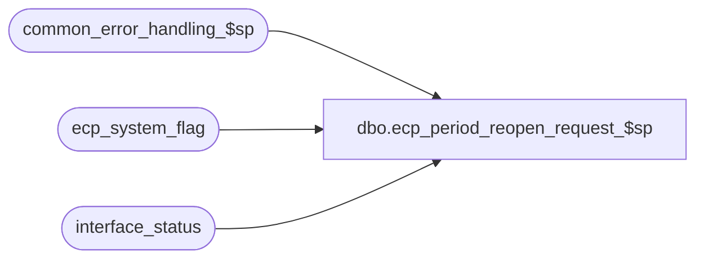

# dbo.ecp_period_reopen_request_$sp

**Database:** auditworks  
**Server:** bedrockdb01  

## Architecture Diagram



## Table Dependencies

| Referenced Table |
|---|
| common_error_handling_$sp |
| ecp_system_flag |
| interface_status |

## Stored Procedure Code

```sql
create proc [dbo].[ecp_period_reopen_request_$sp] @user_id int = NULL,
@process_id binary(16) = NULL
AS 
--TODO:  audit-trail
/* 
Proc Name: ecp_period_reopen_request_$sp 
Desc:   Called by UI to request pay-period reopen

HISTORY:  
Date     Name           Def#    Desc
Apr14,11 Paul           126153  Use unicode datatypes
Oct31,08 Vicci          106094  Author
*/

SET NOCOUNT ON
DECLARE
  @errmsg                       nvarchar(255),
  @errno                        int,
  @message_id                   int,
  @object_name                  nvarchar(255),
  @operation_name               nvarchar(100),
  @process_name                 nvarchar(100),
  @process_no                   int,
  @rows				int,
  @stream_no                    tinyint,
  @pay_period_close_date 	datetime,
  @pay_period_reopen_status	smallint 

SELECT @message_id = 201068,
       @operation_name = 'Unknown',
       @process_name = 'ecp_period_reopen_request_$sp',
       @process_no = 282,
       @stream_no = 1

SELECT @pay_period_close_date = c.flag_datetime_value
  FROM ecp_system_flag c
 WHERE flag_name = 'ecp_payperiod_close_datetime'  
SELECT @errno = @@error, @rows = @@rowcount
IF @errno <> 0
BEGIN
  SELECT @errmsg = 'Unable to determine last pay-period closed',
     @object_name = 'ecp_system_flag',
         @operation_name = 'SELECT'
  GOTO error
END
IF @rows < 1
BEGIN
  INSERT INTO ecp_system_flag(flag_name, flag_comment)
  VALUES('ecp_payperiod_close_datetime', 'flag_datetime_value set by user to indicate that pay-period is closed and that no more imports/allocations can be posted to it')
  SELECT @errno = @@error
  IF @errno <> 0
  BEGIN
    SELECT @errmsg = 'Unable to create entry to indicate which pay-period has been closed',
           @object_name = 'ecp_system_flag',
           @operation_name = 'INSERT'
  GOTO error
  END
  RETURN
END

IF @pay_period_close_date IS NULL
  RETURN

SELECT @pay_period_reopen_status = IsNull(c.flag_numeric_value, 0) 
  FROM ecp_system_flag c
 WHERE flag_name = 'ecp_payperiod_reopen_status'  
SELECT @errno = @@error, @rows = @@rowcount
IF @errno <> 0
BEGIN
  SELECT @errmsg = 'Unable to determine whether another pay-period reopen request is already outstanding',
     @object_name = 'ecp_system_flag',
         @operation_name = 'SELECT'
  GOTO error
END
IF @rows < 1
BEGIN
  INSERT INTO ecp_system_flag(flag_name, flag_comment)
  VALUES('ecp_payperiod_reopen_status', 'flag_datetime_value set by system to indicate that pay-period which is being re-opened;  flag_numeric_value is set to 1 by user indicating re-open requested, higher number by system to indicate progress and null when done to indicate completion')
  SELECT @errno = @@error
  IF @errno <> 0
  BEGIN
    SELECT @errmsg = 'Unable to create entry to indicate the status of a period-reopening request',
           @object_name = 'ecp_system_flag',
           @operation_name = 'INSERT'
  GOTO error
  END
  SELECT @pay_period_reopen_status = 0
END

IF @pay_period_reopen_status = 0
BEGIN
  UPDATE ecp_system_flag
     SET flag_numeric_value = 1  --re-open request outstanding
   WHERE flag_name = 'ecp_payperiod_reopen_status'  
  SELECT @errno = @@error
  IF @errno <> 0
  BEGIN
    SELECT @errmsg = 'Unable to create entry to indicate the status of a period-reopening request',
           @object_name = 'ecp_system_flag',
           @operation_name = 'UPDATE'
  GOTO error
  END
END  --IF @pay_period_reopen_status = 0

UPDATE interface_status
   SET last_posting_datetime = getdate()
 WHERE interface_id = 44
SELECT @errno = @@error
IF @errno <> 0
BEGIN
  SELECT @errmsg = 'Unable to indicate new information is available for the ECP posting',
         @object_name = 'interface_status',
         @operation_name = 'UPDATE'
  GOTO error
END

UPDATE interface_status
   SET immediate_posting_requested = 1
 WHERE interface_id = 44
   AND immediate_posting_requested = 0
SELECT @errno = @@error
IF @errno <> 0
BEGIN
  SELECT @errmsg = 'Unable to set ECP posting request',
         @object_name = 'interface_status',
         @operation_name = 'UPDATE'
  GOTO error
END

RETURN

error:
  EXEC common_error_handling_$sp @process_no, @errno, @errmsg, 0, @message_id, @process_name, @object_name, @operation_name, 1, @stream_no
  RETURN
```

