# dbo.ecp_productivity_report2_$sp

**Database:** auditworks  
**Server:** bedrockdb01  

## Architecture Diagram

```mermaid
flowchart LR
    SP["dbo.ecp_productivity_report2_$sp"]
    CLNDR_LVL(["CLNDR_LVL"]) --> SP
    CLNDR_LVL_TYPE(["CLNDR_LVL_TYPE"]) --> SP
    CLNDR_LVL_TYPE_LANG(["CLNDR_LVL_TYPE_LANG"]) --> SP
    CLNDR_PRD(["CLNDR_PRD"]) --> SP
    EMPLY(["EMPLY"]) --> SP
    EMPLY_ORG_CHN_PSTN_A_HSTRY(["EMPLY_ORG_CHN_PSTN_A_HSTRY"]) --> SP
    EMPLY_STS_HSTRY(["EMPLY_STS_HSTRY"]) --> SP
    ORG_CHN(["ORG_CHN"]) --> SP
    ORG_CHN_HRCHY_LVL_GRP(["ORG_CHN_HRCHY_LVL_GRP"]) --> SP
    ORG_CHN_HRCHY_LVL_GRP_A(["ORG_CHN_HRCHY_LVL_GRP_A"]) --> SP
    ORG_CHN_LOC_FNCTN(["ORG_CHN_LOC_FNCTN"]) --> SP
    ORG_CHN_LOC_FNCTN_LANG(["ORG_CHN_LOC_FNCTN_LANG"]) --> SP
    ORG_CHN_PSTN(["ORG_CHN_PSTN"]) --> SP
    ORG_CHN_PSTN_LANG(["ORG_CHN_PSTN_LANG"]) --> SP
    SCRTY_ACS_HRCHY_LVL_GRP(["SCRTY_ACS_HRCHY_LVL_GRP"]) --> SP
    alpha_code_description(["alpha_code_description"]) --> SP
    common_error_handling__sp(["common_error_handling_$sp"]) --> SP
    ecp_cap_override(["ecp_cap_override"]) --> SP
    ecp_get_calendar_levels__sp(["ecp_get_calendar_levels_$sp"]) --> SP
    dbo_ecp_get_user_employee_no__sp(["dbo.ecp_get_user_employee_no_$sp"]) --> SP
    ecp_hour_categorization(["ecp_hour_categorization"]) --> SP
    ecp_parameter(["ecp_parameter"]) --> SP
    ecp_reference_amt(["ecp_reference_amt"]) --> SP
    ecp_reference_amt_type(["ecp_reference_amt_type"]) --> SP
    ecp_trace_productivity_rpt2(["ecp_trace_productivity_rpt2"]) --> SP
    ecp_variable_amt(["ecp_variable_amt"]) --> SP
    ecp_variable_amt_xref(["ecp_variable_amt_xref"]) --> SP
    empl_comms_auto_adj_hist(["empl_comms_auto_adj_hist"]) --> SP
    empl_comms_auto_adj_hist_LANG(["empl_comms_auto_adj_hist_LANG"]) --> SP
    employee_comms_accum_basis_def(["employee_comms_accum_basis_def"]) --> SP
    employee_comms_auto_adj(["employee_comms_auto_adj"]) --> SP
    employee_comparison_type(["employee_comparison_type"]) --> SP
    employee_hour_summary(["employee_hour_summary"]) --> SP
    employee_productivity_comment(["employee_productivity_comment"]) --> SP
    employee_relationship_set(["employee_relationship_set"]) --> SP
    employee_relationship_set_xref(["employee_relationship_set_xref"]) --> SP
    employee_trans_summary(["employee_trans_summary"]) --> SP
    employee_transaction_role(["employee_transaction_role"]) --> SP
    end_process_log__sp(["end_process_log_$sp"]) --> SP
    language_dependent_desc_sys(["language_dependent_desc_sys"]) --> SP
    language_dependent_description(["language_dependent_description"]) --> SP
    scoping_salesaudit(["scoping_salesaudit"]) --> SP
    start_process_log__sp(["start_process_log_$sp"]) --> SP
```



## Table Dependencies

| Referenced Table |
|---|
| CLNDR_LVL |
| CLNDR_LVL_TYPE |
| CLNDR_LVL_TYPE_LANG |
| CLNDR_PRD |
| EMPLY |
| EMPLY_ORG_CHN_PSTN_A_HSTRY |
| EMPLY_STS_HSTRY |
| ORG_CHN |
| ORG_CHN_HRCHY_LVL_GRP |
| ORG_CHN_HRCHY_LVL_GRP_A |
| ORG_CHN_LOC_FNCTN |
| ORG_CHN_LOC_FNCTN_LANG |
| ORG_CHN_PSTN |
| ORG_CHN_PSTN_LANG |
| SCRTY_ACS_HRCHY_LVL_GRP |
| alpha_code_description |
| common_error_handling_$sp |
| ecp_cap_override |
| ecp_get_calendar_levels_$sp |
| dbo.ecp_get_user_employee_no_$sp |
| ecp_hour_categorization |
| ecp_parameter |
| ecp_reference_amt |
| ecp_reference_amt_type |
| ecp_trace_productivity_rpt2 |
| ecp_variable_amt |
| ecp_variable_amt_xref |
| empl_comms_auto_adj_hist |
| empl_comms_auto_adj_hist_LANG |
| employee_comms_accum_basis_def |
| employee_comms_auto_adj |
| employee_comparison_type |
| employee_hour_summary |
| employee_productivity_comment |
| employee_relationship_set |
| employee_relationship_set_xref |
| employee_trans_summary |
| employee_transaction_role |
| end_process_log_$sp |
| language_dependent_desc_sys |
| language_dependent_description |
| scoping_salesaudit |
| start_process_log_$sp |

## Stored Procedure Code

```sql
create proc dbo.ecp_productivity_report2_$sp --DECLARE 
  @select_from_date datetime = null,  --all periods with at least 1 date falling between the range selected are included
  @select_to_date datetime = null,    -- if from/to not specified assumes today.  Note, the period end date of lowest calendar level included in the report which includes the to-date selected is used as the as-of date for the report.
  @empl_calendar_level_list nvarchar(4000) = null,  --if not specified assumes all
  @select_transaction_role_list nvarchar(4000) = null,  --from employee_transaction_role WHERE track_in_productivity_flag = 1;  if not specified it assumes all
  @select_store_list nvarchar(4000) = null,  -- if from/to/list not specified assumes all
   @select_store_from int = null,
   @select_store_to int = null,
  @select_employee_list nvarchar(4000) = null,
   @select_employee_from int = null,
   @select_employee_to int = null,
  @select_selling_area_list nvarchar(4000) = null,
   @select_selling_area_from int = null,
   @select_selling_area_to int = null,
  @select_primary_position_list nvarchar(4000) = null, 
  @comparison_type smallint = null,  --see employee_comparison_type table
  @comparison_limited tinyint = null, --0=include all employee meeting comparison-type criteria, 1=include only those employees included in the report in the comparison.
  @language_id smallint = null,  --if not specified defaults to 1033 i.e. English 
  @self_compare tinyint = null,  --i.e. comparison to last year
  @user_name nvarchar(30) = null,
  @filter_clause nvarchar(4000) = null,  --note:  currently applied to lowest calendar-level selected.
  @order_clause nvarchar(4000) = null,  --note:  currently, if a comparison type is selected which requires a trans store merge or role merge then transaction store and/or role is not available in sort
                                      --relationship group is only available if included in comp type selected
  @user_id numeric(10,0) = null,
  @store_access_table_name nvarchar(100) = null,  
  @select_home_store_list nvarchar(4000) = null,  -- if from/to/list not specified assumes all
   @select_home_store_from int = null,
   @select_home_store_to int = null,
  @terminated_employees tinyint = null, --if not specified assumes all, 
                                        --if set to 1 means only terminated employees, 
			                --if set to 0 means excludes terminated employees
  @subtotal_qty tinyint = null, 
  @compare_role tinyint = 0,  --indicates whether averages/comparisons per employee transaction role are to be calculated or averages for sum of roles included in report                              
   @include_comment tinyint = 0,  --0 don't return comment, 1=return comments as extra rows, 2=return comment indicator
  @merch_sale_amt money = null,  --these next 12 fields are positive or negative adjustments and/or comments applied to the employee(s) selected, at each of the calendar-levels selected.
  @merch_sale_disc_amt money = null,
  @merch_sale_units money = null,
  @merch_sale_trans_qty money = null,
  @merch_rtn_amt money = null,
  @merch_rtn_units money = null,
  @merch_rtn_trans_qty money = null,
  @serv_sale_amt money = null,
  @serv_rtn_amt money = null,
  @productive_selling_hours money = null,
  @productive_non_selling_hours money = null,
  @non_productive_hours money = null,
  @comment nvarchar(4000) = null,
  @comment_private nvarchar(4000) = null,
   @private_comment_access tinyint = 0,
   @exclude_private_comment tinyint = 1,
  @merge_calendar_dates tinyint = 0,
  @comp_row_level_only tinyint = 0, --2=Row Level comparison selected
  @date_selection_calendar_level int = null,  --Should be null when relative date range is not used so if From or To date given ignore it
  @date_range_type nvarchar(30) = null,  --valid options are 'current', 'previous', 'first_open', 'last_closed'
  @employee_no int = null,  --set to employee number of user-id if user is restricted to viewing only his own data.
  @reference_amt_type_list nvarchar(4000) = null,  --ordered list of reference amount types to be included on the report.
  @top_X	smallint = 0,  --positive number if first X are to be returned, negative if last X are to be returned
  @reference_amt_only tinyint = 0, --set to true by UI if the user has not selected any KPI except reference amounts to avoid returning employees with no ref amt
  @include_auto_adj_basis tinyint = 0,
  @run_as_trace_execution_time datetime = null,
  @columns_selected nvarchar(4000) = null  --if columns 36, 45 or 46 have been selected (alert or cap) then even if view is row-level treat as "row-level-only" = false

AS
--12/05/2008 13:50:18
/* 
--DECLARE 
  @select_from_date datetime,
  @select_to_date datetime,
  @empl_calendar_level_list nvarchar(4000),
  @select_transaction_role_list nvarchar(4000),
  @select_store_list nvarchar(4000),
  @select_store_from int,
  @select_store_to int,
  @select_employee_list nvarchar(4000),
  @select_employee_from int,
  @select_employee_to int,
  @select_selling_area_list nvarchar(4000),
  @select_selling_area_from int,
  @select_selling_area_to int,
  @select_primary_position_list nvarchar(4000),
 @comparison_type smallint,
 @comparison_limited tinyint,
 @language_id smallint,
 @self_compare tinyint,
 @user_name nvarchar(30),
 @filter_clause nvarchar(4000),
 @order_clause nvarchar(4000),
 @user_id numeric(10,0),
 @store_access_table_name nvarchar(100),
   @select_home_store_list nvarchar(4000),
   @select_home_store_from int,
   @select_home_store_to int,
   @terminated_employees tinyint,
  @subtotal_qty tinyint, 
  @compare_role tinyint,
  @include_comment tinyint,
  @merch_sale_amt money,
  @merch_sale_disc_amt money,
  @merch_sale_units money,
  @merch_sale_trans_qty money,
  @merch_rtn_amt money,
  @merch_rtn_units money,
  @merch_rtn_trans_qty money,
  @serv_sale_amt money,
  @serv_rtn_amt money,
  @productive_selling_hours money,
  @productive_non_selling_hours money,
  @non_productive_hours money,
  @comment nvarchar(4000),
  @comment_private nvarchar(4000),
  @private_comment_access tinyint,
  @exclude_private_comment tinyint,
  @merge_calendar_dates tinyint

SELECT @select_from_date = null,
       @select_to_date = '07/15/2007',
       @empl_calendar_level_list = '2',
       @select_transaction_role_list = null,
       @select_store_list = null,
       @select_store_from = null,
       @select_store_to = null,
       @select_employee_list = null,
       @select_employee_from = null,
       @select_employee_to = null,
       @select_selling_area_list = null,
       @select_selling_area_from = null,
       @select_selling_area_to = null,
       @select_primary_position_list = null,
       @comparison_type = null,
       @comparison_limited = 0,
       @language_id = 1033,
       @self_compare = 0,
       @user_name = null,
       @filter_clause = null,
       @order_clause = null,
       @user_id = null,
       @store_access_table_name = null,
       @select_home_store_list = null,
       @select_home_store_from = null,
       @select_home_store_to = null,
       @terminated_employees = null,
       @subtotal_qty = 0,
       @compare_role = 0,
       @include_comment = 0,
       @private_comment_access = 1,
       @exclude_private_comment = 1,
       @merge_calendar_dates = 0

exec ecp_productivity_report2_$sp 
       @select_from_date,
       @select_to_date,
       @empl_calendar_level_list,
       @select_transaction_role_list,
       @select_store_list,
       @select_store_from,
       @select_store_to,
       @select_employee_list,
       @select_employee_from,
       @select_employee_to,
       @select_selling_area_list,
       @select_selling_area_from,
       @select_selling_area_to,
@select_primary_position_list,
       @comparison_type,
       @comparison_limited,
  @language_id,
   @self_compare,
       @user_name,
       @filter_clause,
       @order_clause,
       @user_id,
       @store_access_table_name,
       @select_home_store_list,
       @select_home_store_from,
       @select_home_store_to,
       @terminated_employees,
       @subtotal_qty,
       @compare_role,
       @include_comment,
       @merch_sale_amt,
       @merch_sale_disc_amt,
       @merch_sale_units,
       @merch_sale_trans_qty,
       @merch_rtn_amt,
       @merch_rtn_units,
       @merch_rtn_trans_qty,
       @serv_sale_amt,
       @serv_rtn_amt,
       @productive_selling_hours,
       @productive_non_selling_hours,
       @non_productive_hours,
       @comment,
       @comment_private,
       @private_comment_access,
       @exclude_private_comment,
       @merge_calendar_dates

Proc Name: ecp_productivity_report2_$sp 
Desc:   Retrieves data for ECP Employee Productivity Report.
        Note:  retrieves all hours if you ask for all transaction roles, 
               but only hours of matching position if you ask for specific role(s).
HISTORY:  
Date     Name           Def#    Desc
Feb03,16 Vicci      TFS-139985  Handle line amounts as large as numeric(18,4).
Mar23,15 Vicci      TFS-92911   Handle employees with selling area -1.  Return multi-lang descriptions of 'Selling area:  None', 'Position:  None'
                                instead of hard-coded English 'Selling area ?', '?' for employees with no selling area / position assigment.
Jan30,14 Vicci         148763   Replace @language_id variable with its value in dynamic sql execution for ecp_reference_amt_type.
Mar28,13 Vicci         140907   Handle multi-language.
Dec01,09 Vicci     BARN200910	Print actual per hour in cap-amt column in employee was not capped and put a C in the alert colum if net was capped.
Nov30,09 Vicci     BARN200910   Since "release-to-stores" produces a snapshot of the report rendering instead of just the
			 	report data set when a computation is used in the report parameter passed to the stored
			 	proc and since this implies that the security filters will not be applied to the snapshot
			 	upon retrieval by store personel with limited access, handle the following parameter
			 	manipulation in this proc:  allow @comp_row_level_only to be passed as which view was selected
			 	(view 2 is row level comparison) along with @columns_selected and reset it accordingly;  also
			 	allow @date_selection_calendar_level to be passed when it shouldn't and reset it to null if
			 	from or to date given.
Oct26,09 Vicci     BARN200910   Allow from/to store, selling area home-store and employee to be passed in the 
				corresponding list field with a dash separator.  No longer required but left in anyhow.
Mar17,09 Vicci     BARN200903   When transaction-store is not available, use home-store to look up cap-rate overrides (ecp_cap_override).
Jan27,09 Vicci         104484   Fix removal of KPI from group desc when subtotalling by KPI and nothing follows.
Jan21,09 Vicci         104484   Need to handle duplicates in reference amount type list and also must 
                                output them in order of reference type not in the order of appearance in ref-amt-type list.
Jan12,09 Vicci         104484   Add reference amts to cleanup retrieval.
Jan07,09 Vicci         104484   Always do Top X PER GROUP even if not sorting on KPI.
Dec04,08 Vicci         104484   Support including variables used as basis for auto-adjustment calculations
Dec02,08 Vicci         104484   Ensure comment sorted correctly (sticks with employee) even when sort is by KPI
Nov26,08 Vicci         104484   Support returning reference amounts broken out by auto-adj rule when sort on Transaction Role requested.
Nov24,08 Vicci         104484   Support top X (or bottom X) within group requests.
Nov21,08 Vicci         104484   Return amounts for requested reference amount type list.
Nov07,08 Vicci         104484 Support traffic counts. 
Oct30,08 Vicci         105986   When user access limited to their own data (i.e. employee_no passed in) or when user has not been
                                given access to any stores, then only return details pertinent to that employee.
Oct16,08 Vicci         105492   Add missing column prefix;  handle null @group_possibility.
Oct01,08 Vicci         105492  Recognise sort by home-store-name or store-name as requiring store;  support employee not 
                                being last item in the sort;  offer new "run based on prior execution params" to support debugging;
                                Ignore requests to include more subtotals than there are comparison groups in the comp type selected.
Sep19,08 Vicci                  Exclude employees with all activity totalling 0.
Sep17,08 Vicci         104969   When comparison unlimited and too many subtotals have been requested don't return extra unidentified subtotal.  
Sep17,08 Vicci         104975   Don't join to #store_restriction with an OR (rows doubled) instead check if IN.   
Sep11,08 Vicci                  Exit when no data found
Sep09,08 Vicci         104744   Set drill-down position/area correctly on subtotals.
Aug28,08 Vicci         104471   Handle being passed a @date_range_type with a missing @date_selection_calendar_level by
                                assuming the relative date range type applies to the lowest lowest level.
Aug21,08 Vicci         103967   Handle effective date on employee relationship changes (even in YTD etc figures).
Aug06,08 Vicci         103077   Correct join to EMPLY_ORG_CHN_PSTN_A_HSTRY to use select-to date instead of getdate();
				Handle effective date on employee home-store changes.
Aug04,08 Vicci                  Change default for date-range-type to be null.				
Jul02,08 Vicci         102676   When employee has comments but no amounts ensure that row label that would have been on
                                the amount row appears instead on the comment row;  also, display comment indicator even
                                if no amounts in include_comment = 2 case.
May22,08 Vicci         101442   Support relative date-range selection.
May05,08 Vicci 	       100889   Print column headers on report total since it is on another page;  
                       		don't do a page break after each employee when employee is the only group, 
                                instead require user to check "second level" page break;
                                When comparison information is not display at row level, add column headers
                                to the comp group totals so that accurate column headers can be displayed.
                                Do not include employees that have no sales TY but did have sales LY when a 
                                TY/LY comparison is requested (otherwise you get a bunch of blank ratios only).
May01,08 Vicci         100677   Sum sale amount not sale-amount-with-selling-hour for sale-amount field even when comparison_limited = 0;
                                ensure "with-selling-hour" figures are used in all per-hour calculations even when comparison_limited = 0;
                                print totals in comparison columns even when comparison group is "all employees" i.e. the report total;
                                format alert basis amount.
Apr03,08 Vicci          97975   Avoid losing subtotal discounts when filter applied and more than 1 calendar level included
Apr02,08 Vicci          97975   Correct building of #filter_employee to only include non-null employee_no
Mar10,08 Vicci          97975   Relocate building of #filter_employee to be after group descr 
                          	are set to avoid subtotals being lost when a filter is applied.
Feb08,08 Vicci          97975   Set errno not just message_id when raising business rule error
Feb06,08 Vicci          97955   Avoid comments being repeated when user asks for subtotal qty greater than what is available;
                                When comments pertain to a period for which there is no corresponding amounts, display the 
                                period to which the comments pertain instead of just an asterisk.
Dec12,07 Vicci          95521   Replace double-quoted identifier usage with single quote
Nov26,07 Vicci          95521   Integrate with CRDM properly.           
Nov08,07 Vicci          85597   WIP, commented out for now: return comparison group description
Oct23,07 Vicci          85597   Add row shading control, starting with shade 0
Oct17,07 Vicci 		85597  Comparison to last year figures support.
Oct04,07 Vicci          85597   Add process logging.
Oct01,07 Vicci          85597   Fix filter application to exclude subtotals if all employees 
                                within the group have been filtered out.
Sep28,07 Vicci          85597   Fix calendar level reference in filter application
Sep25,07 Vicci          85597   Calendar date merge
Sep21,07 Vicci   	85597   Fix handling of transaction role with regard to payroll hour retrieval.
Sep20,07 Vicci          85597   If Transaction stores have been selected, then apply the selectivity regardless of whether 
                    		or not comparison is limited.  Retrict report to home-stores of employees selected directly 
                                or indirectly when comp-type by home-store.
Sep19,07 Vicci          85597   Fix store number sort to be effectively numeric instead of alpha.
Sep18,07 Vicci  	85597 	Calendar period descriptions were missing on subtotals when comparison limited set to false;
                                employee_transaction_role_desc miss-named;  comment asterisk removal.
      Fix KPI removal from desc 7
Sep18,07 Vicci          85597   Sale trans qty was accidentally set to serv trans qty.  Fixed.
Sep17,07 Vicci          85597   Fix null concatenation to be empty string so that ansi null settings no longer affect unlimited comparisons;
                                fix home-store from/to settings in case of unlimited comparison with employee selected and comparison-type not by home-store.
Sep14,07 Vicci          85597   Cap on net option, subtotal by comparison group, optional inclusion of role in comparison,
                                interpret comparison type with relationship type specified as "compare to those in my
                                group if I am involved in this relationship, or to those not involved in the relationship
                                otherwise", handle effective date on relationships by excluding from comparison if changed within period,
                           	override sort to match comparison type selected if necessary, use sort to control what additional
           			employee info to include, ensure sort criteria is in report, apply filter to lowest calendar level but
                                ensure other levels for employee filtered are still included, apply alert to net instead of merch sale,
                                correct column sort, add "what if" scenario handling, add comment handling;  
			        add total trans, net amt per sale trans, total trans per hour, sale trans per hour and corresponding comp fields.
Aug15,07 Vicci          85597   When running a report for terminated employees only, only those employees who were 
                             terminated PRIOR to the commencement of the lowest calendar level included and who
          were still terminated as of the end of this calendar level should be included.
             When running a report for non-terminated employees only, only those employees whose 
                                status was not terminated PRIOR to the commencement of the lowest calendar level included
                                or whose status was not terminated as of the end of this calendar level should be included.
Aug15,07 Vicci          85597  Remove accidentally hard-coded .85 and replace with @alert_limit.
Aug10,07 Vicci          85597   Support home-store based comparison types and selectivity.
Jul20,07 Vicci          85597   Fix cap calculation, add support for group by relationship group.
Jul13,07 Vicci          85597   Add new Sales, Returns, Sales per hour, Ratio of Sales per hour over average fields
Jul11,07 Vicci          85597   Add input params for home-store although not yet supported.
Jul09,07 Vicci          85597   Add Pct Share figures
Jul09,07 Vicci          85597   Order by selling area number instead of name per Barney's request
Jul05,07 Vicci          85597   Support cap rate override by store/selling-area
Jun13,07 Vicci          85597   Add option to log trace of calls to this procedure;  set comparison_type passed in to null if invalid.
Jun12,07 Vicci          85597   Get selling area description from home-store not transaction store
Jun01,07 Vicci          85597   Add store name to store subtotal
May30,07 Vicci          85597   Add missing order-by clause to ad-hoc calendar period selection
May17,07 Vicci          85597   Add soft order by support
May08,07 Vicci		85597   Use hour position instead of primary position in role association;  support multiple positions associated with same role.
May01,07 Vicci          85597   Added support for comparison-types with selling area or primary position limitation, 
                                interpreted as "don't provide comparison figures for those not in specified area/position" when
                                matching is also on, and interpreted as "compare me to those in specified area/position" otherwise.
Feb23,07 Vicci		85597	Author
*/

--TODO:  multi-language
--TODO:  comparison to last year
--TODO:  have Winnie pass @store_access_table_name
--TODO:  support home-store selectivity

--01/21/2009 13:18:29
--  SELECT convert(nvarchar, execution_datetime, 108), * FROM ecp_trace_productivity_rpt2 order by execution_datetime DESC
SET NOCOUNT ON
IF @run_as_trace_execution_time IS NOT NULL
BEGIN 
SELECT @select_from_date = select_from_date,
       @select_to_date = select_to_date,
       @empl_calendar_level_list = empl_calendar_level_list,
       @select_transaction_role_list = select_transaction_role_list,
       @select_store_list = select_store_list,
       @select_store_from = select_store_from,
       @select_store_to = select_store_to,
       @select_employee_list = select_employee_list,
       @select_employee_from = select_employee_from,
       @select_employee_to = select_employee_to,
       @select_selling_area_list = select_selling_area_list,
       @select_selling_area_from = select_selling_area_from,
       @select_selling_area_to = select_selling_area_to,
       @select_primary_position_list = select_primary_positionlist,
       @comparison_type = comparison_type,
       @comparison_limited = comparison_limited,
       @language_id = language_id,
       @self_compare = self_compare,
       @user_name = user_name,
       @filter_clause = filter_clause,
       @order_clause = order_clause,
       @user_id = user_id,
       @store_access_table_name = store_access_table_name,
       @select_home_store_list = select_home_store_list,
       @select_home_store_from = select_home_store_from,
       @select_home_store_to = select_home_store_to,
       @terminated_employees = terminated_employees,
       @subtotal_qty = subtotal_qty,
       @compare_role = compare_role,
       @include_comment = include_comment,
       @merch_sale_amt = merch_sale_amt,
       @merch_sale_disc_amt = merch_sale_disc_amt,
       @merch_sale_units = merch_sale_units,
       @merch_sale_trans_qty = merch_sale_trans_qty,
       @merch_rtn_amt = merch_rtn_amt,
       @merch_rtn_units = merch_rtn_units,
       @merch_rtn_trans_qty = merch_rtn_trans_qty,
       @serv_sale_amt = serv_sale_amt,
       @serv_rtn_amt = serv_rtn_amt,
       @productive_selling_hours = productive_selling_hours,
       @productive_non_selling_hours = productive_non_selling_hours,
       @non_productive_hours = non_productive_hours,
       @comment = comment,
       @comment_private = comment_private,
       @private_comment_access = private_comment_access,
       @exclude_private_comment = exclude_private_comment,
       @merge_calendar_dates = merge_calendar_dates,
       @comp_row_level_only = comp_row_level_only,
       @date_selection_calendar_level = date_selection_calendar_level,
     @date_range_type = date_range_type,
       @employee_no = employee_no,
       @reference_amt_type_list = reference_amt_type_list,
       @top_X = top_X,
       @reference_amt_only = reference_amt_only,
       @include_auto_adj_basis = include_auto_adj_basis
  FROM ecp_trace_productivity_rpt2
 WHERE execution_datetime >= @run_as_trace_execution_time
   AND execution_datetime < dateadd(ss, 1, @run_as_trace_execution_time)
END

DECLARE
  @data_found int,
  @alert_limit 			numeric(18,4),
  @valid_comparison_type	tinyint,
  @cap_rate			money,
  @compare_employee		tinyint,
  @compare_employee_from	int,
  @compare_employee_to		int,
  @compare_selling_area_from	int,
  @compare_selling_area_to	int,
  @min_selling_area_no		int,
  @max_selling_area_no		int,
  @min_employee_no		int,
  @max_employee_no		int,
  @comparison_limits_apply	tinyint,
  @compare_home_store_from	int,
  @compare_home_store_to	int,
  @compare_store_from		int,
  @compare_store_to		int,
  @ecp_clndr_id			binary(16),
  @employee_count		int,
  @from_date 			datetime,
  @calendar_level_count		int,
  @compare_position             tinyint,
  @compare_selling_area         tinyint,
  @compare_home_store		tinyint,
  @compare_store              tinyint,
  @lowest_calendar_level	int,
  @lowest_calendar_level_id	binary(16),
  @one_hundred			money,
  @empl_transaction_role_count  int, 
  @errmsg                       nvarchar(2000),
  @errno    int,
  @refcount smallint,
  @errno2			int,
  @function_name	        varbinary(128),
  @highest_calendar_level	int,
  @highest_calendar_level_id	binary(16),
  @message_id                   int,
  @position_count		int,
  @process_name             nvarchar(100),
  @process_no                   int,
  @object_name                  nvarchar(255),
  @operation_name   nvarchar(100),
  @rows				int,
  @calendar_count		int,
  @selling_area_count		int,
  @home_store_count             int,
  @home_store_comp_count	int,
  @store_comp_count 		int,
  @selling_area_comp_count 	int,
  @position_comp_count 		int,
  @store_count			int,
  @stream_no                  tinyint,
  @to_date 			datetime,
  @sql_command 			nvarchar(4000),
  @relationship_type 		nvarchar(20),
  @relationship_type_len	int,
  @relationship_position        nvarchar(4),
  @selling_area_no              nvarchar(4000),
  @primary_position             nvarchar(4000),
@group_possibility nvarchar(4000),
@start_pos int,
@end_pos int,
@role_group_seq int,
@empl_group_seq int,
@clause_length int,
@extended_clause_length int,
@comp_group_cnt int,
@comp_group_no tinyint,
@group_no tinyint,
@position_done tinyint,
@selling_area_done tinyint,
@store_done tinyint,
@relationship_done tinyint,
@role_done tinyint,
@home_store_done tinyint,
@employee_done tinyint,
@kpi_done tinyint,
@separator nvarchar(10),
@sort_column_name nvarchar(30),
@group_qty tinyint,
@trace_log tinyint,
@order_clause_length int,
@level_desc_length int,
@level_desc nvarchar(255),
@store_length int,
@date_desc nvarchar(255),
@store_restriction tinyint,
@adj_employee_no int,
@adj_home_store_no int, 
@employee_transaction_role nvarchar(20),
@process_timestamp float,
@process_start_time datetime,
@transaction_count int,
@last_year_to_date datetime,
@filter_count int,
@ref_type_count int,
  @reference_amount_type1 smallint,
 @reference_amount_type2 smallint,
  @reference_amount_type3 smallint,
  @reference_amount_type4 smallint,
  @reference_amount_type5 smallint,
  @reference_amount_type6 smallint,
  @reference_amount_type7 smallint,
  @reference_amount_type8 smallint,
  @reference_amount_type9 smallint,
  @reference_amount_type10 smallint,
  @reference_amount_type smallint, 
  @counter int, @done tinyint, 
  @direction nvarchar(4),
  @group_desc_1 nvarchar(400),
  @group_desc_2 nvarchar(400),
  @group_desc_3 nvarchar(400),
  @group_desc_4 nvarchar(400),
  @group_desc_5 nvarchar(400),
  @cursor_open tinyint,
  @order_clause_desc nvarchar(4000),
  @filter_clause_desc nvarchar(4000),
@from_to_flag tinyint,
@capnet_hr_ref_amt_col smallint,
@capmerch_sale_hr_ref_amt_col smallint,
@language_id_string nvarchar(5),

@ending_desc nvarchar(255),
@Adjustment_desc nvarchar(255),
@Condition_desc nvarchar(255),
@CalculationBasis_desc nvarchar(255),
@Groupna_desc nvarchar(255),
@KPI_desc nvarchar(255),
@Reporttotal_desc nvarchar(255),
@subtotal_desc nvarchar(255),
@Employeedetail_desc nvarchar(255),
@Employeesummary_desc nvarchar(255),
@unknown_selling_area_desc nvarchar(255),  --Selling area ?
@unknown_position_desc nvarchar(255),  --Position ?
@none_desc nvarchar(255)

SELECT @employee_count = 0, 
       @filter_count = 0,
       @errno = 0,
       @function_name = convert(varbinary(128), 'ecp_productivity_report2_$sp'),
       @message_id = 201068,
       @one_hundred = 100,
       @operation_name = 'Unknown',
       @position_count = 0,
       @process_name = 'ecp_productivity_report2_$sp',
       @process_no = 283, 
       @selling_area_count = 0,
       @store_count = 0, 
       @home_store_count = 0,       
       @home_store_comp_count = 0,
       @store_comp_count = 0,
       @selling_area_comp_count = 0,
       @position_comp_count = 0,
       @stream_no = 1,
       @comp_group_no = 0,
       @calendar_count = 0,
       @comparison_limits_apply = 0,
       @process_start_time = getdate(),
       @transaction_count = 0,
       @ref_type_count = 0,
       @direction = '' ,
       @cursor_open = 0,
       @role_group_seq = 0,
       @empl_group_seq  = 0,
       @order_clause_desc = @order_clause,
       @filter_clause_desc = @filter_clause,
       @language_id_string = convert(nvarchar, @language_id)

exec start_process_log_$sp @process_no, @process_timestamp OUTPUT, @errmsg OUTPUT, 1, @process_start_time, NULL 

SELECT @none_desc = display_description
  FROM language_dependent_description
 WHERE language_id = @language_id
   AND resource_id = 263
IF @errno <> 0
BEGIN
  SELECT @errmsg = 'Failed to determine language based description for @none_desc',
         @object_name = 'language_dependent_description',
         @operation_name = 'SELECT'
  GOTO error
END
IF @none_desc IS NULL
BEGIN
  SELECT @none_desc = display_description
    FROM language_dependent_desc_sys
   WHERE language_id = @language_id
     AND resource_id = 263
  IF @errno <> 0
  BEGIN
    SELECT @errmsg = 'Failed to determine language based description for @none_desc',
           @object_name = 'language_dependent_desc_sys',
           @operation_name = 'SELECT'
    GOTO error
  END
END
IF @none_desc IS NULL
  SELECT @none_desc = 'None'
  
SELECT @unknown_selling_area_desc = display_description
  FROM language_dependent_description
 WHERE language_id = @language_id
   AND resource_id = 5122
IF @errno <> 0
BEGIN
  SELECT @errmsg = 'Failed to determine language based description for @unknown_selling_area_desc',
         @object_name = 'language_dependent_description',
         @operation_name = 'SELECT'
  GOTO error
END
IF @unknown_selling_area_desc IS NULL
BEGIN
  SELECT @unknown_selling_area_desc = display_description
    FROM language_dependent_desc_sys
   WHERE language_id = @language_id
     AND resource_id = 5122
  IF @errno <> 0
  BEGIN
    SELECT @errmsg = 'Failed to determine language based description for @unknown_selling_area_desc',
          @object_name = 'language_dependent_desc_sys',
           @operation_name = 'SELECT'
    GOTO error
  END
END
IF @unknown_selling_area_desc IS NULL
  SELECT @unknown_selling_area_desc = 'Selling area:'
SELECT @unknown_selling_area_desc = @unknown_selling_area_desc + '  ' + @none_desc

SELECT @unknown_position_desc = display_description
  FROM language_dependent_description
 WHERE language_id = @language_id
   AND resource_id = 5286
IF @errno <> 0
BEGIN
  SELECT @errmsg = 'Failed to determine language based description for @unknown_position_desc',
         @object_name = 'language_dependent_description',
         @operation_name = 'SELECT'
  GOTO error
END
IF @unknown_position_desc IS NULL
BEGIN
  SELECT @unknown_position_desc = display_description
    FROM language_dependent_desc_sys
   WHERE language_id = @language_id
     AND resource_id = 5286
  IF @errno <> 0
  BEGIN
    SELECT @errmsg = 'Failed to determine language based description for @unknown_position_desc',
           @object_name = 'language_dependent_desc_sys',
           @operation_name = 'SELECT'
    GOTO error
  END
END
IF @unknown_position_desc IS NULL
  SELECT @unknown_position_desc = 'Position:'
SELECT @unknown_position_desc = @unknown_position_desc + '  ' + @none_desc


IF @include_comment IS NULL
  SELECT @include_comment = 0
IF @exclude_private_comment IS NULL
  SELECT @exclude_private_comment = 1

IF @include_comment = 0 AND (@comment IS NOT NULL OR @comment_private IS NOT NULL)
  SELECT @include_comment = 1

IF @exclude_private_comment = 1 AND @comment_private IS NOT NULL
  SELECT @exclude_private_comment = 0

IF LTRIM(RTRIM(@filter_clause)) = '' 
  SELECT @filter_clause = NULL

SELECT @trace_log = 1
IF @trace_log = 1
BEGIN
    if not exists (select * from dbo.sysobjects where id = Object_id('dbo.ecp_trace_productivity_rpt2') and type in ('U','S'))
    begin
  create table dbo.ecp_trace_productivity_rpt2 (
    execution_datetime datetime default getdate() not null,
    select_from_date datetime null,
    select_to_date datetime null,
    empl_calendar_level_list nvarchar(4000) null,
    select_transaction_role_list nvarchar(4000) null,
    select_store_list nvarchar(4000) null,
    select_store_from int null,
    select_store_to int null,
    select_employee_list nvarchar(4000) null,
    select_employee_from int null,
    select_employee_to int null,
    select_selling_area_list nvarchar(4000) null,
    select_selling_area_from int null,
    select_selling_area_to int null,
    select_primary_positionlist nvarchar(4000) null,
    comparison_type smallint null,
    comparison_limited tinyint null,
    language_id smallint null,
    self_compare tinyint null,
    user_name nvarchar(30) null,
    filter_clause nvarchar(4000) null,
    order_clause nvarchar(4000) null,
    user_id numeric(10,0) null,
    store_access_table_name nvarchar(100) null,
    select_home_store_list nvarchar(4000) null,
    select_home_store_from int null,
    select_home_store_to int null,
    terminated_employees tinyint null,
    subtotal_qty tinyint null, 
    compare_role tinyint null,
    include_comment tinyint null,
    merch_sale_amt money null,
    merch_sale_disc_amt money  null,
    merch_sale_units money  null,
    merch_sale_trans_qty money  null,
    merch_rtn_amt money  null,
    merch_rtn_units money  null,
    merch_rtn_trans_qty money  null,
    serv_sale_amt money  null,
    serv_rtn_amt money null,
    productive_selling_hours money  null,
    productive_non_selling_hours money  null,
    non_productive_hours money  null,
    comment nvarchar(4000)  null,
    comment_private nvarchar(4000)  null,
    private_comment_access tinyint null,
    exclude_private_comment tinyint null,
    merge_calendar_dates tinyint null,
    comp_row_level_only tinyint null,
    date_selection_calendar_level int null,
    date_range_type nvarchar(30) null,
    employee_no int null,
    reference_amt_type_list nvarchar(4000) null,
    top_X smallint null,
  reference_amt_only tinyint null,
    include_auto_adj_basis tinyint null,
    run_as_trace_execution_time datetime null,
    columns_selected nvarchar(4000) null)
    end

  DELETE ecp_trace_productivity_rpt2
   WHERE execution_datetime < dateadd(dd, -4, getdate())

  INSERT into ecp_trace_productivity_rpt2(
       select_from_date,
       select_to_date,
       empl_calendar_level_list,
       select_transaction_role_list,
       select_store_list,
       select_store_from,
       select_store_to,
       select_employee_list,
       select_employee_from,
       select_employee_to,
       select_selling_area_list,
       select_selling_area_from,
       select_selling_area_to,
       select_primary_positionlist,
       comparison_type,
       comparison_limited,
       language_id,
       self_compare,
       user_name,
       filter_clause,
       order_clause,
       user_id,
       store_access_table_name,
       select_home_store_list,
       select_home_store_from,
       select_home_store_to,
       terminated_employees,
       subtotal_qty,
       compare_role,
       include_comment,
       merch_sale_amt,
       merch_sale_disc_amt,
       merch_sale_units,
       merch_sale_trans_qty,
       merch_rtn_amt,
       merch_rtn_units,
       merch_rtn_trans_qty,
       serv_sale_amt,
       serv_rtn_amt,
       productive_selling_hours,
       productive_non_selling_hours,
       non_productive_hours,
       comment,
       comment_private,
       private_comment_access,
       exclude_private_comment,
       merge_calendar_dates,
       comp_row_level_only,
       date_selection_calendar_level, 
       date_range_type,
       employee_no,
       reference_amt_type_list,
       top_X,
       reference_amt_only, 
       include_auto_adj_basis,
       run_as_trace_execution_time,
       columns_selected)
  VALUES (
       @select_from_date,
       @select_to_date,
       @empl_calendar_level_list,
       @select_transaction_role_list,
       @select_store_list,
       @select_store_from,
       @select_store_to,
       @select_employee_list,
       @select_employee_from,
       @select_employee_to,
       @select_selling_area_list,
       @select_selling_area_from,
       @select_selling_area_to,
       @select_primary_position_list,
       @comparison_type,
       @comparison_limited,
       @language_id,
       @self_compare,
       @user_name,
       @filter_clause,
       @order_clause,
       @user_id,
       @store_access_table_name,
       @select_home_store_list,
       @select_home_store_from,
       @select_home_store_to,
       @terminated_employees,
       @subtotal_qty,
       @compare_role,
       @include_comment,
       @merch_sale_amt,
       @merch_sale_disc_amt,
       @merch_sale_units,
       @merch_sale_trans_qty,
       @merch_rtn_amt,
       @merch_rtn_units,
       @merch_rtn_trans_qty,
       @serv_sale_amt,
       @serv_rtn_amt,
       @productive_selling_hours,
       @productive_non_selling_hours,
       @non_productive_hours,
       @comment,
       @comment_private,
       @private_comment_access,
       @exclude_private_comment,
       @merge_calendar_dates,
       @comp_row_level_only,
       @date_selection_calendar_level, 
       @date_range_type,
       @employee_no,
       @reference_amt_type_list,
    @top_X,
       @reference_amt_only, 
       @include_auto_adj_basis,
       @run_as_trace_execution_time,
       @columns_selected)
END  --IF @trace_log = 1

IF @select_from_date IS NOT NULL OR @select_to_date IS NOT NULL
  SELECT @date_selection_calendar_level = NULL

IF @columns_selected IS NULL 
  SELECT @columns_selected = ''

IF @comp_row_level_only = 2 AND charindex('|36.', @columns_selected) = 0 AND charindex('|45.', @columns_selected) = 0 AND charindex('|46.', @columns_selected) = 0 
  SELECT @comp_row_level_only = 1
ELSE
  SELECT @comp_row_level_only = 0


SELECT @from_to_flag = IsNull(charindex('-', @select_store_list), 0)
IF @from_to_flag <> 0
BEGIN
  SELECT @select_store_from = convert(int,substring(@select_store_list, 1, @from_to_flag - 1)),
         @select_store_to = convert(int,substring(@select_store_list, @from_to_flag + 1, 10))
  SELECT @select_store_list = NULL
END
SELECT @from_to_flag = IsNull(charindex('-', @select_employee_list), 0)
IF @from_to_flag <> 0
BEGIN
  SELECT @select_employee_from = convert(int,substring(@select_employee_list, 1, @from_to_flag - 1)),
         @select_employee_to = convert(int,substring(@select_employee_list, @from_to_flag + 1, 10))
  SELECT @select_employee_list = NULL
END
SELECT @from_to_flag = IsNull(charindex('-', @select_selling_area_list), 0)
IF @from_to_flag <> 0
BEGIN
  SELECT @select_selling_area_from = convert(int,substring(@select_selling_area_list, 1, @from_to_flag - 1)),
         @select_selling_area_to = convert(int,substring(@select_selling_area_list, @from_to_flag + 1, 10))
  SELECT @select_selling_area_list = NULL
END
SELECT @from_to_flag = IsNull(charindex('-', @select_home_store_list), 0)
IF @from_to_flag <> 0
BEGIN
  SELECT @select_home_store_from = convert(int,substring(@select_home_store_list, 1, @from_to_flag - 1)),
         @select_home_store_to = convert(int,substring(@select_home_store_list, @from_to_flag + 1, 10))
  SELECT @select_home_store_list = NULL
END


IF @top_X IS NULL
  SELECT @top_X = 0
  
IF @top_X < 0
  SELECT @top_X = abs(@top_X), 
         @direction = 'DESC'

IF @user_name IS NULL
  SELECT @user_name = suser_sname()

IF @self_compare IS NULL
  SELECT @self_compare = 0
       
SET CONTEXT_INFO @function_name

IF @language_id IS NULL 
  SELECT @language_id = 1033, @language_id_string = '1033'

SELECT @ending_desc = l.display_description
  FROM scoping_salesaudit s
       INNER JOIN language_dependent_description l
          ON s.resource_id = l.resource_id
         AND l.language_id = @language_id
  WHERE s.tag = 'TRANSLATION' and s.selection_criteria_key = 'ending'
SELECT @errno = @@error, @ending_desc = COALESCE(@ending_desc, 'ending')
IF @errno <> 0
BEGIN
  SELECT @errmsg = 'Failed to determine language based description for @ending_desc',
         @object_name = 'language_dependent_description',
         @operation_name = 'SELECT'
  GOTO error
END
SELECT @Adjustment_desc = l.display_description
  FROM scoping_salesaudit s
       INNER JOIN language_dependent_description l
          ON s.resource_id = l.resource_id
         AND l.language_id = @language_id
  WHERE s.tag = 'TRANSLATION' and s.selection_criteria_key = 'Adjustment'
SELECT @errno = @@error, @Adjustment_desc = COALESCE(@Adjustment_desc, 'Adjustment')
IF @errno <> 0
BEGIN
  SELECT @errmsg = 'Failed to determine language based description for @Adjustment_desc',
         @object_name = 'language_dependent_description',
         @operation_name = 'SELECT'
  GOTO error
END
SELECT @Condition_desc = l.display_description
  FROM scoping_salesaudit s
       INNER JOIN language_dependent_description l
          ON s.resource_id = l.resource_id
         AND l.language_id = @language_id
  WHERE s.tag = 'TRANSLATION' and s.selection_criteria_key = 'Condition'
SELECT @errno = @@error, @Condition_desc = COALESCE(@Condition_desc, 'Condition')
IF @errno <> 0
BEGIN
  SELECT @errmsg = 'Failed to determine language based description for @Condition_desc',
         @object_name = 'language_dependent_description',
         @operation_name = 'SELECT'
  GOTO error
END
SELECT @CalculationBasis_desc = l.display_description
  FROM scoping_salesaudit s
       INNER JOIN language_dependent_description l
          ON s.resource_id = l.resource_id
         AND l.language_id = @language_id
  WHERE s.tag = 'TRANSLATION' and s.selection_criteria_key = 'Calculation Basis'
SELECT @errno = @@error, @CalculationBasis_desc = COALESCE(@CalculationBasis_desc, 'Calculation Basis')
IF @errno <> 0
BEGIN
  SELECT @errmsg = 'Failed to determine language based description for @CalculationBasis_desc',
         @object_name = 'language_dependent_description',
         @operation_name = 'SELECT'
  GOTO error
END
SELECT @Groupna_desc = l.display_description
  FROM scoping_salesaudit s
       INNER JOIN language_dependent_description l
          ON s.resource_id = l.resource_id
         AND l.language_id = @language_id
  WHERE s.tag = 'TRANSLATION' and s.selection_criteria_key = 'Group n/a'
SELECT @errno = @@error, @Groupna_desc = COALESCE(@Groupna_desc, 'Group n/a')
IF @errno <> 0
BEGIN
  SELECT @errmsg = 'Failed to determine language based description for @Groupna_desc',
         @object_name = 'language_dependent_description',
         @operation_name = 'SELECT'
  GOTO error
END
SELECT @KPI_desc = l.display_description
  FROM scoping_salesaudit s
       INNER JOIN language_dependent_description l
          ON s.resource_id = l.resource_id
         AND l.language_id = @language_id
  WHERE s.tag = 'TRANSLATION' and s.selection_criteria_key = 'KPI'
SELECT @errno = @@error, @KPI_desc = COALESCE(@KPI_desc, 'KPI')
IF @errno <> 0
BEGIN
  SELECT @errmsg = 'Failed to determine language based description for @KPI_desc',
         @object_name = 'language_dependent_description',
         @operation_name = 'SELECT'
  GOTO error
END
SELECT @Reporttotal_desc = l.display_description
  FROM scoping_salesaudit s
       INNER JOIN language_dependent_description l
          ON s.resource_id = l.resource_id
         AND l.language_id = @language_id
  WHERE s.tag = 'TRANSLATION' and s.selection_criteria_key = 'Report total'
SELECT @errno = @@error, @Reporttotal_desc = COALESCE(@Reporttotal_desc, 'Report total')
IF @errno <> 0
BEGIN
  SELECT @errmsg = 'Failed to determine language based description for @Reporttotal_desc',
         @object_name = 'language_dependent_description',
         @operation_name = 'SELECT'
  GOTO error
END
SELECT @subtotal_desc = l.display_description
  FROM scoping_salesaudit s
       INNER JOIN language_dependent_description l
          ON s.resource_id = l.resource_id
         AND l.language_id = @language_id
  WHERE s.tag = 'TRANSLATION' and s.selection_criteria_key = 'subtotal'
SELECT @errno = @@error, @subtotal_desc = COALESCE(@subtotal_desc, 'subtotal')
IF @errno <> 0
BEGIN
  SELECT @errmsg = 'Failed to determine language based description for @subtotal_desc',
         @object_name = 'language_dependent_description',
         @operation_name = 'SELECT'
  GOTO error
END
SELECT @Employeedetail_desc = l.display_description
  FROM scoping_salesaudit s
       INNER JOIN language_dependent_description l
          ON s.resource_id = l.resource_id
         AND l.language_id = @language_id
  WHERE s.tag = 'TRANSLATION' and s.selection_criteria_key = 'Employee detail'
SELECT @errno = @@error, @Employeedetail_desc = COALESCE(@Employeedetail_desc, 'Employee detail')
IF @errno <> 0
BEGIN
  SELECT @errmsg = 'Failed to determine language based description for @Employeedetail_desc',
         @object_name = 'language_dependent_description',
         @operation_name = 'SELECT'
  GOTO error
END
SELECT @Employeesummary_desc = l.display_description
  FROM scoping_salesaudit s
       INNER JOIN language_dependent_description l
          ON s.resource_id = l.resource_id
         AND l.language_id = @language_id
  WHERE s.tag = 'TRANSLATION' and s.selection_criteria_key = 'Employee summary'
SELECT @errno = @@error, @Employeesummary_desc = COALESCE(@Employeesummary_desc, 'Employee summary')
IF @errno <> 0
BEGIN
  SELECT @errmsg = 'Failed to determine language based description for @Employeesummary_desc',
         @object_name = 'language_dependent_description',
        @operation_name = 'SELECT'
  GOTO error
END

IF @comment = ''
  SELECT @comment = NULL
IF @comment_private = ''
  SELECT @comment_private = NULL

CREATE TABLE #ecp_prod_rpt_shade (
       shade_row_no numeric(10,0) identity not null,
       rpt_row_no numeric(10,0) not null,
       employee_no int null,
       calendar_level smallint not null,
       period_end_datetime datetime not null,
       group_no tinyint not null, 
       comment_indicator nvarchar(30) null, 
       src_group_desc_1 nvarchar(400) null,
       src_group_desc_2 nvarchar(400) null,
       src_group_desc_3 nvarchar(400) null,
       src_group_desc_4 nvarchar(400) null,
       src_group_desc_5 nvarchar(400) null,
       src_group_desc_6 nvarchar(400) null,
       src_group_desc_7 nvarchar(400) null)

CREATE TABLE #adjustment(
  period_end_datetime datetime not null,
  employee_no int not null,
  home_store_no int null,
  primary_selling_area_no int null,
  primary_position nvarchar(20) null,
  relationship_set_id int null,
  employee_transaction_role nvarchar(20) null,
  merch_sale_amt money null,
  merch_sale_disc_amt money null,
  merch_sale_units money null,
  merch_sale_trans_qty money null,
  merch_rtn_amt money null,
  merch_rtn_units money null,
  merch_rtn_trans_qty money null,
  serv_sale_amt money null,
  serv_rtn_amt money null,
  productive_selling_hours money null,
productive_non_selling_hours money null,
  non_productive_hours money null)
SELECT @errno = @@error
IF @errno <> 0
BEGIN
  SELECT @errmsg = 'Failed to create temp table to hold list of employee adjustments',
         @object_name = '#adjustment',
      @operation_name = 'CREATE'
  GOTO error
END

CREATE TABLE #group_list(
       group_no tinyint not null, 
    position_done tinyint not null, 
       selling_area_done tinyint not null, 
       store_done tinyint not null, 
       relationship_done tinyint not null, 
       role_done tinyint not null, 
       home_store_done tinyint not null, 
       employee_done tinyint not null)
SELECT @errno = @@error
IF @errno <> 0
BEGIN
  SELECT @errmsg = 'Failed to create temp table to hold list of report subtotal groups',
         @object_name = '#group_list',
         @operation_name = 'CREATE'
  GOTO error
END
CREATE TABLE #comparison_limits(
       store_no int null, 
       primary_selling_area_no int null, 
       primary_position nvarchar(20) null, 
       employee_group_code_start nvarchar(20) null, 
       home_store_no int null)
SELECT @errno = @@error
IF @errno <> 0
BEGIN
  SELECT @errmsg = 'Failed to create temp table to hold list of comparison restrictions',
         @object_name = '#comparison_limits',
         @operation_name = 'CREATE'
  GOTO error
END

CREATE TABLE #select_primary_position(primary_position nvarchar(4) not null)
SELECT @errno = @@error
IF @errno <> 0
BEGIN
  SELECT @errmsg = 'Failed to create temp table to hold list of selected positions',
         @object_name = '#select_primary_position',
         @operation_name = 'CREATE'
  GOTO error
END
CREATE TABLE #compare_primary_position(primary_position nvarchar(4) not null)
SELECT @errno = @@error
IF @errno <> 0
BEGIN
  SELECT @errmsg = 'Failed to create temp table to hold list of selected positions relevant to comparison',
         @object_name = '#compare_primary_position',
         @operation_name = 'CREATE'
  GOTO error
END
CREATE TABLE #select_selling_area(selling_area_no int not null)
SELECT @errno = @@error
IF @errno <> 0
BEGIN
  SELECT @errmsg = 'Failed to create temp table to hold list of selected selling areas',
         @object_name = '#select_selling_area',
@operation_name = 'CREATE'
  GOTO error
END
CREATE TABLE #compare_selling_area(selling_area_no int not null)
SELECT @errno = @@error
IF @errno <> 0
BEGIN
  SELECT @errmsg = 'Failed to create temp table to hold list of selected selling areas for comparison',
         @object_name = '#compare_selling_area',
         @operation_name = 'CREATE'
  GOTO error
END
CREATE TABLE #select_employee(
       employee_no int not null)
SELECT @errno = @@error
IF @errno <> 0
BEGIN
  SELECT @errmsg = 'Failed to create temp table to hold list of selected employees',
         @object_name = '#select_employee',
         @operation_name = 'CREATE'
  GOTO error
END
CREATE TABLE #filter_employee(employee_no int not null,
       group_desc_1 nvarchar(400) null,
       group_desc_2 nvarchar(400) null,
       group_desc_3 nvarchar(400) null,
       group_desc_4 nvarchar(400) null,
       group_desc_5 nvarchar(400) null,
       group_desc_6 nvarchar(400) null,
       group_desc_7 nvarchar(400) null)
SELECT @errno = @@error
IF @errno <> 0
BEGIN
  SELECT @errmsg = 'Failed to create temp table to hold list of filtered employees',
         @object_name = '#filter_employee',
         @operation_name = 'CREATE'
  GOTO error
END
CREATE TABLE #filter_employee_interim(employee_no int not null,
       group_desc_1 nvarchar(400) null,
       group_desc_2 nvarchar(400) null,
       group_desc_3 nvarchar(400) null,
       group_desc_4 nvarchar(400) null,
       group_desc_5 nvarchar(400) null,
       group_desc_6 nvarchar(400) null,
       group_desc_7 nvarchar(400) null)
SELECT @errno = @@error
IF @errno <> 0
BEGIN
  SELECT @errmsg = 'Failed to create temp table to hold list of filtered employees',
         @object_name = '#filter_employee_interim',
         @operation_name = 'CREATE'
  GOTO error
END

CREATE TABLE #select_store(store_no int not null)
SELECT @errno = @@error
IF @errno <> 0
BEGIN
  SELECT @errmsg = 'Failed to create temp table to hold list of selected stores',
         @object_name = '#select_store',
      @operation_name = 'CREATE'
GOTO error
END
CREATE TABLE #select_home_store(store_no int not null)
SELECT @errno = @@error
IF @errno <> 0
BEGIN
  SELECT @errmsg = 'Failed to create temp table to hold list of selected home-stores',
  @object_name = '#select_home_store',
      @operation_name = 'CREATE'
GOTO error
END

CREATE TABLE #compare_store(store_no int not null)
SELECT @errno = @@error
IF @errno <> 0
BEGIN
  SELECT @errmsg = 'Failed to create temp table to hold list of selected stores for comparison purposes',  
         @object_name = '#compare_store',
         @operation_name = 'CREATE'
  GOTO error
END
CREATE TABLE #compare_home_store(store_no int not null)
SELECT @errno = @@error
IF @errno <> 0
BEGIN
  SELECT @errmsg = 'Failed to create temp table to hold list of selected home-stores for comparison purposes',
    @object_name = '#compare_home_store',
  @operation_name = 'CREATE'
GOTO error
END

CREATE TABLE #store_restriction(ORG_CHN_NUM int not null)
SELECT @errno = @@error
IF @errno <> 0
BEGIN
  SELECT @errmsg = 'Failed to create temp table to hold list of stores to which user has access',  
         @object_name = '#store_restriction',
         @operation_name = 'CREATE'
  GOTO error
END
CREATE TABLE #select_transaction_role(employee_transaction_role nvarchar(20) not null, 
                                      primary_position nvarchar(4) null,
                                      salesperson_flag tinyint null )
SELECT @errno = @@error
IF @errno <> 0
BEGIN
  SELECT @errmsg = 'Failed to create temp table to hold list of selected transaction roles',
         @object_name = '#select_transaction_role',
         @operation_name = 'CREATE'
  GOTO error
END

CREATE TABLE #ecp_reference_amt_type(
       reference_amount_type smallint not null,
       reference_amount_type_descr nvarchar(255) not null,
       CLNDR_LVL_TYPE_ID binary(16) null,
       upper_levels_available tinyint not null,
       employee_no_flag tinyint not null)
SELECT @errno = @@error
IF @errno <> 0
BEGIN
  SELECT @errmsg = 'Failed to create temp table to hold list of selected reference amount types',
         @object_name = '#ecp_reference_amt_type',
         @operation_name = 'CREATE'
  GOTO error
END

CREATE TABLE #select_calendar_level(
 CLNDR_LVL_TYPE_ID binary(16) NOT NULL, 
 calendar_level smallint NOT NULL, 
 CLNDR_LVL_SEQ smallint NOT NULL,
 CLNDR_LVL_DESC nvarchar(255) NULL,
 level_start_datetime datetime null,
 level_end_datetime datetime null,
 max_CLNDR_PRD_NUM smallint null)
SELECT @errno = @@error
IF @errno <> 0
BEGIN
  SELECT @errmsg = 'Failed to create temp table to hold list of selected calendar levels',
         @object_name = '#select_calendar_level',
       @operation_name = 'CREATE'
  GOTO error
END
CREATE TABLE #select_calendar_period(
 row_id numeric(4, 0) identity not null,
 CLNDR_LVL_TYPE_ID binary(16) NOT NULL, 
 calendar_level smallint NOT NULL, 
 CLNDR_LVL_SEQ smallint NOT NULL,
 period_start_datetime datetime not null,
 period_end_datetime datetime not null,
 CLNDR_PRD_NUM smallint not null,  --for use to find corresponding LY periods
 add_subtract_flag money not null,
 amt_calendar_level smallint NOT NULL, --lowest selected level in case of of amounts being reversed since occurring after the to date
 amt_period_end_datetime datetime not null,  --of lowest selected level in case of of amounts being reversed since occurring after the to date
 amt_period_start_datetime datetime not null,  --of lowest selected level in case of of amounts being reversed since occurring after the to date
 amt_CLNDR_PRD_NUM smallint not null,  --for use to find corresponding LY periods
 last_year_flag smallint default 0 not null,  --0=TY, 1=LY, 2=LY not found
 source_row_id numeric(4, 0) null)  --for LY rows set to ID of corresponding TY row; for TY row set to null
SELECT @errno = @@error
IF @errno <> 0
BEGIN
  SELECT @errmsg = 'Failed to create temp table to hold list of selected calendar periods',
         @object_name = '#select_calendar_period',
         @operation_name = 'CREATE'
  GOTO error
END

CREATE TABLE #compare_employee(employee_no int not null)
SELECT @errno = @@error
IF @errno <> 0
BEGIN
 SELECT @errmsg = 'Failed to create temp table to hold list of employees to include in comparison',
      @object_name = '#compare_employee',
         @operation_name = 'CREATE'
  GOTO error
END
CREATE TABLE #ecp_prod_empl(  --list of selected employees and employees required for comparison purposes including their amounts by employee/home-store/store/role/pstn/area/group
       epe_id numeric(12,0) identity not null,
  store_no int null,
       home_store_no int null,
       primary_selling_area_no int null,
       primary_position nvarchar(4) null,
       employee_group_code_start nvarchar(20) null,
       relationship_position_start nvarchar(40) null,
       employee_no int not null,
       calendar_level tinyint not null,
       period_end_datetime datetime not null,
       employee_transaction_role nvarchar(20) not null,
       merch_sale_amt money not null,       
       merch_sale_disc_amt money not null,       
       merch_sale_units money not null,       
       merch_sale_trans_qty money not null,       
       sale_trans_qty money not null,       
       trans_qty money not null,       
       merch_rtn_amt money not null,    
       merch_rtn_units money not null,       
       merch_rtn_trans_qty money not null,       
       serv_sale_amt money not null,       
       serv_rtn_amt money not null,         
       productive_selling_hours money not null,       
  productive_non_selling_hours money not null,       
       non_productive_hours money not null,
       last_year_flag tinyint not null,
       attributed_traffic_count money null,
       amt_period_start_datetime datetime not null,
       amt_period_end_datetime datetime not null,
       reference_amount1 money null,
       reference_amount2 money null,
       reference_amount3 money null,
       reference_amount4 money null,
       reference_amount5 money null,
       reference_amount6 money null,
       reference_amount7 money null,
       reference_amount8 money null,
       reference_amount9 money null,
       reference_amount10 money null)
SELECT @errno = @@error
IF @errno <> 0
BEGIN
  SELECT @errmsg = 'Failed to create temp table to hold amounts by employee',
         @object_name = '#ecp_prod_empl',
         @operation_name = 'CREATE'
  GOTO error
END
              --list of selected employees only including their amounts by employee/comparison-group-criteria
CREATE TABLE #ecp_prod_empl_tot(  --note:  only has comparison-group categories, not underlying ones
       employee_no int not null,
       cross_store_flag tinyint not null,  --for eventual attempt to add back in details previously merged as a result of comparison type requirement.
       multi_role_flag tinyint not null,   --"
       store_no int null,
       home_store_no int null, 
       primary_selling_area_no int null,
       primary_position nvarchar(4) null,
       employee_group_code_start nvarchar(20) null,
       calendar_level tinyint not null,
       period_end_datetime datetime not null,
       employee_transaction_role nvarchar(20) null,
       merch_sale_amt money not null,     
       merch_sale_disc_amt money not null,     
       merch_sale_units money not null,       
       merch_sale_trans_qty money not null,       
       sale_trans_qty money not null,       
       trans_qty money not null,       
       merch_rtn_amt money not null,       
 merch_rtn_units money not null,  
       merch_rtn_trans_qty money not null,       
       serv_sale_amt money not null,       
       serv_rtn_amt money not null,       
       productive_selling_hours money not null,       
       productive_non_selling_hours money not null, 
       non_productive_hours money not null,
       last_year_flag tinyint not null,
       attributed_traffic_count money null,
       avg_reference_amount1 money null,
       avg_reference_amount2 money null,
       avg_reference_amount3 money null,
avg_reference_amount4 money null,
       avg_reference_amount5 money null,
       avg_reference_amount6 money null,
       avg_reference_amount7 money null,
       avg_reference_amount8 money null,
       avg_reference_amount9 money null,
       avg_reference_amount10 money null)
SELECT @errno = @@error
IF @errno <> 0
BEGIN
  SELECT @errmsg = 'Failed to create temp table to hold comparison amounts',
         @object_name = '#ecp_prod_empl_tot',
         @operation_name = 'CREATE'
GOTO error
END

CREATE TABLE #ecp_prod_tot(  --list of amount totals by comparison-group-criteria
       group_desc_0 nvarchar(400) null,  --report total
       group_desc_1 nvarchar(400) null,
       group_desc_2 nvarchar(400) null,
       group_desc_3 nvarchar(400) null,
       group_desc_4 nvarchar(400) null,
       group_desc_5 nvarchar(400) null,
       group_desc_6 nvarchar(400) null,
       group_desc_7 nvarchar(400) null,
       store_no int null,
       home_store_no int null, 
       primary_selling_area_no int null,
       primary_position nvarchar(4) null,
       employee_group_code_start nvarchar(20) null,       
       calendar_level tinyint not null,
       calendar_level_seq smallint not null,
       period_end_datetime datetime not null,
       employee_transaction_role nvarchar(20) null,
    merch_sale_amt money not null,     
       merch_sale_disc_amt money not null,       
       merch_sale_units money not null,  
       merch_sale_trans_qty money not null,       
       sale_trans_qty money not null,   
       trans_qty money not null,       
       merch_rtn_amt money not null,       
       merch_rtn_units money not null,  
       merch_rtn_trans_qty money not null,       
       serv_sale_amt money not null,       
       serv_rtn_amt money not null,       
       productive_selling_hours money not null,       
       productive_non_selling_hours money not null,       
       non_productive_hours money not null,
       merch_sale_amt_with_sell_hour money DEFAULT 0 not null,
       merch_rtn_amt_with_sell_hour money DEFAULT 0 not null,
       sale_amt_with_sell_hour money DEFAULT 0 not null,
       net_amt_with_sell_hour money DEFAULT 0 not null,
       merch_sale_unit_with_sell_hour money DEFAULT 0 not null,
       merch_sale_tran_with_sell_hour money DEFAULT 0 not null,
       sale_tran_with_sell_hour money DEFAULT 0 not null,
       tran_with_sell_hour money DEFAULT 0 not null,
       capped_merch_sale_amt money null,
       capped_net_amt money null,
       last_year_flag tinyint not null,
       avg_attributed_traffic_count money null,  --avg number of customers facing an employee
       avg_sale_amt_per_traffic_count money null,
       avg_net_amt_per_traffic_count money null,
       avg_sale_tran_per_traffic_pct money null,
       avg_reference_amount1 money null,
       avg_reference_amount2 money null,
       avg_reference_amount3 money null,
       avg_reference_amount4 money null,
       avg_reference_amount5 money null,
       avg_reference_amount6 money null,
       avg_reference_amount7 money null,
       avg_reference_amount8 money null,
       avg_reference_amount9 money null,
       avg_reference_amount10 money null)
SELECT @errno = @@error
IF @errno <> 0
BEGIN
  SELECT @errmsg = 'Failed to create temp table to hold comparison amounts',
         @object_name = '#ecp_prod_tot',
         @operation_name = 'CREATE'
GOTO error
END
CREATE TABLE #ecp_prod_rpt(  --list of selected employees only including their amounts by employee/comparison-group-criteria as well as the comparison averages which apply to them
       line_type tinyint not null, 
       store_no int null,
       home_store_no int null,
       primary_selling_area_no int null,
       primary_position nvarchar(4) null,
       employee_group_code_start nvarchar(20) null,
       employee_no int not null,
       calendar_level tinyint not null,
       period_end_datetime datetime not null,
       employee_transaction_role nvarchar(20) null,
       merch_sale_amt money not null,  
       merch_sale_disc_amt money not null,       
       merch_sale_units money not null,  
       merch_sale_trans_qty money not null,   
       sale_trans_qty money not null,   
       trans_qty money not null,     
       merch_rtn_amt money not null,   
       merch_rtn_units money not null,
       merch_rtn_trans_qty money not null,
       serv_sale_amt money not null,       
       serv_rtn_amt money not null,       
       productive_selling_hours money not null,
       productive_non_selling_hours money not null,
       non_productive_hours money not null,
       merch_sale_amt_with_sell_hour money not null,
       merch_rtn_amt_with_sell_hour money not null,
       sale_amt_with_sell_hour money not null,
       net_amt_per_sell_hour money null,
       net_amt_with_sell_hour money not null,
       merch_sale_unit_with_sell_hour money not null,
       merch_sale_tran_with_sell_hour money not null,
       sale_tran_with_sell_hour money not null,
       tran_with_sell_hour money DEFAULT 0 not null,
       merch_sale_amt_per_sell_hour money null,
       sale_amt_per_sell_hour money null,
       tproductive_selling_hours money null,
       tmerch_sale_amt_per_sell_hour money null,  --tot for employees that have selling hours > 0
     tmerch_net_amt_per_sell_hour money null,
       tsale_amt_per_sell_hour money null,
       tnet_amt_per_sell_hour money null,
       tmerch_sale_unit_per_sell_hour money null,
       tmerch_sale_tran_per_sell_hour money null,
       tsale_tran_per_sell_hour money null,
       ttran_per_sell_hour money null,
       tmerch_sale_unit_per_trans money null,
       tmerch_sale_amt_per_trans money null,
       tnet_amt_per_sale_trans money null,
       tmerch_sale_disc_pct money null,
       tmerch_rtn_pct money null,
       tnonprodhour_pct money null,
       tmerch_sale_amt money null,  
       tmerch_rtn_amt money null,       
       tserv_sale_amt money null,       
       tserv_rtn_amt money null,
       last_year_flag tinyint not null,
       attributed_traffic_count money null,
       sale_amt_per_traffic_count money null,
       net_amt_per_traffic_count money null,
       sale_tran_per_traffic_pct money null,
       tavg_sale_amt_per_traffic_count money null,
       tavg_net_amt_per_traffic_count money null,
       tavg_sale_tran_per_traffic_pct money null,
       avg_reference_amount1 money null,
       avg_reference_amount2 money null,
       avg_reference_amount3 money null,
       avg_reference_amount4 money null,
       avg_reference_amount5 money null,
       avg_reference_amount6 money null,
       avg_reference_amount7 money null,
       avg_reference_amount8 money null,
       avg_reference_amount9 money null,
       avg_reference_amount10 money null,
       tavg_reference_amount1 money null,
       tavg_reference_amount2 money null,
       tavg_reference_amount3 money null,
       tavg_reference_amount4 money null,
       tavg_reference_amount5 money null,
       tavg_reference_amount6 money null,
       tavg_reference_amount7 money null,
       tavg_reference_amount8 money null,
       tavg_reference_amount9 money null,
       tavg_reference_amount10 money null)
SELECT @errno = @@error
IF @errno <> 0
BEGIN
  SELECT @errmsg = 'Failed to create temp table to hold pre-cap report amounts',
         @object_name = '#ecp_prod_rpt',
         @operation_name = 'CREATE'
  GOTO error
END
CREATE TABLE #ecp_prod_rpt_all(  --used to support cap calculation for unrestricted comparison reports:  list of all employees including their amounts by employee/comparison-group-criteria as well as the comparison averages which apply to them
       store_no int null,
       home_store_no int null,
       primary_selling_area_no int null,
       primary_position nvarchar(4) null,
       employee_group_code_start nvarchar(20) null,
       employee_no int not null,
       calendar_level tinyint not null,
       period_end_datetime datetime not null,
       employee_transaction_role nvarchar(20) null,
       productive_selling_hours money not null,
       merch_sale_amt_with_sell_hour money not null,
       net_amt_per_sell_hour money null,
       net_amt_with_sell_hour money not null,
       merch_sale_amt_per_sell_hour money null,
     tmerch_sale_amt_per_sell_hour money null,  --tot for employees that have selling hours > 0
       tnet_amt_per_sell_hour money null,
       last_year_flag tinyint not null)
SELECT @errno = @@error
IF @errno <> 0
BEGIN
  SELECT @errmsg = 'Failed to create temp table to hold pre-cap report amounts',
         @object_name = '#ecp_prod_rpt_all',
         @operation_name = 'CREATE'
  GOTO error
END
CREATE TABLE #cap_adj(store_no int null,
       home_store_no int null,
       primary_selling_area_no int null,
       primary_position nvarchar(4)null,
       employee_group_code_start nvarchar(20) null,
       calendar_level tinyint not null,
       period_end_datetime datetime not null,
       employee_transaction_role nvarchar(20) null, 
       tmerch_sale_amt_cap_adj money null,
       last_year_flag tinyint not null,
       tmerch_sale_amt_per_hr_cap money not null)
SELECT @errno = @@error
IF @errno <> 0
BEGIN
  SELECT @errmsg = 'Failed to create temp table to hold merch sale cap adjustments',
         @object_name = '#cap_adj',
         @operation_name = 'CREATE'
  GOTO error
END
CREATE TABLE #cap_adj2(store_no int null,
       home_store_no int null,
       primary_selling_area_no int null,
       primary_position nvarchar(4)null,
       employee_group_code_start nvarchar(20) null,
       calendar_level tinyint not null,
       period_end_datetime datetime not null,
       employee_transaction_role nvarchar(20) null, 
       tnet_amt_cap_adj money null,
      last_year_flag tinyint not null,
       tnet_amt_per_hr_cap money not null)
SELECT @errno = @@error
IF @errno <> 0
BEGIN
  SELECT @errmsg = 'Failed to create temp table to hold net amt cap adjustments',
    @object_name = '#cap_adj2',
         @operation_name = 'CREATE'
  GOTO error
END

CREATE TABLE #ecp_prod_rpt2 (
       group_no tinyint DEFAULT 0 not null,
       group_desc_0 nvarchar(400) null,  --report total
       group_desc_1 nvarchar(400) null,
       group_flag_1 tinyint DEFAULT 0 not null,
       group_desc_2 nvarchar(400) null,
       group_flag_2 tinyint DEFAULT 0 not null,
       group_desc_3 nvarchar(400) null,
       group_flag_3 tinyint DEFAULT 0 not null,
       group_desc_4 nvarchar(400) null,
       group_flag_4 tinyint DEFAULT 0 not null,
       group_desc_5 nvarchar(400) null,
       group_desc_6 nvarchar(400) null,  --employee header
       group_desc_7 nvarchar(400) null,  --detail
       home_store_no int null,
       store_no int null,
       primary_selling_area_no int null,
       primary_position nvarchar(20) null,
       drill_down_selling_area_no int null,
       drill_down_primary_position nvarchar(20) null,
       employee_group_code_start nvarchar(20) null,
       employee_no int null,
       employee_name nvarchar(255) null, 
       calendar_level smallint not null,
       calendar_level_seq smallint not null,
       period_end_datetime datetime not null,
       period_end_from_datetime datetime not null,
       employee_transaction_role nvarchar(20) null,
       employee_transaction_roledesc nvarchar(255) null,
       merch_sale_amt money null, 
       merch_sale_disc_amt money null, 
       merch_sale_units money null, 
       merch_sale_trans_qty money null, 
       sale_trans_qty money null, 
       trans_qty money null, 
       merch_rtn_amt money null, 
       merch_rtn_units money null, 
       merch_rtn_trans_qty money null, 
       merch_net_amt money null, 
       serv_sale_amt money null, 
       serv_rtn_amt money null, 
       serv_net_amt money null, 
       net_amt money null, 
       productive_selling_hours money null, 
       productive_non_selling_hours money null, 
       productive_hours money null, 
       non_productive_hours money null, 
       merch_sale_amt_per_sell_hour money null, 
       merch_net_amt_per_sell_hour money null, 
       net_amt_per_sell_hour money null, 
       merch_sale_unit_per_sell_hour money null, 
       merch_sale_tran_per_sell_hour money null, 
       sale_tran_per_sell_hour money null, 
       tran_per_sell_hour money null, 
       merch_sale_unit_per_trans money null, 
       merch_sale_amt_per_trans money null, 
       net_amt_per_sale_trans money null, 
       merch_sale_disc_pct money null, 
       merch_rtn_pct money null, 
       nonprodhour_pct money null, 
       rmerch_sale_amt_per_sell_hour money null, 
       rmerch_net_amt_per_sell_hour money null, 
       rnet_amt_per_sell_hour money null, 
       rmerch_sale_unit_per_sell_hour money null, 
       rmerch_sale_tran_per_sell_hour money null, 
       rsale_tran_per_sell_hour money null, 
       rtran_per_sell_hour money null, 
       rmerch_sale_unit_per_trans money null, 
       rmerch_sale_amt_per_trans money null, 
       rnet_amt_per_sale_trans money null, 
       rmerch_sale_disc_pct money null, 
       rmerch_rtn_pct money null, 
       rnonprodhour_pct money null, 
       rcapmerch_sale_amt_per_sell_hr money null, 
    pct_share_merch_sale_amt money null, 
       pct_share_merch_rtn_amt money null, 
       pct_share_merch_net_amt money null, 
       pct_share_net_amt money null, 
       sale_amt money null, 
       rtn_amt  money null, 
       sale_amt_per_sell_hour money null, 
       rsale_amt_per_sell_hour money null, 
       rcapnet_amt_per_sell_hr money null,
       tcapnet_amt_per_sell_hr money null,
       tcapmerch_sale_amt_per_sell_hr money null,
       rcap_alert nvarchar(20) null,
       comment_indicator nvarchar(30) null,
     comment nvarchar(4000) null,
       last_year_flag tinyint not null,
       rpt_row_no numeric(10,0) identity not null,
       attributed_traffic_count money null,
       sale_amt_per_traffic_count money null,
       net_amt_per_traffic_count money null,
       sale_tran_per_traffic_pct money null,
       rsale_amt_per_traffic_count money null,
       rnet_amt_per_traffic_count money null,
       rsale_tran_per_traffic_pct money null,
       avg_reference_amount1 money null,
       avg_reference_amount2 money null,
       avg_reference_amount3 money null,
       avg_reference_amount4 money null,
       avg_reference_amount5 money null,
       avg_reference_amount6 money null,
       avg_reference_amount7 money null,
       avg_reference_amount8 money null,
       avg_reference_amount9 money null,
       avg_reference_amount10 money null,
       ravg_reference_amount1 money null,
       ravg_reference_amount2 money null,
       ravg_reference_amount3 money null,
       ravg_reference_amount4 money null,
       ravg_reference_amount5 money null,
       ravg_reference_amount6 money null,
       ravg_reference_amount7 money null,
       ravg_reference_amount8 money null,
       ravg_reference_amount9 money null,
       ravg_reference_amount10 money null,
       tmerch_sale_amt_per_hr_cap money null,
       tnet_amt_per_hr_cap money null )
SELECT @errno = @@error
IF @errno <> 0
BEGIN
  SELECT @errmsg = 'Failed to create temp table to hold report amounts',
         @object_name = '#ecp_prod_rpt2',
   @operation_name = 'CREATE'
  GOTO error
END

IF @select_primary_position_list IS NOT NULL
BEGIN
  SELECT @sql_command = '
  INSERT #select_primary_position(primary_position)
  SELECT DISTINCT PSTN_CODE
    FROM ORG_CHN_PSTN
   WHERE PSTN_CODE IN (' + @select_primary_position_list + ')
  SELECT @position_count = @@rowcount'

  EXEC sp_executesql @sql_command, N'@position_count int OUT', @position_count OUT        
  
IF @position_count < 1
  BEGIN
    SELECT @message_id = 201684,
           @errno = 201684,
           @errmsg = 'Invalid position list passed',
           @object_name = 'ORG_CHN_PSTN',
  @operation_name = 'SELECT'
    GOTO cleanup
  END
END
ELSE
BEGIN
  INSERT #select_primary_position(primary_position)
  VALUES('-1')
END

IF @select_selling_area_list IS NOT NULL
BEGIN
  SELECT @sql_command = '
  INSERT #select_selling_area(selling_area_no)
  SELECT f.FNCTN_NUM
    FROM ORG_CHN_LOC_FNCTN f
   WHERE f.FNCTN_NUM IN (' + @select_selling_area_list + ')
     AND f.SYS_CODE = ''DISP''
  SELECT @selling_area_count = @@rowcount'

  EXEC sp_executesql @sql_command, N'@selling_area_count int OUT', @selling_area_count OUT      
  
  IF @selling_area_count < 1
  BEGIN
    SELECT @message_id = 201684,
           @errno = 201684,
           @errmsg = 'Invalid selling area list passed',
           @object_name = 'ORG_CHN_LOC',
           @operation_name = 'SELECT'
    GOTO cleanup
  END
END
ELSE
BEGIN
  INSERT #select_selling_area(selling_area_no)
  VALUES(-1)
END

IF @select_selling_area_from IS NULL
  SELECT @select_selling_area_from = -1

IF @select_selling_area_to IS NULL
  SELECT @select_selling_area_to = 2147483647

SELECT @ecp_clndr_id = par_bin_value
  FROM ecp_parameter p
 WHERE par_name = 'ecp_dflt_clndr_id'  
SELECT @errno = @@error
IF @errno <> 0
BEGIN
  SELECT @errmsg = 'Unable to determine which calendar to use',
@object_name = 'ecp_parameter',
         @operation_name = 'SELECT'
  GOTO error
END

SELECT @cap_rate = convert(money, par_value)
  FROM ecp_parameter p
 WHERE par_name = 'ecp_ratio_cap_default'  
   AND Isnumeric(par_value) = 1
SELECT @errno = @@error
IF @errno <> 0
BEGIN
  SELECT @errmsg = 'Unable to determine what cap rate to use by default',
         @object_name = 'ecp_parameter',
         @operation_name = 'SELECT'
GOTO error
END

IF @empl_calendar_level_list IS NULL
BEGIN
INSERT into #select_calendar_level(CLNDR_LVL_TYPE_ID, calendar_level, CLNDR_LVL_SEQ, CLNDR_LVL_DESC)
  SELECT clt.CLNDR_LVL_TYPE_ID, clt.CLNDR_LVL_TYPE_IDNTY, clt.CLNDR_LVL_SEQ, COALESCE(cltl.CLNDR_LVL_DESC, clt.CLNDR_LVL_DESC)
    FROM CLNDR_LVL_TYPE clt
         INNER JOIN CLNDR_LVL cl
            ON clt.CLNDR_LVL_TYPE_ID = cl.CLNDR_LVL_TYPE_ID
           AND cl.CLNDR_ID = @ecp_clndr_id
         LEFT OUTER JOIN CLNDR_LVL_TYPE_LANG cltl
           ON clt.CLNDR_LVL_TYPE_ID = cltl.CLNDR_LVL_TYPE_ID
          AND cltl.LANG_ID = @language_id
  SELECT @errno = @@error, @calendar_level_count = @@rowcount
  IF @errno <> 0
  BEGIN
    SELECT @errmsg = 'Unable to build list of calendar levels to use',
           @object_name = '#select_calendar_level',
         @operation_name = 'INSERT'
    GOTO error
  END
END
ELSE --of IF @empl_calendar_level_list IS NULL
BEGIN
  SELECT @sql_command = '
  INSERT into #select_calendar_level(CLNDR_LVL_TYPE_ID, calendar_level, CLNDR_LVL_SEQ, CLNDR_LVL_DESC)
  SELECT clt.CLNDR_LVL_TYPE_ID, clt.CLNDR_LVL_TYPE_IDNTY, clt.CLNDR_LVL_SEQ, COALESCE(cltl.CLNDR_LVL_DESC, clt.CLNDR_LVL_DESC)
    FROM CLNDR_LVL_TYPE clt
    LEFT OUTER JOIN CLNDR_LVL_TYPE_LANG cltl
      ON clt.CLNDR_LVL_TYPE_ID = cltl.CLNDR_LVL_TYPE_ID
     AND cltl.LANG_ID = ' + @language_id_string + '
   WHERE clt.CLNDR_LVL_TYPE_IDNTY IN (' + @empl_calendar_level_list + ')
   ORDER BY clt.CLNDR_LVL_SEQ DESC
  SELECT @calendar_level_count = @@rowcount'

  EXEC sp_executesql @sql_command, N'@calendar_level_count int OUT', @calendar_level_count OUT        
  SELECT @errno = @@error
  IF @errno <> 0
  BEGIN
SELECT @errmsg = 'Unable to select retrieval_in_progress from interface_status',
         @object_name = 'interface_status',
         @operation_name = 'SELECT'
  GOTO error
  END

END
IF EXISTS (SELECT 1 
             FROM #select_calendar_level
            WHERE CLNDR_LVL_TYPE_ID NOT IN (SELECT CLNDR_LVL_TYPE_ID
                                     FROM CLNDR_LVL
                      WHERE CLNDR_ID = @ecp_clndr_id))
BEGIN
  SELECT @message_id = 201684,
         @errno = 201684,
         @errmsg = 'Invalid calendar level list passed',
         @object_name = 'CLNDR_LVL',
         @operation_name = 'SELECT'
    GOTO cleanup
END

SELECT @date_desc = CLNDR_LVL_DESC + ' ' + @ending_desc + ' ',
       @level_desc = CLNDR_LVL_DESC,
       @lowest_calendar_level = calendar_level,
       @lowest_calendar_level_id = CLNDR_LVL_TYPE_ID
  FROM #select_calendar_level
 WHERE CLNDR_LVL_SEQ = (SELECT MAX(CLNDR_LVL_SEQ)
			  FROM #select_calendar_level)
SELECT @errno = @@error
IF @errno <> 0
BEGIN
  SELECT @errmsg = 'Unable to which calendar level was the lowest requested',
         @object_name = '#select_calendar_level',
         @operation_name = 'SELECT'
  GOTO error
END

SELECT @level_desc_length = MAX(datalength(CLNDR_LVL_DESC))
  FROM #select_calendar_level
SELECT @errno = @@error
IF @errno <> 0
BEGIN
  SELECT @errmsg = 'Unable to determine maximum calendar description length',
         @object_name = '#select_calendar_level',
         @operation_name = 'SELECT'
  GOTO error
END

IF @date_range_type IS NOT NULL AND @date_selection_calendar_level IS NULL
BEGIN
  SELECT @date_selection_calendar_level = @lowest_calendar_level
END

IF @date_selection_calendar_level IS NOT NULL
BEGIN
  EXEC ecp_get_calendar_levels_$sp @date_selection_calendar_level, @date_range_type, @select_from_date OUTPUT, @select_to_date OUTPUT
    SELECT @errno = @@error
  IF @errno <> 0
 BEGIN
    SELECT @errmsg = @errmsg + ' Unable to determine dates corresponding to relative date range selected',
           @object_name = 'ecp_get_calendar_levels_$sp',
           @operation_name = 'EXECUTE'
    GOTO error  
  END
END


/* Verify that the From/To Date selected is a period-start / period-end date for the 
   lowest calendar level selected, and if not extend the date-range selected to 
   include a full period */
IF @select_from_date IS NULL
BEGIN
  IF @select_to_date IS NOT NULL
  SELECT @select_from_date = @select_to_date
  ELSE
    SELECT @select_from_date = getdate()
END

IF @select_to_date IS NULL
 SELECT @select_to_date = getdate()
  
SELECT @to_date = dateadd(ss, -1, cp.END_DATE_TIME), @from_date = cp.STRT_DATE_TIME
  FROM CLNDR_PRD cp
 WHERE @select_to_date >= cp.STRT_DATE_TIME
   AND @select_to_date < cp.END_DATE_TIME
   AND cp.CLNDR_ID = @ecp_clndr_id
   AND cp.CLNDR_LVL_TYPE_ID = @lowest_calendar_level_id
SELECT @errno = @@error
IF @errno <> 0
BEGIN
  SELECT @errmsg = 'Failed to determing period start/end dates of latest date selected',
         @object_name = 'CLNDR_PRD',
         @operation_name = 'SELECT'
  GOTO error
END

IF @to_date > @select_to_date
  SELECT @select_to_date = @to_date
 
IF @from_date < @select_from_date
  SELECT @select_from_date = @from_date
ELSE
BEGIN
  SELECT @select_from_date = cp.STRT_DATE_TIME
    FROM CLNDR_PRD cp
   WHERE @select_from_date >= cp.STRT_DATE_TIME
     AND @select_from_date < cp.END_DATE_TIME
     AND cp.CLNDR_ID = @ecp_clndr_id
     AND cp.CLNDR_LVL_TYPE_ID = @lowest_calendar_level_id
 SELECT @errno = @@error
  IF @errno <> 0
  BEGIN
   SELECT @errmsg = 'Failed to determing period start date of earliest date selected',
           @object_name = 'CLNDR_PRD',
     @operation_name = 'SELECT'
    GOTO error
  END
END

IF @calendar_level_count > 1 
BEGIN
  SELECT @highest_calendar_level = calendar_level,
         @highest_calendar_level_id = CLNDR_LVL_TYPE_ID
 FROM #select_calendar_level
   WHERE CLNDR_LVL_SEQ = (SELECT MIN(CLNDR_LVL_SEQ)
          	            FROM #select_calendar_level)
  SELECT @errno = @@error
  IF @errno <> 0
  BEGIN
    SELECT @errmsg = 'Unable to which calendar level was the highest requested',
           @object_name = 'CLNDR_LVL_TYPE',
           @operation_name = 'SELECT'
 GOTO error
  END
  
  SELECT @to_date = dateadd(ss, -1, cp.END_DATE_TIME)
    FROM CLNDR_PRD cp
   WHERE @select_to_date >= cp.STRT_DATE_TIME
     AND @select_to_date < cp.END_DATE_TIME
     AND cp.CLNDR_ID = @ecp_clndr_id
   AND cp.CLNDR_LVL_TYPE_ID = @highest_calendar_level_id
SELECT @errno = @@error
  IF @errno <> 0
  BEGIN
    SELECT @errmsg = 'Failed to determing period end date of highest calendar level selected including latest date selected',
           @object_name = 'CLNDR_PRD',
           @operation_name = 'SELECT'
    GOTO error
  END
END
ELSE 
  SELECT @to_date = @select_to_date

IF @to_date > @select_to_date  --there are levels ending after the as-of date to be included
BEGIN
  INSERT into #select_calendar_period(CLNDR_LVL_TYPE_ID, calendar_level, CLNDR_LVL_SEQ,  
                                      period_start_datetime, period_end_datetime, CLNDR_PRD_NUM, 
                                      add_subtract_flag, amt_calendar_level, amt_period_end_datetime, amt_period_start_datetime, amt_CLNDR_PRD_NUM)
  SELECT sc.CLNDR_LVL_TYPE_ID, sc.calendar_level, sc.CLNDR_LVL_SEQ, 
         c.STRT_DATE_TIME, dateadd(ss, -1, c.END_DATE_TIME), c.CLNDR_PRD_NUM, 
         1, sc.calendar_level, dateadd(ss, -1, c.END_DATE_TIME), c.STRT_DATE_TIME, c.CLNDR_PRD_NUM 
    FROM #select_calendar_level sc 
         INNER JOIN CLNDR_PRD c
            ON c.CLNDR_ID = @ecp_clndr_id
           AND sc.CLNDR_LVL_TYPE_ID = c.CLNDR_LVL_TYPE_ID
    AND c.END_DATE_TIME > dateadd(ss, 1, @select_to_date)
           AND c.STRT_DATE_TIME < dateadd(ss, 1, @select_to_date)
 SELECT @errno = @@error, @rows = @@rowcount, @calendar_count = @@rowcount
  IF @errno <> 0
  BEGIN
    SELECT @errmsg = 'Failed to determine if there are periods such as YTD ending after the as of date to be included',
           @object_name = '#select_calendar_period',
           @operation_name = 'INSERT'
    GOTO error
  END
  IF @rows > 0 AND (@select_to_date < getdate() OR @self_compare = 1) --there are amounts included in such figures as YTD to be removed since after the as-of date to be excluded
  BEGIN
    INSERT into #select_calendar_period(CLNDR_LVL_TYPE_ID, calendar_level, CLNDR_LVL_SEQ, 
            period_start_datetime, period_end_datetime, CLNDR_PRD_NUM, 
            add_subtract_flag, amt_calendar_level, amt_period_end_datetime, amt_period_start_datetime, amt_CLNDR_PRD_NUM)
    SELECT sc.CLNDR_LVL_TYPE_ID, sc.calendar_level, sc.CLNDR_LVL_SEQ, 
           sc.period_start_datetime, sc.period_end_datetime, sc.CLNDR_PRD_NUM, 
         -1, @lowest_calendar_level, dateadd(ss, -1, c.END_DATE_TIME), c.STRT_DATE_TIME, c.CLNDR_PRD_NUM
      FROM #select_calendar_period sc 
        INNER JOIN CLNDR_PRD c
              ON c.CLNDR_ID = @ecp_clndr_id
             AND c.CLNDR_LVL_TYPE_ID = @lowest_calendar_level_id
             AND c.END_DATE_TIME > dateadd(ss, 1, @select_to_date)
             AND c.END_DATE_TIME <= dateadd(ss, 1, sc.period_end_datetime)
             AND (c.STRT_DATE_TIME < getdate() OR @self_compare = 1)
    SELECT @errno = @@error
    IF @errno <> 0
    BEGIN
      SELECT @errmsg = 'Failed to subtract amounts contributed after the as-of date to the YTD',
 @object_name = '#select_calendar_period',
             @operation_name = 'INSERT'
      GOTO error
    END
  END
END

INSERT into #select_calendar_period(CLNDR_LVL_TYPE_ID, calendar_level, CLNDR_LVL_SEQ, period_start_datetime, period_end_datetime, CLNDR_PRD_NUM, 
             add_subtract_flag, amt_calendar_level, amt_period_end_datetime, amt_period_start_datetime, amt_CLNDR_PRD_NUM)
SELECT sc.CLNDR_LVL_TYPE_ID, sc.calendar_level, sc.CLNDR_LVL_SEQ, c.STRT_DATE_TIME, dateadd(ss, -1, c.END_DATE_TIME), c.CLNDR_PRD_NUM, 
       1, sc.calendar_level, dateadd(ss, -1, c.END_DATE_TIME), c.STRT_DATE_TIME, c.CLNDR_PRD_NUM
  FROM #select_calendar_level sc 
       INNER JOIN CLNDR_PRD c
          ON c.CLNDR_ID = @ecp_clndr_id
         AND sc.CLNDR_LVL_TYPE_ID = c.CLNDR_LVL_TYPE_ID
         AND c.END_DATE_TIME <= dateadd(ss, 1, @select_to_date)
    AND c.END_DATE_TIME > @select_from_date
SELECT @errno = @@error, @calendar_count = @calendar_count + @@rowcount
IF @errno <> 0
BEGIN
  SELECT @errmsg = 'Failed to list periods falling in range selected',
         @object_name = '#select_calendar_period',
         @operation_name = 'INSERT'
  GOTO error
END

SELECT @from_date = min(period_start_datetime)
FROM #select_calendar_period
SELECT @errno = @@error
IF @errno <> 0
BEGIN
  SELECT @errmsg = 'Failed to earliest start date of periods falling in range selected',
         @object_name = '#select_calendar_period',
         @operation_name = 'SELECT'
  GOTO error
END

UPDATE #select_calendar_level
   SET level_start_datetime = q.level_start_datetime,
       level_end_datetime = q.level_end_datetime
  FROM (SELECT sc.calendar_level, min(sc.period_start_datetime) level_start_datetime, max(sc.period_end_datetime) level_end_datetime
          FROM #select_calendar_period sc 
         WHERE last_year_flag = 0
         GROUP BY  sc.calendar_level) q
WHERE #select_calendar_level.calendar_level = q.calendar_level
SELECT @errno = @@error
IF @errno <> 0
BEGIN
  SELECT @errmsg = 'Failed to set start-end dates for calendar levels selected',
  @object_name = '#select_calendar_level',
         @operation_name = 'UPDATE'
  GOTO error
END

IF @self_compare = 1
BEGIN
  UPDATE #select_calendar_level
     SET max_CLNDR_PRD_NUM = q.max_CLNDR_PRD_NUM
    FROM (SELECT CLNDR_LVL_TYPE_ID, max(c.CLNDR_PRD_NUM) max_CLNDR_PRD_NUM
            FROM CLNDR_PRD c
  WHERE CLNDR_ID = @ecp_clndr_id
          GROUP BY CLNDR_LVL_TYPE_ID) q
  WHERE #select_calendar_level.CLNDR_LVL_TYPE_ID = q.CLNDR_LVL_TYPE_ID
  SELECT @errno = @@error
  IF @errno <> 0
  BEGIN
    SELECT @errmsg = 'Failed to set highest period number existing for each selected calendar level',
    @object_name = '#select_calendar_level',
           @operation_name = 'UPDATE'
    GOTO error
  END
  
  INSERT into #select_calendar_period(
         CLNDR_LVL_TYPE_ID, calendar_level, CLNDR_LVL_SEQ, 
         period_start_datetime, period_end_datetime, CLNDR_PRD_NUM,  
         add_subtract_flag, amt_calendar_level, amt_period_end_datetime, amt_period_start_datetime,
         amt_CLNDR_PRD_NUM, 
   source_row_id, last_year_flag)
  SELECT sc.CLNDR_LVL_TYPE_ID, sc.calendar_level, sc.CLNDR_LVL_SEQ, 
         sc.period_start_datetime, sc.period_end_datetime, sc.CLNDR_PRD_NUM, 
         sc.add_subtract_flag, sc.amt_calendar_level, IsNull(dateadd(ss, -1, max(ac.END_DATE_TIME)), sc.amt_period_end_datetime), IsNull(max(ac.STRT_DATE_TIME), sc.amt_period_start_datetime), 
         IsNull(ac.CLNDR_PRD_NUM, sc.amt_CLNDR_PRD_NUM), 
         sc.row_id, IsNull(sign(MAX(ac.CLNDR_PRD_NUM)), 2)
    FROM #select_calendar_period sc 
         LEFT OUTER JOIN CLNDR_PRD ac
            ON ac.CLNDR_ID = @ecp_clndr_id
           AND ((sc.add_subtract_flag = 1 AND sc.CLNDR_LVL_TYPE_ID = ac.CLNDR_LVL_TYPE_ID)
                OR (sc.add_subtract_flag = -1 AND @lowest_calendar_level_id = ac.CLNDR_LVL_TYPE_ID))
           AND (sc.amt_CLNDR_PRD_NUM = ac.CLNDR_PRD_NUM OR (sc.amt_CLNDR_PRD_NUM > 1970 AND sc.amt_CLNDR_PRD_NUM - 1 = ac.CLNDR_PRD_NUM))
           AND ac.END_DATE_TIME < sc.amt_period_end_datetime
           AND ac.STRT_DATE_TIME >= dateadd(dd, -373, @from_date) 
   GROUP BY sc.CLNDR_LVL_TYPE_ID, sc.calendar_level, sc.CLNDR_LVL_SEQ, sc.CLNDR_PRD_NUM, sc.amt_CLNDR_PRD_NUM, 
         sc.add_subtract_flag, sc.amt_calendar_level, ac.CLNDR_PRD_NUM, sc.row_id, sc.period_end_datetime, sc.amt_period_end_datetime, sc.amt_period_start_datetime, sc.period_start_datetime
  SELECT @errno = @@error
  IF @errno <> 0
  BEGIN
    SELECT @errmsg = 'Failed to list last-year periods corresponding to periods falling in range selected',
           @object_name = '#select_calendar_period',
           @operation_name = 'INSERT'
    GOTO error
  END

  UPDATE #select_calendar_period
     SET amt_period_end_datetime = q.amt_period_end_datetime,
         amt_CLNDR_PRD_NUM = 1,
         amt_period_start_datetime = q.amt_period_start_datetime,
         last_year_flag = 1
 FROM (SELECT sc.row_id,
                 dateadd(ss, -1, max(c.END_DATE_TIME)) amt_period_end_datetime,
                 max(c.STRT_DATE_TIME) amt_period_start_datetime
            FROM #select_calendar_period sc
                 INNER JOIN #select_calendar_level l
                    ON sc.amt_calendar_level = l.calendar_level          
                   AND sc.amt_CLNDR_PRD_NUM = l.max_CLNDR_PRD_NUM
                 INNER JOIN CLNDR_PRD c
     ON c.CLNDR_ID = @ecp_clndr_id
                   AND sc.CLNDR_LVL_TYPE_ID = c.CLNDR_LVL_TYPE_ID
              AND c.CLNDR_PRD_NUM = 1
       AND c.END_DATE_TIME < sc.amt_period_end_datetime
   AND c.STRT_DATE_TIME >= dateadd(dd, -373, @from_date)  --366 + 7, to give reasonable starting point to search
           WHERE sc.last_year_flag = 2
           GROUP BY sc.row_id) q
   WHERE #select_calendar_period.last_year_flag = 2
     AND #select_calendar_period.row_id = q.row_id
  SELECT @errno = @@error
  IF @errno <> 0
  BEGIN
    SELECT @errmsg = 'Failed to match TY week 53 to TY week 1',
        @object_name = '#select_calendar_period',
           @operation_name = 'UPDATE'
    GOTO error
  END

  DELETE #select_calendar_period
   WHERE last_year_flag = 2
  SELECT @errno = @@error
  IF @errno <> 0
  BEGIN
    SELECT @errmsg = 'Failed to remove last year rows for current periods not in calendar',
           @object_name = '#select_calendar_period',
          @operation_name = 'DELETE'
    GOTO error
  END
  
  SELECT @last_year_to_date = max(period_end_datetime)
    FROM #select_calendar_period
   WHERE last_year_flag = 1
  SELECT @errno = @@error
  IF @errno <> 0
  BEGIN
    SELECT @errmsg = 'Failed to determine date to use as period end date when merging periods',
           @object_name = '#select_calendar_period',
           @operation_name = 'SELECT'
    GOTO error
  END 
  
--  select * from #select_calendar_period
END -- IF @self_compare = 1
ELSE
  SELECT @last_year_to_date = @select_to_date
  

IF @select_transaction_role_list IS NULL
BEGIN
  INSERT #select_transaction_role(employee_transaction_role, primary_position, salesperson_flag)
  SELECT employee_transaction_role, null, salesperson_flag
    FROM employee_transaction_role etr
   WHERE track_in_productivity_flag = 1
--     AND salesperson_flag = 1
  SELECT @errno = @@error, @empl_transaction_role_count = @@rowcount
  IF @errno <> 0
  BEGIN
   SELECT @errmsg = 'Unable to build list of employee transaction roles to include',
           @object_name = '#select_transaction_role',
         @operation_name = 'INSERT'
    GOTO error
  END
  INSERT #select_transaction_role(employee_transaction_role, primary_position, salesperson_flag)
  SELECT employee_transaction_role, ehc.code, etr.salesperson_flag
    FROM employee_transaction_role etr
         INNER JOIN ecp_hour_categorization ehc
            ON code_type = 27
           AND code_status = 'U'
           AND system_code = etr.employee_transaction_role
   WHERE track_in_productivity_flag = 1
--     AND salesperson_flag = 1
  SELECT @errno = @@error
  IF @errno <> 0
  BEGIN
    SELECT @errmsg = 'Unable to build list of employee transaction roles to include',
           @object_name = '#select_transaction_role',
           @operation_name = 'INSERT'
    GOTO error
END
END
ELSE
BEGIN
  SELECT @sql_command = '
  INSERT #select_transaction_role(employee_transaction_role, primary_position, salesperson_flag)
  SELECT employee_transaction_role, null, salesperson_flag
 FROM employee_transaction_role etr
   WHERE track_in_productivity_flag = 1
     AND employee_transaction_role IN (' + @select_transaction_role_list + ')
  SELECT @empl_transaction_role_count = @@rowcount'

  EXEC sp_executesql @sql_command, N'@empl_transaction_role_count int OUT', @empl_transaction_role_count OUT     

  SELECT @sql_command = '
  INSERT #select_transaction_role(employee_transaction_role, primary_position, salesperson_flag)
  SELECT employee_transaction_role, ehc.code, etr.salesperson_flag
    FROM employee_transaction_role etr
        INNER JOIN ecp_hour_categorization ehc
          ON code_type = 27
           AND code_status = ''U''
           AND system_code = etr.employee_transaction_role
   WHERE track_in_productivity_flag = 1
    AND employee_transaction_role IN (' + @select_transaction_role_list + ')'

  EXEC sp_executesql @sql_command    

END

IF @empl_transaction_role_count < 1
BEGIN
  SELECT @message_id = 201684,
         @errno = 201684,
         @errmsg = 'Invalid employee transaction role list passed',
         @object_name = 'employee_transaction_role',
         @operation_name = 'SELECT'
    GOTO cleanup
END

SELECT @employee_transaction_role = min(employee_transaction_role)
  FROM #select_transaction_role
 WHERE salesperson_flag = 1
SELECT @errno = @@error
IF @errno <> 0
BEGIN
  SELECT @errmsg = 'Failed to determine a default salesperson role',
         @object_name = 'employee_transaction_role',
     @operation_name = 'SELECT'
  GOTO error
END
IF @employee_transaction_role IS NULL
BEGIN
  SELECT @employee_transaction_role = min(employee_transaction_role)
    FROM #select_transaction_role
  SELECT @errno = @@error
  IF @errno <> 0
  BEGIN
    SELECT @errmsg = 'Failed to determine a default role',
          @object_name = 'employee_transaction_role',
           @operation_name = 'SELECT'
    GOTO error
  END
END

IF @reference_amt_type_list = '' 
  SELECT @reference_amt_type_list = NULL

IF @reference_amt_type_list IS NOT NULL
BEGIN
  SELECT @sql_command = '
  SET ROWCOUNT 10
  INSERT #ecp_reference_amt_type(reference_amount_type, reference_amount_type_descr, CLNDR_LVL_TYPE_ID, upper_levels_available, employee_no_flag)
  SELECT rat.reference_amount_type, COALESCE(ratl.display_description, reference_amount_type_descr), rat.CLNDR_LVL_TYPE_ID, rat.upper_levels_available, rat.employee_no_flag
    FROM ecp_reference_amt_type rat
         LEFT OUTER JOIN language_dependent_description ratl
           ON rat.resource_id = ratl.resource_id
          AND ratl.language_id = ' + @language_id_string + '
   WHERE rat.reference_amount_type IN (' + @reference_amt_type_list + ')
     AND rat.active_flag = 2
  SELECT @ref_type_count = @@rowcount
  SET ROWCOUNT 0'

  EXEC sp_executesql @sql_command, N'@ref_type_count int OUT', @ref_type_count OUT 
  
  IF @ref_type_count < 1
  BEGIN
    SELECT @message_id = 201684,
           @errno = 201684,
           @errmsg = 'Invalid reference amount type list passed',
           @object_name = 'ecp_reference_amt_type',
           @operation_name = 'SELECT'
    GOTO cleanup
  END
  
--SELECT 'Test #ecp_reference_amt_type', * from #ecp_reference_amt_type
  
  DECLARE ref_amt_type_list_cursor CURSOR
      FOR 
   SELECT reference_amount_type
     FROM #ecp_reference_amt_type
    ORDER BY reference_amount_type

  OPEN ref_amt_type_list_cursor
  SELECT @cursor_open = 2
  
  FETCH ref_amt_type_list_cursor
   INTO @reference_amount_type

  SELECT @counter = 1

  WHILE @@fetch_status = 0 
  BEGIN
    IF @reference_amount_type = 3
      SELECT @capmerch_sale_hr_ref_amt_col = @counter,
             @reference_amt_only = 0
    ELSE 
      IF @reference_amount_type = 4
        SELECT @capnet_hr_ref_amt_col = @counter,
               @reference_amt_only = 0
  
    SELECT @sql_command = 'SELECT @reference_amount_type' + convert(nvarchar, @counter) + '= @reference_amount_type'
    EXEC sp_executesql @sql_command, N'@reference_amount_type smallint, 
                                       @reference_amount_type1 smallint OUT, 
                                       @reference_amount_type2 smallint OUT, 
                                       @reference_amount_type3 smallint OUT, 
                                       @reference_amount_type4 smallint OUT, 
                                       @reference_amount_type5 smallint OUT, 
                                       @reference_amount_type6 smallint OUT, 
                                       @reference_amount_type7 smallint OUT, 
                                       @reference_amount_type8 smallint OUT, 
                   @reference_amount_type9 smallint OUT, 
                                       @reference_amount_type10 smallint OUT, 
                                       @errno int OUT', 
                                       @reference_amount_type, 
                             @reference_amount_type1 OUT, 
        @reference_amount_type2 OUT, 
    @reference_amount_type3 OUT, 
                       @reference_amount_type4 OUT, 
                                       @reference_amount_type5 OUT, 
	                 		@reference_amount_type6 OUT, 
                                       @reference_amount_type7 OUT, 
                                       @reference_amount_type8 OUT, 
                                       @reference_amount_type9 OUT, 
                           @reference_amount_type10 OUT, 
                                       @errno OUT 
    SELECT @errno2 = @@error
 IF @errno <> 0 OR @errno2 <> 0
    BEGIN
      PRINT @sql_command
      IF @errno2 <> 0 SELECT @errno = @errno2
      SELECT @errmsg = 'Setting of @reference_amount_type ' + convert(nvarchar, @counter) + ' variable failed.',
             @object_name = '@reference_amount_type',
             @operation_name = 'SELECT'
      GOTO error
    END
    SELECT @counter = @counter + 1  
    FETCH ref_amt_type_list_cursor
     INTO @reference_amount_type
  END /* while not end of cursor */

  CLOSE ref_amt_type_list_cursor
  DEALLOCATE ref_amt_type_list_cursor

  SELECT @sql_command = NULL
END  --IF @reference_amt_type_list IS NOT NULL
--SELECT 'Test reference_amount_type:  ', @reference_amount_type1, @reference_amount_type2, @reference_amount_type3, @reference_amount_type4, @reference_amount_type5, @reference_amount_type6,@reference_amount_type7,@reference_amount_type8,@reference_amount_type9, @reference_amount_type10
IF (@merch_sale_amt IS NOT NULL OR
    @merch_sale_disc_amt IS NOT NULL OR    
    @merch_sale_units IS NOT NULL OR   
    @merch_sale_trans_qty IS NOT NULL OR  
    @merch_rtn_amt IS NOT NULL OR  
    @merch_rtn_units IS NOT NULL OR  
    @merch_rtn_trans_qty IS NOT NULL OR  
    @serv_sale_amt IS NOT NULL OR
    @serv_rtn_amt IS NOT NULL OR
    @productive_selling_hours IS NOT NULL OR
    @productive_non_selling_hours IS NOT NULL OR
    @non_productive_hours IS NOT NULL OR
    @comment IS NOT NULL OR
    @comment_private IS NOT NULL) 
BEGIN 
  IF (IsNull(@select_employee_from, -1) <> IsNull(@select_employee_to, -1) OR
      IsNull(charindex(',', @select_employee_list), 0) <> 0 OR
      (@select_employee_from IS NULL AND @select_employee_to IS NULL AND IsNull(@select_employee_list, '') = ''))
  BEGIN
    SELECT @message_id = 201684,
           @errno = 201684,
           @errmsg = 'Adjustments and/or comments cannot be applied to more than 1 employee'
    GOTO cleanup
  END
  ELSE
  BEGIN
    IF IsNull(@select_employee_list, '') = ''
      SELECT @adj_employee_no = @select_employee_to
    ELSE
      SELECT @adj_employee_no = convert(int, @select_employee_list)

    IF @merch_sale_amt IS NOT NULL OR
       @merch_sale_disc_amt IS NOT NULL OR
       @merch_sale_units IS NOT NULL OR
       @merch_sale_trans_qty IS NOT NULL OR
       @merch_rtn_amt IS NOT NULL OR
       @merch_rtn_units IS NOT NULL OR
       @merch_rtn_trans_qty IS NOT NULL OR
       @serv_sale_amt IS NOT NULL OR
       @serv_rtn_amt IS NOT NULL OR
       @productive_selling_hours IS NOT NULL OR
       @productive_non_selling_hours IS NOT NULL OR
       @non_productive_hours IS NOT NULL
    BEGIN
      INSERT into #adjustment(
             period_end_datetime,
             employee_no,
             home_store_no, 
             primary_selling_area_no,
             primary_position,
             relationship_set_id, 
             employee_transaction_role,
             merch_sale_amt,
        merch_sale_disc_amt,
          merch_sale_units,
             merch_sale_trans_qty,
             merch_rtn_amt,
             merch_rtn_units,
             merch_rtn_trans_qty,
             serv_sale_amt,
             serv_rtn_amt,
             productive_selling_hours,
             productive_non_selling_hours,
             non_productive_hours)
      SELECT @select_to_date,
             @adj_employee_no, 
             IsNull(ep.ORG_CHN_NUM, em.PRMY_ORG_CHN_NUM) home_store_no, 
             ep.PRMRY_DISP_FNCTN_NUM primary_selling_area_no,
             ep.PSTN_CODE primary_position,
     x.relationship_set_id, 
             IsNull(@employee_transaction_role, '..ADJ'),
             IsNull(@merch_sale_amt, 0),
             IsNull(@merch_sale_disc_amt, 0),
IsNull(@merch_sale_units, 0),
             IsNull(@merch_sale_trans_qty, 0),
   IsNull(@merch_rtn_amt, 0),
 IsNull(@merch_rtn_units, 0),
      IsNull(@merch_rtn_trans_qty, 0),
             IsNull(@serv_sale_amt, 0),
             IsNull(@serv_rtn_amt, 0),
             IsNull(@productive_selling_hours, 0),
             IsNull(@productive_non_selling_hours, 0),
             IsNull(@non_productive_hours, 0)
        FROM EMPLY em
             LEFT OUTER JOIN EMPLY_ORG_CHN_PSTN_A_HSTRY ep
                 ON ep.EMPLY_NUM = @adj_employee_no
                AND @select_to_date >= ep.EFCTV_DATE
                AND (@select_to_date < ep.EXPRTN_DATE OR ep.EXPRTN_DATE IS NULL)
		AND PRMRY_LOC_A = 1
             LEFT OUTER JOIN employee_relationship_set_xref x
               ON em.EMPLY_NUM = x.employee_no
              AND @select_to_date >= x.effective_from_date
              AND (@select_to_date <= x.effective_to_date OR x.effective_to_date IS NULL)
       WHERE em.EMPLY_NUM = @adj_employee_no
      SELECT @errno = @@error
      IF @errno <> 0
      BEGIN
        SELECT @errmsg = 'Failed to build list of adjustments',
               @object_name = '#adjustment',
               @operation_name = 'INSERT'
        GOTO error
      END
    END --IF adjustments requested
    
    IF @comment IS NOT NULL AND NOT EXISTS (SELECT 1 FROM employee_productivity_comment 
                                             WHERE period_end_datetime = @select_to_date
                                               AND calendar_level = @lowest_calendar_level
                                               AND employee_no = @adj_employee_no
                                               AND comment = @comment
                                               AND private = 0
                                               AND deletion_datetime IS NULL)
    BEGIN
      INSERT into employee_productivity_comment(
             period_end_datetime,
             calendar_level,
             employee_no,
             home_store_no,
             primary_selling_area_no,
             primary_position,
             entry_datetime,
             user_id,
             comment,
             private)
      SELECT @select_to_date,
             @lowest_calendar_level,
             @adj_employee_no, 
             IsNull(ep.ORG_CHN_NUM, em.PRMY_ORG_CHN_NUM) home_store_no, 
             ep.PRMRY_DISP_FNCTN_NUM primary_selling_area_no,
             ep.PSTN_CODE primary_position,
             getdate(),
             @user_id, 
             @comment,
             0
        FROM EMPLY em
             LEFT OUTER JOIN EMPLY_ORG_CHN_PSTN_A_HSTRY ep
                 ON ep.EMPLY_NUM = @adj_employee_no
                AND @select_to_date >= ep.EFCTV_DATE
                AND (@select_to_date < ep.EXPRTN_DATE OR ep.EXPRTN_DATE IS NULL)
		AND PRMRY_LOC_A = 1
       WHERE em.EMPLY_NUM = @adj_employee_no
      SELECT @errno = @@error
      IF @errno <> 0
      BEGIN
        SELECT @errmsg = 'Failed to log comment',
  @object_name = 'employee_productivity_comment',
               @operation_name = 'INSERT'
        GOTO error
      END
  END  --IF @comment IS NOT NULL
    IF @comment_private IS NOT NULL AND NOT EXISTS (SELECT 1 FROM employee_productivity_comment 
    						   WHERE period_end_datetime = @select_to_date
                                                       AND calendar_level = @lowest_calendar_level
  AND employee_no = @adj_employee_no
                       AND comment = @comment_private
                       AND private = 1
        AND deletion_datetime IS NULL)
    BEGIN
      INSERT into employee_productivity_comment(
             period_end_datetime,
             calendar_level,
             employee_no,
             home_store_no,
      primary_selling_area_no,
             primary_position,
           entry_datetime,
         user_id,
             comment,
     private)
      SELECT @select_to_date,
             @lowest_calendar_level,
             @adj_employee_no, 
             IsNull(ep.ORG_CHN_NUM, em.PRMY_ORG_CHN_NUM) home_store_no, 
             ep.PRMRY_DISP_FNCTN_NUM primary_selling_area_no,
             ep.PSTN_CODE primary_position,
             getdate(),
             @user_id, 
             @comment_private,
  1
        FROM EMPLY em
             LEFT OUTER JOIN EMPLY_ORG_CHN_PSTN_A_HSTRY ep
                 ON ep.EMPLY_NUM = @adj_employee_no
                AND @select_to_date >= ep.EFCTV_DATE
                AND (@select_to_date < ep.EXPRTN_DATE OR ep.EXPRTN_DATE IS NULL)
		AND PRMRY_LOC_A = 1
       WHERE em.EMPLY_NUM = @adj_employee_no
      SELECT @errno = @@error
      IF @errno <> 0
      BEGIN
        SELECT @errmsg = 'Failed to log private comments',
               @object_name = 'employee_productivity_comment',
               @operation_name = 'INSERT'
        GOTO error
      END
    END  --IF @private_comment IS NOT NULL
  END  --ELSE of if more than 1 employee was selected
END  --IF adjustments or comments were specified

IF @select_employee_list IS NOT NULL
BEGIN
  SELECT @sql_command = '
  INSERT #select_employee(employee_no)
  SELECT e.EMPLY_NUM
    FROM EMPLY e
         LEFT OUTER JOIN EMPLY_STS_HSTRY eht
           ON e.EMPLY_NUM = eht.EMPLY_NUM
          AND (@select_to_date >= eht.EFCTV_DATE AND (@select_to_date < eht.EXPRTN_DATE OR eht.EXPRTN_DATE IS NULL))
         LEFT OUTER JOIN EMPLY_STS_HSTRY ehf
           ON e.EMPLY_NUM = ehf.EMPLY_NUM
          AND (@select_from_date >= ehf.EFCTV_DATE AND (@select_from_date < ehf.EXPRTN_DATE OR ehf.EXPRTN_DATE IS NULL))
   WHERE e.EMPLY_NUM IN (' + @select_employee_list + ')
     AND (@terminated_employees IS NULL OR
          (@terminated_employees = 1 AND eht.EMPLY_STS_CODE = ''TERM'' AND ehf.EMPLY_STS_CODE = ''TERM'') OR
          (@terminated_employees = 0 AND (IsNull(eht.EMPLY_STS_CODE, ''HIRE'') <> ''TERM'' OR IsNull(ehf.EMPLY_STS_CODE, ''HIRE'') <> ''TERM''))
         )
  SELECT @employee_count = @@rowcount'

  EXEC sp_executesql @sql_command, N'@terminated_employees tinyint, @select_to_date datetime, @select_from_date datetime, @employee_count int OUT',@terminated_employees, @select_to_date, @select_from_date, @employee_count OUT        
  
  IF @employee_count < 1
  BEGIN
    SELECT @message_id = 201684,
           @errno = 201684,
           @errmsg = 'Invalid employee list passed',
           @object_name = 'EMPLY',
           @operation_name = 'SELECT'
    GOTO cleanup
  END
END
ELSE
BEGIN
  IF @terminated_employees IS NOT NULL
  BEGIN
    INSERT #select_employee(employee_no)
    SELECT e.EMPLY_NUM
      FROM EMPLY e
           LEFT OUTER JOIN EMPLY_STS_HSTRY eht
             ON e.EMPLY_NUM = eht.EMPLY_NUM
            AND (@select_to_date >= eht.EFCTV_DATE AND (@select_to_date < eht.EXPRTN_DATE OR eht.EXPRTN_DATE IS NULL))
           LEFT OUTER JOIN EMPLY_STS_HSTRY ehf
             ON e.EMPLY_NUM = ehf.EMPLY_NUM
            AND (@select_from_date >= ehf.EFCTV_DATE AND (@select_from_date < ehf.EXPRTN_DATE OR ehf.EXPRTN_DATE IS NULL))
     WHERE ( (@terminated_employees = 1 AND ehf.EMPLY_STS_CODE = 'TERM' AND eht.EMPLY_STS_CODE = 'TERM') OR
 (@terminated_employees = 0 AND (IsNull(ehf.EMPLY_STS_CODE, 'HIRE') <> 'TERM' OR IsNull(eht.EMPLY_STS_CODE, 'HIRE') <> 'TERM') ))
    SELECT @employee_count = @@rowcount
  END
  ELSE
BEGIN
    INSERT #select_employee(employee_no)
    VALUES (-1)
  END
END

IF @select_employee_from IS NULL
  SELECT @select_employee_from = 0

IF @select_employee_to IS NULL
  SELECT @select_employee_to = 2147483647

IF NOT EXISTS (SELECT 1        
                 FROM SCRTY_ACS_HRCHY_LVL_GRP s 
            WHERE s.ACS_ID_TYPE = 1  
       AND s.ACS_ID = @user_id  
          AND s.HRCHY_LVL_GRP_ID = -1) 
AND @user_id IS NOT NULL  
AND @employee_no IS NULL
BEGIN
  SELECT @store_restriction = 1
  INSERT into #store_restriction(ORG_CHN_NUM)
  SELECT DISTINCT a.ORG_CHN_NUM 
    FROM SCRTY_ACS_HRCHY_LVL_GRP s, 
         ORG_CHN_HRCHY_LVL_GRP_A a, 
         ORG_CHN_HRCHY_LVL_GRP b 
   WHERE s.HRCHY_LVL_GRP_ID = b.HRCHY_LVL_GRP_IDNTY 
     AND b.HRCHY_LVL_GRP_ID = a.HRCHY_LVL_GRP_ID 
     AND s.ACS_ID_TYPE = 1 and s.ACS_ID = @user_id
  SELECT @errno = @@error
  IF @errno <> 0
  BEGIN
    SELECT @errmsg = 'Failed to list stores to which user has access',
      @object_name = '#store_restriction',
           @operation_name = 'INSERT'
    GOTO error
  END
END  
ELSE
BEGIN
  SELECT @store_restriction = 0
  INSERT into #store_restriction(ORG_CHN_NUM)
  VALUES (-1)
  SELECT @errno = @@error
  IF @errno <> 0
  BEGIN
 SELECT @errmsg = 'Failed to indicate that the user has access to all stores.',
           @object_name = '#store_restriction',
           @operation_name = 'INSERT'
   GOTO error
  END
END

IF @employee_no IS NULL AND @user_id IS NOT NULL AND NOT EXISTS (SELECT 1 FROM #store_restriction)
BEGIN
  SELECT @employee_no = dbo.ecp_get_user_employee_no_$sp(@user_name)
  SELECT @errno = @@error
  IF @errno <> 0 
  BEGIN
    SELECT @errmsg = 'Failed to determine employee_no corresponding to user name',
           @object_name = 'ecp_get_user_employee_no_$sp',
           @operation_name = 'EXEC'
    GOTO error
  END
  IF @employee_no IS NULL 
  BEGIN
    SELECT @message_id = 201684,
           @errno = 201684,
           @errmsg = 'User ' + @user_name + ' has not been assigned access to any stores, and is not found in employee master.  Access denied.',
           @object_name = 'ecp_get_user_employee_no_$sp',
           @operation_name = 'EXEC'
    GOTO cleanup
  END
  ELSE
  BEGIN
    SELECT @store_restriction = 0
    INSERT into #store_restriction(ORG_CHN_NUM)
    VALUES (-1)
    SELECT @errno = @@error
    IF @errno <> 0
    BEGIN
      SELECT @errmsg = 'Failed to indicate that the user has access to all stores.',
             @object_name = '#store_restriction',
             @operation_name = 'INSERT'
     GOTO error
    END
  END 
END


IF @select_store_list IS NOT NULL 
BEGIN
  SELECT @sql_command = '
  INSERT #select_store(store_no)
  SELECT ORG_CHN_NUM
    FROM ORG_CHN
   WHERE ORG_CHN_NUM IN (' + @select_store_list + ')
  SELECT @store_count = @@rowcount'

  EXEC sp_executesql @sql_command, N'@store_count int OUT', @store_count OUT        
  
  IF @store_count < 1
  BEGIN
    SELECT @message_id = 201684,
           @errno = 201684,
           @errmsg = 'Invalid store list passed',
           @object_name = 'ORG_CHN',
           @operation_name = 'SELECT'
    GOTO cleanup
  END
END
ELSE
BEGIN
  INSERT #select_store(store_no)
  VALUES(-1)
END

IF @select_store_from IS NULL
  SELECT @select_store_from = 0

IF @select_store_to IS NULL
  SELECT @select_store_to = 2147483647

IF @select_home_store_list IS NOT NULL 
BEGIN
  SELECT @sql_command = '
  INSERT #select_home_store(store_no)
  SELECT ORG_CHN_NUM
    FROM ORG_CHN
WHERE ORG_CHN_NUM IN (' + @select_home_store_list + ')
  SELECT @home_store_count = @@rowcount'
  
  EXEC sp_executesql @sql_command, N'@home_store_count int OUT', @home_store_count OUT      
  
  IF @home_store_count < 1
  BEGIN
    SELECT @message_id = 201684,
           @errno = 201684,
           @errmsg = 'Invalid home store list passed',
           @object_name = 'ORG_CHN',
           @operation_name = 'SELECT'
    GOTO cleanup
  END
END
ELSE
BEGIN
  INSERT #select_home_store(store_no)
  VALUES(-1)
END
IF @select_home_store_from IS NULL
 SELECT @select_home_store_from = 0

IF @select_home_store_to IS NULL
  SELECT @select_home_store_to = 2147483647


SELECT @alert_limit = CASE WHEN IsNumeric(par_value) = 1 THEN convert(numeric(18,4), par_value) ELSE NULL END
  FROM ecp_parameter
 WHERE par_name = 'ecp_capped_ratio_alert_limit'
SELECT @errno = @@error
IF @errno <> 0
BEGIN
  SELECT @errmsg = 'Unable to determine what capped ratio alert limit applies',
        @object_name = 'ecp_parameter',
         @operation_name = 'SELECT'
  GOTO error
END

IF @comparison_type = -2 
  SELECT @comparison_type = NULL

IF @comparison_type IS NOT NULL
BEGIN
  SELECT @compare_position = primary_position_flag,
         @compare_selling_area = primary_selling_area_no_flag,
         @compare_store = transaction_store_no_flag,
         @relationship_type = relationship_type, 
         @relationship_type_len = IsNull(datalength(relationship_type), 0) + 5, --add 5 for t: and g: prefix and tab
         @relationship_position = relationship_position, 
         @selling_area_no = selling_area_no, 
         @primary_position = primary_position, 
         @compare_home_store = home_store_no_flag 
    FROM employee_comparison_type
   WHERE comparison_type = @comparison_type
  SELECT @errno = @@error, @valid_comparison_type = @@rowcount
  IF @errno <> 0
  BEGIN
    SELECT @errmsg = 'Failed to determine comparison criteria of comparison type selected',
           @object_name = 'employee_comparison_type',
           @operation_name = 'SELECT'
    GOTO error
  END
END
IF @comparison_type IS NOT NULL and @valid_comparison_type < 1
  SELECT @comparison_type = NULL

IF @comparison_type IS NULL
BEGIN
  SELECT @compare_position = 0,
         @compare_selling_area = 0,
         @compare_store = 0,
         @compare_home_store = 0,
         @compare_role = 0,
         @comp_row_level_only = 0
         
  SELECT @order_clause_length = IsNull(datalength(@order_clause), 0),
         @start_pos = 1,
         @end_pos = 0

  WHILE @end_pos < @order_clause_length
  BEGIN
    SELECT @end_pos = charindex(',', @order_clause, @start_pos)
    IF IsNull(@end_pos, 0) = 0
      SELECT @end_pos = @order_clause_length + 1

    SELECT @sort_column_name = substring(@order_clause, @start_pos, @end_pos - @start_pos)
  
    IF @sort_column_name = 'primary_position'
      SELECT @compare_position = 1
    IF @sort_column_name = 'primary_selling_area_no'
      SELECT @compare_selling_area = 1
    IF @sort_column_name in ('store_no', 'store_name')
      SELECT @compare_store = 1
    IF @sort_column_name in ('home_store_no', 'home_store_name') 
      SELECT @compare_home_store = 1  
    IF @sort_column_name = 'employee_transaction_role'
      SELECT @compare_role = 1, @role_group_seq = @start_pos
    IF @sort_column_name in ('employee_no', 'employee_name')
      SELECT @empl_group_seq = @start_pos

    SELECT @start_pos = @end_pos + 1  
    
  END  --WHILE @end_pos < @order_clause_length
END  --IF @comparison_type IS NULL
ELSE
BEGIN
  SELECT @empl_group_seq = charindex('employee_n', @order_clause)
  SELECT @role_group_seq = charindex('employee_transaction_role', @order_clause)
END

IF @comparison_limited IS NULL OR @comparison_type IS NULL
  SELECT @comparison_limited = 1

IF @comparison_limited = 1
BEGIN
  SELECT @compare_employee = 1
  INSERT into #compare_employee(employee_no)
  SELECT employee_no
    FROM #select_employee
  SELECT @errno = @@error
  IF @errno <> 0
  BEGIN
    SELECT @errmsg = 'Failed to list employees to be included in comparison totals',
           @object_name = '#compare_employee',
        @operation_name = 'INSERT'
    GOTO error
  END
  SELECT @compare_employee_from = @select_employee_from,
@compare_employee_to = @select_employee_to
END
ELSE
BEGIN
  SELECT @compare_employee = 0
  INSERT into #compare_employee(employee_no)
  VALUES (-1)
  SELECT @errno = @@error
  IF @errno <> 0
  BEGIN
    SELECT @errmsg = 'Failed to indicate that all employees are to be included in comparison totals',
           @object_name = '#compare_employee',
           @operation_name = 'INSERT'
    GOTO error
  END
  SELECT @compare_employee_from = 0, @compare_employee_to = 2147483647
END
--select 'Test @comparison_type, @comparison_limited, @compare_home_store, @compare_store, @compare_selling_area',  @comparison_type, @comparison_limited, @compare_home_store, @compare_store, @compare_selling_area

IF @comparison_type IS NOT NULL AND 
   @comparison_limited = 0 AND 
  ((@compare_home_store = 1 OR @compare_store = 1 OR @compare_selling_area = 1 OR @compare_position = 1 OR @relationship_type IS NOT NULL) 
   AND 
  (@employee_count <> 0 OR @select_employee_from <> 0 OR @select_employee_to <> 2147483647 
     OR @select_selling_area_list IS NOT NULL OR @select_selling_area_from <> 0 OR @select_selling_area_to <> 2147483647
     OR @select_primary_position_list IS NOT NULL
     OR @employee_no IS NOT NULL))
BEGIN
--select 'Test:  about to insert #comparison_limits'
  INSERT INTO #comparison_limits(store_no, primary_selling_area_no, primary_position, employee_group_code_start, home_store_no)
  SELECT DISTINCT        
         CASE WHEN @compare_store = 1 THEN ets.transaction_store_no ELSE convert(int, NULL) END store_no,
         CASE WHEN @compare_selling_area = 1 THEN ets.primary_selling_area_no ELSE convert(int, NULL) END primary_selling_area_no,
         CASE WHEN @compare_position = 1 THEN ets.primary_position ELSE convert(nvarchar(4), NULL) END primary_position,
         substring(ers.relationship_set_code, 
                 charindex('t:' + @relationship_type, ers.relationship_set_code) + @relationship_type_len, 
                 charindex(' p:',ers.relationship_set_code, charindex('t:' + @relationship_type, ers.relationship_set_code) + @relationship_type_len)
                 - (charindex('t:' + @relationship_type, ers.relationship_set_code) + @relationship_type_len)) employee_group_code_start,
         CASE WHEN @compare_home_store = 1 THEN ets.home_store_no ELSE convert(int, NULL) END home_store_no
    FROM #select_calendar_period cl
         INNER JOIN employee_trans_summary ets
            ON @reference_amt_only = 0
           AND cl.amt_calendar_level = ets.calendar_level
           AND cl.amt_period_end_datetime = ets.period_end_datetime
           AND ets.period_end_datetime > @select_from_date
           AND ets.transaction_store_no >= @select_store_from
           AND ets.transaction_store_no <= @select_store_to
           AND ets.employee_no >= @select_employee_from
           AND ets.employee_no <= @select_employee_to
           AND ets.primary_selling_area_no >= @select_selling_area_from
           AND ets.primary_selling_area_no <= @select_selling_area_to
           AND ets.source_allocation_type IS NULL  
           AND ets.home_store_no >= @select_home_store_from
           AND ets.home_store_no <= @select_home_store_to
           AND (ets.transaction_net_amount <> 0 OR ets.transaction_discount_amount <> 0 OR ets.transaction_units  <> 0 OR ets.transaction_quantity  <> 0)
         INNER JOIN #select_transaction_role tr
            ON ets.employee_transaction_role = tr.employee_transaction_role
           AND tr.primary_position IS NULL
 INNER JOIN #select_home_store hs
            ON ets.home_store_no = hs.store_no
            OR @home_store_count = 0
         INNER JOIN #select_store s
            ON ets.transaction_store_no = s.store_no
            OR @store_count = 0
         INNER JOIN #select_employee e
            ON ets.employee_no = e.employee_no
            OR @employee_count = 0
         INNER JOIN #select_selling_area sa
            ON ets.primary_selling_area_no = sa.selling_area_no
            OR @selling_area_count = 0
         INNER JOIN #select_primary_position p
            ON ets.primary_position = p.primary_position
         OR @position_count = 0
          LEFT OUTER JOIN employee_relationship_set ers
            ON ets.relationship_set_id = ers.relationship_set_id
           AND @relationship_type IS NOT NULL 
           AND ers.relationship_set_code like '%t:' + @relationship_type + '%'
   WHERE (@store_restriction = 0
          OR ets.transaction_store_no IN (SELECT ORG_CHN_NUM FROM #store_restriction)
          OR ets.home_store_no IN (SELECT ORG_CHN_NUM FROM #store_restriction) )
     AND (@employee_no IS NULL OR @employee_no = ets.employee_no) 
   UNION 
  SELECT DISTINCT
         CASE WHEN @compare_store = 1 THEN ehs.store_no ELSE convert(int, NULL) END store_no,
         CASE WHEN @compare_selling_area = 1 THEN ehs.primary_selling_area_no ELSE convert(int, NULL) END primary_selling_area_no,
         CASE WHEN @compare_position= 1 THEN ehs.primary_position ELSE convert(nvarchar(4), NULL) END primary_position,
         substring(ers.relationship_set_code, 
             charindex('t:' + @relationship_type, ers.relationship_set_code) + @relationship_type_len, 
                   charindex(' p:',ers.relationship_set_code, charindex('t:' + @relationship_type, ers.relationship_set_code) + @relationship_type_len)
                    - (charindex('t:' + @relationship_type, ers.relationship_set_code) + @relationship_type_len)) employee_group_code_start,
         CASE WHEN @compare_home_store = 1 THEN ehs.home_store_no ELSE convert(int, NULL) END home_store_no
    FROM #select_calendar_period cl
         INNER JOIN employee_hour_summary ehs
            ON @reference_amt_only = 0
           AND cl.amt_calendar_level = ehs.calendar_level
           AND cl.amt_period_end_datetime = ehs.period_end_datetime
           AND ehs.period_end_datetime > @select_from_date
           AND ehs.store_no >= @select_store_from
           AND ehs.store_no <= @select_store_to
           AND ehs.employee_no >= @select_employee_from
           AND ehs.employee_no <= @select_employee_to
           AND ehs.primary_selling_area_no >= @select_selling_area_from
           AND ehs.primary_selling_area_no <= @select_selling_area_to
           AND ehs.home_store_no >= @select_home_store_from
           AND ehs.home_store_no <= @select_home_store_to
           AND (ehs.productive_selling_hours <> 0 OR ehs.productive_non_selling_hours <> 0 OR ehs.non_productive_hours <> 0)
         INNER JOIN #select_store s
            ON ehs.store_no = s.store_no
            OR @store_count = 0
         INNER JOIN #select_home_store hs
            ON ehs.home_store_no = hs.store_no
            OR @home_store_count = 0
         INNER JOIN #select_employee e
            ON ehs.employee_no = e.employee_no
            OR @employee_count = 0
         INNER JOIN #select_selling_area sa
            ON ehs.primary_selling_area_no = sa.selling_area_no
            OR @selling_area_count = 0
         INNER JOIN #select_primary_position p
            ON ehs.primary_position = p.primary_position
            OR @position_count = 0
          LEFT OUTER JOIN #select_transaction_role tr  --can't be pure left outer because we need to limit hours to those roles selected and would end up with null role if not there so see where clause
            ON ehs.payroll_entry_position = tr.primary_position
          LEFT OUTER JOIN employee_relationship_set ers
            ON ehs.relationship_set_id = ers.relationship_set_id
           AND @relationship_type IS NOT NULL 
           AND ers.relationship_set_code like '%t:' + @relationship_type + '%'
   WHERE (@store_restriction = 0
          OR ehs.store_no IN (SELECT ORG_CHN_NUM FROM #store_restriction)
          OR ehs.home_store_no IN (SELECT ORG_CHN_NUM FROM #store_restriction))
     AND (@select_transaction_role_list IS NULL OR tr.employee_transaction_role IS NOT NULL)                                       
     AND (@employee_no IS NULL OR @employee_no = ehs.employee_no)                       
  UNION
  SELECT DISTINCT
         CASE WHEN @compare_store = 1 THEN CASE WHEN era.store_no <> -1 THEN era.store_no ELSE COALESCE(ep.ORG_CHN_NUM, em.PRMY_ORG_CHN_NUM) END ELSE convert(int, NULL) END store_no,
         CASE WHEN @compare_selling_area = 1 THEN CASE WHEN era.selling_area_no <> -1 THEN era.selling_area_no ELSE ep.PRMRY_DISP_FNCTN_NUM END ELSE convert(int, NULL) END primary_selling_area_no,
         CASE WHEN @compare_position = 1 THEN CASE WHEN era.position_code <> '-1' THEN era.position_code ELSE convert(nvarchar(4), ep.PSTN_CODE) END ELSE convert(nvarchar(4), NULL) END primary_position,
         substring(ers.relationship_set_code, 
             charindex('t:' + @relationship_type, ers.relationship_set_code) + @relationship_type_len, 
                   charindex(' p:',ers.relationship_set_code, charindex('t:' + @relationship_type, ers.relationship_set_code) + @relationship_type_len)
                    - (charindex('t:' + @relationship_type, ers.relationship_set_code) + @relationship_type_len)) employee_group_code_start,
         CASE WHEN @compare_home_store = 1 
   THEN COALESCE(ep.ORG_CHN_NUM, 
                            em.PRMY_ORG_CHN_NUM, 
                            CASE WHEN era.store_no <> -1 
                                 THEN era.store_no 
                                 ELSE convert(int, NULL) 
                            END)
              ELSE convert(int, NULL) 
         END home_store_no
  FROM #select_calendar_period cl
       INNER JOIN #ecp_reference_amt_type rat
          ON rat.reference_amount_type not in (3,4)  --these will come from regular columns
       INNER JOIN ecp_reference_amt era
          ON rat.reference_amount_type = era.reference_amount_type
         AND ((rat.CLNDR_LVL_TYPE_ID IS NOT NULL AND rat.upper_levels_available = 1 
               AND era.period_end_datetime <= cl.amt_period_end_datetime AND era.effective_from_datetime >= cl.amt_period_start_datetime)
              OR
              (rat.CLNDR_LVL_TYPE_ID IS NOT NULL AND rat.upper_levels_available = 0 
               AND era.period_end_datetime = cl.amt_period_end_datetime AND era.effective_from_datetime = cl.amt_period_start_datetime)
              OR
              (rat.CLNDR_LVL_TYPE_ID IS NULL
               AND ((era.period_end_datetime <= cl.amt_period_end_datetime 
                     AND era.period_end_datetime >= cl.amt_period_start_datetime)
                    OR
                    (era.effective_from_datetime <= cl.amt_period_end_datetime 
                     AND era.effective_from_datetime >= cl.amt_period_start_datetime)
                    OR
                    (era.effective_from_datetime <= cl.amt_period_start_datetime 
                     AND (era.period_end_datetime >= cl.amt_period_end_datetime OR era.period_end_datetime IS NULL))
        )
              )
             )
         AND ((era.employee_no >= @select_employee_from AND era.employee_no <= @select_employee_to)
               OR era.employee_no = -1)
         AND ((era.selling_area_no >= @select_selling_area_from AND era.selling_area_no <= @select_selling_area_to)
               OR era.selling_area_no = -1)
         AND ((era.store_no >= @select_home_store_from AND era.store_no <= @select_home_store_to)
              OR era.store_no = -1)
         AND era.reference_amount <> 0 
        LEFT OUTER JOIN EMPLY em
             ON em.EMPLY_NUM = era.employee_no
        LEFT OUTER JOIN EMPLY_ORG_CHN_PSTN_A_HSTRY ep
             ON ep.EMPLY_NUM = era.employee_no
             AND CASE WHEN era.period_end_datetime <= @select_to_date 
                                                 THEN era.period_end_datetime 
                                                 ELSE CASE WHEN cl.amt_period_end_datetime <= @select_to_date 
                             THEN cl.amt_period_end_datetime 
                           ELSE @select_to_date 
 END 
                               END >= ep.EFCTV_DATE
        AND (CASE WHEN era.period_end_datetime <= @select_to_date 
                           THEN era.period_end_datetime 
                                                 ELSE CASE WHEN cl.amt_period_end_datetime <= @select_to_date 
                                          THEN cl.amt_period_end_datetime 
                                                           ELSE @select_to_date 
     END 
                                             END < ep.EXPRTN_DATE OR ep.EXPRTN_DATE IS NULL)
             AND ep.PRMRY_LOC_A = 1
   INNER JOIN #select_store s
             ON @store_count = 0
             OR CASE WHEN era.store_no <> -1 THEN era.store_no ELSE COALESCE(ep.ORG_CHN_NUM, em.PRMY_ORG_CHN_NUM) END = s.store_no
       INNER JOIN #select_home_store hs
             ON @home_store_count = 0
             OR CASE WHEN era.store_no <> -1 THEN era.store_no ELSE COALESCE(ep.ORG_CHN_NUM, em.PRMY_ORG_CHN_NUM) END = hs.store_no
             OR (era.store_no = -1 AND era.employee_no = -1)
       INNER JOIN #select_employee e
             ON @employee_count = 0
             OR era.employee_no = -1
             OR era.employee_no = e.employee_no
INNER JOIN #select_selling_area sa
             ON @selling_area_count = 0
             OR (era.store_no = -1 AND era.employee_no = -1)
             OR CASE WHEN era.selling_area_no <> -1 THEN era.selling_area_no ELSE ep.PRMRY_DISP_FNCTN_NUM END = sa.selling_area_no
       INNER JOIN #select_primary_position p
             ON @position_count = 0
             OR era.position_code = '-1'
             OR CASE WHEN era.position_code <> '-1' THEN era.position_code ELSE convert(nvarchar(4), ep.PSTN_CODE) END = p.primary_position
        LEFT OUTER JOIN #select_transaction_role tr  --can't be pure left outer because we need to limit hours to those roles selected and would end up with null role if not there so see where clause
             ON CASE WHEN era.position_code <> '-1' 
                     THEN era.position_code 
                     ELSE convert(nvarchar(4), ep.PSTN_CODE) END = tr.primary_position
        LEFT OUTER JOIN employee_relationship_set ers
             ON @relationship_type IS NOT NULL
             AND ers.relationship_set_code like '%t:' + @relationship_type + '%'
        LEFT OUTER JOIN employee_relationship_set_xref erx
             ON erx.relationship_set_id = ers.relationship_set_id 
             AND erx.employee_no = era.employee_no
             AND erx.effective_from_date <= CASE WHEN era.period_end_datetime <= @select_to_date 
                                                 THEN era.period_end_datetime 
                                                 ELSE CASE WHEN cl.amt_period_end_datetime <= @select_to_date 
                                                           THEN cl.amt_period_end_datetime 
                                                           ELSE @select_to_date 
                                                      END 
                                             END
             AND (erx.effective_to_date >= CASE WHEN era.period_end_datetime <= @select_to_date 
                                                THEN era.period_end_datetime 
                          ELSE CASE WHEN cl.amt_period_end_datetime <= @select_to_date 
                   THEN cl.amt_period_end_datetime 
                                                          ELSE @select_to_date 
                                                     END 
                                           END 
                  OR erx.effective_to_date IS NULL)
WHERE cl.add_subtract_flag = 1
  AND (era.selling_area_no <> -1 
       OR (@select_selling_area_from = 0 AND @select_selling_area_to = 2147483647) 
       OR (ep.PRMRY_DISP_FNCTN_NUM >= @select_selling_area_from AND ep.PRMRY_DISP_FNCTN_NUM <= @select_selling_area_to)
      )
  AND (era.store_no <> -1 
       OR (@select_home_store_from = 0 AND @select_home_store_from = 2147483647) 
 OR (COALESCE(ep.ORG_CHN_NUM, em.PRMY_ORG_CHN_NUM) >= @select_home_store_from AND COALESCE(ep.ORG_CHN_NUM, em.PRMY_ORG_CHN_NUM) <= @select_home_store_to)
      )
  AND (@store_restriction = 0
       OR CASE WHEN era.store_no <> -1 THEN era.store_no ELSE COALESCE(ep.ORG_CHN_NUM, em.PRMY_ORG_CHN_NUM) END IN (SELECT ORG_CHN_NUM FROM #store_restriction)
      )
  AND (@select_transaction_role_list IS NULL OR tr.employee_transaction_role IS NOT NULL)
  AND (@employee_no IS NULL OR @employee_no = era.employee_no OR era.employee_no = -1)

  SELECT @errno = @@error
  IF @errno <> 0
  BEGIN
    SELECT @errmsg = 'Failed to list comparison limits for unrestricted comparisons',
           @object_name = '#comparison_limits',
           @operation_name = 'INSERT'
    GOTO error
  END
  SELECT @comparison_limits_apply = 1
END

--select 'Test #comparison_limits', @comparison_limits_apply,  * from #comparison_limits

IF @compare_home_store = 1 OR @comparison_limited = 1
BEGIN
  IF @comparison_limited = 0 AND @comparison_limits_apply = 1
  BEGIN
    INSERT into #compare_home_store(store_no)
    SELECT DISTINCT l.home_store_no
      FROM #comparison_limits l
     WHERE l.home_store_no IS NOT NULL
    SELECT @errno = @@error, @home_store_comp_count = 1
    IF @errno <> 0
    BEGIN
      SELECT @errmsg = 'Failed to restrict list of home stores to be included in comparison totals to those pertinent to selected employees',
             @object_name = '#compare_home_store',
             @operation_name = 'INSERT'
    GOTO error
    END
    SELECT @compare_home_store_from = MIN(store_no),
           @compare_home_store_to = MAX(store_no)
      FROM #compare_home_store
    SELECT @errno = @@error
    IF @errno <> 0      
    BEGIN
      SELECT @errmsg = 'Failed to restrict home store range to be included in comparison totals to that pertinent to selected employee range',
             @object_name = '#compare_home_store',
             @operation_name = 'INSERT'
      GOTO error
    END
  END  --IF @comparison_limited = 0 AND @comparison_limits_apply = 1
  ELSE
  BEGIN
    INSERT into #compare_home_store(store_no)
    SELECT store_no
      FROM #select_home_store
    SELECT @errno = @@error
    IF @errno <> 0
    BEGIN
      SELECT @errmsg = 'Failed to list home stores to be included in comparison totals',
             @object_name = '#compare_home_store',
             @operation_name = 'INSERT'
      GOTO error
    END
    SELECT @compare_home_store_from = @select_home_store_from,
           @compare_home_store_to = @select_home_store_to
  END  --ELSE of IF @comparison_limited = 0 AND @home_store_count = 0
END  --IF @compare_home_store = 1  OR @comparison_limited = 1
ELSE
BEGIN
  INSERT into #compare_home_store(store_no)
  VALUES (-1)
  SELECT @errno = @@error
  IF @errno <> 0
  BEGIN
    SELECT @errmsg = 'Failed to indicate that all stores are to be included in comparison totals',
           @object_name = '#compare_home_store',      
      @operation_name = 'INSERT'
    GOTO error
  END
  SELECT @compare_home_store_from = 0, @compare_home_store_to = 2147483647
END

IF @compare_store = 1 AND @comparison_limited = 0 AND @comparison_limits_apply = 1
BEGIN
  INSERT into #compare_store(store_no)
  SELECT DISTINCT store_no
    FROM #comparison_limits
   WHERE store_no IS NOT NULL
  SELECT @errno = @@error, @store_comp_count = 1
  IF @errno <> 0
  BEGIN
    SELECT @errmsg = 'Failed to list stores to be included in comparison totals',
           @object_name = '#compare_store',
           @operation_name = 'INSERT'
GOTO error
  END
  SELECT @compare_store_from = min(store_no),
         @compare_store_to = max(store_no)
    FROM #compare_store
END
ELSE
BEGIN
  INSERT into #compare_store(store_no)
  SELECT store_no
    FROM #select_store
  SELECT @errno = @@error
  IF @errno <> 0
  BEGIN
    SELECT @errmsg = 'Failed to list stores to be included in comparison totals',
           @object_name = '#compare_store',
           @operation_name = 'INSERT'
    GOTO error
 END
  SELECT @compare_store_from = @select_store_from,
 @compare_store_to = @select_store_to
END


/* NOTE:  the #compare_primary_position table gets truncated and reused later on for restricted position comparison-type position list */
IF @compare_position = 1 OR @comparison_limited = 1
BEGIN
  IF @comparison_limited = 0 AND @comparison_limits_apply = 1
  BEGIN
    INSERT into #compare_primary_position(primary_position)
    SELECT DISTINCT primary_position
      FROM #comparison_limits
     WHERE primary_position IS NOT NULL
    SELECT @errno = @@error, @position_comp_count = 1
    IF @errno <> 0
    BEGIN
      SELECT @errmsg = 'Failed to list positions to be included in comparison totals',
             @object_name = '#compare_primary_position',
             @operation_name = 'INSERT'
      GOTO error
    END
  END
 ELSE
  BEGIN
    INSERT into #compare_primary_position(primary_position)
    SELECT primary_position
      FROM #select_primary_position
    SELECT @errno = @@error
    IF @errno <> 0
    BEGIN
SELECT @errmsg = 'Failed to list positions to be included in comparison totals',
             @object_name = '#compare_primary_position',
             @operation_name = 'INSERT'
      GOTO error
    END
  END
END
ELSE
BEGIN
  INSERT into #compare_primary_position(primary_position)
  VALUES ('-1')
  SELECT @errno = @@error
  IF @errno <> 0
  BEGIN
    SELECT @errmsg = 'Failed to indicate that all primary positions are to be included in comparison totals',
           @object_name = '#compare_primary_position',
           @operation_name = 'INSERT'
    GOTO error
 END
END

/* NOTE:  the #compare_selling_area table gets truncated and reused later on for restricted selling area comparison-type position list */
IF @compare_selling_area = 1 OR @comparison_limited = 1
BEGIN
  IF @comparison_limited = 0 AND @comparison_limits_apply = 1
  BEGIN
    INSERT into #compare_selling_area(selling_area_no)
    SELECT DISTINCT primary_selling_area_no
      FROM #comparison_limits
     WHERE primary_selling_area_no IS NOT NULL
    SELECT @errno = @@error, @selling_area_comp_count = 1
    IF @errno <> 0
    BEGIN
    SELECT @errmsg = 'Failed to list selling areas to be included in comparison totals',
             @object_name = '#compare_sellling_area',
             @operation_name = 'INSERT'
      GOTO error
    END
    SELECT @compare_selling_area_from = MIN(selling_area_no), 
           @compare_selling_area_to = MAX(selling_area_no)
    FROM #compare_selling_area
    SELECT @errno = @@error
    IF @errno <> 0      
    BEGIN
      SELECT @errmsg = 'Failed to set selling area range to be included in comparison totals',
             @object_name = '#compare_selling_area',
             @operation_name = 'INSERT'
      GOTO error
    END
  END  --IF @comparison_limited = 0 AND (@employee_count > 0 OR @select_employee_from <> 0 OR @select_employee_to <> 2147483647)
  ELSE
  BEGIN
    INSERT into #compare_selling_area(selling_area_no)
    SELECT selling_area_no
    FROM #select_selling_area
    SELECT @errno = @@error
    IF @errno <> 0
BEGIN
      SELECT @errmsg = 'Failed to list selling areas to be included in comparison totals',
             @object_name = '#compare_selling_area',
          @operation_name = 'INSERT'
      GOTO error
    END
    SELECT @compare_selling_area_from = @select_selling_area_from, 
           @compare_selling_area_to = @select_selling_area_to
  END
END
ELSE
BEGIN
  INSERT into #compare_selling_area(selling_area_no)
  VALUES (-1)
  SELECT @errno = @@error
  IF @errno <> 0
 BEGIN
    SELECT @errmsg = 'Failed to indicate that all selling areas are to be included in comparison totals',
      @object_name = '#compare_selling_area',
    @operation_name = 'INSERT'
    GOTO error
  END
  SELECT @compare_selling_area_from = 0, @compare_selling_area_to = 2147483647
END 

/*
PRINT 'SELECT @compare_home_store_from, @compare_home_store_to, @compare_store_from, @compare_store_to, @compare_selling_area_from, @compare_selling_area_to'
SELECT @compare_home_store_from, @compare_home_store_to, @compare_store_from, @compare_store_to, @compare_selling_area_from, @compare_selling_area_to
PRINT 'SELECT * from #compare_selling_area'
SELECT * from #compare_selling_area
PRINT 'SELECT * from #compare_store'
SELECT * from #compare_store
PRINT 'SELECT * from #compare_home_store'
SELECT * from #compare_home_store
PRINT 'SELECT * from #compare_primary_position'
SELECT * from #compare_primary_position
PRINT 'SELECT * from #comparison_limits'
SELECT * from #comparison_limits
PRINT 'SELECT * FROM #store_restriction'
SELECT * FROM #store_restriction
PRINT 'SELECT @home_store_comp_count, @store_comp_count, @selling_area_comp_count, @position_comp_count, @store_restriction'
SELECT @home_store_comp_count, @store_comp_count, @selling_area_comp_count, @position_comp_count, @store_restriction
PRINT 'SELECT * from #select_calendar_period'
SELECT * from #select_calendar_period
PRINT 'SELECT * from #select_transaction_role'
SELECT * from #select_transaction_role
PRINT 'select @select_from_date, @compare_store_from, @compare_store_to, @compare_employee_from, @compare_employee_to, @compare_selling_area_from, @compare_selling_area_to'
select @select_from_date, @compare_store_from, @compare_store_to, @compare_employee_from, @compare_employee_to, @compare_selling_area_from, @compare_selling_area_to
PRINT 'select @employee_count, @store_count, @home_store_count, @compare_home_store_from, @compare_home_store_to, @comparison_limited'
select @employee_count, @store_count, @home_store_count, @compare_home_store_from, @compare_home_store_to, @comparison_limited
PRINT 'INSERTing into #ecp_prod_empl'
*/
       
INSERT into #ecp_prod_empl(
       store_no,
       home_store_no,
       primary_selling_area_no,
       primary_position,
       employee_group_code_start,
       relationship_position_start,
       employee_no,
       calendar_level,
       period_end_datetime,
       employee_transaction_role,
       merch_sale_amt,  
       merch_sale_disc_amt,   
       merch_sale_units,       
       merch_sale_trans_qty,       
       sale_trans_qty,
       trans_qty,       
       merch_rtn_amt,       
       merch_rtn_units, 
       merch_rtn_trans_qty,     
       serv_sale_amt,  
       serv_rtn_amt,       
       productive_selling_hours,
       productive_non_selling_hours,
       non_productive_hours,
       last_year_flag,
       attributed_traffic_count,
       amt_period_start_datetime,
       amt_period_end_datetime,
       reference_amount1,
       reference_amount2,
       reference_amount3,
       reference_amount4,
       reference_amount5,
       reference_amount6,
       reference_amount7,
       reference_amount8,
       reference_amount9,
       reference_amount10)
SELECT q.store_no,
       q.home_store_no,
       q.primary_selling_area_no,
       q.primary_position,
       substring(ers.relationship_set_code, 
                 charindex('t:' + @relationship_type, ers.relationship_set_code) + @relationship_type_len, 
       charindex(' p:',ers.relationship_set_code, charindex('t:' + @relationship_type, ers.relationship_set_code) + @relationship_type_len)
                 - (charindex('t:' + @relationship_type, ers.relationship_set_code) + @relationship_type_len)) employee_group_code_start,
    substring(ers.relationship_set_code, 
        charindex(' p:',ers.relationship_set_code, charindex('t:' + @relationship_type, ers.relationship_set_code) + @relationship_type_len) + 3,
        charindex('	',ers.relationship_set_code, charindex(' p:',ers.relationship_set_code, charindex('t:' + @relationship_type, ers.relationship_set_code) + @relationship_type_len))
        - (charindex(' p:',ers.relationship_set_code, charindex('t:' + @relationship_type, ers.relationship_set_code) + @relationship_type_len) + 3)),
       q.employee_no,
       q.calendar_level,   
       CASE WHEN @merge_calendar_dates = 0 
            THEN q.period_end_datetime 
            ELSE @select_to_date 
       END period_end_datetime,
       q.employee_transaction_role,
       SUM(q.merch_sale_amt) merch_sale_amt,       
       SUM(q.merch_sale_disc_amt) merch_sale_disc_amt,
       SUM(q.merch_sale_units) merch_sale_units,
       SUM(q.merch_sale_trans_qty) merch_sale_trans_qty,
       SUM(q.sale_trans_qty) sale_trans_qty,
       SUM(q.trans_qty) trans_qty,
       SUM(q.merch_rtn_amt) merch_rtn_amt,
       SUM(q.merch_rtn_units) merch_rtn_units,
       SUM(q.merch_rtn_trans_qty) merch_rtn_trans_qty,
       SUM(q.serv_sale_amt) serv_sale_amt,       
       SUM(q.serv_rtn_amt) serv_rtn_amt,
       SUM(q.productive_selling_hours) productive_selling_hours,
       SUM(q.productive_non_selling_hours) productive_non_selling_hours,
       SUM(q.non_productive_hours) non_productive_hours,
       q.last_year_flag,
       SUM(q.attributed_traffic_count) attributed_traffic_count,
       MIN(q.amt_period_start_datetime) amt_period_start_datetime,
       MAX(q.amt_period_end_datetime) amt_period_end_datetime,
       SUM(q.reference_amount1) reference_amount1,
       SUM(q.reference_amount2) reference_amount2,
       SUM(q.reference_amount3) reference_amount3,
       SUM(q.reference_amount4) reference_amount4,
       SUM(q.reference_amount5) reference_amount5,
       SUM(q.reference_amount6) reference_amount6,
       SUM(q.reference_amount7) reference_amount7,
       SUM(q.reference_amount8) reference_amount8,
       SUM(q.reference_amount9) reference_amount9,
       SUM(q.reference_amount10) reference_amount10
FROM (
SELECT ets.transaction_store_no store_no,
       ets.home_store_no,
       ets.primary_selling_area_no,
       ets.primary_position,
       ets.employee_no,
       ets.relationship_set_id, 
       cl.calendar_level,
       cl.period_start_datetime,
       cl.period_end_datetime,
       ets.employee_transaction_role,
       CASE WHEN IsNull(tcc.system_code, 'S') = 'S' AND IsNull(icc.system_code, 'M') = 'M' THEN SUM(cl.add_subtract_flag * ets.transaction_net_amount) ELSE 0 END merch_sale_amt,       
       CASE WHEN IsNull(tcc.system_code, 'S') = 'S' AND IsNull(icc.system_code, 'M') = 'M' THEN SUM(cl.add_subtract_flag * ets.transaction_discount_amount) ELSE 0 END merch_sale_disc_amt,
       CASE WHEN IsNull(tcc.system_code, 'S') = 'S' AND IsNull(icc.system_code, 'M') = 'M' THEN SUM(cl.add_subtract_flag * ets.transaction_units) ELSE 0 END merch_sale_units,
       CASE WHEN IsNull(tcc.system_code, 'S') = 'S' AND IsNull(icc.system_code, 'M') = 'M' THEN SUM(cl.add_subtract_flag * ets.transaction_quantity + IsNull(ets.transaction_quantity_adj_mdsfe, ets.transaction_quantity_adj)) ELSE 0 END merch_sale_trans_qty,
       CASE WHEN IsNull(tcc.system_code, 'S') = 'S' THEN SUM(cl.add_subtract_flag * ets.transaction_quantity + ets.transaction_quantity_adj) ELSE 0 END sale_trans_qty,
       SUM(cl.add_subtract_flag * (ets.transaction_quantity + ets.transaction_quantity_adj)) trans_qty,
       CASE WHEN IsNull(tcc.system_code, 'S') = 'R' AND IsNull(icc.system_code, 'M') = 'M' THEN SUM(cl.add_subtract_flag * ets.transaction_net_amount) ELSE 0 END merch_rtn_amt,
       CASE WHEN IsNull(tcc.system_code, 'S') = 'R' AND IsNull(icc.system_code, 'M') = 'M' THEN SUM(cl.add_subtract_flag * ets.transaction_units) ELSE 0 END merch_rtn_units,
       CASE WHEN IsNull(tcc.system_code, 'S') = 'R' AND IsNull(icc.system_code, 'M') = 'M' THEN SUM(cl.add_subtract_flag * ets.transaction_quantity + IsNull(ets.transaction_quantity_adj_mdsfe, ets.transaction_quantity_adj)) ELSE 0 END merch_rtn_trans_qty,
       CASE WHEN IsNull(tcc.system_code, 'S') = 'S' AND IsNull(icc.system_code, 'M') = 'S' THEN SUM(cl.add_subtract_flag * ets.transaction_net_amount) ELSE 0 END serv_sale_amt,     
       CASE WHEN IsNull(tcc.system_code, 'S') = 'R' AND IsNull(icc.system_code, 'M') = 'S' THEN SUM(cl.add_subtract_flag * ets.transaction_net_amount) ELSE 0 END serv_rtn_amt,
       convert(money,0) productive_selling_hours,
       convert(money,0) productive_non_selling_hours,
       convert(money,0) non_productive_hours,
       cl.last_year_flag,
       convert(money,0) attributed_traffic_count,
       MIN(cl.amt_period_start_datetime) amt_period_start_datetime,
       MAX(cl.amt_period_end_datetime) amt_period_end_datetime,
       convert(money,0) reference_amount1,
       convert(money,0) reference_amount2,
       convert(money,0) reference_amount3,
       convert(money,0) reference_amount4,
       convert(money,0) reference_amount5,
       convert(money,0) reference_amount6,
       convert(money,0) reference_amount7,
       convert(money,0) reference_amount8,
       convert(money,0) reference_amount9,
       convert(money,0) reference_amount10       
  FROM #select_calendar_period cl
       INNER JOIN employee_trans_summary ets
          ON @reference_amt_only = 0
         AND cl.amt_calendar_level = ets.calendar_level
         AND cl.amt_period_end_datetime = ets.period_end_datetime
         AND ets.transaction_store_no >= @compare_store_from
         AND ets.transaction_store_no <= @compare_store_to
         AND ets.employee_no >= @compare_employee_from
         AND ets.employee_no <= @compare_employee_to
         AND ets.primary_selling_area_no >= @compare_selling_area_from
         AND ets.primary_selling_area_no <= @compare_selling_area_to
         AND ets.source_allocation_type IS NULL    
         AND ets.home_store_no >= @compare_home_store_from
         AND ets.home_store_no <= @compare_home_store_to
         AND (ets.transaction_net_amount <> 0 OR ets.transaction_discount_amount <> 0 OR ets.transaction_units  <> 0 OR ets.transaction_quantity  <> 0)
       INNER JOIN #select_transaction_role tr
          ON ets.employee_transaction_role = tr.employee_transaction_role
         AND tr.primary_position IS NULL
       INNER JOIN #compare_home_store hs
          ON ets.home_store_no = hs.store_no
          OR (@home_store_count = 0 AND @home_store_comp_count = 0)
          OR (@compare_home_store = 0 AND @comparison_limited = 0)
       INNER JOIN #compare_store s
          ON ets.transaction_store_no = s.store_no
          OR (@store_count = 0 AND @store_comp_count = 0)
       INNER JOIN #compare_employee e
          ON ets.employee_no = e.employee_no
          OR @employee_count = 0
          OR @compare_employee = 0
       INNER JOIN #compare_selling_area sa
          ON ets.primary_selling_area_no = sa.selling_area_no
          OR (@selling_area_count = 0 AND @selling_area_comp_count = 0)
          OR (@compare_selling_area = 0 AND @comparison_limited = 0)
       INNER JOIN #compare_primary_position p
          ON ets.primary_position = p.primary_position
          OR (@position_count = 0 AND @position_comp_count = 0)
          OR (@compare_position = 0 AND @comparison_limited = 0)
        LEFT OUTER JOIN alpha_code_description icc
          ON ets.item_commission_code = icc.code
         AND icc.code_type  = 11
         AND icc.code_status = 'U'
        LEFT OUTER JOIN alpha_code_description tcc
          ON ets.transaction_commission_code = tcc.code
         AND tcc.code_type  = 14
         AND tcc.code_status = 'U'
 WHERE (@store_restriction = 0
        OR (@compare_store = 0 AND @compare_home_store = 0 AND @comparison_limited = 0)
        OR ets.transaction_store_no IN (SELECT ORG_CHN_NUM FROM #store_restriction)
        OR ets.home_store_no IN (SELECT ORG_CHN_NUM FROM #store_restriction))
 GROUP BY ets.transaction_store_no,
       ets.home_store_no,
       ets.primary_selling_area_no,
       ets.primary_position,
       ets.employee_no,
       ets.relationship_set_id, 
       cl.calendar_level,
       cl.period_start_datetime,
       cl.period_end_datetime,
       ets.employee_transaction_role,
       IsNull(tcc.system_code, 'S'),
       IsNull(icc.system_code, 'M'),
       cl.last_year_flag
UNION ALL
SELECT ehs.store_no,
       ehs.home_store_no, 
       ehs.primary_selling_area_no,
       ehs.primary_position,
       ehs.employee_no,
     ehs.relationship_set_id, 
       cl.calendar_level,
       cl.period_start_datetime,
       cl.period_end_datetime,
       IsNull(tr.employee_transaction_role, @employee_transaction_role) employee_transaction_role,
       convert(money, 0) merch_sale_amt,   
   convert(money, 0) merch_sale_disc_amt,
       convert(money, 0) merch_sale_units,
       convert(money, 0) merch_sale_trans_qty,
       convert(money, 0) sale_trans_qty,
       convert(money, 0) trans_qty,
       convert(money, 0) merch_rtn_amt,
       convert(money, 0) merch_rtn_units,
       convert(money, 0) merch_rtn_trans_qty,
       convert(money, 0) serv_sale_amt,       
       convert(money, 0) serv_rtn_amt,
       SUM(cl.add_subtract_flag * ehs.productive_selling_hours) productive_selling_hours,
       SUM(cl.add_subtract_flag * ehs.productive_non_selling_hours) productive_non_selling_hours,
       SUM(cl.add_subtract_flag * ehs.non_productive_hours) non_productive_hours,
       cl.last_year_flag,
       SUM(cl.add_subtract_flag * IsNull(ehs.attributed_traffic_count, 0)) attributed_traffic_count,
       MIN(cl.amt_period_start_datetime) amt_period_start_datetime,
       MAX(cl.amt_period_end_datetime) amt_period_end_datetime,
       convert(money,0) reference_amount1,
       convert(money,0) reference_amount2,
       convert(money,0) reference_amount3,
       convert(money,0) reference_amount4,
       convert(money,0) reference_amount5,
       convert(money,0) reference_amount6,
       convert(money,0) reference_amount7,
       convert(money,0) reference_amount8,
       convert(money,0) reference_amount9,
       convert(money,0) reference_amount10       
  FROM #select_calendar_period cl
       INNER JOIN employee_hour_summary ehs
          ON @reference_amt_only = 0
         AND cl.amt_calendar_level = ehs.calendar_level
         AND cl.amt_period_end_datetime = ehs.period_end_datetime
         AND ehs.store_no >= @compare_store_from
         AND ehs.store_no <= @compare_store_to
         AND ehs.employee_no >= @compare_employee_from
         AND ehs.employee_no <= @compare_employee_to
         AND ehs.primary_selling_area_no >= @compare_selling_area_from
         AND ehs.primary_selling_area_no <= @compare_selling_area_to
         AND ehs.home_store_no >= @compare_home_store_from
         AND ehs.home_store_no <= @compare_home_store_to
         AND (ehs.productive_selling_hours <> 0 OR ehs.productive_non_selling_hours <> 0 OR ehs.non_productive_hours <> 0)
       INNER JOIN #compare_store s
          ON ehs.store_no = s.store_no
          OR (@store_count = 0 AND @store_comp_count = 0)
       INNER JOIN #compare_home_store hs
        ON ehs.home_store_no = hs.store_no
          OR (@home_store_count = 0 AND @home_store_comp_count = 0)
          OR (@compare_home_store = 0 AND @comparison_limited = 0)
       INNER JOIN #compare_employee e
          ON ehs.employee_no = e.employee_no
          OR @employee_count = 0
          OR @compare_employee = 0
      INNER JOIN #compare_selling_area sa
          ON ehs.primary_selling_area_no = sa.selling_area_no
          OR (@selling_area_count = 0 AND @selling_area_comp_count = 0)
          OR (@compare_selling_area = 0 AND @comparison_limited = 0)
       INNER JOIN #compare_primary_position p
          ON ehs.primary_position = p.primary_position
    OR (@position_count = 0 AND @position_comp_count = 0)
          OR (@compare_position = 0 AND @comparison_limited = 0)
        LEFT OUTER JOIN #select_transaction_role tr  --can't be pure left outer because we need to limit hours to those roles selected and would end up with null role if not there see where clause
          ON ehs.payroll_entry_position = tr.primary_position
 WHERE (@store_restriction = 0
        OR (@compare_store = 0 AND @compare_home_store = 0 AND @comparison_limited = 0)
        OR ehs.store_no IN (SELECT ORG_CHN_NUM FROM #store_restriction)
        OR ehs.home_store_no IN (SELECT ORG_CHN_NUM FROM #store_restriction)    )
   AND (@select_transaction_role_list IS NULL OR tr.employee_transaction_role IS NOT NULL)
 GROUP BY ehs.store_no,
       ehs.home_store_no,
       ehs.primary_selling_area_no,
       ehs.primary_position,
       ehs.employee_no,
       ehs.relationship_set_id, 
       cl.calendar_level,
       cl.period_start_datetime,
       cl.period_end_datetime,
       tr.employee_transaction_role,
       cl.last_year_flag
UNION ALL
SELECT CASE WHEN era.store_no <> -1 THEN era.store_no ELSE COALESCE(ep.ORG_CHN_NUM, em.PRMY_ORG_CHN_NUM) END store_no,
       COALESCE(ep.ORG_CHN_NUM, 
                em.PRMY_ORG_CHN_NUM, 
                CASE WHEN era.store_no <> -1 
           THEN era.store_no 
             ELSE convert(int, NULL) 
                END) home_store_no, 
       CASE WHEN era.selling_area_no <> -1 
            THEN era.selling_area_no 
            ELSE ep.PRMRY_DISP_FNCTN_NUM 
       END primary_selling_area_no,
       CASE WHEN era.position_code <> '-1' THEN era.position_code ELSE convert(nvarchar(4), ep.PSTN_CODE) END,
       era.employee_no,
       erx.relationship_set_id, 
       cl.calendar_level,
       cl.period_start_datetime,
       cl.period_end_datetime,
       COALESCE(CASE WHEN @compare_role = 1 AND era.auto_adj_id IS NOT NULL THEN '..ADJ' + convert(nvarchar, era.auto_adj_id) ELSE NULL END, tr.employee_transaction_role, @employee_transaction_role) employee_transaction_role,
       convert(money, 0) merch_sale_amt,   
       convert(money, 0) merch_sale_disc_amt,
       convert(money, 0) merch_sale_units,
       convert(money, 0) merch_sale_trans_qty,
       convert(money, 0) sale_trans_qty,
       convert(money, 0) trans_qty,
       convert(money, 0) merch_rtn_amt,
       convert(money, 0) merch_rtn_units,
       convert(money, 0) merch_rtn_trans_qty,
       convert(money, 0) serv_sale_amt,       
       convert(money, 0) serv_rtn_amt,
       convert(money, 0)  productive_selling_hours,
       convert(money, 0)  productive_non_selling_hours,
       convert(money, 0)  non_productive_hours,
       cl.last_year_flag,
       convert(money, 0) attributed_traffic_count,
       MIN(cl.amt_period_start_datetime) amt_period_start_datetime,
       MAX(cl.amt_period_end_datetime) amt_period_end_datetime,
       SUM(cl.add_subtract_flag * 
           CASE WHEN rat.reference_amount_type = @reference_amount_type1 
           THEN era.reference_amount * CASE WHEN rat.CLNDR_LVL_TYPE_ID IS NOT NULL --use weighted avg of lookup-style TM amounts applicable for period in question (weight based on days in period to which lookup amount applied)
           				    THEN 1
                                            ELSE ((DATEDIFF(dd, 
                                                   CASE WHEN cl.amt_period_start_datetime > era.effective_from_datetime 
                                                       THEN cl.amt_period_start_datetime 
                         ELSE era.effective_from_datetime 
                                                            END, 
                       CASE WHEN (cl.amt_period_end_datetime <= era.period_end_datetime OR era.period_end_datetime IS NULL) AND cl.amt_period_end_datetime <= @select_to_date 
                                      THEN cl.amt_period_end_datetime 
                              ELSE CASE WHEN @select_to_date < era.period_end_datetime OR era.period_end_datetime IS NULL 
                                            THEN @select_to_date 
                                                                         ELSE era.period_end_datetime 
                         END 
                                                            END ) + 1 )
                                    / 
                                                   (DATEDIFF(dd, cl.amt_period_start_datetime, 
                          			 	     CASE WHEN cl.amt_period_end_datetime <= @select_to_date 
                          				          THEN cl.amt_period_end_datetime 
                          				          ELSE @select_to_date 
                          				     END ) + 1 ))
                                       END
          ELSE 0 END) reference_amount1,
       SUM(cl.add_subtract_flag * 
           CASE WHEN rat.reference_amount_type = @reference_amount_type2 
           THEN era.reference_amount * CASE WHEN rat.CLNDR_LVL_TYPE_ID IS NOT NULL 
           				    THEN 1
                                            ELSE ((DATEDIFF(dd, 
                                                            CASE WHEN cl.amt_period_start_datetime > era.effective_from_datetime 
                                      THEN cl.amt_period_start_datetime 
                                                                 ELSE era.effective_from_datetime 
                                                            END, 
                                                            CASE WHEN (cl.amt_period_end_datetime <= era.period_end_datetime OR era.period_end_datetime IS NULL) AND cl.amt_period_end_datetime <= @select_to_date 
                                                                 THEN cl.amt_period_end_datetime 
                                                                 ELSE CASE WHEN @select_to_date < era.period_end_datetime OR era.period_end_datetime IS NULL 
                                                                           THEN @select_to_date 
                                                                           ELSE era.period_end_datetime 
                                                                      END 
                                                            END ) + 1 )
                                                   / 
                                                   (DATEDIFF(dd, cl.amt_period_start_datetime, 
                          			 	     CASE WHEN cl.amt_period_end_datetime <= @select_to_date 
                          				          THEN cl.amt_period_end_datetime 
                          				          ELSE @select_to_date 
                          				     END ) + 1 ))
                                        END
          ELSE 0 END) reference_amount2,
                 SUM(cl.add_subtract_flag * 
           CASE WHEN rat.reference_amount_type = @reference_amount_type3 
           THEN era.reference_amount * CASE WHEN rat.CLNDR_LVL_TYPE_ID IS NOT NULL 
           				    THEN 1
                                            ELSE ((DATEDIFF(dd, 
                                                            CASE WHEN cl.amt_period_start_datetime > era.effective_from_datetime 
  THEN cl.amt_period_start_datetime 
                                                  ELSE era.effective_from_datetime 
                                                            END, 
                                               CASE WHEN (cl.amt_period_end_datetime <= era.period_end_datetime OR era.period_end_datetime IS NULL) AND cl.amt_period_end_datetime <= @select_to_date 
                                                                 THEN cl.amt_period_end_datetime 
                                              ELSE CASE WHEN @select_to_date < era.period_end_datetime OR era.period_end_datetime IS NULL 
        THEN @select_to_date 
                                    ELSE era.period_end_datetime 
            END 
                                             END ) + 1 )
                                                   / 
                              (DATEDIFF(dd, cl.amt_period_start_datetime, 
                          			 	     CASE WHEN cl.amt_period_end_datetime <= @select_to_date 
                          				          THEN cl.amt_period_end_datetime 
                          				          ELSE @select_to_date 
                          				     END ) + 1 ))
                                        END
          ELSE 0 END) reference_amount3,
                 SUM(cl.add_subtract_flag * 
           CASE WHEN rat.reference_amount_type = @reference_amount_type4 
           THEN era.reference_amount * CASE WHEN rat.CLNDR_LVL_TYPE_ID IS NOT NULL 
           				    THEN 1
                                            ELSE ((DATEDIFF(dd, 
                                                            CASE WHEN cl.amt_period_start_datetime > era.effective_from_datetime 
                                                                 THEN cl.amt_period_start_datetime 
                                                                 ELSE era.effective_from_datetime 
      END, 
                            CASE WHEN (cl.amt_period_end_datetime <= era.period_end_datetime OR era.period_end_datetime IS NULL) AND cl.amt_period_end_datetime <= @select_to_date 
                                                                 THEN cl.amt_period_end_datetime 
                                                                 ELSE CASE WHEN @select_to_date < era.period_end_datetime OR era.period_end_datetime IS NULL 
                                                                           THEN @select_to_date 
                                                                           ELSE era.period_end_datetime 
                                                                      END 
                                                            END ) + 1 )
                                                   / 
                                                   (DATEDIFF(dd, cl.amt_period_start_datetime, 
                          			 	     CASE WHEN cl.amt_period_end_datetime <= @select_to_date 
                          				          THEN cl.amt_period_end_datetime 
                          				          ELSE @select_to_date 
                          				     END ) + 1 ))
                                        END
          ELSE 0 END) reference_amount4,
       SUM(cl.add_subtract_flag * 
           CASE WHEN rat.reference_amount_type = @reference_amount_type5 
           THEN era.reference_amount * CASE WHEN rat.CLNDR_LVL_TYPE_ID IS NOT NULL 
           				    THEN 1
                                            ELSE ((DATEDIFF(dd, 
                                                            CASE WHEN cl.amt_period_start_datetime > era.effective_from_datetime 
                                   THEN cl.amt_period_start_datetime 
                                                     ELSE era.effective_from_datetime 
                          END, 
                                                            CASE WHEN (cl.amt_period_end_datetime <= era.period_end_datetime OR era.period_end_datetime IS NULL) AND cl.amt_period_end_datetime <= @select_to_date 
            THEN cl.amt_period_end_datetime 
                             ELSE CASE WHEN @select_to_date < era.period_end_datetime OR era.period_end_datetime IS NULL 
                                                                           THEN @select_to_date 
                                                                           ELSE era.period_end_datetime 
        END 
END ) + 1 )
                / 
         (DATEDIFF(dd, cl.amt_period_start_datetime, 
                          			 	     CASE WHEN cl.amt_period_end_datetime <= @select_to_date 
                          				          THEN cl.amt_period_end_datetime 
                          				          ELSE @select_to_date 
                          				     END ) + 1 ))
                                        END
          ELSE 0 END) reference_amount5,
       SUM(cl.add_subtract_flag * 
           CASE WHEN rat.reference_amount_type = @reference_amount_type6 
           THEN era.reference_amount * CASE WHEN rat.CLNDR_LVL_TYPE_ID IS NOT NULL 
 				    THEN 1
          ELSE ((DATEDIFF(dd, 
                                    CASE WHEN cl.amt_period_start_datetime > era.effective_from_datetime 
                           THEN cl.amt_period_start_datetime 
  ELSE era.effective_from_datetime 
                                                            END, 
                                                        CASE WHEN (cl.amt_period_end_datetime <= era.period_end_datetime OR era.period_end_datetime IS NULL) AND cl.amt_period_end_datetime <= @select_to_date 
                                                                 THEN cl.amt_period_end_datetime 
                                                                 ELSE CASE WHEN @select_to_date < era.period_end_datetime OR era.period_end_datetime IS NULL 
                THEN @select_to_date 
                                                   ELSE era.period_end_datetime 
                                                             END 
                                                            END ) + 1 )
                                                   / 
                                                   (DATEDIFF(dd, cl.amt_period_start_datetime, 
                          			 	     CASE WHEN cl.amt_period_end_datetime <= @select_to_date 
                          				          THEN cl.amt_period_end_datetime 
                          				          ELSE @select_to_date 
                          				     END ) + 1 ))
                                        END
          ELSE 0 END) reference_amount6,
       SUM(cl.add_subtract_flag * 
           CASE WHEN rat.reference_amount_type = @reference_amount_type7 
           THEN era.reference_amount * CASE WHEN rat.CLNDR_LVL_TYPE_ID IS NOT NULL 
           				    THEN 1
                                            ELSE ((DATEDIFF(dd, 
                                                            CASE WHEN cl.amt_period_start_datetime > era.effective_from_datetime 
                                                                 THEN cl.amt_period_start_datetime 
                 ELSE era.effective_from_datetime 
                           END, 
                               CASE WHEN (cl.amt_period_end_datetime <= era.period_end_datetime OR era.period_end_datetime IS NULL) AND cl.amt_period_end_datetime <= @select_to_date 
   THEN cl.amt_period_end_datetime 
                                                        ELSE CASE WHEN @select_to_date < era.period_end_datetime OR era.period_end_datetime IS NULL 
                                                                           THEN @select_to_date 
                                                                           ELSE era.period_end_datetime 
                                                                      END 
                                                            END ) + 1 )
                                                   / 
                                                   (DATEDIFF(dd, cl.amt_period_start_datetime, 
                      			 	     CASE WHEN cl.amt_period_end_datetime <= @select_to_date 
                          				          THEN cl.amt_period_end_datetime 
                          				          ELSE @select_to_date 
             				     END ) + 1 ))
                                        END
          ELSE 0 END) reference_amount7,
       SUM(cl.add_subtract_flag * 
           CASE WHEN rat.reference_amount_type = @reference_amount_type8 
           THEN era.reference_amount * CASE WHEN rat.CLNDR_LVL_TYPE_ID IS NOT NULL 
           				    THEN 1
                                            ELSE ((DATEDIFF(dd, 
                                                            CASE WHEN cl.amt_period_start_datetime > era.effective_from_datetime 
                  THEN cl.amt_period_start_datetime 
                 ELSE era.effective_from_datetime 
                                                   END, 
                               CASE WHEN (cl.amt_period_end_datetime <= era.period_end_datetime OR era.period_end_datetime IS NULL) AND cl.amt_period_end_datetime <= @select_to_date 
                                                                 THEN cl.amt_period_end_datetime 
                                                                 ELSE CASE WHEN @select_to_date < era.period_end_datetime OR era.period_end_datetime IS NULL 
                                                                           THEN @select_to_date 
                                                                           ELSE era.period_end_datetime 
                                                                      END 
                                   END ) + 1 )
                           / 
                                           (DATEDIFF(dd, cl.amt_period_start_datetime, 
    			 	     CASE WHEN cl.amt_period_end_datetime <= @select_to_date 
                          				          THEN cl.amt_period_end_datetime 
                          				          ELSE @select_to_date 
                          				     END ) + 1 ))
                                        END
          ELSE 0 END) reference_amount8,
       SUM(cl.add_subtract_flag * 
           CASE WHEN rat.reference_amount_type = @reference_amount_type9 
           THEN era.reference_amount * CASE WHEN rat.CLNDR_LVL_TYPE_ID IS NOT NULL 
           				    THEN 1
                                            ELSE ((DATEDIFF(dd, 
                                                       CASE WHEN cl.amt_period_start_datetime > era.effective_from_datetime 
                                                                 THEN cl.amt_period_start_datetime 
                                                                 ELSE era.effective_from_datetime 
                           END, 
        CASE WHEN (cl.amt_period_end_datetime <= era.period_end_datetime OR era.period_end_datetime IS NULL) AND cl.amt_period_end_datetime <= @select_to_date 
     THEN cl.amt_period_end_datetime 
                                                                 ELSE CASE WHEN @select_to_date < era.period_end_datetime OR era.period_end_datetime IS NULL 
                                                                           THEN @select_to_date 
                                                                           ELSE era.period_end_datetime 
                                                                      END 
                                                            END ) + 1 )
                                                   / 
                                                   (DATEDIFF(dd, cl.amt_period_start_datetime, 
                          			 	     CASE WHEN cl.amt_period_end_datetime <= @select_to_date 
                          				          THEN cl.amt_period_end_datetime 
                          				          ELSE @select_to_date 
                          				     END ) + 1 ))
             END
          ELSE 0 END) reference_amount9,
       SUM(cl.add_subtract_flag * 
           CASE WHEN rat.reference_amount_type = @reference_amount_type10 
           THEN era.reference_amount * CASE WHEN rat.CLNDR_LVL_TYPE_ID IS NOT NULL 
           				    THEN 1
                                            ELSE ((DATEDIFF(dd, 
     CASE WHEN cl.amt_period_start_datetime > era.effective_from_datetime 
                                                                 THEN cl.amt_period_start_datetime 
              ELSE era.effective_from_datetime 
END, 
                                                            CASE WHEN (cl.amt_period_end_datetime <= era.period_end_datetime OR era.period_end_datetime IS NULL) AND cl.amt_period_end_datetime <= @select_to_date 
                                                                 THEN cl.amt_period_end_datetime 
     ELSE CASE WHEN @select_to_date < era.period_end_datetime OR era.period_end_datetime IS NULL 
                                                                           THEN @select_to_date 
                                                                           ELSE era.period_end_datetime 
                                                                      END 
                                                            END ) + 1 )
                                                   / 
                                                   (DATEDIFF(dd, cl.amt_period_start_datetime, 
                          			 	     CASE WHEN cl.amt_period_end_datetime <= @select_to_date 
                          				          THEN cl.amt_period_end_datetime 
                          				          ELSE @select_to_date 
      				     END ) + 1 ))
                                        END
          ELSE 0 END) reference_amount10
  FROM #select_calendar_period cl
       INNER JOIN #ecp_reference_amt_type rat
          ON rat.employee_no_flag = 1  
         AND rat.reference_amount_type not in (3,4)  --these will come from regular columns
       INNER JOIN ecp_reference_amt era
          ON rat.reference_amount_type = era.reference_amount_type
        AND ((rat.CLNDR_LVL_TYPE_ID IS NOT NULL AND rat.upper_levels_available = 1 
               AND era.period_end_datetime <= cl.amt_period_end_datetime AND era.effective_from_datetime >= cl.amt_period_start_datetime)
              OR
              (rat.CLNDR_LVL_TYPE_ID IS NOT NULL AND rat.upper_levels_available = 0 
               AND era.period_end_datetime = cl.amt_period_end_datetime AND era.effective_from_datetime = cl.amt_period_start_datetime)
              OR
              (rat.CLNDR_LVL_TYPE_ID IS NULL
               AND ((era.period_end_datetime <= cl.amt_period_end_datetime 
                AND era.period_end_datetime >= cl.amt_period_start_datetime)
                    OR
                    (era.effective_from_datetime <= cl.amt_period_end_datetime 
        AND era.effective_from_datetime >= cl.amt_period_start_datetime)
                    OR
                    (era.effective_from_datetime <= cl.amt_period_start_datetime 
                     AND (era.period_end_datetime >= cl.amt_period_end_datetime OR era.period_end_datetime IS NULL))
        )
              )
             )
         AND era.employee_no >= @compare_employee_from 
         AND era.employee_no <= @compare_employee_to
         AND ((era.selling_area_no >= @compare_selling_area_from AND era.selling_area_no <= @compare_selling_area_to)
               OR era.selling_area_no = -1)
         AND ((era.store_no >= @compare_store_from AND era.store_no <= @compare_store_to)
               OR era.store_no = -1)
         AND era.reference_amount <> 0
        LEFT OUTER JOIN EMPLY em
             ON em.EMPLY_NUM = era.employee_no
        LEFT OUTER JOIN EMPLY_ORG_CHN_PSTN_A_HSTRY ep
             ON ep.EMPLY_NUM = era.employee_no
           AND COALESCE(era.period_end_datetime, cl.amt_period_end_datetime) >= ep.EFCTV_DATE
             AND (COALESCE(era.period_end_datetime, cl.amt_period_end_datetime) < ep.EXPRTN_DATE OR ep.EXPRTN_DATE IS NULL)
             AND ep.PRMRY_LOC_A = 1
       INNER JOIN #compare_store s
             ON (@store_count = 0 AND @store_comp_count = 0)
             OR CASE WHEN era.store_no <> -1 THEN era.store_no ELSE COALESCE(ep.ORG_CHN_NUM, em.PRMY_ORG_CHN_NUM) END = s.store_no
       INNER JOIN #compare_home_store hs
            ON (@home_store_count = 0 AND @home_store_comp_count = 0)
             OR (@compare_home_store = 0 AND @comparison_limited = 0)
             OR CASE WHEN era.store_no <> -1 THEN era.store_no ELSE COALESCE(ep.ORG_CHN_NUM, em.PRMY_ORG_CHN_NUM) END = hs.store_no
--             OR (era.store_no = -1 AND era.employee_no = -1)
       INNER JOIN #compare_employee e
             ON @employee_count = 0
             OR @compare_employee = 0
--             OR era.employee_no = -1
             OR era.employee_no = e.employee_no
       INNER JOIN #compare_selling_area sa
             ON (@selling_area_count = 0 AND @selling_area_comp_count = 0)
             OR (@compare_selling_area = 0 AND @comparison_limited = 0)
--             OR (era.store_no = -1 AND era.employee_no = -1)
             OR CASE WHEN era.selling_area_no <> -1 THEN era.selling_area_no ELSE ep.PRMRY_DISP_FNCTN_NUM END = sa.selling_area_no
       INNER JOIN #compare_primary_position p
             ON (@position_count = 0 AND @position_comp_count = 0)
          OR (@compare_position = 0 AND @comparison_limited = 0)
             OR era.position_code = '-1'
          OR CASE WHEN era.position_code <> '-1' THEN era.position_code ELSE convert(nvarchar(4), ep.PSTN_CODE) END = p.primary_position
        LEFT OUTER JOIN #select_transaction_role tr  --can't be pure left outer because we need to limit hours to those roles selected and would end up with null role if not there so see where clause
             ON CASE WHEN era.position_code <> '-1' 
                     THEN era.position_code 
                     ELSE convert(nvarchar(4), ep.PSTN_CODE) END = tr.primary_position
  LEFT OUTER JOIN employee_relationship_set_xref erx
             ON erx.employee_no = era.employee_no
             AND erx.effective_from_date <= CASE WHEN era.period_end_datetime <= @select_to_date 
                                                 THEN era.period_end_datetime 
                                                 ELSE CASE WHEN cl.amt_period_end_datetime <= @select_to_date 
                                                           THEN cl.amt_period_end_datetime 
  ELSE @select_to_date 
      END 
                                             END
             AND (erx.effective_to_date >= CASE WHEN era.period_end_datetime <= @select_to_date 
         THEN era.period_end_datetime 
     ELSE CASE WHEN cl.amt_period_end_datetime <= @select_to_date 
                                                          THEN cl.amt_period_end_datetime 
                                                          ELSE @select_to_date 
                                                     END 
                                           END 
                  OR erx.effective_to_date IS NULL)
 WHERE cl.add_subtract_flag = 1
       AND (era.selling_area_no <> -1 
            OR (@compare_selling_area_from = 0 AND @compare_selling_area_to = 2147483647) 
            OR (ep.PRMRY_DISP_FNCTN_NUM >= @compare_selling_area_from AND ep.PRMRY_DISP_FNCTN_NUM <= @compare_selling_area_to)
           )
       AND (era.store_no <> -1 
            OR (@compare_home_store_from = 0 AND @compare_home_store_to = 2147483647) 
            OR (COALESCE(ep.ORG_CHN_NUM, em.PRMY_ORG_CHN_NUM) >= @compare_home_store_from AND COALESCE(ep.ORG_CHN_NUM, em.PRMY_ORG_CHN_NUM) <= @compare_home_store_to)
  )
       AND (@store_restriction = 0
            OR (@compare_store = 0 AND @compare_home_store = 0 AND @comparison_limited = 0)
            OR CASE WHEN era.store_no <> -1 THEN era.store_no ELSE COALESCE(ep.ORG_CHN_NUM, em.PRMY_ORG_CHN_NUM) END IN (SELECT ORG_CHN_NUM FROM #store_restriction)
            OR COALESCE(ep.ORG_CHN_NUM, em.PRMY_ORG_CHN_NUM) IN (SELECT ORG_CHN_NUM FROM #store_restriction)
   )
       AND (@select_transaction_role_list IS NULL OR tr.employee_transaction_role IS NOT NULL)
 GROUP BY 
       CASE WHEN era.store_no <> -1 THEN era.store_no ELSE COALESCE(ep.ORG_CHN_NUM, em.PRMY_ORG_CHN_NUM) END,
       COALESCE(ep.ORG_CHN_NUM, 
                em.PRMY_ORG_CHN_NUM, 
     CASE WHEN era.store_no <> -1 
                     THEN era.store_no 
                     ELSE convert(int, NULL) 
                END), 
       CASE WHEN era.selling_area_no <> -1 
         THEN era.selling_area_no 
            ELSE ep.PRMRY_DISP_FNCTN_NUM END,
       CASE WHEN era.position_code <> '-1' THEN era.position_code ELSE convert(nvarchar(4), ep.PSTN_CODE) END,  
       era.employee_no,
       erx.relationship_set_id, 
       cl.calendar_level,
       cl.period_start_datetime,
       cl.period_end_datetime,
       COALESCE(CASE WHEN @compare_role = 1 AND era.auto_adj_id IS NOT NULL THEN '..ADJ' + convert(nvarchar, era.auto_adj_id) ELSE NULL END, 
                tr.employee_transaction_role, @employee_transaction_role),
       cl.last_year_flag
UNION ALL
SELECT adj.home_store_no store_no,
       adj.home_store_no, 
       adj.primary_selling_area_no,
       adj.primary_position,
       adj.employee_no,
       adj.relationship_set_id, 
       cl.calendar_level,
       cl.period_start_datetime,
   cl.period_end_datetime,
       adj.employee_transaction_role,
       SUM(adj.merch_sale_amt) merch_sale_amt,   
       SUM(adj.merch_sale_disc_amt) merch_sale_disc_amt,
       SUM(adj.merch_sale_units) merch_sale_units,
       SUM(adj.merch_sale_trans_qty) merch_sale_trans_qty,
       convert(money, 0) sale_trans_qty,
       convert(money, 0) trans_qty,
       SUM(adj.merch_rtn_amt) merch_rtn_amt,
       SUM(adj.merch_rtn_units) merch_rtn_units,
       SUM(adj.merch_rtn_trans_qty) merch_rtn_trans_qty,
       SUM(adj.serv_sale_amt) serv_sale_amt,       
       SUM(adj.serv_rtn_amt) serv_rtn_amt,
       SUM(adj.productive_selling_hours) productive_selling_hours,
       SUM(adj.productive_non_selling_hours) productive_non_selling_hours,
       SUM(adj.non_productive_hours) non_productive_hours,
       cl.last_year_flag,
       convert(money, 0) attributed_traffic_count,
       MIN(cl.amt_period_start_datetime) amt_period_start_datetime,
       MAX(cl.amt_period_end_datetime) amt_period_end_datetime,
       convert(money,0) reference_amount1,
       convert(money,0) reference_amount2,
    convert(money,0) reference_amount3,
      convert(money,0) reference_amount4,
       convert(money,0) reference_amount5,
       convert(money,0) reference_amount6,
       convert(money,0) reference_amount7,
       convert(money,0) reference_amount8,
       convert(money,0) reference_amount9,
       convert(money,0) reference_amount10       
  FROM #select_calendar_period cl
       INNER JOIN #adjustment adj
          ON cl.amt_period_end_datetime >= adj.period_end_datetime
 WHERE add_subtract_flag = 1
 GROUP BY adj.home_store_no, 
       adj.primary_selling_area_no,
       adj.primary_position,
       adj.employee_no,
       adj.relationship_set_id, 
       cl.calendar_level,
       cl.period_start_datetime,
       cl.period_end_datetime,
       adj.employee_transaction_role,
       cl.last_year_flag
  ) q
  LEFT OUTER JOIN employee_relationship_set ers
       ON q.relationship_set_id = ers.relationship_set_id
       AND @relationship_type IS NOT NULL 
       AND ers.relationship_set_code like '%t:' + @relationship_type + '%'
 WHERE @relationship_type IS NULL
    OR @comparison_limits_apply = 0
    OR IsNull(substring(ers.relationship_set_code, 
                        charindex('t:' + @relationship_type, ers.relationship_set_code) + @relationship_type_len, 
  charindex(' p:',ers.relationship_set_code, charindex('t:' + @relationship_type, ers.relationship_set_code) + @relationship_type_len)
                         - (charindex('t:' + @relationship_type, ers.relationship_set_code) + @relationship_type_len)),
              '-1') IN (SELECT IsNull(employee_group_code_start, '-1') FROM #comparison_limits)
 GROUP BY q.store_no,
       q.home_store_no,
       q.primary_selling_area_no,
       q.primary_position,
       substring(ers.relationship_set_code, 
charindex('t:' + @relationship_type, ers.relationship_set_code) + @relationship_type_len, 
                 charindex(' p:',ers.relationship_set_code, charindex('t:' + @relationship_type, ers.relationship_set_code) + @relationship_type_len)
                 - (charindex('t:' + @relationship_type, ers.relationship_set_code) + @relationship_type_len)),
              substring(ers.relationship_set_code, 
        charindex(' p:',ers.relationship_set_code, charindex('t:' + @relationship_type, ers.relationship_set_code) + @relationship_type_len) + 3,
        charindex('	',ers.relationship_set_code, charindex(' p:',ers.relationship_set_code, charindex('t:' + @relationship_type, ers.relationship_set_code) + @relationship_type_len))
        - (charindex(' p:',ers.relationship_set_code, charindex('t:' + @relationship_type, ers.relationship_set_code) + @relationship_type_len) + 3)),
       q.employee_no,
       q.calendar_level,   
       CASE WHEN @merge_calendar_dates = 0 
            THEN q.period_end_datetime 
            ELSE @select_to_date 
       END,
       q.employee_transaction_role,
       q.last_year_flag
SELECT @errno = @@error
IF @errno <> 0
BEGIN
  SELECT @errmsg = 'Failed to list amounts by employee',
         @object_name = '#ecp_prod_empl',
        @operation_name = 'INSERT'
  GOTO error
END


IF @reference_amt_type_list IS NOT NULL 
BEGIN
  UPDATE #ecp_prod_empl
     SET reference_amount1 = q.reference_amount1,  --OK to attribute to all roles since totals use AVG not SUM.
         reference_amount2 = q.reference_amount2,
         reference_amount3 = q.reference_amount3,
         reference_amount4 = q.reference_amount4,
         reference_amount5 = q.reference_amount5,
         reference_amount6 = q.reference_amount6,
         reference_amount7 = q.reference_amount7,
         reference_amount8 = q.reference_amount8,
         reference_amount9 = q.reference_amount9,
         reference_amount10 = q.reference_amount10
    FROM ( 
  SELECT epe.epe_id, 
      SUM(CASE WHEN rat.reference_amount_type = @reference_amount_type1 
                  THEN era.reference_amount 
            * CASE WHEN rat.CLNDR_LVL_TYPE_ID IS NOT NULL --use weighted avg of lookup-style TM amounts applicable for period in question (weight based on days in period to which lookup amount applied)
           				    THEN 1
                                            ELSE ((DATEDIFF(dd, 
                                                            CASE WHEN epe.amt_period_start_datetime > era.effective_from_datetime 
                                                                 THEN epe.amt_period_start_datetime 
                                                                 ELSE era.effective_from_datetime 
                                                            END, 
                                                            CASE WHEN (epe.amt_period_end_datetime <= era.period_end_datetime OR era.period_end_datetime IS NULL) AND epe.amt_period_end_datetime <= @select_to_date 
                                                                 THEN epe.amt_period_end_datetime 
   ELSE CASE WHEN @select_to_date < era.period_end_datetime OR era.period_end_datetime IS NULL 
                                                    THEN @select_to_date 
                        ELSE era.period_end_datetime 
                               END 
                                                            END ) + 1 )
                                                   / 
                                                   (DATEDIFF(dd, epe.amt_period_start_datetime, 
                          			 	     CASE WHEN epe.amt_period_end_datetime <= @select_to_date 
                          				          THEN epe.amt_period_end_datetime 
                       				          ELSE @select_to_date 
                          				     END ) + 1 ))
                                       END
          ELSE 0 END) reference_amount1,
         SUM(CASE WHEN rat.reference_amount_type = @reference_amount_type2 
                  THEN era.reference_amount 
                                     * CASE WHEN rat.CLNDR_LVL_TYPE_ID IS NOT NULL --use weighted avg of lookup-style TM amounts applicable for period in question (weight based on days in period to which lookup amount applied)
           				    THEN 1
                                            ELSE ((DATEDIFF(dd, 
                                                            CASE WHEN epe.amt_period_start_datetime > era.effective_from_datetime 
                                                                 THEN epe.amt_period_start_datetime 
                                                                 ELSE era.effective_from_datetime 
                                                            END, 
                                                            CASE WHEN (epe.amt_period_end_datetime <= era.period_end_datetime OR era.period_end_datetime IS NULL) AND epe.amt_period_end_datetime <= @select_to_date 
                                                                 THEN epe.amt_period_end_datetime 
                                                                 ELSE CASE WHEN @select_to_date < era.period_end_datetime OR era.period_end_datetime IS NULL 
                                                                           THEN @select_to_date 
                                                                           ELSE era.period_end_datetime 
                                                                      END 
                                                            END ) + 1 )
                                                   / 
                                                   (DATEDIFF(dd, epe.amt_period_start_datetime, 
          			 	     CASE WHEN epe.amt_period_end_datetime <= @select_to_date 
            				          THEN epe.amt_period_end_datetime 
               				          ELSE @select_to_date 
                          				     END ) + 1 ))
                            END
          ELSE 0 END) reference_amount2,
          SUM(CASE WHEN rat.reference_amount_type = @reference_amount_type3 
                  THEN era.reference_amount 
                                     * CASE WHEN rat.CLNDR_LVL_TYPE_ID IS NOT NULL --use weighted avg of lookup-style TM amounts applicable for period in question (weight based on days in period to which lookup amount applied)
           				    THEN 1
                                            ELSE ((DATEDIFF(dd, 
                                                            CASE WHEN epe.amt_period_start_datetime > era.effective_from_datetime 
                                                                 THEN epe.amt_period_start_datetime 
                                                                 ELSE era.effective_from_datetime 
                                                            END, 
                                                            CASE WHEN (epe.amt_period_end_datetime <= era.period_end_datetime OR era.period_end_datetime IS NULL) AND epe.amt_period_end_datetime <= @select_to_date 
                                                                 THEN epe.amt_period_end_datetime 
                                                  ELSE CASE WHEN @select_to_date < era.period_end_datetime OR era.period_end_datetime IS NULL 
                                                                           THEN @select_to_date 
                                                                           ELSE era.period_end_datetime 
                                                                      END 
                                                            END ) + 1 )
                                  / 
                                                   (DATEDIFF(dd, epe.amt_period_start_datetime, 
                          			 	     CASE WHEN epe.amt_period_end_datetime <= @select_to_date 
                          				          THEN epe.amt_period_end_datetime 
                          				          ELSE @select_to_date 
                        				     END ) + 1 ))
                                       END
          ELSE 0 END) reference_amount3,
         SUM(CASE WHEN rat.reference_amount_type = @reference_amount_type4 
                  THEN era.reference_amount 
                                     * CASE WHEN rat.CLNDR_LVL_TYPE_ID IS NOT NULL --use weighted avg of lookup-style TM amounts applicable for period in question (weight based on days in period to which lookup amount applied)
           				    THEN 1
                                            ELSE ((DATEDIFF(dd, 
                                                            CASE WHEN epe.amt_period_start_datetime > era.effective_from_datetime 
                                    THEN epe.amt_period_start_datetime 
                                                                 ELSE era.effective_from_datetime 
                                                            END, 
     CASE WHEN (epe.amt_period_end_datetime <= era.period_end_datetime OR era.period_end_datetime IS NULL) AND epe.amt_period_end_datetime <= @select_to_date 
                   THEN epe.amt_period_end_datetime 
                                                                 ELSE CASE WHEN @select_to_date < era.period_end_datetime OR era.period_end_datetime IS NULL 
                                                                           THEN @select_to_date 
                                                                           ELSE era.period_end_datetime 
                 END 
                                                            END ) + 1 )
                               / 
                                              (DATEDIFF(dd, epe.amt_period_start_datetime, 
                  			 	     CASE WHEN epe.amt_period_end_datetime <= @select_to_date 
                          				          THEN epe.amt_period_end_datetime 
                          				          ELSE @select_to_date 
                          				     END ) + 1 ))
                                       END
          ELSE 0 END) reference_amount4,
         SUM(CASE WHEN rat.reference_amount_type = @reference_amount_type5 
                  THEN era.reference_amount 
                                     * CASE WHEN rat.CLNDR_LVL_TYPE_ID IS NOT NULL --use weighted avg of lookup-style TM amounts applicable for period in question (weight based on days in period to which lookup amount applied)
           				    THEN 1
                                            ELSE ((DATEDIFF(dd, 
                                                            CASE WHEN epe.amt_period_start_datetime > era.effective_from_datetime 
                                                                 THEN epe.amt_period_start_datetime 
                                         ELSE era.effective_from_datetime 
         END, 
                                                            CASE WHEN (epe.amt_period_end_datetime <= era.period_end_datetime OR era.period_end_datetime IS NULL) AND epe.amt_period_end_datetime <= @select_to_date 
                                                                 THEN epe.amt_period_end_datetime 
                                                                 ELSE CASE WHEN @select_to_date < era.period_end_datetime OR era.period_end_datetime IS NULL 
                                                                           THEN @select_to_date 
                                                       ELSE era.period_end_datetime 
                                                                      END 
                                                            END ) + 1 )
                                                   / 
                                                   (DATEDIFF(dd, epe.amt_period_start_datetime, 
                          			 	     CASE WHEN epe.amt_period_end_datetime <= @select_to_date 
                          				          THEN epe.amt_period_end_datetime 
                 				          ELSE @select_to_date 
                          				     END ) + 1 ))
                                       END
          ELSE 0 END) reference_amount5,
         SUM(CASE WHEN rat.reference_amount_type = @reference_amount_type6 
                  THEN era.reference_amount 
                                     * CASE WHEN rat.CLNDR_LVL_TYPE_ID IS NOT NULL --use weighted avg of lookup-style TM amounts applicable for period in question (weight based on days in period to which lookup amount applied)
           				    THEN 1
                                            ELSE ((DATEDIFF(dd, 
                                                            CASE WHEN epe.amt_period_start_datetime > era.effective_from_datetime 
                                                                 THEN epe.amt_period_start_datetime 
                                     ELSE era.effective_from_datetime 
                                                            END, 
       CASE WHEN (epe.amt_period_end_datetime <= era.period_end_datetime OR era.period_end_datetime IS NULL) AND epe.amt_period_end_datetime <= @select_to_date 
                                                                 THEN epe.amt_period_end_datetime 
                ELSE CASE WHEN @select_to_date < era.period_end_datetime OR era.period_end_datetime IS NULL 
         THEN @select_to_date 
    ELSE era.period_end_datetime 
                                  END 
       END ) + 1 )
                                                   / 
                                                   (DATEDIFF(dd, epe.amt_period_start_datetime, 
                          			 	     CASE WHEN epe.amt_period_end_datetime <= @select_to_date 
                          				          THEN epe.amt_period_end_datetime 
                          				          ELSE @select_to_date 
                          				     END ) + 1 ))
                                       END
          ELSE 0 END) reference_amount6,
         SUM(CASE WHEN rat.reference_amount_type = @reference_amount_type7 
                  THEN era.reference_amount 
                                     * CASE WHEN rat.CLNDR_LVL_TYPE_ID IS NOT NULL --use weighted avg of lookup-style TM amounts applicable for period in question (weight based on days in period to which lookup amount applied)
           				    THEN 1
                                            ELSE ((DATEDIFF(dd, 
                                                            CASE WHEN epe.amt_period_start_datetime > era.effective_from_datetime 
                       THEN epe.amt_period_start_datetime 
                               ELSE era.effective_from_datetime 
                        END, 
                                                            CASE WHEN (epe.amt_period_end_datetime <= era.period_end_datetime OR era.period_end_datetime IS NULL) AND epe.amt_period_end_datetime <= @select_to_date 
                                                     THEN epe.amt_period_end_datetime 
                                                                 ELSE CASE WHEN @select_to_date < era.period_end_datetime OR era.period_end_datetime IS NULL 
                                                                    THEN @select_to_date 
                                                                           ELSE era.period_end_datetime 
                                                                      END 
                                                            END ) + 1 )
                                                   / 
                                                   (DATEDIFF(dd, epe.amt_period_start_datetime, 
                          			 	     CASE WHEN epe.amt_period_end_datetime <= @select_to_date 
                          				          THEN epe.amt_period_end_datetime 
				          ELSE @select_to_date 
                          				     END ) + 1 ))
                                       END
          ELSE 0 END) reference_amount7,
         SUM(CASE WHEN rat.reference_amount_type = @reference_amount_type8 
                  THEN era.reference_amount 
                                     * CASE WHEN rat.CLNDR_LVL_TYPE_ID IS NOT NULL --use weighted avg of lookup-style TM amounts applicable for period in question (weight based on days in period to which lookup amount applied)
           				    THEN 1
                                            ELSE ((DATEDIFF(dd, 
                                                            CASE WHEN epe.amt_period_start_datetime > era.effective_from_datetime 
                                 THEN epe.amt_period_start_datetime 
                                                                 ELSE era.effective_from_datetime 
         END, 
                                                            CASE WHEN (epe.amt_period_end_datetime <= era.period_end_datetime OR era.period_end_datetime IS NULL) AND epe.amt_period_end_datetime <= @select_to_date 
                                           THEN epe.amt_period_end_datetime 
                 ELSE CASE WHEN @select_to_date < era.period_end_datetime OR era.period_end_datetime IS NULL 
       THEN @select_to_date 
                                                      ELSE era.period_end_datetime 
                                                                      END 
                                                            END ) + 1 )
                                                   / 
                                                   (DATEDIFF(dd, epe.amt_period_start_datetime, 
                          			 	     CASE WHEN epe.amt_period_end_datetime <= @select_to_date 
                          				          THEN epe.amt_period_end_datetime 
                          				          ELSE @select_to_date 
                          				     END ) + 1 ))
                            END
          ELSE 0 END) reference_amount8,
         SUM(CASE WHEN rat.reference_amount_type = @reference_amount_type9 
                  THEN era.reference_amount 
                                     * CASE WHEN rat.CLNDR_LVL_TYPE_ID IS NOT NULL --use weighted avg of lookup-style TM amounts applicable for period in question (weight based on days in period to which lookup amount applied)
           				    THEN 1
                                            ELSE ((DATEDIFF(dd, 
                CASE WHEN epe.amt_period_start_datetime > era.effective_from_datetime 
                                                                 THEN epe.amt_period_start_datetime 
                                                 ELSE era.effective_from_datetime 
                                                            END, 
                                                            CASE WHEN (epe.amt_period_end_datetime <= era.period_end_datetime OR era.period_end_datetime IS NULL) AND epe.amt_period_end_datetime <= @select_to_date 
                                                                 THEN epe.amt_period_end_datetime 
                                                                 ELSE CASE WHEN @select_to_date < era.period_end_datetime OR era.period_end_datetime IS NULL 
                                                                           THEN @select_to_date 
                                                                           ELSE era.period_end_datetime 
                                                                      END 
                   END ) + 1 )
                                                   / 
                                                   (DATEDIFF(dd, epe.amt_period_start_datetime, 
                          			 	     CASE WHEN epe.amt_period_end_datetime <= @select_to_date 
                          				          THEN epe.amt_period_end_datetime 
                          				          ELSE @select_to_date 
                          				     END ) + 1 ))
                                       END
          ELSE 0 END) reference_amount9,
         SUM(CASE WHEN rat.reference_amount_type = @reference_amount_type10 
                  THEN era.reference_amount 
                                     * CASE WHEN rat.CLNDR_LVL_TYPE_ID IS NOT NULL --use weighted avg of lookup-style TM amounts applicable for period in question (weight based on days in period to which lookup amount applied)
           				    THEN 1
                                            ELSE ((DATEDIFF(dd, 
                CASE WHEN epe.amt_period_start_datetime > era.effective_from_datetime 
                                                            THEN epe.amt_period_start_datetime 
       ELSE era.effective_from_datetime 
          END, 
          CASE WHEN (epe.amt_period_end_datetime <= era.period_end_datetime OR era.period_end_datetime IS NULL) AND epe.amt_period_end_datetime <= @select_to_date 
       THEN epe.amt_period_end_datetime 
   ELSE CASE WHEN @select_to_date < era.period_end_datetime OR era.period_end_datetime IS NULL 
                                                               THEN @select_to_date 
                                                                           ELSE era.period_end_datetime 
                                                                      END 
                                                            END ) + 1 )
                                                   / 
      (DATEDIFF(dd, epe.amt_period_start_datetime, 
                          			 	     CASE WHEN epe.amt_period_end_datetime <= @select_to_date 
                          				          THEN epe.amt_period_end_datetime 
                          				          ELSE @select_to_date 
                          				     END ) + 1 ))
                        END
          ELSE 0 END) reference_amount10
    FROM #ecp_prod_empl epe
         INNER JOIN #ecp_reference_amt_type rat
            ON rat.reference_amount_type not in (3,4)  --these will come from regular columns  
            --rat.employee_no_flag = 0
         INNER JOIN ecp_reference_amt era
            ON rat.reference_amount_type = era.reference_amount_type
           AND ((rat.CLNDR_LVL_TYPE_ID IS NOT NULL AND rat.upper_levels_available = 1 
                 AND era.period_end_datetime <= epe.amt_period_end_datetime AND era.effective_from_datetime >= epe.amt_period_start_datetime)
                OR
      (rat.CLNDR_LVL_TYPE_ID IS NOT NULL AND rat.upper_levels_available = 0 
                 AND era.period_end_datetime = epe.amt_period_end_datetime AND era.effective_from_datetime = epe.amt_period_start_datetime)
                OR
              (rat.CLNDR_LVL_TYPE_ID IS NULL
                 AND ((era.period_end_datetime <= epe.amt_period_end_datetime 
                       AND era.period_end_datetime >= epe.amt_period_start_datetime)
                      OR
                      (era.effective_from_datetime <= epe.amt_period_end_datetime 
                       AND era.effective_from_datetime >= epe.amt_period_start_datetime)
                      OR
                      (era.effective_from_datetime <= epe.amt_period_start_datetime 
                       AND (era.period_end_datetime >= epe.amt_period_end_datetime OR era.period_end_datetime IS NULL))
                )))
           AND (era.selling_area_no = epe.primary_selling_area_no OR era.selling_area_no = -1)
           AND (era.store_no = epe.store_no OR era.store_no = -1)
           AND (era.position_code = epe.primary_position OR era.position_code = '-1')
           AND (era.employee_no = epe.employee_no OR era.employee_no = -1)
           AND era.reference_amount <> 0
           AND (@compare_role = 0 
                OR (era.auto_adj_id IS NULL AND epe.employee_transaction_role not like '..ADJ%')
                OR epe.employee_transaction_role = '..ADJ' + convert(nvarchar, era.auto_adj_id))
   GROUP BY epe.epe_id ) q
   WHERE q.epe_id = #ecp_prod_empl.epe_id
  SELECT @errno = @@error
  IF @errno <> 0
  BEGIN
    SELECT @errmsg = 'Failed to attribute higher level reference amounts to employees',
           @object_name = '#ecp_prod_empl',
           @operation_name = 'UPDATE'
    GOTO error
  END
END  --IF @reference_amt_type_list IS NOT NULL 


--SELECT 'Test #ecp_prod_empl', * from #ecp_prod_empl order by  employee_no, calendar_level, period_end_datetime
--select 'Test #ecp_reference_amt_type', * from #ecp_reference_amt_type
--select 'Test @reference_amount_type1, @reference_amount_type2', @reference_amount_type1, @reference_amount_type2
/* 
PRINT 'select count(*) from  #ecp_prod_empl'
select count(*) from  #ecp_prod_empl

Note:  "Per Employee" amounts (vs. per hour) would be VERY questionable:
  1) What if 10 employees worked today but only 2 made sales of $100 and $50 each -since 
  the hours are imported the system should now about all ten and do an average of $15,
     which would cause the 2 salespeople to be "above average" and the others below, but
 if we didn't get the hours then it would show the dept avg as $75 and 2nd employee as
     "below average" and the others wouldn't appear at all.
  2) What if 1 employee worked 40 hours and made $400 in sales this week and the other only
     worked 1 hour and made $10 in sales.  The average amount for the dept would show as $205,
     with employee 1 showing way above average and employee 2 way below, not a fair assessment
     given their relative hours.
  3) In a YTD example the total sales for the year would be divided by the total number of
     employees who worked that year even though different employees worked in different periods.
  4) Even avoiding counting employees on vacation would be cumbersome
  5) Avoiding counting employees with only non-selling hours but who actually made sales would be
     misleading.
  etc
*/

IF @comparison_type IS NOT NULL
BEGIN
  TRUNCATE TABLE #compare_primary_position
  IF @primary_position IS NOT NULL
  BEGIN
      SELECT @sql_command = 'INSERT into #compare_primary_position(primary_position)
                           SELECT PSTN_CODE
         FROM ORG_CHN_PSTN
           WHERE PSTN_CODE IN (' + @primary_position + ')
       SELECT @errno = @@error'
    SELECT @errno = @@error
    IF @errno <> 0
    BEGIN
     SELECT @errmsg = 'Failed to build dynamic sql to limit comparison to primary positions defined in selected comparison type',
             @object_name = '@sql_command',
             @operation_name = 'SELECT'
    GOTO error
    END

    EXEC sp_executesql @sql_command, N'@errno int OUT', @errno OUT              
    SELECT @errno2 = @@error
    IF @errno <> 0
    BEGIN
      PRINT @sql_command  
      SELECT @errmsg = 'Failed exec build dynamic sql to limit comparison to primary positions defined in selected comparison type',
             @object_name = '#compare_primary_position',
@operation_name = 'INSERT'
     GOTO error
    END
  END  --IF @primary_position IS NOT NULL
 ELSE
  BEGIN
    INSERT into #compare_primary_position(primary_position)
    VALUES (-1)
    SELECT @errno = @@error
    IF @errno <> 0
    BEGIN
      SELECT @errmsg = 'Failed to indicate that all primary positions processed are to be included in comparison totals',
             @object_name = '#compare_primary_position',
             @operation_name = 'INSERT'
      GOTO error
    END
  END  --ELSE of IF @primary_position IS NOT NULL
  
  TRUNCATE TABLE #compare_selling_area
  IF @selling_area_no IS NOT NULL
  BEGIN
    SELECT @sql_command = 'INSERT into #compare_selling_area(selling_area_no)
           SELECT f.FNCTN_NUM
                             FROM ORG_CHN_LOC_FNCTN f
                            WHERE f.SYS_CODE = ''DISP''
                              AND f.FNCTN_NUM IN (' + @selling_area_no + ')
                           SELECT @errno = @@error'
    SELECT @errno = @@error
    IF @errno <> 0
    BEGIN
      SELECT @errmsg = 'Failed to build dynamic sql to limit comparison to selling areas defined for selected comparison type',
             @object_name = 'ORG_CHN_LOC_FNCTN',
             @operation_name = 'SELECT'
      GOTO error
    END  
    
    EXEC sp_executesql @sql_command, N'@errno int OUT', @errno OUT    
    SELECT @errno2 = @@error
    IF @errno <> 0
    BEGIN
      PRINT @sql_command 
      SELECT @errmsg = 'Failed exec build dynamic sql to limit comparison to selling areas defined in selected comparison type',
          @object_name = '#compare_selling_area',
    @operation_name = 'INSERT'
     GOTO error
    END
  END  --IF @selling_area_no IS NOT NULL
  ELSE
  BEGIN
    INSERT into #compare_selling_area(selling_area_no)
    VALUES (-1)
    SELECT @errno = @@error
    IF @errno <> 0
    BEGIN
      SELECT @errmsg = 'Failed to indicate that all selling areas processed are to be included in comparison totals',
          @object_name = '#compare_selling_area',
             @operation_name = 'INSERT'
      GOTO error
   END
  END  --ELSE of IF @selling_area_no IS NOT NULL

  INSERT into #ecp_prod_tot(  --select from select required since there are no hours associated with co-sales for example and "with selling hour" does work otherwise
         store_no,
         home_store_no,
         primary_selling_area_no,
         primary_position,
         employee_group_code_start,
         calendar_level,
         calendar_level_seq,
         period_end_datetime,
         employee_transaction_role,
         merch_sale_amt, 
         merch_sale_disc_amt,       
         merch_sale_units,       
         merch_sale_trans_qty,       
         sale_trans_qty,       
         trans_qty,
         merch_rtn_amt,       
         merch_rtn_units,       
         merch_rtn_trans_qty,       
         serv_sale_amt, 
         serv_rtn_amt, 
         productive_selling_hours,
         productive_non_selling_hours,
         non_productive_hours,
         merch_sale_amt_with_sell_hour,
         merch_rtn_amt_with_sell_hour,
         sale_amt_with_sell_hour,
         net_amt_with_sell_hour,
         merch_sale_unit_with_sell_hour,
         merch_sale_tran_with_sell_hour,
         sale_tran_with_sell_hour,
         tran_with_sell_hour,
         group_desc_0,
         group_desc_1,
         group_desc_2,
         group_desc_3,
         group_desc_4,
         group_desc_5,
         group_desc_6,
         group_desc_7,
         last_year_flag,
         avg_attributed_traffic_count,
         avg_sale_amt_per_traffic_count,
         avg_net_amt_per_traffic_count,
         avg_sale_tran_per_traffic_pct,
         avg_reference_amount1,  
         avg_reference_amount2,
         avg_reference_amount3,  
         avg_reference_amount4,
         avg_reference_amount5,  
         avg_reference_amount6,
         avg_reference_amount7,  
         avg_reference_amount8,
         avg_reference_amount9,  
         avg_reference_amount10)
  SELECT q.store_no,
         q.home_store_no,
         q.primary_selling_area_no,
         q.primary_position,
         q.employee_group_code_start,
         q.calendar_level,
         q.calendar_level_seq, 
         q.period_end_datetime,
         q.employee_transaction_role,
         sum(q.merch_sale_amt),       
         sum(q.merch_sale_disc_amt), 
         sum(q.merch_sale_units),      
         sum(q.merch_sale_trans_qty),  
         sum(q.sale_trans_qty),     
         sum(q.trans_qty),
    sum(q.merch_rtn_amt),       
         sum(q.merch_rtn_units),      
         sum(q.merch_rtn_trans_qty),       
         sum(q.serv_sale_amt),       
         sum(q.serv_rtn_amt),       
         sum(IsNull(q.productive_selling_hours, 0)),
         sum(IsNull(q.productive_non_selling_hours, 0)),
         sum(IsNull(q.non_productive_hours, 0)),
         SUM(CASE WHEN q.productive_selling_hours = 0 THEN 0 ELSE q.merch_sale_amt END) merch_sale_amt_with_sell_hour,
         SUM(CASE WHEN q.productive_selling_hours = 0 THEN 0 ELSE q.merch_rtn_amt END) merch_rtn_amt_with_sell_hour,
         SUM(CASE WHEN q.productive_selling_hours = 0 THEN 0 ELSE q.merch_sale_amt + q.serv_sale_amt END) sale_amt_with_sell_hour,
         SUM(CASE WHEN q.productive_selling_hours = 0 THEN 0 ELSE q.merch_sale_amt - q.merch_rtn_amt + q.serv_sale_amt - q.serv_rtn_amt END) net_amt_with_sell_hour,
         SUM(CASE WHEN q.productive_selling_hours = 0 THEN 0 ELSE q.merch_sale_units END) merch_sale_unit_with_sell_hour,
    SUM(CASE WHEN q.productive_selling_hours = 0 THEN 0 ELSE q.merch_sale_trans_qty END) merch_sale_tran_with_sell_hour,
         SUM(CASE WHEN q.productive_selling_hours = 0 THEN 0 ELSE q.sale_trans_qty END) sale_tran_with_sell_hour,
         SUM(CASE WHEN q.productive_selling_hours = 0 THEN 0 ELSE q.trans_qty END) tran_with_sell_hour,
         '',
         '',
         '',
         '',
         '',
         '',
         '',
         CASE WHEN (@calendar_count > 1 AND (@merge_calendar_dates = 0 OR @calendar_level_count > 1))
              THEN CASE WHEN @merge_calendar_dates = 1 
                       THEN substring(convert(nvarchar, q.level_start_datetime, 120), 1, 10) + ' - ' + substring(convert(nvarchar, q.period_end_datetime, 120), 1, 10)
           ELSE CASE WHEN @calendar_level_count = 1 
                    THEN substring(convert(nvarchar, q.period_end_datetime, 120), 1, 10)
                                  ELSE q.CLNDR_LVL_DESC + ' ' + substring(convert(nvarchar, q.period_end_datetime, 120), 1, 10) 
                             END
                   END
              ELSE '' 
         END,
         q.last_year_flag,
         CASE WHEN SUM(SIGN(ABS(q.attributed_traffic_count))) = 0 
              THEN 0
              ELSE SUM(q.attributed_traffic_count)/SUM(SIGN(ABS(q.attributed_traffic_count)))
         END avg_attributed_traffic_count,
         CASE WHEN SUM(SIGN(ABS(q.attributed_traffic_count))) = 0 
              THEN NULL
              ELSE SUM(CASE WHEN q.attributed_traffic_count = 0 
                            THEN 0
                            ELSE (q.merch_sale_amt + q.serv_sale_amt)/q.attributed_traffic_count
                       END) /  SUM(SIGN(ABS(q.attributed_traffic_count)))
         END avg_sale_amt_per_traffic_count,
         CASE WHEN SUM(SIGN(ABS(q.attributed_traffic_count))) = 0
              THEN NULL
              ELSE SUM(CASE WHEN q.attributed_traffic_count = 0 
                            THEN 0
         ELSE (q.merch_sale_amt + q.serv_sale_amt - q.merch_rtn_amt - q.serv_rtn_amt)/q.attributed_traffic_count
                    END) /  SUM(SIGN(ABS(q.attributed_traffic_count)))
         END avg_net_amt_per_traffic_count, 
         CASE WHEN SUM(SIGN(ABS(q.attributed_traffic_count))) = 0
     	      THEN NULL
              ELSE SUM(CASE WHEN q.attributed_traffic_count = 0 
                            THEN 0
                            ELSE q.sale_trans_qty/q.attributed_traffic_count
                       END) /  SUM(SIGN(ABS(q.attributed_traffic_count)))
         END * @one_hundred avg_sale_tran_per_traffic_pct,
         AVG(q.avg_reference_amount1) avg_reference_amount1,
         AVG(q.avg_reference_amount2) avg_reference_amount2,
         AVG(q.avg_reference_amount3) avg_reference_amount3,
         AVG(q.avg_reference_amount4) avg_reference_amount4,
         AVG(q.avg_reference_amount5) avg_reference_amount5,
         AVG(q.avg_reference_amount6) avg_reference_amount6,
         AVG(q.avg_reference_amount7) avg_reference_amount7,
      AVG(q.avg_reference_amount8) avg_reference_amount8,
         AVG(q.avg_reference_amount9) avg_reference_amount9,
         AVG(q.avg_reference_amount10) avg_reference_amount10
    FROM (SELECT q.employee_no, 
                 CASE WHEN @compare_store = 1 THEN q.store_no ELSE convert(int, NULL) END store_no,
                 CASE WHEN @compare_home_store = 1 THEN q.home_store_no ELSE convert(int, null) END home_store_no,
                 CASE WHEN @compare_selling_area = 1 THEN q.primary_selling_area_no ELSE convert(int, NULL) END primary_selling_area_no,
                 CASE WHEN @compare_position= 1 THEN q.primary_position ELSE convert(nvarchar(4), NULL) END primary_position,
                 q.employee_group_code_start,
                 q.calendar_level,
                 cllt.CLNDR_LVL_SEQ * -1 calendar_level_seq, 
                 q.period_end_datetime,
                 cllt.level_start_datetime,
                 CASE WHEN @compare_role = 1 THEN q.employee_transaction_role ELSE convert(nvarchar(20), NULL) END employee_transaction_role,             
                 sum(q.merch_sale_amt) merch_sale_amt,       
                 sum(q.merch_sale_disc_amt) merch_sale_disc_amt,  
                 sum(q.merch_sale_units) merch_sale_units,    
                 sum(q.merch_sale_trans_qty) merch_sale_trans_qty,     
                 sum(q.sale_trans_qty) sale_trans_qty,     
                 sum(q.trans_qty) trans_qty,
                 sum(q.merch_rtn_amt) merch_rtn_amt,       
                 sum(q.merch_rtn_units) merch_rtn_units,      
                 sum(q.merch_rtn_trans_qty) merch_rtn_trans_qty,       
                 sum(q.serv_sale_amt) serv_sale_amt,       
                 sum(q.serv_rtn_amt) serv_rtn_amt,             
                 sum(IsNull(q.productive_selling_hours, 0)) productive_selling_hours,
                 sum(IsNull(q.productive_non_selling_hours, 0)) productive_non_selling_hours,
                 sum(IsNull(q.non_productive_hours, 0)) non_productive_hours,
                 cllt.CLNDR_LVL_DESC,
                 q.last_year_flag,
                 sum(IsNull(q.attributed_traffic_count, 0)) attributed_traffic_count,
                 AVG(q.reference_amount1) avg_reference_amount1,
                 AVG(q.reference_amount2) avg_reference_amount2,
                 AVG(q.reference_amount3) avg_reference_amount3,
                 AVG(q.reference_amount4) avg_reference_amount4,
                 AVG(q.reference_amount5) avg_reference_amount5,
                 AVG(q.reference_amount6) avg_reference_amount6,
                 AVG(q.reference_amount7) avg_reference_amount7,
                 AVG(q.reference_amount8) avg_reference_amount8,
                 AVG(q.reference_amount9) avg_reference_amount9,
                 AVG(q.reference_amount10) avg_reference_amount10
            FROM #ecp_prod_empl q
                 INNER JOIN #compare_selling_area sa
                    ON q.primary_selling_area_no = sa.selling_area_no
                    OR sa.selling_area_no = -1
                 INNER JOIN #compare_primary_position p
                    ON q.primary_position = p.primary_position
                    OR p.primary_position = '-1'
                  LEFT OUTER JOIN #select_calendar_level cllt
                    ON q.calendar_level = cllt.calendar_level
           WHERE (q.relationship_position_start = @relationship_position OR @relationship_position IS NULL OR q.employee_group_code_start IS NULL)
           GROUP BY q.employee_no,
                 CASE WHEN @compare_store = 1 THEN q.store_no ELSE convert(int, NULL) END,
                 CASE WHEN @compare_home_store = 1 THEN q.home_store_no ELSE convert(int, NULL) END,
                 CASE WHEN @compare_selling_area = 1 THEN q.primary_selling_area_no ELSE convert(int, NULL) END,
                 CASE WHEN @compare_position= 1 THEN q.primary_position ELSE convert(nvarchar(4), NULL) END,
                 q.employee_group_code_start,
                 q.calendar_level,
                 cllt.CLNDR_LVL_SEQ * -1,
                 cllt.CLNDR_LVL_DESC,
                 q.period_end_datetime,
                 cllt.level_start_datetime,
                 CASE WHEN @compare_role = 1 THEN q.employee_transaction_role ELSE convert(nvarchar(20), NULL) END,
                 q.last_year_flag
        ) q
   GROUP BY 
         q.store_no,
         q.home_store_no,
         q.primary_selling_area_no,
         q.primary_position,
         q.employee_group_code_start,
         q.calendar_level,
         q.calendar_level_seq, 
         q.CLNDR_LVL_DESC,
         q.period_end_datetime,
         q.level_start_datetime,
         q.employee_transaction_role,
         q.last_year_flag
  SELECT @errno = @@error
  IF @errno <> 0
  BEGIN
    SELECT @errmsg = 'Failed to list comparison amounts',
     @object_name = '#ecp_prod_tot',
   @operation_name = 'INSERT'
    GOTO error
END
END --IF @comparison_type IS NOT NULL

INSERT into #ecp_prod_empl_tot(  --required because employee might have worked more that 1 position, area, role, 
                                --and user may not have selected to report on that level of detail or may have
                                 --picked a comparison group that requires the details to be merged, etc
       employee_no,
  cross_store_flag,
       multi_role_flag,
       store_no,
       home_store_no,
       primary_selling_area_no,
       primary_position,
       employee_group_code_start,
       calendar_level,
       period_end_datetime,
       employee_transaction_role,
       merch_sale_amt,       
       merch_sale_disc_amt,       
       merch_sale_units,       
    merch_sale_trans_qty,       
       sale_trans_qty,      
       trans_qty,
       merch_rtn_amt,     
       merch_rtn_units,       
       merch_rtn_trans_qty,     
       serv_sale_amt,       
       serv_rtn_amt,  
       productive_selling_hours,
       productive_non_selling_hours,
       non_productive_hours,
       last_year_flag,
       attributed_traffic_count,
       avg_reference_amount1,  
       avg_reference_amount2,
       avg_reference_amount3,  
       avg_reference_amount4,
       avg_reference_amount5,  
       avg_reference_amount6,
       avg_reference_amount7,  
       avg_reference_amount8,
       avg_reference_amount9,  
       avg_reference_amount10)  
SELECT q.employee_no,
       MAX(ABS(SIGN(IsNull(q.home_store_no, 0) - q.store_no))) cross_store_flag,
       CASE WHEN MAX(q.employee_transaction_role) <> MIN(q.employee_transaction_role) THEN 1 ELSE 0 END multi_role_flag,
       CASE WHEN @compare_store = 1 THEN q.store_no ELSE convert(int, NULL) END store_no,
       CASE WHEN @compare_home_store = 1 THEN q.home_store_no ELSE convert(int, null) END home_store_no,
       CASE WHEN @compare_selling_area = 1 THEN q.primary_selling_area_no ELSE convert(int, NULL) END primary_selling_area_no,
       CASE WHEN @compare_position= 1 THEN q.primary_position ELSE convert(nvarchar(4), NULL) END primary_position,
       q.employee_group_code_start,
       q.calendar_level,
       q.period_end_datetime,
       CASE WHEN @compare_role = 1 THEN q.employee_transaction_role ELSE convert(nvarchar(20), NULL) END employee_transaction_role,
       sum(q.merch_sale_amt),      
       sum(q.merch_sale_disc_amt),  
       sum(q.merch_sale_units),      
       sum(q.merch_sale_trans_qty),     
       sum(q.sale_trans_qty),     
       sum(q.trans_qty),
       sum(q.merch_rtn_amt),       
       sum(q.merch_rtn_units), 
       sum(q.merch_rtn_trans_qty),       
       sum(q.serv_sale_amt),  
       sum(q.serv_rtn_amt),       
       sum(IsNull(q.productive_selling_hours, 0)),
       sum(IsNull(q.productive_non_selling_hours, 0)),
       sum(IsNull(q.non_productive_hours, 0)),
       q.last_year_flag,
       sum(IsNull(q.attributed_traffic_count, 0)),
 avg(q.reference_amount1),  
       avg(q.reference_amount2),
       avg(q.reference_amount3),  
       avg(q.reference_amount4),
       avg(q.reference_amount5),  
       avg(q.reference_amount6),
       avg(q.reference_amount7),  
       avg(q.reference_amount8),
       avg(q.reference_amount9),  
       avg(q.reference_amount10)
  FROM #ecp_prod_empl q
       INNER JOIN #select_store s
          ON q.store_no = s.store_no
          OR @store_count = 0
       INNER JOIN #select_home_store hs
       ON q.home_store_no = hs.store_no
          OR @home_store_count = 0
       INNER JOIN #select_employee e
          ON q.employee_no = e.employee_no
          OR @employee_count = 0
       INNER JOIN #select_selling_area sa
          ON q.primary_selling_area_no = sa.selling_area_no
          OR @selling_area_count = 0
 INNER JOIN #select_primary_position p
          ON q.primary_position = p.primary_position
          OR @position_count = 0
        LEFT OUTER JOIN #compare_selling_area csa
          ON q.primary_selling_area_no = csa.selling_area_no
          OR csa.selling_area_no = -1
        LEFT OUTER JOIN #compare_primary_position cp
          ON q.primary_position = cp.primary_position
          OR cp.primary_position = '-1'
 WHERE q.store_no >= @select_store_from
   AND q.store_no <= @select_store_to
   AND q.home_store_no >= @select_home_store_from
   AND q.home_store_no <= @select_home_store_to
   AND q.employee_no >= @select_employee_from
   AND q.employee_no <= @select_employee_to
   AND q.primary_selling_area_no >= @select_selling_area_from
   AND q.primary_selling_area_no <= @select_selling_area_to
   AND (@store_restriction = 0
        OR q.store_no IN (SELECT ORG_CHN_NUM FROM #store_restriction)
        OR q.home_store_no IN (SELECT ORG_CHN_NUM FROM #store_restriction))
   AND (@employee_no IS NULL OR @employee_no = q.employee_no)
 GROUP BY 
       q.employee_no,
       CASE WHEN @compare_store = 1 THEN q.store_no ELSE convert(int, NULL) END,
       CASE WHEN @compare_home_store = 1 THEN q.home_store_no ELSE convert(int, NULL) END,
       CASE WHEN @compare_selling_area = 1 THEN q.primary_selling_area_no ELSE convert(int, NULL) END,
       CASE WHEN @compare_position= 1 THEN q.primary_position ELSE convert(nvarchar(4), NULL) END,
       q.employee_group_code_start,
       q.calendar_level,
       q.period_end_datetime,
       CASE WHEN @compare_role = 1 THEN q.employee_transaction_role ELSE convert(nvarchar(20), NULL) END,
       q.last_year_flag
SELECT @errno = @@error, @data_found = @@rowcount
IF @errno <> 0
BEGIN
  SELECT @errmsg = 'Failed to list employee amounts to be totalled for comparison purposes',
         @object_name = '#ecp_prod_empl_tot',
         @operation_name = 'INSERT'
  GOTO error
END
IF @data_found < 1
BEGIN
  SELECT @message_id = 201684,
         @errno = 201684,
         @errmsg = 'No data found',
         @object_name = 'employee_trans_summary',
         @operation_name = 'SELECT'
    GOTO cleanup
END

--SELECT 'Test #ecp_prod_empl_tot', * from #ecp_prod_empl_tot

INSERT INTO #ecp_prod_rpt( 
       line_type,  
       store_no,
       home_store_no, 
       primary_selling_area_no,
       primary_position,
       employee_group_code_start,
       employee_no,
       calendar_level,
       period_end_datetime,
       employee_transaction_role,
       merch_sale_amt,       
       merch_sale_disc_amt,       
       merch_sale_units,       
       merch_sale_trans_qty,       
       sale_trans_qty,       
       trans_qty,
       merch_rtn_amt,       
       merch_rtn_units,       
       merch_rtn_trans_qty,       
  serv_sale_amt,       
       serv_rtn_amt,       
       productive_selling_hours,    
       productive_non_selling_hours,       
       non_productive_hours,
       merch_sale_amt_with_sell_hour,
       merch_rtn_amt_with_sell_hour,
       sale_amt_with_sell_hour,
       net_amt_with_sell_hour,
       merch_sale_unit_with_sell_hour,
       merch_sale_tran_with_sell_hour,
       sale_tran_with_sell_hour,
       tran_with_sell_hour,
       merch_sale_amt_per_sell_hour,
       sale_amt_per_sell_hour,
       net_amt_per_sell_hour,
       tproductive_selling_hours,       
       tmerch_sale_amt_per_sell_hour,  --tot for employees that have selling hours > 0
       tmerch_net_amt_per_sell_hour,
       tsale_amt_per_sell_hour,
       tnet_amt_per_sell_hour,
       tmerch_sale_unit_per_sell_hour,     
       tmerch_sale_tran_per_sell_hour,
       tsale_tran_per_sell_hour,
       ttran_per_sell_hour,
       tmerch_sale_unit_per_trans,
       tmerch_sale_amt_per_trans,
       tnet_amt_per_sale_trans,
       tmerch_sale_disc_pct,
       tmerch_rtn_pct,
       tnonprodhour_pct,
       tmerch_sale_amt,   
       tmerch_rtn_amt, 
      tserv_sale_amt,       
       tserv_rtn_amt,
       last_year_flag,
       attributed_traffic_count,
       sale_amt_per_traffic_count,
       net_amt_per_traffic_count,
       sale_tran_per_traffic_pct,
       tavg_sale_amt_per_traffic_count,
   tavg_net_amt_per_traffic_count,
       tavg_sale_tran_per_traffic_pct,
       avg_reference_amount1,
       avg_reference_amount2,
       avg_reference_amount3,
       avg_reference_amount4,
       avg_reference_amount5,
     avg_reference_amount6,
       avg_reference_amount7,
       avg_reference_amount8,
       avg_reference_amount9,
       avg_reference_amount10,
       tavg_reference_amount1,
       tavg_reference_amount2,
       tavg_reference_amount3,
       tavg_reference_amount4,
       tavg_reference_amount5,
       tavg_reference_amount6,
       tavg_reference_amount7,
       tavg_reference_amount8,
       tavg_reference_amount9,
       tavg_reference_amount10)
SELECT 1 line_type, -- 1=Employee amount
       q.store_no,
       q.home_store_no,
       q.primary_selling_area_no,
       q.primary_position,
       q.employee_group_code_start,
       q.employee_no,
       q.calendar_level,
       q.period_end_datetime,
       q.employee_transaction_role,
       q.merch_sale_amt, 
       q.merch_sale_disc_amt,      
       q.merch_sale_units,
       q.merch_sale_trans_qty,
       q.sale_trans_qty,
q.trans_qty,
       q.merch_rtn_amt,
       q.merch_rtn_units,
       q.merch_rtn_trans_qty,
       q.serv_sale_amt,       
       q.serv_rtn_amt,
       q.productive_selling_hours,
       q.productive_non_selling_hours,
       q.non_productive_hours,
         CASE WHEN IsNull(q.productive_selling_hours, 0) = 0 THEN 0 
         ELSE q.merch_sale_amt
              END       
       merch_sale_amt_with_sell_hour,
         CASE WHEN IsNull(q.productive_selling_hours, 0) = 0 THEN 0 
              ELSE q.merch_rtn_amt
              END  
       merch_rtn_amt_with_sell_hour,
         CASE WHEN IsNull(q.productive_selling_hours, 0) = 0 THEN 0 
              ELSE q.merch_sale_amt + q.serv_sale_amt
          END       
       sale_amt_with_sell_hour,
         CASE WHEN IsNull(q.productive_selling_hours, 0) = 0 THEN 0 
              ELSE (q.merch_sale_amt - q.merch_rtn_amt + q.serv_sale_amt - q.serv_rtn_amt)
              END       
       net_amt_with_sell_hour,
         CASE WHEN IsNull(q.productive_selling_hours, 0) = 0 THEN 0 
              ELSE (q.merch_sale_units)
           END       
       merch_sale_unit_with_sell_hour,
         CASE WHEN IsNull(q.productive_selling_hours, 0) = 0 THEN 0 
              ELSE (q.merch_sale_trans_qty)
              END  
       merch_sale_tran_with_sell_hour,
          CASE WHEN IsNull(q.productive_selling_hours, 0) = 0 THEN 0 
               ELSE (q.sale_trans_qty)
          END       
       sale_tran_with_sell_hour,
         CASE WHEN IsNull(q.productive_selling_hours, 0) = 0 THEN 0 
              ELSE (q.trans_qty)
         END       
       tran_with_sell_hour,
         CASE WHEN IsNull(q.productive_selling_hours, 0) = 0 THEN NULL 
              ELSE q.merch_sale_amt / q.productive_selling_hours 
              END    
       merch_sale_amt_per_sell_hour,
         CASE WHEN IsNull(q.productive_selling_hours, 0) = 0 THEN NULL 
              ELSE (q.merch_sale_amt + q.serv_sale_amt) / q.productive_selling_hours 
              END       
       sale_amt_per_sell_hour,
         CASE WHEN IsNull(q.productive_selling_hours, 0) = 0 THEN NULL 
              ELSE (q.merch_sale_amt + q.serv_sale_amt - q.merch_rtn_amt - q.serv_rtn_amt) / q.productive_selling_hours 
              END       
       net_amt_per_sell_hour,
       t.productive_selling_hours,       
         t.merch_sale_amt_with_sell_hour / 
         CASE WHEN t.productive_selling_hours = 0 THEN NULL 
              ELSE t.productive_selling_hours 
  END    
       tmerch_sale_amt_per_sell_hour,
      (t.merch_sale_amt_with_sell_hour - t.merch_rtn_amt_with_sell_hour) / 
         CASE WHEN t.productive_selling_hours = 0 THEN NULL 
              ELSE t.productive_selling_hours 
              END       
       tmerch_net_amt_per_sell_hour,
       (t.sale_amt_with_sell_hour) / 
         CASE WHEN t.productive_selling_hours = 0 THEN NULL 
         ELSE t.productive_selling_hours 
              END       
       tsale_amt_per_sell_hour,
         t.net_amt_with_sell_hour / 
         CASE WHEN t.productive_selling_hours = 0 THEN NULL 
              ELSE t.productive_selling_hours 
              END       
       tnet_amt_per_sell_hour,
         t.merch_sale_unit_with_sell_hour / 
         CASE WHEN t.productive_selling_hours = 0 THEN NULL 
              ELSE t.productive_selling_hours 
              END   
       tmerch_sale_unit_per_sell_hour,
         t.merch_sale_tran_with_sell_hour / 
         CASE WHEN t.productive_selling_hours = 0 THEN NULL 
              ELSE t.productive_selling_hours 
              END       
       tmerch_sale_tran_per_sell_hour,
         t.sale_tran_with_sell_hour / 
         CASE WHEN t.productive_selling_hours = 0 THEN NULL 
              ELSE t.productive_selling_hours 
              END       
       tsale_tran_per_sell_hour,
         t.tran_with_sell_hour / 
         CASE WHEN t.productive_selling_hours = 0 THEN NULL 
              ELSE t.productive_selling_hours 
           END   
     ttran_per_sell_hour,
         t.merch_sale_units / 
         CASE WHEN t.merch_sale_trans_qty = 0 THEN NULL 
              ELSE t.merch_sale_trans_qty
         END       
       tmerch_sale_unit_per_trans,
         t.merch_sale_amt / 
         CASE WHEN t.merch_sale_trans_qty = 0 THEN NULL 
      ELSE t.merch_sale_trans_qty
              END       
       tmerch_sale_amt_per_trans,
         (t.merch_sale_amt + t.serv_sale_amt - t.merch_rtn_amt - t.serv_rtn_amt) / 
       CASE WHEN t.sale_trans_qty = 0 THEN NULL 
              ELSE t.sale_trans_qty
              END       
     tnet_amt_per_sale_trans,
      @one_hundred * t.merch_sale_disc_amt / 
         CASE WHEN t.merch_sale_amt = 0 THEN NULL 
           ELSE t.merch_sale_amt
        END       
       tmerch_sale_disc_pct,
        @one_hundred * t.merch_rtn_amt / 
         CASE WHEN t.merch_sale_amt = 0 THEN NULL 
         ELSE t.merch_sale_amt
     END 
       tmerch_rtn_pct,
         @one_hundred * t.non_productive_hours/
         CASE WHEN (t.non_productive_hours + t.productive_selling_hours + t.productive_non_selling_hours) = 0 THEN NULL 
       ELSE (t.non_productive_hours + t.productive_selling_hours + t.productive_non_selling_hours)
         END     
       tnonprodhour_pct,
       t.merch_sale_amt tmerch_sale_amt,   
       t.merch_rtn_amt tmerch_rtn_amt,       
       t.serv_sale_amt tserv_sale_amt,       
       t.serv_rtn_amt tserv_rtn_amt,
       q.last_year_flag,
       q.attributed_traffic_count,
         CASE WHEN IsNull(q.attributed_traffic_count, 0) = 0 THEN NULL 
   ELSE (q.merch_sale_amt + q.serv_sale_amt) / q.attributed_traffic_count 
              END       
       sale_amt_per_traffic_count,
         CASE WHEN IsNull(q.attributed_traffic_count, 0) = 0 THEN NULL 
              ELSE (q.merch_sale_amt + q.serv_sale_amt - q.merch_rtn_amt - q.serv_rtn_amt) / q.attributed_traffic_count 
              END       
       net_amt_per_traffic_count,
         CASE WHEN IsNull(q.attributed_traffic_count, 0) = 0 THEN NULL 
              ELSE (q.sale_trans_qty) / q.attributed_traffic_count 
              END * @one_hundred
       sale_tran_per_traffic_pct,
       t.avg_sale_amt_per_traffic_count tavg_sale_amt_per_traffic_count,
       t.avg_net_amt_per_traffic_count tavg_net_amt_per_traffic_count,
       t.avg_sale_tran_per_traffic_pct tavg_sale_tran_per_traffic_pct,
 q.avg_reference_amount1,
     q.avg_reference_amount2,
       q.avg_reference_amount3,
       q.avg_reference_amount4,
       q.avg_reference_amount5,
       q.avg_reference_amount6,
       q.avg_reference_amount7,
 q.avg_reference_amount8,
       q.avg_reference_amount9,
       q.avg_reference_amount10,
       t.avg_reference_amount1 tavg_reference_amount1,
       t.avg_reference_amount2 tavg_reference_amount2,
       t.avg_reference_amount3 tavg_reference_amount3,
       t.avg_reference_amount4 tavg_reference_amount4,
       t.avg_reference_amount5 tavg_reference_amount5,
       t.avg_reference_amount6 tavg_reference_amount6,
       t.avg_reference_amount7 tavg_reference_amount7,
       t.avg_reference_amount8 tavg_reference_amount8,
       t.avg_reference_amount9 tavg_reference_amount9,
       t.avg_reference_amount10 tavg_reference_amount10
FROM #ecp_prod_empl_tot q
       LEFT OUTER JOIN #ecp_prod_tot t
          ON (q.store_no = t.store_no OR t.store_no IS NULL)
         AND (q.home_store_no = t.home_store_no OR t.home_store_no IS NULL)
         AND (q.primary_selling_area_no = t.primary_selling_area_no OR t.primary_selling_area_no IS NULL)
         AND (q.primary_position = t.primary_position OR t.primary_position IS NULL)
         AND (q.employee_group_code_start = t.employee_group_code_start OR @relationship_type IS NULL OR (q.employee_group_code_start IS NULL AND t.employee_group_code_start IS NULL))
         AND q.calendar_level = t.calendar_level
         AND q.period_end_datetime = t.period_end_datetime
    AND (q.employee_transaction_role = t.employee_transaction_role OR t.employee_transaction_role IS NULL)
         AND q.last_year_flag = t.last_year_flag
SELECT @errno = @@error
IF @errno <> 0
BEGIN
  SELECT @errmsg = 'Failed to log pre-cap report amounts',
         @object_name = '#ecp_prod_rpt',
         @operation_name = 'INSERT'
  GOTO error
END
      
IF @comparison_type IS NOT NULL 
   AND (@cap_rate > 0 OR EXISTS (SELECT 1 
                       FROM ecp_cap_override c
                                  INNER JOIN #select_selling_area sa
          			     ON c.selling_area_no = sa.selling_area_no
          			     OR @selling_area_count = 0
   			          WHERE c.selling_area_no >= @select_selling_area_from
 				    AND c.selling_area_no <= @select_selling_area_to))
BEGIN
  IF @comparison_limited = 1
  BEGIN
    INSERT INTO #cap_adj(store_no, home_store_no, primary_selling_area_no, primary_position, employee_group_code_start,
                         calendar_level, period_end_datetime, employee_transaction_role, 
                         tmerch_sale_amt_cap_adj, last_year_flag, tmerch_sale_amt_per_hr_cap)
    SELECT r.store_no,
           r.home_store_no,
           r.primary_selling_area_no,
           r.primary_position,
           r.employee_group_code_start,
           r.calendar_level,
           r.period_end_datetime,
           r.employee_transaction_role,
           SUM((r.productive_selling_hours * COALESCE(c.cap_rate, cd.cap_rate, @cap_rate) 
                * r.tmerch_sale_amt_per_sell_hour) - r.merch_sale_amt_with_sell_hour),
           r.last_year_flag,
           MAX(COALESCE(c.cap_rate, cd.cap_rate, @cap_rate) * r.tmerch_sale_amt_per_sell_hour)
      FROM #ecp_prod_rpt r
           LEFT OUTER JOIN ecp_cap_override c
             ON r.primary_selling_area_no = c.selling_area_no
            AND COALESCE(r.store_no, r.home_store_no) = c.store_no
           LEFT OUTER JOIN ecp_cap_override cd
             ON r.primary_selling_area_no = cd.selling_area_no
            AND cd.store_no = -1
     WHERE COALESCE(c.cap_rate, cd.cap_rate, @cap_rate) > 0
       AND ((r.merch_sale_amt_per_sell_hour / CASE WHEN r.tmerch_sale_amt_per_sell_hour = 0 
      THEN NULL 
                                                   ELSE r.tmerch_sale_amt_per_sell_hour 
                                            END) 
       > COALESCE(c.cap_rate, cd.cap_rate, @cap_rate))
     GROUP BY r.store_no,
           r.home_store_no,
           r.primary_selling_area_no,
 r.primary_position,
           r.employee_group_code_start,
           r.calendar_level,
      r.period_end_datetime,
           r.employee_transaction_role,
   r.last_year_flag
    SELECT @errno = @@error
    IF @errno <> 0
    BEGIN
      SELECT @errmsg = 'Failed to log merch sale cap adjustments',
             @object_name = '#cap_adj',
             @operation_name = 'INSERT'
      GOTO error
    END

    INSERT INTO #cap_adj2(store_no, home_store_no, primary_selling_area_no, primary_position, employee_group_code_start, 
                          calendar_level, period_end_datetime, employee_transaction_role, 
                          tnet_amt_cap_adj, last_year_flag, tnet_amt_per_hr_cap)
    SELECT r.store_no,
           r.home_store_no,
           r.primary_selling_area_no,
           r.primary_position,
           r.employee_group_code_start,
          r.calendar_level,
           r.period_end_datetime,
           r.employee_transaction_role,
           SUM((r.productive_selling_hours * COALESCE(c.cap_rate, cd.cap_rate, @cap_rate) 
             * r.tnet_amt_per_sell_hour) - r.net_amt_with_sell_hour),        
           r.last_year_flag,
           MAX(COALESCE(c.cap_rate, cd.cap_rate, @cap_rate) * r.tnet_amt_per_sell_hour)
      FROM #ecp_prod_rpt r
           LEFT OUTER JOIN ecp_cap_override c
             ON r.primary_selling_area_no = c.selling_area_no
            AND COALESCE(r.store_no, r.home_store_no) = c.store_no
           LEFT OUTER JOIN ecp_cap_override cd
             ON r.primary_selling_area_no = cd.selling_area_no       
            AND cd.store_no = -1
     WHERE COALESCE(c.cap_rate, cd.cap_rate, @cap_rate) > 0
       AND ((r.net_amt_per_sell_hour / CASE WHEN r.tnet_amt_per_sell_hour = 0 
                                            THEN NULL 
                             ELSE r.tnet_amt_per_sell_hour 
                                       END) 
           > COALESCE(c.cap_rate, cd.cap_rate, @cap_rate))
  GROUP BY r.store_no,
           r.home_store_no,
           r.primary_selling_area_no,
           r.primary_position,
           r.employee_group_code_start,
       r.calendar_level,
           r.period_end_datetime,
           r.employee_transaction_role,
           r.last_year_flag
    SELECT @errno = @@error
    IF @errno <> 0
    BEGIN
      SELECT @errmsg = 'Failed to log net amt cap adjustments',
             @object_name = '#cap_adj2',
             @operation_name = 'INSERT'
      GOTO error
    END
  END
  ELSE  --of IF @comparison_limited = 1
  BEGIN
    INSERT INTO #ecp_prod_rpt_all( 
           store_no,
           home_store_no, 
           primary_selling_area_no,
           primary_position,
           employee_group_code_start,
           employee_no,
           calendar_level,
           period_end_datetime,
           employee_transaction_role,
           productive_selling_hours,       
           merch_sale_amt_with_sell_hour,
           net_amt_with_sell_hour,
           merch_sale_amt_per_sell_hour,
           net_amt_per_sell_hour,
           tmerch_sale_amt_per_sell_hour,  --tot for employees that have selling hours > 0
           tnet_amt_per_sell_hour,
           last_year_flag)
    SELECT q.store_no,
           q.home_store_no,
           q.primary_selling_area_no,
           q.primary_position,
           q.employee_group_code_start,
           q.employee_no,
           q.calendar_level,
           q.period_end_datetime,
           q.employee_transaction_role,
           q.productive_selling_hours,
           q.merch_sale_amt_with_sell_hour,
           q.net_amt_with_sell_hour,
           q.merch_sale_amt_with_sell_hour / q.productive_selling_hours  merch_sale_amt_per_sell_hour,
           q.net_amt_with_sell_hour / q.productive_selling_hours  net_amt_per_sell_hour,
             t.merch_sale_amt_with_sell_hour / 
             CASE WHEN t.productive_selling_hours = 0 THEN NULL 
                  ELSE t.productive_selling_hours 
                  END       
           tmerch_sale_amt_per_sell_hour,
             t.net_amt_with_sell_hour / 
             CASE WHEN t.productive_selling_hours = 0 THEN NULL 
                  ELSE t.productive_selling_hours 
  END       
           tnet_amt_per_sell_hour,
           q.last_year_flag
      FROM 
           (SELECT a.employee_no,
                   CASE WHEN @compare_store = 1 THEN a.store_no ELSE convert(int, NULL) END store_no,
       CASE WHEN @compare_home_store = 1 THEN a.home_store_no ELSE convert(int, null) END home_store_no,
                CASE WHEN @compare_selling_area = 1 THEN a.primary_selling_area_no ELSE convert(int, NULL) END primary_selling_area_no,
                   CASE WHEN @compare_position= 1 THEN a.primary_position ELSE convert(nvarchar(4), NULL) END primary_position,
                   a.employee_group_code_start,
                   a.calendar_level,
                   a.period_end_datetime,
                   CASE WHEN @compare_role = 1 THEN a.employee_transaction_role ELSE convert(nvarchar(20), NULL) END employee_transaction_role,
                   sum(a.merch_sale_amt) merch_sale_amt_with_sell_hour,       
                   sum(a.merch_sale_amt + a.serv_sale_amt - a.merch_rtn_amt - a.serv_rtn_amt) net_amt_with_sell_hour, 
                   sum(IsNull(a.productive_selling_hours, 0)) productive_selling_hours,
                   a.last_year_flag
              FROM #ecp_prod_empl a
      GROUP BY 
                   a.employee_no,
                   CASE WHEN @compare_store = 1 THEN a.store_no ELSE convert(int, NULL) END,
            CASE WHEN @compare_home_store = 1 THEN a.home_store_no ELSE convert(int, NULL) END,          
                   CASE WHEN @compare_selling_area = 1 THEN a.primary_selling_area_no ELSE convert(int, NULL) END,
                   CASE WHEN @compare_position= 1 THEN a.primary_position ELSE convert(nvarchar(4), NULL) END,
                   a.employee_group_code_start,
                   a.calendar_level,
                   a.period_end_datetime,
       CASE WHEN @compare_role = 1 THEN a.employee_transaction_role ELSE convert(nvarchar(20), NULL) END,
         a.last_year_flag
            HAVING sum(IsNull(a.productive_selling_hours, 0)) <> 0) q
         LEFT OUTER JOIN #ecp_prod_tot t
            ON (q.store_no = t.store_no OR t.store_no IS NULL)
           AND (q.home_store_no = t.home_store_no OR t.home_store_no IS NULL)
           AND (q.primary_selling_area_no = t.primary_selling_area_no OR t.primary_selling_area_no IS NULL)
           AND (q.primary_position = t.primary_position OR t.primary_position IS NULL)
           AND (q.employee_group_code_start = t.employee_group_code_start OR @relationship_type IS NULL OR (q.employee_group_code_start IS NULL AND t.employee_group_code_start IS NULL))
           AND q.calendar_level = t.calendar_level
  AND q.period_end_datetime = t.period_end_datetime
 AND q.last_year_flag = t.last_year_flag
    AND (q.employee_transaction_role = t.employee_transaction_role OR t.employee_transaction_role IS NULL)
    SELECT @errno = @@error
    IF @errno <> 0
    BEGIN
      SELECT @errmsg = 'Failed to log pre-cap report amounts',
             @object_name = '#ecp_prod_rpt_all',
             @operation_name = 'INSERT'
      GOTO error
    END
  
   INSERT INTO #cap_adj(store_no, home_store_no, primary_selling_area_no, primary_position, employee_group_code_start, 
                        calendar_level, period_end_datetime, employee_transaction_role, 
                        tmerch_sale_amt_cap_adj, last_year_flag, tmerch_sale_amt_per_hr_cap)
    SELECT r.store_no,
           r.home_store_no,
           r.primary_selling_area_no,
           r.primary_position,
           r.employee_group_code_start,
           r.calendar_level,
           r.period_end_datetime,
           r.employee_transaction_role,
SUM((r.productive_selling_hours * COALESCE(c.cap_rate, cd.cap_rate, @cap_rate) 
	  * r.tmerch_sale_amt_per_sell_hour) - r.merch_sale_amt_with_sell_hour) ,    
	   r.last_year_flag,
	   MAX(COALESCE(c.cap_rate, cd.cap_rate, @cap_rate) * r.tmerch_sale_amt_per_sell_hour) 
    FROM #ecp_prod_rpt_all r
    LEFT OUTER JOIN ecp_cap_override c
           ON r.primary_selling_area_no = c.selling_area_no
           AND COALESCE(r.store_no, r.home_store_no) = c.store_no
     LEFT OUTER JOIN ecp_cap_override cd
           ON r.primary_selling_area_no = cd.selling_area_no
           AND cd.store_no = -1
     WHERE COALESCE(c.cap_rate, cd.cap_rate, @cap_rate) > 0
       AND ((r.merch_sale_amt_per_sell_hour / CASE WHEN r.tmerch_sale_amt_per_sell_hour = 0 
                                		   THEN NULL 
                                                   ELSE r.tmerch_sale_amt_per_sell_hour 
           				      END) 
            > COALESCE(c.cap_rate, cd.cap_rate, @cap_rate))
     GROUP BY r.store_no,
           r.home_store_no,
           r.primary_selling_area_no,
           r.primary_position,
           r.employee_group_code_start,
           r.calendar_level,
           r.period_end_datetime,
           r.employee_transaction_role,
           r.last_year_flag
    SELECT @errno = @@error
    IF @errno <> 0
    BEGIN
      SELECT @errmsg = 'Failed to log merch sale cap adjustments',
            @object_name = '#cap_adj',
             @operation_name = 'INSERT'
     GOTO error
    END

    INSERT INTO #cap_adj2(store_no, home_store_no, primary_selling_area_no, primary_position, employee_group_code_start, 
                          calendar_level, period_end_datetime, employee_transaction_role, 
      tnet_amt_cap_adj, last_year_flag, tnet_amt_per_hr_cap)
    SELECT r.store_no,
           r.home_store_no,
           r.primary_selling_area_no,
           r.primary_position,
           r.employee_group_code_start,
           r.calendar_level,
           r.period_end_datetime,
           r.employee_transaction_role,
           SUM((r.productive_selling_hours * COALESCE(c.cap_rate, cd.cap_rate, @cap_rate) 
                 * r.tnet_amt_per_sell_hour) - r.net_amt_with_sell_hour),  
           r.last_year_flag,
           MAX(COALESCE(c.cap_rate, cd.cap_rate, @cap_rate) * r.tnet_amt_per_sell_hour)
      FROM #ecp_prod_rpt_all r
           LEFT OUTER JOIN ecp_cap_override c
             ON r.primary_selling_area_no = c.selling_area_no
            AND COALESCE(r.store_no, r.home_store_no) = c.store_no
     LEFT OUTER JOIN ecp_cap_override cd
        ON r.primary_selling_area_no = cd.selling_area_no
       AND cd.store_no = -1
     WHERE COALESCE(c.cap_rate, cd.cap_rate, @cap_rate) > 0
           AND ((r.net_amt_per_sell_hour / CASE WHEN r.tnet_amt_per_sell_hour = 0 
                                                THEN NULL 
                                                ELSE r.tnet_amt_per_sell_hour 
                   END) 
            > COALESCE(c.cap_rate, cd.cap_rate, @cap_rate))
     GROUP BY r.store_no,
           r.home_store_no,
           r.primary_selling_area_no,
           r.primary_position,
           r.employee_group_code_start,
           r.calendar_level,
           r.period_end_datetime,
           r.employee_transaction_role,    
           r.last_year_flag
    SELECT @errno = @@error
    IF @errno <> 0
    BEGIN
    SELECT @errmsg = 'Failed to log net amt cap adjustments',
             @object_name = '#cap_adj2',
             @operation_name = 'INSERT'
      GOTO error
    END
  END  --ELSE of IF @comparison_limited = 1
END  --IF capping applies

INSERT into #ecp_prod_rpt2(
       group_no,
       group_desc_0,
       group_flag_1,
       group_flag_2,
       group_flag_3,
       group_flag_4,
       group_desc_1,
       group_desc_2,
       group_desc_3,
       group_desc_4,
       group_desc_5,
       group_desc_6,  --employee header if no more room
       group_desc_7,  --detail row label
       home_store_no,
       store_no,
       primary_selling_area_no,      
       primary_position,
       drill_down_selling_area_no,
       drill_down_primary_position,
       employee_group_code_start,
       employee_no,
       employee_name,
       calendar_level,
      calendar_level_seq, 
       period_end_datetime,
       period_end_from_datetime,
       employee_transaction_role,
       merch_sale_amt,
 merch_sale_disc_amt,       
       merch_sale_units,
       merch_sale_trans_qty,
       sale_trans_qty,
       trans_qty,
       merch_rtn_amt,
       merch_rtn_units,
       merch_rtn_trans_qty,
       merch_net_amt,
       serv_sale_amt,
       serv_rtn_amt,
       serv_net_amt,
       net_amt,
       productive_selling_hours,
       productive_non_selling_hours,
       productive_hours,
       non_productive_hours,
       merch_sale_amt_per_sell_hour,
       merch_net_amt_per_sell_hour,
       net_amt_per_sell_hour,
       merch_sale_unit_per_sell_hour,
       merch_sale_tran_per_sell_hour,
       sale_tran_per_sell_hour,
       tran_per_sell_hour,
       merch_sale_unit_per_trans,
       merch_sale_amt_per_trans,
       net_amt_per_sale_trans,
       merch_sale_disc_pct,
       merch_rtn_pct,
       nonprodhour_pct,
       rmerch_sale_amt_per_sell_hour,
        rmerch_net_amt_per_sell_hour,
       rnet_amt_per_sell_hour,
       rmerch_sale_unit_per_sell_hour,
       rmerch_sale_tran_per_sell_hour,
       rsale_tran_per_sell_hour,
       rtran_per_sell_hour,
       rmerch_sale_unit_per_trans,
       rmerch_sale_amt_per_trans,
       rnet_amt_per_sale_trans,
       rmerch_sale_disc_pct,
       rmerch_rtn_pct,
       rnonprodhour_pct,
       rcapmerch_sale_amt_per_sell_hr,
       pct_share_merch_sale_amt,
       pct_share_merch_rtn_amt,
       pct_share_merch_net_amt,
       pct_share_net_amt,
       sale_amt,
       rtn_amt,
       sale_amt_per_sell_hour,
       rsale_amt_per_sell_hour,
       rcapnet_amt_per_sell_hr,
       tcapnet_amt_per_sell_hr,
       tcapmerch_sale_amt_per_sell_hr,
       rcap_alert,
       last_year_flag,
       attributed_traffic_count,
       sale_amt_per_traffic_count,
       net_amt_per_traffic_count,
       sale_tran_per_traffic_pct,
       rsale_amt_per_traffic_count,
       rnet_amt_per_traffic_count,
       rsale_tran_per_traffic_pct,
       avg_reference_amount1,
       avg_reference_amount2,
       avg_reference_amount3,
       avg_reference_amount4,
       avg_reference_amount5,
       avg_reference_amount6,
       avg_reference_amount7,
       avg_reference_amount8,
       avg_reference_amount9,
       avg_reference_amount10,
       ravg_reference_amount1,
       ravg_reference_amount2,
       ravg_reference_amount3,
       ravg_reference_amount4,
       ravg_reference_amount5,
       ravg_reference_amount6,
       ravg_reference_amount7,
       ravg_reference_amount8,
       ravg_reference_amount9,
     ravg_reference_amount10,
       tmerch_sale_amt_per_hr_cap,
       tnet_amt_per_hr_cap)
SELECT 7, '', 0, 0, 0, 0,  --employee detail line
       '', '', '', '', '', '',
       CASE WHEN (@calendar_count > 1 AND (@merge_calendar_dates = 0 OR @calendar_level_count > 1))
            THEN CASE WHEN @merge_calendar_dates = 1 
                      THEN substring(convert(nvarchar, cllt.level_start_datetime, 120), 1, 10) + ' - ' + substring(convert(nvarchar, q.period_end_datetime, 120), 1, 10)
                      ELSE CASE WHEN @calendar_level_count = 1 
                                THEN substring(convert(nvarchar, q.period_end_datetime, 120), 1, 10)
                                ELSE cllt.CLNDR_LVL_DESC + ' ' + substring(convert(nvarchar, q.period_end_datetime, 120), 1, 10) 
                           END
                 END
            ELSE '' 
       END,
       COALESCE(q.home_store_no, ep.ORG_CHN_NUM, em.PRMY_ORG_CHN_NUM) home_store_no,
       q.store_no store_no,
       IsNull(q.primary_selling_area_no, ep.PRMRY_DISP_FNCTN_NUM) primary_selling_area_no,
       IsNull(q.primary_position, ep.PSTN_CODE) primary_position,
       q.primary_selling_area_no drill_down_selling_area_no,
       q.primary_position drill_down_position,
     q.employee_group_code_start,
       q.employee_no,
       IsNull((IsNull(em.LAST_NAME, '') + Substring(', ', 1, sign(datalength(em.LAST_NAME) * datalength(em.FRST_NAME)) * 2)  + IsNull(em.FRST_NAME, '')), '') employee_name, 
       q.calendar_level,
       cllt.CLNDR_LVL_SEQ * -1 calendar_level_seq,
       q.period_end_datetime period_end_datetime,
       CASE WHEN @merge_calendar_dates = 0 THEN q.period_end_datetime ELSE cllt.level_start_datetime END period_end_from_datetime,
       q.employee_transaction_role employee_transaction_role,
       q.merch_sale_amt, 
       q.merch_sale_disc_amt,   
       q.merch_sale_units,
       q.merch_sale_trans_qty,
       q.sale_trans_qty,
       q.trans_qty,
       q.merch_rtn_amt,
       q.merch_rtn_units,
       q.merch_rtn_trans_qty,
         (q.merch_sale_amt - q.merch_rtn_amt)
       merch_net_amt, 
       q.serv_sale_amt,   
       q.serv_rtn_amt,
         (q.serv_sale_amt - q.serv_rtn_amt)
       serv_net_amt, 
         (q.merch_sale_amt - q.merch_rtn_amt + q.serv_sale_amt - q.serv_rtn_amt)
       net_amt, 
       q.productive_selling_hours,
       q.productive_non_selling_hours,
         (q.productive_selling_hours + q.productive_non_selling_hours )
       productive_hours, 
       q.non_productive_hours,
       q.merch_sale_amt_per_sell_hour,
         convert(money,
         CASE WHEN IsNull(q.productive_selling_hours, 0) = 0 THEN NULL 
              ELSE (q.merch_sale_amt - q.merch_rtn_amt) / q.productive_selling_hours 
       END 
       ) merch_net_amt_per_sell_hour,
         convert(money,  CASE WHEN IsNull(q.productive_selling_hours, 0) = 0 THEN NULL 
              ELSE (q.merch_sale_amt - q.merch_rtn_amt + q.serv_sale_amt - q.serv_rtn_amt) / q.productive_selling_hours 
              END       
       ) net_amt_per_sell_hour,
       convert(money,
         CASE WHEN IsNull(q.productive_selling_hours, 0) = 0 THEN NULL 
              ELSE q.merch_sale_units / q.productive_selling_hours 
              END       
       ) merch_sale_unit_per_sell_hour,
         convert(money,
       CASE WHEN IsNull(q.productive_selling_hours, 0) = 0 THEN NULL 
              ELSE q.merch_sale_trans_qty / q.productive_selling_hours 
       END       
       ) merch_sale_tran_per_sell_hour,
         convert(money,
         CASE WHEN IsNull(q.productive_selling_hours, 0) = 0 THEN NULL 
              ELSE q.sale_trans_qty / q.productive_selling_hours 
              END       
       ) sale_tran_per_sell_hour,
         convert(money,
         CASE WHEN IsNull(q.productive_selling_hours, 0) = 0 THEN NULL 
 ELSE q.trans_qty / q.productive_selling_hours 
              END      
       ) tran_per_sell_hour,
         convert(money,
         CASE WHEN q.merch_sale_trans_qty = 0 THEN NULL 
            ELSE q.merch_sale_units / q.merch_sale_trans_qty
              END       
      ) merch_sale_unit_per_trans,
         convert(money,
         CASE WHEN q.merch_sale_trans_qty = 0 THEN NULL 
              ELSE q.merch_sale_amt / q.merch_sale_trans_qty
              END       
       ) merch_sale_amt_per_trans,
         convert(money,
         CASE WHEN q.sale_trans_qty = 0 THEN NULL 
              ELSE (q.merch_sale_amt - q.merch_rtn_amt + q.serv_sale_amt - q.serv_rtn_amt) / q.sale_trans_qty
              END       
       ) net_amt_per_sale_trans,
         convert(money,
         CASE WHEN (q.merch_sale_amt + q.merch_sale_disc_amt) = 0 THEN NULL 
              ELSE @one_hundred * q.merch_sale_disc_amt / (q.merch_sale_amt + q.merch_sale_disc_amt)
              END       
       ) merch_sale_disc_pct,
         convert(money,
         CASE WHEN q.merch_sale_amt = 0 THEN NULL 
              ELSE @one_hundred * q.merch_rtn_amt / q.merch_sale_amt
           END   
       ) merch_rtn_pct,
         convert(money,
         CASE WHEN (q.non_productive_hours + q.productive_selling_hours + q.productive_non_selling_hours) = 0 THEN NULL 
              ELSE @one_hundred * q.non_productive_hours /
           (q.non_productive_hours + q.productive_selling_hours + q.productive_non_selling_hours)
   END       
       ) nonprodhour_pct,
       convert(money,
	 q.merch_sale_amt_per_sell_hour /
         CASE WHEN tmerch_sale_amt_per_sell_hour = 0 THEN NULL
              ELSE tmerch_sale_amt_per_sell_hour
              END
   ) rmerch_sale_amt_per_sell_hour,
      convert(money,
      CASE WHEN IsNull(q.productive_selling_hours, 0) = 0 THEN NULL 
         ELSE (q.merch_sale_amt - q.merch_rtn_amt) / q.productive_selling_hours 
              END  /
         CASE WHEN tmerch_net_amt_per_sell_hour = 0 THEN NULL
              ELSE tmerch_net_amt_per_sell_hour
              END
       ) rmerch_net_amt_per_sell_hour,
         convert(money,
         CASE WHEN IsNull(q.productive_selling_hours, 0) = 0 THEN NULL 
         ELSE (q.merch_sale_amt - q.merch_rtn_amt + q.serv_sale_amt - q.serv_rtn_amt) / q.productive_selling_hours 
         END        /
         CASE WHEN tnet_amt_per_sell_hour = 0 THEN NULL
              ELSE tnet_amt_per_sell_hour
              END
       ) rnet_amt_per_sell_hour,            
         convert(money,
         CASE WHEN IsNull(q.productive_selling_hours, 0) = 0 THEN NULL 
         ELSE q.merch_sale_units / q.productive_selling_hours 
              END        /
         CASE WHEN tmerch_sale_unit_per_sell_hour = 0 THEN NULL            
           ELSE tmerch_sale_unit_per_sell_hour
              END
       ) rmerch_sale_unit_per_sell_hour,
         convert(money,
         CASE WHEN IsNull(q.productive_selling_hours, 0) = 0 THEN NULL 
              ELSE q.merch_sale_trans_qty / q.productive_selling_hours 
              END        /
         CASE WHEN tmerch_sale_tran_per_sell_hour = 0 THEN NULL
              ELSE tmerch_sale_tran_per_sell_hour
              END
      ) rmerch_sale_tran_per_sell_hour,
         convert(money,
         CASE WHEN IsNull(q.productive_selling_hours, 0) = 0 THEN NULL 
              ELSE q.sale_trans_qty / q.productive_selling_hours 
              END        /
         CASE WHEN tsale_tran_per_sell_hour = 0 THEN NULL
     ELSE tsale_tran_per_sell_hour
              END
    ) rsale_tran_per_sell_hour,
         convert(money,
         CASE WHEN IsNull(q.productive_selling_hours, 0) = 0 THEN NULL 
              ELSE q.trans_qty / q.productive_selling_hours 
              END        /
  CASE WHEN ttran_per_sell_hour = 0 THEN NULL
              ELSE ttran_per_sell_hour
            END
       ) rtran_per_sell_hour,
       convert(money,       
         CASE WHEN q.merch_sale_trans_qty = 0 THEN NULL 
              ELSE q.merch_sale_units / q.merch_sale_trans_qty           
              END        /
         CASE WHEN tmerch_sale_unit_per_trans = 0 THEN NULL
              ELSE tmerch_sale_unit_per_trans
         END
       ) rmerch_sale_unit_per_trans,
         convert(money,
         CASE WHEN q.merch_sale_trans_qty = 0 THEN NULL 
              ELSE q.merch_sale_amt / q.merch_sale_trans_qty
              END        /
         CASE WHEN tmerch_sale_amt_per_trans = 0 THEN NULL
              ELSE tmerch_sale_amt_per_trans
              END
       ) rmerch_sale_amt_per_trans,
         convert(money,
         CASE WHEN q.sale_trans_qty = 0 THEN NULL 
    ELSE (q.merch_sale_amt - q.merch_rtn_amt + q.serv_sale_amt - q.serv_rtn_amt) / q.sale_trans_qty
END      /
         CASE WHEN tnet_amt_per_sale_trans = 0 THEN NULL
              ELSE tnet_amt_per_sale_trans
         END
       ) rnet_amt_per_sale_trans,
     convert(money,  
         CASE WHEN (q.merch_sale_amt + q.merch_sale_disc_amt) = 0 THEN NULL 
              ELSE @one_hundred * q.merch_sale_disc_amt / (q.merch_sale_amt + q.merch_sale_disc_amt)
              END        /
         CASE WHEN tmerch_sale_disc_pct = 0 THEN NULL
              ELSE tmerch_sale_disc_pct
              END
       ) rmerch_sale_disc_pct,
         convert(money,
  CASE WHEN q.merch_sale_amt = 0 THEN NULL 
  ELSE @one_hundred * q.merch_rtn_amt / q.merch_sale_amt
        END        /
         CASE WHEN tmerch_rtn_pct = 0 THEN NULL
              ELSE tmerch_rtn_pct
           END
       ) rmerch_rtn_pct,
         convert(money,     
         CASE WHEN (q.non_productive_hours + q.productive_selling_hours + q.productive_non_selling_hours) = 0 THEN NULL 
              ELSE @one_hundred * q.non_productive_hours/(q.non_productive_hours + q.productive_selling_hours + q.productive_non_selling_hours)
       END     /
         CASE WHEN tnonprodhour_pct = 0 THEN NULL
          ELSE tnonprodhour_pct
            END
       ) rnonprodhour_pct,
         convert(money,
         (q.merch_sale_amt_per_sell_hour /
          CASE WHEN (((tmerch_sale_amt_per_sell_hour * tproductive_selling_hours) + IsNull(c.tmerch_sale_amt_cap_adj,0))
          / CASE WHEN tproductive_selling_hours = 0 THEN NULL ELSE tproductive_selling_hours END) = 0 
             THEN NULL
               ELSE (((tmerch_sale_amt_per_sell_hour * tproductive_selling_hours) + IsNull(c.tmerch_sale_amt_cap_adj,0))
                     / CASE WHEN tproductive_selling_hours = 0 THEN NULL ELSE tproductive_selling_hours END)
          END)
       ) rcapmerch_sale_amt_per_sell_hr, --capped
         @one_hundred * convert(money,
	 q.merch_sale_amt /
         CASE WHEN tmerch_sale_amt = 0 THEN NULL
              ELSE tmerch_sale_amt
         END
       ) pct_share_merch_sale_amt,
         @one_hundred * convert(money,
	 q.merch_rtn_amt /
         CASE WHEN tmerch_rtn_amt = 0 THEN NULL
              ELSE tmerch_rtn_amt
              END
       ) pct_share_merch_rtn_amt,
         @one_hundred * convert(money,
	 (q.merch_sale_amt - q.merch_rtn_amt) /
         CASE WHEN (tmerch_sale_amt - tmerch_rtn_amt) = 0 THEN NULL
              ELSE (tmerch_sale_amt - tmerch_rtn_amt)
              END
       ) pct_share_merch_net_amt,
         @one_hundred * convert(money,
	 (q.merch_sale_amt - q.merch_rtn_amt + q.serv_sale_amt - q.serv_rtn_amt) /
         CASE WHEN (tmerch_sale_amt - tmerch_rtn_amt + tserv_sale_amt - tserv_rtn_amt) = 0 THEN NULL
             ELSE (tmerch_sale_amt - tmerch_rtn_amt + tserv_sale_amt - tserv_rtn_amt)
            END
       ) pct_share_net_amt
       ,(q.merch_sale_amt + q.serv_sale_amt) sale_amt 
       ,(q.merch_rtn_amt + q.serv_rtn_amt) rtn_amt 
       ,q.sale_amt_per_sell_hour
       ,convert(money,
         CASE WHEN IsNull(q.productive_selling_hours, 0) = 0 THEN NULL 
       ELSE (q.merch_sale_amt + q.serv_sale_amt) / q.productive_selling_hours 
END  /
         CASE WHEN tsale_amt_per_sell_hour = 0 THEN NULL
              ELSE tsale_amt_per_sell_hour
   END
       ) rsale_amt_per_sell_hour
    ,convert(money,
         (q.net_amt_per_sell_hour /
          CASE WHEN (((tnet_amt_per_sell_hour * tproductive_selling_hours) + IsNull(c2.tnet_amt_cap_adj,0))
                     / CASE WHEN tproductive_selling_hours = 0 THEN NULL ELSE tproductive_selling_hours END) = 0 
               THEN NULL
               ELSE (((tnet_amt_per_sell_hour * tproductive_selling_hours) + IsNull(c2.tnet_amt_cap_adj,0))
               / CASE WHEN tproductive_selling_hours = 0 THEN NULL ELSE tproductive_selling_hours END)
          END)
       ) rcapnet_amt_per_sell_hr,
         convert(money,
          ( ((tnet_amt_per_sell_hour * tproductive_selling_hours) + IsNull(c2.tnet_amt_cap_adj,0))
             / CASE WHEN tproductive_selling_hours = 0 THEN NULL ELSE tproductive_selling_hours END)
       ) tcapnet_amt_per_sell_hr,
         convert(money,
          ( ((tmerch_sale_amt_per_sell_hour * tproductive_selling_hours) + IsNull(c.tmerch_sale_amt_cap_adj,0))
             / CASE WHEN tproductive_selling_hours = 0 THEN NULL ELSE tproductive_selling_hours END)
       ) tcapmerch_sale_amt_per_sell_hr,
  CASE WHEN (convert(money,
  (q.net_amt_per_sell_hour /
         CASE WHEN (((tnet_amt_per_sell_hour * tproductive_selling_hours) + IsNull(c2.tnet_amt_cap_adj,0))
                     / CASE WHEN tproductive_selling_hours = 0 THEN NULL ELSE tproductive_selling_hours END) = 0 
              THEN NULL
    ELSE (((tnet_amt_per_sell_hour * tproductive_selling_hours) + IsNull(c2.tnet_amt_cap_adj,0))
               / CASE WHEN tproductive_selling_hours = 0 THEN NULL ELSE tproductive_selling_hours END)
       END)
       ) ) < @alert_limit THEN '!' ELSE CASE WHEN net_amt_per_sell_hour > c2.tnet_amt_per_hr_cap THEN 'C' ELSE ' ' END END as rcap_alert,
       q.last_year_flag,       
       q.attributed_traffic_count,
       q.sale_amt_per_traffic_count,
       q.net_amt_per_traffic_count,
       q.sale_tran_per_traffic_pct, 
       convert(money,
	 q.sale_amt_per_traffic_count /
         CASE WHEN tavg_sale_amt_per_traffic_count = 0 THEN NULL
              ELSE tavg_sale_amt_per_traffic_count
              END
       ) rsale_amt_per_traffic_count,
       convert(money,
	 q.net_amt_per_traffic_count /
         CASE WHEN tavg_net_amt_per_traffic_count = 0 THEN NULL
              ELSE tavg_net_amt_per_traffic_count
              END
       ) rnet_amt_per_traffic_count,
       convert(money,
	 q.sale_tran_per_traffic_pct /
	 CASE WHEN tavg_sale_tran_per_traffic_pct = 0 THEN NULL
              ELSE tavg_sale_tran_per_traffic_pct
              END
       ) rsale_tran_per_traffic_pct,
       q.avg_reference_amount1,
       q.avg_reference_amount2,
       q.avg_reference_amount3,
       q.avg_reference_amount4,
       q.avg_reference_amount5,
       q.avg_reference_amount6,
       q.avg_reference_amount7,
       q.avg_reference_amount8,
       q.avg_reference_amount9,
       q.avg_reference_amount10,
       convert(money, q.avg_reference_amount1 /
               CASE WHEN tavg_reference_amount1 = 0 THEN NULL
                    ELSE tavg_reference_amount1
                    END
       ) ravg_reference_amount1,
              convert(money, q.avg_reference_amount2 /
               CASE WHEN tavg_reference_amount2 = 0 THEN NULL
                    ELSE tavg_reference_amount2
                    END
       ) ravg_reference_amount2,
       convert(money, q.avg_reference_amount3 /
               CASE WHEN tavg_reference_amount3 = 0 THEN NULL
                    ELSE tavg_reference_amount3
                    END
       ) ravg_reference_amount3,
       convert(money, q.avg_reference_amount4 /
               CASE WHEN tavg_reference_amount4 = 0 THEN NULL
                    ELSE tavg_reference_amount4
                    END
       ) ravg_reference_amount4,
       convert(money, q.avg_reference_amount5 /
               CASE WHEN tavg_reference_amount5 = 0 THEN NULL
 ELSE tavg_reference_amount5
                    END
       ) ravg_reference_amount5,
       convert(money, q.avg_reference_amount6 /
               CASE WHEN tavg_reference_amount6 = 0 THEN NULL
                    ELSE tavg_reference_amount6
                    END
       ) ravg_reference_amount6,
       convert(money, q.avg_reference_amount7 /
               CASE WHEN tavg_reference_amount7 = 0 THEN NULL
                    ELSE tavg_reference_amount7
                    END
       ) ravg_reference_amount7,
       convert(money, q.avg_reference_amount8 /
               CASE WHEN tavg_reference_amount8 = 0 THEN NULL
      ELSE tavg_reference_amount8
                    END
       ) ravg_reference_amount8,
       convert(money, q.avg_reference_amount9 /
               CASE WHEN tavg_reference_amount9 = 0 THEN NULL
                    ELSE tavg_reference_amount9
                    END
       ) ravg_reference_amount9,
       convert(money, q.avg_reference_amount10 /
               CASE WHEN tavg_reference_amount10 = 0 THEN NULL
                    ELSE tavg_reference_amount10
                    END
       ) ravg_reference_amount10,
       c.tmerch_sale_amt_per_hr_cap,
       c2.tnet_amt_per_hr_cap
  FROM #ecp_prod_rpt q
       LEFT OUTER JOIN #cap_adj c
          ON (q.store_no = c.store_no OR c.store_no IS NULL)
         AND (q.home_store_no = c.home_store_no OR c.home_store_no IS NULL)
         AND (q.primary_selling_area_no = c.primary_selling_area_no OR c.primary_selling_area_no IS NULL)
         AND (q.primary_position = c.primary_position OR c.primary_position IS NULL)
         AND (q.employee_group_code_start = c.employee_group_code_start OR (c.employee_group_code_start IS NULL AND q.employee_group_code_start IS NULL))
         AND q.calendar_level = c.calendar_level
         AND q.period_end_datetime = c.period_end_datetime
         AND q.last_year_flag = c.last_year_flag
         AND (q.employee_transaction_role = c.employee_transaction_role OR (q.employee_transaction_role IS NULL AND c.employee_transaction_role IS NULL))
        LEFT OUTER JOIN #cap_adj2 c2
          ON (q.store_no = c2.store_no OR c2.store_no IS NULL)
         AND (q.home_store_no = c2.home_store_no OR c2.home_store_no IS NULL)
         AND (q.primary_selling_area_no = c2.primary_selling_area_no OR c2.primary_selling_area_no IS NULL)
         AND (q.primary_position = c2.primary_position OR c2.primary_position IS NULL)
         AND (q.employee_group_code_start = c2.employee_group_code_start OR (c2.employee_group_code_start IS NULL AND q.employee_group_code_start IS NULL))
         AND q.calendar_level = c2.calendar_level
         AND q.period_end_datetime = c2.period_end_datetime
         AND q.last_year_flag = c2.last_year_flag
         AND (q.employee_transaction_role = c2.employee_transaction_role OR (q.employee_transaction_role IS NULL AND c2.employee_transaction_role IS NULL))
        LEFT OUTER JOIN EMPLY em
          ON q.employee_no = em.EMPLY_NUM
        LEFT OUTER JOIN #select_calendar_level cllt
          ON q.calendar_level = cllt.calendar_level
        LEFT OUTER JOIN employee_transaction_role emtr
          ON q.employee_transaction_role = emtr.employee_transaction_role
        LEFT OUTER JOIN EMPLY_ORG_CHN_PSTN_A_HSTRY ep  --only really applies if sorting by home-store/area/pstn and running for a comp group that excludes these and there forces a single total
          ON q.employee_no = ep.EMPLY_NUM
         AND @select_to_date >= ep.EFCTV_DATE  --note:  can't use q.period_end_datetime because you could end up with WTD sorting in separate section from MTD, for example.
         AND (@select_to_date < ep.EXPRTN_DATE OR ep.EXPRTN_DATE IS NULL)
         AND PRMRY_LOC_A = 1
SELECT @errno = @@error, @transaction_count = @transaction_count + @@rowcount
IF @errno <> 0
BEGIN
  SELECT @errmsg = 'Failed to log employee detail level report amounts',
         @object_name = 'ecp_prod_rpt2',
         @operation_name = 'INSERT'
  GOTO error
END

IF @include_comment = 1
BEGIN
INSERT into #ecp_prod_rpt2(
       group_no, group_desc_0, group_flag_1, group_flag_2, group_flag_3, group_flag_4,
       group_desc_1, group_desc_2, group_desc_3, group_desc_4, group_desc_5, group_desc_6,  --employee header if no more room
       group_desc_7,  --detail row label
       home_store_no,
       store_no,
       primary_selling_area_no,
       primary_position,
       drill_down_selling_area_no,
       drill_down_primary_position,
       employee_group_code_start,
       employee_no,
       employee_name,
      calendar_level,
       calendar_level_seq,
       period_end_datetime,
       period_end_from_datetime,
       employee_transaction_role,
       comment_indicator,
       comment,
       last_year_flag)
SELECT DISTINCT 7, '', 0, 0, 0, 0,  --employee detail line
       '', '', '', '', '', '',
       CASE WHEN (@calendar_count > 1 AND (@merge_calendar_dates = 0 OR @calendar_level_count > 1))
            THEN CASE WHEN @merge_calendar_dates = 1 
                      THEN substring(convert(nvarchar, cllt.level_start_datetime, 120), 1, 10) + ' - ' + substring(convert(nvarchar, cl.period_end_datetime, 120), 1, 10)
      ELSE CASE WHEN @calendar_level_count = 1 
                    THEN substring(convert(nvarchar, cl.period_end_datetime, 120), 1, 10)
                               ELSE cllt.CLNDR_LVL_DESC + ' ' + substring(convert(nvarchar, cl.period_end_datetime, 120), 1, 10) 
                           END
                 END
            ELSE '' 
       END,
       q.home_store_no, 
       q.store_no, 
       q.primary_selling_area_no, 
       q.primary_position,
       q.drill_down_selling_area_no,
       q.drill_down_primary_position,
       q.employee_group_code_start,
       q.employee_no,
       q.employee_name,
       cl.calendar_level,
       cl.CLNDR_LVL_SEQ * -1 calendar_level_seq,
       cl.period_end_datetime,
       CASE WHEN @merge_calendar_dates = 0 THEN cl.period_end_datetime ELSE cllt.level_start_datetime END period_end_from_datetime,
       q.employee_transaction_role,
       q.comment_indicator,
       q.comment,
       q.last_year_flag
FROM (
SELECT CASE WHEN @compare_home_store = 1 THEN adj.home_store_no ELSE IsNull(ep.ORG_CHN_NUM, em.PRMY_ORG_CHN_NUM) END home_store_no, 
       CASE WHEN @compare_home_store = 1 THEN adj.home_store_no ELSE IsNull(ep.ORG_CHN_NUM, em.PRMY_ORG_CHN_NUM) END store_no, 
       CASE WHEN @compare_selling_area = 1 THEN adj.primary_selling_area_no ELSE ep.PRMRY_DISP_FNCTN_NUM END primary_selling_area_no,
       CASE WHEN @compare_position = 1 THEN adj.primary_position ELSE convert(nvarchar(4), ep.PSTN_CODE) END primary_position,
       adj.primary_selling_area_no drill_down_selling_area_no,
       adj.primary_position drill_down_primary_position,
       substring(ers.relationship_set_code, 
                 charindex('t:' + @relationship_type, ers.relationship_set_code) + @relationship_type_len, 
                 charindex(' p:',ers.relationship_set_code, charindex('t:' + @relationship_type, ers.relationship_set_code) + @relationship_type_len)
                 - (charindex('t:' + @relationship_type, ers.relationship_set_code) + @relationship_type_len)) employee_group_code_start,
       adj.employee_no,
       IsNull((IsNull(em.LAST_NAME, '') + Substring(', ', 1, sign(datalength(em.LAST_NAME) * datalength(em.FRST_NAME)) * 2) + IsNull(em.FRST_NAME, '')), '') employee_name,
       MAX(convert(nvarchar, CLNDR_LVL_SEQ) + '.' + convert(nvarchar, cl.period_start_datetime)) comment_level,
       CASE WHEN @compare_role = 1 
            THEN IsNull(@employee_transaction_role, '..ADJ') 
            ELSE convert(nvarchar(20), NULL) END employee_transaction_role,
       '*' comment_indicator,
       adj.comment,
       adj.entry_datetime,
       cl.last_year_flag
  FROM #select_calendar_period cl
       INNER JOIN employee_productivity_comment adj
          ON cl.period_end_datetime >= adj.period_end_datetime
         AND cl.period_start_datetime <= adj.period_end_datetime
         AND adj.employee_no >= @select_employee_from
         AND adj.employee_no <= @select_employee_to
         AND (@private_comment_access = 1 OR adj.private = 0 OR adj.user_id = @user_id)
         AND (@exclude_private_comment = 0 OR adj.private = 0)
         AND adj.deletion_datetime IS NULL
         AND adj.home_store_no >= @select_home_store_from
         AND adj.home_store_no <= @select_home_store_to
         AND adj.home_store_no >= @select_store_from
         AND adj.home_store_no <= @select_store_to
         AND ((adj.primary_selling_area_no >= @select_selling_area_from
         AND adj.primary_selling_area_no <= @select_selling_area_to) 
              OR (@select_selling_area_from = 0 AND @select_selling_area_to = 2147483647))
       INNER JOIN #select_employee e
          ON adj.employee_no = e.employee_no
          OR @employee_count = 0
       INNER JOIN EMPLY em
          ON adj.employee_no = em.EMPLY_NUM
        LEFT OUTER JOIN EMPLY_ORG_CHN_PSTN_A_HSTRY ep
          ON ep.EMPLY_NUM = adj.employee_no
         AND @select_to_date >= ep.EFCTV_DATE  --can't use adj.period_end_datetime since if data being merged because of a comparison type that doesn't include home-store comment could end up floating by itself
         AND (@select_to_date < ep.EXPRTN_DATE OR ep.EXPRTN_DATE IS NULL)
	 AND PRMRY_LOC_A = 1
       INNER JOIN #select_home_store hs
          ON adj.home_store_no = hs.store_no
          OR @home_store_count = 0
       INNER JOIN #select_store s
          ON adj.home_store_no = s.store_no
          OR @store_count = 0
       INNER JOIN #select_selling_area sa
          ON adj.primary_selling_area_no = sa.selling_area_no
          OR @selling_area_count = 0
       INNER JOIN #select_primary_position p
          ON adj.primary_position = p.primary_position
          OR @position_count = 0
        LEFT OUTER JOIN employee_relationship_set ers
          ON adj.relationship_set_id = ers.relationship_set_id
         AND @relationship_type IS NOT NULL 
         AND ers.relationship_set_code like '%t:' + @relationship_type + '%'
 WHERE cl.add_subtract_flag = 1
   AND (@store_restriction = 0
        OR adj.home_store_no IN (SELECT ORG_CHN_NUM FROM #store_restriction))    
   AND cl.last_year_flag = 0
   AND (@employee_no IS NULL OR @employee_no = adj.employee_no)
 GROUP BY CASE WHEN @compare_home_store = 1 THEN adj.home_store_no ELSE IsNull(ep.ORG_CHN_NUM, em.PRMY_ORG_CHN_NUM) END,
       CASE WHEN @compare_selling_area = 1 THEN adj.primary_selling_area_no ELSE ep.PRMRY_DISP_FNCTN_NUM END,
       CASE WHEN @compare_position = 1 THEN adj.primary_position ELSE convert(nvarchar(4), ep.PSTN_CODE) END,
       adj.primary_selling_area_no,
       adj.primary_position,
       substring(ers.relationship_set_code, 
                 charindex('t:' + @relationship_type, ers.relationship_set_code) + @relationship_type_len, 
                 charindex(' p:',ers.relationship_set_code, charindex('t:' + @relationship_type, ers.relationship_set_code) + @relationship_type_len)
                 - (charindex('t:' + @relationship_type, ers.relationship_set_code) + @relationship_type_len)),
       adj.employee_no,
       IsNull((IsNull(em.LAST_NAME, '') + Substring(', ', 1, sign(datalength(em.LAST_NAME) * datalength(em.FRST_NAME)) * 2)  + IsNull(em.FRST_NAME, '')), ''),
       adj.comment,
    adj.entry_datetime,
      cl.last_year_flag    ) q
  INNER JOIN #select_calendar_period cl
          ON q.comment_level = convert(nvarchar, cl.CLNDR_LVL_SEQ) + '.' + convert(nvarchar, cl.period_start_datetime)
         AND cl.add_subtract_flag = 1
         AND cl.last_year_flag = 0
  LEFT OUTER JOIN #select_calendar_level cllt
          ON cl.calendar_level = cllt.calendar_level
  SELECT @errno = @@error, @transaction_count = @transaction_count + @@rowcount
  IF @errno <> 0
  BEGIN
 SELECT @errmsg = 'Failed to log employee detail level comments',
           @object_name = 'ecp_prod_rpt2',
           @operation_name = 'INSERT'
    GOTO error
  END
END --@include_comment = 1
ELSE
BEGIN
  IF @include_comment = 2
  BEGIN
    UPDATE #ecp_prod_rpt2
       SET comment_indicator = '*'
    FROM (SELECT MAX(convert(nvarchar, cl.CLNDR_LVL_SEQ) + '.' + convert(nvarchar, cl.period_start_datetime)) comment_level,
                   adj.employee_no,
                   adj.comment,
                   adj.entry_datetime
          FROM #select_calendar_period cl
                   INNER JOIN employee_productivity_comment adj
                      ON cl.period_end_datetime >= adj.period_end_datetime
            AND cl.period_start_datetime <= adj.period_end_datetime
           AND adj.employee_no >= @select_employee_from
                     AND adj.employee_no <= @select_employee_to
                     AND (@private_comment_access = 1 OR adj.private = 0 OR adj.user_id = @user_id)
                     AND (@exclude_private_comment = 0 OR adj.private = 0)
                     AND adj.deletion_datetime IS NULL
              WHERE cl.add_subtract_flag = 1
                AND cl.last_year_flag = 0
          GROUP BY adj.employee_no,
             adj.comment,
                    adj.entry_datetime) q
           INNER JOIN #select_calendar_period cl
              ON q.comment_level = convert(nvarchar, cl.CLNDR_LVL_SEQ) + '.' + convert(nvarchar, cl.period_start_datetime)
             AND cl.add_subtract_flag = 1
        AND cl.last_year_flag = 0
     WHERE #ecp_prod_rpt2.employee_no = q.employee_no
       AND #ecp_prod_rpt2.calendar_level = cl.calendar_level
       AND #ecp_prod_rpt2.period_end_datetime = cl.period_end_datetime
       AND #ecp_prod_rpt2.last_year_flag = cl.last_year_flag
    SELECT @errno = @@error
    IF @errno <> 0
    BEGIN
      SELECT @errmsg = 'Failed to log employee detail level comments',
             @object_name = 'ecp_prod_rpt2',
             @operation_name = 'INSERT'
      GOTO error
    END

--SELECT 'Test #ecp_prod_rpt', * from #ecp_prod_rpt

INSERT into #ecp_prod_rpt2(
       group_no, group_desc_0, group_flag_1, group_flag_2, group_flag_3, group_flag_4,
       group_desc_1, group_desc_2, group_desc_3, group_desc_4, group_desc_5, group_desc_6,  --employee header if no more room
       group_desc_7,  --detail row label
       home_store_no,
       store_no,
       primary_selling_area_no,
       primary_position,
       drill_down_selling_area_no,
       drill_down_primary_position,
       employee_group_code_start,
       employee_no,
       employee_name,
       calendar_level,
       calendar_level_seq,
       period_end_datetime,
       period_end_from_datetime,
       employee_transaction_role,
       comment_indicator,
       comment,
       last_year_flag)
SELECT DISTINCT 7, '', 0, 0, 0, 0,  --employee detail line
       '', '', '', '', '', '',
       CASE WHEN (@calendar_count > 1 AND (@merge_calendar_dates = 0 OR @calendar_level_count > 1))
            THEN CASE WHEN @merge_calendar_dates = 1 
                      THEN substring(convert(nvarchar, cllt.level_start_datetime, 120), 1, 10) + ' - ' + substring(convert(nvarchar, cl.period_end_datetime, 120), 1, 10)
                      ELSE CASE WHEN @calendar_level_count = 1 
                                THEN substring(convert(nvarchar, cl.period_end_datetime, 120), 1, 10)
            ELSE cllt.CLNDR_LVL_DESC + ' ' + substring(convert(nvarchar, cl.period_end_datetime, 120), 1, 10) 
                           END
          END
 ELSE '' 
     END,
   q.home_store_no, 
       q.store_no, 
       q.primary_selling_area_no,
q.primary_position,
       q.drill_down_selling_area_no,
       q.drill_down_primary_position,
       q.employee_group_code_start,
       q.employee_no,
       q.employee_name,
       cl.calendar_level,
       cl.CLNDR_LVL_SEQ * -1 calendar_level_seq,
       cl.period_end_datetime,
       CASE WHEN @merge_calendar_dates = 0 THEN cl.period_end_datetime ELSE cllt.level_start_datetime END period_end_from_datetime,
       q.employee_transaction_role,
       q.comment_indicator,
       null comment,
       q.last_year_flag
FROM (
SELECT CASE WHEN @compare_home_store = 1 THEN adj.home_store_no ELSE IsNull(ep.ORG_CHN_NUM, em.PRMY_ORG_CHN_NUM) END home_store_no, 
       CASE WHEN @compare_home_store = 1 THEN adj.home_store_no ELSE IsNull(ep.ORG_CHN_NUM, em.PRMY_ORG_CHN_NUM) END store_no, 
       CASE WHEN @compare_selling_area = 1 THEN adj.primary_selling_area_no ELSE ep.PRMRY_DISP_FNCTN_NUM END primary_selling_area_no,
       CASE WHEN @compare_position = 1 THEN adj.primary_position ELSE convert(nvarchar(4), ep.PSTN_CODE) END primary_position,
       adj.primary_selling_area_no drill_down_selling_area_no,
       adj.primary_position drill_down_primary_position,
       substring(ers.relationship_set_code, 
                 charindex('t:' + @relationship_type, ers.relationship_set_code) + @relationship_type_len, 
                 charindex(' p:',ers.relationship_set_code, charindex('t:' + @relationship_type, ers.relationship_set_code) + @relationship_type_len)
             - (charindex('t:' + @relationship_type, ers.relationship_set_code) + @relationship_type_len)) employee_group_code_start,
       adj.employee_no,
       IsNull((IsNull(em.LAST_NAME, '') + Substring(', ', 1, sign(datalength(em.LAST_NAME) * datalength(em.FRST_NAME)) * 2)  + IsNull(em.FRST_NAME, '')), '') employee_name,
       MAX(convert(nvarchar, CLNDR_LVL_SEQ) + '.' + convert(nvarchar, cl.period_start_datetime)) comment_level,
       CASE WHEN @compare_role = 1 THEN IsNull(@employee_transaction_role, '..ADJ') ELSE convert(nvarchar(20), NULL) END employee_transaction_role,
       '*' comment_indicator,
       null comment,
       adj.entry_datetime,
       cl.last_year_flag
  FROM #select_calendar_period cl
       INNER JOIN employee_productivity_comment adj
          ON cl.period_end_datetime >= adj.period_end_datetime
         AND cl.period_start_datetime <= adj.period_end_datetime
         AND adj.employee_no >= @select_employee_from
         AND adj.employee_no <= @select_employee_to
         AND (@private_comment_access = 1 OR adj.private = 0 OR adj.user_id = @user_id)
         AND (@exclude_private_comment = 0 OR adj.private = 0)
         AND adj.deletion_datetime IS NULL
         AND adj.home_store_no >= @select_home_store_from
         AND adj.home_store_no <= @select_home_store_to
         AND adj.home_store_no >= @select_store_from
         AND adj.home_store_no <= @select_store_to
         AND ((adj.primary_selling_area_no >= @select_selling_area_from
               AND adj.primary_selling_area_no <= @select_selling_area_to) 
              OR (@select_selling_area_from = 0 AND @select_selling_area_to = 2147483647))
        AND NOT EXISTS (SELECT 1 FROM #ecp_prod_rpt2 epr 
                          WHERE epr.employee_no = adj.employee_no
                            AND epr.calendar_level = cl.calendar_level
                            AND epr.period_end_datetime = cl.period_end_datetime
                            AND epr.last_year_flag = cl.last_year_flag)
       INNER JOIN #select_employee e
          ON adj.employee_no = e.employee_no
          OR @employee_count = 0
       INNER JOIN EMPLY em
          ON adj.employee_no = em.EMPLY_NUM
        LEFT OUTER JOIN EMPLY_ORG_CHN_PSTN_A_HSTRY ep
          ON ep.EMPLY_NUM = adj.employee_no
         AND @select_to_date >= ep.EFCTV_DATE
         AND (@select_to_date < ep.EXPRTN_DATE OR ep.EXPRTN_DATE IS NULL)
	 AND PRMRY_LOC_A = 1
       INNER JOIN #select_home_store hs
          ON adj.home_store_no = hs.store_no
          OR @home_store_count = 0
       INNER JOIN #select_store s
          ON adj.home_store_no = s.store_no
          OR @store_count = 0
       INNER JOIN #select_selling_area sa
          ON adj.primary_selling_area_no = sa.selling_area_no
          OR @selling_area_count = 0
       INNER JOIN #select_primary_position p
          ON adj.primary_position = p.primary_position
          OR @position_count = 0
        LEFT OUTER JOIN employee_relationship_set ers
          ON adj.relationship_set_id = ers.relationship_set_id
         AND @relationship_type IS NOT NULL 
         AND ers.relationship_set_code like '%t:' + @relationship_type + '%'
 WHERE cl.add_subtract_flag = 1
   AND (@store_restriction = 0
        OR adj.home_store_no IN (SELECT ORG_CHN_NUM FROM #store_restriction))    
   AND cl.last_year_flag = 0
   AND (@employee_no IS NULL OR @employee_no = adj.employee_no)
 GROUP BY CASE WHEN @compare_home_store = 1 THEN adj.home_store_no ELSE IsNull(ep.ORG_CHN_NUM, em.PRMY_ORG_CHN_NUM) END, 
       CASE WHEN @compare_selling_area = 1 THEN adj.primary_selling_area_no ELSE ep.PRMRY_DISP_FNCTN_NUM END,
       CASE WHEN @compare_position = 1 THEN adj.primary_position ELSE convert(nvarchar(4), ep.PSTN_CODE) END,
       adj.primary_selling_area_no,
       adj.primary_position,
substring(ers.relationship_set_code, 
                 charindex('t:' + @relationship_type, ers.relationship_set_code) + @relationship_type_len, 
                 charindex(' p:',ers.relationship_set_code, charindex('t:' + @relationship_type, ers.relationship_set_code) + @relationship_type_len)
                 - (charindex('t:' + @relationship_type, ers.relationship_set_code) + @relationship_type_len)),
       adj.employee_no,
       IsNull((IsNull(em.LAST_NAME, '') + Substring(', ', 1, sign(datalength(em.LAST_NAME) * datalength(em.FRST_NAME)) * 2)  + IsNull(em.FRST_NAME, '')), ''),
       adj.entry_datetime,
      cl.last_year_flag    ) q
  INNER JOIN #select_calendar_period cl
          ON q.comment_level = convert(nvarchar, cl.CLNDR_LVL_SEQ) + '.' + convert(nvarchar, cl.period_start_datetime)
         AND cl.add_subtract_flag = 1
         AND cl.last_year_flag = 0
  LEFT OUTER JOIN #select_calendar_level cllt
          ON cl.calendar_level = cllt.calendar_level
  SELECT @errno = @@error, @transaction_count = @transaction_count + @@rowcount
  IF @errno <> 0
  BEGIN
    SELECT @errmsg = 'Failed to log employee detail level comments',
           @object_name = 'ecp_prod_rpt2',
           @operation_name = 'INSERT'
    GOTO error
  END

  END --IF @include_comment = 2
END  --ELSE of IF @include_comment = 1

--SELECT 'TEST:  @empl_group_seq, @role_group_seq, @compare_role', @empl_group_seq, @role_group_seq, @compare_role

IF @reference_amt_type_list IS NOT NULL AND @include_auto_adj_basis = 1
BEGIN
INSERT into #ecp_prod_rpt2(
       group_no, group_desc_0, group_flag_1, group_flag_2, group_flag_3, group_flag_4,
       group_desc_1, group_desc_2, group_desc_3, group_desc_4, group_desc_5, group_desc_6, 
       group_desc_7,  --detail row label
       home_store_no,
       store_no,
       primary_selling_area_no,
       primary_position,
       drill_down_selling_area_no,
       drill_down_primary_position,
       employee_group_code_start,
       employee_no,
       employee_name,
       calendar_level,
       calendar_level_seq,
       period_end_datetime,
       period_end_from_datetime,
       employee_transaction_role,
       comment_indicator,
       comment,
       last_year_flag)
SELECT DISTINCT 7, '', 0, 0, 0, 0,  --employee detail auto-adjustment variable line
       '', '', '', '', '', '',
       CASE WHEN (@calendar_count > 1 AND (@merge_calendar_dates = 0 OR @calendar_level_count > 1))
            THEN CASE WHEN @merge_calendar_dates = 1 
                      THEN substring(convert(nvarchar, cllt.level_start_datetime, 120), 1, 10) + ' - ' + substring(convert(nvarchar, cl.period_end_datetime, 120), 1, 10)
                      ELSE CASE WHEN @calendar_level_count = 1 
                                THEN substring(convert(nvarchar, cl.period_end_datetime, 120), 1, 10)
                                ELSE cllt.CLNDR_LVL_DESC + ' ' + substring(convert(nvarchar, cl.period_end_datetime, 120), 1, 10) 
                           END
                 END
            ELSE '' 
       END group_desc_7,
       q.home_store_no, 
       q.store_no,         
       q.primary_selling_area_no, 
       q.primary_position,
       q.primary_selling_area_no drill_down_selling_area_no,
       q.primary_position drill_down_primary_position,
       q.employee_group_code_start,
       q.employee_no,
       q.employee_name,
       cl.calendar_level,
       cl.CLNDR_LVL_SEQ * -1 calendar_level_seq,
       cl.period_end_datetime,
       CASE WHEN @merge_calendar_dates = 0 THEN cl.period_end_datetime ELSE cllt.level_start_datetime END period_end_from_datetime,
       q.employee_transaction_role,
       'A' + q.comment_indicator comment_indicator,  
       '''' + q.comment comment, 
     0 last_year_flag
FROM (
SELECT COALESCE(ep.ORG_CHN_NUM, 
                em.PRMY_ORG_CHN_NUM, 
   CASE WHEN era.store_no <> -1 
                     THEN era.store_no 
                   ELSE convert(int, NULL) 
                END) home_store_no, 
       CASE WHEN era.store_no <> -1 THEN era.store_no ELSE COALESCE(ep.ORG_CHN_NUM, em.PRMY_ORG_CHN_NUM) END store_no,
       CASE WHEN era.selling_area_no <> -1 
            THEN era.selling_area_no 
            ELSE ep.PRMRY_DISP_FNCTN_NUM 
       END primary_selling_area_no,
       CASE WHEN era.position_code <> '-1' 
            THEN era.position_code 
            ELSE convert(nvarchar(4), ep.PSTN_CODE) 
       END primary_position,  
       substring(ers.relationship_set_code, 
                 charindex('t:' + @relationship_type, ers.relationship_set_code) + @relationship_type_len, 
                 charindex(' p:',ers.relationship_set_code, charindex('t:' + @relationship_type, ers.relationship_set_code) + @relationship_type_len)
                 - (charindex('t:' + @relationship_type, ers.relationship_set_code) + @relationship_type_len)) employee_group_code_start,
       era.employee_no,
       IsNull((IsNull(em.LAST_NAME, '') + Substring(', ', 1, sign(datalength(em.LAST_NAME) * datalength(em.FRST_NAME)) * 2) + IsNull(em.FRST_NAME, '')), '') employee_name,

       MAX(convert(nvarchar, cl.CLNDR_LVL_SEQ) + '.' + convert(nvarchar, cl.period_start_datetime)) comment_level,
       COALESCE(CASE WHEN @compare_role = 1 
                     THEN '..ADJ' + convert(nvarchar, era.auto_adj_id) 
	             ELSE convert(nvarchar(20), NULL) 
	        END, tr.employee_transaction_role, @employee_transaction_role) 
       employee_transaction_role,
       convert(nchar(5), era.auto_adj_id) + '-' + h.comment_indicator comment_indicator,
       CASE WHEN h.comment_indicator = ' AUTO' 
            THEN RIGHT('              ' + convert(nvarchar, convert(numeric(18,2), era.reference_amount)), 14) + ':  ' 
            ELSE '' END + h.comment comment
  FROM #select_calendar_period cl
       INNER JOIN #ecp_reference_amt_type rat
          ON rat.reference_amount_type not in (3,4)  --these will come from regular columns
         AND rat.employee_no_flag = 1  
         AND rat.CLNDR_LVL_TYPE_ID IS NOT NULL
       INNER JOIN ecp_reference_amt era
          ON rat.reference_amount_type = era.reference_amount_type
         AND era.auto_adj_id IS NOT NULL
         AND era.auto_adj_period_end_datetime >= cl.amt_period_start_datetime
         AND era.auto_adj_period_end_datetime <= cl.amt_period_end_datetime
         AND (rat.upper_levels_available = 1 
       OR (era.auto_adj_period_end_datetime = cl.amt_period_end_datetime 
         AND era.effective_from_datetime = cl.amt_period_start_datetime)
             )
         AND era.employee_no >= @compare_employee_from 
         AND era.employee_no <= @compare_employee_to
         AND ((era.selling_area_no >= @compare_selling_area_from AND era.selling_area_no <= @compare_selling_area_to)
               OR era.selling_area_no = -1)
         AND ((era.store_no >= @compare_store_from AND era.store_no <= @compare_store_to)
               OR era.store_no = -1)
         AND era.reference_amount <> 0
        LEFT OUTER JOIN EMPLY em
             ON em.EMPLY_NUM = era.employee_no
        LEFT OUTER JOIN EMPLY_ORG_CHN_PSTN_A_HSTRY ep
             ON ep.EMPLY_NUM = era.employee_no
             AND COALESCE(era.period_end_datetime, cl.amt_period_end_datetime) >= ep.EFCTV_DATE
             AND (COALESCE(era.period_end_datetime, cl.amt_period_end_datetime) < ep.EXPRTN_DATE OR ep.EXPRTN_DATE IS NULL)
             AND ep.PRMRY_LOC_A = 1
       INNER JOIN #select_store s
             ON @store_count = 0
             OR CASE WHEN era.store_no <> -1 THEN era.store_no ELSE COALESCE(ep.ORG_CHN_NUM, em.PRMY_ORG_CHN_NUM) END = s.store_no
       INNER JOIN #select_home_store hs
             ON @home_store_count = 0
             OR CASE WHEN era.store_no <> -1 THEN era.store_no ELSE COALESCE(ep.ORG_CHN_NUM, em.PRMY_ORG_CHN_NUM) END = hs.store_no
       INNER JOIN #select_employee e
             ON @employee_count = 0
             OR era.employee_no = e.employee_no
       INNER JOIN #select_selling_area sa
             ON @selling_area_count = 0
             OR CASE WHEN era.selling_area_no <> -1 THEN era.selling_area_no ELSE ep.PRMRY_DISP_FNCTN_NUM END = sa.selling_area_no
       INNER JOIN #select_primary_position p
             ON @position_count = 0
             OR CASE WHEN era.position_code <> '-1' THEN era.position_code ELSE convert(nvarchar(4), ep.PSTN_CODE) END = p.primary_position
        LEFT OUTER JOIN #select_transaction_role tr  --can't be pure left outer because we need to limit hours to those roles selected and would end up with null role if not there so see where clause
             ON CASE WHEN era.position_code <> '-1' 
                     THEN era.position_code 
                     ELSE convert(nvarchar(4), ep.PSTN_CODE) END = tr.primary_position
        LEFT OUTER JOIN (
             SELECT convert(datetime, NULL) adj_hist_posting_datetime, a.auto_commission_adj_id, ' AUTO' comment_indicator, CASE WHEN @compare_role = 0 THEN COALESCE(al.display_description, a.auto_adjustment_description) + ' ' ELSE '' END + COALESCE(rl.display_description, r.reference_amount_type_descr) comment
               FROM employee_comms_auto_adj a
                    INNER JOIN ecp_reference_amt_type r
                       ON a.reference_amount_type = r.reference_amount_type 
                     LEFT OUTER JOIN language_dependent_description rl
                       ON r.resource_id = rl.resource_id
                      AND rl.language_id = @language_id
                     LEFT OUTER JOIN language_dependent_description al
                       ON a.resource_id = al.resource_id
                      AND al.language_id = @language_id
              UNION
             SELECT ah.adj_hist_posting_datetime, ah.auto_commission_adj_id, ' COND' comment_indicator, '  ' + @Condition_desc + ':  ' + COALESCE(ahl.cond_description, ah.cond_description) comment
               FROM empl_comms_auto_adj_hist ah
                    LEFT OUTER JOIN empl_comms_auto_adj_hist_LANG ahl
                      ON ah.adj_hist_posting_datetime = ahl.adj_hist_posting_datetime
                     AND ah.auto_commission_adj_id = ahl.auto_commission_adj_id
                     AND ahl.language_id = @language_id
              UNION
             SELECT ah.adj_hist_posting_datetime, ah.auto_commission_adj_id, 'ADJUS' comment_indicator, '    ' + @Adjustment_desc + ':  ' + COALESCE(ahl.adj_description, ah.adj_description) comment
               FROM empl_comms_auto_adj_hist ah
                    LEFT OUTER JOIN empl_comms_auto_adj_hist_LANG ahl
                      ON ah.adj_hist_posting_datetime = ahl.adj_hist_posting_datetime
                     AND ah.auto_commission_adj_id = ahl.auto_commission_adj_id
                     AND ahl.language_id = @language_id
                       ) h
          ON era.auto_adj_id = h.auto_commission_adj_id
         AND (era.adj_hist_posting_datetime = h.adj_hist_posting_datetime OR h.adj_hist_posting_datetime IS NULL)
        LEFT OUTER JOIN employee_relationship_set_xref erx
          ON erx.employee_no = era.employee_no
         AND erx.effective_from_date <= CASE WHEN era.period_end_datetime <= @select_to_date 
         THEN era.period_end_datetime 
                                             ELSE CASE WHEN cl.amt_period_end_datetime <= @select_to_date 
                                                       THEN cl.amt_period_end_datetime 
                                                       ELSE @select_to_date 
                        			  END 
                                        END
          AND (erx.effective_to_date >= CASE WHEN era.period_end_datetime <= @select_to_date 
                                             THEN era.period_end_datetime 
                               ELSE CASE WHEN cl.amt_period_end_datetime <= @select_to_date 
                                                       THEN cl.amt_period_end_datetime 
                                              ELSE @select_to_date 
                                                  END 
                                        END 
               OR erx.effective_to_date IS NULL)
        LEFT OUTER JOIN employee_relationship_set ers
          ON erx.relationship_set_id = ers.relationship_set_id
         AND @relationship_type IS NOT NULL 
         AND ers.relationship_set_code like '%t:' + @relationship_type + '%'
     WHERE cl.add_subtract_flag = 1
       AND cl.last_year_flag = 0
       AND (era.selling_area_no <> -1 
            OR (@compare_selling_area_from = 0 AND @compare_selling_area_to = 2147483647) 
            OR (ep.PRMRY_DISP_FNCTN_NUM >= @compare_selling_area_from AND ep.PRMRY_DISP_FNCTN_NUM <= @compare_selling_area_to)
           )
       AND (era.store_no <> -1 
            OR (@compare_home_store_from = 0 AND @compare_home_store_to = 2147483647) 
            OR (COALESCE(ep.ORG_CHN_NUM, em.PRMY_ORG_CHN_NUM) >= @compare_home_store_from AND COALESCE(ep.ORG_CHN_NUM, em.PRMY_ORG_CHN_NUM) <= @compare_home_store_to)
	   )
       AND (@store_restriction = 0
	    OR (@compare_store = 0 AND @compare_home_store = 0 AND @comparison_limited = 0)
            OR CASE WHEN era.store_no <> -1 THEN era.store_no ELSE COALESCE(ep.ORG_CHN_NUM, em.PRMY_ORG_CHN_NUM) END IN (SELECT ORG_CHN_NUM FROM #store_restriction)
            OR COALESCE(ep.ORG_CHN_NUM, em.PRMY_ORG_CHN_NUM) IN (SELECT ORG_CHN_NUM FROM #store_restriction)
   	   )
       AND (@select_transaction_role_list IS NULL OR tr.employee_transaction_role IS NOT NULL)
 GROUP BY COALESCE(ep.ORG_CHN_NUM, 
                   em.PRMY_ORG_CHN_NUM, 
                   CASE WHEN era.store_no <> -1 
                        THEN era.store_no 
                        ELSE convert(int, NULL) 
                   END), 
       CASE WHEN era.store_no <> -1 THEN era.store_no ELSE COALESCE(ep.ORG_CHN_NUM, em.PRMY_ORG_CHN_NUM) END,
       CASE WHEN era.selling_area_no <> -1 
            THEN era.selling_area_no 
            ELSE ep.PRMRY_DISP_FNCTN_NUM 
       END,
       CASE WHEN era.position_code <> '-1' THEN era.position_code ELSE convert(nvarchar(4), ep.PSTN_CODE) END,
       substring(ers.relationship_set_code, 
                 charindex('t:' + @relationship_type, ers.relationship_set_code) + @relationship_type_len, 
                 charindex(' p:',ers.relationship_set_code, charindex('t:' + @relationship_type, ers.relationship_set_code) + @relationship_type_len)
                 - (charindex('t:' + @relationship_type, ers.relationship_set_code) + @relationship_type_len)),
       era.employee_no,
       IsNull((IsNull(em.LAST_NAME, '') + Substring(', ', 1, sign(datalength(em.LAST_NAME) * datalength(em.FRST_NAME)) * 2) + IsNull(em.FRST_NAME, '')), ''),
       COALESCE(CASE WHEN @compare_role = 1 
                     THEN '..ADJ' + convert(nvarchar, era.auto_adj_id) 
	             ELSE convert(nvarchar(20), NULL) 
	        END, tr.employee_transaction_role, @employee_transaction_role),
       convert(nchar(5), era.auto_adj_id) + '-' + h.comment_indicator,
       CASE WHEN h.comment_indicator = ' AUTO' THEN RIGHT('              ' + convert(nvarchar, convert(numeric(18,2), era.reference_amount)), 14) + ':  ' ELSE '' END + h.comment 
       ) q
  INNER JOIN #select_calendar_period cl
          ON q.comment_level = convert(nvarchar, cl.CLNDR_LVL_SEQ) + '.' + convert(nvarchar, cl.period_start_datetime)
         AND cl.add_subtract_flag = 1
         AND cl.last_year_flag = 0
  LEFT OUTER JOIN #select_calendar_level cllt
          ON cl.calendar_level = cllt.calendar_level
    SELECT @errno = @@error
    IF @errno <> 0
    BEGIN
      SELECT @errmsg = 'Failed to log condition and adjustment descriptions forming basis for auto-adjustement calculations',
             @object_name = 'ecp_prod_rpt2',
             @operation_name = 'INSERT'
      GOTO error
    END


INSERT into #ecp_prod_rpt2(
       group_no, group_desc_0, group_flag_1, group_flag_2, group_flag_3, group_flag_4,
       group_desc_1, group_desc_2, group_desc_3, group_desc_4, group_desc_5, group_desc_6,  --employee header if no more room
       group_desc_7,  --detail row label
       home_store_no,
       store_no,
       primary_selling_area_no,
       primary_position,
       drill_down_selling_area_no,
       drill_down_primary_position,
       employee_group_code_start,
       employee_no,
       employee_name,
       calendar_level,
       calendar_level_seq,
       period_end_datetime,
       period_end_from_datetime,
       employee_transaction_role,
       comment_indicator,
       comment,
       last_year_flag)
SELECT DISTINCT 7, '', 0, 0, 0, 0,  --employee detail auto-adjustment variable line
       '', '', '', '', '', '',
       CASE WHEN (@calendar_count > 1 AND (@merge_calendar_dates = 0 OR @calendar_level_count > 1))
            THEN CASE WHEN @merge_calendar_dates = 1 
                      THEN substring(convert(nvarchar, cllt.level_start_datetime, 120), 1, 10) + ' - ' + substring(convert(nvarchar, cl.period_end_datetime, 120), 1, 10)
                      ELSE CASE WHEN @calendar_level_count = 1 
                                THEN substring(convert(nvarchar, cl.period_end_datetime, 120), 1, 10)
                                ELSE cllt.CLNDR_LVL_DESC + ' ' + substring(convert(nvarchar, cl.period_end_datetime, 120), 1, 10) 
       			   END
                 END
            ELSE '' 
       END group_desc_7,
       q.home_store_no, 
       q.store_no,         
       q.primary_selling_area_no, 
       q.primary_position,
       q.primary_selling_area_no drill_down_selling_area_no,
       q.primary_position drill_down_primary_position,
       q.employee_group_code_start,
       q.employee_no,
       q.employee_name,
       cl.calendar_level,
       cl.CLNDR_LVL_SEQ * -1 calendar_level_seq,
       cl.period_end_datetime,
       CASE WHEN @merge_calendar_dates = 0 THEN cl.period_end_datetime ELSE cllt.level_start_datetime END period_end_from_datetime,
       CASE WHEN @empl_group_seq < @role_group_seq AND min_auto_adj_id <> max_auto_adj_id
	    THEN '~' + @CalculationBasis_desc
	    ELSE q.employee_transaction_role
       END,
       'V' + comment_indicator comment_indicator,
       '''' + 
	RIGHT('              ' + convert(nvarchar, convert(numeric(18,2), variable_amount)), 14) + ':  '
		       + COALESCE(och.ORG_CHN_NAME, '') + CASE WHEN q.comp_home_store_no <> -1 
		                                             THEN ' (' + convert(nvarchar(10), q.comp_home_store_no) + ') ' 
		                                             ELSE '' END
		       + CASE WHEN q.comp_transaction_store_no <> -1 AND q.comp_transaction_store_no <> q.comp_home_store_no 
		              THEN COALESCE(oc.ORG_CHN_NAME, '') + ' (' + convert(nvarchar(10), q.comp_transaction_store_no) + ') ' 
		              ELSE '' END
		       + CASE WHEN q.comp_primary_position <> '-1' 
		              THEN COALESCE(ocpl.PSTN_DESC, ocp.PSTN_DESC, IsNull(q.comp_primary_position, '')) + ' ' 
		              ELSE '' END 
		       + COALESCE(fl.FNCTN_DESC, f.FNCTN_DESC, '') + CASE WHEN q.comp_primary_selling_area_no <> -1 
		       							  THEN ' (' + convert(nvarchar(10), q.comp_primary_selling_area_no) + ') ' ELSE '' END
		       + IsNull((IsNull(emvar.LAST_NAME, '') + Substring(', ', 1, sign(datalength(emvar.LAST_NAME) * datalength(emvar.FRST_NAME)) * 2)  + IsNull(emvar.FRST_NAME, '')), '') + CASE WHEN q.comp_employee_no <> -1 THEN ' (' + convert(nvarchar(10), q.comp_employee_no) + ') ' ELSE '' END
		  + IsNull((IsNull(emsag.LAST_NAME, '') + Substring(', ', 1, sign(datalength(emsag.LAST_NAME) * datalength(emsag.FRST_NAME)) * 2) + IsNull(emsag.FRST_NAME, '')), '') + CASE WHEN q.comp_selling_area_group <> -1 THEN ' (' + convert(nvarchar(10), q.comp_selling_area_group) + ') selling areas ' ELSE '' END
		       + COALESCE(abl.display_description, ab.accumulation_basis_desc) 
		       + ' as of ' + convert(nvarchar, q.auto_adj_period_end_datetime, 101)
      comment, 
     0 last_year_flag
FROM (
SELECT COALESCE(ep.ORG_CHN_NUM, 
                em.PRMY_ORG_CHN_NUM, 
                CASE WHEN era.store_no <> -1 
                     THEN era.store_no 
                     ELSE convert(int, NULL) 
                END) home_store_no, 
       CASE WHEN era.store_no <> -1 THEN era.store_no ELSE COALESCE(ep.ORG_CHN_NUM, em.PRMY_ORG_CHN_NUM) END store_no,
       CASE WHEN era.selling_area_no <> -1 
            THEN era.selling_area_no 
            ELSE ep.PRMRY_DISP_FNCTN_NUM 
       END primary_selling_area_no,
       CASE WHEN era.position_code <> '-1' 
            THEN era.position_code 
            ELSE convert(nvarchar(4), ep.PSTN_CODE) 
       END primary_position,  
       substring(ers.relationship_set_code, 
                 charindex('t:' + @relationship_type, ers.relationship_set_code) + @relationship_type_len, 
                 charindex(' p:',ers.relationship_set_code, charindex('t:' + @relationship_type, ers.relationship_set_code) + @relationship_type_len)
                 - (charindex('t:' + @relationship_type, ers.relationship_set_code) + @relationship_type_len)) employee_group_code_start,
       era.employee_no,
       IsNull((IsNull(em.LAST_NAME, '') + Substring(', ', 1, sign(datalength(em.LAST_NAME) * datalength(em.FRST_NAME)) * 2) + IsNull(em.FRST_NAME, '')), '') employee_name,

       MAX(convert(nvarchar, cl.CLNDR_LVL_SEQ) + '.' + convert(nvarchar, cl.period_start_datetime)) comment_level,
/*
       CASE WHEN @empl_group_seq < @role_group_seq
	    THEN '~' + @CalculationBasis_desc
	    ELSE COALESCE(CASE WHEN @compare_role = 1 AND era.auto_adj_id IS NOT NULL 
			       THEN '..ADJ' + convert(nvarchar, era.auto_adj_id) 
			       ELSE convert(nvarchar(20), NULL) 
			  END, tr.employee_transaction_role, @employee_transaction_role) 
       END employee_transaction_role, */
       COALESCE(CASE WHEN @compare_role = 1 AND era.auto_adj_id IS NOT NULL 
	             THEN '..ADJ' + convert(nvarchar, era.auto_adj_id) 
	             ELSE convert(nvarchar(20), NULL) 
	        END, tr.employee_transaction_role, @employee_transaction_role) employee_transaction_role, 
       convert(nchar(5), var.accumulation_basis) + convert(nchar(5), var.comparison_type) + convert(nvarchar, var.auto_adj_period_end_datetime, 101) + ' ' + convert(nvarchar, var.auto_adj_period_end_datetime, 108) comment_indicator,
       var.auto_adj_period_end_datetime,
       var.comp_employee_no,
       var.comp_primary_position,
       var.comp_primary_selling_area_no,
       var.comp_home_store_no,
       var.comp_employee_group_code,
       var.comp_transaction_store_no,
       var.comp_selling_area_group,
       var.accumulation_basis,
       var.variable_amount,
       MIN(era.auto_adj_id) min_auto_adj_id,
       MAX(era.auto_adj_id) max_auto_adj_id
  FROM #select_calendar_period cl
       INNER JOIN #ecp_reference_amt_type rat
          ON rat.employee_no_flag = 1  
         AND rat.reference_amount_type not in (3,4)  --these will come from regular columns
         AND rat.CLNDR_LVL_TYPE_ID IS NOT NULL
       INNER JOIN ecp_reference_amt era
          ON rat.reference_amount_type = era.reference_amount_type
         AND era.auto_adj_id IS NOT NULL
         AND era.auto_adj_period_end_datetime >= cl.amt_period_start_datetime
         AND era.auto_adj_period_end_datetime <= cl.amt_period_end_datetime
         AND (rat.upper_levels_available = 1 
              OR (era.auto_adj_period_end_datetime = cl.amt_period_end_datetime 
                  AND era.effective_from_datetime = cl.amt_period_start_datetime)
   )
         AND era.employee_no >= @compare_employee_from 
         AND era.employee_no <= @compare_employee_to
         AND ((era.selling_area_no >= @compare_selling_area_from AND era.selling_area_no <= @compare_selling_area_to)
               OR era.selling_area_no = -1)
         AND ((era.store_no >= @compare_store_from AND era.store_no <= @compare_store_to)
               OR era.store_no = -1)
         AND era.reference_amount <> 0
        LEFT OUTER JOIN EMPLY em
             ON em.EMPLY_NUM = era.employee_no
        LEFT OUTER JOIN EMPLY_ORG_CHN_PSTN_A_HSTRY ep
             ON ep.EMPLY_NUM = era.employee_no
             AND COALESCE(era.period_end_datetime, cl.amt_period_end_datetime) >= ep.EFCTV_DATE
             AND (COALESCE(era.period_end_datetime, cl.amt_period_end_datetime) < ep.EXPRTN_DATE OR ep.EXPRTN_DATE IS NULL)
             AND ep.PRMRY_LOC_A = 1
       INNER JOIN #select_store s
             ON @store_count = 0
             OR CASE WHEN era.store_no <> -1 THEN era.store_no ELSE COALESCE(ep.ORG_CHN_NUM, em.PRMY_ORG_CHN_NUM) END = s.store_no
       INNER JOIN #select_home_store hs
             ON @home_store_count = 0
             OR CASE WHEN era.store_no <> -1 THEN era.store_no ELSE COALESCE(ep.ORG_CHN_NUM, em.PRMY_ORG_CHN_NUM) END = hs.store_no
       INNER JOIN #select_employee e
             ON @employee_count = 0
             OR era.employee_no = e.employee_no
       INNER JOIN #select_selling_area sa
            ON @selling_area_count = 0
             OR CASE WHEN era.selling_area_no <> -1 THEN era.selling_area_no ELSE ep.PRMRY_DISP_FNCTN_NUM END = sa.selling_area_no
       INNER JOIN #select_primary_position p
             ON @position_count = 0
             OR CASE WHEN era.position_code <> '-1' THEN era.position_code ELSE convert(nvarchar(4), ep.PSTN_CODE) END = p.primary_position
        LEFT OUTER JOIN #select_transaction_role tr  --can't be pure left outer because we need to limit hours to those roles selected and would end up with null role if not there so see where clause
             ON CASE WHEN era.position_code <> '-1' 
                     THEN era.position_code 
                     ELSE convert(nvarchar(4), ep.PSTN_CODE) END = tr.primary_position
       INNER JOIN ecp_variable_amt_xref vxrf
          ON era.auto_adj_period_end_datetime = vxrf.auto_adj_period_end_datetime
         AND era.auto_adj_id = vxrf.auto_commission_adj_id
         AND era.employee_no = vxrf.employee_no 
       INNER JOIN ecp_variable_amt var    
          ON var.auto_adj_period_end_datetime = vxrf.auto_adj_period_end_datetime
         AND var.ecp_variable_id = vxrf.ecp_variable_id
   LEFT OUTER JOIN employee_relationship_set_xref erx
          ON erx.employee_no = era.employee_no
         AND erx.effective_from_date <= CASE WHEN era.period_end_datetime <= @select_to_date 
                                                 THEN era.period_end_datetime 
                      				 ELSE CASE WHEN cl.amt_period_end_datetime <= @select_to_date 
                                                 	   THEN cl.amt_period_end_datetime 
                                                           ELSE @select_to_date 
                                                      END 
                                             END
             AND (erx.effective_to_date >= CASE WHEN era.period_end_datetime <= @select_to_date 
                                                THEN era.period_end_datetime 
                                                ELSE CASE WHEN cl.amt_period_end_datetime <= @select_to_date 
                        THEN cl.amt_period_end_datetime 
                                                          ELSE @select_to_date 
                                        END 
                             END 
                  OR erx.effective_to_date IS NULL)
	LEFT OUTER JOIN employee_relationship_set ers
          ON erx.relationship_set_id = ers.relationship_set_id
         AND @relationship_type IS NOT NULL 
         AND ers.relationship_set_code like '%t:' + @relationship_type + '%'
 WHERE cl.add_subtract_flag = 1
       AND cl.last_year_flag = 0
       AND (era.selling_area_no <> -1 
            OR (@compare_selling_area_from = 0 AND @compare_selling_area_to = 2147483647) 
            OR (ep.PRMRY_DISP_FNCTN_NUM >= @compare_selling_area_from AND ep.PRMRY_DISP_FNCTN_NUM <= @compare_selling_area_to)
           )
       AND (era.store_no <> -1 
            OR (@compare_home_store_from = 0 AND @compare_home_store_to = 2147483647) 
            OR (COALESCE(ep.ORG_CHN_NUM, em.PRMY_ORG_CHN_NUM) >= @compare_home_store_from AND COALESCE(ep.ORG_CHN_NUM, em.PRMY_ORG_CHN_NUM) <= @compare_home_store_to)
  )
       AND (@store_restriction = 0
            OR (@compare_store = 0 AND @compare_home_store = 0 AND @comparison_limited = 0)
            OR CASE WHEN era.store_no <> -1 THEN era.store_no ELSE COALESCE(ep.ORG_CHN_NUM, em.PRMY_ORG_CHN_NUM) END IN (SELECT ORG_CHN_NUM FROM #store_restriction)
            OR COALESCE(ep.ORG_CHN_NUM, em.PRMY_ORG_CHN_NUM) IN (SELECT ORG_CHN_NUM FROM #store_restriction)
   )
       AND (@select_transaction_role_list IS NULL OR tr.employee_transaction_role IS NOT NULL)
 GROUP BY COALESCE(ep.ORG_CHN_NUM, 
                em.PRMY_ORG_CHN_NUM, 
                CASE WHEN era.store_no <> -1 
                     THEN era.store_no 
              ELSE convert(int, NULL) 
                END), 
       CASE WHEN era.store_no <> -1 THEN era.store_no ELSE COALESCE(ep.ORG_CHN_NUM, em.PRMY_ORG_CHN_NUM) END,
       CASE WHEN era.selling_area_no <> -1 
            THEN era.selling_area_no 
            ELSE ep.PRMRY_DISP_FNCTN_NUM 
       END,
       CASE WHEN era.position_code <> '-1' THEN era.position_code ELSE convert(nvarchar(4), ep.PSTN_CODE) END,
       substring(ers.relationship_set_code, 
                charindex('t:' + @relationship_type, ers.relationship_set_code) + @relationship_type_len, 
                 charindex(' p:',ers.relationship_set_code, charindex('t:' + @relationship_type, ers.relationship_set_code) + @relationship_type_len)
                 - (charindex('t:' + @relationship_type, ers.relationship_set_code) + @relationship_type_len)),
       era.employee_no,
       IsNull((IsNull(em.LAST_NAME, '') + Substring(', ', 1, sign(datalength(em.LAST_NAME) * datalength(em.FRST_NAME)) * 2) + IsNull(em.FRST_NAME, '')), ''),
       COALESCE(CASE WHEN @compare_role = 1 AND era.auto_adj_id IS NOT NULL 
	             THEN '..ADJ' + convert(nvarchar, era.auto_adj_id) 
	             ELSE convert(nvarchar(20), NULL) 
	        END, tr.employee_transaction_role, @employee_transaction_role),
       convert(nchar(5), var.accumulation_basis) + convert(nchar(5), var.comparison_type) + convert(nvarchar, var.auto_adj_period_end_datetime, 101) + ' ' + convert(nvarchar, var.auto_adj_period_end_datetime, 108),
       var.auto_adj_period_end_datetime,
       var.comp_employee_no,
       var.comp_primary_position,
       var.comp_primary_selling_area_no,
       var.comp_home_store_no,
       var.comp_employee_group_code,
       var.comp_transaction_store_no,
       var.comp_selling_area_group,
       var.accumulation_basis,
       var.variable_amount) q
  INNER JOIN #select_calendar_period cl
          ON q.comment_level = convert(nvarchar, cl.CLNDR_LVL_SEQ) + '.' + convert(nvarchar, cl.period_start_datetime)
         AND cl.add_subtract_flag = 1
         AND cl.last_year_flag = 0
  LEFT OUTER JOIN #select_calendar_level cllt
          ON cl.calendar_level = cllt.calendar_level
-- var description retrieval joins start here
     LEFT OUTER JOIN employee_comms_accum_basis_def ab
       ON q.accumulation_basis = ab.accumulation_basis
     LEFT OUTER JOIN language_dependent_description abl
       ON ab.resource_id = abl.resource_id
      AND abl.language_id = @language_id
     LEFT OUTER JOIN ORG_CHN_PSTN ocp
       ON q.comp_primary_position <> '-1'
      AND q.comp_primary_position = ocp.PSTN_CODE
     LEFT OUTER JOIN ORG_CHN_PSTN_LANG ocpl
       ON ocpl.PSTN_CODE = ocp.PSTN_CODE
      AND ocpl.LANG_ID = @language_id
   LEFT OUTER JOIN ORG_CHN_LOC_FNCTN f
       ON q.comp_primary_selling_area_no <> -1
      AND q.comp_primary_selling_area_no = f.FNCTN_NUM
     LEFT OUTER JOIN ORG_CHN_LOC_FNCTN_LANG fl
      ON f.FNCTN_NUM = fl.FNCTN_NUM
      AND fl.LANG_ID = @language_id
     LEFT OUTER JOIN ORG_CHN och
      ON q.comp_home_store_no <> -1
     AND q.comp_home_store_no = och.ORG_CHN_NUM
     LEFT OUTER JOIN EMPLY emvar
      ON q.comp_employee_no <> -1
     AND q.comp_employee_no = emvar.EMPLY_NUM
     LEFT OUTER JOIN ORG_CHN oc
      ON q.comp_transaction_store_no <> -1
     AND q.comp_transaction_store_no <> q.comp_home_store_no
     AND q.comp_transaction_store_no = oc.ORG_CHN_NUM
     LEFT OUTER JOIN EMPLY emsag
      ON q.comp_selling_area_group <> -1
     AND q.comp_selling_area_group = emsag.EMPLY_NUM
-- var description retrieval joins end here
    SELECT @errno = @@error
    IF @errno <> 0
    BEGIN
      SELECT @errmsg = 'Failed to log variables used as basis for auto-adjustement calculations',
             @object_name = 'ecp_prod_rpt2',
             @operation_name = 'INSERT'
      GOTO error
    END
END --IF @reference_type_list IS NOT NULL AND @include_auto_adj_basis = 1


/*
Up to 5 groups (plus a 6th for employee-group) and 4 subtotals are supported.
Group 7 is really the detail row label.
The number of subtotals to include is user-defined.
The subtotals requested are filled up based on the comparison group selected taking into account the sort order 
   specified if any, and concatenating more than 1 comparison group element into the last subtotal group if necessary.
The sort order specified is deprecated when a comparison type is specified.
The sort order specified must be reflected in the data printed, so if sorting by elements not forming part of the comparison
group selected, these elements are concatenated into a single last group (potentially the 5th, which has no subtotals).
If comparison is unrestricted, then additional subtotals (for items not in comp group) are not given since they would
results in bunches of subtotals with no details, instead only subtotals for comp group criteria will be given
*/
SELECT @position_done = 0,
       @selling_area_done = 0,
       @store_done = 0,
       @relationship_done = 0,
       @role_done = 0,
       @home_store_done = 0,
       @employee_done = 0,
       @kpi_done = 0,
       @separator = '',
    @group_possibility = ''

IF @comparison_type IS NOT NULL 
BEGIN
  IF @compare_home_store = 1
    SELECT @group_possibility = 'home_store_name'
  IF @compare_selling_area = 1
    SELECT @group_possibility = @group_possibility + CASE WHEN @group_possibility IS NOT NULL THEN ',' ELSE '' END + 'primary_selling_area_desc'
  IF @compare_store = 1
    SELECT @group_possibility = @group_possibility + CASE WHEN @group_possibility IS NOT NULL THEN ',' ELSE '' END +  'store_name'
  IF @relationship_type IS NOT NULL
    SELECT @group_possibility = @group_possibility + CASE WHEN @group_possibility IS NOT NULL THEN ',' ELSE '' END +  'employee_group_code'
  IF @compare_position = 1
    SELECT @group_possibility = @group_possibility + CASE WHEN @group_possibility IS NOT NULL THEN ',' ELSE '' END +  'primary_position'
  IF @compare_role = 1
    SELECT @group_possibility = @group_possibility + CASE WHEN @group_possibility IS NOT NULL THEN ',' ELSE '' END +  'employee_transaction_role'

  IF @order_clause IS NOT NULL AND @order_clause <> ''
  SELECT @group_possibility = @order_clause + CASE WHEN IsNull(@group_possibility, '') <> '' THEN ',' ELSE '' END + @group_possibility

  SELECT @clause_length = datalength(@group_possibility) + 1 --because we always add at least 1 extra field preceeded by a comma
  
  SELECT @comp_group_cnt = @compare_position + @compare_selling_area + @compare_store + CASE WHEN @relationship_type IS NULL THEN 0 ELSE 1 END + @compare_home_store + @compare_role 
END
ELSE
  SELECT @clause_length = 0, @comp_group_cnt = 0
  
SELECT @start_pos = 1,
       @end_pos = 0,
      @group_no = 1,
       @group_qty = 0

IF @subtotal_qty IS NULL OR (@subtotal_qty = 0 AND @comp_group_cnt > 0) OR @subtotal_qty < 0 OR (@subtotal_qty > @comp_group_cnt AND @comparison_type IS NOT NULL)
  SELECT @subtotal_qty = @comp_group_cnt

IF @subtotal_qty > 4
  SELECT @subtotal_qty = 4
  
IF @order_clause IS NOT NULL AND @order_clause <> ''
BEGIN
  IF IsNull(@group_possibility, '') = ''
    SELECT @group_possibility = @order_clause 
  ELSE
    SELECT @group_possibility = @group_possibility + ',' + @order_clause 
END

IF IsNull(@group_possibility, '') = ''
  SELECT @group_possibility = 'employee_name'  , @group_no = 2, @group_qty = 1 --fix
ELSE
  SELECT @group_possibility = @group_possibility + ',employee_name'
  
SELECT @extended_clause_length = IsNull(datalength(@group_possibility), 0)

WHILE @end_pos < @extended_clause_length AND @group_no <= 7
BEGIN
  SELECT @end_pos = charindex(',', @group_possibility, @start_pos)

  IF IsNull(@end_pos, 0) = 0
    SELECT @end_pos = @extended_clause_length + 1

  SELECT @sort_column_name = substring(@group_possibility, @start_pos, @end_pos - @start_pos)
  
  SELECT @sql_command = NULL
/*
  PRINT 'Column:'
  PRINT @sort_column_name
  PRINT 'Clause:'
  PRINT @group_possibility
*/
  IF @sort_column_name in ('home_store_no','home_store_name','primary_selling_area_no','primary_selling_area_desc','store_no','store_name','primary_position','employee_group_code','employee_transaction_role','employee_no','employee_name')
  BEGIN
--SELECT 'Test, Column is in list'
    IF @sort_column_name = 'home_store_no' AND @home_store_done = 0 AND (@compare_home_store = 1 OR @end_pos > @clause_length)
    BEGIN
      SELECT @store_length = datalength(convert(nvarchar, max(IsNull(home_store_no, 0))))
        FROM #ecp_prod_rpt2

      SELECT @sql_command = 'RIGHT(''0000000000'' + IsNull(convert(nvarchar, r.home_store_no), ''?''), ' + convert(nvarchar, @store_length) + ') + '' ('' + IsNull(o.ORG_CHN_NAME, ''Home store ?'') + '')''
        FROM #ecp_prod_rpt2 r
        LEFT OUTER JOIN ORG_CHN o
         ON r.home_store_no = o.ORG_CHN_NUM'      
      IF (@calendar_count = 1 OR (@merge_calendar_dates = 1 AND @calendar_level_count = 1)) AND @group_no > @subtotal_qty AND (@employee_done = 1 OR @kpi_done = 1) 
         SELECT @group_no = 7
      SELECT @home_store_done = 1
    END  
    IF @sort_column_name = 'store_no' AND @store_done = 0 AND @compare_store = 1
    BEGIN
      SELECT @store_length = datalength(convert(nvarchar, max(IsNull(store_no, 0))))
       FROM #ecp_prod_rpt2
      SELECT @sql_command = 'RIGHT(''0000000000'' + IsNull(convert(nvarchar, r.store_no), ''?''), ' + convert(nvarchar, @store_length) + ') + '' ('' + IsNull(o.ORG_CHN_NAME, ''Transaction store ?'') + '')''
        FROM #ecp_prod_rpt2 r
             LEFT OUTER JOIN ORG_CHN o
               ON r.store_no = o.ORG_CHN_NUM' 
      IF (@calendar_count = 1 OR (@merge_calendar_dates = 1 AND @calendar_level_count = 1)) AND @group_no > @subtotal_qty AND (@employee_done = 1 OR @kpi_done = 1) 
         SELECT @group_no = 7
      SELECT @store_done = 1
    END  
    IF @sort_column_name = 'home_store_name' AND @home_store_done = 0 AND (@compare_home_store = 1 OR @end_pos > @clause_length)
    BEGIN
      SELECT @sql_command = 'IsNull(o.ORG_CHN_NAME, ''Home store ?'') + '' ('' + IsNull(convert(nvarchar, r.home_store_no), ''?'') + '')''
        FROM #ecp_prod_rpt2 r
    LEFT OUTER JOIN ORG_CHN o
               ON r.home_store_no = o.ORG_CHN_NUM'      
      IF (@calendar_count = 1 OR (@merge_calendar_dates = 1 AND @calendar_level_count = 1)) AND @group_no > @subtotal_qty AND (@employee_done = 1 OR @kpi_done = 1) 
         SELECT @group_no = 7     
      SELECT @home_store_done = 1
     END  
    IF @sort_column_name = 'store_name' AND @store_done = 0 AND @compare_store = 1
    BEGIN
      SELECT @sql_command = 'IsNull(o.ORG_CHN_NAME, ''Transaction store ?'') + '' ('' + IsNull(convert(nvarchar, r.store_no), ''?'') + '')''
        FROM #ecp_prod_rpt2 r   
             LEFT OUTER JOIN ORG_CHN o
               ON r.store_no = o.ORG_CHN_NUM'      
      IF (@calendar_count = 1 OR (@merge_calendar_dates = 1 AND @calendar_level_count = 1)) AND @group_no > @subtotal_qty AND (@employee_done = 1 OR @kpi_done = 1) 
         SELECT @group_no = 7
      SELECT @store_done = 1
    END  
    IF @sort_column_name = 'primary_selling_area_desc' AND @selling_area_done = 0 AND (@compare_selling_area = 1 OR @end_pos > @clause_length)
    BEGIN
      SELECT @sql_command = 'CASE WHEN r.primary_selling_area_no = -1 OR r.primary_selling_area_no IS NULL THEN ''' + @unknown_selling_area_desc + ''' ELSE COALESCE(fl.FNCTN_DESC, f.FNCTN_DESC, ''Selling area ?'')  + '' ('' + IsNull(convert(nvarchar, r.primary_selling_area_no), ''?'') + '')'' END
        FROM #ecp_prod_rpt2 r
             LEFT OUTER JOIN ORG_CHN_LOC_FNCTN f      
               ON r.primary_selling_area_no = f.FNCTN_NUM
             LEFT OUTER JOIN ORG_CHN_LOC_FNCTN_LANG fl
               ON f.FNCTN_NUM = fl.FNCTN_NUM
              AND fl.LANG_ID = ' + convert(nvarchar, @language_id)
      IF (@calendar_count = 1 OR (@merge_calendar_dates = 1 AND @calendar_level_count = 1)) AND @group_no > @subtotal_qty AND (@employee_done = 1 OR @kpi_done = 1) 
        SELECT @group_no = 7
      SELECT @selling_area_done = 1
    END  
    IF @sort_column_name = 'primary_selling_area_no' AND @selling_area_done = 0 AND (@compare_selling_area = 1 OR @end_pos > @clause_length)
    BEGIN
      SELECT @sql_command = 'CASE WHEN r.primary_selling_area_no = -1 OR r.primary_selling_area_no IS NULL THEN '' ' + @unknown_selling_area_desc + ''' ELSE IsNull(convert(nvarchar, r.primary_selling_area_no), ''?'')  + '' ('' + COALESCE(fl.FNCTN_DESC, f.FNCTN_DESC, ''Selling area ?'') + '')'' END
        FROM #ecp_prod_rpt2 r
             LEFT OUTER JOIN ORG_CHN_LOC_FNCTN f
               ON r.primary_selling_area_no = f.FNCTN_NUM
             LEFT OUTER JOIN ORG_CHN_LOC_FNCTN_LANG fl
               ON f.FNCTN_NUM = fl.FNCTN_NUM
              AND fl.LANG_ID = ' + convert(nvarchar, @language_id)
      IF (@calendar_count = 1 OR (@merge_calendar_dates = 1 AND @calendar_level_count = 1)) AND @group_no > @subtotal_qty AND (@employee_done = 1 OR @kpi_done = 1) 
         SELECT @group_no = 7
      SELECT @selling_area_done = 1
    END  
    IF @sort_column_name = 'primary_position' AND @position_done = 0 AND (@compare_position = 1 OR @end_pos > @clause_length)
    BEGIN
      SELECT @sql_command = 'IsNull(ocp.PSTN_DESC, CASE WHEN r.primary_position = ''?'' THEN ''' + @unknown_position_desc + ''' ELSE IsNull(r.primary_position, ''Position ?'') END) 
        FROM #ecp_prod_rpt2 r
        LEFT OUTER JOIN ORG_CHN_PSTN ocp
             ON r.primary_position = ocp.PSTN_CODE'
      IF (@calendar_count = 1 OR (@merge_calendar_dates = 1 AND @calendar_level_count = 1)) AND @group_no > @subtotal_qty AND (@employee_done = 1 OR @kpi_done = 1) 
         SELECT @group_no = 7
      SELECT @position_done = 1
    END  
    IF @sort_column_name = 'employee_group_code' AND @relationship_done = 0 AND (@relationship_type IS NOT NULL)
    BEGIN
      SELECT @sql_command = 'IsNull(employee_group_code_start, ''' + @Groupna_desc + ''') 
       FROM #ecp_prod_rpt2 r'
      SELECT @relationship_done = 1
    END  
    IF @sort_column_name = 'employee_transaction_role' AND @role_done = 0 AND (@compare_role = 1)
    BEGIN
      SELECT @sql_command = 'CASE WHEN r.employee_transaction_role LIKE ''..ADJ%'' THEN ''~'' ELSE '''' END + COALESCE(emtr.employee_transaction_role_desc, r.employee_transaction_role, ''Role ?'')
        FROM #ecp_prod_rpt2 r
          LEFT OUTER JOIN employee_transaction_role emtr
               ON r.employee_transaction_role = emtr.employee_transaction_role'
      IF (@calendar_count = 1 OR (@merge_calendar_dates = 1 AND @calendar_level_count = 1)) AND @group_no > @subtotal_qty AND (@employee_done = 1 OR @kpi_done = 1) 
         SELECT @group_no = 7
      SELECT @role_done = 1
    END  
    IF @sort_column_name = 'employee_no' AND @employee_done = 0 AND @end_pos > @clause_length
    BEGIN
      IF @separator = ''' - '' + ' AND @kpi_done = 0
        SELECT @group_no = @group_no + 1,
               @separator = ''
      ELSE					--Fix
        IF @group_qty = 0 AND @group_no = 1
          SELECT @group_no = 2, @group_qty = 1

      IF (@calendar_count > 1 AND (@merge_calendar_dates = 0 OR @calendar_level_count > 1)) OR @group_no <= @subtotal_qty
      BEGIN
       SELECT @sql_command = 'convert(nvarchar(10), r.employee_no) + '' ('' + IsNull(r.employee_name, ''Employee ?'') + '')''
        FROM #ecp_prod_rpt2 r'      
      END
      ELSE
      BEGIN
        SELECT @group_no = 7
        SELECT @sql_command = 'convert(nvarchar(10), r.employee_no) + '' ('' + IsNull(r.employee_name, ''?'') + '')''
          FROM #ecp_prod_rpt2 r'      
      END
      SELECT @employee_done = 1
    END  
    IF @sort_column_name = 'employee_name' AND @employee_done = 0 AND @end_pos > @clause_length
    BEGIN
      IF @separator = ''' - '' + ' AND @kpi_done = 0
        SELECT @group_no = @group_no + 1,
               @separator = ''
      ELSE					--Fix
        IF @group_qty = 0 AND @group_no = 1
          SELECT @group_no = 2, @group_qty = 1
               
      IF (@calendar_count > 1 AND (@merge_calendar_dates = 0 OR @calendar_level_count > 1)) OR @group_no <= @subtotal_qty
      BEGIN
        SELECT @sql_command = 'IsNull(r.employee_name, ''?'') + '' ('' + convert(nvarchar(10), r.employee_no) + '')''
          FROM #ecp_prod_rpt2 r'      
      END
      ELSE
      BEGIN
        SELECT @group_no = 7
        SELECT @sql_command = 'IsNull(r.employee_name, ''?'') + '' ('' + convert(nvarchar(10), r.employee_no) + '')''
               FROM #ecp_prod_rpt2 r'      
      END
      SELECT @employee_done = 1
    END  --IF @sort_column_name = 'employee_name' AND @employee_done = 0 AND @end_pos > @clause_length
  END  --IF @sort_column_name in ('home_store_no','primary_selling_area_no','store_no','primary_position','employee_group_code','employee_transaction_role','employee_no','employee_name')
  ELSE  
  BEGIN
    IF @end_pos > @clause_length
    BEGIN
      IF @separator = ''' - '' + ' AND @employee_done = 0
        SELECT @group_no = @group_no + 1,
               @separator = ''
      IF (@calendar_count = 1 OR (@merge_calendar_dates = 1 AND @calendar_level_count = 1)) AND @group_no > @subtotal_qty
 SELECT @group_no = 7
      IF (@sort_column_name not like 'r%' OR @sort_column_name = 'rtn_amt')
  BEGIN
        IF (@calendar_count = 1 OR (@merge_calendar_dates = 1 AND @calendar_level_count = 1))
        BEGIN
        SELECT @sql_command = '''' + @KPI_desc + ':  '' + convert(nchar(15), ' + @sort_column_name + ') 
          FROM #ecp_prod_rpt2 r'      
        END
        ELSE
        BEGIN
          SELECT @sql_command = '''' + @KPI_desc + ':  '' + convert(nchar(15), IsNull(q.sort_col, 0.00)) 
           FROM #ecp_prod_rpt2 r
                 LEFT OUTER JOIN (SELECT rty.group_no, rty.group_desc_0, rty.group_desc_1, rty.group_desc_2, rty.group_desc_3, rty.group_desc_4, rty.group_desc_5, rty.group_desc_6, rty.group_desc_7,
                                  rty.home_store_no, rty.store_no, rty.primary_selling_area_no, rty.primary_position, rty.employee_group_code_start,
                                  rty.employee_no, rty.employee_transaction_role, rty.drill_down_selling_area_no, rty.drill_down_primary_position, ' + @sort_column_name + ' sort_col
     FROM #ecp_prod_rpt2 rty
                            WHERE rty.last_year_flag = 0
                              AND rty.calendar_level = ' + convert(nvarchar, @lowest_calendar_level) + ') q
                  ON r.group_no = q.group_no
	 	 AND (r.home_store_no = q.home_store_no OR (r.home_store_no IS NULL AND q.home_store_no IS NULL))
	 	 AND (r.store_no = q.store_no OR (r.store_no IS NULL AND q.store_no IS NULL))
	 	 AND (r.primary_selling_area_no = q.primary_selling_area_no OR (r.primary_selling_area_no IS NULL AND q.primary_selling_area_no IS NULL))
	 	 AND (r.primary_position = q.primary_position OR (r.primary_position IS NULL AND q.primary_position IS NULL))
	 	 AND (r.employee_group_code_start = q.employee_group_code_start OR (r.employee_group_code_start IS NULL AND q.employee_group_code_start IS NULL))
	 	 AND (r.employee_no = q.employee_no OR (r.employee_no IS NULL AND q.employee_no IS NULL))
	 	 AND (r.employee_transaction_role = q.employee_transaction_role OR (r.employee_transaction_role IS NULL AND q.employee_transaction_role IS NULL))
	 	 AND (r.drill_down_selling_area_no = q.drill_down_selling_area_no OR (r.drill_down_selling_area_no IS NULL AND q.drill_down_selling_area_no IS NULL))
	 	 AND (r.drill_down_primary_position = q.drill_down_primary_position OR (r.drill_down_primary_position IS NULL AND q.drill_down_primary_position IS NULL))'      
        END
      END  --IF(@sort_column_name not like 'r%' OR @sort_column_name = 'rtn_amt')
      ELSE
      BEGIN
        IF @sort_column_name = 'rcap_alert' 
          SELECT @sql_command = @sort_column_name + '
            FROM #ecp_prod_rpt2 r'      
     ELSE
          SELECT @sql_command = '''' + @KPI_desc + ':  '' + right(convert(nchar(15), ' + @sort_column_name + '), 6) 
 FROM #ecp_prod_rpt2 r'      
      END
      SELECT @kpi_done = 1
    END --IF @end_pos > @clause_length
  END  --ELSE of IF @sort_column_name in ('home_store_no','primary_selling_area_no','store_no','primary_position','employee_group_code','employee_transaction_role','employee_no','employee_name')
        
  IF @sql_command IS NOT NULL
  BEGIN
    SELECT @sql_command = '
          UPDATE #ecp_prod_rpt2
          SET group_desc_' + convert(nvarchar, @group_no) + ' = r.group_desc_' + convert(nvarchar, @group_no) + ' + ' +@separator + @sql_command

--    PRINT @sql_command
    EXEC sp_executesql @sql_command
    SELECT @errno = @@error
    IF @errno <> 0
    BEGIN
      SELECT @errmsg = 'Failed to set group descriptions',
             @object_name = '#ecp_prod_rpt2',
             @operation_name = 'UPDATE'
       GOTO error
    END

    IF @end_pos <= @clause_length AND @comparison_type IS NOT NULL
    BEGIN
      SELECT @sql_command = stuff(@sql_command, charindex('#ecp_prod_rpt2', @sql_command), 14, '#ecp_prod_tot')
      SELECT @sql_command = stuff(@sql_command, charindex('#ecp_prod_rpt2', @sql_command), 14, '#ecp_prod_tot')
       WHERE charindex('#ecp_prod_rpt2', @sql_command) <> 0
--      PRINT @sql_command
      EXEC sp_executesql @sql_command
      SELECT @errno = @@error
      IF @errno <> 0
      BEGIN
        SELECT @errmsg = 'Failed to set group descriptions',
               @object_name = '#ecp_prod_tot',
               @operation_name = 'UPDATE'
        GOTO error
      END      
   END  --IF @end_pos <= @clause_length AND @comparison_type IS NOT NULL


 IF @separator <> ''' - '' + ' AND @group_no <> 7 
    BEGIN
      SELECT @group_qty = @group_qty + 1
      IF @group_no <= @subtotal_qty
      BEGIN
        INSERT INTO #group_list(
               group_no, 
               position_done, 
               selling_area_done, 
               store_done, 
               relationship_done, 
               role_done, 
               home_store_done, 
               employee_done)
         VALUES (@group_no, 
                @position_done, 
                @selling_area_done, 
                @store_done, 
              @relationship_done, 
                @role_done, 
                @home_store_done, 
                @employee_done)
        SELECT @errno = @@error
        IF @errno <> 0
        BEGIN
          SELECT @errmsg = 'Failed to populate list of subtotal groups',
                 @object_name = '#group_list',
                 @operation_name = 'INSERT'
            GOTO error
        END
      END --IF @group_no <= @subtotal_qty
    END  --IF @separator <> ''' - '' + ' AND @group_no <> 7 
    ELSE
    BEGIN
      IF @group_no <= @subtotal_qty
      BEGIN
        UPDATE #group_list
           SET position_done = @position_done, 
              selling_area_done = @selling_area_done, 
               store_done = @store_done, 
               relationship_done = @relationship_done, 
               role_done = @role_done, 
               home_store_done = @home_store_done, 
               employee_done = @employee_done
         WHERE group_no = @group_no
        SELECT @errno = @@error
        IF @errno <> 0
        BEGIN
          SELECT @errmsg = 'Failed to list of subtotal groups',
   	         @object_name = '#group_list',
                 @operation_name = 'UPDATE'
          GOTO error
        END
      END  --IF @group_no <= @subtotal_qty
    END  --ELSE of IF @separator <> ''' - '' + ' AND @group_no <> 7

    IF @group_no < @subtotal_qty OR (@group_no = @subtotal_qty AND @end_pos > @clause_length)
     SELECT @group_no = @group_no + 1
    ELSE
      SELECT @separator = ''' - '' + '
       
    SELECT @sql_command = NULL
  END --IF @sql_command IS NOT NULL
  
--END --IF @sort_column_name in ('home_store_no','primary_selling_area_no','store_no','primary_position','employee_group_code','employee_no','employee_name')
  
  SELECT @start_pos = @end_pos + 1  

  IF @end_pos = @clause_length  --last comp-group field
  BEGIN
  IF @comp_group_cnt > 0 SELECT @comp_group_no = @group_no  --100677
    IF @separator = ''' - '' + '
   SELECT @group_no = @group_no + 1,
             @separator = ''
  END --IF @end_pos = @clause_length
--PRINT 'End pos, clause length, comp group'
--SELECT @end_pos,   @clause_length,  @comp_group_no
END  --WHILE @end_pos < @extended_clause_length AND @group_no <= 7

INSERT INTO #group_list(
       group_no, 
    position_done, 
       selling_area_done, 
       store_done, 
       relationship_done, 
       role_done, 
       home_store_done, 
        employee_done)
VALUES (0, 
        0, 
        0, 
        0, 
        0, 
        0, 
        0, 
        0)
SELECT @errno = @@error
IF @errno <> 0
BEGIN
  SELECT @errmsg = 'Failed to list report total as required',
         @object_name = '#group_list',
         @operation_name = 'INSERT'
GOTO error
END

IF @comparison_type IS NULL
BEGIN
--PRINT '@calendar_count, @group_qty:'
--select @calendar_count, @group_qty
INSERT into #ecp_prod_rpt2(
       group_no,
       group_desc_0,
 group_flag_1,
       group_flag_2,
       group_flag_3,
       group_flag_4,
       group_desc_1,
       group_desc_2,
       group_desc_3,
       group_desc_4,
       group_desc_5,
       group_desc_6,  --employee header if no more room
       group_desc_7,  --detail row label
       home_store_no,
       store_no,
       primary_selling_area_no,
       primary_position,
       drill_down_selling_area_no,
       drill_down_primary_position,
       employee_group_code_start,
       employee_no,
       employee_name,
       calendar_level,
       calendar_level_seq,
       period_end_datetime,
       period_end_from_datetime,
       employee_transaction_role,
       merch_sale_amt,
       merch_sale_disc_amt,
       merch_sale_units,
       merch_sale_trans_qty,
       sale_trans_qty,
       trans_qty,
       merch_rtn_amt,
       merch_rtn_units,
       merch_rtn_trans_qty,
       merch_net_amt,
       serv_sale_amt,
       serv_rtn_amt,
       serv_net_amt,
       net_amt,
       productive_selling_hours,
       productive_non_selling_hours,
       productive_hours,
       non_productive_hours,
       merch_sale_amt_per_sell_hour,
       merch_net_amt_per_sell_hour,
     net_amt_per_sell_hour,
       merch_sale_unit_per_sell_hour,
       merch_sale_tran_per_sell_hour,
       sale_tran_per_sell_hour,
       tran_per_sell_hour,
       merch_sale_unit_per_trans,
       merch_sale_amt_per_trans,
       net_amt_per_sale_trans,
       merch_sale_disc_pct,
       merch_rtn_pct,
       nonprodhour_pct,
       sale_amt,
       rtn_amt,
       sale_amt_per_sell_hour,
       last_year_flag,
       attributed_traffic_count,
       sale_amt_per_traffic_count,
       net_amt_per_traffic_count,
       sale_tran_per_traffic_pct,
       avg_reference_amount1,
       avg_reference_amount2,
       avg_reference_amount3,
       avg_reference_amount4,
       avg_reference_amount5,
       avg_reference_amount6,
       avg_reference_amount7,
       avg_reference_amount8,
       avg_reference_amount9,
       avg_reference_amount10       )
SELECT g.group_no,
       CASE WHEN g.group_no = 0 THEN @Reporttotal_desc ELSE '' END,
       CASE WHEN g.group_no = 1 THEN 1 ELSE 0 END,
       CASE WHEN g.group_no = 2 THEN 1 ELSE 0 END,
       CASE WHEN g.group_no = 3 THEN 1 ELSE 0 END,
       CASE WHEN g.group_no = 4 THEN 1 ELSE 0 END,
       CASE WHEN g.group_no >= 1 THEN r.group_desc_1 ELSE '' END,
       CASE WHEN g.group_no >= 2 THEN r.group_desc_2 ELSE CASE WHEN (@calendar_count > 1 AND (@merge_calendar_dates = 0 OR @calendar_level_count > 1)) AND @group_qty = 2 
                                                               THEN CASE g.group_no 
                                                                    WHEN 1 THEN r.group_desc_1 + ' ' + @subtotal_desc
                                                                    WHEN 2 THEN r.group_desc_2 + ' ' + @subtotal_desc
                                                                    ELSE ''
                                                                    END
                                                               ELSE ''
                                                           END
       END,
       CASE WHEN g.group_no >= 3 THEN r.group_desc_3 ELSE CASE WHEN (@calendar_count > 1 AND (@merge_calendar_dates = 0 OR @calendar_level_count > 1)) AND @group_qty = 3 
                                                               THEN CASE g.group_no 
                                                                    WHEN 1 THEN r.group_desc_1 + ' ' + @subtotal_desc
                                                                    WHEN 2 THEN r.group_desc_2 + ' ' + @subtotal_desc
              WHEN 3 THEN r.group_desc_3 + ' ' + @subtotal_desc
     ELSE ''
                                   END
                                                               ELSE ''
                                 END
       END,
       CASE WHEN g.group_no >= 4 THEN r.group_desc_4 ELSE CASE WHEN (@calendar_count > 1 AND (@merge_calendar_dates = 0 OR @calendar_level_count > 1)) AND @group_qty = 4 
                                                               THEN CASE g.group_no 
                                              WHEN 1 THEN r.group_desc_1 + ' ' + @subtotal_desc
                                                                    WHEN 2 THEN r.group_desc_2 + ' ' + @subtotal_desc          
                      WHEN 3 THEN r.group_desc_3 + ' ' + @subtotal_desc             
                                                WHEN 4 THEN r.group_desc_4 + ' ' + @subtotal_desc         
          ELSE ''
                                     END
                           ELSE ''
                                                          END
 END,
       CASE WHEN (@calendar_count > 1 AND (@merge_calendar_dates = 0 OR @calendar_level_count > 1)) AND @group_qty = 5 
            THEN CASE g.group_no 
      WHEN 1 THEN r.group_desc_1 + ' ' + @subtotal_desc
                 WHEN 2 THEN r.group_desc_2 + ' ' + @subtotal_desc
             WHEN 3 THEN r.group_desc_3 + ' ' + @subtotal_desc
                 WHEN 4 THEN r.group_desc_4 + ' ' + @subtotal_desc
                 ELSE ''
                 END
            ELSE ''
         END,
       CASE WHEN (@calendar_count > 1 AND (@merge_calendar_dates = 0 OR @calendar_level_count > 1)) AND @group_qty = 6 
            THEN CASE g.group_no 
                 WHEN 1 THEN r.group_desc_1 + ' ' + @subtotal_desc
      WHEN 2 THEN r.group_desc_2 + ' ' + @subtotal_desc
                 WHEN 3 THEN r.group_desc_3 + ' ' + @subtotal_desc
                 WHEN 4 THEN r.group_desc_4 + ' ' + @subtotal_desc
                 ELSE ''
         END
         ELSE ''
            END,
       CASE WHEN (@calendar_count > 1 AND (@merge_calendar_dates = 0 OR @calendar_level_count > 1)) 
            THEN r.group_desc_7
            ELSE CASE g.group_no 
                 WHEN 0 THEN @Reporttotal_desc
                 WHEN 1 THEN r.group_desc_1 + ' ' + @subtotal_desc
                 WHEN 2 THEN r.group_desc_2 + ' ' + @subtotal_desc
                 WHEN 3 THEN r.group_desc_3 + ' ' + @subtotal_desc
                 WHEN 4 THEN r.group_desc_4 + ' ' + @subtotal_desc
                 ELSE '? ' + @subtotal_desc
                 END  
            END,  --detail row label
       CASE WHEN g.home_store_done = 1 THEN r.home_store_no ELSE NULL END,
       CASE WHEN g.store_done = 1 THEN r.store_no ELSE NULL END,
       CASE WHEN g.selling_area_done = 1 THEN r.primary_selling_area_no ELSE NULL END,
      CASE WHEN g.position_done = 1 THEN r.primary_position ELSE NULL END,
       CASE WHEN g.selling_area_done = 1 THEN r.primary_selling_area_no ELSE NULL END,
       CASE WHEN g.position_done = 1 THEN r.primary_position ELSE NULL END,
       CASE WHEN g.relationship_done = 1 THEN r.employee_group_code_start ELSE NULL END,
       CASE WHEN g.employee_done = 1 THEN r.employee_no ELSE NULL END,
  CASE WHEN g.employee_done = 1 THEN r.employee_name ELSE NULL END,
       r.calendar_level,
       r.calendar_level_seq,
       r.period_end_datetime,
       r.period_end_from_datetime,
       CASE WHEN g.role_done = 1 THEN r.employee_transaction_role ELSE NULL END,
       SUM(r.merch_sale_amt),
       SUM(r.merch_sale_disc_amt),
       SUM(r.merch_sale_units),
       SUM(r.merch_sale_trans_qty),
       SUM(r.sale_trans_qty),
       SUM(r.trans_qty),
       SUM(r.merch_rtn_amt),
       SUM(r.merch_rtn_units),
       SUM(r.merch_rtn_trans_qty),
       SUM(r.merch_sale_amt - r.merch_rtn_amt),
       SUM(r.serv_sale_amt),
       SUM(r.serv_rtn_amt),
       SUM(r.serv_sale_amt - r.serv_rtn_amt),
       SUM(r.merch_sale_amt - r.merch_rtn_amt + r.serv_sale_amt - r.serv_rtn_amt),
       SUM(r.productive_selling_hours),
       SUM(r.productive_non_selling_hours),
       SUM(r.productive_selling_hours + r.productive_non_selling_hours),
       SUM(r.non_productive_hours),
         convert(money,
         CASE WHEN SUM(r.productive_selling_hours) = 0 THEN NULL
              ELSE SUM(CASE WHEN r.productive_selling_hours > 0 THEN r.merch_sale_amt ELSE convert(money, 0) END) 
      / SUM(r.productive_selling_hours)
              END       
       ) merch_sale_amt_per_sell_hour,
       convert(money,
         CASE WHEN SUM(r.productive_selling_hours) = 0 THEN NULL
      ELSE SUM(CASE WHEN r.productive_selling_hours > 0 THEN r.merch_sale_amt - r.merch_rtn_amt ELSE convert(money, 0) END) 
                   / SUM(r.productive_selling_hours)
              END       
     ) merch_net_amt_per_sell_hour,
     convert(money,
         CASE WHEN SUM(r.productive_selling_hours) = 0 THEN NULL
            ELSE SUM(CASE WHEN r.productive_selling_hours > 0 THEN r.merch_sale_amt - r.merch_rtn_amt + r.serv_sale_amt - r.serv_rtn_amt ELSE convert(money, 0) END) 
    / SUM(r.productive_selling_hours)
          END       
       ) net_amt_per_sell_hour,
       convert(money,
         CASE WHEN SUM(r.productive_selling_hours) = 0 THEN NULL
              ELSE SUM(CASE WHEN r.productive_selling_hours > 0 THEN r.merch_sale_units ELSE convert(money, 0) END) 
                   / SUM(r.productive_selling_hours)
              END       
       ) merch_sale_unit_per_sell_hour,
       convert(money,
         CASE WHEN SUM(r.productive_selling_hours) = 0 THEN NULL
              ELSE SUM(CASE WHEN r.productive_selling_hours > 0 THEN r.merch_sale_trans_qty ELSE convert(money, 0) END) 
                   / SUM(r.productive_selling_hours)
              END     
    ) merch_sale_tran_per_sell_hour,
   convert(money,
         CASE WHEN SUM(r.productive_selling_hours) = 0 THEN NULL
              ELSE SUM(CASE WHEN r.productive_selling_hours > 0 THEN r.sale_trans_qty ELSE convert(money, 0) END) 
         / SUM(r.productive_selling_hours)
              END     
       ) sale_tran_per_sell_hour,
       convert(money,
     CASE WHEN SUM(r.productive_selling_hours) = 0 THEN NULL
              ELSE SUM(CASE WHEN r.productive_selling_hours > 0 THEN r.trans_qty ELSE convert(money, 0) END) 
                   / SUM(r.productive_selling_hours)
              END     
       ) tran_per_sell_hour,
       convert(money,
         CASE WHEN SUM(r.merch_sale_trans_qty) = 0 THEN NULL 
              ELSE SUM(r.merch_sale_units) / SUM(r.merch_sale_trans_qty)
          END       
 ) merch_sale_unit_per_trans,
       convert(money,
         CASE WHEN SUM(r.merch_sale_trans_qty) = 0 THEN NULL 
     ELSE SUM(r.merch_sale_amt) / SUM(r.merch_sale_trans_qty)
        END       
       ) merch_sale_amt_per_trans,
       convert(money,
         CASE WHEN SUM(r.sale_trans_qty) = 0 THEN NULL 
              ELSE SUM(r.merch_sale_amt - r.merch_rtn_amt + r.serv_sale_amt - r.serv_rtn_amt) / SUM(r.sale_trans_qty)
              END  
       ) net_amt_per_sale_trans,
       convert(money,
         CASE WHEN SUM(r.merch_sale_amt + r.merch_sale_disc_amt) = 0 THEN NULL 
       ELSE @one_hundred * SUM(r.merch_sale_disc_amt) / SUM(r.merch_sale_amt + r.merch_sale_disc_amt)
           END       
       ) merch_sale_disc_pct,
       convert(money,
         CASE WHEN SUM(r.merch_sale_amt) = 0 THEN NULL 
  ELSE @one_hundred * SUM(r.merch_rtn_amt) / SUM(r.merch_sale_amt)
            END       
       ) merch_rtn_pct, 
       convert(money,
      CASE WHEN SUM(IsNull((r.non_productive_hours + r.productive_selling_hours + r.productive_non_selling_hours), 0)) = 0 THEN NULL 
   ELSE @one_hundred * SUM(IsNull(r.non_productive_hours, 0)) /
                   SUM(r.non_productive_hours + r.productive_selling_hours + r.productive_non_selling_hours)
              END       
       ) nonprodhour_pct,    
       SUM(r.merch_sale_amt + r.serv_sale_amt),
       SUM(r.merch_rtn_amt + r.serv_rtn_amt),
       convert(money,
  CASE WHEN SUM(r.productive_selling_hours) = 0 THEN NULL
  ELSE SUM(CASE WHEN r.productive_selling_hours > 0 THEN r.merch_sale_amt + r.serv_sale_amt ELSE convert(money, 0) END) 
                   / SUM(r.productive_selling_hours)
 END 
       ) sale_amt_per_sell_hour,
       r.last_year_flag,
   CASE WHEN SUM(SIGN(ABS(r.attributed_traffic_count))) = 0 
              THEN 0
              ELSE SUM(r.attributed_traffic_count)/SUM(SIGN(ABS(r.attributed_traffic_count)))
         END attributed_traffic_count,  --avg traffic facing any given employee
         CASE WHEN SUM(SIGN(ABS(r.attributed_traffic_count))) = 0 
              THEN NULL
              ELSE SUM(CASE WHEN r.attributed_traffic_count = 0 
                            THEN 0
                            ELSE r.sale_amt/r.attributed_traffic_count
                      END) /  SUM(SIGN(ABS(r.attributed_traffic_count)))
         END 
       sale_amt_per_traffic_count,  --avg
         CASE WHEN SUM(SIGN(ABS(r.attributed_traffic_count))) = 0 
              THEN NULL
              ELSE SUM(CASE WHEN r.attributed_traffic_count = 0 
                            THEN 0
                            ELSE r.net_amt/r.attributed_traffic_count
      END) /  SUM(SIGN(ABS(r.attributed_traffic_count)))
         END 
       net_amt_per_traffic_count,  --avg
         CASE WHEN SUM(SIGN(ABS(r.attributed_traffic_count))) = 0
              THEN NULL
              ELSE SUM(CASE WHEN r.attributed_traffic_count = 0 
                            THEN 0
                            ELSE r.sale_trans_qty/r.attributed_traffic_count
      END) /  SUM(SIGN(ABS(r.attributed_traffic_count)))
         END * @one_hundred 
       sale_tran_per_traffic_pct,  --avg traffic conversion rate
       AVG(r.avg_reference_amount1),
       AVG(r.avg_reference_amount2),
       AVG(r.avg_reference_amount3),
       AVG(r.avg_reference_amount4),
       AVG(r.avg_reference_amount5),
       AVG(r.avg_reference_amount6),
       AVG(r.avg_reference_amount7),
       AVG(r.avg_reference_amount8),
       AVG(r.avg_reference_amount9),
       AVG(r.avg_reference_amount10)
  FROM #ecp_prod_rpt2 r
       INNER JOIN #group_list g
          ON g.group_no <= @subtotal_qty
         AND (g.group_no < @group_qty OR (@calendar_count = 1 OR (@merge_calendar_dates = 1 AND @calendar_level_count = 1)))
  WHERE r.comment IS NULL
  GROUP BY g.group_no,
       CASE WHEN g.group_no = 0 THEN @Reporttotal_desc ELSE '' END,
       CASE WHEN g.group_no = 1 THEN 1 ELSE 0 END,
       CASE WHEN g.group_no = 2 THEN 1 ELSE 0 END,
       CASE WHEN g.group_no = 3 THEN 1 ELSE 0 END,
       CASE WHEN g.group_no = 4 THEN 1 ELSE 0 END,
       CASE WHEN g.group_no >= 1 THEN r.group_desc_1 ELSE '' END,
       CASE WHEN g.group_no >= 2 THEN r.group_desc_2 ELSE CASE WHEN (@calendar_count > 1 AND (@merge_calendar_dates = 0 OR @calendar_level_count > 1)) AND @group_qty = 2 
                                                               THEN CASE g.group_no 
                                                                    WHEN 1 THEN r.group_desc_1 + ' ' + @subtotal_desc
        WHEN 2 THEN r.group_desc_2 + ' ' + @subtotal_desc
                                                                    ELSE ''
                                                                    END
          ELSE ''
                                                           END
    END,
       CASE WHEN g.group_no >= 3 THEN r.group_desc_3 ELSE CASE WHEN (@calendar_count > 1 AND (@merge_calendar_dates = 0 OR @calendar_level_count > 1)) AND @group_qty = 3 
                                                     THEN CASE g.group_no 
                                      WHEN 1 THEN r.group_desc_1 + ' ' + @subtotal_desc
                                                                    WHEN 2 THEN r.group_desc_2 + ' ' + @subtotal_desc
                                                      WHEN 3 THEN r.group_desc_3 + ' ' + @subtotal_desc
                                                                    ELSE ''
                                                                    END
                                                               ELSE ''
                              END
       END,
 CASE WHEN g.group_no >= 4 THEN r.group_desc_4 ELSE CASE WHEN (@calendar_count > 1 AND (@merge_calendar_dates = 0 OR @calendar_level_count > 1)) AND @group_qty = 4 
                                                               THEN CASE g.group_no 
                                                                  WHEN 1 THEN r.group_desc_1 + ' ' + @subtotal_desc
      WHEN 2 THEN r.group_desc_2 + ' ' + @subtotal_desc
                                                                    WHEN 3 THEN r.group_desc_3 + ' ' + @subtotal_desc
             WHEN 4 THEN r.group_desc_4 + ' ' + @subtotal_desc
                                                                    ELSE ''
                                   END
                                                               ELSE ''
                                                          END
       END,
       CASE WHEN (@calendar_count > 1 AND (@merge_calendar_dates = 0 OR @calendar_level_count > 1)) AND @group_qty = 5 
          THEN CASE g.group_no 
                 WHEN 1 THEN r.group_desc_1 + ' ' + @subtotal_desc
                 WHEN 2 THEN r.group_desc_2 + ' ' + @subtotal_desc
                 WHEN 3 THEN r.group_desc_3 + ' ' + @subtotal_desc
                 WHEN 4 THEN r.group_desc_4 + ' ' + @subtotal_desc
                 ELSE ''
            END
            ELSE ''
            END,
       CASE WHEN (@calendar_count > 1 AND (@merge_calendar_dates = 0 OR @calendar_level_count > 1)) AND @group_qty = 6 
            THEN CASE g.group_no 
                 WHEN 1 THEN r.group_desc_1 + ' ' + @subtotal_desc
                 WHEN 2 THEN r.group_desc_2 + ' ' + @subtotal_desc
                 WHEN 3 THEN r.group_desc_3 + ' ' + @subtotal_desc
                 WHEN 4 THEN r.group_desc_4 + ' ' + @subtotal_desc
                 ELSE ''
                 END
            ELSE ''
            END,
       CASE WHEN (@calendar_count > 1 AND (@merge_calendar_dates = 0 OR @calendar_level_count > 1)) 
            THEN r.group_desc_7
            ELSE CASE g.group_no 
                 WHEN 0 THEN @Reporttotal_desc
                 WHEN 1 THEN r.group_desc_1 + ' ' + @subtotal_desc
                 WHEN 2 THEN r.group_desc_2 + ' ' + @subtotal_desc
                 WHEN 3 THEN r.group_desc_3 + ' ' + @subtotal_desc
              WHEN 4 THEN r.group_desc_4 + ' ' + @subtotal_desc
                 ELSE '? ' + @subtotal_desc
                 END  
            END,  --detail row label
       CASE WHEN g.home_store_done = 1 THEN r.home_store_no ELSE NULL END,
     CASE WHEN g.store_done = 1 THEN r.store_no ELSE NULL END,
       CASE WHEN g.selling_area_done = 1 THEN r.primary_selling_area_no ELSE NULL END,
       CASE WHEN g.position_done = 1 THEN r.primary_position ELSE NULL END,
       CASE WHEN g.relationship_done = 1 THEN r.employee_group_code_start ELSE NULL END,
       CASE WHEN g.employee_done = 1 THEN r.employee_no ELSE NULL END,
       CASE WHEN g.employee_done = 1 THEN r.employee_name ELSE NULL END,
       r.calendar_level,
       r.calendar_level_seq,
       r.period_end_datetime,
      r.period_end_from_datetime,
       CASE WHEN g.role_done = 1 THEN r.employee_transaction_role ELSE NULL END,
       r.last_year_flag
       SELECT @transaction_count = @transaction_count + @@rowcount
END --IF @comparison_type IS NULL
ELSE
BEGIN
INSERT into #ecp_prod_rpt2(
       group_no,
     group_desc_0,
       group_flag_1,
       group_flag_2,
       group_flag_3,
       group_flag_4,
       group_desc_1,
       group_desc_2,
       group_desc_3,
       group_desc_4,
       group_desc_5,
       group_desc_6,  --employee header if no more room
       group_desc_7,  --detail row label
       home_store_no,
       store_no,
       primary_selling_area_no,
       primary_position,
       drill_down_selling_area_no,
       drill_down_primary_position,
       employee_group_code_start,
       employee_no,
       employee_name,
       calendar_level,
       calendar_level_seq,
       period_end_datetime,
       period_end_from_datetime,
       employee_transaction_role,
       merch_sale_amt,
       merch_sale_disc_amt,
       merch_sale_units,
       merch_sale_trans_qty,
       sale_trans_qty,
       trans_qty,
       merch_rtn_amt,
       merch_rtn_units,
       merch_rtn_trans_qty,
       merch_net_amt,
       serv_sale_amt,
       serv_rtn_amt,
       serv_net_amt,
       net_amt,
       productive_selling_hours,
       productive_non_selling_hours,
       productive_hours,
       non_productive_hours,
       merch_sale_amt_per_sell_hour,
       merch_net_amt_per_sell_hour,
   net_amt_per_sell_hour,
       merch_sale_unit_per_sell_hour,
       merch_sale_tran_per_sell_hour,
       sale_tran_per_sell_hour,
       tran_per_sell_hour,
       merch_sale_unit_per_trans,
       merch_sale_amt_per_trans,
       net_amt_per_sale_trans,
       merch_sale_disc_pct,
       merch_rtn_pct,
       nonprodhour_pct,
       rmerch_sale_amt_per_sell_hour,
       rmerch_net_amt_per_sell_hour,
       rnet_amt_per_sell_hour,
       rmerch_sale_unit_per_sell_hour,
       rmerch_sale_tran_per_sell_hour,
       rsale_tran_per_sell_hour,
       rtran_per_sell_hour,
       rmerch_sale_unit_per_trans,
       rmerch_sale_amt_per_trans,
       rnet_amt_per_sale_trans,
       rmerch_sale_disc_pct,
       rmerch_rtn_pct,
       rnonprodhour_pct,
       rcapmerch_sale_amt_per_sell_hr,
       pct_share_merch_sale_amt,
       pct_share_merch_rtn_amt,
       pct_share_merch_net_amt,
       pct_share_net_amt,
       sale_amt,
       rtn_amt,
       sale_amt_per_sell_hour,
       rsale_amt_per_sell_hour,
       rcapnet_amt_per_sell_hr,
       tcapnet_amt_per_sell_hr,
       tcapmerch_sale_amt_per_sell_hr,
       rcap_alert,
       last_year_flag,
       attributed_traffic_count,
       sale_amt_per_traffic_count,
       net_amt_per_traffic_count,
       sale_tran_per_traffic_pct,
       rsale_amt_per_traffic_count,
       rnet_amt_per_traffic_count,
       rsale_tran_per_traffic_pct,
       avg_reference_amount1,
       avg_reference_amount2,
       avg_reference_amount3,
       avg_reference_amount4,
       avg_reference_amount5,
       avg_reference_amount6,
       avg_reference_amount7,
       avg_reference_amount8,
       avg_reference_amount9,
       avg_reference_amount10,
       ravg_reference_amount1,
       ravg_reference_amount2,
       ravg_reference_amount3,
       ravg_reference_amount4,
       ravg_reference_amount5,
       ravg_reference_amount6,
       ravg_reference_amount7,
       ravg_reference_amount8,
       ravg_reference_amount9,
       ravg_reference_amount10,
       tmerch_sale_amt_per_hr_cap,
       tnet_amt_per_hr_cap     )
SELECT g.group_no,
       CASE WHEN g.group_no = 0 THEN @Reporttotal_desc ELSE '' END,
     CASE WHEN g.group_no = 1 THEN 1 ELSE 0 END,
       CASE WHEN g.group_no = 2 THEN 1 ELSE 0 END,
       CASE WHEN g.group_no = 3 THEN 1 ELSE 0 END,
       CASE WHEN g.group_no = 4 THEN 1 ELSE 0 END,
       CASE WHEN g.group_no >= 1 THEN r.group_desc_1 ELSE '' END,
       CASE WHEN g.group_no >= 2 THEN r.group_desc_2 ELSE CASE WHEN (@calendar_count > 1 AND (@merge_calendar_dates = 0 OR @calendar_level_count > 1)) AND @group_qty = 2 
							       THEN CASE g.group_no     
 WHEN 1 THEN r.group_desc_1 + ' ' + @subtotal_desc
              WHEN 2 THEN r.group_desc_2 + ' ' + @subtotal_desc
                               ELSE ''
 END
                                                               ELSE ''
                            END
       END,
       CASE WHEN g.group_no >= 3 THEN r.group_desc_3 ELSE CASE WHEN (@calendar_count > 1 AND (@merge_calendar_dates = 0 OR @calendar_level_count > 1)) AND @group_qty = 3 
                                                               THEN CASE g.group_no       
                                WHEN 1 THEN r.group_desc_1 + ' ' + @subtotal_desc
           WHEN 2 THEN r.group_desc_2 + ' ' + @subtotal_desc
                                                                    WHEN 3 THEN r.group_desc_3 + ' ' + @subtotal_desc
                                                                   ELSE ''
                                                                    END
                                               ELSE ''
                                                          END
       END,
       CASE WHEN g.group_no >= 4 THEN r.group_desc_4 ELSE CASE WHEN (@calendar_count > 1 AND (@merge_calendar_dates = 0 OR @calendar_level_count > 1)) AND @group_qty = 4 
                                                THEN CASE g.group_no 
                                                                    WHEN 1 THEN r.group_desc_1 + ' ' + @subtotal_desc
                                                                    WHEN 2 THEN r.group_desc_2 + ' ' + @subtotal_desc
                                                                    WHEN 3 THEN r.group_desc_3 + ' ' + @subtotal_desc
                                                                    WHEN 4 THEN r.group_desc_4 + ' ' + @subtotal_desc
                                  				    ELSE ''
                                                                    END
                                                               ELSE ''
                                   END
       END,
       CASE WHEN (@calendar_count > 1 AND (@merge_calendar_dates = 0 OR @calendar_level_count > 1)) AND @group_qty = 5 
            THEN CASE g.group_no 
                 WHEN 1 THEN r.group_desc_1 + ' ' + @subtotal_desc
                 WHEN 2 THEN r.group_desc_2 + ' ' + @subtotal_desc
                 WHEN 3 THEN r.group_desc_3 + ' ' + @subtotal_desc
                 WHEN 4 THEN r.group_desc_4 + ' ' + @subtotal_desc
                 ELSE ''
                 END
            ELSE ''
       END,
       CASE WHEN (@calendar_count > 1 AND (@merge_calendar_dates = 0 OR @calendar_level_count > 1)) AND @group_qty = 6 
            THEN CASE g.group_no 
                 WHEN 1 THEN r.group_desc_1 + ' ' + @subtotal_desc
                 WHEN 2 THEN r.group_desc_2 + ' ' + @subtotal_desc
                 WHEN 3 THEN r.group_desc_3 + ' ' + @subtotal_desc
       WHEN 4 THEN r.group_desc_4 + ' ' + @subtotal_desc
                 ELSE ''
                 END
            ELSE ''
            END,
       CASE WHEN (@calendar_count > 1 AND (@merge_calendar_dates = 0 OR @calendar_level_count > 1)) 
        THEN r.group_desc_7
            ELSE CASE g.group_no 
                 WHEN 0 THEN @Reporttotal_desc
     WHEN 1 THEN r.group_desc_1 + ' ' + @subtotal_desc
                 WHEN 2 THEN r.group_desc_2 + ' ' + @subtotal_desc
                 WHEN 3 THEN r.group_desc_3 + ' ' + @subtotal_desc
                 WHEN 4 THEN r.group_desc_4 + ' ' + @subtotal_desc
                 ELSE '? ' + @subtotal_desc
                 END  
            END,  --detail row label
       CASE WHEN g.home_store_done = 1 THEN r.home_store_no ELSE NULL END,
       CASE WHEN g.store_done = 1 THEN r.store_no ELSE NULL END,
       CASE WHEN g.selling_area_done = 1 THEN r.primary_selling_area_no ELSE NULL END,
       CASE WHEN g.position_done = 1 THEN r.primary_position ELSE NULL END,
       CASE WHEN g.selling_area_done = 1 THEN r.primary_selling_area_no ELSE NULL END,
       CASE WHEN g.position_done = 1 THEN r.primary_position ELSE NULL END,
       CASE WHEN g.relationship_done = 1 THEN r.employee_group_code_start ELSE NULL END,
       NULL,
  NULL,
       r.calendar_level,
       r.calendar_level_seq,
       r.period_end_datetime,
       CASE WHEN @merge_calendar_dates = 0 THEN r.period_end_datetime ELSE cllt.level_start_datetime END period_end_from_datetime,
       CASE WHEN g.role_done = 1 THEN r.employee_transaction_role ELSE NULL END,
       SUM(r.merch_sale_amt),
       SUM(r.merch_sale_disc_amt),
       SUM(r.merch_sale_units),
       SUM(r.merch_sale_trans_qty),
       SUM(r.sale_trans_qty),
       SUM(r.trans_qty),
       SUM(r.merch_rtn_amt),
       SUM(r.merch_rtn_units),
       SUM(r.merch_rtn_trans_qty),
       SUM(r.merch_sale_amt - r.merch_rtn_amt),
       SUM(r.serv_sale_amt),
       SUM(r.serv_rtn_amt),
    SUM(r.serv_sale_amt - r.serv_rtn_amt),
       SUM(r.merch_sale_amt + r.serv_sale_amt - r.merch_rtn_amt - r.serv_rtn_amt),
       SUM(r.productive_selling_hours),
       SUM(r.productive_non_selling_hours),
       SUM(r.productive_selling_hours + r.productive_non_selling_hours),
       SUM(r.non_productive_hours),
       convert(money,
         CASE WHEN SUM(r.productive_selling_hours) = 0 THEN NULL
           ELSE SUM(r.merch_sale_amt_with_sell_hour) / SUM(r.productive_selling_hours)
              END       
       ) merch_sale_amt_per_sell_hour,
       convert(money,
         CASE WHEN SUM(r.productive_selling_hours) = 0 THEN NULL
              ELSE SUM(r.merch_sale_amt_with_sell_hour - r.merch_rtn_amt_with_sell_hour) / SUM(r.productive_selling_hours)
              END       
       ) merch_net_amt_per_sell_hour,
       convert(money,
         CASE WHEN SUM(r.productive_selling_hours) = 0 THEN NULL
              ELSE SUM(CASE WHEN r.productive_selling_hours > 0 THEN r.net_amt_with_sell_hour ELSE convert(money, 0) END) --100677
/ SUM(r.productive_selling_hours)
              END       
       ) net_amt_per_sell_hour,
       convert(money,
         CASE WHEN SUM(r.productive_selling_hours) = 0 THEN NULL
              ELSE SUM(CASE WHEN r.productive_selling_hours > 0 THEN r.merch_sale_unit_with_sell_hour ELSE convert(money, 0) END) --100677
	   / SUM(r.productive_selling_hours)
         END    
       ) merch_sale_unit_per_sell_hour,
       convert(money,
         CASE WHEN SUM(r.productive_selling_hours) = 0 THEN NULL
              ELSE SUM(CASE WHEN r.productive_selling_hours > 0 THEN r.merch_sale_tran_with_sell_hour ELSE convert(money, 0) END) --100677
           / SUM(r.productive_selling_hours)
              END       
       ) merch_sale_tran_per_sell_hour,
       convert(money,
         CASE WHEN SUM(r.productive_selling_hours) = 0 THEN NULL
              ELSE SUM(CASE WHEN r.productive_selling_hours > 0 THEN r.sale_tran_with_sell_hour ELSE convert(money, 0) END) --100677
                   / SUM(r.productive_selling_hours)
              END       
       ) sale_tran_per_sell_hour,
       convert(money,
         CASE WHEN SUM(r.productive_selling_hours) = 0 THEN NULL
          ELSE SUM(CASE WHEN r.productive_selling_hours > 0 THEN r.tran_with_sell_hour ELSE convert(money, 0) END)  --100677
          / SUM(r.productive_selling_hours)
              END    
    ) tran_per_sell_hour,
     convert(money,
         CASE WHEN SUM(r.merch_sale_trans_qty) = 0 THEN NULL 
            ELSE SUM(r.merch_sale_units) / SUM(r.merch_sale_trans_qty)
      END       
       ) merch_sale_unit_per_trans,
       convert(money,
         CASE WHEN SUM(r.merch_sale_trans_qty) = 0 THEN NULL 
              ELSE SUM(r.merch_sale_amt) / SUM(r.merch_sale_trans_qty)
           END       
       ) merch_sale_amt_per_trans,
       convert(money,
         CASE WHEN SUM(r.sale_trans_qty) = 0 THEN NULL 
              ELSE SUM(r.merch_sale_amt + r.serv_sale_amt - r.merch_rtn_amt - r.serv_rtn_amt) / SUM(r.sale_trans_qty)
 END       
       ) net_amt_per_sale_trans,
     convert(money,
         CASE WHEN SUM(r.merch_sale_amt + r.merch_sale_disc_amt) = 0 THEN NULL 
              ELSE @one_hundred * SUM(r.merch_sale_disc_amt) / SUM(r.merch_sale_amt + r.merch_sale_disc_amt)
              END       
     ) merch_sale_disc_pct,
       convert(money,
         CASE WHEN SUM(r.merch_sale_amt) = 0 THEN NULL 
              ELSE @one_hundred * SUM(r.merch_rtn_amt) / SUM(r.merch_sale_amt)
              END 
   ) merch_rtn_pct, 
       convert(money,
         CASE WHEN SUM(IsNull((r.non_productive_hours + r.productive_selling_hours + r.productive_non_selling_hours), 0)) = 0 THEN NULL 
              ELSE @one_hundred * SUM(IsNull(r.non_productive_hours, 0)) /
                   SUM(r.non_productive_hours + r.productive_selling_hours + r.productive_non_selling_hours)
              END       
 ) nonprodhour_pct, 
       convert(money,
         CASE WHEN SUM(r.productive_selling_hours) = 0 OR g.group_no <> @comp_group_no THEN NULL
              ELSE SUM(CASE WHEN r.productive_selling_hours > 0 THEN r.merch_sale_amt_with_sell_hour ELSE convert(money, 0) END) 
   / SUM(r.productive_selling_hours)
              END       
       ) rmerch_sale_amt_per_sell_hour,  --not ratio just average when this is the comparison total line
       convert(money,
         CASE WHEN SUM(r.productive_selling_hours) = 0 OR g.group_no <> @comp_group_no THEN NULL
              ELSE SUM(CASE WHEN r.productive_selling_hours > 0 THEN r.merch_sale_amt_with_sell_hour - r.merch_rtn_amt_with_sell_hour ELSE convert(money, 0) END) --100677
   / SUM(r.productive_selling_hours)
              END       
       ) rmerch_net_amt_per_sell_hour,  --not ratio just average when this is the comparison total line
       convert(money,
         CASE WHEN SUM(r.productive_selling_hours) = 0 OR g.group_no <> @comp_group_no THEN NULL
              ELSE SUM(CASE WHEN r.productive_selling_hours > 0 THEN net_amt_with_sell_hour ELSE convert(money, 0) END) --100677
                   / SUM(r.productive_selling_hours)
              END       
       ) rnet_amt_per_sell_hour,  --not ratio just average when this is the comparison total line
       convert(money,
         CASE WHEN SUM(r.productive_selling_hours) = 0 OR g.group_no <> @comp_group_no THEN NULL
             ELSE SUM(CASE WHEN r.productive_selling_hours > 0 THEN r.merch_sale_unit_with_sell_hour ELSE convert(money, 0) END) --100677
   / SUM(r.productive_selling_hours)
              END       
       ) rmerch_sale_unit_per_sell_hour,  --not ratio just average when this is the comparison total line
       convert(money,
         CASE WHEN SUM(r.productive_selling_hours) = 0 OR g.group_no <> @comp_group_no THEN NULL
              ELSE SUM(CASE WHEN r.productive_selling_hours > 0 THEN r.merch_sale_tran_with_sell_hour ELSE convert(money, 0) END)  --100677
   / SUM(r.productive_selling_hours)
              END       
       ) rmerch_sale_tran_per_sell_hour,  --not ratio just average when this is the comparison total line
       convert(money,
         CASE WHEN SUM(r.productive_selling_hours) = 0 OR g.group_no <> @comp_group_no THEN NULL
              ELSE SUM(CASE WHEN r.productive_selling_hours > 0 THEN r.merch_sale_tran_with_sell_hour ELSE convert(money, 0) END) --100677
                   / SUM(r.productive_selling_hours)
              END       
     ) rsale_tran_per_sell_hour,  --not ratio just average when this is the comparison total line
       convert(money,
               CASE WHEN SUM(r.productive_selling_hours) = 0 OR g.group_no <> @comp_group_no THEN NULL
               ELSE SUM(CASE WHEN r.productive_selling_hours > 0 THEN r.tran_with_sell_hour ELSE convert(money, 0) END) --100677
                   / SUM(r.productive_selling_hours)
               END       
       ) rtran_per_sell_hour,  --not ratio just average when this is the comparison total line
       convert(money,
 CASE WHEN SUM(r.merch_sale_trans_qty) = 0 OR g.group_no <> @comp_group_no THEN NULL 
              ELSE SUM(r.merch_sale_units) / SUM(r.merch_sale_trans_qty)
              END      
      ) rmerch_sale_unit_per_trans,  --not ratio just average when this is the comparison total line
       convert(money,
         CASE WHEN SUM(r.merch_sale_trans_qty) = 0 OR g.group_no <> @comp_group_no THEN NULL 
              ELSE SUM(r.merch_sale_amt) / SUM(r.merch_sale_trans_qty)
              END       
       ) rmerch_sale_amt_per_trans,  --not ratio just average when this is the comparison total line
  convert(money,
         CASE WHEN SUM(r.sale_trans_qty) = 0 OR g.group_no <> @comp_group_no THEN NULL 
             ELSE SUM(r.merch_sale_amt + r.serv_sale_amt - r.merch_rtn_amt - r.serv_rtn_amt) / SUM(r.sale_trans_qty)
              END       
       ) rnet_amt_per_sale_trans,  --not ratio just average when this is the comparison total line
       convert(money,
       CASE WHEN SUM(r.merch_sale_amt + r.merch_sale_disc_amt) = 0 OR g.group_no <> @comp_group_no THEN NULL 
              ELSE @one_hundred * SUM(r.merch_sale_disc_amt) / SUM(r.merch_sale_amt + r.merch_sale_disc_amt)
              END       
   ) rmerch_sale_disc_pct,  --not ratio just average when this is the comparison total line
       convert(money,
         CASE WHEN SUM(r.merch_sale_amt) = 0 OR g.group_no <> @comp_group_no THEN NULL 
              ELSE @one_hundred * SUM(r.merch_rtn_amt) / SUM(r.merch_sale_amt)
       END       
       ) rmerch_rtn_pct,  --not ratio just average when this is the comparison total line
       convert(money,
  CASE WHEN SUM(IsNull((r.non_productive_hours + r.productive_selling_hours + r.productive_non_selling_hours), 0)) = 0 OR g.group_no <> @comp_group_no THEN NULL 
              ELSE @one_hundred * SUM(IsNull(r.non_productive_hours, 0)) /
                SUM(r.non_productive_hours + r.productive_selling_hours + r.productive_non_selling_hours)
              END       
     ) rnonprodhour_pct,  --not ratio just average when this is the comparison total line
       CASE WHEN SUM(r.productive_selling_hours) = 0 OR g.group_no <> @comp_group_no THEN NULL
              ELSE SUM(r.merch_sale_amt + IsNull(c.tmerch_sale_amt_cap_adj,0)) / SUM(r.productive_selling_hours)
   END       
       rcapmerch_sale_amt_per_sell_hr,  --not ratio just average when this is the comparison total line
         CASE WHEN g.group_no <> @comp_group_no THEN convert(money, NULL) 
ELSE SUM(r.merch_sale_amt) 
              END
     pct_share_merch_sale_amt,  --not %share just total when this is the comparison total line
         CASE WHEN g.group_no <> @comp_group_no THEN convert(money, NULL) 
              ELSE SUM(r.merch_rtn_amt) 
       END
       pct_share_merch_rtn_amt,  --not %share just total when this is the comparison total line
         CASE WHEN g.group_no <> @comp_group_no THEN convert(money, NULL) 
              ELSE SUM(r.merch_sale_amt - r.merch_rtn_amt) 
      END
       pct_share_merch_net_amt,  --not %share just total when this is the comparison total line
         CASE WHEN g.group_no <> @comp_group_no THEN convert(money, NULL) 
              ELSE SUM(r.merch_sale_amt + r.serv_sale_amt - r.merch_rtn_amt - r.serv_rtn_amt) 
              END
  pct_share_net_amt,  --not %share just total when this is the comparison total line
       SUM(r.merch_sale_amt + r.serv_sale_amt) sale_amt, -- 100677
 SUM(r.merch_rtn_amt + r.serv_rtn_amt) rtn_amt,
  CASE WHEN SUM(r.productive_selling_hours) = 0 THEN NULL
              ELSE SUM(r.sale_amt_with_sell_hour) / SUM(r.productive_selling_hours)
              END       
 sale_amt_per_sell_hour,
         CASE WHEN SUM(r.productive_selling_hours) = 0 OR g.group_no <> @comp_group_no THEN NULL
              ELSE SUM(r.sale_amt_with_sell_hour) / SUM(r.productive_selling_hours)
              END       
       rsale_amt_per_sell_hour, --not ratio just average when this is the comparison total line
 CASE WHEN SUM(r.productive_selling_hours) = 0 OR g.group_no <> @comp_group_no THEN NULL
             ELSE SUM(r.net_amt_with_sell_hour + IsNull(c2.tnet_amt_cap_adj,0))  --100677
                / SUM(r.productive_selling_hours)
              END       
       rcapnet_amt_per_sell_hr,  --not ratio just average when this is the comparison total line
         CASE WHEN g.group_no <> @comp_group_no OR SUM(r.productive_selling_hours) = 0 THEN NULL 
              ELSE SUM(r.net_amt_with_sell_hour + IsNull(c2.tnet_amt_cap_adj,0))  --100677
   / SUM(r.productive_selling_hours)
              END       
       tcapnet_amt_per_sell_hr,
         CASE WHEN SUM(r.productive_selling_hours) = 0 OR g.group_no <> @comp_group_no THEN NULL
              ELSE SUM(r.merch_sale_amt_with_sell_hour + IsNull(c.tmerch_sale_amt_cap_adj,0)) / SUM(r.productive_selling_hours)  --100677
              END       
       tcapmerch_sale_amt_per_sell_hr,
   CASE WHEN SUM(r.productive_selling_hours) = 0 OR g.group_no <> @comp_group_no THEN NULL
              ELSE convert(numeric(12,0), round( (SUM(r.net_amt_with_sell_hour + IsNull(c2.tnet_amt_cap_adj,0))  --100677
                    / SUM(r.productive_selling_hours)) * @alert_limit, 0))
              END       
      rcap_alert,  --not alert flag, instead cut-off limit used for raising alert when this is the comparison total line
       r.last_year_flag,
         CASE WHEN SUM(SIGN(ABS(IsNull(r.avg_attributed_traffic_count, 0)))) = 0 
              THEN 0
              ELSE SUM(IsNull(r.avg_attributed_traffic_count, 0))/SUM(SIGN(ABS(IsNull(r.avg_attributed_traffic_count, 0))))
         END 
       attributed_traffic_count,  --avg
         CASE WHEN SUM(SIGN(ABS(IsNull(r.avg_sale_amt_per_traffic_count, 0)))) = 0 
              THEN NULL
              ELSE SUM(IsNull(r.avg_sale_amt_per_traffic_count, 0))
                   /  SUM(SIGN(ABS(IsNull(r.avg_sale_amt_per_traffic_count, 0))))
         END 
       sale_amt_per_traffic_count,  --avg
         CASE WHEN SUM(SIGN(ABS(IsNull(r.avg_net_amt_per_traffic_count, 0)))) = 0 
              THEN NULL
              ELSE SUM(IsNull(r.avg_net_amt_per_traffic_count, 0))
                   /  SUM(SIGN(ABS(IsNull(r.avg_net_amt_per_traffic_count, 0))))
         END 
       net_amt_per_traffic_count,  --avg
         CASE WHEN SUM(SIGN(ABS(IsNull(r.avg_sale_tran_per_traffic_pct, 0)))) = 0 
              THEN NULL
              ELSE SUM(IsNull(r.avg_sale_tran_per_traffic_pct, 0))
                   /  SUM(SIGN(ABS(IsNull(r.avg_sale_tran_per_traffic_pct, 0))))
         END 
       sale_tran_per_traffic_pct,  --avg
         CASE WHEN SUM(SIGN(ABS(IsNull(r.avg_sale_amt_per_traffic_count, 0)))) = 0 OR g.group_no <> @comp_group_no 
              THEN NULL
              ELSE SUM(IsNull(r.avg_sale_amt_per_traffic_count, 0))
                   /  SUM(SIGN(ABS(IsNull(r.avg_sale_amt_per_traffic_count, 0))))
         END 
       rsale_amt_per_traffic_count,  --avg
         CASE WHEN SUM(SIGN(ABS(IsNull(r.avg_net_amt_per_traffic_count, 0)))) = 0 OR g.group_no <> @comp_group_no 
              THEN NULL
              ELSE SUM(IsNull(r.avg_net_amt_per_traffic_count, 0))
             /  SUM(SIGN(ABS(IsNull(r.avg_net_amt_per_traffic_count, 0))))
         END 
       rnet_amt_per_traffic_count,  --avg
         CASE WHEN SUM(SIGN(ABS(IsNull(r.avg_sale_tran_per_traffic_pct, 0)))) = 0 OR g.group_no <> @comp_group_no 
              THEN NULL
              ELSE SUM(IsNull(r.avg_sale_tran_per_traffic_pct, 0))
                   /  SUM(SIGN(ABS(IsNull(r.avg_sale_tran_per_traffic_pct, 0))))
         END 
rsale_tran_per_traffic_pct,  --avg
       AVG(avg_reference_amount1),
       AVG(avg_reference_amount2),
       AVG(avg_reference_amount3),
       AVG(avg_reference_amount4),
       AVG(avg_reference_amount5),
       AVG(avg_reference_amount6),
       AVG(avg_reference_amount7),
      AVG(avg_reference_amount8),
       AVG(avg_reference_amount9),
       AVG(avg_reference_amount10),
       CASE WHEN g.group_no <> @comp_group_no THEN NULL ELSE AVG(avg_reference_amount1) END ravg_reference_amount1,
       CASE WHEN g.group_no <> @comp_group_no THEN NULL ELSE AVG(avg_reference_amount2) END ravg_reference_amount2,
       CASE WHEN g.group_no <> @comp_group_no THEN NULL ELSE AVG(avg_reference_amount3) END ravg_reference_amount3,
       CASE WHEN g.group_no <> @comp_group_no THEN NULL ELSE AVG(avg_reference_amount4) END ravg_reference_amount4,
       CASE WHEN g.group_no <> @comp_group_no THEN NULL ELSE AVG(avg_reference_amount5) END ravg_reference_amount5,
       CASE WHEN g.group_no <> @comp_group_no THEN NULL ELSE AVG(avg_reference_amount6) END ravg_reference_amount6,
       CASE WHEN g.group_no <> @comp_group_no THEN NULL ELSE AVG(avg_reference_amount7) END ravg_reference_amount7,
       CASE WHEN g.group_no <> @comp_group_no THEN NULL ELSE AVG(avg_reference_amount8) END ravg_reference_amount8,
       CASE WHEN g.group_no <> @comp_group_no THEN NULL ELSE AVG(avg_reference_amount9) END ravg_reference_amount9,
       CASE WHEN g.group_no <> @comp_group_no THEN NULL ELSE AVG(avg_reference_amount10) END ravg_reference_amount10,
       CASE WHEN g.group_no <> @comp_group_no THEN NULL ELSE AVG(c.tmerch_sale_amt_per_hr_cap) END tmerch_sale_amt_per_hr_cap,
       CASE WHEN g.group_no <> @comp_group_no THEN NULL ELSE AVG(c2.tnet_amt_per_hr_cap) END tnet_amt_per_hr_cap
  FROM #ecp_prod_tot r
       INNER JOIN #group_list g
         -- ON g.group_no <= @comp_group_no  104969
          ON g.group_no <= @subtotal_qty     --104969
         AND (g.group_no < @group_qty OR (@calendar_count = 1 OR (@merge_calendar_dates = 1 AND @calendar_level_count = 1)))  --104969
       LEFT OUTER JOIN #cap_adj c
          ON (r.store_no = c.store_no OR c.store_no IS NULL)
         AND (r.home_store_no = c.home_store_no OR c.home_store_no IS NULL)
         AND (r.primary_selling_area_no = c.primary_selling_area_no OR c.primary_selling_area_no IS NULL)
         AND (r.primary_position = c.primary_position OR c.primary_position IS NULL)
         AND (r.employee_group_code_start = c.employee_group_code_start OR (c.employee_group_code_start IS NULL AND r.employee_group_code_start IS NULL))
         AND r.calendar_level = c.calendar_level
         AND r.period_end_datetime = c.period_end_datetime
         AND r.last_year_flag = c.last_year_flag
         AND (r.employee_transaction_role = c.employee_transaction_role OR (r.employee_transaction_role IS NULL AND c.employee_transaction_role IS NULL))
       LEFT OUTER JOIN #cap_adj2 c2
          ON (r.store_no = c2.store_no OR c2.store_no IS NULL)
         AND (r.home_store_no = c2.home_store_no OR c2.home_store_no IS NULL)
         AND (r.primary_selling_area_no = c2.primary_selling_area_no OR c2.primary_selling_area_no IS NULL)
         AND (r.primary_position = c2.primary_position OR c2.primary_position IS NULL)
         AND (r.employee_group_code_start = c2.employee_group_code_start OR (c2.employee_group_code_start IS NULL AND r.employee_group_code_start IS NULL))
         AND r.calendar_level = c2.calendar_level
         AND r.period_end_datetime = c2.period_end_datetime
         AND r.last_year_flag = c2.last_year_flag
         AND (r.employee_transaction_role = c2.employee_transaction_role OR (r.employee_transaction_role IS NULL AND c2.employee_transaction_role IS NULL))
        LEFT OUTER JOIN #select_calendar_level cllt
          ON r.calendar_level = cllt.calendar_level
  GROUP BY g.group_no,
       CASE WHEN g.group_no = 0 THEN @Reporttotal_desc ELSE '' END,
       CASE WHEN g.group_no = 1 THEN 1 ELSE 0 END,
       CASE WHEN g.group_no = 2 THEN 1 ELSE 0 END,
       CASE WHEN g.group_no = 3 THEN 1 ELSE 0 END,
       CASE WHEN g.group_no = 4 THEN 1 ELSE 0 END,
       CASE WHEN g.group_no >= 1 THEN r.group_desc_1 ELSE '' END,
       CASE WHEN g.group_no >= 2 THEN r.group_desc_2 ELSE CASE WHEN (@calendar_count > 1 AND (@merge_calendar_dates = 0 OR @calendar_level_count > 1)) AND @group_qty = 2 
                                                               THEN CASE g.group_no 
                                                                    WHEN 1 THEN r.group_desc_1 + ' ' + @subtotal_desc
                                                                    WHEN 2 THEN r.group_desc_2 + ' ' + @subtotal_desc
                                             ELSE ''
                                                                    END
                                                               ELSE ''
                                                          END
       END,
       CASE WHEN g.group_no >= 3 THEN r.group_desc_3 ELSE CASE WHEN (@calendar_count > 1 AND (@merge_calendar_dates = 0 OR @calendar_level_count > 1)) AND @group_qty = 3 
                                                         THEN CASE g.group_no 
                                                                    WHEN 1 THEN r.group_desc_1 + ' ' + @subtotal_desc
                                                                    WHEN 2 THEN r.group_desc_2 + ' ' + @subtotal_desc
                                                    WHEN 3 THEN r.group_desc_3 + ' ' + @subtotal_desc
                                                                    ELSE ''
                                                                    END
                    ELSE ''
                                                           END
       END,
       CASE WHEN g.group_no >= 4 THEN r.group_desc_4 ELSE CASE WHEN (@calendar_count > 1 AND (@merge_calendar_dates = 0 OR @calendar_level_count > 1)) AND @group_qty = 4 
                                                               THEN CASE g.group_no 
                                                                    WHEN 1 THEN r.group_desc_1 + ' ' + @subtotal_desc             
                                                                    WHEN 2 THEN r.group_desc_2 + ' ' + @subtotal_desc        
                                                                    WHEN 3 THEN r.group_desc_3 + ' ' + @subtotal_desc               
                                                                    WHEN 4 THEN r.group_desc_4 + ' ' + @subtotal_desc              
                                                                    ELSE ''
                                                                    END
                                                               ELSE ''
                                                          END
       END,
       CASE WHEN (@calendar_count > 1 AND (@merge_calendar_dates = 0 OR @calendar_level_count > 1)) AND @group_qty = 5 
            THEN CASE g.group_no 
                 WHEN 1 THEN r.group_desc_1 + ' ' + @subtotal_desc        
                 WHEN 2 THEN r.group_desc_2 + ' ' + @subtotal_desc    
                 WHEN 3 THEN r.group_desc_3 + ' ' + @subtotal_desc        
                 WHEN 4 THEN r.group_desc_4 + ' ' + @subtotal_desc              
                 ELSE ''
                 END
            ELSE ''
       END,
       CASE WHEN (@calendar_count > 1 AND (@merge_calendar_dates = 0 OR @calendar_level_count > 1)) AND @group_qty = 6 
            THEN CASE g.group_no 
                 WHEN 1 THEN r.group_desc_1 + ' ' + @subtotal_desc         
                 WHEN 2 THEN r.group_desc_2 + ' ' + @subtotal_desc      
                 WHEN 3 THEN r.group_desc_3 + ' ' + @subtotal_desc
                 WHEN 4 THEN r.group_desc_4 + ' ' + @subtotal_desc
             ELSE ''
                 END
            ELSE ''
            END,
       CASE WHEN (@calendar_count > 1 AND (@merge_calendar_dates = 0 OR @calendar_level_count > 1)) 
            THEN r.group_desc_7
            ELSE CASE g.group_no 
                 WHEN 0 THEN @Reporttotal_desc
                 WHEN 1 THEN r.group_desc_1 + ' ' + @subtotal_desc
                 WHEN 2 THEN r.group_desc_2 + ' ' + @subtotal_desc
                 WHEN 3 THEN r.group_desc_3 + ' ' + @subtotal_desc
                 WHEN 4 THEN r.group_desc_4 + ' ' + @subtotal_desc
                 ELSE '? ' + @subtotal_desc
                 END  
       END,  --detail row label
       CASE WHEN g.home_store_done = 1 THEN r.home_store_no ELSE NULL END,
       CASE WHEN g.store_done = 1 THEN r.store_no ELSE NULL END,
       CASE WHEN g.selling_area_done = 1 THEN r.primary_selling_area_no ELSE NULL END,
       CASE WHEN g.position_done = 1 THEN r.primary_position ELSE NULL END,
       CASE WHEN g.relationship_done = 1 THEN r.employee_group_code_start ELSE NULL END,
       r.calendar_level,
       r.calendar_level_seq,
       r.period_end_datetime,
       CASE WHEN @merge_calendar_dates = 0 THEN r.period_end_datetime ELSE cllt.level_start_datetime END,
       CASE WHEN g.role_done = 1 THEN r.employee_transaction_role ELSE NULL END,
       r.last_year_flag
  SELECT @transaction_count = @transaction_count + @@rowcount
END  --ELSE of IF @comparison_limited = 1

IF @merge_calendar_dates = 0
  SELECT @date_desc = @date_desc + substring(convert(nvarchar, @select_to_date, 120), 1, 10)
ELSE
  SELECT @date_desc = substring(convert(nvarchar, min(level_start_datetime), 120), 1, 10) + ' - ' + substring(convert(nvarchar, @select_to_date, 120), 1, 10)
    FROM #select_calendar_level

IF @filter_clause IS NOT NULL OR @top_X <> 0 
BEGIN
  IF @filter_clause IS NULL SELECT @filter_clause = '1=1'

  IF @top_X = 0  -- Used to be IF @kpi_done = 0, but easier to always do top X per group for front-end labelling reasons
  BEGIN
    SELECT @sql_command = 'SET ROWCOUNT ' + convert(nvarchar, @top_X) + '
  			   INSERT INTO #filter_employee(employee_no, group_desc_1, group_desc_2, group_desc_3, group_desc_4, group_desc_5, group_desc_6, group_desc_7)
                           SELECT DISTINCT employee_no, group_desc_1, group_desc_2, group_desc_3, group_desc_4, group_desc_5, group_desc_6, group_desc_7 
                             FROM #ecp_prod_rpt2 r
                            WHERE employee_no IS NOT NULL AND last_year_flag = 0 AND calendar_level = ' + convert(nvarchar, @lowest_calendar_level) + '  --can be removed once query form fixed
                         AND ( ' + @filter_clause  + ' )
                            ORDER BY r.group_desc_1 ' + @direction + ' , r.group_desc_2 ' + @direction + ' , 
                                  r.group_desc_3 ' + @direction + ' , r.group_desc_4 ' + @direction + ' , 
                                  r.group_desc_5 ' + @direction + ' , r.group_desc_6 ' + @direction + ' ,
                                  r.group_desc_7 ' + @direction + '  
                           SET ROWCOUNT 0'
    EXEC sp_executesql @sql_command, N'@alert_limit numeric(18,4)', @alert_limit 
    SELECT @errno = @@error
    IF @errno <> 0
    BEGIN
      PRINT @sql_command
      SELECT @errmsg = 'Failed to return filtered report amounts',
             @object_name = '#ecp_prod_rpt2',
             @operation_name = 'SELECT'
      GOTO error
    END
  END
  ELSE
  BEGIN
    SELECT @sql_command = 'INSERT INTO #filter_employee_interim(employee_no, group_desc_1, group_desc_2, group_desc_3, group_desc_4, group_desc_5, group_desc_6, group_desc_7)
                           SELECT DISTINCT employee_no, group_desc_1, group_desc_2, group_desc_3, group_desc_4, group_desc_5, group_desc_6, group_desc_7 
                             FROM #ecp_prod_rpt2 r
                            WHERE employee_no IS NOT NULL AND last_year_flag = 0 AND calendar_level = ' + convert(nvarchar, @lowest_calendar_level) + '  --can be removed once query form fixed
          AND ( ' + @filter_clause  + ' )
                            ORDER BY r.group_desc_1 ' + @direction + ' , r.group_desc_2 ' + @direction + ' , 
              r.group_desc_3 ' + @direction + ' , r.group_desc_4 ' + @direction + ' , 
                                  r.group_desc_5 ' + @direction + ' , r.group_desc_6 ' + @direction + ' ,
                r.group_desc_7 ' + @direction + '  
                           '
    EXEC sp_executesql @sql_command, N'@alert_limit numeric(18,4)', @alert_limit 
    SELECT @errno = @@error
    IF @errno <> 0
    BEGIN
      PRINT @sql_command
      SELECT @errmsg = 'Failed to return filtered report amounts into interim listing',
             @object_name = '#ecp_prod_rpt2',
             @operation_name = 'SELECT'
      GOTO error
    END
    SELECT @sql_command = 'SET ROWCOUNT ' + convert(nvarchar, @top_X) + '
    			   INSERT INTO #filter_employee(employee_no, group_desc_1, group_desc_2, group_desc_3, group_desc_4, group_desc_5, group_desc_6, group_desc_7)
                           SELECT employee_no, group_desc_1, group_desc_2, group_desc_3, group_desc_4, group_desc_5, group_desc_6, group_desc_7 
                             FROM #filter_employee_interim r
                            WHERE IsNull(group_desc_1, '''') = @group_desc_1
                              AND IsNull(group_desc_2, '''') = @group_desc_2
      AND IsNull(group_desc_3, '''') = @group_desc_3
                              AND IsNull(group_desc_4, '''') = @group_desc_4
                              AND IsNull(group_desc_5, '''') = @group_desc_5                            
                            ORDER BY r.group_desc_1 ' + @direction + ' , r.group_desc_2 ' + @direction + ' , 
                                r.group_desc_3 ' + @direction + ' , r.group_desc_4 ' + @direction + ' , 
                                r.group_desc_5 ' + @direction + ' , r.group_desc_6 ' + @direction + ' ,
                                r.group_desc_7 ' + @direction + '  
                            SET ROWCOUNT 0'
 
    DECLARE interim_filter_cursor CURSOR
        FOR
     SELECT DISTINCT IsNull(group_desc_1, ''), IsNull(group_desc_2, ''), IsNull(group_desc_3, ''), IsNull(group_desc_4, ''), IsNull(group_desc_5, '')
       FROM #filter_employee_interim

    OPEN interim_filter_cursor
    SELECT @cursor_open = 1

    FETCH interim_filter_cursor
     INTO @group_desc_1, @group_desc_2, @group_desc_3, @group_desc_4, @group_desc_5
    
    WHILE @@fetch_status = 0 
    BEGIN

      EXEC sp_executesql @sql_command, N'@alert_limit numeric(18,4),
                                         @group_desc_1 nvarchar(400),
                                         @group_desc_2 nvarchar(400),
                                         @group_desc_3 nvarchar(400),
                                         @group_desc_4 nvarchar(400),
                                         @group_desc_5 nvarchar(400)', 
                                         @alert_limit,
                                         @group_desc_1,
                                         @group_desc_2,
                                         @group_desc_3,
                                         @group_desc_4,
                                         @group_desc_5
      SELECT @errno = @@error
      IF @errno <> 0
      BEGIN
        PRINT @sql_command
        SELECT @errmsg = 'Failed to return filtered report amounts from interim table',
               @object_name = '#filter_employee',
               @operation_name = 'INSERT'
        GOTO error
      END

      FETCH interim_filter_cursor
      INTO @group_desc_1, @group_desc_2, @group_desc_3, @group_desc_4, @group_desc_5
    END /* while not end of cursor */

    CLOSE interim_filter_cursor
    DEALLOCATE interim_filter_cursor 
    SELECT @cursor_open = 0
     
  END

  SELECT @filter_count = COUNT(employee_no)
  FROM #filter_employee
END

--select 'Test filter', * from #filter_employee
--select 'Test rpt2', * from #ecp_prod_rpt2 r WHERE r.employee_no IS NULL AND (r.group_desc_1 = '' OR r.group_desc_1 IN (SELECT group_desc_1 FROM #filter_employee)) AND (r.group_desc_2 = '' OR r.group_desc_2 IN (SELECT group_desc_2 FROM #filter_employee))
--select 'Subt qty', @subtotal_qty
IF @include_comment = 0 AND @include_auto_adj_basis = 0
BEGIN
  INSERT #ecp_prod_rpt_shade(rpt_row_no, employee_no, calendar_level, period_end_datetime, group_no, comment_indicator)
  SELECT r.rpt_row_no, r.employee_no, r.calendar_level, r.period_end_datetime, r.group_no, r.comment_indicator
    FROM #ecp_prod_rpt2 r
   WHERE r.last_year_flag = 0
     AND (@filter_clause IS NULL 
          OR (@filter_count > 0 
              AND (r.employee_no IS NULL 
               AND (r.group_desc_1 = '' OR r.group_desc_1 IN (SELECT group_desc_1 FROM #filter_employee))
                   AND (@subtotal_qty < 2 OR r.group_desc_2 = '' OR r.group_desc_2 IN (SELECT group_desc_2 FROM #filter_employee))
                   AND (@subtotal_qty < 3 OR r.group_desc_3 = '' OR r.group_desc_3 IN (SELECT group_desc_3 FROM #filter_employee))
                   AND (@subtotal_qty < 4 OR r.group_desc_4 = '' OR r.group_desc_4 IN (SELECT group_desc_4 FROM #filter_employee))
                   AND (r.group_desc_5 = '' OR r.group_desc_5 IN (SELECT group_desc_5 FROM #filter_employee))
                  )
               OR r.employee_no IN (SELECT employee_no FROM #filter_employee)
             ))
   ORDER BY r.group_desc_0,
         r.group_desc_1,
         r.group_flag_1, r.group_desc_2,
         r.group_flag_2, r.group_desc_3,
         r.group_flag_3, r.group_desc_4, 
         r.group_flag_4, r.group_desc_5, 
         r.group_desc_6, 
         CASE WHEN (@calendar_count = 1 OR (@merge_calendar_dates = 1 AND @calendar_level_count = 1)) 
              THEN r.group_desc_7 
              ELSE '' 
         END,
         r.calendar_level_seq, r.period_end_datetime
END
ELSE
BEGIN
  INSERT #ecp_prod_rpt_shade(rpt_row_no, employee_no, calendar_level, period_end_datetime, group_no, comment_indicator, src_group_desc_1, src_group_desc_2,src_group_desc_3,src_group_desc_4, src_group_desc_5, src_group_desc_6, src_group_desc_7)
  SELECT r.rpt_row_no, r.employee_no, r.calendar_level, r.period_end_datetime, r.group_no, r.comment_indicator, r.group_desc_1, r.group_desc_2, r.group_desc_3, r.group_desc_4, r.group_desc_5, r.group_desc_6, r.group_desc_7
    FROM #ecp_prod_rpt2 r
   WHERE r.last_year_flag = 0
     AND ((r.comment IS NULL OR r.comment = '') 
         OR r.rpt_row_no IN (SELECT MIN(rc.rpt_row_no)
                               FROM #ecp_prod_rpt2 rc
                              WHERE rc.last_year_flag = 0
                              GROUP BY rc.employee_no, rc.calendar_level, rc.period_end_datetime
                             HAVING MIN(CASE WHEN (rc.comment IS NULL OR rc.comment = '') THEN rc.rpt_row_no ELSE 0 END) = 0)
 )
     AND (@filter_clause IS NULL 
          OR (@filter_count > 0 
              AND (r.employee_no IS NULL 
              AND (r.group_desc_1 = '' OR r.group_desc_1 IN (SELECT group_desc_1 FROM #filter_employee))
                   AND (@subtotal_qty < 2 OR r.group_desc_2 = '' OR r.group_desc_2 IN (SELECT group_desc_2 FROM #filter_employee))
                   AND (@subtotal_qty < 3 OR r.group_desc_3 = '' OR r.group_desc_3 IN (SELECT group_desc_3 FROM #filter_employee))
                   AND (@subtotal_qty < 4 OR r.group_desc_4 = '' OR r.group_desc_4 IN (SELECT group_desc_4 FROM #filter_employee))
                   AND (r.group_desc_5 = '' OR r.group_desc_5 IN (SELECT group_desc_5 FROM #filter_employee)))
               OR r.employee_no IN (SELECT employee_no FROM #filter_employee)))
   ORDER BY r.group_desc_0,
         r.group_desc_1,
         r.group_flag_1, r.group_desc_2,
         r.group_flag_2, r.group_desc_3,
         r.group_flag_3, r.group_desc_4, 
         r.group_flag_4, r.group_desc_5, 
         r.group_desc_6, 
         CASE WHEN (@calendar_count = 1 OR (@merge_calendar_dates = 1 AND @calendar_level_count = 1)) 
              THEN r.group_desc_7 
            ELSE '' 
         END,
         r.calendar_level_seq, r.period_end_datetime
END --ELSE of IF @include_comment = 0

IF @capnet_hr_ref_amt_col IS NOT NULL OR @capmerch_sale_hr_ref_amt_col IS NOT NULL
BEGIN
  SELECT @sql_command = '
  UPDATE #ecp_prod_rpt2
     SET avg_reference_amount' 
  IF @capnet_hr_ref_amt_col IS NOT NULL
  BEGIN
    SELECT @sql_command = @sql_command + convert(nvarchar, @capnet_hr_ref_amt_col) + ' = CASE WHEN net_amt_per_sell_hour > tnet_amt_per_hr_cap THEN tnet_amt_per_hr_cap ELSE net_amt_per_sell_hour END ' 
			  + ', ravg_reference_amount' + convert(nvarchar, @capnet_hr_ref_amt_col) + ' = rcapnet_amt_per_sell_hr ' 
  + CASE WHEN @capmerch_sale_hr_ref_amt_col IS NOT NULL THEN ', ' ELSE '' END
  END
  IF @capmerch_sale_hr_ref_amt_col IS NOT NULL
  BEGIN
    SELECT @sql_command = @sql_command + 'avg_reference_amount' + convert(nvarchar, @capmerch_sale_hr_ref_amt_col) + ' = CASE WHEN merch_sale_amt_per_sell_hour > tmerch_sale_amt_per_hr_cap THEN tmerch_sale_amt_per_hr_cap ELSE merch_sale_amt_per_sell_hour END  '
                          + ', ravg_reference_amount' + convert(nvarchar, @capmerch_sale_hr_ref_amt_col) + ' = rcapmerch_sale_amt_per_sell_hr ' 
  END

  EXEC sp_executesql @sql_command
  SELECT @errno = @@error
      IF @errno <> 0
      BEGIN
        PRINT @sql_command
        SELECT @errmsg = 'Failed to copy cap amt to ref amt column for display',
               @object_name = '#ecp_prod_rpt2',
     @operation_name = 'UPDATE'
        GOTO error
      END
END

--FINAL SELECT  NOTE:  sort order sometimes prefixes group desc with a value followed by a ~ tilde which has to be stripped out.
IF @self_compare = 0
BEGIN
--select 'Test @group_qty:', @group_qty
SELECT r.group_no,
      group_desc_0,
--       group_desc_1 + CASE WHEN (@calendar_count = 1 OR (@merge_calendar_dates = 1 AND @calendar_level_count = 1)) AND r.group_no = 0 THEN @date_desc ELSE '' END group_desc_1,
       substring(r.group_desc_1,charindex('~', r.group_desc_1, 1) + 1 , 255) + CASE WHEN r.group_desc_1 = '' AND @group_qty >= 1 THEN CASE WHEN r.group_no = 0    
       										    THEN @Employeesummary_desc 
                                 ELSE @Employeedetail_desc END 
                  ELSE '' END group_desc_1,  
       substring(r.group_desc_2,charindex('~', r.group_desc_2, 1) + 1 , 255) group_desc_2,
       substring(r.group_desc_3,charindex('~', r.group_desc_3, 1) + 1 , 255) group_desc_3,
       substring(r.group_desc_4,charindex('~', r.group_desc_4, 1) + 1 , 255) group_desc_4,
       substring(r.group_desc_5,charindex('~', r.group_desc_5, 1) + 1 , 255) group_desc_5,
       CASE WHEN r.group_desc_6 like @KPI_desc + '%' THEN substring(r.group_desc_6,charindex(' - ', r.group_desc_6, 1) + (SIGN(charindex(' - ', r.group_desc_6, 1)) * 3) , 255) ELSE substring(r.group_desc_6,charindex('~', r.group_desc_6, 1) + 1 , 255) END group_desc_6,  --employee header if no more room
       CASE WHEN r.group_desc_7 like @KPI_desc + '%' THEN substring(r.group_desc_7,charindex(' - ', r.group_desc_7, 1) + (SIGN(charindex(' - ', r.group_desc_7, 1)) * 3) , 255) ELSE substring(r.group_desc_7,charindex('~', r.group_desc_7, 1) + 1 , 255) END group_desc_7,
       CASE WHEN (@calendar_count = 1 OR (@merge_calendar_dates = 1 AND @calendar_level_count = 1)) AND r.group_no not in (0,7) 
            THEN CASE WHEN r.group_no <> @comp_group_no OR @comp_row_level_only = 1 THEN 'Hide' ELSE '' END + @date_desc 
            ELSE CASE r.group_no 
                 WHEN 0 THEN CASE WHEN (@calendar_count = 1 OR (@merge_calendar_dates = 1 AND @calendar_level_count = 1)) 
 			          THEN @date_desc 
 			          ELSE @Reporttotal_desc
 			     END
             WHEN 1 THEN substring(r.group_desc_1,charindex('~', r.group_desc_1, 1) + 1 , 255) + ' ' + @subtotal_desc
                 WHEN 2 THEN substring(r.group_desc_2,charindex('~', r.group_desc_2, 1) + 1 , 255) + ' ' + @subtotal_desc
                 WHEN 3 THEN substring(r.group_desc_3,charindex('~', r.group_desc_3, 1) + 1 , 255) + ' ' + @subtotal_desc
                 WHEN 4 THEN substring(r.group_desc_4,charindex('~', r.group_desc_4, 1) + 1 , 255) + ' ' + @subtotal_desc
                 WHEN 5 THEN substring(r.group_desc_5,charindex('~', r.group_desc_5, 1) + 1 , 255) + ' ' + @subtotal_desc
                 WHEN 6 THEN substring(r.group_desc_6,charindex('~', r.group_desc_6, 1) + 1 , 255)
                 WHEN 7 THEN CASE WHEN (@calendar_count = 1 OR (@merge_calendar_dates = 1 AND @calendar_level_count = 1)) 
 				  THEN @date_desc 
 			          ELSE CASE @group_qty
      				       WHEN 1 THEN CASE WHEN group_desc_1 like @KPI_desc + '%' THEN substring(group_desc_1,charindex(' - ', group_desc_1, 1) + (SIGN(charindex(' - ', r.group_desc_1, 1)) * 3) , 255) ELSE substring(r.group_desc_1,charindex('~', r.group_desc_1, 1) + 1 , 255) END
      				       WHEN 2 THEN CASE WHEN group_desc_2 like @KPI_desc + '%' THEN substring(group_desc_2,charindex(' - ', group_desc_2, 1) + (SIGN(charindex(' - ', r.group_desc_2, 1)) * 3) , 255) ELSE substring(r.group_desc_2,charindex('~', r.group_desc_2, 1) + 1 , 255) END
      				       WHEN 3 THEN CASE WHEN group_desc_3 like @KPI_desc + '%' THEN substring(group_desc_3,charindex(' - ', group_desc_3, 1) + (SIGN(charindex(' - ', r.group_desc_3, 1)) * 3) , 255) ELSE substring(r.group_desc_3,charindex('~', r.group_desc_3, 1) + 1 , 255) END
      				       WHEN 4 THEN CASE WHEN group_desc_4 like @KPI_desc + '%' THEN substring(group_desc_4,charindex(' - ', group_desc_4, 1) + (SIGN(charindex(' - ', r.group_desc_4, 1)) * 3) , 255) ELSE substring(r.group_desc_4,charindex('~', r.group_desc_4, 1) + 1 , 255) END
      				       WHEN 5 THEN CASE WHEN group_desc_5 like @KPI_desc + '%' THEN substring(group_desc_5,charindex(' - ', group_desc_5, 1) + (SIGN(charindex(' - ', r.group_desc_5, 1)) * 3) , 255) ELSE substring(r.group_desc_5,charindex('~', r.group_desc_5, 1) + 1 , 255) END
      				       WHEN 6 THEN CASE WHEN r.group_desc_6 like @KPI_desc + '%' THEN substring(r.group_desc_6,charindex(' - ', group_desc_6, 1) + (SIGN(charindex(' - ', r.group_desc_6, 1)) * 3) , 255) ELSE substring(r.group_desc_6,charindex('~', r.group_desc_6, 1) + 1 , 255) END
      				       ELSE @date_desc       
                                       END
                             END
                 ELSE @date_desc
                 END
       END group_desc_7_heading,
       home_store_no,
       store_no,
       primary_selling_area_no,
       primary_position,
       CASE WHEN employee_group_code_start IS NOT NULL THEN @relationship_type ELSE convert(nvarchar(20), NULL) END relationship_type,
       employee_group_code_start,
       employee_group_code_start employee_group_code_end,
       r.employee_no,
       r.calendar_level,
       r.period_end_datetime,
       employee_transaction_role,
       merch_sale_amt,
       merch_sale_disc_amt,
	merch_sale_units,
	merch_sale_trans_qty,
	sale_trans_qty,  --new  
       trans_qty,  --new  
       merch_rtn_amt,
       merch_rtn_units,
       merch_rtn_trans_qty,
       merch_net_amt,
       serv_sale_amt,
       serv_rtn_amt,
       serv_net_amt,
       sale_amt,
       rtn_amt,
       net_amt,
       merch_sale_disc_pct,
       merch_rtn_pct,
       productive_selling_hours,
       productive_non_selling_hours,
       productive_hours,
       non_productive_hours,
       nonprodhour_pct,

	merch_sale_amt_per_trans,
	net_amt_per_sale_trans,  --new  
	merch_sale_unit_per_trans,

       merch_sale_amt_per_sell_hour,
       merch_sale_unit_per_sell_hour,
       merch_sale_tran_per_sell_hour,
       sale_tran_per_sell_hour,  --new  
       tran_per_sell_hour,  --new  
       merch_net_amt_per_sell_hour,
   sale_amt_per_sell_hour,
       net_amt_per_sell_hour,

       pct_share_merch_sale_amt,
       pct_share_merch_rtn_amt,
       pct_share_merch_net_amt,
       pct_share_net_amt,

       rmerch_sale_disc_pct,
       rmerch_rtn_pct,
       rnonprodhour_pct,
       rmerch_sale_unit_per_trans,
       rmerch_sale_amt_per_trans,
       rnet_amt_per_sale_trans,  --new  
       rmerch_sale_amt_per_sell_hour,
       rcapmerch_sale_amt_per_sell_hr,
       rmerch_sale_unit_per_sell_hour,
       rmerch_sale_tran_per_sell_hour,
       rsale_tran_per_sell_hour,  --new  
       rtran_per_sell_hour,  --new  
       rmerch_net_amt_per_sell_hour,
       rsale_amt_per_sell_hour,
       rnet_amt_per_sell_hour,
       rcapnet_amt_per_sell_hr,       
       rcap_alert,
       tcapnet_amt_per_sell_hr, --capped net amt per hour
       tcapmerch_sale_amt_per_sell_hr, --capped merch sale amt per hour
       r.comment_indicator,
       CASE WHEN r.comment_indicator like 'V%' OR r.comment_indicator like 'A%'
            THEN substring(r.comment, charindex(':', r.comment, 1) + 1, 255) ELSE r.comment END comment,
       @comp_group_no comp_group_no,
       convert(nvarchar,convert(int,@alert_limit*100)) + '% '  alert_limit,
       @group_qty group_qty,
       drill_down_selling_area_no,
       drill_down_primary_position,
       CASE WHEN @merge_calendar_dates = 0 OR @calendar_level_count > 1 THEN @calendar_count ELSE 1 END calendar_count,
       period_end_from_datetime,
       r.last_year_flag,
       1-(sign(rs.shade_row_no / 2 - convert(int, rs.shade_row_no / 2))) shade,
       CASE WHEN @include_comment = 1 AND r.comment_indicator = '*' 
            THEN CASE WHEN rs.comment_indicator = '*' AND r.rpt_row_no = rs.rpt_row_no 
                      THEN (CASE WHEN r.group_desc_7 like @KPI_desc + '%' 
                                 THEN substring(r.group_desc_7,charindex(' - ', r.group_desc_7, 1) + (SIGN(charindex(' - ', r.group_desc_7, 1)) * 3) , 255) 
                                 ELSE CASE WHEN r.group_desc_7 like '~%' 
                                           THEN substring(r.group_desc_7, 2, 255) 
                                           ELSE r.group_desc_7 END 
                            END) + ' *'
 ELSE '*' 
   END 
            ELSE CASE WHEN r.comment_indicator like 'V%' OR r.comment_indicator like 'A%' THEN substring(r.comment,2, charindex(':', r.comment, 1)-2) ELSE '' END 
       END comment_row_label,
       r.attributed_traffic_count,
       r.sale_amt_per_traffic_count,
       r.net_amt_per_traffic_count,
       r.sale_tran_per_traffic_pct,
       r.rsale_amt_per_traffic_count,
       r.rnet_amt_per_traffic_count,
       r.rsale_tran_per_traffic_pct,
       r.avg_reference_amount1,
       r.avg_reference_amount2,
       r.avg_reference_amount3,
       r.avg_reference_amount4,
       r.avg_reference_amount5,
       r.avg_reference_amount6,
       r.avg_reference_amount7,
       r.avg_reference_amount8,
       r.avg_reference_amount9,
       r.avg_reference_amount10,
       r.ravg_reference_amount1,
       r.ravg_reference_amount2,
       r.ravg_reference_amount3,
       r.ravg_reference_amount4,
       r.ravg_reference_amount5,
       r.ravg_reference_amount6,
       r.ravg_reference_amount7,
       r.ravg_reference_amount8,
       r.ravg_reference_amount9,
       r.ravg_reference_amount10       
  FROM #ecp_prod_rpt2 r
  LEFT OUTER JOIN #ecp_prod_rpt_shade rs
   ON r.rpt_row_no = rs.rpt_row_no
   OR (IsNull(r.comment, '') <> '' 
       AND r.employee_no = rs.employee_no 
       AND r.calendar_level = rs.calendar_level 
       AND r.period_end_datetime = rs.period_end_datetime
       AND r.group_no = rs.group_no
       AND r.group_desc_1 = IsNull(rs.src_group_desc_1, r.group_desc_1)
       AND r.group_desc_2 = IsNull(rs.src_group_desc_2, r.group_desc_2)
       AND r.group_desc_3 = IsNull(rs.src_group_desc_3, r.group_desc_3)
       AND r.group_desc_4 = IsNull(rs.src_group_desc_4, r.group_desc_4)
       AND r.group_desc_5 = IsNull(rs.src_group_desc_5, r.group_desc_5)
       AND r.group_desc_6 = IsNull(rs.src_group_desc_6, r.group_desc_6)
       AND r.group_desc_7 = IsNull(rs.src_group_desc_7, r.group_desc_7))  --added to avoid doubling up comments when rpt by employee/role
 WHERE @filter_clause IS NULL 
    OR (@filter_count > 0 
        AND (r.employee_no IS NULL 
             AND (r.group_desc_1 = '' OR r.group_desc_1 IN (SELECT group_desc_1 FROM #filter_employee))
             AND (@subtotal_qty < 2 OR r.group_desc_2 = '' OR r.group_desc_2 IN (SELECT group_desc_2 FROM #filter_employee))
        AND (@subtotal_qty < 3 OR r.group_desc_3 = '' OR r.group_desc_3 IN (SELECT group_desc_3 FROM #filter_employee))
             AND (@subtotal_qty < 4 OR r.group_desc_4 = '' OR r.group_desc_4 IN (SELECT group_desc_4 FROM #filter_employee))
             AND (r.group_desc_5 = '' OR r.group_desc_5 IN (SELECT group_desc_5 FROM #filter_employee)))
        OR r.employee_no IN (SELECT employee_no FROM #filter_employee))
 ORDER BY group_desc_0,
       group_desc_1,
       group_flag_1, group_desc_2,
       group_flag_2, group_desc_3,
       group_flag_3, group_desc_4, 
       group_flag_4, group_desc_5, 
       IsNull(src_group_desc_6, r.group_desc_6), 
       CASE WHEN (@calendar_count = 1 OR (@merge_calendar_dates = 1 AND @calendar_level_count = 1)) 
            THEN IsNull(src_group_desc_7, group_desc_7) 
            ELSE '' 
       END,
       r.calendar_level_seq, r.period_end_datetime, r.last_year_flag, r.comment_indicator

SELECT @errno = @@error
IF @errno <> 0
BEGIN
  SELECT @errmsg = 'Failed to return report amounts',
         @object_name = '#ecp_prod_rpt2',
         @operation_name = 'SELECT'
  GOTO error
END

END  --IF @self_compare = 0
ELSE
BEGIN
SELECT r.group_no,
       r.group_desc_0,
       substring(r.group_desc_1,charindex('~', r.group_desc_1, 1) + 1 , 255) + 
       CASE WHEN r.group_desc_1 = '' AND @group_qty >= 1 THEN CASE WHEN r.group_no = 0    THEN @Employeesummary_desc 
                                                                  ELSE @Employeedetail_desc END 
            ELSE '' END group_desc_1,  
       substring(r.group_desc_2,charindex('~', r.group_desc_2, 1) + 1 , 255) group_desc_2,
       substring(r.group_desc_3,charindex('~', r.group_desc_3, 1) + 1 , 255) group_desc_3,
       substring(r.group_desc_4,charindex('~', r.group_desc_4, 1) + 1 , 255) group_desc_4,
       substring(r.group_desc_5,charindex('~', r.group_desc_5, 1) + 1 , 255) group_desc_5,
       substring(r.group_desc_6,charindex('~', r.group_desc_6, 1) + 1 , 255) group_desc_6,  --employee header if no more room
       CASE WHEN r.group_desc_7 like @KPI_desc + '%' 
            THEN substring(r.group_desc_7,charindex(' - ', r.group_desc_7, 1) + (SIGN(charindex(' - ', r.group_desc_7, 1)) * 3) , 255) 
            ELSE substring(r.group_desc_7,charindex('~', r.group_desc_7, 1) + 1 , 255) END group_desc_7,
       CASE WHEN (@calendar_count = 1 OR (@merge_calendar_dates = 1 AND @calendar_level_count = 1)) AND r.group_no not in (0,7) 
            THEN CASE WHEN r.group_no <> @comp_group_no OR @comp_row_level_only = 1 THEN 'Hide' ELSE '' END + @date_desc 
            ELSE CASE r.group_no WHEN 0 THEN CASE WHEN (@calendar_count = 1 OR (@merge_calendar_dates = 1 AND @calendar_level_count = 1)) 
 						  THEN @date_desc 
 						  ELSE @Reporttotal_desc
 					     END
              			 WHEN 1 THEN substring(r.group_desc_1,charindex('~', r.group_desc_1, 1) + 1 , 255) + ' ' + @subtotal_desc
                            	 WHEN 2 THEN substring(r.group_desc_2,charindex('~', r.group_desc_2, 1) + 1 , 255) + ' ' + @subtotal_desc
                            	 WHEN 3 THEN substring(r.group_desc_3,charindex('~', r.group_desc_3, 1) + 1 , 255) + ' ' + @subtotal_desc
                            	 WHEN 4 THEN substring(r.group_desc_4,charindex('~', r.group_desc_4, 1) + 1 , 255) + ' ' + @subtotal_desc
                            	 WHEN 5 THEN substring(r.group_desc_5,charindex('~', r.group_desc_5, 1) + 1 , 255) + ' ' + @subtotal_desc
                            	 WHEN 6 THEN substring(r.group_desc_6,charindex('~', r.group_desc_6, 1) + 1 , 255)
                                 WHEN 7 THEN CASE WHEN (@calendar_count = 1 OR (@merge_calendar_dates = 1 AND @calendar_level_count = 1)) 
          					  THEN @date_desc 
                                                  ELSE CASE @group_qty
        					       WHEN 1 THEN CASE WHEN r.group_desc_1 like @KPI_desc + '%' THEN substring(r.group_desc_1,charindex(' - ', r.group_desc_1, 1) + (SIGN(charindex(' - ', r.group_desc_1, 1)) * 3) , 255) ELSE substring(r.group_desc_1,charindex('~', r.group_desc_1, 1) + 1 , 255) END
       					       WHEN 2 THEN CASE WHEN r.group_desc_2 like @KPI_desc + '%' THEN substring(r.group_desc_2,charindex(' - ', r.group_desc_2, 1) + (SIGN(charindex(' - ', r.group_desc_2, 1)) * 3) , 255) ELSE substring(r.group_desc_2,charindex('~', r.group_desc_2, 1) + 1 , 255) END
        					       WHEN 3 THEN CASE WHEN r.group_desc_3 like @KPI_desc + '%' THEN substring(r.group_desc_3,charindex(' - ', r.group_desc_3, 1) + (SIGN(charindex(' - ', r.group_desc_3, 1)) * 3) , 255) ELSE substring(r.group_desc_3,charindex('~', r.group_desc_3, 1) + 1 , 255) END
        					       WHEN 4 THEN CASE WHEN r.group_desc_4 like @KPI_desc + '%' THEN substring(r.group_desc_4,charindex(' - ', r.group_desc_4, 1) + (SIGN(charindex(' - ', r.group_desc_4, 1)) * 3) , 255) ELSE substring(r.group_desc_4,charindex('~', r.group_desc_4, 1) + 1 , 255) END
        					       WHEN 5 THEN CASE WHEN r.group_desc_5 like @KPI_desc + '%' THEN substring(r.group_desc_5,charindex(' - ', r.group_desc_5, 1) + (SIGN(charindex(' - ', r.group_desc_5, 1)) * 3) , 255) ELSE substring(r.group_desc_5,charindex('~', r.group_desc_5, 1) + 1 , 255) END
                                                       WHEN 6 THEN CASE WHEN r.group_desc_6 like @KPI_desc + '%' 
                                                                        THEN substring(r.group_desc_6,charindex(' - ', r.group_desc_6, 1) + (SIGN(charindex(' - ', r.group_desc_6, 1)) * 3) , 255) 
                                                ELSE substring(r.group_desc_6,charindex('~', r.group_desc_6, 1) + 1 , 255)
        END
          ELSE @date_desc       
              END
                              END
    ELSE @date_desc
                 END
       END group_desc_7_heading,  
      r.home_store_no,
       r.store_no,
       r.primary_selling_area_no,
       r.primary_position,
    CASE WHEN r.employee_group_code_start IS NOT NULL THEN @relationship_type ELSE convert(nvarchar(20), NULL) END relationship_type,
       r.employee_group_code_start,
     r.employee_group_code_start employee_group_code_end,
       r.employee_no,
       r.calendar_level,
       r.period_end_datetime,
       r.employee_transaction_role,
      CASE WHEN r.last_year_flag = 0 THEN r.merch_sale_amt 
                                      ELSE ty.merch_sale_amt / CASE WHEN r.merch_sale_amt = 0 THEN NULL ELSE r.merch_sale_amt END 
       END merch_sale_amt,
       CASE WHEN r.last_year_flag = 0 THEN r.merch_sale_disc_amt 
       ELSE ty.merch_sale_disc_amt / CASE WHEN r.merch_sale_disc_amt = 0 THEN NULL ELSE r.merch_sale_disc_amt END 
       END merch_sale_disc_amt,
       CASE WHEN r.last_year_flag = 0 THEN r.merch_sale_units 
                                      ELSE ty.merch_sale_units / CASE WHEN r.merch_sale_units = 0 THEN NULL ELSE r.merch_sale_units END 
       END merch_sale_units,
       CASE WHEN r.last_year_flag = 0 THEN r.merch_sale_trans_qty 
                        ELSE ty.merch_sale_trans_qty / CASE WHEN r.merch_sale_trans_qty = 0 THEN NULL ELSE r.merch_sale_trans_qty END 
       END merch_sale_trans_qty,
       CASE WHEN r.last_year_flag = 0 THEN r.sale_trans_qty 
                            ELSE ty.sale_trans_qty / CASE WHEN r.sale_trans_qty = 0 THEN NULL ELSE r.sale_trans_qty END 
       END sale_trans_qty,
       CASE WHEN r.last_year_flag = 0 THEN r.trans_qty 
                                      ELSE ty.trans_qty / CASE WHEN r.trans_qty = 0 THEN NULL ELSE r.trans_qty END 
       END trans_qty,
       CASE WHEN r.last_year_flag = 0 THEN r.merch_rtn_amt 
         ELSE ty.merch_rtn_amt / CASE WHEN r.merch_rtn_amt = 0 THEN NULL ELSE r.merch_rtn_amt END 
       END merch_rtn_amt,
       CASE WHEN r.last_year_flag = 0 THEN r.merch_rtn_units 
                     ELSE ty.merch_rtn_units / CASE WHEN r.merch_rtn_units = 0 THEN NULL ELSE r.merch_rtn_units END 
       END merch_rtn_units,
       CASE WHEN r.last_year_flag = 0 THEN r.merch_rtn_trans_qty 
   ELSE ty.merch_rtn_trans_qty / CASE WHEN r.merch_rtn_trans_qty = 0 THEN NULL ELSE r.merch_rtn_trans_qty END 
       END merch_rtn_trans_qty,
     CASE WHEN r.last_year_flag = 0 THEN r.merch_net_amt 
                           ELSE ty.merch_net_amt / CASE WHEN r.merch_net_amt = 0 THEN NULL ELSE r.merch_net_amt END 
       END merch_net_amt,

       CASE WHEN r.last_year_flag = 0 THEN r.serv_sale_amt 
                               ELSE ty.serv_sale_amt / CASE WHEN r.serv_sale_amt = 0 THEN NULL ELSE r.serv_sale_amt END 
       END serv_sale_amt,
       CASE WHEN r.last_year_flag = 0 THEN r.serv_rtn_amt 
                                      ELSE ty.serv_rtn_amt / CASE WHEN r.serv_rtn_amt = 0 THEN NULL ELSE r.serv_rtn_amt END 
       END serv_rtn_amt,
       CASE WHEN r.last_year_flag = 0 THEN r.serv_net_amt 
                  ELSE ty.serv_net_amt / CASE WHEN r.serv_net_amt = 0 THEN NULL ELSE r.serv_net_amt END 
       END serv_net_amt,
       CASE WHEN r.last_year_flag = 0 THEN r.sale_amt 
                       ELSE ty.sale_amt / CASE WHEN r.sale_amt = 0 THEN NULL ELSE r.sale_amt END 
       END sale_amt,
       CASE WHEN r.last_year_flag = 0 THEN r.rtn_amt 
                                      ELSE ty.rtn_amt / CASE WHEN r.rtn_amt = 0 THEN NULL ELSE r.rtn_amt END 
       END rtn_amt,
       CASE WHEN r.last_year_flag = 0 THEN r.net_amt 
                                      ELSE ty.net_amt / CASE WHEN r.net_amt = 0 THEN NULL ELSE r.net_amt END 
      END net_amt,
       CASE WHEN r.last_year_flag = 0 THEN r.merch_sale_disc_pct 
  				      ELSE ty.merch_sale_disc_pct / CASE WHEN r.merch_sale_disc_pct = 0 THEN NULL ELSE r.merch_sale_disc_pct END 
       END merch_sale_disc_pct,
       CASE WHEN r.last_year_flag = 0 THEN r.merch_rtn_pct 
                ELSE ty.merch_rtn_pct / CASE WHEN r.merch_rtn_pct = 0 THEN NULL ELSE r.merch_rtn_pct END 
  END merch_rtn_pct,
   CASE WHEN r.last_year_flag = 0 THEN r.productive_selling_hours 
                                      ELSE ty.productive_selling_hours / CASE WHEN r.productive_selling_hours = 0 THEN NULL ELSE r.productive_selling_hours END 
       END productive_selling_hours,
       CASE WHEN r.last_year_flag = 0 THEN r.productive_non_selling_hours 
 ELSE ty.productive_non_selling_hours / CASE WHEN r.productive_non_selling_hours = 0 THEN NULL ELSE r.productive_non_selling_hours END 
       END productive_non_selling_hours,
       CASE WHEN r.last_year_flag = 0 THEN r.productive_hours 
                              ELSE ty.productive_hours / CASE WHEN r.productive_hours = 0 THEN NULL ELSE r.productive_hours END 
       END productive_hours,
   CASE WHEN r.last_year_flag = 0 THEN r.non_productive_hours 
                                      ELSE ty.non_productive_hours / CASE WHEN r.non_productive_hours = 0 THEN NULL ELSE r.non_productive_hours END 
       END non_productive_hours,
       CASE WHEN r.last_year_flag = 0 THEN r.nonprodhour_pct 
                                      ELSE ty.nonprodhour_pct / CASE WHEN r.nonprodhour_pct = 0 THEN NULL ELSE r.nonprodhour_pct END 
       END nonprodhour_pct,
       CASE WHEN r.last_year_flag = 0 THEN r.merch_sale_amt_per_trans 
            ELSE ty.merch_sale_amt_per_trans / CASE WHEN r.merch_sale_amt_per_trans = 0 THEN NULL ELSE r.merch_sale_amt_per_trans END 
       END merch_sale_amt_per_trans,
       CASE WHEN r.last_year_flag = 0 THEN r.net_amt_per_sale_trans 
                                      ELSE ty.net_amt_per_sale_trans / CASE WHEN r.net_amt_per_sale_trans = 0 THEN NULL ELSE r.net_amt_per_sale_trans END 
       END net_amt_per_sale_trans,
       CASE WHEN r.last_year_flag = 0 THEN r.merch_sale_unit_per_trans 
                                      ELSE ty.merch_sale_unit_per_trans / CASE WHEN r.merch_sale_unit_per_trans = 0 THEN NULL ELSE r.merch_sale_unit_per_trans END 
    END merch_sale_unit_per_trans,
  CASE WHEN r.last_year_flag = 0 THEN r.merch_sale_amt_per_sell_hour 
                                     ELSE ty.merch_sale_amt_per_sell_hour / CASE WHEN r.merch_sale_amt_per_sell_hour = 0 THEN NULL ELSE r.merch_sale_amt_per_sell_hour END 
       END merch_sale_amt_per_sell_hour,
       CASE WHEN r.last_year_flag = 0 THEN r.merch_sale_unit_per_sell_hour 
                             ELSE ty.merch_sale_unit_per_sell_hour / CASE WHEN r.merch_sale_unit_per_sell_hour = 0 THEN NULL ELSE r.merch_sale_unit_per_sell_hour END 
       END merch_sale_unit_per_sell_hour,
       CASE WHEN r.last_year_flag = 0 THEN r.merch_sale_tran_per_sell_hour 
                                      ELSE ty.merch_sale_tran_per_sell_hour / CASE WHEN r.merch_sale_tran_per_sell_hour = 0 THEN NULL ELSE r.merch_sale_tran_per_sell_hour END 
       END merch_sale_tran_per_sell_hour,
  CASE WHEN r.last_year_flag = 0 THEN r.sale_tran_per_sell_hour 
                                      ELSE ty.sale_tran_per_sell_hour / CASE WHEN r.sale_tran_per_sell_hour = 0 THEN NULL ELSE r.sale_tran_per_sell_hour END 
       END sale_tran_per_sell_hour,
       CASE WHEN r.last_year_flag = 0 THEN r.tran_per_sell_hour 
                        ELSE ty.tran_per_sell_hour / CASE WHEN r.tran_per_sell_hour = 0 THEN NULL ELSE r.tran_per_sell_hour END 
       END tran_per_sell_hour,
       CASE WHEN r.last_year_flag = 0 THEN r.merch_net_amt_per_sell_hour 
                                ELSE ty.merch_net_amt_per_sell_hour / CASE WHEN r.merch_net_amt_per_sell_hour = 0 THEN NULL ELSE r.merch_net_amt_per_sell_hour END 
     END merch_net_amt_per_sell_hour,
       CASE WHEN r.last_year_flag = 0 THEN r.sale_amt_per_sell_hour 
                                      ELSE ty.sale_amt_per_sell_hour / CASE WHEN r.sale_amt_per_sell_hour = 0 THEN NULL ELSE r.sale_amt_per_sell_hour END 
       END sale_amt_per_sell_hour,
 CASE WHEN r.last_year_flag = 0 THEN r.net_amt_per_sell_hour 
                ELSE ty.net_amt_per_sell_hour / CASE WHEN r.net_amt_per_sell_hour = 0 THEN NULL ELSE r.net_amt_per_sell_hour END 
       END net_amt_per_sell_hour,
    CASE WHEN r.last_year_flag = 0 THEN r.pct_share_merch_sale_amt 
                               ELSE ty.pct_share_merch_sale_amt / CASE WHEN r.pct_share_merch_sale_amt = 0 THEN NULL ELSE r.pct_share_merch_sale_amt END 
       END pct_share_merch_sale_amt,
       CASE WHEN r.last_year_flag = 0 THEN r.pct_share_merch_rtn_amt 
                  ELSE ty.pct_share_merch_rtn_amt / CASE WHEN r.pct_share_merch_rtn_amt = 0 THEN NULL ELSE r.pct_share_merch_rtn_amt END 
       END pct_share_merch_rtn_amt,
       CASE WHEN r.last_year_flag = 0 THEN r.pct_share_merch_net_amt 
                ELSE ty.pct_share_merch_net_amt / CASE WHEN r.pct_share_merch_net_amt = 0 THEN NULL ELSE r.pct_share_merch_net_amt END 
       END pct_share_merch_net_amt,
       CASE WHEN r.last_year_flag = 0 THEN r.pct_share_net_amt 
                                      ELSE ty.pct_share_net_amt / CASE WHEN r.pct_share_net_amt = 0 THEN NULL ELSE r.pct_share_net_amt END 
       END pct_share_net_amt,
       CASE WHEN r.last_year_flag = 0 THEN r.rmerch_sale_disc_pct 
  ELSE ty.rmerch_sale_disc_pct / CASE WHEN r.rmerch_sale_disc_pct = 0 THEN NULL ELSE r.rmerch_sale_disc_pct END 
       END rmerch_sale_disc_pct,
       CASE WHEN r.last_year_flag = 0 THEN r.rmerch_rtn_pct 
       ELSE ty.rmerch_rtn_pct / CASE WHEN r.rmerch_rtn_pct = 0 THEN NULL ELSE r.rmerch_rtn_pct END 
       END rmerch_rtn_pct,
       CASE WHEN r.last_year_flag = 0 THEN r.rnonprodhour_pct 
                              ELSE ty.rnonprodhour_pct / CASE WHEN r.rnonprodhour_pct = 0 THEN NULL ELSE r.rnonprodhour_pct END 
 END rnonprodhour_pct,
  CASE WHEN r.last_year_flag = 0 THEN r.rmerch_sale_unit_per_trans 
      ELSE ty.rmerch_sale_unit_per_trans / CASE WHEN r.rmerch_sale_unit_per_trans = 0 THEN NULL ELSE r.rmerch_sale_unit_per_trans END 
     END rmerch_sale_unit_per_trans,
       CASE WHEN r.last_year_flag = 0 THEN r.rmerch_sale_amt_per_trans 
                                     ELSE ty.rmerch_sale_amt_per_trans / CASE WHEN r.rmerch_sale_amt_per_trans = 0 THEN NULL ELSE r.rmerch_sale_amt_per_trans END 
       END rmerch_sale_amt_per_trans,
       CASE WHEN r.last_year_flag = 0 THEN r.rnet_amt_per_sale_trans 
                                      ELSE ty.rnet_amt_per_sale_trans / CASE WHEN r.rnet_amt_per_sale_trans = 0 THEN NULL ELSE r.rnet_amt_per_sale_trans END 
       END rnet_amt_per_sale_trans,
       CASE WHEN r.last_year_flag = 0 THEN r.rmerch_sale_amt_per_sell_hour 
                                     ELSE ty.rmerch_sale_amt_per_sell_hour / CASE WHEN r.rmerch_sale_amt_per_sell_hour = 0 THEN NULL ELSE r.rmerch_sale_amt_per_sell_hour END 
       END rmerch_sale_amt_per_sell_hour,
       CASE WHEN r.last_year_flag = 0 THEN r.rcapmerch_sale_amt_per_sell_hr 
   				      ELSE ty.rcapmerch_sale_amt_per_sell_hr / CASE WHEN r.rcapmerch_sale_amt_per_sell_hr = 0 THEN NULL ELSE r.rcapmerch_sale_amt_per_sell_hr END 
       END rcapmerch_sale_amt_per_sell_hr,
       CASE WHEN r.last_year_flag = 0 THEN r.rmerch_sale_unit_per_sell_hour 
                            ELSE ty.rmerch_sale_unit_per_sell_hour / CASE WHEN r.rmerch_sale_unit_per_sell_hour = 0 THEN NULL ELSE r.rmerch_sale_unit_per_sell_hour END 
       END rmerch_sale_unit_per_sell_hour,
       CASE WHEN r.last_year_flag = 0 THEN r.rmerch_sale_tran_per_sell_hour 
                        ELSE ty.rmerch_sale_tran_per_sell_hour / CASE WHEN r.rmerch_sale_tran_per_sell_hour = 0 THEN NULL ELSE r.rmerch_sale_tran_per_sell_hour END 
       END rmerch_sale_tran_per_sell_hour,
       CASE WHEN r.last_year_flag = 0 THEN r.rsale_tran_per_sell_hour 
    				      ELSE ty.rsale_tran_per_sell_hour / CASE WHEN r.rsale_tran_per_sell_hour = 0 THEN NULL ELSE r.rsale_tran_per_sell_hour END 
       END rsale_tran_per_sell_hour,
       CASE WHEN r.last_year_flag = 0 THEN r.rtran_per_sell_hour 
                                      ELSE ty.rtran_per_sell_hour / CASE WHEN r.rtran_per_sell_hour = 0 THEN NULL ELSE r.rtran_per_sell_hour END 
       END rtran_per_sell_hour,
       CASE WHEN r.last_year_flag = 0 THEN r.rmerch_net_amt_per_sell_hour 
                      ELSE ty.rmerch_net_amt_per_sell_hour / CASE WHEN r.rmerch_net_amt_per_sell_hour = 0 THEN NULL ELSE r.rmerch_net_amt_per_sell_hour END 
       END rmerch_net_amt_per_sell_hour,
       CASE WHEN r.last_year_flag = 0 THEN r.rsale_amt_per_sell_hour 
                                    ELSE ty.rsale_amt_per_sell_hour / CASE WHEN r.rsale_amt_per_sell_hour = 0 THEN NULL ELSE r.rsale_amt_per_sell_hour END 
       END rsale_amt_per_sell_hour,
       CASE WHEN r.last_year_flag = 0 THEN r.rnet_amt_per_sell_hour 
                                      ELSE ty.rnet_amt_per_sell_hour / CASE WHEN r.rnet_amt_per_sell_hour = 0 THEN NULL ELSE r.rnet_amt_per_sell_hour END 
       END rnet_amt_per_sell_hour,
       CASE WHEN r.last_year_flag = 0 THEN r.rcapnet_amt_per_sell_hr 
                                      ELSE ty.rcapnet_amt_per_sell_hr / CASE WHEN r.rcapnet_amt_per_sell_hr = 0 THEN NULL ELSE r.rcapnet_amt_per_sell_hr END 
       END rcapnet_amt_per_sell_hr,
       r.rcap_alert, 
       CASE WHEN r.last_year_flag = 0 THEN r.tcapnet_amt_per_sell_hr 
                                      ELSE ty.tcapnet_amt_per_sell_hr / CASE WHEN r.tcapnet_amt_per_sell_hr = 0 THEN NULL ELSE r.tcapnet_amt_per_sell_hr END 
       END tcapnet_amt_per_sell_hr,
       CASE WHEN r.tcapmerch_sale_amt_per_sell_hr = 0 THEN r.tcapmerch_sale_amt_per_sell_hr 
  				      ELSE ty.tcapmerch_sale_amt_per_sell_hr / CASE WHEN r.tcapmerch_sale_amt_per_sell_hr = 0 THEN NULL ELSE r.tcapmerch_sale_amt_per_sell_hr END 
       END tcapmerch_sale_amt_per_sell_hr,
       r.comment_indicator,
              CASE WHEN r.comment_indicator like 'V%' OR r.comment_indicator like 'A%' THEN substring(r.comment, charindex(':', r.comment, 1) + 1, 255) ELSE r.comment END comment,
       @comp_group_no comp_group_no,
       convert(nvarchar,convert(int,@alert_limit*100)) + '% '  alert_limit,
       @group_qty group_qty,
       r.drill_down_selling_area_no,
       r.drill_down_primary_position,
       CASE WHEN @merge_calendar_dates = 0 OR @calendar_level_count > 1 THEN @calendar_count ELSE 1 END calendar_count,
       r.period_end_from_datetime,
       r.last_year_flag, 
       1-(sign(rs.shade_row_no / 2 - convert(int, rs.shade_row_no / 2))) shade,
       CASE WHEN @include_comment = 1 
            THEN CASE WHEN rs.comment_indicator = '*' AND r.rpt_row_no = rs.rpt_row_no 
                           AND ((@merge_calendar_dates = 0 AND @calendar_count > 1) OR @calendar_level_count > 1) 
                      THEN (CASE WHEN r.group_desc_7 like @KPI_desc + '%' THEN substring(r.group_desc_7,charindex(' - ', r.group_desc_7, 1) + (SIGN(charindex(' - ', r.group_desc_7, 1)) * 3) , 255) ELSE CASE WHEN r.group_desc_7 like '~%' THEN substring(r.group_desc_7, 2, 255) ELSE r.group_desc_7 END END) ELSE '*' END ELSE CASE WHEN r.comment_indicator like 'V%' OR r.comment_indicator like 'A%' THEN substring(r.comment,2, charindex(':', r.comment, 1)-2) ELSE '' END END comment_row_label,
       
       CASE WHEN r.last_year_flag = 0 THEN r.attributed_traffic_count 
                                      ELSE ty.attributed_traffic_count / CASE WHEN r.attributed_traffic_count = 0 THEN NULL ELSE r.attributed_traffic_count END 
       END attributed_traffic_count,
 CASE WHEN r.last_year_flag = 0 THEN r.sale_amt_per_traffic_count 
                                      ELSE ty.sale_amt_per_traffic_count / CASE WHEN r.sale_amt_per_traffic_count = 0 THEN NULL ELSE r.sale_amt_per_traffic_count END 
       END sale_amt_per_traffic_count,
       CASE WHEN r.last_year_flag = 0 THEN r.net_amt_per_traffic_count 
                          ELSE ty.net_amt_per_traffic_count / CASE WHEN r.net_amt_per_traffic_count = 0 THEN NULL ELSE r.net_amt_per_traffic_count END 
       END net_amt_per_traffic_count,
       CASE WHEN r.last_year_flag = 0 THEN r.sale_tran_per_traffic_pct 
                                      ELSE ty.sale_tran_per_traffic_pct / CASE WHEN r.sale_tran_per_traffic_pct = 0 THEN NULL ELSE r.sale_tran_per_traffic_pct END 
       END sale_tran_per_traffic_pct,
       CASE WHEN r.last_year_flag = 0 THEN r.rsale_amt_per_traffic_count 
                                      ELSE ty.rsale_amt_per_traffic_count / CASE WHEN r.rsale_amt_per_traffic_count = 0 THEN NULL ELSE r.rsale_amt_per_traffic_count END 
       END rsale_amt_per_traffic_count,
       CASE WHEN r.last_year_flag = 0 THEN r.rnet_amt_per_traffic_count 
                                      ELSE ty.rnet_amt_per_traffic_count / CASE WHEN r.rnet_amt_per_traffic_count = 0 THEN NULL ELSE r.rnet_amt_per_traffic_count END 
       END rnet_amt_per_traffic_count,
       CASE WHEN r.last_year_flag = 0 THEN r.rsale_tran_per_traffic_pct 
                                      ELSE ty.rsale_tran_per_traffic_pct / CASE WHEN r.rsale_tran_per_traffic_pct = 0 THEN NULL ELSE r.rsale_tran_per_traffic_pct END 
       END rsale_tran_per_traffic_pct,
       CASE WHEN r.last_year_flag = 0 THEN r.avg_reference_amount1 
                                  ELSE ty.avg_reference_amount1 / CASE WHEN r.avg_reference_amount1 = 0 THEN NULL ELSE r.avg_reference_amount1 END 
       END avg_reference_amount1,
       CASE WHEN r.last_year_flag = 0 THEN r.avg_reference_amount2 
                                      ELSE ty.avg_reference_amount2 / CASE WHEN r.avg_reference_amount2 = 0 THEN NULL ELSE r.avg_reference_amount2 END 
       END avg_reference_amount2,
       CASE WHEN r.last_year_flag = 0 THEN r.avg_reference_amount3 
                                      ELSE ty.avg_reference_amount3 / CASE WHEN r.avg_reference_amount3 = 0 THEN NULL ELSE r.avg_reference_amount3 END 
       END avg_reference_amount3,
       CASE WHEN r.last_year_flag = 0 THEN r.avg_reference_amount4 
                            ELSE ty.avg_reference_amount4 / CASE WHEN r.avg_reference_amount4 = 0 THEN NULL ELSE r.avg_reference_amount4 END 
       END avg_reference_amount4,
       CASE WHEN r.last_year_flag = 0 THEN r.avg_reference_amount5 
                                      ELSE ty.avg_reference_amount5 / CASE WHEN r.avg_reference_amount5 = 0 THEN NULL ELSE r.avg_reference_amount5 END 
       END avg_reference_amount5,
       CASE WHEN r.last_year_flag = 0 THEN r.avg_reference_amount6 
                                      ELSE ty.avg_reference_amount6 / CASE WHEN r.avg_reference_amount6 = 0 THEN NULL ELSE r.avg_reference_amount6 END 
       END avg_reference_amount6,
       CASE WHEN r.last_year_flag = 0 THEN r.avg_reference_amount7 
                                      ELSE ty.avg_reference_amount7 / CASE WHEN r.avg_reference_amount7 = 0 THEN NULL ELSE r.avg_reference_amount7 END 
       END avg_reference_amount7,
       CASE WHEN r.last_year_flag = 0 THEN r.avg_reference_amount8 
                                      ELSE ty.avg_reference_amount8 / CASE WHEN r.avg_reference_amount8 = 0 THEN NULL ELSE r.avg_reference_amount8 END 
       END avg_reference_amount8,
       CASE WHEN r.last_year_flag = 0 THEN r.avg_reference_amount9 
                                      ELSE ty.avg_reference_amount9 / CASE WHEN r.avg_reference_amount9 = 0 THEN NULL ELSE r.avg_reference_amount9 END 
       END avg_reference_amount9,
       CASE WHEN r.last_year_flag = 0 THEN r.avg_reference_amount10 
                            ELSE ty.avg_reference_amount10 / CASE WHEN r.avg_reference_amount10 = 0 THEN NULL ELSE r.avg_reference_amount10 END 
       END avg_reference_amount10,
       CASE WHEN r.last_year_flag = 0 THEN r.ravg_reference_amount1 
                ELSE ty.ravg_reference_amount1 / CASE WHEN r.ravg_reference_amount1 = 0 THEN NULL ELSE r.ravg_reference_amount1 END 
       END ravg_reference_amount1,
       CASE WHEN r.last_year_flag = 0 THEN r.ravg_reference_amount2 
                                      ELSE ty.ravg_reference_amount2 / CASE WHEN r.ravg_reference_amount2 = 0 THEN NULL ELSE r.ravg_reference_amount2 END 
       END ravg_reference_amount2,
       CASE WHEN r.last_year_flag = 0 THEN r.ravg_reference_amount3 
                                      ELSE ty.ravg_reference_amount3 / CASE WHEN r.ravg_reference_amount3 = 0 THEN NULL ELSE r.ravg_reference_amount3 END 
       END ravg_reference_amount3,
       CASE WHEN r.last_year_flag = 0 THEN r.ravg_reference_amount4 
                                      ELSE ty.ravg_reference_amount4 / CASE WHEN r.ravg_reference_amount4 = 0 THEN NULL ELSE r.ravg_reference_amount4 END 
       END ravg_reference_amount4,
       CASE WHEN r.last_year_flag = 0 THEN r.ravg_reference_amount5 
                                      ELSE ty.ravg_reference_amount5 / CASE WHEN r.ravg_reference_amount5 = 0 THEN NULL ELSE r.ravg_reference_amount5 END 
       END ravg_reference_amount5,
       CASE WHEN r.last_year_flag = 0 THEN r.ravg_reference_amount6 
                                      ELSE ty.ravg_reference_amount6 / CASE WHEN r.ravg_reference_amount6 = 0 THEN NULL ELSE r.ravg_reference_amount6 END 
       END ravg_reference_amount6,
       CASE WHEN r.last_year_flag = 0 THEN r.ravg_reference_amount7 
                                      ELSE ty.ravg_reference_amount7 / CASE WHEN r.ravg_reference_amount7 = 0 THEN NULL ELSE r.ravg_reference_amount7 END 
       END ravg_reference_amount7,
       CASE WHEN r.last_year_flag = 0 THEN r.ravg_reference_amount8 
                                      ELSE ty.ravg_reference_amount8 / CASE WHEN r.ravg_reference_amount8 = 0 THEN NULL ELSE r.ravg_reference_amount8 END 
       END ravg_reference_amount8,
       CASE WHEN r.last_year_flag = 0 THEN r.ravg_reference_amount9 
                                      ELSE ty.ravg_reference_amount9 / CASE WHEN r.ravg_reference_amount9 = 0 THEN NULL ELSE r.ravg_reference_amount9 END 
       END ravg_reference_amount9,
       CASE WHEN r.last_year_flag = 0 THEN r.ravg_reference_amount10 
                                      ELSE ty.ravg_reference_amount10 / CASE WHEN r.ravg_reference_amount10 = 0 THEN NULL ELSE r.ravg_reference_amount10 END 
       END ravg_reference_amount10
  FROM #ecp_prod_rpt2 r
       INNER JOIN #ecp_prod_rpt2 ty  --inner join even though not needed for TY rows to avoid including LY rows for employees with no sales TY
         ON ty.last_year_flag = 0 AND IsNull(ty.comment, '') = ''
        AND r.group_no = ty.group_no
        AND IsNull(r.group_desc_0, '') = IsNull(ty.group_desc_0, '')
        AND IsNull(r.group_desc_1, '') = IsNull(ty.group_desc_1, '')
        AND IsNull(r.group_desc_2, '') = IsNull(ty.group_desc_2, '')
        AND IsNull(r.group_desc_3, '') = IsNull(ty.group_desc_3, '')
	AND IsNull(r.group_desc_4, '') = IsNull(ty.group_desc_4, '')
	AND IsNull(r.group_desc_5, '') = IsNull(ty.group_desc_5, '')
	AND IsNull(r.group_desc_6, '') = IsNull(ty.group_desc_6, '')
	AND IsNull(r.group_desc_7, '') = IsNull(ty.group_desc_7, '')
	AND (r.home_store_no = ty.home_store_no OR (r.home_store_no IS NULL AND ty.home_store_no IS NULL))
	AND (r.store_no = ty.store_no OR (r.store_no IS NULL AND ty.store_no IS NULL))
	AND (r.primary_selling_area_no = ty.primary_selling_area_no OR (r.primary_selling_area_no IS NULL AND ty.primary_selling_area_no IS NULL))
	AND (r.primary_position = ty.primary_position OR (r.primary_position IS NULL AND ty.primary_position IS NULL))
	AND (r.employee_group_code_start = ty.employee_group_code_start OR (r.employee_group_code_start IS NULL AND ty.employee_group_code_start IS NULL))
	AND (r.employee_no = ty.employee_no OR (r.employee_no IS NULL AND ty.employee_no IS NULL))
	AND r.calendar_level = ty.calendar_level
	AND r.period_end_datetime = ty.period_end_datetime
	AND (r.employee_transaction_role = ty.employee_transaction_role OR (r.employee_transaction_role IS NULL AND ty.employee_transaction_role IS NULL))
	AND (r.drill_down_selling_area_no = ty.drill_down_selling_area_no OR (r.drill_down_selling_area_no IS NULL AND ty.drill_down_selling_area_no IS NULL))
	AND (r.drill_down_primary_position = ty.drill_down_primary_position OR (r.drill_down_primary_position IS NULL AND ty.drill_down_primary_position IS NULL))
       LEFT OUTER JOIN #ecp_prod_rpt_shade rs
         ON IsNull(ty.rpt_row_no, r.rpt_row_no) = rs.rpt_row_no
         OR (IsNull(r.comment, '') <> '' 
             AND r.employee_no = rs.employee_no 
             AND r.calendar_level = rs.calendar_level 
             AND r.period_end_datetime = rs.period_end_datetime         
             AND r.group_no = rs.group_no
             AND r.group_desc_1 = IsNull(rs.src_group_desc_1, r.group_desc_1)
             AND r.group_desc_2 = IsNull(rs.src_group_desc_2, r.group_desc_2)
             AND r.group_desc_3 = IsNull(rs.src_group_desc_3, r.group_desc_3)
             AND r.group_desc_4 = IsNull(rs.src_group_desc_4, r.group_desc_4)
             AND r.group_desc_5 = IsNull(rs.src_group_desc_5, r.group_desc_5)
             AND r.group_desc_6 = IsNull(rs.src_group_desc_6, r.group_desc_6)
             AND r.group_desc_7 = IsNull(rs.src_group_desc_7, r.group_desc_7))
 WHERE @filter_clause IS NULL 
    OR (@filter_count > 0 
        AND (r.employee_no IS NULL 
             AND (r.group_desc_1 = '' OR r.group_desc_1 IN (SELECT group_desc_1 FROM #filter_employee))
             AND (@subtotal_qty < 2 OR r.group_desc_2 = '' OR r.group_desc_2 IN (SELECT group_desc_2 FROM #filter_employee))
             AND (@subtotal_qty < 3 OR r.group_desc_3 = '' OR r.group_desc_3 IN (SELECT group_desc_3 FROM #filter_employee))
 	     AND (@subtotal_qty < 4 OR r.group_desc_4 = '' OR r.group_desc_4 IN (SELECT group_desc_4 FROM #filter_employee))
             AND (r.group_desc_5 = '' OR r.group_desc_5 IN (SELECT group_desc_5 FROM #filter_employee)))
         OR r.employee_no IN (SELECT employee_no FROM #filter_employee))
 ORDER BY r.group_desc_0,
       r.group_desc_1,
       r.group_flag_1, r.group_desc_2,
       r.group_flag_2, r.group_desc_3,
       r.group_flag_3, r.group_desc_4, 
       r.group_flag_4, r.group_desc_5, 
       IsNull(src_group_desc_6, r.group_desc_6), 
       CASE WHEN (@calendar_count = 1 OR (@merge_calendar_dates = 1 AND @calendar_level_count = 1)) 
            THEN IsNull(src_group_desc_7, r.group_desc_7) 
            ELSE '' 
       END,
       r.calendar_level_seq, r.period_end_datetime, r.last_year_flag, r.comment_indicator
SELECT @errno = @@error
IF @errno <> 0
BEGIN
  SELECT @errmsg = 'Failed to return report amounts with self-comparison',
         @object_name = '#ecp_prod_rpt2',
         @operation_name = 'SELECT'
  GOTO error
END
END  --ELSE OF IF @self_compare = 0

/*
select * from #ecp_prod_rpt2
select * from #ecp_prod_rpt
select * from  #ecp_prod_empl

PRINT 'select * from  #ecp_prod_tot'
select * from  #ecp_prod_tot
*/


cleanup:

/*
IF @order_clause_desc like '%avg_reference_amount%' AND @ref_type_count > 0
BEGIN
  SELECT @refcount = @ref_type_count
  WHILE @refcount > 0
  BEGIN
    SELECT @sql_command = '
    SELECT @order_clause_desc = stuff(@order_clause_desc, charindex(''avg_reference_amount' + convert(nvarchar, @refcount) + ''', @order_clause_desc), ' + convert(nvarchar, CASE WHEN @refcount > 9 THEN 22 ELSE 21 END) + ', COALESCE(ldd.display_description, r.reference_amount_type_descr))
      FROM ecp_reference_amt_type r
           LEFT OUTER JOIN language_dependent_description ldd
             ON r.resource_id = ldd.resource_id
            AND ldd.language_id = @language_id
     WHERE r.reference_amount_type = @reference_amount_type' + convert(nvarchar, @refcount) + ' 
       AND @order_clause_desc like ''%avg_reference_amount'  + convert(nvarchar, @refcount) + '%''' 

    EXEC sp_executesql @sql_command, N'@order_clause_desc nvarchar(4000) OUT, @language_id int, @reference_amount_type1 smallint, @reference_amount_type2 smallint, @reference_amount_type3 smallint, @reference_amount_type4 smallint, @reference_amount_type5 smallint, @reference_amount_type6 smallint, @reference_amount_type7 smallint, @reference_amount_type8 smallint, @reference_amount_type9 smallint, @reference_amount_type10 smallint, @errno int OUT', 
                                     @order_clause_desc OUT, @language_id, @reference_amount_type1, @reference_amount_type2, @reference_amount_type3, @reference_amount_type4, @reference_amount_type5, @reference_amount_type6, @reference_amount_type7, @reference_amount_type8, @reference_amount_type9, @reference_amount_type10, @errno OUT              
    SELECT @errno2 = @@error
    IF @errno <> 0 OR @errno2 <> 0
    BEGIN
      PRINT @sql_command
      IF @errno2 <> 0 SELECT @errno = @errno2
      SELECT @errmsg = 'Failed to set order clause description via dynamic SQL',
             @object_name = 'ecp_reference_amt_type',
             @operation_name = 'SELECT'
        GOTO error
    END
    SELECT @refcount = @refcount - 1
  END --WHILE @refcount > 0
END --IF Order clause might include reference amount types.

IF @filter_clause_desc like '%avg_reference_amount%' AND @ref_type_count > 0
BEGIN
  SELECT @refcount = @ref_type_count
  WHILE @refcount > 0
  BEGIN
    SELECT @sql_command = '
    SELECT @filter_clause_desc = stuff(@filter_clause_desc, charindex(''avg_reference_amount' + convert(nvarchar, @refcount) + ''', @order_clause_desc), ' + convert(nvarchar, CASE WHEN @refcount > 9 THEN 22 ELSE 21 END) + ', COALESCE(ldd.display_description, r.reference_amount_type_descr))
      FROM ecp_reference_amt_type r
           LEFT OUTER JOIN language_dependent_description ldd
             ON r.resource_id = ldd.resource_id
            AND ldd.language_id = @language_id
     WHERE r.reference_amount_type = @reference_amount_type' + convert(nvarchar, @refcount) + ' 
       AND @filter_clause_desc like ''%avg_reference_amount'  + convert(nvarchar, @refcount) + '%''' 

    EXEC sp_executesql @sql_command, N'@filter_clause_desc nvarchar(4000) OUT, @language_id int, @reference_amount_type1 smallint, @reference_amount_type2 smallint, @reference_amount_type3 smallint, @reference_amount_type4 smallint, @reference_amount_type5 smallint, @reference_amount_type6 smallint, @reference_amount_type7 smallint, @reference_amount_type8 smallint, @reference_amount_type9 smallint, @reference_amount_type10 smallint, @errno int OUT', 
                                   @filter_clause_desc OUT, @language_id, @reference_amount_type1, @reference_amount_type2, @reference_amount_type3, @reference_amount_type4, @reference_amount_type5, @reference_amount_type6, @reference_amount_type7, @reference_amount_type8, @reference_amount_type9, @reference_amount_type10, @errno OUT              
    SELECT @errno2 = @@error
    IF @errno <> 0 OR @errno2 <> 0
    BEGIN
      PRINT @sql_command
      IF @errno2 <> 0 SELECT @errno = @errno2
      SELECT @errmsg = 'Failed to set filter clause description via dynamic SQL',
             @object_name = 'ecp_reference_amt_type',
             @operation_name = 'SELECT'
        GOTO error
    END
    SELECT @refcount = @refcount - 1
  END --WHILE @refcount > 0
END --IF Filter clause might include reference amount types.

SELECT @order_clause_desc order_clause_desc, @filter_clause_desc filter_clause_desc
*/

IF @message_id = 201684
BEGIN
--PRINT 'Cleaning up'
INSERT INTO #ecp_prod_rpt2(group_no, last_year_flag, period_end_from_datetime, period_end_datetime, 
       calendar_level_seq, calendar_level, comment_indicator)
VALUES(7, 0, @select_from_date, @select_to_date, 
       0, 0, '')

SELECT r.group_no,
       group_desc_0,
       group_desc_1,
       group_desc_2,
       group_desc_3,
       group_desc_4,
       group_desc_5,
       group_desc_6,
       @errmsg group_desc_7,
       @errmsg group_desc_7_heading,
       home_store_no,
       store_no,
       primary_selling_area_no,
       primary_position,
       @relationship_type relationship_type,
       employee_group_code_start,
       employee_group_code_start employee_group_code_end,
       employee_no,
       calendar_level,
       period_end_datetime,
       employee_transaction_role,
       merch_sale_amt,
       merch_sale_disc_amt,
       merch_sale_units,
       merch_sale_trans_qty,
       sale_trans_qty,
       trans_qty,
       merch_rtn_amt,
       merch_rtn_units,
       merch_rtn_trans_qty,
       merch_net_amt,
       serv_sale_amt,
       serv_rtn_amt,
       serv_net_amt,
       sale_amt,
       rtn_amt,
       net_amt,
       merch_sale_disc_pct,
       merch_rtn_pct,
       productive_selling_hours,
       productive_non_selling_hours,
       productive_hours,
       non_productive_hours,
       nonprodhour_pct,
       merch_sale_amt_per_trans,
       net_amt_per_sale_trans,
       merch_sale_unit_per_trans,
       merch_sale_amt_per_sell_hour,
       merch_sale_unit_per_sell_hour,
       merch_sale_tran_per_sell_hour,
       sale_tran_per_sell_hour,
       tran_per_sell_hour,
       merch_net_amt_per_sell_hour,
       sale_amt_per_sell_hour,
       net_amt_per_sell_hour,
       pct_share_merch_sale_amt,
       pct_share_merch_rtn_amt,
       pct_share_merch_net_amt,
       pct_share_net_amt,
       rmerch_sale_disc_pct,
       rmerch_rtn_pct,
       rnonprodhour_pct,
       rmerch_sale_unit_per_trans,
       rmerch_sale_amt_per_trans,
       rnet_amt_per_sale_trans,
       rmerch_sale_amt_per_sell_hour,
       rcapmerch_sale_amt_per_sell_hr,
       rmerch_sale_unit_per_sell_hour,
       rmerch_sale_tran_per_sell_hour,
       rsale_tran_per_sell_hour,
       rtran_per_sell_hour,
       rmerch_net_amt_per_sell_hour,
       rsale_amt_per_sell_hour,
       rnet_amt_per_sell_hour,
       rcapnet_amt_per_sell_hr,       
       rcap_alert,
       tcapnet_amt_per_sell_hr, --capped net amt per hour
       tcapmerch_sale_amt_per_sell_hr, --capped merch sale amt per hour
       comment_indicator,
       comment,
       convert(tinyint, null) comp_group_no,
       convert(nvarchar, null) alert_limit,
       convert(tinyint, 0) group_qty,
       drill_down_selling_area_no,
       drill_down_primary_position,
       convert(tinyint, 1) calendar_count,
       period_end_from_datetime,
       last_year_flag,
       0 shade,
       '' comment_row_label,
       attributed_traffic_count,
       sale_amt_per_traffic_count,
       net_amt_per_traffic_count,
       sale_tran_per_traffic_pct,  --AssemblyHelper.Resources.GetText("COL_TRAFFIC_CONVERSION_PCT");
       rsale_amt_per_traffic_count, --AssemblyHelper.Resources.GetText("COL_SALES_AMT_/_TRAFFIC_VS_AVG");
      rnet_amt_per_traffic_count,--AssemblyHelper.Resources.GetText("COL_NET_AMT_/_TRAFFIC_VS_AVG");
       rsale_tran_per_traffic_pct,--AssemblyHelper.Resources.GetText("COL_TRAFFIC_CONVERSION_%_VS_AVG");
       avg_reference_amount1,
       avg_reference_amount2,
       avg_reference_amount3,
       avg_reference_amount4,
       avg_reference_amount5,
       avg_reference_amount6,
       avg_reference_amount7,
       avg_reference_amount8,
       avg_reference_amount9,
       avg_reference_amount10,
       ravg_reference_amount1,
    ravg_reference_amount2,
       ravg_reference_amount3,
       ravg_reference_amount4,
       ravg_reference_amount5,
       ravg_reference_amount6,
       ravg_reference_amount7,
       ravg_reference_amount8,
       ravg_reference_amount9,
       ravg_reference_amount10
  FROM #ecp_prod_rpt2 r
END

exec end_process_log_$sp @process_no, @process_timestamp, @transaction_count


/*
select * from #ecp_prod_rpt2
select * from #ecp_prod_rpt_shade

SELECT MIN(rc.rpt_row_no)
             FROM #ecp_prod_rpt2 rc
                              WHERE rc.last_year_flag = 0
                              GROUP BY rc.employee_no, rc.calendar_level, rc.period_end_datetime
                             HAVING MIN(CASE WHEN (rc.comment IS NULL OR rc.comment = '') THEN rc.rpt_row_no ELSE 0 END) = 0

select * from #cap_adj
select * from #cap_adj2
select * from #ecp_prod_rpt


SELECT * from #compare_employee
SELECT * from #compare_primary_position
SELECT * from #compare_selling_area
SELECT * from #compare_store
SELECT * from #compare_home_store
SELECT * from #store_restriction
*/

DROP TABLE #select_primary_position
DROP TABLE #compare_primary_position
DROP TABLE #select_selling_area
DROP TABLE #compare_selling_area
DROP TABLE #select_employee
DROP TABLE #select_store
DROP TABLE #compare_store
DROP TABLE #store_restriction
DROP TABLE #select_transaction_role
DROP TABLE #select_calendar_level
DROP TABLE #select_calendar_period
DROP TABLE #compare_employee
DROP TABLE #ecp_prod_empl
DROP TABLE #ecp_prod_empl_tot
DROP TABLE #ecp_prod_tot
DROP TABLE #ecp_prod_rpt
DROP TABLE #ecp_prod_rpt_all
DROP TABLE #cap_adj
DROP TABLE #cap_adj2
DROP TABLE #group_list
DROP TABLE #ecp_prod_rpt2
DROP TABLE #filter_employee
DROP TABLE #comparison_limits
DROP TABLE #adjustment
DROP TABLE #select_home_store
DROP TABLE #compare_home_store
DROP TABLE #ecp_prod_rpt_shade
DROP TABLE #ecp_reference_amt_type

SELECT @function_name = convert(varbinary(128), 'Unknown')
SET CONTEXT_INFO @function_name

RETURN

error:
  IF @cursor_open = 1
  BEGIN
    CLOSE interim_filter_cursor
    DEALLOCATE interim_filter_cursor 
    SELECT @cursor_open = 0
  END
  
  IF @cursor_open = 2
  BEGIN
    CLOSE ref_amt_type_list_cursor
    DEALLOCATE ref_amt_type_list_cursor
    SELECT @cursor_open = 0
  END
  
  SELECT @function_name = convert(varbinary(128), 'Unknown')
  SET CONTEXT_INFO @function_name

  EXEC common_error_handling_$sp @process_no, @errno, @errmsg, 0, @message_id, @process_name, @object_name, @operation_name, 1, @stream_no

  RETURN
```

