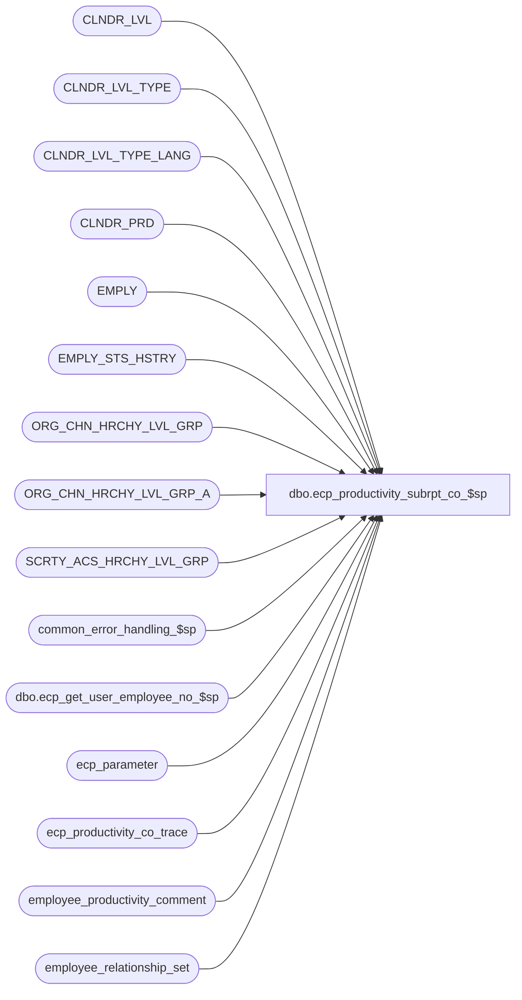

# dbo.ecp_productivity_subrpt_co_$sp

**Database:** auditworks  
**Server:** bedrockdb01  

## Architecture Diagram



## Table Dependencies

| Referenced Table |
|---|
| CLNDR_LVL |
| CLNDR_LVL_TYPE |
| CLNDR_LVL_TYPE_LANG |
| CLNDR_PRD |
| EMPLY |
| EMPLY_STS_HSTRY |
| ORG_CHN_HRCHY_LVL_GRP |
| ORG_CHN_HRCHY_LVL_GRP_A |
| SCRTY_ACS_HRCHY_LVL_GRP |
| common_error_handling_$sp |
| dbo.ecp_get_user_employee_no_$sp |
| ecp_parameter |
| ecp_productivity_co_trace |
| employee_productivity_comment |
| employee_relationship_set |

## Stored Procedure Code

```sql
CREATE proc [dbo].[ecp_productivity_subrpt_co_$sp] 
--DECLARE 
  @select_from_date datetime = null,  --for drill-downs, set = to the to date
                                      --all periods with at least 1 date falling between the range selected are included
  @select_to_date datetime = null,    -- if from/to not specified assumes today
  @select_calendar_level int = null,  --if not specified assumes lowest
  @select_employee_list nvarchar(4000) = null,
  @select_employee_from int = null,
  @select_employee_to int = null,
  @select_selling_area_list nvarchar(4000) = null,
  @select_selling_area_from int = null,
  @select_selling_area_to int = null,
  @select_primary_position_list nvarchar(4000) = null, 
 @language_id smallint = null,  --if not specified defaults to 1033 i.e. English
 @user_name nvarchar(30) = null,
   @select_home_store_list nvarchar(4000) = null,  -- if from/to/list not specified assumes all
   @select_home_store_from int = null,
   @select_home_store_to int = null,
   @terminated_employees tinyint = null, --if not specified assumes all, 
                                        --if set to 1 means only terminated employees, 
			                --if set to 0 means excludes terminated employees
  @employee_group_code_start nvarchar(20) = null,
  @employee_group_code_end nvarchar(20) = null,
   @relationship_type nvarchar(20) = null,
   @user_id numeric(10,0) = null,
  @private_comment_access tinyint = 0,
  @exclude_private_comment tinyint = 1,
  @exclude_deleted_comment tinyint = 1,
  @employee_no int = null  --set to employee number of user-id if user is restricted to viewing only his own data.
AS
/* 
Proc Name: ecp_productivity_subrpt_co_$sp 
exec ecp_productivity_subrpt_co_$sp '05/12/2007', '05/12/2007', null, 
                                    null, 
                                    null, null, null, 
                                    '33324', null, null,
                                    '265'
Desc:   Retrieves data for ECP Employee Productivity Report comment drill-downs

HISTORY:  
Date     Name           Def#    Desc
Mar23,15 Vicci      TFS-92911   Handle employees with selling area -1.
Apr01,13 Vicci         140907   Multi-language support
Oct30,08 Vicci         105986   When user access limited to their own data (i.e. employee_no passed in) or when user has not been
                                given access to any stores, then only return details pertinent to that employee.
Aug22,08 Vicci         103967   Handle effective date on employee relationship changes.
Aug11,08 Vicci         103077   Support home-store effective dates
Feb08,08 Vicci          97975   Set errno not just message_id when raising business rule error
Dec12,07 Vicci          95521   Replace double-quoted identifier usage with single quote
Nov26,07 Vicci          95521   Integrate properly with CRDM
Sep28,07 Vicci          85597   add trace
Sep11,07 Vicci          85597   Author
*/

SET NOCOUNT ON
DECLARE
  @trace_log			tinyint,
  @ecp_clndr_id			binary(16),
  @employee_count		int,
  @from_date 			datetime,
  @calendar_level_count		int,
  @lowest_calendar_level	int,
  @lowest_calendar_level_id	binary(16),
  @one_hundred			money,
  @errmsg                       nvarchar(255),
  @errno                        int,
  @function_name	        varbinary(128),
  @message_id                   int,
  @position			int,
  @position_count		int,
  @process_name                 nvarchar(100),
  @process_no                   int,
  @object_name       nvarchar(255),
  @operation_name               nvarchar(100),
  @select_calendar_level_id     binary(16),
  @selling_area_count		int,
  @stream_no                    tinyint,
  @to_date 			datetime,
  @sql_command 			nvarchar(4000),
 @store_restriction tinyint,
 @home_store_count             int,
  @relationship_type_len	int
 
SELECT @employee_count = 0, 
       @errno = 0,
       @function_name = convert(varbinary(128), 'ecp_productivity_subrpt_co_$sp'),
       @message_id = 201068,
@one_hundred = 100,
       @operation_name = 'Unknown',
       @position_count = 0,
       @process_name = 'ecp_productivity_subreport_co_$sp',
       @process_no = 36, --unknown
       @selling_area_count = 0,
       @stream_no = 1,
       @home_store_count = 0,
       @relationship_type_len = IsNull(datalength(@relationship_type), 0) + 5 --add 5 for t: and g: prefix and space          

IF @user_name IS NULL
  SELECT @user_name = suser_sname()
       
SET CONTEXT_INFO @function_name

IF @language_id IS NULL 
  SELECT @language_id = 1033
  
/*
if exists (select * from dbo.sysobjects where id = Object_id('dbo.ecp_productivity_co_trace') and type in ('U','S'))
begin
  drop table dbo.ecp_productivity_co_trace
end
create table ecp_productivity_co_trace(
  execution_datetime datetime default getdate() not null,
  select_from_date datetime null,
  select_to_date datetime null,
  select_calendar_level int null,
  select_employee_list nvarchar(4000) null,
  select_employee_from int null,
  select_employee_to int null,
 select_selling_area_list nvarchar(4000) null,
  select_selling_area_from int null,
  select_selling_area_to int null,
  select_primary_position_list nvarchar(4000) null, 
  language_id smallint null,
  user_name nvarchar(30) null,
  select_home_store_list nvarchar(4000) null,
  select_home_store_from int null,
  select_home_store_to int null,
  terminated_employees tinyint null, 
  employee_group_code_start nvarchar(20) null,
  employee_group_code_end nvarchar(20) null,
  relationship_type nvarchar(20) null,
  user_id numeric(10,0) null,
  private_comment_access tinyint null,
  exclude_private_comment tinyint null,
  exclude_deleted_comment tinyint null,
  employee_no int null
) 
*/
SELECT @trace_log = 0
IF @trace_log = 1
BEGIN
INSERT into ecp_productivity_co_trace(
       select_from_date,
       select_to_date,
       select_calendar_level,
       select_employee_list,
       select_employee_from,
       select_employee_to,
       select_selling_area_list,
       select_selling_area_from,
       select_selling_area_to,
       select_primary_position_list,
       language_id,
       user_name,
       select_home_store_list,
       select_home_store_from,
       select_home_store_to,
       terminated_employees,
       employee_group_code_start,
       employee_group_code_end,
       relationship_type,
       user_id,
       private_comment_access,
       exclude_private_comment,
       exclude_deleted_comment,
       employee_no)
VALUES (@select_from_date,
       @select_to_date,
       @select_calendar_level,
       @select_employee_list,
       @select_employee_from,
       @select_employee_to,
       @select_selling_area_list,
       @select_selling_area_from,
       @select_selling_area_to,
       @select_primary_position_list,
       @language_id,
       @user_name,
       @select_home_store_list,
       @select_home_store_from,
       @select_home_store_to,
       @terminated_employees,
       @employee_group_code_start,
       @employee_group_code_end,
       @relationship_type,
       @user_id,
       @private_comment_access,
       @exclude_private_comment,
       @exclude_deleted_comment,
       @employee_no)
END


CREATE TABLE #select_primary_position(primary_position nvarchar(4) not null)
SELECT @errno = @@error
IF @errno <> 0
BEGIN
  SELECT @errmsg = 'Failed to create temp table to hold list of selected positions',
         @object_name = '#select_primary_position',
         @operation_name = 'CREATE'
  GOTO error
END
CREATE TABLE #select_selling_area(selling_area_no int not null)
SELECT @errno = @@error
IF @errno <> 0
BEGIN
  SELECT @errmsg = 'Failed to create temp table to hold list of selected selling areas',
         @object_name = '#select_selling_area',
         @operation_name = 'CREATE'
  GOTO error
END
CREATE TABLE #select_employee(
       employee_no int not null)
SELECT @errno = @@error
IF @errno <> 0
BEGIN
  SELECT @errmsg = 'Failed to create temp table to hold list of selected employees',
         @object_name = '#select_employee',
         @operation_name = 'CREATE'
  GOTO error
END
CREATE TABLE #select_home_store(store_no int not null)
SELECT @errno = @@error
IF @errno <> 0
BEGIN
  SELECT @errmsg = 'Failed to create temp table to hold list of selected home-stores',
         @object_name = '#select_home_store',
      @operation_name = 'CREATE'
GOTO error
END
CREATE TABLE #store_restriction(ORG_CHN_NUM int not null)
SELECT @errno = @@error
IF @errno <> 0
BEGIN
  SELECT @errmsg = 'Failed to create temp table to hold list of stores to which user has access',  
         @object_name = '#store_restriction',
         @operation_name = 'CREATE'
  GOTO error
END

SELECT @ecp_clndr_id = par_bin_value
  FROM ecp_parameter p
 WHERE par_name = 'ecp_dflt_clndr_id'  
SELECT @errno = @@error
IF @errno <> 0
BEGIN
  SELECT @errmsg = 'Unable to which calendar to use',
         @object_name = 'ecp_parameter',
         @operation_name = 'SELECT'
  GOTO error
END

IF @select_to_date > getdate() OR @select_to_date IS NULL
  SELECT @select_to_date = getdate()

SELECT @lowest_calendar_level = clt2.CLNDR_LVL_TYPE_IDNTY,
       @lowest_calendar_level_id = clt2.CLNDR_LVL_TYPE_ID
  FROM CLNDR_LVL_TYPE clt2
       INNER JOIN CLNDR_LVL cl2
          ON clt2.CLNDR_LVL_TYPE_ID = cl2.CLNDR_LVL_TYPE_ID
         AND cl2.CLNDR_ID = @ecp_clndr_id
 WHERE clt2.CLNDR_LVL_SEQ = (SELECT MAX(clt.CLNDR_LVL_SEQ)
			      FROM CLNDR_LVL_TYPE clt
                             INNER JOIN CLNDR_LVL cl
                                ON clt.CLNDR_LVL_TYPE_ID = cl.CLNDR_LVL_TYPE_ID
                               AND cl.CLNDR_ID = @ecp_clndr_id)
SELECT @errno = @@error
IF @errno <> 0
BEGIN
  SELECT @errmsg = 'Unable to determine which calendar level is the lowest',
         @object_name = 'CLNDR_LVL_TYPE',
         @operation_name = 'SELECT'
  GOTO error
END

IF @select_calendar_level IS NULL
  SELECT @select_calendar_level = @lowest_calendar_level,
         @select_calendar_level_id = @lowest_calendar_level_id
ELSE
BEGIN
  SELECT @select_calendar_level_id = clt.CLNDR_LVL_TYPE_ID
    FROM CLNDR_LVL_TYPE clt
         INNER JOIN CLNDR_LVL cl
            ON clt.CLNDR_LVL_TYPE_ID = cl.CLNDR_LVL_TYPE_ID
           AND cl.CLNDR_ID = @ecp_clndr_id
   WHERE clt.CLNDR_LVL_TYPE_IDNTY = @select_calendar_level
  SELECT @errno = @@error
  IF @errno <> 0
  BEGIN
    SELECT @errmsg = 'Unable to determine ID of calendar level selected',
           @object_name = 'CLNDR_LVL_TYPE',
           @operation_name = 'SELECT'
    GOTO error
  END
END

IF @select_calendar_level_id IS NULL
BEGIN
  SELECT @message_id = 201684,
         @errno = 201684,
         @errmsg = 'Invalid calendar level list passed',
         @object_name = 'CLNDR_LVL',
         @operation_name = 'SELECT'
  GOTO cleanup
END


/* Verify that the From/To Date selected is a period-start / period-end date for the 
   lowest calendar level selected, and if not extend the date-range selected to 
   include a full period */
IF @select_from_date IS NULL OR @select_from_date > @select_to_date
BEGIN
    SELECT @select_from_date = @select_to_date
END
  
SELECT @to_date = dateadd(ss, -1, cp.END_DATE_TIME), @from_date = cp.STRT_DATE_TIME
  FROM CLNDR_PRD cp
 WHERE @select_to_date >= cp.STRT_DATE_TIME
   AND @select_to_date < cp.END_DATE_TIME
   AND cp.CLNDR_ID = @ecp_clndr_id
   AND cp.CLNDR_LVL_TYPE_ID = @lowest_calendar_level_id
SELECT @errno = @@error
IF @errno <> 0
BEGIN
  SELECT @errmsg = 'Failed to determing period start/end dates of latest date selected',
         @object_name = 'CLNDR_PRD',
         @operation_name = 'SELECT'
  GOTO error
END

IF @to_date > @select_to_date
  SELECT @select_to_date = @to_date
  
IF @from_date < @select_from_date
  SELECT @select_from_date = @from_date
ELSE
BEGIN
  SELECT @select_from_date = cp.STRT_DATE_TIME
   FROM CLNDR_PRD cp
   WHERE @select_from_date >= cp.STRT_DATE_TIME
     AND @select_from_date < cp.END_DATE_TIME
     AND cp.CLNDR_ID = @ecp_clndr_id
     AND cp.CLNDR_LVL_TYPE_ID = @lowest_calendar_level_id
  SELECT @errno = @@error
  IF @errno <> 0
  BEGIN
    SELECT @errmsg = 'Failed to determing period start date of earliest date selected',
           @object_name = 'CLNDR_PRD',
           @operation_name = 'SELECT'
    GOTO error
  END
END

IF @lowest_calendar_level <> @select_calendar_level
BEGIN
  SELECT @from_date = cp.STRT_DATE_TIME
    FROM CLNDR_PRD cp
   WHERE @select_from_date >= cp.STRT_DATE_TIME
     AND @select_from_date < cp.END_DATE_TIME
     AND cp.CLNDR_ID = @ecp_clndr_id
     AND cp.CLNDR_LVL_TYPE_ID = @select_calendar_level_id
 SELECT @errno = @@error
 IF @errno <> 0
  BEGIN
    SELECT @errmsg = 'Failed to determing period start date of calendar level selected including earliest date selected',
           @object_name = 'CLNDR_PRD',
           @operation_name = 'SELECT'
    GOTO error
  END
END

IF @from_date < @select_from_date
  SELECT @select_from_date = @from_date

IF @select_primary_position_list IS NOT NULL
BEGIN
  SELECT @position = CHARINDEX('''', @select_primary_position_list)
  WHILE @position > 0
  BEGIN
    SELECT @select_primary_position_list = stuff(@select_primary_position_list, charindex('''', @select_primary_position_list), 1, '')  
    SELECT @position = CHARINDEX('''', @select_primary_position_list)
  END

  SELECT @position = CHARINDEX(',', @select_primary_position_list)
  WHILE @position > 0
  BEGIN
    INSERT into #select_primary_position(primary_position)
    VALUES (ltrim(rtrim(substring(@select_primary_position_list, 1, @position - 1))))
    SELECT @select_primary_position_list = substring(@select_primary_position_list, @position + 1, 4000)
    SELECT @position = CHARINDEX(',', @select_primary_position_list)
  END
  INSERT into #select_primary_position(primary_position)
  VALUES (ltrim(rtrim(@select_primary_position_list)))

  SELECT @position_count = count(*)
    FROM #select_primary_position
  
  IF @position_count < 1
  BEGIN
    SELECT @message_id = 201684,
           @errno = 201684,
           @errmsg = 'Invalid primary position list passed',
           @object_name = '#select_primary_postion',
           @operation_name = 'INSERT'
    GOTO error
  END
END
ELSE
BEGIN
  INSERT #select_primary_position(primary_position)
  VALUES('-1')
  SELECT @position_count = 0
END

IF @select_selling_area_list IS NOT NULL
BEGIN
  SELECT @position = CHARINDEX(',', @select_selling_area_list)
  WHILE @position > 0
  BEGIN
    INSERT into #select_selling_area(selling_area_no)
    VALUES (convert(int, substring(@select_selling_area_list, 1, @position - 1)))
    SELECT @select_selling_area_list = substring(@select_selling_area_list, @position + 1, 4000)
    SELECT @position = CHARINDEX(',', @select_selling_area_list)
  END
  INSERT into #select_selling_area(selling_area_no)
  VALUES (convert(int, @select_selling_area_list))

  SELECT @selling_area_count = count(*)
    FROM #select_selling_area
  
  IF @selling_area_count < 1
  BEGIN
    SELECT @message_id = 201684,
           @errno = 201684,
           @errmsg = 'Invalid selling area list passed',
           @object_name = '#select_selling_area',
           @operation_name = 'INSERT'
    GOTO error
  END
END
ELSE
BEGIN
  INSERT #select_selling_area(selling_area_no)
  VALUES(-1)
  SELECT @selling_area_count = 0
END

IF @select_selling_area_from IS NULL
  SELECT @select_selling_area_from = -1

IF @select_selling_area_to IS NULL
  SELECT @select_selling_area_to = 2147483647

IF @select_employee_list IS NOT NULL
BEGIN
  SELECT @sql_command = '
  INSERT #select_employee(employee_no)
  SELECT e.EMPLY_NUM
    FROM EMPLY e
         LEFT OUTER JOIN EMPLY_STS_HSTRY eht
  ON e.EMPLY_NUM = eht.EMPLY_NUM
          AND (@select_to_date >= eht.EFCTV_DATE AND (@select_to_date < eht.EXPRTN_DATE OR eht.EXPRTN_DATE IS NULL))
         LEFT OUTER JOIN EMPLY_STS_HSTRY ehf
           ON e.EMPLY_NUM = ehf.EMPLY_NUM
          AND (@select_from_date >= ehf.EFCTV_DATE AND (@select_from_date < ehf.EXPRTN_DATE OR ehf.EXPRTN_DATE IS NULL))
   WHERE e.EMPLY_NUM IN (' + @select_employee_list + ')
     AND (@terminated_employees IS NULL OR
          (@terminated_employees = 1 AND eht.EMPLY_STS_CODE = ''TERM'' AND ehf.EMPLY_STS_CODE = ''TERM'') OR
          (@terminated_employees = 0 AND (IsNull(eht.EMPLY_STS_CODE, ''HIRE'') <> ''TERM'' OR IsNull(ehf.EMPLY_STS_CODE, ''HIRE'') <> ''TERM''))
         )
  SELECT @employee_count = @@rowcount'

  EXEC sp_executesql @sql_command, N'@terminated_employees tinyint, @select_to_date datetime, @select_from_date datetime, @employee_count int OUT',@terminated_employees, @select_to_date, @select_from_date, @employee_count OUT        
  
  IF @employee_count < 1
  BEGIN
    SELECT @message_id = 201684,
           @errno = 201684,
           @errmsg = 'Invalid employee list passed',
           @object_name = 'EMPLY',
           @operation_name = 'SELECT'
    GOTO cleanup
  END
END
ELSE
BEGIN
  IF @terminated_employees IS NOT NULL
  BEGIN
    INSERT #select_employee(employee_no)
    SELECT e.EMPLY_NUM
      FROM EMPLY e
           LEFT OUTER JOIN EMPLY_STS_HSTRY eht
             ON e.EMPLY_NUM = eht.EMPLY_NUM
            AND (@select_to_date >= eht.EFCTV_DATE AND (@select_to_date < eht.EXPRTN_DATE OR eht.EXPRTN_DATE IS NULL))
           LEFT OUTER JOIN EMPLY_STS_HSTRY ehf
             ON e.EMPLY_NUM = ehf.EMPLY_NUM
            AND (@select_from_date >= ehf.EFCTV_DATE AND (@select_from_date < ehf.EXPRTN_DATE OR ehf.EXPRTN_DATE IS NULL))
     WHERE ( (@terminated_employees = 1 AND ehf.EMPLY_STS_CODE = 'TERM' AND eht.EMPLY_STS_CODE = 'TERM') OR
             (@terminated_employees = 0 AND (IsNull(ehf.EMPLY_STS_CODE, 'HIRE') <> 'TERM' OR IsNull(eht.EMPLY_STS_CODE, 'HIRE') <> 'TERM') ))
    SELECT @employee_count = @@rowcount
  END
  ELSE
  BEGIN
    INSERT #select_employee(employee_no)
    VALUES (-1)
  END
END

IF @select_employee_from IS NULL
  SELECT @select_employee_from = 0

IF @select_employee_to IS NULL
  SELECT @select_employee_to = 2147483647

IF NOT EXISTS (SELECT 1 
                 FROM SCRTY_ACS_HRCHY_LVL_GRP s 
                WHERE s.ACS_ID_TYPE = 1 
                  AND s.ACS_ID = @user_id
   AND s.HRCHY_LVL_GRP_ID = -1)
   AND @user_id IS NOT NULL
   AND @employee_no IS NULL 
BEGIN
  SELECT @store_restriction = 1
  INSERT into #store_restriction(ORG_CHN_NUM)
  SELECT DISTINCT a.ORG_CHN_NUM 
    FROM SCRTY_ACS_HRCHY_LVL_GRP s, 
         ORG_CHN_HRCHY_LVL_GRP_A a, 
         ORG_CHN_HRCHY_LVL_GRP b 
   WHERE s.HRCHY_LVL_GRP_ID = b.HRCHY_LVL_GRP_IDNTY 
     AND b.HRCHY_LVL_GRP_ID = a.HRCHY_LVL_GRP_ID 
     AND s.ACS_ID_TYPE = 1 and s.ACS_ID = @user_id
  SELECT @errno = @@error
  IF @errno <> 0
  BEGIN
    SELECT @errmsg = 'Failed to list stores to which user has access',
           @object_name = '#store_restriction',
           @operation_name = 'INSERT'
    GOTO error
  END
END  
ELSE
BEGIN
  SELECT @store_restriction = 0
  INSERT into #store_restriction(ORG_CHN_NUM)
  VALUES (-1)
  SELECT @errno = @@error
  IF @errno <> 0
  BEGIN
    SELECT @errmsg = 'Failed to indicate that the user has access to all stores.',
           @object_name = '#store_restriction',
           @operation_name = 'INSERT'
    GOTO error
  END
END

IF @employee_no IS NULL AND @user_id IS NOT NULL AND @store_restriction = 1 AND NOT EXISTS (SELECT 1 FROM #store_restriction)
BEGIN
  SELECT @employee_no = dbo.ecp_get_user_employee_no_$sp(@user_name)
  SELECT @errno = @@error
  IF @errno <> 0
  BEGIN
    SELECT @errmsg = 'Failed to determine employee number corresponding to user name',
@object_name = 'ecp_get_user_employee_no_$sp',
           @operation_name = 'EXEC'
    GOTO error
  END
  IF @employee_no IS NULL 
  BEGIN
    SELECT @message_id = 201684,
           @errno = 201684,
           @errmsg = 'User ' + @user_name + ' has not been assigned access to any stores, and is not found in employee master.  Access denied.',
           @object_name = 'ecp_get_user_employee_no_$sp',
           @operation_name = 'EXEC'
    GOTO cleanup
  END
  ELSE
  BEGIN
    SELECT @store_restriction = 0
    INSERT into #store_restriction(ORG_CHN_NUM)
    VALUES (-1)
    SELECT @errno = @@error
    IF @errno <> 0
    BEGIN
      SELECT @errmsg = 'Failed to indicate that the user has access to all stores.',
             @object_name = '#store_restriction',
             @operation_name = 'INSERT'
     GOTO error
    END
  END 
END

IF @select_home_store_list IS NOT NULL 
BEGIN
  SELECT @sql_command = '
  INSERT #select_home_store(store_no)
  SELECT ORG_CHN_NUM
    FROM ORG_CHN
   WHERE ORG_CHN_NUM IN (' + @select_home_store_list + ')
  SELECT @home_store_count = @@rowcount'
  
  EXEC sp_executesql @sql_command, N'@home_store_count int OUT', @home_store_count OUT        
  
  IF @home_store_count < 1
  BEGIN
    SELECT @message_id = 201684,
           @errno = 201684,
           @errmsg = 'Invalid home store list passed',
           @object_name = 'ORG_CHN',
           @operation_name = 'SELECT'
  GOTO cleanup
  END
END
ELSE
BEGIN
  INSERT #select_home_store(store_no)
  VALUES(-1)
END
IF @select_home_store_from IS NULL
  SELECT @select_home_store_from = 0

IF @select_home_store_to IS NULL
  SELECT @select_home_store_to = 2147483647
    
SELECT IsNull((IsNull(em.LAST_NAME, '') + Substring(', ', 1, sign(datalength(em.LAST_NAME) * datalength(em.FRST_NAME)) * 2)  + IsNull(em.FRST_NAME, '')), '') + ' (' + convert(nvarchar, adj.employee_no) + ')' employee_name,
       COALESCE(clltl.CLNDR_LVL_DESC, cllt.CLNDR_LVL_DESC) + ' ' + substring(convert(nvarchar, adj.period_end_datetime, 120), 1, 10) comment_period,
       adj.entry_datetime,    
       adj.user_id,
       adj.comment,
       adj.private,
       adj.deletion_datetime,
       adj.ecp_comment_id
  FROM employee_productivity_comment adj
       INNER JOIN #select_employee e
          ON adj.employee_no = e.employee_no
          OR @employee_count = 0
       INNER JOIN EMPLY em
          ON adj.employee_no = em.EMPLY_NUM
       INNER JOIN #select_home_store hs
          ON adj.home_store_no = hs.store_no
          OR @home_store_count = 0
       INNER JOIN #select_selling_area sa
          ON adj.primary_selling_area_no = sa.selling_area_no
          OR @selling_area_count = 0
       INNER JOIN #select_primary_position p
          ON adj.primary_position = p.primary_position
          OR @position_count = 0
        LEFT OUTER JOIN employee_relationship_set ers
          ON adj.relationship_set_id = ers.relationship_set_id
         AND @relationship_type IS NOT NULL 
         AND ers.relationship_set_code like '%t:' + @relationship_type + '%'
        LEFT OUTER JOIN CLNDR_LVL_TYPE cllt
          ON @select_calendar_level = cllt.CLNDR_LVL_TYPE_IDNTY
        LEFT OUTER JOIN CLNDR_LVL_TYPE_LANG clltl
          ON cllt.CLNDR_LVL_TYPE_ID = clltl.CLNDR_LVL_TYPE_ID
         AND clltl.LANG_ID = @language_id
 WHERE adj.period_end_datetime > @select_from_date
   AND adj.period_end_datetime <= @select_to_date
   AND adj.employee_no >= @select_employee_from
   AND adj.employee_no <= @select_employee_to
   AND adj.home_store_no >= @select_home_store_from
   AND adj.home_store_no <= @select_home_store_to
   AND (@private_comment_access = 1 OR adj.private = 0 OR adj.user_id = @user_id)
   AND (@exclude_private_comment = 0 OR adj.private = 0)
   AND (adj.deletion_datetime IS NULL OR IsNull(@exclude_deleted_comment, 1) = 0)
   AND (@store_restriction = 0
        OR adj.home_store_no IN (SELECT ORG_CHN_NUM FROM #store_restriction))    
   AND ((adj.primary_selling_area_no >= @select_selling_area_from AND adj.primary_selling_area_no <= @select_selling_area_to)
        OR (@select_selling_area_from = 0 AND @select_selling_area_to = 2147483647))     
   AND (@relationship_type IS NULL OR 
        substring(ers.relationship_set_code, 
                 charindex('t:' + @relationship_type, ers.relationship_set_code) + @relationship_type_len, 
charindex(' p:',ers.relationship_set_code, charindex('t:' + @relationship_type, ers.relationship_set_code) + @relationship_type_len)
                 - (charindex('t:' + @relationship_type, ers.relationship_set_code) + @relationship_type_len)) = @employee_group_code_start
        )
   AND (@employee_no IS NULL OR @employee_no = adj.employee_no) 
SELECT @errno = @@error
IF @errno <> 0
BEGIN
  SELECT @errmsg = 'Failed to retrieve comments',
         @object_name = 'employee_productivity_comment',
         @operation_name = 'SELECT'
  GOTO error
END

cleanup:
IF  @message_id = 201684
BEGIN
SELECT @errmsg employee_name,
       convert(nvarchar(255), null) comment_period,
       convert(datetime, null) entry_datetime,   
       convert(int, null) user_id,
       convert(nvarchar(255), null) comment,
       convert(tinyint, null) private,
       convert(datetime, null) deletion_datetime,
       convert(numeric(12,0), null) ecp_comment_id
END

DROP TABLE #select_employee
DROP TABLE #select_home_store
DROP TABLE #select_selling_area
DROP TABLE #select_primary_position
DROP TABLE #store_restriction

SELECT @function_name = convert(varbinary(128), 'Unknown')
SET CONTEXT_INFO @function_name
RETURN

error:
  SELECT @function_name = convert(varbinary(128), 'Unknown')
  SET CONTEXT_INFO @function_name

  EXEC common_error_handling_$sp @process_no, @errno, @errmsg, 0, @message_id, @process_name, @object_name, @operation_name, 1, @stream_no

  RETURN
```

