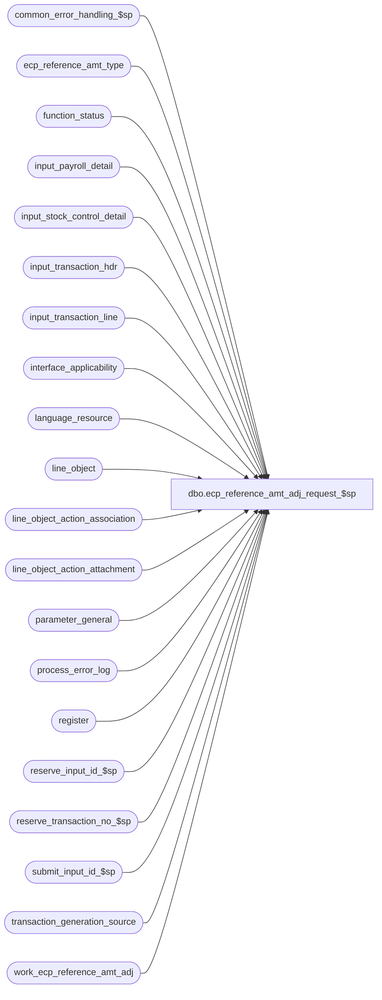

# dbo.ecp_reference_amt_adj_request_$sp

**Database:** auditworks  
**Server:** bedrockdb01  

## Architecture Diagram



## Table Dependencies

| Referenced Table |
|---|
| common_error_handling_$sp |
| ecp_reference_amt_type |
| function_status |
| input_payroll_detail |
| input_stock_control_detail |
| input_transaction_hdr |
| input_transaction_line |
| interface_applicability |
| language_resource |
| line_object |
| line_object_action_association |
| line_object_action_attachment |
| parameter_general |
| process_error_log |
| register |
| reserve_input_id_$sp |
| reserve_transaction_no_$sp |
| submit_input_id_$sp |
| transaction_generation_source |
| work_ecp_reference_amt_adj |

## Stored Procedure Code

```sql
create proc dbo.ecp_reference_amt_adj_request_$sp @ecp_reference_amt_batch_id binary(16)
AS 
--TODO:  audit-trail
/* 
Proc Name: ecp_reference_amt_adj_request_$sp 
Desc:   Called by UI to request reference amount adjustment for reference-types of maintenance-type 1=Contribution

        To simulate the ICT_EXPORT01 and ICT_EDIT01 processing that would follow, do:
		use auditworks_work -or whatever work database yours is using -opening the transl_transaction_hdr view should tell you
		  EXEC  edit_initialize_???_$sp  --where ??? is whatever prefix your db is using -opening the transl_transaction_hdr view should tell you
		use auditworks  --or whatever you database name is
		  EXEC edit_load_input_$sp 1
		  EXEC ecp_posting_$sp 44
        
HISTORY:  
Date     Name           Def#    Desc
Apr03,14 Vicci        151098    Log position to reference amount information attachment (63).
Feb26,14 Vicci        149581    Correct time-interval logged for Traffic Count attachment (64).
Feb13,14 Vicci        149581	Avoid 'Cannot insert duplicate key row in object dbo.language_resource with unique index language_resource_x1.' error.
Feb05,14 Vicci        149581    Correct process_no.
Apr20,12  Paul        134132    prevent error 2627 by setting dummy_transaction_category on insert
Feb28,12  Vicci       133336    Make compatible with SA5 by passing process_id, user_id to sub procs
Nov06,08 Vicci        104484	Generates a S/A transaction to process the reference amount adjustment request
*/

DECLARE @auto_create_missing_empl	tinyint,
        @cursor_open			tinyint,
	@errmsg				nvarchar(2000),
	@errno				int,
	@errno2				int,	
        @function_name	                varbinary(128),
	@import_row_count		int,
	@import_row_id			numeric(10,0),
	@input_id			numeric(12,0),
	@message_id			int,
	@max_import_row_id		numeric(10,0), 
	@min_import_row_id		numeric(10,0), 
        @max_lines_per_trans		smallint,
	@max_tran_no			int,
        @next_tran_no			int,
	@object_name			nvarchar(255),
	@operation_name			nvarchar(100),
	@process_name			nvarchar(100),
	@process_no 			smallint,
	@process_id  		        binary(16),
	@spid	  		        integer,
	@process_start_datetime		datetime,
	@release_41			tinyint,
	@rows				int,
	@row_no				int,
        @status			        smallint, 
        @store_no			int,
        @register_no			smallint,
        @cashier_no			int,
        @transaction_series		nchar(1),
        @transaction_category		tinyint,
        @trans_qty			int,
        @sql_command 			nvarchar(4000),
        @issue_entry_id			numeric(12,0),
        @resource_id			numeric(12,0)

SELECT @function_name = convert(varbinary(128), 'ecp_reference_amt_adj_request_$sp'),
       @max_lines_per_trans = 100,
       @message_id = 201068,
       @operation_name = 'Unknown',
       @process_id = NEWID(), 		
       @spid = @@spid, 		
       @process_name = 'ecp_reference_amt_adj_request_$sp',
       @process_no = 287,  
       @process_start_datetime = getdate(),
       @status = -1,
       @release_41 = 0

SELECT @min_import_row_id = min(entry_id)
  FROM work_ecp_reference_amt_adj
 WHERE ecp_reference_amt_batch_id = @ecp_reference_amt_batch_id
SELECT @errno = @@error
IF @errno != 0 
BEGIN
  SELECT @errmsg = 'Failed to determine the entry id of the first reference amount adjustment',
         @object_name = 'work_ecp_reference_amt_adj',
         @operation_name = 'SELECT'
  GOTO error
END  

IF @min_import_row_id IS NULL
  RETURN
  
SET CONTEXT_INFO @function_name   

IF EXISTS (SELECT 1
              FROM parameter_general
             WHERE release_no LIKE '4.1.%')
  SELECT @release_41 = 1

SELECT @issue_entry_id = min(entry_id)
  FROM work_ecp_reference_amt_adj i
       INNER JOIN ecp_reference_amt_type t
          ON i.reference_amount_type = t.reference_amount_type
WHERE i.ecp_reference_amt_batch_id = @ecp_reference_amt_batch_id
   AND ((t.employee_no_flag = 1 AND ISNULL(i.employee_no, -1) = -1)
   OR (t.store_no_flag = 1 AND ISNULL(i.store_no, -1) = -1)
   OR (t.selling_area_flag = 1 AND ISNULL(i.selling_area_no, -1) = -1)
   OR (t.position_flag = 1 AND ISNULL(i.position_code, '-1') = '-1'))
SELECT @errno = @@error
IF @errno != 0 
BEGIN
  SELECT @errmsg = 'Failed to determine if any reference amounts were imported at wrong level',
         @object_name = 'work_ecp_reference_amt_adj',
         @operation_name = 'SELECT'
  GOTO error
END  

IF @issue_entry_id > 0
BEGIN
  SELECT @errmsg = 'Certain reference amounts were imported at wrong level, for example for type ' + convert(nvarchar, reference_amount_type) + ' the entry for store ' + IsNull(convert(nvarchar, store_no), '') + ' area ' + IsNull(convert(nvarchar, selling_area_no), '') + ' position ' + IsNull(position_code, '') + ' employee ' + IsNull(convert(nvarchar, employee_no), ''), 
         @object_name = 'work_ecp_reference_amt_adj',
         @operation_name = 'SELECT'
    FROM work_ecp_reference_amt_adj i
   WHERE i.ecp_reference_amt_batch_id = @ecp_reference_amt_batch_id
     AND entry_id = @issue_entry_id
   
  GOTO error
END

SELECT @store_no = g.store_no,
       @register_no = r.register_no,
       @cashier_no = g.cashier_no,
       @transaction_series = g.transaction_series,
       @transaction_category = g.transaction_category
  FROM transaction_generation_source g
       LEFT OUTER JOIN register r         --S/A 5.0 still has this as view
         ON g.store_no = r.store_no
        AND g.register_no = r.register_no
 WHERE process_no = 51  --ECP imports
SELECT @errno = @@error
IF @errno != 0
BEGIN
  SELECT @errmsg = 'Failed to select from transaction_generation_source.',
         @object_name = 'transaction_generation_source',
         @operation_name = 'SELECT'
  GOTO error
END 

IF @register_no IS NULL
BEGIN
  SELECT @errmsg = 'Transaction generation source table has not been set up',
         @errno = 201678,
         @message_id = 201678
  GOTO error
END        

SELECT @trans_qty = CEILING(CONVERT(FLOAT,COUNT(*))/@max_lines_per_trans)
  FROM work_ecp_reference_amt_adj
 WHERE ecp_reference_amt_batch_id = @ecp_reference_amt_batch_id
SELECT @errno = @@error
IF @errno != 0
BEGIN
  SELECT @errmsg = 'Failed to determine number of transactions to generate',
         @object_name = 'work_ecp_reference_amt_adj',
         @operation_name = 'SELECT'
  GOTO error
END 

IF @trans_qty = 0
  GOTO reset_exit

IF @release_41 = 1
  EXEC reserve_input_id_$sp null, @input_id OUTPUT, @errmsg OUTPUT, @process_no
ELSE
  EXEC reserve_input_id_$sp @process_id, null, null, @input_id OUTPUT, @errmsg OUTPUT, @process_no

SELECT @errno = @@error
IF @errno != 0
BEGIN
  IF @errmsg IS NULL -- 
    SELECT @errmsg = 'Failed to execute stored proc reserve_input_id_$sp.'
  SELECT @object_name = 'reserve_input_id_$sp',
         @operation_name = 'EXECUTE'
  GOTO error
END

IF @release_41 = 1
BEGIN
  UPDATE function_status
     SET status = 1
   WHERE process_id = @spid
     AND function_no = @process_no
  SELECT @errno = @@error
  IF @errno <> 0
  BEGIN
    SELECT @errmsg = 'Unable to update function_status',
  	   @object_name = 'function_status',
	   @operation_name = 'UPDATE'
    GOTO error
  END
END
ELSE
BEGIN
  UPDATE function_status
     SET status = 1
   WHERE process_id = @process_id
     AND function_no = @process_no
  SELECT @errno = @@error
  IF @errno <> 0
  BEGIN
    SELECT @errmsg = 'Unable to update function_status',
  	   @object_name = 'function_status',
	   @operation_name = 'UPDATE'
    GOTO error
  END
END  

IF @release_41 = 1  
  EXEC reserve_transaction_no_$sp @process_no, @store_no,@register_no,@transaction_series,
     @trans_qty, @max_tran_no OUTPUT, @next_tran_no OUTPUT, @errmsg OUTPUT
ELSE
  EXEC reserve_transaction_no_$sp @process_id, null, @process_no, @store_no, @register_no, @transaction_series,
     @trans_qty, @max_tran_no OUTPUT, @next_tran_no OUTPUT, @errmsg OUTPUT

SELECT @errno = @@error
IF @errno != 0
BEGIN
  IF @errmsg IS NULL --
    SELECT @errmsg = 'Failed to execute stored procedure reserve_transaction_no_$sp'
  SELECT @object_name = 'reserve_transaction_no_$sp',
         @operation_name = 'EXECUTE'
  GOTO error
END

IF NOT EXISTS (SELECT line_object 
                 FROM line_object
                WHERE line_object_type = 14 and line_object = 9064)
BEGIN
  SELECT @resource_id = NULL
  SELECT @resource_id = resource_id
    FROM language_resource
   WHERE table_name = 'line_object'
     AND table_key = '9064'
  SELECT @errno = @@error
  IF @errno <> 0
  BEGIN
    SELECT @errmsg = 'Failed to determine if resource_id already exists. ',
  	   @object_name = 'language_resource',
	   @operation_name = 'SELECT'
    GOTO error
  END
     
  INSERT into line_object(line_object,
                        line_object_type,
                        line_object_description,
                        default_tax_rate_code,
                        resource_id)
  VALUES(9064,
         14,
         'Reference-amount import',
         0,
         @resource_id)
    SELECT @errno = @@error
    IF @errno != 0
      BEGIN
        SELECT @errmsg = 'Failed to insert reference-amount line_object',
               @object_name = 'line_object',
               @operation_name = 'INSERT'
        GOTO error
      END 
END
IF NOT EXISTS (SELECT line_object
                 FROM line_object_action_association
                WHERE transaction_category = @transaction_category
                  AND line_object = 9064
                  AND line_action = 38)  
BEGIN
  INSERT INTO line_object_action_association
         (transaction_category,
         line_object,
         line_action,
         line_object_type,
         db_cr_none,
         store_balance_group,
         reference_type,
         reference_no_option)
  VALUES (@transaction_category,
         9064,
         38,
         14,
         0,
         0,
         222,
         1)
  SELECT @errno = @@error
  IF @errno != 0
  BEGIN
    SELECT @errmsg = 'Failed to insert reference-amount line_object_action_association.',
           @object_name = 'line_object_action_association',
           @operation_name = 'INSERT'
    GOTO error
  END 
END
IF NOT EXISTS (SELECT line_object
                 FROM line_object_action_attachment
                WHERE (transaction_category = @transaction_category
                       OR transaction_category IS NULL)
                  AND attachment_type = 3
                  AND line_object = 9064
                  AND line_action = 38
                  AND note_type = 63)
BEGIN 
  INSERT INTO line_object_action_attachment
         (line_object,
         line_action,
         transaction_category,
         attachment_type,
         note_type,
         upc_lookup_division,
         dummy_transaction_category)
  VALUES (9064,
         38,
         @transaction_category,
         3, 
         63,
         0,
         COALESCE(CONVERT(nvarchar,@transaction_category),'null'))                
  SELECT @errno = @@error
  IF @errno != 0
  BEGIN
    SELECT @errmsg = 'Failed to insert reference amount info line_object_action_attachment.',
           @object_name = 'line_object_action_attachment',
           @operation_name = 'INSERT'
    GOTO error
  END                                
END        

IF NOT EXISTS (SELECT line_object
                 FROM line_object_action_attachment
                WHERE (transaction_category = @transaction_category
                       OR transaction_category IS NULL)
                  AND attachment_type = 6
                  AND line_object = 9064
                  AND line_action = 38)
BEGIN 
  INSERT INTO line_object_action_attachment
         (line_object,
         line_action,
         transaction_category,
         attachment_type, 
     note_type,
         attachment_mandatory,
         dummy_transaction_category)
  VALUES (9064,
         38,
         @transaction_category,
         6,
         0,
         0,
   COALESCE(CONVERT(nvarchar,@transaction_category),'null'))                
  SELECT @errno = @@error
  IF @errno != 0
  BEGIN
    SELECT @errmsg = 'Failed to insert payroll line_object_action_attachment.',
           @object_name = 'line_object_action_attachment',
           @operation_name = 'INSERT'
    GOTO error
  END                                
END          

IF NOT EXISTS (SELECT line_object
                 FROM interface_applicability
                WHERE transaction_category = @transaction_category
                  AND interface_id = 44
                  AND line_object = 9064
                  AND line_action = 38)
BEGIN 
  INSERT INTO interface_applicability
           (interface_id,
            line_object,
            line_action,
  transaction_category)
  VALUES (44,
   9064,
          38,
          @transaction_category)                
  SELECT @errno = @@error
  IF @errno != 0
  BEGIN
    SELECT @errmsg = 'Failed to insert interface_applicability for ECP ref-amt feed',
           @object_name = 'interface_applicability',
           @operation_name = 'INSERT'
    GOTO error
  END                 
END              
IF NOT EXISTS (SELECT line_object 
                 FROM line_object
                WHERE line_object_type = 14 and line_object = 9065)
BEGIN
  SELECT @resource_id = NULL
  SELECT @resource_id = resource_id
    FROM language_resource
   WHERE table_name = 'line_object'
     AND table_key = '9065'
  SELECT @errno = @@error
  IF @errno <> 0
  BEGIN
    SELECT @errmsg = 'Failed to determine if resource_id for Customer line object already exists. ',
  	   @object_name = 'language_resource',
	   @operation_name = 'SELECT'
    GOTO error
  END

  INSERT into line_object(line_object,
                        line_object_type,
                        line_object_description,
                        default_tax_rate_code,
                        resource_id)
  VALUES(9065,
         14,
         'Customer',
         0,
         @resource_id)
    SELECT @errno = @@error
    IF @errno != 0
      BEGIN
        SELECT @errmsg = 'Failed to insert customer traffic count line_object',
               @object_name = 'line_object',
               @operation_name = 'INSERT'
        GOTO error
      END 
END
IF NOT EXISTS (SELECT line_object
                 FROM line_object_action_association
                WHERE transaction_category = @transaction_category
                  AND line_object = 9065
                  AND line_action = 244)  
BEGIN
  INSERT INTO line_object_action_association
         (transaction_category,
         line_object,
         line_action,
         line_object_type,
         db_cr_none,
         store_balance_group,
         reference_type,
         reference_no_option)
  SELECT @transaction_category,
         9065,
         244,
         14,
         0,
         0,
         0,
         1
  SELECT @errno = @@error
  IF @errno != 0
  BEGIN
    SELECT @errmsg = 'Failed to insert reference-amount line_object_action_association.',
           @object_name = 'line_object_action_association',
           @operation_name = 'INSERT'
    GOTO error
  END 
END

IF NOT EXISTS (SELECT line_object
                 FROM line_object_action_attachment
                WHERE (transaction_category = @transaction_category
                       OR transaction_category IS NULL)
                  AND attachment_type = 3
                  AND line_object = 9065
                  AND line_action = 244
                  AND note_type = 64)
BEGIN 
  INSERT INTO line_object_action_attachment
         (line_object,
         line_action,
         transaction_category,
         attachment_type,
         note_type,
        dummy_transaction_category)
  VALUES (9065,
         244,
         @transaction_category,
         3, 
         64,
         COALESCE(CONVERT(nvarchar,@transaction_category),'null'))                
  SELECT @errno = @@error
  IF @errno != 0
  BEGIN
    SELECT @errmsg = 'Failed to insert traffic count info line_object_action_attachment.',
           @object_name = 'line_object_action_attachment',
           @operation_name = 'INSERT'
    GOTO error
  END                                
END          
IF NOT EXISTS (SELECT line_object
                 FROM interface_applicability
                WHERE transaction_category = @transaction_category
                  AND interface_id = 44
                  AND line_object = 9065
                  AND line_action = 244)
BEGIN 
  INSERT INTO interface_applicability
           (interface_id,
            line_object,
            line_action,
            transaction_category)
  VALUES (44,
          9065,
          244,
          @transaction_category)                
  SELECT @errno = @@error
  IF @errno != 0
  BEGIN
    SELECT @errmsg = 'Failed to insert interface_applicability for ECP traffic-count feed',
           @object_name = 'interface_applicability',
           @operation_name = 'INSERT'
    GOTO error
  END                                
END              

INSERT INTO input_transaction_line (
       input_id, 
       store_no, 
       register_no, 
       entry_date_time, 
       transaction_series, 
       transaction_no, 
       line_id, 
       line_object, 
       line_action, 
       gross_line_amount,
       reference_no)
SELECT @input_id, 
       @store_no, 
       @register_no, 
       @process_start_datetime, 
       @transaction_series, 
       (@next_tran_no + CONVERT(int, (i.entry_id-@min_import_row_id)/@max_lines_per_trans)), 
       entry_id-@min_import_row_id + 1  - CONVERT(int, (i.entry_id-@min_import_row_id)/@max_lines_per_trans) * @max_lines_per_trans, 
       CASE WHEN i.reference_amount_type = 1 THEN 9065 ELSE 9064 END line_object, 
       CASE WHEN i.reference_amount_type = 1 THEN 244 ELSE 38 END line_action, 
       CASE WHEN t.sensitivity_flag = 0 THEN i.adjustment_amount ELSE 0 END gross_line_amount,
       CASE WHEN t.sensitivity_flag > 0 THEN convert(nvarchar, i.adjustment_amount) ELSE NULL END reference_no
  FROM work_ecp_reference_amt_adj i
       INNER JOIN ecp_reference_amt_type t
          ON i.reference_amount_type = t.reference_amount_type
 WHERE i.ecp_reference_amt_batch_id = @ecp_reference_amt_batch_id
SELECT @errno = @@error
IF @errno != 0 
BEGIN
  SELECT @errmsg = 'Failed to insert into input_transaction_line',
         @object_name = 'input_transaction_line',
         @operation_name = 'INSERT'
  GOTO error
END  

INSERT into input_stock_control_detail(
       input_id,
       store_no,
       register_no,
       entry_date_time,  
       transaction_series,
       transaction_no,
       line_id,
       units,
       other_store_no,       
       pos_deptclass,
       count_date, 
       location_no,
       display_def_id,
       reason,
       imrd)
SELECT @input_id, 
       @store_no, 
       @register_no, 
       @process_start_datetime, 
       @transaction_series, 
       (@next_tran_no + CONVERT(int, (i.entry_id-@min_import_row_id)/@max_lines_per_trans)), 
       entry_id - @min_import_row_id+ 1  - CONVERT(int, (i.entry_id-@min_import_row_id)/@max_lines_per_trans) * @max_lines_per_trans, 
       CASE WHEN i.reference_amount_type = 1 THEN datediff(mi, i.effective_from_datetime, COALESCE(i.period_end_datetime, i.effective_from_datetime)) ELSE null END units, 
       CASE WHEN i.store_no = -1 THEN NULL ELSE i.store_no END other_store_no,
       CASE WHEN i.selling_area_no = -1 THEN NULL ELSE i.selling_area_no END pos_deptclass,
       CASE WHEN i.reference_amount_type = 1 THEN COALESCE(i.period_end_datetime, i.effective_from_datetime) ELSE i.effective_from_datetime END count_date,
       CASE WHEN i.reference_amount_type = 1 THEN NULL ELSE i.reference_amount_type END location_no, 
       CASE WHEN i.reference_amount_type = 1 THEN 64 ELSE 63 END display_def_id,
       CASE WHEN i.position_code = '-1' OR i.reference_amount_type = 1 THEN NULL ELSE i.position_code END,
       CONVERT(nvarchar,@ecp_reference_amt_batch_id)
  FROM work_ecp_reference_amt_adj i
       INNER JOIN ecp_reference_amt_type t
          ON i.reference_amount_type = t.reference_amount_type
 WHERE i.ecp_reference_amt_batch_id = @ecp_reference_amt_batch_id
SELECT @errno = @@error
IF @errno != 0 
BEGIN
  SELECT @errmsg = 'Failed to insert into input_stock_control_detail',
         @object_name = 'input_stock_control_detail',
         @operation_name = 'INSERT'
 GOTO error
END  

INSERT into input_payroll_detail(
       input_id,
       store_no,
       register_no,
       entry_date_time,
       transaction_series,
       transaction_no,
       line_id,
       employee_no,
       payroll_entry_type,
       employee_type)
SELECT @input_id, 
       @store_no, 
       @register_no, 
       @process_start_datetime, 
       @transaction_series, 
       (@next_tran_no + CONVERT(int, (i.entry_id-@min_import_row_id)/@max_lines_per_trans)), 
       i.entry_id-@min_import_row_id+ 1  - CONVERT(int, (i.entry_id-@min_import_row_id)/@max_lines_per_trans) * @max_lines_per_trans, 
       i.employee_no,
       -1,
       CASE WHEN i.position_code = '-1' THEN NULL ELSE i.position_code END  --needed even if null, otherwise it logs 0
  FROM work_ecp_reference_amt_adj i
       INNER JOIN ecp_reference_amt_type t
      ON i.reference_amount_type = t.reference_amount_type
 WHERE i.employee_no IS NOT NULL
   AND i.ecp_reference_amt_batch_id = @ecp_reference_amt_batch_id
SELECT @errno = @@error
IF @errno != 0 
BEGIN
  SELECT @errmsg = 'Failed to insert into input_payroll_detail',
         @object_name = 'input_payroll_detail',
         @operation_name = 'INSERT'
  GOTO error
END  

INSERT INTO input_transaction_hdr (
  	input_id, 
  	store_no, 
  	register_no, 
  	entry_date_time, 
  	transaction_series, 
  	transaction_no, 
  	cashier_no, 
  	transaction_category  )
SELECT
  	@input_id, 
  	@store_no, 
  	@register_no, 
  	@process_start_datetime, 
  	@transaction_series, 
  	transaction_no, 
  	@cashier_no, 
  	@transaction_category
  FROM input_transaction_line
 WHERE input_id = @input_id 
   AND line_id = 1
SELECT @errno = @@error
IF @errno != 0 
BEGIN
  SELECT @errmsg = 'Failed to insert into input_transaction_hdr',
         @object_name = 'input_transaction_hdr',
         @operation_name = 'INSERT'
  GOTO error
END  

IF @release_41 = 1
BEGIN
  EXEC submit_input_id_$sp @input_id, @process_start_datetime OUTPUT, @errmsg OUTPUT
  SELECT @errno = @@error
  IF @errno <> 0
  BEGIN
    SELECT @errmsg = 'Unable to execute submit_input_is_$sp for S/A 4.1',
	   @object_name = 'submit_input_is_$sp',
	   @operation_name = 'EXEC'
    GOTO error
  END
END
ELSE
BEGIN
  EXEC submit_input_id_$sp @process_id, null, @input_id, @process_start_datetime OUTPUT, @errmsg OUTPUT
  SELECT @errno = @@error
  IF @errno <> 0
  BEGIN
    SELECT @errmsg = 'Unable to execute submit_input_is_$sp',
	   @object_name = 'submit_input_is_$sp',
	   @operation_name = 'EXEC'
    GOTO error
  END
END

UPDATE process_error_log
   SET verified = 1 
 WHERE error_timestamp >= dateadd(dd, -30, getdate())
   AND process_no in (7, 51, 287) --ecp import or adj request
   AND verified = 0
   AND (object_name = 'work_ecp_reference_amt_adj' OR process_name = 'work_ecp_reference_amt_adj_$sp')

reset_exit:
SELECT @function_name = convert(varbinary(128), 'Unknown')
SET CONTEXT_INFO @function_name
RETURN

error:   		-- common error handler 
        SELECT @function_name = convert(varbinary(128), 'Unknown')
        SET CONTEXT_INFO @function_name 

	IF @release_41 = 1	
	  EXEC common_error_handling_$sp @process_no, @errno, @errmsg, 0, @message_id, 
	       @process_name, @object_name, @operation_name, 1
	ELSE	
	   EXEC common_error_handling_$sp @process_no, @errno, @errmsg, 0, @message_id, 
	        @process_name, @object_name, @operation_name, 1, 1, 0, null, 0, null, null, 
	        null, null, null, null, 0, @process_id, NULL


	RETURN
```

