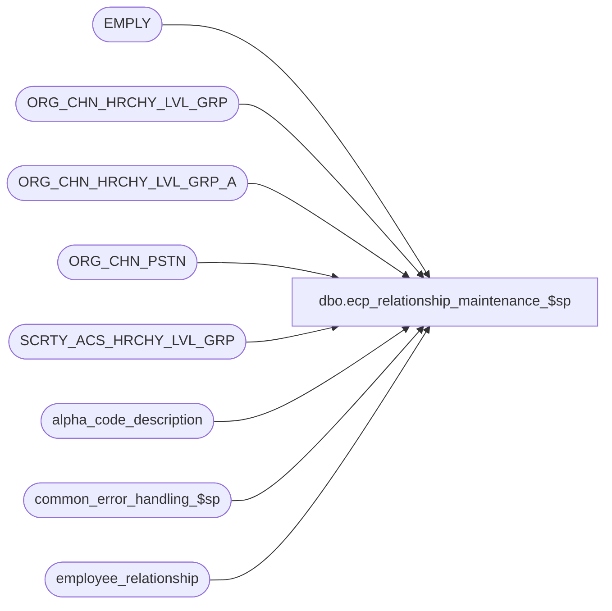

# dbo.ecp_relationship_maintenance_$sp

**Database:** auditworks  
**Server:** bedrockdb01  

## Architecture Diagram



## Table Dependencies

| Referenced Table |
|---|
| EMPLY |
| ORG_CHN_HRCHY_LVL_GRP |
| ORG_CHN_HRCHY_LVL_GRP_A |
| ORG_CHN_PSTN |
| SCRTY_ACS_HRCHY_LVL_GRP |
| alpha_code_description |
| common_error_handling_$sp |
| employee_relationship |

## Stored Procedure Code

```sql
create proc [dbo].[ecp_relationship_maintenance_$sp]  @action nchar(1) = 'V', --V=view, I=insert, D=delete, U=update
 @relationship_type nvarchar(20) = null,
 @user_id numeric(10,0) = null, 
 @language_id smallint = null,  --if not specified defaults to 1033 i.e. English

 @employee_no int = null,		--only provided if action in I, D, U
 @effective_from_date datetime = null,  --only provided if action in I, D, U
 @effective_to_date datetime = null,    --only provided if action in I, D, U
 @employee_group_code nvarchar(20) = null,  --only provided if action in I, D, U
 @relationship_position nvarchar(4) = null  --only provided if action in I, D, U
AS 

/* 
Proc Name: ecp_relationship_maintenance_$sp 
Desc:   Called by Productivity report query form to obtain a listing of the employees who work in one of the 
        of the stores to which the user has access and who participate in the relationship.
        
HISTORY:  
Date     Name           Def#    Desc
Apr14,11 Paul          126153   Use unicode datatypes
Oct05,07 Vicci          85597   Author
*/

SET NOCOUNT ON
DECLARE
  @store_restriction tinyint,
  @status nvarchar(255),
  @status_code tinyint,
  @status_ok nvarchar(255),
  @status_code_ok tinyint,
  @employee_name nvarchar(255),
  @home_store_no int,
  @employee_exists tinyint,
  @relationship_position_desc nvarchar(255),
  @errmsg                       nvarchar(255),
  @errno                        int,
  @message_id                   int,
  @object_name                  nvarchar(255),
  @operation_name               nvarchar(100),
  @process_name                 nvarchar(100),
  @process_no                   int,
  @rows				int,
  @stream_no                    tinyint,
  @relationship_type_desc	nvarchar(255)
  

SELECT @message_id = 201068,
       @operation_name = 'Unknown',
       @process_name = 'ecp_relationship_retrieval_$sp',
       @process_no = 285,
       @stream_no = 1,
       @store_restriction = 0,
       @status_code = 0,
       @status = 'OK',
       @status_code_ok = 0,
       @status_ok = 'OK',
       @employee_exists = 0

CREATE TABLE #store_restriction(ORG_CHN_NUM int not null)

SELECT @relationship_type_desc = code_display_descr1
  FROM alpha_code_description
 WHERE code_type = 16
   AND code_status= 'U'
   AND code = @relationship_type
SELECT @errno = @@error
IF @errno <> 0
BEGIN
  SELECT @errmsg = 'Failed to determine relationship type description',
         @object_name = 'alpha_code_description',
         @operation_name = 'SELECT'
  GOTO error
END
   
IF @language_id IS NULL 
  SELECT @language_id = 1033

IF @effective_to_date IS NOT NULL 
  SELECT @effective_to_date = dateadd(ss, -1, dateadd(dd, 1, convert(datetime, convert(nvarchar, @effective_to_date, 101))))

IF @effective_from_date IS NOT NULL 
  SELECT @effective_from_date = convert(datetime, convert(nvarchar, @effective_from_date, 101))

IF NOT EXISTS (SELECT 1            
                 FROM SCRTY_ACS_HRCHY_LVL_GRP s 
                WHERE s.ACS_ID_TYPE = 1  
                  AND s.ACS_ID = @user_id  
                  AND s.HRCHY_LVL_GRP_ID = -1)  
   AND @user_id IS NOT NULL  
BEGIN
  SELECT @store_restriction = 1
  INSERT into #store_restriction(ORG_CHN_NUM)
  SELECT DISTINCT a.ORG_CHN_NUM 
    FROM SCRTY_ACS_HRCHY_LVL_GRP s, 
         ORG_CHN_HRCHY_LVL_GRP_A a, 
         ORG_CHN_HRCHY_LVL_GRP b 
   WHERE s.HRCHY_LVL_GRP_ID = b.HRCHY_LVL_GRP_IDNTY 
     AND b.HRCHY_LVL_GRP_ID = a.HRCHY_LVL_GRP_ID 
     AND s.ACS_ID_TYPE = 1 and s.ACS_ID = @user_id
  SELECT @errno = @@error
  IF @errno <> 0
  BEGIN
    SELECT @errmsg = 'Failed to list stores to which user has access',
           @object_name = '#store_restriction',
           @operation_name = 'INSERT'
    GOTO error
  END
END  
ELSE
BEGIN
  SELECT @store_restriction = 0
  INSERT into #store_restriction(ORG_CHN_NUM)
  VALUES (-1)
  SELECT @errno = @@error
  IF @errno <> 0
  BEGIN
    SELECT @errmsg = 'Failed to indicate that the user has access to all stores.',
           @object_name = '#store_restriction',
           @operation_name = 'INSERT'
   GOTO error
  END
END


IF @action <> 'V'
BEGIN
  SELECT @employee_name = IsNull((IsNull(em.LAST_NAME, '') + Substring(', ', 1, sign(datalength(em.LAST_NAME) * datalength(em.FRST_NAME)) * 2)  + IsNull(em.FRST_NAME, '')), ''),
         @home_store_no = PRMY_ORG_CHN_NUM,
         @employee_exists = 1
    FROM EMPLY em
   WHERE EMPLY_NUM = @employee_no
  SELECT @errno = @@error
  IF @errno <> 0
  BEGIN
    SELECT @errmsg = 'Failed to retrieve employee information',
           @object_name = 'EMPLY',
           @operation_name = 'SELECT'
    GOTO error
  END

  IF @relationship_position IS NOT NULL
  BEGIN
    SELECT @relationship_position_desc = PSTN_DESC 
      FROM ORG_CHN_PSTN ocp
     WHERE @relationship_position = ocp.PSTN_CODE
    SELECT @errno = @@error
    IF @errno <> 0
    BEGIN
      SELECT @errmsg = 'Failed to retrieve position description',
             @object_name = 'ORG_CHN_PSTN',
             @operation_name = 'SELECT'
      GOTO error
    END

  END
  
  IF @store_restriction = 1 AND @employee_exists = 1 AND NOT EXISTS (SELECT 1
                                                                       FROM #store_restriction s
                                                                      WHERE ORG_CHN_NUM = @home_store_no)
  BEGIN
    SELECT @status_code = 2, @status = 'This employee''s home store is not one to which you have access'
    SELECT @relationship_type_desc relationship_type_desc,
           @employee_group_code employee_group_code,
           @employee_no employee_no,
           @employee_name employee_name,
           @effective_from_date effective_from_date,
           @effective_to_date effective_to_date,
           @status_code status_code,
           @status status,
           @relationship_position relationship_position,
           @relationship_position_desc relationship_position_desc             
  END  --IF no access to employee's home store

  IF @status_code = 0 
  BEGIN
    IF @action = 'I'   
    BEGIN
      IF IsNull(@employee_exists, 0) = 0
      BEGIN
        SELECT @status_code = 1, @status = 'This employee number is invalid'
        SELECT @relationship_type_desc relationship_type_desc,
               @employee_group_code employee_group_code,
               @employee_no employee_no,
               @employee_name employee_name,
               @effective_from_date effective_from_date,
               @effective_to_date effective_to_date,
               @status_code status_code,
               @status status,
               @relationship_position relationship_position,
               @relationship_position_desc relationship_position_desc             
      END  --IF employee invalid
    END  --IF action = 'I'
    
    IF @action in ('I', 'U') AND @status_code = 0 
    BEGIN
      IF @relationship_position IS NOT NULL AND @relationship_position_desc IS NULL
      BEGIN
        SELECT @status_code = 4, @status = 'This position is not valid'
        SELECT @relationship_type_desc relationship_type_desc,
               @employee_group_code employee_group_code,
               @employee_no employee_no,
               @employee_name employee_name,
               @effective_from_date effective_from_date,
               @effective_to_date effective_to_date,
               @status_code status_code,
               @status status,
               @relationship_position relationship_position,
               @relationship_position_desc relationship_position_desc             
      END  --IF position invalid
      ELSE
      BEGIN
        IF EXISTS (SELECT 1
                     FROM employee_relationship
                    WHERE relationship_type = @relationship_type
                      AND employee_no = @employee_no
                      AND (   (effective_from_date <= @effective_from_date AND (effective_to_date >= @effective_from_date OR effective_to_date IS NULL))
                           OR ((effective_from_date <= @effective_to_date OR @effective_to_date IS NULL) AND (effective_to_date >= @effective_to_date OR effective_to_date IS NULL))
                           OR (effective_from_date > @effective_from_date AND effective_to_date < @effective_to_date)
                          )
                      AND (effective_from_date <> @effective_from_date OR @action <> 'U'))
        BEGIN
          SELECT @status_code = 3, @status = 'This employee has already been assigned to this relationship in a period overlapping the one specified'
          SELECT @relationship_type_desc relationship_type_desc,
                 @employee_group_code employee_group_code,
                 @employee_no employee_no,
                 @employee_name employee_name,
                 @effective_from_date effective_from_date,
                 @effective_to_date effective_to_date,
                 @status_code status_code,
                 @status status,
                 @relationship_position relationship_position,
                 @relationship_position_desc relationship_position_desc             
          UNION
          SELECT @relationship_type_desc,
                 employee_group_code,
                 @employee_no,
                 @employee_name employee_name,
                 effective_from_date,
                 effective_to_date,
                 @status_code_ok status_code,
                 @status_ok status, 
                 relationship_position,
                 ocp.PSTN_DESC relationship_position_desc
            FROM employee_relationship r
                 LEFT OUTER JOIN ORG_CHN_PSTN ocp
                   ON r.relationship_position = ocp.PSTN_CODE
           WHERE relationship_type = @relationship_type
             AND employee_no = @employee_no
             AND (   (effective_from_date <= @effective_from_date AND (effective_to_date >= @effective_from_date OR effective_to_date IS NULL))
                  OR ((effective_from_date <= @effective_to_date OR @effective_to_date IS NULL) AND (effective_to_date >= @effective_to_date OR effective_to_date IS NULL))
                  OR (effective_from_date > @effective_from_date AND effective_to_date < @effective_to_date)
                 )
             AND (effective_from_date <> @effective_from_date OR @action <> 'U')
          SELECT @errno = @@error
          IF @errno <> 0
          BEGIN
            SELECT @errmsg = 'Failed to retrieve overlapping relationship information',
                   @object_name = 'employee_relationship',
                   @operation_name = 'SELECT'
            GOTO error
          END
        END  --IF overlapping range
        ELSE
        BEGIN
          IF @employee_group_code IS NULL
          BEGIN
            SELECT @status_code = 6, @status = 'The group to which the employee is being assigned must be specified'
            SELECT @relationship_type_desc relationship_type_desc,
                   @employee_group_code employee_group_code,
                   @employee_no employee_no,
                   @employee_name employee_name,
                   @relationship_position relationship_position,
                   @effective_to_date effective_to_date,
                   @status_code status_code,
                   @status status,
                   @relationship_position_desc relationship_position_desc,
                   @effective_from_date effective_from_date        
          END
        END
      END  --ELSE of IF position invalid
      
      IF @status_code = 0 AND @action = 'I'
      BEGIN
        INSERT into employee_relationship(
               relationship_type,
               employee_group_code,
               employee_no,
               relationship_position,
               effective_from_date,
               effective_to_date)
        VALUES (@relationship_type,
               @employee_group_code,
               @employee_no,
               @relationship_position,
               @effective_from_date,
               @effective_to_date)
        SELECT @errno = @@error
        IF @errno <> 0
        BEGIN
          SELECT @errmsg = 'Failed to log employee relationship information',
                 @object_name = 'employee_relationship',
                 @operation_name = 'INSERT'
          GOTO error
        END
      END --IF @status_code = 0 AND @action = 'I'
    END --IF @action in ('I', 'U') AND @status_code = 0 
    
    IF @action in ('D', 'U') AND @status_code = 0 
    BEGIN
      IF NOT EXISTS (SELECT 1 
                       FROM employee_relationship
                      WHERE relationship_type = @relationship_type
                        AND employee_no = @employee_no
                        AND effective_from_date = @effective_from_date)
      BEGIN
        SELECT @status_code = 5, @status = 'This relationship assignment cannot be found'
        SELECT @relationship_type_desc relationship_type_desc,
               @employee_group_code employee_group_code,
               @employee_no employee_no,
               @employee_name employee_name,
               @effective_from_date effective_from_date,
               @effective_to_date effective_to_date,
               @status_code status_code,
               @status status,
               @relationship_position relationship_position,
               @relationship_position_desc relationship_position_desc
      END  --IF entry to be deleted/modified can't be found
      ELSE
      BEGIN
        IF @action = 'D'
        BEGIN
          DELETE employee_relationship
           WHERE relationship_type = @relationship_type
             AND employee_no = @employee_no
             AND effective_from_date = @effective_from_date
          SELECT @errno = @@error
          IF @errno <> 0
          BEGIN
            SELECT @errmsg = 'Failed to delete employee relationship information',
                   @object_name = 'employee_relationship',
                   @operation_name = 'DELETE'
            GOTO error
          END
        END
        ELSE
        BEGIN
          UPDATE employee_relationship
             SET effective_to_date = @effective_to_date,
                 relationship_position = @relationship_position,
                 employee_group_code = @employee_group_code
           WHERE relationship_type = @relationship_type
             AND employee_no = @employee_no
             AND effective_from_date = @effective_from_date
          SELECT @errno = @@error
          IF @errno <> 0
          BEGIN
            SELECT @errmsg = 'Failed to update employee relationship information',
                   @object_name = 'employee_relationship',
                   @operation_name = 'UPDATE'
            GOTO error
          END
        END --ELSE of IF @action = 'D'
      END --ELSE of IF entry to be deleted/modified can't be found
    END  --IF @action in ('D', 'U') AND @status_code = 0
  END --IF @status_code = 0
END --IF @action <> 'V'

IF @status_code = 0
BEGIN
  SELECT @relationship_type_desc,
         employee_group_code,
         employee_no,
         IsNull((IsNull(em.LAST_NAME, '') + Substring(', ', 1, sign(datalength(em.LAST_NAME) * datalength(em.FRST_NAME)) * 2)  + IsNull(em.FRST_NAME, '')), '') employee_name,
         effective_from_date,
         effective_to_date,
         @status_code status_code,
         @status status, 
         relationship_position,
         ocp.PSTN_DESC relationship_position_desc
    FROM employee_relationship r
         INNER JOIN EMPLY em
            ON r.employee_no = em.EMPLY_NUM
         LEFT OUTER JOIN ORG_CHN_PSTN ocp
            ON r.relationship_position = ocp.PSTN_CODE
         INNER JOIN #store_restriction s
            ON (em.PRMY_ORG_CHN_NUM = s.ORG_CHN_NUM
                OR @store_restriction = 0)
   WHERE relationship_type = @relationship_type
   ORDER BY IsNull((IsNull(em.LAST_NAME, '') + Substring(', ', 1, sign(datalength(em.LAST_NAME) * datalength(em.FRST_NAME)) * 2)  + IsNull(em.FRST_NAME, '')), ''),
         effective_from_date
  SELECT @errno = @@error
  IF @errno <> 0
  BEGIN
    SELECT @errmsg = 'Unable to retrieve relationships',
           @object_name = 'employee_relationship',
           @operation_name = 'SELECT'
    GOTO error
  END
END --IF @status_code = 0

DROP TABLE #store_restriction

RETURN

error:
  DROP TABLE #store_restriction
  
  EXEC common_error_handling_$sp @process_no, @errno, @errmsg, 0, @message_id, @process_name, @object_name, @operation_name, 1, @stream_no
  RETURN
```

