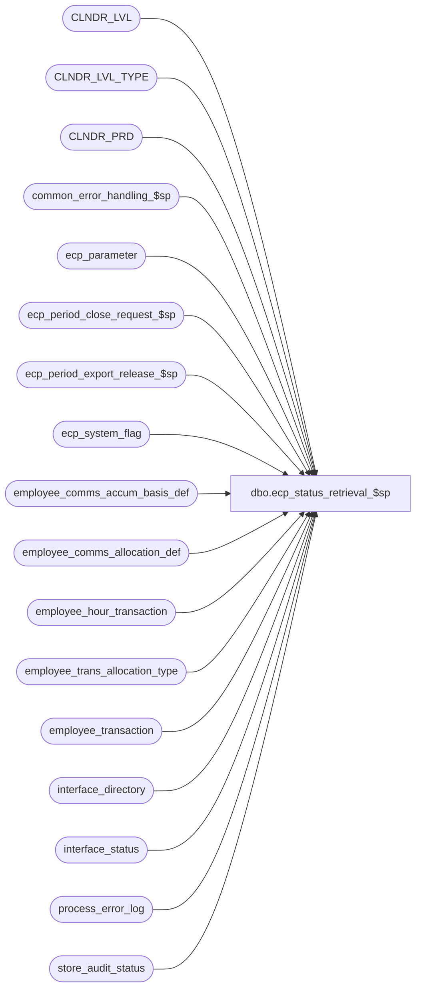

# dbo.ecp_status_retrieval_$sp

**Database:** auditworks  
**Server:** bedrockdb01  

## Architecture Diagram



## Table Dependencies

| Referenced Table |
|---|
| CLNDR_LVL |
| CLNDR_LVL_TYPE |
| CLNDR_PRD |
| common_error_handling_$sp |
| ecp_parameter |
| ecp_period_close_request_$sp |
| ecp_period_export_release_$sp |
| ecp_system_flag |
| employee_comms_accum_basis_def |
| employee_comms_allocation_def |
| employee_hour_transaction |
| employee_trans_allocation_type |
| employee_transaction |
| interface_directory |
| interface_status |
| process_error_log |
| store_audit_status |

## Stored Procedure Code

```sql
create proc [dbo].[ecp_status_retrieval_$sp] AS 
/* 
Proc Name: ecp_status_retrieval_$sp 
Desc:   Called by UI to determine current status of ECP (for example to support allocation
        release decision).

HISTORY:  
Date     Name           Def#    Desc
Apr14,11 Paul          126153   Use unicode datatypes
Nov17,09 Vicci        HRB1117   Since process_error_log.memo2 is nvarchar put quotes around comparison string.
Nov03,08 Vicci         106094   Return period reopen request outstanding indicator.
Feb01,08 Vicci          97607   Return number of unverified ECP process errors and date of their last occurrence.
Jan30,08 Vicci          97400   If there are no active allocations of a particular type don't bump the next release date;
                                use live-date consistently instead of sometimes 01/01/1970.  Take active flag into
                                account when determining if allocations of a particular type exist.
Jan25,08 Vicci          97400   Return outstanding amount and hour allocation flags instead of repeating even flag
Aug31,07 Vicci          85597   Take live-date into account
Jun18,07 Vicci          85597   convert transaction date to datetime in order to avoid rounding of 23:59:59
Jun15,07 Vicci          85597   Add 23:59:59 to last date receiveds
Jun12,07 Vicci          85597   Return allocation outstanding flags
May11,07 Vicci		85597	Get last received dates from transactions not hour summary 
                                since summary has pay-period ENDING date but not necessarily 
                                whole period.
Apr02,07 Vicci		85597	Author
*/

SET NOCOUNT ON
DECLARE
  @ecp_clndr_id			binary(16),
  @lowest_calendar_level	int,
  @lowest_calendar_level_id	binary(16),
  @errmsg                       nvarchar(255),
  @errno                        int,
  @message_id                   int,
  @object_name                  nvarchar(255),
  @operation_name               nvarchar(100),
  @process_name                 nvarchar(100),
  @process_no                   int,
  @rows				int,
  @stream_no                    tinyint,
  @closed_pay_period_datetime	datetime,
  @last_ecp_posting_datetime 	datetime,
  @last_export_release_datetime	datetime,
  @from_reallocation_date 	datetime,
  @to_reallocation_date 	datetime,
  @from_recalculation_date	datetime,
  @to_recalculation_date 	datetime,
  @current_pay_period_datetime 	datetime,
  @incomplete_store_date_count  int,
  @hours_based_allocations_exist tinyint,
  @last_hour_release_datetime	datetime,
  @last_hour_posting_datetime	datetime,
  @last_hour_received_datetime	datetime,
  @next_hours_release_datetime	datetime,
  @amt_based_allocations_exist 	tinyint,
  @last_amt_release_datetime	datetime,
  @last_amt_posting_datetime	datetime,
  @last_amt_received_datetime	datetime,
  @next_amt_release_datetime	datetime,
  @even_allocations_exist 	tinyint,
  @last_even_release_datetime	datetime,
  @last_even_posting_datetime	datetime,
  @next_even_release_datetime	datetime,
   @next_pay_period_end_datetime datetime,
   @next_export_release_datetime datetime,
   @outstanding_close_flag tinyint,
   @outstanding_export_flag tinyint,
   @outstanding_hour_alloc_flag tinyint,
   @outstanding_amt_alloc_flag tinyint,
   @outstanding_even_alloc_flag tinyint,
  @live_date datetime,
  @last_error_timestamp datetime,
  @error_count int,
  @period_reopen_outstanding tinyint 


SELECT @message_id = 201068,
       @operation_name = 'Unknown',
       @process_name = 'ecp_status_retrieval_$sp',
       @process_no = 282,
       @stream_no = 1

SELECT @closed_pay_period_datetime = c.flag_datetime_value  --note, stored with time of 23:59:59
  FROM ecp_system_flag c
 WHERE flag_name = 'ecp_payperiod_close_datetime'  
SELECT @errno = @@error, @rows = @@rowcount
IF @errno <> 0
BEGIN
  SELECT @errmsg = 'Unable to determine last pay-period closed',
         @object_name = 'ecp_system_flag',
         @operation_name = 'SELECT'
  GOTO error
END
IF @rows < 1
BEGIN
  INSERT INTO ecp_system_flag(flag_name, flag_comment)
  VALUES('ecp_payperiod_close_datetime', 'flag_datetime_value set by user to indicate that pay-period is closed and that no more imports/allocations can be posted to it')
  SELECT @errno = @@error
  IF @errno <> 0
  BEGIN
    SELECT @errmsg = 'Unable to create entry to indicate which pay-period has been closed',
    @object_name = 'ecp_system_flag',
           @operation_name = 'INSERT'
  GOTO error
  END
END

SELECT @live_date = live_date
  FROM interface_directory
 WHERE interface_id = 44
SELECT @errno = @@error
IF @errno <> 0
BEGIN
  SELECT @errmsg = 'Unable to determine ECP live date',
         @object_name = 'ecp_system_flag',
        @operation_name = 'SELECT'
  GOTO error
END
 
IF @closed_pay_period_datetime IS NULL
BEGIN
  IF @live_date IS NULL
    SELECT @closed_pay_period_datetime = '01/01/1970'
  ELSE
    SELECT @closed_pay_period_datetime = dateadd(ss, -1, @live_date)
END
  
SELECT @last_export_release_datetime = c.flag_datetime_value  --note, stored with time of 23:59:59
  FROM ecp_system_flag c
 WHERE flag_name = 'ecp_payperiod_export_datetime'  
SELECT @errno = @@error, @rows = @@rowcount
IF @errno <> 0
BEGIN
  SELECT @errmsg = 'Unable to determine last pay-period export release datetime',
         @object_name = 'ecp_system_flag',
         @operation_name = 'SELECT'
  GOTO error
END
IF @rows < 1
BEGIN
  INSERT INTO ecp_system_flag(flag_name, flag_comment)
  VALUES('ecp_payperiod_export_datetime', 'flag_datetime_value set by user to indicate that pay-period may be exported to payroll, flag_numeric_value is outstanding-flag, flag_alpha_value is prior release')
  SELECT @errno = @@error
  IF @errno <> 0
  BEGIN
    SELECT @errmsg = 'Unable to create entry to indicate which pay-period may be exported to payroll',
           @object_name = 'ecp_system_flag',
           @operation_name = 'INSERT'
  GOTO error
  END
END

IF @last_export_release_datetime IS NULL
BEGIN
  IF @live_date IS NULL
      SELECT @last_export_release_datetime = '01/01/1970'
  ELSE
    SELECT @last_export_release_datetime = dateadd(ss, -1, @live_date)
END


SELECT @last_amt_release_datetime = c.flag_datetime_value  --note, stored with time of 23:59:59
  FROM ecp_system_flag c
 WHERE flag_name = 'ecp_amt_alloc_release_date'  
SELECT @errno = @@error, @rows = @@rowcount
IF @errno <> 0
BEGIN
  SELECT @errmsg = 'Unable to determine last amount-based allocation release date',
         @object_name = 'ecp_system_flag',
         @operation_name = 'SELECT'
  GOTO error
END
IF @rows < 1
BEGIN
  INSERT INTO ecp_system_flag(flag_name, flag_comment)
  VALUES('ecp_amt_alloc_release_date', 'flag_datetime_value set by user to release amount-based allocations up to and including date specified')
  SELECT @errno = @@error
  IF @errno <> 0
  BEGIN
    SELECT @errmsg = 'Unable to create entry to determine if amount-based allocations have been released',
           @object_name = 'ecp_system_flag',
           @operation_name = 'INSERT'
    GOTO error
  END
END
IF @last_amt_release_datetime IS NULL
BEGIN
  IF @live_date IS NULL
    SELECT @last_amt_release_datetime = '01/01/1970'
  ELSE
    SELECT @last_amt_release_datetime = dateadd(ss, -1, @live_date)
END

SELECT @last_amt_posting_datetime = c.flag_datetime_value  --note, stored with time of 23:59:59
  FROM ecp_system_flag c
 WHERE flag_name = 'ecp_amt_alloc_posting_date'  
SELECT @errno = @@error, @rows = @@rowcount
IF @errno <> 0
BEGIN
  SELECT @errmsg = 'Unable to determine last amount-based allocation posting date',
         @object_name = 'ecp_system_flag',
         @operation_name = 'SELECT'
  GOTO error
END
IF @rows < 1
BEGIN
  INSERT INTO ecp_system_flag(flag_name, flag_comment)
  VALUES('ecp_amt_alloc_posting_date', 'flag_datetime_value set by system to indicate that amount-based allocations up to and including date specified have been performed')
  SELECT @errno = @@error
  IF @errno <> 0
  BEGIN
    SELECT @errmsg = 'Unable to create entry to determine if amount-based allocations have been postingd',
           @object_name = 'ecp_system_flag',
           @operation_name = 'INSERT'
    GOTO error
  END
END
IF @last_amt_posting_datetime IS NULL
BEGIN
  IF @live_date IS NULL
    SELECT @last_amt_posting_datetime = '01/01/1970'
  ELSE
    SELECT @last_amt_posting_datetime = dateadd(ss, -1, @live_date)
END

IF @last_amt_posting_datetime < @last_amt_release_datetime
  SELECT @outstanding_amt_alloc_flag = 1
ELSE
  SELECT @outstanding_amt_alloc_flag = 0


SELECT @last_hour_release_datetime = c.flag_datetime_value  --note, stored with time of 23:59:59
  FROM ecp_system_flag c
 WHERE flag_name = 'ecp_hour_alloc_release_date'  
SELECT @errno = @@error, @rows = @@rowcount
IF @errno <> 0
BEGIN
  SELECT @errmsg = 'Unable to determine last hour-based allocation release date',
         @object_name = 'ecp_system_flag',
         @operation_name = 'SELECT'
  GOTO error
END
IF @rows < 1
BEGIN
  INSERT INTO ecp_system_flag(flag_name, flag_comment)
  VALUES('ecp_hour_alloc_release_date', 'flag_datetime_value set by user to release hour-based allocations up to and including date specified')
  SELECT @errno = @@error
  IF @errno <> 0
  BEGIN
    SELECT @errmsg = 'Unable to create entry to determine if hour-based allocations have been released',
           @object_name = 'ecp_system_flag',
           @operation_name = 'INSERT'
    GOTO error
  END
END
IF @last_hour_release_datetime IS NULL
BEGIN
  IF @live_date IS NULL
    SELECT @last_hour_release_datetime = '01/01/1970'
  ELSE
    SELECT @last_hour_release_datetime = dateadd(ss, -1, @live_date)
END

SELECT @last_hour_posting_datetime = c.flag_datetime_value  --note, stored with time of 23:59:59
  FROM ecp_system_flag c
 WHERE flag_name = 'ecp_hour_alloc_posting_date'  
SELECT @errno = @@error, @rows = @@rowcount
IF @errno <> 0
BEGIN
  SELECT @errmsg = 'Unable to determine last hour-based allocation posting date',
         @object_name = 'ecp_system_flag',
         @operation_name = 'SELECT'
  GOTO error
END
IF @rows < 1
BEGIN
  INSERT INTO ecp_system_flag(flag_name, flag_comment)
  VALUES('ecp_hour_alloc_posting_date', 'flag_datetime_value set by system to indicate that hour-based allocations up to and including date specified have been performed')
  SELECT @errno = @@error
  IF @errno <> 0
  BEGIN
    SELECT @errmsg = 'Unable to create entry to determine if hour-based allocations have been posted',
           @object_name = 'ecp_system_flag',
           @operation_name = 'INSERT'
    GOTO error
  END
END
IF @last_hour_posting_datetime IS NULL
BEGIN
  IF @live_date IS NULL
    SELECT @last_hour_posting_datetime = '01/01/1970'
  ELSE
    SELECT @last_hour_posting_datetime = dateadd(ss, -1, @live_date)
END

IF @last_hour_posting_datetime < @last_hour_release_datetime
  SELECT @outstanding_hour_alloc_flag = 1
ELSE
  SELECT @outstanding_hour_alloc_flag = 0

SELECT @last_even_release_datetime = c.flag_datetime_value  --note, stored with time of 23:59:59
  FROM ecp_system_flag c
 WHERE flag_name = 'ecp_even_alloc_release_date'  
SELECT @errno = @@error, @rows = @@rowcount
IF @errno <> 0
BEGIN
  SELECT @errmsg = 'Unable to determine last even allocation release date',
         @object_name = 'ecp_system_flag',
         @operation_name = 'SELECT'
  GOTO error
END
IF @rows < 1
BEGIN
  INSERT INTO ecp_system_flag(flag_name, flag_comment)
  VALUES('ecp_even_alloc_release_date', 'flag_datetime_value set by user to release even allocations up to and including date specified')
  SELECT @errno = @@error
  IF @errno <> 0
  BEGIN
    SELECT @errmsg = 'Unable to create entry to determine if even allocations have been released',
           @object_name = 'ecp_system_flag',
           @operation_name = 'INSERT'
    GOTO error
  END
END
IF @last_even_release_datetime IS NULL
BEGIN
  IF @live_date IS NULL
    SELECT @last_even_release_datetime = '01/01/1970'
  ELSE
    SELECT @last_even_release_datetime = dateadd(ss, -1, @live_date)
END

SELECT @last_even_posting_datetime = c.flag_datetime_value  --note, stored with time of 23:59:59
  FROM ecp_system_flag c
 WHERE flag_name = 'ecp_even_alloc_posting_date'  
SELECT @errno = @@error, @rows = @@rowcount
IF @errno <> 0
BEGIN
  SELECT @errmsg = 'Unable to determine last even-based allocation posting date',
         @object_name = 'ecp_system_flag',
         @operation_name = 'SELECT'
  GOTO error
END
IF @rows < 1
BEGIN
  INSERT INTO ecp_system_flag(flag_name, flag_comment)
  VALUES('ecp_even_alloc_posting_date', 'flag_datetime_value set by system to indicate that even-based allocations up to and including date specified have been performed')
  SELECT @errno = @@error
  IF @errno <> 0
  BEGIN
    SELECT @errmsg = 'Unable to create entry to determine if even-based allocations have been posted',
           @object_name = 'ecp_system_flag',
           @operation_name = 'INSERT'
    GOTO error
  END
END
IF @last_even_posting_datetime IS NULL
BEGIN
  IF @live_date IS NULL
    SELECT @last_even_posting_datetime = '01/01/1970'
  ELSE
    SELECT @last_even_posting_datetime = dateadd(ss, -1, @live_date)
END

IF @last_even_posting_datetime < @last_even_release_datetime
  SELECT @outstanding_even_alloc_flag = 1
ELSE
  SELECT @outstanding_even_alloc_flag = 0

SELECT @ecp_clndr_id = par_bin_value
  FROM ecp_parameter p
 WHERE par_name = 'ecp_dflt_clndr_id'  
SELECT @errno = @@error
IF @errno <> 0
BEGIN
  SELECT @errmsg = 'Unable to which calendar to use',
         @object_name = 'ecp_parameter',
         @operation_name = 'SELECT'
  GOTO error
END

SELECT @lowest_calendar_level = CLNDR_LVL_TYPE_IDNTY, 
       @lowest_calendar_level_id = CLNDR_LVL_TYPE_ID
  FROM CLNDR_LVL_TYPE
 WHERE CLNDR_LVL_SEQ = (SELECT MAX(CLNDR_LVL_SEQ)
			  FROM CLNDR_LVL_TYPE
			 WHERE CLNDR_LVL_TYPE_ID
			    IN (SELECT DISTINCT CLNDR_LVL_TYPE_ID
                                  FROM CLNDR_LVL
                                  WHERE CLNDR_ID = @ecp_clndr_id))
 AND CLNDR_LVL_TYPE_ID
    IN (SELECT DISTINCT CLNDR_LVL_TYPE_ID
          FROM CLNDR_LVL
  WHERE CLNDR_ID = @ecp_clndr_id)
SELECT @errno = @@error
IF @errno <> 0
BEGIN
  SELECT @errmsg = 'Unable to which calendar level to use for employee transaction logging',
         @object_name = 'CLNDR_LVL_TYPE',
         @operation_name = 'SELECT'
  GOTO error
END

SELECT @current_pay_period_datetime = dateadd(ss, -1, min(cp.END_DATE_TIME))
  FROM CLNDR_PRD cp
 WHERE cp.STRT_DATE_TIME > @closed_pay_period_datetime
   AND cp.CLNDR_ID = @ecp_clndr_id
   AND cp.CLNDR_LVL_TYPE_ID = @lowest_calendar_level_id

SELECT @incomplete_store_date_count = count(*)
  FROM store_audit_status
 WHERE store_audit_status < 300
   AND sales_date > @closed_pay_period_datetime
   AND sales_date <= @current_pay_period_datetime

IF EXISTS (SELECT 1 employee_comms_allocation_def
             FROM employee_comms_allocation_def a
                  INNER JOIN employee_trans_allocation_type t
                     ON a.allocation_type = t.allocation_type
                    AND t.active_flag = 1
                  INNER JOIN employee_comms_accum_basis_def b
                     ON t.accumulation_basis = b.accumulation_basis
                    AND b.accumulation_basis_column like '%hour%')
  SELECT @hours_based_allocations_exist = 1
ELSE
  SELECT @hours_based_allocations_exist = 0

IF EXISTS (SELECT 1 employee_comms_allocation_def
             FROM employee_comms_allocation_def a
                  INNER JOIN employee_trans_allocation_type t
                     ON a.allocation_type = t.allocation_type
                    AND t.active_flag = 1
                  INNER JOIN employee_comms_accum_basis_def b
                     ON t.accumulation_basis = b.accumulation_basis
                    AND b.accumulation_basis_column in ('transaction_net_amount', 'transaction_units'))
  SELECT @amt_based_allocations_exist = 1
ELSE
  SELECT @amt_based_allocations_exist = 0

IF EXISTS (SELECT 1 employee_comms_allocation_def
             FROM employee_comms_allocation_def a
                  INNER JOIN employee_trans_allocation_type t
                     ON a.allocation_type = t.allocation_type
                    AND t.active_flag = 1
                  INNER JOIN employee_comms_accum_basis_def b
                     ON t.accumulation_basis = b.accumulation_basis
                    AND b.accumulation_basis_column = 'even')
  SELECT @even_allocations_exist = 1
ELSE
  SELECT @even_allocations_exist = 0

SELECT @last_hour_received_datetime = dateadd(ss, -1, dateadd(dd, 1, MAX(payroll_date)))
  FROM employee_hour_transaction

SELECT @last_amt_received_datetime = dateadd(ss, -1, dateadd(dd, 1, MAX(convert(datetime,transaction_date))))
  FROM employee_transaction

IF @hours_based_allocations_exist = 0
  SELECT @next_hours_release_datetime = @last_hour_release_datetime
ELSE 
BEGIN
  IF @last_hour_release_datetime = @closed_pay_period_datetime 
     AND @current_pay_period_datetime <= @last_hour_received_datetime
  BEGIN
    SELECT @next_hours_release_datetime = @current_pay_period_datetime
  END
  ELSE
  BEGIN
    IF @last_hour_release_datetime < @closed_pay_period_datetime
       AND @closed_pay_period_datetime <= @last_hour_received_datetime
      SELECT @next_hours_release_datetime = @closed_pay_period_datetime
    ELSE
      SELECT @next_hours_release_datetime = @last_hour_release_datetime
  END
END  --ELSE of IF @hours_based_allocations_exist = 0

IF @amt_based_allocations_exist = 0
    SELECT @next_amt_release_datetime = @last_amt_release_datetime
ELSE
BEGIN
  IF @last_amt_release_datetime = @closed_pay_period_datetime 
     AND @current_pay_period_datetime <= @last_amt_received_datetime
  BEGIN
    SELECT @next_amt_release_datetime = @current_pay_period_datetime
  END
  ELSE
  BEGIN
    IF @last_amt_release_datetime < @closed_pay_period_datetime
       AND @closed_pay_period_datetime <= @last_amt_received_datetime
      SELECT @next_amt_release_datetime = @closed_pay_period_datetime
    ELSE
      SELECT @next_amt_release_datetime = @last_amt_release_datetime
  END
END  --ELSE of IF @amt_based_allocations_exist = 0

IF @even_allocations_exist = 0
  SELECT @next_even_release_datetime = @last_even_release_datetime
ELSE
BEGIN
  IF @last_even_release_datetime = @closed_pay_period_datetime 
     AND @current_pay_period_datetime <= getdate()
  BEGIN
    SELECT @next_even_release_datetime = @current_pay_period_datetime
  END
  ELSE
  BEGIN
    IF @last_even_release_datetime < @closed_pay_period_datetime
       AND @closed_pay_period_datetime <= getdate()
      SELECT @next_even_release_datetime = @closed_pay_period_datetime
    ELSE
      SELECT @next_even_release_datetime = @last_even_release_datetime
  END
END  --ELSE of IF @even_allocations_exist = 0

SELECT @last_ecp_posting_datetime = last_retrieval_datetime
  FROM interface_status
 WHERE interface_id = 44

SELECT @from_reallocation_date = c.flag_datetime_value  
  FROM ecp_system_flag c
 WHERE flag_name = 'ecp_reallocation_from_date'  
SELECT @errno = @@error, @rows = @@rowcount
IF @errno <> 0
BEGIN
  SELECT @errmsg = 'Unable to determine whether a request to reverse allocations and re-run them has been made and its starting point',
         @object_name = 'ecp_system_flag',
      @operation_name = 'SELECT'
  GOTO error
END
IF @rows < 1
BEGIN
  INSERT INTO ecp_system_flag(flag_name, flag_comment)
  VALUES('ecp_reallocation_from_date', 'flag_datetime_value set by user to request the reversal/reposting of allocations whose source data was for a pay-period starting at the date specified')
  SELECT @errno = @@error
  IF @errno <> 0
  BEGIN
    SELECT @errmsg = 'Unable to create entry to determine if a request to reverse allocations and re-run them has been made and its starting point',
           @object_name = 'ecp_system_flag',
           @operation_name = 'INSERT'
    GOTO error
  END
END
SELECT @to_reallocation_date = c.flag_datetime_value  --note, stored with time of 23:59:59
 FROM ecp_system_flag c
 WHERE flag_name = 'ecp_reallocation_to_date'  
SELECT @errno = @@error, @rows = @@rowcount
IF @errno <> 0
BEGIN
  SELECT @errmsg = 'Unable to determine whether a request to reverse allocations and re-run them has been made and its ending point',
         @object_name = 'ecp_system_flag',
      @operation_name = 'SELECT'
  GOTO error
END
IF @rows < 1
BEGIN
  INSERT INTO ecp_system_flag(flag_name, flag_comment)
  VALUES('ecp_reallocation_to_date', 'flag_datetime_value set by user to request the reversal/reposting of allocations whose source data was for a pay-period ending at the date specified')
  SELECT @errno = @@error
  IF @errno <> 0
  BEGIN
    SELECT @errmsg = 'Unable to create entry to determine if a request to reverse allocations and re-run them has been made and its ending point',
           @object_name = 'ecp_system_flag',
           @operation_name = 'INSERT'
    GOTO error
  END
END

SELECT @from_recalculation_date = c.flag_datetime_value  
  FROM ecp_system_flag c
 WHERE flag_name = 'ecp_recalculation_from_date'  
SELECT @errno = @@error, @rows = @@rowcount
IF @errno <> 0
BEGIN
  SELECT @errmsg = 'Unable to determine whether a request to reverse commissions and recalculate them has been made and its starting point',
         @object_name = 'ecp_system_flag',
      @operation_name = 'SELECT'
  GOTO error
END
IF @rows < 1
BEGIN
  INSERT INTO ecp_system_flag(flag_name, flag_comment)
  VALUES('ecp_recalculation_from_date', 'flag_datetime_value set by user to request the reversal/recalculation of commissions for a pay-period starting at the date specified')
  SELECT @errno = @@error
  IF @errno <> 0
  BEGIN
    SELECT @errmsg = 'Unable to create entry to determine if a request to reverse commissions and recalculate them has been made and its starting point',
           @object_name = 'ecp_system_flag',
           @operation_name = 'INSERT'
    GOTO error
  END
END
SELECT @to_recalculation_date = c.flag_datetime_value  --note, stored with time of 23:59:59
  FROM ecp_system_flag c
 WHERE flag_name = 'ecp_recalculation_to_date'  
SELECT @errno = @@error, @rows = @@rowcount
IF @errno <> 0
BEGIN
  SELECT @errmsg = 'Unable to determine whether a request to reverse commissions and recalculate them has been made and its ending point',
         @object_name = 'ecp_system_flag',
      @operation_name = 'SELECT'
  GOTO error
END
IF @rows < 1
BEGIN
  INSERT INTO ecp_system_flag(flag_name, flag_comment)
  VALUES('ecp_recalculation_to_date', 'flag_datetime_value set by user to request the reversal/reposting of allocations whose source data was for a pay-period ending at the date specified')
  SELECT @errno = @@error
  IF @errno <> 0
  BEGIN
    SELECT @errmsg = 'Unable to create entry to determine if a request to reverse allocations and re-run them has been made and its ending point',
           @object_name = 'ecp_system_flag',
           @operation_name = 'INSERT'
  GOTO error
  END
END
--executed in "do not close" mode
EXEC ecp_period_close_request_$sp @next_pay_period_end_datetime OUTPUT, null, null, 1, @outstanding_close_flag OUTPUT
SELECT @errno = @@error
IF @errno != 0
BEGIN
  IF @errmsg IS NULL /* then */
     SELECT @errmsg = 'Failed to determine next period to be closed and whether close is outstanding'
  SELECT @object_name = 'ecp_period_close_request_$sp',
         @operation_name = 'EXECUTE'
  GOTO error
END

--executed in "do not export" mode
exec ecp_period_export_release_$sp @next_export_release_datetime OUTPUT, null, null, 1, @outstanding_export_flag OUTPUT
SELECT @errno = @@error
IF @errno != 0
BEGIN
  IF @errmsg IS NULL /* then */
     SELECT @errmsg = 'Failed to determine next period to be exported and whether export is outstanding'
  SELECT @object_name = 'ecp_period_export_release_$sp',
         @operation_name = 'EXECUTE'
  GOTO error
END

SELECT @last_error_timestamp = MAX(error_timestamp), 
       @error_count = COUNT(entry_id) 
  FROM process_error_log
 WHERE error_timestamp >= dateadd(dd, -30, getdate())
   AND verified = 0
   AND (process_no in (282, 285, 7, 209, 51)
        AND (process_no in (282, 285, 51)
             OR process_name like '%ecp%'
             OR object_name like '%ecp%'
             OR error_msg like '%ecp%'
             OR (process_no = 209 --export
                 AND error_code = 201685 --max retry exceeded
                 AND memo2 = '44') --interface 44=ECP
            )
        )
SELECT @errno = @@error
IF @errno != 0
BEGIN
  SELECT @errmsg = 'Failed to determine whether any process errors are outstanding',
         @object_name = 'ecp_period_export_release_$sp',
         @operation_name = 'EXECUTE'
  GOTO error
END

SELECT @period_reopen_outstanding = flag_numeric_value
  FROM ecp_system_flag
 WHERE flag_name = 'ecp_payperiod_reopen_status'  
SELECT @errno = @@error
IF @errno != 0
BEGIN
  SELECT @errmsg = 'Failed to determine whether any period re-open request is outstanding',
         @object_name = 'ecp_system_flag',
         @operation_name = 'SELECT'
  GOTO error
END
    
SELECT  @closed_pay_period_datetime closed_pay_period_datetime,
  @last_ecp_posting_datetime last_ecp_posting_datetime,
  @from_reallocation_date outstanding_realloc_from_date,
  @to_reallocation_date outstanding_realloc_to_date,
  @from_recalculation_date outstanding_recalc_from_date,
  @to_recalculation_date outstanding_recalc_to_date,
  @last_export_release_datetime last_export_release_datetime,
  @current_pay_period_datetime current_pay_period_datetime,
  @incomplete_store_date_count incomplete_store_date_count,
  @hours_based_allocations_exist hours_based_allocations_exist,
  @last_hour_release_datetime last_hour_release_datetime,
  @last_hour_received_datetime last_hour_received_datetime,
  @next_hours_release_datetime next_hours_release_datetime,
  @amt_based_allocations_exist amt_based_allocations_exist,
  @last_amt_release_datetime last_amt_release_datetime,
  @last_amt_received_datetime last_amt_received_datetime,
  @next_amt_release_datetime next_amt_release_datetime,
  @even_allocations_exist even_allocations_exist,
  @last_even_release_datetime last_even_release_datetime,
  @next_even_release_datetime next_even_release_datetime,
   @next_pay_period_end_datetime next_pay_period_end_datetime,
   @outstanding_close_flag outstanding_close_flag,
   @next_export_release_datetime next_export_release_datetime,
   @outstanding_export_flag outstanding_export_flag,
   @outstanding_amt_alloc_flag outstanding_amt_alloc_flag,
   @outstanding_hour_alloc_flag outstanding_hour_alloc_flag,
   @outstanding_even_alloc_flag outstanding_even_alloc_flag,
   @last_error_timestamp last_error_timestamp,
   @error_count error_count,
   IsNull(@period_reopen_outstanding, 0) period_reopen_outstanding
   
RETURN

error:
  EXEC common_error_handling_$sp @process_no, @errno, @errmsg, 0, @message_id, @process_name, @object_name, @operation_name, 1, @stream_no
  RETURN
```

