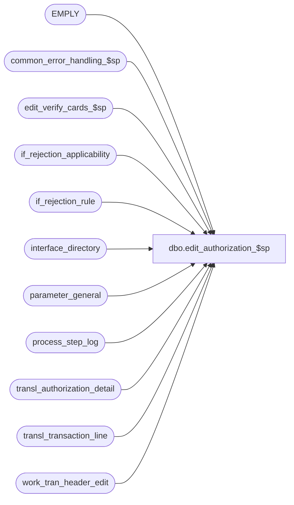

# dbo.edit_authorization_$sp

**Database:** auditworks  
**Server:** bedrockdb01  

## Architecture Diagram



## Table Dependencies

| Referenced Table |
|---|
| EMPLY |
| common_error_handling_$sp |
| edit_verify_cards_$sp |
| if_rejection_applicability |
| if_rejection_rule |
| interface_directory |
| parameter_general |
| process_step_log |
| transl_authorization_detail |
| transl_transaction_line |
| work_tran_header_edit |

## Stored Procedure Code

```sql
create proc dbo.edit_authorization_$sp @errmsg nvarchar(2000) OUTPUT,
@edit_process_no	tinyint = 1

AS

/*
NAME:	edit_authorization_$sp
DESCRIPTION:   (EDIT) post authorization details.  Called by edit_post_$sp. 

HISTORY:
Date     Author          Defect  Desc
Dec16,14 Paul         TFS-94103  use try catch
Aug08,08 Paul             87777  Uplift 66476 to SA5, code reviewed
Apr18,08 Phu              96766  Remove references to interface directory lookup table.
Nov29,05 Paul           DV-1324  apply 63987 to SA5
Nov02,05 Paul             62153  apply 61728 to SA5
Sep09,05 Paul           DV-1312  update history block
Apr29,05 Paul           DV-1234  expand transaction_id to use tran_id_datatype
Feb10,05 Paul           DV-1203  change datatypes in temp table to match CDM datatypes
Dec10,04 Maryam         DV-1191  Improve performance.
Sep09,04 David          DV-1120  apply 38442 to SA5
Apr23,04 Sab            DV-1071  Replace employee table with EMPLY
May16,06 Daphna           68317  use if_rejection_applicability to determine which validations to perform 
                                   (remove references to interface_directory_lookup)
Jan24,06 Vicci            66476  Treat inactive employees as invalid.
Nov29,05 David            63987  Change ISNULL to ensure proper comparison of house_account_no.
Oct27,05 David            61728  Use transl_transaction_line.encrypted_reference_no.
Jul12,04 Daphna           38442  Use ISNULL to compare header.emp_no to house_card.emp_no
Sep15,03 ShuZ           1-G7A5F  Remove all references to the interface_directory '... _check' 
                                        fields from stored procedures/triggers and replace with usage 
                                        of if_rejection_applicability table.
Dec26,01 Henry          1-9VP66 Moved purchasing_employee_check to edit_merchandise_$sp proc.
					Consolidate all employee checks in one proc.
Nov26,01 Winnie	        1-969YY Add logic for R3 error handling
Nov05,01 Sab               8900 TRANSL edit changes for Sybase
Dec21,00 Vicci             7092 Handle additional house card card-types.
Jun01,00 John G            5678 Break down employee_no_check into component parts.
May04,00 Vicci             6313 Handle additional house card card-types.
Jul07,96 Paul                   Author
*/

DECLARE
	@card_check			tinyint,
	@errmsg2			nvarchar(2000),
	@errline			int,
	@errno				int,
	@message_id		        int,	
	@object_name			nvarchar(255),
	@operation_name			nvarchar(100),
	@process_name		        nvarchar(100), 	
	@rows				int,
	@set_employee_no_from_account	tinyint,
	@step_no 			smallint;

SELECT @process_name = 'edit_authorization_$sp',
       @message_id = 201068;

BEGIN TRY

   SELECT @errmsg = 'Failed to create table #house_accounts',
          @object_name = '#house_accounts',
          @operation_name = 'CREATE TABLE';
CREATE TABLE #house_accounts (transaction_id numeric(14,0) null, -- tran_id_datatype
                              EMPLY_NUM int not null); -- T_LONG_INTEGER

      SELECT @errmsg = 'Failed to update transl_authorization_detail',
             @object_name = 'transl_authorization_detail',
             @operation_name = 'UPDATE';
UPDATE transl_authorization_detail
   SET transaction_id = wh.transaction_id
  FROM transl_authorization_detail ad, work_tran_header_edit wh WITH (NOLOCK)
 WHERE wh.store_no = ad.store_no
   AND wh.register_no = ad.register_no
   AND wh.entry_date_time = ad.entry_date_time
   AND wh.transaction_series = ad.transaction_series
   AND wh.transaction_no = ad.transaction_no;

  SELECT @errmsg = 'Failed to retrieve from if_rejection_rule, if_rejection_applicability, interface_directory for if_rejection_reason = 2, 113',
         @object_name = 'if_rejection_rule',
         @operation_name ='SELECT';
SELECT @card_check = COALESCE(SIGN(MIN(ia.interface_id)), 0)
  FROM if_rejection_rule ir, if_rejection_applicability ia, interface_directory id
 WHERE ir.if_rejection_reason IN (2, 113) -- Invalid card number, Card Type Not Accepted
   AND COALESCE(ir.active_rejection_rule, 1) = 1
   AND ir.if_rejection_reason = ia.if_reject_reason
   AND ia.interface_id = id.interface_id
   AND id.update_timing > 0;

IF @card_check > 0
  BEGIN
     SELECT @step_no = 19,
            @errmsg = 'Failed to update process_step_log to step_no 19',
            @object_name = 'process_step_log',
            @operation_name = 'UPDATE';  
    UPDATE process_step_log
       SET process_step_no = @step_no,
           process_step_start_time = getdate()
     WHERE process_no = 4
       AND stream_no = @edit_process_no;
       
         SELECT @errmsg = 'Failed to execute stored procedure edit_verify_cards_$sp',
	       @object_name = 'edit_verify_cards_$sp',
	       @operation_name = 'EXECUTE';
    EXEC edit_verify_cards_$sp @errmsg OUTPUT;

  END; -- if @card_check > 0

      SELECT @errmsg = 'Failed to select from parameter_general',
             @object_name = 'parameter_general',
           @operation_name = 'SELECT';
SELECT @set_employee_no_from_account = set_employee_no_from_account
  FROM parameter_general;

IF @set_employee_no_from_account = 1
  BEGIN
   /* get list of employee housecard numbers */
       SELECT @errmsg = 'Failed to insert into table #house_accounts',
              @object_name = '#house_accounts',
              @operation_name = 'INSERT';
     INSERT INTO #house_accounts(
            transaction_id,
            EMPLY_NUM)
     SELECT tl.transaction_id,
            e.EMPLY_NUM
       FROM EMPLY e, transl_transaction_line tl WITH (NOLOCK), transl_authorization_detail ad WITH (NOLOCK)
      WHERE ad.store_no = tl.store_no
	AND ad.register_no = tl.register_no
	AND ad.entry_date_time = tl.entry_date_time
	AND ad.transaction_series = tl.transaction_series
	AND ad.transaction_no = tl.transaction_no
	AND ad.line_id = tl.line_id
	AND tl.transaction_id IS NOT NULL --
	AND card_type IN ('H','K','L','N', 'O', 'P', 'Q', 'R', 'S', 'U', 'W', 'X', 'Y', 'Z')
	AND IsNull(tl.encrypted_reference_no, tl.reference_no) = e.HS_ACNT_NUM
	AND e.ACTV = 1;

   SELECT @rows = @@rowcount;

   IF @rows >= 1
     BEGIN
      /* look up employee_no using employee's house_account_no */
            SELECT @errmsg = 'Failed to update work_tran_header_edit (employee_no)',
                   @object_name = 'work_tran_header_edit',
                   @operation_name = 'UPDATE';
	UPDATE work_tran_header_edit
	   SET employee_no = ho.EMPLY_NUM
	  FROM work_tran_header_edit wh, #house_accounts ho WITH (NOLOCK)
	 WHERE wh.transaction_id = ho.transaction_id
	   AND ISNULL(wh.employee_no,0) != ho.EMPLY_NUM;
     END; /* @rows >= 1 */

  END; /* If @set_employee_no_from_account = 1 */


RETURN;


business_error:   /* Business Rule handler. */

	SELECT @errmsg2 = @errmsg;

	/* Could include similar cleanup code to system error trap when needed (example is from move_store_$sp).
	   However, could also exclude the cleanup code here since the outer system error catch should fire again after the exec below. */

	EXEC common_error_handling_$sp 4, @errno, @errmsg, 0, @message_id, 
	  @process_name, @object_name, @operation_name, 1, @edit_process_no;
	  /* Note: when the exec above raises an error, that action also fires the system error trap (below) */
	RETURN;
END TRY

BEGIN CATCH; -- trap system errors
    /* common error handling. Appending proc name here because a rollback could occur if called within a transaction. */

        SELECT @errno = ERROR_NUMBER(),
		@errline = ERROR_LINE();

        SELECT @errmsg = CONVERT(nvarchar, @errno) + ':' + @process_name + ':' + CONVERT(nvarchar, @errline) + ':'
               + COALESCE(@errmsg, ' ') + ':' + ERROR_MESSAGE();

	 /* this condition will only be true when raise error in traps above fire this general catch */
	IF @errmsg2 IS NOT NULL
	  SELECT @errmsg = @errmsg2;
	  
	EXEC common_error_handling_$sp 4, @errno, @errmsg, 0, @message_id, 
	  @process_name, @object_name, @operation_name, 1, @edit_process_no;

	RETURN;
END CATCH;
```

