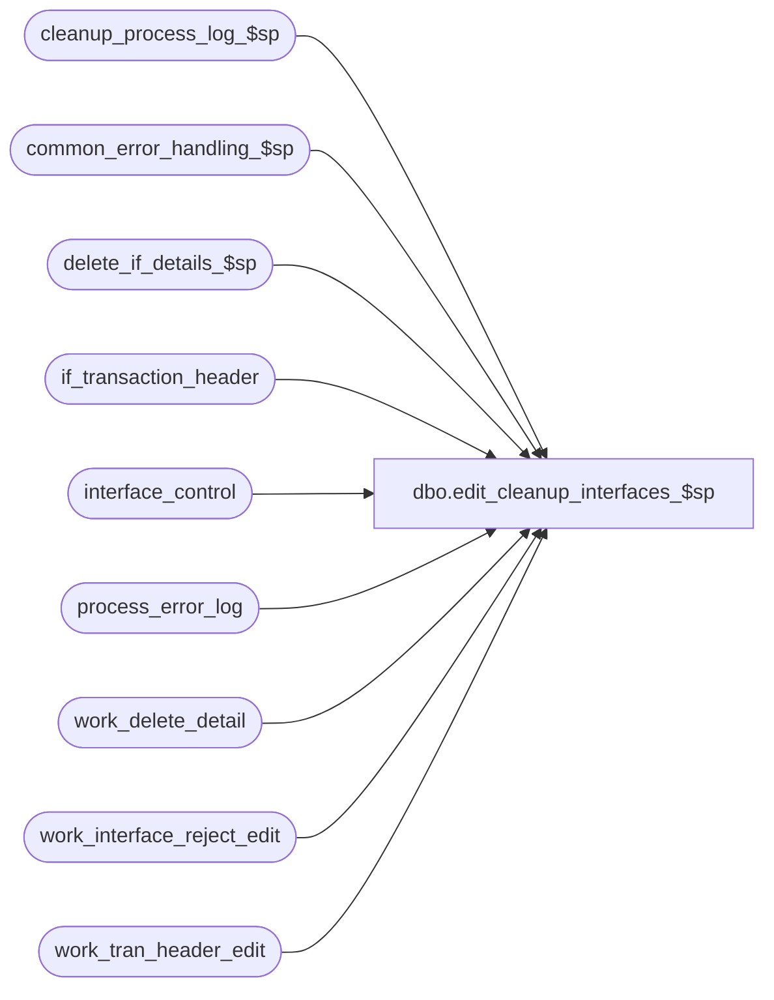

# dbo.edit_cleanup_interfaces_$sp

**Database:** auditworks  
**Server:** bedrockdb01  

## Architecture Diagram



## Table Dependencies

| Referenced Table |
|---|
| cleanup_process_log_$sp |
| common_error_handling_$sp |
| delete_if_details_$sp |
| if_transaction_header |
| interface_control |
| process_error_log |
| work_delete_detail |
| work_interface_reject_edit |
| work_tran_header_edit |

## Stored Procedure Code

```sql
create proc dbo.edit_cleanup_interfaces_$sp 
@process_id      binary(16),
@user_id	int,
@errmsg          nvarchar(2000) OUTPUT,
@edit_process_no tinyint

AS

/*
Proc name: edit_cleanup_interfaces_$sp
     Desc: To remove any incomplete transactions left in the interface tables after an error
           in edit_interfaces_$sp while processing the previous batch ( if_interface_control 
           not yet updated ). no need to delete if_interface_control since it would have rolled 
           back.
           Called from edit_post_$sp.

  HISTORY:
Date     Name              Def# Desc
Dec16,14 Paul         TFS-94103 use try catch
Feb08,05 David          DV-1206 Treat I/F reject reason 113 same as reason 2.
Dec12,04 Maryam         DV-1191 Improve performance.
Sep23,04 David          DV-1146 Use user_id.
May05,04 Maryam         DV-1071 Receive @process_id and pass to the procs that need them.
Nov26,01 Winnie		1-969YY	Add logic for R3 error handling
Jul05,01 Paul		8170 	delete interface_control to avoid duplicates
Mar29,01 Bayani D	7376 	Remove lines that process HO tables
Jul23,99 Daphna F 	5026 	add call to delete_if_details_$sp instead of deleting
				if_details and setting off trigger on if_tran_header
				add call to delete_ho_details_$sp instead of deleting
				ho_transaction_header and setting off delete trigger
Apr06,99 Paul S		     	Avoid duplicate error
Aug05,98 Paul S		n/a  	Author version 1.00

*/

DECLARE @errno			int,
	@errmsg2			nvarchar(2000),
	@errline			int,
         @object_name		nvarchar(255),
	@process_name		nvarchar(100),
	@operation_name		nvarchar(100),
	@message_id		int;

SELECT @process_name = 'edit_cleanup_interfaces_$sp',
       @message_id = 201068;

BEGIN TRY

/* get list of transactions to be deleted */
  SELECT @errmsg = 'Failed to delete work_delete_detail (if)',
  	 @object_name = 'work_delete_detail',
         @operation_name = 'DELETE';
DELETE work_delete_detail
 WHERE process_id = @process_id;

  SELECT @errmsg = 'Failed to populate work_delete_detail (if)',
         @operation_name = 'INSERT';
INSERT work_delete_detail (process_id, transaction_id) 
SELECT @process_id, if_entry_no
  FROM work_tran_header_edit wh WITH (NOLOCK), if_transaction_header ith WITH (NOLOCK)
 WHERE wh.store_no = ith.store_no
   AND wh.register_no = ith.register_no
   AND wh.transaction_date = ith.transaction_date
   AND wh.transaction_no = ith.transaction_no
   AND wh.transaction_series = ith.transaction_series
   AND wh.edit_timestamp = ith.edit_timestamp;

  SELECT @errmsg = 'Failed to execute delete_if_details_$sp (if)',
         @object_name = 'delete_if_details_$sp',
         @operation_name = 'EXECUTE';
EXEC delete_if_details_$sp @process_id, @user_id, 0, 4, @edit_process_no;

   SELECT @errmsg = 'Unable to delete interface_control',
          @object_name = 'interface_control',
          @operation_name = 'DELETE';
DELETE interface_control
  FROM work_tran_header_edit wh WITH (NOLOCK), interface_control ic
 WHERE wh.transaction_id = ic.transaction_id;

/* remove if_rejects created by edit_interfaces_$sp */
   SELECT @errmsg = 'Failed to delete work_interface_reject_edit',
          @object_name = 'work_interface_reject_edit',
          @operation_name = 'DELETE';
DELETE work_interface_reject_edit
 WHERE if_reject_reason IN (2, 113);

   SELECT @errmsg = 'Failed to update process_error_log',
          @object_name = 'process_error_log',
          @operation_name = 'UPDATE'; 
UPDATE process_error_log
 SET verified = 1,
     verified_by_user_id = NULL --
  WHERE verified = 0
  AND process_no = 2
  AND error_code = 108207;

   SELECT @errmsg = 'Failed to exec cleanup_process_log_$sp',
             @object_name = 'cleanup_process_log_$sp',
             @operation_name = 'EXECUTE';
EXEC cleanup_process_log_$sp 2, @edit_process_no;


RETURN;


business_error:   /* Business Rule handler. */

	SELECT @errmsg2 = @errmsg;

	/* Could include similar cleanup code to system error trap when needed (example is from move_store_$sp).
	   However, could also exclude the cleanup code here since the outer system error catch should fire again after the exec below. */

	EXEC common_error_handling_$sp 2, @errno, @errmsg, 0, @message_id, 
	  @process_name, @object_name, @operation_name, 1, @edit_process_no, 0,
	  null, 0, null, null, null, null, null, null, 0, @process_id, @user_id;
	  /* Note: when the exec above raises an error, that action also fires the system error trap (below) */
	RETURN;
END TRY

BEGIN CATCH; -- trap system errors
    /* common error handling. Appending proc name here because a rollback could occur if called within a transaction. */

        SELECT @errno = ERROR_NUMBER(),
		@errline = ERROR_LINE();

        SELECT @errmsg = CONVERT(nvarchar, @errno) + ':' + @process_name + ':' + CONVERT(nvarchar, @errline) + ':'
               + COALESCE(@errmsg, ' ') + ':' + ERROR_MESSAGE();

	 /* this condition will only be true when raise error in traps above fire this general catch */
	IF @errmsg2 IS NOT NULL
	  SELECT @errmsg = @errmsg2;

	EXEC common_error_handling_$sp 2, @errno, @errmsg, 0, @message_id, 
	  @process_name, @object_name, @operation_name, 1, @edit_process_no, 0,
	  null, 0, null, null, null, null, null, null, 0, @process_id, @user_id;

	RETURN;
END CATCH;
```

