# dbo.edit_copy_input_tables_$sp

**Database:** auditworks  
**Server:** bedrockdb01  

## Architecture Diagram

```mermaid
flowchart LR
    SP["dbo.edit_copy_input_tables_$sp"]
    common_error_handling__sp(["common_error_handling_$sp"]) --> SP
    dw_dblink_peripheral(["dw_dblink_peripheral"]) --> SP
    dbo_dw_input_authorization_detail(["dbo.dw_input_authorization_detail"]) --> SP
    dbo_dw_input_customer(["dbo.dw_input_customer"]) --> SP
    dbo_dw_input_customer_detail(["dbo.dw_input_customer_detail"]) --> SP
    dbo_dw_input_discount_detail(["dbo.dw_input_discount_detail"]) --> SP
    dbo_dw_input_line_note(["dbo.dw_input_line_note"]) --> SP
    dbo_dw_input_merchandise_detail(["dbo.dw_input_merchandise_detail"]) --> SP
    dbo_dw_input_payroll_detail(["dbo.dw_input_payroll_detail"]) --> SP
    dbo_dw_input_post_void_detail(["dbo.dw_input_post_void_detail"]) --> SP
    dbo_dw_input_processing_status(["dbo.dw_input_processing_status"]) --> SP
    dbo_dw_input_return_detail(["dbo.dw_input_return_detail"]) --> SP
    dbo_dw_input_special_order_detail(["dbo.dw_input_special_order_detail"]) --> SP
    dbo_dw_input_stock_control_detail(["dbo.dw_input_stock_control_detail"]) --> SP
    dbo_dw_input_tax_override_detail(["dbo.dw_input_tax_override_detail"]) --> SP
    dbo_dw_input_transaction_hdr(["dbo.dw_input_transaction_hdr"]) --> SP
    dbo_dw_input_transaction_line(["dbo.dw_input_transaction_line"]) --> SP
    dbo_dw_input_transaction_line_link(["dbo.dw_input_transaction_line_link"]) --> SP
    transl_authorization_detail(["transl_authorization_detail"]) --> SP
    transl_customer(["transl_customer"]) --> SP
    transl_customer_detail(["transl_customer_detail"]) --> SP
    transl_discount_detail(["transl_discount_detail"]) --> SP
    transl_line_note(["transl_line_note"]) --> SP
    transl_merchandise_detail(["transl_merchandise_detail"]) --> SP
    transl_payroll_detail(["transl_payroll_detail"]) --> SP
    transl_post_void_detail(["transl_post_void_detail"]) --> SP
    transl_return_detail(["transl_return_detail"]) --> SP
    transl_special_order_detail(["transl_special_order_detail"]) --> SP
    transl_stock_control_detail(["transl_stock_control_detail"]) --> SP
    transl_tax_override_detail(["transl_tax_override_detail"]) --> SP
    transl_transaction_hdr(["transl_transaction_hdr"]) --> SP
    transl_transaction_line(["transl_transaction_line"]) --> SP
    transl_transaction_line_link(["transl_transaction_line_link"]) --> SP
    work_tran_header_edit(["work_tran_header_edit"]) --> SP
```



## Table Dependencies

| Referenced Table |
|---|
| common_error_handling_$sp |
| dw_dblink_peripheral |
| dbo.dw_input_authorization_detail |
| dbo.dw_input_customer |
| dbo.dw_input_customer_detail |
| dbo.dw_input_discount_detail |
| dbo.dw_input_line_note |
| dbo.dw_input_merchandise_detail |
| dbo.dw_input_payroll_detail |
| dbo.dw_input_post_void_detail |
| dbo.dw_input_processing_status |
| dbo.dw_input_return_detail |
| dbo.dw_input_special_order_detail |
| dbo.dw_input_stock_control_detail |
| dbo.dw_input_tax_override_detail |
| dbo.dw_input_transaction_hdr |
| dbo.dw_input_transaction_line |
| dbo.dw_input_transaction_line_link |
| transl_authorization_detail |
| transl_customer |
| transl_customer_detail |
| transl_discount_detail |
| transl_line_note |
| transl_merchandise_detail |
| transl_payroll_detail |
| transl_post_void_detail |
| transl_return_detail |
| transl_special_order_detail |
| transl_stock_control_detail |
| transl_tax_override_detail |
| transl_transaction_hdr |
| transl_transaction_line |
| transl_transaction_line_link |
| work_tran_header_edit |

## Stored Procedure Code

```sql
create proc dbo.edit_copy_input_tables_$sp (
@store_no		int,
@transaction_date	smalldatetime,
@instance_id		smallint)

AS

/*********************************************************************************
Proc name:	edit_copy_input_tables_$sp

Description:	In a scaleout environment, a store can belong to only one peripheral server due to media rec.
		If sales are received for a store that belongs to another peripheral, the store-date
		will not be processed by the local server. Instead, the data for the store-date will be copied
		to the input tables on the consolidated server through the dw view (database link).
		Row_sequence_no will be populated by triggers on the dw input* tables on consolidated
		due to Oracle limitations (cannot use a local sequence when inserting cross-server).
		The sp sadw_get_input_tables_$sp will later copy the input table data to the proper peripheral.

		Called by the edit_header_$sp procedure.

*********************************************************************************
*** must script with ANSI_NULLS ON, ANSI_WARNINGS ON due to scaleout

HISTORY

Date     Name		Def#	Desc
Feb17,12 Vicci           133087 Remove references to CRDM datatypes from procs installed in multi-stream S/A databases where CRDM is not installed.
Oct22,09 Paul            113434 added comments to match Oracle
Jan09,09 Paul            107351 added error trap for missing scaleout config
Mar21,05 Maryam         DV-1202 Rename from_line_id to line_id.
Mar18,05 David          DV-1202 Add display_def_id input_stock_control_detail.
Mar15,05 Maryam         DV-1202 insert into dw_input_transaction_line_link.
Jan20,05 Sab		DV-1200	Author
*/

DECLARE
  @db_name		nvarchar(30),
  @dblink_name		nvarchar(128),
  @errmsg		nvarchar(255),
  @errno		int,
  @input_id		numeric(12,0),
  @message_id		int,
  @object_name		nvarchar(255),
  @operation_name	nvarchar(100),
  @ParmDefinition	nvarchar(500),
  @process_name		nvarchar(100),
  @process_no		smallint,
  @rows			int,
  @sql_string		nvarchar(2000)

SELECT @process_no = 1,
       @process_name = 'edit_copy_input_tables_$sp',
       @message_id = 201068

/* Get consolidated server connection information which is configured with instance_id = 0 */
SELECT @dblink_name = dblink_name,
	@db_name = database_name
  FROM dw_dblink_peripheral
 WHERE instance_id = 0

SELECT @errno = @@error, @rows = @@rowcount
IF @errno != 0 OR @rows = 0
 BEGIN
   SELECT @errmsg = 'Failed to retrieve connection info for consolidated server',
	  @object_name = 'dw_dblink_peripheral',
	  @operation_name = 'SELECT'
   GOTO error
 END

/* Execute the procedure in sadw since the @@identity only works on local servers. We start by inserting
   the row to the header table on the consolidated server. input_id is returned to the variable @input_id */
SET @sql_string = N'EXEC ' + @dblink_name + '.' + @db_name + '.dbo.create_input_id_sadw_$sp ' +
		CONVERT(nvarchar(20),@store_no) + ',' +
		CONVERT(nvarchar(20),@transaction_date) + ',' +
		CONVERT(nvarchar(3), @instance_id) + ',@errmsgOUT OUTPUT, @id OUTPUT'
SET @ParmDefinition = N'@errmsgOUT nvarchar(255) OUTPUT, @id numeric(12,0) OUTPUT'
EXEC sp_executesql @sql_string, @ParmDefinition, @errmsgOUT = @errmsg OUTPUT, @id = @input_id OUTPUT

SELECT @errno = @@error
IF @errno != 0
 BEGIN
   IF @errmsg IS NULL
     SELECT @errmsg = 'Failed to execute ' + @dblink_name + '.' + @db_name + '.dbo.create_input_id_sadw_$sp'

   SELECT @object_name = 'create_input_id_sadw_$sp',
	  @operation_name = 'EXECUTE'
   GOTO error
 END

INSERT dbo.dw_input_authorization_detail (
	input_id,
	store_no,
	register_no,
	entry_date_time,
	transaction_series,
	transaction_no,
	line_id,
	customer_signature_obtained,
	authorization_no,
	expiry_date,
	swipe_indicator,
	approval_message,
	license_no,
	pos_state_code,
	other_id_type,
	other_id,
	card_type,
	deferred_billing_date,
	deferred_billing_plan,
	offline_flag)
 SELECT @input_id,
	a.store_no,
	a.register_no,
	a.entry_date_time,
	a.transaction_series,
	a.transaction_no,
	a.line_id,
	customer_signature_obtained,
	authorization_no,
	expiry_date,
	swipe_indicator,
	approval_message,
	license_no,
	pos_state_code,
	other_id_type,
	other_id,
	card_type,
	deferred_billing_date,
	deferred_billing_plan,
	offline_flag
   FROM transl_authorization_detail a, work_tran_header_edit wh
  WHERE wh.store_no = @store_no
    AND wh.transaction_date = @transaction_date
    AND wh.store_no = a.store_no
    AND wh.register_no = a.register_no
    AND wh.entry_date_time = a.entry_date_time
    AND wh.transaction_series = a.transaction_series
    AND wh.transaction_no = a.transaction_no

SELECT @errno = @@error
IF @errno != 0
 BEGIN
   SELECT @errmsg = 'Failed to INSERT into input_authorization_detail',
	  @object_name = 'input_authorization_detail',
	  @operation_name = 'INSERT'
   GOTO error
END

INSERT dbo.dw_input_customer (
	input_id,
	store_no,
  	register_no,
	entry_date_time,
	transaction_series,
	transaction_no,
	line_id,
	customer_role,
	title,
	first_name,
	last_name,
	address_1,
	address_2,
	city,
	county,
	state,
	country,
	post_code,
	telephone_no1,
	telephone_no2,
	customer_no,
	pos_tax_jurisdiction_code,
	fax,
	email_address)
 SELECT @input_id,
	c.store_no,
	c.register_no,
	c.entry_date_time,
	c.transaction_series,
	c.transaction_no,
	line_id,
	customer_role,
	title,
	first_name,
	last_name,
	address_1,
	address_2,
	city,
	county,
	state,
	country,
	post_code,
	telephone_no1,
	telephone_no2,
	customer_no,
	pos_tax_jurisdiction_code,
	fax,
	email_address
   FROM transl_customer c, work_tran_header_edit wh
  WHERE wh.store_no = @store_no
    AND wh.transaction_date = @transaction_date
    AND wh.store_no = c.store_no
    AND wh.register_no = c.register_no
    AND wh.entry_date_time = c.entry_date_time
    AND wh.transaction_series = c.transaction_series
    AND wh.transaction_no = c.transaction_no

SELECT @errno = @@error
IF @errno != 0
 BEGIN
   SELECT @errmsg = 'Failed to INSERT into input_customer',
	  @object_name = 'input_customer',
	  @operation_name = 'INSERT'
   GOTO error
 END

INSERT dbo.dw_input_customer_detail (
	input_id,
	store_no,
	register_no,
	entry_date_time,
	transaction_series,
	transaction_no,
	line_id,
	customer_role,
	customer_info_type,
	customer_info,
	lookup_pos_code)
 SELECT @input_id,
	c.store_no,
	c.register_no,
	c.entry_date_time,
	c.transaction_series,
    	c.transaction_no,
	line_id,
	customer_role,
	customer_info_type,
	customer_info,
	lookup_pos_code
   FROM transl_customer_detail c, work_tran_header_edit wh
  WHERE wh.store_no = @store_no
    AND wh.transaction_date = @transaction_date
    AND wh.store_no = c.store_no
    AND wh.register_no = c.register_no
    AND wh.entry_date_time = c.entry_date_time
    AND wh.transaction_series = c.transaction_series
    AND wh.transaction_no = c.transaction_no

SELECT @errno = @@error
IF @errno != 0
 BEGIN
   SELECT @errmsg = 'Failed to INSERT into input_customer_detail',
	  @object_name = 'input_customer_detail',
	  @operation_name = 'INSERT'
   GOTO error
 END

INSERT dbo.dw_input_discount_detail (
	input_id,
	store_no,
	register_no,
	entry_date_time,
	transaction_series,
	transaction_no,
	line_id,
	line_id_adj,
	pos_discount_level,
	pos_discount_type,
	pos_discount_amount,
	pos_discount_amount_adj,
	discount_amount_sign,
	discount_applied_flag,
	applied_by_line_id,
	pos_discount_serial_no)
 SELECT @input_id,
	d.store_no,
	d.register_no,
	d.entry_date_time,
 	d.transaction_series,
	d.transaction_no,
	line_id,
	line_id_adj,
	pos_discount_level,
	pos_discount_type,
	pos_discount_amount,
	pos_discount_amount_adj,
	discount_amount_sign,
	discount_applied_flag,
	applied_by_line_id,
	pos_discount_serial_no
   FROM transl_discount_detail d, work_tran_header_edit wh
  WHERE wh.store_no = @store_no
    AND wh.transaction_date = @transaction_date
    AND wh.store_no = d.store_no
    AND wh.register_no = d.register_no
    AND wh.entry_date_time = d.entry_date_time
    AND wh.transaction_series = d.transaction_series
    AND wh.transaction_no = d.transaction_no

SELECT @errno = @@error
IF @errno != 0
 BEGIN
   SELECT @errmsg = 'Failed to INSERT into input_discount_detail',
	  @object_name = 'input_discount_detail',
	  @operation_name = 'INSERT'
   GOTO error
 END

INSERT dbo.dw_input_line_note (
	input_id,
	store_no,
	register_no,
	entry_date_time,
	transaction_series,
	transaction_no,
	line_id,
	note_type,
	line_note,
	lookup_pos_code,
	pos_description)
 SELECT @input_id,
	l.store_no,
	l.register_no,
	l.entry_date_time,
	l.transaction_series,
	l.transaction_no,
	line_id,
	note_type,
	line_note,
	lookup_pos_code,
	pos_description
   FROM transl_line_note l, work_tran_header_edit wh
  WHERE wh.store_no = @store_no
    AND wh.transaction_date = @transaction_date
    AND wh.store_no = l.store_no
    AND wh.register_no = l.register_no
    AND wh.entry_date_time = l.entry_date_time
    AND wh.transaction_series = l.transaction_series
    AND wh.transaction_no = l.transaction_no

SELECT @errno = @@error
IF @errno != 0
 BEGIN
   SELECT @errmsg = 'Failed to INSERT into input_line_note',
	  @object_name = 'input_line_note',
	  @operation_name = 'INSERT'
   GOTO error
 END

INSERT dbo.dw_input_merchandise_detail (
	input_id,
	store_no,
	register_no,
	entry_date_time,
	transaction_series,
	transaction_no,
	line_id,
	merchandise_category,
	upc_lookup_division,
	upc_no,
	units,
	units_sign,
	salesperson,
	salesperson2,
	price_override,
	pos_iplu_missing,
	pos_deptclass,
	pos_no_hit_deptclass,
	ticket_price,
	sold_at_price,
	pos_identifier,
	scanned,
	pos_identifier_type,
	originating_store_no,
	source_store_no,
	fulfillment_store_no)
 SELECT @input_id,
	d.store_no,
	d.register_no,
	d.entry_date_time,
	d.transaction_series,
	d.transaction_no,
	line_id,
	merchandise_category,
	upc_lookup_division,
	upc_no,
	units,
	units_sign,
	salesperson,
	salesperson2,
	price_override,
	pos_iplu_missing,
	pos_deptclass,
	pos_no_hit_deptclass,
	ticket_price,
	sold_at_price,
	pos_identifier,
	scanned,
	pos_identifier_type,
	originating_store_no,
	source_store_no,
	fulfillment_store_no
   FROM transl_merchandise_detail d, work_tran_header_edit wh
  WHERE wh.store_no = @store_no
    AND wh.transaction_date = @transaction_date
    AND wh.store_no = d.store_no
    AND wh.register_no = d.register_no
    AND wh.entry_date_time = d.entry_date_time
    AND wh.transaction_series = d.transaction_series
    AND wh.transaction_no = d.transaction_no

SELECT @errno = @@error
IF @errno != 0
 BEGIN
   SELECT @errmsg = 'Failed to INSERT into input_merchandise_detail',
	  @object_name = 'input_merchandise_detail',
	  @operation_name = 'INSERT'
   GOTO error
 END

INSERT dbo.dw_input_payroll_detail (
	input_id,
	store_no,
	register_no,
	entry_date_time,
	transaction_series,
	transaction_no,
	line_id,
	employee_no,
	payroll_date,
	employee_payroll_id,
	employee_type,
	payroll_entry_type)
 SELECT @input_id,
	p.store_no,
	p.register_no,
	p.entry_date_time,
	p.transaction_series,
	p.transaction_no,
	line_id,
	p.employee_no,
	payroll_date,
	employee_payroll_id,
	employee_type,
	payroll_entry_type
   FROM transl_payroll_detail p, work_tran_header_edit wh
  WHERE wh.store_no = @store_no
    AND wh.transaction_date = @transaction_date
    AND wh.store_no = p.store_no
    AND wh.register_no = p.register_no
    AND wh.entry_date_time = p.entry_date_time
    AND wh.transaction_series = p.transaction_series
    AND wh.transaction_no = p.transaction_no

SELECT @errno = @@error
IF @errno != 0
 BEGIN
   SELECT @errmsg = 'Failed to INSERT into input_payroll_detail',
	  @object_name = 'input_payroll_detail',
	  @operation_name = 'INSERT'
   GOTO error
 END

INSERT dbo.dw_input_post_void_detail (
	input_id,
	store_no,
	register_no,
	entry_date_time,
	transaction_series,
	transaction_no,
	line_id,
	post_voided_register,
	post_voided_trans_no,
	post_void_successful,
	post_void_reason_code,
	lookup_pos_code,
	pos_description)
 SELECT @input_id,
	p.store_no,
	p.register_no,
	p.entry_date_time,
	p.transaction_series,
	p.transaction_no,
	line_id,
	post_voided_register,
	post_voided_trans_no,
	post_void_successful,
	post_void_reason_code,
	lookup_pos_code,
	pos_description
   FROM transl_post_void_detail p, work_tran_header_edit wh
  WHERE wh.store_no = @store_no
    AND wh.transaction_date = @transaction_date
    AND wh.store_no = p.store_no
    AND wh.register_no = p.register_no
    AND wh.entry_date_time = p.entry_date_time
    AND wh.transaction_series = p.transaction_series
    AND wh.transaction_no = p.transaction_no

SELECT @errno = @@error
IF @errno != 0
 BEGIN
   SELECT @errmsg = 'Failed to INSERT into input_post_void_detail',
	  @object_name = 'input_post_void_detail',
	  @operation_name = 'INSERT'
   GOTO error
 END

INSERT dbo.dw_input_return_detail (
	input_id,
	store_no,
	register_no,
	entry_date_time,
	transaction_series,
	transaction_no,
	line_id,
	via_warehouse_flag,
	return_reason_message,
	return_reason_code,
	mdse_disposition_code,
	return_from_store,
	return_from_reg,
	return_from_date,
	return_from_transno,
	original_salesperson,
	original_salesperson2,
	without_receipt_flag)
 SELECT @input_id,
	r.store_no,
	r.register_no,
	r.entry_date_time,
	r.transaction_series,
	r.transaction_no,
	line_id,
	via_warehouse_flag,
	return_reason_message,
	return_reason_code,
	mdse_disposition_code,
	return_from_store,
	return_from_reg,
	return_from_date,
	return_from_transno,
	original_salesperson,
	original_salesperson2,
	without_receipt_flag
   FROM transl_return_detail r, work_tran_header_edit wh
  WHERE wh.store_no = @store_no
    AND wh.transaction_date = @transaction_date
    AND wh.store_no = r.store_no
    AND wh.register_no = r.register_no
    AND wh.entry_date_time = r.entry_date_time
    AND wh.transaction_series = r.transaction_series
    AND wh.transaction_no = r.transaction_no

SELECT @errno = @@error
IF @errno != 0
 BEGIN
   SELECT @errmsg = 'Failed to INSERT into input_return_detail',
	  @object_name = 'input_return_detail',
	  @operation_name = 'INSERT'
   GOTO error
 END

INSERT dbo.dw_input_special_order_detail (
	input_id,
	store_no,
	register_no,
	entry_date_time,
	transaction_series,
	transaction_no,
	line_id,
	units,
	units_sign,
	salesperson,
	merchandise_description,
	expecting_delivery_on,
	color_description,
	size_description,
	width_description,
	vendor_name,
	vendor_style_description,
	spo_class_description,
	vendor_no)
 SELECT @input_id,
	s.store_no,
	s.register_no,
	s.entry_date_time,
	s.transaction_series,
	s.transaction_no,
	line_id,
	units,
	units_sign,
	salesperson,
 	merchandise_description,
	expecting_delivery_on,
	color_description,
	size_description,
	width_description,
	vendor_name,
	vendor_style_description,
	spo_class_description,
	vendor_no
   FROM transl_special_order_detail s, work_tran_header_edit wh
  WHERE wh.store_no = @store_no
    AND wh.transaction_date = @transaction_date
    AND wh.store_no = s.store_no
    AND wh.register_no = s.register_no
    AND wh.entry_date_time = s.entry_date_time
    AND wh.transaction_series = s.transaction_series
    AND wh.transaction_no = s.transaction_no

SELECT @errno = @@error
IF @errno != 0
 BEGIN
   SELECT @errmsg = 'Failed to INSERT into input_special_order_detail',
	  @object_name = 'input_special_order_detail',
	  @operation_name = 'INSERT'
   GOTO error
 END

INSERT dbo.dw_input_stock_control_detail (
	input_id,
	store_no,
	register_no,
	entry_date_time,
	transaction_series,
	transaction_no,
	line_id,
	upc_no,
	merchandise_key,
	initiated_by_host,
	units,
	other_store_no,
	location_no,
 	vendor_no,
	count_date,
	pos_deptclass,
	pos_identifier,
	pos_identifier_type,
	originating_store_no,
	reason,
	imrd,
	lookup_pos_code,
	pos_description,
	lookup_pos_code_imrd,
	pos_description_imrd,
	lookup_pos_code_vendor,
	display_def_id,
	pos_description_vendor)
 SELECT @input_id,
	s.store_no,
	s.register_no,
	s.entry_date_time,
	s.transaction_series,
	s.transaction_no,
	line_id,
	upc_no,
	merchandise_key,
	initiated_by_host,
	units,
	other_store_no,
	location_no,
	vendor_no,
	count_date,
	pos_deptclass,
	pos_identifier,
	pos_identifier_type,
	originating_store_no,
	reason,
	imrd,
	lookup_pos_code,
	pos_description,
	lookup_pos_code_imrd,
	pos_description_imrd,
	lookup_pos_code_vendor,
	s.display_def_id,
	pos_description_vendor
   FROM transl_stock_control_detail s, work_tran_header_edit wh
  WHERE wh.store_no = @store_no
    AND wh.transaction_date = @transaction_date
    AND wh.store_no = s.store_no
    AND wh.register_no = s.register_no
    AND wh.entry_date_time = s.entry_date_time
    AND wh.transaction_series = s.transaction_series
    AND wh.transaction_no = s.transaction_no

SELECT @errno = @@error
IF @errno != 0
 BEGIN
   SELECT @errmsg = 'Failed to INSERT into input_stock_control_detail',
	  @object_name = 'input_stock_control_detail',
	  @operation_name = 'INSERT'
   GOTO error
 END

INSERT dbo.dw_input_tax_override_detail (
	input_id,
	store_no,
	register_no,
	entry_date_time,
 	transaction_series,
	transaction_no,
	line_id,
	tax_level,
	tax_category,
	taxable,
	exception_tax_jurisdiction,
	tax_exempt_no)
 SELECT @input_id,
	t.store_no,
	t.register_no,
	t.entry_date_time,
	t.transaction_series,
	t.transaction_no,
	line_id,
 	tax_level,
	tax_category,
	taxable,
	exception_tax_jurisdiction,
	tax_exempt_no
   FROM transl_tax_override_detail t, work_tran_header_edit wh
  WHERE wh.store_no = @store_no
    AND wh.transaction_date = @transaction_date
    AND wh.store_no = t.store_no
    AND wh.register_no = t.register_no
    AND wh.entry_date_time = t.entry_date_time
    AND wh.transaction_series = t.transaction_series
    AND wh.transaction_no = t.transaction_no

SELECT @errno = @@error
IF @errno != 0
 BEGIN
   SELECT @errmsg = 'Failed to INSERT into input_tax_override_detail',
	  @object_name = 'input_tax_override_detail',
	  @operation_name = 'INSERT'
   GOTO error
 END

INSERT dbo.dw_input_transaction_line_link (
	input_id,
	store_no,
	register_no,
	entry_date_time,
	transaction_series,
	transaction_no,
	line_id,
	linked_line_id)
 SELECT @input_id,
	k.store_no,
	k.register_no,
	k.entry_date_time,
	k.transaction_series,
	k.transaction_no,
	line_id,
	linked_line_id
   FROM transl_transaction_line_link k, work_tran_header_edit wh
  WHERE wh.store_no = @store_no
    AND wh.transaction_date = @transaction_date
    AND wh.store_no = k.store_no
    AND wh.register_no = k.register_no
    AND wh.entry_date_time = k.entry_date_time
    AND wh.transaction_series = k.transaction_series
    AND wh.transaction_no = k.transaction_no

SELECT @errno = @@error
IF @errno != 0
 BEGIN
   SELECT @errmsg = 'Failed to INSERT into input_transaction_line_link',
	  @object_name = 'input_transaction_line_link',
	  @operation_name = 'INSERT'
   GOTO error
 END
 
INSERT dbo.dw_input_transaction_hdr (
	input_id,
	store_no,
	register_no,
	entry_date_time,
	transaction_series,
	transaction_no,
	cashier_no,
	transaction_category,
	deposit_declaration_flag,
	tax_jurisdiction_store,
	pos_tax_jurisdiction,
	trans_void_flag,
	pos_tender_total,
	pos_tender_total_sign,
	employee_no,
	closeout_flag,
	tax_override_flag,
	transaction_remark,
	till_no,
	pos_transaction_series)
 SELECT @input_id,
	h.store_no,
	h.register_no,
	h.entry_date_time,
	h.transaction_series,
	h.transaction_no,
	h.cashier_no,
	h.transaction_category,
	h.deposit_declaration_flag,
	h.tax_jurisdiction_store,
	h.pos_tax_jurisdiction,
	h.trans_void_flag,
	h.pos_tender_total,
	h.pos_tender_total_sign,
	h.employee_no,
	h.closeout_flag,
	h.tax_override_flag,
	h.transaction_remark,
	h.till_no,
	h.pos_transaction_series
   FROM transl_transaction_hdr h, work_tran_header_edit wh
  WHERE wh.store_no = @store_no
    AND wh.transaction_date = @transaction_date
    AND wh.store_no = h.store_no
    AND wh.register_no = h.register_no
    AND wh.entry_date_time = h.entry_date_time
    AND wh.transaction_series = h.transaction_series
    AND wh.transaction_no = h.transaction_no

SELECT @errno = @@error
IF @errno != 0
 BEGIN
   SELECT @errmsg = 'Failed to INSERT into input_transaction_hdr',
	  @object_name = 'input_transaction_hdr',
	  @operation_name = 'INSERT'
   GOTO error
 END

INSERT dbo.dw_input_transaction_line (
	input_id,
	store_no,
	register_no,
	entry_date_time,
	transaction_series,
	transaction_no,
	line_id,
	line_object,
	line_action,
	gross_line_amount,
	line_object_lookup_flag,
	line_amount_divider,
	pos_discount_amount,
	gross_line_amount_sign,
	line_void_flag,
	voiding_reversal_flag,
	attachment_qty,
	line_object_adjustment,
	reference_no,
	lookup_pos_code,
	pos_description_token_list)
 SELECT @input_id,
	l.store_no,
	l.register_no,
	l.entry_date_time,
	l.transaction_series,
	l.transaction_no,
	line_id,
	line_object,
	line_action,
	gross_line_amount,
	line_object_lookup_flag,
	line_amount_divider,
	pos_discount_amount,
	gross_line_amount_sign,
	line_void_flag,
	voiding_reversal_flag,
	attachment_qty,
	line_object_adjustment,
	reference_no,
	lookup_pos_code,
	pos_description_token_list
   FROM transl_transaction_line l, work_tran_header_edit wh
 WHERE wh.store_no = @store_no
    AND wh.transaction_date = @transaction_date
    AND wh.store_no = l.store_no
    AND wh.register_no = l.register_no
    AND wh.entry_date_time = l.entry_date_time
    AND wh.transaction_series = l.transaction_series
    AND wh.transaction_no = l.transaction_no

SELECT @errno = @@error
IF @errno != 0
 BEGIN
   SELECT @errmsg = 'Failed to INSERT into input_transaction_line',
	  @object_name = 'input_transaction_line',
	  @operation_name = 'INSERT'
   GOTO error
 END

UPDATE dbo.dw_input_processing_status
   SET status = -3
 WHERE input_id = @input_id

SELECT @errno = @@error
IF @errno != 0
 BEGIN
   SELECT @errmsg = 'Failed to UPDATE input_processing_status',
	  @object_name = 'input_processing_status',
	  @operation_name = 'UPDATE'
   GOTO error
 END

RETURN

error:   /* Common error handler. */

	EXEC common_error_handling_$sp @process_no, @errno, @errmsg, 0, @message_id, 
	@process_name, @object_name, @operation_name, 0, 1, 0, null, 0, null, null,
	null, null, null, null, 0, 0, null -- for @user_id
	
	RETURN
```

