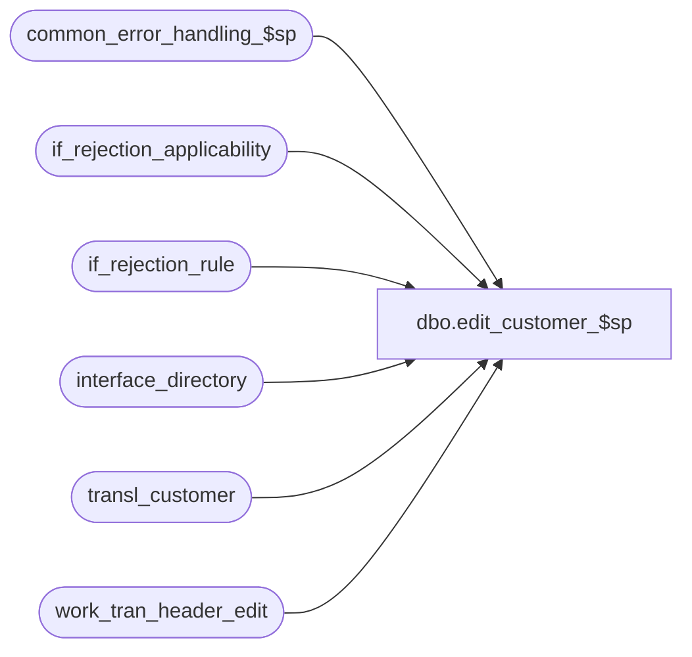

# dbo.edit_customer_$sp

**Database:** auditworks  
**Server:** bedrockdb01  

## Architecture Diagram



## Table Dependencies

| Referenced Table |
|---|
| common_error_handling_$sp |
| if_rejection_applicability |
| if_rejection_rule |
| interface_directory |
| transl_customer |
| work_tran_header_edit |

## Stored Procedure Code

```sql
create proc dbo.edit_customer_$sp @customer_info_check	tinyint		OUTPUT,
@errmsg			nvarchar(2000)	OUTPUT,
@edit_process_no	tinyint = 1

AS

/* Proc Name: edit_customer_$sp
   Desc: (EDIT) post customer headers.
    Called by edit_post_$sp.

HISTORY
Date     Name           Def# Desc
Dec16,14 Paul      TFS-94103 use try catch
Apr18,08 Phu           96766 Remove references to interface directory lookup table.
Mar21,05 Maryam      DV-1202 Rename from_line_id to line_id.
Dec12,04 Maryam      DV-1191 Improve performance.
Sep15,03 ShuZ        1-G7A5F Remove all references to the interface_directory '... _check' 
                             fields from stored procedures/triggers and replace with usage 
                             of if_rejection_applicability table.
Nov26,01 Winnie	     1-969YY Add logic for R3 error handling to pass @edit_process_no
Nov05,01 Sab		8900 TRANSL edit changes for Sybase
Apr25,01 Henry		7594 Correction to handle duplicate logic in transl_customer (need to join entry_date_time).
Oct02,00 Maryam         6782 Load the new customer fields(pos_tax_jurisdiction_code, fax, and email_address).
Jul26,00 Phu		6419 Re-fix defect submitted on Jun12,00
Jun12,00 Phu		6419 Delete duplicate in transl_customer
Mar01,00 Phu		5900 Change @@fetch_status > 0 to @@fetch_status <> 0 for MS SQL compatibility
Dec23,99 Paul		5536 Avoid duplicate error when customer_info_check > 0
Apr07,97 Paul
Jul11,96 Paul		author version 1.02

*/

DECLARE @cursor_open			tinyint,
	@customer_role			smallint,
	@entry_date_time			datetime,
	@errno				int,
	@errmsg2				nvarchar(2000),
	@errline				int,
	@line_id				numeric(5,0),
	@line_count			int,
	@max_customer_no			numeric(20,0),
	@min_row_sequence_no		numeric(12,0),
	@register_no			int,
	@store_no			int,
	@transaction_no			int,
	@transaction_series		char,
	@message_id		        int,	
	@object_name		        nvarchar(255),	
	@operation_name	         	nvarchar(100),
	@process_name	         	nvarchar(100); 	

SELECT @process_name = 'edit_customer_$sp',
       @message_id = 201068;

BEGIN TRY

/* duplicate customer lines */
   SELECT @errmsg = 'Failed to open cursor duplicate_lines_crsr',
          @object_name = 'duplicate_lines_crsr',
          @operation_name = 'OPEN';
DECLARE duplicate_lines_crsr CURSOR FAST_FORWARD
    FOR 
 SELECT store_no,
	register_no,
	entry_date_time,
	transaction_series,
	transaction_no,
	line_id,
	customer_role,
	COUNT(line_id),
	MIN(row_sequence_no),
	MAX(customer_no)
   FROM transl_customer WITH (NOLOCK)
  GROUP BY store_no, register_no, entry_date_time, transaction_series, transaction_no, line_id, customer_role
 HAVING COUNT(line_id) > 1;

OPEN duplicate_lines_crsr;
SELECT @cursor_open = 1,
       @object_name = 'transl_customer';

/* combine multiple customer rows into one */

WHILE 1=1
 BEGIN

  FETCH duplicate_lines_crsr INTO
	@store_no,
	@register_no,
	@entry_date_time,
	@transaction_series,
	@transaction_no,
	@line_id,
	@customer_role,
	@line_count,
	@min_row_sequence_no,
	@max_customer_no;

  IF @@fetch_status <> 0
	BREAK;

    SELECT @errmsg = 'Failed to delete from transl_customer duplicates',
               @operation_name = 'DELETE';
  DELETE transl_customer
   WHERE store_no = @store_no
     AND register_no = @register_no
     AND entry_date_time = @entry_date_time
     AND transaction_series = @transaction_series
     AND transaction_no = @transaction_no
     AND line_id = @line_id
     AND customer_role = @customer_role
     AND row_sequence_no > @min_row_sequence_no;

  /* set the max customer # */ 
  IF @max_customer_no IS NOT NULL /* then */
    BEGIN
	SELECT @errmsg = 'Failed to update rows in transl_customer (customer_no)',
               @operation_name = 'UPDATE';
     UPDATE transl_customer
	SET customer_no = @max_customer_no
      WHERE store_no = @store_no
	AND register_no = @register_no
	AND entry_date_time = @entry_date_time
	AND transaction_series = @transaction_series
	AND transaction_no = @transaction_no
	AND line_id = @line_id
	AND customer_role = @customer_role
	AND row_sequence_no = @min_row_sequence_no
	AND customer_no <> @max_customer_no;

  END; /* set max cust# */
 END; /* While 1=1 */

CLOSE duplicate_lines_crsr;
DEALLOCATE duplicate_lines_crsr;
SELECT @cursor_open = 0;

   SELECT @errmsg = 'Failed to update work_tran_header_edit',
          @object_name = 'work_tran_header_edit',
          @operation_name = 'UPDATE';
UPDATE work_tran_header_edit
   SET customer_info_exists = 1
  FROM transl_customer ct WITH (NOLOCK), work_tran_header_edit th
 WHERE ct.store_no = th.store_no
   AND ct.register_no = th.register_no
   AND ct.entry_date_time = th.entry_date_time
   AND ct.transaction_series = th.transaction_series
   AND ct.transaction_no = th.transaction_no
   AND ct.customer_role = 1;

  SELECT @errmsg = 'Failed to retrieve from if_rejection_rule, if_rejection_applicability, interface_directory for if_rejection_reason = 6',
         @object_name = 'if_rejection_rule',
         @operation_name ='SELECT';
SELECT @customer_info_check = COALESCE(SIGN(MIN(ia.interface_id)), 0)
  FROM if_rejection_rule ir, if_rejection_applicability ia, interface_directory id
 WHERE ir.if_rejection_reason = 6
   AND COALESCE(ir.active_rejection_rule, 1) = 1
   AND ir.if_rejection_reason = ia.if_reject_reason
   AND ia.interface_id = id.interface_id
   AND id.update_timing > 0;


RETURN;


business_error:   /* Business Rule handler. */

	SELECT @errmsg2 = @errmsg;

	/* Could include similar cleanup code to system error trap when needed (example is from move_store_$sp).
	   However, could also exclude the cleanup code here since the outer system error catch should fire again after the exec below. */

	EXEC common_error_handling_$sp 4, @errno, @errmsg, 0, @message_id, 
	  @process_name, @object_name, @operation_name, 1, @edit_process_no;
	  /* Note: when the exec above raises an error, that action also fires the system error trap (below) */
	RETURN;
END TRY

BEGIN CATCH; -- trap system errors
    /* common error handling. Appending proc name here because a rollback could occur if called within a transaction. */

        SELECT @errno = ERROR_NUMBER(),
		@errline = ERROR_LINE();

        SELECT @errmsg = CONVERT(nvarchar, @errno) + ':' + @process_name + ':' + CONVERT(nvarchar, @errline) + ':'
               + COALESCE(@errmsg, ' ') + ':' + ERROR_MESSAGE();

	 /* this condition will only be true when raise error in traps above fire this general catch */
	IF @errmsg2 IS NOT NULL
	  SELECT @errmsg = @errmsg2;

	IF @cursor_open = 1
	  BEGIN
	   CLOSE duplicate_lines_crsr;
	   DEALLOCATE duplicate_lines_crsr;
	  END;
	  
	EXEC common_error_handling_$sp 4, @errno, @errmsg, 0, @message_id, 
	  @process_name, @object_name, @operation_name, 1, @edit_process_no;

	RETURN;
END CATCH;
```

