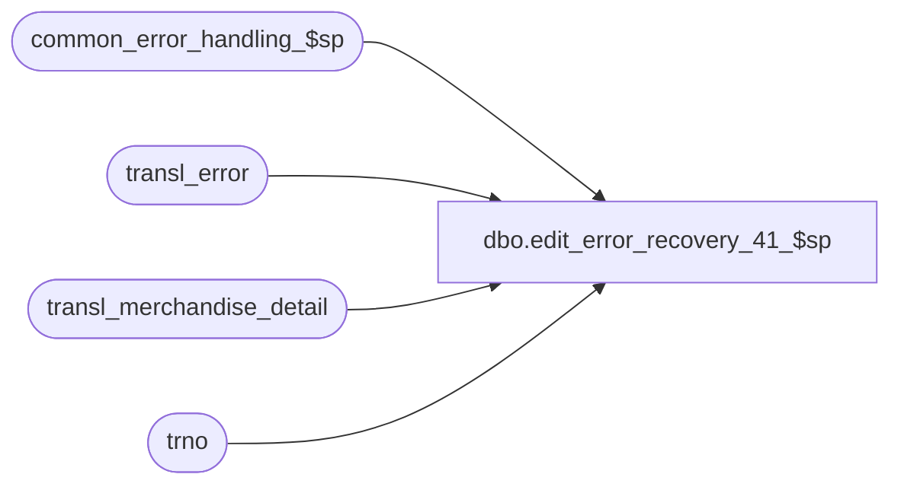

# dbo.edit_error_recovery_41_$sp

**Database:** auditworks  
**Server:** bedrockdb01  

## Architecture Diagram



## Table Dependencies

| Referenced Table |
|---|
| common_error_handling_$sp |
| transl_error |
| transl_merchandise_detail |
| trno |

## Stored Procedure Code

```sql
create proc dbo.edit_error_recovery_41_$sp 


    
@edit_process_no tinyint = 1
 AS

/* Proc Name : edit_error_recovery_41_$sp
   Version:1.00 Date:1998/11/18
   Description: To ignore duplicate lines ( caused by translate error ) and recover
   the rest of the transactions in the batch.
   Called by edit_error_recovery_$sp.

HISTORY
Date     Name		Def#  	Desc
Dec19,10 Paul           105313  Use unicode datatypes
Dec12,04 Maryam         DV-1191 Improve performance.
Nov26,01 Winnie		1-969YY	Add logic for R3 error handling
Aug31,01 Winnie		8634  	Avoid error 2601 by changing the entry_date_time from smalldatetime to datetime.
Jun29,00 Maryam         6441  	Log the error message to transl_error instead of translate_error.
Mar01,00 Phu		5900  	Change @@fetch_status > 0 to @@fetch_status <> 0 for MS SQL compatibility
Nov19,98 Andrew		author
*/

DECLARE @errmsg                 nvarchar(255),
	@errno                  int,
	@rows                   int,
	@translate_msg	        nvarchar(255),
        @violated_sareject_rule smallint,
	@min_sequence_no        numeric(12,0),
	@entry_date_time        datetime,
	@register_no            smallint,
	@store_no               int,
	@transaction_no         trno,
	@transaction_series     nchar(1),
	@line_id                numeric(5,0),
	@object_name		nvarchar(255),
	@process_name		nvarchar(100),
	@operation_name		nvarchar(100),
	@message_id		int


SELECT @violated_sareject_rule = 41,
	@translate_msg = 'Duplicate lines from the translate were skipped by the edit for merchandise',
	@process_name = 'edit_error_recovery_41_$sp',
        @message_id = 201068

CREATE TABLE #work_lines_edit (
	store_no                int not null,
	register_no             smallint not null,
	entry_date_time         datetime not null,
	transaction_series      nchar(1) not null,
	transaction_no          int not null,
	line_id	                numeric(5,0) not null,
	note_type               smallint null,
	line_count              int not null,
	min_sequence_no         numeric(12,0) not null )

SELECT @errno = @@error
IF @errno != 0
  BEGIN
   SELECT @errmsg = 'Failed to create temp table #work_lines_edit',
          @object_name = '#work_lines_edit',
          @operation_name = 'CREATE'
   GOTO error
  END

BEGIN TRAN

INSERT #work_lines_edit (
	store_no,
	register_no,
	entry_date_time,
	transaction_series,
	transaction_no,
	line_id,
	line_count,
	min_sequence_no )
SELECT
	store_no,
	register_no,
	entry_date_time,
	transaction_series,
	transaction_no,
	line_id,
	COUNT(line_id),
	MIN(row_sequence_no)
  FROM transl_merchandise_detail WITH (NOLOCK)
  GROUP BY store_no, register_no, entry_date_time, transaction_series, transaction_no, 
	line_id

SELECT @errno = @@error
IF @errno != 0
  BEGIN
   SELECT @errmsg = 'Failed to insert to #work_lines_edit',
          @object_name = '#work_lines_edit',
          @operation_name = 'INSERT'
   GOTO error
  END

/* delete inside cursor */

DECLARE dup_tran_crsr CURSOR FAST_FORWARD
FOR
SELECT store_no,
	register_no,
	entry_date_time,
	transaction_no,
	transaction_series,
	line_id,
	min_sequence_no	
    FROM #work_lines_edit WITH (NOLOCK)
   WHERE line_count >= 2


OPEN dup_tran_crsr


SELECT @errno = @@error
IF @errno != 0
  BEGIN
   SELECT @errmsg = 'Failed to open cursor dup_tran_crsr',
          @object_name = 'dup_tran_crsr',
          @operation_name = 'OPEN'
   GOTO error
  END


/* Delete all except first ocurrence of each duplicate row */

WHILE 1=1
  BEGIN

  FETCH dup_tran_crsr INTO
	@store_no,
	@register_no,
	@entry_date_time,
	@transaction_no,
	@transaction_series,
	@line_id,	
	@min_sequence_no

  IF @@fetch_status <> 0
    BREAK

  DELETE transl_merchandise_detail
    WHERE store_no           = @store_no
      AND register_no        = @register_no
      AND entry_date_time    = @entry_date_time
      AND transaction_series = @transaction_series
      AND transaction_no     = @transaction_no
     AND line_id            = @line_id
      AND row_sequence_no    > @min_sequence_no

  SELECT @errno = @@error
  IF @errno != 0
    BEGIN
     SELECT @errmsg = 'Failed to delete duplicate rows from transl_merchandise_detail',
            @object_name = 'transl_merchandise_detail',
            @operation_name = 'DELETE'
     GOTO error
    END

  END /* While 1=1 */


INSERT transl_error (
	store_no,
	register_no,
	entry_date_time,
	transaction_series,
	transaction_no,
	line_id,
	transl_reject_reason,  
	posting_end_date_time,
	transl_error_msg)
SELECT
	store_no,
	register_no,
	entry_date_time,
	transaction_series,
	transaction_no,
	line_id,
	@violated_sareject_rule + 100,
	getdate(),
	@translate_msg
  FROM #work_lines_edit WITH (NOLOCK)
  WHERE line_count >= 2

SELECT @errno = @@error
IF @errno != 0
  BEGIN
   SELECT @errmsg = 'Failed to insert to transl_error',
          @object_name = 'transl_error',
          @operation_name = 'INSERT'
   GOTO error
  END


COMMIT TRAN -- to minimize log i/o

CLOSE dup_tran_crsr
DEALLOCATE dup_tran_crsr

RETURN

error:
	EXEC common_error_handling_$sp 4, @errno, @errmsg, 0, @message_id, 
	@process_name, @object_name, @operation_name, 1, @edit_process_no
	RETURN
```

