# dbo.edit_insert_header_lines_$sp

**Database:** auditworks  
**Server:** bedrockdb01  

## Architecture Diagram

```mermaid
flowchart LR
    SP["dbo.edit_insert_header_lines_$sp"]
    audit_status(["audit_status"]) --> SP
    auditworks_parameter(["auditworks_parameter"]) --> SP
    authorization_detail(["authorization_detail"]) --> SP
    common_error_handling__sp(["common_error_handling_$sp"]) --> SP
    customer(["customer"]) --> SP
    customer_detail(["customer_detail"]) --> SP
    discount_detail(["discount_detail"]) --> SP
    edit_error_recovery__sp(["edit_error_recovery_$sp"]) --> SP
    geninfo_detail(["geninfo_detail"]) --> SP
    geninfo_lookup(["geninfo_lookup"]) --> SP
    line_note(["line_note"]) --> SP
    line_object(["line_object"]) --> SP
    merchandise_detail(["merchandise_detail"]) --> SP
    post_void_detail(["post_void_detail"]) --> SP
    return_detail(["return_detail"]) --> SP
    sa_rejection_reason(["sa_rejection_reason"]) --> SP
    stock_control_detail(["stock_control_detail"]) --> SP
    store_audit_status(["store_audit_status"]) --> SP
    tax_override_detail(["tax_override_detail"]) --> SP
    transaction_header(["transaction_header"]) --> SP
    transaction_header_deadlock(["transaction_header_deadlock"]) --> SP
    transaction_line(["transaction_line"]) --> SP
    transl_authorization_detail(["transl_authorization_detail"]) --> SP
    transl_customer(["transl_customer"]) --> SP
    transl_customer_detail(["transl_customer_detail"]) --> SP
    transl_discount_detail(["transl_discount_detail"]) --> SP
    transl_geninfo_detail(["transl_geninfo_detail"]) --> SP
    transl_line_note(["transl_line_note"]) --> SP
    transl_post_void_detail(["transl_post_void_detail"]) --> SP
    transl_return_detail(["transl_return_detail"]) --> SP
    transl_stock_control_detail(["transl_stock_control_detail"]) --> SP
    transl_tax_override_detail(["transl_tax_override_detail"]) --> SP
    transl_transaction_line(["transl_transaction_line"]) --> SP
    work_merchandise_edit(["work_merchandise_edit"]) --> SP
    work_tran_header_edit(["work_tran_header_edit"]) --> SP
```



## Table Dependencies

| Referenced Table |
|---|
| audit_status |
| auditworks_parameter |
| authorization_detail |
| common_error_handling_$sp |
| customer |
| customer_detail |
| discount_detail |
| edit_error_recovery_$sp |
| geninfo_detail |
| geninfo_lookup |
| line_note |
| line_object |
| merchandise_detail |
| post_void_detail |
| return_detail |
| sa_rejection_reason |
| stock_control_detail |
| store_audit_status |
| tax_override_detail |
| transaction_header |
| transaction_header_deadlock |
| transaction_line |
| transl_authorization_detail |
| transl_customer |
| transl_customer_detail |
| transl_discount_detail |
| transl_geninfo_detail |
| transl_line_note |
| transl_post_void_detail |
| transl_return_detail |
| transl_stock_control_detail |
| transl_tax_override_detail |
| transl_transaction_line |
| work_merchandise_edit |
| work_tran_header_edit |

## Stored Procedure Code

```sql
CREATE proc  [dbo].[edit_insert_header_lines_$sp] 
@errmsg			nvarchar(2000) OUTPUT,
@edit_process_no	tinyint = 1,
@process_timestamp	float

AS

/*
   Proc Name: edit_insert_header_lines_$sp
   Desc: (EDIT) Insert transaction_header and detail tables from the transl_* work tables.
   Called by edit_post_$sp.
   
   Unicode version.

HISTORY:
Date     Author         Def# Desc
Mar15,17 Kiri      DAOM-2051 Allow a merchant to post sales to Merch based on fulfillment store. A sub-ledger segment has been configured to use posting method 25, 'Post to fulfillment store if the fulfillment store is a selling location, otherwise post to the originating store'
Jul14,16 Vicci     DAOM-1126 Don't populate geninfo_detail (which is only used to support mass correction of pending approval rejects) unless there is a rejection.
Jun13,16 Vicci      DAOM-937 If a transl_return_detail attachment date is greater than June 2079 (the max supported by a smalldatetime) it causes error 298 so ignore it if it is future.
Aug28,15 Vicci    TFS-134330 Modify Edit to auto-create a Lookup POS Code attachment if the Lookup POS Code of the transaction line does not correspond 
                             to that of the line object and pertains to an order/layaway creation line (to support recovery scenarios for Orders see I-service SR 1-266979074).
JUL22,15 Daphna       131151 Expand the length of the column for tender total and amounts
Sep11,14 Vicci        139695 Log unit of measure
Jul04,14 Vicci     TFS-74694 Log cost
Jan09,14 Paul         148739 Use try .. catch
May14,10 Vicci        117827 Don't default upc_lookup_division to 1 if it was null since if it was null then no
			     lookup nor validation was done and otherwise UPC NOT ON FILE errors result upon subsequent
			     attempts to modify the transaction despite there not being any attachment requiring
			     upc lookup in the transaction.
Sep30,09 Phu          111900 Set offline_flag column.
Aug17,07 Paul        DV-1363 port 90444 to SA5
Jan08,07 Paul          81764 port 81757 to SA5
Nov01,05 Paul          62153 apply DV-1298 and 61728 to SA5
Jul12,05 Paul        DV-1295 populate invalid_reference_no column, improve performance of cursor logic 
Apr20,05 David       DV-1202 Populate geninfo_detail. Log source and fulfillment store. Replace transaction_series based on lookup, use line_id.
Dec13,04 Maryam      DV-1191 Improve performance. Move temp tables and cursors to top of proc to minimize recompilation.
Jun28,04 ShuZ        DV-1071 Add without_receipt_flag when populating return_detail tables.
Aug07,07 Vicci         90444 Don't log defaults for pos dept class unless upc lookup division is set.
Jan05,07 Vicci         81757 Add error handling to DV-1202 retrofit of transaction_series update.
Dec13,06 Vicci         81260 Retrofit DV-1202.  Use lookup_transaction_series
Oct27,05 David         61728 Use transl_transaction_line.encrypted_reference_no.
Jul12,05 David       DV-1298 Log invalid_reference_no.
Feb09,04 Phu           21459 Copy sku_id, style_ref_id from transl_stock to stock to avoid null problem
Oct14,03 Paul          16484 insert line_note to correctly handle voiding lines
Apr15,03 Paul        AW-8249 populate entry_date_time in post_void_detail
Mar19,03 Paul        1-JNJU5 use sa reject reason 20 instead of 54
Oct16,02 Winnie	     1-FGPA6 Set sa_reject if no lines for a transaction.
Jun03,02 Vicci	     1-DESPL Add display_def_id to stock_control_detail
Jan30,02 Henry       AW-7611 Keep original value of media_rec_verified flag in audit_status 
			      if store/reg/date is edited again.
Mar22,02 Paul        1-BUVZ9 correctly update tender_total
Nov26,01 Winnie	     1-969YY Add logic for R3 error handling to pass @edit_process_no,
                              add convert when calculating plu_price and sold_at_price
Nov01,01 ShuZ           8900 TRANSL edit changes for Sybase
*/

DECLARE
	@cursor_open			tinyint,
	@errmsg2			nvarchar(2000),
	@errline			int,
	@errno				int,
	@media_rec_affected		tinyint,
	@message_id			int,
	@retry				tinyint,
	@register_no			smallint,
	@sales_date			smalldatetime,
	@store_no			int,
	@object_name			nvarchar(255),	
	@operation_name			nvarchar(100),
	@process_name			nvarchar(100),
	@reject_no_lines		tinyint,
	@rows				int;

SELECT 	@process_name = 'edit_insert_header_lines_$sp',
        @message_id = 201068;

BEGIN TRY
   SELECT @errmsg = 'Failed to create table #str_reg_date.',
          @object_name = '#str_reg_date',
          @operation_name = 'CREATE';
CREATE TABLE #str_reg_date (
	store_no	int not null,
	sales_date	smalldatetime not null,
	register_no	smallint not null);

   SELECT @errmsg = 'Failed to create table #str_date.',
          @object_name = '#str_date';
CREATE TABLE #str_date (
	store_no	int not null,
	sales_date	smalldatetime not null);

   SELECT @errmsg = 'Failed to INSERT into #str_reg_date',
	  @object_name = '#str_reg_date',
	  @operation_name = 'INSERT';
INSERT INTO #str_reg_date (store_no, sales_date, register_no)
SELECT DISTINCT store_no, transaction_date, register_no
  FROM work_tran_header_edit WITH (NOLOCK)
 WHERE date_reject_id = 0;

   SELECT @errmsg = 'Failed to INSERT into #str_date',
	  @object_name = '#str_date',
	  @operation_name = 'INSERT';
INSERT #str_date (store_no, sales_date)
SELECT DISTINCT store_no, sales_date
  FROM #str_reg_date WITH (NOLOCK);

--  Keep original value of media_rec_verified flag in audit_status if store/reg/date is edited again.
--   BUT, if there are trxns that affect media_rec (tenders, etc.) then will reset media_rec_verified flag = 0.
  SELECT @errmsg = 'Unable to open cursor str_reg_crsr',
	   @object_name = 'str_reg_crsr',
	   @operation_name = 'OPEN';
DECLARE str_reg_crsr CURSOR FAST_FORWARD
FOR
SELECT wh.store_no, wh.sales_date, wh.register_no
  FROM #str_reg_date wh WITH (NOLOCK), audit_status s WITH (NOLOCK)
 WHERE wh.store_no = s.store_no
   AND wh.sales_date = s.sales_date
   AND wh.register_no = s.register_no
   AND s.date_reject_id = 0
   AND s.media_rec_verified > 0;

OPEN str_reg_crsr;
SELECT @cursor_open = 1;

WHILE 1 = 1
BEGIN
  FETCH str_reg_crsr INTO
	@store_no,
	@sales_date,
	@register_no;

  IF @@fetch_status <> 0
    BREAK;

  SELECT @media_rec_affected = 0;
  IF EXISTS(SELECT 1
              FROM work_tran_header_edit th WITH (NOLOCK), transl_transaction_line tl WITH (NOLOCK)
                   WHERE tl.store_no = @store_no
                     AND tl.register_no = @register_no
                     AND tl.line_object_type = 6
                     AND tl.transaction_id = th.transaction_id
                     AND th.store_no = @store_no
                     AND th.register_no = @register_no
                     AND th.transaction_date = @sales_date)
          SELECT @media_rec_affected = 1;

  IF @media_rec_affected = 1
    BEGIN
        SELECT @errmsg = ' Unable to SET media_rec_verified = 0 for store/reg/date ',
                 @object_name = 'audit_status',
                 @operation_name = 'UPDATE';
     UPDATE audit_status
        SET media_rec_verified = 0
      WHERE sales_date = @sales_date
        AND store_no = @store_no
        AND register_no = @register_no
        AND date_reject_id = 0;
    END; -- If @media_rec_affected = 1

END; -- while 1=1

CLOSE str_reg_crsr;
DEALLOCATE str_reg_crsr;
SELECT @cursor_open = 0;

DROP TABLE #str_reg_date;

  SELECT @errmsg = 'Unable to open cursor str_crsr',
	   @object_name = 'str_crsr',
	   @operation_name = 'OPEN';
DECLARE str_crsr CURSOR FAST_FORWARD
FOR
SELECT wh.store_no, wh.sales_date
  FROM #str_date wh WITH (NOLOCK), store_audit_status s WITH (NOLOCK)
 WHERE wh.store_no = s.store_no
   AND wh.sales_date = s.sales_date
   AND s.date_reject_id = 0
   AND s.media_rec_verified > 0;

OPEN str_crsr;
SELECT @cursor_open = 2;

WHILE 2 = 2
BEGIN
  FETCH str_crsr INTO
	@store_no,
	@sales_date;

  IF @@fetch_status <> 0
    BREAK;

  SELECT @media_rec_affected = 0;
  IF EXISTS(SELECT 1
              FROM work_tran_header_edit th WITH (NOLOCK), transl_transaction_line tl WITH (NOLOCK)
                   WHERE tl.store_no = @store_no
              AND tl.line_object_type = 6
                     AND tl.transaction_id = th.transaction_id
                     AND th.store_no = @store_no
 AND th.transaction_date = @sales_date)
          SELECT @media_rec_affected = 1;

  IF @media_rec_affected = 1
    BEGIN
        SELECT @errmsg = ' Unable to SET media_rec_verified = 0 for store/date ',
                 @object_name = 'store_audit_status',
                 @operation_name = 'UPDATE';
     UPDATE store_audit_status
        SET media_rec_verified = 0
      WHERE sales_date = @sales_date
        AND store_no = @store_no
        AND date_reject_id = 0;
    END; -- If @media_rec_affected = 1

END; -- while 2=2

CLOSE str_crsr;
DEALLOCATE str_crsr;

SELECT @cursor_open = 0, @retry = 0;

DROP TABLE #str_date;

/* INSERT TRANSACTION LINE */

          SELECT @rows = 0,
                 @errmsg = 'Failed to insert rows into transaction_line',
                 @object_name = 'transaction_line',
                 @operation_name = 'INSERT';
WHILE @retry <= 1
BEGIN
  BEGIN TRY
    INSERT INTO transaction_line (
		transaction_id,
		line_id,
		line_sequence,
		line_object_type,
		line_object,
		line_action,
		gross_line_amount,
		pos_discount_amount,
		db_cr_none,
		attachment_qty,
		line_void_flag,
		voiding_reversal_flag,
		reference_type,
		discountable_group,
		reference_no,
		invalid_reference_no,
		unit_of_measure )
	SELECT transaction_id,
		line_id,
		line_id * 100 + 50,
		ISNULL(line_object_type,0),
		line_object,
		line_action,
		gross_line_amount,
		pos_discount_amount,
		ISNULL(db_cr_none,0),
		attachment_qty,
		line_void_flag,
		voiding_reversal_flag,
		ISNULL(reference_type,0),
		ISNULL(discountable_group,0),
		IsNull(encrypted_reference_no, reference_no),
		CASE WHEN encrypted_reference_no IS NOT NULL -- Only log invalid ref# if ref# needs encryption.
		  THEN reference_no --> will be null if ref# needs encryption AND is valid.
		  ELSE NULL
		END,
		unit_of_measure
	   FROM transl_transaction_line WITH (NOLOCK)
	  WHERE transaction_id IS NOT NULL;  

    SELECT @rows = @@rowcount, @errno = 0, @retry = 2;
  END TRY
  BEGIN CATCH;
	SELECT @errno = ERROR_NUMBER();
  END CATCH;

  IF @errno != 0
      BEGIN
       IF @errno = 2601 /* duplicate key */
         AND @retry = 0
         BEGIN
             SELECT @errmsg = 'Failed to execute stored proc edit_error_recovery_$sp 50',
                    @object_name = 'edit_error_recovery_$sp 50',
                    @operation_name = 'EXEC';
          EXEC edit_error_recovery_$sp 50, @edit_process_no;
          SELECT @retry = @retry + 1; /* retry only once */
         END;
       ELSE -- @error != 2601
          GOTO business_error;
      END;
    ELSE
      BEGIN -- @errno = 0
        IF @rows = 0 
          BEGIN
                SELECT @errmsg = 'Failed to select from auditworks_parameter.',
                       @object_name = 'auditworks_parameter',
                       @operation_name = 'SELECT';
            SELECT @reject_no_lines = ISNULL(CONVERT(TINYINT, par_value),1)
              FROM auditworks_parameter
             WHERE par_name = 'sa_reject_when_no_lines';

            IF @reject_no_lines = 2
              BEGIN
                    SELECT @errmsg = 'Failed to update work_tran_header_edit',
                           @object_name = 'work_tran_header_edit',
                           @operation_name = 'UPDATE' ;
                UPDATE work_tran_header_edit
                   SET sa_rejection_flag = 1; -- all transactions

           	    SELECT @errmsg = 'Failed to insert sa_rejection_reason (20)',
		 @object_name = 'sa_rejection_reason',
		           @operation_name = 'INSERT';
                INSERT INTO sa_rejection_reason
                       (transaction_id,
                       line_id,
       		       violated_sareject_rule)
    	        SELECT transaction_id,
		       0,
		       20
		  FROM work_tran_header_edit WITH (NOLOCK);

               END; -- IF @reject_no_lines = 2
          END; -- IF @rows = 0 
      END;
END; --@retry <= 1

/* UPDATE TRANSACTION_HEADER */

SELECT @errno = 0,
	    @errmsg = 'Failed to update transaction_header_deadlock.',
	    @object_name = 'transaction_header_deadlock',
	    @operation_name = 'UPDATE';

BEGIN TRY
BEGIN TRANSACTION;

UPDATE transaction_header_deadlock
  SET function_no = 1;

      SELECT @errmsg = 'Failed to update transaction_header.',
             @object_name = 'transaction_header';
UPDATE transaction_header
  SET media_count_flag = wh.media_count_flag,
	 employee_no = wh.employee_no,
	 customer_info_exists = ISNULL(wh.customer_info_exists,0),
	 sa_rejection_flag = ISNULL(wh.sa_rejection_flag,0),
	 cashier_no = wh.cashier_no,
	 transaction_void_flag = wh.transaction_void_flag,
	 tender_total = wh.tender_total,
	 transaction_series = wh.lookup_transaction_series
  FROM work_tran_header_edit wh WITH (NOLOCK), transaction_header th
 WHERE wh.transaction_id = th.transaction_id
   AND (wh.tender_total != 0
          OR wh.media_count_flag = 1
          OR wh.customer_info_exists = 1
          OR wh.sa_rejection_flag = 1
          OR wh.employee_no != th.employee_no
          OR wh.cashier_no != th.cashier_no
          OR wh.transaction_void_flag != th.transaction_void_flag
          OR wh.lookup_transaction_series != th.transaction_series);
END TRY
BEGIN CATCH;
	SELECT @errno = ERROR_NUMBER();
END CATCH;

IF @errno != 0
BEGIN
  IF @errno = 2601  --handle rare case where transaction_series cannot be updated without causing one or more duplicate transactions
    BEGIN -- avoid changing tran series when another tran already exists with same s/r/d/entry_date_time/trno/series

        SELECT @errmsg = 'Failed to turn off transaction_series update.',
           @object_name = 'work_tran_header_edit',
               @operation_name = 'UPDATE';
      UPDATE work_tran_header_edit
         SET lookup_transaction_series = wh.transaction_series
        FROM work_tran_header_edit wh, transaction_header th
       WHERE wh.lookup_transaction_series != wh.transaction_series
         AND wh.store_no = th.store_no
         AND wh.register_no = th.register_no
         AND wh.entry_date_time = th.entry_date_time
         AND wh.transaction_no = th.transaction_no
         AND wh.lookup_transaction_series = th.transaction_series
         AND wh.transaction_id <> th.transaction_id; -- a different tran already exists with the same primary key

        SELECT @errmsg = 'Failed to update transaction_header (2)',
               @object_name = 'transaction_header';
      UPDATE transaction_header -- try again
         SET media_count_flag = wh.media_count_flag,
   	     employee_no = wh.employee_no,
	     customer_info_exists = ISNULL(wh.customer_info_exists,0),
	     sa_rejection_flag = ISNULL(wh.sa_rejection_flag,0),
	     cashier_no = wh.cashier_no,
	     transaction_void_flag = wh.transaction_void_flag,
	     tender_total = wh.tender_total,
  	     transaction_series = wh.lookup_transaction_series
        FROM work_tran_header_edit wh, transaction_header th
       WHERE wh.transaction_id = th.transaction_id
         AND (   wh.tender_total != 0
            OR wh.media_count_flag = 1
            OR wh.customer_info_exists = 1
            OR wh.sa_rejection_flag = 1
            OR wh.employee_no != th.employee_no
            OR th.cashier_no != wh.cashier_no
            OR th.transaction_void_flag != wh.transaction_void_flag
            OR wh.lookup_transaction_series != th.transaction_series);

 END;
   ELSE -- not 2601
      GOTO business_error;
  END; -- If @errno != 0

COMMIT TRANSACTION;

/* INSERT MERCHANDISE_DETAIL (dup is handled in edit_merchandise_$sp) */

          SELECT @errmsg = 'Failed to insert merchandise_detail.',
                 @object_name = 'merchandise_detail',
                 @operation_name = 'INSERT';
INSERT INTO merchandise_detail(
	   transaction_id,
	   line_id,
	   merchandise_category,
	   upc_lookup_division,
	   upc_no,
	   units,
	   salesperson,
	   salesperson2,
	   sku_id,
	   style_reference_id,
	   class_code,
	   subclass_code,
	   price_override,
	   pos_iplu_missing,
	   upc_on_file_flag,
	   salesperson_on_file_flag,
	   salesperson2_on_file_flag,
	   pos_deptclass,
	   ticket_price,
	   sold_at_price,
	   scanned,
	   pos_identifier,
	   pos_identifier_type,
           plu_price,
           originating_store_no,
           source_store_no,
	   fulfillment_store_no,
	   cost)
SELECT
	   transaction_id,
	   line_id,
	   merchandise_category,
	 upc_lookup_division,
	   upc_no,
	   units,
	   salesperson,
	   salesperson2,
	 sku_id,
	   style_reference_id,
	   class_code,
	   subclass_code,
	   price_override,
	   pos_iplu_missing,
	   upc_on_file_flag,
	   ISNULL(SIGN(salesperson_on_file),0),
	   salesperson2_on_file,
	   pos_deptclass,
	   CONVERT(numeric(18,4), gross_line_amount / units),
	   CONVERT(numeric(18,4), net_line_amount / units),
	   scanned,
	   pos_identifier,
	   pos_identifier_type,
           CONVERT(numeric(18,4), plu_amount / units),
           originating_store_no,
           source_store_no,
	   fulfillment_store_no,
	   cost
     FROM work_merchandise_edit WITH (NOLOCK);

/* INSERT AUTH DETAIL */

SELECT @retry = 0, @errno = 0;

WHILE @retry <= 1
BEGIN
          SELECT @errmsg = 'Failed to insert rows into authorization_detail',
                 @object_name = 'authorization_detail',
                 @operation_name = 'INSERT';

  BEGIN TRY
    INSERT INTO authorization_detail (
		transaction_id,
		line_id,
		card_type,
		authorization_no,
		expiry_date,
		swipe_indicator,
		approval_message,
		license_no,
		pos_state_code,
		other_id_type,
		other_id,
		deferred_billing_date,
		deferred_billing_plan,
		customer_signature_obtained,
		offline_flag)
	 SELECT transaction_id,
		line_id,
		card_type,
		authorization_no,
		expiry_date,
		swipe_indicator,
		approval_message,
		license_no,
		pos_state_code,
		other_id_type,
		other_id,
		deferred_billing_date,
		deferred_billing_plan,
		customer_signature_obtained,
		offline_flag
	   FROM transl_authorization_detail WITH (NOLOCK)
	  WHERE transaction_id IS NOT NULL;
      SELECT @retry = 2, @errno = 0;
  END TRY
  BEGIN CATCH;
	SELECT @errno = ERROR_NUMBER();
  END CATCH;

  IF @errno != 0
      BEGIN
       IF @errno = 2601 /* duplicate key */
           AND @retry = 0
         BEGIN
             SELECT @errmsg = 'Failed to execute stored proc edit_error_recovery_$sp 42',
                    @object_name = 'edit_error_recovery_$sp 42',
                    @operation_name = 'EXEC';
          EXEC edit_error_recovery_$sp 42, @edit_process_no;

          SELECT @retry = @retry + 1; /* retry only once */
         END;
       ELSE -- not 2601
          GOTO business_error;
      END;

END; -- WHile @retry <= 1

SELECT @retry = 0, @errno = 0;


/* INSERT POST VOID */

WHILE @retry <= 1
BEGIN
         SELECT @errmsg = 'Failed to insert rows into post_void_detail',
                @object_name = 'post_void_detail',
                @operation_name = 'INSERT';
  BEGIN TRY
   INSERT INTO post_void_detail (
	  transaction_id,
	  line_id,
	  post_voided_register,
	  post_voided_trans_no,
	  post_void_successful,
	  post_void_reason_code,
	  entry_date_time)
  SELECT wh.transaction_id,
	  line_id,
	  post_voided_register,
	  post_voided_trans_no,
	  post_void_successful,
	  post_void_reason_code,
	  wh.entry_date_time
     FROM transl_post_void_detail pv WITH (NOLOCK), work_tran_header_edit wh WITH (NOLOCK)
    WHERE pv.store_no = wh.store_no
      AND pv.register_no = wh.register_no
      AND pv.entry_date_time = wh.entry_date_time
      AND pv.transaction_series = wh.transaction_series
      AND pv.transaction_no = wh.transaction_no;
    SELECT @retry = 2, @errno = 0;    
  END TRY
  BEGIN CATCH;
	SELECT @errno = ERROR_NUMBER();
  END CATCH;

  IF @errno != 0
      BEGIN
       IF @errno = 2601 /* duplicate key */
           AND @retry = 0
         BEGIN
  SELECT @errmsg = 'Failed to execute stored proc edit_error_recovery_$sp 45',
                    @object_name = 'edit_error_recovery_$sp 45',
                    @operation_name = 'EXEC';
          EXEC edit_error_recovery_$sp 45, @edit_process_no;

          SELECT @retry = @retry + 1; /* retry only once */
 END;
      ELSE -- not 2601
        GOTO business_error;
      END;

END; --@retry <= 1

SELECT @retry = 0, @errno = 0;


/* INSERT CUSTOMER */

    SELECT @errmsg = 'Failed to insert customer.',
           @object_name = 'customer',
           @operation_name = 'INSERT';
 INSERT INTO customer (
   transaction_id,
   line_id,
   customer_role,
   title,
   first_name,
   last_name,
   address_1,
   address_2,
   city,
   county,
   state,
   country,
   post_code,
   telephone_no1,
   telephone_no2,
   customer_no,
   more_info_flag,
   customer_sufficient,
   pos_tax_jurisdiction_code, 
   fax,
   email_address)
SELECT wh.transaction_id,
   tc.line_id,
   tc.customer_role,
   title,
   first_name,
   last_name,
   address_1,
   address_2,
   city,
   county,
   state,
   country,
   post_code,
   telephone_no1,
   telephone_no2,
   customer_no,
   ISNULL(more_info_flag,0),
   ISNULL(customer_sufficient,0),
   pos_tax_jurisdiction_code, 
   fax,
   email_address
FROM transl_customer tc WITH (NOLOCK), work_tran_header_edit wh WITH (NOLOCK)
WHERE wh.store_no = tc.store_no
AND wh.register_no = tc.register_no
AND wh.entry_date_time = tc.entry_date_time
AND wh.transaction_series = tc.transaction_series
AND wh.transaction_no = tc.transaction_no;

SELECT @retry = 0, @errno = 0;


/* INSERT CUSTOMER_DETAIL */

WHILE @retry <= 1
BEGIN
          SELECT @errmsg = 'Failed to insert rows into customer_detail',
                 @object_name = 'customer_detail',
                 @operation_name = 'INSERT';
  BEGIN TRY
    INSERT INTO customer_detail (
	   transaction_id,
           line_id,
           customer_role,
	   customer_info_type,
	   customer_info)
    SELECT transaction_id,
	   line_id,
	   customer_role,
	   customer_info_type,
	   customer_info
     FROM   transl_customer_detail cd WITH (NOLOCK), work_tran_header_edit wh WITH (NOLOCK)
    WHERE  wh.store_no = cd.store_no
      AND  wh.register_no = cd.register_no
      AND  wh.entry_date_time = cd.entry_date_time
      AND  wh.transaction_series = cd.transaction_series
      AND  wh.transaction_no = cd.transaction_no;
    SELECT @retry = 2, @errno = 0;    
  END TRY
  BEGIN CATCH;
	SELECT @errno = ERROR_NUMBER();
  END CATCH;

  IF @errno != 0
      BEGIN
       IF @errno = 2601 /* duplicate key */
           AND @retry = 0
         BEGIN
             SELECT @errmsg = 'Failed to execute stored proc edit_error_recovery_$sp 52',
                    @object_name = 'edit_error_recovery_$sp 52',
                    @operation_name = 'EXEC';
          EXEC edit_error_recovery_$sp 52, @edit_process_no;

          SELECT @retry = @retry + 1; /* retry only once */
         END
      ELSE
          GOTO business_error;
      END;

END; --@retry <= 1

SELECT @retry = 0, @errno = 0;


/* INSERT TAX_OVERRIDE_DETAIL */

WHILE @retry <= 1
BEGIN
          SELECT @errmsg = 'Failed to insert rows into tax_override_detail',
                 @object_name = 'tax_override_detail',
                 @operation_name = 'INSERT';
  BEGIN TRY
    INSERT INTO tax_override_detail (
	   transaction_id,
	   line_id,
	   tax_level,
	   tax_category,
	   taxable,
	   exception_tax_jurisdiction,
	   tax_exempt_no)
    SELECT transaction_id,
	   line_id,
	   tax_level,
	   tax_category,
	   taxable,
	   SUBSTRING(exception_tax_jurisdiction, 1, 5),
	   tax_exempt_no
      FROM transl_tax_override_detail WITH (NOLOCK)
     WHERE transaction_id IS NOT NULL;  
    SELECT @retry = 2, @errno = 0;    
  END TRY
  BEGIN CATCH;
	SELECT @errno = ERROR_NUMBER();
  END CATCH;

  IF @errno != 0
      BEGIN
     IF @errno = 2601 /* duplicate key */
           AND @retry = 0
         BEGIN
             SELECT @errmsg = 'Failed to execute stored proc edit_error_recovery_$sp 48',
                    @object_name = 'edit_error_recovery_$sp 48',
                    @operation_name = 'EXEC';
          EXEC edit_error_recovery_$sp 48, @edit_process_no;

          SELECT @retry = @retry + 1; /* retry only once */
         END;
       ELSE
  GOTO business_error;
      END;

END; --@retry <= 1

SELECT @retry = 0, @errno = 0;


/* INSERT DISCOUNT_DETAIL */

WHILE @retry <= 1
BEGIN
          SELECT @errmsg = 'Failed to insert rows into discount_detail',
                 @object_name = 'discount_detail',
                 @operation_name = 'INSERT';
  BEGIN TRY
    INSERT INTO discount_detail (
		transaction_id,
		line_id,
		applied_by_line_id,
		pos_discount_level,
		pos_discount_type,
		pos_discount_amount,
		applied_flag,
		pos_discount_serial_no)
	SELECT	transaction_id,
		line_id,
		applied_by_line_id,
		pos_discount_level,
		pos_discount_type,
		ABS(pos_discount_amount-pos_discount_amount_adj) * discount_amount_sign,
		ISNULL(applied_flag,0),
		pos_discount_serial_no
	   FROM transl_discount_detail WITH (NOLOCK)
	  WHERE transaction_id IS NOT NULL; 
    SELECT @retry = 2, @errno = 0;    
  END TRY
  BEGIN CATCH;
	SELECT @errno = ERROR_NUMBER();
  END CATCH;

  IF @errno != 0
      BEGIN
       IF @errno = 2601 /* duplicate key */
           AND @retry = 0
         BEGIN
             SELECT @errmsg = 'Failed to execute stored proc edit_error_recovery_$sp 47',
                    @object_name = 'edit_error_recovery_$sp 47',
                    @operation_name = 'EXEC';
          EXEC edit_error_recovery_$sp 47, @edit_process_no;

          SELECT @retry = @retry + 1; /* retry only once */
         END
       ELSE
          GOTO business_error;
      END;

END; --@retry <= 1

SELECT @retry = 0, @errno = 0;

/* INSERT RETURN_DETAIL */


WHILE @retry <= 1
BEGIN
          SELECT @errmsg = 'Failed to insert rows into return_detail',
                 @object_name = 'return_detail',
              @operation_name = 'INSERT';
  BEGIN TRY
    INSERT INTO return_detail (
	   transaction_id,
	   line_id,
	   return_reason_message,
	   return_reason_code,
	   mdse_disposition_code,
	   via_warehouse_flag,
	   original_salesperson,
	   original_salesperson2,
	   return_from_store,
	   return_from_reg,
	   return_from_date,
	   return_from_transno,
	   without_receipt_flag)
    SELECT transaction_id,
	   line_id,
	   return_reason_message,
	   return_reason_code,
	   mdse_disposition_code,
	   via_warehouse_flag,
	   original_salesperson,
	   original_salesperson2,
	   return_from_store,
	   return_from_reg,
	   CASE WHEN return_from_date > dateadd(dd, 1, getdate()) THEN NULL ELSE return_from_date END,
	   return_from_transno,
	   without_receipt_flag
      FROM transl_return_detail WITH (NOLOCK)
     WHERE transaction_id IS NOT NULL;  
    SELECT @retry = 2, @errno = 0;    
  END TRY
  BEGIN CATCH;
	SELECT @errno = ERROR_NUMBER();
  END CATCH;

  IF @errno != 0
      BEGIN
       IF @errno = 2601 /* duplicate key */
           AND @retry = 0
         BEGIN
             SELECT @errmsg = 'Failed to execute stored proc edit_error_recovery_$sp 49',
                    @object_name = 'edit_error_recovery_$sp 49',
                    @operation_name = 'EXEC';
          EXEC edit_error_recovery_$sp 49, @edit_process_no;

          SELECT @retry = @retry + 1; /* retry only once */
         END;
       ELSE
          GOTO business_error;
      END;

END; --@retry <= 1

SELECT @retry = 0, @errno = 0;

/* INSERT STOCK_CONTROL_DETAIL */


WHILE @retry <= 1
BEGIN
          SELECT @errmsg = 'Failed to insert rows into stock_control_detail',
                 @object_name = 'stock_control_detail',
                 @operation_name = 'INSERT';
  BEGIN TRY
 INSERT INTO stock_control_detail
  (transaction_id,
	   line_id,
	   upc_no,
	   merchandise_key,
	   initiated_by_host,
	   units,
	   other_store_no,
	   location_no,
	   vendor_no,
	   count_date,
	   upc_on_file_flag,
	   store_on_file_flag,
       pos_identifier,
       pos_identifier_type,
 pos_deptclass,
          upc_lookup_division,
           originating_store_no,
 display_def_id,
           sku_id,
           reason,
           imrd,
         style_reference_id )
    SELECT transaction_id,
	   line_id,
	   upc_no,
	   merchandise_key,
	   initiated_by_host,
	   units,
	   other_store_no,
	   location_no,
	   vendor_no,
	   count_date,
	   ISNULL(upc_on_file_flag,0),
	   store_on_file_flag,
           pos_identifier,
           CASE WHEN upc_lookup_division > 0 THEN ISNULL(pos_identifier_type,1) ELSE pos_identifier_type END,
           CASE WHEN upc_lookup_division > 0 THEN ISNULL(pos_deptclass, 0) ELSE pos_deptclass END,
           ISNULL(upc_lookup_division, 0),
           originating_store_no,
           display_def_id,
           sku_id,
           reason,
           imrd,
           style_reference_id
      FROM transl_stock_control_detail WITH (NOLOCK)
     WHERE transaction_id IS NOT NULL; 

    SELECT @retry = 2, @errno = 0;    
  END TRY
  BEGIN CATCH;
	SELECT @errno = ERROR_NUMBER();
  END CATCH;

  IF @errno != 0
      BEGIN
       IF @errno = 2601 /* duplicate key */
           AND @retry = 0
         BEGIN
             SELECT @errmsg = 'Failed to execute stored proc edit_error_recovery_$sp 43',
                    @object_name = 'edit_error_recovery_$sp 43',
                    @operation_name = 'EXEC';
          EXEC edit_error_recovery_$sp 43, @edit_process_no;

          SELECT @retry = @retry + 1; /* retry only once */
         END;
       ELSE
          GOTO business_error;
      END;

END; --@retry <= 1

SELECT @retry = 0, @errno = 0;

/* INSERT LINE_NOTE */

WHILE @retry <= 1
BEGIN
          SELECT @errmsg = 'Failed to insert rows into line_note',
	         @object_name = 'line_note',
	         @operation_name = 'INSERT';
  BEGIN TRY
    INSERT line_note (
	transaction_id,
	line_id,
	note_type,
	line_note )
    SELECT
	wh.transaction_id,
	line_id,
	note_type,
	line_note 
      FROM  transl_line_note ln WITH (NOLOCK), work_tran_header_edit wh WITH (NOLOCK)
     WHERE wh.store_no = ln.store_no
       AND wh.register_no = ln.register_no
       AND wh.entry_date_time = ln.entry_date_time
       AND wh.transaction_series = ln.transaction_series
       AND wh.transaction_no = ln.transaction_no;
    SELECT @retry = 2, @errno = 0;    
  END TRY
  BEGIN CATCH;
	SELECT @errno = ERROR_NUMBER();
  END CATCH;

  IF @errno != 0
      BEGIN
       IF @errno = 2601 /* duplicate key */
           AND @retry = 0
         BEGIN
             SELECT @errmsg = 'Failed to execute stored proc edit_error_recovery_$sp 53',
	                @object_name = 'edit_error_recovery_$sp',
		        @operation_name = 'EXECUTE';
          EXEC edit_error_recovery_$sp 53, @edit_process_no;

          SELECT @retry = @retry + 1; /* retry only once */
         END;
       ELSE
          GOTO business_error;
      END;

END; /* While @retry <= 1 */

SELECT @retry = 0, @errno = 0;  

--134330
SELECT @errmsg = 'Failed to create Lookup POS Code attachments for order create lines with a lookup pos code different than that of the line object',
       @object_name = 'transl_line_note',
       @operation_name = 'INSERT';
INSERT line_note (
       transaction_id,
       line_id,
       note_type,
       line_note )
SELECT l.transaction_id,
       l.line_id,
       9024,  --Lookup POS code
       l.lookup_pos_code
  FROM transl_transaction_line l WITH (NOLOCK)
       INNER JOIN line_object o WITH (NOLOCK)
          ON l.line_object = o.line_object
       LEFT OUTER JOIN line_note n WITH (NOLOCK)
          ON l.transaction_id = n.transaction_id
       AND l.line_id = n.line_id
         AND n.note_type = 9024
 WHERE l.transaction_id IS NOT NULL
   AND l.lookup_pos_code IS NOT NULL
   AND l.line_action = 38
   AND l.line_object_type = 20
   AND l.lookup_pos_code <> COALESCE(o.lookup_pos_code, '-') 
   AND l.lookup_pos_code <> COALESCE(o.lookup_partial_pos_code, '-') 
   AND n.transaction_id IS NULL

/* INSERT GEN_INFO */


    SELECT @errmsg = 'Failed to populate geninfo_detail from transl_geninfo_detail.',
           @object_name = 'geninfo_detail',
           @operation_name = 'INSERT';

INSERT INTO geninfo_detail(transaction_id,
                           line_id,
                           display_def_id,
                           form_name,
                           field_name,
                           field_datatype,
                           field_data_string,
                           field_data_date,
                           field_data_num)
SELECT DISTINCT
       wh.transaction_id,
       gd.line_id,
       gd.display_def_id,
       gd.form_name,
       gd.field_name,
       gd.field_datatype,
       gd.field_data_string,
       gd.field_data_date,
       gd.field_data_num
  FROM transl_geninfo_detail gd, work_tran_header_edit wh WITH (NOLOCK), sa_rejection_reason rr WITH (NOLOCK), geninfo_lookup gl WITH (NOLOCK)
 WHERE gd.store_no           = wh.store_no
   AND gd.register_no        = wh.register_no
   AND gd.entry_date_time    = wh.entry_date_time
   AND gd.transaction_no     = wh.transaction_no
   AND gd.transaction_series = wh.transaction_series
   AND wh.transaction_id = rr.transaction_id
   AND rr.violated_sareject_rule = 18
   AND gd.line_id = rr.line_id
   AND gd.form_name  = gl.form_name
   AND gd.field_name = gl.field_name
   AND gl.auto_config_verified = 0

RETURN;


business_error:   /* Business Rule handler. */

	SELECT @errmsg2 = @errmsg;

	/* Could include similar cleanup code to system error trap when needed (example is from move_store_$sp).
	   However, could also exclude the cleanup code here since the outer system error catch should fire again after the exec below. */

	EXEC common_error_handling_$sp 4, @errno, @errmsg, 0, @message_id, 
	  @process_name, @object_name, @operation_name, 1, @edit_process_no;
	  /* Note: when the exec above raises an error, that action also fires the system error trap (below) */
	RETURN;
END TRY

BEGIN CATCH; -- trap system errors
    /* common error handling. Appending proc name here because a rollback could occur if called within a transaction. */

        SELECT @errno = ERROR_NUMBER(),
		@errline = ERROR_LINE();

        SELECT @errmsg = CONVERT(nvarchar, @errno) + ':' + @process_name + ':' + CONVERT(nvarchar, @errline) + ':'
               + COALESCE(@errmsg, ' ') + ':' + ERROR_MESSAGE();

	 /* this condition will only be true when raise error in traps above fire this general catch */
	IF @errmsg2 IS NOT NULL
	  SELECT @errmsg = @errmsg2;

	IF @cursor_open = 1
	 BEGIN
	   CLOSE str_reg_crsr;
	   DEALLOCATE str_reg_crsr;
	 END;

	IF @cursor_open = 2
	 BEGIN
	   CLOSE str_crsr;
	   DEALLOCATE str_crsr;
	 END;

	EXEC common_error_handling_$sp 4, @errno, @errmsg, 0, @message_id, 
	  @process_name, @object_name, @operation_name, 1, @edit_process_no;

	RETURN;
END CATCH;
```

