# dbo.edit_load_input_$sp

**Database:** auditworks  
**Server:** bedrockdb01  

## Architecture Diagram

```mermaid
flowchart LR
    SP["dbo.edit_load_input_$sp"]
    auditworks_parameter(["auditworks_parameter"]) --> SP
    common_error_handling__sp(["common_error_handling_$sp"]) --> SP
    edit_post__sp(["edit_post_$sp"]) --> SP
    edit_status(["edit_status"]) --> SP
    input_authorization_detail(["input_authorization_detail"]) --> SP
    input_customer(["input_customer"]) --> SP
    input_customer_detail(["input_customer_detail"]) --> SP
    input_discount_detail(["input_discount_detail"]) --> SP
    input_geninfo_detail(["input_geninfo_detail"]) --> SP
    input_line_note(["input_line_note"]) --> SP
    input_merchandise_detail(["input_merchandise_detail"]) --> SP
    input_payroll_detail(["input_payroll_detail"]) --> SP
    input_post_void_detail(["input_post_void_detail"]) --> SP
    input_processing_status(["input_processing_status"]) --> SP
    input_return_detail(["input_return_detail"]) --> SP
    input_special_order_detail(["input_special_order_detail"]) --> SP
    input_stock_control_detail(["input_stock_control_detail"]) --> SP
    input_tax_override_detail(["input_tax_override_detail"]) --> SP
    input_transaction_hdr(["input_transaction_hdr"]) --> SP
    input_transaction_line(["input_transaction_line"]) --> SP
    input_transaction_line_link(["input_transaction_line_link"]) --> SP
    interface_status(["interface_status"]) --> SP
    parameter_general(["parameter_general"]) --> SP
    smartload_var(["smartload_var"]) --> SP
    transl_authorization_detail(["transl_authorization_detail"]) --> SP
    transl_auto_complete_order__sp(["transl_auto_complete_order_$sp"]) --> SP
    transl_customer(["transl_customer"]) --> SP
    transl_customer_detail(["transl_customer_detail"]) --> SP
    transl_discount_detail(["transl_discount_detail"]) --> SP
    transl_geninfo_detail(["transl_geninfo_detail"]) --> SP
    transl_line_note(["transl_line_note"]) --> SP
    transl_merchandise_detail(["transl_merchandise_detail"]) --> SP
    transl_payroll_detail(["transl_payroll_detail"]) --> SP
    transl_post_void_detail(["transl_post_void_detail"]) --> SP
    transl_processing_status(["transl_processing_status"]) --> SP
    transl_return_detail(["transl_return_detail"]) --> SP
    transl_special_order_detail(["transl_special_order_detail"]) --> SP
    transl_stock_control_detail(["transl_stock_control_detail"]) --> SP
    transl_tax_override_detail(["transl_tax_override_detail"]) --> SP
    transl_transaction_hdr(["transl_transaction_hdr"]) --> SP
    transl_transaction_line(["transl_transaction_line"]) --> SP
    transl_transaction_line_link(["transl_transaction_line_link"]) --> SP
```



## Table Dependencies

| Referenced Table |
|---|
| auditworks_parameter |
| common_error_handling_$sp |
| edit_post_$sp |
| edit_status |
| input_authorization_detail |
| input_customer |
| input_customer_detail |
| input_discount_detail |
| input_geninfo_detail |
| input_line_note |
| input_merchandise_detail |
| input_payroll_detail |
| input_post_void_detail |
| input_processing_status |
| input_return_detail |
| input_special_order_detail |
| input_stock_control_detail |
| input_tax_override_detail |
| input_transaction_hdr |
| input_transaction_line |
| input_transaction_line_link |
| interface_status |
| parameter_general |
| smartload_var |
| transl_authorization_detail |
| transl_auto_complete_order_$sp |
| transl_customer |
| transl_customer_detail |
| transl_discount_detail |
| transl_geninfo_detail |
| transl_line_note |
| transl_merchandise_detail |
| transl_payroll_detail |
| transl_post_void_detail |
| transl_processing_status |
| transl_return_detail |
| transl_special_order_detail |
| transl_stock_control_detail |
| transl_tax_override_detail |
| transl_transaction_hdr |
| transl_transaction_line |
| transl_transaction_line_link |

## Stored Procedure Code

```sql
create proc dbo.edit_load_input_$sp @batch_process_no	int, --  stream no of multistream edit
@batch_file_name	nvarchar(300) = NULL

AS
DECLARE
@aw_work_dbname		nvarchar(30),
@aw_work_prefix		nvarchar(30),
@errmsg			nvarchar(255),
@errmsg2		nvarchar(2000),
@errmsg3		nvarchar(255),
@errline		int,
@errno			int,
@row_inserted		int,
@object_name		nvarchar(255),
@process_name		nvarchar(100),
@operation_name		nvarchar(100),
@message_id		int,
@input_id		numeric(12,0),
@process_start_datetime datetime,
@process_no             smallint,
@processing_message	nvarchar(255),
@sql_command 		nvarchar(4000),
@trace_msg		nvarchar(255),
@transl_pre_processing_hook   nvarchar(100),
	@db_id				int,
	@current_db_name                nvarchar(30),
	@context_name	        	varbinary(128),
	@prior_context_info 		varbinary(128);


/* 
PROC NAME: edit_load_input_$sp
     DESC: copy the data from all the input_ tables for the first input_id to the transl_
      views, then execute edit_post_$sp.

HISTORY:
Date	 Name           Def# Desc
Apr01,16 Vicci       DAOM-17 Add name of batch file that failed to process error logging (memo1).  
                             Since in the case of network issues the edit.ict can end up relaunching edit post prior to the prior execution 
                             of edit post having completed, raise error if edit stream is already running.
Sep22,15 Vicci    TFS-141612 Execute pre-processing hook if set.
Oct22,14 Vicci     TFS-81700 Copy merchandise attachment cost field.
Jul29,14 Vicci     TFS-79401 If an upgrade is in progress, exit immediately.
Feb17,14 Vicci        149581 Only clean up input_processing_status following an error at a status that would be rolled forward, 
                             otherwise it is still needed for recovery.
Dec20,13 Paul         147019 Use try catch since edit_post_$sp uses try catch.
Apr16,12 Vicci        133164 Load input_geninfo_detail too.
May13,10 Vicci        117827 Add indexes to transl_ tables.
Jul21,09 Vicci        109078 Call transl_auto_complete_order_$sp.  
Nov02,05 Paul          62153 apply 67128 to SA5
Sep19,05 Paul          60471 apply DV-1298 to SA5
Mar21,05 Maryam      DV-1202 Rename from_line_id to line_id.
Mar18,05 David       DV-1202 Add display_def_id input_stock_control_detail.
Mar15,05 Maryam      DV-1202 Insert into transl_transaction_line_link.
Jan20,05 Maryam/Paul DV-1191 Improve performance, populate new columns.
Jun28,04 ShuZ        DV-1071 Add without_receipt_flag when populating return_detail tables.
Oct27,05 David         61728 Populate transl_transaction_line.encrypted_reference_no.
Jul12,05 David       DV-1298 Log invalid_reference_no.
Mar11,04 Maryam        25481 check for aborted edit and call edit_post_$sp to recover.
Nov19,03 Paul          15801 populate reason, imrd in transl_stock_control_detail
Nov03,03 Paul        DV-1010 check all values in edit_status
Jul10,03 Maryam      1-KL08H clean input_processing_status after error.
Apr24,03 Paul        1-KO2HY populate till_no
Mar17,03 Paul        1-JJHUU process only the first available input_id (fixes 6083)
Feb11,03 Winnie         6083 Process the batch by one input_id at a time
Nov26,01 Winnie      1-969YY Add logic for R3 error handling
Oct10,01 ShuZ           8825 Add new columns to insert so that proc will compile
Jul12,01 BayaniD,ShuZ   8274 Home Delivery Handling

*/

SELECT 	@process_name = 'edit_load_input_$sp',
        @message_id = 201068,
        @input_id = NULL,
        @current_db_name = db_name(),
        @context_name = convert(varbinary(128), 'Edit Post ' + convert(nvarchar, IsNull(@batch_process_no, 1))),
        @prior_context_info = convert(varbinary(128), '');

BEGIN TRY

IF EXISTS ( SELECT 1
	      FROM parameter_general
	     WHERE upgrade_in_progress > 0)
BEGIN
  SELECT @trace_msg = NCHAR(13) + NCHAR(10) + ':LOG && Edit cannot execute edit_load_input_$sp:  the S/A database is currently being upgraded.  Please try again later. ' + CONVERT(nchar, getdate(), 8);
  PRINT @trace_msg;

  SELECT @message_id = 201036,
         @errno = 201500,
         @errmsg = 'The Edit cannot execute edit_load_input_$sp:  the S/A database is currently being upgraded.  Please try again later.',
         @object_name = 'parameter_general',
         @operation_name = 'SELECT';
  GOTO business_error;
END;

SELECT @errmsg = 'Unable to select from master..sysprocesses',
       @object_name = 'master..sysprocesses',
       @operation_name = 'SELECT'
SELECT @db_id = dbid
  FROM master..sysprocesses
 WHERE spid = @@spid

SELECT @errmsg = 'Unable to determine prior CONTEXT_INFO';
SELECT @prior_context_info = context_info
  FROM master..sysprocesses
 WHERE spid = @@spid
   AND dbid = @db_id
   AND db_name(dbid) = @current_db_name;
IF @prior_context_info IS NULL 
  SELECT @prior_context_info = convert(varbinary(128), '');
  
SELECT @errmsg = 'Unable to set CONTEXT_INFO';
SET CONTEXT_INFO @context_name;

IF EXISTS (SELECT 1
             FROM master..sysprocesses
            WHERE context_info = @context_name
              AND spid <> @@spid
              AND dbid = @db_id
              AND db_name(dbid) = @current_db_name)
BEGIN
  SELECT @message_id = 201682,
         @errno = 201682,
         @object_name = @process_name,
         @errmsg = 'The stored procedure ' + @process_name + ' is already running for stream ' + convert(nvarchar, @batch_process_no) + '.  Please verify.';
  GOTO business_error;
END

SELECT @input_id = MIN(input_id)
  FROM input_processing_status
WHERE status = 1;

IF @input_id IS NULL /* then */
  BEGIN
    IF EXISTS (SELECT 1         
                 FROM edit_status
                WHERE edit_process_no = @batch_process_no
                  AND edit_status = 1) --prior edit aborted
    BEGIN
          SELECT @object_name = 'edit_post_$sp',
                 @operation_name = 'EXECUTE',
                 @errmsg = 'Failed to execute edit_post_$sp. ';
      EXEC edit_post_$sp;  
      SET CONTEXT_INFO @prior_context_info;
      RETURN;   
    END; -- IF EXISTS
    SET CONTEXT_INFO @prior_context_info;
    RETURN;
  END; -- IF @input_id IS NULL

SELECT @process_start_datetime = process_start_datetime,
       @process_no = process_no,
       @processing_message = processing_message
  FROM input_processing_status WITH (NOLOCK)
 WHERE status = 1
   AND input_id = @input_id;

      SELECT @errmsg = 'Failed to INSERT transl_processing_status. ',
   	     @object_name = 'transl_processing_status',
             @operation_name = 'INSERT';
    INSERT transl_processing_status(input_id,
           process_start_datetime,
           process_no,
           processing_message)
    VALUES (@input_id,
           @process_start_datetime,
           @process_no,
           @processing_message);

   	SELECT @errmsg = 'Failed to INSERT transl_authorization_detail. ',
               @object_name = 'transl_authorization_detail';
    INSERT transl_authorization_detail (
	   store_no,
	   register_no,
	   entry_date_time,
	   transaction_series,
	   transaction_no,
	   line_id,
	   customer_signature_obtained,
	   authorization_no,
	   expiry_date,
	   swipe_indicator,
	   approval_message,
	   license_no,
	   pos_state_code,
	   other_id_type,
	   other_id,
	   card_type,
	   deferred_billing_date,
	   deferred_billing_plan,
	   offline_flag)
    SELECT store_no,
	   register_no,
	   entry_date_time,
	   transaction_series,
	   transaction_no,
	   line_id,
	   customer_signature_obtained,
	   authorization_no,
	   expiry_date,
	   swipe_indicator,
	   approval_message,
	   license_no,
	   pos_state_code,
	   other_id_type,
	   other_id,
	   card_type,
	   deferred_billing_date,
	   deferred_billing_plan,
	   offline_flag
      FROM input_authorization_detail WITH (NOLOCK)
     WHERE input_id = @input_id;
        
	SELECT @errmsg = 'Failed to INSERT transl_customer. ',
               @object_name = 'transl_customer';	
    INSERT transl_customer (
	   store_no,
  	   register_no,
	   entry_date_time,
	   transaction_series,
	   transaction_no,
	   line_id,
	   customer_role,
	   title,
	   first_name,
	   last_name,
	   address_1,
	   address_2,
	   city,
	   county,
	   state,
	   country,
	   post_code,
	   telephone_no1,
	   telephone_no2,
	   customer_no,
	   pos_tax_jurisdiction_code,
	   fax,
	   email_address)
    SELECT store_no,
	   register_no,
	   entry_date_time,
	   transaction_series,
	   transaction_no,
	   line_id,
	   customer_role,
	   title,
	   first_name,
	   last_name,
	   address_1,
	   address_2,
	   city,
	   county,
	   state,
	   country,
	   post_code,
	   telephone_no1,
	   telephone_no2,
	   customer_no,
	   pos_tax_jurisdiction_code,
	   fax,
	   email_address
      FROM input_customer WITH (NOLOCK)
     WHERE input_id = @input_id;
                     
	SELECT @errmsg = 'Failed to INSERT transl_customer_detail. ',
  	       @object_name = 'transl_customer_detail'; 
    INSERT transl_customer_detail(
 	   store_no ,
	   register_no,
	   entry_date_time,
	   transaction_series,
	   transaction_no,
	   line_id,
	   customer_role,
	   customer_info_type,
	   customer_info,
	   lookup_pos_code)
    SELECT store_no ,
	   register_no,
	   entry_date_time,
	   transaction_series,
    	   transaction_no,
	   line_id,
	   customer_role,
	   customer_info_type,
	   customer_info,
	   lookup_pos_code
      FROM input_customer_detail WITH (NOLOCK)
     WHERE input_id = @input_id;

	SELECT @errmsg = 'Failed to INSERT transl_discount_detail. ',
	       @object_name = 'transl_discount_detail'; 
    INSERT transl_discount_detail(
 	   store_no,
	   register_no,
	   entry_date_time,
	   transaction_series,
	   transaction_no,
	   line_id,
	   line_id_adj,
	   pos_discount_level,
	   pos_discount_type,
	   pos_discount_amount,
	   pos_discount_amount_adj,
	   discount_amount_sign,
	   discount_applied_flag,
	   applied_by_line_id,
	   pos_discount_serial_no)
    SELECT store_no,
	   register_no,
	   entry_date_time,
 	   transaction_series,
	   transaction_no,
	   line_id,
	   line_id_adj,
	   pos_discount_level,
	   pos_discount_type,
	   pos_discount_amount,
	   pos_discount_amount_adj,
	   discount_amount_sign,
	   discount_applied_flag,
	   applied_by_line_id,
	   pos_discount_serial_no
      FROM input_discount_detail WITH (NOLOCK)
     WHERE input_id = @input_id;

   	SELECT @errmsg = 'Failed to INSERT transl_geninfo_detail. ',
               @object_name = 'transl_geninfo_detail';
    INSERT transl_geninfo_detail (
	   store_no,
	   register_no,
	   entry_date_time,
	   transaction_series,
	   transaction_no,
	   line_id,
	 display_def_id,
	   form_name,
	   field_name,
	   field_datatype,
	   field_data_string,
	   field_data_date,
	   field_data_num)
    SELECT store_no,
	   register_no,
	   entry_date_time,
	   transaction_series,
	   transaction_no,
	   line_id,
	   display_def_id,
	   form_name,
	   field_name,
	   field_datatype,
	   field_data_string,
	   field_data_date,
	   field_data_num
      FROM input_geninfo_detail WITH (NOLOCK)
     WHERE input_id = @input_id;
        
	SELECT @errmsg = 'Failed to INSERT transl_line_note. ',
	       @object_name = 'transl_line_note';
    INSERT transl_line_note(
   	   store_no,
	   register_no,
	   entry_date_time,
	   transaction_series,
	   transaction_no,
	   line_id,
	   note_type,
	   line_note,
	   lookup_pos_code,
	   pos_description)
    SELECT store_no,
	   register_no,
	   entry_date_time,
	   transaction_series,
	   transaction_no,
	   line_id,
	   note_type,
	   line_note,
	   lookup_pos_code,
	   pos_description
   FROM input_line_note WITH (NOLOCK)
  WHERE input_id = @input_id;
        
	SELECT @errmsg = 'Failed to INSERT transl_merchandise_detail. ',
	       @object_name = 'transl_merchandise_detail'; 
    INSERT  transl_merchandise_detail(
    	    store_no,
	    register_no,
	    entry_date_time,
	    transaction_series,
	    transaction_no,
	    line_id,
	    merchandise_category,
	    upc_lookup_division,
	    upc_no,
	    units,
	    units_sign,
	    salesperson,
	    salesperson2,
	    price_override,
	    pos_iplu_missing,
	    pos_deptclass,
	    pos_no_hit_deptclass,
	    ticket_price,
	    sold_at_price,
	    pos_identifier,
	    scanned,
	    pos_identifier_type,
	    originating_store_no,
	    source_store_no,
	    fulfillment_store_no,
	    cost)
     SELECT store_no,
	    register_no,
	    entry_date_time,
	    transaction_series,
	    transaction_no,
	    line_id,
	    merchandise_category,
	    upc_lookup_division,
	    upc_no,
	    units,
	    units_sign,
	    salesperson,
	    salesperson2,
	    price_override,
	    pos_iplu_missing,
	    pos_deptclass,
	    pos_no_hit_deptclass,
	    ticket_price,
	    sold_at_price,
	    pos_identifier,
	    scanned,
	    pos_identifier_type,
	    originating_store_no,
	    source_store_no,
	    fulfillment_store_no,
	    cost
       FROM input_merchandise_detail WITH (NOLOCK)
      WHERE input_id = @input_id;

	SELECT @errmsg = 'Failed to INSERT transl_payroll_detail. ',
	       @object_name = 'transl_payroll_detail';
    INSERT  transl_payroll_detail(
  	    store_no,
	    register_no,
	    entry_date_time,
	    transaction_series,
	    transaction_no,
	    line_id,
	    employee_no,
	    payroll_date,
	    employee_payroll_id,
	    employee_type,
	    payroll_entry_type)
     SELECT store_no,
	    register_no,
	    entry_date_time,
	    transaction_series,
	    transaction_no,
	    line_id,
	    employee_no,
	    payroll_date,
	    employee_payroll_id,
	    employee_type,
	    payroll_entry_type
       FROM input_payroll_detail WITH (NOLOCK)
      WHERE input_id = @input_id;
          
	SELECT @errmsg = 'Failed to INSERT transl_post_void_detail. ',
	       @object_name = 'transl_post_void_detail';
    INSERT  transl_post_void_detail(
  	    store_no,
	    register_no,
	    entry_date_time,
	    transaction_series,
	    transaction_no,
	    line_id,
	    post_voided_register,
	    post_voided_trans_no,
	    post_void_successful,
	    post_void_reason_code,
	    lookup_pos_code,
	    pos_description)
     SELECT store_no,
	    register_no,
	    entry_date_time,
	    transaction_series,
	    transaction_no,
	    line_id,
	    post_voided_register,
	    post_voided_trans_no,
	    post_void_successful,
	    post_void_reason_code,
	    lookup_pos_code,
	    pos_description
       FROM input_post_void_detail WITH (NOLOCK)
      WHERE input_id = @input_id;
        
	SELECT @errmsg = 'Failed to INSERT transl_return_detail. ',
	       @object_name = 'transl_return_detail';
    INSERT  transl_return_detail(
	    store_no,
	    register_no,
	    entry_date_time,
	    transaction_series,
	    transaction_no,
	    line_id,
	    via_warehouse_flag,
	    return_reason_message,
	    return_reason_code,
	    mdse_disposition_code,
	    return_from_store,
	    return_from_reg,
	    return_from_date,
	    return_from_transno,
	    original_salesperson,
	    original_salesperson2,
	    without_receipt_flag)
   SELECT store_no,
	    register_no,
	    entry_date_time,
	    transaction_series,
	    transaction_no,
	    line_id,
	    via_warehouse_flag,
	    return_reason_message,
	    return_reason_code,
	    mdse_disposition_code,
	    return_from_store,
	    return_from_reg,
	    return_from_date,
	    return_from_transno,
	    original_salesperson,
	    original_salesperson2,
	    without_receipt_flag
       FROM input_return_detail WITH (NOLOCK)
      WHERE input_id = @input_id;
        
	SELECT @errmsg = 'Failed to INSERT transl_special_order_detail. ',
	       @object_name = 'transl_special_order_detail';
    INSERT transl_special_order_detail(
   	   store_no,
	   register_no,
	   entry_date_time,
	   transaction_series,
	   transaction_no,
	   line_id,
	   units,
	   units_sign,
	   salesperson,
	   merchandise_description,
	   expecting_delivery_on,
	   color_description,
	   size_description,
	   width_description,
	   vendor_name,
	   vendor_style_description,
	   spo_class_description,
	   vendor_no)
    SELECT store_no,
	   register_no,
	   entry_date_time,
	   transaction_series,
	   transaction_no,
	   line_id,
	   units,
	   units_sign,
	   salesperson,
 	   merchandise_description,
	   expecting_delivery_on,
	   color_description,
	   size_description,
	   width_description,
	   vendor_name,
	   vendor_style_description,
	   spo_class_description,
	  vendor_no
      FROM input_special_order_detail WITH (NOLOCK)
     WHERE input_id = @input_id;
        
	SELECT @errmsg = 'Failed to INSERT transl_stock_control_detail. ',
	       @object_name = 'transl_stock_control_detail';
    INSERT transl_stock_control_detail(
	   store_no,
	   register_no,
	   entry_date_time,
	   transaction_series,
	   transaction_no,
	   line_id,
	   upc_no,
	   merchandise_key,
	   initiated_by_host,
	   units,
	   other_store_no,
	   location_no,
 	   vendor_no,
	   count_date,
	   pos_deptclass,
	   pos_identifier,
	   pos_identifier_type,
	   upc_lookup_division,
	   originating_store_no,
	   reason,
	   imrd,
	   lookup_pos_code,
	   pos_description,
	   lookup_pos_code_imrd,
	   pos_description_imrd,
	   lookup_pos_code_vendor,
	   display_def_id, 
	   pos_description_vendor)
    SELECT store_no,
	   register_no,
	   entry_date_time,
	   transaction_series,
	   transaction_no,
	   line_id,
	   upc_no,
	   merchandise_key,
	   initiated_by_host,
	   units,
	   other_store_no,
	   location_no,
	   vendor_no,
	   count_date,
	   pos_deptclass,
	   pos_identifier,
	   pos_identifier_type,
	   0,
	   originating_store_no,
	   reason,
	   imrd,
	   lookup_pos_code,
	   pos_description,
	 lookup_pos_code_imrd,
	   pos_description_imrd,
	   lookup_pos_code_vendor,
	   display_def_id,
	   pos_description_vendor
      FROM input_stock_control_detail WITH (NOLOCK)
     WHERE input_id = @input_id;
        
	SELECT @errmsg = 'Failed to INSERT transl_tax_override_detail. ',
	       @object_name = 'transl_tax_override_detail';
    INSERT transl_tax_override_detail(
	   store_no,
	   register_no,
	   entry_date_time,
 	   transaction_series,
	   transaction_no,
	   line_id,
	   tax_level,
	   tax_category,
	   taxable,
	   exception_tax_jurisdiction,
	   tax_exempt_no)
  SELECT store_no,
	   register_no,
	   entry_date_time,
	   transaction_series,
	   transaction_no,
	   line_id,
 	   tax_level,
	   tax_category,
	   taxable,
	   exception_tax_jurisdiction,
	   tax_exempt_no
      FROM input_tax_override_detail WITH (NOLOCK)
     WHERE input_id = @input_id;
        
	SELECT @errmsg = 'Failed to INSERT transl_transaction_line_link. ',
	       @object_name = 'transl_transaction_line_link'; 
    INSERT  transl_transaction_line_link(
  	    store_no,
	    register_no,
	    entry_date_time,
	    transaction_series,
	    transaction_no,
	    line_id,
	    linked_line_id)
     SELECT store_no,
	    register_no,
	    entry_date_time,
	    transaction_series,
	    transaction_no,
	    line_id,
	    linked_line_id
       FROM input_transaction_line_link WITH (NOLOCK)
      WHERE input_id = @input_id;
          
	SELECT @errmsg = 'Failed to INSERT transl_transaction_hdr. ',
	       @object_name = 'transl_transaction_hdr';    
    INSERT transl_transaction_hdr(
	   store_no,
	   register_no,
	   entry_date_time,
	   transaction_series,
	   transaction_no,
	   cashier_no,
	   transaction_category,
	   deposit_declaration_flag,
	   tax_jurisdiction_store,
	   pos_tax_jurisdiction,
	   trans_void_flag,
	   pos_tender_total,
	   pos_tender_total_sign,
	   employee_no,
	   closeout_flag,
	   tax_override_flag,
	   transaction_remark,
	   till_no,
	   pos_transaction_series)
    SELECT store_no,
	   register_no,
	   entry_date_time,
	   transaction_series,
	   transaction_no,
	   cashier_no,
	   transaction_category,
	   deposit_declaration_flag,
	   tax_jurisdiction_store,
	   pos_tax_jurisdiction,
	   trans_void_flag,
	   pos_tender_total,
	   pos_tender_total_sign,
	   employee_no,
	   closeout_flag,
	   tax_override_flag,
	   transaction_remark,
	   till_no,
	   pos_transaction_series
      FROM input_transaction_hdr WITH (NOLOCK)
     WHERE input_id = @input_id;
        
    SELECT @row_inserted = @@rowcount;

	SELECT @errmsg = 'Failed to INSERT transl_transaction_line. ',
	       @object_name = 'transl_transaction_line';
    INSERT transl_transaction_line(
	   store_no,
	   register_no,
	   entry_date_time,
	   transaction_series,
	   transaction_no,
	   line_id,
	   line_object,
	   line_action,
	   gross_line_amount,
	   line_object_lookup_flag,
	   line_amount_divider,
	   pos_discount_amount,
	   gross_line_amount_sign,
	   line_void_flag,
	   voiding_reversal_flag,
	   attachment_qty,
	   line_object_adjustment,
	   reference_no,
	   lookup_pos_code,
	   lookup_store,
	   pos_description_token_list,
	   encrypted_reference_no )
    SELECT store_no,
	   register_no,
	   entry_date_time,
	   transaction_series,
	   transaction_no,
	   line_id,
	   line_object,
	   line_action,
	   gross_line_amount,
	   line_object_lookup_flag,
	   line_amount_divider,
	   pos_discount_amount,
	   gross_line_amount_sign,
	   line_void_flag,
	   voiding_reversal_flag,
	   attachment_qty,
	   line_object_adjustment,
	   CASE WHEN LEN(reference_no) > 20
	     THEN NULL
	     ELSE reference_no -- not encrypted
	   END,
	   lookup_pos_code,
	   NULL,
	   pos_description_token_list,
	   CASE WHEN LEN(reference_no) > 20
	     THEN reference_no -- encrypted
	     ELSE NULL
	   END
      FROM input_transaction_line WITH (NOLOCK)
     WHERE input_id = @input_id;
        

    IF @row_inserted > 0 -- rows exist 
    BEGIN
        SELECT @errmsg = 'Failed to determine translate table prefixed referenced by transl_ views. ', 
               @object_name = 'smartload_var',
               @operation_name = 'SELECT';
      SELECT @aw_work_dbname = var_value
        FROM smartload_var
       WHERE var_name = 'db1'
         AND ict_name = 'edit.ict';

        SELECT @errmsg = 'Failed to determine name of database where translate tables reside';
      SELECT @aw_work_prefix = var_value
        FROM smartload_var
       WHERE var_name = 'work_pfx'
         AND ict_name = 'edit.ict';

        SELECT @errmsg = 'Failed to create indices on translate tables', 
               @object_name = @aw_work_dbname + '..edit_create_index_' + @aw_work_prefix + '_$sp',
               @operation_name = 'EXEC';    
      SELECT @sql_command = 'EXEC ' + @aw_work_dbname + '..edit_create_index_' + @aw_work_prefix + '_$sp';
      EXEC sp_executesql @sql_command;

          SELECT @errmsg = 'Failed to execute transl_auto_complete_order_$sp. ', 
                 @object_name = 'transl_auto_complete_order_$sp',
                 @operation_name = 'EXECUTE';      
      EXEC transl_auto_complete_order_$sp;   

      SELECT @errmsg = 'Failed to determine if any custom pre-processing has been requested',
             @object_name = 'auditworks_parameter',
             @operation_name = 'SELECT';
      SELECT @transl_pre_processing_hook = par_value 
        FROM auditworks_parameter
       WHERE par_name = 'transl_pre_processing_hook';

      IF @transl_pre_processing_hook IS NOT NULL AND @transl_pre_processing_hook <> '' AND @transl_pre_processing_hook <> ' '
      BEGIN
IF EXISTS (SELECT 1 
                     FROM sysobjects 
                    WHERE name = @transl_pre_processing_hook AND type = 'P')
        BEGIN
          SELECT @trace_msg = nchar(13) + nchar(10) + ':LOG && transl_pre_processing (edit from input_) starts: ' + CONVERT(nchar, getdate(), 14)
          PRINT @trace_msg

          SELECT @sql_command = 'EXEC ' + @transl_pre_processing_hook 
          
          SELECT @errmsg = 'Failed to execute custom transaction edit pre-processing hook via dynamic SQL',
                 @object_name = @transl_pre_processing_hook,
                 @operation_name = 'EXECUTE';
          EXEC sp_executesql @sql_command;
        END;  --if hook proc name is valid
      END;  --if hook proc name is set

          SELECT @object_name = 'edit_post_$sp',
                 @operation_name = 'EXECUTE',
                 @errmsg = 'Failed to execute edit_post_$sp. ';
      EXEC edit_post_$sp;   

    END; -- If @row_inserted > 0

    SELECT @errmsg = 'Unable to clean up table input_processing_status',
	 @object_name = 'input_processing_status',
         @operation_name = 'DELETE';
DELETE input_processing_status
 WHERE input_id = @input_id;

IF EXISTS (SELECT 1
             FROM input_processing_status
            WHERE status = 1)
  BEGIN -- if more data to process then flag export smartload to recreate GO file
      SELECT @errmsg = 'Unable to update interface_status',
	 @object_name = 'interface_status',
         @operation_name = 'UPDATE';
   UPDATE interface_status
     SET immediate_posting_requested = 1
    WHERE interface_id = 29;

  END;

SET CONTEXT_INFO @prior_context_info;
RETURN;

business_error:   /* Business Rule handler. */

	SELECT @errmsg2 = @errmsg;
	IF @batch_file_name IS NOT NULL SELECT @errmsg2 = @errmsg2 + ' Batch: ' + @batch_file_name;

	/* Could include similar cleanup code to system error trap when needed (example is from move_store_$sp).
	   However, could also exclude the cleanup code here since the outer system error catch should fire again after the exec below. */

	IF @process_no IS NULL
	  SELECT @process_no = 7;

	EXEC common_error_handling_$sp @process_no, @errno, @errmsg2, 0, @message_id, 
	@process_name, @object_name, @operation_name, 1, @batch_process_no, 0, null, 0, @batch_file_name;
	  /* Note: when the exec above raises an error, that action also fires the system error trap (below) */
	RETURN;
END TRY

BEGIN CATCH; -- trap system errors
    /* common error handling. Appending proc name here because a rollback could occur if called within a transaction. */

	SELECT @errno = ERROR_NUMBER(),
	       @errline = ERROR_LINE();

	SELECT @errmsg = CONVERT(nvarchar, @errno) + ':' + @process_name + ':' + CONVERT(nvarchar, @errline) + ':'
               + COALESCE(@errmsg, ' ') + ':' + ERROR_MESSAGE();

	 /* this condition will only be true when raise error in traps above fire this general catch */
	IF @errmsg2 IS NOT NULL
	  SELECT @errmsg = @errmsg2;
	ELSE
          IF @batch_file_name IS NOT NULL 
            SELECT @errmsg = @errmsg + ' Batch: ' + @batch_file_name;
            
	--If Edit failed at a rollforward status, we don't want the input_process_status to be left behind, otherwise we still need it for recovery.
	IF NOT EXISTS (SELECT 1 FROM input_transaction_hdr WHERE input_id = @input_id)
	BEGIN
  	  DELETE input_processing_status
           WHERE input_id = @input_id;
	END;
	
	IF @process_no IS NULL
	  SELECT @process_no = 7;
	  
	EXEC common_error_handling_$sp @process_no, @errno, @errmsg, 0, @message_id, 
	@process_name, @object_name, @operation_name, 1, @batch_process_no, 0, null, 0, @batch_file_name;

	RETURN;
END CATCH;
```

