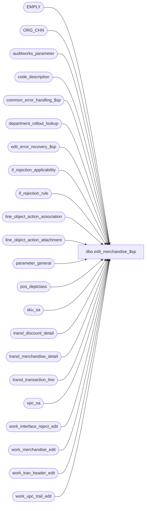

# dbo.edit_merchandise_$sp

**Database:** auditworks  
**Server:** bedrockdb01  

## Architecture Diagram



## Table Dependencies

| Referenced Table |
|---|
| EMPLY |
| ORG_CHN |
| auditworks_parameter |
| code_description |
| common_error_handling_$sp |
| department_rollout_lookup |
| edit_error_recovery_$sp |
| if_rejection_applicability |
| if_rejection_rule |
| line_object_action_association |
| line_object_action_attachment |
| parameter_general |
| pos_deptclass |
| sku_sa |
| transl_discount_detail |
| transl_merchandise_detail |
| transl_transaction_line |
| upc_sa |
| work_interface_reject_edit |
| work_merchandise_edit |
| work_tran_header_edit |
| work_upc_trail_edit |

## Stored Procedure Code

```sql
create proc dbo.edit_merchandise_$sp @errmsg 		nvarchar(2000) OUTPUT,
@edit_process_no	tinyint = 1

AS

/* Proc Name: edit_merchandise_$sp
   Desc : (EDIT) build merchandise/nonmerchandise details.
    reject transactions where upc or salesperson(s) are not on file.
    Validate stores against ORG_CHN only in order to handle warehouse stores.
    Called from edit_post_$sp.

HISTORY
Date     Name         Def# Desc
Jan12,15 Vicci   TFS-99599 Handle I/F Rejection Rule 83 (invalid cashier) same as rule 80 (invalid/missing cashier) except that
                           absent cashier (i.e. cashier 0) is OK.
Feb13,15 Vicci  TFS-105053 Ensure "not on file" rejects are reported even if the merch attachment configuration is not found.
Oct22,14 Vicci   TFS-81700 Copy merchandise attachment cost field from transl.
Oct17,14 Paul    TFS-88852 added force order hint to avoid slow update using sku_sa on SQL 2012.
Aug11,14 Paul    TFS-80919 Corrected retry logic to handle dup lines 
Jul17,14 Vicci   TFS-74694 Log cost and validate I/F Rejection rule 116 (Merchandise cost unknown).
Sep20,13 Vicci      146826 Take pos_identifier_type into account when more than 1 has been defined, and support SQL 2012.
Jan27,11 Paul       123556 treat upc_no = 0 existing in upc_sa as being not on file, allow upc_no = 0 to reject.
Aug08,08 Paul        87777 updated comments
May01,07 Phu       DV-1364 Prepare Employee Attribute I/F rejects.
Jan04,07 Paul        80915 check for ACTV=1 for all types of employee i/f rejects, port 79437, 68317 to SA5
Oct25,06 Phu         77931 Fix outer join for SQL 2005 Mode 90.
Jun14,06 Tim	   DV-1339 replace active_rejection_rule with ISNULL(active_rejection_rule,1)
Sep09,05 Paul      DV-1312 apply 54148, 53575 to SA5, remove temp table for performance
Jun07,05 David     DV-1263 Set merchandise_category from transl_merchandise_detail.
May05,05 David     DV-1202 Validate source and fulfillment store.
Dec13,04 Maryam    DV-1191 Improve performance.
Nov17,04 Maryam    DV-1167 Look at the ACTV flag of EMPLY.
Oct28,04 David     DV-1159 Check for ORG_CHN active flag. 
Sep09,04 David     DV-1120 apply 29561 to SA5
Aug23,04 Sab	   DV-1120 Remove reference to aplctn_id in auditwork_parameter since now hardcoded to 300.
May17,04 David     DV-1071 Use ORG_CHN table instead of store_salesaudit
Apr23,04 Sab	   DV-1071 Replace employee table with EMPLY
Aug05,08 Vicci      103686 Change references to employee to be "LEFT OUTER JOIN" to avoid issues when employee is view instead of table.
Nov06.06 Daphna      79437 Ensure NULL upc_no rejects when sku_lookup_method = 0
May16,06 Daphna      68317 use if_rejection_applicability to determine which validations to perform 
                           (remove references to interface_directory_lookup)
Jan24,06 Vicci	     66476 Treat inactive employees as invalid. Don't need isnull on ACTV for SA5.
May13,05 ShuZ        54148 Handle cases when pos_identifier has non-numeric characters
                           while still keep the functionality of 53575
May04,05 ShuZ        53575 Use integer 0 instead of '0' when comparing pos_identifier
                           in work_merchandise_edit
Apr06,05 Maryam      49080 validate cashier_no 0.
Jul16,04 Daphna      38630 Validate purchasing employee_no 0 (use IS NOT NULL)
Jul15,04 Vicci       29561 Handle line_object_type 23 (PLU subtotal discounts)
Sep15,03 ShuZ      1-G7A5F Remove all references to the interface_directory '... _check' 
                           fields from stored procedures/triggers and replace with usage 
                           of if_rejection_applicability table.
Aug16,02 HenryW	   1-AUHY5 Add validation of Merch Originating Store. I/F reject reason = 110.
Jun25,02 Seb       1-DTX2T correct join when calculating plu_amount
Jan18,02 Vicci     1-A9Z28 Correct join to line_object_action_attachment to take new 
			   transaction_category into account.
Dec26,01 Henry     1-9VP66 Add missing code for validation of I/F reject 4, purchasing_employee_no.
Nov26,01 Winnie	   1-969YY Add logic for R3 error handling to pass @edit_process_no
Nov01,01 ShuZ/Paul    8900 TRANSL edit changes for Sybase
Jun06,01 Phu          7214 Assign new if_reject_reason 87 and 88 for POS Identifier and Pos Deptclass not on file
May16,01 Shapoor      7813 Add column originating_store_no to merchandise* tables to attribute 
		            the sale/return to the store where the sale originated.
Feb14,01 Paul         7327 Allow updating audit trail when upc_no is zero and sku lookup is not used.
Nov09,00 Paul         6939 Don't insert to audit trail when original_upc_no was zero.
Jul27,00 Paul         6557 Seperate if on employee_no_check.
Jun20,00 Paul         6347 Improve speed of rollout lookup (defect 5890), added columns to work_merchandise_edit
Jun19,00 Paul         6434 Add distinct to insert to work_upc_trail_edit to avoid dup error when 
			    there are dup mdse rows
Jun01,00 John G       5678 Break down employee_no_check into component parts.
May17,00 Louise       6294 Added join on upc_lookup_division
Jan18,00 Paul         5843 Check upc_lookup_division when looking for upc
Oct 7,99 Henry        5415 Default value on subclass_code when NULL
Sep20,99 Paul         5300 Don't create if_reject if attachment is not applicable.
Mar18,99 Sab               Retain class_code from POS (UK mod)
Feb11,99 Paul
Jan13,97 Paul              Author
*/

DECLARE @auto_upc_correction		tinyint,
	@cashier_check 			tinyint,
	@missing_cashier_check 		tinyint,
	@current_date			smalldatetime,
	@dept_rollout_lookup_flag	tinyint,
	@dummy_upc_no			numeric(14,0),
	@employee_no_check		tinyint,
	@errno				int,
	@lookup_upc			tinyint,
	@payroll_employee_check 	tinyint,
	@purchasing_employee_check 	tinyint,
	@retain_class_code		int,
	@retry				tinyint,
	@rows				int,
	@sku_id				numeric(14,0),
	@class_code			int,
	@subclass_code			int,
	@sku_lookup_method		tinyint,
	@upc_lookup_source		nchar(1),
	@upc_verification		tinyint,
	@message_id			int,	
	@object_name			nvarchar(255),	
	@operation_name			nvarchar(100),
	@process_name			nvarchar(100),
	@multiple_pos_id_types_exist	tinyint,
	@zero_string			nvarchar(20),
	@errmsg2			nvarchar(2000), 
	@cost_check			tinyint;

SELECT @lookup_upc = 0,
	@upc_verification = 0,
	@retry = 0,
	@zero_string = '00000000000000000000',
        @current_date = getdate(),
	@process_name = 'edit_merchandise_$sp',
	@message_id = 201068,
	@operation_name = 'SELECT';

BEGIN TRY

SELECT @errmsg = 'Failed to determine if multiple POS Identifier Types have been defined. ',
       @object_name = 'code_description';
SELECT @multiple_pos_id_types_exist = CASE WHEN COUNT(1) > 1 THEN 1 ELSE 0 END
  FROM code_description
 WHERE code_type = 68
   AND code > 0  --(don't count the 'please log what has been given in the pos_identifier field to the upc_no field instead' request)
   AND code <> 100  --(C/L ref# reassignment)
   AND active_flag = 1;
  
SELECT @errmsg = 'Failed to determine upc lookup parameters. ',
       @object_name = 'parameter_general';
SELECT @sku_lookup_method = sku_lookup_method,
	@auto_upc_correction = auto_upc_correction,
	@dummy_upc_no = dummy_upc_no,
	@retain_class_code = ISNULL(retain_class_code,0),
	@upc_lookup_source = upc_lookup_source
  FROM parameter_general;

SELECT @errmsg = 'Failed to determine department rollout parameter.',
       @object_name = 'auditworks_parameter';
SELECT @dept_rollout_lookup_flag = ISNULL(CONVERT(tinyint, par_value),0)
  FROM auditworks_parameter
 WHERE par_name = 'department_rollout_lookup_flag';

SELECT @errmsg = 'Failed to determine if salesperson validations are active. ',
       @object_name = 'if_rejection_applicability';
SELECT @employee_no_check = ISNULL(MIN(ir.if_rejection_reason), 0)
  FROM if_rejection_rule ir, if_rejection_applicability ia
 WHERE ir.if_rejection_reason IN (3, 26, 27, 28, 29)
   AND ISNULL(ir.active_rejection_rule,1) = 1 
   AND ir.if_rejection_reason = ia.if_reject_reason;

SELECT @errmsg = 'Failed to determine if purchasing or payroll employee validations are active. ',
       @object_name = 'if_rejection_applicability';
SELECT @purchasing_employee_check = ISNULL(MIN(ir.if_rejection_reason), 0)
  FROM if_rejection_rule ir, if_rejection_applicability ia
 WHERE ir.if_rejection_reason IN (4, 30, 31, 32, 33)
   AND ISNULL(ir.active_rejection_rule,1) = 1 
   AND ir.if_rejection_reason = ia.if_reject_reason;

SELECT @errmsg = 'Failed to determine if cashier validations are active. ',
       @object_name = 'if_rejection_applicability';
SELECT @cashier_check = ISNULL(MAX(ir.if_rejection_reason), 0), @missing_cashier_check = ISNULL(MAX(CASE WHEN ir.if_rejection_reason = 80 THEN 1 ELSE 0 END), 0)
  FROM if_rejection_rule ir, if_rejection_applicability ia
 WHERE ir.if_rejection_reason IN (34, 35, 36, 37, 80, 83)
 AND ISNULL(ir.active_rejection_rule,1) = 1 
   AND ir.if_rejection_reason = ia.if_reject_reason;

SELECT @errmsg = 'Failed to determine if cost validations are active. ',
       @object_name = 'if_rejection_applicability';
SELECT @cost_check = ISNULL(MIN(SIGN(ir.if_rejection_reason)), 0)
  FROM if_rejection_rule ir, if_rejection_applicability ia
 WHERE ir.if_rejection_reason = 116
   AND ISNULL(ir.active_rejection_rule,1) = 1 
   AND ir.if_rejection_reason = ia.if_reject_reason;
   
SELECT @errmsg = '',
       @object_name = '';
IF @upc_lookup_source IN ('M', 'C')
BEGIN
   SELECT @lookup_upc = 1;

   IF EXISTS ( SELECT ia.interface_id
                FROM if_rejection_rule ir, if_rejection_applicability ia
               WHERE ir.if_rejection_reason IN (1,87,88)
                 AND ISNULL(ir.active_rejection_rule,1) = 1 
                 AND ir.if_rejection_reason = ia.if_reject_reason) 
     SELECT @upc_verification = 1;
END;

WHILE @retry <= 1
BEGIN

  SELECT @errmsg = 'Cannot truncate table work_merchandise_edit. ',
         @object_name = 'work_merchandise_edit',
         @operation_name = 'TRUNCATE';
  TRUNCATE TABLE work_merchandise_edit;

/* 
   Build temp table of non-duplicate transactions.
   If pos_no_hit_deptclass is nonzero then set pos_deptclass = pos_no_hit_deptclass.
   If units * units_sign = 0 then set units = 1
*/
  start_of_insert:

  SELECT @errmsg = 'Failed to insert into work_merchandise_edit. ',
         @object_name = 'work_merchandise_edit',
         @operation_name = 'INSERT';
  BEGIN TRY
    INSERT work_merchandise_edit(
	transaction_id,
	line_id,
	line_object,
	line_action,
	upc_no,
	sku_id,
	style_reference_id,
	class_code,
	subclass_code,
	units,
	price_override,
	pos_iplu_missing,
	pos_deptclass,
	gross_line_amount,
	net_line_amount,
	merchandise_category,
	upc_lookup_division,
	upc_on_file_flag,
	salesperson_on_file,
	salesperson2_on_file,
	salesperson,
	salesperson2,
	non_void_flag,
	scanned,
	pos_identifier,
	pos_identifier_type,
	original_upc_no,
	upc_replaced_flag,
	plu_amount,
	transaction_date,
	store_no,
	register_no,
	entry_date_time,
	transaction_no,
	transaction_series,
	transaction_category,
	line_object_changed_flag,
	originating_store_no,
	attachment_type,
	source_store_no,
	fulfillment_store_no,
	cost)
    SELECT wh.transaction_id,
	tl.line_id,
	tl.line_object,
	tl.line_action,
	upc_no,
	0,-- sku_id
	0, -- style_reference_id
	@retain_class_code * md.pos_deptclass, -- class_code
	0,--subclass_code
	md.units * units_sign + 1 - ABS(SIGN(md.units * units_sign)), -- If units*units_sign = 0 then set units = 1
	price_override,
	pos_iplu_missing,
	pos_deptclass * (1 - ABS(SIGN(pos_no_hit_deptclass)))
	  + pos_no_hit_deptclass * ABS(SIGN(pos_no_hit_deptclass)), -- If pos_no_hit_deptclass is nonzero then set pos_deptclass = pos_nohit_deptclass
	gross_line_amount,
	gross_line_amount - tl.pos_discount_amount, -- net_line_amount
	ISNULL(la.merchandise_category,1),
	ISNULL(la.upc_lookup_division,1),
	0,--upc_on_file_flag
	e.EMPLY_NUM, --salesperson_on_file
	1,--salesperson2_on_file
	salesperson,
	salesperson2,
	(1 - tl.line_void_flag) * ABS(voiding_reversal_flag)
	  * SIGN((transaction_void_flag - 1) * (transaction_void_flag - 7)), /* > 0 if nonvoid */
	scanned,
	pos_identifier,
	ISNULL(pos_identifier_type,1),
	upc_no, -- original_upc_no
	0,--upc_replaced_flag
	gross_line_amount, --plu_amount
	transaction_date,
	tl.store_no,
	tl.register_no,
	tl.entry_date_time,
	tl.transaction_no,
	tl.transaction_series,
	wh.transaction_category,
	0,--line_object_changed_flag
	md.originating_store_no,
	ISNULL(la.attachment_type, 0),
	md.source_store_no,
	md.fulfillment_store_no,
	md.cost
   FROM work_tran_header_edit wh WITH (NOLOCK)
        INNER JOIN transl_merchandise_detail md WITH (NOLOCK) ON (md.store_no = wh.store_no
                                                                  AND md.register_no = wh.register_no
                                                                  AND md.entry_date_time = wh.entry_date_time
                                                                  AND md.transaction_no = wh.transaction_no
                                                                  AND md.transaction_series = wh.transaction_series)
        INNER JOIN transl_transaction_line tl WITH (NOLOCK) ON (wh.transaction_id = tl.transaction_id AND md.line_id = tl.line_id)
        LEFT JOIN EMPLY e ON (md.salesperson = e.EMPLY_NUM AND e.ACTV = 1)
        LEFT JOIN line_object_action_attachment la ON (tl.line_object = la.line_object
                                                       AND tl.line_action = la.line_action
                                                       AND (wh.transaction_category = la.transaction_category OR la.transaction_category IS NULL)
                                                       AND la.attachment_type = 1)
    WHERE tl.transaction_id IS NOT NULL; 
  END TRY
  BEGIN CATCH;
    SELECT @errno = ERROR_NUMBER();

    IF @errno = 2601 /* duplicate key */
       AND @retry = 0
    BEGIN
      SELECT @errmsg = 'Failed to execute stored proc edit_error_recovery_$sp ',
             @object_name = 'edit_error_recovery_$sp',
             @operation_name = 'EXEC';
      BEGIN TRY
        EXEC edit_error_recovery_$sp 41, @edit_process_no;
        EXEC edit_error_recovery_$sp 50, @edit_process_no;          
      END TRY
      BEGIN CATCH
        GOTO general_error;
      END CATCH;
      SELECT @retry = @retry + 1 /* retry only once */
      GOTO start_of_insert;
    END;
    ELSE
    BEGIN
      GOTO general_error;
    END;
      
  END CATCH;
    
  SELECT @retry = 2; -- success
    
/*} build temp table of non-duplicate transactions */


/* If parameter department_rollout_lookup_flag is on, updates line_object in
   transl_transaction_line with those found in department_rollout_lookup table */

  IF @dept_rollout_lookup_flag > 0
  BEGIN
    SELECT @object_name = 'work_merchandise_edit',
           @operation_name = 'UPDATE';
           
    SELECT @errmsg = 'Failed to update work_merchandise_edit (line_object). ';
    UPDATE work_merchandise_edit
       SET line_object = dr.destination_line_object,
           line_object_changed_flag = 1
      FROM work_merchandise_edit mt,
           department_rollout_lookup dr
     WHERE mt.line_object = dr.source_line_object
       AND mt.pos_deptclass = dr.pos_deptclass
       AND mt.transaction_date >= dr.live_date
       AND line_object != dr.destination_line_object;

    SELECT @rows = @@rowcount;

    IF @rows >= 1
    BEGIN -- update upc_lookup_division for all line_objects changed
     
      SELECT @errmsg = 'Failed to update work_merchandise_edit (upc_lookup_division). ';
      UPDATE work_merchandise_edit
         SET merchandise_category = ISNULL(lt.merchandise_category,1),
             upc_lookup_division = ISNULL(lt.upc_lookup_division,1)
        FROM work_merchandise_edit mt
             LEFT JOIN line_object_action_attachment lt ON (mt.line_object = lt.line_object
                       AND mt.line_action = lt.line_action
                       AND (mt.transaction_category = lt.transaction_category OR lt.transaction_category IS NULL)
                       AND lt.attachment_type = 1)
       WHERE mt.line_object_changed_flag = 1;
           
      SELECT @object_name = 'transl_transaction_line',
             @operation_name = 'UPDATE',
       @errmsg ='Failed to update transl_transaction_line (line_object). ';
      UPDATE transl_transaction_line
             SET line_object = mt.line_object,
  line_object_type = ISNULL(la.line_object_type,0),
             db_cr_none = ISNULL(la.db_cr_none,0),
             reference_type = ISNULL(la.reference_type,0),
             discountable_group = ISNULL(la.discountable_group,0)
        FROM work_merchandise_edit mt WITH (NOLOCK)
             INNER JOIN transl_transaction_line tl ON (mt.transaction_no = tl.transaction_no
                                                       AND mt.store_no = tl.store_no
                                                       AND mt.register_no = tl.register_no
                                                       AND mt.entry_date_time = tl.entry_date_time
         AND mt.transaction_series = tl.transaction_series
                                                       AND mt.line_id = tl.line_id)
             LEFT JOIN line_object_action_association la ON (mt.line_object = la.line_object
                                                             AND mt.line_action = la.line_action
                                                             AND mt.transaction_category = la.transaction_category)
       WHERE mt.line_object_changed_flag = 1;
    END; -- if @rows >= 1
  END; -- if @dept_rollout_lookup_flag > 0 

  IF @sku_lookup_method >= 1
  BEGIN
    SELECT @object_name = 'work_merchandise_edit',
           @operation_name = 'UPDATE',
           @errmsg = 'Failed to update work_merchandise_edit (sku). ';
    UPDATE work_merchandise_edit
       SET upc_no = ss.upc_no,
           original_upc_no = -1
      FROM work_merchandise_edit md, sku_sa ss
     WHERE md.upc_no = 0
       AND SUBSTRING(md.pos_identifier + @zero_string,1,20) != @zero_string
       AND md.pos_identifier = ss.sku
       AND md.upc_lookup_division = ss.upc_lookup_division
       AND (md.pos_identifier_type = ss.pos_identifier_type OR @multiple_pos_id_types_exist = 0)
    OPTION (FORCE ORDER);

    IF @sku_lookup_method = 2
    BEGIN
      SELECT @errmsg = 'Failed to update work_merchandise_edit (pos_deptclass). ';
      UPDATE work_merchandise_edit
         SET upc_no = replace_upc_no,
             original_upc_no = -1
        FROM work_merchandise_edit md, pos_deptclass dc
       WHERE md.upc_no = 0
         AND substring(md.pos_identifier + '00000000000000000000',1,20) = '00000000000000000000' --54148
         AND md.pos_deptclass != 0
         AND md.pos_deptclass = dc.pos_deptclass
         AND md.upc_lookup_division = dc.upc_lookup_division
         AND dc.replace_upc_no > 0;
    END; /* @sku_lookup_method = 2 */
  END; /* @sku_lookup_method >= 1 */

/* ( Calculate head-office PLU initiated markdowns */
  SELECT @object_name = 'work_merchandise_edit',
         @operation_name = 'UPDATE',
         @errmsg = 'Failed to update work_merchandise_edit (plu_amount). ';
  UPDATE work_merchandise_edit
     SET plu_amount = plu_amount - (SELECT ISNULL(SUM(ABS(d.pos_discount_amount - d.pos_discount_amount_adj) * d.discount_amount_sign),0)
			          FROM transl_discount_detail d WITH (NOLOCK)
				 WHERE mt.transaction_no = d.transaction_no
				   AND mt.store_no = d.store_no
				   AND mt.register_no = d.register_no
				   AND mt.entry_date_time = d.entry_date_time
				   AND mt.transaction_series = d.transaction_series
				   AND mt.line_id = d.line_id
			           AND d.pos_discount_level in (22, 23))
    FROM  work_merchandise_edit mt;
/* ) Calculate head-office PLU initiated markdowns */


/*{ lookup upc's */
  IF @lookup_upc = 1
  BEGIN
    IF @retain_class_code <> 1
    BEGIN 
      SELECT @errmsg = 'Failed to update work_merchandise_edit from upc_sa (1). ';
      UPDATE work_merchandise_edit
         SET sku_id = us.sku_id,
             style_reference_id = us.style_reference_id,
             class_code = ISNULL(us.class_code,0),
             subclass_code = ISNULL(us.subclass_code,0),
             upc_on_file_flag = 1,
             cost = COALESCE(wm.cost, us.cost)
        FROM work_merchandise_edit wm, upc_sa us
   WHERE wm.upc_no = us.upc_no
         AND wm.upc_lookup_division = us.upc_lookup_division
         AND us.upc_no <> 0;
    END; -- IF @retain_class_code <> 1
    ELSE
    BEGIN
      SELECT @errmsg = 'Failed to update work_merchandise_edit from upc_sa (2). ';
      UPDATE work_merchandise_edit
         SET sku_id = us.sku_id,
             style_reference_id = us.style_reference_id,
             subclass_code = ISNULL(us.subclass_code,0),
             upc_on_file_flag = 1,
             cost = COALESCE(wm.cost, us.cost)
        FROM work_merchandise_edit wm, upc_sa us
       WHERE wm.upc_no = us.upc_no
         AND wm.upc_lookup_division = us.upc_lookup_division
         AND us.upc_no <> 0
    END; -- else @retain_class_code = 1
  END; -- If  @lookup_upc = 1

  IF @employee_no_check >= 1
  BEGIN
    SELECT @errmsg = 'Failed to update work_merchandise_edit (salesperson2_on_file) with assumption of not-on-file. ';
    UPDATE work_merchandise_edit
       SET salesperson2_on_file = 0
     WHERE salesperson2 >= 1;

    SELECT @rows = @@rowcount;

    IF @rows > 0 
    BEGIN
      SELECT @errmsg = 'Failed to update work_merchandise_edit (salesperson2_on_file). ';
      UPDATE work_merchandise_edit
         SET salesperson2_on_file = 1
        FROM work_merchandise_edit mt, EMPLY e
       WHERE salesperson2 >= 1
         AND mt.salesperson2 = e.EMPLY_NUM
         AND e.ACTV = 1;
    END; -- IF @rows > 0 
  END; -- If @employee_no_check >= 1
  
  IF @upc_verification >= 1
  BEGIN

    IF @auto_upc_correction >= 1
    BEGIN
      SELECT @errmsg = 'Failed to truncate table work_upc_trail_edit. ',
             @object_name = 'work_upc_trail_edit',
             @operation_name = 'TRUNCATE';            
      TRUNCATE TABLE work_upc_trail_edit;
       
      SELECT @errmsg = 'Failed to insert work_upc_trail_edit. ',
             @object_name = 'work_upc_trail_edit',
             @operation_name = 'INSERT';
      INSERT work_upc_trail_edit (transaction_id, line_id, before_upc_no,
	     after_upc_no, sku_id, style_reference_id, class_code, subclass_code,
	     last_modified_date_time, sku_lookup_flag, cost)
      SELECT DISTINCT
		wm.transaction_id,
		wm.line_id,
		wm.upc_no,
		pd.replace_upc_no,
		us.sku_id,
		us.style_reference_id,
		us.class_code,
		us.subclass_code,
		getdate(),
		SIGN(wm.original_upc_no),
		COALESCE(wm.cost, us.cost)
	FROM work_merchandise_edit wm WITH (NOLOCK), pos_deptclass pd, upc_sa us
       WHERE upc_on_file_flag = 0
         AND wm.upc_lookup_division >= 1
	 AND wm.upc_lookup_division = pd.upc_lookup_division
	 AND pd.upc_lookup_division = us.upc_lookup_division
	 AND wm.pos_deptclass = pd.pos_deptclass
	 AND pd.replace_upc_no = us.upc_no
	 AND us.upc_no <> 0;

      SELECT @errmsg = 'Failed to update work_merchandise_edit (upc_no). ',
             @object_name = 'work_merchandise_edit',
             @operation_name = 'UPDATE';
      UPDATE work_merchandise_edit
         SET upc_no = wu.after_upc_no,
             sku_id = wu.sku_id,
             style_reference_id = wu.style_reference_id,
             class_code = wu.class_code,
             subclass_code = wu.subclass_code,
             upc_on_file_flag = 1,
             cost = COALESCE(wm.cost, wu.cost)
        FROM work_upc_trail_edit wu WITH (NOLOCK),work_merchandise_edit wm
       WHERE upc_on_file_flag = 0
         AND wm.transaction_id = wu.transaction_id
         AND wm.line_id = wu.line_id
         AND wm.upc_no = wu.before_upc_no;
    END; --IF @auto_upc_correction >= 1
    
    IF @auto_upc_correction >= 2   
    BEGIN 
      SELECT @errmsg = 'Failed to insert work_upc_trail_edit. ',
             @object_name = 'work_upc_trail_edit',
             @operation_name = 'INSERT';                       
      INSERT work_upc_trail_edit (transaction_id, line_id, before_upc_no,
    	     after_upc_no, sku_id, style_reference_id, class_code, subclass_code,
	     last_modified_date_time, sku_lookup_flag, cost)
SELECT DISTINCT
		wm.transaction_id,
		wm.line_id,
		wm.upc_no,
		@dummy_upc_no,
		us.sku_id,
		us.style_reference_id,
		us.class_code,
		us.subclass_code,
		getdate(),
		SIGN(wm.original_upc_no),
		COALESCE(wm.cost, us.cost)
	FROM work_merchandise_edit wm WITH (NOLOCK), upc_sa us
       WHERE upc_on_file_flag = 0
	 AND wm.upc_lookup_division >= 1
	 AND us.upc_no = @dummy_upc_no
	 AND wm.upc_lookup_division = us.upc_lookup_division
	 AND us.upc_no <> 0;
            
      SELECT @errmsg = 'Failed to update work_merchandise_edit (dummy_upc). ',
             @object_name = 'work_merchandise_edit',
             @operation_name = 'UPDATE';  
      UPDATE work_merchandise_edit
         SET upc_no = wu.after_upc_no,
             sku_id = wu.sku_id,
   	     style_reference_id = wu.style_reference_id,
	     class_code = wu.class_code,
	     subclass_code = wu.subclass_code,
	     upc_on_file_flag = 1,
	     cost = COALESCE(wm.cost, wu.cost)
          FROM work_upc_trail_edit wu WITH (NOLOCK),work_merchandise_edit wm
         WHERE upc_on_file_flag = 0
           AND wm.transaction_id = wu.transaction_id
           AND wm.line_id = wu.line_id
           AND wm.upc_no = wu.before_upc_no; 
    END; --@auto_upc_correction >= 2                
  END; --IF @upc_verification >= 1

END; -- WHILE @retry <= 1


IF @upc_verification >= 1
BEGIN
  SELECT @errmsg = 'Failed to insert work_interface_reject_edit for if_reject_reason 1. ',
         @object_name = 'work_interface_reject_edit',
         @operation_name = 'INSERT';
  INSERT work_interface_reject_edit (
	 if_reject_reason,
	 transaction_id,
	 line_id )
  SELECT 1,
	 transaction_id,
	 line_id
    FROM work_merchandise_edit WITH (NOLOCK)
   WHERE upc_on_file_flag = 0
     AND upc_lookup_division >= 1
     AND non_void_flag >= 1
--   AND attachment_type = 1  TFS-105053 Remove this condition since it was preventing UPC not on file rejects when TM integrities exist
     AND (upc_no != 0 OR upc_no IS NULL OR @sku_lookup_method = 0);

  IF @sku_lookup_method IN (1, 2)
  BEGIN
    SELECT @errmsg = 'Failed to insert work_interface_reject_edit for if_reject_reason 87. ',
           @object_name = 'work_interface_reject_edit',
           @operation_name = 'INSERT';            
    INSERT work_interface_reject_edit (
	   if_reject_reason,
	   transaction_id,
	   line_id )
    SELECT 87,
           transaction_id,
           line_id
      FROM work_merchandise_edit WITH (NOLOCK)
     WHERE upc_on_file_flag = 0
       AND upc_lookup_division >= 1
       AND non_void_flag >= 1
--     AND attachment_type = 1  TFS-105053 Remove this condition since it was preventing UPC not on file rejects when TM integrities exist
       AND upc_no = 0
       AND (substring(pos_identifier + '00000000000000000000',1,20) <> '00000000000000000000'
            OR pos_identifier IS NULL
            OR @sku_lookup_method = 1);--54148
  END  -- if @sku_lookup_method IN (1, 2)

  IF @sku_lookup_method = 2
  BEGIN
    SELECT @errmsg = 'Failed to insert work_interface_reject_edit for if_reject_reason 88. ',
           @object_name = 'work_interface_reject_edit',
 @operation_name = 'INSERT';            
    INSERT work_interface_reject_edit (
	if_reject_reason,
	transaction_id,
	line_id )
    SELECT
	88,
	transaction_id,
	line_id
      FROM work_merchandise_edit WITH (NOLOCK)
     WHERE upc_on_file_flag = 0
       AND upc_lookup_division >= 1
       AND non_void_flag >= 1
--     AND attachment_type = 1  TFS-105053 Remove this condition since it was preventing UPC not on file rejects when TM integrities exist
       AND upc_no = 0
       AND substring(pos_identifier + '00000000000000000000',1,20) = '00000000000000000000'; --54148
  END;  -- if @sku_lookup_method = 2
END; --@upc_verification >= 1

IF @cost_check = 1  -- reject unknown cost
BEGIN
  SELECT @errmsg = 'Failed to insert rows into work_interface_reject_edit (unknown cost). ',
         @object_name = 'work_interface_reject_edit',
         @operation_name = 'INSERT';            
  INSERT work_interface_reject_edit (
	if_reject_reason,
	transaction_id,
	line_id )
   SELECT 116,
	transaction_id,
	line_id
     FROM work_merchandise_edit WITH (NOLOCK)
    WHERE cost IS NULL
      AND non_void_flag >= 1
    AND upc_lookup_division > 0;
END; -- If @cost_check = 1


IF @employee_no_check = 3  -- log Invalid salesperson number
BEGIN
  SELECT @errmsg = 'Failed to insert rows into work_interface_reject_edit (type3). ',
         @object_name = 'work_interface_reject_edit',
         @operation_name = 'INSERT';            
  INSERT work_interface_reject_edit (
	if_reject_reason,
	transaction_id,
	line_id )
   SELECT 3,
	transaction_id,
	line_id
     FROM work_merchandise_edit WITH (NOLOCK)
    WHERE ( salesperson_on_file IS NULL OR salesperson2_on_file = 0 )
      AND non_void_flag >= 1;
END; -- If @employee_no_check = 3

/* { Def 1-9VP66 */
IF @purchasing_employee_check >= 1
BEGIN
  SELECT @errmsg = 'Failed to update work_tran_header_edit (purchasing_employee_check). ',
         @object_name = 'work_tran_header_edit',
         @operation_name = 'UPDATE';            
  UPDATE work_tran_header_edit
     SET employee_on_file_flag = 1
    FROM work_tran_header_edit wh, EMPLY e
   WHERE wh.employee_no IS NOT NULL 
     AND wh.employee_no = e.EMPLY_NUM
     AND e.ACTV = 1;

  IF @purchasing_employee_check = 4 -- log Invalid employee number
  BEGIN
  SELECT @errmsg = 'Failed to insert rows into work_interface_reject_edit (type 4). ',
         @object_name = 'work_interface_reject_edit',
         @operation_name = 'INSERT';           
     INSERT work_interface_reject_edit (
	if_reject_reason,
	transaction_id,
	line_id )
     SELECT 4,
	transaction_id,
	0
       FROM work_tran_header_edit WITH (NOLOCK)
      WHERE employee_no IS NOT NULL 
        AND employee_on_file_flag = 0
        AND transaction_void_flag IN (0,8); /* not void */
  END; -- IF @purchasing_employee_check = 4
END; -- IF @purchasing_employee_check >= 1

/* } Def 1-9VP66 */
IF @cashier_check >= 1
BEGIN
  SELECT @errmsg = 'Failed to update work_tran_header_edit (cashier_on_file_flag). ',
         @object_name = 'work_tran_header_edit',
         @operation_name = 'UPDATE';
  UPDATE work_tran_header_edit
    SET cashier_on_file_flag = e.EMPLY_NUM
     FROM work_tran_header_edit wh, EMPLY e
    WHERE wh.cashier_no >= 0
      AND wh.cashier_no = e.EMPLY_NUM
      AND e.ACTV = 1;

  IF @cashier_check IN (80, 83) AND @missing_cashier_check = 1 -- log Invalid/Missing associate number
  BEGIN
    SELECT @errmsg = 'Failed to insert work_interface_reject_edit (type 80). ',
           @object_name = 'work_interface_reject_edit',
           @operation_name = 'INSERT';
    INSERT work_interface_reject_edit (
  	   if_reject_reason,
	   transaction_id,
	   line_id )
    SELECT 80,
	   transaction_id,
	   0
      FROM work_tran_header_edit WITH (NOLOCK)
     WHERE cashier_no >= 0
       AND cashier_on_file_flag IS NULL  --
       AND transaction_void_flag IN (0,8); /* not void */
  END; -- IF @cashier_check = 80 -- log Invalid associate number
  
  IF @cashier_check = 83 -- log Invalid associate number
  BEGIN
    SELECT @errmsg = 'Failed to insert work_interface_reject_edit (type 83). ',
           @object_name = 'work_interface_reject_edit',
           @operation_name = 'INSERT';
    INSERT work_interface_reject_edit (
  	   if_reject_reason,
	   transaction_id,
	   line_id )
    SELECT 83,
	   transaction_id,
	   0
      FROM work_tran_header_edit WITH (NOLOCK)
     WHERE cashier_no > 0  -- 0 is valid since it is used to represent NULL, i.e. it indicates that the transaction was not entered by a cashier.
       AND cashier_on_file_flag IS NULL  --
       AND transaction_void_flag IN (0,8); /* not void */
  END; -- IF @cashier_check = 83 -- log Invalid associate number
END; /* If @cashier_check >= 1 */

-- { Def 1-AUHY5. Validation of Merch Originating Store.
IF EXISTS ( SELECT ia.interface_id
              FROM if_rejection_rule ir, if_rejection_applicability ia
             WHERE ir.if_rejection_reason = 110
               AND ISNULL(ir.active_rejection_rule, 1) = 1 
               AND ir.if_rejection_reason = ia.if_reject_reason)
BEGIN
  SELECT @errmsg = 'Failed to insert rows into work_interface_reject_edit for I/F reject 110. ',
         @object_name = 'work_interface_reject_edit',
         @operation_name = 'INSERT';
  INSERT work_interface_reject_edit (
 	       if_reject_reason,
	       transaction_id,
	       line_id,
	       memo1 )
  SELECT 110,
         transaction_id,
         line_id,
    CONVERT(nvarchar,originating_store_no)
    FROM work_merchandise_edit WITH (NOLOCK)
   WHERE transaction_id IS NOT NULL --
     AND non_void_flag > 0
     AND originating_store_no IS NOT NULL --
     AND originating_store_no NOT IN (SELECT ORG_CHN_NUM FROM ORG_CHN WITH (NOLOCK) WHERE ACTV = 1);
END; -- IF EXISTS ... if_rejection_reason
-- } Def 1-AUHY5.

-- Validate source store
IF EXISTS ( SELECT ia.interface_id
              FROM if_rejection_rule ir, if_rejection_applicability ia
             WHERE ir.if_rejection_reason = 114
               AND ISNULL(ir.active_rejection_rule,1) = 1 
               AND ir.if_rejection_reason = ia.if_reject_reason)
BEGIN
  SELECT @errmsg = 'Failed to log I/F reject 114. ',
         @object_name = 'work_interface_reject_edit',
         @operation_name = 'INSERT';
  INSERT work_interface_reject_edit (
 	       if_reject_reason,
	       transaction_id,
	       line_id,
	       memo1 )
  SELECT 114,
         transaction_id,
         line_id,
         CONVERT(nvarchar, source_store_no)
    FROM work_merchandise_edit WITH (NOLOCK)
   WHERE transaction_id IS NOT NULL --
     AND non_void_flag > 0
     AND source_store_no IS NOT NULL --
     AND source_store_no NOT IN (SELECT ORG_CHN_NUM FROM ORG_CHN WITH (NOLOCK) WHERE ACTV = 1);
END; -- IF EXISTS ... if_rejection_reason 114

-- Validate fulfillment store
IF EXISTS ( SELECT ia.interface_id
              FROM if_rejection_rule ir, if_rejection_applicability ia
             WHERE ir.if_rejection_reason = 115
               AND ISNULL(ir.active_rejection_rule,1)  = 1 
               AND ir.if_rejection_reason = ia.if_reject_reason)
BEGIN
  SELECT @errmsg = 'Failed to log I/F reject 115. ',
         @object_name = 'work_interface_reject_edit',
         @operation_name = 'INSERT';
  INSERT work_interface_reject_edit (
 	       if_reject_reason,
	       transaction_id,
	       line_id,
	       memo1 )
  SELECT 115,
         transaction_id,
         line_id,
         CONVERT(nvarchar, fulfillment_store_no)
    FROM work_merchandise_edit WITH (NOLOCK)
   WHERE transaction_id IS NOT NULL --
     AND non_void_flag > 0
     AND fulfillment_store_no IS NOT NULL --
     AND fulfillment_store_no NOT IN (SELECT ORG_CHN_NUM FROM ORG_CHN WITH (NOLOCK) WHERE ACTV = 1);
END; -- IF EXISTS ... if_rejection_reason 115

RETURN;

general_error:
  SELECT @errno = ERROR_NUMBER(),
         @errmsg2 = @process_name + ':  ' + COALESCE(@errmsg, '') + ' Line: ' + CONVERT(nvarchar, ERROR_LINE()) + ', ' + ERROR_MESSAGE() ;
  EXEC common_error_handling_$sp 4, @errno, @errmsg2, 0, @message_id, @process_name, @object_name, @operation_name, 1, @edit_process_no;
  RETURN;

END TRY

BEGIN CATCH
  SELECT @errno = ERROR_NUMBER();
  IF @errmsg2 IS NULL
  BEGIN
    SELECT @errmsg2 = @process_name + ':  ' + COALESCE(@errmsg, '') + ' Line: ' + CONVERT(nvarchar, ERROR_LINE()) + ', ' + ERROR_MESSAGE();
  END;
  SELECT @errmsg = @errmsg2;  
  EXEC common_error_handling_$sp 4, @errno, @errmsg2, 0, @message_id, @process_name, @object_name, @operation_name, 1, @edit_process_no;
  
  RETURN;
END CATCH;
```

