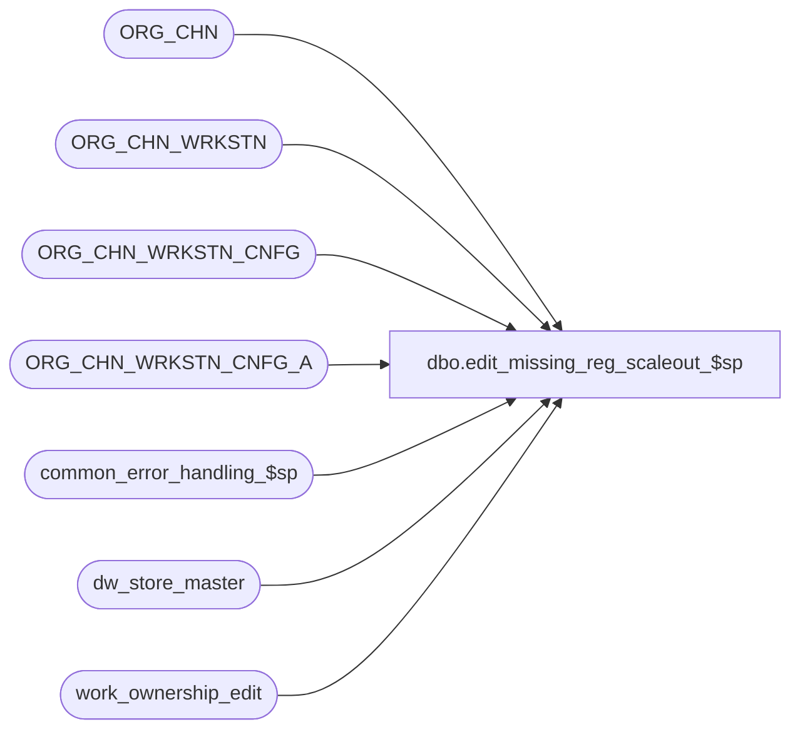

# dbo.edit_missing_reg_scaleout_$sp

**Database:** auditworks  
**Server:** bedrockdb01  

## Architecture Diagram



## Table Dependencies

| Referenced Table |
|---|
| ORG_CHN |
| ORG_CHN_WRKSTN |
| ORG_CHN_WRKSTN_CNFG |
| ORG_CHN_WRKSTN_CNFG_A |
| common_error_handling_$sp |
| dw_store_master |
| work_ownership_edit |

## Stored Procedure Code

```sql
create proc dbo.edit_missing_reg_scaleout_$sp   @process_id binary(16),
  @user_id    int,
  @process_no smallint = 5,
  @trickle_polling_flag smallint = 0,
  @edit_process_no tinyint = 1,
  @calculation_date smalldatetime,
  @instance_id      int,
  @rows_inserted    int OUTPUT

AS

  /*

    Proc Name : edit_missing_reg_scaleout_$sp
    Desc      : Populate work table efficiently when using scaleout.
                Called by edit_missing_reg_$sp.

    Please ensure that the proc script contains the following at the top in order to support scaleout:
	SET ANSI_NULLS ON
	SET ANSI_WARNINGS ON 

    HISTORY:
Date     Name              Def#  Desc
May12,16 Vicci         DAOM-730  Since register_poll_id is not longer used (was a S/A 4.1 and under concept) appropriate it as an 
                                 option 1 (Log parent as missing and child as unused) indicator, specifying the store/parent-reg as the match key.
Dec05,14 Paul             94103  use try catch
Sep24,09 Paul            117568  scaleout: Check ownership in dw_store_master. Clean up missing for store-dates that
				  are now edited on other peripherals.

  */

DECLARE 
  @errmsg		nvarchar(2000),
  @errmsg2		nvarchar(2000),
  @errline		int,
  @errno                int,
  @message_id           int,
  @object_name          nvarchar(255),
  @operation_name       nvarchar(100),
  @process_name         nvarchar(100),
  @rows			int;

  SELECT @process_name     = 'edit_missing_reg_scaleout_$sp',
	 @message_id       = 201068;   

  BEGIN TRY
    SELECT @errmsg         = 'Failed to TRUNCATE work_ownership_edit.',
           @object_name    = 'work_ownership_edit',
           @operation_name = 'TRUNCATE';
  TRUNCATE table work_ownership_edit;

  /* Get a list of live stores that belong to the current peripheral */
     SELECT @errmsg         = 'Failed to populate work_ownership_edit',
           @object_name    = 'work_ownership_edit',
           @operation_name = 'INSERT';
  INSERT INTO work_ownership_edit (store_no, CLS_DATE, OPEN_HOUR_ID)
  SELECT ss.ORG_CHN_NUM, ss.CLS_DATE, ss.OPEN_HOUR_ID
    FROM ORG_CHN ss, dw_store_master sm
   WHERE ss.ACTV = 1
     AND (@calculation_date >= ss.OPEN_DATE OR ss.OPEN_DATE IS NULL)
     AND (@calculation_date < ss.CLS_DATE OR ss.CLS_DATE IS NULL)
     AND ss.ORG_CHN_NUM = sm.store_no
     AND (sm.instance_id = @instance_id OR sm.instance_id = 0);

  SELECT @rows_inserted = @@rowcount;

  IF @rows_inserted = 0
    RETURN;

  /* Get a list of active registers that belong to the list of stores */
    SELECT @errmsg         = 'Failed to get list of live registers excluding closed stores',
           @object_name    = 'work_store_reg_list',
           @operation_name = 'INSERT';
  INSERT INTO #store_reg_list (
     	        store_no,
     	        register_no,
                sales_date,
                register_poll_id,
                existing_status, 
                status_flag,
                closed_date,
                open_hour_id,
                wrkstn_id,
                prnt_wrkstn_id,
                rprt_unsd_wrkstns )
  SELECT        rg.ORG_CHN_NUM ,
                rg.WRKSTN_NUM,
                @calculation_date,
                MAX(CASE WHEN ca.WRKSTN_ID = rg.WRKSTN_ID AND IsNull(c.RPRT_UNSD_WRKSTNS, 1) = 1
                THEN RIGHT ('0000000000' + CONVERT(nvarchar, rg.ORG_CHN_NUM),10) + RIGHT ('00000' + CONVERT(nvarchar, rg.WRKSTN_NUM),5) 
                ELSE NULL END) register_poll_id,  --can only set for parent register since for regular register don't know what parent register is yet -audit status insert will take care of others
                0,
                NULL,
                ss.CLS_DATE,
                ss.OPEN_HOUR_ID,
                rg.WRKSTN_ID,
                COALESCE(rg.PRNT_WRKSTN_ID, rg.WRKSTN_ID),
                MAX(COALESCE(c.RPRT_UNSD_WRKSTNS, 1))
  FROM work_ownership_edit ss,
       ORG_CHN_WRKSTN rg,
       ORG_CHN_WRKSTN_CNFG_A ca,
       ORG_CHN_WRKSTN_CNFG c
 WHERE rg.ORG_CHN_NUM = ss.store_no
   AND rg.ACTV = 1
   AND COALESCE(rg.PRNT_WRKSTN_ID,rg.WRKSTN_ID) = ca.WRKSTN_ID
   AND @calculation_date >= ca.EFCTV_DATE
   AND (@calculation_date < ca.EXPRTN_DATE OR ca.EXPRTN_DATE IS NULL)
   AND ca.WRKSTN_CNFG_CODE = c.WRKSTN_CNFG_CODE
   AND COALESCE(c.TRAN_TRNSLT_VRSN_NUM,0) <> 0  -- exclude not live
   AND c.PLNG_FILE_NAME IS NOT NULL
 GROUP BY rg.ORG_CHN_NUM,
          rg.WRKSTN_NUM,
          ss.CLS_DATE,
          ss.OPEN_HOUR_ID,
          rg.WRKSTN_ID,
          COALESCE(rg.PRNT_WRKSTN_ID, rg.WRKSTN_ID);

  RETURN;

 
business_error:   /* Business Rule handler. */

	SELECT @errmsg2 = @errmsg;

	EXEC common_error_handling_$sp @process_no, @errno, @errmsg, 0, @message_id, @process_name,
	       @object_name, @operation_name, 1, @edit_process_no, 0, null, 0, null, null, null,
	       null, null, null, 0, @process_id, @user_id;
	  /* Note: when the exec above raises an error, that action also fires the system error trap (below) */
	RETURN;
END TRY

BEGIN CATCH; -- trap system errors
    /* common error handling. Appending proc name here because a rollback could occur if called within a transaction. */

        SELECT @errno = ERROR_NUMBER(),
		@errline = ERROR_LINE();

        SELECT @errmsg = CONVERT(nvarchar, @errno) + ':' + @process_name + ':' + CONVERT(nvarchar, @errline) + ':'
               + COALESCE(@errmsg, ' ') + ':' + ERROR_MESSAGE();

	 /* this condition will only be true when raise error in traps above fire this general catch */
	IF @errmsg2 IS NOT NULL
	  SELECT @errmsg = @errmsg2;

	EXEC common_error_handling_$sp @process_no, @errno, @errmsg, 0, @message_id, @process_name,
	       @object_name, @operation_name, 1, @edit_process_no, 0, null, 0, null, null, null,
	       null, null, null, 0, @process_id, @user_id;

	RETURN;
END CATCH;
```

