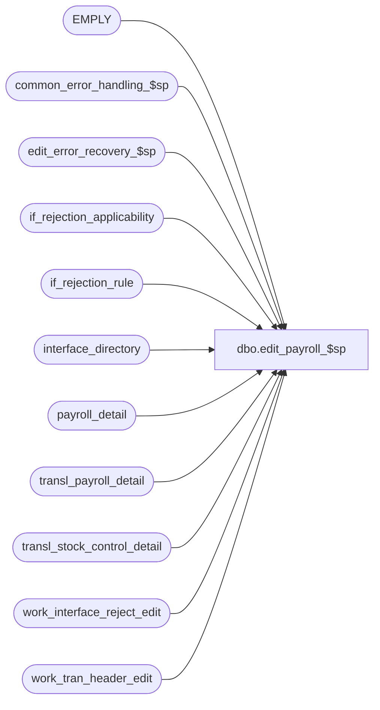

# dbo.edit_payroll_$sp

**Database:** auditworks  
**Server:** bedrockdb01  

## Architecture Diagram



## Table Dependencies

| Referenced Table |
|---|
| EMPLY |
| common_error_handling_$sp |
| edit_error_recovery_$sp |
| if_rejection_applicability |
| if_rejection_rule |
| interface_directory |
| payroll_detail |
| transl_payroll_detail |
| transl_stock_control_detail |
| work_interface_reject_edit |
| work_tran_header_edit |

## Stored Procedure Code

```sql
create proc dbo.edit_payroll_$sp 
 @errmsg            nvarchar(2000) OUTPUT,
 @edit_process_no	tinyint = 1

AS

/* 
NAME:	edit_payroll_$sp
DESCRIPTION: (EDIT) to post payroll details.
	     Called by edit_post_$sp.
HISTORY:
Date     Name           Def# Desc
Dec12,14 Paul      TFS-94103 use try catch
Apr20,11 Vicci        105917 Set memo1 and memo2 for I/F Reject reason 82.
Jan30,08 Phu           96766 Remove references to interface directory lookup table.
Oct25,06 Phu           77931 Fix outer join for SQL 2005 Mode 90.
Apr29,05 Paul        DV-1234 expand transaction_id to use tran_id_datatype
Feb10,05 Paul        DV-1203 change datatypes in temp table to match CDM datatypes
Dec14,04 Maryam      DV-1191 Improve performance.
Nov17,04 Maryam      DV-1167 Look at the ACTV flag of EMPLY.
Apr23,04 Sab	     DV-1071 Replace employee table with EMPLY
Sep15,03 ShuZ        1-G7A5F Remove all references to the interface_directory '... _check' 
                             fields from stored procedures/triggers and replace with usage 
                             of if_rejection_applicability table.
Nov26,01 Winnie	     1-969YY Add logic for R3 error handling to pass @edit_process_no
Nov01,01 ShuZ	        8900 TRANSL edit changes for Sybase
Jun01,00 John G  	5678 Break down employee_no_check into component parts.
Apr13,00 Paul		6168 check rowcount for better performance
Apr30,00 Yin
Jul07,96 Paul		Version: 1.02 Author
*/ 

DECLARE @errno int,
	@errmsg2				nvarchar(2000),
	@errline				int,
	@retry				tinyint,
	@rows				int,
	@message_id			int,	
	@object_name			nvarchar(255),	
	@operation_name			nvarchar(100),
	@process_name			nvarchar(100),
	@payroll_employee_check		tinyint;      

SELECT @retry = 0,
       @process_name = 'edit_payroll_$sp',
       @message_id = 201068;    

BEGIN TRY

WHILE @retry <= 1
BEGIN

SELECT @errno = 0,
	@errmsg = 'Failed to insert rows into payroll_detail',
	@object_name = 'payroll_detail',
	@operation_name = 'INSERT';
BEGIN TRY

INSERT payroll_detail (
	transaction_id,
	line_id,
	employee_no,
	payroll_date,
	employee_payroll_id,
	employee_type,
	payroll_entry_type )
SELECT
	wh.transaction_id,
	line_id,
	pd.employee_no,
	payroll_date,
	employee_payroll_id,
	employee_type,
	payroll_entry_type
  FROM  transl_payroll_detail pd WITH (NOLOCK), work_tran_header_edit wh WITH (NOLOCK)
 WHERE wh.store_no = pd.store_no
   AND  wh.register_no = pd.register_no
   AND  wh.entry_date_time = pd.entry_date_time
   AND  wh.transaction_series = pd.transaction_series
   AND  wh.transaction_no = pd.transaction_no;

SELECT @rows = @@rowcount, @retry = 2;
END TRY
BEGIN CATCH;
        SELECT @errno = ERROR_NUMBER(),
		@errline = ERROR_LINE();

        SELECT @errmsg = CONVERT(nvarchar, @errno) + ':' + @process_name + ':' + CONVERT(nvarchar, @errline) + ':'
               + COALESCE(@errmsg, ' ') + ':' + ERROR_MESSAGE();
END CATCH;

IF @errno != 0
  BEGIN
   IF @errno = 2601 /* duplicate key */
     AND @retry = 0
     BEGIN
         SELECT @errmsg = 'Failed to execute stored proc edit_error_recovery_$sp',
                @object_name = 'edit_error_recovery_$sp',
                @operation_name = 'EXEC';
      EXEC edit_error_recovery_$sp 46, @edit_process_no;

      SELECT @retry = @retry + 1; /* retry only once */
     END;
   ELSE
      GOTO business_error;
  END;

END /* While @retry <= 1 */

IF @rows = 0
  RETURN;

    SELECT @errmsg = 'Failed to create temp table #employee_list',
           @object_name = '#employee_list',
           @operation_name = 'CREATE TABLE';
CREATE TABLE #employee_list( transaction_id numeric(14,0) not null, -- tran_id_datatype
	                     line_id        numeric(5,0) not null,
	                     employee_no    int null, -- T_LONG_INTEGER  
	                     employee_on_file tinyint not null,
	                     employee_name  nvarchar(255) null );

  SELECT @errmsg = 'Failed to retrieve from if_rejection_rule, if_rejection_applicability, interface_directory for if_rejection_reason = 82',
         @object_name = 'if_rejection_rule',
         @operation_name ='SELECT';
SELECT @payroll_employee_check = COALESCE(SIGN(MIN(ia.interface_id)), 0)
  FROM if_rejection_rule ir, if_rejection_applicability ia, interface_directory id
 WHERE ir.if_rejection_reason = 82
   AND COALESCE(ir.active_rejection_rule, 1) = 1
   AND ir.if_rejection_reason = ia.if_reject_reason
   AND ia.interface_id = id.interface_id
   AND id.update_timing > 0;

IF @payroll_employee_check > 0
  BEGIN
	   SELECT @errmsg = 'Failed to insert into temp table #employee_list',
                  @object_name = '#employee_list',
                  @operation_name = 'INSERT';
	INSERT INTO #employee_list(
	       transaction_id,
	       line_id,
	       employee_no,
	       employee_on_file,
	       employee_name)  --from shift card, not EMPLY
	SELECT 	wh.transaction_id,
		pd.line_id,
		pd.employee_no,
		CASE WHEN e.EMPLY_NUM IS NULL THEN 0 ELSE 1 END,
		SUBSTRING(shift.vendor_no, 1, 255) 
	  FROM  transl_payroll_detail pd WITH (NOLOCK)
              INNER JOIN work_tran_header_edit wh WITH (NOLOCK) ON (wh.store_no = pd.store_no
                                                                    AND wh.register_no = pd.register_no
                                                                    AND wh.entry_date_time = pd.entry_date_time
                                                                    AND wh.transaction_series = pd.transaction_series
                                                                    AND wh.transaction_no = pd.transaction_no)
              LEFT JOIN EMPLY e ON (pd.employee_no = e.EMPLY_NUM AND e.ACTV = 1)
              LEFT OUTER JOIN transl_stock_control_detail shift
                 ON pd.store_no = shift.store_no
                AND pd.register_no = shift.register_no
                AND pd.entry_date_time = shift.entry_date_time
                AND pd.transaction_series = shift.transaction_series
                AND pd.transaction_no = shift.transaction_no
                AND pd.line_id = shift.line_id
                AND shift.display_def_id = 58
	 WHERE pd.employee_no > 0;

	  SELECT @errmsg = 'Failed to insert rows into work_interface_reject_edit',
                 @object_name = 'work_interface_reject_edit',
                 @operation_name = 'INSERT';
	INSERT work_interface_reject_edit (
		if_reject_reason,
		transaction_id,
		line_id,
		memo1,
		memo2 )
	SELECT 82, 
		transaction_id,
		line_id,
		CONVERT(nvarchar, employee_no),
		employee_name 
	FROM #employee_list WITH (NOLOCK)
	WHERE employee_on_file = 0;

  END;  /* IF EXISTS employee_no_check >= 4 */

  DROP TABLE #employee_list;

RETURN;


business_error:   /* Business Rule handler. */

	SELECT @errmsg2 = @errmsg;

	/* Could include similar cleanup code to system error trap when needed (example is from move_store_$sp).
	   However, could also exclude the cleanup code here since the outer system error catch should fire again after the exec below. */

	EXEC common_error_handling_$sp 4, @errno, @errmsg, 0, @message_id, 
	  @process_name, @object_name, @operation_name, 1, @edit_process_no;
	  /* Note: when the exec above raises an error, that action also fires the system error trap (below) */
	RETURN;
END TRY

BEGIN CATCH; -- trap system errors
    /* common error handling. Appending proc name here because a rollback could occur if called within a transaction. */

        SELECT @errno = ERROR_NUMBER(),
		@errline = ERROR_LINE();

        SELECT @errmsg = CONVERT(nvarchar, @errno) + ':' + @process_name + ':' + CONVERT(nvarchar, @errline) + ':'
               + COALESCE(@errmsg, ' ') + ':' + ERROR_MESSAGE();

	 /* this condition will only be true when raise error in traps above fire this general catch */
	IF @errmsg2 IS NOT NULL
	  SELECT @errmsg = @errmsg2;
	  
	EXEC common_error_handling_$sp 4, @errno, @errmsg, 0, @message_id, 
	  @process_name, @object_name, @operation_name, 1, @edit_process_no;

	RETURN;
END CATCH;
```

