# dbo.edit_phase2_$sp_1221

**Database:** auditworks  
**Server:** bedrockdb01  

## Architecture Diagram

```mermaid
flowchart LR
    SP["dbo.edit_phase2_$sp_1221"]
    Edit_glc__sp(["Edit_glc_$sp"]) --> SP
    Ex_Queue(["Ex_Queue"]) --> SP
    audit_status(["audit_status"]) --> SP
    auditworks_parameter(["auditworks_parameter"]) --> SP
    calc_guided_start_date__sp(["calc_guided_start_date_$sp"]) --> SP
    calculate_timestamp__sp(["calculate_timestamp_$sp"]) --> SP
    cleanup_process_log__sp(["cleanup_process_log_$sp"]) --> SP
    common_error_handling__sp(["common_error_handling_$sp"]) --> SP
    cust_liab_processing_rule(["cust_liab_processing_rule"]) --> SP
    cust_liab_unattended__sp(["cust_liab_unattended_$sp"]) --> SP
    cust_liability_edit__sp(["cust_liability_edit_$sp"]) --> SP
    edit_count_cashier__sp(["edit_count_cashier_$sp"]) --> SP
    edit_count_reg__sp(["edit_count_reg_$sp"]) --> SP
    edit_count_reg_cashier__sp(["edit_count_reg_cashier_$sp"]) --> SP
    edit_count_store__sp(["edit_count_store_$sp"]) --> SP
    edit_exceptions__sp(["edit_exceptions_$sp"]) --> SP
    edit_missing_reg__sp(["edit_missing_reg_$sp"]) --> SP
    edit_missing_transactions__sp(["edit_missing_transactions_$sp"]) --> SP
    edit_sa_rejects__sp(["edit_sa_rejects_$sp"]) --> SP
    edit_status(["edit_status"]) --> SP
    edit_store_date_list(["edit_store_date_list"]) --> SP
    edit_trickle_exceptions__sp(["edit_trickle_exceptions_$sp"]) --> SP
    edit_trickle_lock_store__sp(["edit_trickle_lock_store_$sp"]) --> SP
    edit_trickle_sa_rejects__sp(["edit_trickle_sa_rejects_$sp"]) --> SP
    edit_update_pos_table__sp(["edit_update_pos_table_$sp"]) --> SP
    edit_verify_registers__sp(["edit_verify_registers_$sp"]) --> SP
    employee_update__sp(["employee_update_$sp"]) --> SP
    end_process_log__sp(["end_process_log_$sp"]) --> SP
    fix_future_dates__sp(["fix_future_dates_$sp"]) --> SP
    glc_recovery_summary__sp(["glc_recovery_summary_$sp"]) --> SP
    if_cleanup_status(["if_cleanup_status"]) --> SP
    interface_directory(["interface_directory"]) --> SP
    interface_status(["interface_status"]) --> SP
    parameter_general(["parameter_general"]) --> SP
    process_log(["process_log"]) --> SP
    process_status_log(["process_status_log"]) --> SP
    process_step_log(["process_step_log"]) --> SP
    start_process_log__sp(["start_process_log_$sp"]) --> SP
    store_audit_status(["store_audit_status"]) --> SP
    store_salesaudit(["store_salesaudit"]) --> SP
    transaction_header(["transaction_header"]) --> SP
    update_memo_edit__sp(["update_memo_edit_$sp"]) --> SP
    work_edit_batch_list(["work_edit_batch_list"]) --> SP
    work_edit_store_date_list(["work_edit_store_date_list"]) --> SP
```



## Table Dependencies

| Referenced Table |
|---|
| Edit_glc_$sp |
| Ex_Queue |
| audit_status |
| auditworks_parameter |
| calc_guided_start_date_$sp |
| calculate_timestamp_$sp |
| cleanup_process_log_$sp |
| common_error_handling_$sp |
| cust_liab_processing_rule |
| cust_liab_unattended_$sp |
| cust_liability_edit_$sp |
| edit_count_cashier_$sp |
| edit_count_reg_$sp |
| edit_count_reg_cashier_$sp |
| edit_count_store_$sp |
| edit_exceptions_$sp |
| edit_missing_reg_$sp |
| edit_missing_transactions_$sp |
| edit_sa_rejects_$sp |
| edit_status |
| edit_store_date_list |
| edit_trickle_exceptions_$sp |
| edit_trickle_lock_store_$sp |
| edit_trickle_sa_rejects_$sp |
| edit_update_pos_table_$sp |
| edit_verify_registers_$sp |
| employee_update_$sp |
| end_process_log_$sp |
| fix_future_dates_$sp |
| glc_recovery_summary_$sp |
| if_cleanup_status |
| interface_directory |
| interface_status |
| parameter_general |
| process_log |
| process_status_log |
| process_step_log |
| start_process_log_$sp |
| store_audit_status |
| store_salesaudit |
| transaction_header |
| update_memo_edit_$sp |
| work_edit_batch_list |
| work_edit_store_date_list |

## Stored Procedure Code

```sql
create proc dbo.edit_phase2_$sp_1221 
  @errmsg        varchar(255) OUTPUT,
  @request_type  tinyint = 1

  -- Request_type of 2 used to avoid interface_status setting.

AS

  /*

    Proc Name : edit_phase2_$sp
    Version   : 1.19 Date:1997/02/19
    Desc      : (EDIT - Phase 2 ) to flag preaudit interfaces as complete,
                calculate counts, expected, over/short, to flag exceptions,
                and to initiate verification and autoaccept for all edited data.
                Calls Edit_glc_$sp to post glc transactions.
                Runs after polling and translate(s) have finished.
                Called by edit_post_$sp after all files have been edited.
  
HISTORY :
 
Date     Name         Defect Desc
Mar27,03 Maryam         6248 Call cust_liab_unattended_$sp.
Oct16,02 Paul S      1-G0NHP ensure that missing calc is last step before verifying registers,
                              clean up process_step log logic
Sep26,02 HenryW	     1-EVLT5 Check if there are any future store/dates to re-validate.
Sep25,02 David C     1-FGEBU Change process step no 39 to 25.
Mar04,02 Paul S      1-BE0YK set trickle_in_progress = 0 in audit_status, corrected error trap,
				also retrofitted to 2.50
Jan25,02 Paul S      1-AIKBN removed commits and begin tran to reduce contention,
				moved delete of edit_store_date_list to end 
				of proc to reduce timing issues with multistream edit
Jan08,02 Ian K       1-9PZP0 Move missing_reg update to be outside of batch. Just once for entire day.
Nov27,01 Ian K       1-97UU6 Edit Phase 2 batching for R3, add logic for R3 error handling
Aug30,01 David C        8584 Call cust_liability_edit_$sp for R3 customer liability
Jul10,01 ShuZ           8274 Edit from input_ tables handling (Phase2 only selected store/dates)
Feb08,01 ShuZ           6600 Express Add,do not use wait logic and only set posting_in_progress
                                in interface_status when using express add logic  
Dec18,00 Paul           7110 Remove call to edit_if_rejects_$sp, do glc first 
Dec13,00 Paul           7108 Avoid leaving locked store dates if all tran went to invalid dates
Nov30,00 Paul           7009 Multistream: avoid deleting audit_status for register_dates
                                 which have not yet been processed by edit phase2.
Nov17,00 Paul           7005 update edit_status at start and end of phase2
Nov01,00 Sab            6932 Performance improvement phase2 UPDATE transaction_header
Jun08,00 Vicci          6410 Changed call to edit_glc_$sp to a call to Edit_glc_$sp
Mar01,00 Phu            5900 Change @@fetch_status > 0 to @@fetch_status <> 0 for MS SQL compatibility
Jan11,00 Louise         5790 Change code to unconditionally run a phase2 regardless of time. 
Oct28,99 Louise M.      5526 New enhancement to support Gift Card in the voucher table.
Jun01,99 Paul           4795 avoid leaving locked store_audit_status
May26,99 Louise M.      4526 new code added to support trickle edit. 
Feb17,99 Shapoor
         Paul                Author
  */

DECLARE
  
  @balancing_method             smallint,
  @batch_process_id             tinyint,
  @concurrent_edit_processes    tinyint,
  @current_date                 datetime,
  @current_day_autoaccept_time  smallint,
  @current_time                 smallint,
  @cursor_open                  tinyint,
  @date_reject_id               tinyint,
  @deposit_balancing_method     smallint,
  @employee_import_source       tinyint,
  @expected_workload		numeric(12,0),
  @errno                        int,
  @rowcnt                       int,
  @full_phase2_run              bit,
  @glc_count                    numeric(12,0),
  @glc_postable_used            tinyint,
  @glc_timestamp                float,
  @latest_timestamp             float,
  @max_if_entry_no              numeric(12,0),
  @media_parameter_table_no     smallint,
  @min_transaction_date         smalldatetime,
  @multiple_mediacounts_added   bit,
  @prev_date                    smalldatetime,
  @prev_store_no                int,
  @prev_timestamp               float,
  @process_end_time             datetime,
  @process_no                   smallint,
  @process_start_time           datetime,
  @process_status_flag          tinyint,
  @process_timestamp            float,
  @register_no                  smallint,
  @sales_date                   smalldatetime,
  @store_deposit_destination    smallint,
  @store_no                     int,
  @transaction_count            numeric(12,0),
  @transaction_date             smalldatetime,
  @trickle_finished_flag        tinyint,       -- Always 1 if not trickle auditing
  @trickle_polling_flag         tinyint,       -- 0,1 = not trickle polling, 2 = trickle auditing
  @wait_flag                    tinyint,
  @ignore_missing_registers     tinyint,
  @phase2_batch_size            int,
  @batch_size                   int,
  @complete                     int,
  @sa_reject_count              int,
  @valid_qty                    int,
  @object_name                  varchar(255),
  @process_name                 varchar(100),
  @operation_name               varchar(100),
  @message_id			int,
  @run_cust_liab_unattended     tinyint
  
  SELECT @current_date     = getdate(),
         @current_time     = DATEPART(hh, getdate()) * 100 + DATEPART(mi, getdate()),
         @full_phase2_run  = 0,
         @prev_store_no    = -1,
         @batch_process_id = 1,
         @batch_size       = 0,
         @process_name     = 'edit_phase2_$sp',
         @message_id       = 201068,
         @run_cust_liab_unattended = 0      

  SELECT @process_start_time  = @current_date,
         @process_status_flag = 1,
         @transaction_count   = 0,
         @glc_count           = 0,
         @process_no          = 5   -- Edit phase 2

  SELECT @concurrent_edit_processes   = concurrent_edit_processes,
         @trickle_polling_flag        = ISNULL(trickle_polling_flag       , 0),
         @ignore_missing_registers    = ISNULL(ignore_missing_registers   , 0),
         @current_day_autoaccept_time = ISNULL(current_day_autoaccept_time, 2100),
         @glc_postable_used           = glc_postable_used
    FROM parameter_general

  SELECT @errno = @@error
  IF @errno != 0
  BEGIN
    SELECT @errmsg         = 'Failed to read table parameter_general.',
           @object_name    = 'parameter_general',
           @operation_name = 'SELECT'
    GOTO error
  END
  
  IF @concurrent_edit_processes >= 2 and @request_type = 1 -- Multi-stream edit
   BEGIN
   
    SELECT @prev_timestamp = 1, -- Always wait at least 5 min
	   @wait_flag      = 1
	
    --
    -- If edit batches (other streams) are still processing, then wait 5 min
    --
    	
    WHILE @wait_flag = 1
    BEGIN

      SELECT @latest_timestamp = MAX(edit_timestamp)
        FROM edit_status
       WHERE edit_function_no <= 2            -- Edit phase 1
	
      IF @latest_timestamp > @prev_timestamp
       BEGIN
        SELECT @wait_flag = 1,
               @prev_timestamp = @latest_timestamp

        WAITFOR DELAY '0:05:00'
       END
      ELSE
        SELECT @wait_flag = 0

    END -- While @wait_flag = 1
  END   -- If @concurrent_edit_processes >= 2

  --
  -- calculate process_timestamp as month-day-hour-min-sec-millisec
  --

  EXEC calculate_timestamp_$sp @process_timestamp OUTPUT

  SELECT @errno = @@error
  IF @errno != 0
  BEGIN
    SELECT @errmsg         = 'Failed to execute stored procedure calculate_timestamp_$sp',
           @object_name    = 'calculate_timestamp_$sp',
           @operation_name = 'EXECUTE'
    GOTO error
  END

  INSERT  process_log 
         (process_no, 
          process_timestamp,
          process_start_time,
          process_end_time,
          process_status_flag)
  VALUES (@process_no,
          @process_timestamp,
          @process_start_time,
          @process_start_time,
          @process_status_flag)

  SELECT @errno = @@error
  IF @errno != 0
  BEGIN
    SELECT @errmsg         = 'Failed to insert process_log',
           @object_name    = 'process_log',
           @operation_name = 'INSERT'
    GOTO error
  END

  UPDATE edit_status
     SET edit_status           = 1,
         last_posting_datetime = @process_start_time
   WHERE edit_function_no = 5
     AND edit_process_no  = @batch_process_id

  SELECT @errno = @@error
  IF @errno != 0
  BEGIN
    SELECT @errmsg         = 'Failed to update edit_status (start)',
           @object_name    = 'edit_status',
           @operation_name = 'UPDATE'
    GOTO error
  END

  IF @trickle_polling_flag >= 2
    SELECT @trickle_finished_flag = 1
  ELSE
    SELECT @trickle_finished_flag = 1 -- If not trickle polling

  -- { Def 1-EVLT5. Validate if any future dates are now valid. First check setup in auditworks_parameter table.
  IF EXISTS (SELECT 1
  	       FROM auditworks_parameter
  	      WHERE par_name = 'fix_future_dates'
  	        AND par_value = '1')
  BEGIN

    EXEC fix_future_dates_$sp

    SELECT @errno = @@error
    IF @errno != 0
    BEGIN
      IF @errmsg IS NULL /* then */
	SELECT @errmsg = 'Failed to validate for any future dates'
      SELECT @object_name = 'fix_future_dates_$sp',
	     @operation_name = 'EXEC'
      GOTO error
    END

  END
  -- } Def 1-EVLT5.

  --Defect 6600

  IF @request_type = 1
   BEGIN

    UPDATE interface_status 
       SET posting_in_progress   = 2,
           last_posting_datetime = @current_date
      FROM interface_status st,
           interface_directory id
     WHERE st.interface_id   = id.interface_id
       AND id.update_timing = 1
	     
    SELECT @errno = @@error
    IF @errno != 0
    BEGIN
      SELECT @errmsg         = 'Failed to update interface_status 1 to 2 ',
             @object_name    = 'interface_status',
             @operation_name = 'UPDATE'
      GOTO error
    END

   END
  ELSE  
   BEGIN

    UPDATE interface_status
       SET last_posting_datetime = @current_date
      FROM interface_status st,
           interface_directory id	  
     WHERE st.interface_id  = id.interface_id
       AND id.update_timing = 1
	     
    SELECT @errno = @@error
    IF @errno != 0
    BEGIN
      SELECT @errmsg         = 'Failed to update last_posting_datetime in interface_status ',
             @object_name    = 'interface_status (last_posting_date)',
             @operation_name = 'UPDATE'
      GOTO error
    END
 
  END	  

  -- Defect 6600

  UPDATE edit_store_date_list
     SET posted_flag = 1       -- To handle future concurrent edits
   WHERE posted_flag = 0
     AND (processing_request = 1 OR @request_type = 1)

  SELECT @errno = @@error
  IF @errno != 0
  BEGIN
    SELECT @errmsg         = 'Failed to update edit_store_date_list (posted_flag = 1)',
           @object_name    = 'edit_store_date_list',
           @operation_name = 'UPDATE'
    GOTO error
  END

  TRUNCATE TABLE work_edit_store_date_list
  SELECT @errno = @@error
  IF @errno != 0
  BEGIN
    SELECT @errmsg         = 'Failed to truncate work_edit_store_date_list',
           @object_name    = 'work_edit_store_date_list',
           @operation_name = 'TRUNCATE'
    GOTO error
  END
  
  TRUNCATE TABLE work_edit_batch_list
  SELECT @errno = @@error
  IF @errno != 0
  BEGIN
    SELECT @errmsg         = 'Failed to truncate work_edit_batch_list',
           @object_name    = 'work_edit_batch_list',
           @operation_name = 'TRUNCATE'
    GOTO error
  END

  --
  -- Create temp copy of edit_store_date_list
  --

  INSERT INTO work_edit_store_date_list(
              store_no,
              register_no,
              transaction_date,
              date_reject_id,
              posted_flag,
              trickle_counts_flag,
              status_already_existed,
              processing_request)
       SELECT store_no,
              register_no,
              transaction_date,
              date_reject_id,
              posted_flag,
              trickle_counts_flag,
              status_already_existed,
              processing_request
         FROM edit_store_date_list
        WHERE posted_flag = 1
          AND (processing_request = 1 OR @request_type = 1)
     
  SELECT @errno = @@error,
         @expected_workload = @@rowcount
  IF @errno != 0
  BEGIN
    SELECT @errmsg         = 'Failed to INSERT work_edit_store_date_list FROM edit_store_date_list',
           @object_name    = 'work_edit_store_date_list',
           @operation_name = 'INSERT'
    GOTO error
  END

  IF EXISTS (SELECT 1 
               FROM cust_liab_processing_rule
              WHERE processing_activation_type = 0) 
     SELECT @expected_workload = @expected_workload + 1,
            @run_cust_liab_unattended = 1
            
  IF @expected_workload = 0
    SELECT @expected_workload = 1

  SELECT @expected_workload = ROUND(CONVERT(FLOAT,@expected_workload) * 1.25,0)

  UPDATE process_status_log
     SET completed_flag = 0,
         expected_workload = @expected_workload,
         completed_workload = 0,
         transaction_qty = 0,
         process_start_time = getdate()
   WHERE process_no = @process_no

  SELECT @errno = @@error,
         @rowcnt = @@rowcount
  IF @errno != 0
  BEGIN
    SELECT @errmsg         = 'Failed to UPDATE process_status_log (initial)',
           @object_name    = 'process_status_log',
           @operation_name = 'UPDATE'
    GOTO error
  END

  IF @rowcnt = 0 
    BEGIN
      INSERT process_status_log
             (process_no,
              process_start_time,
              expected_workload,
              completed_workload,
              completed_flag,
              abort_requested,
              transaction_qty)
       VALUES (@process_no,
               getdate(),
               @expected_workload,
               0,
               0,
               0,
               0)

      SELECT @errno = @@error
      IF @errno != 0
      BEGIN
        SELECT @errmsg         = 'Failed to INSERT process_status_log (initial)',
               @object_name    = 'process_status_log',
               @operation_name = 'INSERT'
         GOTO error
      END
    END -- IF @rowcnt = 0 

  UPDATE process_step_log
     SET process_step_start_time = getdate(),
         expected_workload = 1,
         completed_workload = 0,
         process_step_no = 0
   WHERE process_no = @process_no
     AND stream_no = 1

  SELECT @errno = @@error,
         @rowcnt = @@rowcount
  IF @errno != 0
  BEGIN
    SELECT @errmsg         = 'Failed to UPDATE process_step_log (initial)',
           @object_name    = 'process_step_log',
           @operation_name = 'UPDATE'
    GOTO error
  END

  IF @rowcnt = 0 
    BEGIN
      INSERT process_step_log
             (process_no,
              process_step_no,
              stream_no,
              process_step_start_time,
              expected_workload,
              completed_workload)
      VALUES (@process_no,
              0,
              1,
              getdate(),
              1,
              0)

      SELECT @errno = @@error
      IF @errno != 0
      BEGIN
        SELECT @errmsg         = 'Failed to INSERT process_step_log (initial)',
               @object_name    = 'process_step_log',
               @operation_name = 'INSERT'
         GOTO error
      END
    END -- IF @rowcnt = 0 

  --
  -- Now is the time to lock the store when trickling.
  --
  
  IF @trickle_polling_flag >= 2 
  BEGIN

    UPDATE process_step_log
       SET process_step_no = 32,
           process_step_start_time = getdate()
     WHERE process_no = @process_no
       AND stream_no = 1
       
    SELECT @errno = @@error
    IF @errno != 0
      BEGIN
        SELECT @errmsg         = 'Failed to update process_step_log to step_no 32',
 	       @object_name    = 'process_step_log',
               @operation_name = 'UPDATE'
        GOTO error
      END   

    EXEC edit_trickle_lock_store_$sp @errmsg OUTPUT
  
    SELECT @errno = @@error
    IF @errno != 0
    BEGIN
      IF @errmsg IS NULL /* then */ 
        SELECT @errmsg = 'Failed to execute edit_trickle_lock_store_$sp'
      SELECT @object_name    = 'edit_trickle_lock_store_$sp',
             @operation_name = 'EXECUTE'
      GOTO error
    END

  END
   
  --
  -- Call GLC posting
  --

  EXEC start_process_log_$sp 15, @glc_timestamp OUTPUT, @errmsg OUTPUT

  SELECT @errno = @@error
  IF @errno != 0
  BEGIN
    IF @errmsg IS NULL /* then */
      SELECT @errmsg       = 'Failed to execute stored procedure start_process_log_$sp'
    SELECT @object_name    = 'start_process_log_$sp',
           @operation_name = 'EXECUTE'
    GOTO error
  END

  UPDATE process_step_log
     SET process_step_no = 23,
         process_step_start_time = getdate()
   WHERE process_no = @process_no
     AND stream_no = 1
       
  SELECT @errno = @@error
  IF @errno != 0
    BEGIN
      SELECT @errmsg         = 'Failed to update process_step_log to step_no 23',
             @object_name    = 'process_step_log',
             @operation_name = 'UPDATE'
      GOTO error
    END   

  EXEC glc_recovery_summary_$sp @errmsg = @errmsg OUTPUT, @edit_process_no = 1, @process_no = 5 WITH RECOMPILE

  SELECT @errno = @@error
  IF @errno != 0
  BEGIN
    IF @errmsg IS NULL /* then */
      SELECT @errmsg        = 'Failed to execute stored procedure glc_recovery_summary_$sp'
    SELECT @object_name    = 'glc_recovery_summary_$sp',
           @operation_name = 'EXECUTE'
    GOTO error
  END

  EXEC Edit_glc_$sp @errmsg OUTPUT, @glc_count OUTPUT WITH RECOMPILE

  SELECT @errno = @@error
  IF @errno != 0
  BEGIN
    IF @errmsg IS NULL /* then */
      SELECT @errmsg        = 'Failed to execute stored procedure Edit_glc_$sp'
    SELECT @object_name    = 'edit_glc_$sp',
           @operation_name = 'EXECUTE'
    GOTO error
  END
  
  --
  -- R3 customer liability
  -- 
 
  EXEC cust_liability_edit_$sp @function_no = @process_no, @errmsg = @errmsg OUTPUT, @log_error_flag = 1
                               

  SELECT @errno = @@error
  IF @errno != 0
  BEGIN
    IF @errmsg IS NULL /* then */
      SELECT @errmsg       = 'Failed to execute stored procedure cust_liability_edit_$sp'
    SELECT @object_name    = 'cust_liability_edit_$sp',
           @operation_name = 'EXECUTE'
    GOTO error
  END
 
  EXEC end_process_log_$sp 15, @glc_timestamp, @glc_count

  SELECT @errno = @@error
  IF @errno != 0
  BEGIN
    SELECT @errmsg         = 'Failed to execute stored procedure end_process_log_$sp',
           @object_name    = 'end_process_log_$sp',
           @operation_name = 'EXECUTE'
    GOTO error
  END

  UPDATE process_status_log
     SET completed_workload = ROUND(CONVERT(FLOAT,expected_workload) * 0.20,0)
   WHERE process_no = @process_no

  SELECT @errno = @@error
  IF @errno != 0
  BEGIN
    SELECT @errmsg         = 'Failed to update process_status_log',
           @object_name    = 'process_status_log',
           @operation_name = 'UPDATE'
    GOTO error
  END

  --
  -- R3 Batching begins here
  --

  SELECT @phase2_batch_size = CONVERT(int, par_value)
    FROM auditworks_parameter
   WHERE par_name = 'edit_phase2_batch_size'

  SELECT @errno = @@error,
         @rowcnt = @@rowcount
  IF @errno != 0
  BEGIN
    SELECT @errmsg         = 'Unable to select from auditworks_parameter (edit_phase2_batch_size)',
           @object_name    = 'auditworks_parameter',
           @operation_name = 'SELECT'
    GOTO error
  END

  IF @rowcnt = 0
    SELECT @phase2_batch_size = 500
  
  --
  -- Set memo fields in if_rejection_reason
  --

  UPDATE process_step_log
     SET process_step_no = 30,
         process_step_start_time = getdate()
   WHERE process_no = @process_no
     AND stream_no = 1
       
  SELECT @errno = @@error
  IF @errno != 0
    BEGIN
      SELECT @errmsg         = 'Failed to update process_step_log to step_no 30',
             @object_name    = 'process_step_log',
             @operation_name = 'UPDATE'
      GOTO error
    END   

  EXEC update_memo_edit_$sp @errmsg OUTPUT, @process_no

  SELECT @errno = @@error
  IF @errno != 0
  BEGIN
    IF @errmsg IS NULL /* then */
      SELECT @errmsg       = 'Failed to execute stored procedure update_memo_edit_$sp'
    SELECT @object_name    = 'update_memo_edit_$sp',
           @operation_name = 'EXECUTE'
    GOTO error
  END

  ---
  --- In trickle auditing mode we must first ensure that all counts and exceptions were
  --- completed sucessfully in phase 1, just in case.
  ---

  IF @trickle_polling_flag >= 2
  BEGIN
 
    UPDATE process_step_log
       SET process_step_no = 27,
           process_step_start_time = getdate()
     WHERE process_no = @process_no
       AND stream_no = 1
       
    SELECT @errno = @@error
    IF @errno != 0
      BEGIN
        SELECT @errmsg         = 'Failed to update process_step_log to step_no 27',
 	       @object_name    = 'process_step_log',
               @operation_name = 'UPDATE'
        GOTO error
      END   

    EXEC edit_trickle_sa_rejects_$sp  @errmsg OUTPUT

    SELECT @errno = @@error
    IF @errno != 0
    BEGIN
      IF @errmsg IS NULL /* then */
        SELECT @errmsg       = 'Failed to execute stored procedure edit_trickle_sa_rejects_$sp'
      SELECT @object_name    = 'edit_trickle_sa_rejects_$sp',
             @operation_name = 'EXECUTE'
      GOTO error
    END
    
    UPDATE process_step_log
       SET process_step_no = 66,
           process_step_start_time = getdate()
     WHERE process_no = @process_no
       AND stream_no = 1
       
    SELECT @errno = @@error
    IF @errno != 0
      BEGIN
        SELECT @errmsg         = 'Failed to update process_step_log to step_no 66',
 	       @object_name    = 'process_step_log',
               @operation_name = 'UPDATE'
        GOTO error
      END   

    EXEC edit_trickle_exceptions_$sp @errmsg OUTPUT

    SELECT @errno = @@error
    IF @errno != 0
    BEGIN
      IF @errmsg IS NULL /* then */
        SELECT @errmsg = 'Failed to execute stored procedure edit_trickle_exceptions_$sp'
      SELECT @object_name    = 'edit_trickle_exceptions_$sp',
             @operation_name = 'EXECUTE'
      GOTO error
    END
  
  END -- If @trickle_polling_flag >= 2

  --
  -- Flag missing stores/registers
  --

  IF @ignore_missing_registers = 0
  BEGIN

    UPDATE process_step_log
       SET process_step_no = 29,
           process_step_start_time = getdate()
     WHERE process_no = @process_no
       AND stream_no = 1
       
    SELECT @errno = @@error
    IF @errno != 0
    BEGIN
      SELECT @errmsg         = 'Failed to update process_step_log to step_no 29',
             @object_name    = 'process_step_log',
             @operation_name = 'UPDATE'
      GOTO error
    END    

    EXEC edit_missing_reg_$sp @errmsg OUTPUT

    SELECT @errno = @@error
    IF @errno != 0
    BEGIN
      IF @errmsg IS NULL /* then */
        SELECT @errmsg       = 'Failed to execute stored procedure edit_missing_reg_$sp'
      SELECT @object_name    = 'edit_missing_reg_$sp',
             @operation_name = 'EXECUTE'
      GOTO error
    END
 
  END     

  DECLARE store_list_crsr CURSOR FOR
    SELECT DISTINCT store_no
      FROM work_edit_store_date_list
     ORDER BY store_no

  OPEN store_list_crsr

  SELECT @errno = @@error
  IF @errno != 0
  BEGIN
    SELECT @errmsg         = 'Failed to open store_list_cursor on edit_store_date_list',
           @object_name    = 'store_list_cursor',
           @operation_name = 'OPEN'
    GOTO error
  END

  SELECT @cursor_open = 1, 
         @complete    = 0,
         @batch_size  = 0

  --
  -- Process stores in work_edit_date_store_list
  -- 

  WHILE 1=1
  BEGIN

    FETCH store_list_crsr 
     INTO @store_no

    IF @@fetch_status <> 0
     BEGIN
    
      SELECT @complete = 1
      
      CLOSE store_list_crsr
      DEALLOCATE store_list_crsr
     
     END
    ELSE    
     BEGIN
  
      --
      -- Count of store/register/date combinations
      --

      SELECT @transaction_count = @transaction_count + 1 -- Count of store-reg      

      --
      -- Set sa_rejection/if_rejects/valid qty in audit_status in both modes
      --
  
      -- Non Trickle polling
  
  
      IF @trickle_polling_flag <= 1
      BEGIN
   
        UPDATE process_step_log
           SET process_step_no = 27,
               process_step_start_time = getdate()
         WHERE process_no = @process_no
           AND stream_no = 1
       
        SELECT @errno = @@error
        IF @errno != 0
          BEGIN
            SELECT @errmsg         = 'Failed to update process_step_log to step_no 27',
 	           @object_name    = 'process_step_log',
                   @operation_name = 'UPDATE'
            GOTO error
          END   

        /* this proc inserts to work_edit_batch_list */

        EXEC edit_sa_rejects_$sp @store_no,
                                 @batch_size OUTPUT, @errmsg OUTPUT
                              
        SELECT @errno = @@error
        IF @errno != 0
        BEGIN
          IF @errmsg IS NULL /* then */
            SELECT @errmsg       = 'Failed to execute stored procedure edit_sa_rejects_$sp'
          SELECT @object_name    = 'edit_sa_rejects_$sp',
                 @operation_name = 'EXECUTE'
          GOTO error
        END

      END -- If @trickle_polling_flag <= 1
 
      -- Trickle polling

      IF @trickle_polling_flag >= 2
      BEGIN
        
        --
        -- Because counts have already been done we can just put the store / dates into
        -- the batch and add the total number of transactions to the batch size
        --
        
        INSERT INTO work_edit_batch_list
             SELECT store_no, transaction_date, date_reject_id, register_no, 
                    posted_flag,trickle_counts_flag,
                    status_already_existed, processing_request
               FROM work_edit_store_date_list
              WHERE store_no = @store_no
      
        SELECT @errno = @@error
        IF @errno != 0
        BEGIN
          SELECT @errmsg         = 'Failed to insert into work_edit_batch_list in trickle mode',
                 @object_name    = 'work_edit_batch_list',
                 @operation_name = 'INSERT'
          GOTO error
        END

        --
        -- Sum up transactions for store and add to batch size
        --
        
        SELECT @sa_reject_count = SUM(SIGN(sa_rejection_flag)),
               @valid_qty       = SUM(SIGN(1 - sa_rejection_flag))
          FROM transaction_header th,
               work_edit_batch_list ed
         WHERE th.transaction_date = ed.transaction_date
           AND th.store_no         = ed.store_no
           AND th.register_no      = ed.register_no
           AND th.date_reject_id   = ed.date_reject_id
           AND ed.store_no         = @store_no

        SELECT @rowcnt = @@rowcount,
               @errno = @@error
        IF @rowcnt = 0
          SELECT @sa_reject_count = 0,
                 @valid_qty       = 0

        IF @errno != 0
        BEGIN
          SELECT @errmsg         = 'Failed to count transactions from transaction_header in trickle mode',
                 @object_name    = 'transaction_header',
                 @operation_name = 'SELECT'
          GOTO error
        END
        
        SELECT @batch_size = @batch_size + @sa_reject_count + @valid_qty
            
      END -- If @trickle_polling_flag >= 2
        
    END -- else of if @sqlstatus != 0
  
    IF @batch_size >= @phase2_batch_size OR @complete = 1
    BEGIN

      --
      -- Process and release current batch
      --

      UPDATE process_step_log
        SET process_step_no = 25, -- 1-FGEBU
            process_step_start_time = getdate()
       WHERE process_no = @process_no
         AND stream_no = 1
       
      SELECT @errno = @@error
      IF @errno != 0
        BEGIN
         SELECT @errmsg         = 'Failed to update process_step_log to step_no 25',
 	             @object_name    = 'process_step_log',
                     @operation_name = 'UPDATE'
         GOTO error
        END 

      DECLARE store_date_batch_crsr CURSOR FOR
        SELECT DISTINCT store_no
          FROM work_edit_batch_list
         WHERE date_reject_id = 0
         ORDER BY store_no
      
      OPEN store_date_batch_crsr
      
      SELECT @cursor_open = 2
      
      WHILE 2=2
      BEGIN
      
        --
        -- For each store in the batch calculate media rec
        --
       
        FETCH store_date_batch_crsr
         INTO @store_no

        IF @@fetch_status <> 0
          BREAK
     
        --
        -- Determine balancing method for current store
        --

        SELECT @media_parameter_table_no   = media_parameter_table_no,
               @balancing_method           = balancing_method,
               @deposit_balancing_method   = deposit_balancing_method,
               @store_deposit_destination  = store_deposit_destination,
               @multiple_mediacounts_added = multiple_mediacounts_added
          FROM store_salesaudit
         WHERE @store_no = store_no

        IF @@rowcount = 0
          SELECT @balancing_method = 0

        --
        -- Calculate media counts and over/short for store-dates where posted_flag = 1
        --
      
        IF @balancing_method = 1
        BEGIN
          EXEC edit_count_reg_$sp @store_no, @deposit_balancing_method,
                                  @media_parameter_table_no, @store_deposit_destination, 
                                  @balancing_method, @multiple_mediacounts_added, 
                                  @process_timestamp, @errmsg OUTPUT
          SELECT @errno = @@error
          IF @errno != 0
          BEGIN
            IF @errmsg IS NULL /* then */
              SELECT @errmsg = 'Failed to execute stored procedure edit_count_reg_$sp'
            SELECT @object_name    = 'edit_count_reg_$sp',
                   @operation_name = 'EXECUTE'
            GOTO error
          END
    
        END
   
        IF @balancing_method = 2
        BEGIN
          EXEC edit_count_cashier_$sp @store_no, @deposit_balancing_method, 
                                      @media_parameter_table_no, @store_deposit_destination,
                                      @balancing_method, @multiple_mediacounts_added, 
                                      @process_timestamp, @errmsg OUTPUT
          SELECT @errno = @@error
          IF @errno != 0
          BEGIN
            IF @errmsg IS NULL /* then */
              SELECT @errmsg = 'Failed to execute stored procedure edit_count_cashier_$sp'
            SELECT @object_name    = 'edit_count_cashier_$sp',
                   @operation_name = 'EXECUTE'
            GOTO error
          END
   
        END
 
        IF @balancing_method = 3
        BEGIN
          EXEC edit_count_reg_cashier_$sp @store_no, @deposit_balancing_method,
                                          @media_parameter_table_no, @store_deposit_destination,
                                          @balancing_method, @multiple_mediacounts_added, 
                                          @process_timestamp, @errmsg OUTPUT
          SELECT @errno = @@error
          IF @errno != 0
          BEGIN
            IF @errmsg IS NULL /* then */
              SELECT @errmsg = 'Failed to execute stored procedure edit_count_reg_cashier_$sp'
            SELECT @object_name    = 'edit_count_reg_cashier_$sp',
                   @operation_name = 'EXECUTE'
            GOTO error
          END

        END

        IF @balancing_method = 4
        BEGIN
          EXEC edit_count_store_$sp @store_no,@deposit_balancing_method,
                                    @media_parameter_table_no, @store_deposit_destination, 
                                    @balancing_method, @multiple_mediacounts_added, 
                                    @process_timestamp, @errmsg OUTPUT
          SELECT @errno = @@error
          IF @errno != 0
          BEGIN
            IF @errmsg IS NULL /* then */
              SELECT @errmsg = 'Failed to execute stored procedure edit_count_store_$sp'
            SELECT @object_name    = 'edit_count_store_$sp',
                   @operation_name = 'EXECUTE'
            GOTO error
          END

        END
    
      END -- While 2=2 End of media rec calculation cursor
    
      CLOSE store_date_batch_crsr
      DEALLOCATE store_date_batch_crsr

      SELECT @cursor_open = 0

      --
      -- Post bank reconciliation for all stores in both modes
      --
  
      --EXEC edit_bank_reconciliation_$sp @process_timestamp, @errmsg OUTPUT

      --SELECT @errno = @@error
      --IF @errno != 0
      --BEGIN
      --  IF @errmsg IS NULL
      --   SELECT @errmsg = 'Failed to execute stored procedure edit_bank_reconciliation_$sp'
      --  GOTO error
      --END

      --
      -- Create exceptions where necessary in non-trickle mode only - otherwise, 
      -- this is done in phase 1
      --
  
      IF @trickle_polling_flag <= 1 
      BEGIN

        UPDATE process_step_log
           SET process_step_no = 66,
               process_step_start_time = getdate()
         WHERE process_no = @process_no
           AND stream_no = 1
       
        SELECT @errno = @@error
        IF @errno != 0
          BEGIN
            SELECT @errmsg         = 'Failed to update process_step_log to step_no 66',
                   @object_name    = 'process_step_log',
                   @operation_name = 'UPDATE'
            GOTO error
          END    

        EXEC edit_exceptions_$sp @errmsg OUTPUT

        SELECT @errno = @@error
        IF @errno != 0
        BEGIN
          IF @errmsg IS NULL /* then */
            SELECT @errmsg = 'Failed to execute stored procedure edit_exceptions_$sp'
          SELECT @object_name    = 'edit_exceptions_$sp',
                 @operation_name = 'EXECUTE'
          GOTO error
        END
  
      END

      --
      -- Flag missing transactions
      --
  
      UPDATE process_step_log
         SET process_step_no = 28,
             process_step_start_time = getdate()
       WHERE process_no = @process_no
         AND stream_no = 1
       
      SELECT @errno = @@error
      IF @errno != 0
        BEGIN
          SELECT @errmsg         = 'Failed to update process_step_log to step_no 28',
                 @object_name    = 'process_step_log',
                 @operation_name = 'UPDATE'
          GOTO error
        END    

      EXEC edit_missing_transactions_$sp @errmsg OUTPUT

      SELECT @errno = @@error
      IF @errno != 0
      BEGIN
        IF @errmsg IS NULL /* then */
          SELECT @errmsg = 'Failed to execute stored procedure edit_missing_transactions_$sp'
        SELECT @object_name    = 'edit_missing_transactions_$sp',
               @operation_name = 'EXECUTE'
        GOTO error
      END

      --
      -- Verify and auto-accept edited status dates - if in trickle mode, then will only
      -- get executed when the last end of day phase2 is run
      --
  
      UPDATE process_step_log
         SET process_step_no = 31,
             process_step_start_time = getdate()
       WHERE process_no = @process_no
         AND stream_no = 1
       
      SELECT @errno = @@error
      IF @errno != 0
        BEGIN
          SELECT @errmsg         = 'Failed to update process_step_log to step_no 31',
                 @object_name    = 'process_step_log',
                 @operation_name = 'UPDATE'
          GOTO error
        END    

      EXEC edit_verify_registers_$sp @process_timestamp, @errmsg OUTPUT, @trickle_finished_flag

      SELECT @errno = @@error
      IF @errno != 0
      BEGIN
        IF @errmsg IS NULL /* then */
          SELECT @errmsg = 'Failed to execute stored procedure edit_verify_registers_$sp'
        SELECT @object_name    = 'edit_verify_registers_$sp',
               @operation_name = 'EXECUTE'
        GOTO error
      END

      --
      -- First set the posted flag in the batch to correctly reflect the status if any
      -- store dates are now in use by phase 1
      --

      UPDATE work_edit_batch_list
         SET posted_flag = 0
        FROM edit_store_date_list ed, work_edit_batch_list we
       WHERE ed.posted_flag      = 0
         AND ed.store_no         = we.store_no
         AND ed.transaction_date = we.transaction_date
         AND ed.date_reject_id   = we.date_reject_id
         AND ed.register_no      = we.register_no

      SELECT @errno = @@error
      IF @errno != 0
      BEGIN
        SELECT @errmsg         = 'Failed to update work_edit_batch_list (set posted to 0)',
               @object_name    = 'work_edit_batch_list',
               @operation_name = 'UPDATE'
        GOTO error
      END
                                
      -- Unlock transactions in trickle mode. In non-trickle mode, they were never locked.
      
      IF @trickle_polling_flag >= 2 
      BEGIN
        UPDATE transaction_header
           SET edit_progress_flag = 0
          FROM work_edit_batch_list ed, 
               transaction_header th
         WHERE th.store_no           = ed.store_no
           AND th.transaction_date   = ed.transaction_date
           AND th.date_reject_id     = ed.date_reject_id
           AND th.register_no        = ed.register_no
           AND th.edit_progress_flag = 1

        SELECT @errno = @@error
        IF @errno != 0
        BEGIN
          SELECT @errmsg         = 'Failed to update transaction_header (set edit_in_progress = 0)',
                 @object_name    = 'transaction_header',
                 @operation_name = 'UPDATE'
          GOTO error
        END
      END -- If @trickle_polling_flag >= 2

      --
      -- Unlock status records
      --
  
      DECLARE store_date_crsr CURSOR FOR
        SELECT DISTINCT store_no, transaction_date, date_reject_id
          FROM work_edit_batch_list
         WHERE posted_flag != 0
           FOR READ ONLY

      OPEN store_date_crsr

      SELECT @errno = @@error
      IF @errno != 0
      BEGIN
        SELECT @errmsg         = 'Failed to open store_date_cursor on work_edit_batch_list',
               @object_name    = 'work_edit_batch_list',
               @operation_name = 'OPEN'
        GOTO error  
      END
 
      SELECT @cursor_open = 3
 
      WHILE 1=1
      BEGIN
 
        FETCH store_date_crsr
         INTO @store_no,
              @sales_date,
              @date_reject_id

        IF @@fetch_status <> 0
          BREAK

        IF @trickle_polling_flag >= 2
          BEGIN
           UPDATE audit_status
             SET trickle_in_progress_flag = 0
           WHERE store_no       = @store_no
             AND sales_date     = @sales_date
             AND date_reject_id = @date_reject_id
             AND trickle_in_progress_flag != 0        

           SELECT @errno = @@error
           IF @errno != 0
           BEGIN
            SELECT @errmsg         = 'Failed to update audit_status (trickle_in_progress_flag)',
                 @object_name    = 'audit_status',
                 @operation_name = 'UPDATE'
            GOTO error
           END
          END -- If @trickle_polling_flag >= 2

        UPDATE store_audit_status
           SET update_in_progress       = 0,
               trickle_in_progress_flag = 0
         WHERE store_no       = @store_no
           AND sales_date     = @sales_date
           AND date_reject_id = @date_reject_id

        SELECT @errno = @@error
        IF @errno != 0
        BEGIN
          SELECT @errmsg         = 'Failed to update store_audit_status (update_in_progress = 0)',
                 @object_name    = 'store_audit_status',
                 @operation_name = 'UPDATE'
          GOTO error
        END

        --
        -- Avoid leaving locked stores when all tran went to invalid dates
        --
    
        IF @date_reject_id > 0
        BEGIN 
   
          UPDATE store_audit_status
             SET update_in_progress       = 0,
                 trickle_in_progress_flag = 0
           WHERE store_no           = @store_no
             AND sales_date         = @sales_date
             AND date_reject_id     = 0
             AND update_in_progress = 1
         
          SELECT @errno = @@error
          IF @errno != 0
          BEGIN
            SELECT @errmsg         = 'Failed to update store_audit_status (date_reject_id)',
                   @object_name    = 'store_audit_status',
                   @operation_name = 'UPDATE'
            GOTO error
          END
  
        END

      END -- While 1=1 End of store_date_crsr

      CLOSE store_date_crsr
      DEALLOCATE store_date_crsr

      SELECT @cursor_open = 0

      --
      -- Unlock status records
      --
  
      SELECT @min_transaction_date = MIN(transaction_date)
        FROM work_edit_batch_list

      SELECT @min_transaction_date = ISNULL(@min_transaction_date,DATEADD(dd, -1, (CONVERT(smalldatetime, CONVERT(char(6),getdate(),12)))) )

      --
      -- Calculate guided audit start date
      --
 
      EXEC calc_guided_start_date_$sp @min_transaction_date, @errmsg OUTPUT
 
      SELECT @errno = @@error
      IF @errno != 0
      BEGIN
        IF @errmsg IS NULL /* then */
          SELECT @errmsg = 'Failed to execute stored procedure calc_guided_start_date_$sp'
        SELECT @object_name    = 'calc_guided_start_date_$sp',
               @operation_name = 'EXECUTE'
      END
      
      --
      -- Remove status records left over from
      -- after-minight transactions moved to the previous date.
      -- Otherwise missing registers may not be reported tomorrow.
      --

      SELECT store_no, register_no, sales_date, date_reject_id 
        INTO #status_cleanup
        FROM audit_status 
       WHERE sales_date >= @min_transaction_date
         AND audit_status >= 100
         AND audit_status <= 200 
         AND valid_qty = 0
         AND sa_reject_qty = 0
         AND edited_date IS NOT NULL -- 
         AND status_set_by = 'system' 

      SELECT @errno = @@error
      IF @errno != 0
      BEGIN
        SELECT @errmsg         = 'Failed to build temp table #status_cleanup',
               @object_name    = '#status_cleanup',
               @operation_name = 'CREATE'
        GOTO error
      END

      --
      -- Don't delete audit_status if registers are in use by phase1 on another stream
      --  

      DELETE #status_cleanup
        FROM #status_cleanup c, 
             edit_store_date_list sl
       WHERE c.sales_date     = sl.transaction_date 
         AND c.date_reject_id = sl.date_reject_id 
         AND c.store_no       = sl.store_no 
         AND c.register_no    = sl.register_no 
         AND posted_flag      != 2
         AND (sl.processing_request = 1 OR @request_type = 1)
  
      SELECT @errno = @@error
      IF @errno != 0
      BEGIN
        SELECT @errmsg         = 'Failed to delete #status_cleanup (multistream)',
               @object_name    = '#status_cleanup',
               @operation_name = 'DELETE'
        GOTO error
      END
  
      DELETE audit_status
        FROM #status_cleanup c, 
             audit_status s  
       WHERE c.sales_date     = s.sales_date 
         AND c.date_reject_id = s.date_reject_id 
         AND c.store_no       = s.store_no 
         AND c.register_no    = s.register_no 

      SELECT @errno = @@error  
      IF @errno != 0
      BEGIN
        SELECT @errmsg         = 'Failed to delete audit_status',
               @object_name    = 'audit_status',
               @operation_name = 'DELETE'
        GOTO error
      END

      --
      -- Don't delete store_audit_status if any rows remain in audit_status
      --
   
      DELETE #status_cleanup 
        FROM #status_cleanup c, 
             audit_status s
       WHERE c.sales_date     = s.sales_date
         AND c.date_reject_id = s.date_reject_id 
         AND c.store_no       = s.store_no 

      SELECT @errno = @@error
      IF @errno != 0
      BEGIN
        SELECT @errmsg         = 'Failed to delete #status_cleanup',
               @object_name    = '#status_cleanup',
               @operation_name = 'DELETE'
        GOTO error
      END

      DELETE store_audit_status
        FROM #status_cleanup c,
             store_audit_status s  
       WHERE c.sales_date        = s.sales_date
         AND c.date_reject_id    = s.date_reject_id 
         AND c.store_no          = s.store_no 
         AND store_audit_status >= 100
         AND store_audit_status <= 200

      SELECT @errno = @@error
      IF @errno != 0
      BEGIN
        SELECT @errmsg         = 'Failed to delete store_audit_status',
               @object_name    = 'store_audit_status',
               @operation_name = 'DELETE'
        GOTO error
      END

      DROP table #status_cleanup

      SELECT @errno = @@error
      IF @errno != 0
      BEGIN
        SELECT @errmsg         = 'Failed to drop table #status_cleanup',
               @object_name    = '#status_cleanup',
               @operation_name = 'DROP'
        GOTO error
      END
      
      SELECT @rowcnt = COUNT(store_no) 
        FROM work_edit_batch_list

      SELECT @errno = @@error
      IF @errno != 0
      BEGIN
        SELECT @errmsg         = 'Failed to select count(store_no) from work_edit_batch_list',
               @object_name    = 'work_edit_batch_list',
               @operation_name = 'SELECT'
        GOTO error
      END

      UPDATE process_status_log
         SET completed_workload = completed_workload + @rowcnt,
             transaction_qty = transaction_qty + @batch_size
       WHERE process_no = @process_no

      SELECT @errno = @@error
      IF @errno != 0
      BEGIN
        SELECT @errmsg         = 'Failed to update completed_workload for process_status_log',
               @object_name    = 'process_status_log',
               @operation_name = 'UPDATE'
        GOTO error
      END

      SELECT @batch_size = 0

      --
      -- Flag a batch of rows in edit_date_store_list as complete to avoid reprocessing
      --  after an abort of phase2
      --

      UPDATE edit_store_date_list
         SET posted_flag = 2
        FROM edit_store_date_list ed,
             work_edit_batch_list wb
       WHERE ed.posted_flag = 1
         AND wb.posted_flag != 0 -- not being processed by another stream
         AND wb.store_no          = ed.store_no 
         AND wb.register_no       = ed.register_no
         AND wb.transaction_date  = ed.transaction_date
         AND wb.date_reject_id    = ed.date_reject_id

      SELECT @errno = @@error
      IF @errno != 0
      BEGIN
        SELECT @errmsg         = 'Failed to update edit_store_date_list (posted_flag = 2)',
               @object_name    = 'edit_store_date_list',
               @operation_name = 'UPDATE'
        GOTO error
      END

      TRUNCATE TABLE work_edit_batch_list

      SELECT @errno = @@error
      IF @errno != 0
      BEGIN
        SELECT @errmsg         = 'Failed to truncate table work_edit_batch_list',
               @object_name    = 'work_edit_batch_list',
               @operation_name = 'TRUNCATE'
        GOTO error
      END

    END

    IF @complete = 1
      BREAK
      
  END -- While 1=1

 -- All batches have now been processed
  

  IF @glc_postable_used = 1 
  BEGIN  
 
    EXEC edit_update_pos_table_$sp @errmsg OUTPUT
 
    SELECT @errno = @@error
    IF @errno != 0
    BEGIN
      IF @errmsg IS NULL /* then */
        SELECT @errmsg = 'Failed to execute stored procedure edit_update_pos_table_$sp'
      SELECT @object_name    = 'edit_update_pos_table_$sp',
             @operation_name = 'EXECUTE'
      GOTO error
    END

  END  

  SELECT @employee_import_source = employee_import_source
    FROM parameter_general

  IF @employee_import_source = 1
  BEGIN
  
    UPDATE process_step_log
       SET process_step_no = 28,
           process_step_start_time = getdate()
     WHERE process_no = @process_no
       AND stream_no = 1
       
    SELECT @errno = @@error
    IF @errno != 0
      BEGIN
        SELECT @errmsg         = 'Failed to update process_step_log to step_no 28',
               @object_name    = 'process_step_log',
               @operation_name = 'UPDATE'
        GOTO error
      END    

    EXEC employee_update_$sp @errmsg OUTPUT
  
    SELECT @errno = @@error
    IF @errno != 0
    BEGIN
      IF @errmsg IS NULL /* then */
        SELECT @errmsg = 'Failed to execute employee_update_$sp'
      SELECT @object_name    = 'employee_update_$sp',
             @operation_name = 'EXECUTE'
      GOTO error
   END

  END	

  --
  -- Determine highest if_entry_no for use by purge_queue_$sp
  --
  
  SELECT @max_if_entry_no = ISNULL(MAX(key_1),0)
   FROM Ex_Queue
  WHERE queue_id >= 1

  UPDATE if_cleanup_status
     SET max_if_entry_no = @max_if_entry_no

  SELECT @errno = @@error
  IF @errno != 0
  BEGIN
    SELECT @errmsg         = 'Failed to update if_cleanup_status',
           @object_name    = 'if_cleanup_status',
           @operation_name = 'UPDATE'
    GOTO error
  END

  DELETE edit_store_date_list
   WHERE posted_flag = 2
     AND (processing_request = 1 OR @request_type = 1)

  SELECT @errno = @@error
  IF @errno != 0
  BEGIN
     SELECT @errmsg         = 'Failed to delete edit_store_date_list (posted_flag = 2)',
            @object_name    = 'edit_store_date_list',
            @operation_name = 'DELETE'
    GOTO error
  END

  SELECT @process_end_time    = getdate(),
         @process_status_flag = 2

  UPDATE edit_status
     SET edit_status           = 0,
         last_posting_datetime = @process_end_time
   WHERE edit_function_no = 5
     AND edit_process_no  = @batch_process_id

  SELECT @errno = @@error
  IF @errno != 0
  BEGIN
    SELECT @errmsg         = 'Failed to update edit_status (end)',
           @object_name    = 'edit_status',
           @operation_name = 'UPDATE'
    GOTO error
  END

  UPDATE process_log
     SET process_end_time    = @process_end_time,
         process_status_flag = @process_status_flag,
         transaction_count   = @transaction_count
   WHERE process_start_time = @process_start_time
     AND process_no         = @process_no

  SELECT @errno = @@error
  IF @errno != 0
  BEGIN
    SELECT @errmsg         = 'Failed to update process_log',
           @object_name    = 'process_log',
           @operation_name = 'UPDATE'
    GOTO error
  END

  --
  -- Clean up any log entries from a previous aborted run
  --
  
  UPDATE process_step_log
     SET process_step_no = 34,
         process_step_start_time = getdate()
   WHERE process_no = @process_no
     AND stream_no = 1
       
  SELECT @errno = @@error
  IF @errno != 0
    BEGIN
      SELECT @errmsg         = 'Failed to update process_step_log to step_no 34',
             @object_name    = 'process_step_log',
             @operation_name = 'UPDATE'
      GOTO error
    END    

  EXEC cleanup_process_log_$sp 5, 0

  IF @run_cust_liab_unattended = 1 
    BEGIN
      UPDATE process_step_log
         SET process_step_no = 70,
             process_step_start_time = getdate()
       WHERE process_no = @process_no
         AND stream_no = 1
       
      SELECT @errno = @@error
      IF @errno != 0
        BEGIN
          SELECT @errmsg         = 'Failed to update process_step_log to step_no 70',
                 @object_name    = 'process_step_log',
                 @operation_name = 'UPDATE'
          GOTO error
        END
    
      EXEC cust_liab_unattended_$sp @errmsg OUTPUT
 
      SELECT @errno = @@error
      IF @errno != 0
        BEGIN
          IF @errmsg IS NULL -- then 
            SELECT @errmsg = 'Failed to execute stored procedure cust_liab_unattended_$sp'
          SELECT @object_name    = 'cust_liab_unattended_$sp',
                 @operation_name = 'EXECUTE'
          GOTO error
        END
    END

  -- Defect 6600
 
  UPDATE process_status_log
     SET expected_workload = 1,
         completed_workload = 1,
         completed_flag = 1 
   WHERE process_no = @process_no
       
  SELECT @errno = @@error
  IF @errno != 0
    BEGIN
      SELECT @errmsg         = 'Failed to update process_status_log (phase_2 completed)',
             @object_name    = 'process_step_log',
             @operation_name = 'UPDATE'
      GOTO error
    END    

  UPDATE process_step_log
     SET process_step_no = 99,
         expected_workload = 1,
         completed_workload = 1,
         process_step_start_time = getdate()
   WHERE process_no = @process_no
    AND stream_no = 1
       
  SELECT @errno = @@error
  IF @errno != 0
    BEGIN
      SELECT @errmsg         = 'Failed to update process_step_log (phase_2 completed)',
             @object_name    = 'process_step_log',
             @operation_name = 'UPDATE'
      GOTO error
    END    

  IF EXISTS (SELECT par_value
               FROM auditworks_parameter
              WHERE par_name  = 'log_edit_phase2_completion'
                AND par_value = '1')
  BEGIN      
  
    UPDATE interface_status
       SET posting_in_progress   = 3,
           last_posting_datetime = @current_date
      FROM interface_status st, 
           interface_directory id
     WHERE update_timing       = 1
       AND st.interface_id     = id.interface_id
       AND posting_in_progress = 2
    
    SELECT @errno = @@error
    IF @errno != 0
    BEGIN
      SELECT @errmsg         = 'Failed to update interface_status 2 to 3',
             @object_name    = 'interface_status',
             @operation_name = 'UPDATE'
      GOTO error
    END       
  END

  RETURN

error:

  EXEC common_error_handling_$sp @process_no, @errno, @errmsg, 0, @message_id, 
                                 @process_name, @object_name, @operation_name, 1, 1
  
  RETURN
```

