# dbo.edit_post_$sp

**Database:** auditworks  
**Server:** bedrockdb01  

## Architecture Diagram

```mermaid
flowchart LR
    SP["dbo.edit_post_$sp"]
    ORG_CHN_HRCHY_LVL_GRP(["ORG_CHN_HRCHY_LVL_GRP"]) --> SP
    ORG_CHN_HRCHY_LVL_GRP_SA(["ORG_CHN_HRCHY_LVL_GRP_SA"]) --> SP
    auditworks_parameter(["auditworks_parameter"]) --> SP
    auditworks_system_flag(["auditworks_system_flag"]) --> SP
    build_applic_lookup__sp(["build_applic_lookup_$sp"]) --> SP
    calculate_timestamp__sp(["calculate_timestamp_$sp"]) --> SP
    clean_input_from_transl__sp(["clean_input_from_transl_$sp"]) --> SP
    common_error_handling__sp(["common_error_handling_$sp"]) --> SP
    edit_authorization__sp(["edit_authorization_$sp"]) --> SP
    edit_cleanup_details__sp(["edit_cleanup_details_$sp"]) --> SP
    edit_cleanup_interfaces__sp(["edit_cleanup_interfaces_$sp"]) --> SP
    edit_customer__sp(["edit_customer_$sp"]) --> SP
    edit_customer_detail__sp(["edit_customer_detail_$sp"]) --> SP
    edit_discount_detail__sp(["edit_discount_detail_$sp"]) --> SP
    edit_emp_attribute__sp(["edit_emp_attribute_$sp"]) --> SP
    edit_header__sp(["edit_header_$sp"]) --> SP
    edit_insert_header_lines__sp(["edit_insert_header_lines_$sp"]) --> SP
    edit_interfaces__sp(["edit_interfaces_$sp"]) --> SP
    edit_interfaces_recovery__sp(["edit_interfaces_recovery_$sp"]) --> SP
    edit_lines__sp(["edit_lines_$sp"]) --> SP
    edit_lines_validation__sp(["edit_lines_validation_$sp"]) --> SP
    edit_merchandise__sp(["edit_merchandise_$sp"]) --> SP
    edit_missing_reg__sp(["edit_missing_reg_$sp"]) --> SP
    edit_payroll__sp(["edit_payroll_$sp"]) --> SP
    edit_phase2__sp(["edit_phase2_$sp"]) --> SP
    edit_post_void__sp(["edit_post_void_$sp"]) --> SP
    edit_return__sp(["edit_return_$sp"]) --> SP
    edit_special_order_detail__sp(["edit_special_order_detail_$sp"]) --> SP
    edit_status(["edit_status"]) --> SP
    edit_stock_control__sp(["edit_stock_control_$sp"]) --> SP
    edit_store_date_list(["edit_store_date_list"]) --> SP
    edit_tax_detail__sp(["edit_tax_detail_$sp"]) --> SP
    edit_transaction_line_link__sp(["edit_transaction_line_link_$sp"]) --> SP
    edit_translate_error__sp(["edit_translate_error_$sp"]) --> SP
    edit_trickle_audit__sp(["edit_trickle_audit_$sp"]) --> SP
    edit_verify_attachments__sp(["edit_verify_attachments_$sp"]) --> SP
    edit_zzzz_status(["edit_zzzz_status"]) --> SP
    function_status_rec(["function_status_rec"]) --> SP
    if_reject_post__sp(["if_reject_post_$sp"]) --> SP
    line_object(["line_object"]) --> SP
    parameter_general(["parameter_general"]) --> SP
    parameter_general_replicate(["parameter_general_replicate"]) --> SP
    process_error_log(["process_error_log"]) --> SP
    process_log(["process_log"]) --> SP
    process_status_log(["process_status_log"]) --> SP
    process_step_log(["process_step_log"]) --> SP
    rec_balancing_method_edit__sp(["rec_balancing_method_edit_$sp"]) --> SP
    rec_edit__sp(["rec_edit_$sp"]) --> SP
    rec_manual__sp(["rec_manual_$sp"]) --> SP
    reconciliation__sp(["reconciliation_$sp"]) --> SP
    tran_id_datatype(["tran_id_datatype"]) --> SP
    transl_error(["transl_error"]) --> SP
    transl_line_note(["transl_line_note"]) --> SP
    transl_processing_status(["transl_processing_status"]) --> SP
    transl_transaction_line(["transl_transaction_line"]) --> SP
    work_if_rejects(["work_if_rejects"]) --> SP
    work_interface_reject_edit(["work_interface_reject_edit"]) --> SP
    work_pv_media_rec(["work_pv_media_rec"]) --> SP
    work_sa_rejects_edit(["work_sa_rejects_edit"]) --> SP
    work_tran_header_edit(["work_tran_header_edit"]) --> SP
    work_user_if_rejects(["work_user_if_rejects"]) --> SP
```



## Table Dependencies

| Referenced Table |
|---|
| ORG_CHN_HRCHY_LVL_GRP |
| ORG_CHN_HRCHY_LVL_GRP_SA |
| auditworks_parameter |
| auditworks_system_flag |
| build_applic_lookup_$sp |
| calculate_timestamp_$sp |
| clean_input_from_transl_$sp |
| common_error_handling_$sp |
| edit_authorization_$sp |
| edit_cleanup_details_$sp |
| edit_cleanup_interfaces_$sp |
| edit_customer_$sp |
| edit_customer_detail_$sp |
| edit_discount_detail_$sp |
| edit_emp_attribute_$sp |
| edit_header_$sp |
| edit_insert_header_lines_$sp |
| edit_interfaces_$sp |
| edit_interfaces_recovery_$sp |
| edit_lines_$sp |
| edit_lines_validation_$sp |
| edit_merchandise_$sp |
| edit_missing_reg_$sp |
| edit_payroll_$sp |
| edit_phase2_$sp |
| edit_post_void_$sp |
| edit_return_$sp |
| edit_special_order_detail_$sp |
| edit_status |
| edit_stock_control_$sp |
| edit_store_date_list |
| edit_tax_detail_$sp |
| edit_transaction_line_link_$sp |
| edit_translate_error_$sp |
| edit_trickle_audit_$sp |
| edit_verify_attachments_$sp |
| edit_zzzz_status |
| function_status_rec |
| if_reject_post_$sp |
| line_object |
| parameter_general |
| parameter_general_replicate |
| process_error_log |
| process_log |
| process_status_log |
| process_step_log |
| rec_balancing_method_edit_$sp |
| rec_edit_$sp |
| rec_manual_$sp |
| reconciliation_$sp |
| tran_id_datatype |
| transl_error |
| transl_line_note |
| transl_processing_status |
| transl_transaction_line |
| work_if_rejects |
| work_interface_reject_edit |
| work_pv_media_rec |
| work_sa_rejects_edit |
| work_tran_header_edit |
| work_user_if_rejects |

## Stored Procedure Code

```sql
CREATE proc  dbo.edit_post_$sp 
@edit_process_no	tinyint = 1,
@batch_file_name	nvarchar(300) = NULL

AS

/* 
PROC NAME: edit_post_$sp
     DESC: EDIT posting program ( Phase I ) - multistream version
  	 posts data from translate tables ( in auditworks_work ) to transaction tables.
         Edit phase2 is called based on @request_type or existence of 'ZZZZZZZZ' file_name in transl_error table.
  	 Posts tran details then interfaces then media rec. An abort of reconciliation_$sp due to a business
  	 rule violation still allows the trafn details and interfaces to be posted.
  	 Called from smartload edit.ict file. Supports trickle edit. Runs in trickle audit
	 mode when flag 'trickle_polling_flag is set to 2 in parameter_general.

   NOTE: This unicode version is suitable for both SA5.0 and SA5.1 since @file_name and @trace_msg don't need to be unicode

Please ensure that the proc script contains the following at the top in order to support scaleout:
SET ANSI_NULLS ON
SET ANSI_WARNINGS ON

HISTORY :
Date     Name           Def# Desc
Feb17,17 Vicci     DAOM-1927 Log memo1, memo2, memo3.
May25,16 Vicci      DAOM-730 Pass trickle_polling_flag to edit_translate_error_$sp.
May13,16 Vicci      DAOM-730 Don't call Edit Phase 2 for auto-phase2 of completed store-dates if none were complete 
                             (to avoid overhead and running cleanup stuff from Phase2 such a s fix future dates on every single batch).
                             Don't skip the evaluation of missing registers if today has not already been evaluated, even if this is not the first
                             batch since the last Phase 2 (otherwise the status records for other registers are absent);  note:  even Phase2 wasn't 
                             correcting this prior to an additional bug fix for DAOM-730.  Also remove the additional "If more than 3 hours ago" limitation.
                             Call trickle counts without releasing transactions BEFORE media rec (since media rec call verify and needs counts), 
                             and call it again afterwards to release the transactions.
Mar31,16 Vicci       DAOM-17 Add name of batch file that failed to process error logging (memo1).  
                             Since in the case of network issues the edit.ict can end up relaunching edit post prior to the prior execution 
                             of edit post having completed, raise error if edit stream is already running.
Jan25,15 Vicci    TFS-155137 Cut & paste logic out of edit_post_$sp and into edit_trickle_audit_$sp to allow it to be called in recovery mode.  
                             Add new edit_status >= 2 for edit_function_no 1 when trickle-audit stuff has not run yet 
                             to allow for its recovery (for example in event of exception failure) before needed work tables are cleaned up.
Oct08,15 Vicci    TFS-144347 Update ORG_CHN_HRCHY_LVL_GRP_SA instead of ORG_CHN_HRCHY_LVL_GRP. 
                             Copy any new rows from ORG_CHN_HRCHY_LVL_GRP to ORG_CHN_HRCHY_LVL_GRP_SA.
Apr30,15 Phu          119267 update edit_zzzz_status.last_zzzz_date with current date time.
Nov26,14 Paul      TFS-94103 If media rec posting fails during recovery, then log a warning message and continue.
Nov20,14 Paul      TFS-93074 prevent deadlock when updating edit_store_date_list
Jul29,14 Vicci     TFS-79401 If an upgrade is in progress, exit immediately.
Nov15,13 Vicci        148200 Correct message 201737 to be 202011 instead, use try .. catch
Sep23,13 Vicci	    146826 Expand errmsg since it has been expanded in edit_merchandise_$sp and MSSQL 2012 compatibility updates.
Nov16,12 Vicci        139679 Set batch_ended for entries from prior failed run which have been recovered, to allow phase2 to unlock them.
Jan25,12 Paul       1-483Y61 If translate error 201 (invalid disc) is encountered then remove orphan line notes,
				moved call to edit_translate_error_$sp down since other edit procs insert to transl_error.
Jul11,11 Vicci        128303 Allow media rec to distinguish between real transaction modify and edit post void by passsing function
                             103 instead of 100.
Apr20,11 Paul         126275 moved call to edit_translate_error_$sp down since other edit procs insert to transl_error.
Dec19,10 Paul         105313 Use unicode datatypes for error trap
Nov19,10 Paul         120413 scaleout: improve call to build_applic_lookup_$sp
Oct25,10 Paul         121798 performance improvement to call edit_missing_reg_$sp less often on stream1
Oct05,10 Paul         121478 Refresh the gui at the end of each trickle audit batch
Sep29,10 Paul         118378 removed xact abort setting (moved to subprocs where needed) since it aborts error logging,
				added smartload message after edit_trickle_exceptions_$sp has completed.
Jun28,10 Vicci        118310 Set @user_id.  When left null, fix_future_dates_$sp did not move transactions and left halted processes.
Jun03,10 Vicci        118378 To help troubleshoot error 2601 on work_tran_header_edit
                             with unique index work_tran_header_edit_x1 in edit_header_$sp, add error trap on index drop since 
                             failure to drop it (for example as a result of insufficient permissions) will cause the dup error.
Dec11,09 Vicci        114698 Remove the setting of @process_id via the casting to binary of the SPID and use a GUID instead
			     in order to ensure a unique process ID.  This is required since Media Rec (which logs to
			     function status in some recover scenarios) inherits this process id.  Also, don't turn off
			     the edit_status recovery flag for media rec unless all function status rec entries assigned
			     to the edit for recovery are gone (i.e. make criteria match that of rec_edit)
Nov30,09 Paul         113453 Avoid looping in multistream phase1 after a previous abort of phase2,
				 log entry for process_no = 3 to process_log. Uplifted 1-41ROAM. Added XACT abort.
Jul21,09 Vicci        109078 For support purposes, don't edit the data loaded into the transl tables if the GOX
            transl_error_msg says 'DO_NOT_RUN_EDIT'. Also, call cust_liability_edit_$sp if 
       order auto-completion is active.
Feb19,09 Vicci      1-3JIN15 Do not ignore auto-phase2 completed dates even if trickle-auditing (still relevant since
                             auditor needs to be able to accept the date, having it trickle-in-progress is not good enough).
Jan12,09 Paul         107351 added rem'd out exec for qa to call util_qa_scaleout1_$sp, set ansi warnings to handle dblinks
Jun13,08 Paul          98023 Uplift 1-3WGK0B to SA5, log media rec warning only to smartload log
Oct25,07 Paul          93800 apply 1-3JIN15 to SA5, create entries in edit_status if they are missing (setup issue)
Sep18,07 Paul          91846 log trace messages to smartload log when recovering prior batches
Jun04,07 Paul        DV-1363 Apply 86989 to SA5
Jun04,07 Paul        DV-1357 uplift 73592, 77114, 81986 to SA5
May01,07 Phu         DV-1364 Apply 85598 to SA5.
Apr05,06 Paul          69688 apply 64040, 69650 to SA5
Sep15,05 Paul        DV-1312 apply 43888 to SA5
Aug25,05 Paul          59056 apply 1-3474TN to SA5
Mar17,05 Maryam      DV-1202 call edit_transaction_line_link_$sp.
Dec14,04 Maryam      DV-1191 Improve performance.
Sep23,04 David       DV-1146 Use user_id instead.
May05,04 Maryam      DV-1071 pass @process_id
Apr08,04 Sab	     DV-1068 remove code to handle old customer liability and media rec variables
Nov02,09 Paul       1-41ROAM If using trickle audit and multi-stream, ensure that phase2 runs only on stream 1.
Jan28,09 Paul         107824 multistream: correctly set @media_rec_not_converted when stream > 1
Apr17,08 Paul       1-3WGK0B set batch_ended column in edit_store_date_list
Oct25,07 Paul       1-3JIN15 Ignore auto_phase2_complt_store_dates param if using trickle audit
May29,07 Paul          86989 Correctly log translate errors for duplicate merch detail lines
Apr11,07 Phu           85598 Validate Employee Attribute I/F rejects.
Jan16.07 Daphna        81986 Handle multi-stream correctly
Sep22.06 Daphna        77114 skip section when edit_stream > 1
Jun15,06 Vicci	       73592 add process_status_log entry for edit if missing (TBDAT gets
	                  wiped out by some initialization scripts) since otherwise
                             missing date evaluation doesn't happen, process monitor doesn't
                             display edit as running, etc on first day of live (OK thereafter,
                             since phase 2 will insert it)
Apr03,06 Paul          69650 avoid waiting for multiple streams when phase2 called for 2nd time in trickle audit mode
Nov28,05 Daphna        64040 initialize @cursor_open = 0 to avoid false error message cursor does not exist
Aug15,05 Daphna     1-3474TN call rec_manual to post reversals to MediaRec for postvoided txns
Jul22,04 Vicci	       43888 Don't log process error when stream 2 marks 
			     auto-complete-phase-2 stores as requiring a phase2
Mar11,04 Maryam        25481 call edit_phase2 to recover prior aborted phase2  
Feb11,04 Paul          21358 Report error if reconciliation_$sp fails but continue processing the batch, add nolock hints
Jan15,03 Maryam        20059 Call rec_balancing_method_edit_$sp before edit_lines_validation_$sp as
                             there is a new sa reject(16) for media rec and needs to be flagged before
                             the transactions feeds the interfaces.
DEC29,03 Paul        DV-1007 pass recovery_flag to rec_edit_$sp as 0 when not recovering media rec
                             Pass rec_status to reconciliation_$sp as 0 instead of 1.
Nov06,03 Paul        DV-1010 correctly recover after error in media reconciliation,
                             Continue if error occurs in reconciliation_$sp.
Oct14,03 Paul          16484 remove call to edit_line_note_$sp to correctly handle voiding lines,
   Call edit_interfaces_recovery_$sp if @prev_edit_status = 1 and @media_rec_not_converted IN (0,2)
Jul23,03 Maryam        11627 Relocate clean_input_from_transl to avoid input being cleaned 
			       when edit_status still 1 for edit_function_no 1.
Jul10,03 Maryam	     1-KL08H Call rec_edit_$sp also pass @media_rec_not_converted to edit_phase2_$sp
Dec02,02 David C     1-GKO3D Set request_type=4 if auto_phase2_complt_store_dates is on.
Nov20,02 Paul           5183 call common_error_handling_$sp with abort_flag = 3 when logging warnings,
			     change PRINT statements so smartload can strip off the leading rdbms-generated line numbers in MSSQL.
Jul05,02 David C     1-DW0JH Cleanup progress monitor for mass processing functions
Jun07,02 Winnie      1-CD0IX Standardize R3.5 error handling
Jan25,02 Winnie	     1-AIDJ1 Need to call edit_verify_attachments_$sp before calling edit_insert_header_lines_$sp
Jan18,01 Paul        1-AC5OU remove call to edit_verify_cards_$sp (done in edit auth instead)
Nov26,01 Winnie	     1-969YY Add logic for R3 error handling to pass @edit_process_no
Nov12,01 Paul		8900 transl changes for performance
Nov23,01 Winnie		8846 To pass stream_no to common_error_handling_$sp
Oct01,01 Winnie		8748 R3 Error handling, to log extra information to process_error_log 
			     and call update_process_error_log_$sp. Set the process_status_log and process_step_log.
			     Properly set SA and IF rejects counts in audit_status when in trickle mode.
Aug30,01 David C        8584 Call cust_liability_edit_$sp for R3 customer liability
Aug17,01 ShuZ           8274 Edit from input_ tables handling
Aug16,01 Winnie		8535 To log ampersand character for sybase smartload log.
Jul06,01 Maryam         8170 Add more error traps.
Jun19,01 Henry		8138 Correctly rollforward interfaces
May18,01 Paul		7817 correctly handle void lines and error recovery
May04,01 Henry		7369 Allows user-defined IF rejection reasons.
Apr24,01 Paul		7452 Call edit_stock_control_$sp after edit_lines_$sp.
Feb09,01 ShuZ           6600 Express Add
Jan30,01 Paul           7272 changed log message for compatibility with new smartload
Jan25,01 Henry		7259 Modified :LOG logic to PRINT statements, to log to smrtload.log properly.
Dec22,00 Paul		7110 Do not call edit_trickle_if_rejects_$sp
Dec07,00 Sab		7105 TTTTTTTT should log translate errors if there are any
Sep05,00 Paul		6680 Added :LOG logic for qlog
Jun07,00 Vicci	        6410 Changed call to edit_glc_$sp to a call to Edit_glc_$sp
Mar23,00 Daphna		6086 pass OUTPUT parameter @errmsg in call to edit_interfaces_$sp
jan21,00 Maryam         5872 Based on a new parameter setting, modified code to set the posting _in_progress flag to 3 
Jan11,00 Louise		5790 Change code to unconditionally run a phase2 regardless of time.
Jan11,00 Paul		5789 Remove @@transtate logic
Dec23,99 Paul		5536 Avoid duplicate error when customer_info_check > 0,
				fix unlock of trickle tran headers
May14,99 Louise M.	4526 new code added to support trickle edit. 
Jul30,99 Paul		4871 add call to edit_verify_cards_$sp.
Sep24,98 Andrew V.	??   last modified
Dec12,96 Paul		n/a  Author version 1.08
*/

IF EXISTS (SELECT transl_error_msg
             FROM transl_error
            WHERE transl_error_msg= 'DO_NOT_RUN_EDIT')
RETURN;

DECLARE 
	@count_request			numeric(12,0),
	@count_store			numeric(12,0),
	@current_date			datetime,
	@current_day_autoaccept_time	smallint,
	@current_time			smallint,
	@cursor_open			tinyint,
	@customer_info_check		tinyint,
	@errmsg				nvarchar(2000),
	@errmsg2			nvarchar(2000),
	@errno				int,
	@file_name			nvarchar(50),
	@first_batch_parameter		tinyint,
	@if_lookup_rebuild_date		datetime,
	@if_lookup_rebuild_flag		tinyint,
	@if_lookup_rebuild_request		datetime,
	@glc_timestamp			float,
	@last_edit_date			datetime,
	@loop_count			tinyint,
	@man_rec_process_id		numeric(12,0),
	@prev_edit_status			tinyint,
	@process_end_time			datetime,
	@process_no 			smallint,
	@process_id 			binary(16),
	@process_start_time		datetime,
	@process_status_flag		tinyint,
	@process_timestamp		float,
	@rec_error_no			int,
	@rec_error_no2			int,
	@recovery_flag			tinyint,
	@rec_process_id			numeric(12,0),
	@request_type			tinyint, -- 1=Edit, 2=ExpressAdd, 3=EditFromInput, 4=Auto-Phase2-Completed, 5=recovery, 6=trickle audit recovery
	@row_count			int,
	@row_count2			int,
	@rows				int,
	@stores_left			smallint,
	@trace_msg			nvarchar(255),
	@tran_count			int,
	@transaction_count		numeric(12,0),
	@transaction_count_detail		numeric(12,0),
	@transaction_date			smalldatetime,
	@transaction_id			tran_id_datatype,	
	@verify_attachments		tinyint,
	@trickle_polling_flag		tinyint,
	@trickle_counts_flag		tinyint,
	@transl_error			tinyint,
	@user_id				int,
	@object_name			nvarchar(255),
	@process_name			nvarchar(100),
	@operation_name			nvarchar(100),
	@message_id			int,
	@step_no 			smallint,
	@store_count			numeric(12,0),
	@db_id				int,
	@current_db_name                nvarchar(30),
	@context_name	        	varbinary(128),
	@prior_context_info 		varbinary(128),
	@exec_auto_phase2		int;

SELECT @process_start_time = getdate(),
       @process_status_flag = 1,
       @transaction_count = 0,
       @process_no = 4, /* edit - phase 1 */
       @file_name = NULL,
       @process_name = 'edit_post_$sp',
       @message_id = 201068,
       @rec_error_no = 0,
       @request_type = 1, --defect 8274
       @cursor_open = 0,
       @user_id = -1,  --defect 118310
       @process_id = newid(),
       @current_date = getdate(),
       @rec_error_no2 = 0,
       @operation_name = 'SELECT',
       @current_db_name = db_name(),
       @context_name = convert(varbinary(128), 'Edit Post ' + convert(nvarchar, IsNull(@edit_process_no, 1))),
       @prior_context_info = convert(varbinary(128), '');
BEGIN TRY

IF EXISTS ( SELECT 1
	      FROM parameter_general
	     WHERE upgrade_in_progress > 0)
BEGIN
  SELECT @trace_msg = NCHAR(13) + NCHAR(10) + ':LOG && Edit cannot execute edit_post_$sp:  the S/A database is currently being upgraded.  Please try again later. ' + CONVERT(nchar, getdate(), 8);
  PRINT @trace_msg;

  SELECT @message_id = 201036,
         @errno = 201500,
         @errmsg = 'The Edit cannot execute edit_post_$sp:  the S/A database is currently being upgraded.  Please try again later.',
         @object_name = 'parameter_general',
         @operation_name = 'SELECT'
  EXEC common_error_handling_$sp @process_no, @errno, @errmsg, 0, @message_id, @process_name, @object_name, @operation_name, 1, @edit_process_no,
       0, null, 0, null, null, null, null, null, null, 0, @process_id, @user_id;

  RETURN;
END

SELECT @errmsg = 'Unable to select from master..sysprocesses',
       @object_name = 'master..sysprocesses',
       @operation_name = 'SELECT'
SELECT @db_id = dbid
  FROM master..sysprocesses
 WHERE spid = @@spid

SELECT @errmsg = 'Unable to determine prior CONTEXT_INFO';
SELECT @prior_context_info = context_info
  FROM master..sysprocesses
 WHERE spid = @@spid
   AND dbid = @db_id
   AND db_name(dbid) = @current_db_name;
IF @prior_context_info IS NULL 
  SELECT @prior_context_info = convert(varbinary(128), '');
  
SELECT @errmsg = 'Unable to set CONTEXT_INFO';
SET CONTEXT_INFO @context_name;

IF EXISTS (SELECT 1
             FROM master..sysprocesses
            WHERE context_info = @context_name
              AND spid <> @@spid
              AND dbid = @db_id
              AND db_name(dbid) = @current_db_name)
BEGIN
  SELECT @message_id = 201682,
         @errno = 201682,
         @object_name = @process_name,
         @errmsg = 'The stored procedure ' + @process_name + ' is already running for stream ' + convert(nvarchar, @edit_process_no) + '.  Please verify.';
  GOTO general_error;
END

SET NOCOUNT ON;
-- turn on ansi_warnings to avoid run-time error when using dblinks (used by scaleout views in SA_PERI)
-- required for scaleout
SET ANSI_NULLS ON;
SET ANSI_WARNINGS ON;

SELECT @trace_msg = NCHAR(13) + NCHAR(10) + ':LOG && edit_post_$sp starts : ' + CONVERT(nchar, getdate(), 8);
PRINT @trace_msg;

SELECT @errmsg = 'Failed to read table parameter_general. ',
       @object_name = 'parameter_general';
SELECT @trickle_polling_flag = ISNULL(trickle_polling_flag,0),
       @current_day_autoaccept_time = ISNULL(current_day_autoaccept_time,2100)
  FROM parameter_general;

-- PATCH FOR QA data generation ONLY
-- exec util_qa_scaleout1_$sp


IF @edit_process_no = 1  -- 77114  EDIT STREAM 1 ONLY
BEGIN

  SELECT @errmsg = 'Failed to read table process_status_log. ',
         @object_name = 'process_status_log';
  IF NOT EXISTS (SELECT 1 FROM process_status_log WHERE process_no = 4)
  BEGIN
    SELECT @errmsg = 'Failed to insert table process_status_log. ',
           @object_name = 'process_status_log',
           @operation_name = 'INSERT';
    INSERT into process_status_log(process_no,
                               process_start_time,
                               expected_workload,
                               completed_workload,
                               completed_flag,
                               abort_requested,
                          transaction_qty)
    VALUES(4, getdate(), 1, 1, 1, 0, 0);
  END;   -- not exists process_no =4

  -- Defect 8748
  SELECT @errmsg = 'Failed to update process_status_log (initial). ',
         @object_name = 'process_status_log',
         @operation_name = 'UPDATE';
  UPDATE process_status_log
     SET completed_flag = 0,
         expected_workload = 1,
         completed_workload = 0,
         process_start_time = getdate(),
         transaction_qty = 0
   WHERE process_no = 4 
     AND completed_flag = 1;
  SELECT @row_count = @@rowcount;

  IF @row_count > 0 --i.e. first batch since last Phase2
  BEGIN  
    SELECT @errmsg = 'Failed to update process_step_log. ',
           @object_name = 'process_step_log',
           @operation_name = 'UPDATE';
    UPDATE process_step_log
       SET process_step_start_time = getdate(),
       	   expected_workload = 1,
           completed_workload = 0,
           process_step_no = 0
     WHERE process_no = 4
       AND stream_no = @edit_process_no;
    SELECT @row_count2 = @@rowcount;

    SELECT @errmsg = 'Failed to update process_step_log for initial step. ';
    UPDATE process_step_log
       SET process_step_start_time = getdate(),
       	   expected_workload = 1,
           completed_workload = 0,
         process_step_no = -1
     WHERE process_no = 4
       AND stream_no != @edit_process_no;

    IF @row_count2 = 0 --i.e. no Phase1 process step log entry for current stream
    BEGIN
      SELECT @errmsg = 'Failed to insert process_step_log (initial). ',
             @object_name = 'process_step_log',
             @operation_name = 'INSERT';
      INSERT process_step_log(
             process_no,
             stream_no,
             process_step_no,
             process_step_start_time,
             expected_workload,
             completed_workload)
      VALUES(4,
	     @edit_process_no,
	     0,
	     getdate(),
	     1,
	     0);
    END; --IF @row_count2 = 0 i.e. no Phase1 process step log entry for current stream
  END  --IF @row_count > 0 i.e. first batch since last Phase2

  --check last time that edit_missing_reg_$sp was run on this server/peripheral.
  SELECT @errmsg = 'Failed to select last_edit_date. ',
	 @object_name = 'auditworks_system_flag',
	 @operation_name = 'SELECT';
  SELECT @last_edit_date = flag_datetime_value
    FROM auditworks_system_flag
   WHERE flag_name = 'last_edit_date';

  IF @last_edit_date IS NULL -- THEN
    SELECT @last_edit_date = DATEADD(dd,-1,getdate());
  
  IF @row_count > 0 --i.e. first batch since last Phase2
  OR CONVERT(smalldatetime, CONVERT(char(8), getdate(),112)) > CONVERT(smalldatetime, CONVERT(char(8), @last_edit_date,112))  --i.e. new day has begun since last phase2 was run
  BEGIN
    SELECT @step_no = 29;
      
    SELECT @errmsg = 'Failed to update process_step_log to step_no 29. ',
	   @object_name = 'process_step_log',
	   @operation_name = 'UPDATE';
    UPDATE process_step_log
       SET process_step_no = @step_no,
	   process_step_start_time = getdate()
     WHERE process_no = 4
       AND stream_no = @edit_process_no;

    SELECT @errmsg = 'Failed to execute stored procedure edit_missing_reg_$sp. ',
	   @object_name = 'edit_mising_reg_$sp',
	   @operation_name = 'EXECUTE'; 
    EXEC edit_missing_reg_$sp @process_id, @user_id, @errmsg OUTPUT, 4, @trickle_polling_flag, @edit_process_no;
  END; --  IF @row_count > 0 OR CONVERT(smalldatetime, CONVERT(char(8), getdate(),112)) > CONVERT(smalldatetime, CONVERT(char(8), @last_edit_date,112))  ----i.e. first batch since last Phase2 OR new day has begun since last phase2 was run

  
  SELECT @errmsg = 'Failed to ORG_CHN_HRCHY_LVL_GRP_SA with any new rows added to CRDM. ',
         @object_name = 'ORG_CHN_HRCHY_LVL_GRP_SA';
  INSERT INTO ORG_CHN_HRCHY_LVL_GRP_SA(HRCHY_LVL_GRP_ID, GRP_MBR_CHNG, HRCHY_ID)
  SELECT HRCHY_LVL_GRP_ID, GRP_MBR_CHNG, HRCHY_ID
    FROM ORG_CHN_HRCHY_LVL_GRP g
   WHERE NOT EXISTS (SELECT 1 FROM ORG_CHN_HRCHY_LVL_GRP_SA s WHERE g.HRCHY_LVL_GRP_ID = s.HRCHY_LVL_GRP_ID);

END; -- IF @edit_process_no = 1: 77114  EDIT STREAM 1 ONLY

SELECT @errmsg = 'Failed to determine if phase2 execution requested. ',
       @object_name = 'transl_error_msg',
       @operation_name = 'SELECT';
IF EXISTS (SELECT transl_error_msg
             FROM transl_error WITH (NOLOCK)
            WHERE transl_error_msg= 'edit_phase2_execution_requested')
  SELECT @request_type = 2;

SELECT @errmsg = 'Failed to determine if edit from input requested. ',
       @object_name = 'transl_processing_status';
IF EXISTS (SELECT 1
             FROM transl_processing_status WITH (NOLOCK))
  SELECT @request_type = 3;

SELECT @errmsg = 'Failed to determine if auto-phase2 option active. ',
       @object_name = 'auditworks_parameter';
IF @request_type = 1 AND
   EXISTS (SELECT 1 FROM auditworks_parameter
            WHERE par_name = 'auto_phase2_complt_store_dates'
              AND par_value = '1')
  SELECT @request_type = 4;
/* request_type 4 means that edit_phase2 should automatically be run for completed store/dates. */

/* If necessary, cleanup partial details from previous batch */

SELECT @errmsg = 'Failed to select from edit_status (edit_function_no = 2). ',
       @object_name = 'edit_status';
SELECT @prev_edit_status = edit_status,
       @process_timestamp = edit_timestamp
  FROM edit_status WITH (NOLOCK)
 WHERE edit_process_no = @edit_process_no
   AND edit_function_no = 2; /* interfaces */
SELECT @rows = @@rowcount;

IF @rows = 0 -- setup of multistream was not done properly
BEGIN
  SELECT @errmsg = 'Failed to create entry in edit_status (edit_function_no = 2). ',
         @operation_name = 'INSERT';
  INSERT INTO edit_status (
  	 edit_process_no,
  	 edit_function_no,
  	 edit_status,
  	 edit_timestamp,
  	 post_void_prior_trans )
  VALUES(@edit_process_no,
	 2,
	 0,
	 0,
	 0 );
END;

IF @prev_edit_status = 1 /* prev edit interfaces did not complete */
BEGIN
  SELECT @step_no = 34;
  SELECT @errmsg = 'Failed to update process_step_log to step_no 34. ',
 	 @object_name = 'process_step_log',
	 @operation_name = 'UPDATE';
  UPDATE process_step_log
     SET process_step_no = @step_no,
         process_step_start_time = getdate()
   WHERE process_no = 4
     AND stream_no = @edit_process_no;

  SELECT @trace_msg = NCHAR(13) + NCHAR(10) + ':LOG && edit_cleanup_interfaces_$sp: ' + CONVERT(nchar, getdate(), 8);
  PRINT @trace_msg;

  SELECT @errmsg = 'Failed to execute stored procedure edit_cleanup_interfaces_$sp. ',
         @object_name = 'edit_cleanup_interfaces_$sp',
         @operation_name = 'EXECUTE';
  EXEC edit_cleanup_interfaces_$sp @process_id, @user_id, @errmsg OUTPUT, @edit_process_no;

  /* Attempt to roll forward previously aborted interface posting */
  SELECT @step_no = 64;
  SELECT @errmsg = 'Failed to update process_step_log to step_no 64. ',
 	 @object_name = 'process_step_log',
         @operation_name = 'UPDATE';
  UPDATE process_step_log
     SET process_step_no = @step_no,
         process_step_start_time = getdate()
   WHERE process_no = 4           
     AND stream_no = @edit_process_no;

  SELECT @trace_msg = NCHAR(13) + NCHAR(10) + ':LOG && edit_interfaces_recovery_$sp: ' + CONVERT(nchar, getdate(), 8);
  PRINT @trace_msg;

  SELECT @errmsg = 'Failed to execute stored procedure edit_interfaces_recovery_$sp (roll forward). ',
         @object_name = 'edit_interfaces_recovery_$sp',
         @operation_name = 'EXECUTE';
  EXEC edit_interfaces_recovery_$sp @process_timestamp, @edit_process_no, @errmsg OUTPUT;
    
  SELECT @errmsg = 'Failed to count expected workload of store/dates. ',
         @object_name = 'work_tran_header_edit',
         @operation_name = 'SELECT';
  SELECT @count_store = COUNT(DISTINCT CONVERT(nvarchar,store_no) + CONVERT(nvarchar,transaction_date))
    FROM work_tran_header_edit WITH (NOLOCK);
 
  SELECT @errmsg = 'Failed to count expected workload of transactions. ';
  SELECT @tran_count = COUNT(store_no)
    FROM work_tran_header_edit WITH (NOLOCK);

  IF @trickle_polling_flag >= 1
  BEGIN
    SELECT @errmsg = 'Failed to update process_status_log for completed_workload (rollforward). ',
 	   @object_name = 'process_status_log',
           @operation_name = 'UPDATE';
    UPDATE process_status_log
       SET transaction_qty = transaction_qty + @tran_count,
           completed_workload = completed_workload + @tran_count
     WHERE process_no = 4;
  END; -- IF @trickle_polling_flag >= 1
ELSE
  BEGIN
    SELECT @errmsg = 'Failed to update process_status_log for transaction_qty (rollforward). ',
 	   @object_name = 'process_status_log',
           @operation_name = 'UPDATE';
    UPDATE process_status_log
       SET transaction_qty = transaction_qty + @tran_count,
           completed_workload = completed_workload + @count_store
     WHERE process_no = 4;
  END; -- IF @trickle_polling_flag < 1


  SELECT @errmsg = 'Failed to set batch_ended for entries rolled forward by edit_interfaces_recovery_$sp. ',
         @object_name = 'edit_store_date_list',
	 @operation_name = 'UPDATE';
  BEGIN TRAN /* use a lock row to prevent deadlocks */
  UPDATE auditworks_system_flag
    SET flag_datetime_value = getdate(),
        flag_numeric_value = @edit_process_no
   WHERE flag_name = 'last_edit_list_update';

  UPDATE edit_store_date_list
     SET batch_ended = getdate()
   WHERE batch_process_no = @edit_process_no
     AND (batch_ended IS NULL OR batch_ended < batch_started) -- avoid repeated updates
     AND NOT EXISTS (SELECT 1 FROM edit_status WHERE edit_status > 0 AND edit_process_no = @edit_process_no AND edit_function_no IN (5, 1, 70));

  COMMIT;

END; /*IF @prev_edit_status = 1 prev edit interfaces did not complete */

SELECT @errmsg = 'Failed to determine status of prior Edit details run (edit_function_no = 1). ',
       @object_name = 'edit_status',
       @operation_name = 'SELECT';
SELECT @prev_edit_status = edit_status,  --status:  0=done, 1=trans posting incomplete, 2=trans posting done, trickle-audit counts / C/L posting (orders or trickle) incomplete, 3=trickle-audit transaction release outstanding (must happen before edit header wipes out work table and after media rec done)
       @process_timestamp = edit_timestamp
  FROM edit_status WITH (NOLOCK)
 WHERE edit_process_no = @edit_process_no
   AND edit_function_no = 1; /* details */
SELECT @rows = @@rowcount;

IF @rows = 0 -- setup of multistream was not done properly
BEGIN
  SELECT @errmsg = 'Failed to create entry in edit_status for Edit details. ',
         @object_name = 'edit_status',
         @operation_name = 'INSERT';
  INSERT INTO edit_status (
  	 edit_process_no,
  	 edit_function_no,
  	 edit_status,
  	 edit_timestamp,
  	 post_void_prior_trans )
  VALUES(@edit_process_no,
	 1,
	 0,
	 0,
	 0 );
END;

IF @prev_edit_status > 0 /* prev edit details did not complete */
BEGIN
--status:  0=done, 1=trans posting incomplete, 2=trans posting done, trickle-audit counts / C/L posting (orders or trickle) incomplete, 3=trickle-audit transaction release outstanding (must happen before edit header wipes out work table and after media rec done)
  IF @prev_edit_status = 1  -- prev edit details common steps did not complete
  BEGIN
    SELECT @step_no = 34;
    SELECT @errmsg = 'Failed to update process_step_log to step_no 34. ',
   	   @object_name = 'process_step_log',
           @operation_name = 'UPDATE';
    UPDATE process_step_log
       SET process_step_no = @step_no,
           process_step_start_time = getdate()
     WHERE process_no = 4
       AND stream_no = @edit_process_no;

    SELECT @trace_msg = NCHAR(13) + NCHAR(10) + ':LOG && edit_cleanup_details_$sp: ' + CONVERT(nchar, getdate(), 8);
     PRINT @trace_msg;

    SELECT @errmsg = 'Failed to execute stored procedure edit_cleanup_details_$sp. ',
   	   @object_name = 'edit_cleanup_details_$sp',
           @operation_name = 'EXECUTE';
    EXEC edit_cleanup_details_$sp @process_id, @user_id, @errmsg OUTPUT, @edit_process_no;
  END
  ELSE   --ELSE of IF @prev_edit_status = 1
  BEGIN
    IF @prev_edit_status = 2 AND (@trickle_polling_flag >= 2 OR EXISTS (SELECT 1 FROM line_object WHERE line_object = -5 AND active_flag = 1))
    -- prev edit details trickle-audit steps did not complete
    BEGIN
      SELECT @errmsg = 'Failed to execute stored procedure edit_trickle_audit_$sp (Edit Process Recovery). ',
@object_name = 'edit_trickle_audit_$sp',
             @operation_name = 'EXECUTE';
      EXEC edit_trickle_audit_$sp @process_id, @edit_process_no, @trickle_polling_flag, @process_timestamp, @prev_edit_status;
      --Note:  this will UPDATE edit_status to 3 for function 1 in trickle-audit mode only, otherwise set to 0 
    END  --IF @prev_edit_status = 2 AND (@trickle_polling_flag >= 2 OR order auto-completion active)
  END --ELSE of IF @prev_edit_status = 1 

  /* Clear any existing detail status flags if rollforward/rollback is complete */
  SELECT @errmsg = 'Failed to update edit_status (rollforward/back for function 1). ',
 	 @object_name = 'edit_status',
         @operation_name = 'UPDATE';
  UPDATE edit_status
     SET edit_status = 0,
         edit_timestamp = @process_timestamp
   WHERE edit_process_no = @edit_process_no
     AND edit_function_no = 1 /* details */
     AND edit_status < 3;
 
  SELECT @errmsg = 'Failed to set batch_ended for entries cleaned up by edit_cleanup_details_$sp. ',
   	 @object_name = 'edit_store_date_list';
  BEGIN TRAN /* use a lock row to prevent deadlocks */
  UPDATE auditworks_system_flag
     SET flag_datetime_value = getdate(),
         flag_numeric_value = @edit_process_no
   WHERE flag_name = 'last_edit_list_update';

  UPDATE edit_store_date_list
     SET batch_ended = getdate()  
   WHERE batch_process_no = @edit_process_no
     AND (batch_ended IS NULL OR batch_ended < batch_started) -- avoid repeated updates
     AND NOT EXISTS (SELECT 1 FROM edit_status WHERE edit_status > 0 AND edit_process_no = @edit_process_no AND edit_function_no IN (5, 1, 70));

  COMMIT;
END; -- IF @prev_edit_status = 1 /* prev edit details did not complete 

SELECT @prev_edit_status =  0;

SELECT @errmsg = 'Failed to status of prior Edit media rec run (edit_function_no = 70). ',
       @object_name = 'edit_status',
       @operation_name = 'SELECT';
SELECT @prev_edit_status = edit_status,
       @process_timestamp = edit_timestamp
  FROM edit_status WITH (NOLOCK)
 WHERE edit_process_no = @edit_process_no
   AND edit_function_no = 70; /* Media rec*/
SELECT @rows = @@rowcount;

IF @rows = 0 -- setup of multistream was not done properly
BEGIN
  SELECT @errmsg = 'Failed to create entry in edit_status for Edit media rec. ',
         @operation_name = 'INSERT';
  INSERT INTO edit_status (
  	 edit_process_no,
  	 edit_function_no,
  	 edit_status,
  	 edit_timestamp,
  	 post_void_prior_trans )
  VALUES(@edit_process_no,
	 70,
	 0,
	 0,
	 0 );
END;

IF @prev_edit_status = 1
BEGIN
  SELECT @trace_msg = NCHAR(13) + NCHAR(10) + ':LOG && Attempting rec_edit recovery: ' + CONVERT(nchar, getdate(), 8),
	 @rec_error_no = 1;
  PRINT @trace_msg;

  BEGIN TRY
    SELECT @errmsg = 'Failed to execute rec_edit_$sp. ',
           @object_name = 'rec_edit_$sp',
           @operation_name = 'EXECUTE';
    EXEC rec_edit_$sp @process_id, @user_id, @edit_process_no, @errmsg OUTPUT, @process_timestamp, @rec_process_id OUTPUT, 1;
  END TRY
  BEGIN CATCH
    /* Trap any error that might occur during media rec posting and log a warning message to process_error_log (stream_no is in stream_no)
       but do not abort processing of the current batch. The next edit batch or edit phase2 will try again. */
    SELECT @errno = ERROR_NUMBER(),
           @errmsg = 'WARNING: Edit Stream ' + CONVERT(nvarchar,@edit_process_no) + ' was unable to recover media rec posting (rec_edit_$sp). Will try again later. ' + ERROR_MESSAGE(),
           @errmsg2 = CONVERT(nvarchar,@edit_process_no);

    --bypass raise error
    EXEC common_error_handling_$sp 1, 201785, @errmsg, 3, 201785, @process_name, @object_name, @operation_name, 1, @edit_process_no, 0, null,
	                                 0, @errmsg2, null, null, null, null, null, 0, @process_id, @user_id;
    SELECT @errmsg2 = NULL;
  END CATCH;

  -- media rec succeeded for recovery
  SELECT @rows = 0;
  SELECT @errmsg = 'Failed to determine if any unrecovered media rec batches still exist. ',
         @object_name = 'function_status_rec',
         @operation_name = 'SELECT';
  IF EXISTS (SELECT 1
               FROM function_status_rec WITH (NOLOCK)
              WHERE edit_process_no = @edit_process_no)
    SELECT @rows = 1; -- some unrecovered media rec batches still exist, e.g. locked balancing entity

  IF @rows = 0
  BEGIN
    SELECT @errmsg = 'Failed to reset edit_status (70) for recovery. ',
	   @object_name = 'edit_status',
	   @operation_name = 'UPDATE';
    UPDATE edit_status -- flag media_rec as completed normally
       SET edit_status = 0
     WHERE edit_process_no = @edit_process_no
       AND edit_function_no = 70;
      
    SELECT @rec_error_no = 0;
      
    SELECT @errmsg = 'Failed to set batch_ended for entries rolled forward by edit_interfaces_recovery_$sp. ',
           @object_name = 'edit_store_date_list';

    BEGIN TRAN /* use a lock row to prevent deadlocks */
    UPDATE auditworks_system_flag
      SET flag_datetime_value = getdate(),
          flag_numeric_value = @edit_process_no
     WHERE flag_name = 'last_edit_list_update';

    UPDATE edit_store_date_list
       SET batch_ended = getdate()
     WHERE batch_process_no = @edit_process_no
       AND (batch_ended IS NULL OR batch_ended < batch_started) -- avoid repeated updates
       AND NOT EXISTS (SELECT 1 FROM edit_status WHERE edit_status > 0 AND edit_process_no = @edit_process_no AND edit_function_no IN (5, 1, 70));
    COMMIT;
  END; -- If @rows = 0 recovery
    
END; -- If @prev_edit_status = 1

SELECT @errmsg = 'Failed to determine whether transactions for prior Edit details run (edit_function_no = 1) need to be released now that media rec is done (trickle audit)',
       @object_name = 'edit_status',
       @operation_name = 'SELECT';
SELECT @prev_edit_status = 0;
SELECT @prev_edit_status = edit_status,  --status:  0=done, 1=trans posting incomplete, 2=trans posting done, trickle-audit counts incomplete, 3=trickle-audit-counts complete, transaction release outstanding (must happen before edit header wipes out work table and after media rec done)
       @process_timestamp = edit_timestamp
  FROM edit_status WITH (NOLOCK)
 WHERE edit_process_no = @edit_process_no
   AND edit_function_no = 1 /* details */
   AND edit_status = 3;  --trickle audit transaction release outstanding, rest done

IF @prev_edit_status = 3 --trickle audit transaction release outstanding, rest done
BEGIN
--Note:  since media rec errors above are trapped, there is a possibility of transactions being released without having been posted to media rec
--       but if we don't release despite this possibility the transactions will never be released since the new batch will wipe out the work table.
--status:  0=done, 1=trans posting incomplete, 2=trans posting done, trickle-audit counts / C/L posting (orders or trickle) incomplete, 3=trickle-audit transaction release outstanding (must happen before edit header wipes out work table and after media rec done)
  SELECT @errmsg = 'Failed to execute stored procedure edit_trickle_audit_$sp (Edit Process Recovery). ',
         @object_name = 'edit_trickle_audit_$sp',
         @operation_name = 'EXECUTE';
    EXEC edit_trickle_audit_$sp @process_id, @edit_process_no, @trickle_polling_flag, @process_timestamp, @prev_edit_status;  --passing status 3 will just do the release
      --Note:  this will UPDATE edit_status to 3 for function 1 in trickle-audit mode only, otherwise set to 0 
      
  /* rollforward succeeded so clear any existing detail status flags */
  SELECT @errmsg = 'Failed to update edit_status (rollforward). ',
 	 @object_name = 'edit_status',
         @operation_name = 'UPDATE';
  UPDATE edit_status
     SET edit_status = 0,
         edit_timestamp = @process_timestamp
   WHERE edit_process_no = @edit_process_no
     AND edit_function_no = 1; /* details */ 
 
  SELECT @errmsg = 'Failed to set batch_ended for entries cleaned up by edit_cleanup_details_$sp. ',
 	 @object_name = 'edit_store_date_list';
  BEGIN TRAN /* use a lock row to prevent deadlocks */
  UPDATE auditworks_system_flag
    SET flag_datetime_value = getdate(),
        flag_numeric_value = @edit_process_no
   WHERE flag_name = 'last_edit_list_update';

  UPDATE edit_store_date_list
     SET batch_ended = getdate()
   WHERE batch_process_no = @edit_process_no
     AND (batch_ended IS NULL OR batch_ended < batch_started) -- avoid repeated updates
     AND NOT EXISTS (SELECT 1 FROM edit_status WHERE edit_status > 0 AND edit_process_no = @edit_process_no AND edit_function_no IN (5, 1, 70));
  COMMIT;
END  --IF @prev_edit_status = 3

SELECT @errmsg = 'Failed to determine if a Phase2 is to be run. ',
       @object_name = 'transl_error',
       @operation_name = 'SELECT'
IF EXISTS (SELECT file_name
             FROM transl_error WITH (NOLOCK)
            WHERE file_name = 'ZZZZZZZZ')
BEGIN
  SELECT @step_no = 3;
  SELECT @errmsg = 'Failed to update process_step_log to step_no 3. ',
	 @object_name = 'process_step_log',
	 @operation_name = 'UPDATE';
  UPDATE process_step_log
     SET process_step_no = @step_no,
         process_step_start_time = getdate()
   WHERE process_no = 4
     AND stream_no = @edit_process_no;

    -- retrieve translate errors logged by translate main
  SELECT @errmsg = 'Failed to execute stored procedure edit_translate_error_$sp. ',
	 @object_name = 'edit_translate_error_$sp',
	 @operation_name = 'EXECUTE';
  EXEC edit_translate_error_$sp 0, @file_name OUTPUT, @errmsg OUTPUT, @edit_process_no, @trickle_polling_flag;

  IF @edit_process_no > 1
  BEGIN
    SELECT @process_start_time = getdate(),
           @errmsg = 'Failed to execute stored procedure calculate_timestamp_$sp. ',
  	   @object_name = 'calculate_timestamp_$sp',
	   @operation_name = 'EXECUTE';
    EXEC calculate_timestamp_$sp @process_timestamp OUTPUT;

    SELECT @errmsg = 'Failed to insert for edit_process_no > 1. ',
  	   @object_name = 'process_log',
	   @operation_name = 'INSERT';
    INSERT INTO process_log (process_no,
	   process_timestamp,
	   process_start_time,
	   process_end_time,
	   process_status_flag,
	   batch_process_id,
	   transaction_count)
    VALUES(5,
	   @process_timestamp,
	   @process_start_time,
	   DATEADD(ss, 1, @process_start_time),   --- ADD 1 SEC
	   2,
	   @edit_process_no,
	   0);

    SELECT @errmsg = 'Failed to update process_step_log to step_no -1 (1). ',
  	   @object_name = 'process_step_log',
	   @operation_name = 'UPDATE';
    UPDATE process_step_log
       SET process_step_no = -1,
           process_step_start_time = @process_start_time
    WHERE process_no = 4
    AND stream_no = @edit_process_no;

    SELECT @errmsg = 'Failed to update edit_zzzz_status',
           @object_name  = 'edit_zzzz_status',
           @operation_name = 'UPDATE';
    UPDATE edit_zzzz_status
    SET last_zzzz_date = @process_start_time
    WHERE edit_process_no = @edit_process_no;

    SELECT @trace_msg = NCHAR(13) + NCHAR(10) + ':LOG && edit_post ends: ' + CONVERT(nchar, getdate(), 8);
    PRINT @trace_msg;

    SET CONTEXT_INFO @prior_context_info;
    RETURN;
  END; -- IF @edit_process_no > 1

  SELECT @trace_msg = NCHAR(13) + NCHAR(10) + ':LOG && edit_phase2 starts: ' + CONVERT(nchar, getdate(), 8);
  PRINT @trace_msg;

  SELECT @current_time = DATEPART(hh,@current_date) * 100 + DATEPART(mi,@current_date),
         @loop_count = 0;
  
  /* set flags to indicate that preaudit interfaces are complete */

  SELECT @errmsg = 'Failed to update process_status_log (phase 1 completed). ',
         @object_name = 'process_status_log',
         @operation_name = 'UPDATE';
  UPDATE process_status_log
     SET completed_flag = 1,
         completed_workload = 1,
         expected_workload = 1
   WHERE process_no = 4;

  SELECT @errmsg = 'Failed to update process_step_log (phase 1 completed). ',
         @object_name = 'process_step_log';
  UPDATE process_step_log
     SET process_step_start_time = getdate(),
         completed_workload = 1,
         expected_workload = 1,
         process_step_no = 99
   WHERE process_no = 4
     AND stream_no = @edit_process_no;
    
  SELECT @errmsg = 'Failed to execute stored procedure edit_phase2_$sp (1). ', 
	 @object_name = 'edit_phase2_$sp',
	 @operation_name = 'EXECUTE';
  EXEC edit_phase2_$sp @process_id, @user_id, @errmsg OUTPUT;

  /* In trickle auditing mode - locking is done in phase2 - if store could not be locked 
     then it will remain in edit_store_date_list and the following procedure will attempt to
     lock and process it through phase2. */
  IF  @trickle_polling_flag >= 2 AND @edit_process_no = 1
  BEGIN
    WHILE 1=1
    BEGIN
      SELECT @loop_count = @loop_count + 1;
      IF EXISTS (SELECT store_no
                   FROM edit_store_date_list)
      BEGIN
        IF @loop_count < 2
        BEGIN
          SELECT @trace_msg = NCHAR(13) + NCHAR(10) + ':LOG && RETRYING: edit_phase2_$sp: count (' + RTRIM(CONVERT(nchar, @loop_count,2)) + ')  ' + RTRIM(CONVERT(nchar, getdate(), 8));
  PRINT @trace_msg;

          WAITFOR DELAY '0:01:00';

          SELECT @errmsg = 'Failed to execute stored procedure edit_phase2_$sp (2). ',
		 @object_name = 'edit_phase2_$sp',
		 @operation_name = 'EXECUTE'; 
          EXEC edit_phase2_$sp @process_id, @user_id, @errmsg OUTPUT, 6; -- pass @request_type = 6 to avoid waiting for multistream
        END -- IF @loop_count < 2
        ELSE /* counts have been exceeded; log an error and exit from loop */
        BEGIN   
          SELECT @errmsg = 'Failed to select @store_left from edit_store_date_list. ',
		 @object_name = 'edit_store_date_list',
		 @operation_name = 'SELECT';
          SELECT @stores_left = COUNT(store_no)
            FROM edit_store_date_list;
         
          SELECT @trace_msg = NCHAR(13) + NCHAR(10) + ':LOG EXECWARN: Maximum number of retries exceeded. Could not process ' + RTRIM(CONVERT(nchar, @stores_left, 2)) + ' store(s).';
          PRINT @trace_msg;
                
          SELECT @errmsg = NCHAR(13) + NCHAR(10) + ':LOG EXECWARN: Some store/dates could not be processed through edit phase2.',
	         @object_name = 'edit_store_date_list',
	         @operation_name = 'UPDATE';
          EXEC common_error_handling_$sp 5, 202011, @errmsg, 3, 202011, @process_name, @object_name, @operation_name, 1, @edit_process_no, 0, null,
	                                 0, null, null, null, null, null, null, 0, @process_id, @user_id;
                
          BREAK; 
        END;
      END;  /* IF EXISTS */
      ELSE /* all stores were successfully processed - verify any possible errors and exit*/    
      BEGIN
        SELECT @errmsg = 'Failed to update process_error_log for edit phase 2 (1). ',
	       @object_name = 'process_error_log',
	       @operation_name = 'UPDATE';
        UPDATE process_error_log
           SET verified = 1,
               verified_by_user_id = @user_id
         WHERE process_no = 5
           AND verified = 0
           AND error_code = 201550;

         BREAK; 
      END;
   END; -- WHILE 1=1 
  END; -- IF  @trickle_polling_flag >= 2  
      
  SELECT @trace_msg = NCHAR(13) + NCHAR(10) + ':LOG && edit_phase2 ends : ' + CONVERT(nchar, getdate(), 8);
  PRINT @trace_msg;
     
  SELECT @errmsg = 'Failed to update process_status_log for edit phase 2. ',
         @object_name = 'process_status_log',
         @operation_name = 'UPDATE';
  UPDATE process_status_log
     SET completed_flag = 1,
         expected_workload = 1,
         completed_workload = 1
   WHERE process_no = 5;

  SET CONTEXT_INFO @prior_context_info;
  RETURN;
END; -- IF EXISTS .. WHERE file_name = 'ZZZZZZZZ'

SELECT @errmsg = 'Failed to determine if a polling directory close only occurred. ',
       @object_name = 'transl_error',
       @operation_name = 'SELECT'
IF EXISTS (SELECT file_name
            FROM transl_error WITH (NOLOCK)
            WHERE file_name = 'TTTTTTTT')
BEGIN
  SELECT @step_no = 3;

  SELECT @errmsg = 'Failed to update process_step_log to step_no 3. ',
 	 @object_name = 'process_step_log',
         @operation_name = 'UPDATE';
  UPDATE process_step_log
     SET process_step_no = @step_no,
         process_step_start_time = getdate()
   WHERE process_no = 4
     AND stream_no = @edit_process_no;

  -- retrieve translate errors logged by translate main
  SELECT @errmsg = 'Failed to execute stored procedure edit_translate_error_$sp. ',
	 @object_name = 'edit_translate_error_$sp',
	 @operation_name = 'EXECUTE';
  EXEC edit_translate_error_$sp 0, @file_name OUTPUT, @errmsg OUTPUT, @edit_process_no, @trickle_polling_flag;

  SELECT @errmsg = 'Failed to update process_step_log to step_no -1 (2). ',
         @object_name = 'process_step_log',
         @operation_name = 'UPDATE';
  UPDATE process_step_log
     SET process_step_no = -1,
         process_step_start_time = getdate()
   WHERE process_no = 4
     AND stream_no = @edit_process_no;

  SET CONTEXT_INFO @prior_context_info;
  RETURN;
END; -- file_name = 'TTTTTTTT'

-- EDIT PHASE1 starts here

/* calculate process_timestamp as month-day-hour-min-sec-millisec */
SELECT @errmsg = 'Failed to execute stored procedure calculate_timestamp_$sp. ',
       @object_name = 'calculate_timestamp_$sp',
       @operation_name = 'EXECUTE';
EXEC calculate_timestamp_$sp @process_timestamp OUTPUT;

SELECT @errmsg = 'Failed to insert process_log. ',
       @object_name = 'process_log',
       @operation_name = 'INSERT';
INSERT process_log (
       process_no, 
       process_timestamp,
       process_start_time,
       process_end_time,
       process_status_flag,
       batch_process_id )
VALUES(1,
       @process_timestamp,
       @process_start_time,
       @process_start_time,
       @process_status_flag,
       @edit_process_no );

SELECT @errmsg = 'Failed to determine parameter settings. ',
       @object_name = 'parameter_general',
       @operation_name = 'SELECT';
SELECT @verify_attachments = verify_attachments,
       @if_lookup_rebuild_flag = if_lookup_rebuild_flag
  FROM parameter_general;

/* Check for rebuild required in a scaleout environment */

IF @if_lookup_rebuild_flag = 0 -- THEN
BEGIN
  SELECT @errmsg = 'Failed to select if_lookup_rebuild_date. ',
         @object_name = 'auditworks_system_flag',
         @operation_name = 'SELECT';
  SELECT @if_lookup_rebuild_date = flag_datetime_value -- datetime of last rebuild
    FROM auditworks_system_flag
   WHERE flag_name= 'if_lookup_rebuild_date';

  SELECT @errmsg = 'Failed to select @if_lookup_rebuild_request. ',
         @object_name = 'parameter_general_replicate';
  SELECT @if_lookup_rebuild_request = if_lookup_rebuild_request -- datetime of last rebuild request
    FROM parameter_general_replicate;

  IF @if_lookup_rebuild_request >= COALESCE(@if_lookup_rebuild_date, @if_lookup_rebuild_request) -- THEN
    SELECT @if_lookup_rebuild_flag = 1;

END; --IF @if_lookup_rebuild_flag = 0 -check for rebuild required

IF @if_lookup_rebuild_flag = 1
BEGIN
  SELECT @errmsg = 'Failed to execute stored procedure build_applic_lookup_$sp. ', 
         @object_name = 'build_applic_lookup_$sp',
         @operation_name = 'EXECUTE';
  EXEC build_applic_lookup_$sp @errmsg OUTPUT, @edit_process_no;
END;

SELECT @errmsg = 'Failed to truncate table work_sa_rejects_edit. ',
       @object_name = 'work_sa_rejects_edit',
       @operation_name = 'TRUNCATE';
TRUNCATE TABLE work_sa_rejects_edit;

SELECT @errmsg = 'Failed to truncate table work_interface_reject_edit. ',
       @object_name = 'work_interface_reject_edit';
TRUNCATE TABLE work_interface_reject_edit;

-- flag edit as in progress ( used to indicate when cleanup is necessary )
SELECT @errmsg = 'Failed to update edit_status (details). ',
   @object_name = 'edit_status',
       @operation_name = 'UPDATE';
UPDATE edit_status
   SET edit_status = 1,
       edit_timestamp = @process_timestamp
 WHERE edit_process_no = @edit_process_no
   AND edit_function_no = 1;

SELECT @trace_msg = NCHAR(13) + NCHAR(10) + ':LOG && edit_header: ' + CONVERT(nchar, getdate(), 8),
       @step_no = 1;
PRINT @trace_msg;
SELECT @errmsg = 'Failed to update process_step_log to step_no 1. ',
       @object_name = 'process_step_log';
UPDATE process_step_log
   SET process_step_no = @step_no,
       process_step_start_time = getdate()
 WHERE process_no = 4
   AND stream_no = @edit_process_no;

SELECT @errmsg = 'Failed to determine whether work_tran_header_edit_x1 index exists. ',
       @object_name = 'sysindexes',
       @operation_name = 'SELECT';
IF EXISTS (SELECT 1 
             FROM sysindexes WITH (NOLOCK)
            WHERE id = object_id('work_tran_header_edit')
              AND name ='work_tran_header_edit_x1')
BEGIN
  SELECT @errmsg = 'Failed to drop index work_tran_header_edit_x1. ',
	 @object_name = 'work_tran_header_edit.work_tran_header_edit_x1',
	 @operation_name = 'DROP INDEX';
  DROP INDEX work_tran_header_edit.work_tran_header_edit_x1;
END;
ELSE
BEGIN
  SELECT @trace_msg = NCHAR(13) + NCHAR(10) + ':LOG && Warning: work_tran_header.work_tran_header_edit_x1 index not available to be dropped.  ' + CONVERT(nchar, getdate(), 8);
  PRINT @trace_msg;
END;

--  Note, work_tran_header_edit can't be truncated until transaction_header.edit_progress_flag has been turned off (which trickle audit exceptions use so they had to happen first).
SELECT @errmsg = 'Failed to execute stored procedure edit_header_$sp. ',
       @object_name = 'edit_header_$sp',
       @operation_name = 'EXECUTE';
EXEC edit_header_$sp @process_id, @user_id, @process_timestamp, @transaction_count OUTPUT, @errmsg OUTPUT, @request_type, @store_count OUTPUT, @edit_process_no;

SELECT @transaction_count_detail = @transaction_count;

SELECT @errmsg = 'Failed to create index on work_tran_header_edit. ',
       @object_name = 'work_tran_header_edit.work_tran_header_edit_x1',
       @operation_name = 'CREATE INDEX';
CREATE UNIQUE NONCLUSTERED INDEX work_tran_header_edit_x1
   ON dbo.work_tran_header_edit(transaction_id, transaction_category);

SELECT @trace_msg = NCHAR(13) + NCHAR(10) + ':LOG && edit_post_void: ' + CONVERT(nchar, getdate(), 8),
       @step_no = 2;
PRINT @trace_msg;

SELECT @errmsg = 'Failed to update process_step_log to step_no ' + convert(nvarchar, @step_no) + '. ',
       @object_name = 'process_step_log',
       @operation_name = 'UPDATE';
UPDATE process_step_log
   SET process_step_no = @step_no,
       process_step_start_time = getdate()
 WHERE process_no = 4
   AND stream_no = @edit_process_no;


SELECT @errmsg = 'Failed to execute stored procedure edit_post_void_$sp. ',
       @object_name = 'edit_post_void_$sp',
       @operation_name = 'EXECUTE';
EXEC edit_post_void_$sp @process_id, @user_id, @errmsg OUTPUT, @process_timestamp, @edit_process_no

SELECT @trace_msg = NCHAR(13) + NCHAR(10) + ':LOG && edit_return: ' + CONVERT(nchar, getdate(), 8),
       @step_no = 4;
PRINT @trace_msg;

SELECT @errmsg = 'Failed to update process_step_log to step_no ' + convert(nvarchar, @step_no) + '. ',
       @object_name = 'process_step_log',
       @operation_name = 'UPDATE';
UPDATE process_step_log
   SET process_step_no = @step_no,
       process_step_start_time = getdate()
 WHERE process_no = 4
   AND stream_no = @edit_process_no;

SELECT @errmsg = 'Failed to execute stored procedure edit_return_$sp. ',
       @object_name = 'edit_return_$sp',
       @operation_name = 'EXECUTE';
EXEC edit_return_$sp @errmsg OUTPUT, @edit_process_no;

SELECT @trace_msg = NCHAR(13) + NCHAR(10) + ':LOG && edit_customer: ' + CONVERT(nchar, getdate(), 8),
       @step_no = 5;
PRINT @trace_msg;

SELECT @errmsg = 'Failed to update process_step_log to step_no ' + convert(nvarchar, @step_no) + '. ',
       @object_name = 'process_step_log',
       @operation_name = 'UPDATE';
UPDATE process_step_log
   SET process_step_no = @step_no,
       process_step_start_time = getdate()
 WHERE process_no = 4
   AND stream_no = @edit_process_no;

SELECT @errmsg = 'Failed to execute stored procedure edit_customer_$sp. ',
       @object_name = 'edit_customer_$sp',
       @operation_name = 'EXECUTE';
EXEC edit_customer_$sp @customer_info_check OUTPUT, @errmsg OUTPUT, @edit_process_no;

SELECT @trace_msg = NCHAR(13) + NCHAR(10) + ':LOG && edit_customer_detail: ' + CONVERT(nchar, getdate(), 8),
       @step_no = 6;
PRINT @trace_msg;

SELECT @errmsg = 'Failed to update process_step_log to step_no ' + convert(nvarchar, @step_no) + '. ',
 @object_name = 'process_step_log',
       @operation_name = 'UPDATE';
UPDATE process_step_log
   SET process_step_no = @step_no,
       process_step_start_time = getdate()
 WHERE process_no = 4
   AND stream_no = @edit_process_no;

SELECT @errmsg = 'Failed to execute stored procedure edit_customer_detail_$sp. ',
       @object_name = 'edit_customer_detail_$sp',
       @operation_name = 'EXECUTE';
EXEC edit_customer_detail_$sp @customer_info_check, @errmsg OUTPUT, @edit_process_no;

SELECT @trace_msg = NCHAR(13) + NCHAR(10) + ':LOG && edit_special_order_detail: ' + CONVERT(nchar, getdate(), 8),
       @step_no = 7
PRINT @trace_msg

SELECT @errmsg = 'Failed to update process_step_log to step_no ' + convert(nvarchar, @step_no) + '. ',
       @object_name = 'process_step_log',
       @operation_name = 'UPDATE';
UPDATE process_step_log
   SET process_step_no = @step_no,
       process_step_start_time = getdate()
 WHERE process_no = 4
   AND stream_no = @edit_process_no;

SELECT @errmsg = 'Failed to execute stored procedure edit_special_order_detail_$sp. ',
       @object_name = 'edit_special_order_detail_$sp',
       @operation_name = 'EXECUTE';
EXEC edit_special_order_detail_$sp @errmsg OUTPUT, @edit_process_no;

SELECT @trace_msg = NCHAR(13) + NCHAR(10) + ':LOG && edit_payroll: ' + CONVERT(nchar, getdate(), 8),
       @step_no = 9;
PRINT @trace_msg;

SELECT @errmsg = 'Failed to update process_step_log to step_no ' + convert(nvarchar, @step_no) + '. ',
       @object_name = 'process_step_log',
       @operation_name = 'UPDATE';
UPDATE process_step_log
   SET process_step_no = @step_no,
       process_step_start_time = getdate()
 WHERE process_no = 4
   AND stream_no = @edit_process_no;

SELECT @errmsg = 'Failed to execute stored procedure edit_payroll_$sp. ',
       @object_name = 'edit_payroll_$sp',
       @operation_name = 'EXECUTE';
EXEC edit_payroll_$sp @errmsg OUTPUT, @edit_process_no;

SELECT @trace_msg = NCHAR(13) + NCHAR(10) + ':LOG && edit_transaction_line_link: ' + CONVERT(nchar, getdate(), 8),
       @step_no = 10;
PRINT @trace_msg;

SELECT @errmsg = 'Failed to update process_step_log to step_no ' + convert(nvarchar, @step_no) + '. ',
       @object_name = 'process_step_log',
       @operation_name = 'UPDATE';
UPDATE process_step_log
   SET process_step_no = @step_no,
       process_step_start_time = getdate()
 WHERE process_no = 4
   AND stream_no = @edit_process_no;

SELECT @errmsg = 'Failed to execute stored procedure edit_transaction_line_link_$sp. ',
       @object_name = 'edit_transaction_line_link_$sp',
       @operation_name = 'EXECUTE';
EXEC edit_transaction_line_link_$sp @errmsg OUTPUT, @edit_process_no;

/* Note: voiding lines that can be matched will be deleted from the preceding
         tables during the following procedure */

SELECT @trace_msg = NCHAR(13) + NCHAR(10) + ':LOG && edit_lines: ' + CONVERT(nchar, getdate(), 8),
       @step_no = 11;
PRINT @trace_msg;

SELECT @errmsg = 'Failed to update process_step_log to step_no ' + convert(nvarchar, @step_no) + '. ',
       @object_name = 'process_step_log',
       @operation_name = 'UPDATE';
UPDATE process_step_log
   SET process_step_no = @step_no,
       process_step_start_time = getdate()
 WHERE process_no = 4
   AND stream_no = @edit_process_no;

SELECT @errmsg = 'Failed to execute stored procedure edit_lines_$sp. ',
       @object_name = 'edit_lines_$sp',
 @operation_name = 'EXECUTE';
EXEC edit_lines_$sp @errmsg OUTPUT, @edit_process_no;

SELECT @trace_msg = NCHAR(13) + NCHAR(10) + ':LOG && edit_stock_control: ' + CONVERT(nchar, getdate(), 8),
       @step_no = 8;
PRINT @trace_msg;

SELECT @errmsg = 'Failed to update process_step_log to step_no ' + convert(nvarchar, @step_no) + '. ',
       @object_name = 'process_step_log',
       @operation_name = 'UPDATE';
UPDATE process_step_log
   SET process_step_no = @step_no,
       process_step_start_time = getdate()
 WHERE process_no = 4
   AND stream_no = @edit_process_no;

SELECT @errmsg = 'Failed to execute stored procedure edit_stock_control_$sp. ',
       @object_name = 'edit_stock_control_$sp',
       @operation_name = 'EXECUTE';
EXEC edit_stock_control_$sp @errmsg OUTPUT, @edit_process_no;
  
SELECT @trace_msg = NCHAR(13) + NCHAR(10) + ':LOG && edit_authorization: ' + CONVERT(nchar, getdate(), 8),
       @step_no = 12;
PRINT @trace_msg;

SELECT @errmsg = 'Failed to update process_step_log to step_no ' + convert(nvarchar, @step_no) + '. ',
       @object_name = 'process_step_log',
       @operation_name = 'UPDATE';
UPDATE process_step_log
   SET process_step_no = @step_no,
       process_step_start_time = getdate()
 WHERE process_no = 4
   AND stream_no = @edit_process_no;

SELECT @errmsg = 'Failed to execute stored procedure edit_authorization_$sp. ',
       @object_name = 'edit_authorization_$sp',
       @operation_name = 'EXECUTE';
EXEC edit_authorization_$sp @errmsg OUTPUT, @edit_process_no;

/* the following procedures reference the transaction_line table (built above) */

SELECT @trace_msg = NCHAR(13) + NCHAR(10) + ':LOG && edit_discount_detail: ' + CONVERT(nchar, getdate(), 8),
       @step_no = 13;
PRINT @trace_msg;

SELECT @errmsg = 'Failed to update process_step_log to step_no ' + convert(nvarchar, @step_no) + '. ',
       @object_name = 'process_step_log',
       @operation_name = 'UPDATE';
UPDATE process_step_log
   SET process_step_no = @step_no,
       process_step_start_time = getdate()
 WHERE process_no = 4
   AND stream_no = @edit_process_no;

SELECT @errmsg = 'Failed to execute stored procedure edit_discount_detail_$sp. ',
       @object_name = 'edit_discount_detail_$sp',
       @operation_name = 'EXECUTE';
EXEC edit_discount_detail_$sp @errmsg OUTPUT, @edit_process_no;

SELECT @trace_msg = NCHAR(13) + NCHAR(10) + ':LOG && edit_merchandise: ' + CONVERT(nchar, getdate(), 8),
       @step_no = 14;
PRINT @trace_msg;

SELECT @errmsg = 'Failed to update process_step_log to step_no ' + convert(nvarchar, @step_no) + '. ',
       @object_name = 'process_step_log',
       @operation_name = 'UPDATE';
UPDATE process_step_log
   SET process_step_no = @step_no,
       process_step_start_time = getdate()
 WHERE process_no = 4
  AND stream_no = @edit_process_no;

SELECT @errmsg = 'Failed to execute stored procedure edit_merchandise_$sp. ',
       @object_name = 'edit_merchandise_$sp',
       @operation_name = 'EXECUTE';
EXEC edit_merchandise_$sp @errmsg OUTPUT, @edit_process_no;

SELECT @trace_msg = NCHAR(13) + NCHAR(10) + ':LOG && edit_tax: ' + CONVERT(nchar, getdate(), 8),
       @step_no = 15;
PRINT @trace_msg;

SELECT @errmsg = 'Failed to update process_step_log to step_no ' + convert(nvarchar, @step_no) + '. ',
       @object_name = 'process_step_log',
       @operation_name = 'UPDATE';
UPDATE process_step_log
   SET process_step_no = @step_no,
       process_step_start_time = getdate()
 WHERE process_no = 4
   AND stream_no = @edit_process_no;

SELECT @errmsg = 'Failed to execute stored procedure edit_tax_detail_$sp. ',
       @object_name = 'edit_tax_detail_$sp',
       @operation_name = 'EXECUTE';
EXEC edit_tax_detail_$sp @errmsg OUTPUT, @edit_process_no;

SELECT @trace_msg = NCHAR(13) + NCHAR(10) + ':LOG && edit employee attributes: ' + CONVERT(nchar, getdate(), 8),
       @step_no = 72;
PRINT @trace_msg;

SELECT @errmsg = 'Failed to update process_step_log to step_no ' + convert(nvarchar, @step_no) + '. ',
       @object_name = 'process_step_log',
       @operation_name = 'UPDATE';
UPDATE process_step_log
   SET process_step_no = @step_no,
       process_step_start_time = getdate()
 WHERE process_no = 4
   AND stream_no = @edit_process_no;

SELECT @errmsg = 'Failed to execute stored procedure edit_emp_attribute_$sp. ',
       @object_name = 'edit_emp_attribute_$sp',
       @operation_name = 'EXECUTE';
EXEC edit_emp_attribute_$sp @errmsg OUTPUT, @edit_process_no;

SELECT @trace_msg = NCHAR(13) + NCHAR(10) + ':LOG && edit_lines_validation: ' + CONVERT(nchar, getdate(), 8),
       @step_no = 17;
PRINT @trace_msg;

SELECT @errmsg = 'Failed to update process_step_log to step_no ' + convert(nvarchar, @step_no) + '. ',
       @object_name = 'process_step_log',
       @operation_name = 'UPDATE';
UPDATE process_step_log
   SET process_step_no = @step_no,
       process_step_start_time = getdate()
 WHERE process_no = 4
   AND stream_no = @edit_process_no;

/* check for changes in balancing methods */

SELECT @errmsg = 'Failed to execute stored procedure rec_balancing_method_edit_$sp. ',
       @object_name = 'rec_balancing_method_edit_$sp',
       @operation_name = 'EXECUTE';
EXEC rec_balancing_method_edit_$sp @process_id, @user_id, @errmsg OUTPUT;
  
SELECT @errmsg = 'Failed to execute stored procedure edit_lines_validation_$sp. ',
       @object_name = 'edit_lines_validation_$sp',
       @operation_name = 'EXECUTE';
EXEC edit_lines_validation_$sp @process_id, @user_id, @errmsg OUTPUT, @edit_process_no;

/* Def 1-483Y61 : when translate error 201 (invalid disc) is encountered, remove orphan line notes to compensate 
     for translate leaving orphaned line note attachments */
SELECT @errmsg = 'Failed to determine if transl reject reason 201 exists. ',
       @object_name = 'transl_error',
       @operation_name = 'SELECT';
IF EXISTS(SELECT 1 
            FROM transl_error le WITH (NOLOCK)
           WHERE transl_reject_reason = 201)
BEGIN /* remove line notes for which no corresponding tran lines exist (should be rare) */ 
  SELECT @errmsg = 'Failed to remove orphan line notes. ',
	 @object_name = 'transl_line_note',
	 @operation_name = 'DELETE';
  DELETE transl_line_note
    FROM transl_line_note ln
   WHERE ln.line_id > 0
     AND NOT EXISTS(
		SELECT 1 FROM transl_transaction_line tl
		WHERE tl.transaction_no = ln.transaction_no
		   AND tl.store_no = ln.store_no
		   AND tl.register_no = ln.register_no
		   AND tl.entry_date_time = ln.entry_date_time
		   AND tl.transaction_series = ln.transaction_series
		   AND tl.line_id = ln.line_id);
END; -- If exists ... 201

IF @verify_attachments = 1
BEGIN
  SELECT @trace_msg = NCHAR(13) + NCHAR(10) + ':LOG && edit_verify_attachments: ' + CONVERT(nchar, getdate(), 8),
	 @step_no = 18
  PRINT @trace_msg

  SELECT @errmsg = 'Failed to update process_step_log to step_no ' + convert(nvarchar, @step_no) + '. ',
         @object_name = 'process_step_log',
         @operation_name = 'UPDATE';
  UPDATE process_step_log
     SET process_step_no = @step_no,
         process_step_start_time = getdate()
   WHERE process_no = 4
     AND stream_no = @edit_process_no;
    
  SELECT @errmsg = 'Failed to execute stored procedure edit_verify_attachments_$sp. ',
         @object_name = 'edit_verify_attachments_$sp',
         @operation_name = 'EXECUTE';
  EXEC edit_verify_attachments_$sp @errmsg OUTPUT, @edit_process_no;
END;  -- IF @verify_attachments = 1

SELECT @trace_msg = NCHAR(13) + NCHAR(10) + ':LOG && insert_header_lines: ' + CONVERT(nchar, getdate(), 8);
PRINT @trace_msg;

SELECT @errmsg = 'Failed to execute stored procedure edit_insert_header_lines_$sp. ',
       @object_name = 'edit_insert_header_lines_$sp',
       @operation_name = 'EXECUTE';
EXEC edit_insert_header_lines_$sp @errmsg OUTPUT, @edit_process_no, @process_timestamp;

SELECT @trace_msg = NCHAR(13) + NCHAR(10) + ':LOG && edit_translate_error: ' + CONVERT(nchar, getdate(), 8),
       @step_no = 3;
PRINT @trace_msg;

SELECT @errmsg = 'Failed to update process_step_log to step_no ' + convert(nvarchar, @step_no) + '. ',
       @object_name = 'process_step_log',
       @operation_name = 'UPDATE';
UPDATE process_step_log
   SET process_step_no = @step_no,
       process_step_start_time = getdate()
 WHERE process_no = 4
   AND stream_no = @edit_process_no;

  /* retrieve translate errors logged by translate and edit (dup attachments) for current batch.
  	  This proc is called after insert_header_lines_$sp because its subprocs write to transl_error (multistream timing dups). */
SELECT @errmsg = 'Failed to execute stored procedure edit_translate_error_$sp. ',
       @object_name = 'edit_translate_error_$sp',
       @operation_name = 'EXECUTE';
EXEC edit_translate_error_$sp @process_timestamp, @file_name OUTPUT, @errmsg OUTPUT, @edit_process_no, @trickle_polling_flag;


/*{ Defect 7369. Part of the User defined IF rejects. Insert into the Edit work tables. */

SELECT @trace_msg = NCHAR(13) + NCHAR(10) + ':LOG && User-Defined IF Rejects: ' + CONVERT(nchar, getdate(), 8),
       @step_no = 16;
PRINT @trace_msg;

SELECT @errmsg = 'Failed to update process_step_log to step_no ' + convert(nvarchar, @step_no) + '. ',
       @object_name = 'process_step_log',
       @operation_name = 'UPDATE';
UPDATE process_step_log
   SET process_step_no = @step_no,
       process_step_start_time = getdate()
 WHERE process_no = 4
   AND stream_no = @edit_process_no;

SELECT @errmsg = 'Failed to DELETE work_if_rejects. ',
       @object_name = 'work_if_rejects',
       @operation_name = 'DELETE';
DELETE work_if_rejects
 WHERE process_id = @process_id;

SELECT @errmsg = 'Failed to INSERT work_if_rejects. ',
       @operation_name = 'INSERT';
INSERT work_if_rejects (
       process_id,
       transaction_id,
       if_reject_reason )
SELECT @process_id,
       transaction_id,
       0
  FROM work_tran_header_edit WITH (NOLOCK)
 WHERE date_reject_id = 0
   AND transaction_void_flag IN (0,8)
   AND sa_rejection_flag = 0;

SELECT @errmsg = 'Failed to execute stored procedure if_reject_post_$sp. ',
       @object_name = 'if_reject_post_$sp',
   @operation_name = 'EXECUTE';
EXEC if_reject_post_$sp @process_id, @user_id, @errmsg OUTPUT, @edit_process_no;

SELECT @errmsg = 'Failed to insert work_interfaces_reject_edit for User Defined IF Rejects. ',
       @object_name = 'work_interface_reject_edit',
       @operation_name = 'INSERT';
INSERT INTO work_interface_reject_edit (
       transaction_id,
       line_id,
       if_reject_reason,
       interface_affected_flag,
       memo1,
       memo2,
       memo3 )
SELECT DISTINCT
       transaction_id,
       line_id,
       if_reject_reason,
       0,
       memo1,
       memo2,
       memo3
  FROM work_user_if_rejects WITH (NOLOCK)
 WHERE process_id = @process_id;

SELECT @trace_msg = NCHAR(13) + NCHAR(10) + ':LOG && rec_edit: ' + CONVERT(nchar, getdate(), 8);
PRINT @trace_msg;

/* populate media rec work tables but don't post media rec yet */

SELECT @errmsg = 'Failed to execute stored procedure rec_edit_$sp. ',
       @object_name = 'rec_edit_$sp',
       @operation_name = 'EXECUTE';
EXEC rec_edit_$sp @process_id, @user_id, @edit_process_no, @errmsg OUTPUT, @process_timestamp, @rec_process_id OUTPUT, 0;
  
BEGIN TRAN

SELECT @errmsg = 'Failed to set rec_status to 1. ',
       @object_name = 'function_status_rec',
       @operation_name = 'UPDATE';
UPDATE function_status_rec
   SET rec_status = 1 -- media rec populate is complete
 WHERE rec_process_id = @rec_process_id;

SELECT @errmsg = 'Failed to UPDATE edit_status (70). ',
       @object_name = 'edit_status';
UPDATE edit_status -- flag media_rec as requiring completion
   SET edit_status = 1
 WHERE edit_process_no = @edit_process_no
   AND edit_function_no = 70;

SELECT @errmsg = 'Failed to UPDATE edit_status (2)';
UPDATE edit_status -- flag interfaces as requiring completion
   SET edit_status = 1,
       edit_timestamp = @process_timestamp
 WHERE edit_process_no = @edit_process_no
   AND edit_function_no = 2;

SELECT @errmsg = 'Failed to UPDATE edit_status (1)';
UPDATE edit_status -- flag edit details as completed normally
  SET edit_status = CASE WHEN @trickle_polling_flag >= 2 OR EXISTS (SELECT 1 FROM line_object WHERE line_object = -5 AND active_flag = 1) 
                         THEN 2 ELSE 0 END,
      edit_timestamp = @process_timestamp
 WHERE edit_process_no = @edit_process_no
   AND edit_function_no = 1;

COMMIT;

--defect 8274
IF @request_type = 3 
BEGIN
  SELECT @step_no = 34;
  
  SELECT @errmsg = 'Failed to update process_step_log to step_no ' + convert(nvarchar, @step_no) + '. ',
         @object_name = 'process_step_log',
         @operation_name = 'UPDATE';
  UPDATE process_step_log
     SET process_step_no = @step_no,
         process_step_start_time = getdate()
   WHERE process_no = 4
     AND stream_no = @edit_process_no;
  
  SELECT @errmsg = 'Failed to execute stored procedure clean_input_from_transl_$sp. ',
         @object_name = 'clean_input_from_transl_$sp',
         @operation_name = 'EXECUTE';
  EXEC clean_input_from_transl_$sp @errmsg OUTPUT, @edit_process_no;
END;
--defect 8274  

SELECT @errmsg = 'Failed to DELETE work_if_rejects. ',
       @object_name = 'work_if_rejects',
       @operation_name = 'DELETE';
DELETE work_if_rejects
 WHERE process_id = @process_id;

SELECT @errmsg = 'Failed to DELETE work_user_if_rejects. ',
       @object_name = 'work_user_if_rejects';
DELETE work_user_if_rejects
 WHERE process_id = @process_id;

/*} Defect 7369. Part of the User defined IF rejects. Insert into the Edit work tables. */

SELECT @process_end_time = getdate(),
       @process_status_flag = 2;

SELECT @errmsg = 'Failed to UPDATE process_log. ',
       @object_name = 'process_log',
       @operation_name = 'UPDATE';
UPDATE process_log
   SET process_end_time = @process_end_time,
       process_status_flag = @process_status_flag,
       transaction_count = @transaction_count,
       file_name = @file_name
 WHERE process_start_time = @process_start_time
   AND process_no = 1
   AND batch_process_id = @edit_process_no;


/* update interfaces */

SELECT @trace_msg = NCHAR(13) + NCHAR(10) + ':LOG && edit_interfaces: ' + CONVERT(nchar, getdate(), 8),
       @step_no = 20;
PRINT @trace_msg;

SELECT @errmsg = 'Failed to update process_step_log to step_no ' + convert(nvarchar, @step_no) + '. ',
       @object_name = 'process_step_log',
       @operation_name = 'UPDATE';
UPDATE process_step_log
   SET process_step_no = @step_no,
       process_step_start_time = getdate()
 WHERE process_no = 4
   AND stream_no = @edit_process_no;

SELECT @errmsg = 'Failed to execute stored procedure edit_interfaces_$sp. ',
       @object_name = 'edit_interfaces_$sp',
       @operation_name = 'EXECUTE';
EXEC edit_interfaces_$sp @process_timestamp, @edit_process_no, @errmsg OUTPUT;


/* When in trickle audit mode, calculate the s/a rejects, i/f rejects, exceptions, 
   and glc posting from here rather then in phase2. */
IF @trickle_polling_flag >= 2 OR EXISTS (SELECT 1 FROM line_object WHERE line_object = -5 AND active_flag = 1)
BEGIN
    SELECT @errmsg = 'Failed to execute stored procedure edit_trickle_audit_$sp. ',
           @object_name = 'edit_trickle_audit_$sp',
           @operation_name = 'EXECUTE';
    EXEC edit_trickle_audit_$sp @process_id, @edit_process_no, @trickle_polling_flag, @process_timestamp, 2;  --passing status 2 (transactions posted) causes the counts to be done but the transactions to be left in progress if in trickle audit (second call after media rec will release them)
    --This proc will UPDATE edit_status to 3 only for trickle audit environments (counts done but transactions not released yet because media rec has not happened yet) for edit_function_no = 1, otherwise set to 0 
END; -- IF @trickle_polling_flag >= 2 OR EXISTS (SELECT 1 FROM line_object WHERE line_object = -5 AND active_flag = 1)


/* Interfaces have now been updated and trickle audit counts recorded. Now calculate media rec for current batch */

SELECT @process_start_time = getdate();

SELECT @errmsg = 'Failed to insert process_log (3). ',
       @object_name = 'process_log',
       @operation_name = 'INSERT';
INSERT INTO process_log (process_no,
       process_timestamp,
       process_start_time,
       process_end_time,
       process_status_flag,
       batch_process_id,
       transaction_count)
VALUES(3,
       @process_timestamp,
       @process_start_time,
       DATEADD(ss, 1, @process_start_time), -- ADD 1 SEC
       2,
       @edit_process_no,
       0);

SELECT @trace_msg = NCHAR(13) + NCHAR(10) + ':LOG && reconciliation: ' + CONVERT(nchar, getdate(), 8),
       @step_no = 25;
PRINT @trace_msg;

SELECT @errmsg = 'Failed to update process_step_log to step_no ' + convert(nvarchar, @step_no) + '. ',
       @object_name = 'process_step_log',
       @operation_name = 'UPDATE';
UPDATE process_step_log
   SET process_step_no = @step_no,
       process_step_start_time = getdate()
 WHERE process_no = 4
   AND stream_no = @edit_process_no;
       
SELECT @errmsg = 'Failed to determine if any post voids need handling. ',
       @object_name = 'work_pv_media_rec',
       @operation_name = 'SELECT';
IF EXISTS (SELECT 1 FROM work_pv_media_rec)
BEGIN -- treat any post-voids of transactions outside of current batch as tran modification for media rec purposes

  SELECT @errmsg         = 'Failed to define post_void_crsr. ',
         @object_name    = 'post_void_crsr',
     @operation_name = 'DECLARE';
  DECLARE post_void_crsr CURSOR FAST_FORWARD
      FOR 
   SELECT orig_transaction_id, MAX(rec_process_id)
     FROM work_pv_media_rec WITH (NOLOCK)
    GROUP BY orig_transaction_id; -- handle duplicates
   
  SELECT @operation_name = 'OPEN';
    OPEN post_void_crsr;
    
  SELECT @cursor_open = 1;
    -- call rec_manual_$sp with function = 103, @in_out_both_flag = 3  to simulate Tran Modify 

  WHILE 3=3
  BEGIN
    SELECT @errmsg         = 'Failed to fetch post_void_crsr. ',
           @object_name    = 'post_void_crsr',
           @operation_name = 'FETCH';
    FETCH post_void_crsr 
     INTO @transaction_id, @man_rec_process_id;
 
    IF @@fetch_status <> 0
      BREAK;

    IF @man_rec_process_id = 0
      SELECT @recovery_flag = 0;
    ELSE
      SELECT @recovery_flag = 1;

    BEGIN TRY
      SELECT @errmsg = 'Failed to execute stored procedure rec_manual_$sp. ',
             @object_name = 'rec_manual_$sp',
             @operation_name = 'EXECUTE';
      EXEC rec_manual_$sp 103, @process_id, @man_rec_process_id, 3, @errmsg OUTPUT, @recovery_flag, @user_id, 0, @transaction_id;
    END TRY
    BEGIN CATCH
      -- capture last error and continue
      SELECT @rec_error_no2 = ERROR_NUMBER();

    END CATCH;
        
    SELECT @errmsg         = 'Failed to delete work_pv_media_rec. ',
           @object_name    = 'work_pv_media_rec',
           @operation_name = 'DELETE';
    DELETE work_pv_media_rec
     WHERE orig_transaction_id = @transaction_id; -- delete in case rec_manual_$sp aborts on a subsequent transaction

  END;  -- WHILE 3=3 
  
  SELECT @errmsg         = 'Failed to close and deallocate post_void_crsr. ',
         @object_name    = 'post_void_crsr',
         @operation_name = 'CLOSE';
  CLOSE post_void_crsr;
  SELECT @operation_name = 'DEALLOCATE';
  DEALLOCATE post_void_crsr;
  SELECT @cursor_open = 0;

  IF @rec_error_no2 = 0
  BEGIN
    SELECT @errmsg = 'Failed to truncate work_pv_media_rec. ',
           @object_name = 'work_pv_media_rec',
           @operation_name = 'TRUNCATE'; 
    TRUNCATE TABLE work_pv_media_rec;
  END;

END;  -- rows in work_pv_media_rec


/* Process transactions affecting reconciliation */

BEGIN TRY
  SELECT @errmsg = 'Failed to execute stored procedure reconciliation_$sp. ',
         @object_name = 'reconciliation_$sp',
         @operation_name = 'EXECUTE';
  EXEC reconciliation_$sp 4, @process_id, @rec_process_id, 0, @errmsg OUTPUT, @user_id, @edit_process_no;
END TRY
BEGIN CATCH
    /* Trap any error that might occur during media rec posting and log a warning message to process_error_log (stream_no is in stream_no)
       but do not abort processing of the current batch. The next edit batch or edit phase2 will try again. */
    SELECT @errno = ERROR_NUMBER(),
           @errmsg = 'WARNING: Edit Stream ' + CONVERT(nvarchar,@edit_process_no) + ' was unable to post media rec (reconciliation_$sp). Will retry later. ' + ERROR_MESSAGE(),
           @errmsg2 = CONVERT(nvarchar,@edit_process_no);

    EXEC common_error_handling_$sp 4, 202011, @errmsg, 3, 202011, @process_name, @object_name, @operation_name, 1, @edit_process_no, 0, null,
	                                 0, @errmsg2, null, null, null, null, null, 0, @process_id, @user_id;
    SELECT @errmsg2 = NULL;
END CATCH;

-- media rec succeeded for current batch
SELECT @rows = 0;
SELECT @errmsg = 'Failed to determine if unrecovered media rec batches still exist. ',
       @object_name = 'function_status_rec',
       @operation_name = 'SELECT';
IF EXISTS (SELECT 1
             FROM function_status_rec WITH (NOLOCK)
            WHERE function_no = 4
              AND edit_process_no = @edit_process_no)
  SELECT @rows = 1; -- some unrecovered media rec batches still exist, e.g. locked balancing entity

IF @rows = 0
BEGIN
  SELECT @errmsg = 'Failed to reset edit_status (70). ',
         @object_name = 'edit_status',
         @operation_name = 'UPDATE';
  UPDATE edit_status -- flag media_rec as completed normally
     SET edit_status = 0
   WHERE edit_process_no = @edit_process_no
     AND edit_function_no = 70;

  SELECT @rec_error_no = 0;
END; -- If @rows = 0

/* When in trickle audit mode, now that the s/a rejects, i/f rejects, exceptions, glc posting and media rec have been done,
   unlock the transactions for the current batch. */
IF @trickle_polling_flag >= 2 
BEGIN
    SELECT @errmsg = 'Failed to execute stored procedure edit_trickle_audit_$sp. ',
           @object_name = 'edit_trickle_audit_$sp',
           @operation_name = 'EXECUTE';
    EXEC edit_trickle_audit_$sp @process_id, @edit_process_no, @trickle_polling_flag, @process_timestamp, 3;  --passing status 3 causes just the transaction release to happen
          
    SELECT @errmsg = 'Failed to UPDATE edit_status (trickle audit done) for entries of any status.  ';
    UPDATE edit_status -- flag edit details trickle-audit steps as completed normally
       SET edit_status = 0,
           edit_timestamp = @process_timestamp
     WHERE edit_process_no = @edit_process_no
       AND edit_function_no = 1;
END; -- IF @trickle_polling_flag >= 2

-- flag phase1 batch as completed (available for edit phase2)
-- except for any rows that have been updated by another edit stream since posting started for the current batch.
-- can't join to work_tran_header_edit because duplicate trans have already been removed

SELECT @errmsg = 'Failed to set batch_ended. ',
       @object_name = 'edit_store_date_list',
       @operation_name = 'UPDATE';
BEGIN TRAN /* use a lock row to prevent deadlocks on edit_store_date_list */
UPDATE auditworks_system_flag
  SET flag_datetime_value = getdate(),
      flag_numeric_value = @edit_process_no
 WHERE flag_name = 'last_edit_list_update';

UPDATE edit_store_date_list
   SET batch_ended = getdate()
 WHERE batch_process_no = @edit_process_no
   AND (batch_ended IS NULL OR batch_ended < batch_started); -- avoid repeated updates

COMMIT;


--defect 6600
IF @request_type > 1 -- Need to execute edit phase2 logic as end of edit phase1 batch
BEGIN
  IF @edit_process_no = 1 -- stream 1 only
  BEGIN
    SELECT @errmsg = 'Failed to select @count_request from edit_store_date_list. ',
           @object_name = 'edit_store_date_list',
	   @operation_name = 'SELECT';
    SELECT @count_request = COUNT(store_no)
      FROM edit_store_date_list 
     WHERE processing_request IS NULL; 

    /* If edit is about to phase 2 all store/dates in edit_store_date_list mark phase1 as complete */
    IF @count_request = 0 
    BEGIN
      SELECT @exec_auto_phase2 = 1;
  
      SELECT @errmsg = 'Failed to update process_status_log (phase 1 completed for processing_request). ',
             @object_name = 'process_status_log',
             @operation_name = 'UPDATE';
      UPDATE process_status_log
   	 SET completed_flag = 1,
             completed_workload = 1,
             expected_workload = 1
       WHERE process_no = 4; 
  
      SELECT @errmsg = 'Failed to update process_step_log (phase 1 completed for processing_request). ',
             @object_name = 'process_step_log',
             @operation_name = 'UPDATE';
      UPDATE process_step_log
         SET process_step_start_time = getdate(),
             completed_workload = 1,
             expected_workload = 1,
             process_step_no = 99
       WHERE process_no = 4
         AND stream_no = @edit_process_no;
    END; -- IF @count_request = 0
    ELSE
    BEGIN
      IF @request_type = 4
      BEGIN
        SELECT @errmsg = 'Failed to determine if any auto-phase2 candidates exist. ',
               @object_name = 'edit_store_date_list',
    	       @operation_name = 'SELECT';
        IF EXISTS (SELECT 1 FROM edit_store_date_list WHERE processing_request IS NOT NULL)
          SELECT @exec_auto_phase2 = 1;
        ELSE
          SELECT @exec_auto_phase2 = 0;
      END;  --IF @request_type = 4
    END;
   
    IF @request_type <> 4 OR @exec_auto_phase2 = 1  --DAOM-730:  don't run auto-phase2 of completed if none were completed.
    BEGIN
      SELECT @trace_msg = NCHAR(13) + NCHAR(10) + ':LOG && edit_phase2 of current batch starts: ' + CONVERT(nchar, getdate(), 8);
      PRINT @trace_msg;
      
      -- This Phase2 will only process rows in edit_store_date_list where processing_request = 1
      SELECT @errmsg = 'Failed to execute stored procedure edit_phase2_$sp with request type. ',
             @object_name = 'edit_phase2_$sp',
             @operation_name = 'EXECUTE';
      EXEC edit_phase2_$sp @process_id, @user_id, @errmsg OUTPUT, @request_type

      SELECT @errmsg = 'Failed to update process_status_log for edit phase 2 (2). ',
             @object_name = 'process_status_log',
             @operation_name = 'UPDATE';
      UPDATE process_status_log
         SET completed_flag = 1,
             expected_workload = 1,
             completed_workload = 1
       WHERE process_no = 5; 
    END;  
  
    IF @request_type = 2
    BEGIN--defect 8274
      SELECT @errmsg = 'Failed to update to process_log. ',
            @object_name = 'process_log',
             @operation_name = 'UPDATE';
      UPDATE process_log
	 SET process_end_time = getdate(),
	     process_status_flag = 2
        FROM process_log p, transl_error t WITH (NOLOCK)
       WHERE p.file_name = t.file_name
         AND p.process_start_time = t.posting_start_date_time
         AND p.process_no = 153;
    END;
    
    IF @request_type = 3
    BEGIN--defect 8274
      SELECT @errmsg = 'Failed to update to process_log for request_type 3. ',
             @object_name = 'process_log',
             @operation_name = 'UPDATE';
      UPDATE process_log
	 SET process_end_time = getdate(),
	     process_status_flag = 2
        FROM transl_processing_status t WITH (NOLOCK), process_log p
       WHERE CONVERT(nvarchar,t.input_id) = p.file_name
	 AND t.process_start_datetime = p.process_start_time
	 AND t.process_no = p.process_no;

      --Progress monitor - defect 1-DW0JH
      SELECT @errmsg = 'Failed to create temp table #count_input_id. ',
             @object_name = '#count_input_id',
             @operation_name = 'CREATE TABLE';
      CREATE TABLE #count_input_id(
             process_no  smallint not null, 
             no_of_input_id int not null);
                        
      SELECT @errmsg = 'Failed to insert into #count_input_id. ',
             @object_name = '#count_input_id',
             @operation_name = 'INSERT';
      INSERT INTO #count_input_id(
	     process_no, 
	     no_of_input_id)
      SELECT process_no,
             COUNT(input_id)
        FROM transl_processing_status WITH (NOLOCK)
       GROUP BY process_no;
         
      BEGIN TRANSACTION
        SELECT @errmsg = 'Failed to cleanup process_step_log for the list of input_id. ',
              @object_name = 'process_step_log',
               @operation_name = 'DELETE';
        DELETE process_step_log
          FROM transl_processing_status t WITH (NOLOCK), process_step_log p
         WHERE t.input_id = p.stream_no
	   AND t.process_start_datetime = p.process_step_start_time
	   AND t.process_no = p.process_no;

        SELECT @errmsg = 'Failed to increment completed_workload by number of input_id. ',
              @object_name = 'process_status_log',
              @operation_name = 'UPDATE';
        UPDATE process_status_log
          SET completed_workload = completed_workload + no_of_input_id   
          FROM #count_input_id c WITH (NOLOCK), process_status_log p
         WHERE c.process_no = p.process_no;
                 
        SELECT @errmsg = 'Failed to flag entries as completed. ';
        UPDATE process_status_log
           SET expected_workload = 1,
               completed_workload = 1,
               completed_flag = 1
          FROM #count_input_id c WITH (NOLOCK), process_status_log p
         WHERE c.process_no = p.process_no
           AND completed_workload >= expected_workload;
                    
      COMMIT TRANSACTION;
        
      SELECT @errmsg = 'Failed to drop table #count_input_id. ',
             @object_name = '#count_input_id',
             @operation_name = 'DROP TABLE';
      DROP TABLE #count_input_id;       
    END; --IF @request_type = 3

    SELECT @trace_msg = NCHAR(13) + NCHAR(10) + ':LOG && edit_phase2 of current batch ends: ' + CONVERT(nchar, getdate(), 8);
    PRINT @trace_msg;
      
  END;	--IF @edit_process_no = 1
  ELSE
  BEGIN
    IF @request_type <> 4  --if it is 4 then the next stream 1 will just run the phase2 later on
    BEGIN
      SELECT @errmsg = 'Failed to insert to process_error_log. ',
             @object_name = 'process_error_log',
             @operation_name = 'INSERT';
      INSERT process_error_log (
  	     process_no,
	     error_code,
	     error_timestamp,
	     process_id,
	     verified,
	     verified_by_user_id,
	     support_call_reference_no,
	     error_msg,
	     user_id,
	     process_name,
	     message_id)
      VALUES(5,--process_no
	     201061,--error_code
	     getdate(),--error_timestamp
	     @process_id,--process_id
	     0,--verified
	     NULL,--verified_by
	     NULL,--support_call_reference_no
	     'Warning: Execution of edit phase2 requested, but stream_no is not equal to 1.',
	     @user_id,
	     'edit_post_$sp',
	     201061);

    END;  --IF @request_type <> 4
  END;
END; --IF @request_type > 1

--defect 6600

IF @count_request > 0 OR @request_type = 1 
BEGIN
  IF @trickle_polling_flag >= 1
  BEGIN
SELECT @errmsg = 'Failed to update process_status for completed_workload for trickle. ',
           @object_name = 'process_status_log',
           @operation_name = 'UPDATE';
    UPDATE process_status_log
       SET transaction_qty = transaction_qty + @transaction_count,
           completed_workload = completed_workload + @transaction_count
     WHERE process_no = 4;
  END;
  ELSE
  BEGIN
    SELECT @errmsg = 'Failed to update process_status for completed_workload. ',
           @object_name = 'process_status_log',
           @operation_name = 'UPDATE';
    UPDATE process_status_log
       SET transaction_qty = transaction_qty + @transaction_count,
           completed_workload = completed_workload + @store_count
      WHERE process_no = 4;

  END;

  SELECT @errmsg = 'Failed to update process_step_log to step_no -1 (3). ', 
         @object_name = 'process_step_log',
         @operation_name = 'UPDATE';
  UPDATE process_step_log
     SET process_step_no = -1,
         process_step_start_time = getdate()
   WHERE process_no = 4
     AND stream_no = @edit_process_no;
      
END; -- If @count_request > 0 OR @request_type = 1

SELECT @process_end_time = getdate();

SELECT @errmsg = 'Failed to UPDATE process_log (3). ',
       @object_name = 'process_log',
       @operation_name = 'UPDATE';
UPDATE process_log
   SET process_end_time = @process_end_time,
       process_status_flag = 2,
       transaction_count = @transaction_count_detail,
       file_name = @file_name
 WHERE process_start_time = @process_start_time
   AND process_no = 3
   AND batch_process_id = @edit_process_no;

-- Check whether previous phase2 aborted. If so then execute phase2 again.

SELECT @errmsg = 'Failed to determine phase2 edit_status (edit_function_no = 5). ',
       @object_name = 'edit_status',
       @operation_name = 'SELECT';
SELECT @prev_edit_status = edit_status
  FROM edit_status WITH (NOLOCK)
 WHERE edit_process_no = @edit_process_no
   AND edit_function_no = 5;  /* phase2 */
SELECT @rows = @@rowcount;
IF @rows = 0 -- should normally exist
BEGIN
  SELECT @errmsg = 'Failed to insert edit phase2 entry in edit_status. ',
         @object_name = 'edit_status',
         @operation_name = 'INSERT';
  INSERT INTO edit_status (
  	 edit_process_no,
  	 edit_function_no,
  	 edit_status,
  	 edit_timestamp,
  	 post_void_prior_trans )
  VALUES(@edit_process_no,
         5,
         0,
         0,
         0 );
END;
  
IF @prev_edit_status = 1 AND @edit_process_no = 1 
BEGIN
  SELECT @errmsg = 'Failed to get the processing_request. ',
         @object_name = 'edit_store_date_list',
         @operation_name = 'SELECT';
  SELECT @request_type = MAX(processing_request)
    FROM edit_store_date_list
   WHERE posted_flag > = 1;
   
  IF @request_type IS NOT NULL 
    SELECT @request_type = 5;
  ELSE 
    SELECT @request_type = 1;
     
  /* Do not retry when @request_type = 1 to avoid slowing down each phase1 batch because phase2 could abort again.
     This also avoids firing the multistream wait for other streams logic inside edit_phase2_$sp. */

  IF @request_type > 1
  BEGIN
    SELECT @trace_msg = NCHAR(13) + NCHAR(10) + ':LOG && recovery of edit_phase2 starts: ' + CONVERT(nchar, getdate(), 8);
    PRINT @trace_msg;
    
    SELECT @errmsg = 'Failed to execute stored procedure edit_phase2_$sp with request type > 1. ',
           @object_name = 'edit_phase2_$sp',
           @operation_name = 'EXECUTE';
    EXEC edit_phase2_$sp @process_id, @user_id, @errmsg OUTPUT, @request_type;
      
    SELECT @trace_msg = NCHAR(13) + NCHAR(10) + ':LOG && recovery of edit_phase2 ends: ' + CONVERT(nchar, getdate(), 8);
    PRINT @trace_msg;
  END; -- If @request_type > 1

END; -- IF @prev_edit_status = 1 AND  @edit_process_no = 1 

IF @rec_error_no != 0 OR @rec_error_no2 != 0
BEGIN
  SELECT @trace_msg = NCHAR(13) + NCHAR(10) + ':LOG EXECWARN: Some media reconciliation data remains to be posted. Next edit batch will try again.';
  PRINT @trace_msg;
END;

SELECT @trace_msg = NCHAR(13) + NCHAR(10) + ':LOG && edit_post ends: ' + CONVERT(nchar, getdate(), 8);
PRINT @trace_msg;

SET CONTEXT_INFO @prior_context_info;
RETURN;

general_error:
  SELECT @errno = ERROR_NUMBER(),
         @errmsg2 = @process_name + ':  ' + COALESCE(@errmsg, '') + ' Line: ' + CONVERT(nvarchar, ERROR_LINE()) + ', ' + ERROR_MESSAGE() ;
  IF @batch_file_name IS NOT NULL SELECT @errmsg2 = @errmsg2 + ' Batch: ' + @batch_file_name;

  IF @prior_context_info IS NULL 
    SELECT @prior_context_info = convert(varbinary(128), '');
  SET CONTEXT_INFO @prior_context_info;

  EXEC common_error_handling_$sp @process_no, @errno, @errmsg2, 0, @message_id, @process_name, @object_name, @operation_name, 1, @edit_process_no,
       0, null, 0, 
       @batch_file_name, null, null, null, null, null, 0, @process_id, @user_id;
  RETURN;

END TRY

BEGIN CATCH
  SELECT @errno = ERROR_NUMBER();
  IF @errmsg2 IS NULL
  BEGIN
    SELECT @errmsg2 = @process_name + ':  ' + COALESCE(@errmsg, '') + ERROR_MESSAGE() + ' Line: ' + CONVERT(nvarchar, ERROR_LINE());
    IF @batch_file_name IS NOT NULL SELECT @errmsg2 = @errmsg2 + ' Batch: ' + @batch_file_name;
  END;
  SELECT @errmsg = @errmsg2;  

  IF @cursor_open <> 0
  BEGIN
    CLOSE post_void_crsr;
    DEALLOCATE post_void_crsr;
  END

  IF @prior_context_info IS NULL 
    SELECT @prior_context_info = convert(varbinary(128), '');
  SET CONTEXT_INFO @prior_context_info;

  EXEC common_error_handling_$sp @process_no, @errno, @errmsg2, 0, @message_id, @process_name, @object_name, @operation_name, 1, @edit_process_no,
       0, null, 0, 
       @batch_file_name, null, null, null, null, null, 0, @process_id, @user_id;
  
  RETURN;
END CATCH;
```

