# dbo.edit_post_$sp_10052010

**Database:** auditworks  
**Server:** bedrockdb01  

## Architecture Diagram

```mermaid
flowchart LR
    SP["dbo.edit_post_$sp_10052010"]
    auditworks_parameter(["auditworks_parameter"]) --> SP
    build_applic_lookup__sp(["build_applic_lookup_$sp"]) --> SP
    calc_guided_start_date__sp(["calc_guided_start_date_$sp"]) --> SP
    calculate_timestamp__sp(["calculate_timestamp_$sp"]) --> SP
    clean_input_from_transl__sp(["clean_input_from_transl_$sp"]) --> SP
    common_error_handling__sp(["common_error_handling_$sp"]) --> SP
    cust_liability_edit__sp(["cust_liability_edit_$sp"]) --> SP
    edit_authorization__sp(["edit_authorization_$sp"]) --> SP
    edit_cleanup_details__sp(["edit_cleanup_details_$sp"]) --> SP
    edit_cleanup_interfaces__sp(["edit_cleanup_interfaces_$sp"]) --> SP
    edit_customer__sp(["edit_customer_$sp"]) --> SP
    edit_customer_detail__sp(["edit_customer_detail_$sp"]) --> SP
    edit_discount_detail__sp(["edit_discount_detail_$sp"]) --> SP
    edit_emp_attribute__sp(["edit_emp_attribute_$sp"]) --> SP
    edit_header__sp(["edit_header_$sp"]) --> SP
    edit_insert_header_lines__sp(["edit_insert_header_lines_$sp"]) --> SP
    edit_interfaces__sp(["edit_interfaces_$sp"]) --> SP
    edit_interfaces_recovery__sp(["edit_interfaces_recovery_$sp"]) --> SP
    edit_lines__sp(["edit_lines_$sp"]) --> SP
    edit_lines_validation__sp(["edit_lines_validation_$sp"]) --> SP
    edit_merchandise__sp(["edit_merchandise_$sp"]) --> SP
    edit_missing_reg__sp(["edit_missing_reg_$sp"]) --> SP
    edit_payroll__sp(["edit_payroll_$sp"]) --> SP
    edit_phase2__sp(["edit_phase2_$sp"]) --> SP
    edit_post_void__sp(["edit_post_void_$sp"]) --> SP
    edit_return__sp(["edit_return_$sp"]) --> SP
    edit_special_order_detail__sp(["edit_special_order_detail_$sp"]) --> SP
    edit_status(["edit_status"]) --> SP
    edit_stock_control__sp(["edit_stock_control_$sp"]) --> SP
    edit_store_date_list(["edit_store_date_list"]) --> SP
    edit_tax_detail__sp(["edit_tax_detail_$sp"]) --> SP
    edit_transaction_line_link__sp(["edit_transaction_line_link_$sp"]) --> SP
    edit_translate_error__sp(["edit_translate_error_$sp"]) --> SP
    edit_trickle_exceptions__sp(["edit_trickle_exceptions_$sp"]) --> SP
    edit_trickle_sa_rejects__sp(["edit_trickle_sa_rejects_$sp"]) --> SP
    edit_verify_attachments__sp(["edit_verify_attachments_$sp"]) --> SP
    function_status_rec(["function_status_rec"]) --> SP
    if_reject_post__sp(["if_reject_post_$sp"]) --> SP
    line_object(["line_object"]) --> SP
    parameter_general(["parameter_general"]) --> SP
    process_error_log(["process_error_log"]) --> SP
    process_log(["process_log"]) --> SP
    process_status_log(["process_status_log"]) --> SP
    process_step_log(["process_step_log"]) --> SP
    rec_balancing_method_edit__sp(["rec_balancing_method_edit_$sp"]) --> SP
    rec_edit__sp(["rec_edit_$sp"]) --> SP
    rec_manual__sp(["rec_manual_$sp"]) --> SP
    reconciliation__sp(["reconciliation_$sp"]) --> SP
    start_process_log__sp(["start_process_log_$sp"]) --> SP
    tran_id_datatype(["tran_id_datatype"]) --> SP
    transaction_header(["transaction_header"]) --> SP
    transl_error(["transl_error"]) --> SP
    transl_processing_status(["transl_processing_status"]) --> SP
    update_memo_edit__sp(["update_memo_edit_$sp"]) --> SP
    work_if_rejects(["work_if_rejects"]) --> SP
    work_interface_reject_edit(["work_interface_reject_edit"]) --> SP
    work_pv_media_rec(["work_pv_media_rec"]) --> SP
    work_sa_rejects_edit(["work_sa_rejects_edit"]) --> SP
    work_tran_header_edit(["work_tran_header_edit"]) --> SP
    work_user_if_rejects(["work_user_if_rejects"]) --> SP
```



## Table Dependencies

| Referenced Table |
|---|
| auditworks_parameter |
| build_applic_lookup_$sp |
| calc_guided_start_date_$sp |
| calculate_timestamp_$sp |
| clean_input_from_transl_$sp |
| common_error_handling_$sp |
| cust_liability_edit_$sp |
| edit_authorization_$sp |
| edit_cleanup_details_$sp |
| edit_cleanup_interfaces_$sp |
| edit_customer_$sp |
| edit_customer_detail_$sp |
| edit_discount_detail_$sp |
| edit_emp_attribute_$sp |
| edit_header_$sp |
| edit_insert_header_lines_$sp |
| edit_interfaces_$sp |
| edit_interfaces_recovery_$sp |
| edit_lines_$sp |
| edit_lines_validation_$sp |
| edit_merchandise_$sp |
| edit_missing_reg_$sp |
| edit_payroll_$sp |
| edit_phase2_$sp |
| edit_post_void_$sp |
| edit_return_$sp |
| edit_special_order_detail_$sp |
| edit_status |
| edit_stock_control_$sp |
| edit_store_date_list |
| edit_tax_detail_$sp |
| edit_transaction_line_link_$sp |
| edit_translate_error_$sp |
| edit_trickle_exceptions_$sp |
| edit_trickle_sa_rejects_$sp |
| edit_verify_attachments_$sp |
| function_status_rec |
| if_reject_post_$sp |
| line_object |
| parameter_general |
| process_error_log |
| process_log |
| process_status_log |
| process_step_log |
| rec_balancing_method_edit_$sp |
| rec_edit_$sp |
| rec_manual_$sp |
| reconciliation_$sp |
| start_process_log_$sp |
| tran_id_datatype |
| transaction_header |
| transl_error |
| transl_processing_status |
| update_memo_edit_$sp |
| work_if_rejects |
| work_interface_reject_edit |
| work_pv_media_rec |
| work_sa_rejects_edit |
| work_tran_header_edit |
| work_user_if_rejects |

## Stored Procedure Code

```sql
create proc [dbo].[edit_post_$sp_10052010] 
@edit_process_no	tinyint = 1
                            
AS

/* 
PROC NAME: edit_post_$sp
     DESC: EDIT posting program ( Phase I ) - multistream version
  	 posts data from translate tables ( in auditworks_work ) to transaction tables.
         Edit phase2 is called based on @request_type or existence of 'ZZZZZZZZ' file_name in transl_error table.
  	 Posts tran details then interfaces then media rec. An abort of reconciliation_$sp due to a business
  	 rule violation still allows the tran details and interfaces to be posted.
  	 Called from smartload edit.ict file. Supports trickle edit. Runs in trickle audit
	 mode when flag 'trickle_polling_flag is set to 2 in parameter_general.

Please ensure that the proc script contains the following at the top in order to support scaleout:
SET ANSI_NULLS ON
SET ANSI_WARNINGS ON

HISTORY :
Date     Name		Def# Desc
Jun28,10 Vicci        118310 Set @user_id.  When left null, fix_future_dates_$sp did not move transactions and left halted processes.
Jun03,10 Vicci        118378 To help troubleshoot error "2601 cannot insert duplicate key row in object dbo.work_tran_header_edit
                             with unique index 'work_tran_header_edit_x1' in edit_header_$sp, add error trap on index drop since 
                             failure to drop it (for example as a result of insufficient permissions) will cause the dup error.
Dec11,09 Vicci        114698 Remove the setting of @process_id via the casting to binary of the SPID and use a GUID instead
			     in order to ensure a unique process ID.  This is required since Media Rec (which logs to
			     function status in some recover scenarios) inherits this process id.  Also, don't turn off
			     the edit_status recovery flag for media rec unless all function status rec entries assigned
			     to the edit for recovery are gone (i.e. make criteria match that of rec_edit)
Nov30,09 Paul         113453 Avoid looping in multistream phase1 after a previous abort of phase2,
				 log entry for process_no = 3 to process_log. Uplifted 1-41ROAM. Added XACT abort.
Jul21,09 Vicci        109078 For support purposes, don't edit the data loaded into the transl tables if the GOX
                             transl_error_msg says 'DO_NOT_RUN_EDIT'. Also, call cust_liability_edit_$sp if 
                             order auto-completion is active.
Feb19,09 Vicci      1-3JIN15 Do not ignore auto-phase2 completed dates even if trickle-auditing (still relevant since
                             auditor needs to be able to accept the date, having it trickle-in-progress is not good enough).
Jan12,09 Paul         107351 added rem'd out exec for qa to call util_qa_scaleout1_$sp, set ansi warnings to handle dblinks
Jun13,08 Paul          98023 Uplift 1-3WGK0B to SA5, log media rec warning only to smartload log
Oct25,07 Paul          93800 apply 1-3JIN15 to SA5, create entries in edit_status if they are missing (setup issue)
Sep18,07 Paul          91846 log trace messages to smartload log when recovering prior batches
Jun04,07 Paul        DV-1363 Apply 86989 to SA5
Jun04,07 Paul        DV-1357 uplift 73592, 77114, 81986 to SA5
May01,07 Phu         DV-1364 Apply 85598 to SA5.
Apr05,06 Paul          69688 apply 64040, 69650 to SA5
Sep15,05 Paul        DV-1312 apply 43888 to SA5
Aug25,05 Paul          59056 apply 1-3474TN to SA5
Mar17,05 Maryam      DV-1202 call edit_transaction_line_link_$sp.
Dec14,04 Maryam      DV-1191 Improve performance.
Sep23,04 David       DV-1146 Use user_id instead.
May05,04 Maryam      DV-1071 pass @process_id
Apr08,04 Sab	     DV-1068 remove code to handle old customer liability and media rec variables
Nov02,09 Paul       1-41ROAM If using trickle audit and multi-stream, ensure that phase2 runs only on stream 1.
Jan28,09 Paul         107824 multistream: correctly set @media_rec_not_converted when stream > 1
Apr17,08 Paul       1-3WGK0B set batch_ended column in edit_store_date_list
Oct25,07 Paul       1-3JIN15 Ignore auto_phase2_complt_store_dates param if using trickle audit
May29,07 Paul          86989 Correctly log translate errors for duplicate merch detail lines
Apr11,07 Phu           85598 Validate Employee Attribute I/F rejects.
Jan16.07 Daphna        81986 Handle multi-stream correctly
Sep22.06 Daphna        77114 skip section when edit_stream > 1
Jun15,06 Vicci	       73592 add process_status_log entry for edit if missing (TBDAT gets
                  wiped out by some initialization scripts) since otherwise
                             missing date evaluation doesn't happen, process monitor doesn't
                             display edit as running, etc on first day of live (OK thereafter,
                             since phase 2 will insert it)
Apr03,06 Paul          69650 avoid waiting for multiple streams when phase2 called for 2nd time in trickle audit mode
Nov28,05 Daphna        64040 initialize @cursor_open = 0 to avoid false error message cursor does not exist
Aug15,05 Daphna     1-3474TN call rec_manual to post reversals to MediaRec for postvoided txns
Jul22,04 Vicci	       43888 Don't log process error when stream 2 marks 
			     auto-complete-phase-2 stores as requiring a phase2
Mar11,04 Maryam        25481 call edit_phase2 to recover prior aborted phase2  
Feb11,04 Paul          21358 Report error if reconciliation_$sp fails but continue processing the batch, add nolock hints
Jan15,03 Maryam        20059 Call rec_balancing_method_edit_$sp before edit_lines_validation_$sp as
                             there is a new sa reject(16) for media rec and needs to be flagged before
                             the transactions feeds the interfaces.
DEC29,03 Paul        DV-1007 pass recovery_flag to rec_edit_$sp as 0 when not recovering media rec
                             Pass rec_status to reconciliation_$sp as 0 instead of 1.
Nov06,03 Paul        DV-1010 correctly recover after error in media reconciliation,
                             Continue if error occurs in reconciliation_$sp.
Oct14,03 Paul          16484 remove call to edit_line_note_$sp to correctly handle voiding lines,
                            Call edit_interfaces_recovery_$sp if @prev_edit_status = 1 and @media_rec_not_converted IN (0,2)
Jul23,03 Maryam        11627 Relocate clean_input_from_transl to avoid input being cleaned 
			       when edit_status still 1 for edit_function_no 1.
Jul10,03 Maryam	     1-KL08H Call rec_edit_$sp also pass @media_rec_not_converted to edit_phase2_$sp
Dec02,02 David C     1-GKO3D Set request_type=4 if auto_phase2_complt_store_dates is on.
Nov20,02 Paul           5183 call common_error_handling_$sp with abort_flag = 3 when logging warnings,
			     change PRINT statements so smartload can strip off the leading rdbms-generated line numbers in MSSQL.
Jul05,02 David C     1-DW0JH Cleanup progress monitor for mass processing functions
Jun07,02 Winnie      1-CD0IX Standardize R3.5 error handling
Jan25,02 Winnie	     1-AIDJ1 Need to call edit_verify_attachments_$sp before calling edit_insert_header_lines_$sp
Jan18,01 Paul        1-AC5OU remove call to edit_verify_cards_$sp (done in edit auth instead)
Nov26,01 Winnie	     1-969YY Add logic for R3 error handling to pass @edit_process_no
Nov12,01 Paul		8900 transl changes for performance
Nov23,01 Winnie		8846 To pass stream_no to common_error_handling_$sp
Oct01,01 Winnie		8748 R3 Error handling, to log extra information to process_error_log 
			     and call update_process_error_log_$sp. Set the process_status_log and process_step_log.
			     Properly set SA and IF rejects counts in audit_status when in trickle mode.
Aug30,01 David C        8584 Call cust_liability_edit_$sp for R3 customer liability
Aug17,01 ShuZ           8274 Edit from input_ tables handling
Aug16,01 Winnie		8535 To log ampersand character for sybase smartload log.
Jul06,01 Maryam         8170 Add more error traps.
Jun19,01 Henry		8138 Correctly rollforward interfaces
May18,01 Paul		7817 correctly handle void lines and error recovery
May04,01 Henry		7369 Allows user-defined IF rejection reasons.
Apr24,01 Paul		7452 Call edit_stock_control_$sp after edit_lines_$sp.
Feb09,01 ShuZ           6600 Express Add
Jan30,01 Paul           7272 changed log message for compatibility with new smartload
Jan25,01 Henry		7259 Modified :LOG logic to PRINT statements, to log to smrtload.log properly.
Dec22,00 Paul		7110 Do not call edit_trickle_if_rejects_$sp
Dec07,00 Sab		7105 TTTTTTTT should log translate errors if there are any
Sep05,00 Paul		6680 Added :LOG logic for qlog
Jun07,00 Vicci	        6410 Changed call to edit_glc_$sp to a call to Edit_glc_$sp
Mar23,00 Daphna		6086 pass OUTPUT parameter @errmsg in call to edit_interfaces_$sp
jan21,00 Maryam         5872 Based on a new parameter setting, modified code to set the posting _in_progress flag to 3 
Jan11,00 Louise		5790 Change code to unconditionally run a phase2 regardless of time.
Jan11,00 Paul		5789 Remove @@transtate logic
Dec23,99 Paul		5536 Avoid duplicate error when customer_info_check > 0,
				fix unlock of trickle tran headers
May14,99 Louise M.	4526 new code added to support trickle edit. 
Jul30,99 Paul		4871 add call to edit_verify_cards_$sp.
Sep24,98 Andrew V.	??   last modified
Dec12,96 Paul		n/a  Author version 1.08
*/

IF EXISTS (SELECT transl_error_msg
        FROM transl_error
            WHERE transl_error_msg= 'DO_NOT_RUN_EDIT')
RETURN
DECLARE 
	@count_request			numeric(12,0),
	@count_store			numeric(12,0),
	@current_date			datetime,
	@current_day_autoaccept_time	smallint,
	@current_time			smallint,
	@cursor_open			tinyint,
	@customer_info_check		tinyint,
	@errmsg				varchar(255),
	@errno				int,
	@file_name			varchar(50),
	@first_batch_parameter		tinyint,
	@if_lookup_rebuild_flag		tinyint,
	@glc_timestamp			float,
	@loop_count			tinyint,
	@man_rec_process_id		numeric(12,0),
	@prev_edit_status		tinyint,
	@process_end_time		datetime,
	@process_no 			smallint,
	@process_id 			binary(16),
	@process_start_time		datetime,
	@process_status_flag		tinyint,
	@process_timestamp		float,
	@rec_error_no			int,
	@rec_error_no2			int,
	@recovery_flag			tinyint,
	@rec_process_id			numeric(12,0),
	@request_type                   tinyint, -- 1=Edit, 2=ExpressAdd, 3=EditFromInput, 4=Auto-Phase2-Completed, 5=recovery, 6=trickle audit recovery
	@row_count			int,
	@rows				int,
	@stores_left			smallint,
	@trace_msg			varchar(255),
	@tran_count			int,
	@transaction_count		numeric(12,0),
	@transaction_count_detail	numeric(12,0),
	@transaction_date		smalldatetime,
	@transaction_id			tran_id_datatype,	
	@verify_attachments		tinyint,
	@trickle_polling_flag		tinyint,
	@trickle_counts_flag		tinyint,
	@transl_error                   tinyint,
	@user_id			int,
	@object_name			varchar(255),
	@process_name			varchar(100),
	@operation_name			varchar(100),
	@message_id			int,
	@step_no 			smallint,
	@store_count			numeric(12,0)

SELECT @process_start_time = getdate(),
       @process_status_flag = 1,
       @transaction_count = 0,
       @process_no = 4, /* edit - phase 1 */
       @file_name = NULL,
       @process_name = 'edit_post_$sp',
       @message_id = 201068,
       @rec_error_no = 0,
       @request_type = 1, --defect 8274
       @cursor_open = 0,
       @user_id = -1,  --defect 118310
       @process_id = newid(),
       @current_date = getdate(),
       @rec_error_no2 = 0

-- turn on ansi_warnings to avoid run-time error when using dblinks (used by scaleout views in SA_PERI)
-- required for scaleout
SET ANSI_NULLS ON
SET ANSI_WARNINGS ON
SET XACT_ABORT ON

SELECT @trace_msg = CHAR(13) + CHAR(10) + ':LOG && edit_post_$sp starts : ' + CONVERT(char, getdate(), 8)
    PRINT @trace_msg

SELECT @trickle_polling_flag = ISNULL(trickle_polling_flag,0),
       @current_day_autoaccept_time = ISNULL(current_day_autoaccept_time,2100)
  FROM parameter_general

SELECT @errno = @@error
IF @errno != 0
  BEGIN
    SELECT @errmsg = 'Failed to read table parameter_general.',
           @object_name = 'parameter_general',
           @operation_name = 'SELECT'
    GOTO error
  END

--- PATCH FOR QA data generation ONLY

-- exec util_qa_scaleout1_$sp

SELECT @errno = @@error
IF @errno <> 0
  BEGIN
    SELECT @errmsg = 'Failed to exec util_qa_scaleout1_$sp',
      @object_name = 'util_qa_scaleout1_$sp',
           @operation_name = 'EXEC'
    GOTO error
  END


IF @edit_process_no = 1  -- 77114  EDIT STREAM 1 ONLY
BEGIN
  IF NOT EXISTS (SELECT 1 FROM process_status_log WHERE process_no = 4)
  BEGIN
    INSERT into process_status_log(process_no,
                               process_start_time,
                               expected_workload,
                               completed_workload,
                               completed_flag,
                               abort_requested,
                          transaction_qty)
    VALUES(4, getdate(), 1, 1, 1, 0, 0)
  END   -- not exists process_no =4

  -- Defect 8748

UPDATE process_status_log
   SET completed_flag = 0,
       expected_workload = 1,
       completed_workload = 0,
       process_start_time = getdate(),
       transaction_qty = 0
 WHERE process_no = 4 
   AND completed_flag = 1

SELECT @errno = @@error, @row_count = @@rowcount
IF @errno <> 0
  BEGIN
    SELECT @errmsg = 'Failed to update process_status_log (initial)',
      @object_name = 'process_status_log',
           @operation_name = 'UPDATE'
    GOTO error
  END

IF @row_count > 0 

  BEGIN  
    UPDATE process_step_log
       SET process_step_start_time = getdate(),
       	   expected_workload = 1,
           completed_workload = 0,
           process_step_no = 0
     WHERE process_no = 4
       AND stream_no = @edit_process_no
           
    SELECT @errno = @@error, @row_count = @@rowcount
    IF @errno <> 0
      BEGIN
        SELECT @errmsg = 'Failed to update process_step_log ',
		@object_name = 'process_step_log',
		@operation_name = 'UPDATE'
        GOTO error
      END     

    UPDATE process_step_log
       SET process_step_start_time = getdate(),
       	   expected_workload = 1,
           completed_workload = 0,
         process_step_no = -1
     WHERE process_no = 4
       AND stream_no != @edit_process_no
           
    SELECT @errno = @@error
    IF @errno <> 0
      BEGIN
        SELECT @errmsg = 'Failed to update process_step_log for initial step',
     @object_name = 'process_step_log',
               @operation_name = 'UPDATE'
        GOTO error
      END          

    IF @row_count = 0 
      BEGIN
        INSERT process_step_log
               (process_no,
                stream_no,
                process_step_no,
		process_step_start_time,
		expected_workload,
		completed_workload)
	VALUES (4,
		@edit_process_no,
		0,
		getdate(),
		1,
		0)	  	

        SELECT @errno = @@error
        IF @errno <> 0
        BEGIN
          SELECT @errmsg = 'Failed to insert process_step_log (initial)',
               @object_name = 'process_step_log',
               @operation_name = 'INSERT'
          GOTO error
        END          

    END --IF @row_count = 0

    SELECT @step_no = 29 
    UPDATE process_step_log
       SET process_step_no = @step_no,
           process_step_start_time = getdate()
     WHERE process_no = 4
       AND stream_no = @edit_process_no
       
    SELECT @errno = @@error
    IF @errno != 0
      BEGIN
        SELECT @errmsg = 'Failed to update process_step_log to step_no 29',
 	       @object_name = 'process_step_log',
               @operation_name = 'UPDATE'
        GOTO error
      END   
    
    EXEC edit_missing_reg_$sp @process_id, @user_id, @errmsg OUTPUT, 4, @trickle_polling_flag, @edit_process_no

    SELECT @errno = @@error
    IF @errno != 0
      BEGIN
        IF @errmsg IS NULL /* then */
          SELECT @errmsg = 'Failed to execute stored procedure edit_missing_reg_$sp'
 	SELECT @object_name = 'edit_mising_reg_$sp',
               @operation_name = 'EXECUTE'
        GOTO error
      END

  END --IF @row_count > 0 
END -- IF @edit_process_no = 1: 77114  EDIT STREAM 1 ONLY

IF EXISTS (SELECT transl_error_msg
             FROM transl_error WITH (NOLOCK)
            WHERE transl_error_msg= 'edit_phase2_execution_requested')
  SELECT @request_type = 2

IF EXISTS (SELECT 1
             FROM transl_processing_status WITH (NOLOCK))
  SELECT @request_type = 3

IF @request_type = 1 AND
 EXISTS (SELECT 1 FROM auditworks_parameter
          WHERE par_name = 'auto_phase2_complt_store_dates'
            AND par_value = '1')
  SELECT @request_type = 4
/* request_type 4 means that edit_phase2 should automatically be run for completed store/dates. */

/* If necessary, cleanup partial details from previous batch */

SELECT @prev_edit_status = edit_status,
       @process_timestamp = edit_timestamp
  FROM edit_status WITH (NOLOCK)
 WHERE edit_process_no = @edit_process_no
   AND edit_function_no = 2 /* interfaces */

SELECT @errno = @@error, @rows = @@rowcount
IF @rows = 0 -- setup of multistream was not done properly
  BEGIN
	INSERT INTO edit_status (
  	    edit_process_no,
  	    edit_function_no,
	    edit_status,
	    edit_timestamp,
	    post_void_prior_trans )
	VALUES (
 	    @edit_process_no,
	    2,
	    0,
	    0,
	    0 )
  END

IF @errno != 0
  BEGIN
    SELECT @errmsg = 'Failed to select from edit_status (edit_function_no = 2).',
   @object_name = 'edit_status',
           @operation_name = 'SELECT'
    GOTO error
  END

IF @prev_edit_status = 1 /* prev edit interfaces did not complete */
  BEGIN
    SELECT @step_no = 34
    UPDATE process_step_log
       SET process_step_no = @step_no,
           process_step_start_time = getdate()
     WHERE process_no = 4
       AND stream_no = @edit_process_no
       
    SELECT @errno = @@error
    IF @errno != 0
      BEGIN
        SELECT @errmsg = 'Failed to update process_step_log to step_no 34',
 	   @object_name = 'process_step_log',
	   @operation_name = 'UPDATE'
        GOTO error
      END   

    SELECT @trace_msg = CHAR(13) + CHAR(10) + ':LOG && edit_cleanup_interfaces_$sp: ' + CONVERT(char, getdate(), 8)
    PRINT @trace_msg

    EXEC edit_cleanup_interfaces_$sp @process_id, @user_id, @errmsg OUTPUT, @edit_process_no

  SELECT @errno = @@error
    IF @errno != 0
      BEGIN
        IF @errmsg IS NULL /* then */
	  SELECT @errmsg = 'Failed to execute stored procedure edit_cleanup_interfaces_$sp'
        SELECT @object_name = 'edit_cleanup_interfaces_$sp',
               @operation_name = 'EXECUTE'
        GOTO error
      END

    /* Attempt to roll forward previously aborted interface posting */
    SELECT @step_no = 64
    UPDATE process_step_log
       SET process_step_no = @step_no,
           process_step_start_time = getdate()
     WHERE process_no = 4           
       AND stream_no = @edit_process_no
       
    SELECT @errno = @@error
    IF @errno != 0
      BEGIN
        SELECT @errmsg = 'Failed to update process_step_log to step_no 64',
 	       @object_name = 'process_step_log',
               @operation_name = 'UPDATE'
        GOTO error
      END   

    SELECT @trace_msg = CHAR(13) + CHAR(10) + ':LOG && edit_interfaces_recovery_$sp: ' + CONVERT(char, getdate(), 8)
    PRINT @trace_msg

    EXEC edit_interfaces_recovery_$sp @process_timestamp, @edit_process_no, @errmsg OUTPUT

    SELECT @errno = @@error
    IF @errno != 0
      BEGIN
        IF @errmsg IS NULL /* then */
          SELECT @errmsg = 'Failed to execute stored procedure edit_interfaces_recovery_$sp (roll forward)'
 	SELECT @object_name = 'edit_interfaces_recovery_$sp',
               @operation_name = 'EXECUTE'
        GOTO error
      END
    
    SELECT @count_store = COUNT(DISTINCT CONVERT(VARCHAR,store_no) + CONVERT(VARCHAR,transaction_date))
      FROM work_tran_header_edit WITH (NOLOCK)
      
    SELECT @errno = @@error
    IF @errno != 0
      BEGIN
        SELECT @errmsg = 'Failed to select count_store from work_tran_header_edit',
 	       @object_name = 'work_tran_header_edit',
               @operation_name = 'SELECT'
        GOTO error
      END  
 
    SELECT @tran_count = COUNT(store_no)
      FROM work_tran_header_edit WITH (NOLOCK)

    IF @trickle_polling_flag >= 1
      BEGIN
        UPDATE process_status_log
           SET transaction_qty = transaction_qty + @tran_count,
               completed_workload = completed_workload + @tran_count
         WHERE process_no = 4

        SELECT @errno = @@error
        IF @errno != 0
          BEGIN
            SELECT @errmsg = 'Failed to update process_status_log for completed_workload (rollforward)',
 	           @object_name = 'process_status_log',
                   @operation_name = 'UPDATE'
            GOTO error
          END
      END -- IF @trickle_polling_flag >= 1
    ELSE
      BEGIN
        UPDATE process_status_log
           SET transaction_qty = transaction_qty + @tran_count,
               completed_workload = completed_workload + @count_store
         WHERE process_no = 4
      
        SELECT @errno = @@error
        IF @errno != 0
          BEGIN
            SELECT @errmsg = 'Failed to update process_status_log for transaction_qty (rollforward)',
		   @object_name = 'process_status_log',
		   @operation_name = 'UPDATE'
            GOTO error
          END
      END -- IF @trickle_polling_flag < 1

  END /*IF @prev_edit_status = 1 prev edit interfaces did not complete */

SELECT @prev_edit_status = edit_status,
       @process_timestamp = edit_timestamp
  FROM edit_status WITH (NOLOCK)
 WHERE edit_process_no = @edit_process_no
   AND edit_function_no = 1 /* details */

SELECT @errno = @@error, @rows = @@rowcount
IF @rows = 0 -- setup of multistream was not done properly
  BEGIN
	INSERT INTO edit_status (
  	    edit_process_no,
  	    edit_function_no,
	    edit_status,
	    edit_timestamp,
	    post_void_prior_trans )
	VALUES (
 	    @edit_process_no,
	    1,
	    0,
	    0,
	    0 )
  END
IF @errno != 0
  BEGIN
    SELECT @errmsg = 'Failed to select from edit_status (edit_function_no = 1).',
 	   @object_name = 'edit_status',
           @operation_name = 'SELECT'
GOTO error
  END

IF @prev_edit_status = 1 /* prev edit details did not complete */
  BEGIN
    SELECT @step_no = 34
    UPDATE process_step_log
       SET process_step_no = @step_no,
           process_step_start_time = getdate()
     WHERE process_no = 4
       AND stream_no = @edit_process_no
       
    SELECT @errno = @@error
    IF @errno != 0
      BEGIN
   SELECT @errmsg = 'Failed to update process_step_log to step_no 34',
 	   @object_name = 'process_step_log',
               @operation_name = 'UPDATE'
        GOTO error
      END   

    SELECT @trace_msg = CHAR(13) + CHAR(10) + ':LOG && edit_cleanup_details_$sp: ' + CONVERT(char, getdate(), 8)
    PRINT @trace_msg

    EXEC edit_cleanup_details_$sp @process_id, @user_id, @errmsg OUTPUT, @edit_process_no

    SELECT @errno = @@error
    IF @errno != 0
      BEGIN
        IF @errmsg IS NULL /* then */
          SELECT @errmsg = 'Failed to execute stored procedure edit_cleanup_details_$sp'
 	SELECT @object_name = 'edit_cleanup_details_$sp',
               @operation_name = 'EXECUTE'
        GOTO error
      END
    
 /* rollback succeeded so clear any existing detail status flags */
    UPDATE edit_status
       SET edit_status = 0,
   edit_timestamp = @process_timestamp
     WHERE edit_process_no = @edit_process_no
       AND edit_function_no = 1 /* details */
       AND edit_status = 1

  SELECT @errno = @@error
    IF @errno != 0
      BEGIN
        SELECT @errmsg = 'Failed to update edit_status (rollforward)',
 	       @object_name = 'edit_status',
               @operation_name = 'UPDATE'
        GOTO error
      END
     
  END -- IF @prev_edit_status = 1 /* prev edit details did not complete 

SELECT @prev_edit_status =  0

SELECT @prev_edit_status = edit_status,
       @process_timestamp = edit_timestamp
  FROM edit_status WITH (NOLOCK)
 WHERE edit_process_no = @edit_process_no
 AND edit_function_no = 70 /* Media rec*/

SELECT @errno = @@error, @rows = @@rowcount
IF @rows = 0 -- setup of multistream was not done properly
  BEGIN
	INSERT INTO edit_status (
  	    edit_process_no,
  	    edit_function_no,
	    edit_status,
	    edit_timestamp,
	    post_void_prior_trans )
	VALUES (
 	    @edit_process_no,
	    70,
	    0,
	    0,
	    0 )
  END
IF @errno != 0
  BEGIN
    SELECT @errmsg = 'Failed to select from edit_status (edit_function_no = 70).',
 	   @object_name = 'edit_status',
      @operation_name = 'SELECT'
    GOTO error
  END

IF @prev_edit_status = 1
BEGIN
  SELECT @trace_msg = CHAR(13) + CHAR(10) + ':LOG && rec_edit recovery: ' + CONVERT(char, getdate(), 8),
	@rec_error_no = 1
  PRINT @trace_msg

  EXEC rec_edit_$sp @process_id, @user_id, @edit_process_no, @errmsg OUTPUT, @process_timestamp, @rec_process_id OUTPUT, 1

  SELECT @errno = @@error
  /* do not abort edit phase1 if errors or business rule violations occur in media rec since rollforward will 
     be handled in edit phase2 */

  IF @errno = 0 -- media rec succeeded for recovery
  BEGIN
    SELECT @rows = 0
    IF EXISTS (SELECT 1
                 FROM function_status_rec WITH (NOLOCK)
                WHERE edit_process_no = @edit_process_no)
      SELECT @rows = 1 -- some unrecovered media rec batches still exist, e.g. locked balancing entity

    IF @rows = 0
      BEGIN
       UPDATE edit_status -- flag media_rec as completed normally
         SET edit_status = 0
        WHERE edit_process_no = @edit_process_no
          AND edit_function_no = 70

       SELECT @errno = @@error 
       IF @errno != 0
       BEGIN 
         SELECT @errmsg = 'Failed to reset edit_status (70) for recovery',
	     @object_name = 'edit_status',
	     @operation_name = 'UPDATE'
         GOTO error 
   END

       SELECT @rec_error_no = 0
      END -- If @rows = 0 recovery
  END -- If @errno = 0 recovery
  ELSE
    SELECT @rec_error_no = @errno
  
END -- If @prev_edit_status = 1

IF EXISTS (SELECT file_name
             FROM transl_error WITH (NOLOCK)
      WHERE file_name = 'ZZZZZZZZ')
BEGIN
    SELECT @step_no = 3
    UPDATE process_step_log
       SET process_step_no = @step_no,
           process_step_start_time = getdate()
     WHERE process_no = 4
       AND stream_no = @edit_process_no
   
  SELECT @errno = @@error
    IF @errno != 0
     BEGIN
        SELECT @errmsg = 'Failed to update process_step_log to step_no 3',
	       @object_name = 'process_step_log',
	       @operation_name = 'UPDATE'
        GOTO error
      END   

    -- retrieve translate errors logged by translate main
    EXEC edit_translate_error_$sp 0, @file_name OUTPUT, @errmsg OUTPUT, @edit_process_no

    SELECT @errno = @@error
    IF @errno != 0
      BEGIN
        IF @errmsg IS NULL /* then */
          SELECT @errmsg = 'Failed to execute stored procedure edit_translate_error_$sp'
	SELECT @object_name = 'edit_translate_error_$sp',
	       @operation_name = 'EXECUTE'
        GOTO error
      END  

    IF @edit_process_no > 1
      BEGIN
      EXEC calculate_timestamp_$sp @process_timestamp OUTPUT

      SELECT @errno = @@error
      IF @errno != 0
      BEGIN
        IF @errmsg IS NULL 
          SELECT @errmsg = 'Failed to execute stored procedure calculate_timestamp_$sp'
        SELECT @object_name = 'calculate_timestamp_$sp',
   	       @operation_name = 'EXECUTE'
        GOTO error
      END

      INSERT INTO process_log (process_no,
		process_timestamp,
		process_start_time,
		process_end_time,
		process_status_flag,
		batch_process_id,
		transaction_count)
	VALUES (5,
		@process_timestamp,
		getdate(),
		DATEADD(ss, 1, getdate()),   --- ADD 1 SEC
		2,
		@edit_process_no,
		0)
      SELECT @errno = @@error
      IF @errno != 0    
      BEGIN
        SELECT @errmsg = 'Failed to insert for edit_process_no > 1',
               @object_name = 'process_log',
   	       @operation_name = 'INSERT'
        GOTO error
      END     

      UPDATE process_step_log
           SET process_step_no = -1,
               process_step_start_time = getdate()
         WHERE process_no = 4
           AND stream_no = @edit_process_no
       
      SELECT @errno = @@error
      IF @errno != 0
          BEGIN
        SELECT @errmsg = 'Failed to update process_step_log to step_no -1 (1) ',
            @object_name = 'process_step_log',
                   @operation_name = 'UPDATE'
              GOTO error
          END   
      RETURN
  END -- IF @edit_process_no > 1

    SELECT @trace_msg = CHAR(13) + CHAR(10) + ':LOG && edit_phase2 starts: ' + CONVERT(char, getdate(), 8)
    PRINT @trace_msg

    SELECT @current_time = DATEPART(hh,@current_date) * 100 + DATEPART(mi,@current_date),
           @loop_count = 0
  
    /* set flags to indicate that preaudit interfaces are complete */

    UPDATE process_status_log
       SET completed_flag = 1,
           completed_workload = 1,
           expected_workload = 1
     WHERE process_no = 4 
  
    SELECT @errno = @@error
    IF @errno <> 0
      BEGIN
        SELECT @errmsg = 'Failed to update process_status_log (phase 1 completed)',
               @object_name = 'process_status_log',
               @operation_name = 'UPDATE'
        GOTO error
     END

    UPDATE process_step_log
       SET process_step_start_time = getdate(),
           completed_workload = 1,
           expected_workload = 1,
           process_step_no = 99
     WHERE process_no = 4
       AND stream_no = @edit_process_no
           
    SELECT @errno = @@error
    IF @errno <> 0
      BEGIN
        SELECT @errmsg = 'Failed to update process_step_log (phase 1 completed)',
               @object_name = 'process_step_log',
               @operation_name = 'UPDATE'
        GOTO error
      END          
    
    EXEC edit_phase2_$sp @process_id, @user_id, @errmsg OUTPUT
  
    SELECT @errno = @@error
    IF @errno != 0
      BEGIN
        IF @errmsg IS NULL /* then */
          SELECT @errmsg = 'Failed to execute stored procedure edit_phase2_$sp (1)'
	SELECT @object_name = 'edit_phase2_$sp',
	       @operation_name = 'EXECUTE'
        GOTO error
      END

 /* In trickle auditing mode - locking is done in phase2 - if store could not be locked 
    then it will remain in edit_store_date_list and the following procedure will attempt to
    lock and process it through phase2. */
  IF  @trickle_polling_flag >= 2 AND @edit_process_no = 1
   BEGIN
    WHILE 1=1
      BEGIN
        SELECT @loop_count = @loop_count + 1
        IF EXISTS (SELECT store_no
                     FROM edit_store_date_list)
          BEGIN
            IF @loop_count < 2
              BEGIN
                SELECT @trace_msg = CHAR(13) + CHAR(10) + ':LOG && RETRYING: edit_phase2_$sp: count (' + RTRIM(CONVERT(char, @loop_count,2)) + ')  ' + RTRIM(CONVERT(char, getdate(), 8))
                PRINT @trace_msg

                WAITFOR DELAY '0:01:00'

                EXEC edit_phase2_$sp @process_id, @user_id, @errmsg OUTPUT, 6 -- pass @request_type = 6 to avoid waiting for multistream
 
                SELECT @errno = @@error
                IF @errno != 0
                  BEGIN
                    IF @errmsg IS NULL /* then */
                      SELECT @errmsg = 'Failed to execute stored procedure edit_phase2_$sp (2)'
		    SELECT @object_name = 'edit_phase2_$sp',
		       @operation_name = 'EXECUTE'
		    GOTO error
      END
            END -- IF @loop_count < 2
    ELSE /* counts have been exceeded; log an error and exit from loop */
             BEGIN   
                SELECT @stores_left = COUNT(store_no)
                  FROM edit_store_date_list 
                
                SELECT @errno = @@error
		IF @errno != 0
		  BEGIN
		    SELECT @errmsg = 'Failed to select @store_left from edit_store_date_list',
		 	   @object_name = 'edit_store_date_list',
			   @operation_name = 'SELECT'
		    GOTO error
		  END
         
                SELECT @trace_msg = CHAR(13) + CHAR(10) + ':LOG EXECWARN: Maximum number of retries exceeded. Could not process ' + RTRIM(CONVERT(char, @stores_left, 2)) + ' store(s).'
                PRINT @trace_msg
                
                SELECT @errmsg = CHAR(13) + CHAR(10) + ':LOG EXECWARN: Some store/dates could not be processed through edit phase2.',
	               @object_name = 'edit_store_date_list',
	               @operation_name = 'UPDATE'
                             
                EXEC common_error_handling_$sp 5, 201737, @errmsg, 3, 201737, @process_name, @object_name, @operation_name, 1, @edit_process_no	,  0, null,
	                0, null, null, null, null, null, null, 0, @process_id, @user_id
                
                BREAK
              END
          END  /* IF EXISTS */
        ELSE /* all stores were successfully processed - verify any possible errors and exit*/    
          BEGIN
           UPDATE process_error_log
               SET verified = 1,
                   verified_by_user_id = @user_id
             WHERE process_no = 5
               AND verified = 0
               AND error_code = 201550
         
            SELECT @errno = @@error
            IF @errno != 0
              BEGIN
                SELECT @errmsg = 'Failed to update process_error_log for edit phase 2 (1)',
	               @object_name = 'process_error_log',
	               @operation_name = 'UPDATE'
                GOTO error
              END

            BREAK
          END
      END -- WHILE 1=1 
END -- IF  @trickle_polling_flag >= 2  
      
    SELECT @trace_msg = CHAR(13) + CHAR(10) + ':LOG && edit_phase2 ends : ' + CONVERT(char, getdate(), 8)
     PRINT @trace_msg
     
    UPDATE process_status_log
       SET completed_flag = 1,
           expected_workload = 1,
           completed_workload = 1
     WHERE process_no = 5 

    SELECT @errno = @@error
    IF @errno <> 0
      BEGIN
        SELECT @errmsg = 'Failed to update process_status_log for edit phase 2',
               @object_name = 'process_status_log',
               @operation_name = 'UPDATE'
        GOTO error
      END

    RETURN
  END -- IF EXISTS

/*{ calculate process_timestamp as
 month-day-hour-min-sec-millisec */

IF EXISTS (SELECT file_name
             FROM  transl_error WITH (NOLOCK)
            WHERE file_name = 'TTTTTTTT')
  BEGIN
    SELECT @step_no = 3
    UPDATE process_step_log
       SET process_step_no = @step_no,
           process_step_start_time = getdate()
     WHERE process_no = 4
       AND stream_no = @edit_process_no

    SELECT @errno = @@error
    IF @errno != 0
      BEGIN
       SELECT @errmsg = 'Failed to update process_step_log to step_no 3',
 	       @object_name = 'process_step_log',
               @operation_name = 'UPDATE'
        GOTO error
      END   

    EXEC edit_translate_error_$sp 0, @file_name OUTPUT, @errmsg OUTPUT, @edit_process_no

    SELECT @errno = @@error
    IF @errno != 0
      BEGIN
        IF @errmsg IS NULL /* then */
          SELECT @errmsg = 'Failed to execute stored procedure edit_translate_error_$sp'
	SELECT @object_name = 'edit_translate_error_$sp',
	       @operation_name = 'EXECUTE'
        GOTO error
      END 

      UPDATE process_step_log
         SET process_step_no = -1,
        process_step_start_time = getdate()
       WHERE process_no = 4
      AND stream_no = @edit_process_no
     
      SELECT @errno = @@error
      IF @errno != 0
      BEGIN
       SELECT @errmsg = 'Failed to update process_step_log to step_no -1 (2)',
		@object_name = 'process_step_log',
		@operation_name = 'UPDATE'
            GOTO error
        END   
    RETURN
  END


-- EDIT PHASE1 starts here

EXEC calculate_timestamp_$sp @process_timestamp OUTPUT

SELECT @errno = @@error
IF @errno != 0
  BEGIN
    IF @errmsg IS NULL /* then */
      SELECT @errmsg = 'Failed to execute stored procedure calculate_timestamp_$sp'
    SELECT @object_name = 'calculate_timestamp_$sp',
	   @operation_name = 'EXECUTE'
    GOTO error
  END

/*} calculate process_timestamp */

INSERT process_log (
       process_no, 
       process_timestamp,
       process_start_time,
       process_end_time,
process_status_flag,
       batch_process_id )
VALUES (
       1,
       @process_timestamp,
       @process_start_time,
       @process_start_time,
       @process_status_flag,
       @edit_process_no )

SELECT @errno = @@error
IF @errno != 0
  BEGIN
    SELECT @errmsg = 'Failed to insert process_log.',
	   @object_name = 'process_log',
	   @operation_name = 'INSERT'
    GOTO error
  END

SELECT @verify_attachments = verify_attachments,
       @if_lookup_rebuild_flag = if_lookup_rebuild_flag
  FROM parameter_general

SELECT @errno = @@error
IF @errno != 0
  BEGIN
    SELECT @errmsg = 'Failed to select from parameter_general',
	  @object_name = 'parameter_general',
	   @operation_name = 'SELECT'
    GOTO error
  END

IF @if_lookup_rebuild_flag = 1
  BEGIN
    EXEC build_applic_lookup_$sp @errmsg OUTPUT, @edit_process_no

    SELECT @errno = @@error
    IF @errno != 0
      BEGIN
        IF @errmsg IS NULL /* then */
          SELECT @errmsg = 'Failed to execute stored procedure build_applic_lookup_$sp'
	SELECT @object_name = 'build_applic_lookup_$sp',
	       @operation_name = 'EXECUTE'
        GOTO error
      END
  END

TRUNCATE TABLE work_sa_rejects_edit

SELECT @errno = @@error
IF @errno != 0
  BEGIN
    SELECT @errmsg = 'Failed to truncate table work_sa_rejects_edit',
	   @object_name = 'work_sa_rejects_edit',
	   @operation_name = 'TRUNCATE'
    GOTO error
  END

TRUNCATE TABLE work_interface_reject_edit

SELECT @errno = @@error
IF @errno != 0
  BEGIN
    SELECT @errmsg = 'Failed to truncate table work_interface_reject_edit',
	   @object_name = 'work_interface_reject_edit',
	   @operation_name = 'TRUNCATE'
    GOTO error
  END

-- flag edit as in progress ( used to indicate when cleanup is necessary )
UPDATE edit_status
   SET edit_status = 1,
       edit_timestamp = @process_timestamp
 WHERE edit_process_no = @edit_process_no
   AND edit_function_no = 1

SELECT @errno = @@error
IF @errno != 0
  BEGIN
    SELECT @errmsg = 'Failed to update edit_status (details)',
	   @object_name = 'edit_status',
	   @operation_name = 'UPDATE'
    GOTO error
  END

SELECT @trace_msg = CHAR(13) + CHAR(10) + ':LOG && edit_header: ' + CONVERT(char, getdate(), 8),
       @step_no = 1
PRINT @trace_msg
UPDATE process_step_log
 SET process_step_no = @step_no,
       process_step_start_time = getdate()
 WHERE process_no = 4
   AND stream_no = @edit_process_no
       
SELECT @errno = @@error
IF @errno != 0
  BEGIN
    SELECT @errmsg = 'Failed to update process_step_log to step_no 1',
	@object_name = 'process_step_log',
	@operation_name = 'UPDATE'
      GOTO error
  END   

IF EXISTS (SELECT 1 
             FROM sysindexes WITH (NOLOCK)
            WHERE id = object_id('work_tran_header_edit')
              AND name ='work_tran_header_edit_x1')
BEGIN
  DROP INDEX work_tran_header_edit.work_tran_header_edit_x1
  SELECT @errno = @@error
  IF @errno != 0
  BEGIN
    SELECT @errmsg = 'Failed to drop index work_tran_header_edit_x1',
	   @object_name = 'work_tran_header_edit.work_tran_header_edit_x1',
	   @operation_name = 'DROP INDEX'
    GOTO error
  END   
END
ELSE
BEGIN
  SELECT @trace_msg = CHAR(13) + CHAR(10) + ':LOG && Warning: work_tran_header.work_tran_header_edit_x1 index not available to be dropped.  ' + CONVERT(char, getdate(), 8)
  PRINT @trace_msg
END

EXEC edit_header_$sp @process_id, @user_id, @process_timestamp, @transaction_count OUTPUT, @errmsg OUTPUT, @request_type, @store_count OUTPUT, @edit_process_no

SELECT @errno = @@error
IF @errno != 0
  BEGIN
   IF @errmsg IS NULL /* then */
     SELECT @errmsg = 'Failed to execute stored procedure edit_header_$sp'
   SELECT @object_name = 'edit_header_$sp',
	  @operation_name = 'EXECUTE'
   GOTO error
  END

SELECT @transaction_count_detail = @transaction_count

CREATE UNIQUE NONCLUSTERED INDEX work_tran_header_edit_x1
  ON dbo.work_tran_header_edit(transaction_id, transaction_category)

SELECT @trace_msg = CHAR(13) + CHAR(10) + ':LOG && edit_post_void: ' + CONVERT(char, getdate(), 8),
       @step_no = 2
PRINT @trace_msg

UPDATE process_step_log
   SET process_step_no = @step_no,
       process_step_start_time = getdate()
 WHERE process_no = 4
   AND stream_no = @edit_process_no
       
SELECT @errno = @@error
IF @errno != 0
  BEGIN
    SELECT @errmsg = 'Failed to update process_step_log to step_no 2',
          @object_name = 'process_step_log',
           @operation_name = 'UPDATE'
      GOTO error
  END   

EXEC edit_post_void_$sp @process_id, @user_id, @errmsg OUTPUT, @process_timestamp, @edit_process_no

SELECT @errno = @@error
IF @errno != 0
  BEGIN
    IF @errmsg IS NULL /* then */
      SELECT @errmsg = 'Failed to execute stored procedure edit_post_void_$sp'
    SELECT @object_name = 'edit_post_void_$sp',
	  @operation_name = 'EXECUTE'
    GOTO error
  END

SELECT @trace_msg = CHAR(13) + CHAR(10) + ':LOG && edit_return: ' + CONVERT(char, getdate(), 8),
       @step_no = 4
PRINT @trace_msg

UPDATE process_step_log
   SET process_step_no = @step_no,
       process_step_start_time = getdate()
 WHERE process_no = 4
   AND stream_no = @edit_process_no
       
SELECT @errno = @@error
IF @errno != 0
  BEGIN
    SELECT @errmsg = 'Failed to update process_step_log to step_no 4',
           @object_name = 'process_step_log',
           @operation_name = 'UPDATE'
      GOTO error
  END   

EXEC edit_return_$sp @errmsg OUTPUT, @edit_process_no

SELECT @errno = @@error
IF @errno != 0
  BEGIN
    IF @errmsg IS NULL /* then */
      SELECT @errmsg = 'Failed to execute stored procedure edit_return_$sp'
    SELECT @object_name = 'edit_return_$sp',
	   @operation_name = 'EXECUTE'
    GOTO error
  END

SELECT @trace_msg = CHAR(13) + CHAR(10) + ':LOG && edit_customer: ' + CONVERT(char, getdate(), 8),
	@step_no = 5
PRINT @trace_msg

UPDATE process_step_log
   SET process_step_no = @step_no,
     process_step_start_time = getdate()
 WHERE process_no = 4
   AND stream_no = @edit_process_no
       
SELECT @errno = @@error
IF @errno != 0
  BEGIN
   SELECT @errmsg = 'Failed to update process_step_log to step_no 5',
           @object_name = 'process_step_log',
           @operation_name = 'UPDATE'
      GOTO error
  END   

EXEC edit_customer_$sp @customer_info_check OUTPUT, @errmsg OUTPUT, @edit_process_no

SELECT @errno = @@error
IF @errno != 0
  BEGIN
    IF @errmsg IS NULL /* then */
      SELECT @errmsg = 'Failed to execute stored procedure edit_customer_$sp'
    SELECT @object_name = 'edit_customer_$sp',
	 @operation_name = 'EXECUTE'
  GOTO error
  END

SELECT @trace_msg = CHAR(13) + CHAR(10) + ':LOG && edit_customer_detail: ' + CONVERT(char, getdate(), 8),
	@step_no = 6
PRINT @trace_msg

UPDATE process_step_log
   SET process_step_no = @step_no,
    process_step_start_time = getdate()
 WHERE process_no = 4
   AND stream_no = @edit_process_no
       
SELECT @errno = @@error
IF @errno != 0
  BEGIN
    SELECT @errmsg = 'Failed to update process_step_log to step_no 6',
           @object_name = 'process_step_log',
           @operation_name = 'UPDATE'
      GOTO error
  END   

EXEC edit_customer_detail_$sp @customer_info_check, @errmsg OUTPUT, @edit_process_no

SELECT @errno = @@error
IF @errno != 0
  BEGIN
    IF @errmsg IS NULL /* then */
      SELECT @errmsg = 'Failed to execute stored procedure edit_customer_detail_$sp'
    SELECT @object_name = 'edit_customer_detail_$sp',
	   @operation_name = 'EXECUTE'
 GOTO error
  END

SELECT @trace_msg = CHAR(13) + CHAR(10) + ':LOG && edit_special_order_detail: ' + CONVERT(char, getdate(), 8),
       @step_no = 7
PRINT @trace_msg

UPDATE process_step_log
   SET process_step_no = @step_no,
       process_step_start_time = getdate()
 WHERE process_no = 4
   AND stream_no = @edit_process_no
       
SELECT @errno = @@error
IF @errno != 0
BEGIN
    SELECT @errmsg = 'Failed to update process_step_log to step_no 7',
           @object_name = 'process_step_log',
           @operation_name = 'UPDATE'
      GOTO error
  END   

EXEC edit_special_order_detail_$sp @errmsg OUTPUT, @edit_process_no

SELECT @errno = @@error
IF @errno != 0
  BEGIN
    IF @errmsg IS NULL /* then */
      SELECT @errmsg = 'Failed to execute stored procedure edit_special_order_detail_$sp'
    SELECT @object_name = 'edit_special_order_detail_$sp',
	   @operation_name = 'EXECUTE'
    GOTO error
  END

SELECT @trace_msg = CHAR(13) + CHAR(10) + ':LOG && edit_payroll: ' + CONVERT(char, getdate(), 8),
       @step_no = 9
PRINT @trace_msg

UPDATE process_step_log
   SET process_step_no = @step_no,
       process_step_start_time = getdate()
 WHERE process_no = 4
   AND stream_no = @edit_process_no
       
SELECT @errno = @@error
IF @errno != 0
  BEGIN
    SELECT @errmsg = 'Failed to update process_step_log to step_no 9',
           @object_name = 'process_step_log',
           @operation_name = 'UPDATE'
      GOTO error
  END   

EXEC edit_payroll_$sp @errmsg OUTPUT, @edit_process_no

SELECT @errno = @@error
IF @errno != 0
  BEGIN
    IF @errmsg IS NULL /* then */
      SELECT @errmsg = 'Failed to execute stored procedure edit_payroll_$sp'
    SELECT @object_name = 'edit_payroll_$sp',
	   @operation_name = 'EXECUTE'
    GOTO error
  END


SELECT @trace_msg = CHAR(13) + CHAR(10) + ':LOG && edit_transaction_line_link: ' + CONVERT(char, getdate(), 8),
       @step_no = 10
PRINT @trace_msg

UPDATE process_step_log
   SET process_step_no = @step_no,
       process_step_start_time = getdate()
 WHERE process_no = 4
   AND stream_no = @edit_process_no
       
SELECT @errno = @@error
IF @errno != 0
 BEGIN
    SELECT @errmsg = 'Failed to update process_step_log to step_no 10',
           @object_name = 'process_step_log',
           @operation_name = 'UPDATE'
      GOTO error
  END   

EXEC edit_transaction_line_link_$sp @errmsg OUTPUT, @edit_process_no

SELECT @errno = @@error
IF @errno != 0
  BEGIN
    IF @errmsg IS NULL /* then */
      SELECT @errmsg = 'Failed to execute stored procedure edit_transaction_line_link_$sp'
    SELECT @object_name = 'edit_transaction_line_link_$sp',
	   @operation_name = 'EXECUTE'
    GOTO error
  END
/* Note: voiding lines that can be matched will be deleted from the preceding
         tables during the following procedure */
SELECT @trace_msg = CHAR(13) + CHAR(10) + ':LOG && edit_lines: ' + CONVERT(char, getdate(), 8),
       @step_no = 11
PRINT @trace_msg

UPDATE process_step_log
   SET process_step_no = @step_no,
       process_step_start_time = getdate()
 WHERE process_no = 4
AND stream_no = @edit_process_no
       
SELECT @errno = @@error
IF @errno != 0
  BEGIN
    SELECT @errmsg = 'Failed to update process_step_log to step_no 11',
           @object_name = 'process_step_log',
    @operation_name = 'UPDATE'
      GOTO error
  END   

EXEC edit_lines_$sp @errmsg OUTPUT, @edit_process_no

SELECT @errno = @@error
IF @errno != 0
  BEGIN
    IF @errmsg IS NULL /* then */
     SELECT @errmsg = 'Failed to execute stored procedure edit_lines_$sp'
    SELECT @object_name = 'edit_lines_$sp',
           @operation_name = 'EXECUTE'
    GOTO error
  END

SELECT @trace_msg = CHAR(13) + CHAR(10) + ':LOG && edit_stock_control: ' + CONVERT(char, getdate(), 8),
      @step_no = 8
PRINT @trace_msg

UPDATE process_step_log
   SET process_step_no = @step_no,
       process_step_start_time = getdate()
 WHERE process_no = 4
   AND stream_no = @edit_process_no
   
SELECT @errno = @@error
IF @errno != 0
 BEGIN
  SELECT @errmsg = 'Failed to update process_step_log to step_no 8',
           @object_name = 'process_step_log',
           @operation_name = 'UPDATE'
      GOTO error
  END   

EXEC edit_stock_control_$sp @errmsg OUTPUT, @edit_process_no

SELECT @errno = @@error
IF @errno != 0
  BEGIN
    IF @errmsg IS NULL /* then */
      SELECT @errmsg = 'Failed to execute stored procedure edit_stock_control_$sp'
    SELECT @object_name = 'edit_stock_control_$sp',
	   @operation_name = 'EXECUTE'
    GOTO error
  END
  
SELECT @trace_msg = CHAR(13) + CHAR(10) + ':LOG && edit_authorization: ' + CONVERT(char, getdate(), 8),
       @step_no = 12
PRINT @trace_msg

UPDATE process_step_log
   SET process_step_no = @step_no,
       process_step_start_time = getdate()
 WHERE process_no = 4
   AND stream_no = @edit_process_no
       
SELECT @errno = @@error
IF @errno != 0
  BEGIN
    SELECT @errmsg = 'Failed to update process_step_log to step_no 12',
           @object_name = 'process_step_log',
           @operation_name = 'UPDATE'
      GOTO error
  END   

EXEC edit_authorization_$sp @errmsg OUTPUT, @edit_process_no

SELECT @errno = @@error
IF @errno != 0
  BEGIN
   IF @errmsg IS NULL /* then */
      SELECT @errmsg = 'Failed to execute stored procedure edit_authorization_$sp'
    SELECT @object_name = 'edit_authorization_$sp',
	   @operation_name = 'EXECUTE'
    GOTO error
  END

/* the following procedures reference the transaction_line table (built above) */

SELECT @trace_msg = CHAR(13) + CHAR(10) + ':LOG && edit_discount_detail: ' + CONVERT(char, getdate(), 8),
       @step_no = 13
PRINT @trace_msg

UPDATE process_step_log
   SET process_step_no = @step_no,
       process_step_start_time = getdate()
 WHERE process_no = 4
   AND stream_no = @edit_process_no
       
SELECT @errno = @@error
IF @errno != 0
  BEGIN
    SELECT @errmsg = 'Failed to update process_step_log to step_no 13',
           @object_name = 'process_step_log',
           @operation_name = 'UPDATE'
      GOTO error
  END   

EXEC edit_discount_detail_$sp @errmsg OUTPUT, @edit_process_no

SELECT @errno = @@error
IF @errno != 0
  BEGIN
    IF @errmsg IS NULL /* then */
      SELECT @errmsg = 'Failed to execute stored procedure edit_discount_detail_$sp'
    SELECT @object_name = 'edit_discount_detail_$sp',
	   @operation_name = 'EXECUTE'
    GOTO error
  END

SELECT @trace_msg = CHAR(13) + CHAR(10) + ':LOG && edit_merchandise: ' + CONVERT(char, getdate(), 8),
       @step_no = 14
PRINT @trace_msg

UPDATE process_step_log
   SET process_step_no = @step_no,
       process_step_start_time = getdate()
 WHERE process_no = 4
  AND stream_no = @edit_process_no
       
SELECT @errno = @@error
IF @errno != 0
  BEGIN
    SELECT @errmsg = 'Failed to update process_step_log to step_no 14',
           @object_name = 'process_step_log',
           @operation_name = 'UPDATE'
      GOTO error
  END   

EXEC edit_merchandise_$sp @errmsg OUTPUT, @edit_process_no

SELECT @errno = @@error
IF @errno != 0
  BEGIN
    IF @errmsg IS NULL /* then */
      SELECT @errmsg = 'Failed to execute stored procedure edit_merchandise_$sp'
    SELECT @object_name = 'edit_merchandise_$sp',
	   @operation_name = 'EXECUTE'
    GOTO error
  END

SELECT @trace_msg = CHAR(13) + CHAR(10) + ':LOG && edit_tax: ' + CONVERT(char, getdate(), 8),
       @step_no = 15
PRINT @trace_msg

UPDATE process_step_log
   SET process_step_no = @step_no,
       process_step_start_time = getdate()
 WHERE process_no = 4
   AND stream_no = @edit_process_no
       
SELECT @errno = @@error
IF @errno != 0
  BEGIN
    SELECT @errmsg = 'Failed to update process_step_log to step_no 15',
	@object_name = 'process_step_log',
	@operation_name = 'UPDATE'
      GOTO error
  END   

EXEC edit_tax_detail_$sp @errmsg OUTPUT, @edit_process_no

SELECT @errno = @@error
IF @errno != 0
  BEGIN
    IF @errmsg IS NULL /* then */
      SELECT @errmsg = 'Failed to execute stored procedure edit_tax_detail_$sp'
    SELECT @object_name = 'edit_tax_detail_$sp',
	   @operation_name = 'EXECUTE'
    GOTO error
  END

SELECT @trace_msg = CHAR(13) + CHAR(10) + ':LOG && edit employee attributes: ' + CONVERT(char, getdate(), 8),
       @step_no = 72
PRINT @trace_msg

UPDATE process_step_log
   SET process_step_no = @step_no,
       process_step_start_time = getdate()
 WHERE process_no = 4
   AND stream_no = @edit_process_no
       
SELECT @errno = @@error
IF @errno != 0
  BEGIN
    SELECT @errmsg = 'Failed to update process_step_log to step_no ' + convert(varchar, @step_no),
           @object_name = 'process_step_log',
    @operation_name = 'UPDATE'
      GOTO error
  END

EXEC edit_emp_attribute_$sp @errmsg OUTPUT, @edit_process_no

SELECT @errno = @@error
IF @errno != 0
  BEGIN
    IF @errmsg IS NULL --
      SELECT @errmsg = 'Failed to execute stored procedure edit_emp_attribute_$sp'
    SELECT @object_name = 'edit_emp_attribute_$sp',
           @operation_name = 'EXECUTE'
    GOTO error
  END

SELECT @trace_msg = CHAR(13) + CHAR(10) + ':LOG && edit_translate_error: ' + CONVERT(char, getdate(), 8),
       @step_no = 3
PRINT @trace_msg

UPDATE process_step_log
   SET process_step_no = @step_no,
       process_step_start_time = getdate()
 WHERE process_no = 4
   AND stream_no = @edit_process_no
  
SELECT @errno = @@error
IF @errno != 0
  BEGIN
    SELECT @errmsg = 'Failed to update process_step_log to step_no 3',
           @object_name = 'process_step_log',
           @operation_name = 'UPDATE'
      GOTO error
  END   

-- retrieve translate errors logged by translate for current batch
EXEC edit_translate_error_$sp @process_timestamp, @file_name OUTPUT, @errmsg OUTPUT, @edit_process_no

SELECT @errno = @@error
IF @errno != 0
  BEGIN
    IF @errmsg IS NULL /* then */
      SELECT @errmsg = 'Failed to execute stored procedure edit_translate_error_$sp'
    SELECT @object_name = 'edit_translate_error_$sp',
	   @operation_name = 'EXECUTE'
    GOTO error
  END

SELECT @trace_msg = CHAR(13) + CHAR(10) + ':LOG && edit_lines_validation: ' + CONVERT(char, getdate(), 8),
       @step_no = 17
PRINT @trace_msg

UPDATE process_step_log
   SET process_step_no = @step_no,
       process_step_start_time = getdate()
 WHERE process_no = 4
   AND stream_no = @edit_process_no
       
SELECT @errno = @@error
IF @errno != 0
  BEGIN
    SELECT @errmsg = 'Failed to update process_step_log to step_no 17',
           @object_name = 'process_step_log',
           @operation_name = 'UPDATE'
      GOTO error
  END   

EXEC rec_balancing_method_edit_$sp @process_id, @user_id, @errmsg OUTPUT

SELECT @errno = @@error
IF @errno != 0
  BEGIN
    IF @errmsg IS NULL /* then */
      SELECT @errmsg = 'Failed to execute stored procedure rec_balancing_method_edit_$sp'
    SELECT @object_name = 'rec_balancing_method_edit_$sp',
	   @operation_name = 'EXECUTE'
    GOTO error
  END
  
EXEC edit_lines_validation_$sp @process_id, @user_id, @errmsg OUTPUT, @edit_process_no

SELECT @errno = @@error
IF @errno != 0
  BEGIN
    IF @errmsg IS NULL /* then */
      SELECT @errmsg = 'Failed to execute stored procedure edit_lines_validation_$sp'
    SELECT @object_name = 'edit_lines_validation_$sp',
	   @operation_name = 'EXECUTE'
    GOTO error
  END

IF @verify_attachments = 1
  BEGIN
    SELECT @step_no = 18
    
    UPDATE process_step_log
       SET process_step_no = @step_no,
           process_step_start_time = getdate()
     WHERE process_no = 4
       AND stream_no = @edit_process_no
       
    SELECT @errno = @@error
    IF @errno != 0
      BEGIN
        SELECT @errmsg = 'Failed to update process_step_log to step_no 18',
      @object_name = 'process_step_log',
               @operation_name = 'UPDATE'
          GOTO error
      END 
    
  EXEC edit_verify_attachments_$sp @errmsg OUTPUT, @edit_process_no

    SELECT @errno = @@error
    IF @errno != 0
      BEGIN
        IF @errmsg IS NULL /* then */
          SELECT @errmsg = 'Failed to execute stored procedure edit_verify_attachments_$sp'
	SELECT @object_name = 'edit_verify_attachments_$sp',
	       @operation_name = 'EXECUTE'
        GOTO error
      END
  END  -- IF @verify_attachments = 1

SELECT @trace_msg = CHAR(13) + CHAR(10) + ':LOG && insert_header_lines: ' + CONVERT(char, getdate(), 8)
PRINT @trace_msg

EXEC edit_insert_header_lines_$sp @errmsg OUTPUT, @edit_process_no, @process_timestamp

SELECT @errno = @@error
IF @errno != 0
  BEGIN
    IF @errmsg IS NULL /* then */
      SELECT @errmsg = 'Failed to execute stored procedure edit_insert_header_lines_$sp'
    SELECT @object_name = 'edit_insert_header_lines_$sp',
	   @operation_name = 'EXECUTE'
    GOTO error
  END

/*{ Defect 7369. Part of the User defined IF rejects. Insert into the Edit work tables. */

SELECT @trace_msg = CHAR(13) + CHAR(10) + ':LOG && User-Defined IF Rejects: ' + CONVERT(char, getdate(), 8),
      @step_no = 16
PRINT @trace_msg

UPDATE process_step_log
   SET process_step_no = @step_no,
       process_step_start_time = getdate()
 WHERE process_no = 4
   AND stream_no = @edit_process_no
       
SELECT @errno = @@error
IF @errno != 0
  BEGIN
    SELECT @errmsg = 'Failed to update process_step_log to step_no 16',
           @object_name = 'process_step_log',
           @operation_name = 'UPDATE'
      GOTO error
  END   

DELETE work_if_rejects
 WHERE process_id = @process_id

SELECT @errno = @@error 
IF @errno != 0
BEGIN 
  SELECT @errmsg = 'Failed to DELETE work_if_rejects',
         @object_name = 'work_if_rejects',
         @operation_name = 'DELETE'
  GOTO error 
END 

INSERT work_if_rejects (
       process_id,
       transaction_id,
       if_reject_reason )
SELECT @process_id,
       transaction_id,
       0
  FROM work_tran_header_edit WITH (NOLOCK)
 WHERE date_reject_id = 0
 AND transaction_void_flag IN (0,8)
   AND sa_rejection_flag = 0

SELECT @errno = @@error
IF @errno <> 0
  BEGIN
    SELECT @errmsg = 'Failed to INSERT work_if_rejects',
           @object_name = 'work_if_rejects',
           @operation_name = 'INSERT'
 GOTO error
END

EXEC if_reject_post_$sp @process_id, @user_id, @errmsg OUTPUT, @edit_process_no

SELECT @errno = @@error
IF @errno != 0
  BEGIN
    IF @errmsg IS NULL /* then */
      SELECT @errmsg = 'Failed to execute stored procedure if_reject_post_$sp'
    SELECT @object_name = 'if_reject_post_$sp',
           @operation_name = 'EXECUTE'
   GOTO error
  END

INSERT INTO work_interface_reject_edit (
       transaction_id,
       line_id,
       if_reject_reason,
       interface_affected_flag )
SELECT DISTINCT
       transaction_id,
       line_id,
       if_reject_reason,
       0
  FROM work_user_if_rejects WITH (NOLOCK)
 WHERE process_id = @process_id

SELECT @errno = @@error
IF @errno != 0
  BEGIN
    SELECT @errmsg = 'Failed to insert work_interfaces_reject_edit for User Defined IF Rejects.',
           @object_name = 'work_interface_reject_edit',
           @operation_name = 'INSERT'
    GOTO error
  END

SELECT @trace_msg = CHAR(13) + CHAR(10) + ':LOG && rec_edit: ' + CONVERT(char, getdate(), 8)
PRINT @trace_msg

/* populate work tables but don't post media rec yet */

EXEC rec_edit_$sp @process_id, @user_id, @edit_process_no, @errmsg OUTPUT, @process_timestamp, @rec_process_id OUTPUT, 0

SELECT @errno = @@error
IF @errno != 0
BEGIN
  IF @errmsg IS NULL /* then */   
    SELECT @errmsg = 'Failed to execute rec_edit_$sp.'
  SELECT @object_name = 'rec_edit_$sp',
         @operation_name = 'EXECUTE'
  GOTO error
END
  
BEGIN TRAN

UPDATE function_status_rec
   SET rec_status = 1 -- media rec populate is complete
 WHERE rec_process_id = @rec_process_id 
  
SELECT @errno = @@error
IF @errno !=0
  BEGIN
   SELECT @errmsg = 'Failed to set rec_status to 1.',
          @object_name = 'function_status_rec',
          @operation_name = 'UPDATE'
   GOTO error
  END

UPDATE edit_status -- flag media_rec as requiring completion
   SET edit_status = 1
 WHERE edit_process_no = @edit_process_no
   AND edit_function_no = 70

SELECT @errno = @@error 
IF @errno != 0
  BEGIN 
    SELECT @errmsg = 'Failed to UPDATE edit_status (70)',
	   @object_name = 'edit_status',
	   @operation_name = 'UPDATE'
    GOTO error 
  END

UPDATE edit_status -- flag interfaces as requiring completion
  SET edit_status = 1,
   edit_timestamp = @process_timestamp
 WHERE edit_process_no = @edit_process_no
  AND edit_function_no = 2

SELECT @errno = @@error 
IF @errno != 0
  BEGIN 
    SELECT @errmsg = 'Failed to UPDATE edit_status (2)',
           @object_name = 'edit_status',
           @operation_name = 'UPDATE'
    GOTO error 
  END

UPDATE edit_status -- flag edit details as completed normally
  SET edit_status = 0,
      edit_timestamp = @process_timestamp
 WHERE edit_process_no = @edit_process_no
   AND edit_function_no = 1

SELECT @errno = @@error 
IF @errno != 0
  BEGIN 
    SELECT @errmsg = 'Failed to UPDATE edit_status (1)',
           @object_name = 'edit_status',
           @operation_name = 'UPDATE'
    GOTO error 
  END

COMMIT

--defect 8274
IF @request_type = 3 
BEGIN
  SELECT @step_no = 34
  
  UPDATE process_step_log
     SET process_step_no = @step_no,
         process_step_start_time = getdate()
   WHERE process_no = 4
     AND stream_no = @edit_process_no
       
  SELECT @errno = @@error
  IF @errno != 0
    BEGIN
      SELECT @errmsg = 'Failed to update process_step_log to step_no 34',
	   @object_name = 'process_step_log',
	   @operation_name = 'UPDATE'
        GOTO error
    END   
  
  EXEC clean_input_from_transl_$sp @errmsg OUTPUT, @edit_process_no

  SELECT @errno = @@error
  IF @errno != 0
    BEGIN
      IF @errmsg IS NULL /* then */
        SELECT @errmsg = 'Failed to execute stored procedure clean_input_from_transl_$sp'
    SELECT @object_name = 'clean_input_from_transl_$sp',
             @operation_name = 'EXECUTE'
   GOTO error
    END
END
--defect 8274  

DELETE work_if_rejects
 WHERE process_id = @process_id

SELECT @errno = @@error
IF @errno != 0
  BEGIN
    SELECT @errmsg = 'Failed to DELETE work_if_rejects.',
           @object_name = 'work_if_rejects',
           @operation_name = 'DELETE'
    GOTO error
  END

DELETE work_user_if_rejects
 WHERE process_id = @process_id

SELECT @errno = @@error
IF @errno != 0
  BEGIN
    SELECT @errmsg = 'Failed to DELETE work_user_if_rejects.',
           @object_name = 'work_user_if_rejects',
           @operation_name = 'DELETE'
    GOTO error
  END

/*} Defect 7369. Part of the User defined IF rejects. Insert into the Edit work tables. */

SELECT @process_end_time = getdate(),
       @process_status_flag = 2

UPDATE process_log
   SET process_end_time = @process_end_time,
       process_status_flag = @process_status_flag,
       transaction_count = @transaction_count,
       file_name = @file_name
 WHERE process_start_time = @process_start_time
   AND process_no = 1
   AND batch_process_id = @edit_process_no

SELECT @errno = @@error 
IF @errno != 0
  BEGIN 
    SELECT @errmsg = 'Failed to UPDATE process_log',
           @object_name = 'process_log',
           @operation_name = 'UPDATE'
    GOTO error 
  END 


/* update interfaces */

SELECT @trace_msg = CHAR(13) + CHAR(10) + ':LOG && edit_interfaces: ' + CONVERT(char, getdate(), 8),
       @step_no = 20
PRINT @trace_msg

UPDATE process_step_log
   SET process_step_no = @step_no,
       process_step_start_time = getdate()
 WHERE process_no = 4
AND stream_no = @edit_process_no
       
SELECT @errno = @@error
IF @errno != 0
  BEGIN
   SELECT @errmsg = 'Failed to update process_step_log to step_no 64',
           @object_name = 'process_step_log',
           @operation_name = 'UPDATE'
      GOTO error
  END   

EXEC edit_interfaces_$sp @process_timestamp, @edit_process_no, @errmsg OUTPUT

SELECT @errno = @@error
IF @errno != 0
  BEGIN
    IF @errmsg IS NULL /* then */
      SELECT @errmsg = 'Failed to execute stored procedure edit_interfaces_$sp'
    SELECT @object_name = 'edit_interfaces_$sp',
           @operation_name = 'EXECUTE'
    GOTO error
  END

/* Interfaces have now been updated. Now calculate media rec for current batch */

SELECT @process_start_time = getdate()

INSERT INTO process_log (process_no,
		process_timestamp,
		process_start_time,
		process_end_time,
		process_status_flag,
		batch_process_id,
		transaction_count)
VALUES		(3,
		@process_timestamp,
		@process_start_time,
		DATEADD(ss, 1, @process_start_time), -- ADD 1 SEC
		2,
		@edit_process_no,
		0)

SELECT @errno = @@error
IF @errno != 0
  BEGIN
    SELECT @errmsg = 'Failed to insert process_log (3)'
    SELECT @object_name = 'process_log',
           @operation_name = 'INSERT'
    GOTO error
  END

SELECT @trace_msg = CHAR(13) + CHAR(10) + ':LOG && reconciliation: ' + CONVERT(char, getdate(), 8),
       @step_no = 25
PRINT @trace_msg

UPDATE process_step_log
   SET process_step_no = @step_no,
       process_step_start_time = getdate()
 WHERE process_no = 4
   AND stream_no = @edit_process_no
       
SELECT @errno = @@error
IF @errno != 0
  BEGIN
    SELECT @errmsg = 'Failed to update process_step_log to step_no 25',
	   @object_name = 'process_step_log',
	   @operation_name = 'UPDATE'
    GOTO error
 END   

IF EXISTS (SELECT 1 FROM work_pv_media_rec)
  BEGIN -- treat any post-voids of transactions outside of current batch as tran modification for media rec purposes

    DECLARE post_void_crsr CURSOR FAST_FORWARD
    FOR SELECT orig_transaction_id, MAX(rec_process_id)
        FROM work_pv_media_rec WITH (NOLOCK)
        GROUP BY orig_transaction_id -- handle duplicates
   
    OPEN post_void_crsr
    
    SELECT @errno = @@error
    IF @errno != 0
    BEGIN
      SELECT @errmsg         = 'Failed to open post_void_crsr',
             @object_name    = 'post_void_crsr',
             @operation_name = 'OPEN'
      GOTO error
    END
    
  SELECT @cursor_open = 1
    -- call rec_manual_$sp with function = 100, @in_out_both_flag = 3  to simulate Tran Modify 

    WHILE 1=1
    BEGIN
      FETCH post_void_crsr 
       INTO @transaction_id, @man_rec_process_id
 
      IF @@fetch_status <> 0
      BREAK

      IF @man_rec_process_id = 0
        SELECT @recovery_flag = 0
      ELSE
	 SELECT @recovery_flag = 1

      EXEC rec_manual_$sp 100, @process_id, @man_rec_process_id, 3, @errmsg OUTPUT, @recovery_flag, @user_id, 0, @transaction_id

      SELECT @errno = @@error
      IF @errno != 0
        SELECT @rec_error_no2 = @errno -- capture last error and continue
      ELSE
        DELETE work_pv_media_rec
         WHERE orig_transaction_id = @transaction_id -- delete in case rec_manual_$sp aborts on a subsequent transaction

    END  -- WHILE 1=1 
    CLOSE post_void_crsr
   DEALLOCATE post_void_crsr
    
    SELECT @cursor_open = 0

    IF @rec_error_no2 = 0
      BEGIN
       TRUNCATE TABLE work_pv_media_rec 

       SELECT @errno = @@error
       IF @errno != 0
       BEGIN
         SELECT @errmsg = 'Failed to truncate work_pv_media_rec',
		@object_name = 'work_pv_media_rec',
		@operation_name = 'TRUNCATE'
         GOTO error
       END 
      END

  END  -- rows in work_pv_media_rec


/* Process transactions affecting reconciliation */

EXEC reconciliation_$sp 4, @process_id, @rec_process_id, 0, @errmsg OUTPUT, @user_id, @edit_process_no

SELECT @errno = @@error -- capture error but don't abort the batch since retry logic will handle it
IF @errno = 0 -- media rec succeeded for current batch
 BEGIN
   SELECT @rows = 0
   IF EXISTS (SELECT 1
                FROM function_status_rec WITH (NOLOCK)
               WHERE function_no = 4
                 AND edit_process_no = @edit_process_no)
      SELECT @rows = 1 -- some unrecovered media rec batches still exist, e.g. locked balancing entity

   IF @rows = 0
    BEGIN
      UPDATE edit_status -- flag media_rec as completed normally
         SET edit_status = 0
       WHERE edit_process_no = @edit_process_no
         AND edit_function_no = 70

    SELECT @errno = @@error 
      IF @errno != 0
      BEGIN 
        SELECT @errmsg = 'Failed to reset edit_status (70)',
             @object_name = 'edit_status',
             @operation_name = 'UPDATE'
        GOTO error 
      END

      SELECT @rec_error_no = 0
    END -- If @rows = 0
 END -- If @errno = 0
ELSE
 SELECT @rec_error_no = @errno

-- flag phase1 batch as completed (available for edit phase2)
-- except for any rows that have been updated by another edit stream since posting started for the current batch.
-- can't join to work_tran_header_edit because duplicate trans have already been removed
 
  UPDATE edit_store_date_list
       SET batch_ended = getdate()
     WHERE batch_process_no = @edit_process_no
       AND (batch_ended IS NULL OR batch_ended < batch_started) -- avoid repeated updates

  SELECT @errno = @@error 
  IF @errno != 0
  BEGIN 
     SELECT @errmsg = 'Failed to set batch_ended',
            @object_name = 'edit_store_date_list',
	    @operation_name = 'UPDATE'
     GOTO error 
  END 

/* When in trickle audit mode, calculate the s/a rejects, i/f rejects, exceptions, 
   and glc posting from here rather then in phase2. */

IF @trickle_polling_flag >= 2 OR EXISTS (SELECT 1 FROM line_object WHERE line_object = -5 AND active_flag = 1)
BEGIN

    /* call GLC posting */
    EXEC start_process_log_$sp 15, @glc_timestamp OUTPUT, @errmsg OUTPUT

    SELECT @errno = @@error
    IF @errno != 0
      BEGIN
        IF @errmsg IS NULL /* then */
 SELECT @errmsg = 'Failed to execute stored procedure start_process_log_$sp'
        SELECT @object_name = 'start_process_log_$sp',
               @operation_name = 'EXECUTE'
        GOTO error
 END

    SELECT @trace_msg = CHAR(13) + CHAR(10) + ':LOG && glc_recovery_summary: ' + CONVERT(char, getdate(), 8),
           @step_no = 23
    PRINT @trace_msg
    
    UPDATE process_step_log
       SET process_step_no = @step_no,
           process_step_start_time = getdate()
     WHERE process_no = 4
       AND stream_no = @edit_process_no
        
    SELECT @errno = @@error
    IF @errno != 0
      BEGIN
        SELECT @errmsg = 'Failed to update process_step_log to step_no 23',
               @object_name = 'process_step_log',
               @operation_name = 'UPDATE'
   GOTO error
      END   

    /* R3 customer liability */  
    EXEC cust_liability_edit_$sp @process_id = @process_id, @current_user_id = @user_id,
                                 @function_no = @process_no, @errmsg = @errmsg OUTPUT,
                                 @log_error_flag = 1, @edit_process_no = @edit_process_no,
				 @glc_timestamp = @glc_timestamp

    SELECT @errno = @@error
    IF @errno != 0
    BEGIN
      IF @errmsg IS NULL /* then */
        SELECT @errmsg = 'Failed to execute cust_liability_edit_$sp'
     SELECT @object_name = 'cust_liability_edit_$sp',
             @operation_name = 'EXECUTE'
      GOTO error
    END

    UPDATE process_log
       SET process_end_time = getdate(),
	   process_status_flag = 2
     WHERE process_timestamp = @glc_timestamp
       AND process_no = 15

    SELECT @errno = @@error
    IF @errno <> 0
     BEGIN
	SELECT @errmsg = 'Failed to update process_log.',
		@object_name = 'process_log',
		@operation_name = 'UPDATE'
	GOTO error  
     END

    IF @trickle_polling_flag >= 2  
    BEGIN
    /* set sa_rejection_qty, valid_qty, if_reject_qty in audit_status */
    SELECT @trace_msg = CHAR(13) + CHAR(10) + ':LOG && trickle_sa_rejects: ' + CONVERT(char, getdate(), 8),
           @step_no = 27
    PRINT @trace_msg
 
    UPDATE process_step_log
       SET process_step_no = @step_no,
 process_step_start_time = getdate()
     WHERE process_no = 4
       AND stream_no = @edit_process_no
       
    SELECT @errno = @@error
    IF @errno != 0
      BEGIN
        SELECT @errmsg = 'Failed to update process_step_log to step_no 27',
               @object_name = 'process_step_log',
               @operation_name = 'UPDATE'
          GOTO error
      END   
    
    EXEC edit_trickle_sa_rejects_$sp @errmsg OUTPUT, @edit_process_no

    SELECT @errno = @@error
    IF @errno != 0
      BEGIN
        IF @errmsg IS NULL /* then */
	    SELECT @errmsg = 'Failed to execute stored procedure edit_trickle_sa_rejects_$sp'
	  SELECT @object_name = 'edit_trickle_sa_rejects_$sp',
	         @operation_name = 'EXECUTE'
	  GOTO error
      END

    /* create exceptions where necessary */
    SELECT @trace_msg = CHAR(13) + CHAR(10) + ':LOG && edit_trickle_exceptions: ' + CONVERT(char, getdate(), 8),
           @step_no = 66
    PRINT @trace_msg
    
    UPDATE process_step_log
       SET process_step_no = @step_no,
	 process_step_start_time = getdate()
     WHERE process_no = 4
       AND stream_no = @edit_process_no
       
    SELECT @errno = @@error
    IF @errno != 0
      BEGIN
        SELECT @errmsg = 'Failed to update process_step_log to step_no 66',
              @object_name = 'process_step_log',
            @operation_name = 'UPDATE'
          GOTO error
      END   
    
    EXEC edit_trickle_exceptions_$sp @process_id, @user_id, @errmsg OUTPUT, @edit_process_no

    SELECT @errno = @@error
    IF @errno != 0
      BEGIN
        IF @errmsg IS NULL /* then */
     SELECT @errmsg = 'Failed to execute stored procedure edit_trickle_exceptions_$sp'
	SELECT @object_name = 'edit_trickle_exceptions_$sp',
               @operation_name = 'EXECUTE'
        GOTO error
      END
  
    /* set memo fields in if_rejection_reason */
    
    SELECT @step_no = 30
    
    UPDATE process_step_log
       SET process_step_no = @step_no,
           process_step_start_time = getdate()
     WHERE process_no = 4
       AND stream_no = @edit_process_no
       
    SELECT @errno = @@error
    IF @errno != 0
      BEGIN
        SELECT @errmsg = 'Failed to update process_step_log to step_no 30',
          @object_name = 'process_step_log',
               @operation_name = 'UPDATE'
          GOTO error
      END   
    
    EXEC update_memo_edit_$sp @errmsg OUTPUT, @process_no, @edit_process_no

    SELECT @errno = @@error
    IF @errno != 0
      BEGIN
        IF @errmsg IS NULL /* then */
          SELECT @errmsg = 'Failed to execute stored procedure update_memo_edit_$sp'
	SELECT @object_name = 'update_memo_edit_$sp',
               @operation_name = 'EXECUTE'
        GOTO error
     END
  
    UPDATE edit_store_date_list
       SET trickle_counts_flag = 2 
     WHERE trickle_counts_flag = 1 
   
    SELECT @errno = @@error
    IF @errno != 0
      BEGIN
        SELECT @errmsg = 'Failed to update edit_store_date_list with trickle_counts_flag (2).',
               @object_name = 'edit_store_date_list',
 @operation_name = 'UPDATE'
        GOTO error
      END 
  
    /* unlock transactions for trickle batch */
    UPDATE transaction_header
       SET edit_progress_flag = 0
      FROM work_tran_header_edit wh WITH (NOLOCK), transaction_header th WITH (NOLOCK)
     WHERE wh.transaction_id = th.transaction_id
       AND th.edit_progress_flag = 1

    SELECT @errno = @@error
    IF @errno != 0
      BEGIN
     SELECT @errmsg = 'Failed to update transaction_header',
            @object_name = 'transaction_header',
            @operation_name = 'UPDATE'
        GOTO error
      END
  
    SELECT @transaction_date = MIN(transaction_date)
      FROM work_tran_header_edit WITH (NOLOCK)

    SELECT @errno = @@error
    IF @errno != 0
      BEGIN
        SELECT @errmsg = 'Failed to select min of transaction_date.',
       @object_name = 'work_tran_header_edit',
               @operation_name = 'SELECT'
        GOTO error
      END
 
    EXEC calc_guided_start_date_$sp @process_id, @user_id, @transaction_date, @errmsg OUTPUT, 1, @edit_process_no
 
    SELECT @errno = @@error
    IF @errno != 0
      BEGIN
        IF @errmsg IS NULL /* then */
          SELECT @errmsg = 'Failed to execute stored procedure calc_guided_start_date_$sp'
        SELECT @object_name = 'calc_guided_start_date_$sp',
		@operation_name = 'EXECUTE'
        GOTO error
     END
   
  END  --IF @trickle_polling_flag >= 2
  END -- IF @trickle_polling_flag >= 2 OR EXISTS (SELECT 1 FROM line_object WHERE line_object = -5 AND active_flag = 1)
--defect 6600

IF @request_type > 1 -- Need to execute edit phase2 logic as end of edit phase1 batch
BEGIN
  IF @edit_process_no = 1 -- stream 1 only
    BEGIN

      SELECT @count_request = COUNT(store_no)
        FROM edit_store_date_list 
       WHERE processing_request IS NULL --

      SELECT @errno = @@error
      IF @errno <> 0
        BEGIN
          SELECT @errmsg = 'Failed to select @count_request from edit_store_date_list',
                 @object_name = 'edit_store_date_list',
	         @operation_name = 'SELECT'
          GOTO error
       END

      /* If edit is about to phase 2 all store/dates in edit_store_date_list mark phase1 as complete */
      IF @count_request = 0 
      BEGIN
        UPDATE process_status_log
   	   SET completed_flag = 1,
               completed_workload = 1,
               expected_workload = 1
         WHERE process_no = 4 
  
        SELECT @errno = @@error
        IF @errno <> 0
          BEGIN
           SELECT @errmsg = 'Failed to update process_status_log (phase 1 completed for processing_request)',
                   @object_name = 'process_status_log',
                   @operation_name = 'UPDATE'
           GOTO error
          END

        UPDATE process_step_log
          SET process_step_start_time = getdate(),
               completed_workload = 1,
               expected_workload = 1,
               process_step_no = 99
         WHERE process_no = 4
           AND stream_no = @edit_process_no
        
   SELECT @errno = @@error
        IF @errno <> 0
          BEGIN
            SELECT @errmsg = 'Failed to update process_step_log (phase 1 completed for processing_request)',
                   @object_name = 'process_step_log',
                   @operation_name = 'UPDATE'
            GOTO error
          END    
      END -- IF @count_request = 0      
   
      SELECT @trace_msg = CHAR(13) + CHAR(10) + ':LOG && edit_phase2 of current batch starts: ' + CONVERT(char, getdate(), 8)
      PRINT @trace_msg
      
	-- This Phase2 will only process rows in edit_store_date_list where processing_request = 1
      EXEC edit_phase2_$sp @process_id, @user_id, @errmsg OUTPUT, @request_type

      SELECT @errno = @@error
      IF @errno != 0
        BEGIN
          IF @errmsg IS NULL /* then */
            SELECT @errmsg = 'Failed to execute stored procedure edit_phase2_$sp with request type'
          SELECT @object_name = 'edit_phase2_$sp',
                 @operation_name = 'EXECUTE'
          GOTO error
        END    

      UPDATE process_status_log
         SET completed_flag = 1,
             expected_workload = 1,
             completed_workload = 1
       WHERE process_no = 5 

      SELECT @errno = @@error
      IF @errno <> 0
        BEGIN
          SELECT @errmsg = 'Failed to update process_status_log for edit phase 2 (2)',
                 @object_name = 'process_status_log',
                 @operation_name = 'UPDATE'
          GOTO error
        END
  
      IF @request_type = 2
      BEGIN--defect 8274
	UPDATE process_log
	 SET process_end_time = getdate(),
	     process_status_flag = 2
          FROM process_log p, transl_error t WITH (NOLOCK)
	 WHERE p.file_name = t.file_name
	   AND p.process_start_time = t.posting_start_date_time
	   AND p.process_no = 153
	
	SELECT @errno = @@error
	IF @errno <> 0
	BEGIN
            SELECT @errmsg = 'Failed to update to process_log',
                   @object_name = 'process_log',
                   @operation_name = 'UPDATE'
	    GOTO error
	END  
      END
      
      IF @request_type = 3
      BEGIN--defect 8274
        UPDATE process_log
	 SET process_end_time = getdate(),
	     process_status_flag = 2
          FROM transl_processing_status t WITH (NOLOCK), process_log p
         WHERE CONVERT(varchar,t.input_id) = p.file_name
	   AND t.process_start_datetime = p.process_start_time
	   AND t.process_no = p.process_no

        SELECT @errno = @@error
        IF @errno <> 0
        BEGIN
	  SELECT @errmsg = 'Failed to update to process_log for request_type 3',
                   @object_name = 'process_log',
                   @operation_name = 'UPDATE'
	    GOTO error
        END  
         
        --Progress monitor - defect 1-DW0JH
        CREATE TABLE #count_input_id(process_no  smallint not null,
	       no_of_input_id int not null)
        SELECT @errno = @@error
        IF @errno <> 0
          BEGIN
            SELECT @errmsg = 'Failed to create temp table #count_input_id',
                   @object_name = '#count_input_id',
                   @operation_name = 'CREATE TABLE'
	    GOTO error
          END       
                                      
        INSERT INTO #count_input_id(
	  process_no, 
	  no_of_input_id)
        SELECT process_no,
               COUNT(input_id)
          FROM transl_processing_status WITH (NOLOCK)
         GROUP BY process_no

        SELECT @errno = @@error
        IF @errno <> 0
          BEGIN
            SELECT @errmsg = 'Failed to insert into #count_input_id',
                   @object_name = '#count_input_id',
                   @operation_name = 'INSERT'
	    GOTO error
          END  
         
        BEGIN TRANSACTION
        
        DELETE process_step_log
          FROM transl_processing_status t WITH (NOLOCK), process_step_log p
         WHERE t.input_id = p.stream_no
	   AND t.process_start_datetime = p.process_step_start_time
	   AND t.process_no = p.process_no

        SELECT @errno = @@error
        IF @errno <> 0
          BEGIN
            SELECT @errmsg = 'Failed to cleanup process_step_log for the list of input_id',
                   @object_name = 'process_step_log',
                   @operation_name = 'DELETE'
	   GOTO error
          END  
	   
        UPDATE process_status_log
           SET completed_workload = completed_workload + no_of_input_id   
          FROM #count_input_id c WITH (NOLOCK), process_status_log p
         WHERE c.process_no = p.process_no

        SELECT @errno = @@error
        IF @errno <> 0
          BEGIN
            SELECT @errmsg = 'Failed to increment completed_workload by number of input_id',
              @object_name = 'process_status_log',
                   @operation_name = 'UPDATE'
	    GOTO error
          END  
                 
        UPDATE process_status_log
           SET expected_workload = 1,
               completed_workload = 1,
               completed_flag = 1
          FROM #count_input_id c WITH (NOLOCK), process_status_log p
         WHERE c.process_no = p.process_no
           AND completed_workload >= expected_workload
           
        SELECT @errno = @@error
        IF @errno <> 0
          BEGIN
            SELECT @errmsg = 'Failed to flag entries as completed',
		@object_name = 'process_status_log',
		@operation_name = 'UPDATE'
	    GOTO error
          END  
         
        COMMIT TRANSACTION
        
        DROP TABLE #count_input_id       
      END --IF @request_type = 3

      SELECT @trace_msg = CHAR(13) + CHAR(10) + ':LOG && edit_phase2 of current batch ends: ' + CONVERT(char, getdate(), 8)
      PRINT @trace_msg
      
    END	--IF @edit_process_no = 1
  ELSE
    BEGIN
      IF @request_type <> 4  --if it is 4 then the next stream 1 will just run the phase2 later on
      BEGIN
      INSERT process_error_log (
  	     process_no,
	     error_code,
	     error_timestamp,
	     process_id,
	     verified,
	     verified_by_user_id,
	     support_call_reference_no,
	     error_msg,
	     user_id,
	     process_name,
	     message_id)
      VALUES (
             5,--process_no
	     201061,--error_code
	     getdate(),--error_timestamp
	     @process_id,--process_id
	     0,--verified
	     NULL,--verified_by
	     NULL,--support_call_reference_no
	     'Warning: Execution of edit phase2 requested, but stream_no is not equal to 1.',
	     @user_id,
	     'edit_post_$sp',
	     201061) 	

      SELECT @errno = @@error
      IF @errno <> 0
	BEGIN
	  SELECT @errmsg = 'Failed to insert to process_error_log',
                 @object_name = 'process_error_log',
                 @operation_name = 'INSERT'
	  GOTO error
	END		      
      END  --IF @request_type <> 4
    END
END --IF @request_type > 1

--defect 6600

IF @count_request > 0 OR @request_type = 1 
BEGIN

  IF @trickle_polling_flag >= 1
    BEGIN
   UPDATE process_status_log
         SET transaction_qty = transaction_qty + @transaction_count,
             completed_workload = completed_workload + @transaction_count
       WHERE process_no = 4

      SELECT @errno = @@error
      IF @errno != 0
        BEGIN
          SELECT @errmsg = 'Failed to update process_status for completed_workload for trickle',
                 @object_name = 'process_status_log',
          @operation_name = 'UPDATE'
          GOTO error
        END
    END
  ELSE
    BEGIN
     UPDATE process_status_log
       SET transaction_qty = transaction_qty + @transaction_count,
           completed_workload = completed_workload + @store_count
      WHERE process_no = 4

     SELECT @errno = @@error
     IF @errno != 0
       BEGIN
     SELECT @errmsg = 'Failed to update process_status for completed_workload',
             @object_name = 'process_status_log',
                 @operation_name = 'UPDATE'
        GOTO error
       END
    END

  UPDATE process_step_log
     SET process_step_no = -1,
         process_step_start_time = getdate()
   WHERE process_no = 4
     AND stream_no = @edit_process_no
      
  SELECT @errno = @@error
    IF @errno != 0
      BEGIN
        SELECT @errmsg = 'Failed to update process_step_log to step_no -1 (3) ',
               @object_name = 'process_step_log',
         @operation_name = 'UPDATE'
        GOTO error
      END   
END -- If @count_request > 0 OR @request_type = 1

SELECT @process_end_time = getdate()

UPDATE process_log
       SET process_end_time = @process_end_time,
           process_status_flag = 2,
           transaction_count = @transaction_count_detail,
           file_name = @file_name
     WHERE process_start_time = @process_start_time
       AND process_no = 3
       AND batch_process_id = @edit_process_no

SELECT @errno = @@error
IF @errno != 0
      BEGIN
        SELECT @errmsg = 'Failed to UPDATE process_log (3)',
               @object_name = 'process_log',
         @operation_name = 'UPDATE'
        GOTO error
      END 

-- Check whether previous phase2 aborted. If so then execute phase2 again.

SELECT @prev_edit_status = edit_status
    FROM edit_status WITH (NOLOCK)
   WHERE edit_process_no = @edit_process_no
     AND edit_function_no = 5 /* phase2 */

SELECT @errno = @@error, @rows = @@rowcount
IF @rows = 0 -- setup of multistream was not done properly
  BEGIN
	INSERT INTO edit_status (
  	    edit_process_no,
  	    edit_function_no,
	    edit_status,
	    edit_timestamp,
	    post_void_prior_trans )
	VALUES (
 	    @edit_process_no,
	    5,
	    0,
	    0,
	    0 )
  END
IF @errno != 0
    BEGIN
      SELECT @errmsg = 'Failed to select from edit_status (edit_function_no = 5).',
 	     @object_name = 'edit_status',
             @operation_name = 'SELECT'
      GOTO error
    END
  
IF @prev_edit_status = 1 AND @edit_process_no = 1 
    BEGIN
      
      SELECT @request_type = MAX(processing_request)
        FROM edit_store_date_list
       WHERE posted_flag > = 1
      
      SELECT @errno = @@error
      IF @errno != 0
        BEGIN
          SELECT @errmsg = 'Failed to get the processing_request',
 	         @object_name = 'edit_store_date_list',
                 @operation_name = 'SELECT'
          GOTO error
        END  
   
      IF @request_type IS NOT NULL 
        SELECT @request_type = 5
      ELSE 
        SELECT @request_type = 1
     
   /* Do not retry when @request_type = 1 to avoid slowing down each phase1 batch because phase2 could abort again.
      This also avoids firing the multistream wait for other streams logic inside edit_phase2_$sp. */

      IF @request_type > 1
        BEGIN
        SELECT @trace_msg = CHAR(13) + CHAR(10) + ':LOG && recovery of edit_phase2 starts: ' + CONVERT(char, getdate(), 8)
        PRINT @trace_msg
      
        EXEC edit_phase2_$sp @process_id, @user_id, @errmsg OUTPUT, @request_type

        SELECT @errno = @@error
        IF @errno != 0
          BEGIN
          IF @errmsg IS NULL /* then */
            SELECT @errmsg = 'Failed to execute stored procedure edit_phase2_$sp with request type'
          SELECT @object_name = 'edit_phase2_$sp',
                 @operation_name = 'EXECUTE'
          GOTO error
          END
      
        SELECT @trace_msg = CHAR(13) + CHAR(10) + ':LOG && recovery of edit_phase2 ends: ' + CONVERT(char, getdate(), 8)
        PRINT @trace_msg
        END -- If @request_type > 1

   END -- IF @prev_edit_status = 1 AND  @edit_process_no = 1 

IF @rec_error_no != 0 OR @rec_error_no2 != 0
  BEGIN
   SELECT @trace_msg = CHAR(13) + CHAR(10) + ':LOG EXECWARN: Some media reconciliation data remains to be posted. Next edit batch will try again.'
   PRINT @trace_msg
  END

SELECT @trace_msg = CHAR(13) + CHAR(10) + ':LOG && edit_post ends: ' + CONVERT(char, getdate(), 8)
PRINT @trace_msg

RETURN

error:
	  IF @cursor_open <> 0
	  BEGIN
	    CLOSE post_void_crsr
	    DEALLOCATE post_void_crsr
	  END
          
	EXEC common_error_handling_$sp @process_no, @errno, @errmsg, 0, @message_id, 
	@process_name, @object_name, @operation_name, 1, @edit_process_no,  0, null,
	0, null, null, null, null, null, null, 0, @process_id, @user_id

	RETURN
```

