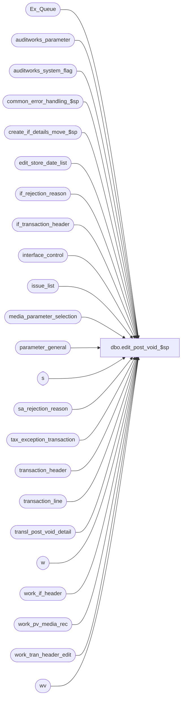

# dbo.edit_post_void_$sp

**Database:** auditworks  
**Server:** bedrockdb01  

## Architecture Diagram



## Table Dependencies

| Referenced Table |
|---|
| Ex_Queue |
| auditworks_parameter |
| auditworks_system_flag |
| common_error_handling_$sp |
| create_if_details_move_$sp |
| edit_store_date_list |
| if_rejection_reason |
| if_transaction_header |
| interface_control |
| issue_list |
| media_parameter_selection |
| parameter_general |
| s |
| sa_rejection_reason |
| tax_exception_transaction |
| transaction_header |
| transaction_line |
| transl_post_void_detail |
| w |
| work_if_header |
| work_pv_media_rec |
| work_tran_header_edit |
| wv |

## Stored Procedure Code

```sql
create proc dbo.edit_post_void_$sp @process_id      binary(16),
@user_id         int,
@errmsg          nvarchar(2000) OUTPUT,
@edit_timestamp  float,
@edit_process_no tinyint = 1

AS

/* Proc name: edit_post_void_$sp
   Desc : flag post voided transactions.
          Called by edit_post_$sp.
HISTORY :                  
Date     Name           Def# Desc
Aug25,16 Vicci     DAOM-1313 Correct bad aliases and column name typos introduced by DAOM-90
Feb23,16 Daphna		DAOM-90	 port TFS144905 to MSSQL (truncates not required because temp tables created)
							 do not post void when more that one matching txn
							 also add date_reject_id column to insert if_transaction_header (instead of relying on column default)
Dec17,14 Paul          94103 use try catch
Oct09,12 Vicci        121947 Log transactions which POS has marked as successful post-voiding transactions as S/A rejects if the corresponding
                             transaction to be post-voided cannot be found.
Mar24,11 Vicci        125772 Allow nulls in the #work_special_post_void table to support the initial insert (nulls subsequently updated).
Dec19,10 Paul         105313 Use unicode datatypes for error trap
Aug11,10 Paul         120111 moved delete of interface_control to end of proc after insert to Ex_Queue
Jul16,10 Vicci        119562 Remove transactions that have been post-voided from list of pre-audit tax-exception transactions,
			     since transactions being post-voided may be from a prior batch.
Dec05,08 Paul          87777 Refix to avoid error, code reviewed
Jul31,08 Paul          87777 uplift 103326 to SA5
Apr05.07 Daphna      DV-1360 uplift 1-3MN9A7	
Dec07,06 Paul        DV-1347 corrected create table, uplift 1-34SQGL to SA5
Oct25,06 Phu           77931 Fix outer join for SQL 2005 Mode 90.
Jul31,06 Tim           69753 Uplift defect 1-3474TN to SA5
Aug25,05 Paul          59056 populate work_pv_media_rec
Jun21,05 Paul        DV-1282 return earlier if no successful post voids exist
Apr29,05 Paul        DV-1234 expand transaction_id to use tran_id_datatype
Dec14,04 Maryam      DV-1191 Improve performance. Removed Eastbourne ELP logic due to interface_id conflict.
Sep23,04 David       DV-1146 uplift 1-1AEKAS to SA5. Removed obsolete code.
May07,04 Maryam      DV-1071 Receive @process_id and pass it to the sub procs
Jul31,08 Vicci/Paul   103326 Handle new transaction_void_flag 10 (Post-voiding reversal if original transaction not found else Post-voiding)
Mar23.07 Daphna     1-3MN9A7 Ensure postvoiding txns from other batch match on transaction_series	
Apr24,06 Daphna     1-34SQGL Transactions do not get postvoided if they are after closeout and
                             moved to next business date
Aug15,05 Daphna     1-3474TN reverse media rec effect of post-voided txns
May30,05 David      1-1AEKAS Set effective_date to entry_date_time.
Apr24,03 Paul        1-KO2HY populate till_no
Jul23,02 Paul        1-E7L7M populate key_11 in Ex_Queue with entry_date_time
Nov26,01 Winnie	     1-969YY Add logic for R3 error handling to pass @edit_process_no
Nov01,01 ShuZ	        8900 TRANSL edit changes for Sybase
Jul25,01 David C        8413 Add transaction_id to if_transaction_header
Apr23,01 David M 	7589 Missing transactions by transaction series Version 1.0
Sep15,00 Paul S		6724 Do not check for transaction_series = blank on voided trans
Jul07,00 Louise M       6448 Moved the DELETE of interface_control AFTER the insert into 
                             Ex_Queue which is using that table.
Mar29,00 Paul S		6091 Ignore transaction_series on voiding trans
				when looking for trans to void.
Mar07,00 Paul S		5692 avoid interface rejects on trickle voided transactions
Jan06,00 Paul S		5782 make Eastbourne logic consistent with Oracle
Sep09,99 Daphna 	5280 insert extra line only if interface_id 20 has update timing !=0 	
Sep07,99 Paul S		5279 set source_process_no = 1
Mar15,99 Louise M.	4346 To switch the DELETE interface_control code with the INSERT   
     	                     if_interface_control code towards the end of the procedure.                 
Dec18,98 Paul S.	n/a				                                   
         Paul		author
*/                                   

DECLARE @errno			int,
	@errmsg2		nvarchar(2000),
	@errline		int,
	@post_void_qty		int,
	@retry			tinyint,
	@rows			int,
	@rows_inserted		int,	
	@rows_deleted		int,	
	@rows_prev_day		int,
	@trickle_polling_flag	tinyint,
	@message_id		int,	
	@object_name		nvarchar(255),	
	@operation_name		nvarchar(100),
	@process_name		nvarchar(100),
	@special_void_rows	int,      	
	@del_rows			int,
         @expired_issue_rows		int,
         @date_time_retrieval            datetime,
         @min_transaction_date           smalldatetime,
         @auto_verify_dayend_issues      tinyint;

SELECT @retry = 0,
	@process_name = 'edit_post_void_$sp',
	@message_id = 201068,
	@special_void_rows = 0; 	

BEGIN TRY

   SELECT @errmsg = 'Failed to select post_void_qty',
          @object_name = 'transl_post_void_detail',
          @operation_name = 'SELECT'  
SELECT @post_void_qty = ISNULL(COUNT(store_no),0)
  FROM transl_post_void_detail WITH (NOLOCK)
 WHERE post_void_successful = 1
   AND post_voided_trans_no >= 0;

IF @post_void_qty = 0
  RETURN;

   SELECT @errmsg = 'Failed to select trickle_polling_flag',
          @object_name = 'parameter_general';
SELECT @trickle_polling_flag = ISNULL(trickle_polling_flag,0)
  FROM parameter_general;

   SELECT @errmsg = 'Failed to create table #work_voids_edit',
          @object_name = '#work_voids_edit',
          @operation_name = 'CREATE TABLE';
CREATE TABLE #work_voids_edit(
    post_voiding_transaction_id numeric(14,0) not null, -- tran_id_datatype
	store_no			 int not null,
	post_voided_register	 smallint not null,
	transaction_date		 smalldatetime not null,
	transaction_series	 nchar(1) not null,
	post_voided_trans_no	 int not null,
	transaction_void_flag	 smallint null,
	post_voided_transaction_id	 numeric(14,0) null, -- tran_id_datatype
	register_no				smallint null,  -- DAOM-90
	sa_rejection_flag		tinyint null);  -- DAOM-90

   SELECT @errmsg = 'Failed to create table #work_tran_void',
          @object_name = '#work_tran_void';
CREATE TABLE #work_tran_void(
       post_voiding_transaction_id numeric(14,0) not null, -- tran_id_datatype
       transaction_id	 	numeric(14,0) not null, -- tran_id_datatype
       transaction_void_flag	smallint not null,
       entry_date_time		datetime not null,
       transaction_date		smalldatetime not null,
       sa_rejection_flag	tinyint not null,
       store_no			int null)  

   SELECT @errmsg = 'Failed to create table #work_special_post_void',
          @object_name = '#work_special_post_void';
CREATE TABLE #work_special_post_void(
	store_no			int not null,
	post_voided_register		smallint not null,
	transaction_date		smalldatetime not null,
	transaction_series		nchar(1) not null,
	post_voided_trans_no		int not null,
	transaction_id			numeric(14,0) null, -- tran_id_datatype
	transaction_void_flag		smallint null,
	post_voiding_transaction_id	numeric(14,0) null, -- tran_id_datatype
	post_voiding_trans_void_flag	smallint null,
	current_batch_flag		tinyint not null,
	register_no				smallint null,  -- DAOM-90
	sa_rejection_flag		tinyint null);  -- DAOM-90

   SELECT @errmsg = 'Failed to create table #transl_post_void_detail',
          @object_name = '#transl_post_void_detail';
CREATE TABLE #transl_post_void_detail(
	store_no				int not null,
	register_no			smallint not null,
	entry_date_time			datetime not null,
	transaction_series		nchar(1) not null,
	transaction_no			int not null,
	line_id				numeric(5,0) not null,
	post_voided_register		smallint not null,
	post_voided_trans_no		int not null,
	post_void_successful		tinyint not null,
	post_void_reason_code		smallint null,
	row_sequence_no			numeric(12,0) not null,
	transaction_date			smalldatetime null,
	post_voiding_transaction_id	numeric(14,0) null, -- tran_id_datatype
	post_voiding_trans_void_flag	smallint null);


-- get list of all post voiding lines that have a matching header entry
  SELECT @errmsg = 'Failed to insert #transl_post_void_detail',
         @object_name = '#transl_post_void_detail',
         @operation_name = 'INSERT';
INSERT #transl_post_void_detail(
	store_no,
	register_no,
	entry_date_time,
	transaction_series,
	transaction_no,
	line_id,
	post_voided_register,
	post_voided_trans_no,
	post_void_successful,
	post_void_reason_code,
	row_sequence_no,
	transaction_date,
	post_voiding_transaction_id,
	post_voiding_trans_void_flag)
SELECT pv.store_no,
	pv.register_no,
	pv.entry_date_time,
	pv.transaction_series,
	pv.transaction_no,
	pv.line_id,
	pv.post_voided_register,
	pv.post_voided_trans_no,
	pv.post_void_successful,
	pv.post_void_reason_code,
	pv.row_sequence_no,
	wh.transaction_date,
	wh.transaction_id,
	wh.transaction_void_flag
  FROM transl_post_void_detail pv WITH (NOLOCK)
    JOIN work_tran_header_edit wh WITH (NOLOCK)
      ON pv.store_no = wh.store_no
     AND pv.register_no = wh.register_no
     AND pv.entry_date_time = wh.entry_date_time
     AND pv.transaction_series = wh.transaction_series
     AND pv.transaction_no = wh.transaction_no;

-- void matching transactions in the current edit batch
-- when there are multiple possible matches, do not post-void
   SELECT @errmsg = 'Failed to update work_tran_header_edit',
          @object_name = 'work_tran_header_edit',
          @operation_name = 'UPDATE';
  UPDATE  w
  SET  transaction_void_flag = 1
  FROM  work_tran_header_edit w
  JOIN (SELECT pv.store_no, pv.post_voided_register, pv.transaction_date,
		 pv.post_voided_trans_no, pv.transaction_series, count(1) as  pv_count
        FROM  #transl_post_void_detail pv
        JOIN  work_tran_header_edit wh
        ON  pv.store_no = wh.store_no
        AND  pv.post_voided_register = wh.register_no
        AND  pv.transaction_date =  wh.transaction_date
        AND  pv.post_voided_trans_no = wh.transaction_no
        AND  pv.transaction_series = wh.transaction_series
        WHERE  pv.post_void_successful = 1  AND  pv.post_voided_trans_no >= 0
        GROUP BY pv.store_no, pv.post_voided_register, pv.transaction_date,
		 pv.post_voided_trans_no, pv.transaction_series
		 HAVING COUNT(1) =1) p 
	ON  p.store_no = w.store_no AND p.post_voided_register = w.register_no
	 AND p.transaction_date = w.transaction_date AND p.post_voided_trans_no = w.transaction_no
	 AND p.transaction_series = w.transaction_series;
   
SELECT @rows = @@rowcount;

IF @rows != @post_void_qty -- some trans remain to be post voided
-- do not postvoid where there are multiple possible matches
  BEGIN
     SELECT @errmsg = 'Failed to insert temp table listing special post-void handling requests',
            @object_name = '#work_special_post_void',
            @operation_name = 'INSERT';
  INSERT #work_special_post_void (
	store_no,
	post_voided_register,
	transaction_date,
	transaction_series,
	post_voided_trans_no,
	transaction_id,
	transaction_void_flag,
	post_voiding_transaction_id, 
    post_voiding_trans_void_flag,
    current_batch_flag,
    register_no,
    sa_rejection_flag)
  SELECT pv.store_no, 
        pv.post_voided_register,
		pv.transaction_date,
		pv.transaction_series,
		pv.post_voided_trans_no,
		MAX(wh.transaction_id),
		MAX(wh.transaction_void_flag),
		pv.post_voiding_transaction_id,
		MAX(CASE WHEN wh.transaction_id IS NULL THEN pv.post_voiding_trans_void_flag ELSE 5 END),
		MAX(CASE WHEN wh.transaction_id IS NULL THEN 0 ELSE 1 END),
		MAX(wh.register_no),
		MAX(wh.sa_rejection_flag)
    FROM #transl_post_void_detail pv WITH (NOLOCK)
    LEFT OUTER JOIN work_tran_header_edit wh WITH (NOLOCK)
           ON pv.store_no = wh.store_no
          AND pv.post_voided_register = wh.register_no
          AND pv.transaction_date = wh.transaction_date
         AND pv.post_voided_trans_no = wh.transaction_no
          AND pv.transaction_series = wh.transaction_series
   WHERE pv.post_void_successful = 1     AND pv.post_voided_trans_no >= 0      
     AND pv.post_voiding_trans_void_flag = 10
   GROUP BY pv.store_no, pv.post_voided_register, pv.transaction_date,
		pv.transaction_series, pv.post_voided_trans_no, pv.post_voiding_transaction_id
   HAVING COUNT(1) =1;
   
  SELECT @special_void_rows = @@rowcount;

  IF @special_void_rows > 0
 
  BEGIN
      SELECT @errmsg = 'Failed to mark cross-register post-voids as found',
             @object_name = '#work_special_post_void',
             @operation_name = 'UPDATE';
    UPDATE s
       SET transaction_id = wh.transaction_id,
           post_voiding_trans_void_flag = 5,
           current_batch_flag = 1,
           register_no = wh.register_no,
           sa_rejection_flag=wh.sa_rejection_flag
      FROM #work_special_post_void s
      JOIN work_tran_header_edit wh
          ON s.store_no = wh.store_no
		  AND s.transaction_date = wh.transaction_date
		  AND s.post_voided_trans_no = wh.transaction_no
		  AND s.transaction_series = wh.transaction_series
      WHERE s.transaction_id IS NULL 
      AND EXISTS (SELECT 1	  -- not when there are multiple transactions that match
                FROM work_tran_header_edit w
                WHERE s.store_no = w.store_no
				AND s.transaction_date = w.transaction_date
				AND s.post_voided_trans_no = w.transaction_no
				AND s.transaction_series = w.transaction_series
				GROUP BY w.store_no, w.transaction_date, w.transaction_no, w.transaction_series
				HAVING COUNT(1)=1);

      SELECT @errmsg = 'Failed to mark cross-date post-voids as found';
    UPDATE s
       SET transaction_id = wh.transaction_id,
           post_voiding_trans_void_flag = 5,
           current_batch_flag = 1,
           register_no = wh.register_no,
           sa_rejection_flag = wh.sa_rejection_flag
      FROM #work_special_post_void s
      JOIN work_tran_header_edit wh WITH (NOLOCK) 
          ON s.store_no = wh.store_no
			AND s.post_voided_trans_no = wh.transaction_no
			AND s.transaction_series = wh.transaction_series
     WHERE s.transaction_id IS NULL
       AND EXISTS(SELECT 1  -- not when there are multiple transactions that match
				FROM work_tran_header_edit w
				WHERE s.store_no = w.store_no
				AND s.post_voided_trans_no = w.transaction_no
				AND s.transaction_series = w.transaction_series
				GROUP BY w.store_no, w.transaction_no, w.transaction_series
				HAVING COUNT(1) = 1);

    IF @trickle_polling_flag <> 0
    BEGIN
      SELECT @errmsg = 'Failed to mark outside-of-batch post-voids as found';
      UPDATE s
      SET transaction_id = h.transaction_id,
             post_voiding_trans_void_flag = 5,
             current_batch_flag = 0,
             transaction_void_flag = h.transaction_void_flag,
             register_no = h.register_no,
             sa_rejection_flag = h.sa_rejection_flag
      FROM #work_special_post_void s
      JOIN transaction_header h WITH (NOLOCK) 
			ON s.transaction_date = h.transaction_date
			AND s.store_no = h.store_no
			AND s.post_voided_register = h.register_no
			AND s.post_voided_trans_no = h.transaction_no
			AND s.transaction_series = h.transaction_series
      WHERE s.transaction_id IS NULL  
	  AND EXISTS (SELECT 1  --not when there are multiple transactions that match
			FROM transaction_header hh WITH (NOLOCK) 
			WHERE s.transaction_date = hh.transaction_date
			AND s.store_no = hh.store_no
			AND s.post_voided_register = hh.register_no
			AND s.post_voided_trans_no = hh.transaction_no
			AND s.transaction_series = hh.transaction_series 
			GROUP BY hh.transaction_date, hh.store_no, hh.register_no, hh.transaction_no, hh.transaction_series
			HAVING COUNT(1)=1);
			
      SELECT @errmsg = 'Failed to mark outside-of-batch cross-register post-voids as found';
      UPDATE s
      SET transaction_id = h.transaction_id,
		post_voiding_trans_void_flag = 5,
	    current_batch_flag = 0,
	    transaction_void_flag = h.transaction_void_flag,
	    register_no = h.register_no,
	    sa_rejection_flag = h.sa_rejection_flag 
      FROM #work_special_post_void s
      JOIN transaction_header h ON s.transaction_date = h.transaction_date
         AND s.store_no = h.store_no
         AND s.post_voided_trans_no = h.transaction_no
         AND s.transaction_series = h.transaction_series      
         AND h.transaction_void_flag IN (0,1)
      JOIN edit_store_date_list w ON h.store_no = w.store_no
         AND h.transaction_date = w.transaction_date
         AND h.register_no = w.register_no
         AND h.date_reject_id = w.date_reject_id
      WHERE s.transaction_id IS NULL
      AND EXISTS (SELECT 1  --not when there are multiple transactions that match
                 FROM transaction_header hh 
                 JOIN edit_store_date_list ww ON hh.store_no = ww.store_no
						AND hh.transaction_date = ww.transaction_date
						AND hh.register_no = ww.register_no
						AND hh.date_reject_id = ww.date_reject_id
                 WHERE s.transaction_date = hh.transaction_date
					AND s.store_no = hh.store_no
					AND s.post_voided_trans_no = hh.transaction_no
					AND s.transaction_series = hh.transaction_series      
					AND hh.transaction_void_flag IN (0,1)
				 GROUP BY hh.transaction_date, hh.store_no, hh.transaction_no, hh.transaction_series
				 HAVING COUNT(1)=1 );
				 
	  SELECT @errmsg = 'Failed to mark cross-date post-voids as found';
      UPDATE s
      SET transaction_id = h.transaction_id,
          post_voiding_trans_void_flag = 5,
          current_batch_flag = 0,
          transaction_void_flag = h.transaction_void_flag,
          register_no = h.register_no,
          sa_rejection_flag = h.sa_rejection_flag 
      FROM #work_special_post_void s
      JOIN transaction_header h ON s.store_no = h.store_no
         AND s.post_voided_trans_no = h.transaction_no
         AND s.transaction_series =  h.transaction_series
         AND h.transaction_void_flag IN (0,1)
      JOIN edit_store_date_list w ON  h.store_no = w.store_no
         AND h.transaction_date = w.transaction_date
         AND h.register_no = w.register_no
         AND h.date_reject_id = w.date_reject_id
      WHERE s.transaction_id IS NULL
      AND EXISTS (SELECT 1  --not when there are multiple transactions that match
				FROM transaction_header hh
				JOIN edit_store_date_list ww ON  h.store_no = ww.store_no
					AND h.transaction_date = ww.transaction_date
					AND h.register_no = ww.register_no
					AND h.date_reject_id = ww.date_reject_id
				WHERE s.store_no = hh.store_no
				AND s.post_voided_trans_no = hh.transaction_no
				AND s.transaction_series =  hh.transaction_series
				AND hh.transaction_void_flag IN (0,1)
				GROUP BY hh.store_no, hh.transaction_no, hh.transaction_series
				HAVING COUNT(1)=1);

    END; --IF @trickle_polling_flag <> 0

       SELECT @errmsg = 'Failed to mark post-voiding transaction as a post-voiding reversal instead';    
    UPDATE #work_special_post_void
       SET post_voiding_trans_void_flag = 8,
           current_batch_flag = 1
     WHERE transaction_id IS NULL;

	SELECT @errmsg = 'Failed to mark current batch transactions as post-voided',
	       @object_name = 'work_tran_header_edit'; 
    UPDATE work_tran_header_edit
       SET transaction_void_flag = 1
      FROM #work_special_post_void s, work_tran_header_edit w
     WHERE s.current_batch_flag = 1
	AND s.transaction_id IS NOT NULL
	AND s.transaction_void_flag IS NULL  --i.e. wasn't already marked as void in the "easy" match.
	AND s.transaction_id = w.transaction_id
	AND w.transaction_void_flag <> 1;

       SELECT @errmsg = 'Failed to mark post-voiding-reversal-if-original-not-found requests as as post-voiding vs post-voiding-reversal';
    UPDATE work_tran_header_edit
      SET transaction_void_flag = pv.post_voiding_trans_void_flag
      FROM #work_special_post_void pv, work_tran_header_edit w
     WHERE pv.post_voiding_transaction_id = w.transaction_id;

  END; --IF @special_void_rows > 0  --103326

     SELECT @errmsg = 'Failed to insert #work_voids_edit',
           @object_name = '#work_voids_edit',
           @operation_name = 'INSERT';
  INSERT INTO #work_voids_edit(
         post_voiding_transaction_id,
         store_no,
         post_voided_register,
         transaction_date,
         transaction_series,
         post_voided_trans_no,
         transaction_void_flag,
         register_no,
         sa_rejection_flag) 
  SELECT pv.post_voiding_transaction_id,
         pv.store_no,
        pv.post_voided_register,
         pv.transaction_date,
         pv.transaction_series,
         pv.post_voided_trans_no,
         wh.transaction_void_flag,
         wh.register_no,
         wh.sa_rejection_flag
    FROM #transl_post_void_detail pv WITH (NOLOCK)
    LEFT OUTER JOIN work_tran_header_edit wh WITH (NOLOCK)
      ON pv.store_no = wh.store_no
     AND pv.post_voided_register = wh.register_no
     AND pv.transaction_date = wh.transaction_date
     AND pv.post_voided_trans_no = wh.transaction_no
     AND pv.transaction_series = wh.transaction_series
   WHERE pv.post_void_successful = 1
     AND pv.post_voided_trans_no >= 0
     AND pv.post_voiding_trans_void_flag <> 10;

  SELECT @rows_inserted = @@rowcount;

  /* Attempt to match unmatched post voids to previous transaction date (within same batch) */
  /* search previous transaction_date */
    SELECT @errmsg = 'Failed to update work_tran_header_edit (prev day)',
           @object_name = 'work_tran_header_edit',
           @operation_name = 'UPDATE';
  UPDATE work_tran_header_edit
     SET transaction_void_flag = 1
    FROM #work_voids_edit wv WITH (NOLOCK), work_tran_header_edit wh
   WHERE wv.transaction_void_flag IS NULL /* not matched yet */
     AND wv.store_no = wh.store_no
     AND wv.post_voided_register = wh.register_no
     AND DATEADD(dd, -1, wv.transaction_date)  = wh.transaction_date
     AND wv.post_voided_trans_no = wh.transaction_no
     AND wv.transaction_series = wh.transaction_series
     AND wh.transaction_void_flag != 1;

  SELECT @rows_prev_day = @@rowcount;

  IF @rows_prev_day >= 1
    SELECT @rows = @rows + @rows_prev_day;

  IF @special_void_rows > 0
  BEGIN
        SELECT @errmsg = 'Failed to add special handling post-voids to #work_voids_edit',
             @object_name = '#work_voids_edit',
             @operation_name = 'INSERT';
    INSERT INTO #work_voids_edit(
           post_voiding_transaction_id, store_no, post_voided_register, transaction_date,
           transaction_series, post_voided_trans_no, transaction_void_flag,
           post_voided_transaction_id)
    SELECT post_voiding_transaction_id, store_no, post_voided_register, transaction_date,
           transaction_series, post_voided_trans_no, transaction_void_flag,
           transaction_id
      FROM #work_special_post_void
     WHERE current_batch_flag = 0
       AND transaction_id IS NOT NULL
       AND transaction_void_flag = 0;

    SELECT @rows_inserted = IsNull(@rows_inserted, 0) + @@rowcount;

  END; --IF @special_void_rows > 0

END; /* If @rows != @post_void_qty */
ELSE    --103326
BEGIN
      SELECT @errmsg = 'Failed to post-voiding-reversal if original not found else post-voiding requests as Post Voiding',
           @object_name = 'work_tran_header_edit',
           @operation_name = 'UPDATE';
  UPDATE work_tran_header_edit
     SET transaction_void_flag = 5
    FROM #transl_post_void_detail pv, work_tran_header_edit w
   WHERE pv.post_voiding_transaction_id = w.transaction_id
     AND pv.post_voiding_trans_void_flag = 10
     AND w.transaction_void_flag = 10;

END; --ELSE of IF @rows != @post_void_qty 

-- drop temp tables to release space

DROP TABLE #transl_post_void_detail;
DROP TABLE #work_special_post_void;

IF @rows = @post_void_qty -- return if there are no remaining unmatched voids
  RETURN;

/* exclude transactions that were matched to the previous day */
    SELECT @errmsg = 'Failed to DELETE #work_voids_edit (1)',
         @object_name = '#work_voids_edit',
         @operation_name = 'DELETE';
DELETE wv
  FROM #work_voids_edit wv
  JOIN work_tran_header_edit wh WITH (NOLOCK)
    ON wv.store_no = wh.store_no
   AND wv.post_voided_register = wh.register_no
   AND DATEADD(dd,-1,wv.transaction_date) = wh.transaction_date
   AND wv.post_voided_trans_no = wh.transaction_no
   AND wv.transaction_series = wh.transaction_series
   AND wh.transaction_void_flag = 1 /* voids previously matched to prev day */
 WHERE wv.transaction_void_flag IS NULL; 

SELECT @rows_deleted = @@rowcount;

IF @rows_deleted = @rows_inserted -- return if there are no remaining unmatched voids
  RETURN;

IF @trickle_polling_flag = 0
BEGIN
      SELECT @errmsg = 'Failed to insert sa_rejection_reason (reason=post-voided transaction not found)',
           @object_name = 'sa_rejection_reason',
           @operation_name = 'INSERT';
  INSERT sa_rejection_reason (
	 transaction_id,
	 line_id,
	 violated_sareject_rule )
  SELECT DISTINCT pv.post_voiding_transaction_id,
	 0,
	 17
    FROM #work_voids_edit pv
   WHERE ISNULL(pv.transaction_void_flag,0)=0  ----  --not matched
     AND pv.post_voided_transaction_id IS NULL;

      SELECT @errmsg = 'Failed to update transaction_header (sa_rejection_flag)',
           @object_name = 'work_tran_header_edit',
           @operation_name = 'UPDATE'; 
           
           
  UPDATE w
     SET sa_rejection_flag = 1
    FROM #work_voids_edit pv
    JOIN work_tran_header_edit w ON w.transaction_id = pv.post_voiding_transaction_id
			AND pv.post_voided_transaction_id IS NULL
			AND ISNULL(pv.transaction_void_flag,0)=0 --- IS NULL  --not matched
    WHERE w.sa_rejection_flag = 0;

  RETURN;
END;  --IF @trickle_polling_flag = 0

   SELECT @errmsg = 'Failed to delete work_if_header',
         @object_name = 'work_if_header',
         @operation_name = 'DELETE';
DELETE work_if_header
 WHERE process_id = @process_id;

-- Create reversing entries in the interface for any remaining unmatched post voiding trans
-- that can now be matched to tran header, i.e. to previous edit batches
SELECT @errmsg = 'Failed to insert #work_tran_void',
          @object_name = '#work_tran_void',
          @operation_name = 'INSERT';
INSERT INTO #work_tran_void(
       post_voiding_transaction_id,
       transaction_id,
       transaction_void_flag,
       entry_date_time,
       transaction_date,
       sa_rejection_flag,
       store_no)
SELECT wv.post_voiding_transaction_id,
       th.transaction_id,
       th.transaction_void_flag,
       th.entry_date_time,
       th.transaction_date,
       th.sa_rejection_flag,
       th.store_no
FROM #work_voids_edit wv WITH (NOLOCK)
JOIN transaction_header th WITH (NOLOCK)
     ON wv.store_no = th.store_no
    AND wv.post_voided_register = th.register_no
    AND wv.transaction_date = th.transaction_date
    AND wv.post_voided_trans_no = th.transaction_no
    AND wv.transaction_series = th.transaction_series
WHERE wv.transaction_void_flag IS NULL /* not matched yet */
    AND wv.post_voided_transaction_id IS NULL  --not special request
    AND EXISTS (SELECT 1  --not when there are multiple transactions that match
                FROM transaction_header hh WITH (NOLOCK)
				WHERE wv.store_no = hh.store_no
				AND wv.post_voided_register = hh.register_no
				AND wv.transaction_date = hh.transaction_date
				AND wv.post_voided_trans_no = hh.transaction_no
				AND wv.transaction_series = hh.transaction_series
                GROUP BY hh.store_no, hh.register_no, hh.transaction_date, hh.transaction_no, hh.transaction_series
                HAVING COUNT(1)=1); 

SELECT @errmsg = 'Failed to add special requests to temp table #work_tran_void';
INSERT INTO #work_tran_void(
       post_voiding_transaction_id,
       transaction_id,
       transaction_void_flag,
       entry_date_time,
       transaction_date,
       sa_rejection_flag,
       store_no)
SELECT wv.post_voiding_transaction_id,
       th.transaction_id,
       th.transaction_void_flag,
       th.entry_date_time,
       th.transaction_date,
       th.sa_rejection_flag,
       th.store_no 
FROM #work_voids_edit wv WITH (NOLOCK)
JOIN transaction_header th WITH (NOLOCK)
    ON wv.post_voided_transaction_id = th.transaction_id
WHERE wv.post_voided_transaction_id IS NOT NULL;  --special request

SELECT @errmsg = 'from #work_voids_edit, header and media_parameter_selection',
           @object_name = 'work_pv_media_rec';
INSERT INTO work_pv_media_rec
         (orig_transaction_id, rec_process_id)
SELECT DISTINCT th.transaction_id, 0
FROM #work_voids_edit wv WITH (NOLOCK)
JOIN transaction_header th WITH (NOLOCK)
       ON wv.store_no = th.store_no
      AND wv.post_voided_register = th.register_no
      AND wv.transaction_date = th.transaction_date
      AND wv.post_voided_trans_no = th.transaction_no
      AND wv.transaction_series = th.transaction_series
      AND th.date_reject_id = 0 
      AND th.sa_rejection_flag = 0
      AND th.transaction_void_flag in (0,8) -- not already voided
JOIN media_parameter_selection mps
       ON th.store_no = mps.store_no 
      AND th.register_no = mps.register_no 
      AND th.transaction_date >= mps.effective_from_date 
      AND (th.transaction_date < mps.effective_until_date OR mps.effective_until_date IS NULL)    
WHERE wv.transaction_void_flag IS NULL /* not matched yet */
AND EXISTS (SELECT 1  --not when there are multiple transactions that match
            FROM transaction_header hh
			WHERE wv.store_no = hh.store_no
				AND wv.post_voided_register = hh.register_no
                AND wv.transaction_date = hh.transaction_date
                AND wv.post_voided_trans_no = hh.transaction_no
                AND wv.transaction_series = hh.transaction_series
            GROUP BY hh.store_no, hh.register_no, hh.transaction_date, hh.transaction_no, hh.transaction_series
            HAVING COUNT(1)=1);

SELECT @errmsg = 'FROM transaction_header (unmatched)', @object_name = '#work_voids_edit';
UPDATE  wv
SET transaction_void_flag = th.transaction_void_flag
FROM #work_voids_edit wv
JOIN transaction_header th ON  wv.store_no = th.store_no
              AND wv.post_voided_register = th.register_no
              AND wv.transaction_date = th.transaction_date
              AND wv.post_voided_trans_no = th.transaction_no
              AND wv.transaction_series = th.transaction_series
WHERE  wv.transaction_void_flag IS NULL /* not matched in same batch */
AND EXISTS (SELECT 1   --not when there are multiple transactions that match
            FROM transaction_header hh
            WHERE wv.store_no = hh.store_no
            AND wv.post_voided_register = hh.register_no
            AND wv.transaction_date = hh.transaction_date
            AND wv.post_voided_trans_no = hh.transaction_no
            AND wv.transaction_series = hh.transaction_series
            GROUP BY hh.store_no, hh.register_no, hh.transaction_date, hh.transaction_no, hh.transaction_series
            HAVING COUNT(1) = 1 );  

SELECT @errmsg = 'Failed to insert work_if_header',
          @object_name = 'work_if_header',
          @operation_name = 'INSERT';
INSERT work_if_header (
	process_id,
	transaction_id,
	if_entry_no,
	effective_date,
	entry_date_time )
  SELECT DISTINCT
	@process_id,
	wt.transaction_id,
	0,
	wt.transaction_date,
	wt.entry_date_time
  FROM #work_tran_void wt WITH (NOLOCK)
  JOIN interface_control ic WITH (NOLOCK)
    ON wt.transaction_id = ic.transaction_id
    AND interface_status_flag = 1 /* not i/f reject */
  WHERE wt.transaction_void_flag IN (0,8) /* not already voided */
    AND wt.transaction_id >= 1;

  SELECT @rows = @@rowcount;

IF @rows >= 1 -- (feed reversals)
  BEGIN /* Create reversing entries in the interfaces */
      SELECT @errmsg = 'Failed to insert if_transaction_header',
             @object_name = 'if_transaction_header';
   INSERT if_transaction_header (
        store_no,
	register_no,
	transaction_date,
	date_reject_id,
	transaction_series,
	transaction_no,
	entry_date_time,
	cashier_no,
	transaction_category,
	tender_total,
	transaction_void_flag,
	customer_info_exists,
	exception_flag,
	deposit_declaration_flag,
	closeout_flag,
	media_count_flag,
	customer_modified_flag,
	tax_override_flag,
	pos_tax_jurisdiction,
	source_process_no,
	edit_timestamp, 
	employee_no,
	transaction_remark,
	last_modified_date_time,
	in_use_timestamp,
	updated_by_user_id,
	transaction_id,
	till_no )
   SELECT 
	store_no,
	register_no,
	transaction_date,
	date_reject_id,
	transaction_series,
	transaction_no,
	th.entry_date_time,
	cashier_no,
	transaction_category,
	tender_total,
	8,              /* post voiding reversal */
	customer_info_exists,
	exception_flag,
	deposit_declaration_flag,
	closeout_flag,
	media_count_flag,
	customer_modified_flag,
	tax_override_flag,
	pos_tax_jurisdiction,
	1,
	@edit_timestamp, 
	employee_no,
	transaction_remark,
	last_modified_date_time,
	in_use_timestamp,
	updated_by_user_id,
	th.transaction_id,
	th.till_no
     FROM  work_if_header wf WITH (NOLOCK)
     JOIN transaction_header th WITH (NOLOCK)
       ON wf.transaction_id = th.transaction_id
    WHERE process_id = @process_id;

   /* Determine if_entry_no for interface headers just inserted */
       SELECT @errmsg = 'Failed to update work_if_header',
             @object_name = 'work_if_header',
             @operation_name = 'UPDATE';
   UPDATE work_if_header
     SET if_entry_no = ith.if_entry_no
     FROM work_if_header wf
     JOIN transaction_header th WITH (NOLOCK)
       ON wf.transaction_id = th.transaction_id
     JOIN if_transaction_header ith WITH (NOLOCK)
        ON th.store_no = ith.store_no
       AND th.register_no = ith.register_no
       AND th.transaction_date = ith.transaction_date
       AND th.entry_date_time = ith.entry_date_time
       AND th.transaction_no = ith.transaction_no
       AND th.transaction_series = ith.transaction_series
       AND ith.edit_timestamp = @edit_timestamp
    WHERE process_id = @process_id;

    /* set voiding_reversal_flag = -1 */
        SELECT @errmsg = 'Failed to execute create_if_details_move',
               @object_name = 'create_if_details_move',
               @operation_name = 'EXEC';
   EXEC create_if_details_move_$sp @process_id, @user_id, -1, @errmsg OUTPUT;

  END; /* If @rows >= 1 (feed reversals) */

/* Remove any interface rejects on the voided transactions */

BEGIN TRANSACTION
   SELECT @errmsg = 'Failed to delete if_rejection_reason',
          @object_name = 'if_rejection_reason',
          @operation_name = 'DELETE';
DELETE if_rejection_reason
  FROM if_rejection_reason ir
  JOIN #work_tran_void wt WITH (NOLOCK)
     ON wt.transaction_id = ir.transaction_id
    AND wt.transaction_id >= 1;

   SELECT @errmsg = 'Failed to update transaction_line (if-rejects)',
          @object_name = 'transaction_line',
          @operation_name = 'UPDATE';
UPDATE transaction_line
   SET interface_rejection_flag = 0
  FROM transaction_line tl
  JOIN #work_tran_void wt WITH (NOLOCK)
    ON wt.transaction_id = tl.transaction_id
   AND wt.transaction_id >= 1   
 WHERE interface_rejection_flag = 1;

---Start cleanup tax exceptions  (this code cut & pasted from sales_tax_exceptions_$sp)
    SELECT @errmsg = 'Failed to delete tax_exception_transaction table previously logged',
	 @object_name = 'tax_exception_transaction',
	 @operation_name = 'DELETE';
DELETE tax_exception_transaction
  FROM #work_tran_void wt
 WHERE wt.transaction_id = tax_exception_transaction.av_transaction_id;

SELECT @del_rows = @@rowcount;
 
IF @del_rows > 0 --from tax_exception_transaction reset
  BEGIN
        SELECT @errmsg = 'Failed to select prior flag_datetime_value.',
	     @object_name = 'auditworks_system_flag',
	     @operation_name = 'SELECT';
    SELECT @date_time_retrieval = flag_datetime_value
      FROM auditworks_system_flag
     WHERE flag_name = 'min_tax_issue_date';

    IF @date_time_retrieval IS NOT NULL
    BEGIN 
          SELECT @errmsg = 'Failed to reset issue_list.',
	       @object_name = 'issue_list',
	    @operation_name = 'UPDATE';
      UPDATE issue_list
         SET verified = 1,
             verified_by_user_id = NULL, -- system     
             verified_date = getdate()
        FROM (SELECT DISTINCT store_no, transaction_date
                FROM #work_tran_void) tt
       WHERE tt.store_no = issue_list.store_no
         AND tt.transaction_date = issue_list.transaction_date
         AND issue_list.issue_type = 1
         AND issue_list.verified = 0
         AND issue_list.transaction_date >= @date_time_retrieval;       

      SELECT @expired_issue_rows = @@rowcount;

      IF @expired_issue_rows > 0 
      BEGIN
          SELECT @errmsg = 'Failed to update issue_list.',
  	         @object_name = 'issue_list',
	         @operation_name = 'SELECT';
        SELECT @min_transaction_date = MIN(transaction_date)
          FROM issue_list
         WHERE issue_type = 1
           AND verified = 0
           AND transaction_date >= @date_time_retrieval;      

           SELECT @errmsg = 'Failed to update auditworks_system_flag.',
  	         @object_name = 'auditworks_system_flag',
	         @operation_name = 'UPDATE';
        UPDATE auditworks_system_flag
           SET flag_datetime_value = @min_transaction_date
         WHERE flag_name = 'min_tax_issue_date';

      END;  --IF @expired_issue_rows > 0 
    END; --IF @date_time_retrieval IS NOT NULL  

        SELECT @errmsg = 'Unable to select auto_verify_dayend_issues from auditworks_parameter.',
             @object_name = 'auditworks_parameter',
             @operation_name = 'SELECT';
    SELECT @auto_verify_dayend_issues = CONVERT(tinyint, par_value)
      FROM auditworks_parameter
     WHERE par_name = 'auto_verify_dayend_issues';

    SELECT @auto_verify_dayend_issues = ISNULL(@auto_verify_dayend_issues, 0),
           @date_time_retrieval = getdate(),
           @errmsg = 'Failed to rebuild issue_list. Pre-audit.',
  	  @object_name = 'issue_list',
	  @operation_name = 'INSERT';
      
    INSERT issue_list (
           issue_type,
           store_no,
           transaction_date,
           detection_datetime,
           tax_level,
           tax_amount_collected,
           tax_amount_expected,
           verified)
    SELECT 1,
           tt.store_no,
           tt.transaction_date,
           @date_time_retrieval,
           tx.tax_level,
           SUM(tx.tax_amount_collected),
           SUM(tx.tax_amount_expected),
           SIGN(@auto_verify_dayend_issues)
      FROM (SELECT DISTINCT store_no, transaction_date
              FROM #work_tran_void) tt
           INNER JOIN tax_exception_transaction tx WITH (NOLOCK)
              ON tt.store_no = tx.store_no
             AND tt.transaction_date = tx.transaction_date 
             AND tx.discrepancy_flag = 1
     GROUP BY tt.store_no, tt.transaction_date, tx.tax_level;

  END; --IF @del_rows > 0

---end cleanup tax exceptions
    SELECT @errmsg = 'Failed to update transaction_header (prior transactions)',
          @object_name = 'transaction_header',
          @operation_name = 'UPDATE';
UPDATE transaction_header
 SET transaction_void_flag = 1,
     if_rejection_flag = 0
  FROM #work_tran_void wt WITH (NOLOCK), transaction_header th
 WHERE wt.transaction_id = th.transaction_id;


-- Make reversing entries visible to interfaces

IF @rows >= 1
  BEGIN
       SELECT @errmsg = 'Failed to insert Ex_Queue',
             @object_name = 'Ex_Queue',
             @operation_name = 'INSERT';
   INSERT Ex_Queue (
		queue_id, -- interface_id
    		key_1, --if_entry_no
		key_2, --interface_control_flag
		key_9, -- effective_date
		key_10, -- interface_posting_date
		key_11) -- entry_date_time
   SELECT interface_id,
	if_entry_no,
	20,
	wt.effective_date,
	getdate(),
	wt.entry_date_time
    FROM work_if_header wt WITH (NOLOCK)
    JOIN interface_control ic WITH (NOLOCK)
      ON wt.transaction_id = ic.transaction_id
     AND interface_status_flag = 1
     AND wt.transaction_id >= 1  
   WHERE process_id = @process_id;

  END; /* If @rows >= 1 */

-- must do this after inserting Ex_Queue
   SELECT @errmsg = 'Failed to delete interface_control (prior transactions)',
          @object_name = 'interface_control ',
          @operation_name = 'DELETE';
DELETE interface_control
  FROM #work_tran_void wt WITH (NOLOCK), interface_control ic
 WHERE wt.sa_rejection_flag = 0
   AND wt.transaction_id = ic.transaction_id;

COMMIT TRANSACTION;

     SELECT @errmsg = 'Failed to delete work_if_header (2)',
          @object_name = 'work_if_header ',
          @operation_name = 'DELETE';
DELETE work_if_header
 WHERE process_id = @process_id;

BEGIN TRANSACTION

   SELECT @errmsg = 'Failed to update transaction_header (sa_rejection_flag) trickle',
         @object_name = 'work_tran_header_edit',
         @operation_name = 'UPDATE';
UPDATE work_tran_header_edit
   SET sa_rejection_flag = 1
  FROM #work_voids_edit pv
 WHERE pv.transaction_void_flag IS NULL  --not orignally matched within batch
   AND pv.post_voided_transaction_id IS NULL  --not orignally matched by special handling logic
   AND pv.post_voiding_transaction_id NOT IN (SELECT post_voiding_transaction_id FROM #work_tran_void)  --not since matched in previously posted transactions
   AND work_tran_header_edit.transaction_id = pv.post_voiding_transaction_id
   AND work_tran_header_edit.sa_rejection_flag = 0; 

    SELECT @errmsg = 'Failed to insert sa_rejection_reason (reason=post-voided transaction not found) trickle',
         @object_name = 'sa_rejection_reason',
         @operation_name = 'INSERT';
INSERT sa_rejection_reason (
       transaction_id,
       line_id,
       violated_sareject_rule )
SELECT DISTINCT pv.post_voiding_transaction_id,
       0,
       17
  FROM #work_voids_edit pv
 WHERE ISNULL(pv.transaction_void_flag,0) = 0 -- IS NULL  --not orignally matched within batch
   AND pv.post_voided_transaction_id IS NULL --not orignally matched by special handling logic
   AND pv.post_voiding_transaction_id NOT IN (SELECT post_voiding_transaction_id FROM #work_tran_void);  --not since matched in previously posted transactions
  
COMMIT TRANSACTION;

DROP TABLE #work_voids_edit;
DROP TABLE #work_tran_void;

RETURN;


business_error:   /* Business Rule handler. */

	SELECT @errmsg2 = @errmsg;

	/* Could include similar cleanup code to system error trap when needed (example is from move_store_$sp).
	   However, could also exclude the cleanup code here since the outer system error catch should fire again after the exec below. */

	EXEC common_error_handling_$sp 4, @errno, @errmsg, 0, @message_id, 
	  @process_name, @object_name, @operation_name, 1, @edit_process_no,
	  0, null, 0, null, null, null, null, null, null, 0, @process_id, @user_id;
	  /* Note: when the exec above raises an error, that action also fires the system error trap (below) */
	RETURN;
END TRY

BEGIN CATCH; -- trap system errors
    /* common error handling. Appending proc name here because a rollback could occur if called within a transaction. */

        SELECT @errno = ERROR_NUMBER(),
		@errline = ERROR_LINE();

        SELECT @errmsg = CONVERT(nvarchar, @errno) + ':' + @process_name + ':' + CONVERT(nvarchar, @errline) + ':'
               + COALESCE(@errmsg, ' ') + ':' + ERROR_MESSAGE();

	 /* this condition will only be true when raise error in traps above fire this general catch */
	IF @errmsg2 IS NOT NULL
	  SELECT @errmsg = @errmsg2;

	EXEC common_error_handling_$sp 4, @errno, @errmsg, 0, @message_id, 
	  @process_name, @object_name, @operation_name, 1, @edit_process_no,
	  0, null, 0, null, null, null, null, null, null, 0, @process_id, @user_id;

	RETURN;
END CATCH;
```

