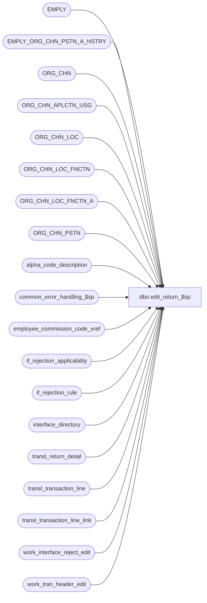

# dbo.edit_return_$sp

**Database:** auditworks  
**Server:** bedrockdb01  

## Architecture Diagram



## Table Dependencies

| Referenced Table |
|---|
| EMPLY |
| EMPLY_ORG_CHN_PSTN_A_HSTRY |
| ORG_CHN |
| ORG_CHN_APLCTN_USG |
| ORG_CHN_LOC |
| ORG_CHN_LOC_FNCTN |
| ORG_CHN_LOC_FNCTN_A |
| ORG_CHN_PSTN |
| alpha_code_description |
| common_error_handling_$sp |
| employee_commission_code_xref |
| if_rejection_applicability |
| if_rejection_rule |
| interface_directory |
| transl_return_detail |
| transl_transaction_line |
| transl_transaction_line_link |
| work_interface_reject_edit |
| work_tran_header_edit |

## Stored Procedure Code

```sql
CREATE proc  dbo.edit_return_$sp
    @errmsg nvarchar(2000) OUTPUT,
    @edit_process_no	tinyint = 1
AS

/* Proc Name : edit_return_$sp
   Desc: (EDIT) to post return details.
         Called by edit_post_$sp.
   Unicode version.

HISTORY
Date     Name           Def# Desc
Jun15,16 Vicci      DAOM-937 Ignore invalid return_detail.return_from_date.
Dec17,14 Paul          94103 use try catch, fixed alias on join
Mar06,12 Phu          133439 Fix error: Invalid column name 'transaction_date' when validating Invalid home store for original salesperson.
Apr19,11 Vicci        105917 Make I/F reject logging for original salesperson1 and 2 attibutes consistent with that of salesperson 1 and 2 (see edit_emp_attribute_$sp).  Note:  return attachment's original date is not used in ECP and therefore not use here either.
May14,08 Vicci        101197 Support effective date in commission code assigment.
Oct09,07 Paul          91935 Apply 90420 to SA5
Jul19,07 Phu         DV-1364 Apply 85598, 87372, 89485 to SA5. Validate employee attributes for original salesperson (reject reasons 38-41).
                             Reject reasons 21-37 are done in edit_emp_attribute_$sp.
Oct25,06 Phu           77931 Fix outer join for SQL 2005 Mode 90.
Jun21,05 Paul        DV-1282 return earlier if no rows found, move some logic from edit_lines_$sp
Apr29,05 Paul        DV-1234 expand transaction_id to use tran_id_datatype
Feb10,05 Paul        DV-1203 change datatypes in temp table to match CDM datatypes
Dec14,04 Maryam      DV-1191 Improve performance.
Nov17,04 Maryam      DV-1167 Check for EMPLY active flag.
Oct28,04 David       DV-1159 Check for ORG_CHN active flag. 
Aug23,04 Sab	     DV-1120 Remove local variable @aplctn_id and aplctn_id in auditwork_parameter since we hardcode aplctn_id to 300.
May18,04 David       DV-1071 Use ORG_CHN table instead of store_salesaudit, replace employee table with EMPLY
Aug07,07 Phu           90420 Log employee to memo1 and employee attribute to memo2.
Jul16,07 Phu           87372 Validate I/F rejects 38-41 for original_salesperson/2 in return_detail. 21-37 are done in edit_emp_attribute_$sp.
May16,06 Daphna        68317 use if_rejection_applicability to determine which validations to perform 
                             (remove references to interface_directory_lookup)
Sep15,03 ShuZ        1-G7A5F Remove all references to the interface_directory '... _check' 
                             fields from stored procedures/triggers and replace with usage 
                             of if_rejection_applicability table.
Nov26,01 Winnie	     1-969YY Add logic for R3 error handling to pass @edit_process_no
Nov01,01 ShuZ		8900 TRANSL edit changes for Sybase, move insert return_detail
                             to edit_insert_header_lines
Jun01,00 John G  	5678 Break down employee_no_check into component parts.
Aug23,99 Paul		4818 improve performance by avoiding an update
Apr30,98 Yin
         Paul		author
*/

DECLARE @cashier_check			tinyint,
	@employee_no_check		tinyint,
	@errmsg2			nvarchar(2000),
	@errline			int,
	@errno				int,
	@payroll_employee_check		tinyint,
	@purchasing_employee_check	tinyint,
	@rows				int,
	@store_check			tinyint,
	@message_id			int,	
	@object_name			nvarchar(255),	
	@operation_name			nvarchar(100),
	@process_name			nvarchar(100),
	@base				numeric(4,0),
	@emp_attr_need_validation	nchar(4), -- for 4 validations
	@reject_diff			tinyint,
	@if_reject_reason			tinyint,
	@reject_index			tinyint;

SET CONCAT_NULL_YIELDS_NULL OFF;

SELECT 	@process_name = 'edit_return_$sp',
        @message_id = 201068,
        @base = 10,
        @reject_diff = 37; -- do not change values

BEGIN TRY

	SELECT @errmsg = 'Failed to update transl_return_detail',
               @object_name = 'transl_return_detail',
               @operation_name = 'UPDATE';
UPDATE transl_return_detail
  SET transaction_id = wh.transaction_id
  FROM transl_return_detail rd , work_tran_header_edit wh WITH (NOLOCK)
 WHERE rd.transaction_no = wh.transaction_no
   AND rd.store_no = wh.store_no
   AND rd.register_no = wh.register_no
   AND rd.entry_date_time = wh.entry_date_time
   AND rd.transaction_series = wh.transaction_series;

SELECT @rows = @@rowcount;

IF @rows = 0
  RETURN;

	SELECT @errmsg = 'Failed to create temp table #return_temp',
               @object_name = '#return_temp',
               @operation_name = 'CREATE TABLE';
CREATE TABLE #return_temp(transaction_id numeric(14,0) not null, -- tran_id_datatype
	                  line_id numeric(5,0) not null,
	                  original_salesperson int null,
	                  original_salesperson2 int null,
	                  return_from_store int null,
	                  salesperson_on_file int null, --T_LONG_INTEGER
	                  salesperson2_on_file int not null,
	                  transaction_date smalldatetime not null,
	                  return_date datetime null);

    SELECT @errmsg = 'Failed to update lookup_store',
           @object_name = 'transl_transaction_line',
           @operation_name = 'UPDATE';
UPDATE transl_transaction_line
   SET lookup_store = return_from_store
FROM  transl_return_detail rd WITH (NOLOCK), ORG_CHN_APLCTN_USG ss,
        transl_transaction_line tl, ORG_CHN c
 WHERE rd.return_from_store IS NOT NULL  
   AND rd.return_from_store = ss.ORG_CHN_NUM 
   AND ss.APLCTN_ID = 300
   AND ss.VLDTY = 1
   AND ss.ORG_CHN_NUM = c.ORG_CHN_NUM
   AND c.ACTV = 1
   AND rd.store_no = tl.store_no
   AND rd.register_no = tl.register_no
   AND rd.entry_date_time = tl.entry_date_time
   AND rd.transaction_no = tl.transaction_no
   AND rd.transaction_series = tl.transaction_series
   AND (rd.line_id = tl.line_id OR rd.line_id = 0);

    SELECT @errmsg = 'Failed to update lookup_store via transaction line link',
           @object_name = 'transl_transaction_line',
           @operation_name = 'UPDATE';
UPDATE transl_transaction_line
   SET lookup_store = return_from_store
  FROM  transl_return_detail rd WITH (NOLOCK),
        transl_transaction_line_link k WITH (NOLOCK),
        ORG_CHN_APLCTN_USG ss,
        transl_transaction_line tl,
        ORG_CHN c 
 WHERE rd.return_from_store IS NOT NULL  
   AND rd.return_from_store = ss.ORG_CHN_NUM 
   AND ss.APLCTN_ID = 300
   AND ss.VLDTY = 1
   AND ss.ORG_CHN_NUM = c.ORG_CHN_NUM
   AND c.ACTV = 1
   AND k.store_no = rd.store_no
   AND k.register_no = rd.register_no
   AND k.entry_date_time = rd.entry_date_time
   AND k.transaction_no = rd.transaction_no
   AND k.transaction_series = rd.transaction_series
   AND k.linked_line_id = rd.line_id   
   AND k.store_no = tl.store_no
   AND k.register_no = tl.register_no
   AND k.entry_date_time = tl.entry_date_time
   AND k.transaction_no = tl.transaction_no
   AND k.transaction_series = tl.transaction_series
   AND k.line_id = tl.line_id;

	SELECT @errmsg = 'Failed to insert into temp table #return_temp',
               @object_name = '#return_temp',
               @operation_name = 'INSERT';
INSERT INTO #return_temp(
       transaction_id,
       line_id,
       original_salesperson,
       original_salesperson2,
       return_from_store,
       salesperson_on_file,
       salesperson2_on_file,
       transaction_date,
       return_date )
SELECT rd.transaction_id,
       rd.line_id,
       rd.original_salesperson,
       rd.original_salesperson2,
       rd.return_from_store,
       SIGN(ISNULL(e.EMPLY_NUM, 0)),
       1,
       wh.transaction_date,
       IsNull(CASE WHEN rd.return_from_date > dateadd(dd, 1, getdate()) THEN NULL ELSE rd.return_from_date END, wh.transaction_date)
  FROM transl_return_detail rd WITH (NOLOCK)
       INNER JOIN work_tran_header_edit wh WITH (NOLOCK) ON (     rd.transaction_no = wh.transaction_no
                                                              AND rd.store_no = wh.store_no
                                                   AND rd.register_no = wh.register_no
                                                              AND rd.entry_date_time = wh.entry_date_time
                                                              AND rd.transaction_series = wh.transaction_series)
     LEFT JOIN EMPLY e ON (rd.original_salesperson = e.EMPLY_NUM AND e.ACTV = 1)
 WHERE rd.transaction_id IS NOT NULL;

	SELECT @errmsg = 'Failed to select employee_check',
         @object_name = 'if_rejection_applicability',
               @operation_name = 'SELECT';
SELECT @employee_no_check = ISNULL(MAX(ir.if_rejection_reason), 0)
FROM if_rejection_rule ir, if_rejection_applicability ia
WHERE ir.if_rejection_reason IN (38, 39, 40, 41, 81)
  AND ISNULL(ir.active_rejection_rule,1) = 1 
  AND ir.if_rejection_reason = ia.if_reject_reason;

     SELECT @errmsg = 'Failed to select store_check';
SELECT @store_check = ISNULL(MAX(ir.if_rejection_reason), 0)
FROM if_rejection_rule ir, if_rejection_applicability ia
WHERE ir.if_rejection_reason = 9 -- Invalid original (return-from) store num
  AND ISNULL(ir.active_rejection_rule,1) = 1 
  AND ir.if_rejection_reason = ia.if_reject_reason;

/* check whether salesperson is on file */

IF @employee_no_check >= 1
  BEGIN
		SELECT @errmsg = 'Failed to update #return_temp',
                       @object_name = '#return_temp',
                       @operation_name = 'UPDATE';
	UPDATE #return_temp
	   SET salesperson2_on_file = 0
	 WHERE original_salesperson2 >= 1;

	SELECT @rows = @@rowcount;

	IF @rows >= 1
	  BEGIN
		SELECT @errmsg = 'Failed to update #return_temp (2)';
	   UPDATE #return_temp
	    SET salesperson2_on_file = 1
	     FROM #return_temp rt, EMPLY e WITH (NOLOCK)
	    WHERE rt.original_salesperson2 >= 1
	      AND rt.original_salesperson2 = e.EMPLY_NUM
	      AND e.ACTV = 1;
	  END; /* If @rows >= 1 */

  END; /* If @employee_no_check >= 1 */

IF @store_check >= 1
BEGIN
	  SELECT @errmsg = 'Failed to insert rows into work_interface_reject_edit',
                 @object_name = 'work_interface_reject_edit',
                 @operation_name = 'INSERT';
  INSERT work_interface_reject_edit (
	if_reject_reason,
	transaction_id,
	line_id )
  SELECT 9, 
	 rd.transaction_id,
	 rd.line_id
    FROM transl_return_detail rd WITH (NOLOCK)
   WHERE rd.return_from_store IS NOT NULL 
     AND rd.transaction_id IS NOT NULL 
     AND NOT EXISTS (  SELECT 1 FROM ORG_CHN_APLCTN_USG ss, ORG_CHN c
                        WHERE rd.return_from_store = ss.ORG_CHN_NUM
                          AND ss.ORG_CHN_NUM = c.ORG_CHN_NUM
                          AND ss.APLCTN_ID = 300
                          AND ss.VLDTY = 1
                          AND c.ACTV = 1  );
END;  /* If @store_check >= 1 */

IF @employee_no_check = 81
BEGIN
	    SELECT @errmsg = 'Failed to insert rows into work_interface_reject_edit',
                 @object_name = 'work_interface_reject_edit',
                 @operation_name = 'INSERT';
	INSERT work_interface_reject_edit (
		if_reject_reason,
		transaction_id,
		line_id,
		memo1,
		memo2)
	SELECT 81,
		transaction_id,
		line_id,
		CASE WHEN salesperson_on_file = 0 
		     THEN original_salesperson 
		     ELSE CASE WHEN salesperson2_on_file = 0
		               THEN original_salesperson2 
		               ELSE NULL 
		          END 
		END,
		CASE WHEN salesperson_on_file = 0 
		     THEN CASE WHEN salesperson2_on_file = 0 
		               THEN original_salesperson2 
		               ELSE NULL 
		          END
		     ELSE NULL 
		END 
	  FROM #return_temp
	 WHERE original_salesperson >= 1
	   AND (salesperson_on_file = 0 OR salesperson2_on_file = 0);
END; -- IF @employee_no_check = 81

-- Validate reject reasons 38 to 41 only. 21 to 37 are validated in edit_emp_attribute_$sp
SELECT @errmsg = 'Failed to select emp_attr_need_validation',
                 @object_name = 'if_rejection_rule',
                 @operation_name = 'SELECT';

SELECT @emp_attr_need_validation = REVERSE(RIGHT('0000' + LTRIM(STR(SUM(POWER(@base, CONVERT(numeric(4,0), ISNULL(ir.if_rejection_reason - @reject_diff, 1)) - 1)), 4, 0)), 4))
  FROM if_rejection_rule ir
WHERE ir.if_rejection_reason >= 38
AND ir.if_rejection_reason <= 41
AND ISNULL(ir.active_rejection_rule,1) = 1
AND EXISTS (SELECT 1 FROM if_rejection_applicability ia, interface_directory id
            WHERE ir.if_rejection_reason = ia.if_reject_reason
            AND ia.interface_id = id.interface_id
            AND id.update_timing > 0);

IF CONVERT(numeric(4,0), @emp_attr_need_validation) = 0
  RETURN;

SELECT @reject_index = 0,
       @object_name = 'work_interface_reject_edit',
       @operation_name = 'INSERT';

WHILE @reject_index < 4
BEGIN
  SELECT @reject_index = @reject_index + 1;
  IF SUBSTRING(@emp_attr_need_validation, @reject_index, 1) = '0'
    CONTINUE;  

  SELECT @if_reject_reason = @reject_diff + @reject_index;

  -- Invalid commission code for original salesperson
  -- make sure either original_salesperson or original_salesperson2 (not both) is logged for the same transaction_id, line_id.
  IF @if_reject_reason = 38
  BEGIN
        SELECT @errmsg = 'Failed to insert for invalid commission code for original_salesperson',
             @object_name = 'work_interface_reject_edit',
             @operation_name = 'INSERT';
    INSERT work_interface_reject_edit (
      if_reject_reason,
      transaction_id,
      line_id,
      memo1,
      memo2 )
    SELECT @if_reject_reason,
      t.transaction_id,
      t.line_id,
      -- if original_salesperson is on file and original_salesperson2 is NOT on file then memo1 contains original_salesperson.
      -- if original_salesperson is NOT on file and original_salesperson2 is on file then memo1 contains original_salesperson2.
      -- if both original_salesperson and original_salesperson2 are on file then memo1 contains original_salesperson.
      -- if both original_salesperson and original_salesperson2 are NOT on file then WHERE clause will exclude it.
      CASE WHEN (t.salesperson_on_file > 0 AND a.code IS NULL) THEN t.original_salesperson ELSE t.original_salesperson2 END, 
      CASE WHEN (t.salesperson_on_file > 0 AND a.code IS NULL) THEN x.employee_commission_code ELSE x2.employee_commission_code END 
    FROM #return_temp t 
         LEFT OUTER JOIN employee_commission_code_xref x WITH (NOLOCK)
           ON t.original_salesperson = x.employee_no
          AND t.transaction_date >= x.effective_from_date AND (t.transaction_date <= x.effective_to_date OR x.effective_to_date IS NULL)
         LEFT OUTER JOIN alpha_code_description a WITH (NOLOCK)
           ON a.code_type = 15
          AND a.code_status = 'U'
          AND a.code >= '-1'
          AND x.employee_commission_code = a.code
         LEFT OUTER JOIN employee_commission_code_xref x2 WITH (NOLOCK)
           ON t.original_salesperson2 = x2.employee_no
          AND t.transaction_date >= x2.effective_from_date AND (t.transaction_date <= x2.effective_to_date OR x2.effective_to_date IS NULL)
         LEFT OUTER JOIN alpha_code_description a2 WITH (NOLOCK)
           ON a2.code_type = 15
          AND a2.code_status = 'U'
          AND a2.code >= '-1'
          AND x2.employee_commission_code = a2.code
    WHERE (   (t.salesperson_on_file > 0 AND a.code IS NULL)
           OR (t.salesperson2_on_file > 0 AND t.original_salesperson2 IS NOT NULL AND a2.code IS NULL));

  END; -- IF @if_reject_reason = 38


  -- Invalid primary position for original salesperson
  -- make sure either original_salesperson or original_salesperson2 (not both) is logged for the same transaction_id, line_id.
  ELSE IF @if_reject_reason = 39
  BEGIN
        SELECT @errmsg = 'Failed to insert for invalid primary position for original_salesperson';
    INSERT work_interface_reject_edit (
      if_reject_reason,
      transaction_id,
      line_id,
      memo1,
      memo2 )
    SELECT @if_reject_reason,
      t.transaction_id,
      t.line_id,
      -- if original_salesperson is on file and original_salesperson2 is NOT on file then memo1 contains original_salesperson.
      -- if original_salesperson is NOT on file and original_salesperson2 is on file then memo1 contains original_salesperson2.
      -- if both original_salesperson and original_salesperson2 are on file then memo1 contains original_salesperson.
      -- if both original_salesperson and original_salesperson2 are NOT on file then WHERE clause will exclude the trans.
      CASE WHEN (t.salesperson_on_file > 0 AND ocp.PSTN_CODE IS NULL) THEN CONVERT(nvarchar, t.original_salesperson) ELSE CONVERT(nvarchar, t.original_salesperson2) END,
      CASE WHEN (t.salesperson_on_file > 0 AND ocp.PSTN_CODE IS NULL) THEN a.PSTN_CODE ELSE a2.PSTN_CODE END 
    FROM #return_temp t
         LEFT OUTER JOIN EMPLY_ORG_CHN_PSTN_A_HSTRY a WITH (NOLOCK)
           ON t.salesperson_on_file > 0
          AND t.original_salesperson = a.EMPLY_NUM
          AND t.transaction_date >= a.EFCTV_DATE AND (t.transaction_date < a.EXPRTN_DATE OR a.EXPRTN_DATE IS NULL)
          AND a.PRMRY_LOC_A = 1 
         LEFT OUTER JOIN ORG_CHN_PSTN ocp WITH (NOLOCK)
           ON a.PSTN_CODE = ocp.PSTN_CODE
         LEFT OUTER JOIN EMPLY_ORG_CHN_PSTN_A_HSTRY a2 WITH (NOLOCK)
           ON t.salesperson2_on_file > 0 AND t.original_salesperson2 IS NOT NULL
          AND t.original_salesperson2 = a2.EMPLY_NUM
          AND t.transaction_date >= a2.EFCTV_DATE AND (t.transaction_date < a2.EXPRTN_DATE OR a2.EXPRTN_DATE IS NULL)
          AND a2.PRMRY_LOC_A = 1 
         LEFT OUTER JOIN ORG_CHN_PSTN ocp2 WITH (NOLOCK)
           ON a2.PSTN_CODE = ocp2.PSTN_CODE
    WHERE (   (t.salesperson_on_file > 0 AND ocp.PSTN_CODE IS NULL) 
           OR (t.salesperson2_on_file = 1 AND t.original_salesperson2 IS NOT NULL AND ocp2.PSTN_CODE IS NULL));

  END; -- IF @if_reject_reason = 39


  -- Invalid primary selling area for original salesperson
  ELSE IF @if_reject_reason = 40
  BEGIN
        SELECT @errmsg = 'Failed to insert for invalid primary selling area for original_salesperson';
    INSERT work_interface_reject_edit (
      if_reject_reason,
      transaction_id,
      line_id,
      memo1,
      memo2 )
    SELECT DISTINCT @if_reject_reason,
      rt.transaction_id,
      rt.line_id,
      CONVERT(nvarchar, rt.original_salesperson),
      CONVERT(nvarchar, oclfx.FNCTN_NUM) -- different than 4.1
    FROM #return_temp rt
         LEFT OUTER JOIN EMPLY_ORG_CHN_PSTN_A_HSTRY a WITH (NOLOCK)
           ON rt.original_salesperson = a.EMPLY_NUM
          AND rt.transaction_date >= a.EFCTV_DATE AND (rt.transaction_date < a.EXPRTN_DATE OR a.EXPRTN_DATE IS NULL)
          AND a.PRMRY_LOC_A = 1 
         LEFT OUTER JOIN ORG_CHN_LOC ocl WITH (NOLOCK)
           ON a.PRMRY_LOC_ID = ocl.LOC_ID
         LEFT OUTER JOIN ORG_CHN_LOC_FNCTN_A oclfx WITH (NOLOCK)
           ON ocl.LOC_ID = oclfx.LOC_ID
          AND oclfx.PRMRY_LOC_FNCTN_A = 1
         LEFT OUTER JOIN ORG_CHN_LOC_FNCTN oclf WITH (NOLOCK)
           ON oclfx.FNCTN_NUM = oclf.FNCTN_NUM
          AND oclf.SYS_CODE = 'DISP'
    WHERE rt.salesperson_on_file > 0
      AND oclf.FNCTN_NUM IS NULL;

    -- IF rt.transaction_date < e.EFCTV_DATE OR rt.transaction_date > a.EXPRTN_DATE,
    -- then it is logged as invalid primary position for original_salesperson number I/F reject.


    -- make sure either original_salesperson or original_salesperson2 (not both) is logged for the same transaction_id, line_id.
         SELECT @errmsg = 'Failed to insert for invalid primary selling area for original_salesperson2';
    INSERT work_interface_reject_edit (
      if_reject_reason,
      transaction_id,
      line_id,
      memo1,
      memo2 )
    SELECT @if_reject_reason,
      rt.transaction_id,
      rt.line_id,
      CONVERT(nvarchar, rt.original_salesperson2),
      CONVERT(nvarchar, oclfx.FNCTN_NUM) -- different than 4.1
    FROM #return_temp rt
         LEFT OUTER JOIN EMPLY_ORG_CHN_PSTN_A_HSTRY a WITH (NOLOCK)
           ON rt.original_salesperson2 = a.EMPLY_NUM
          AND rt.transaction_date >= a.EFCTV_DATE AND (rt.transaction_date < a.EXPRTN_DATE OR a.EXPRTN_DATE IS NULL)
          AND a.PRMRY_LOC_A = 1 
         LEFT OUTER JOIN ORG_CHN_LOC ocl WITH (NOLOCK)
           ON a.PRMRY_LOC_ID = ocl.LOC_ID
         LEFT OUTER JOIN ORG_CHN_LOC_FNCTN_A oclfx WITH (NOLOCK)
           ON ocl.LOC_ID = oclfx.LOC_ID
          AND oclfx.PRMRY_LOC_FNCTN_A = 1
         LEFT OUTER JOIN ORG_CHN_LOC_FNCTN oclf WITH (NOLOCK)
           ON oclfx.FNCTN_NUM = oclf.FNCTN_NUM
          AND oclf.SYS_CODE = 'DISP'
    WHERE rt.salesperson2_on_file  = 1
      AND rt.original_salesperson2 IS NOT NULL -- make sure that original_salesperson2 is provided
      AND oclf.FNCTN_NUM IS NULL
      AND NOT EXISTS (SELECT 1 FROM work_interface_reject_edit w
                       WHERE w.if_reject_reason = @if_reject_reason
                         AND w.transaction_id = rt.transaction_id
                         AND w.line_id = rt.line_id);

  END; -- IF @if_reject_reason = 40

  -- Invalid home store for original salesperson
  ELSE IF @if_reject_reason = 41
  BEGIN
         SELECT @errmsg = 'Failed to insert for invalid home store for original_salesperson';
    INSERT work_interface_reject_edit (
      if_reject_reason,
      transaction_id,
      line_id,
      memo1,
      memo2 )
    SELECT @if_reject_reason,
     rt.transaction_id,
      rt.line_id,
      CONVERT(nvarchar, rt.original_salesperson),
      CONVERT(nvarchar, COALESCE(a.ORG_CHN_NUM, e.PRMY_ORG_CHN_NUM))
    FROM #return_temp rt
         INNER JOIN EMPLY e WITH (NOLOCK)  -- need to join EMPLY to get PRMY_ORG_CHN_NUM
            ON rt.original_salesperson = e.EMPLY_NUM 
          LEFT OUTER JOIN EMPLY_ORG_CHN_PSTN_A_HSTRY a WITH (NOLOCK)
           ON e.EMPLY_NUM = a.EMPLY_NUM
          AND rt.transaction_date >= a.EFCTV_DATE AND (rt.transaction_date < a.EXPRTN_DATE OR a.EXPRTN_DATE IS NULL)
          AND a.PRMRY_LOC_A = 1 
         LEFT OUTER JOIN ORG_CHN oc WITH (NOLOCK)
           ON COALESCE(a.ORG_CHN_NUM, e.PRMY_ORG_CHN_NUM) = oc.ORG_CHN_NUM
    WHERE rt.salesperson_on_file > 0
      AND oc.ORG_CHN_NUM IS NULL;

    -- make sure either original_salesperson or original_salesperson2 (not both) is logged for the same transaction_id, line_id.
         SELECT @errmsg = 'Failed to insert for invalid home store for original_salesperson2';
    INSERT work_interface_reject_edit (
      if_reject_reason,
      transaction_id,
      line_id,
      memo1,
      memo2 )
    SELECT @if_reject_reason,
      rt.transaction_id,
      rt.line_id,
      CONVERT(nvarchar, rt.original_salesperson2),
      CONVERT(nvarchar, COALESCE(a.ORG_CHN_NUM, e.PRMY_ORG_CHN_NUM))
    FROM #return_temp rt
         INNER JOIN EMPLY e WITH (NOLOCK)  -- need to join EMPLY to get PRMY_ORG_CHN_NUM
            ON rt.original_salesperson2 = e.EMPLY_NUM 
          LEFT OUTER JOIN EMPLY_ORG_CHN_PSTN_A_HSTRY a WITH (NOLOCK)
           ON e.EMPLY_NUM = a.EMPLY_NUM
          AND rt.transaction_date >= a.EFCTV_DATE AND (rt.transaction_date < a.EXPRTN_DATE OR a.EXPRTN_DATE IS NULL)
          AND a.PRMRY_LOC_A = 1 
         LEFT OUTER JOIN ORG_CHN oc WITH (NOLOCK)
           ON COALESCE(a.ORG_CHN_NUM, e.PRMY_ORG_CHN_NUM) = oc.ORG_CHN_NUM
    WHERE rt.salesperson2_on_file > 0
      AND rt.original_salesperson2 IS NOT NULL -- make sure that original_salesperson2 is provided
      AND oc.ORG_CHN_NUM IS NULL;

  END; -- IF @if_reject_reason = 41

END; -- WHILE @reject_index < 4


RETURN;


business_error:   /* Business Rule handler. */

	SELECT @errmsg2 = @errmsg;

	/* Could include similar cleanup code to system error trap when needed (example is from move_store_$sp).
	   However, could also exclude the cleanup code here since the outer system error catch should fire again after the exec below. */

	EXEC common_error_handling_$sp 4, @errno, @errmsg, 0, @message_id, 
	  @process_name, @object_name, @operation_name, 1, @edit_process_no;
	  /* Note: when the exec above raises an error, that action also fires the system error trap (below) */
	RETURN;
END TRY

BEGIN CATCH; -- trap system errors
    /* common error handling. Appending proc name here because a rollback could occur if called within a transaction. */

        SELECT @errno = ERROR_NUMBER(),
		@errline = ERROR_LINE();

        SELECT @errmsg = CONVERT(nvarchar, @errno) + ':' + @process_name + ':' + CONVERT(nvarchar, @errline) + ':'
               + COALESCE(@errmsg, ' ') + ':' + ERROR_MESSAGE();

	 /* this condition will only be true when raise error in traps above fire this general catch */
	IF @errmsg2 IS NOT NULL
	  SELECT @errmsg = @errmsg2;

	EXEC common_error_handling_$sp 4, @errno, @errmsg, 0, @message_id, 
	  @process_name, @object_name, @operation_name, 1, @edit_process_no;

	RETURN;
END CATCH;
```

