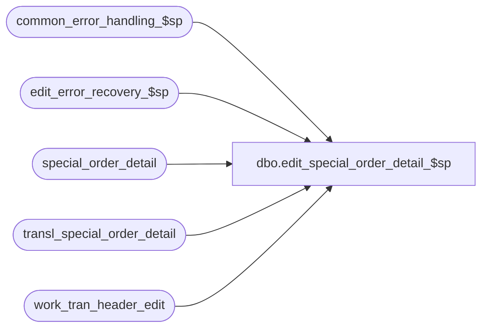

# dbo.edit_special_order_detail_$sp

**Database:** auditworks  
**Server:** bedrockdb01  

## Architecture Diagram



## Table Dependencies

| Referenced Table |
|---|
| common_error_handling_$sp |
| edit_error_recovery_$sp |
| special_order_detail |
| transl_special_order_detail |
| work_tran_header_edit |

## Stored Procedure Code

```sql
create proc dbo.edit_special_order_detail_$sp 

 
@errmsg           nvarchar(2000) OUTPUT,
@edit_process_no  tinyint = 1
AS

/* Proc Name: edit_special_order_detail_$sp
   Desc: (EDIT) to post special order details.
    Called by edit_post_$sp. 

HISTORY
Date     Name           Def# Desc
Dec12,14 Paul      TFS-94103 use try catch
Dec14,01 Maryam      DV-1191 Improve performance.
Nov26,01 Winnie      1-969YY Add logic for R3 error handling
Apr07,97 Paul                author
*/

/* insert non duplicate transactions only */
DECLARE @errno 			int,
	@errmsg2			nvarchar(2000),
	@errline			int,
	@retry 			tinyint,
	@object_name		nvarchar(255),
	@process_name		nvarchar(100),
	@operation_name		nvarchar(100),
	@message_id		int;

SELECT @retry = 0,
       @process_name = 'edit_special_order_detail_$sp',
       @message_id = 201068;

BEGIN TRY

WHILE @retry <= 1
BEGIN

      SELECT @errmsg = 'Failed to insert rows into special_order_detail',
             @object_name = 'special_order_detail',
	    @operation_name = 'INSERT',
	    @errno = 0;
BEGIN TRY
INSERT special_order_detail (
	transaction_id,
	line_id,
	units,
	salesperson,
	merchandise_description,
	expecting_delivery_on,
	color_description,
	size_description,
	width_description,
	vendor_name,
	vendor_style_description,
	spo_class_description,
	vendor_no )
SELECT
	transaction_id,
	line_id,
	units * units_sign,
	salesperson,
	merchandise_description,
	expecting_delivery_on,
	color_description,
	size_description,
	width_description,
	vendor_name,
	vendor_style_description,
	spo_class_description,
	vendor_no
  FROM  transl_special_order_detail so WITH (NOLOCK), work_tran_header_edit wh WITH (NOLOCK)
  WHERE wh.store_no = so.store_no
   AND  wh.register_no = so.register_no
   AND  wh.entry_date_time = so.entry_date_time
   AND  wh.transaction_series = so.transaction_series
   AND  wh.transaction_no = so.transaction_no;

  SELECT @retry = 2;
END TRY
BEGIN CATCH;
        SELECT @errno = ERROR_NUMBER(),
		@errline = ERROR_LINE();

        SELECT @errmsg = CONVERT(nvarchar, @errno) + ':' + @process_name + ':' + CONVERT(nvarchar, @errline) + ':'
               + COALESCE(@errmsg, ' ') + ':' + ERROR_MESSAGE();
END CATCH;

IF @errno != 0
  BEGIN
   IF @errno = 2601 /* duplicate key */
     AND @retry = 0
     BEGIN
          SELECT @errmsg = 'Failed to execute stored proc edit_error_recovery_$sp',
		@object_name = 'edit_error_recovery_$sp',
	         @operation_name = 'EXECUTE';
      EXEC edit_error_recovery_$sp 44, @edit_process_no;

      SELECT @retry = @retry + 1; /* retry only once */
     END
   ELSE
      GOTO business_error;
  END;

END; /* While @retry <= 1 */

RETURN;


business_error:   /* Business Rule handler. */

	SELECT @errmsg2 = @errmsg;

	/* Could include similar cleanup code to system error trap when needed (example is from move_store_$sp).
	   However, could also exclude the cleanup code here since the outer system error catch should fire again after the exec below. */

	EXEC common_error_handling_$sp 4, @errno, @errmsg, 0, @message_id, 
	  @process_name, @object_name, @operation_name, 1, @edit_process_no;
	  /* Note: when the exec above raises an error, that action also fires the system error trap (below) */
	RETURN;
END TRY

BEGIN CATCH; -- trap system errors
    /* common error handling. Appending proc name here because a rollback could occur if called within a transaction. */

        SELECT @errno = ERROR_NUMBER(),
		@errline = ERROR_LINE();

        SELECT @errmsg = CONVERT(nvarchar, @errno) + ':' + @process_name + ':' + CONVERT(nvarchar, @errline) + ':'
               + COALESCE(@errmsg, ' ') + ':' + ERROR_MESSAGE();

	 /* this condition will only be true when raise error in traps above fire this general catch */
	IF @errmsg2 IS NOT NULL
	  SELECT @errmsg = @errmsg2;

	EXEC common_error_handling_$sp 4, @errno, @errmsg, 0, @message_id, 
	  @process_name, @object_name, @operation_name, 1, @edit_process_no;

	RETURN;
END CATCH;
```

