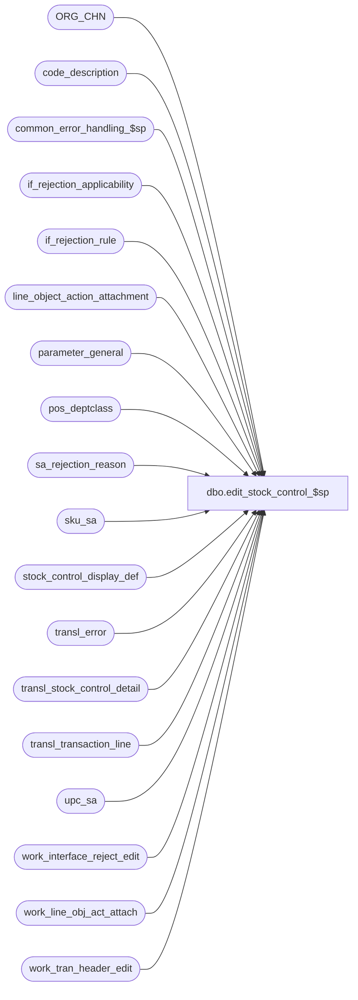

# dbo.edit_stock_control_$sp

**Database:** auditworks  
**Server:** bedrockdb01  

## Architecture Diagram



## Table Dependencies

| Referenced Table |
|---|
| ORG_CHN |
| code_description |
| common_error_handling_$sp |
| if_rejection_applicability |
| if_rejection_rule |
| line_object_action_attachment |
| parameter_general |
| pos_deptclass |
| sa_rejection_reason |
| sku_sa |
| stock_control_display_def |
| transl_error |
| transl_stock_control_detail |
| transl_transaction_line |
| upc_sa |
| work_interface_reject_edit |
| work_line_obj_act_attach |
| work_tran_header_edit |

## Stored Procedure Code

```sql
CREATE proc [dbo].[edit_stock_control_$sp] @errmsg 		nvarchar(2000) OUTPUT,
@edit_process_no	tinyint = 1

AS

/* Proc Name: edit_stock_control_$sp
   Desc: (EDIT) post stock control details.
   Called by edit_post_$sp. 

HISTORY
Date     Name		Def# Desc
Apr06,17 Kiri      DAOM-2051 Allow a merchant to post sales to Merch based on fulfillment store. A sub-ledger segment has been configured to use posting method 25, 'Post to fulfillment store if the fulfillment store is a selling location, otherwise post to the originating store'
Apr08,16 Vicci      DAOM-359 Perform UPC Lookup when UPC Lookup Division is > 0 regardless of whether or not validations are active.
Oct29,14 Vicci     TFS-88852 Added force order hint to the update from sku_sa in order to force work table to be looked up in resolved view and 
                             avoid the extreme performance degradation resulting from the default behaviour which is to join the work table to
                             user_upc on lookup division alone then look up that horribly magnified output in user_pos_identifier.
Oct14,14 Vicci     TFS-88637 If document set to expire prior to its issuance date or beyond 06/06/2079, reject as translate error and remove expiry.
Sep23,13 Vicci        146826 Take pos_identifier_type into account when more than 1 has been defined, and support SQL 2012.
May12,10 Vicci        117827 Avoid setting upc_lookup_division randomly when more than 1 stock control attachment has
			     been configured as applying to the line;  Avoid error 2601 (dup) when a transaction has
			     both a stock control attachment with a null display-def and one with a set display-def and
			     the Edit is attempting to set the null to the value from the attachment lookup which matches
			     the value already set in the other attachment.
			     Also, do not do UPC lookup for attachments where UPC lookup division is not > 0 (performance);
			     Remove the "if upc_lookup_division is null then default to 1" since null is not allowed in obj/act attachment table
			     and we are only updating if found.
Aug08,08 Paul          87777 modified logic to resemble SA4.1, code reviewed
May25,07 Paul        DV-1363 apply defect 87002, 79437, 68317 to SA5
Jun14,06 Tim	     DV-1339 replace active_rejection_rule with ISNULL(active_rejection_rule,1)
Dec12,05 Paul        DV-1325 applied 64621 to SA5. added comments.
Oct03,05 Paul          60471 apply 60822, 60984 to SA5
Sep12,05 Paul        DV-1312 improve performance by removing joins to transl_transaction_line and removing temp tables
Jun20,05 Paul          54934 apply 54931, 29369 to SA5
Apr29,05 David       DV-1202 Log S/A reject 18 - Display definition auto-configuration pending approval. 
                             Handle the change in primary key of stock_control_detail, expand transaction_id to use tran_id_datatype (Paul)
Feb10,05 Paul        DV-1203 change datatypes in temp table to match CDM datatypes
Dec14,04 Maryam      DV-1191 Improve performance.
Dec02,04 Sab	     DV-1181 Changed join to use work_tran_header_edit instead of transl_transaction_hdr, added nolock hints
Oct28,04 David       DV-1159 Check for ORG_CHN active flag. 
Aug23,04 Sab         DV-1120 Remove local variable @aplctn_id and aplctn_id in auditwork_parameter since we hardcode aplctn_id to 300.
May18,04 David       DV-1071 Use ORG_CHN table instead of store_salesaudit
May25,07 Paul          87002 improve performance by using work_tran_header_edit
Nov06.06 Daphna        79437 Ensure NULL upc_no rejects when sku_lookup_method = 0
May16,06 Daphna        68317 use if_rejection_applicability to determine which validations to perform 
                              (remove references to interface_directory_lookup)
Dec12,05 Paul          64621 return if no rows exist, added comments
Sep30,05 David         60984 Added Distinct to insert to sa_rejection_reason.
Sep26,05 David         60822 Check if display_def_id already set by translate.
May27,05 Daphna        54931 Log SA reject for mandatory fields that are not populated    
Dec06,04 Daphna        29369 Check stores against store_sa (warehouse "stores" may not be
                              set up in store_salesaudit), allow store_no = 0
                              Validate for header_level attachments (line_id = 0)
                              Validate for store_no NOT NULL depending on mandatory check  
Nov17,03 Phu           15801 Set sku_id, style_reference_id
Sep15,03 ShuZ        1-G7A5F Remove all references to the interface_directory '... _check' 
                              fields from stored procedures/triggers and replace with usage 
                              of if_rejection_applicability table.
Jul10,03 Maryam      1-KL08H Set display definition id on header level attachments.     
Sep06,02 HenryW	     1-F7IF1 Correct join between transl_stock_control_detail and transl_transaction_line,
			      so that the index is being used correctly on transl_transaction_line.
Aug16,02 HenryW	     1-AUHY5 Add validation of Stock Originating Store. I/F reject reason = 111.
Jun03,02 Vicci	     1-DESPL Add display_def_id to stock_control_detail
Jan18,02 Vicci	     1-A9Z28 Correct join to line_object_action_attachment to take new 
			     transaction_category into account.
Nov26,01 Winnie	     1-969YY Add logic for R3 error handling to pass @edit_process_no 
Nov01,01 ShuZ		8900 TRANSL edit changes for Sybase
Sep24,01 ShuZ           8288 Add an originating_store_no to the stock_control_detail table for use
                              when head-office(or another store) enters a transacion on behalf of another store
Jul04,01 Phu		8160 Log if_reject_reason 10 (invalid stock control store number) instead of 4 (Invalid employee number)
Jun06,01 Phu		7214 Assign new if_reject_reason 89 and 90 for Stock POS Identifier and Stock Pos Deptclass not on file
Apr20,01 Phu/Paul	7452 Retrieve upc_lookup_division from line_object_action_attachment table
Apr19,01 Winnie		7173 To properly set the default for pos_identifier_type in merchandise detail.
Feb27,01 Vicci		7373 Create upc not on file rejects for those using pos_identifier as well.
Sep13,00 Sab		6720 If no rows exists stock_control_detail, then exit the proc
May17,00 Louise	 	6294 added join on upc_lookup_division. This is defaulted to 1 as MeW does
			      not have nonsale and MeW's upcs have a upc_lookup_division of 2.
Jul07,96 Paul                author
*/
    
DECLARE @errno			int,
	@retry			tinyint,
	@rows			int,
	@rows_sa_reject		int,
	@sku_lookup_method	tinyint,
	@message_id		int,	
	@object_name		nvarchar(255),	
	@operation_name		nvarchar(100),
	@process_name		nvarchar(100),
	@multiple_pos_id_types_exist	tinyint,
	@errmsg2		nvarchar(2000);

SELECT  @process_name = 'edit_stock_control_$sp',
	@message_id = 201068;

BEGIN TRY 

SELECT @errmsg = 'Failed to determine if multiple POS Identifier Types have been defined. ',
       @object_name = 'code_description',
       @operation_name = 'SELECT';
SELECT @multiple_pos_id_types_exist = CASE WHEN COUNT(1) > 1 THEN 1 ELSE 0 END
  FROM code_description
 WHERE code_type = 68
   AND code > 0  --(don't count the 'please log what has been given in the pos_identifier field to the upc_no field instead' request)
   AND code <> 100  --(C/L ref# reassignment)
   AND active_flag = 1;

SELECT @errmsg = 'Failed to determine applicable SKU lookup method. ',
       @object_name = 'parameter_general';
SELECT @sku_lookup_method = sku_lookup_method
  FROM parameter_general; 

SELECT @errmsg = 'Failed to set transaction_id in transl_stock_control_detail. ',
       @object_name = 'transl_stock_control_detail',
       @operation_name = 'UPDATE';
UPDATE transl_stock_control_detail
   SET transaction_id = wh.transaction_id
  FROM transl_stock_control_detail sc, work_tran_header_edit wh WITH (NOLOCK)
 WHERE sc.store_no = wh.store_no
   AND sc.register_no = wh.register_no
   AND sc.entry_date_time = wh.entry_date_time
   AND sc.transaction_no = wh.transaction_no
   AND sc.transaction_series = wh.transaction_series;

SELECT @rows = @@rowcount;

IF @rows = 0 -- no rows will be inserted later
  RETURN;


SELECT @errmsg = 'Failed to clean up listing of stock_control_detail attachments whose display_def_id needs setting. ',
       @object_name = 'work_line_obj_act_attach',
       @operation_name = 'TRUNCATE';
TRUNCATE TABLE work_line_obj_act_attach;
    
SELECT @rows = 0;

-- for line level attachments
SELECT @errmsg = 'Failed to prepare list of stock control detail line-level attachments whose display_def_id needs setting. ',
       @object_name = 'work_line_obj_act_attach',
       @operation_name = 'INSERT';
INSERT INTO work_line_obj_act_attach(
 transaction_id,
       line_id,
       note_type)
SELECT sc.transaction_id,
       sc.line_id,
       MAX(la.note_type)
  FROM transl_stock_control_detail sc,
       transl_transaction_line tl,
       line_object_action_attachment la
 WHERE tl.store_no = sc.store_no
   AND tl.register_no = sc.register_no
   AND tl.entry_date_time = sc.entry_date_time
   AND tl.transaction_series = sc.transaction_series
   AND tl.transaction_no = sc.transaction_no
   AND tl.transaction_id = sc.transaction_id
   AND tl.line_id = sc.line_id
   AND sc.display_def_id IS NULL
   AND sc.line_id > 0 
   AND tl.line_object = la.line_object
   AND tl.line_action = la.line_action
   AND tl.transaction_category = ISNULL(la.transaction_category, tl.transaction_category)
   AND la.attachment_type = 3
   AND tl.transaction_id >= 1
 GROUP BY sc.transaction_id, sc.line_id; 
SELECT @rows = @@rowcount;

-- for header level attachments
SELECT @errmsg = 'Failed to prepare list of stock control detail header-level attachments whose display_def_id needs setting. ',
       @object_name = 'work_line_obj_act_attach',
       @operation_name = 'INSERT';
INSERT INTO work_line_obj_act_attach(  
       transaction_id,
       line_id,
       note_type)
SELECT sc.transaction_id,
       sc.line_id,
       MAX(la.note_type)
FROM transl_stock_control_detail sc,
       work_tran_header_edit th,
       line_object_action_attachment la
 WHERE sc.line_id = 0
   AND sc.display_def_id IS NULL -- only where not already set by translate
   AND sc.transaction_id >= 1
   AND sc.store_no = th.store_no
   AND sc.register_no = th.register_no
   AND sc.entry_date_time = th.entry_date_time
   AND sc.transaction_series = th.transaction_series
   AND sc.transaction_no = th.transaction_no
   AND th.transaction_category = ISNULL(la.transaction_category, th.transaction_category)
   AND la.attachment_type = 3
   AND la.line_object = -1
 GROUP BY sc.transaction_id, sc.line_id; 

SELECT @rows = @rows + @@rowcount;
   
IF @rows > 0  --i.e. there are rows that need their display_def_id updated
BEGIN 	 
  
  BEGIN TRY 
    SELECT @errmsg = 'Failed to set display_def_id of stock_control_detail attachment. ',
           @object_name = 'transl_stock_control_detail',
           @operation_name = 'UPDATE';
    UPDATE transl_stock_control_detail
       SET display_def_id = w.note_type
      FROM transl_stock_control_detail sc,
           work_line_obj_act_attach w
     WHERE sc.transaction_id = w.transaction_id
       AND sc.line_id = w.line_id
       AND sc.display_def_id IS NULL;
  END TRY

  BEGIN CATCH
    SELECT @errno = ERROR_NUMBER();
    IF @errno = 2601 --duplicates
    BEGIN
      BEGIN TRY
        SELECT @errmsg = 'Failed to delete from list the Display Definition ID updates which would result in duplicates. ',
               @object_name = 'work_line_obj_act_attach',
               @operation_name = 'DELETE';
        DELETE work_line_obj_act_attach
          FROM transl_stock_control_detail sc
         WHERE sc.transaction_id = work_line_obj_act_attach.transaction_id
           AND sc.line_id = work_line_obj_act_attach.line_id
           AND sc.display_def_id = work_line_obj_act_attach.note_type;

        SELECT @errmsg = 'Failed to set Display Definition ID in Stock Control Detail Information Set attachment (2). ',
               @object_name = 'transl_stock_control_detail',
               @operation_name = 'UPDATE';
        UPDATE transl_stock_control_detail
           SET display_def_id = w.note_type
          FROM transl_stock_control_detail sc,
               work_line_obj_act_attach w
         WHERE sc.transaction_id = w.transaction_id
           AND sc.line_id = w.line_id
           AND sc.display_def_id IS NULL;

         PRINT NCHAR(13) + NCHAR(10) + ':LOG EXECWARN: The Translate output Stock Control Detail attachments with missing Display Def ID which could not be auto-correct by the Edit ';
     END TRY
       BEGIN CATCH
         GOTO general_error;
       END CATCH;
    END;  --IF @errno = 2601
    ELSE  --ELSE of IF @errno = 2601
    BEGIN
      GOTO general_error;
    END
  END CATCH;
  
  SELECT @errmsg = 'Failed to clean up listing of stock_control_detail attachments whose display_def_id needs setting (2). ',
         @object_name = 'work_line_obj_act_attach',
         @operation_name = 'TRUNCATE'; 
  TRUNCATE TABLE work_line_obj_act_attach;

END;  --IF @rows > 0  --i.e. there are rows that need their display_def_id updated

SELECT @errmsg = 'Failed to set UPC lookup division in Stock Control Detail Information Set attachment. ',
       @object_name = 'transl_stock_control_detail',
       @operation_name = 'UPDATE';
UPDATE transl_stock_control_detail
   SET upc_lookup_division = la.upc_lookup_division
  FROM transl_stock_control_detail sc,
       transl_transaction_line tl,
       line_object_action_attachment la
 WHERE tl.store_no = sc.store_no
   AND tl.register_no = sc.register_no
   AND tl.entry_date_time = sc.entry_date_time
   AND tl.transaction_series = sc.transaction_series
   AND tl.transaction_no = sc.transaction_no
   AND tl.transaction_id = sc.transaction_id
   AND tl.line_id = sc.line_id
   AND tl.line_object = la.line_object
   AND tl.line_action = la.line_action
   AND tl.transaction_category = ISNULL(la.transaction_category, tl.transaction_category)
   AND la.attachment_type = 3
   AND la.upc_lookup_division > 0  --don't set if 0 so that we can get row count of UPC lookups required
   AND sc.display_def_id = la.note_type
   AND tl.transaction_id >= 1;
   
SELECT @rows = @@rowcount;

IF @rows > 0 --i.e. if any attachments with UPC Lookup exist
BEGIN    
  IF @sku_lookup_method >= 1
  BEGIN
    SELECT @errmsg = 'Failed to update transl_stock_control_detail (sku). ',
           @object_name = 'transl_stock_control_detail',
           @operation_name = 'UPDATE'; 
    UPDATE transl_stock_control_detail
       SET upc_no = ss.upc_no
      FROM transl_stock_control_detail sc, sku_sa ss
     WHERE sc.upc_lookup_division > 0
       AND sc.upc_no = 0
       AND sc.pos_identifier != '0'
       AND sc.pos_identifier = ss.sku
       AND (sc.pos_identifier_type = ss.pos_identifier_type OR @multiple_pos_id_types_exist = 0)
       AND sc.upc_lookup_division = ss.upc_lookup_division
    OPTION (FORCE ORDER);

    IF @sku_lookup_method = 2
    BEGIN
      SELECT @errmsg = 'Failed to update transl_stock_control_detail (pos_deptclass). ';
      UPDATE transl_stock_control_detail
         SET upc_no = replace_upc_no
        FROM transl_stock_control_detail sc, pos_deptclass dc 
       WHERE sc.upc_lookup_division > 0
         AND sc.upc_no = 0
         AND sc.pos_identifier = '0'
         AND sc.pos_deptclass != 0
         AND sc.pos_deptclass = dc.pos_deptclass
         AND sc.upc_lookup_division = dc.upc_lookup_division;
    END; /* @sku_lookup_method = 2 */
  END; /* @sku_lookup_method >= 1 */
  
  SELECT @errmsg = 'Failed to update transl_stock_control_detail. ',
         @object_name = 'transl_stock_control_detail',
         @operation_name = 'UPDATE'; 
  UPDATE transl_stock_control_detail
     SET upc_on_file_flag = 1,
         sku_id = us.sku_id,
         style_reference_id = us.style_reference_id
    FROM transl_stock_control_detail sc, upc_sa us
   WHERE sc.upc_lookup_division > 0
    AND sc.upc_no >= 1
     AND sc.upc_no = us.upc_no
     AND sc.upc_lookup_division = us.upc_lookup_division;

  IF EXISTS (SELECT ia.interface_id
               FROM if_rejection_rule ir, if_rejection_applicability ia
              WHERE ir.if_rejection_reason IN (5,89,90)
                AND ISNULL(ir.active_rejection_rule,1) = 1
                AND ir.if_rejection_reason = ia.if_reject_reason )
  BEGIN /* can't use outer join because of join in upc_sa */
    SELECT @errmsg = 'Failed to insert rows into work_interface_reject_edit for if_reject_reason = 5. ',
           @object_name = 'work_interface_reject_edit',
           @operation_name = 'INSERT'; 
    INSERT work_interface_reject_edit (
	   if_reject_reason,
	   transaction_id,
	   line_id,
	   memo1 )
    SELECT DISTINCT
	   5,  --  STOCK UPC NOT ON FILE
	   transaction_id,
	   line_id,
	   CONVERT(nvarchar,upc_no)
      FROM transl_stock_control_detail WITH (NOLOCK)
     WHERE upc_on_file_flag IS NULL -- 
       AND upc_lookup_division >= 1
       AND (upc_no != 0 OR  upc_no IS NULL OR @sku_lookup_method = 0)
       AND transaction_id IS NOT NULL; --

    IF @sku_lookup_method IN (1, 2)
    BEGIN
      SELECT @errmsg = 'Failed to insert rows into work_interface_reject_edit for if_reject_reason = 89. ',
             @object_name = 'work_interface_reject_edit',
             @operation_name = 'INSERT'; 
      INSERT work_interface_reject_edit (
	     if_reject_reason,
	     transaction_id,
	     line_id )
      SELECT DISTINCT 89,   -- STOCK SKU NOT ON FILE
	     transaction_id,
	    line_id
	FROM transl_stock_control_detail WITH (NOLOCK)
       WHERE upc_on_file_flag IS NULL --
	 AND transaction_id IS NOT NULL --
	 AND upc_lookup_division >= 1
	 AND upc_no = 0
	 AND (pos_identifier <> '0' OR pos_identifier IS NULL OR @sku_lookup_method = 1);
    END;  -- if @sku_lookup_method IN (1, 2)

    IF @sku_lookup_method = 2
    BEGIN
      SELECT @errmsg = 'Failed to insert rows into work_interface_reject_edit for if_reject_reason = 90. ',
             @object_name = 'work_interface_reject_edit',
             @operation_name = 'INSERT'; 
      INSERT work_interface_reject_edit (
	     if_reject_reason,
	     transaction_id,
	     line_id )
      SELECT DISTINCT
	     90,   -- STOCK DEPTCLASS NOT ON FILE 
	     transaction_id,
	     line_id
        FROM transl_stock_control_detail WITH (NOLOCK)
       WHERE upc_on_file_flag IS NULL --not on file
         AND transaction_id IS NOT NULL  --
         AND upc_lookup_division >= 1
         AND upc_no = 0
         AND pos_identifier = '0';
    END;  -- if @sku_lookup_method = 2
  END;  -- if if_rejection_reason IN (5,89,90) are turned on 
END; --IF @rows > 0 --i.e. if any attachments with UPC Lookup exist
  
-- SA reject missing mandatory field
SELECT @errmsg = 'Failed to insert SA Rej 32. ',
       @object_name = 'sa_rejection_reason',
       @operation_name = 'INSERT'; 
INSERT INTO sa_rejection_reason (transaction_id, line_id, violated_sareject_rule)
SELECT DISTINCT sc.transaction_id, line_id, 32
  FROM transl_stock_control_detail sc,
       stock_control_display_def sd
 WHERE sc.transaction_id IS NOT NULL -- 
   AND sc.display_def_id = sd.display_def_id
   AND ( (sd.merchandise_key_mandatory = 1 AND sc.merchandise_key IS NULL)
        OR (sd.units_mandatory = 1 AND sc.units IS NULL)
    OR (sd.other_store_no_mandatory = 1 AND sc.other_store_no IS NULL)
        OR (sd.location_no_mandatory = 1 AND sc.location_no IS NULL)
        OR (sd.vendor_no_mandatory = 1 AND sc.vendor_no IS NULL)
        OR (sd.count_date_mandatory = 1 AND sc.count_date IS NULL)
    OR (sd.pos_identifier_mandatory = 1 AND sc.pos_identifier IS NULL)
        OR (sd.pos_id_type_mandatory = 1 AND sc.pos_identifier_type IS NULL)
        OR (sd.pos_deptclass_mandatory = 1 AND sc.pos_deptclass IS NULL)
        OR (sd.upc_division_mandatory = 1 AND sc.upc_lookup_division IS NULL)
        OR (sd.originating_str_mandatory = 1 AND sc.originating_store_no IS NULL)
        OR (sd.imrd_mandatory = 1 AND sc.imrd IS NULL)
        OR( sd.reason_mandatory = 1 AND sc.reason IS NULL)      
       );

SELECT @rows_sa_reject = @@rowcount;

-- S/A Reject 18 - Display definition auto-configuration pending approval
SELECT @errmsg = 'Failed to insert SA Rej 18. ';
INSERT INTO sa_rejection_reason (
	    transaction_id,
	    line_id,
	    violated_sareject_rule,
	    transaction_category)
     SELECT DISTINCT tl.transaction_id,
	    tl.line_id,
	    18, 
	    wh.transaction_category
       FROM work_tran_header_edit wh WITH (NOLOCK), transl_stock_control_detail tl WITH (NOLOCK)
      WHERE wh.transaction_void_flag IN (0,8)
	AND wh.store_no = tl.store_no
	AND wh.register_no = tl.register_no
	AND wh.entry_date_time = tl.entry_date_time
	AND wh.transaction_series = tl.transaction_series
	AND wh.transaction_no = tl.transaction_no
	AND tl.transaction_id IS NOT NULL -- 
        AND tl.auto_config_verified = 0; -- pending approval

IF @rows_sa_reject > 0
BEGIN -- avoid creating these types of sa rejects when transaction is void
  SELECT @errmsg = 'Failed to delete SA Rej 32.  ',
         @object_name = 'sa_rejection_reason',
         @operation_name = 'DELETE'; 
  DELETE sa_rejection_reason
    FROM sa_rejection_reason sr, work_tran_header_edit th
   WHERE sr.violated_sareject_rule = 32
     AND sr.transaction_id = th.transaction_id
     AND th.transaction_void_flag NOT IN (0,8);
  /* sa_reject flag in work_tran_header_edit is updated later in edit_lines_validation */
END; -- If @rows_sa_reject > 0

-- For SA5, simplified logic because no join is needed to transl_transaction_line.
-- i/f rejects for void lines are removed later in edit_interfaces_$sp

IF EXISTS ( SELECT ia.interface_id
              FROM if_rejection_rule ir, if_rejection_applicability ia
             WHERE ir.if_rejection_reason = 10
               AND ISNULL(ir.active_rejection_rule,1) = 1
               AND ir.if_rejection_reason = ia.if_reject_reason )          
BEGIN -- Validation of other_store at header and line levels
   /* Oracle will update store_on_file_flag instead */
  SELECT @errmsg = 'Failed to insert rows for I/F reject 10. ',
         @object_name = 'work_interface_reject_edit',
         @operation_name = 'INSERT'; 
  INSERT work_interface_reject_edit (
 	 if_reject_reason,
	 transaction_id,
	 line_id,
	 memo1 )
  SELECT 10,
	 transaction_id,
	 line_id,
	 CONVERT(nvarchar,other_store_no)
    FROM transl_stock_control_detail WITH (NOLOCK)
   WHERE transaction_id IS NOT NULL --
     AND other_store_no IS NOT NULL --
     AND other_store_no NOT IN (SELECT ORG_CHN_NUM FROM ORG_CHN WITH (NOLOCK) WHERE ACTV = 1)
     AND display_def_id IN (SELECT display_def_id
         		      FROM stock_control_display_def 
         		     WHERE other_store_validation = 1
         		       AND other_store_no_fe_resource_id > 0);

  SELECT @errmsg = 'I/F reject 10 other_store_no_mandatory. ',
         @object_name = 'work_interface_reject_edit',
         @operation_name = 'INSERT';
  INSERT work_interface_reject_edit(
         if_reject_reason, transaction_id, line_id )
  SELECT 10, sc.transaction_id, sc.line_id
    FROM transl_stock_control_detail sc WITH (NOLOCK)
   WHERE sc.transaction_id IS NOT NULL --
     AND sc.other_store_no IS NULL --
     AND display_def_id IN (SELECT display_def_id
		              FROM stock_control_display_def 
		             WHERE other_store_no_mandatory = 1
		               AND other_store_no_fe_resource_id > 0);
END; /* If exists ... if_reject_reason = 10 */

-- Validation of Stock Originating Store

IF EXISTS ( SELECT 1
              FROM if_rejection_rule ir, if_rejection_applicability ia
             WHERE ir.if_rejection_reason = 111
               AND ISNULL(ir.active_rejection_rule, 1) = 1
AND ir.if_rejection_reason = ia.if_reject_reason )
BEGIN
  SELECT @errmsg = 'Failed to insert rows for I/F reject 111. ',
	 @object_name = 'work_interface_reject_edit',
 	 @operation_name = 'INSERT';
  INSERT work_interface_reject_edit
         (if_reject_reason, transaction_id, line_id, memo1)
  SELECT 111, transaction_id, line_id, CONVERT(nvarchar,originating_store_no)
    FROM transl_stock_control_detail WITH (NOLOCK)
   WHERE transaction_id IS NOT NULL --
     AND originating_store_no IS NOT NULL -- 
     AND originating_store_no NOT IN (SELECT ORG_CHN_NUM FROM ORG_CHN WITH (NOLOCK) WHERE ACTV = 1)
     AND display_def_id IN (SELECT display_def_id
       			FROM stock_control_display_def 
         		WHERE original_store_validation = 1
         		AND originating_str_fe_resource_id > 0); 

  SELECT @errmsg = 'I/F reject 111, originating_store_mandatory';
  INSERT work_interface_reject_edit (if_reject_reason, transaction_id, line_id)
  SELECT 111, sc.transaction_id, sc.line_id
    FROM transl_stock_control_detail sc WITH (NOLOCK)
   WHERE sc.transaction_id IS NOT NULL --
     AND sc.originating_store_no IS NULL -- 
     AND display_def_id IN (SELECT display_def_id
        			FROM stock_control_display_def 
         			WHERE originating_str_mandatory = 1
         			AND originating_str_fe_resource_id > 0);
END;  -- IF EXISTS ... if_rejection_reason = 111

-- Translate reject 31 POS data-value is out of range (expiry date validation)
SELECT @errmsg = 'Failed to insert Translate reject 31. ',
       @object_name = 'transl_error',
       @operation_name = 'INSERT'; 
INSERT transl_error (
 	   store_no,
	   register_no,
	   entry_date_time,
	   transaction_series,
	   transaction_no,
	   line_id,
	   output_file_code,
	   output_file_column,
	   transl_reject_reason,  
	   posting_start_date_time,
	   posting_end_date_time,
	   transl_error_msg,
	   bad_data_output)
SELECT DISTINCT sc.store_no,
	   sc.register_no,
	   sc.entry_date_time,
	   sc.transaction_series,
	   sc.transaction_no,
	   sc.line_id,
	   'S', --transl_stock_control_detail
	   9,  --units
	   31, --POS data-value is out of range
	   getdate(),
	   getdate(),
	   CASE WHEN sc.units < 0 THEN 'Expiry date cannot be earlier than issuance date.  ' ELSE 'Expiry date cannot be set to date beyond June 6th 2079.  ' END + 'Will be treated as having no expiry date.',
	   CONVERT(nvarchar, sc.units)
  FROM transl_stock_control_detail sc
 WHERE sc.transaction_id IS NOT NULL -- 
   AND sc.display_def_id = 31
   AND ( sc.units < 0 OR dateadd(dd, sc.units, COALESCE(sc.count_date, sc.entry_date_time)) > '06/06/2079');
SELECT @rows = @@rowcount;

IF @rows > 0
BEGIN
  SELECT @errmsg = 'Failed to auto-correct invalid expiry date. ',
         @object_name = 'transl_stock_control_detail',
         @operation_name = 'UPDATE'; 
  UPDATE transl_stock_control_detail
     SET units = null
   WHERE transaction_id IS NOT NULL -- 
     AND display_def_id = 31
     AND ( units < 0 OR dateadd(dd, units, COALESCE(count_date, entry_date_time)) > '06/06/2079');
END;  --IF @rows > 0, i.e. invalid expiry date

-- set flag that indicates whether the fulfillment location was defined as a selling location in CRDM. 
SELECT @errmsg = 'Failed to set store_on_file_flag for returns',
       @object_name = 'transl_stock_control_detail',
       @operation_name = 'UPDATE'; 
UPDATE tsc
   SET store_on_file_flag = 1
  FROM  transl_stock_control_detail tsc
	 INNER JOIN  transl_transaction_line tl ON tl.store_no = tsc.store_no 
			AND tl.register_no = tsc.register_no 
			AND tl.entry_date_time = tsc.entry_date_time 
			AND tl.transaction_series = tsc.transaction_series 
			AND tl.transaction_no = tsc.transaction_no    
			AND tl.line_id = tsc.line_id
			AND tl.transaction_id >= 1
			AND tl.line_action = 99 
	 INNER JOIN ORG_CHN s ON tsc.location_no = s.ORG_CHN_NUM
			AND s.SLNG_FLAG = 1
	WHERE tsc.display_def_id = 31


SELECT @errmsg = 'Failed to set store_on_file_flag for orders delivered or picked up',
       @object_name = 'transl_stock_control_detail',
       @operation_name = 'UPDATE'; 
UPDATE tsc
   SET store_on_file_flag = 1
  FROM  transl_stock_control_detail tsc
	 INNER JOIN  transl_transaction_line tl ON tl.store_no = tsc.store_no 
			AND tl.register_no = tsc.register_no 
			AND tl.entry_date_time = tsc.entry_date_time 
			AND tl.transaction_series = tsc.transaction_series 
			AND tl.transaction_no = tsc.transaction_no    
			AND tl.line_id = tsc.line_id
			AND tl.transaction_id >= 1
            AND tl.line_action IN (90, 142)
	 INNER JOIN ORG_CHN s ON tsc.other_store_no = s.ORG_CHN_NUM
			AND s.SLNG_FLAG = 1
	WHERE 	tsc.display_def_id = 31

SELECT @rows = 0;

RETURN;

general_error:
  SELECT @errno = ERROR_NUMBER(),
         @errmsg2 = @process_name + ':  ' + COALESCE(@errmsg, '') + ERROR_MESSAGE() + ' Line: ' + CONVERT(nvarchar, ERROR_LINE());
  EXEC common_error_handling_$sp 4, @errno, @errmsg2, 0, @message_id, @process_name, @object_name, @operation_name, 1, @edit_process_no;
  RETURN;

END TRY

BEGIN CATCH
  SELECT @errno = ERROR_NUMBER();
  IF @errmsg2 IS NULL
  BEGIN
    SELECT @errmsg2 = @process_name + ':  ' + COALESCE(@errmsg, '') + ERROR_MESSAGE() + ' Line: ' + CONVERT(nvarchar, ERROR_LINE());
  END;
  SELECT @errmsg = @errmsg2;  
  EXEC common_error_handling_$sp 4, @errno, @errmsg2, 0, @message_id, @process_name, @object_name, @operation_name, 1, @edit_process_no;
  
  RETURN;
END CATCH;
```

